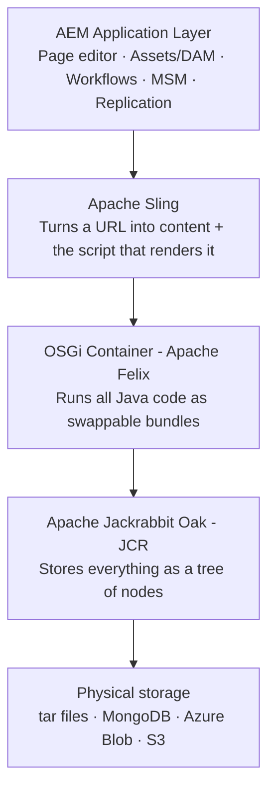
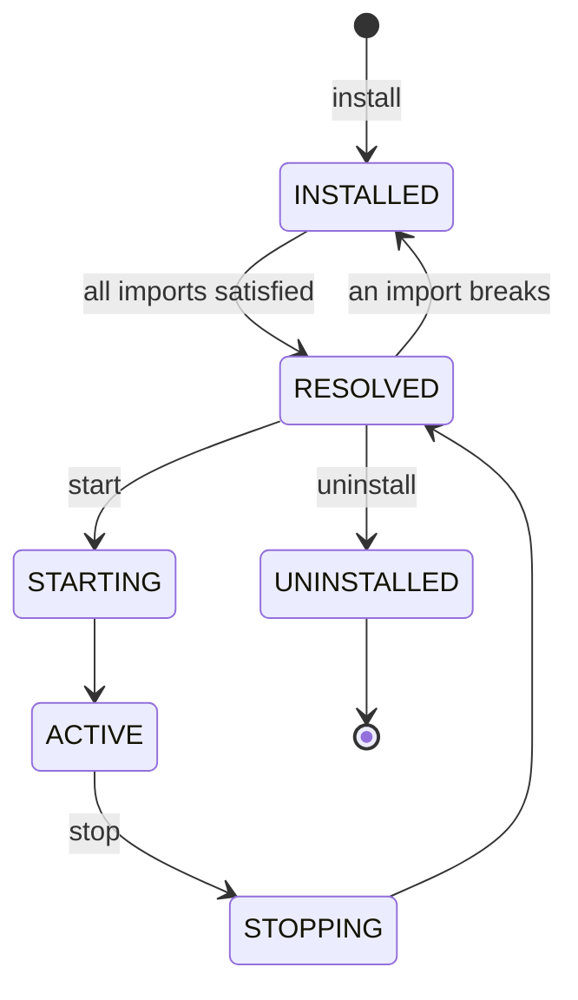
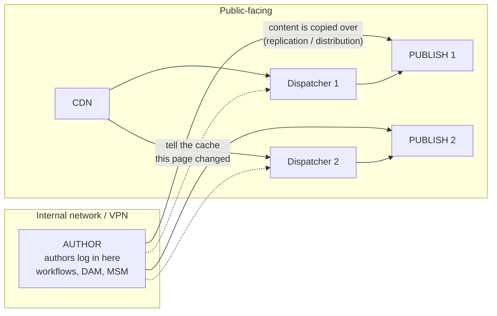
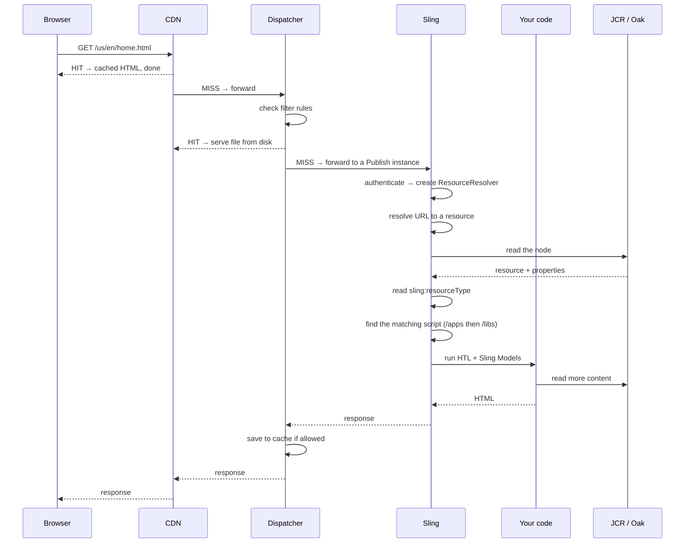
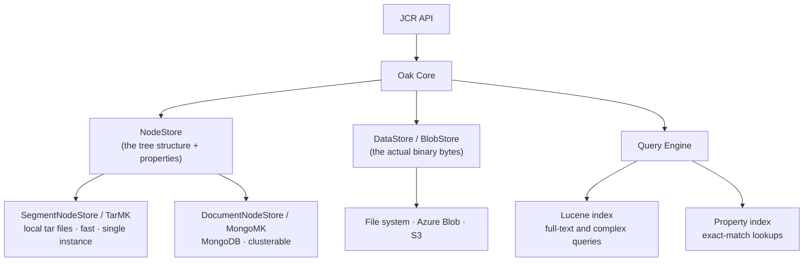
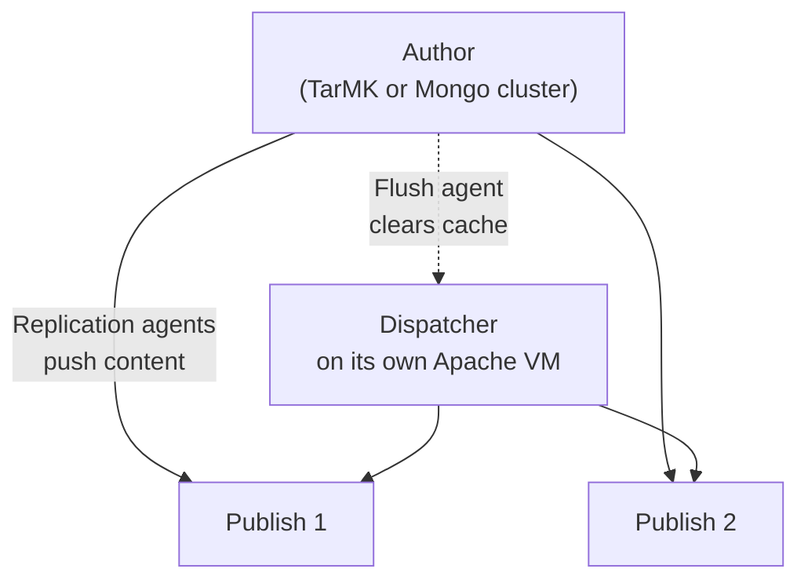
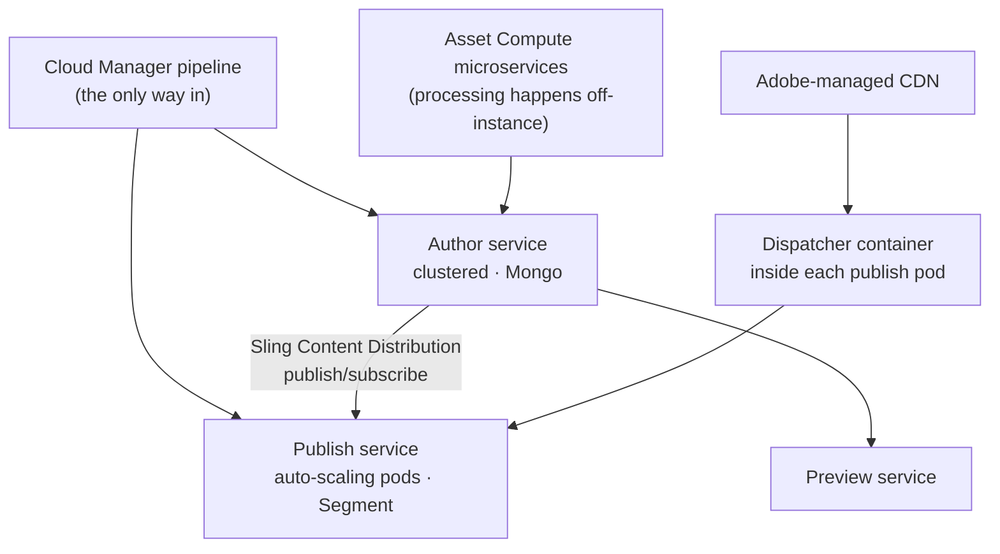

# 01 – AEM Architecture *(v2 — teaching style)*

> **Target:** 3–4 years experienced AEM Developer
> **Companies:** Valtech, Publicis Sapient, Deloitte Digital, Cognizant, Accenture, TCS, Capgemini, Infosys, Wipro, IBM, Adobe, HCL, LTIMindtree, Tech Mahindra, Persistent, Mphasis

---

## Before we start — why this topic decides your interview

Almost every AEM interview opens with some version of *"Explain AEM architecture"* or *"Walk me through your project setup."*

Interviewers do this on purpose. They are not testing whether you memorised four layer names. They are checking something else: **do you understand how the pieces fit, or did you only ever work inside one small box?**

A developer who has only copied existing components will describe AEM as "a CMS where we make components." A developer who actually understands the platform will tell you where the content lives, how a request travels, and why the code they wrote runs at all.

The good news is that this is the most *learnable* topic in the entire syllabus. It is mostly understanding, not memorisation. Once it clicks, it stays.

So take this file slowly. Every later file — Sling Models, servlets, clientlibs, templates — assumes you understand what is here.

---

## 1. Introduction

### 1.1 What actually is AEM?

Let me start by clearing up the most common misunderstanding.

AEM is **not one program**. It is a stack of four separate technologies stacked on top of each other, and Adobe packaged them together and put their own features on top.

Why does this matter? Because when something breaks in AEM, the error usually comes from one specific layer. If you know the layers, you know where to look. If you don't, every problem feels random.

Here are the four layers, from the bottom up:

**Layer 1 — Apache Jackrabbit Oak (the content repository).**
This is where everything is stored. Not in tables like MySQL, but in a **tree**, like folders on your laptop. Your pages, your images, your users, even your configuration settings — all of it lives in this tree as "nodes."

**Layer 2 — Apache Felix (the OSGi container).**
This runs your Java code. But it is smarter than a normal Java application. It lets you deploy a piece of code, replace it, or switch it off *while the server keeps running*. Nothing else needs to restart.

**Layer 3 — Apache Sling (the web framework).**
This is the piece that turns a web request into a web page. When someone opens a URL, Sling figures out which content they asked for, and then figures out which code should render it.

**Layer 4 — AEM itself (the application).**
Everything Adobe built on top: the page editor, the Assets/DAM console, workflows, Multi Site Manager, replication, and so on.

Here it is as a picture:



**Now, how do you say this in an interview?**

Don't just list the four names. Interviewers hear that all day. Say it like this instead:

> "AEM is a stack rather than a single product. At the bottom is a content repository — Apache Jackrabbit Oak — which stores everything as a tree of nodes rather than in tables. Above that is an OSGi container, Apache Felix, which runs all the Java code as bundles that can be deployed and swapped without restarting the server. On top of that runs Apache Sling, which is the web framework — its job is to take a URL, find the matching content node, and then decide which script should render it. And AEM is Adobe's application layer on top of all three: the page editor, DAM, workflows, MSM."

That is roughly 30 seconds and it already tells the interviewer you understand *what each layer is for*, not just its name.

### 1.2 Why do companies use AEM?

You will be asked this, usually phrased as *"Why AEM and not WordPress?"* Here is how to think about it.

**Everything lives in one place.** Pages, images, users, and configuration are all in the same repository, reachable through the same API. In most other systems, pages are in a database, images are on a file server, and users are somewhere else again. In AEM, reading a page and reading a user is the same kind of operation.

**Authors and visitors are separated.** Content authors work on a completely different server from the one the public sees. This is a security decision as much as a workflow one — the machine where people log in and edit is never exposed to the internet.

**Code can be changed without downtime.** Because of OSGi, you can deploy a bundle and it activates immediately.

**Content is reusable across channels.** The same content can render as a web page, or be delivered as JSON to a mobile app. This is what "headless" means, and it is a big reason enterprises pick AEM today.

**It plugs into the rest of Adobe.** Analytics, Target, Campaign, Launch — these connect natively. For a company already paying for Adobe Experience Cloud, this is often the deciding factor.

### 1.3 When should you *not* use AEM?

This question comes up in senior rounds, and candidates usually panic because they think it is a trap. It is not. It is checking whether you have judgment.

Honest answer: a small site with ten pages and one author does not need AEM. The licence costs a fortune, the infrastructure is heavy, and you need skilled developers to maintain it. WordPress or a static site would do the job at a fraction of the cost.

AEM earns its price when you have **many authors, many languages, many brands, or a lot of digital assets** — because that is where its multi-site, translation and DAM features save real money.

### 1.4 A real project description you can adapt

Interviewers almost always follow "explain AEM architecture" with "and how is *your* project set up?" Have one paragraph ready:

> "In my current project we run a multi-brand insurance site on AEM as a Cloud Service. There is one Author tier where around 60 content authors work, and content is distributed out to an auto-scaling Publish tier. Dispatcher and Adobe's managed CDN sit in front of Publish. We serve 5 countries and 9 language variants, all built as MSM live copies from a single blueprint. The code is a standard Maven multi-module project and everything deploys through Cloud Manager pipelines."

That is 40 seconds and it answers a question the interviewer hasn't even asked yet — scale.

> ### ⚠️ An important note about the "real project" stories in this repository
>
> Throughout these files you will see paragraphs beginning *"In my project we..."*. **Treat every one of them as a template, not a script.**
>
> Interviewers at companies like Publicis Sapient and Valtech will drill three or four levels into any story you tell. If you say you fixed a caching problem, the next four questions will be about statfiles, hit ratios, and what you measured. If the story isn't yours, you will be exposed in under two minutes, and that is far more damaging than simply not having the experience.
>
> So use these as **shapes** — the structure of a good answer — and fill them with things you have genuinely done: WKND tutorial work, a proof-of-concept you built, or a production incident you helped diagnose in your support role. Support experience is real experience. "I investigated a stale-content issue and traced it to a blocked replication queue" is a strong, honest, technical story.

---

## 2. Core Concepts

### 2.1 JCR — understanding the repository

Let's start with the layer everything else sits on.

**The mental model:** think of your laptop's file system. Folders inside folders, and files inside those. Now imagine that every folder can *also* hold data directly — not just contain files, but have its own properties like a title, an author, a date.

That is the JCR. In JCR language:

- A folder-or-file is called a **node**.
- The data attached to a node is called a **property**.
- Every node has a **primary type** that says what kind of node it is.

Here is an actual page in the repository:

```
/content
  └── wknd
      └── us
          └── en                       ← a node of type cq:Page
              ├── jcr:content          ← a node of type cq:PageContent
              │    ├── jcr:title = "Home"                            ← property
              │    ├── sling:resourceType = "wknd/components/page"   ← property
              │    ├── cq:template = "/conf/wknd/settings/wcm/templates/page-content"
              │    └── root
              │         └── teaser
              │              ├── sling:resourceType = "wknd/components/teaser"
              │              └── jcr:title = "Welcome"
              └── adventures           ← another cq:Page
```

**Read that structure carefully, because there is something important in it.**

Notice that `en` is the page, but the page's actual *content* is not on `en` — it is on a child node called `jcr:content`. This trips up almost every new AEM developer.

Why is it built this way? Because AEM needs to separate **the page's identity** (its place in the tree, its name in the URL) from **the page's content** (its title, its components, its settings). This separation is what makes versioning, publishing and live copies work — you can replace all the content while the page itself stays in the same place.

So remember: **`cq:Page` is the envelope, `jcr:content` is the letter inside it.**

Now, the node types you should be able to name in an interview. Rather than memorising a list, understand what each is *for*:

| Node type | What it is for | Where you'll meet it |
|---|---|---|
| `nt:unstructured` | A node that accepts any property you want. No rules. | Every component instance on a page, and dialog definitions |
| `cq:Page` | Marks something as a page | Everything under `/content` |
| `cq:PageContent` | The `jcr:content` child of a page | Inside every page |
| `dam:Asset` | Marks something as a DAM asset | Everything under `/content/dam` |
| `cq:Component` | A component definition | Under `/apps/<project>/components` |
| `cq:Template` | A template | `/conf/.../settings/wcm/templates` |
| `cq:ClientLibraryFolder` | A clientlib (CSS/JS bundle) | Under `/apps/<project>/clientlibs` |
| `sling:Folder` | A folder that can also hold properties | Config folders, `/var` structures |
| `nt:folder` | A plain folder, no extra properties allowed | Generic folders |
| `rep:User` / `rep:Group` | Users and groups | Under `/home` |

**A small detail that shows experience:** the difference between `nt:folder` and `sling:Folder` is that `nt:folder` will *reject* extra properties. If you ever get a mysterious "constraint violation" when writing a property to a folder, this is almost always why. Use `sling:Folder` when you need properties on it.

**Namespaces** — the prefix before the colon tells you who defined that name:

- `jcr:` comes from the JCR specification itself (`jcr:title`, `jcr:content`, `jcr:primaryType`)
- `nt:` means "node type" (`nt:unstructured`, `nt:file`)
- `sling:` comes from Apache Sling (`sling:resourceType`, `sling:Folder`)
- `cq:` comes from AEM — CQ was the product's old name, Day Communiqué (`cq:Page`, `cq:template`)
- `dam:` comes from Assets (`dam:Asset`)
- `rep:` and `oak:` are Oak internals — security and indexes
- `mix:` means a mixin, an optional add-on type

Knowing that `cq:` means "this is Adobe's own, not standard JCR" is a small thing that makes you sound like you have read the repository rather than just used it.

### 2.2 The repository tree — where everything lives

If you learn one thing from this section, learn this: **in AEM, there is a strict separation between code and content, and it is enforced by path.**

Here is the tree, and — more importantly — *why* each branch exists.

**`/apps` — this is your code.**
Your components, your templates types, your clientlibs, your OSGi configurations. Everything your team writes and deploys lives here. It arrives via a package, not by typing into a UI.

**`/libs` — this is Adobe's code.**
Every out-of-the-box component, every part of the authoring UI. **You never edit anything in `/libs`.** Not once, not "just this one time." The reason is simple: when Adobe ships a service pack or you upgrade, `/libs` is replaced wholesale and your change vanishes. If you need to change something in `/libs`, you copy it into the same relative path under `/apps` — this is called an **overlay**, and we'll cover exactly how it works in section 3.

**`/content` — this is where authored content lives.**
Pages, and `/content/dam` for assets, and experience fragments. Authors create this, not developers.

**`/conf` — this is configuration that belongs to a site, not to the server.**
Editable templates, their policies, Content Fragment models, and context-aware configuration. The distinction that matters: things in `/conf` differ per *brand or site*, while things in OSGi config differ per *environment*.

**`/var` — runtime data that AEM generates as it runs.**
Workflow instances, audit logs, statistics, event data. This grows over time and needs cleaning up.

**`/home` — users and groups.**
`/home/users` and `/home/groups`.

**`/etc` — the legacy area.**
In older AEM versions this held a lot. Adobe moved most of it out in AEM 6.4/6.5 in something called the *repository restructuring*. What remains is mostly `/etc/map` for URL mappings and `/etc/packages`.

**Now the rule that separates a mid-level developer from a junior one.**

In AEM as a Cloud Service, `/apps` and `/libs` are **immutable** — completely read-only while the server is running. They are baked into the container image at build time.

This has huge practical consequences, and interviewers love probing them:

- You cannot open CRXDE on production and fix a node. There is no hotfix.
- You cannot use an install hook that writes to `/apps`.
- Anything your application needs to *create* at startup — service users, permissions, folder structures — has to be declared in something called **Repoinit**, which we'll cover in section 8.

Here is the summary table. Read it as "code vs data":

| Path | Code or data? | Mutable at runtime in AEMaaCS? |
|---|---|---|
| `/apps` | Your code | **No — immutable** |
| `/libs` | Adobe's code | **No — immutable** |
| `/content` | Data | Yes |
| `/conf` | Data (site config) | Yes |
| `/var` | Data (runtime) | Yes |
| `/home` | Data (users) | Yes |
| `/etc` | Mixed (legacy) | Yes |

**Memory hook:** *"Code is frozen, content flows."*

### 2.3 OSGi — why AEM doesn't restart when you deploy

Now let's go up one layer.

**The problem OSGi solves.** In a normal Java application, you build a WAR file, deploy it, and the whole application restarts. If your app has 500 classes and you change one, all 500 reload. Also, every JAR on the classpath can see every other JAR — there is no way to say "this library is internal, don't touch it."

OSGi fixes both problems by introducing the **bundle**.

A bundle is just a JAR file with extra information in its manifest. That information says two things:

- **`Export-Package`** — "here are the packages other bundles are allowed to use from me"
- **`Import-Package`** — "here are the packages I need from someone else"

Because these dependencies are declared explicitly, OSGi can work out exactly which bundles depend on which. And that means it can stop one bundle, replace it, and start it again without touching anything else.

**Think of it like an apartment building.** Each flat is a bundle. Each flat has its own front door and its own plumbing. You can renovate flat 3B without evacuating the building, because the building knows exactly what flat 3B connects to.

**The bundle lifecycle.** A bundle moves through six states, and you *will* be asked about them — specifically about one of them.



Let me walk you through what each state actually means:

- **INSTALLED** — the JAR is in the container, but OSGi has *not yet confirmed* that everything it imports is available.
- **RESOLVED** — all imports are satisfied. The bundle could start, but hasn't been started yet.
- **STARTING** — it is starting up; its components are being activated.
- **ACTIVE** — it is running. This is where your bundle should be.
- **STOPPING** — shutting down.
- **UNINSTALLED** — removed.

**Now the important part.** When your deployment "works" but your code doesn't run, the bundle is almost always stuck in **INSTALLED**.

And now you know what that means: *something the bundle imports is not available.* Either no other bundle exports that package at all, or one does but at a version outside the range your bundle asked for.

This is such a common production problem that it deserves its own answer, which you'll find in section 13.

**Component vs Service — the distinction everyone fumbles.**

These two words get used interchangeably in conversation, but in an interview you need to be precise.

An **OSGi component** is a Java class that OSGi manages for you. You mark it with `@Component`. OSGi creates it, calls its `@Activate` method, and later its `@Deactivate` method. If you have used Spring, this is very close to a Spring bean.

An **OSGi service** is a component that has additionally been **registered under an interface**, so that other code can find it and use it. You write `@Component(service = MyService.class)`.

So the relationship is:

> **Every service is a component. Not every component is a service.**

A good example of a component that is *not* a service: a scheduler. It runs on a timer; nobody needs to look it up. A good example of a service: a class that fetches data from an external API, because five different components need to call it.

We go much deeper on this in file 06. For now, learn that one-line relationship — it is asked constantly.

### 2.4 Apache Sling — the layer that makes AEM different

This is the most important section in the file. If you understand Sling properly, half of AEM stops being confusing.

**Let me start with what you already know, and then show the difference.**

In a traditional Java web framework — Spring MVC, for example — you write a routing table. Something like: "when someone requests `/products`, run `ProductController`." The code decides what happens. If tomorrow you need a `/services` page, a developer must add a new route.

Sling turns this completely around.

In Sling, the **content** decides which code runs.

Here is the actual sequence. A request comes in for `/content/wknd/us/en/home.html`:

1. Sling finds the node at `/content/wknd/us/en/home`.
2. On that node's `jcr:content`, it reads a property called **`sling:resourceType`**. Let's say the value is `wknd/components/page`.
3. Sling goes to `/apps/wknd/components/page` and looks for a script.
4. It finds `page.html`, runs it, and returns the HTML.

That is the whole idea, and it is worth memorising as a chain:

> **URL → Resource → Resource Type → Script**

**An analogy that makes it stick.** Think of a restaurant. The URL is the table number. The resource is the customer sitting at that table. The resource type is what they ordered. The script is the chef who knows how to cook that dish. The table doesn't decide which chef cooks — the **order** does.

**Why does this actually matter in a real project?** Because when your content team creates 500 new pages tomorrow, you write zero routing code. They pick a template, the template sets the resource type on the new pages, and Sling already knows what to run. That is what people mean when they say *"in Sling, content is king."*

**Now let's break down a URL properly.**

AEM URLs carry more information than a normal URL, and interviewers will hand you one and ask you to dissect it. Here is a full example:

```
https://www.site.com/content/wknd/us/en/home.print.a4.html/2024?debug=true
                    └──────────┬─────────┘ └───┬───┘ └┬─┘ └─┬─┘ └────┬───┘
                       resource path       selectors  ext  suffix   query
```

Let me explain each part and — more usefully — **when you would use it.**

**Resource path** (`/content/wknd/us/en/home`) — which content node you are asking for. Straightforward.

**Selectors** (`print` and `a4`) — these say *"give me a different version of this same content."* Not different content — the same content, rendered differently. A print version. A mobile version. A JSON version. You read them in Java with `request.getRequestPathInfo().getSelectors()`.

**Extension** (`html`) — the output format. `html`, `json`, `xml`, `csv`, `pdf`.

**Suffix** (`/2024`) — extra data you want to pass to the script, but written in a path-like way.

**Query string** (`?debug=true`) — normal request parameters.

**Now here is the question they actually ask:** *"Selector, suffix, or query parameter — when do you use which?"*

The real answer is about **caching**, and this is where you can shine.

Dispatcher caches responses as files on disk, and it builds the filename from the URL path. A selector and a suffix are both part of the path, so a response with them **can be cached**. A query parameter is not part of the path, so by default the dispatcher **will not cache** that response — every request goes through to the publish server.

So the decision rule is:

- **Selector** — when you want a different *rendering* of the same content. `.print.html`, `.model.json`. Cacheable.
- **Suffix** — when you need to pass a value *and* still want the response cached. For example `/content/page.search.html/electronics`.
- **Query parameter** — when the value is genuinely dynamic, or when there are so many possible values that caching them all would be pointless or harmful.

Here it is as a table:

| | Selector | Suffix | Query parameter |
|---|---|---|---|
| Looks like | `.print.` | `.html/2024` | `?year=2024` |
| Part of the path? | Yes | Yes | No |
| Cached by dispatcher? | **Yes** | **Yes** | **No** (by default) |
| Read in Java with | `getSelectors()` | `getSuffix()` | `getParameter()` |
| Use it for | A different rendering | Path-like extra data | Truly dynamic input |

**Memory hook:** *"A dot is cached. A question mark is not."*

And here is a strong interview answer built on that understanding:

> "I choose based on cacheability. Selectors and suffixes are part of the URL path, so the dispatcher can cache the response as a file. Query parameters aren't, so those responses go through to publish every time. In one project we had a product filter passed as a query parameter, and our dispatcher hit ratio was terrible because of it. Moving the filter into a suffix made those responses cacheable and the load on publish dropped dramatically."

### 2.5 Author, Publish and Dispatcher — the servers

So far we have talked about what is inside one AEM instance. Now let's talk about how instances are arranged in a real deployment.

**The core idea is separation.** The server where authors log in and edit content is *not* the server that the public visits. There are two very good reasons for this.

First, **security.** The authoring server has login forms, an admin console, and full write access to everything. You do not want that reachable from the internet.

Second, **performance.** Authoring is heavy — workflows, image processing, search indexing. You do not want that competing with the traffic serving your customers.

So a real AEM deployment looks like this:



Let me describe each piece in plain terms.

**Author.** This is where content is created. The full editing UI is enabled. Workflows run here. Assets are uploaded and processed here. MSM rollouts happen here. Access is restricted — usually VPN plus SSO.

**Publish.** This serves the live website. The authoring UI is switched off. Most visitors are anonymous. A publish instance is essentially a read-only renderer, which is exactly why you can run several of them in parallel.

**Dispatcher.** This is worth explaining carefully, because it is misunderstood constantly.

Dispatcher is **not a separate product** and **not a server** in its own right. It is a **module for Apache HTTP Server** (or IIS). Adobe ships it as a `.so` file that you load into Apache.

It does three jobs:

1. **It caches.** When a page is rendered by Publish, Dispatcher saves the resulting HTML as an actual file on the Apache server's disk. The next visitor gets that file directly — Publish is never contacted.
2. **It load-balances.** If you have four publish instances, Dispatcher distributes requests between them.
3. **It filters.** Before anything else happens, Dispatcher checks the request against a set of rules. Anything not explicitly allowed is rejected.

**Now, a question interviewers genuinely enjoy asking:** *"Is Dispatcher a caching tool or a security tool?"*

The answer they want to hear:

> "Both — and I'd argue security is the more important half. The caching is what people notice, because it's what keeps publish load low. But the filter section is our first line of defence. We deny everything by default and then whitelist only the paths, selectors, extensions and HTTP methods the site actually needs. That's what stops someone requesting `/content.infinity.json` and dumping the whole repository as JSON, or reaching the Felix console on a public server. A misconfigured dispatcher filter is one of the most common serious AEM security findings."

**CDN.** In front of everything sits a content delivery network, caching at edge locations around the world. On AEM as a Cloud Service, Adobe provides this for you. On older versions you brought your own — usually Akamai or CloudFront.

### 2.6 Run modes — one codebase, different behaviour per environment

Here is a practical problem. Your code needs to call an API. On development it should call the test API. On production it should call the live one. You obviously cannot hardcode either one.

Run modes are AEM's answer.

A **run mode** is a label attached to an instance at startup. There are two kinds you care about:

- **What the instance is:** `author` or `publish`
- **Which environment it is in:** `dev`, `stage`, or `prod`

An instance can have several — a production publish server runs with both `publish` and `prod`.

**How you use them.** You put your OSGi configuration files into folders whose names include the run modes, and AEM applies only the ones that match:

```
/apps/wknd/osgiconfig/config/                → applied everywhere
/apps/wknd/osgiconfig/config.author/         → only on author instances
/apps/wknd/osgiconfig/config.publish/        → only on publish instances
/apps/wknd/osgiconfig/config.author.dev/     → only on author, only on dev
/apps/wknd/osgiconfig/config.publish.prod/   → only on publish, only on prod
```

When more than one folder matches, **the more specific one wins**. So a publish-prod instance that finds a config in both `config.publish` and `config.publish.prod` uses the `config.publish.prod` version.

**Two things people get wrong, and both are asked:**

First, **you cannot change an instance from author to publish later.** The run mode is fixed the first time the instance starts. If you got it wrong, you start over.

Second, **on AEM as a Cloud Service the run modes are a fixed set.** You get `author` and `publish` crossed with `dev`, `stage` and `prod`, and that is all. You cannot invent a custom run mode like `config.uat`. This catches out teams migrating from on-premise, where custom run modes were common.

### 2.7 The honest advantages and disadvantages

Interviewers sometimes ask what you *dislike* about AEM. Answering "nothing" makes you sound inexperienced. Here is a balanced view.

**What AEM genuinely does well:**

- One repository and one API for pages, assets, users and configuration. No stitching systems together.
- Hot deployment through OSGi — a code change does not mean downtime.
- Content-driven rendering, so new content types need no routing changes.
- The author/publish split gives you real security and a natural staging model.
- Everything is addressable over HTTP, which makes headless delivery straightforward.

**What is genuinely painful:**

- The learning curve is steep. Knowing Java is not enough — you also need JCR, Sling and OSGi.
- It is resource-hungry. Local startup is slow and it wants a lot of memory.
- Licensing and skilled developers are both expensive.
- On AEM 6.5, repository maintenance (compaction, index management, garbage collection) is real, ongoing operational work.
- Debugging is harder than in a typical Java app, because a null value can originate three layers away from where it blows up.

---

## 3. Internal Working

### 3.1 The request flow — the question you must be able to answer

If you prepare only one thing from this file, prepare this. *"Walk me through what happens when a user hits a URL"* is asked in nearly every mid-level AEM interview.

Let's follow one request all the way down and back.



**Now here is the same thing in words. Practise saying this out loud until it flows.**

**Step 1 — The browser asks the CDN.** If the CDN has a fresh copy, it returns it immediately and AEM is never involved. A large share of your traffic never reaches your servers at all.

**Step 2 — The CDN asks the Dispatcher.** The first thing Dispatcher does is check its **filter rules**. If the request is not explicitly allowed, it returns 404 right there. Nothing goes further.

**Step 3 — Dispatcher checks its cache.** It looks for a matching file on disk. If the file exists and is newer than the statfile (more on that shortly), it is a hit and Apache serves it directly.

**Step 4 — On a miss, Dispatcher forwards to Publish.** It picks a publish instance based on its load-balancing configuration.

**Step 5 — Sling receives the request.** Authentication handlers run first. On publish, this usually results in an **anonymous** session. On author it would be the logged-in user's session. Either way, the result is a **ResourceResolver** — the object your code will later use to read content, carrying that user's permissions.

**Step 6 — Sling resolves the URL to a resource.** This is where URL mappings apply — `/etc/map` rules that let a public URL like `/us/en/home.html` map to the real path `/content/wknd/us/en/home`. If no node exists at the end of this, Sling produces a `NonExistingResource` and you get a 404.

**Step 7 — Sling reads `sling:resourceType`** from the resource. If the property isn't there, it falls back to using the node's primary type.

**Step 8 — Sling finds the script.** It searches `/apps` first, then `/libs`, matching on the resource type, the selectors, the extension and the HTTP method. The exact order is in the next section.

**Step 9 — The Sling filter chain runs.** Any filters your project has registered execute here.

**Step 10 — The script executes.** Usually this is an HTL file, which instantiates your Sling Models. Those models read content back through the same ResourceResolver from step 5 — which is why permissions are automatically respected.

**Step 11 — The response travels back.** Dispatcher writes it to disk if the caching rules allow it, passes it to the CDN, and the CDN gives it to the browser.

**Why this answer scores well:** most candidates start at step 5. Starting at the CDN and mentioning the dispatcher filter *before* the cache check shows you understand the production path, not just the local one.

### 3.2 How Sling picks the script — the detail that impresses

We said Sling looks for a script. Let's look at exactly how.

Take this request:

```
GET /content/wknd/us/en/home.print.a4.html
```

with `sling:resourceType = wknd/components/page`.

Sling now works from **most specific to least specific**:

```
1. /apps/wknd/components/page/print/a4.html   ← both selectors, as folders
2. /apps/wknd/components/page/print.html      ← first selector only
3. /apps/wknd/components/page/page.html       ← named after the last segment of the resource type
4. /apps/wknd/components/page/html.html       ← named after the extension
5. /apps/wknd/components/page/GET.html        ← named after the HTTP method
6. ...then repeat all of the above against sling:resourceSuperType
7. ...then repeat all of the above under /libs
8. ...then fall back to Sling's default servlets
```

**Three things to take away from this list.**

**First — `/apps` is always checked before `/libs`.** This single fact is what makes overlays possible. If you place a file at the same relative path under `/apps` as an Adobe file in `/libs`, yours wins. That is how you customise product behaviour without ever editing `/libs`.

**Second — more selectors means more specific means higher priority.** This is how you add a variant rendering without touching the default one. Adding `print.html` to a component gives it a print version and changes nothing else.

**Third — step 8 is a security concern.** If nothing matches and the extension is `json`, Sling's **DefaultGetServlet** will happily render the node and its children as JSON. This is exactly why `/content.infinity.json` can dump your repository, and exactly why your dispatcher filter must block it. Bring this up unprompted and you will make an impression.

### 3.3 Resource resolution and clean URLs

A question that comes up in most projects: *"How do we get rid of `/content/wknd/us/en` in our URLs?"*

The mechanism is **Sling Mapping**, configured under `/etc/map`. It works in two directions, and understanding both is what makes the answer complete:

**Inbound** — a request for `/us/en/home.html` is internally rewritten to `/content/wknd/us/en/home.html` before Sling resolves it. This is the `sling:internalRedirect` property.

**Outbound** — when your code or HTL generates a link, it needs to produce the *short* form, not the internal path. This happens when you call `resourceResolver.map()`, or when AEM's link rewriter transformer processes the output HTML.

**The complete answer:**

> "Sling Mapping under `/etc/map` handles it, and you need both directions. Inbound, `sling:internalRedirect` maps the short URL to the real content path. Outbound, `resourceResolver.map()` or the link rewriter converts internal paths back to short URLs when generating links — otherwise your page renders with short URLs in the address bar but full `/content` paths in every link. We usually pair this with rewrite rules in Apache. On Cloud Service, Adobe also gives you CDN-level rewrite rules through the config pipeline."

### 3.4 Inside Oak — where the bytes actually go

You do not need to be an Oak expert, but two concepts come up regularly.

**Concept one: the NodeStore.**

Oak can store its node tree in two different ways, and which one is used has real consequences.

The **SegmentNodeStore** — usually called **TarMK** — writes content into `.tar` files on the local disk. It is fast, because it is local. But it can only be used by **one instance at a time**, since it is just files on one machine's disk.

The **DocumentNodeStore** — usually called **MongoMK** — stores each node as a document in MongoDB. It is slower, because every read may cross the network. But **multiple AEM instances can share it**, which means you can cluster.

So the trade-off is simple: *speed versus clustering.*

And that explains how AEM as a Cloud Service is built:

- **Author uses DocumentNodeStore (Mongo)** — because multiple author instances need to share one set of content.
- **Publish uses SegmentNodeStore** — because each publish pod holds its own copy and only reads, so it should be as fast as possible.

This is a detail most candidates get wrong. They say "the cloud uses Mongo" for both tiers. Getting it right is a genuine differentiator.

**Concept two: binaries are stored separately.**

When you upload a 40 MB video to the DAM, that video does *not* go into the node store. It goes into a separate **DataStore** (also called a BlobStore) — a file directory on-premise, or Azure Blob Storage in the cloud. The node in the repository only holds a **reference** to it.

**Why?** Two reasons, and both are good interview material:

1. The node store is fully versioned. If a 40 MB binary lived inside it, every revision of that node would risk duplicating 40 MB.
2. The DataStore identifies binaries by their content hash, which means **the same file uploaded twice is stored only once**. Automatic deduplication.

Here it is visually:



**One more thing worth knowing: queries need indexes.**

In Oak, a query that has no matching index does not fail — it **traverses the tree**, checking nodes one by one. On a repository with millions of nodes, this is catastrophic. It logs a "traversal" warning and can effectively hang the instance.

So whenever you write a query, someone will ask: *"is it indexed?"* We cover this properly in the Query Builder file, but knowing that traversal is the danger is enough for the architecture round.

### 3.5 AEM 6.5 versus AEM as a Cloud Service

Most projects today are either on Cloud Service or migrating to it, so this comparison comes up constantly.

**Let me give you the mental model first, because it makes everything else obvious.**

> On AEM 6.5, you own a **server**. On Cloud Service, you consume a **service**.

On a server, you can log in and change things. You can restart it. You can put a file on its disk and expect it to still be there tomorrow.

On a service, the machines are containers that Adobe creates and destroys as needed. They are **immutable** — you cannot change them while they run — and **disposable** — one might vanish and be replaced at any moment.

Almost every difference between the two flows from that one shift.

Here is 6.5:



And here is Cloud Service:



Now the detailed comparison. Read the "why it changed" column — that is what turns a memorised table into an answer:

| Aspect | AEM 6.5 / AMS | AEM as a Cloud Service | Why it changed |
|---|---|---|---|
| Hosting | VMs you manage | Adobe-managed containers | Adobe takes over operations |
| Scaling | Add a publish VM manually | Publish pods auto-scale | Traffic spikes handled automatically |
| Upgrades | A project every 2–3 years | Continuous, ~every 2 weeks | No more big-bang upgrades |
| Deployment | Package Manager, Jenkins, anything | **Cloud Manager pipelines only** | Enforces quality gates |
| `/apps` | Writable at runtime | **Immutable** | Containers are read-only |
| Author → Publish | Replication agents | **Sling Content Distribution** | New pods must self-populate |
| Asset processing | Workflow on the instance | **Asset Compute microservices** | Stops heavy work blocking authors |
| Dispatcher | Separate Apache VM | Container inside the publish pod | Config now lives in Git |
| CDN | You bring your own | Adobe-managed, included | Bundled into the service |
| CRXDE Lite | Everywhere | **Dev environments only** | No hotfixing production |
| Custom run modes | Allowed | **Not allowed** | Fixed environment model |
| Service users & ACLs | Install hooks, packages | **Repoinit only** | Can't write to immutable `/apps` |
| Preview tier | Not standard | Built in | New capability |
| Long-running workflows | Fine | Discouraged | Pods can be recycled mid-run |

**The answer that lands well:**

> "The mental shift is from server to service. On 6.5 I owned the box — I could hotfix in CRXDE, add a custom run mode, restart the JVM. On Cloud Service the containers are immutable and disposable, so anything that must exist has to be in Git and go through a Cloud Manager pipeline. That means Repoinit for service users and ACLs, no admin sessions, no install hooks, and no assumption that local disk survives. It forces better discipline. The trade-off is that nothing can be hotfixed — every change goes through the pipeline and its quality gates."

### 3.6 What happens when AEM starts

Occasionally asked, and useful for understanding why a bad config can stop the whole instance:

1. The JVM starts and launches the quickstart or the container.
2. Sling Launchpad boots the **OSGi framework (Felix)**.
3. Core bundles install and resolve; **Oak starts** and the repository becomes available.
4. The **Sling Installer** scans `/apps/**/install` and `/libs/**/install` and installs any bundles and configurations it finds.
5. **Declarative Services** activates every `@Component` whose references are satisfied.
6. The Sling main servlet registers and HTTP requests start being accepted.
7. Run-mode-specific configurations are applied by ConfigurationAdmin.

Notice step 3 and step 4. This is why a broken Repoinit script can prevent the instance from coming up properly — it runs before your application is ready.

---

## 4. Important Interview Questions

> **How to use this section.** Read the question, then cover the answer and say yours out loud. Then read mine. Then read the cross-questions — those are what actually gets asked next, and they are where most candidates lose ground.

### 4.1 Basic — screening round

**Q1. What is AEM built on?**

Java, plus three Apache projects: Jackrabbit Oak for the content repository, Felix for the OSGi container, and Sling for the web framework. AEM is Adobe's application layer on top of those.

*Cross-questions:* Which JCR spec version? (JSR-283, JCR 2.0) · Which OSGi implementation? (Felix) · Is Sling part of AEM? (No — it's an independent Apache project that AEM embeds)

**Q2. What is JCR?**

It is a specification — the Java Content Repository, JSR-283 — for storing content as a hierarchy of nodes and properties, with versioning, observation and access control built in. Oak is the implementation AEM uses.

*Cross:* How is it different from a relational database? (tree not tables; no fixed schema; versioning and ACLs are native) · What is a mixin? · Name five node types you use daily.

**Q3. What is Apache Sling?**

A RESTful web framework where the URL points at a content resource, and the resource's type decides which script renders it — rather than a routing table deciding.

*Cross:* What does "content is king" mean here? · What is a Resource? · What is a ResourceResolver and where does it come from?

**Q4. Why does AEM use OSGi?**

So that code ships as independent bundles with explicitly declared dependencies. That gives you two things: you can deploy or replace a bundle without restarting the server, and you get proper module boundaries so internal packages stay internal.

*Cross:* What are the bundle states? · What is in an OSGi manifest? · Difference between Import-Package and Export-Package?

**Q5. Author versus Publish?**

Author is the internal instance where content is created — full editing UI, workflows, DAM, MSM. Publish serves the live site with authoring disabled and mostly anonymous access. They are separated for security and for performance.

*Cross:* Can you author on publish? (Technically the UI exists but it's disabled and you never should) · How does content move between them? · Why not just expose author publicly?

**Q6. What is Dispatcher?**

A module for Apache HTTP Server that does three things: caches rendered pages as files on disk, load-balances across publish instances, and filters incoming requests for security.

*Cross:* Is it a server or a module? (a module) · Where is the cache stored? (on the Apache filesystem, under the docroot) · What is a statfile?

**Q7. What are run modes?**

Labels on an instance — `author` or `publish`, crossed with `dev`, `stage` or `prod` — that let one codebase behave differently in different environments, mainly through run-mode-specific config folders.

*Cross:* How are they set? · What does `config.publish.prod` mean? · Which wins if two folders match? (the more specific) · Can you switch author to publish later? (No, it's fixed at first start)

**Q8. `/apps` versus `/libs`?**

`/libs` is Adobe's product code and you never edit it, because it is replaced on upgrade. `/apps` is your code. Sling searches `/apps` first, so putting a file at the same relative path under `/apps` overrides the `/libs` one — that is an overlay.

*Cross:* Overlay versus override versus inheritance? · What is the Sling Resource Merger? · What happens on upgrade if you edited `/libs`?

**Q9. What is `sling:resourceType`?**

A property on a content node that points to the component under `/apps` responsible for rendering it. It is the link between content and code.

*Cross:* Absolute or relative path? (relative is recommended) · What if it's missing? (Sling falls back to the node's primary type) · What is `sling:resourceSuperType`?

**Q10. What is a package?**

A ZIP file built by FileVault containing repository content, plus a `filter.xml` that declares exactly which paths are included.

*Cross:* What does filter `mode="merge"` do? · What is a snapshot? · What is an install hook, and why can't you use one in AEMaaCS?

### 4.2 Intermediate — the main technical round

**Q11. Walk me through the full request flow.**
→ Use the eleven steps from section 3.1. Start at the CDN, not at Sling.

*Cross:* Where does authentication happen? · What if the resource doesn't exist? · Where do filters run in that chain? · How exactly is the script chosen?

**Q12. Decompose this URL for me.**
→ Resource path, selectors, extension, suffix, query — and immediately add which parts are cacheable. That addition is what makes the answer strong.

*Cross:* How many selectors can you have? · How do you read a selector in Java? · Why does suffix caching matter?

**Q13. Explain Sling script resolution order.**
→ The eight steps from section 3.2, ending with `/apps` before `/libs` and the default servlet fallback.

*Cross:* What is `GET.html`? · How does `sling:resourceSuperType` fit in? · What renders `.infinity.json` and why is that dangerous?

**Q14. SegmentNodeStore versus DocumentNodeStore?**

Segment (TarMK) writes tar files to local disk — fast, but single instance. Document (MongoMK) stores nodes in MongoDB — slower, but multiple instances can share it. In AEMaaCS, author uses Document because the author tier is clustered, and publish uses Segment because each pod holds its own read-only copy.

*Cross:* Why can't publish use Mongo? (it could, but it doesn't need to share and speed matters more) · Where do binaries go? · What is a DataStore?

**Q15. What is the Sling Resource Merger?**

A mechanism that merges what it finds in `/apps` with what is in `/libs`, so you can *extend* a product resource instead of copying the whole thing. It gives you properties like `sling:hideProperties`, `sling:hideResource` and `sling:orderBefore`.

*Cross:* Which mount paths does it use? (`/mnt/overlay` and `/mnt/override`) · Give a real use case. (adding a field to the page properties dialog without copying Adobe's entire dialog) · How is this different from a plain overlay?

**Q16. What is Context-Aware Configuration?**

Configuration that is resolved based on *where in the content tree you are*. A content branch points to a config with `sling:configRef`, and the config lives under `/conf/<site>/sling:configs/`. This is how one codebase serves brand A and brand B with different settings.

*Cross:* How do you read it in code? (`ConfigurationBuilder`, or `@ContextAwareConfiguration` in a model) · How is it different from an OSGi config? · Why not just use page properties?

**Q17. OSGi config versus Context-Aware config — when do you use which?**

OSGi config is per **environment** — API endpoints, timeouts, credentials. Context-Aware config is per **content branch** — brand name, analytics ID, notification email. The test: "does this differ between dev and prod?" → OSGi. "Does this differ between brand A and brand B?" → CA config.

*Cross:* Can authors edit either? · Where is each stored? · Which one for a multi-brand site?

**Q18. How does replication work on 6.5?**

The author's replication agent picks the item off a queue, serialises the content, and POSTs it to `/bin/receive` on each publish instance, which deserialises and writes it. Separately, a flush agent sends an invalidation request to the dispatcher.

*Cross:* What is a transport user? · Activate versus publish — same thing? · What is reverse replication and what is it for? · Why would a queue block?

**Q19. How is content distributed in AEMaaCS?**

Through **Sling Content Distribution** over a publish/subscribe pipeline that Adobe manages. Author publishes into the pipeline; publish pods subscribe and pull. The key advantage is that a newly created pod automatically picks up current content — which is exactly what auto-scaling requires.

*Cross:* Why couldn't replication agents work here? (author would need to know every pod, and pods come and go) · How do you monitor it? · What replaced the flush agent?

**Q20. How does dispatcher cache invalidation work?**

On activation, the flush agent calls the dispatcher, which **touches a statfile** — a file called `.stat`. Any cached file older than the statfile is considered stale and re-fetched on the next request. Files are not deleted; they are simply outdated by comparison.

*Cross:* What is `statfileslevel`? · Why does flushing one page seem to invalidate others? (because the statfile sits at a directory level, not per file) · How would you make invalidation more targeted? (raise `statfileslevel`)

**Q21. Sling Model versus WCMUsePojo?**

Sling Model is the modern approach — a plain Java class with annotations, easy to unit test, adaptable from either a Resource or a Request. WCMUsePojo is the older AEM-specific API where you extend a base class and override `activate()`. New code should always use Sling Models.

*Cross:* Which supports the Model Exporter for headless? (Sling Models) · Why is Sling Model easier to test? (no AEM base class to mock)

**Q22. What is the Sling Post Servlet?**

Sling's built-in handler for POST requests to a repository path. It creates, updates and deletes nodes without you writing any servlet at all — and it is what saves your component dialogs.

*Cross:* What is `:operation` and what values does it take? (`delete`, `move`, `copy`, `import`) · What is `@TypeHint` for? · What does `@Delete` do? · Why must POST be restricted on publish?

**Q23. What is a service user and why do we use one?**

A dedicated system user with only the permissions a specific piece of code needs. Your bundle asks for a resolver under a subservice name, and a mapping config connects that to the system user. It exists so code does not run with full administrative rights.

*Cross:* `getServiceResourceResolver` versus `getAdministrativeResourceResolver`? · Why is the admin one deprecated? · How do you create the user in AEMaaCS? (Repoinit) · Where does the mapping live?

**Q24. What is Repoinit?**

A small declarative language for setting up the repository — creating service users, granting ACLs, creating folders — supplied as an OSGi configuration and run at startup. It is mandatory on Cloud Service because `/apps` is immutable and install hooks are not available.

*Cross:* Which OSGi factory config? (`org.apache.sling.jcr.repoinit.RepositoryInitializer`) · Is it safe to run repeatedly? (yes, it's designed to be idempotent) · What happens if the syntax is wrong? (it fails at startup and you'll see it in the logs)

**Q25. Explain the Maven project structure.**

`core` holds the Java code and becomes the OSGi bundle. `ui.apps` holds components, clientlibs and template types — immutable content. `ui.content` holds sample content and `/conf` — mutable content. `ui.config` holds OSGi configurations. `ui.frontend` is the webpack build that outputs into a clientlib. `all` is the single aggregate package that actually gets deployed. `dispatcher` holds the dispatcher configuration, and `it.tests`/`ui.tests` hold tests.

*Cross:* Why is `all` needed? (Cloud Manager deploys exactly one package) · Why must `ui.apps` and `ui.content` be separate? (immutable versus mutable) · What does the `aemanalyser` plugin check?

**Q26. Mutable versus immutable packages — why does the split matter?**

Immutable content (`/apps`, `/libs`) is baked into the container image and read-only at runtime. Mutable content (`/content`, `/conf`, `/var`, `/home`) is installed into the running repository. If a single package mixes both, the AEMaaCS build validation fails.

*Cross:* What if you put `/content` inside `ui.apps`? (build error) · How do you ship initial content then? (`ui.content`, with `mode="merge"` filters so you don't wipe author changes)

**Q27. What are Oak indexes and why should you care?**

Every query needs an index. Without one, Oak traverses the content tree node by node, which is extremely slow and logs a traversal warning. Property indexes handle exact matches; Lucene indexes handle full-text and more complex queries.

*Cross:* Where are index definitions stored? (`/oak:index`) · How do you check whether a query used an index? (the Query Performance tool, or an `explain` query) · How do you deploy a custom index in AEMaaCS? (in `ui.apps`, with the name suffixed `-custom-1`)

**Q28. QueryBuilder versus JCR-SQL2?**

QueryBuilder is AEM's abstraction — you supply a map of predicates and it generates JCR-SQL2 underneath. JCR-SQL2 is the actual query language, more expressive but more verbose. Most project code uses QueryBuilder because it is easier to read and build dynamically.

*Cross:* Which is faster? (neither — QueryBuilder compiles down to SQL2) · How do you debug a QueryBuilder query? (the Query Debugger at `/libs/cq/search/content/querydebug.html`) · Why is `p.limit=-1` dangerous?

**Q29. `getResource()` versus `adaptTo()`?**

`getResource()` fetches a resource by its path. `adaptTo()` converts an object you already have into a different type — a Resource into a Node, into a ValueMap, or into your own Sling Model.

*Cross:* What does `adaptTo()` return when it fails? (**null** — and this is the single biggest source of NPEs in AEM code) · What is an AdapterFactory? · Which adaptations do you use every day?

**Q30. What is a Sling Filter?**

An OSGi service implementing `javax.servlet.Filter`, registered with a scope and a ranking, that intercepts requests. Used for cross-cutting concerns like security headers, logging or redirects.

*Cross:* Difference between REQUEST scope and COMPONENT scope? (REQUEST runs once per request; COMPONENT runs for every component include) · How do you control the order of two filters? (`service.ranking`) · Why should filters be lightweight? (they run on every single request)

### 4.3 Advanced

**Q31. How would you design a multi-brand, multi-country AEM site?**

One codebase. One blueprint site per brand under `/content/<brand>/language-masters`, with MSM live copies for each country. Per-brand templates, policies and context-aware configuration under `/conf/<brand>`. Brand styling handled through the Style System and CSS variables rather than duplicated components. A dispatcher farm per domain.

*Cross:* Why not a separate codebase per brand? (maintenance nightmare — a bug fix would need to be applied N times) · How do you handle a component only one brand needs? (extend via `sling:resourceSuperType`) · How do you handle rollout conflicts?

**Q32. How does AEM scale horizontally?**

The publish tier is stateless for reads, so you simply add instances behind the dispatcher and CDN. The author tier is harder — it scales vertically, or as a Mongo-backed cluster where only one node is the leader for certain jobs. On Cloud Service, publish pods auto-scale on traffic.

*Cross:* Why can't author scale the same way? (writes need coordination) · How do you make sure a scheduled job runs only once across a cluster? (Sling Jobs with topology awareness, or a leader check) · What is a TopologyEventListener?

**Q33. What is the immutable-content problem in AEMaaCS and how do you work with it?**
→ Combine 2.2 and Q26. Repoinit for structure and permissions, `ui.content` for seed content, and never write to `/apps` at runtime.

*Cross:* Where would you store something generated at runtime? (`/var` in the repository, or an external store) · What if a third-party library wants to write a file to disk? (it can, but the pod may be replaced — treat local disk as scratch only)

**Q34. What happens during a Cloud Manager deployment? Is there downtime?**

Build → code quality gate (SonarQube plus Adobe's own OakPAL rules) → security testing → build container images → deploy to stage → run functional and UI tests → deploy to production using a rolling update so existing pods keep serving until new ones are healthy. The publish tier has no downtime.

*Cross:* Can you skip a failing gate? (some are warnings; critical ones block) · What is a config pipeline versus a full-stack pipeline? · What is a web-tier pipeline for? (dispatcher config only, much faster)

**Q35. If pages are cached, how do you personalise them?**

You cache the shell and personalise the small dynamic part. Three approaches: client-side injection through ContextHub or Adobe Target; ESI/SSI includes at the web-server layer; or **Sling Dynamic Include**, which replaces a component's output with an include placeholder so the outer page stays fully cacheable.

*Cross:* What is SDI and how is it configured? · Why is a cookie-based cache key dangerous? (cache explosion — one entry per cookie combination) · How does Target's at.js differ from server-side delivery?

**Q36. Explain the DAM asset ingestion flow.**

An upload creates a `dam:Asset` node with the original file under `jcr:content/renditions/original`. Then processing runs — on 6.5 that is the **DAM Update Asset** workflow on the instance; on Cloud Service it is **Asset Compute microservices** running off-instance. Processing generates renditions, extracts metadata and can apply smart tags.

*Cross:* Why did Adobe move this off-instance? (it's CPU-heavy and used to slow authors down) · What is a Processing Profile? · What are the Dynamic Media modes?

**Q37. How do you secure a production AEM deployment?**

Deny-by-default dispatcher filters. Block the Felix console, CRXDE, `/bin/querybuilder.json` and `.infinity.json` on publish. Run Adobe's Security Checklist. Use service users, never admin. Assign ACLs to groups rather than individuals. HTTPS everywhere, CSRF filter enabled, and escape output in HTL with the correct context.

*Cross:* Which endpoints specifically? · What does the CSRF filter do? · How do you verify your dispatcher config? (Adobe's dispatcher validator, which the Cloud Manager pipeline also runs)

**Q38. Sling Scheduler, Sling Jobs, or Workflow — which and when?**

Scheduler is time-based and fire-and-forget, with no guarantee across a restart. A Sling Job is persisted and guaranteed to run at least once, and is cluster-aware — right for asynchronous processing. A Workflow is for long-running processes with human steps, approvals and an audit trail visible in the AEM UI.

*Cross:* Nightly report? (Scheduler) · Process 100,000 assets? (Sling Jobs) · Legal must approve before publishing? (Workflow)

**Q39. What are the usual performance bottlenecks and how do you find them?**

The common causes are: a low dispatcher hit ratio, un-indexed queries causing traversal, too many child nodes under one parent, oversized clientlibs, synchronous external API calls in the render path, and leaked ResourceResolvers.

You find them with `request.log` for slow pages, `error.log` for exceptions, the Query Performance tool for traversals, JMX MBeans for session counts, and Chrome DevTools for the front end.

*Cross:* What hit ratio would you consider healthy? (above 90%) · What server-side render time? (under 100 ms on publish) · How do you detect a resolver leak? (a heap dump showing growing session objects)

### 4.4 Scenario based

**Q40.** *"A page looks correct on author but the live site shows an old version. Debug it."*

Work down the chain in order — that ordering is the answer:
1. Is the page actually activated? Check replication status in page properties.
2. Is the replication queue on author blocked or paused?
3. Does the updated node exist on publish?
4. Is the dispatcher still holding an old cached file? Compare its timestamp with the statfile.
5. Is the CDN holding it? Test with a cache-busting parameter.
6. Check `error.log` on publish in case rendering is failing and something stale is being served.

**Q41.** *"Traffic doubled and publish CPU is at 95%."*

First check the dispatcher hit ratio, because the most likely cause is a cache-miss storm rather than genuine load — often a query parameter or a `nocache` selector defeating the cache. Fix the caching rule. Then look for un-indexed queries in the log. Then consider scaling out. On Cloud Service, confirm auto-scaling actually triggered, and check whether a slow external API call is holding threads.

**Q42.** *"A bundle is stuck in INSTALLED after deployment."*

That means an `Import-Package` is unsatisfied. Open `/system/console/bundles`, find the bundle, and look at its imports — the unsatisfied one is highlighted. The usual causes are a Maven dependency with `compile` scope instead of `provided` (so you embedded a duplicate of an API AEM already exports), a version range that no longer matches after an upgrade, or a third-party library that was never embedded.

**Q43.** *"After a deploy, one environment behaves differently from another."*

Almost always a run-mode configuration problem — a config that exists in `config.author.dev` but not in `config.author.prod`, or a `/conf` configuration that never made it into the mutable package. Compare the effective values in `/system/console/configMgr` and diff the `ui.config` folders.

**Q44.** *"We need to expose content to a mobile app."*

Two options, and the choice depends on what the app needs. If it needs pure structured content, use **Content Fragments** with **GraphQL persisted queries** — those are cacheable at the CDN. If the app needs to mirror the authored page structure, use the **Sling Model Exporter** to deliver `.model.json`. Content Fragments plus GraphQL is the standard answer for a genuinely headless app.

**Q45.** *"The author instance became very slow after a large content migration."*

Look for a flat structure first — too many children under a single node is the classic migration mistake. Then check for missing indexes causing traversal on author search. Then check whether Revision GC and Data Store GC have run. Finally look at the Oak observation queue in JMX — too many listeners with a backlog is a very common post-migration symptom.

**Q46.** *"A component renders on author but is blank on publish."*

Three likely causes. Something the component references — an asset, an experience fragment, a content fragment — was not activated. Or the anonymous user lacks read permission on a path the component reads. Or a Sling Model is returning null because it was written assuming an author-only condition. Check `error.log` on publish first; a model with `OPTIONAL` injection strategy will silently render nothing rather than throwing.

### 4.5 Production support

**Q47. How do you check if replication is working?** Use the agent's test connection at `/etc/replication/agents.author/publish.test.html`, look at the queue on the agent page, and check `error.log` for `ReplicationException`.

**Q48. Where are the logs?** On 6.5, `crx-quickstart/logs/` — `error.log`, `access.log`, `request.log`, `stdout.log`. On Cloud Service, download them from Cloud Manager or tail them live with the `aio` CLI.

**Q49. How do you enable DEBUG for just your code?** Go to `/system/console/slinglog` and add a logger for `com.mycompany.core` at DEBUG level, writing to its own log file. Never set the root logger to DEBUG on production — you will fill the disk.

**Q50. How do you take a thread dump and what do you look for?** `jstack <pid>`, or `/system/console/status-Threads`. Look for many threads BLOCKED on the same lock, or request threads stuck inside an external HTTP call — which almost always means a missing timeout.

**Q51. How do you find out who changed a page?** Page versions in page properties, the `jcr:lastModifiedBy` property, the audit log under `/var/audit`, or the Timeline panel in the Sites console.

### 4.6 Migration

**Q52. How would you migrate 6.5 to Cloud Service?**

Adobe gives you a tool for each stage, and knowing the order is the answer:
1. **Best Practices Analyzer** on the 6.5 instance — tells you what will break.
2. **Cloud Acceleration Manager** — tracks the migration plan.
3. **Repository Modernizer** — restructures the Maven project into immutable and mutable packages.
4. **Dispatcher Converter** — converts your dispatcher config to the cloud format.
5. **Asset Workflow Migration tool** — converts DAM workflows to processing profiles.
6. **Content Transfer Tool** — moves the content, followed by Content Copy for deltas.

*Cross:* What usually breaks? (custom asset workflows, install hooks, admin sessions, custom run modes, writes to `/apps`, long-running processes) · How do you move a 3 TB DAM? (multiple migration sets in CTT, binaries ingested first)

**Q53. What was the repository restructuring in 6.4/6.5?**

Adobe moved application and configuration content out of `/etc` and into properly-owned locations — clientlibs from `/etc/clientlibs` to `/apps/<project>/clientlibs`, cloud configurations from `/etc/cloudservices` to `/conf`, and so on. The point was to make ownership unambiguous: `/apps` is yours, `/libs` is Adobe's, `/conf` is site configuration.

**Q54. How would you migrate static templates to editable templates?**

Either use the AEM Modernization Tools, which convert templates, policies and components semi-automatically, or rebuild the template as editable under `/conf` and run a script to update `cq:template` on existing pages. Either way, test the conversion on a copy of production content first — this is not something you do directly on live content.

### 4.7 Debugging

**Q55. A Sling Model returns null. How do you debug it?** Check four things in order: does `adaptables` match how you're adapting it; is the model's package being scanned; does the resource type on the content actually match the model's; and is a `REQUIRED` injection failing silently. `/system/console/status-adapters` will tell you whether the adapter registered at all.

**Q56. How do you find which script rendered a piece of a page?** Switch on the Developer layer in the page editor — it shows the component, its resource type and the resolved script for each box. For a deeper view, enable the **Sling Log Tracer** at `/system/console/tracer`, which lets you trace a single request without redeploying anything.

**Q57. How do you debug a dispatcher caching problem?** Raise `DispatcherLogLevel`, then read `dispatcher.log` for the hit/miss decision. Check whether the file physically exists under the docroot and compare its timestamp with the statfile. Finally check the response headers in DevTools — `Cache-Control`, `Age` and the dispatcher's own header tell you where the response came from.

---

## 5. Cross Questions — how interviewers actually drill

Interviewers rarely ask one architecture question and move on. They **pull a thread** until you run out of depth. Knowing the common threads means you can see the next question coming.

Here are the four that come up most, written as they actually unfold.

**Thread A — starting from "explain the architecture"**
What is JCR? → Which implementation? → What is a NodeStore? → Segment or Document? → Where do binaries go? → What is a DataStore? → Why keep binaries out of the node store? → What is Revision GC? → What happens if it never runs? → How is that handled on Cloud Service?

**Thread B — starting from "explain the request flow"**
Where does authentication happen? → What is a ResourceResolver? → How is the resource resolved? → What is `/etc/map`? → Resource type versus resource super type? → Script resolution order? → What if two scripts match? → Why does `/apps` win? → What is an overlay? → What is the Sling Resource Merger?

**Thread C — starting from "author versus publish"**
How does content move? → How does a replication agent work internally? → What is a transport user? → What is reverse replication? → What replaced this on the cloud? → What is Sling Content Distribution? → How does a brand-new pod get content? → How is the dispatcher invalidated? → What is a statfile? → What is `statfileslevel`?

**Thread D — starting from "have you worked on Cloud Service?"**
What are the benefits over on-premise? → What does immutable content mean? → So how do you create a service user? → What is Repoinit? → Write me a Repoinit snippet → What are the Cloud Manager quality gates? → What blocks a deployment? → What is a config pipeline? → How do you get logs? → What is an RDE?

**The technique for surviving a thread:** never answer in one word. Answer in **two sentences plus one concrete example**. Two sentences shows you understand it; the example shows you have used it. And practically, a fuller answer naturally absorbs the next question, so the thread runs out before you do.

---

## 6. Best Interview Answers — ready to speak

These are written to be *said*, not read. Practise them out loud. Time yourself.

### "Explain AEM architecture" — about 2 minutes

> "I'll go bottom-up, because that's how the layers actually stack.
>
> At the bottom is the content repository — Apache Jackrabbit Oak, which implements the JCR 2.0 specification. Everything lives there as a tree of nodes and properties: pages, assets, users, even our OSGi configurations. Binaries are an exception — they go into a separate data store and the node only holds a reference, which avoids duplicating large files across revisions.
>
> Above that is the OSGi container, Apache Felix. All AEM product code and all our custom code is packaged as bundles, so we can deploy a bundle and have it activate without restarting the server, and dependencies are declared explicitly at package level.
>
> On top of OSGi runs Apache Sling, the web framework. Its model is: a URL points to a content resource, the resource has a `sling:resourceType`, and that resource type decides which script renders it. So routing is driven by content rather than by a routing table — which is why authors can create hundreds of new pages without a developer touching any code.
>
> AEM is Adobe's application layer on top: the page editor, DAM, workflow engine, MSM, replication.
>
> On the deployment side, we have an Author tier where content is created and a Publish tier that serves the live site, with Dispatcher and a CDN in front. On 6.5 content moves from author to publish through replication agents; on Cloud Service it's Sling Content Distribution over a pub/sub pipeline.
>
> In my project we're on Cloud Service, so the publish tier auto-scales, the dispatcher runs as a container inside each publish pod, and everything deploys through Cloud Manager pipelines."

### "Walk me through a request" — about 90 seconds

> "Let's say the user requests `/us/en/home.html`.
>
> It hits the CDN first. If that's a hit, we never touch AEM at all. On a miss it goes to Dispatcher, and the first thing Dispatcher does is apply its filter rules — if the path, extension or method isn't whitelisted, it returns 404 immediately. If it passes, Dispatcher checks its cache on the Apache filesystem, and if the cached file is newer than the statfile it serves that file directly.
>
> On a cache miss it forwards to a Publish instance. Sling's main servlet takes over. Authentication handlers run and produce a ResourceResolver — anonymous, on publish. Sling then resolves the URL to a resource, applying the `/etc/map` mappings, so the short URL becomes `/content/wknd/us/en/home`. It reads `sling:resourceType` from the `jcr:content` node and searches for a matching script — `/apps` first, then `/libs` — matching on selectors, extension and HTTP method. The filter chain runs, then the HTL script executes and instantiates our Sling Models, which read content back through that same resource resolver, so permissions are respected automatically.
>
> The HTML travels back through Dispatcher, which writes it to disk if the caching rules allow, then to the CDN, then to the browser."

### "Cloud Service versus 6.5 — what changed for you as a developer?" — about 90 seconds

> "The single biggest change is that `/apps` and `/libs` are immutable at runtime. On 6.5 I could open CRXDE on any environment and change a node. On Cloud Service the container filesystem is read-only, so everything has to come through Git and a Cloud Manager pipeline.
>
> That has three practical consequences for how I write code. First, service users and ACLs have to be declared in Repoinit, because install hooks and admin sessions aren't available. Second, the Maven project has to cleanly separate immutable content in `ui.apps` from mutable content in `ui.content` and `ui.config`, or the build validation fails outright. Third, I can't rely on local disk or long-running processes, because pods are disposable and get recycled during scaling.
>
> On the operations side, Adobe handles upgrades continuously, asset processing moved off-instance to Asset Compute microservices, and content distribution replaced the old replication agents — which is what makes auto-scaling possible, since a new pod pulls current content on its own.
>
> The upside is I stopped spending time on repository maintenance and version upgrades. The cost is that nothing can be hotfixed — every change goes through the pipeline and its quality gates, so you plan differently."

---

## 7. Real Project Examples

Here are two stories with a clear structure — **requirement, problem, approach, implementation, result**. Use the structure; substitute your own details.

### Story 1 — Fixing a caching problem under campaign traffic

**The requirement.** A telecom self-care site had to survive a marketing campaign expected to bring roughly ten times normal traffic.

**The problem.** Load testing showed the site falling over well below the target. Investigating, we found the dispatcher hit ratio was only about 40%. The cause was a "recommended plans" component that appended the user's city as a **query parameter** to the page URL. Because query parameters aren't part of the cached path, virtually every request became a cache miss and went through to publish. Publish CPU pinned at over 90%.

**The approach.** Three changes, in order of impact:
1. Move the city from a query parameter into a **selector**, so each city produced a stable, cacheable URL.
2. For the genuinely per-user part — the customer's name and balance — use **Sling Dynamic Include**, so the outer page stayed fully cached and only that small fragment was fetched per request.
3. Tune the dispatcher cache rules and set the right `Cache-Control` headers so the CDN could cache too.

**The implementation.** A servlet registered by resource type with a `plans` selector, an SDI configuration for the account component, updated dispatcher filter and cache rules, and a flush rule so that a plan change invalidated only the affected paths rather than the whole site.

**The result.** The hit ratio went from about 40% to about 92%. During the actual campaign, publish CPU stayed under 45% and we handled the peak without adding a single instance.

**Why this story works in an interview:** it has a measurable before and after, it demonstrates you understand *why* query parameters break caching, and it naturally invites follow-up questions you can answer.

### Story 2 — Preparing a 6.5 codebase for Cloud Service

**The requirement.** Migrate an existing AEM 6.5 project to AEM as a Cloud Service.

**The problem.** The Best Practices Analyzer flagged four blockers. The project created folders and permissions through a JCR install hook. Five services used `getAdministrativeResourceResolver`. There was a custom run mode called `uat`. And a reporting feature wrote generated PDFs to the local filesystem.

**The approach.** Each blocker mapped to a specific fix. The install hook became a **Repoinit** script. The admin resolvers became a **service user** with a `ServiceUserMapper` amendment granting only read on `/content` and write on one `/var` path. The `uat` run mode was folded into `stage`, since Cloud Service has a fixed set. The generated PDFs were written into the DAM instead of local disk, because pods are disposable.

**The implementation.** Ran **Repository Modernizer** to restructure the Maven project into `ui.apps`, `ui.content` and `ui.config`, then fixed the four items above and let Cloud Manager's quality gate verify the result.

**The result.** The migration completed with no functional regression, and the code quality score improved measurably because the deprecated-API and admin-session warnings disappeared.

---

## 8. Coding Examples

### 8.1 Reading the parts of a URL

You will need this in almost every servlet you ever write.

```java
package com.mycompany.core.servlets;

import org.apache.sling.api.SlingHttpServletRequest;
import org.apache.sling.api.request.RequestPathInfo;

public final class UrlParts {

    private UrlParts() { }

    public static void inspect(SlingHttpServletRequest request) {

        // Sling has already split the URL for us — use this object,
        // never parse the URL yourself with substring().
        RequestPathInfo info = request.getRequestPathInfo();

        // For: /content/wknd/us/en/home.print.a4.html/2024?debug=true

        String resourcePath = info.getResourcePath();
        // → "/content/wknd/us/en/home"

        String[] selectors = info.getSelectors();
        // → ["print", "a4"]   — always check .length before indexing

        String selectorString = info.getSelectorString();
        // → "print.a4"

        String extension = info.getExtension();
        // → "html"

        String suffix = info.getSuffix();
        // → "/2024"  — note the leading slash, and this is NULL if absent

        String debug = request.getParameter("debug");
        // → "true"  — a normal request parameter, not part of the path
    }
}
```

**The two things a reviewer will look for.** First, that you used `getRequestPathInfo()` rather than string-slicing the URL — hand-parsing is a guaranteed code-review rejection because it breaks the moment a selector or suffix appears. Second, that you null-checked the suffix and length-checked the selectors, because both are commonly absent.

### 8.2 Getting a ResourceResolver the right way

This is the single most important code pattern in AEM, and it is where careless code causes production outages.

```java
package com.mycompany.core.services.impl;

import org.apache.sling.api.resource.LoginException;
import org.apache.sling.api.resource.ResourceResolver;
import org.apache.sling.api.resource.ResourceResolverFactory;
import org.osgi.service.component.annotations.Component;
import org.osgi.service.component.annotations.Reference;

import java.util.Collections;
import java.util.Map;
import java.util.Optional;

@Component(service = ContentReaderService.class)
public class ContentReaderServiceImpl implements ContentReaderService {

    // This name must match the ServiceUserMapper config exactly.
    private static final String SUBSERVICE = "content-reader";

    @Reference
    private ResourceResolverFactory resolverFactory;

    @Override
    public String readTitle(String pagePath) {

        Map<String, Object> params =
                Collections.singletonMap(ResourceResolverFactory.SUBSERVICE, SUBSERVICE);

        // try-with-resources: the resolver is closed automatically,
        // even if an exception is thrown inside the block.
        try (ResourceResolver resolver = resolverFactory.getServiceResourceResolver(params)) {

            return Optional.ofNullable(resolver.getResource(pagePath + "/jcr:content"))
                    .map(resource -> resource.getValueMap().get("jcr:title", String.class))
                    .orElse(null);

        } catch (LoginException e) {
            // This means the service user mapping is missing,
            // or the system user doesn't exist yet.
            return null;
        }
    }
}
```

**Let me explain why each piece matters.**

**The subservice name.** Your bundle doesn't ask for a user directly. It asks for "a resolver for the `content-reader` subservice," and a separate configuration decides which system user that maps to. If the name doesn't match the config exactly, you get a `LoginException` at runtime. This is the number one reason a service works locally and fails on the server.

**try-with-resources.** `ResourceResolver` implements `Closeable`, and behind it sits a JCR session. If you don't close it, that session leaks. One leak is harmless; a leak in a code path that runs on every request will exhaust memory and take the instance down. Interviewers ask about this specifically, because it is a real production killer.

**No admin resolver.** You may see `getAdministrativeResourceResolver()` in older code. It is deprecated, it grants full privileges to everything, and it is blocked on Cloud Service. Never write new code with it — and if you find it in a codebase, that is a genuinely good thing to mention as something you cleaned up.

### 8.3 The configuration that makes the above work

The service user mapping is an OSGi configuration file:

`ui.config/src/main/content/jcr_root/apps/wknd/osgiconfig/config/org.apache.sling.serviceusermapping.impl.ServiceUserMapperImpl.amended-content-reader.cfg.json`

```json
{
  "user.mapping": [
    "com.mycompany.core:content-reader=[wknd-content-reader]"
  ]
}
```

Read that value as three parts: **`<bundle symbolic name>` : `<subservice name>` = `[<system user name>]`**.

The bundle symbolic name must match your `core` bundle exactly. The subservice name must match the constant in your Java code. And the system user must actually exist — which is what the next section creates.

### 8.4 Repoinit — creating the user and its permissions

On Cloud Service this is the *only* supported way to create a service user and grant it permissions. Being able to write this from memory tells an interviewer immediately that you have done real Cloud Service work.

Here is what the script says, in readable form:

```
create service user wknd-content-reader with path system/cq:services/wknd

set ACL for wknd-content-reader
    allow jcr:read on /content
    allow jcr:read on /conf
end

create path (sling:Folder) /var/wknd/reports
```

Line by line: the first line creates the system user under a project-specific path. The `set ACL ... end` block grants exactly two read permissions and nothing more — least privilege. The last line creates a folder the application needs at runtime, because it cannot create it under `/apps`.

And here is the same thing as it actually lives in the project, inside an OSGi configuration:

`ui.config/.../org.apache.sling.jcr.repoinit.RepositoryInitializer~wknd.cfg.json`

```json
{
  "scripts": [
    "create service user wknd-content-reader with path system/cq:services/wknd\nset ACL for wknd-content-reader\n  allow jcr:read on /content\n  allow jcr:read on /conf\nend\ncreate path (sling:Folder) /var/wknd/reports"
  ]
}
```

**One property worth knowing:** Repoinit is designed to be **idempotent**, meaning it runs safely on every startup. Creating a user that already exists is not an error. This matters because pods restart constantly on Cloud Service.

### 8.5 A run-mode-specific OSGi configuration

`ui.config/src/main/content/jcr_root/apps/wknd/osgiconfig/config.publish.prod/com.mycompany.core.services.impl.ApiClientImpl.cfg.json`

```json
{
  "apiEndpoint": "https://api.company.com/v2",
  "connectTimeout": 3000,
  "socketTimeout": 5000,
  "enableCache": true
}
```

The folder name `config.publish.prod` is what makes this apply only to production publish instances. A different file in `config.publish.dev` would point at the test API.

**Always set both timeouts.** A missing socket timeout on an external call is one of the most common causes of "all publish threads are hung" — the threads sit waiting forever on a service that stopped responding, and eventually every request thread is consumed.

### 8.6 Package filters — and the property that saves your content

The `filter.xml` is what actually decides what a package contains. Getting it wrong either misses content or destroys it.

`ui.apps` — code only, immutable:

```xml
<?xml version="1.0" encoding="UTF-8"?>
<workspaceFilter version="1.0">
    <filter root="/apps/wknd"/>
    <filter root="/apps/wknd-vendor-packages"/>
</workspaceFilter>
```

`ui.content` — content and site configuration, mutable:

```xml
<?xml version="1.0" encoding="UTF-8"?>
<workspaceFilter version="1.0">
    <filter root="/conf/wknd" mode="merge"/>
    <filter root="/content/wknd" mode="merge"/>
    <filter root="/content/dam/wknd" mode="merge"/>
</workspaceFilter>
```

**Notice `mode="merge"` and understand why it is there.** By default, installing a package **replaces** everything under the filter root. Without `merge`, deploying this package would wipe out every page the authors created under `/content/wknd`. With `merge`, existing content is left alone and only missing nodes are added.

If you can explain this in an interview, you sound like someone who has seen a deployment go wrong and learned from it — which is exactly the impression you want.

### 8.7 Creating and deploying a project

```bash
# Generate a new project from Adobe's archetype
mvn -B org.apache.maven.plugins:maven-archetype-plugin:3.2.1:generate \
  -D archetypeGroupId=com.adobe.aem \
  -D archetypeArtifactId=aem-project-archetype \
  -D archetypeVersion=48 \
  -D appTitle="WKND Sites" \
  -D appId="wknd" \
  -D groupId="com.mycompany" \
  -D aemVersion="cloud"
```

```bash
# Deploy everything to a local author on port 4502
mvn clean install -PautoInstallSinglePackage

# Deploy everything to a local publish on port 4503
mvn clean install -PautoInstallSinglePackagePublish

# Deploy only the Java bundle — much faster while iterating on backend code
mvn clean install -PautoInstallBundle -pl core

# Deploy only ui.apps — faster while iterating on components and HTL
mvn clean install -PautoInstallPackage -pl ui.apps
```

Knowing the last two commands specifically is a small signal that you actually develop day to day, rather than only building the full package.

---

## 9. Common Mistakes

Each of these is something interviewers ask about, and something that causes real incidents.

| The mistake | Why it hurts | What to do instead |
|---|---|---|
| Editing anything in `/libs` | Silently wiped on the next service pack or upgrade | Overlay into `/apps` at the same relative path |
| Using `getAdministrativeResourceResolver()` | Full privileges everywhere; deprecated; blocked on Cloud Service | Service user plus `getServiceResourceResolver()` |
| Not closing a ResourceResolver | Leaks a JCR session; enough leaks will kill the instance | Always use try-with-resources |
| Writing to `/apps` at runtime | Simply fails on Cloud Service — the path is read-only | Write to `/var` or `/content`; declare structure in Repoinit |
| Putting `/content` inside `ui.apps` | Mixes mutable and immutable content; the build fails validation | Put it in `ui.content` |
| Forgetting `mode="merge"` on a content filter | Deployment deletes author-created content | Add `mode="merge"` to every `/content` and `/conf` filter |
| Hardcoding `/content/wknd/us/en` | Breaks for every other locale and every live copy | Derive the path from `currentPage`, or use context-aware config |
| Using query parameters for content variations | Dispatcher cannot cache them — cache miss storm | Use a selector or a suffix |
| Running a query with no matching index | Oak traverses the tree; slow enough to hang the instance | Verify with the Query Performance tool; add an index |
| No timeout on an external HTTP call | Request threads hang and publish stops responding | Always set connect and socket timeouts |
| Inventing a custom run mode on Cloud Service | Not supported — the config will never apply | Use the fixed `dev` / `stage` / `prod` |
| `compile` scope for AEM APIs in the POM | Embeds a duplicate of an API AEM already exports; bundle won't resolve | Use `provided` scope for `uber-jar` / `aem-sdk-api` |
| Assuming local disk persists | Pods are disposable and get recycled | Store in the repository or an external service |

---

## 10. Best Practices

**On architecture**

Keep the publish tier stateless — anything that must persist belongs in the repository or an external store, never in memory or on the pod's disk. Decide cacheability *before* you write a component: selector, suffix or parameter is an architecture decision, not a detail. And keep the boundary clear between OSGi configuration (differs per environment) and context-aware configuration (differs per site).

**On the repository**

Avoid flat structures. More than roughly a thousand direct children under one node starts to hurt, so bucket by date or by a hash. Keep the component tree on a page shallow. Prefer `sling:Folder` over `nt:folder` whenever you need properties on a folder.

**On code**

Put interfaces in an exported package and implementations in an `.impl` package that is *not* exported — that is how you keep module boundaries meaningful. Use `provided` scope for AEM's own APIs. Keep business logic out of HTL and in Sling Models where it can be unit tested.

**On security**

Deny by default in the dispatcher and whitelist only what the site needs. Grant ACLs to groups, never to individual users. Escape every output in HTL with the correct context — `html`, `attribute`, `uri`, `scriptString` — because the wrong context is as bad as no escaping. Never log credentials or personal data.

**On performance**

Aim for a dispatcher hit ratio above 90%. Never call an external service synchronously in the render path without a timeout and a fallback. Keep clientlibs lean and split by page type rather than shipping everything everywhere.

**On deployment**

Ship one `all` package and let run modes handle environment differences. Keep the dispatcher configuration in Git so the pipeline validates it. Never deploy through Package Manager on production — and on Cloud Service you literally cannot, which is the point.

---

## 11. Debugging Tips

The single most useful habit you can describe in an interview is having a **fixed first three checks**. Here is a good one:

> "My first three checks are always: `error.log` for an exception, `/system/console/components` to confirm my service is actually active, and the response headers to see whether the response even came from AEM or from a cache. Those three answer most problems, or at least tell me which layer to dig into."

And here is the full toolkit, organised by what you are trying to find out:

**When something threw an exception**

| Tool | Where | What it tells you |
|---|---|---|
| `error.log` | `crx-quickstart/logs/` | Stack traces. Always start here. |
| Sling Log Support | `/system/console/slinglog` | Add a DEBUG logger for just your package |
| Sling Log Tracer | `/system/console/tracer` | Trace one request in detail without redeploying |

**When your code isn't running at all**

| Tool | Where | What it tells you |
|---|---|---|
| Bundles | `/system/console/bundles` | Is the bundle ACTIVE? Which import is unsatisfied? |
| Components | `/system/console/components` | Is your OSGi component active or unsatisfied, and why? |
| Configuration Manager | `/system/console/configMgr` | What configuration values are actually in effect |
| Servlet Resolver | `/system/console/servletresolver` | Which servlet or script a given URL actually resolves to |
| Adapter Factories | `/system/console/status-adapters` | Whether your Sling Model registered its adapter |
| Depfinder | `/system/console/depfinder` | Which bundle exports a package you need |

**When it's slow**

| Tool | Where | What it tells you |
|---|---|---|
| `request.log` | `crx-quickstart/logs/` | Response time per request — find the slow pages |
| Query Performance | `/libs/granite/operations/content/diagnosistools/queryPerformance.html` | Slow queries and traversal warnings |
| Query Debugger | `/libs/cq/search/content/querydebug.html` | Test and explain a QueryBuilder query |
| JMX / MBeans | `/system/console/jmx` | Session counts, observation queues, Oak internals |
| Thread dump | `/system/console/status-Threads` | Where threads are stuck |

**When it's a content or caching question**

| Tool | Where | What it tells you |
|---|---|---|
| CRXDE Lite | `/crx/de` | Inspect nodes and properties directly (dev only on Cloud Service) |
| Developer layer | Page editor | Which component, resource type and script rendered each box |
| `dispatcher.log` | Apache logs directory | Hit/miss decisions and filter denials |
| DevTools → Network | Browser | `Cache-Control`, `Age`, dispatcher and CDN headers |

**On Cloud Service specifically**

The Developer Console in Cloud Manager gives you status dumps, the bundle list and OSGi configurations for cloud environments. The `aio` CLI gives you live log tailing and RDE deployments. And CRXDE Lite is available on development environments only — not on stage or production.

---

## 12. Performance Optimization

The most useful way to think about performance in AEM is **layer by layer, outside in**. Fix the outermost layer first, because every request you stop there is a request the layers behind it never see.

**At the CDN.** Set correct `Cache-Control` headers and long TTLs for versioned assets. Purge on publish. Every hit here is a request AEM never sees at all.

**At the Dispatcher.** This is where the biggest wins usually are. Deny-by-default filters mean fewer requests even reach publish. Cache HTML aggressively. Tune `statfileslevel` so publishing one page doesn't invalidate the whole site. Use a grace period so a cache flush doesn't cause every request to stampede publish at once.

**At Publish.** Keep it stateless. Never make a synchronous external call in the render path without a timeout. Use Sling Dynamic Include for the small personalised fragments so the rest of the page stays cacheable.

**In your Sling Models.** Do expensive work once in `@PostConstruct` and store the result in a field. A getter called from inside an HTL loop can execute hundreds of times per page.

**In queries.** Always indexed, always with a limit. Where possible, walk a known path rather than running a repository-wide query at all.

**In the repository.** Avoid flat structures. On 6.5, make sure Revision GC and Data Store GC actually run — a repository that grows without bound eventually fills the disk.

**In clientlibs.** Minify and combine. Split by page type instead of loading every script on every page. Use `defer` or `async` where the script isn't needed for first paint.

**In HTL.** Avoid unnecessary wrapper elements with `@ decoration=false`. Keep loops simple and avoid calling expensive getters inside them.

**In assets.** Serve the right rendition, never the 4 MB original. Use WebP, use lazy loading below the fold, and use Dynamic Media or smart crop where available.

**Numbers worth quoting in an interview:** dispatcher hit ratio above **90%**, server-side render time on publish under **100 ms**, and Largest Contentful Paint under **2.5 seconds**.

---

## 13. Real Production Scenarios

For each of these, what matters is the **order** in which you investigate. Interviewers are grading your method, not whether you guess the right cause first.

**1. Live site shows stale content.** Activation status → replication queue → does the node exist on publish → dispatcher cache file versus statfile → CDN purge.

**2. Replication queue is blocked.** Open the agent and read the error. The usual causes are: the publish instance is down, the transport user's credentials are wrong, or one oversized payload is stuck at the head of the queue. Clear the blocking item, fix the root cause, restart the queue.

**3. Bundle stuck in INSTALLED.** An unsatisfied import. Check `/system/console/bundles`, then fix the Maven scope or the version range.

**4. Component shows "unsatisfied reference".** A service it needs with `@Reference` isn't available — either that service failed to register, or its own configuration is invalid.

**5. Author instance won't start.** Check `stdout.log` and `error.log`. Common causes: a corrupt bundle in the launchpad folder, a port conflict, no disk space, or a failed Repoinit script.

**6. Disk full on 6.5.** Revision GC or Data Store GC hasn't been running, or logs aren't rotating. Also check `/var/audit` and old workflow instances under `/var/workflow/instances`.

**7. Workflows piling up.** Purge completed instances with the Workflow Purge task, look for a step with no timeout that's stuck, and check the job queues at `/system/console/slingevent`.

**8. Author can't edit a component.** Check the template policy first — the component may not be in the allowed list. Then check whether the container has `cq:isContainer`, then whether the user's group has modify permission on that path.

**9. Component missing from the component browser.** Its `componentGroup` is empty or set to `.hidden`, or it isn't in the allowed components list of the template's policy.

**10. Clientlib not loading on publish.** The most common cause is `allowProxy` not set to `true`, so `/etc.clientlibs/...` returns 404. Also check for a category typo, a dispatcher rule blocking `/etc.clientlibs`, or the clientlib missing from the package filter.

**11. Servlet never gets invoked.** If registered by path, the path may not be whitelisted in the dispatcher. If registered by resource type, the type, selector or extension may not match. Check `/system/console/servletresolver` to see what actually resolves for that URL.

**12. Sling Model returns null.** Wrong `adaptables`, model package not scanned, resource type mismatch, or a `REQUIRED` injection failing on a property that doesn't exist.

**13. Dialog value isn't saved.** Almost always the field's `name` is missing the `./` prefix — without it the value is written to the parent node instead of the component node. Also check the `@TypeHint`.

**14. Publish returns 403 for a page that works on author.** The anonymous user lacks read permission on that path, or something the page references was never activated.

**15. Dispatcher returns 404 for a valid page.** The filter rules deny that extension or selector, or a vanity URL has no matching rewrite rule.

**16. CDN serves old CSS after a deploy.** The clientlib URL didn't change, so caches had no reason to refetch. Use versioned clientlibs so the URL changes whenever the content changes.

**17. Cloud Manager deployment fails at the quality gate.** Read the report — it is usually a critical Sonar issue, an OakPAL violation such as writing outside allowed paths, or a security test failure.

**18. Build fails with "package contains mutable and immutable content."** Split it properly into `ui.apps` and `ui.content`.

**19. Sudden spike in 500 errors.** Check `error.log` for the exception. Common causes are an external API responding slowly with no timeout, or a null appearing after a content change.

**20. Search returns nothing after a migration.** The Lucene index hasn't been rebuilt. Check `/oak:index`, confirm the index definition deployed, and trigger a reindex.

**21. Asset renditions are missing.** On 6.5, the DAM Update Asset workflow failed or was disabled. On Cloud Service, check the asset processing profile and the asset's processing status.

**22. MSM rollout didn't update the live copy.** Inheritance was cancelled on that page or component, or the rollout configuration doesn't cover that property.

**23. Memory grows steadily on publish.** A ResourceResolver or session leak. Take a heap dump, look for growing session objects, and find the code path missing a close.

**24. OutOfMemoryError during a large package install.** Install in smaller chunks, raise the heap, or use a purpose-built tool like `oak-run` or the Content Transfer Tool instead of Package Manager.

---

## 14. Follow-up Questions

Once you have given a good architecture answer, the interviewer will almost always move to *"and how much of that did you personally do?"* Be ready for:

- Which part of this have you personally worked on?
- What was the hardest architecture problem you solved?
- How many publish instances does your project run?
- What is your dispatcher hit ratio?
- How large is your repository?
- How do you handle a hotfix on production?
- How long does a deployment take?
- What monitoring do you have in place?
- If I asked you to add a new locale tomorrow, what would you do?
- **What would you change about your current architecture?**

**Prepare a genuine answer for that last one.** Saying "nothing, it works fine" reads as inexperience — every real system has known weaknesses. A good answer sounds like: *"I'd move our two personalised components to Sling Dynamic Include. Right now they force a lower TTL on the whole page, which costs us a lot of cache efficiency for a small piece of dynamic content."*

That answer shows you understand trade-offs, which is what "3–4 years experience" is actually supposed to mean.

---

## 15. Comparison Tables

**Author versus Publish**

| | Author | Publish |
|---|---|---|
| Purpose | Create and edit content | Serve the live site |
| Authoring UI | Enabled | Disabled |
| Access | Internal, authenticated | Anonymous, via dispatcher |
| Local port | 4502 | 4503 |
| Workflows | Yes | Rarely |
| DAM processing | Yes | No |
| Run mode | `author` | `publish` |

**Selector versus Suffix versus Query parameter**

| | Selector | Suffix | Query parameter |
|---|---|---|---|
| Example | `.print.` | `.html/2024` | `?year=2024` |
| Cacheable by dispatcher | Yes | Yes | No |
| Read with | `getSelectors()` | `getSuffix()` | `getParameter()` |
| Best used for | A different rendering | Path-like extra data | Genuinely dynamic input |

**SegmentNodeStore versus DocumentNodeStore**

| | Segment (TarMK) | Document (MongoMK) |
|---|---|---|
| Storage | tar files, local disk | MongoDB documents |
| Clustering | No | Yes |
| Speed | Faster | Slower (network hop) |
| Used by | 6.5 author/publish; AEMaaCS **publish** | 6.5 clustered author; AEMaaCS **author** |

**OSGi Component versus Service**

| | Component | Service |
|---|---|---|
| Annotation | `@Component` | `@Component(service = X.class)` |
| Others can look it up | No | Yes |
| In the service registry | No | Yes |
| Relationship | Every service is a component | Not every component is a service |

**Overlay versus Override versus Inheritance**

| | Overlay | Override | Inheritance |
|---|---|---|---|
| How | Same path in `/apps` as in `/libs` | Replace entirely | `sling:resourceSuperType` |
| Merging | Sling Resource Merger merges them | No merge | Script-level fallback |
| Typical use | Extend a Touch UI dialog | Rare | Extend a Core Component |

**OSGi config versus Context-Aware config versus Page property**

| | OSGi config | CA config | Page property |
|---|---|---|---|
| Varies by | Environment / run mode | Content branch (brand, site) | Individual page |
| Stored in | `/apps/.../config.*` | `/conf/<site>/sling:configs` | The page's `jcr:content` |
| Changed by | Developer, via Git | Developer or power user | Author |
| Example | API endpoint, timeout | Analytics ID, brand name | Page title, tags |

**AEM 6.5 versus Cloud Service** — see the full table with reasons in section 3.5.

---

## 16. Memory Tricks

**The stack, bottom to top:** *"JOSA"* — **J**CR → **O**SGi → **S**ling → **A**EM. Always say it in this order and you will never scramble the layers.

**The Sling philosophy:** *"URL, Resource, Resource type, Script."* Four words, in order. Or the restaurant image: table → customer → order → chef.

**Bundle states:** *"**I** **R**eally **S**hould **A**lways **S**tay **U**pdated"* — Installed, Resolved, Starting, Active, Stopping, Uninstalled.

**URL parts:** *"**P**lease **S**end **E**very **S**ingle **Q**uery"* — Path, Selector, Extension, Suffix, Query.

**Why `/apps` beats `/libs`:** **A** comes before **L** in the alphabet, and that is also the search order. Simple, and it works under pressure.

**Which paths are mutable:** *"Content, Conf, Var, Home"* — those four are data and can change at runtime. `/apps` and `/libs` are code and are frozen.

**Caching:** *"A dot is cached, a question mark is not."* Selectors and suffixes are path; query parameters are not.

**Segment versus Document:** *"Segment is Solo, Document is Distributed."* Segment = one instance, Document = clustered.

**Page structure:** *"The page is the envelope, `jcr:content` is the letter."*

---

## 17. Revision Notes

*Read this the morning of the interview. Everything below should trigger a full explanation in your head.*

- AEM = **Oak (JCR) + Felix (OSGi) + Sling + AEM application layer.** Bottom to top.
- Sling: **URL → Resource → Resource Type → Script.** Content decides code, not a routing table.
- `/apps` is searched before `/libs` — that is what makes overlays possible.
- URL: path `.selectors.` extension `/suffix` `?params`. **Selector and suffix cache; query param does not.**
- Script resolution: selectors first (most specific), then resource-type name, then extension, then HTTP method, then `sling:resourceSuperType`, then `/libs`, then the default servlet.
- Repository: `/apps` and `/libs` are code (immutable on cloud). `/content`, `/conf`, `/var`, `/home` are data.
- A page is `cq:Page`; its content lives in the `jcr:content` child of type `cq:PageContent`.
- Oak: **Segment/TarMK** = local tar, single instance, fast. **Document/MongoMK** = clustered. Binaries live in a separate **DataStore**, deduplicated by hash.
- AEMaaCS: author on Document/Mongo, publish on Segment. Do not get this backwards.
- Topology: Author → (replication on 6.5 / Sling Content Distribution on cloud) → Publish → Dispatcher → CDN → user.
- Dispatcher = cache + load balance + **security filter**. Deny by default.
- Statfile: touched on invalidation; any older cached file is stale. `statfileslevel` controls how targeted it is.
- Run modes: `author`/`publish` × `dev`/`stage`/`prod`. More specific config folder wins. Fixed set on cloud.
- Cloud Service: immutable `/apps`, Repoinit for users and ACLs, Cloud Manager pipelines only, auto-scaling publish, Asset Compute, Adobe CDN, no CRXDE on stage or prod.
- Bundle stuck in **INSTALLED** = unsatisfied `Import-Package`.
- Never: edit `/libs`, use the admin resolver, leak a ResourceResolver, write to `/apps` at runtime, run an unindexed query, or forget `mode="merge"`.

---

## 18. Cheat Sheet

**Console URLs**

```
/system/console/bundles           Bundle list and states
/system/console/components        DS components — active or unsatisfied
/system/console/configMgr         OSGi configuration in effect
/system/console/services          The service registry
/system/console/servletresolver   Which servlet handles a given URL
/system/console/status-adapters   Registered adapter factories
/system/console/slinglog          Logger configuration
/system/console/tracer            Sling Log Tracer
/system/console/depfinder         Which bundle exports a package
/system/console/jmx               MBeans — Oak, queues, sessions
/system/console/healthcheck       Health checks
/system/console/slingevent        Sling job queues
/system/console/status-Threads    Thread dump
/crx/de                           CRXDE Lite
/crx/packmgr                      Package Manager
/etc/replication/agents.author    Replication agents (6.5)
/libs/cq/search/content/querydebug.html
/libs/granite/operations/content/diagnosistools/queryPerformance.html
```

**Properties you must recognise instantly**

```
sling:resourceType         which component renders this node
sling:resourceSuperType    which component this one inherits from
cq:template                which template the page was created from
jcr:primaryType            the node's type
jcr:title                  title
cq:allowedTemplates        which templates may be used under a path
cq:isContainer             this node can hold child components
sling:configRef            links a content branch to its /conf config
allowProxy                 exposes a clientlib under /etc.clientlibs
categories                 the clientlib's name for inclusion
embed                      pull another clientlib's code into this one
dependencies               require another clientlib to load first
```

**Log locations**

```
crx-quickstart/logs/error.log      exceptions
crx-quickstart/logs/request.log    response times
crx-quickstart/logs/access.log     who requested what
crx-quickstart/logs/stdout.log     startup output
<apache>/logs/dispatcher.log       cache hit/miss, filter denials
Cloud Service: Cloud Manager → Download Logs, or `aio aem:rde:logs`
```

**Maven commands**

```
mvn clean install -PautoInstallSinglePackage         everything → author 4502
mvn clean install -PautoInstallSinglePackagePublish  everything → publish 4503
mvn clean install -PautoInstallBundle -pl core       bundle only, fast
mvn clean install -PautoInstallPackage -pl ui.apps   ui.apps only
```

**Repoinit syntax**

```
create service user my-service with path system/cq:services/myproject

set ACL for my-service
    allow jcr:read on /content
    allow jcr:read,jcr:write on /var/myproject
end

create path (sling:Folder) /var/myproject

create group myproject-authors
add myproject-authors to group contributor
```

---

## 19. Frequently Forgotten Things

These are the details candidates know but lose under pressure. Read them twice.

1. **`/apps` is searched *before* `/libs`**, not after. People reverse this when nervous.
2. **A page's content is in `jcr:content`**, not on the page node itself.
3. **Run mode is fixed at first startup.** You cannot convert an author instance to publish later.
4. **Overlay and inheritance are different mechanisms.** Overlay works by path; inheritance works through `sling:resourceSuperType`.
5. **Suffix is cacheable, query parameter is not.** This is the whole reason selectors and suffixes exist.
6. **Binaries are not in the node store.** They are in the DataStore, referenced by content hash — which is why duplicate uploads cost nothing.
7. **AEMaaCS author uses Mongo, publish uses Segment.** Most candidates say "cloud uses Mongo" for both.
8. **A package is defined by its `filter.xml`**, not by which folders you happened to include.
9. **`mode="merge"`** is what stops a deployment from deleting author content.
10. **`provided` scope** for `uber-jar` and `aem-sdk-api`. Using `compile` will break your bundle at resolution time.
11. **CRXDE Lite is unavailable on Cloud Service stage and production.**
12. **Dispatcher is an Apache module**, not a standalone server.
13. **Statfile invalidation is level-based**, which is why flushing one page can invalidate many.
14. **`.infinity.json` and `/bin/querybuilder.json` must be blocked** on publish — both can dump repository content.
15. **Service user mapping format is `bundle:subservice=[user]`**, and the bundle symbolic name must match exactly.
16. **`adaptTo()` can return null.** This is the leading cause of NullPointerExceptions in AEM code.

---

## 20. Final Interview Summary

*If you have five minutes to revise before the call, revise this.*

**1. The stack, bottom-up.** Oak/JCR for storage, Felix/OSGi for modular code, Sling for the web layer, AEM on top. Everything is a node, everything is a bundle, every URL is a resource.

**2. Sling's model.** URL → Resource → Resource Type → Script. `/apps` overrides `/libs`. Content decides which code runs.

**3. URL anatomy.** Path, selectors, extension, suffix, query — and which parts the dispatcher can cache.

**4. Repository layout.** `/apps` and `/libs` are code; `/content`, `/conf`, `/var`, `/home` are data. On Cloud Service, code is immutable.

**5. Oak internals.** Segment versus Document node stores, a separate blob store for binaries, indexes required for every query.

**6. Topology.** Author → Publish → Dispatcher → CDN → user, with replication on 6.5 and Sling Content Distribution on cloud.

**7. Run modes.** One codebase, different behaviour per instance and environment.

**8. The cloud shift.** Immutable code, Repoinit, Cloud Manager pipelines, auto-scaling publish, Asset Compute, managed CDN, continuous upgrades.

**9. Your project, in one sentence.** Instances, authors, locales, traffic. Have real numbers ready.

**10. One problem you solved.** Finish here. A concrete story turns a textbook answer into an experience answer, and it is what the interviewer will actually remember.

---

## 21. Mock Interview

**How to use this:** cover the answers, set a 25-minute timer, and speak every answer out loud. Speaking is the skill being tested — you can know something perfectly and still fail to explain it. Then compare against the model answers below.

### The interviewer asks:

1. Explain the AEM technology stack from bottom to top.
2. What is JCR and which implementation does AEM use?
3. What is Apache Sling, and how is it different from Spring MVC?
4. Break down this URL: `/content/wknd/us/en/home.print.a4.html/2024?debug=true`
5. Explain Sling's script resolution order for that URL.
6. Why is `/apps` searched before `/libs`?
7. Difference between `sling:resourceType` and `sling:resourceSuperType`.
8. What are the OSGi bundle states, and what does INSTALLED mean in practice?
9. Difference between an OSGi component and an OSGi service.
10. What are run modes and how do you use them for configuration?
11. SegmentNodeStore versus DocumentNodeStore — and which does AEMaaCS use where?
12. Where are binaries stored, and why not in the node store?
13. Walk me through a request from the browser to the JCR and back.
14. What does Dispatcher actually do — is it security or caching?
15. What is a statfile and what is `statfileslevel`?
16. How does content move from author to publish on 6.5, and on Cloud Service?
17. What does "immutable content" mean on Cloud Service, and what problems does it create?
18. What is Repoinit, and when have you used it?
19. Explain the AEM Maven project module structure.
20. A bundle is stuck in INSTALLED after deployment. Debug it for me.

### Model answers

**1.** Bottom to top: Oak/JCR for content storage using the JCR 2.0 spec; Felix as the OSGi container, so all code ships as hot-deployable bundles; Sling as the web framework, mapping URLs to content and content to scripts; and AEM as Adobe's application layer with the page editor, DAM, workflows and MSM. I'd also sketch the deployment topology alongside it — author, publish, dispatcher, CDN — because the two together are what "architecture" really means.

**2.** JCR is the Java Content Repository specification, JSR-283 — a standard for storing content hierarchically as nodes and properties, with versioning, observation and access control built into the spec rather than bolted on. AEM uses Apache Jackrabbit Oak, which replaced classic Jackrabbit specifically to support clustering and much larger repositories.

**3.** Sling is a RESTful, resource-oriented framework. The key difference from Spring MVC is where the routing decision lives. In MVC, a routing table maps a URL to a controller — code decides. In Sling, the URL maps to a content resource, and that resource's `sling:resourceType` decides which script renders it — content decides. The practical consequence is that authors can create hundreds of new pages and no developer has to add a route.

**4.** Resource path is `/content/wknd/us/en/home`. Selectors are `print` and `a4`. Extension is `html`. Suffix is `/2024`. Query parameter is `debug=true`. And the part that matters operationally: selectors and suffix are part of the URL path so the dispatcher can cache that response as a file, but the query parameter is not, so by default that response won't be cached.

**5.** With resource type `wknd/components/page`, Sling checks in order: `/apps/wknd/components/page/print/a4.html`, then `print.html`, then `page.html` — named after the last segment of the resource type — then `html.html` named after the extension, then `GET.html` named after the method. Then it repeats all of that against `sling:resourceSuperType`, then repeats everything under `/libs`, and finally falls back to Sling's default servlets.

**6.** Because `/apps` has a higher priority than `/libs` in Sling's resource resolver search path. That is precisely what makes overlays possible — I can put a file at the same relative path under `/apps` and it wins, so I can customise product behaviour without editing `/libs`, which would be wiped on the next service pack.

**7.** `sling:resourceType` says "render me with this component" — it's a pointer from content to code. `sling:resourceSuperType` says "this component inherits from that one" — if a script isn't found here, Sling falls back to the parent. That's how we extend Core Components: our teaser sets `sling:resourceSuperType` to the Core Component teaser and we only override the pieces we actually need to change.

**8.** INSTALLED, RESOLVED, STARTING, ACTIVE, STOPPING, UNINSTALLED. In practice, the one that matters is INSTALLED — it means the JAR is present but an `Import-Package` isn't satisfied. Either no bundle exports that package, or one does but at a version outside the range my bundle asked for. When a deployment "succeeds" but my code doesn't run, this is the first thing I check.

**9.** A component is a class the Declarative Services runtime manages — it has a lifecycle with `@Activate` and `@Deactivate`, similar to a Spring bean. A service is a component that has additionally been registered under an interface so other code can `@Reference` it. Every service is a component; not every component is a service. A scheduler is a good example of a component that isn't a service — it runs on a timer and nobody needs to look it up.

**10.** Run modes are labels on an instance — `author` or `publish`, crossed with `dev`, `stage` or `prod`. I use them mainly through configuration folders like `config.publish.prod`, and the more specific match wins. That lets one build artifact behave correctly in every environment. Worth adding: on Cloud Service the set is fixed, so you can't create a custom run mode like `uat`.

**11.** Segment, or TarMK, stores content in tar files on local disk — fastest, but only one instance can use it. Document, or MongoMK, stores nodes as MongoDB documents, which is slower because of the network hop but allows multiple instances to share the repository. On Cloud Service, author uses Document because the author tier is clustered, and publish uses Segment because each pod holds its own read-only copy and speed matters more than sharing.

**12.** Binaries go into a separate DataStore or BlobStore — a file store on-premise, Azure Blob on the cloud — and the node holds only a reference. Two reasons: the node store is fully versioned, so a large binary inside it risks being duplicated across revisions; and the DataStore identifies binaries by content hash, so the same file uploaded twice is stored only once.

**13.** *(Give the eleven steps from section 3.1. Start at the CDN, mention the dispatcher filter before the cache check, and finish by noting that the response is cached on the way back.)*

**14.** Both — and I'd say security is the more important half. The caching is what people notice, since it's what keeps publish load manageable. But the filter section is the first line of defence: we deny everything by default and whitelist only the paths, selectors, extensions and methods the site actually needs. That's what prevents someone requesting `/content.infinity.json` and dumping the repository, or reaching the Felix console on a public server.

**15.** A statfile is a file called `.stat` that the dispatcher touches when it receives an invalidation. Any cached file older than the statfile is treated as stale and refetched on the next request — files aren't deleted, they're just outdated by comparison. `statfileslevel` controls how deep in the directory tree statfiles are maintained. A higher level means invalidation is more targeted; level 0 means one flush effectively invalidates everything.

**16.** On 6.5, replication agents on author serialise the content and POST it to `/bin/receive` on each publish instance, with a separate flush agent invalidating the dispatcher. On Cloud Service, Sling Content Distribution publishes into an Adobe-managed pub/sub pipeline that publish pods subscribe to. The reason for the change is auto-scaling — the author can't know about pods that don't exist yet, so pods have to pull rather than be pushed to.

**17.** It means `/apps` and `/libs` are baked into the container image and read-only while running. So no CRXDE hotfixes, no install hooks writing to `/apps`, no runtime code changes at all. Anything structural — service users, ACLs, folders — has to be declared in Repoinit. And the Maven project has to cleanly separate `ui.apps` from `ui.content` and `ui.config`, or the build validation fails.

**18.** Repoinit is a small declarative language for repository initialisation, supplied as an OSGi configuration and executed at startup. I use it to create service users, grant them minimal ACLs, and create the folder structures the application needs under `/var` and `/conf`. It's idempotent by design, so it runs safely on every pod restart — which matters because pods restart constantly. On Cloud Service it's the only supported way to do any of this.

**19.** `core` holds the Java code and builds the OSGi bundle. `ui.apps` holds components, clientlibs and template types — immutable content. `ui.content` holds sample content and `/conf` — mutable content. `ui.config` holds the OSGi configurations, organised by run mode. `ui.frontend` is a webpack build whose output lands in a clientlib. `all` is the single aggregate package that's actually deployed, because Cloud Manager deploys exactly one. `dispatcher` holds the dispatcher configuration, and `it.tests` and `ui.tests` hold the tests the pipeline runs.

**20.** It means an import isn't satisfied. I'd open `/system/console/bundles`, find the bundle, and look at its Imported Packages — the unsatisfied one is highlighted. Then I'd work out which of three causes it is: a Maven dependency with `compile` scope instead of `provided`, meaning we embedded a duplicate of an API AEM already exports; a version range that stopped matching after an AEM upgrade; or a third-party library that was never embedded and isn't present in AEM. The fix is in the POM and the bundle plugin instructions, then redeploy.

---

## Next topic

**`02-Component-Development`** — how a component is actually put together, `cq:dialog` and `cq:editConfig`, extending Core Components with `sling:resourceSuperType`, and a full treatment of *"tell me about a complex component you built recently"* with three project stories you can adapt.

---

*Topic 01 (v2, teaching style) of the AEM Interview Preparation repository.*
