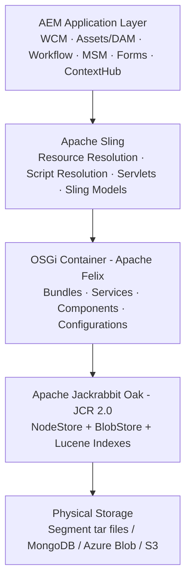
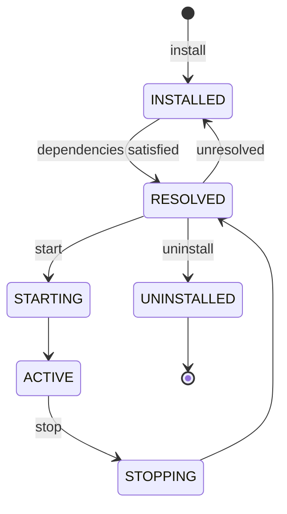
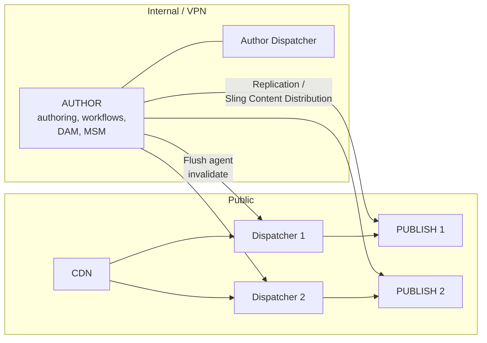
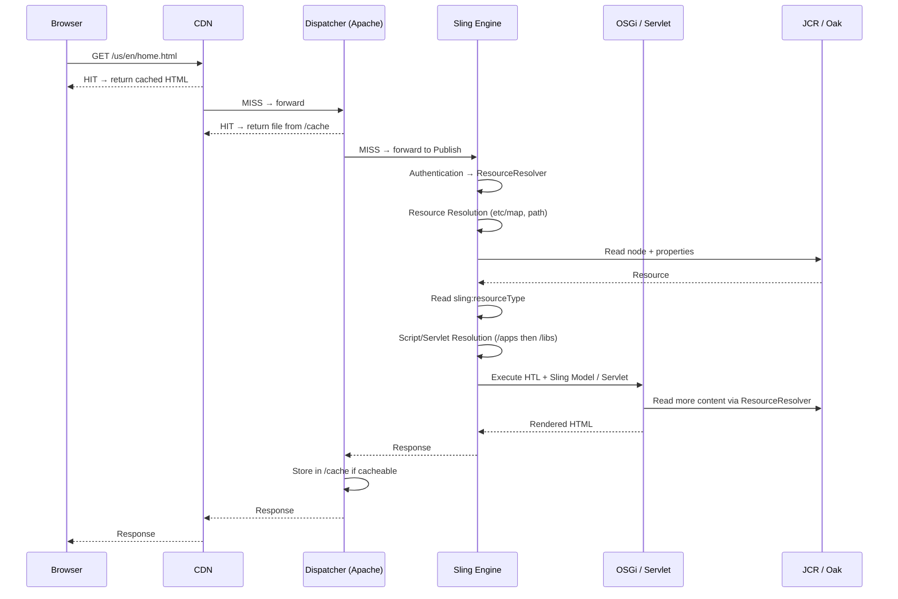
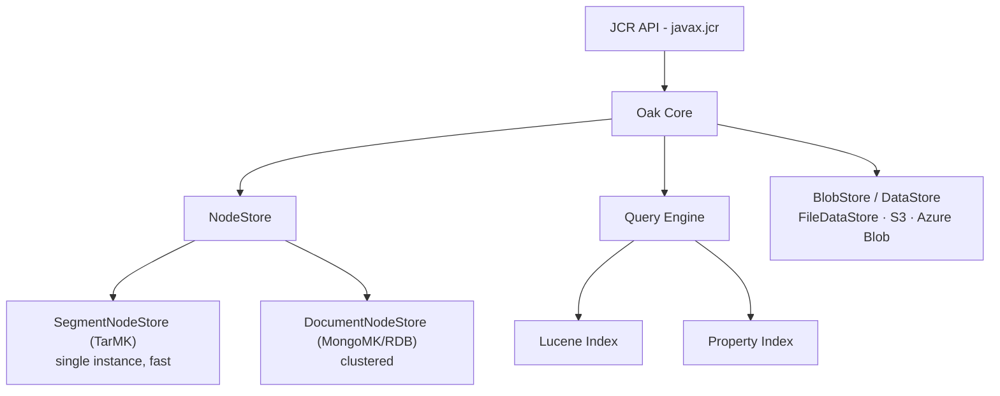
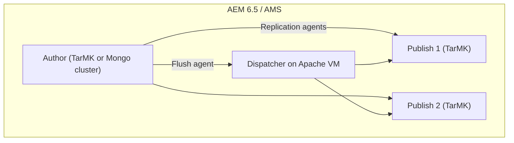
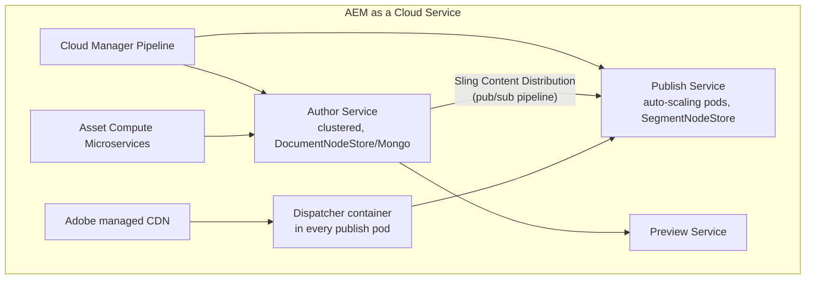

# 01 – AEM Architecture

> **Target:** 3–4 years experienced AEM Developer
> **Companies:** Valtech, Publicis Sapient, Deloitte Digital, Cognizant, Accenture, TCS, Capgemini, Infosys, Wipro, IBM, Adobe, HCL, LTIMindtree, Tech Mahindra, Persistent, Mphasis
> **Why this topic matters:** This is the **first question in almost every AEM interview**. Your answer here sets the tone. If you explain architecture confidently, the interviewer assumes you have real project depth and the rest of the interview becomes easier. If you fumble here, they start doubting everything else.

---

## 1. Introduction

### What is AEM?

Adobe Experience Manager is a **Java-based enterprise content management system** built on open source stack. It is not a single product — it is a **stack of four layers** sitting on top of each other:

| Layer | Technology | What it does |
|---|---|---|
| 4. Application | AEM (WCM, DAM, Workflow, MSM) | The actual product features authors use |
| 3. Web framework | Apache Sling | Turns an HTTP request into content + script |
| 2. OSGi container | Apache Felix | Runs the code as modular, hot-deployable bundles |
| 1. Content repository | Apache Jackrabbit Oak (JCR) | Stores everything as a tree of nodes |

**One-line answer for interviews:**
> "AEM is a Java content management platform. At the bottom is a JCR repository — Apache Jackrabbit Oak — that stores everything as a node tree. On top of that runs Apache Sling, which is a RESTful framework that maps a URL to a content resource and then to a script. Both run inside an OSGi container, Apache Felix, so all AEM code and our custom code is packaged as OSGi bundles. AEM itself is the application layer on top — WCM, Assets, Workflows, MSM and so on."

### Why do we use it?

* **Content is the primary citizen** — everything (pages, assets, users, configs, code) lives in one tree. One API to read everything.
* **Author/Publish separation** — authors work on a protected internal instance, public traffic hits a hardened publish tier.
* **Modular** — OSGi lets you deploy a bundle without restarting the server.
* **Integrated marketing stack** — connects to Adobe Analytics, Target, Campaign, Launch.
* **Personalisation + multi-site + multi-language** out of the box (MSM, ContextHub, Translation).

### When should we use it?

* Large enterprise sites with **many authors, many locales, many brands**.
* Content that must be **reused across channels** (web, mobile app, kiosk) — headless.
* Heavy **DAM** requirement (thousands of assets, renditions, metadata, approval workflows).
* When the client already owns Adobe Experience Cloud.

**When NOT to use it (good answer for senior interviewers):** a small brochure site with 10 pages and 1 author. AEM licence + infra cost is not justified. WordPress or a static site generator is better.

### Where is it used?

Banking portals, telecom self-care sites, pharma product sites, airline sites, retail/e-commerce content layer, government portals.

### Real project example

> "In my current project we run a multi-brand insurance site on AEM as a Cloud Service. We have one Author tier where about 60 content authors work, and content is distributed to an auto-scaled Publish tier. In front of Publish we have Dispatcher and Adobe's managed CDN. We serve 5 countries and 9 language variants, all built with MSM live copies from a single blueprint. The code is a standard Maven multi-module project deployed only through Cloud Manager pipelines."

That paragraph alone answers "explain your project architecture" in 40 seconds. **Memorise a version of it with your own numbers.**

> **Note for your own prep:** Everywhere in this repository you see *"In my project we..."*, treat it as a **template**. Replace the details with something you have actually done — a POC, WKND tutorial work, a support ticket you fixed. Interviewers at Sapient/Valtech will drill 3–4 levels deep into any story you tell, so only tell stories you can defend.

---

## 2. Core Concepts

### 2.1 The four-layer stack (draw this on the whiteboard)



**Bottom-up explanation (this is the order interviewers like):**

1. **JCR / Oak** – The repository. A hierarchical database of nodes and properties. Standardised by JSR-283 (JCR 2.0). Apache Jackrabbit Oak is the implementation AEM 6.x and AEMaaCS use.
2. **OSGi (Apache Felix)** – A Java module system. Every piece of functionality is a **bundle** (a JAR with extra manifest headers). Bundles can be installed, started, stopped, updated at runtime.
3. **Apache Sling** – The web framework. Its core idea: **a URL points at a resource (content), and the resource's type decides which script renders it.**
4. **AEM** – Adobe's own bundles on top: page editor, DAM, workflow engine, MSM, replication.

### 2.2 JCR — how content is stored

Everything is a **node**. Nodes have a **primary type**, optional **mixins**, and **properties**.

```
/content
  └── wknd
      └── us
          └── en                       (cq:Page)
              ├── jcr:content          (cq:PageContent)
              │    ├── jcr:title = "Home"
              │    ├── sling:resourceType = "wknd/components/page"
              │    ├── cq:template = "/conf/wknd/settings/wcm/templates/page-content"
              │    └── root             (nt:unstructured, container)
              │         └── teaser      (nt:unstructured)
              │              ├── sling:resourceType = "wknd/components/teaser"
              │              └── jcr:title = "Welcome"
              └── adventures            (cq:Page)
```

**Important node types to know cold:**

| Node type | Used for |
|---|---|
| `nt:unstructured` | Generic node, any property allowed. Used for component instances, dialogs. |
| `nt:folder` / `sling:Folder` / `sling:OrderedFolder` | Folders. `sling:*` variants allow arbitrary properties. |
| `cq:Page` | A page. Always has a `jcr:content` child of type `cq:PageContent`. |
| `cq:PageContent` | Holds the page's properties and the component tree. |
| `dam:Asset` | An asset in DAM. Has `jcr:content/renditions` and `jcr:content/metadata`. |
| `cq:Component` | A component definition under `/apps`. |
| `cq:Template` | A static template (legacy) or the editable template node under `/conf`. |
| `cq:ClientLibraryFolder` | A clientlib. |
| `rep:User` / `rep:Group` | Under `/home`. |

**Namespaces you must be able to explain:** `jcr:` (JCR spec), `nt:` (node types), `sling:` (Sling), `cq:` (AEM/Day CQ), `dam:` (Assets), `rep:` (Oak security), `mix:` (mixins), `oak:` (Oak internals).

### 2.3 The repository tree — what lives where

| Path | Mutable? | Purpose |
|---|---|---|
| `/apps` | **Immutable in AEMaaCS** | Your application code — components, templates types, clientlibs, servlet configs. Deployed via package. |
| `/libs` | Never touch | Adobe product code. Overlay it in `/apps`, never edit it. |
| `/content` | Mutable | Pages, `/content/dam` assets, experience fragments, launches. |
| `/conf` | Mutable | Editable templates, policies, Content Fragment models, context-aware configuration, cloud configs. |
| `/etc` | Mutable (legacy) | Mostly deprecated after repository restructuring. `/etc/map` for URL mappings, `/etc/packages`. |
| `/var` | Mutable | Runtime data — workflow instances, audit logs, event data, statistics. |
| `/home` | Mutable | `/home/users`, `/home/groups`. |
| `/oak:index` | Mutable | Oak index definitions. |
| `/tmp` | Mutable | Scratch space. |

**The golden rule that separates a 2-year dev from a 4-year dev:**
> "Code is immutable, content is mutable. In AEM as a Cloud Service `/apps` and `/libs` are read-only at runtime — the container filesystem is immutable. Anything the application must create at install time — service users, ACLs, folder structures — has to go through **Repoinit** in an OSGi config, not through an install hook or a JCR write."

### 2.4 OSGi — the module layer

**Why OSGi exists:** plain Java has no way to say "this JAR exposes only these packages" or "replace this JAR while running". OSGi adds that.

**Bundle lifecycle** — memorise the six states:



| State | Meaning | Common interview trap |
|---|---|---|
| INSTALLED | Bundle JAR is in the container, dependencies not yet checked/satisfied | A bundle stuck in INSTALLED = **unsatisfied Import-Package** |
| RESOLVED | All imports satisfied, not started yet | |
| STARTING | Activator / DS components being started | |
| ACTIVE | Running | |
| STOPPING | Shutting down | |
| UNINSTALLED | Removed | |

**Bundle stuck in INSTALLED** is one of the most common production questions. Answer: a package it imports is not exported by any other bundle, or the version range doesn't match. Fix by checking the bundle's Imports in the Felix console (`/system/console/bundles`) — the unsatisfied import is shown in red.

**Component vs Service** (asked constantly — full detail is in `06-OSGi-and-Services.md`):

| | OSGi Component | OSGi Service |
|---|---|---|
| What | A class managed by the OSGi Declarative Services runtime | A component **registered under an interface** so others can look it up |
| Annotation | `@Component` | `@Component(service = MyService.class)` |
| Analogy | A Spring bean | A Spring bean exposed via an interface |
| Every service is a component? | — | **Yes** |
| Every component is a service? | **No** | — |

**Configuration Admin** – OSGi configs live in the repository as nodes under `/apps/<project>/osgiconfig/config.<runmode>/` and are applied by the ConfigurationAdmin service. In AEMaaCS you cannot edit configs in the Felix console on stage/prod — they must be in code.

### 2.5 Apache Sling — the heart of AEM

**The Sling philosophy, in one sentence:**
> **URL → Resource → Resource Type → Script**

This is different from a traditional MVC framework where **URL → Controller → View**. In Sling the **content decides the code**, not a routing table. Interviewers love when you phrase it as *"in Sling, content is king — the resource type on the content node decides which script renders it."*

**URL decomposition** — you MUST be able to break this down:

```
https://www.site.com/content/wknd/us/en/home.print.a4.html/param1/param2?q=test#frag
                     └──────────────┬──────────┘ └──┬──┘ └┬┘ └──────┬─────┘ └──┬──┘
                          resource path        selectors  ext     suffix     query
```

| Part | Value | Purpose |
|---|---|---|
| Resource path | `/content/wknd/us/en/home` | Which content node |
| Selectors | `print`, `a4` | Alternative renderings of the **same** resource. Cacheable. |
| Extension | `html` | Output format — html, json, xml, csv, pdf |
| Suffix | `/param1/param2` | Extra data passed to the script. **Cacheable** (unlike query params). |
| Query string | `?q=test` | Request parameters. **Not cached by dispatcher by default.** |

**The classic follow-up:** *"Selector vs Suffix vs Parameter — when do you use which?"*
> "Selector for a different rendering of the same resource — `.print.html`, `.mobile.html`, `.model.json`. Suffix when I need to pass a value but still want dispatcher caching — for example `/content/page.search.html/electronics`. Query parameter when the value is truly dynamic and I don't want it cached, or when there are many combinations that would blow up the cache. In one project we moved a filter from a query param to a suffix specifically to make the response dispatcher-cacheable, and page load dropped dramatically."

### 2.6 Author, Publish, Dispatcher — the topology



| Tier | Purpose | Who accesses it |
|---|---|---|
| **Author** | Content creation, editing, workflow, DAM ingestion, MSM rollout | Internal authors, behind VPN/SSO |
| **Publish** | Renders live pages, runs personalisation, no authoring UI enabled | Only Dispatcher |
| **Dispatcher** | Caching + load balancing + **security filter** | CDN / end users |
| **CDN** | Edge caching, TLS termination, WAF | Public internet |

**Very common question: "Is Dispatcher a caching tool or a security tool?"**
> "Both, and I'd argue security is the more important half. It caches rendered HTML and static assets on the Apache filesystem so Publish isn't hit for every request, and it load-balances across Publish instances. But the filter section in `dispatcher.any` is our first line of defence — we deny everything by default and whitelist only the paths, selectors, extensions and methods the site actually needs. That's what blocks things like `/content.infinity.json`, CRXDE access, `.query.json` and Felix console on the public tier."

### 2.7 Run modes

Run modes tell one codebase to behave differently per environment.

| Type | Values | Set how |
|---|---|---|
| Instance run mode | `author`, `publish` | JVM arg `-Dsling.run.modes=author` (fixed at first start) |
| Environment run mode | `dev`, `stage`, `prod` | JVM arg / Cloud Manager |
| Sample content | `samplecontent`, `nosamplecontent` | First start only |

**Config folder naming** (order matters, more specific wins):

```
/apps/wknd/osgiconfig/config/                  → all instances
/apps/wknd/osgiconfig/config.author/           → all authors
/apps/wknd/osgiconfig/config.publish/          → all publishers
/apps/wknd/osgiconfig/config.author.dev/       → author on dev only
/apps/wknd/osgiconfig/config.publish.prod/     → publish on prod only
```

**Cloud gotcha:** in AEMaaCS the run modes are **fixed** — you get `author`/`publish` crossed with `dev`/`stage`/`prod`. You cannot invent custom run modes like `config.uat`.

### 2.8 Advantages and disadvantages of the AEM architecture

**Advantages**
* Single repository API for pages, assets, users, config — no impedance mismatch.
* Hot deployment via OSGi — no full restart for a code change.
* Content-driven rendering means new content types need no routing changes.
* Author/Publish split gives strong security and a natural staging model.
* Everything is REST-addressable — great for headless.

**Disadvantages**
* Steep learning curve — you must know JCR + Sling + OSGi, not just Java.
* Heavy: memory hungry, slow local startup.
* Expensive licensing and skilled resources.
* Repository maintenance (compaction, indexes, GC) on 6.5 is real operational work.
* Debugging is harder — a NullPointerException can come from a missing property three layers away.

---

## 3. Internal Working

### 3.1 End-to-end request flow (the "walk me through a request" question)

This question is asked in **almost every Sapient / Valtech / Deloitte interview.** Learn it as a numbered story.



**Step-by-step in words (say this out loud until fluent):**

1. **Browser → CDN.** If the CDN has a valid cached copy, it returns immediately. Nothing reaches AEM.
2. **CDN → Dispatcher.** Dispatcher first runs the **filter** rules. If the request is denied, 404 is returned right there.
3. **Dispatcher cache check.** If the file exists under the docroot and the statfile is older than the file, it's a HIT — Apache serves it from disk.
4. **Dispatcher → Publish (render farm).** On a MISS, Dispatcher forwards to a Publish instance based on the load-balancing config.
5. **Sling Main Servlet** receives it. Authentication handlers run; an **anonymous ResourceResolver** is created on Publish (or a user session on Author).
6. **Resource resolution** — the URL is mapped to a repository path. Sling applies `/etc/map` mappings and resource resolver config first (this is how vanity/short URLs work), then looks up the node. If no node exists → `NonExistingResource` → 404.
7. **Resource type lookup** — Sling reads `sling:resourceType` from the node. If absent, it falls back to the node's primary type.
8. **Script / Servlet resolution** — Sling searches `/apps` first, then `/libs`, for a script or a registered servlet matching the resource type, selectors, extension and HTTP method.
9. **Sling filter chain** runs (request-scope and component-scope filters).
10. **Script executes** — usually an HTL file, which instantiates Sling Models / Use classes. Those read content back through the same ResourceResolver.
11. **Response** goes back through Dispatcher, which caches it if the rules allow, then to CDN, then to the browser.

### 3.2 Script resolution rules (the detail that impresses)

For `GET /content/wknd/us/en/home.print.a4.html` where the node's `sling:resourceType = wknd/components/page`, Sling looks in this order:

```
1. /apps/wknd/components/page/print/a4.html
2. /apps/wknd/components/page/print.html
3. /apps/wknd/components/page/page.html      ← script named after last segment of resource type
4. /apps/wknd/components/page/html.html      ← named after the extension
5. /apps/wknd/components/page/GET.html       ← named after the HTTP method
6. → repeat everything against sling:resourceSuperType
7. → /libs/... (same order)
8. → default servlets (sling/servlet/default) → e.g. .json, .html renderers
```

**Key takeaways to state:**
* `/apps` **always wins over** `/libs` — that's what an overlay is.
* More selectors = more specific = higher priority.
* If nothing matches and the extension is `json`, the **DefaultGetServlet** renders the node as JSON — this is why `.infinity.json` leaks content if the dispatcher doesn't block it.

### 3.3 Resource resolution and `/etc/map`

* **Resource Resolver Factory** turns a request path into a `Resource`.
* **Mappings** (`/etc/map.publish/http/...`) do two things: `sling:internalRedirect` (incoming — shorten `/content/wknd/us/en` to `/`) and `sling:match` / reverse map (outgoing — `resourceResolver.map()` rewrites links in HTML).
* Interview trap: *"How do you remove `/content/wknd/us/en` from URLs?"* → Answer: **Sling Mapping** in `/etc/map` plus dispatcher/Apache rewrite rules, and use `resourceResolver.map()` or the AEM Link Rewriter (`link-rewriter` transformer) so generated links are shortened too. In AEMaaCS, Adobe also gives you **CDN rewrite rules** in the config pipeline.

### 3.4 Oak internals — NodeStore and BlobStore



| Concept | Explanation | Where used |
|---|---|---|
| **SegmentNodeStore (TarMK)** | Stores content in `.tar` segment files on local disk. Very fast, single instance. | AEM 6.5 author & publish; AEMaaCS **publish** |
| **DocumentNodeStore (MongoMK)** | Stores nodes as MongoDB documents. Supports clustering. | AEM 6.5 clustered author; AEMaaCS **author** |
| **BlobStore / DataStore** | Binaries (images, PDFs) stored **outside** the node store. Node keeps only a reference. | FileDataStore on-prem, Azure Blob in cloud |
| **Revision GC / Compaction** | Reclaims space from old revisions in TarMK | 6.5 maintenance task |
| **Data Store GC** | Deletes orphaned binaries | 6.5 maintenance task |
| **Lucene index** | Full-text and property search index | `/oak:index/...` |

**Why binaries are stored separately (good follow-up answer):** "Because the node store is optimised for small structured records and is fully versioned. Keeping a 40 MB video inside it would explode the segment store and every revision would duplicate it. The DataStore stores the binary once, deduplicated by hash, and the node only holds a reference — that's also why the same asset uploaded twice takes disk space only once."

### 3.5 AEM 6.5 vs AEM as a Cloud Service architecture





| Aspect | AEM 6.5 / AMS | AEM as a Cloud Service |
|---|---|---|
| Hosting | VMs you or AMS manage | Adobe-managed Kubernetes containers |
| Scaling | Manual — add a publish VM | **Auto-scaling** publish pods |
| Upgrades | Big-bang project every 2–3 years | Continuous, roughly every 2 weeks, zero-downtime |
| Deployment | Package Manager, CRX, Maven, Jenkins | **Cloud Manager pipelines only** |
| `/apps` | Writable at runtime | **Immutable** |
| Author→Publish | Replication agents | **Sling Content Distribution** (pub/sub) |
| Asset processing | Workflow on the instance (Camera Raw etc.) | **Asset Compute microservices** (off-instance) |
| Dispatcher | Separate Apache VM | Container inside the publish pod, config in Git |
| CDN | Customer-provided (Akamai/CloudFront) | Adobe-managed, included |
| CRXDE Lite | Available everywhere | **Dev only**, not on stage/prod |
| Java | 11 | 11 |
| Custom run modes | Yes | **No** — fixed set |
| Service users / ACLs | Install hooks, packages | **Repoinit** only |
| Preview tier | Not standard | Built-in Preview service |
| Long-running workflows | Fine | Discouraged; move to Asset Compute / async |

**Golden interview line:**
> "The mental model shift is from *server* to *service*. On 6.5 I owned the box — I could hotfix in CRXDE, add a run mode, restart the JVM. On Cloud Service the containers are immutable and disposable; anything that must exist has to be in Git and go through a Cloud Manager pipeline. That forces better discipline, but it means Repoinit, no admin sessions, no install hooks, and no assumption that local disk survives."

### 3.6 Startup sequence (occasionally asked)

1. JVM starts the quickstart / container.
2. Sling Launchpad starts the **OSGi framework (Felix)**.
3. Core bundles install and resolve; the repository (Oak) starts.
4. Sling Installer scans `/apps/**/install` and `/libs/**/install` and installs bundles and configs found there.
5. Declarative Services activates `@Component` classes whose references are satisfied.
6. Sling Main Servlet registers; HTTP service starts accepting requests.
7. Run-mode-specific configs are applied by ConfigurationAdmin.

---

## 4. Important Interview Questions

> Format: **Q → short model answer → cross-questions the interviewer will fire next.**
> Learn the answer first, then rehearse the cross-questions — that's where candidates lose marks.

### 4.1 Basic (asked in round 1 / screening)

**Q1. What is AEM built on?**
Java + Apache Jackrabbit Oak (JCR) + Apache Sling + Apache Felix (OSGi). AEM is the application layer on top.
*Cross:* Which JCR spec version? (JSR-283 / JCR 2.0) · Which OSGi implementation? (Felix) · Is Sling part of AEM or separate? (separate Apache project, AEM embeds it)

**Q2. What is JCR?**
Java Content Repository — a specification for storing hierarchical content with nodes, properties, versioning, observation and access control. Oak is the implementation.
*Cross:* Difference between JCR and a relational DB? · What is a mixin? · Name 5 node types.

**Q3. What is Apache Sling?**
A RESTful web framework where a URL maps to a content resource, and the resource type decides the rendering script.
*Cross:* What does "content is king / everything is a resource" mean? · What is a `Resource`? · What is `ResourceResolver`?

**Q4. What is OSGi and why does AEM use it?**
A Java modularity framework. AEM uses it so functionality ships as independent bundles that can be installed, updated and stopped at runtime without restarting the server, with explicit package-level dependencies and versioning.
*Cross:* Bundle states? · What's in an OSGi manifest? · Difference between `Import-Package` and `Export-Package`?

**Q5. What is the difference between Author and Publish?**
Author is the internal authoring environment with the editing UI, workflows, DAM and MSM. Publish serves the live site to end users with authoring disabled and anonymous read access.
*Cross:* Can you author on publish? · How does content move? · Why can't we just expose author publicly?

**Q6. What is Dispatcher?**
An Apache HTTP Server module that caches rendered pages and static files, load-balances across publish instances, and filters requests for security.
*Cross:* Is it a web server or a module? · Where is the cache stored? · What's a statfile?

**Q7. What are run modes?**
Labels that let one codebase behave differently per instance/environment — `author`/`publish` and `dev`/`stage`/`prod`.
*Cross:* How do you set them? · Config folder naming? · Which wins if two match? · Can you change author→publish later? (No — it's fixed at first start)

**Q8. What is `/apps` vs `/libs`?**
`/libs` is Adobe product code, never edited. `/apps` is your code. Sling searches `/apps` first, so putting a file at the same relative path in `/apps` overrides `/libs` — that's an overlay.
*Cross:* Overlay vs override vs inheritance? · What is Sling Resource Merger? · What happens on upgrade if I edited `/libs`?

**Q9. What is `sling:resourceType`?**
A property on a content node that points to the component path under `/apps` that renders it.
*Cross:* Relative or absolute path? (Relative is recommended) · What if it's missing? (falls back to node primary type) · What is `sling:resourceSuperType`?

**Q10. What is a package in AEM?**
A ZIP built by FileVault containing repository content plus a `filter.xml` that defines which paths are included.
*Cross:* What is filter mode `replace` vs `merge`? · What is a snapshot? · What is an install hook?

### 4.2 Intermediate (main technical round)

**Q11. Explain the full request flow from browser to JCR.**
→ See section 3.1. Give all 11 steps.
*Cross:* Where does authentication happen? · What if the resource doesn't exist? · Where do filters run? · How is the script chosen?

**Q12. Explain URL decomposition with an example.**
→ Resource path, selectors, extension, suffix, query. Use `/content/wknd/us/en/home.print.a4.html/2024?debug=true`.
*Cross:* Selector vs suffix — which is cacheable? · How many selectors can you have? · How do you read a selector in Java? (`request.getRequestPathInfo().getSelectors()`)

**Q13. Explain Sling script resolution order.**
→ See 3.2.
*Cross:* Which is checked first, `/apps` or `/libs`? · What is `GET.html`? · How does `sling:resourceSuperType` factor in? · What renders `.infinity.json`?

**Q14. Difference between SegmentNodeStore and DocumentNodeStore.**
Segment (TarMK) = tar files on local disk, single instance, fastest. Document (MongoMK) = nodes as documents in MongoDB, supports clustering.
*Cross:* Which does AEMaaCS use where? · Why is Mongo needed for clustering? · Where do binaries live? · What is a DataStore?

**Q15. What is Sling Resource Merger?**
A mechanism that merges resources found in the search paths so `/apps` can extend or hide parts of `/libs` without copying the whole tree. Used heavily for Touch UI dialogs — `sling:hideProperties`, `sling:hideResource`, `sling:orderBefore`.
*Cross:* Overlay vs Resource Merger? · Which paths does it apply to? (`/mnt/overlay`, `/mnt/override`) · Give a real use case (adding a field to the page properties dialog).

**Q16. What is Context-Aware Configuration?**
Configuration resolved based on the content path — `/conf/<site>/sling:configs/...`, linked from content via `sling:configRef`. Lets brand A and brand B use the same code with different settings.
*Cross:* Where is it stored? · How do you read it? (`ConfigurationBuilder` / `@ContextAwareConfiguration`) · Difference from an OSGi config? · Difference from a page property?

**Q17. Difference between OSGi configuration and Context-Aware configuration.**
OSGi config = per-instance/run mode, technical settings (API endpoint, credentials, timeouts). CA config = per content branch, business/site settings (analytics ID, brand name, email recipient).
*Cross:* Can authors edit OSGi configs? · Which one for a multi-brand site? · Where does each live?

**Q18. How does replication work in AEM 6.5?**
Author's replication agent (Default Agent under `/etc/replication/agents.author`) picks the activation from a queue, serialises the content and POSTs it to `/bin/receive` on each publish instance, which deserialises and writes it. A flush agent then sends an invalidation request to the dispatcher.
*Cross:* What's in the replication queue? · Difference between activate and publish? · What is reverse replication? · What is a transport user? · Why is a queue blocked? → Full details in `18-Replication.md`.

**Q19. How is content distributed in AEMaaCS?**
Through **Sling Content Distribution** using a pub/sub pipeline. Author publishes to an Adobe-managed pipeline; publish pods subscribe and pull. This is why a newly scaled-up pod automatically gets current content.
*Cross:* Why not replication agents? · How do you monitor it? · What replaced the flush agent? (Dispatcher invalidation is handled by the distribution + CDN purge)

**Q20. What is the Dispatcher cache invalidation mechanism?**
On activation, the flush agent sends a request to the dispatcher which touches the **statfile** (`.stat`). Any cached file older than the statfile in the same directory level (`statfileslevel`) is treated as stale and re-fetched.
*Cross:* What is `statfileslevel`? · Why does flushing a page invalidate siblings? · How do you flush only one page? · What is `/dispatcher/invalidate.cache`?

**Q21. What is the difference between a Sling Model and a WCMUsePojo?**
Sling Model is annotation-driven, POJO-based, testable, injects via `@Inject`/`@ValueMapValue`, and can be adapted from Resource or Request. WCMUsePojo is the older AEM-specific API extending a base class with an `activate()` method. Sling Models are the standard today.
*Cross:* Which one for headless? (Sling Model + Exporter) · Can you unit-test a WCMUsePojo easily? (harder) → Details in `05-Sling-Models.md`.

**Q22. What is the Sling Post Servlet?**
The default servlet that handles POST to a repository path — it creates/updates/deletes nodes without you writing a servlet. It's what saves component dialogs.
*Cross:* What is `:operation`? (`delete`, `move`, `copy`, `import`) · What is `@TypeHint`? · What is `@Delete`? · What is `@ValueFrom`? · How do you disable it on publish? (dispatcher filter on POST + `sling.post` config)

**Q23. What is a service user and why do we need it?**
A dedicated system user with only the ACLs it needs, mapped to a bundle+subservice name. We use it instead of an admin session so code runs with least privilege.
*Cross:* `getServiceResourceResolver` vs `getAdministrativeResourceResolver`? · Why is admin resolver deprecated? · How do you create a service user in AEMaaCS? (**Repoinit**) · Where is the mapping config? (`ServiceUserMapper` amendment)

**Q24. What is Repoinit?**
A Sling language for declaring repository structure — service users, ACLs, folders, node types — inside an OSGi configuration, executed at startup. Mandatory in AEMaaCS because `/apps` is immutable and install hooks aren't allowed.
*Cross:* Where do you put it? (`org.apache.sling.jcr.repoinit.RepositoryInitializer` config) · Is it idempotent? (yes, designed to be) · What happens if the syntax is wrong? (bundle/config fails, visible in logs)

**Q25. What is the AEM Maven project structure?**
`core` (Java/OSGi bundle), `ui.apps` (components, clientlibs, templates types), `ui.content` (sample/initial content and `/conf`), `ui.config` (OSGi configs), `ui.frontend` (webpack build), `all` (aggregate package deployed to AEM), `dispatcher` (dispatcher config), `it.tests`/`ui.tests` (integration/UI tests).
*Cross:* Why is `all` needed? · Difference between `ui.apps` and `ui.content` in terms of mutability? · What does the archetype command look like? · What is `analyse` / `aemanalyser` plugin?

**Q26. What is the difference between a mutable and an immutable package?**
Immutable content (`/apps`, `/libs`) is delivered in the container image and is read-only at runtime. Mutable content (`/content`, `/conf`, `/var`, `/home`) is installed into the running repository. In AEMaaCS the `all` package must cleanly separate these or the build fails.
*Cross:* What happens if `ui.apps` contains `/content`? (build/validation error) · How do you seed initial content then? (`ui.content` package, `mode=merge` filters)

**Q27. What are Oak indexes and why do they matter?**
Queries in Oak must be served by an index; otherwise Oak traverses the tree, which is slow and logs a traversal warning. Property indexes for exact matches, Lucene indexes for full-text and complex queries.
*Cross:* Where are index definitions? (`/oak:index`) · How do you check if a query uses an index? (Query Performance tool / `explain`) · What is `oak-index-definition`? · How do you deploy a custom index in AEMaaCS? (as part of `ui.apps`, name suffixed with `-custom-1`)

**Q28. What is the difference between QueryBuilder and JCR-SQL2?**
QueryBuilder is AEM's abstraction that builds a JCR-SQL2 query from a map of predicates — easier and used in most projects. JCR-SQL2 is the underlying query language, more expressive but verbose.
*Cross:* Which is faster? (same — QB compiles to SQL2) · How do you debug a QueryBuilder query? (`/libs/cq/search/content/querydebug.html`) · Why avoid `p.limit=-1`?

**Q29. What is the difference between `resourceResolver.getResource()` and `adaptTo()`?**
`getResource()` fetches a resource by path. `adaptTo()` converts an object into another type — Resource → Node, Resource → ValueMap, Resource → MyModel, ResourceResolver → Session.
*Cross:* What does `adaptTo` return if it fails? (null — always null-check) · What is an AdapterFactory? · Which adaptations do you use daily?

**Q30. What is a Sling Filter?**
An OSGi service implementing `javax.servlet.Filter` registered with a scope (`REQUEST`, `INCLUDE`, `COMPONENT`, `FORWARD`, `ERROR`) and a ranking, used to intercept requests — e.g. logging, security headers, redirect handling.
*Cross:* Scope difference between REQUEST and COMPONENT? · How do you order two filters? (`service.ranking`) · Why avoid heavy logic in a filter? (runs on every request)

### 4.3 Advanced

**Q31. How would you design a multi-brand, multi-country AEM site?**
Single codebase; one blueprint site per brand under `/content/<brand>/language-masters`; MSM live copies per country; `/conf/<brand>` for templates, policies and CA configs; brand-specific styling via the Style System and CSS variables rather than separate components; dispatcher farm per domain.
*Cross:* Why not separate codebases per brand? · How do you handle a brand-specific component? (`sling:resourceSuperType` extension) · How do you handle rollout conflicts?

**Q32. How does AEM achieve horizontal scalability?**
Publish tier is stateless for reads, so you add instances behind dispatcher/CDN. Author scales vertically or as a Mongo-backed cluster (only one leader for certain jobs). AEMaaCS auto-scales publish pods based on traffic.
*Cross:* Why can't author scale the same way? · What is a cluster leader / TopologyEventListener? · How do you make sure a scheduled job runs once in a cluster? (Sling Job with topology awareness / `@Component` with leader check)

**Q33. What is the "immutable vs mutable" problem in AEMaaCS and how do you handle it?**
See 2.3 + Q26. Handle with Repoinit for structure/ACLs, `ui.content` for seed content, and no runtime writes to `/apps`.
*Cross:* Where would you store a runtime-generated config? · What if a third-party library needs to write a file? (use `/var` or an external store; local disk is ephemeral)

**Q34. What happens during a Cloud Manager deployment? Is there downtime?**
Build → code quality (SonarQube + OakPAL + Adobe rules) → security testing → build images → deploy to stage → run functional/UI tests → deploy to prod using a **rolling / blue-green** update so old pods serve traffic until new pods are healthy. No downtime for the publish tier.
*Cross:* What is the quality gate threshold? · Can you skip a failing gate? (some are warnings, critical ones block) · What is a config pipeline vs a full-stack pipeline? · What is a web-tier pipeline?

**Q35. How does AEM handle personalisation at the dispatcher/CDN layer if pages are cached?**
Cache the shell, personalise at the edge or client — ContextHub / Target with client-side injection, ESI/SSI includes for the dynamic fragment, or `Sling Dynamic Include` (SDI) so the cached page contains a placeholder resolved per request.
*Cross:* What is SDI and how is it configured? · Cookie-based cache keys — what's the risk? (cache explosion) · How does Target at.js differ from server-side delivery?

**Q36. What is Sling Dynamic Include (SDI)?**
An OSGi bundle that replaces a component's rendered output with an SSI/ESI/JSI include so the outer page stays cacheable while the fragment is fetched per request from `/content/....nocache.html`.
*Cross:* Which include type would you pick and why? · What must Apache have enabled? (`mod_include`) · Does it work in AEMaaCS? (yes, but check the dispatcher config)

**Q37. Explain the DAM asset ingestion flow.**
Upload → `dam:Asset` node created with the original under `jcr:content/renditions/original` → **DAM Update Asset** workflow (6.5) or **Asset Compute microservices** (AEMaaCS) generate renditions, extract metadata, run smart tags → asset available.
*Cross:* Why did Adobe move processing off-instance in the cloud? (CPU-heavy, blocks the author) · What is an Asset Processing Profile? · What are Dynamic Media modes (Scene7 vs Hybrid)?

**Q38. How do you secure a production AEM deployment?**
Dispatcher deny-by-default filters; remove/secure Felix console and CRXDE on publish; disable WebDAV/sample content; run the **Security Checklist**; use service users not admin; ACLs by group not user; HTTPS everywhere; CSRF token filter enabled; XSS-escape everything in HTL; keep bundles patched.
*Cross:* Which endpoints must be blocked? (`/system/console`, `/crx`, `/bin/querybuilder.json`, `.infinity.json`, `/etc`, `/libs` selectively) · What is the CSRF filter? · How do you test? (Adobe's dispatcher validator + security scan)

**Q39. What is the difference between Sling Jobs, Sling Scheduler and Workflows?**
Scheduler = time-based, fire-and-forget, no guarantee across a cluster restart. Sling Job = guaranteed at-least-once execution, persisted, cluster-aware, good for async processing. Workflow = long-running, human steps, approvals, audit trail, visible in the AEM UI.
*Cross:* Which for "send a nightly report"? (Scheduler) · Which for "process 100k assets"? (Sling Jobs / batch) · Which for "legal must approve before publish"? (Workflow) → Details in `09-Workflows.md` and `10-Schedulers-and-Jobs.md`.

**Q40. What are the main performance bottlenecks in AEM and how do you find them?**
Uncached pages (low dispatcher hit ratio), un-indexed queries causing traversal, too many nodes under one parent, huge clientlibs, synchronous external API calls in components, unbounded `listChildren()` loops, session/resolver leaks.
Tools: `request.log`, `error.log`, Query Performance tool, `/system/console/status-slingjobs`, JMX MBeans, Sling Log Tracer, CRX Health Checks, Chrome DevTools for the front end.
*Cross:* How do you calculate dispatcher hit ratio? · What's a good page render time? (<100ms server-side on publish) · What is Sling Log Tracer used for?

### 4.4 Scenario based

**Q41.** *"A page loads fine on author but shows an old version on publish. Walk me through your debugging."*
Check (1) is the page actually activated — replication status in page properties; (2) replication queue on author — blocked/paused?; (3) does the node exist on publish (check via CRXDE on a lower env / package); (4) dispatcher cache — is the file still on disk with an old timestamp? Check statfile; (5) CDN — purge and test with a cache-buster query param; (6) check `error.log` on publish for a render exception falling back to a cached copy.

**Q42.** *"Traffic doubled and publish CPU is at 95%. What do you do?"*
First check dispatcher hit ratio — most likely cause is a cache miss storm from a query parameter or a `nocache` selector. Fix the caching rule. Then check for un-indexed queries in the log. Then scale out publish. On AEMaaCS, confirm auto-scaling actually triggered and check for a slow external service call blocking threads.

**Q43.** *"An OSGi bundle is in INSTALLED state after deployment."*
Unsatisfied `Import-Package`. Open `/system/console/bundles`, find the red import, and figure out whether the exporting bundle is missing or the version range doesn't match. Usually caused by a dependency added with the wrong `<scope>` in the POM (should be `provided` for AEM-supplied APIs) or by embedding a library that's already in AEM at a different version.

**Q44.** *"After a Cloud Manager deploy, one environment behaves differently from another."*
Almost always a run-mode config problem — a config that exists in `config.author.dev` but not `config.author.prod`, or a CA config under `/conf` that wasn't part of the mutable package. Compare `/system/console/configMgr` (dev) and diff the `ui.config` folders.

**Q45.** *"You need to expose page content to a mobile app. What's your approach?"*
Headless: Content Fragments modelled in `/conf`, exposed via **GraphQL persisted queries** (cacheable at CDN) for structured content; or **Sling Model Exporter** (`.model.json`) for component-level JSON. Explain the trade-off: GraphQL for pure content, Exporter/SPA editor when the app must mirror the authored page structure.

**Q46.** *"Author instance is very slow after a big content migration."*
Look at repository size and node counts — likely too many children under one node (flat structure). Check for missing indexes causing traversal on the author search. Run/check Revision GC (compaction) and Data Store GC. Check `oak` MBeans for observation queue backlog — too many listeners is a classic post-migration issue.

**Q47.** *"How do you move content from prod to a lower environment?"*
Build a content package with correct filters (exclude `/apps`), or use Cloud Manager's **Content Copy** in AEMaaCS. Watch out for user/group references, `cq:lastModifiedBy` noise, and always exclude `/home` and secrets. For huge content use `oak-run` or the Package Manager in chunks.

**Q48.** *"A component renders on author but is blank on publish."*
Missing content on publish (component's referenced fragment/asset not activated), an ACL issue for the anonymous user, or a Sling Model returning null because the model requires a request adaptable that behaves differently. Check `error.log` on publish first — a swallowed NPE in a model with `defaultInjectionStrategy = OPTIONAL` renders empty rather than erroring.

### 4.5 Production support

**Q49.** How do you check whether replication is working? → `/etc/replication/agents.author/publish.test.html`, agent queue page, `error.log` for `ReplicationException`.
**Q50.** Where are AEM logs? → `crx-quickstart/logs/` — `error.log`, `access.log`, `request.log`, `stdout.log`, `upgrade.log`. In AEMaaCS via **Cloud Manager → Environments → Download logs** or `aio aem:rde:logs` / log tailing.
**Q51.** How do you enable DEBUG for only your package? → `/system/console/slinglog` → add a Logger for `com.mycompany.core` at DEBUG with its own log file. Never DEBUG the root logger on prod.
**Q52.** How do you take a thread dump and what do you look for? → `jstack <pid>` or `/system/console/status-Threads`; look for many threads BLOCKED on the same lock, or `qtp` threads stuck in an external HTTP call with no timeout.
**Q53.** What are AEM health checks? → `/system/console/healthcheck`, Oak/system health checks surfaced in the Operations Dashboard; in AEMaaCS Adobe monitors them and they gate deployments.
**Q54.** How do you find who changed a page? → Page properties → versions, `jcr:lastModifiedBy`, audit log under `/var/audit`, or Timeline in the Sites console.

### 4.6 Migration questions

**Q55.** *"How would you migrate from AEM 6.5 to AEM as a Cloud Service?"*
Use Adobe's tooling in order: **Best Practices Analyzer** on 6.5 → **Cloud Acceleration Manager** to track the plan → **Repository Modernizer** (restructure the project into immutable/mutable packages) → **Dispatcher Converter** (convert dispatcher config to the cloud format) → **Asset Workflow Migration tool** → **Content Transfer Tool (CTT)** to move content, then **Content Copy** for deltas.
*Cross:* What breaks most often? (custom workflows on assets, install hooks, admin sessions, custom run modes, writes to `/apps`, long-running processes) · How do you handle a 3 TB DAM? (CTT with multiple migration sets, ingest binaries first)

**Q56.** *"What is the Repository Restructuring in 6.4/6.5?"*
Adobe moved application/config content out of `/etc` into `/apps`, `/conf`, `/var`, `/libs`. E.g. clientlibs from `/etc/clientlibs` to `/apps/<project>/clientlibs`, templates from `/apps/.../templates` (static) to `/conf/.../settings/wcm/templates` (editable), cloud configs from `/etc/cloudservices` to `/conf`.
*Cross:* Why? (clear ownership boundary, upgrade safety) · What still lives in `/etc`? (`/etc/map`, `/etc/packages`, a few legacy items)

**Q57.** *"Static templates → editable templates migration approach?"*
Use the **Modernization Tools** (`aem-modernize-tools`) to convert templates, policies and components; or rebuild the template as editable under `/conf` and write a script to update `cq:template` and `sling:resourceType` on existing pages. Always test rollout on a content copy first.

### 4.7 Debugging questions

**Q58.** How do you debug a Sling Model returning null? → Check `adaptables`, check the model is in a package listed under `Sling-Model-Packages`/`@Model` scanning, check the resource type matches, use `.model.json` or the **Sling Model Exporter** to inspect, and check `/system/console/status-adapters` to see if the adapter is registered.
**Q59.** How do you know which script rendered a page? → Enable the **Sling Log Tracer** (`/system/console/tracer`) or add `?debugClientLibs=true` / use the AEM Developer Mode panel (`Ctrl+Shift+U` / the "Developer" layer) which shows the component tree, the resource type and the resolved script.
**Q60.** How do you debug a dispatcher caching problem? → Enable dispatcher log at debug (`DispatcherLogLevel 3`), check `dispatcher.log` for "cache hit/miss", inspect the file on disk under the docroot, check the statfile timestamp, and verify the response headers (`Dispatcher: hit/miss`, `Cache-Control`, `Surrogate-Control`).

---

## 5. Cross Questions (the drill-down chains)

Interviewers rarely ask one architecture question. They **pull a thread**. Here are the four chains that come up most.

### Chain A — starts with "Explain AEM architecture"
1. What is JCR? → 2. Which implementation? (Oak) → 3. What is a NodeStore? → 4. Segment vs Document? → 5. Where do binaries go? → 6. What is a DataStore? → 7. Why keep binaries out of the node store? → 8. What is Revision GC? → 9. What happens if you never run it? (disk fills, repo grows unbounded) → 10. How is this handled in AEMaaCS? (Adobe manages it)

### Chain B — starts with "Explain the request flow"
1. Where does authentication happen? → 2. What is a ResourceResolver? → 3. How is a resource resolved? → 4. What is `/etc/map`? → 5. What is resource type vs resource super type? → 6. Script resolution order? → 7. What if two scripts match? → 8. `/apps` vs `/libs` priority? → 9. What is an overlay? → 10. What is Sling Resource Merger?

### Chain C — starts with "Author vs Publish"
1. How does content move? → 2. Replication agent internals? → 3. What is a transport user? → 4. What is reverse replication? → 5. What replaced this in the cloud? → 6. What is Sling Content Distribution? → 7. How does a newly scaled pod get content? → 8. How is dispatcher invalidated? → 9. What is a statfile? → 10. What is `statfileslevel`?

### Chain D — starts with "Have you worked on Cloud Service?"
1. Benefits over on-prem? → 2. What is immutable content? → 3. How do you create a service user then? → 4. What is Repoinit? → 5. Show me a Repoinit snippet → 6. What are Cloud Manager quality gates? → 7. What blocks a deployment? → 8. What is the config pipeline? → 9. How do you get logs? → 10. What is RDE (Rapid Development Environment)?

**How to survive a chain:** never answer in one word. Answer in **two sentences plus one example**. That naturally consumes the interviewer's follow-up and shows depth.

---

## 6. Best Interview Answer (speakable scripts)

### 6.1 "Explain AEM architecture" — 2 minute answer

> "I'll explain it bottom-up, because that's how the layers actually stack.
>
> At the bottom is the content repository — Apache Jackrabbit Oak, which implements the JCR 2.0 spec. Everything in AEM is stored there as a tree of nodes and properties: pages, assets, users, even our OSGi configurations. Binaries don't sit inside the node store; they go to a separate data store, so the node only holds a reference.
>
> Above that is the OSGi container, Apache Felix. All AEM product code and all our custom code is packaged as OSGi bundles, which means we can deploy a bundle and have it activate without restarting the server, and dependencies are declared explicitly at package level.
>
> On top of OSGi runs Apache Sling, which is the web framework. Sling's model is: a URL points to a content resource, the resource has a `sling:resourceType`, and that resource type decides which script renders it. So routing is driven by content, not by a routing table.
>
> AEM is the application layer on top of all this — the page editor, DAM, workflow engine, MSM, replication.
>
> Deployment-wise we have an Author tier where content is created, and a Publish tier that serves the live site, with Dispatcher and a CDN in front. On 6.5 content moves author-to-publish via replication agents; on Cloud Service it's Sling Content Distribution over a pub/sub pipeline.
>
> In my project we're on AEM as a Cloud Service, so the publish tier auto-scales, the dispatcher runs as a container in each publish pod, and everything deploys through Cloud Manager pipelines."

### 6.2 "Walk me through what happens when a user hits a URL" — 90 second answer

> "Say the user requests `/us/en/home.html`. It hits the CDN first — if it's a hit, we never touch AEM. On a miss it goes to Dispatcher, which first applies the filter rules; if the path or extension isn't whitelisted we return 404 right there. If it passes, Dispatcher checks its cache on the Apache filesystem; if the cached file is newer than the statfile it's a hit and Apache serves the file.
>
> On a miss, it forwards to a Publish instance. The Sling main servlet takes over, authentication handlers create a ResourceResolver — anonymous on publish. Sling then resolves the URL to a resource, applying `/etc/map` mappings, so the short URL becomes `/content/wknd/us/en/home`. It reads `sling:resourceType` from the `jcr:content` node, then searches for a matching script — `/apps` first, then `/libs`, matching on selectors, extension and HTTP method. The filter chain runs, then the HTL script executes and instantiates the Sling Models, which read content back through the same resource resolver.
>
> The HTML goes back through Dispatcher, which writes it to disk if the caching rules allow, then to the CDN, then to the browser."

### 6.3 "Cloud Service vs 6.5 — what's the real difference for a developer?" — 90 seconds

> "For a developer the biggest change is that `/apps` and `/libs` are immutable at runtime. On 6.5 I could open CRXDE on any environment and change a node; on Cloud Service the container filesystem is read-only, so everything has to come through Git and a Cloud Manager pipeline.
>
> That has three practical consequences. First, service users and ACLs must be declared in **Repoinit** because install hooks and admin sessions aren't available. Second, our Maven project has to cleanly split immutable content — `ui.apps` — from mutable content — `ui.content` and `ui.config` — otherwise the build validation fails. Third, we can't rely on local disk or long-running processes, because pods are disposable and auto-scaled.
>
> On the operations side, Adobe handles upgrades continuously, asset processing moved off-instance to Asset Compute microservices, and content distribution replaced the old replication agents. The dispatcher config now lives in Git and is validated by the pipeline rather than being hand-edited on an Apache box.
>
> The upside is that I stopped spending time on repository maintenance and version upgrades. The discipline cost is that nothing can be hotfixed — every change goes through the pipeline and the quality gates."

---

## 7. Real Project Example

### Example 1 — Reducing publish load on a high-traffic site

**Requirement:** A telecom self-care site had to survive a marketing campaign with ~10× normal traffic.

**Problem:** Dispatcher hit ratio was only about 40%. Every page had a "recommended plans" component that appended a query parameter for the user's city, so almost every request was a cache miss and went to publish. Publish CPU pinned at 90%+.

**Approach:**
1. Analysed `dispatcher.log` and `request.log` to confirm the miss pattern.
2. Moved the city from a query parameter into a **selector-based URL** so the same city always mapped to the same cacheable URL.
3. For the truly per-user block (name, balance), used **Sling Dynamic Include** so the outer page stayed cached and only the small fragment was fetched per request.
4. Tuned the dispatcher `/cache` rules and added the correct `Cache-Control` headers so the CDN also cached.

**Implementation:** New servlet registered by resource type with selector `plans`, an SDI configuration for the account component, dispatcher filter and cache rules updated, and a flush rule so a plan change invalidated only the affected paths.

**Result:** Hit ratio went from ~40% to ~92%. Publish CPU during the campaign stayed under 45%, and we handled the peak without adding instances.

### Example 2 — Making a project AEMaaCS-ready

**Requirement:** Move a 6.5 codebase to Cloud Service.

**Problem:** The project created folders and ACLs through a JCR install hook, used `getAdministrativeResourceResolver` in five services, had a custom run mode `uat`, and wrote generated PDFs to the local filesystem.

**Approach:** Ran the **Best Practices Analyzer**, then **Repository Modernizer** to split the project into immutable/mutable modules. Replaced the install hook with **Repoinit**. Replaced admin resolvers with a **service user** plus `ServiceUserMapper` amendments. Collapsed `uat` into `stage`. Moved generated PDFs into the DAM instead of local disk.

**Result:** Migration completed with no functional regression; the code quality gate score improved because the admin-session and deprecated-API warnings disappeared.

---

## 8. Coding Examples

### 8.1 Reading the URL parts (selectors, suffix, extension)

```java
package com.mycompany.core.servlets;

import org.apache.sling.api.SlingHttpServletRequest;
import org.apache.sling.api.request.RequestPathInfo;

public final class UrlParts {

    private UrlParts() { }

    public static void inspect(SlingHttpServletRequest request) {
        RequestPathInfo info = request.getRequestPathInfo();

        // /content/wknd/us/en/home.print.a4.html/2024?debug=true
        String resourcePath = info.getResourcePath();   // /content/wknd/us/en/home
        String[] selectors  = info.getSelectors();      // ["print", "a4"]
        String selectorStr  = info.getSelectorString(); // "print.a4"
        String extension    = info.getExtension();      // "html"
        String suffix       = info.getSuffix();         // "/2024"
        String debug        = request.getParameter("debug"); // "true"
    }
}
```

**Line by line:**
* `getRequestPathInfo()` is the Sling-specific object that has already split the URL — do not parse the URL yourself with `substring`, that's a classic code-review rejection.
* `getSelectors()` returns an array; `getSelectorString()` returns them joined. Use the array and check `length` before indexing.
* `getSuffix()` includes the leading slash — always null-check, since a request without a suffix returns `null`.

### 8.2 Getting a ResourceResolver correctly (service user, not admin)

```java
package com.mycompany.core.services.impl;

import org.apache.sling.api.resource.LoginException;
import org.apache.sling.api.resource.ResourceResolver;
import org.apache.sling.api.resource.ResourceResolverFactory;
import org.osgi.service.component.annotations.Component;
import org.osgi.service.component.annotations.Reference;

import java.util.Collections;
import java.util.Map;

@Component(service = ContentReaderService.class)
public class ContentReaderServiceImpl implements ContentReaderService {

    private static final String SUBSERVICE = "content-reader";

    @Reference
    private ResourceResolverFactory resolverFactory;

    @Override
    public String readTitle(String path) {
        Map<String, Object> params =
                Collections.singletonMap(ResourceResolverFactory.SUBSERVICE, SUBSERVICE);

        // try-with-resources → resolver is ALWAYS closed, even on exception
        try (ResourceResolver resolver = resolverFactory.getServiceResourceResolver(params)) {
            return java.util.Optional.ofNullable(resolver.getResource(path + "/jcr:content"))
                    .map(r -> r.getValueMap().get("jcr:title", String.class))
                    .orElse(null);
        } catch (LoginException e) {
            // service user mapping missing or ACL not granted
            return null;
        }
    }
}
```

**Line by line:**
* `SUBSERVICE` name must match the `ServiceUserMapper` amendment config — if it doesn't, you get `LoginException` at runtime, which is the #1 cause of "my service works locally but not on the server".
* **try-with-resources** — `ResourceResolver` is `Closeable`. Not closing it leaks a JCR session; thousands of leaks will bring down the instance. Interviewers ask this specifically.
* Never use `getAdministrativeResourceResolver()` — deprecated and blocked in AEMaaCS.

### 8.3 The matching Service User Mapper OSGi config

`ui.config/src/main/content/jcr_root/apps/wknd/osgiconfig/config/org.apache.sling.serviceusermapping.impl.ServiceUserMapperImpl.amended-content-reader.cfg.json`

```json
{
  "user.mapping": [
    "com.mycompany.core:content-reader=[wknd-content-reader]"
  ]
}
```

Format: `<bundle-symbolic-name>:<subservice-name>=[<system-user-name>]`

### 8.4 Repoinit — creating the service user and its ACLs (AEMaaCS way)

`ui.config/.../org.apache.sling.jcr.repoinit.RepositoryInitializer~wknd.cfg.json`

```json
{
  "scripts": [
    "create service user wknd-content-reader with path system/cq:services/wknd\n set ACL for wknd-content-reader\n allow jcr:read on /content\n allow jcr:read on /conf\n end\n create path (sling:Folder) /var/wknd/reports"
  ]
}
```

Readable form of the same script:

```
create service user wknd-content-reader with path system/cq:services/wknd

set ACL for wknd-content-reader
    allow jcr:read on /content
    allow jcr:read on /conf
end

create path (sling:Folder) /var/wknd/reports
```

**Why this matters in interviews:** if you can write Repoinit from memory, the interviewer immediately believes you've done real AEMaaCS work.

### 8.5 Run-mode aware OSGi configuration

`ui.config/src/main/content/jcr_root/apps/wknd/osgiconfig/config.publish.prod/com.mycompany.core.services.impl.ApiClientImpl.cfg.json`

```json
{
  "apiEndpoint": "https://api.company.com/v2",
  "connectTimeout": 3000,
  "socketTimeout": 5000,
  "enableCache": true
}
```

**Always set timeouts.** A missing socket timeout on an external call is the classic cause of "all publish threads hung".

### 8.6 A minimal `filter.xml` showing mutable/immutable separation

`ui.apps` (immutable — code only):
```xml
<?xml version="1.0" encoding="UTF-8"?>
<workspaceFilter version="1.0">
    <filter root="/apps/wknd"/>
    <filter root="/apps/wknd-vendor-packages"/>
</workspaceFilter>
```

`ui.content` (mutable — content and conf):
```xml
<?xml version="1.0" encoding="UTF-8"?>
<workspaceFilter version="1.0">
    <filter root="/conf/wknd" mode="merge"/>
    <filter root="/content/wknd" mode="merge"/>
    <filter root="/content/dam/wknd" mode="merge"/>
</workspaceFilter>
```

**`mode="merge"` matters:** without it, redeploying would wipe author-created content under those paths. Explain this and you sound like someone who has broken production once and learned.

### 8.7 Creating the project (Maven archetype)

```bash
mvn -B org.apache.maven.plugins:maven-archetype-plugin:3.2.1:generate \
  -D archetypeGroupId=com.adobe.aem \
  -D archetypeArtifactId=aem-project-archetype \
  -D archetypeVersion=48 \
  -D appTitle="WKND Sites" \
  -D appId="wknd" \
  -D groupId="com.mycompany" \
  -D aemVersion="cloud"
```

```bash
# Deploy everything to a local author on 4502
mvn clean install -PautoInstallSinglePackage

# Deploy only the bundle (fast iteration)
mvn clean install -PautoInstallBundle -pl core

# Deploy to publish
mvn clean install -PautoInstallSinglePackagePublish
```

---

## 9. Common Mistakes

| Mistake | Why it's wrong | Do this instead |
|---|---|---|
| Editing anything under `/libs` | Wiped on upgrade/service pack | Overlay into `/apps` at the same relative path |
| Using `getAdministrativeResourceResolver()` | Deprecated, full privileges, blocked in AEMaaCS | Service user + `getServiceResourceResolver()` |
| Not closing `ResourceResolver` / `Session` | Session leak → memory exhaustion → instance dies | try-with-resources |
| Writing to `/apps` at runtime | Fails in AEMaaCS (immutable) | Write to `/var` or `/content`; declare structure via Repoinit |
| Putting `/content` inside `ui.apps` | Breaks immutable/mutable separation, build fails | Put it in `ui.content` |
| Hardcoding `/content/wknd/us/en` in code | Breaks for other locales and MSM live copies | Derive from `currentPage`/resource path or use CA config |
| Using query params for content variations | Not dispatcher-cacheable → cache miss storm | Use selectors or suffix |
| Running a query without an index | Traversal warning, slow, can hang the instance | Add/verify an Oak index; check with the Query Performance tool |
| No timeout on external HTTP calls | Threads hang, publish becomes unresponsive | Always set connect + socket timeouts, use a circuit breaker |
| Custom run mode in AEMaaCS | Not supported | Use the fixed `dev`/`stage`/`prod` |
| `compile` scope for AEM APIs in POM | Embeds a duplicate of an API AEM already exports → bundle won't resolve | Use `provided` scope |
| Assuming local disk persists | Pods are ephemeral | Store in the repository or an external service |

---

## 10. Best Practices

**Architecture**
* Keep publish stateless. Anything stateful belongs in the repository or an external store.
* Design for cacheability from day one — decide selector vs suffix vs param before writing the component.
* Use `/conf` context-aware configuration for anything that differs per brand/site; use OSGi configs for anything that differs per environment.

**Repository**
* Never more than ~1000 direct children under one node — bucket by date or hash.
* Prefer `sling:Folder` over `nt:folder` when you need properties.
* Keep the component tree shallow.

**Code**
* Bundle exports only what other bundles need — everything else stays package-private/internal.
* Interfaces in an exported package, implementations in an `.impl` package that is **not** exported.
* `provided` scope for `uber-jar` / `aem-sdk-api`.
* No business logic in HTL — put it in the Sling Model.

**Security**
* Deny-by-default in dispatcher filters.
* Service users with the minimum ACLs, granted to **groups** not individuals.
* Escape everything in HTL with the right context (`@ context='html'`, `'attribute'`, `'uri'`, `'scriptString'`).
* Never log credentials or PII.

**Performance**
* Target >90% dispatcher hit ratio.
* Lazy-load below-the-fold images; use AEM's responsive image servlet / Dynamic Media.
* Minify and combine clientlibs; keep the critical CSS small.
* Avoid `listChildren()` over unbounded sets — use a query with a limit.

**Deployment**
* One `all` package, environment differences handled by run modes only.
* Never deploy from Package Manager on prod (and you literally can't on AEMaaCS).
* Keep dispatcher config in Git, validated by the pipeline.

---

## 11. Debugging Tips

| Tool | URL / Location | Use it for |
|---|---|---|
| **error.log** | `crx-quickstart/logs/error.log` | Exceptions, stack traces — always start here |
| **request.log** | `crx-quickstart/logs/request.log` | Response times per request, find slow pages |
| **access.log** | `crx-quickstart/logs/access.log` | Who hit what |
| **Felix Console – Bundles** | `/system/console/bundles` | Bundle state, unsatisfied imports |
| **Felix Console – Components** | `/system/console/components` | Is my OSGi component active? Why is it `unsatisfied`? |
| **Felix Console – Config Manager** | `/system/console/configMgr` | Effective OSGi configuration values |
| **Felix Console – Log Support** | `/system/console/slinglog` | Add a package-scoped DEBUG logger |
| **Sling Log Tracer** | `/system/console/tracer` | See which script/model executed, without redeploying |
| **Adapter Factories** | `/system/console/status-adapters` | Is my Sling Model adapter registered? |
| **Depfinder** | `/system/console/depfinder` | Which bundle exports a package |
| **CRXDE Lite** | `/crx/de` | Inspect nodes and properties (dev only in AEMaaCS) |
| **Package Manager** | `/crx/packmgr` | Build/inspect packages |
| **Query Performance** | `/libs/granite/operations/content/diagnosistools/queryPerformance.html` | Slow queries, traversal warnings |
| **Query Debugger** | `/libs/cq/search/content/querydebug.html` | Test QueryBuilder queries |
| **Developer Mode / layer** | Page editor → Developer layer | Which component + resource type + script rendered this box |
| **`.json` on a node** | `/content/x.1.json` | Quick look at properties (blocked on publish) |
| **Developer Console (AEMaaCS)** | Cloud Manager → Environments → Developer Console | Status dumps, bundle list, OSGi configs on cloud envs |
| **`aio` CLI** | `aio aem:rde:*` | RDE deploy + live log tail on Cloud Service |
| **dispatcher.log** | Apache logs dir | Cache hit/miss decisions, filter denials |
| **Chrome DevTools → Network** | browser | `Cache-Control`, `Age`, `X-Cache`, `Dispatcher` headers |

**A debugging habit that impresses interviewers:**
> "My first three checks are always: `error.log` for an exception, `/system/console/components` to confirm my service is actually active, and the response headers to see whether the response even came from AEM or from a cache."

---

## 12. Performance Optimization

| Layer | What to do |
|---|---|
| **CDN** | Correct `Cache-Control` / `Surrogate-Control`; long TTL for versioned assets; purge on publish |
| **Dispatcher** | Deny-by-default filters (fewer requests reach publish); cache HTML; `/statfileslevel` tuned so a page flush doesn't invalidate the whole site; `gracePeriod` to avoid a thundering herd |
| **Publish** | Stateless; no synchronous external calls in the render path; SDI for personalised fragments |
| **Sling Models** | Do work in `@PostConstruct` once, not in getters called repeatedly from HTL; cache expensive lookups in a field |
| **Queries** | Always indexed; always a limit; prefer traversing a known path over a repo-wide query |
| **Repository** | Flat-structure avoidance; regular Revision GC and Data Store GC on 6.5 |
| **Clientlibs** | Minify, combine by category, `defer`/`async` where possible, avoid loading everything on every page |
| **HTL** | Use `data-sly-resource` with `@ decoration=false` where wrappers aren't needed; avoid heavy loops |
| **Assets** | Correct renditions; Dynamic Media / smart crop; WebP; lazy loading; never serve the original 4 MB JPEG |
| **JVM** | Sensible heap; monitor GC pauses (6.5 — Adobe manages this in the cloud) |

**Numbers worth quoting:** dispatcher hit ratio target **>90%**, publish server-side render time target **<100 ms**, Core Web Vitals LCP **<2.5 s**.

---

## 13. Real Production Scenarios

> Practise saying the **diagnosis path**, not just the fix. Interviewers grade the method.

1. **Page shows stale content on the live site.** → Check activation status → replication queue → node on publish → dispatcher cache file + statfile → CDN purge.
2. **Replication queue blocked.** → Open the agent, read the error; usually the publish instance is down, credentials/transport user wrong, or one huge payload is stuck. Clear the offending item, fix the cause, restart the queue.
3. **Bundle stuck in INSTALLED after deploy.** → Unsatisfied import; check `/system/console/bundles`, fix POM scope or version range.
4. **OSGi component shows `unsatisfied reference`.** → A `@Reference` it needs isn't available; check that the referenced service is registered and its own config is valid.
5. **Author instance not starting.** → Check `stdout.log` and `error.log`; common causes are a corrupt bundle in `crx-quickstart/launchpad`, port conflict, out-of-disk, or a failed Repoinit script.
6. **Disk full on 6.5.** → Revision GC / compaction not running, Data Store GC not running, or logs not rotated. Also check `/var/audit` and workflow instances under `/var/workflow/instances`.
7. **Workflows piling up / instance slow.** → Purge completed workflow instances (Workflow Purge scheduled task), check for a stuck step with no timeout, check the job queue in `/system/console/slingevent`.
8. **Author cannot edit a component.** → Component not allowed in the template policy, editable template locked, missing `cq:isContainer`, or the user's group lacks `modify` on that path. Check the template's policy `components` list first.
9. **Component not appearing in the component browser.** → `componentGroup` is `.hidden` or empty, or the component isn't in the allowed list of the template's policy.
10. **Clientlib not loading on publish.** → `allowProxy` not set to `true` (so `/etc.clientlibs/...` returns 404), category typo, dispatcher blocking `/etc.clientlibs`, or the clientlib wasn't included in the package filter.
11. **Servlet not invoked.** → Registered by path but the path isn't whitelisted in the dispatcher; or registered by resource type but the resource type/selector/extension doesn't match; or the component didn't activate. Check `/system/console/servletresolver` to see what actually resolves.
12. **Sling Model returns null.** → Wrong `adaptables`, model package not scanned, resource type mismatch, or `@Inject` on a property that doesn't exist with `REQUIRED` strategy. Check `/system/console/status-adapters`.
13. **Dialog value not saved.** → Field `name` missing the `./` prefix, wrong `@TypeHint`, or the property is being written to the wrong node (missing `./` means it goes to the parent).
14. **Publish returns 403 for a page that works on author.** → Anonymous user (`everyone` group) lacks read on that path, or the referenced asset/experience fragment isn't activated.
15. **Dispatcher serving 404 for a valid page.** → Filter rules deny that extension/selector, or the vanity URL isn't in the dispatcher rewrite rules.
16. **CDN serving old CSS after deploy.** → Clientlib not versioned; enable the **Versioned ClientLibs** (ACS Commons) or the AEMaaCS long-cache clientlib URLs so the URL changes on content change.
17. **Cloud Manager deployment failed at the code-quality gate.** → Read the report: usually a critical Sonar issue, an OakPAL violation (writing outside allowed paths, using a forbidden API), or a security test failure.
18. **AEMaaCS build fails with "content package contains mutable and immutable content".** → Split into `ui.apps` and `ui.content` correctly.
19. **Sudden spike in 500s on publish.** → Check `error.log` for the exception; commonly an external API returning slow/garbage with no timeout, or a null in a model after a content change.
20. **Search returns nothing after migration.** → Lucene index not reindexed. Check `/oak:index`, trigger a reindex, and confirm the index definition was deployed.
21. **Asset renditions missing.** → 6.5: DAM Update Asset workflow failed or was disabled. AEMaaCS: check the Asset Processing profile and the asset's processing status.
22. **MSM rollout didn't update the live copy.** → Inheritance was cancelled on the component/page, or the rollout config doesn't include that property. Check `cq:LiveSyncConfig` and the component's `cq:propertyInheritanceCancelled`.
23. **Memory keeps growing on publish.** → Session/ResourceResolver leak. Take a heap dump, look for `SessionImpl` instances; find the code path missing a `close()`.
24. **`java.lang.OutOfMemoryError` during a large package install.** → Install in smaller chunks, increase heap, or use `oak-run` / CTT instead of the Package Manager.

---

## 14. Follow-up Questions ("what next?")

After you answer architecture, expect these:
* "Which part of this have you personally worked on?"
* "What was the hardest architecture problem you solved?"
* "How many publish instances does your project run?"
* "What's your dispatcher hit ratio?"
* "How big is your repository?"
* "How do you handle a hotfix on production?"
* "How long does your deployment take?"
* "What monitoring do you have?"
* "If I asked you to add a new locale tomorrow, what would you do?"
* "What would you change about your current architecture?"

**Prepare a real answer for the last one.** Saying "nothing, it's fine" reads as inexperience. A good answer: *"I'd move our two personalised components to Sling Dynamic Include — right now they force a lower TTL on the whole page."*

---

## 15. Comparison Tables

### Author vs Publish
| | Author | Publish |
|---|---|---|
| Purpose | Create/edit content | Serve live site |
| Authoring UI | Enabled | Disabled |
| Access | Internal, authenticated | Anonymous via dispatcher |
| Default port (local) | 4502 | 4503 |
| Workflows | Yes | Rarely |
| DAM processing | Yes | No |
| Run mode | `author` | `publish` |

### AEM 6.5 vs AEM as a Cloud Service
(see the full table in §3.5)

### Selector vs Suffix vs Query Parameter
| | Selector | Suffix | Query Param |
|---|---|---|---|
| Syntax | `.print.` | `.html/2024` | `?year=2024` |
| Dispatcher cacheable | Yes | Yes | No (by default) |
| Read via | `getSelectors()` | `getSuffix()` | `getParameter()` |
| Best for | Alternate rendering | Extra path-like data | Truly dynamic input |
| Cardinality | Keep low | Keep low | Can be high |

### SegmentNodeStore vs DocumentNodeStore
| | Segment (TarMK) | Document (MongoMK) |
|---|---|---|
| Storage | tar files on local disk | MongoDB documents |
| Clustering | No | Yes |
| Speed | Faster | Slower (network hop) |
| Used by | 6.5 author/publish, AEMaaCS publish | 6.5 clustered author, AEMaaCS author |

### OSGi Component vs OSGi Service
| | Component | Service |
|---|---|---|
| Annotation | `@Component` | `@Component(service = X.class)` |
| Discoverable by others | No | Yes |
| Registered in service registry | No | Yes |
| Every service is one? | Yes, a service **is** a component | — |

### Overlay vs Override vs Inheritance
| | Overlay | Override | Inheritance |
|---|---|---|---|
| Mechanism | Same path in `/apps` as `/libs` | Replace completely | `sling:resourceSuperType` |
| Merging | Sling Resource Merger merges | No merge | Script-level fallback |
| Typical use | Extend a Touch UI dialog | Rare | Extend a Core Component |

### OSGi Config vs Context-Aware Config vs Page Property
| | OSGi Config | CA Config | Page Property |
|---|---|---|---|
| Scope | Per instance / run mode | Per content branch | Per page |
| Stored | `/apps/.../config.*` | `/conf/<site>/sling:configs` | `jcr:content` of the page |
| Edited by | Developer (Git) | Developer / power user | Author |
| Example | API endpoint, timeout | Analytics ID, brand name | Page title, tags |

### Static vs Editable Templates *(preview — full detail in file 03)*
| | Static | Editable |
|---|---|---|
| Location | `/apps/.../templates` | `/conf/.../settings/wcm/templates` |
| Edited by | Developer | Template author (UI) |
| Structure changes reflect on existing pages | No | Yes |
| Policies | No | Yes |

---

## 16. Memory Tricks

* **"J-O-S-A"** — **J**CR → **O**SGi → **S**ling → **A**EM. Bottom to top. Say it in this order every time.
* **"U-R-R-S"** for the Sling philosophy — **U**RL → **R**esource → **R**esource type → **S**cript.
* **Bundle states**: **I** **R** **S** **A** **S** **U** — "**I** **R**eally **S**hould **A**lways **S**tay **U**pdated" (Installed, Resolved, Starting, Active, Stopping, Uninstalled).
* **URL parts** — "**P**lease **S**end **E**very **S**ingle **Q**uery": **P**ath, **S**elector, **E**xtension, **S**uffix, **Q**uery.
* **`/apps` beats `/libs`** — "**A** comes before **L**" (alphabetically), and that's also the search-path priority.
* **Mutable paths** — "**C**ontent **C**onf **V**ar **H**ome" → `/content`, `/conf`, `/var`, `/home`. Everything else in `/apps` and `/libs` is immutable in the cloud.
* **Selector = cacheable, Query param = not.** Remember: *"a dot is cached, a question mark is not."*

---

## 17. Revision Notes (one page)

* AEM = **JCR (Oak) + OSGi (Felix) + Sling + AEM app layer**.
* Sling: **URL → Resource → Resource Type → Script.** `/apps` searched before `/libs`.
* URL: `path` `.selectors.` `extension` `/suffix` `?params`. Selector & suffix are cacheable; params are not.
* Script resolution: selectors (most specific first) → resource-type-name script → extension script → `GET` script → `sling:resourceSuperType` → `/libs` → default servlet.
* Repository: `/apps` (code, immutable in cloud), `/libs` (product, never touch), `/content`, `/conf`, `/var`, `/home` (mutable), `/etc` (legacy).
* Oak NodeStores: **Segment (TarMK)** = local tar, single instance; **Document (MongoMK)** = clustered. Binaries go to a **DataStore/BlobStore**.
* Topology: Author → (replication 6.5 / Sling Content Distribution in cloud) → Publish → Dispatcher → CDN → user.
* Dispatcher = cache + load balance + **security filter** (deny by default).
* Run modes: `author`/`publish` × `dev`/`stage`/`prod`. Config folder `config.<runmode>.<runmode>`. AEMaaCS run modes are fixed.
* AEMaaCS: immutable `/apps`, Repoinit for users/ACLs, Cloud Manager pipelines only, auto-scaling publish, Asset Compute, Adobe CDN, no CRXDE on stage/prod.
* Bundle states: INSTALLED → RESOLVED → STARTING → ACTIVE → STOPPING → UNINSTALLED. Stuck in INSTALLED = unsatisfied import.
* Never: edit `/libs`, use admin resolver, leak a ResourceResolver, write to `/apps` at runtime, run an un-indexed query.

---

## 18. Cheat Sheet

### Console URLs
```
/system/console/bundles           Bundle list + states
/system/console/components        DS components (active/unsatisfied)
/system/console/configMgr         OSGi configuration
/system/console/services          Service registry
/system/console/servletresolver   Which servlet handles a URL
/system/console/status-adapters   Registered adapter factories
/system/console/slinglog          Logger configuration
/system/console/tracer            Sling Log Tracer
/system/console/depfinder         Which bundle exports a package
/system/console/jmx               MBeans (Oak, queues, sessions)
/system/console/healthcheck       Health checks
/system/console/slingevent        Sling job queues
/crx/de                           CRXDE Lite
/crx/packmgr                      Package Manager
/libs/granite/operations/content/diagnosistools/queryPerformance.html
/libs/cq/search/content/querydebug.html
/etc/replication/agents.author    Replication agents (6.5)
```

### Key properties
```
sling:resourceType          which component renders this node
sling:resourceSuperType     inherit from another component
cq:template                 which template the page uses
jcr:primaryType             node type
jcr:title / jcr:description page title / description
cq:allowedTemplates         which templates are allowed under a path
cq:isContainer              node can hold child components
sling:configRef             points a content branch to its /conf config
allowProxy                  expose a clientlib under /etc.clientlibs
categories / embed / dependencies   clientlib wiring
```

### Log locations
```
crx-quickstart/logs/error.log
crx-quickstart/logs/request.log
crx-quickstart/logs/access.log
crx-quickstart/logs/stdout.log
<apache>/logs/dispatcher.log
AEMaaCS: Cloud Manager → Download Logs, or `aio aem:rde:logs`
```

### Maven commands
```
mvn clean install -PautoInstallSinglePackage        # all → author 4502
mvn clean install -PautoInstallSinglePackagePublish # all → publish 4503
mvn clean install -PautoInstallBundle -pl core      # bundle only, fast
mvn clean install -PautoInstallPackage -pl ui.apps  # ui.apps only
```

### Repoinit snippets
```
create service user my-service with path system/cq:services/myproject
set ACL for my-service
    allow jcr:read on /content
    allow jcr:read,jcr:write on /var/myproject
end
create path (sling:Folder) /var/myproject
create group myproject-authors
add myproject-authors to group contributor
```

---

## 19. Frequently Forgotten Things

1. **`/libs` is searched after `/apps`, not before.** People get the order backwards under pressure.
2. **Run mode is fixed at first startup** — you can't flip an author instance to publish later.
3. **`sling:resourceSuperType` is for inheritance; overlay is by path.** Two different mechanisms, often confused.
4. **Suffix is cacheable, query param is not.** This is the reason selectors exist.
5. **Binaries are not in the node store** — they're in the DataStore, referenced by hash.
6. **AEMaaCS author uses Mongo/DocumentNodeStore; publish uses Segment.** Most candidates say "cloud uses Mongo" for both.
7. **A "package" is a FileVault ZIP with a `filter.xml`** — the filter, not the folder structure, decides what's included.
8. **`filter mode="merge"`** protects author content on redeploy.
9. **`provided` scope** for `uber-jar` / `aem-sdk-api` — `compile` breaks the bundle.
10. **CRXDE Lite is not available on AEMaaCS stage/prod.**
11. **Dispatcher is an Apache module**, not a standalone product.
12. **The statfile invalidation is level-based** — that's why one page flush can invalidate many.
13. **`.infinity.json` and `/bin/querybuilder.json` must be blocked** on publish.
14. **Service user mapping is `bundle:subservice=[user]`** — the bundle symbolic name must match exactly.
15. **`adaptTo()` can return null.** Always null-check; it's the top source of NPEs in AEM code.

---

## 20. Final Interview Summary (5-minute revision)

**Say this if asked "tell me about AEM architecture" and you have 5 minutes:**

1. **Stack, bottom-up:** Oak/JCR → OSGi/Felix → Sling → AEM application layer. Everything is a node; everything is a bundle; every URL is a resource.
2. **Sling's model:** URL → Resource → `sling:resourceType` → Script. `/apps` overrides `/libs`. Selectors and extension refine which script wins.
3. **URL anatomy:** path, selectors, extension, suffix, query — and which parts are cacheable.
4. **Repository layout:** `/apps` and `/libs` are code; `/content`, `/conf`, `/var`, `/home` are data. In the cloud, code is immutable.
5. **Oak internals:** SegmentNodeStore vs DocumentNodeStore, separate BlobStore for binaries, Lucene indexes for queries.
6. **Topology:** Author → Publish (replication on 6.5, Sling Content Distribution in the cloud) → Dispatcher (cache + security) → CDN → user.
7. **Environments:** run modes give one codebase different behaviour per instance and stage.
8. **Cloud shift:** immutable code, Repoinit, Cloud Manager pipelines, auto-scaling publish, Asset Compute, managed CDN, continuous upgrades.
9. **Your project:** one concrete sentence about scale — instances, authors, locales, traffic.
10. **One problem you solved:** the caching/performance story from §7. End on this — it turns a theory answer into an experience answer.

---

## 21. Mock Interview

> **Instructions:** Cover the answers. Set a 25-minute timer. Speak your answers out loud — do not just read them. Then compare.

### Round 1 — the interviewer asks:

1. Explain the AEM technology stack from bottom to top.
2. What is JCR and which implementation does AEM use?
3. What is Apache Sling and how is it different from Spring MVC?
4. Break down this URL: `/content/wknd/us/en/home.print.a4.html/2024?debug=true`
5. Explain Sling script resolution order for that URL.
6. Why is `/apps` searched before `/libs`?
7. Difference between `sling:resourceType` and `sling:resourceSuperType`.
8. What are the OSGi bundle states, and what does INSTALLED mean in practice?
9. Difference between an OSGi component and an OSGi service.
10. What are run modes and how do you use them for configuration?
11. Difference between SegmentNodeStore and DocumentNodeStore. Which does AEMaaCS use where?
12. Where are binaries stored and why?
13. Walk me through a request from the browser to the JCR and back.
14. What does Dispatcher actually do? Is it security or caching?
15. What is a statfile and what is `statfileslevel`?
16. How does content move from author to publish on 6.5? And on Cloud Service?
17. What does "immutable content" mean in AEMaaCS and what problems does it create?
18. What is Repoinit and when did you use it?
19. Explain the AEM Maven project module structure.
20. A bundle is stuck in INSTALLED after deployment. Debug it for me.

### Ideal answers

1. **Stack:** Oak/JCR (storage, JSR-283) → OSGi/Felix (modularity, bundles, hot deploy) → Sling (REST framework, resource-driven rendering) → AEM (WCM, Assets, Workflow, MSM). Add: "and I'd draw the author/publish/dispatcher/CDN topology alongside it."

2. **JCR:** the Java Content Repository spec (JSR-283) for hierarchical content with nodes, properties, versioning, observation and access control. AEM 6.x and AEMaaCS use **Apache Jackrabbit Oak**. Oak replaced classic Jackrabbit to support clustering and much larger repositories.

3. **Sling:** RESTful, resource-oriented. In Spring MVC a routing table maps a URL to a controller. In Sling the URL maps to a **content resource**, and the resource's `sling:resourceType` decides the script. So adding a new page type needs no routing change — you just set a resource type on content. Sling is "content is king"; MVC is "code is king".

4. **URL:** resource path `/content/wknd/us/en/home`; selectors `print` and `a4`; extension `html`; suffix `/2024`; query param `debug=true`. Selectors and suffix are dispatcher-cacheable, the query param is not.

5. **Script resolution:** given resource type `wknd/components/page` — `/apps/wknd/components/page/print/a4.html`, then `print.html`, then `page.html`, then `html.html`, then `GET.html`; then repeat the whole thing for `sling:resourceSuperType`; then `/libs`; then the default servlet.

6. **`/apps` first:** because Sling's resource resolver search path has `/apps` at a higher priority than `/libs`. This is what makes an overlay possible — put a file at the same relative path under `/apps` and it wins, so we can customise product behaviour without editing `/libs`, which would be wiped on upgrade.

7. **resourceType vs resourceSuperType:** `sling:resourceType` says "render me with this component". `sling:resourceSuperType` says "this component inherits from that one" — if a script isn't found here, Sling falls back to the super type. That's how we extend Core Components: our teaser sets `sling:resourceSuperType` to the Core Component teaser and only overrides what we need.

8. **Bundle states:** INSTALLED → RESOLVED → STARTING → ACTIVE → STOPPING → UNINSTALLED. Stuck in INSTALLED means an `Import-Package` isn't satisfied — either no bundle exports that package or the version range doesn't match. I check `/system/console/bundles` and look for the import shown in red.

9. **Component vs service:** a component is a class managed by the Declarative Services runtime with a lifecycle — `@Activate`, `@Deactivate`. A service is a component registered in the service registry under an interface, so other components can `@Reference` it. Every service is a component; not every component is a service. A scheduler or an event listener is often a component that's registered under a framework interface rather than one of ours.

10. **Run modes:** labels on the instance — `author`/`publish` plus `dev`/`stage`/`prod`. Configs go in folders like `config.publish.prod`; the most specific match wins. It lets one build artifact behave differently per environment. In AEMaaCS the set is fixed — you can't add a custom run mode.

11. **NodeStores:** Segment/TarMK stores content in tar files on local disk — fastest, but single instance. Document/MongoMK stores nodes as MongoDB documents and supports clustering. AEMaaCS uses **Document/Mongo for the clustered author tier** and **Segment for each publish pod**, which is why publish pods can scale independently.

12. **Binaries:** in a separate DataStore/BlobStore — a file data store on-prem, Azure Blob in the cloud. The node only holds a reference/hash. Keeping them out of the node store avoids duplicating large files across revisions and gives automatic deduplication.

13. **Request flow:** the 11 steps from §3.1. Mention authentication → resource resolution → resource type → script resolution → filter chain → HTL/model → response → dispatcher cache → CDN.

14. **Dispatcher:** both, and security is arguably the bigger half. It caches rendered HTML and static files on the Apache filesystem, load-balances across publish instances, and — most importantly — filters requests with a deny-by-default rule set so things like `/system/console`, `/crx`, `.infinity.json` and `/bin/querybuilder.json` never reach publish.

15. **Statfile:** a `.stat` file the dispatcher touches on invalidation. Any cached file older than the statfile in the relevant directory is treated as stale. `statfileslevel` controls how deep in the directory tree statfiles are maintained — a higher level means invalidation is more targeted; level 0 means one flush invalidates the whole cache.

16. **Author → publish:** on 6.5, replication agents serialise the content and POST it to `/bin/receive` on each publish, with a flush agent invalidating the dispatcher. On Cloud Service, **Sling Content Distribution** publishes to an Adobe-managed pub/sub pipeline that publish pods subscribe to — which is what lets a newly scaled-up pod get current content automatically.

17. **Immutable content:** `/apps` and `/libs` are baked into the container image and read-only at runtime. So no CRXDE hotfixes, no install hooks writing to `/apps`, no runtime code changes. Everything structural — service users, ACLs, folders — has to be declared in Repoinit, and the Maven project must cleanly separate `ui.apps` (immutable) from `ui.content`/`ui.config` (mutable) or the build fails validation.

18. **Repoinit:** a Sling scripting language for repository initialisation, supplied as an OSGi config and executed at startup. I use it to create service users, grant ACLs, and create folder structures under `/var` and `/conf`. It's idempotent, so it runs safely on every startup. On Cloud Service it's the only supported way to do this.

19. **Maven modules:** `core` — the OSGi bundle with Java code; `ui.apps` — components, clientlibs, template types (immutable); `ui.content` — sample content and `/conf` (mutable); `ui.config` — OSGi configurations; `ui.frontend` — the webpack front-end build that outputs into a clientlib; `all` — the single aggregate package that's actually deployed; `dispatcher` — dispatcher config; `it.tests`/`ui.tests` — integration and UI tests.

20. **INSTALLED debugging:** open `/system/console/bundles`, find the bundle, look at its Imported Packages — the unsatisfied one is highlighted. Then figure out why: usually a Maven dependency with `compile` scope instead of `provided` (so we embedded a second copy of an API AEM already exports), a version range mismatch after an AEM upgrade, or a third-party library that was never embedded and isn't present in AEM. Fix in the POM's `bnd`/`maven-bundle-plugin` instructions and redeploy.

---

## Next file

**`02-Component-Development.md`** — component anatomy, `cq:dialog`, `cq:editConfig`, `cq:Component` properties, Core Components and `sling:resourceSuperType`, the "tell me a complex component you built recently" question with three ready-to-use project stories, and 50+ questions.

---

*File 01 of the AEM Interview Preparation repository.*
