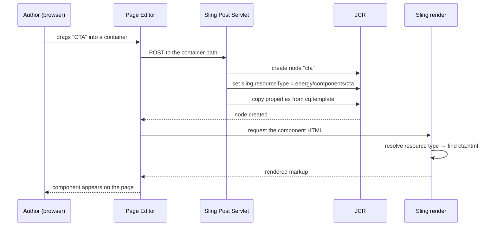
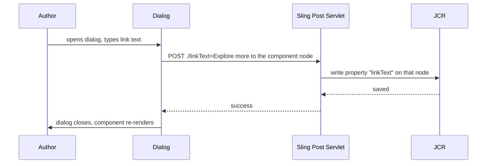

# 02 – Component Development

> **Target:** 3–4 years experienced AEM Developer
> **Syllabus point covered:** *"AEM component development. Tell me a complex component you have developed recently."*
> **Project domain used throughout:** a global **energy technology** company — high-voltage equipment, grid solutions, transformers, and a large multi-country marketing site.

---

## Before we start — why this file matters more than most

Your syllabus has one line for this topic, and it hides a trap:

> *"Tell me a complex component you have developed recently."*

That question is not asking you to define a component. It is asking you to **prove you have built things**. Interviewers use it as a lie detector. Someone who has only read about components describes one in general terms. Someone who has actually built one mentions the dialog structure, the multifield that fought them, and the thing that broke on publish.

So this file does three jobs.

**First**, it makes sure you genuinely understand how a component is assembled — every file, what it does, and why. That is sections 1 to 3.

**Second**, it gives you **three complete components at three difficulty levels**, fully coded:

| Level | Component | Answer length | What it proves |
|---|---|---|---|
| **Simple** | CTA link/button | ~1 minute | You know dialog basics and the classic traps |
| **Medium** | FAQ accordion | ~2 minutes | You can handle multifields, nested models and accessibility |
| **Complex** | Tabbed product listing with Load More | ~3 minutes | You think about queries, caching and architecture |

Interviewers often warm up with *"start with something simple"* before pushing to *"now tell me the most complex one."* Having a graded set means you are never caught either over-explaining a trivial component or under-explaining a hard one.

**Third**, it grounds every example in a **real, coherent project** so your stories hang together across all 40+ files of this repository.

### A note on the project domain

Every example in this repository is set on a **global energy technology company's marketing site** — the kind that sells transformers, HVDC systems, grid automation and power quality equipment to utilities and industrial customers.

This is a genuinely good domain to talk about in interviews, because it naturally justifies the things AEM interviewers care about:

- **A large, deep product catalogue** — hundreds of product category pages, which forces derived listings rather than hand-authored ones.
- **Many countries and languages** — URLs like `/us/en/...` and `/in/en/...` alongside a global site, which is a natural MSM and language-copy conversation.
- **Technical documentation and PDF downloads** — a real integration story.
- **SEO-driven content** like FAQ sections, because industrial buyers search technical questions.
- **High but not consumer-scale traffic**, so caching matters without the story becoming implausible.

> **Important:** never name the client in an interview, and this repository never does. "A global energy technology company" or "an industrial energy client" is the correct level of detail. Naming clients is a professionalism red flag, and interviewers do notice.

> ### ⚠️ Read this before using any story in this file
>
> These stories are **shapes, not scripts**. Interviewers at companies like Publicis Sapient and Valtech will drill three or four levels into anything you say. If you claim you fixed a caching problem, the next four questions will be about hit ratios, statfiles, and what you measured.
>
> So fill these shapes with things you can actually defend. Support experience counts — *"I traced a stale-content issue to a blocked replication queue"* is a real, honest, technical story. A POC you built counts. WKND tutorial work counts. A borrowed story you cannot defend does more damage than having no story at all.

---

## 1. Introduction

### 1.1 What is a component, really?

Most people answer with "a reusable piece of a page." True, but shallow, and it tells an interviewer nothing.

Here is a more useful definition:

> **A component is a folder under `/apps` containing everything needed to render one type of content and to let an author edit it.**

Read that again, because both halves matter.

**"Everything needed to render"** — the HTL file, and usually a Sling Model holding the logic.

**"And to let an author edit it"** — the dialog. This is what makes AEM a CMS rather than a templating engine. Without a dialog you have hardcoded HTML. With one, a content author changes the page without a developer.

That second half is where most interview follow-ups live, and it is the part beginners consistently underestimate.

### 1.2 How a component connects to content

Component development only makes sense if you remember how Sling works, so let's connect back to file 01.

Recall the chain: **URL → Resource → Resource Type → Script**.

A component is the "Resource Type → Script" half. When an author drags a CTA onto a product page, AEM creates a node and sets one property:

```
/content/energy/global/en/products-and-solutions/transformers/jcr:content/root/container/cta
    ├── sling:resourceType = "energy/components/cta"     ← points at your component
    ├── linkText = "Read the Press Release"
    └── linkUrl  = "/content/energy/global/en/news/press-releases/2026/grid-upgrade"
```

That `sling:resourceType` is the **entire link** between content and code. Sling reads it, goes to `/apps/energy/components/cta`, finds `cta.html`, and runs it.

**So a component is just a folder that a content node points at.** Once that lands, a lot of AEM stops being mysterious — including why a component "disappears" when someone renames a folder, and why copying content between projects breaks rendering.

### 1.3 Why we build custom components at all

Adobe ships **Core Components** — around thirty ready-made components covering text, image, teaser, carousel, tabs, accordion, breadcrumb, navigation, forms and more. They are accessible, tested, and Adobe maintains them.

So the honest question in a modern interview is not "how do you build a component" but **"when should you build one at all?"**

The answer that scores well:

> "My default is to use a Core Component and extend it, not build from scratch. They're accessible, tested, and Adobe keeps them updated — that's free maintenance I don't want to give up. I build custom only when the requirement genuinely has no Core Component equivalent, like a listing that derives its cards from the page tree. And even when I extend, I do it through a proxy so we control the version."

That one answer tells the interviewer you have worked on a real, maintained project rather than a tutorial.

### 1.4 The decision tree

Here is what I would actually reason through, and it makes a good whiteboard answer:

**Does a Core Component roughly do this already?**

→ Yes, and I only need it to *look* different → **Style System.** No code at all.
→ Yes, but I need one or two extra fields → **Extend** via `sling:resourceSuperType`, add to the dialog via the Resource Merger.
→ Yes, but the markup is fundamentally wrong for our design system → **Extend** and override only the HTL.
→ No, this is genuinely new behaviour → **Build custom**, but still follow Core Component patterns.

Notice how far down "build custom" sits. **That ordering is the answer.**

### 1.5 A project description to adapt

> "On my current project — a global energy technology company's marketing site — we have around 45 components. About 25 are proxies to Core Components with small dialog additions, so we wrote almost no code for those. Around 10 are Core Components with custom HTL because the design system needed different markup. And about 8 are genuinely custom, mostly listings that derive their content from the page tree rather than being hand-authored, plus the components that integrate with our document publishing system."

That is strong because it shows **proportion**. A candidate who says "we built 45 custom components" is telling the interviewer their project has a maintenance problem.

---

## 2. Core Concepts

### 2.1 The anatomy of a component — every file explained

Let's open a real component folder and go through it file by file. You should be able to draw this from memory.

```
/apps/energy/components/cta/
│
├── .content.xml            ← the component definition itself
├── cta.html                ← the HTL script that renders it
│
├── _cq_dialog/
│   └── .content.xml        ← the author dialog (Touch UI)
│
├── _cq_editConfig.xml      ← how it behaves in the page editor
│
├── _cq_template/
│   └── .content.xml        ← default content when first dropped
│
└── clientlibs/             ← optional CSS/JS just for this component
```

**A note on the underscore naming.** In the repository these nodes are called `cq:dialog`, `cq:editConfig` and `cq:template`. But a colon is not a legal filename character, so FileVault — the tool that serialises the repository to disk — writes them as `_cq_dialog`, `_cq_editConfig`, `_cq_template`.

Same node, different spelling depending on whether you are looking at CRXDE or your IDE. This confuses people constantly, and knowing it is a small credibility signal.

---

### 2.2 `.content.xml` — the component definition

This file is what says "this folder is a component." Without it, the folder is just a folder.

```xml
<?xml version="1.0" encoding="UTF-8"?>
<jcr:root xmlns:sling="http://sling.apache.org/jcr/sling/1.0"
          xmlns:cq="http://www.day.com/jcr/cq/1.0"
          xmlns:jcr="http://www.jcp.org/jcr/1.0"
    jcr:primaryType="cq:Component"
    jcr:title="Call to Action"
    jcr:description="A single link styled as a button or arrow link"
    componentGroup="Energy - Content"/>
```

Let me explain each property, and — more usefully — **what breaks if you get it wrong.**

**`jcr:primaryType="cq:Component"`** — this is what makes it a component. Missing or wrong, and AEM does not recognise the folder at all. It will never appear anywhere in the UI.

**`jcr:title`** — the name authors see in the component browser. Make it human-readable; authors are not developers.

**`jcr:description`** — the tooltip. Usually skipped, and authors quietly suffer for it.

**`componentGroup`** — which group the component appears under in the component browser. This one has behaviour worth knowing: **if `componentGroup` is empty or set to `.hidden`, the component does not appear in the component browser at all.**

That is deliberate, not a bug. It is how you hide components meant only for internal use — for example the individual item inside a carousel. An author should never drag a "carousel item" onto a page; only the carousel should create them.

**This is a real interview question:** *"Your component doesn't show up in the component browser. Why?"* Two answers: `componentGroup` is empty or `.hidden`, **or** the component is not in the allowed list of the template's policy. Give both and you have answered completely.

**`sling:resourceSuperType`** — the inheritance pointer, covered next. It is the single most important concept in modern component development.

---

### 2.3 The proxy component pattern — the most important concept here

This gets its own section because it comes up in every AEM interview involving Core Components, and getting it right marks you as current rather than someone who learned AEM in 2016.

**Start with the problem it solves.**

Core Components live outside your project — their code sits under `/apps/core/wcm/components/...`. Now imagine an author drags Adobe's Accordion directly onto a page. The content node gets:

```
sling:resourceType = "core/wcm/components/accordion/v1/accordion"
```

That resource type is now baked into hundreds of content nodes across your site. Three real problems follow:

**One — you cannot customise anything.** If the design system needs different markup or one extra field, you have nowhere to put it. You would have to edit Adobe's component, which lives outside your project.

**Two — you do not control version upgrades.** When Core Components ship v2 of the accordion, your content still says v1. Moving to v2 means rewriting every affected content node.

**Three — your content depends on Adobe's internal paths.** That is coupling you never want.

**The solution is the proxy component.** You create a tiny component in your own project that inherits:

`/apps/energy/components/accordion/.content.xml`

```xml
<?xml version="1.0" encoding="UTF-8"?>
<jcr:root xmlns:sling="http://sling.apache.org/jcr/sling/1.0"
          xmlns:cq="http://www.day.com/jcr/cq/1.0"
          xmlns:jcr="http://www.jcp.org/jcr/1.0"
    jcr:primaryType="cq:Component"
    jcr:title="Accordion"
    componentGroup="Energy - Content"
    sling:resourceSuperType="core/wcm/components/accordion/v1/accordion"/>
```

**That is the entire file.** No HTL. No dialog. No Java. Just a pointer.

Now authors use *your* accordion, content stores `energy/components/accordion`, and look at what you gained:

**Selective override.** Want different markup? Add an `accordion.html` in your folder and Sling uses yours — but everything you did *not* override still comes from the Core Component.

**Version control.** Upgrading is a one-line change in the proxy. Not a single content node changes.

**Decoupling.** Your content depends only on your own paths.

**The interview answer:**

> "A proxy component is a component in our own project whose only real content is a `sling:resourceSuperType` pointing at a Core Component — essentially an empty shell. We always do this for control. Content nodes then reference our resource type instead of Adobe's, so we can override the HTL or part of the dialog later without touching content, and upgrading Core Components from v1 to v2 becomes a one-line change in the proxy rather than a content migration across hundreds of nodes. Adobe's own documentation recommends never using Core Components directly."

**How inheritance resolves.** When Sling needs `accordion.html` for resource type `energy/components/accordion`:

```
1. /apps/energy/components/accordion/accordion.html            ← yours, if it exists
2. → not found, so follow sling:resourceSuperType
3. /apps/core/wcm/components/accordion/v1/accordion/accordion.html   ← Adobe's
```

The same fallback applies to the dialog, the edit config, everything. That is why a proxy with a single `.content.xml` works perfectly — it all falls through to the parent.

---

### 2.4 The HTL file — how the script gets found

The rendering script is an HTL file, and there is a naming rule that catches everyone once:

> **The HTL file must be named after the component's folder.**

So `/apps/energy/components/cta/` needs `cta.html`. Not `index.html`, not `main.html`.

**Why?** Go back to script resolution in file 01. One rule was *"a script named after the last segment of the resource type."* The resource type is `energy/components/cta`, last segment `cta`, so Sling looks for `cta.html`. It is the same rule you already learned, applied to components — not a special component rule.

---

### 2.5 The dialog — where authors actually work

The dialog is the form an author fills in. It lives at `_cq_dialog/.content.xml`, written as a tree of Granite UI resource types.

Be honest with yourself: **dialog XML is verbose and nobody memorises it.** What interviewers test is whether you understand its *structure* and the handful of properties that cause bugs.

**The structural skeleton.** Every Touch UI dialog nests the same way:

```
cq:dialog
 └── content            (container)
      └── items
           └── tabs     (optional)
                └── items
                     └── properties   (one tab)
                          └── items
                               └── columns   (layout)
                                    └── items
                                         └── your actual fields
```

That is a lot of nesting for a text field, but there is a rhythm: **container → items → container → items**, repeating. Once you see it, you can read any dialog.

**Now the properties that actually cause bugs.**

**`name="./title"` — the `./` prefix is not optional.**

This is the single most common dialog bug in AEM, and it is asked about constantly.

`./` means "relative to the current component's node." Without it, the value is written **to the parent node** instead. The dialog appears to save — no error, no warning — but your Sling Model reads nothing, because the property landed one level up.

So when asked *"the author fills the dialog and clicks save, but the value doesn't appear"*, the first check is a missing `./`.

**`required="{Boolean}true"`** — note the `{Boolean}` type hint. XML attributes are strings by default. `{Boolean}` tells FileVault to store a real boolean. Write `required="true"` without it and you store the *string* `"true"`, which some Granite fields ignore. Same for `{Long}` on numbers.

**`fieldLabel` and `fieldDescription`** — the label and help text. Authors judge your component almost entirely on these.

**`emptyText`** — placeholder shown when empty.

**The field types worth knowing by name:**

| What you need | Resource type (under `granite/ui/components/coral/foundation/form/` unless noted) |
|---|---|
| Single line of text | `textfield` |
| Multiple lines | `textarea` |
| Rich text editor | `cq/gui/components/authoring/dialog/richtext` |
| Pick a page or asset | `pathfield` |
| Dropdown | `select` |
| Checkbox | `checkbox` |
| On/off toggle | `switch` |
| Number | `numberfield` |
| Date | `datepicker` |
| Radio buttons | `radiogroup` |
| Hidden value | `hidden` |
| Upload a file | `fileupload` |
| Repeatable set of fields | `multifield` |
| Tag picker | `cq/gui/components/coral/common/form/tagfield` |
| Colour picker | `colorfield` |

---

### 2.6 Multifields — the one authors always ask for

A multifield lets an author add a repeating set of values — a list of links, a set of FAQ questions, a group of specifications. It appears in almost every project, and in interviews, because there are **two kinds** and candidates mix them up.

**Simple multifield — one value per row.**

Values are stored as a **String array** on one property.

```xml
<applications
    jcr:primaryType="nt:unstructured"
    sling:resourceType="granite/ui/components/coral/foundation/form/multifield"
    fieldLabel="Applications">
    <field
        jcr:primaryType="nt:unstructured"
        sling:resourceType="granite/ui/components/coral/foundation/form/textfield"
        name="./applications"/>
</applications>
```

Stored as:

```
applications = ["Utilities", "Railways", "Data Centers"]     ← one multi-value property
```

Read in Java as `String[]` or `List<String>`.

**Composite multifield — several fields per row.**

Each row becomes its own **child node**.

```xml
<faqs
    jcr:primaryType="nt:unstructured"
    sling:resourceType="granite/ui/components/coral/foundation/form/multifield"
    composite="{Boolean}true"
    fieldLabel="Questions">
    <field
        jcr:primaryType="nt:unstructured"
        sling:resourceType="granite/ui/components/coral/foundation/container"
        name="./faqs">
        <items jcr:primaryType="nt:unstructured">
            <question
                jcr:primaryType="nt:unstructured"
                sling:resourceType="granite/ui/components/coral/foundation/form/textfield"
                fieldLabel="Question"
                name="./question"/>
            <answer
                jcr:primaryType="nt:unstructured"
                sling:resourceType="cq/gui/components/authoring/dialog/richtext"
                fieldLabel="Answer"
                name="./answer"/>
        </items>
    </field>
</faqs>
```

Stored as:

```
faqs/
  ├── item0/
  │    ├── question = "What is a transformer in electricity?"
  │    └── answer   = "<p>A transformer changes the voltage level...</p>"
  └── item1/
       ├── question = "What do electrical transformers do?"
       └── answer   = "<p>They transfer electrical energy between circuits...</p>"
```

Read with `@ChildResource` into a `List<FaqItemModel>`.

**The three things that make composite multifields work, and that people forget:**

1. **`composite="{Boolean}true"`** on the multifield. Without it, only the first field saves.
2. **The `field` node must be a container**, not a form field.
3. **`name="./faqs"` goes on the container**, and inner fields use plain relative names. The paths combine.

**The interview question:** *"Difference between simple and composite multifield?"*

> "A simple multifield stores a multi-value string property on the component node — one value per row. A composite sets `composite=true` and wraps its fields in a container, so each row becomes a child node like `faqs/item0`, `faqs/item1`, each holding several properties. I read the simple one as a `String[]`, and the composite one with `@ChildResource` into a list of a nested model class."

---

### 2.7 `cq:editConfig` — behaviour in the editor

This controls what happens **in the page editor**, not on the published page. It is optional, but there are things you can only do here.

```xml
<?xml version="1.0" encoding="UTF-8"?>
<jcr:root xmlns:cq="http://www.day.com/jcr/cq/1.0"
          xmlns:jcr="http://www.jcp.org/jcr/1.0"
    jcr:primaryType="cq:EditConfig"
    cq:actions="[text:CTA,-,edit,copymove,delete,insert]"
    cq:dialogMode="floating"
    cq:layout="editbar">
    <cq:listeners
        jcr:primaryType="cq:EditListenersConfig"
        afteredit="REFRESH_SELF"/>
</jcr:root>
```

**`cq:actions`** — which buttons appear on the toolbar.

**`cq:listeners`** — what happens after an edit. `REFRESH_PAGE` reloads the whole page; `REFRESH_SELF` reloads just this component.

This matters for a real reason. **By default AEM refreshes only the component.** Fast, but if your component's change affects something outside itself — say a filter driving a list below it — the page looks wrong until the author reloads manually. `afteredit="REFRESH_PAGE"` fixes it.

That is genuinely good to mention in an interview, because it shows you have watched real authors use your component.

**`cq:dropTargets`** — lets an author drag an asset from the DAM onto the component. `propertyName` says where the path is written, `accept` restricts MIME types.

**`cq:inplaceEditing`** — lets the author edit text directly on the page instead of opening the dialog.

---

### 2.8 `cq:template` — default content

When an author drops your component, sometimes you want sensible defaults rather than an empty box.

```xml
<?xml version="1.0" encoding="UTF-8"?>
<jcr:root xmlns:jcr="http://www.jcp.org/jcr/1.0"
          xmlns:nt="http://www.jcp.org/jcr/nt/1.0"
    jcr:primaryType="nt:unstructured"
    linkText="Explore more"
    style="arrow"/>
```

These properties are copied onto the new node the moment the component is added.

**Do not confuse this with a page template.** Same word, completely different thing. `cq:template` inside a component is default content for that component. A page template — file 03 — defines a whole page's structure. Interviewers occasionally use this overlap as a trick question.

---

### 2.9 Component-level clientlibs

You can put a `clientlibs` folder inside a component so its CSS and JS travel with it. Full detail is in file 04, but the relevant idea:

**The advantage** is cohesion — everything about the component lives in one folder, and deleting the component removes its styles too.

**The catch** is that a component clientlib still has to be **loaded by something**. It does not load automatically just because the component is on the page. Either the page component includes it by category, or you `embed` it into a site-wide bundle.

This trips people up: they put CSS in a component clientlib, see nothing, and assume it is broken. It is not broken — nobody asked for it.

---

### 2.10 Types of component

Not every component is a box on a page. Categorising them shows architectural awareness.

**Content components** — the ordinary kind. CTA, text, image, teaser.

**Container components** — components holding other components. `cq:isContainer="{Boolean}true"`, renders a parsys inside. Tabs and accordions are usually containers.

**Structure components** — the page component itself, header, footer. Placed by the template, not by authors.

**Utility / hidden components** — things like a carousel's individual item. They exist so a container can create them. That is exactly what `componentGroup=".hidden"` is for.

---

## 3. Internal Working

### 3.1 What happens when an author drops a component

Understanding this sequence explains several bugs at once.



Now the author opens the dialog and saves:



**Here is the insight worth carrying away:** notice that **you never wrote a servlet** to save that dialog. AEM did not generate one either.

The **Sling Post Servlet** — from file 01 — handles it. It is Sling's built-in handler for POST to a repository path, and its default behaviour is "take the form fields and write them as properties on the node at this path."

That is why `./` matters so much. The POST goes to the component's node path, and `./linkText` means "the property `linkText` on the node I'm posting to." Drop the `./` and the field name is addressed differently, so the value lands somewhere you did not intend.

**This connects three things you now know:** dialogs are HTML forms, the Sling Post Servlet writes them to the repository, and `./` is the addressing scheme. Explain it that way and it sounds like understanding, not memorisation.

### 3.2 How the resource super type chain resolves

Let's make this precise, because interviewers push on it.

Say you have:

```
/apps/energy/components/accordion
    sling:resourceSuperType = "core/wcm/components/accordion/v1/accordion"
```

and your folder contains **only** `.content.xml` and a custom `accordion.html`.

**HTL script** — yours is found immediately and used.
**Dialog** — not found in your folder, so Sling follows `sling:resourceSuperType` and uses Adobe's.
**Edit config** — same, Adobe's is used.

So you get Adobe's dialog and editing behaviour with your own markup. **Selective override.** That is the whole point.

**The follow-up is almost always:** *"How do you add one extra field to an inherited dialog without copying the whole thing?"*

The **Sling Resource Merger** — from file 01. You create a dialog containing *only* the new field, plus `sling:orderBefore` to position it. Sling merges your partial dialog with the inherited one instead of replacing it.

```xml
<seoIntro
    jcr:primaryType="nt:unstructured"
    sling:resourceType="granite/ui/components/coral/foundation/form/textarea"
    fieldLabel="SEO Intro Text"
    name="./seoIntro"
    sling:orderBefore="items"/>
```

You can also **remove** an inherited field with `sling:hideResource="{Boolean}true"`, or hide properties with `sling:hideProperties`.

Naming the Resource Merger and giving these three properties is a strong intermediate answer.

### 3.3 The decoration wrapper — where those extra divs come from

You write clean HTL, and the rendered page has `<div>` elements you never wrote.

Those come from the **decoration tag**. AEM wraps each component in a div so the page editor has something to attach its toolbar and click handlers to.

Usually fine. But sometimes it breaks your CSS — particularly with flexbox and grid, where an unexpected wrapper changes the layout entirely.

Three ways to control it:

**Per include, in HTL:**
```html
<sly data-sly-resource="${'cta' @ resourceType='energy/components/cta', decoration=false}"/>
```

**Always, on the component:** `cq:noDecoration="{Boolean}true"` in `.content.xml`.

**Change the tag rather than remove it:**
```html
<sly data-sly-resource="${item.path @ decorationTagName='li'}"/>
```

That last one matters when the wrapper must be a valid child — inside a `<ul>`, a `<div>` is invalid HTML but an `<li>` is correct.

**A caution worth mentioning:** removing decoration entirely makes a component harder to select in the editor, because the editor loses the element it attaches to. Usually the better answer is changing the tag name, not removing the wrapper.

---

## 4. Important Interview Questions

### 4.1 Basic

**Q1. What is a component in AEM?**
A folder under `/apps` containing everything needed to render one type of content and let an author edit it — HTL, dialog, usually a Sling Model. Content points at it via `sling:resourceType`.

*Cross:* Where do they live? · What node type? (`cq:Component`) · What links content to a component?

**Q2. What files make up a component?**
`.content.xml` defines it, an HTL file named after the folder renders it, `_cq_dialog` is the author form, optionally `_cq_editConfig` for editor behaviour, `_cq_template` for defaults, and optionally clientlibs.

*Cross:* Why `_cq_dialog` on disk but `cq:dialog` in CRXDE? · Which are mandatory? (strictly, only `.content.xml`) · What if there is no dialog? (authors can't configure it)

**Q3. Why must the HTL file be named after the folder?**
Sling script resolution — one of its rules is a script named after the last segment of the resource type. For `energy/components/cta`, that segment is `cta`, so Sling looks for `cta.html`.

*Cross:* What if you name it something else? (not found, unless another rule matches) · Can a component have several HTL files? (yes — selector-based, like `print.html`)

**Q4. What is `componentGroup`?**
It groups components in the author's component browser. Empty or `.hidden` means it does not appear there at all.

*Cross:* Why hide one deliberately? (helper components like accordion items) · Is that the only reason it might not appear? (no — template policy is the other)

**Q5. What is `sling:resourceSuperType`?**
The inheritance pointer. If a file isn't found in this component, Sling looks in the one it points to.

*Cross:* Difference from `sling:resourceType`? · Can you inherit through several levels? (yes) · What does it enable? (the proxy pattern)

**Q6. What is `cq:dialog`?**
The Touch UI dialog — the form authors fill in, built from Granite UI resource types nested as containers and items.

*Cross:* What was the old one? (`dialog`, Classic UI — deprecated) · What is `cq:design_dialog`? (design dialog for static templates; replaced by policies in editable templates)

**Q7. What does `./` mean in `name="./linkText"`?**
The property is written relative to the component's own node. Without it the value lands on the parent and the component silently reads nothing.

*Cross:* What processes that POST? (Sling Post Servlet) · What is `@TypeHint`? · How do you delete a property? (`@Delete`)

**Q8. What is a Core Component?**
One of Adobe's ready-made, maintained components. Accessible, tested, versioned, updated independently of AEM releases.

*Cross:* Where do they live? · Why version folders like `v1`, `v2`? · Should you use them directly? (no — proxy them)

**Q9. What is `cq:editConfig` for?**
Editor behaviour — toolbar actions, listeners such as `REFRESH_PAGE`, drop targets, in-place editing. No effect on the published page.

*Cross:* Mandatory? (no) · What does `REFRESH_PAGE` do and when do you need it? · What is `cq:dropTargets`?

**Q10. What is `cq:template` inside a component?**
Default property values copied onto the node when the component is first dropped.

*Cross:* How is that different from a page template? (completely different thing) · Where does it live? (`_cq_template` in the component folder)

### 4.2 Intermediate

**Q11. What is a proxy component and why do we use it?**
→ Section 2.3. Cover all three reasons: selective override, version control, decoupling from Adobe's paths.

*Cross:* What's actually in the file? · How do you upgrade v1 to v2? · What if you skip the proxy?

**Q12. How do you add one field to an inherited dialog without copying it?**
Sling Resource Merger — a dialog containing only the new field, positioned with `sling:orderBefore`. Remove inherited fields with `sling:hideResource`.

*Cross:* Which mount path? (`/mnt/overlay`) · How do you reorder? · Why not just copy the dialog? (you stop receiving Adobe's improvements)

**Q13. Simple versus composite multifield?**
→ Section 2.6.

*Cross:* How do you read each in a model? · What are the child nodes called? (`item0`, `item1`, …) · What breaks without `composite=true`? (only the first field saves)

**Q14. Extending versus overlaying?**
Extending uses `sling:resourceSuperType` — scoped to your new component. Overlaying places a file at the same relative path under `/apps` as one in `/libs`, replacing it globally. Extend by default; overlay only for customising the AEM authoring UI itself.

*Cross:* When would you ever overlay? (adding a tab to page properties) · Which is safer on upgrade? · How does the Resource Merger relate to each?

**Q15. Where does component logic go?**
In a Sling Model in the `core` bundle, not the HTL. HTL is deliberately restricted — no arbitrary Java — so logic goes into a testable class that HTL calls with `data-sly-use`.

*Cross:* Why can't you write logic in HTL? (by design, for security and testability) · What came before Sling Models? (WCMUsePojo, then JSP) · How do you unit test it?

**Q16. Why do extra divs appear around my component?**
The decoration tag. Control with `decoration=false`, `cq:noDecoration`, or `decorationTagName`.

*Cross:* Why not always disable it? (harder to select in the editor) · When would you change the tag? (inside a `<ul>`)

**Q17. How do you make a component available on a page?**
Two layers must both allow it. The component needs a non-hidden `componentGroup`. Then the template's **policy** on the container must list the component or its group as allowed. Policy wins — if it does not allow the component, the author never sees it.

*Cross:* Where are policies stored? (`/conf/.../settings/wcm/policies`) · Can two templates differ? (yes) · What is `cq:allowedTemplates`? → file 03.

**Q18. What is `cq:isContainer`?**
It marks a component as one that can contain others — it renders a parsys so authors can drop children in.

*Cross:* Example? (Layout Container, tabs, accordion) · How do you restrict what goes inside? (a policy on the container) · How do children render? (`data-sly-resource` over child resources)

**Q19. How does in-place editing work?**
Configured in `cq:editConfig` under `cq:inplaceEditing`, with an editor type like `text`, `title` or `plaintext`. The author types directly on the page.

*Cross:* How does the value save? (same Sling Post Servlet) · Why might you disable it? (rich text with strict formatting rules)

**Q20. How do you version a component?**
Follow the Core Components convention — each version in its own folder, and the proxy points at the version you want. Existing content keeps working because it references the proxy.

*Cross:* Why not edit in place? (you'd break existing content) · How do you migrate content between versions?

### 4.3 Advanced

**Q21. How would you build a listing component whose items come from the page tree rather than being hand-authored?**

This is the question my flagship story answers, and it is asked constantly on content-heavy sites:

> "First I'd decide **traverse or query**. If the items live under one known root — say all product categories under a parent page — I traverse the children, which needs no index and is predictable. If they can be anywhere and are selected by tag, I have to query, which means confirming there's an Oak index and always setting a limit, otherwise Oak traverses the repository and logs a traversal warning.
>
> Second, **where the work happens**. Building the list goes in `@PostConstruct` so it runs once, not in a getter HTL might call inside a loop.
>
> Third, and this is the architectural one — **how many items render server-side**. If the list is long, I render the first batch server-side so the page is fast and crawlable, and load the rest through a servlet. But that servlet has to stay dispatcher-cacheable, so I register it by resource type with a selector and pass the batch number as a suffix rather than a query parameter.
>
> Fourth, **invalidation**. Derived listings go stale — if an author publishes a new product page, the listing page's cache doesn't know. So we need a flush rule that invalidates the parent listing when a child is activated."

*Cross:* Query or traverse — how do you decide? · Is your query indexed and how do you know? · Why a suffix and not a query parameter? · What happens when an author adds a new product?

**Q22. Your component works on author but is blank on publish. Walk me through it.**

In order:
1. `error.log` on publish first — a model with `OPTIONAL` injection renders empty rather than throwing, so the real error may only be in the log.
2. Was everything it references actually activated? Assets, fragments, and — for derived listings — the child pages themselves.
3. Does the anonymous user have read on every path the component reads?
4. Is the clientlib loading? Check `allowProxy`.
5. Does the model depend on something author-only?

*Cross:* Why does OPTIONAL hide the problem? · How do you test as anonymous? (private window, direct publish URL) · What does the dispatcher have to do with it?

**Q23. How do you make a component accessible?**

Semantic HTML rather than div soup, correct heading levels, `alt` text sourced from a dialog field, ARIA where semantics aren't enough, keyboard navigation for anything interactive, sufficient contrast.

The answer that lands: *"Core Components are built to WCAG standards, which is one more reason to extend rather than start from scratch — you inherit the accessibility work."*

*Cross:* How do you test? (axe, Lighthouse, keyboard-only) · Whose job is alt text? (developer provides the field, author fills it, component handles it being empty) · What is a decorative image?

**Q24. How do you handle a component that must render differently on mobile?**

Prefer CSS. If markup genuinely must differ, use the Style System or an author-controlled dialog field — **not** server-side user-agent detection, because that breaks dispatcher caching completely. Every device variant would need its own cache entry, or worse, the wrong version gets cached and served to everyone.

*Cross:* Why is server-side device detection dangerous with a cache? · What is the Style System? · How do responsive images work in AEM?

**Q25. How do you unit test a component?**

HTL isn't really unit testable; the Sling Model is, and that's where the logic lives. AEM Mocks with JUnit 5 — load test content from JSON, register the model, adapt a resource, assert.

*Cross:* What is `AemContext`? · How do you mock an injected OSGi service? (`context.registerService`) · What does Cloud Manager's quality gate check?

**Q26. How would you let authors change a component's appearance without new components?**

The **Style System**. Style classes are defined in the component's policy, the author picks one from a dropdown, and AEM adds the CSS class to the wrapper. No code change, no new resource type.

Giving this instead of "build a variant component" is a real differentiator.

*Cross:* Where are styles defined? (in the policy) · How is the class applied? (on the decoration wrapper) · Why better than a dialog dropdown? (controlled centrally per template, no code)

**Q27. What is the Sling Model Exporter and why does it matter here?**

It exposes a Sling Model as JSON at `<path>.model.json` via `@Exporter(name = "jackson", extensions = "json")` — how a component's authored content reaches a SPA or mobile app.

*Cross:* Which selector and extension? · How does it relate to the SPA Editor? · Difference from Content Fragments and GraphQL? → file 17.

**Q28. How do you handle validation in a dialog?**

Granite gives `required="{Boolean}true"` and `regexp` on some fields. Beyond that, register a custom validator in JavaScript against a `validation` attribute, using the Granite UI validation registry.

*Cross:* Where does the JS live? (clientlib with category `cq.authoring.dialog`) · How do you show the message? · Can you validate across two fields? (yes, custom validator) → file 11.

### 4.4 Scenario based

**Q29.** *"The author saves the dialog but nothing appears on the page."*
Check in order: missing `./`; model reading a differently-named property; `@Optional` hiding a failed injection; page cached on the dispatcher. Then check the node in CRXDE — that splits the problem cleanly into "not saved" versus "not read."

**Q30.** *"A component works on one template but not another."*
Almost certainly the template policy — the component is not in the allowed list for that container on that template. Check the policy, not the component.

**Q31.** *"After upgrading Core Components, pages broke."*
The content references Adobe's resource type directly instead of a proxy, so it was bound to a specific version and the upgrade changed markup or property names. The long-term fix is proxies; the immediate fix is a content migration or reverting the version.

**Q32.** *"Authors say the component is confusing."*
A real question that candidates dismiss. Add `fieldDescription` help text, group fields into logical tabs, add `emptyText` placeholders, use `cq:template` for sensible defaults, and mark genuinely required fields required so authors get immediate feedback rather than a blank component.

**Q33.** *"The same component must look different for three product lines."*
Style System with different style definitions in each policy. One component, three policies. Do not build three components, and do not add a "brand" dropdown to the dialog.

**Q34.** *"A component made the page very slow."*
Profile first. Usually a synchronous external call in the render path, an unindexed query, or an expensive getter called repeatedly from an HTL loop. Fix accordingly: move work into `@PostConstruct`, add an index, or move the fetch client-side.

### 4.5 Production support

**Q35.** Appears in the browser but can't be dropped → the container's policy doesn't allow it, or the target isn't actually a container.
**Q36.** Renders but unstyled → clientlib not loaded, `allowProxy` not true, or a category typo.
**Q37.** Shows old content after editing → dispatcher cache, or `REFRESH_PAGE` not configured so the editor shows a stale fragment.
**Q38.** Dialog won't open → browser console first; usually malformed dialog XML, a bad `sling:resourceType` on a field, or a JS error from a custom validator clientlib.
**Q39.** Works locally but not on the server → check the package filter actually includes the component path, and that the bundle deployed and is ACTIVE.

---

## 5. Cross Questions — how this topic gets drilled

**Thread A — from "tell me about a component you built"**
What did the dialog look like? → Multifield? → Simple or composite? → How did you read it in the model? → What node structure resulted? → What if the author adds fifty rows? → How did you validate? → What happened when a field was empty?

**Thread B — from "do you use Core Components?"**
Which ones? → Directly or proxied? → What is a proxy? → What's in the file? → How do you override just the markup? → How do you add one dialog field? → What is the Resource Merger? → How do you hide an inherited field? → How would you upgrade v1 to v2?

**Thread C — from "how does a dialog save data?"**
What handles the POST? → What is the Sling Post Servlet? → What does `./` mean? → What happens without it? → What is `@TypeHint`? → How do you delete a property? → How does a composite multifield become child nodes?

**Thread D — from "how do you decide to build a custom component?"**
Why not Core Components? → What can the Style System do instead? → Where are styles defined? → What if the markup must differ, not just CSS? → Extend or overlay? → Which is safer on upgrade?

---

## 6. Best Interview Answers

### 6.1 "Walk me through how you build a component" — about 2 minutes

> "I'd start by asking whether I should build one at all. My first check is whether a Core Component already does most of it, because extending one gives me accessibility and Adobe's ongoing maintenance for free.
>
> Assuming I do need one, I create a folder under `/apps/<project>/components/`. The `.content.xml` marks it as a `cq:Component` with a title, description and `componentGroup` — and if it's a helper component authors shouldn't place directly, I set the group to `.hidden`.
>
> If I'm extending a Core Component, that same file gets `sling:resourceSuperType`, and often that's the entire component — a proxy with no other files, inheriting everything.
>
> The rendering script is an HTL file named after the folder, because Sling's script resolution looks for a script matching the last segment of the resource type. The HTL stays presentation-only; logic goes into a Sling Model in the core bundle that HTL calls with `data-sly-use`, which keeps it unit-testable.
>
> The dialog goes in `_cq_dialog` as Granite UI resource types — containers and items nested down to the fields. The detail I'm careful about is the `./` prefix on every field name, because without it the Sling Post Servlet writes the value to the parent node and the component silently reads nothing.
>
> Then optionally `_cq_editConfig` — I'll add `REFRESH_PAGE` if editing this component changes something outside itself — and `_cq_template` for sensible defaults.
>
> Finally a unit test on the Sling Model with AEM Mocks, because Cloud Manager's quality gate checks coverage on new code."

### 6.2 The graded answer — simple, medium, complex

Interviewers frequently ask for a component story twice: *"give me a simple one first"*, then *"now the most complex thing you've built."* Here are all three, at the right length.

**Simple — about 1 minute**

> "The simplest one I own is our **CTA component**. It's a single link that renders either as a button or as an arrow link — the pattern you see all over the site as 'Read the Press Release' or 'Explore more' with a chevron.
>
> Three dialog fields: link text, a pathfield for the target, and a checkbox for opening in a new tab. Plus a style dropdown for button versus arrow link.
>
> It sounds trivial but it has three details I'd call out. The link can point at an internal page or a PDF in our document publishing system, so the model resolves internal paths through `resourceResolver.map()` to get the short URL, and leaves external ones alone. Second, when the author ticks 'open in new tab' the model emits `rel="noopener noreferrer"` alongside `target="_blank"`, because without it the opened page can manipulate `window.opener`. Third, the checkbox needed an `uncheckedValue`, because otherwise unticking it deletes the property rather than setting it false, which isn't the same thing to the model.
>
> The value of building it was consistency — it replaced about six hand-coded link variants across the site with one component the design system controls."

**Medium — about 2 minutes**

> "A step up is our **FAQ accordion**. Product category pages have FAQ sections — things like 'What is a transformer in electricity?' — and they're written by the content team primarily for SEO, because industrial buyers search technical questions.
>
> The dialog is a composite multifield: each row has a question as a textfield and an answer as rich text. Composite matters here — with `composite=true` and the field node as a container, each row becomes a child node like `faqs/item0` with both properties on it, rather than a flat string array. In the model I read those with `@ChildResource` into a list of a small nested model class.
>
> Two things made it more interesting than it looks. First, **accessibility** — an accordion has a real ARIA contract. Each header is a button with `aria-expanded` and `aria-controls`, each panel has an id and `role="region"` with `aria-labelledby` back to the button. That means generating stable unique IDs, and they have to stay unique when there are two accordions on one page, so I derived them from the component's own path rather than a counter.
>
> Second, **SEO** — since these exist for search, I emit `FAQPage` structured data as JSON-LD alongside the markup, so the questions can appear as rich results. That needed the answer's rich text stripped of HTML for the structured data while keeping it for display.
>
> The result was that FAQ content started appearing as expandable results in search, which was the whole point of the requirement."

**Complex — about 3 minutes.** This is section 7's flagship story; see below.

### 6.3 "Tell me about a complex component you developed recently" — the full answer

**The structure that works:** requirement → what made it complex → approach → the hard part → outcome.

The critical move is *"what made it complex."* Do not describe a component with lots of fields — that is tedious, not complex. Name a genuine technical challenge: an integration, a caching conflict, a performance problem, or an authoring constraint fighting the technical design.

Here it is delivered in full:

> "The most involved one is our **product category listing** — the component behind the main Products and Solutions landing page.
>
> The requirement looked simple: show product categories as cards, grouped into three tabs — products and systems, software, and solutions — with a Load More button because there are more than twenty categories in some tabs.
>
> **What made it complex was that the cards can't be hand-authored.** We have hundreds of product category pages and the portfolio changes constantly. If an author had to add a card manually every time marketing launched a category, it would be permanently out of date. So the cards are **derived** from the page tree — each card is a child page under a configurable root, with its title, description and thumbnail read from that page's properties, filtered by tag.
>
> That created three problems that fought each other.
>
> **First, the query.** My initial version ran a repository-wide QueryBuilder query filtered by tag. It worked locally on a small content set and was slow on stage. Checking the Query Performance tool showed it wasn't hitting an index cleanly and Oak was traversing. I ended up restricting the search to a known path so the traversal was bounded, added a proper limit, and where a genuine tag query was needed we deployed a custom index. The lesson I'd give anyone is that a query that works on a laptop tells you nothing.
>
> **Second, the Load More.** The obvious implementation fetches the next batch with a query parameter — something like `?offset=20`. But query parameters aren't part of the URL path, so the dispatcher won't cache those responses, and every Load More click would go through to publish. Instead I registered a servlet by resource type with a `cards` selector and passed the batch number as a **suffix** — so the URL is a stable path that the dispatcher caches like any other file. Same data, but cacheable.
>
> **Third, invalidation.** Because the listing is derived, publishing a new product page doesn't tell the listing page's cache anything — the listing stays stale until something else flushes it. We handled that with a flush rule so activating a child page invalidates the parent listing.
>
> **The hardest part** was actually the first batch. For SEO and first paint, the initial set of cards has to be in the server-rendered HTML — a crawler won't click Load More. But the later batches come from the servlet. So the same card markup had to render two ways, from HTL server-side and from the JSON response client-side, and they had to be identical or the grid visibly broke at the boundary. I solved it by having the servlet return the rendered HTML fragment rather than raw JSON, so there was exactly one template for a card.
>
> **The outcome** was that the listing page stayed fully dispatcher-cacheable including the Load More responses, the page stopped going stale when the portfolio changed, and the content team stopped raising tickets to add cards — the page just reflects whatever they publish."

**Why this answer works.** It names a specific, believable requirement. It identifies genuine trade-offs rather than listing features. It shows architectural judgment — the suffix-versus-query-parameter decision is exactly the thinking file 01 taught. It includes a mistake the candidate learned from, which reads as honest. And every sentence invites a follow-up you can answer.

---

## 7. Real Project Examples

Three stories, one per level, all from the same coherent project. **Pick the ones you can defend** and make them yours.

### Story 1 (Simple) — the CTA component

**Requirement.** Product and news pages needed consistent call-to-action links — "Read the Press Release", "Read the Customer Success Story", "Explore more" — some rendered as buttons, some as arrow links.

**Why it was worth building.** Before it existed, these were hand-coded inside other components and inside rich text, so there were about six visual variants and none of them matched the design system exactly. Accessibility was inconsistent too — some were `<div>` elements with click handlers rather than real links, so keyboard users couldn't reach them.

**Approach.** One component, four dialog fields: link text, target path, open-in-new-tab, and a style dropdown for button versus arrow. The model resolves internal paths through `resourceResolver.map()` so links render as short URLs rather than `/content/...` paths, and leaves external URLs untouched. Links to the document publishing system open in a new tab by default and get a file-type indicator.

**The details that mattered.** Always a real `<a>` element, never a div with a click handler. `rel="noopener noreferrer"` whenever `target="_blank"`. And `uncheckedValue` on the checkbox, because without it unticking the box deletes the property rather than setting it false — which the model can't distinguish from "never configured."

**Result.** Six variants collapsed into one component. Accessibility audit findings on link semantics went to zero, and the design team could change CTA styling in one place.

### Story 2 (Medium) — the FAQ accordion

**Requirement.** Product category pages needed FAQ sections. The content team writes them for SEO, because industrial buyers search technical questions like "what does an electrical transformer do."

**What made it more than trivial.** Three things: a composite multifield with rich-text answers, a real accessibility contract, and structured data for search.

**Approach.** A composite multifield where each row is a question textfield and a rich-text answer. Read in the model with `@ChildResource` into a list of a nested model class.

**The hard parts.**

*Accessibility.* An accordion has a defined ARIA pattern — each header is a `<button>` with `aria-expanded` and `aria-controls`, each panel has an id, `role="region"` and `aria-labelledby` pointing back. That requires stable unique IDs, and they must stay unique when two accordions appear on one page. Deriving them from a counter broke exactly that case, so I derived them from the component's own resource path instead.

*Structured data.* Since the content exists for SEO, the component emits `FAQPage` JSON-LD so questions can appear as rich results. That meant stripping HTML from the rich-text answer for the structured data while keeping it for display — and being careful not to emit invalid JSON when an author's answer contained quotes.

**Result.** FAQ content began appearing as expandable results in search, which was the requirement's actual goal. And the pattern was reused for a technical-specifications accordion on product detail pages.

### Story 3 (Complex) — the tabbed product category listing with Load More

**Requirement.** The main Products and Solutions landing page shows product categories as cards, grouped into three tabs, with Load More because some tabs hold more than twenty categories.

**What made it complex.** The cards cannot be hand-authored — there are hundreds of category pages and the portfolio changes constantly. So cards are **derived** from the page tree, and that single decision created three conflicting problems.

**Problem one — the query.** The first version ran a repository-wide tag query. Fine locally, slow on stage. The Query Performance tool showed Oak traversing rather than using an index cleanly. Fixed by restricting the search to a known root path so traversal was bounded, always setting a limit, and deploying a custom index where a genuine tag query was unavoidable.

**Problem two — Load More versus caching.** The obvious approach passes an offset as a query parameter, which the dispatcher will not cache — so every Load More click reaches publish. Instead, a servlet registered by resource type with a `cards` selector, taking the batch number as a **suffix**. Same data, stable path, fully cacheable.

**Problem three — stale listings.** A derived listing does not know when a new product page is published. Handled with a flush rule so activating a child page invalidates the parent listing.

**The hardest part.** The first batch has to be server-rendered for SEO and first paint, because a crawler will not click Load More. But later batches come from the servlet. Two rendering paths for identical markup meant the grid visibly broke at the batch boundary whenever they drifted apart. Solved by having the servlet return a rendered HTML fragment rather than raw JSON, so there is exactly one card template.

**Result.** The listing page stayed fully dispatcher-cacheable including Load More responses, stopped going stale as the portfolio changed, and the content team stopped raising tickets to add cards.

---

## 8. Coding Examples

Now let's build all three, in order, so you can see the difficulty ramp.

---

## 8A. SIMPLE — the CTA component

### 8A.1 Component definition

`/apps/energy/components/cta/.content.xml`

```xml
<?xml version="1.0" encoding="UTF-8"?>
<jcr:root xmlns:sling="http://sling.apache.org/jcr/sling/1.0"
          xmlns:cq="http://www.day.com/jcr/cq/1.0"
          xmlns:jcr="http://www.jcp.org/jcr/1.0"
    jcr:primaryType="cq:Component"
    jcr:title="Call to Action"
    jcr:description="A single link rendered as a button or an arrow link"
    componentGroup="Energy - Content"/>
```

### 8A.2 Dialog

`/apps/energy/components/cta/_cq_dialog/.content.xml`

```xml
<?xml version="1.0" encoding="UTF-8"?>
<jcr:root xmlns:sling="http://sling.apache.org/jcr/sling/1.0"
          xmlns:jcr="http://www.jcp.org/jcr/1.0"
          xmlns:nt="http://www.jcp.org/jcr/nt/1.0"
    jcr:primaryType="nt:unstructured"
    jcr:title="Call to Action"
    sling:resourceType="cq/gui/components/authoring/dialog">
    <content
        jcr:primaryType="nt:unstructured"
        sling:resourceType="granite/ui/components/coral/foundation/container">
        <items jcr:primaryType="nt:unstructured">
            <columns
                jcr:primaryType="nt:unstructured"
                sling:resourceType="granite/ui/components/coral/foundation/fixedcolumns"
                margin="{Boolean}true">
                <items jcr:primaryType="nt:unstructured">
                    <column
                        jcr:primaryType="nt:unstructured"
                        sling:resourceType="granite/ui/components/coral/foundation/container">
                        <items jcr:primaryType="nt:unstructured">

                            <linkText
                                jcr:primaryType="nt:unstructured"
                                sling:resourceType="granite/ui/components/coral/foundation/form/textfield"
                                fieldLabel="Link Text"
                                fieldDescription="Must make sense on its own. Screen reader users may hear it out of context, so avoid 'Click here'."
                                name="./linkText"
                                required="{Boolean}true"/>

                            <linkUrl
                                jcr:primaryType="nt:unstructured"
                                sling:resourceType="granite/ui/components/coral/foundation/form/pathfield"
                                fieldLabel="Link Target"
                                fieldDescription="Pick a page, or paste an external URL"
                                name="./linkUrl"
                                rootPath="/content"
                                required="{Boolean}true"/>

                            <style
                                jcr:primaryType="nt:unstructured"
                                sling:resourceType="granite/ui/components/coral/foundation/form/select"
                                fieldLabel="Style"
                                name="./style">
                                <items jcr:primaryType="nt:unstructured">
                                    <arrow
                                        jcr:primaryType="nt:unstructured"
                                        text="Arrow link"
                                        value="arrow"
                                        selected="{Boolean}true"/>
                                    <button
                                        jcr:primaryType="nt:unstructured"
                                        text="Button"
                                        value="button"/>
                                </items>
                            </style>

                            <newTab
                                jcr:primaryType="nt:unstructured"
                                sling:resourceType="granite/ui/components/coral/foundation/form/checkbox"
                                text="Open in a new tab"
                                fieldDescription="Automatically enabled for PDF and document links"
                                name="./newTab"
                                value="{Boolean}true"
                                uncheckedValue="{Boolean}false"/>

                        </items>
                    </column>
                </items>
            </columns>
        </items>
    </content>
</jcr:root>
```

**The three details to point at in an interview:**

Every `name` starts with `./`. The `select` field has an `<items>` node where each child has `text` and `value`, with `selected="{Boolean}true"` marking the default. And the checkbox has **both** `value` and `uncheckedValue` — without `uncheckedValue`, unticking the box removes the property entirely rather than setting it to false, and a missing property is not the same as `false` to your model.

### 8A.3 Sling Model

`core/src/main/java/com/energy/core/models/CtaModel.java`

```java
package com.energy.core.models;

import org.apache.sling.api.resource.Resource;
import org.apache.sling.api.resource.ResourceResolver;
import org.apache.sling.models.annotations.DefaultInjectionStrategy;
import org.apache.sling.models.annotations.Model;
import org.apache.sling.models.annotations.injectorspecific.SlingObject;
import org.apache.sling.models.annotations.injectorspecific.ValueMapValue;

import javax.annotation.PostConstruct;
import org.apache.commons.lang3.StringUtils;

@Model(
        adaptables = Resource.class,
        defaultInjectionStrategy = DefaultInjectionStrategy.OPTIONAL
)
public class CtaModel {

    @ValueMapValue
    private String linkText;

    @ValueMapValue
    private String linkUrl;

    @ValueMapValue
    private String style;

    @ValueMapValue
    private boolean newTab;

    @SlingObject
    private ResourceResolver resourceResolver;

    private String resolvedUrl;
    private boolean openInNewTab;

    @PostConstruct
    protected void init() {
        this.resolvedUrl   = resolveUrl(linkUrl);
        this.openInNewTab  = newTab || isDocumentLink(linkUrl);
    }

    /**
     * Internal /content paths are shortened via resourceResolver.map() so the
     * rendered link matches the public URL. External URLs pass through unchanged.
     */
    private String resolveUrl(String url) {
        if (StringUtils.isBlank(url)) {
            return null;
        }
        if (url.startsWith("/content")) {
            String mapped = resourceResolver.map(url);
            // Internal pages need the .html extension; assets already have one
            return url.startsWith("/content/dam") ? mapped : mapped + ".html";
        }
        return url;
    }

    private boolean isDocumentLink(String url) {
        if (StringUtils.isBlank(url)) {
            return false;
        }
        String lower = url.toLowerCase();
        return lower.endsWith(".pdf") || lower.endsWith(".docx") || lower.endsWith(".xlsx");
    }

    public String getLinkText() {
        return StringUtils.defaultString(linkText);
    }

    public String getLinkUrl() {
        return resolvedUrl;
    }

    public String getStyle() {
        return StringUtils.defaultIfBlank(style, "arrow");
    }

    public String getTarget() {
        return openInNewTab ? "_blank" : null;
    }

    /**
     * Security: target="_blank" without rel="noopener" lets the opened page
     * manipulate this one through window.opener.
     */
    public String getRel() {
        return openInNewTab ? "noopener noreferrer" : null;
    }

    /** Render nothing at all unless we have both a label and a destination. */
    public boolean isReady() {
        return StringUtils.isNotBlank(linkText) && StringUtils.isNotBlank(resolvedUrl);
    }
}
```

### 8A.4 HTL

`/apps/energy/components/cta/cta.html`

```html
<sly data-sly-use.cta="com.energy.core.models.CtaModel"/>

<a data-sly-test="${cta.ready}"
   class="cmp-cta cmp-cta--${cta.style}"
   href="${cta.linkUrl @ context='uri'}"
   target="${cta.target}"
   rel="${cta.rel}">
    <span class="cmp-cta__text">${cta.linkText}</span>
    <span class="cmp-cta__icon" aria-hidden="true" data-sly-test="${cta.style == 'arrow'}">→</span>
</a>

<sly data-sly-test="${!cta.ready && wcmmode.edit}"
     data-sly-resource="${'' @ resourceType='wcm/core/components/placeholder'}"/>
```

**Two details worth explaining.** Returning `null` from `getTarget()` and `getRel()` means HTL **omits the attribute entirely** rather than rendering `target=""` — cleaner markup and valid HTML. And the arrow icon is `aria-hidden="true"` because it is decorative; a screen reader announcing "right arrow" after every link is noise.

---

## 8B. MEDIUM — the FAQ accordion

### 8B.1 Dialog with a composite multifield

`/apps/energy/components/faq/_cq_dialog/.content.xml` (fields only, skeleton omitted for brevity)

```xml
<heading
    jcr:primaryType="nt:unstructured"
    sling:resourceType="granite/ui/components/coral/foundation/form/textfield"
    fieldLabel="Section Heading"
    fieldDescription="For example: Frequently asked questions about transformers"
    name="./heading"/>

<headingLevel
    jcr:primaryType="nt:unstructured"
    sling:resourceType="granite/ui/components/coral/foundation/form/select"
    fieldLabel="Heading Level"
    fieldDescription="Must fit the page's heading order for accessibility"
    name="./headingLevel">
    <items jcr:primaryType="nt:unstructured">
        <h2 jcr:primaryType="nt:unstructured" text="H2" value="h2" selected="{Boolean}true"/>
        <h3 jcr:primaryType="nt:unstructured" text="H3" value="h3"/>
    </items>
</headingLevel>

<!-- COMPOSITE multifield: each row becomes a child node -->
<faqs
    jcr:primaryType="nt:unstructured"
    sling:resourceType="granite/ui/components/coral/foundation/form/multifield"
    composite="{Boolean}true"
    fieldLabel="Questions and Answers"
    fieldDescription="Keep questions phrased the way customers actually search">
    <field
        jcr:primaryType="nt:unstructured"
        sling:resourceType="granite/ui/components/coral/foundation/container"
        name="./faqs">
        <items jcr:primaryType="nt:unstructured">
            <question
                jcr:primaryType="nt:unstructured"
                sling:resourceType="granite/ui/components/coral/foundation/form/textfield"
                fieldLabel="Question"
                name="./question"
                required="{Boolean}true"/>
            <answer
                jcr:primaryType="nt:unstructured"
                sling:resourceType="cq/gui/components/authoring/dialog/richtext"
                fieldLabel="Answer"
                name="./answer"
                useFixedInlineToolbar="{Boolean}true"/>
        </items>
    </field>
</faqs>

<emitStructuredData
    jcr:primaryType="nt:unstructured"
    sling:resourceType="granite/ui/components/coral/foundation/form/checkbox"
    text="Emit FAQ structured data for search engines"
    fieldDescription="Only enable on ONE FAQ component per page"
    name="./emitStructuredData"
    value="{Boolean}true"
    uncheckedValue="{Boolean}false"/>
```

### 8B.2 The nested row model

`core/src/main/java/com/energy/core/models/FaqItemModel.java`

```java
package com.energy.core.models;

import org.apache.commons.lang3.StringUtils;
import org.apache.sling.api.resource.Resource;
import org.apache.sling.models.annotations.DefaultInjectionStrategy;
import org.apache.sling.models.annotations.Model;
import org.apache.sling.models.annotations.injectorspecific.SlingObject;
import org.apache.sling.models.annotations.injectorspecific.ValueMapValue;

@Model(
        adaptables = Resource.class,
        defaultInjectionStrategy = DefaultInjectionStrategy.OPTIONAL
)
public class FaqItemModel {

    @ValueMapValue
    private String question;

    @ValueMapValue
    private String answer;

    @SlingObject
    private Resource resource;

    public String getQuestion() {
        return StringUtils.defaultString(question);
    }

    public String getAnswer() {
        return StringUtils.defaultString(answer);
    }

    /**
     * IDs are derived from this row's own repository path, not a counter.
     *
     * Why: a counter restarts at 0 for every accordion, so two accordions on
     * one page would both emit id="faq-0" -- duplicate IDs break the
     * aria-controls / aria-labelledby relationships and are invalid HTML.
     * The resource path is unique per row across the whole page.
     */
    public String getId() {
        return "faq-" + Math.abs(resource.getPath().hashCode());
    }

    public String getButtonId() {
        return getId() + "-button";
    }

    public String getPanelId() {
        return getId() + "-panel";
    }

    /** Plain text version for JSON-LD, which must not contain markup. */
    public String getPlainAnswer() {
        return getAnswer().replaceAll("<[^>]+>", "").trim();
    }

    public boolean isValid() {
        return StringUtils.isNotBlank(question) && StringUtils.isNotBlank(answer);
    }
}
```

### 8B.3 The parent model

`core/src/main/java/com/energy/core/models/FaqModel.java`

```java
package com.energy.core.models;

import com.fasterxml.jackson.core.JsonProcessingException;
import com.fasterxml.jackson.databind.ObjectMapper;
import com.fasterxml.jackson.databind.node.ArrayNode;
import com.fasterxml.jackson.databind.node.ObjectNode;
import org.apache.commons.lang3.StringUtils;
import org.apache.sling.api.resource.Resource;
import org.apache.sling.models.annotations.DefaultInjectionStrategy;
import org.apache.sling.models.annotations.Model;
import org.apache.sling.models.annotations.injectorspecific.ChildResource;
import org.apache.sling.models.annotations.injectorspecific.ValueMapValue;

import javax.annotation.PostConstruct;
import java.util.Collections;
import java.util.List;
import java.util.stream.Collectors;

@Model(
        adaptables = Resource.class,
        defaultInjectionStrategy = DefaultInjectionStrategy.OPTIONAL
)
public class FaqModel {

    private static final ObjectMapper MAPPER = new ObjectMapper();

    @ValueMapValue
    private String heading;

    @ValueMapValue
    private String headingLevel;

    @ValueMapValue
    private boolean emitStructuredData;

    // Each multifield row is a child node under "faqs",
    // so we inject them as a list of the nested model.
    @ChildResource
    private List<FaqItemModel> faqs;

    private List<FaqItemModel> validFaqs;
    private String structuredData;

    @PostConstruct
    protected void init() {
        // Build ONCE here. HTL may call getFaqs() repeatedly inside a loop.
        this.validFaqs = (faqs == null)
                ? Collections.emptyList()
                : faqs.stream()
                      .filter(FaqItemModel::isValid)
                      .collect(Collectors.toList());

        this.structuredData = emitStructuredData ? buildJsonLd() : null;
    }

    /**
     * Builds schema.org FAQPage JSON-LD so questions can appear as rich results.
     *
     * Built with Jackson rather than string concatenation on purpose: author
     * answers routinely contain quotes and apostrophes, and hand-built JSON
     * breaks the moment one appears.
     */
    private String buildJsonLd() {
        if (validFaqs.isEmpty()) {
            return null;
        }
        try {
            ObjectNode root = MAPPER.createObjectNode();
            root.put("@context", "https://schema.org");
            root.put("@type", "FAQPage");

            ArrayNode entities = root.putArray("mainEntity");
            for (FaqItemModel faq : validFaqs) {
                ObjectNode q = entities.addObject();
                q.put("@type", "Question");
                q.put("name", faq.getQuestion());

                ObjectNode a = q.putObject("acceptedAnswer");
                a.put("@type", "Answer");
                a.put("text", faq.getPlainAnswer());
            }
            return MAPPER.writeValueAsString(root);
        } catch (JsonProcessingException e) {
            // Never let SEO markup break the page
            return null;
        }
    }

    public String getHeading() {
        return StringUtils.defaultString(heading);
    }

    public String getHeadingLevel() {
        return StringUtils.defaultIfBlank(headingLevel, "h2");
    }

    public List<FaqItemModel> getFaqs() {
        return validFaqs;
    }

    public String getStructuredData() {
        return structuredData;
    }

    public boolean isReady() {
        return !validFaqs.isEmpty();
    }
}
```

### 8B.4 HTL with the full ARIA contract

`/apps/energy/components/faq/faq.html`

```html
<sly data-sly-use.faq="com.energy.core.models.FaqModel"/>

<section class="cmp-faq" data-sly-test="${faq.ready}">

    <sly data-sly-element="${faq.headingLevel}" data-sly-test="${faq.heading}">
        <span class="cmp-faq__heading">${faq.heading}</span>
    </sly>

    <dl class="cmp-faq__list">
        <sly data-sly-list.item="${faq.faqs}">

            <dt class="cmp-faq__question">
                <button class="cmp-faq__button"
                        type="button"
                        id="${item.buttonId}"
                        aria-expanded="false"
                        aria-controls="${item.panelId}">
                    <span class="cmp-faq__question-text">${item.question}</span>
                    <span class="cmp-faq__indicator" aria-hidden="true"></span>
                </button>
            </dt>

            <dd class="cmp-faq__answer"
                id="${item.panelId}"
                role="region"
                aria-labelledby="${item.buttonId}"
                hidden>
                ${item.answer @ context='html'}
            </dd>

        </sly>
    </dl>
</section>

<!-- Structured data for search engines. Not visible to users. -->
<script type="application/ld+json"
        data-sly-test="${faq.structuredData}">${faq.structuredData @ context='unsafe'}</script>

<sly data-sly-test="${!faq.ready && wcmmode.edit}"
     data-sly-resource="${'' @ resourceType='wcm/core/components/placeholder'}"/>
```

**The accessibility contract, spelled out** — this is what you explain in the interview:

| Attribute | Why it's there |
|---|---|
| `<button>` not `<div>` | Keyboard focusable and activatable for free |
| `aria-expanded` | Tells a screen reader whether the panel is open |
| `aria-controls` → panel id | Links the button to what it controls |
| `role="region"` on the panel | Makes it a navigable landmark |
| `aria-labelledby` → button id | Names the region using the question |
| `hidden` on collapsed panels | Removes them from the accessibility tree, not just visually |
| `aria-hidden` on the indicator | Stops "plus sign" being announced |

**On `context='unsafe'` for the JSON-LD.** This is the one place you deliberately disable HTL's escaping, because JSON-LD must not be HTML-escaped or search engines cannot parse it. It is safe **only because** the JSON was built by Jackson, which escapes its own values — not because the content is trusted. If an interviewer asks "isn't `unsafe` an XSS risk?", that is exactly the answer: it is safe here because a serialiser produced the string, and it would not be safe if I had concatenated it by hand.

---

## 8C. COMPLEX — tabbed listing with cacheable Load More

The full component is large, so here are the parts that carry the interview.

### 8C.1 The model — derived cards, bounded traversal

```java
package com.energy.core.models;

import com.day.cq.wcm.api.Page;
import com.day.cq.wcm.api.PageManager;
import org.apache.commons.lang3.StringUtils;
import org.apache.sling.api.resource.Resource;
import org.apache.sling.models.annotations.DefaultInjectionStrategy;
import org.apache.sling.models.annotations.Model;
import org.apache.sling.models.annotations.injectorspecific.OSGiService;
import org.apache.sling.models.annotations.injectorspecific.SlingObject;
import org.apache.sling.models.annotations.injectorspecific.ValueMapValue;

import javax.annotation.PostConstruct;
import java.util.ArrayList;
import java.util.Collections;
import java.util.Iterator;
import java.util.List;

@Model(
        adaptables = Resource.class,
        defaultInjectionStrategy = DefaultInjectionStrategy.OPTIONAL
)
public class CategoryListingModel {

    /** Hard ceiling. Even if an author misconfigures the root, we never
     *  build an unbounded list -- that is what takes an instance down. */
    private static final int MAX_TOTAL = 200;
    private static final int DEFAULT_BATCH = 12;

    @ValueMapValue
    private String rootPath;

    @ValueMapValue
    private String[] filterTags;

    @ValueMapValue
    private Integer batchSize;

    @SlingObject
    private Resource resource;

    @OSGiService
    private PageManager pageManager;

    private List<CardModel> firstBatch;
    private int totalCount;

    @PostConstruct
    protected void init() {
        List<CardModel> all = collectCards();
        this.totalCount = all.size();

        int size = (batchSize == null || batchSize < 1) ? DEFAULT_BATCH : batchSize;
        this.firstBatch = all.subList(0, Math.min(size, all.size()));
    }

    /**
     * Walks the children of a KNOWN root instead of running a repository-wide
     * query.
     *
     * Why: a bounded traversal under one parent needs no Oak index and its cost
     * is predictable. A repo-wide tag query needs a custom index, and without
     * one Oak traverses everything and logs a traversal warning -- which is
     * exactly what bit us on stage.
     */
    private List<CardModel> collectCards() {
        if (StringUtils.isBlank(rootPath)) {
            return Collections.emptyList();
        }
        Page root = pageManager.getPage(rootPath);
        if (root == null) {
            return Collections.emptyList();
        }

        List<CardModel> cards = new ArrayList<>();
        Iterator<Page> children = root.listChildren();

        while (children.hasNext() && cards.size() < MAX_TOTAL) {
            Page child = children.next();
            if (child.isHideInNav() || !matchesTags(child)) {
                continue;
            }
            Resource contentResource = child.getContentResource();
            if (contentResource != null) {
                CardModel card = contentResource.adaptTo(CardModel.class);
                // adaptTo can return null -- always guard
                if (card != null && card.isValid()) {
                    cards.add(card);
                }
            }
        }
        return cards;
    }

    private boolean matchesTags(Page page) {
        if (filterTags == null || filterTags.length == 0) {
            return true;
        }
        // ... tag comparison against the page's cq:tags
        return true;
    }

    public List<CardModel> getCards() {
        return firstBatch;
    }

    public boolean isHasMore() {
        return totalCount > firstBatch.size();
    }

    /** The path the Load More button calls -- see the servlet below. */
    public String getLoadMoreUrl() {
        return resource.getPath() + ".cards.html";
    }

    public int getTotalCount() {
        return totalCount;
    }
}
```

### 8C.2 The servlet — why a selector and a suffix, not a query parameter

```java
package com.energy.core.servlets;

import org.apache.sling.api.SlingHttpServletRequest;
import org.apache.sling.api.SlingHttpServletResponse;
import org.apache.sling.api.servlets.SlingSafeMethodsServlet;
import org.apache.sling.servlets.annotations.SlingServletResourceTypes;
import org.osgi.service.component.annotations.Component;

import javax.servlet.Servlet;
import java.io.IOException;

/**
 * Serves additional card batches for the listing component.
 *
 * Registered BY RESOURCE TYPE with a selector, and takes the batch number as a
 * SUFFIX rather than a query parameter.
 *
 * Why it matters: the dispatcher builds its cache filename from the URL PATH.
 * A selector and a suffix are part of the path, so
 *     /content/.../listing.cards.html/2
 * is cached as a file like any page. A query parameter is not part of the
 * path, so
 *     /content/.../listing.cards.html?batch=2
 * would go through to publish on every single Load More click.
 *
 * Same data. One is cacheable, the other is not.
 */
@Component(service = Servlet.class)
@SlingServletResourceTypes(
        resourceTypes = "energy/components/categorylisting",
        selectors = "cards",
        extensions = "html",
        methods = "GET"
)
public class CategoryCardsServlet extends SlingSafeMethodsServlet {

    private static final int MAX_BATCH = 20;

    @Override
    protected void doGet(SlingHttpServletRequest request,
                         SlingHttpServletResponse response) throws IOException {

        int batch = parseBatch(request.getRequestPathInfo().getSuffix());

        response.setContentType("text/html");
        response.setCharacterEncoding("UTF-8");

        // Returns a RENDERED HTML FRAGMENT, not raw JSON.
        //
        // Why: the first batch is server-rendered by HTL for SEO, and later
        // batches come from here. Two separate templates for the same card
        // drifted apart and the grid visibly broke at the batch boundary.
        // Returning HTML means there is exactly ONE card template.
        request.getRequestDispatcher(
                request.getResource(),
                buildOptions(batch)
        ).include(request, response);
    }

    private int parseBatch(String suffix) {
        if (suffix == null) {
            return 1;
        }
        try {
            int value = Integer.parseInt(suffix.replace("/", "").trim());
            // Never trust a URL value -- clamp it
            return Math.max(1, Math.min(value, MAX_BATCH));
        } catch (NumberFormatException e) {
            return 1;
        }
    }

    private org.apache.sling.api.request.RequestDispatcherOptions buildOptions(int batch) {
        org.apache.sling.api.request.RequestDispatcherOptions options =
                new org.apache.sling.api.request.RequestDispatcherOptions();
        options.setReplaceSelectors("cardsfragment." + batch);
        return options;
    }
}
```

**The three things an interviewer will pick up on here:**

**`SlingSafeMethodsServlet`** because this is read-only — it only handles GET and HEAD. Extending `SlingAllMethodsServlet` when you only serve GET is a code-review comment, because you are advertising POST/PUT/DELETE you never implemented. (Full detail in file 07.)

**Registered by resource type, not by path.** A path-bound servlet needs whitelisting in the dispatcher and bypasses ACLs on the resource. Resource-type binding means the URL is a real content path, so permissions apply naturally.

**The batch number is clamped.** `parseBatch` never trusts the suffix — an unbounded value from a URL is how someone makes your server build a 10,000-item list.

### 8C.3 The Load More markup

```html
<div class="cmp-listing"
     data-sly-use.listing="com.energy.core.models.CategoryListingModel"
     data-load-more-url="${listing.loadMoreUrl @ context='uri'}"
     data-total="${listing.totalCount}">

    <div class="cmp-listing__grid" data-listing-grid>
        <sly data-sly-list.card="${listing.cards}"
             data-sly-resource="${card.path @ resourceType='energy/components/card'}"/>
    </div>

    <button class="cmp-listing__more"
            type="button"
            data-sly-test="${listing.hasMore}"
            data-load-more>
        Load more
    </button>

    <!-- Announces new results to screen readers when the grid updates -->
    <div class="sr-only" role="status" aria-live="polite" data-listing-status></div>
</div>
```

**The `aria-live` region is the detail worth mentioning.** When Load More injects cards, a sighted user sees them appear. A screen reader user gets nothing unless you announce it. One `role="status"` element that you update with "12 more results loaded" makes the whole pattern accessible, and almost nobody thinks of it.

### 8C.4 Unit test — testing what actually breaks

```java
package com.energy.core.models;

import io.wcm.testing.mock.aem.junit5.AemContext;
import io.wcm.testing.mock.aem.junit5.AemContextExtension;
import org.apache.sling.api.resource.Resource;
import org.junit.jupiter.api.BeforeEach;
import org.junit.jupiter.api.Test;
import org.junit.jupiter.api.extension.ExtendWith;

import static org.junit.jupiter.api.Assertions.*;

@ExtendWith(AemContextExtension.class)
class FaqModelTest {

    private final AemContext context = new AemContext();

    @BeforeEach
    void setUp() {
        context.load().json("/faq/content.json", "/content");
        context.addModelsForClasses(FaqModel.class, FaqItemModel.class);
    }

    @Test
    void returnsEmptyListWhenNoQuestionsAuthored() {
        FaqModel model = adapt("/content/faq-empty");
        assertNotNull(model);
        assertTrue(model.getFaqs().isEmpty(), "must return empty list, never null");
        assertFalse(model.isReady());
    }

    @Test
    void skipsRowsWhereAuthorLeftTheAnswerBlank() {
        // Authors WILL do this. It is the most common real-world case.
        FaqModel model = adapt("/content/faq-partial");
        assertEquals(1, model.getFaqs().size(),
                "rows with a blank answer must be filtered out");
    }

    @Test
    void generatesUniqueIdsAcrossTwoAccordionsOnOnePage() {
        // The bug that a counter-based ID would cause.
        FaqModel first  = adapt("/content/page/first-faq");
        FaqModel second = adapt("/content/page/second-faq");

        String firstId  = first.getFaqs().get(0).getPanelId();
        String secondId = second.getFaqs().get(0).getPanelId();

        assertNotEquals(firstId, secondId,
                "two accordions on one page must not emit duplicate IDs");
    }

    @Test
    void structuredDataIsOmittedWhenDisabled() {
        FaqModel model = adapt("/content/faq-no-seo");
        assertNull(model.getStructuredData());
    }

    private FaqModel adapt(String path) {
        Resource resource = context.resourceResolver().getResource(path);
        assertNotNull(resource, "test content missing at " + path);
        return resource.adaptTo(FaqModel.class);
    }
}
```

**Note what is being tested.** Not "does the getter return the field" — that tests nothing. These cover **the cases authors actually create**: a blank component, a half-filled row, two accordions on one page. Those are the paths that break in production, and testing them is what makes a test worth writing. Say that in an interview and it separates you immediately.

---

## 9. Common Mistakes

| The mistake | What actually happens | The fix |
|---|---|---|
| Missing `./` in a dialog field `name` | Value written to the parent node; component silently reads nothing | Always `name="./propertyName"` |
| Forgetting `composite="{Boolean}true"` | Only the first field in each row saves | Add it, and make the `field` node a container |
| `required="true"` without `{Boolean}` | Stored as a string; some fields ignore it | Use `{Boolean}true` |
| Checkbox with no `uncheckedValue` | Unticking deletes the property rather than setting false | Set both `value` and `uncheckedValue` |
| HTL file not named after the folder | Sling never finds the script | Name it exactly after the folder |
| Using a Core Component directly | Adobe's resource type baked into content; upgrades become migrations | Always create a proxy |
| Overlaying `/libs` instead of extending | Changes behaviour globally; breaks on upgrade | Use `sling:resourceSuperType` |
| Business logic in HTL | Untestable, and HTL can't express it well anyway | Sling Model |
| Expensive work in a getter | Called repeatedly from HTL loops | `@PostConstruct`, store in a field |
| Returning null from a getter | HTL renders "null", or you need guards everywhere | Empty string / empty list |
| Counter-based IDs in a repeating component | Duplicate IDs when two instances are on one page | Derive from the resource path |
| Unbounded `listChildren()` | Builds a huge list; can take the instance down | Hard ceiling constant, always |
| Trusting a value from a suffix or parameter | Someone requests batch 99999 | Parse and clamp |
| Query parameters for pagination | Dispatcher won't cache; every click hits publish | Selector plus suffix |
| No `data-sly-test` guard | Unconfigured components render empty divs that break layouts | Guard the outer element |
| Empty `componentGroup` by accident | Component never appears in the browser | Set a real group, or `.hidden` deliberately |
| Building a component for a styling variant | Component sprawl and duplicated maintenance | Style System |
| No `fieldDescription` | Authors misuse the component and raise tickets | Help text on every non-obvious field |

---

## 10. Best Practices

**On deciding what to build.** Default to Core Components. Extend through a proxy. Reach for the Style System before building a variant. Build fully custom only when nothing fits — and expect to justify it.

**On structure.** One component, one job. Fifteen dialog fields across six tabs usually means two components. Keep the folder self-contained.

**On the dialog.** Every field gets a `fieldLabel` and, unless obvious, a `fieldDescription`. Group into tabs past roughly six fields. Mark genuinely required fields required. Restrict pathfields with `rootPath` so authors cannot pick something nonsensical.

**On the model.** Adapt from `Resource` unless you genuinely need request-scoped data — it is easier to test and reusable outside a request. Use `OPTIONAL` injection. Never return null. Derived work in `@PostConstruct`. Always put a hard ceiling on anything that builds a list.

**On HTL.** Presentation only. Always guard the outer element with `data-sly-test`. Correct escaping context every time — the *wrong* context is as dangerous as none. Add an editor placeholder for the empty state.

**On accessibility.** Semantic elements, correct heading levels, an alt-text field on every image, keyboard support on anything interactive, and an `aria-live` region for anything that updates content dynamically. Inheriting from Core Components gives you a large head start.

**On performance.** Lazy-load below-the-fold images. Never block on an external call during render. Think about whether a component clientlib belongs in a shared bundle instead.

---

## 11. Debugging Tips

**Start by splitting the problem in half.** Almost every component bug is either "the data isn't there" or "the data is there but isn't rendering." Open CRXDE and look at the component's node. Property missing → dialog problem. Property present → model or HTL problem. That one check saves enormous time and is a genuinely good thing to describe in an interview.

**When the dialog isn't saving:** check the node in CRXDE — did the property land on the parent? That is a missing `./`. Watch the POST in the browser network tab to see exactly what field names are sent. Check the console for JS errors preventing submission.

**When the dialog won't open:** browser console first. Malformed dialog XML, a wrong `sling:resourceType` on a field, or a broken custom validator clientlib.

**When the component renders nothing:** turn on the **Developer layer** in the page editor — it shows the resource type and resolved script, which immediately tells you whether Sling even found your HTL. Check `/system/console/status-adapters` for your model's adapter. Output `${model}` temporarily — an object reference means it resolved, nothing means the adaptation returned null.

**When it works on author but not publish:** was everything it references activated; test as anonymous in a private window against the publish URL directly, which separates permissions from caching; check `allowProxy` on the clientlib.

| Console | What it tells you |
|---|---|
| Developer layer in the editor | Resource type and resolved script per component |
| `/system/console/status-adapters` | Whether your Sling Model adapter registered |
| `/system/console/servletresolver` | What a URL actually resolves to |
| `/crx/de` | Whether the property is on the node, and where |
| Browser network tab | Exactly what the dialog POSTed |

---

## 12. Performance Optimization

**In the model.** Work once in `@PostConstruct`. A getter called from inside `data-sly-list` runs every iteration — a repository lookup inside a fifty-item loop is fifty lookups.

**In listings.** Prefer walking a known path over a repository-wide query. If you must query, confirm it is indexed and always set a limit. Always put a hard ceiling in code as well, because a misconfigured root path should degrade, not kill the instance.

**In external calls.** Never synchronously during render without a timeout. Cache in the OSGi service, or move the fetch client-side.

**In images.** Serve renditions, never the original. `loading="lazy"` below the fold.

**In clientlibs.** A component clientlib shipping on every page is worse than putting the CSS in the site bundle. Consider how many pages actually use the component.

**In caching.** The architectural one. A component rendering per-visitor data server-side makes the whole page uncacheable. Isolate personalisation — client-side fetch, or Sling Dynamic Include — so the rest stays cached. And when you do fetch client-side, use a selector and suffix so *that* response is cacheable too.

---

## 13. Real Production Scenarios

**1. Dialog saves but nothing renders.** Check the node in CRXDE. Property on the parent → missing `./`. Property present → model or HTL.

**2. Only the first field of each multifield row saves.** `composite="{Boolean}true"` missing, or the `field` node isn't a container.

**3. Component missing from the browser.** Empty or `.hidden` `componentGroup`, or the template policy doesn't allow it.

**4. Visible but can't be dropped in.** The container's policy doesn't allow it, or the target isn't a container.

**5. Renders unstyled.** Clientlib not loaded, `allowProxy` not true, or a category typo.

**6. Extra divs breaking the layout.** Decoration wrapper. Change it with `decorationTagName`, or `decoration=false` accepting harder selection in the editor.

**7. Editor shows stale content after an edit.** Add `afteredit="REFRESH_PAGE"` if the edit affects anything outside the component.

**8. Core Components upgrade broke pages.** Content references Adobe's resource type directly. Migrate content and introduce proxies.

**9. Component throws when a field is empty.** Injection strategy is `REQUIRED`, or a getter doesn't null-check.

**10. Page slow after adding one component.** Profile. Usually a blocking external call, an unindexed query, or an expensive getter in a loop.

**11. Unticking a checkbox doesn't disable the feature.** No `uncheckedValue`, so the property is deleted rather than set false — and a missing property may not equal false in your logic.

**12. Two accordions on one page, and clicking one opens the other.** Duplicate IDs from counter-based generation. Derive IDs from the resource path.

**13. Load More button hammers publish.** Pagination passed as a query parameter, so the dispatcher never caches it. Move to a selector plus suffix.

**14. Derived listing shows stale content after publishing a new page.** The listing page's cache doesn't know a child changed. Add a flush rule invalidating the parent on child activation.

**15. Authors can select the wrong kind of asset.** The pathfield has no `rootPath` restriction.

**16. Works locally but not on the server.** Check the package filter includes the component path, and that the bundle deployed and is ACTIVE.

**17. Rich text renders escaped HTML tags on the page.** Missing `@ context='html'` on that value.

**18. `target="_blank"` links flagged in a security review.** Missing `rel="noopener noreferrer"`.

**19. Screen reader users can't tell that Load More did anything.** No `aria-live` region announcing the update.

**20. JSON-LD structured data invalid in Search Console.** Built by string concatenation and an author's answer contained a quote. Build it with a serialiser.

---

## 14. Follow-up Questions

- How many components does your project have?
- How many are custom versus Core Component proxies?
- Who writes the dialogs — you, or a dedicated author-experience person?
- How do you handle a design change affecting twenty components?
- What's your test coverage on models?
- Have you migrated content between component versions?
- What's the most complex dialog you've built?
- How do you decide between a dialog field and a policy setting?
- **What would you do differently if you built that component again?**

That last one deserves a genuine answer. For the listing story: *"I'd have designed the Load More around a selector and suffix from day one. We built it with a query parameter, shipped it, and then spent a sprint undoing the caching problem we'd created in week one."*

---

## 15. Comparison Tables

**Core Component (proxied) versus fully custom**

| | Core Component (proxied) | Fully custom |
|---|---|---|
| Build effort | Very low | High |
| Accessibility | Built in, WCAG tested | Yours to implement |
| Maintenance | Adobe maintains it | You maintain it |
| Upgrades | Change the proxy | Manual |
| Flexibility | Limited to what it supports | Total |
| When to choose | Almost always | Only when nothing fits |

**Extend versus Overlay**

| | Extend | Overlay |
|---|---|---|
| Mechanism | `sling:resourceSuperType` | Same path under `/apps` as `/libs` |
| Scope | Just your new component | Global |
| Upgrade risk | Low | High |
| Typical use | Customising a Core Component | Customising the AEM UI itself |

**Simple versus Composite Multifield**

| | Simple | Composite |
|---|---|---|
| `composite` property | Not set | `{Boolean}true` |
| Fields per row | One | Several |
| Stored as | Multi-value string property | Child nodes `item0`, `item1`, … |
| `field` node type | A form field | A container |
| Read with | `String[]` / `List<String>` | `@ChildResource List<Model>` |

**Dialog field versus Policy setting**

| | Dialog field | Policy setting |
|---|---|---|
| Who changes it | Content author, per instance | Template author, once |
| Example | Link text, heading | Allowed styles, allowed components |
| Varies per | Component instance | Template |
| Rule of thumb | Content varies → dialog | Configuration is consistent → policy |

**The three difficulty levels, side by side**

| | Simple (CTA) | Medium (FAQ) | Complex (Listing) |
|---|---|---|---|
| Dialog | 4 plain fields | Composite multifield | Multifield + tag picker + config |
| Model | ~60 lines | Parent + nested model | Derived data, bounded traversal |
| Extra pieces | None | JSON-LD, ARIA contract | Servlet, caching strategy, flush rule |
| Key risk | Missing `uncheckedValue` | Duplicate IDs | Unindexed query, uncacheable pagination |
| Answer length | ~1 min | ~2 min | ~3 min |

---

## 16. Memory Tricks

**Component files:** *"Define, Render, Edit, Default"* — `.content.xml` defines, HTL renders, `_cq_dialog` edits, `_cq_template` defaults.

**The `./` rule:** *"No dot-slash, no data."*

**Proxy pattern:** *"Point, don't paste."*

**Multifield:** *"Composite means children."*

**Component visibility needs two yeses:** *"Group and policy — both must say yes."*

**Naming:** *"The script wears the folder's name."*

**Where logic lives:** *"HTL shows, Java thinks."*

**Pagination:** *"A dot is cached, a question mark is not."* (from file 01 — selector and suffix cache, query parameters do not)

**IDs in repeating components:** *"Path, not counter."*

---

## 17. Revision Notes

- A component is a folder under `/apps` that content points at via `sling:resourceType`.
- Files: `.content.xml` (`cq:Component`), `<foldername>.html`, `_cq_dialog`, `_cq_editConfig`, `_cq_template`, `clientlibs`. `_cq_` on disk, `cq:` in CRXDE.
- HTL must be named after the folder — Sling script resolution, not a special rule.
- `componentGroup` empty or `.hidden` → not in the browser. **Policy must also allow it.**
- **Proxy pattern:** `sling:resourceSuperType` to a Core Component. Selective override, version control, decoupled content. Always do this.
- **`./` on every dialog field name.** Sling Post Servlet handles the save; nobody writes a servlet for dialogs.
- **Simple multifield** → multi-value string property. **Composite** (`composite=true`, `field` is a container) → child nodes `item0`, `item1`. Read with `@ChildResource`.
- Checkbox needs `value` **and** `uncheckedValue`.
- `{Boolean}` and `{Long}` type hints matter.
- `cq:editConfig`: `cq:actions`, `cq:listeners` (`REFRESH_PAGE`), `cq:dropTargets`, `cq:inplaceEditing`. Editor only.
- Decoration wrapper: `decoration=false`, `cq:noDecoration`, `decorationTagName`.
- **Add one field to an inherited dialog** → Sling Resource Merger, `sling:orderBefore`; remove with `sling:hideResource`.
- Logic in the Sling Model. `@PostConstruct` for derived values. Never return null. Hard ceiling on any list.
- **Derived listings:** traverse a known path over a repo-wide query; index and limit if you must query; hard cap in code.
- **Pagination must use a selector and suffix**, never a query parameter, or the dispatcher can't cache it.
- **IDs in repeating components come from the resource path**, not a counter.
- **Style System** for appearance variants — not new components.
- Test the model on the empty and partial cases authors actually create.

---

## 18. Cheat Sheet

**Component folder**
```
/apps/<project>/components/<name>/
    .content.xml          cq:Component + jcr:title + componentGroup [+ sling:resourceSuperType]
    <name>.html           HTL — must match the folder name
    _cq_dialog/.content.xml
    _cq_editConfig.xml
    _cq_template/.content.xml
    clientlibs/
```

**`.content.xml` properties**
```
jcr:primaryType="cq:Component"      makes it a component
jcr:title                           name shown to authors
jcr:description                     tooltip
componentGroup                      browser group; ".hidden" hides it
sling:resourceSuperType             inherit from another component
cq:isContainer="{Boolean}true"      can hold child components
cq:noDecoration="{Boolean}true"     no wrapper div
```

**Dialog skeleton**
```
cq:dialog (sling:resourceType="cq/gui/components/authoring/dialog")
  └ content   → granite/ui/components/coral/foundation/container
     └ items
        └ tabs   → .../foundation/tabs
           └ items
              └ <tabname> (jcr:title) → .../foundation/container
                 └ items
                    └ columns → .../foundation/fixedcolumns
                       └ items
                          └ column → .../foundation/container
                             └ items
                                └ <your fields>
```

**Field resource types** (prefix `granite/ui/components/coral/foundation/form/`)
```
textfield · textarea · pathfield · select · checkbox · switch
numberfield · datepicker · radiogroup · hidden · fileupload
multifield · colorfield

cq/gui/components/authoring/dialog/richtext      rich text
cq/gui/components/coral/common/form/tagfield     tag picker
```

**Field properties**
```
name="./property"         ALWAYS the ./ prefix
fieldLabel                the label
fieldDescription          help text
required="{Boolean}true"  mandatory
emptyText                 placeholder
value / uncheckedValue    checkboxes — set BOTH
rootPath                  restrict a pathfield
composite="{Boolean}true" composite multifield
selected="{Boolean}true"  default option in a select
```

**Resource Merger**
```
sling:orderBefore="fieldName"        position a merged field
sling:hideResource="{Boolean}true"   remove an inherited field
sling:hideProperties="[prop1,prop2]" hide inherited properties
```

**`cq:editConfig`**
```
cq:actions="[text:Label,-,edit,copymove,delete,insert]"
cq:dialogMode="floating|inline|auto"
cq:listeners → afteredit / afterinsert = "REFRESH_PAGE" | "REFRESH_SELF"
cq:dropTargets → accept, groups, propertyName
cq:inplaceEditing → editorType="text|title|plaintext"
```

**HTL essentials**
```html
data-sly-use.model="com.x.Model"      bind a Sling Model
data-sly-test="${model.ready}"         conditional render
data-sly-list.item="${model.items}"    loop
data-sly-element="${model.headingLevel}"  dynamic tag name
data-sly-resource="${path @ resourceType='...', decoration=false}"
${value @ context='html'}              rich text
${value @ context='uri'}               URLs
${value @ context='unsafe'}            ONLY for serialiser-produced JSON-LD
```

**Accessibility contract for an accordion**
```
<button aria-expanded="false" aria-controls="panelId" id="buttonId">
<panel id="panelId" role="region" aria-labelledby="buttonId" hidden>
decorative icons → aria-hidden="true"
dynamic updates  → <div role="status" aria-live="polite">
```

---

## 19. Frequently Forgotten Things

1. **`./` on every dialog field name.** The single most common component bug.
2. **`composite="{Boolean}true"`** — without it a multifield saves only the first field per row.
3. **The `field` node in a composite multifield must be a container.**
4. **Checkboxes need `uncheckedValue`**, or unticking deletes the property.
5. **`{Boolean}` and `{Long}` type hints** — everything is a string without them.
6. **The HTL file must match the folder name.**
7. **`_cq_dialog` on disk is `cq:dialog` in CRXDE.**
8. **Empty `componentGroup` hides the component** — a feature, not a bug.
9. **Two things must allow a component:** its group, and the template policy.
10. **Always proxy Core Components.**
11. **`cq:template` in a component is not a page template.**
12. **`cq:editConfig` affects the editor only.**
13. **A getter can be called many times from HTL** — do the work in `@PostConstruct`.
14. **`OPTIONAL` injection hides typos.** A misspelled property name gives null, not an error.
15. **`adaptTo()` can return null** — including `contentResource.adaptTo(CardModel.class)` inside a loop.
16. **Pagination via query parameter is not cacheable.** Selector plus suffix.
17. **Counter-based IDs collide** when two instances of a component share a page.

---

## 20. Final Interview Summary

**1. What a component is.** A folder under `/apps` with everything to render one content type and let an author edit it. Content points at it via `sling:resourceType`.

**2. The files.** Definition, HTL named after the folder, dialog, edit config, defaults, clientlib.

**3. The proxy pattern.** Always. Selective override, version control, content decoupled from Adobe's paths.

**4. The dialog.** Granite UI containers and items. `./` on every name. Composite multifields make child nodes.

**5. How saving works.** The Sling Post Servlet writes form fields as properties. You never write a servlet for a dialog.

**6. Where logic lives.** Sling Model, not HTL. `@PostConstruct` for derived work. Never return null.

**7. Inheritance and merging.** `sling:resourceSuperType` for inheritance; the Resource Merger to add or hide individual dialog fields.

**8. When not to build.** Style System for appearance, policies for configuration, Core Components for anything they cover.

**9. Production concerns.** Bounded queries, cacheable pagination, accessibility, and the empty state authors will definitely create.

**10. Your three stories.** Simple, medium and complex, ready at 1, 2 and 3 minutes. This is the question that will actually be asked.

---

## 21. Mock Interview

**How to use this:** cover the answers, 25-minute timer, speak every answer out loud.

### The interviewer asks:

1. What is a component in AEM, and how does content connect to it?
2. What files make up a component and what does each do?
3. Why must the HTL file be named after the component folder?
4. What is `componentGroup`, and why might a component not appear in the browser?
5. What is a proxy component and why do we use them?
6. How would you upgrade Core Components from v1 to v2?
7. How do you add a single field to an inherited dialog without copying it?
8. What does `./` mean in a dialog field name, and what happens without it?
9. What handles saving a dialog? Did you write that code?
10. Simple versus composite multifield — structure and how you read each.
11. Why do extra divs appear around my component, and how do I control them?
12. What is `cq:editConfig` used for? A real example of when you needed it.
13. Where should component logic live, and why not HTL?
14. **Start simple — tell me about a straightforward component you built.**
15. Now something harder — a component with repeating authored content.
16. Your component works on author but is blank on publish. Debug it.
17. How would you build a listing whose items come from the page tree?
18. How do you unit test a component, and what do you actually test?
19. How would you let authors change appearance without new components?
20. **Tell me about the most complex component you have built.**

### Model answers

**1.** A folder under `/apps` holding everything needed to render one type of content and let an author edit it — HTL, dialog, usually a Sling Model. Content connects through `sling:resourceType` on the content node, pointing at the component's path. That property is the entire link between content and code.

**2.** `.content.xml` marks it a `cq:Component` with title, description and `componentGroup`. An HTL file named after the folder renders it. `_cq_dialog` is the author's form. `_cq_editConfig` controls editor behaviour. `_cq_template` supplies defaults when first dropped. Optionally a clientlibs folder. On disk they're `_cq_` because a colon isn't a legal filename character; in CRXDE they're `cq:`.

**3.** Sling script resolution — one rule is a script named after the last segment of the resource type. For `energy/components/cta` that segment is `cta`, so Sling looks for `cta.html`. It's the general Sling rule applied here, not a special component rule.

**4.** It groups components in the browser. Empty or `.hidden` means it doesn't appear — which we use deliberately for helper components an author should never place directly. But there's a second reason: the template's policy must allow it too. Both have to say yes.

**5.** A component in our project whose entire content is essentially a `sling:resourceSuperType` pointing at a Core Component. Three reasons. Content stores our resource type, not Adobe's, so we're not coupled to their internal paths. We can override just the HTL or part of the dialog while inheriting everything else. And version upgrades become a one-line change instead of a content migration.

**6.** Change `sling:resourceSuperType` in the proxy from `/v1/` to `/v2/`, then test, because v2 may have different markup or property names. No content changes, because content references the proxy. That's the whole reason the pattern exists — without it, that upgrade means rewriting the resource type on every affected node.

**7.** Create a dialog containing only the new field and let the Sling Resource Merger merge it with the inherited one. Position with `sling:orderBefore`, remove inherited fields with `sling:hideResource`, hide properties with `sling:hideProperties`. I never copy Adobe's dialog, because copying means I stop receiving their improvements.

**8.** `./` means the property is relative to the component's own node. Without it, the Sling Post Servlet writes it to the parent instead. The dialog appears to save with no error, but the model reads nothing. It's the most common component bug, and the fastest confirmation is opening the node in CRXDE and finding the property one level up.

**9.** The Sling Post Servlet — Sling's built-in handler for POST to a repository path. Its default behaviour writes the submitted fields as properties on the node at that path. So nobody writes that code and nothing generates it. A dialog is essentially an HTML form posting to the component's node path, which is exactly why `./` addressing matters.

**10.** Simple stores a multi-value string property — one value per row, read as a `String[]`. Composite sets `composite="{Boolean}true"` and wraps its fields in a container, so each row becomes a child node like `faqs/item0` holding several properties, read with `@ChildResource` into a list of a nested model. The classic mistake is forgetting `composite=true`, in which case only the first field of each row saves.

**11.** The decoration tag — AEM wraps components so the editor can attach its toolbar and click handling. Three controls: `decoration=false` on an include, `cq:noDecoration` on the component, or `decorationTagName` to change the element. I usually reach for `decorationTagName`, because inside a `<ul>` a `<div>` wrapper is invalid HTML but an `<li>` is correct. I avoid removing it entirely where I can, since the component becomes harder to select in the editor.

**12.** Editor behaviour — toolbar actions, DAM drop targets, in-place editing, listeners. The real example I've needed is `afteredit="REFRESH_PAGE"`. By default AEM refreshes only the edited component, which is fast, but if that edit changes something outside it the page looks wrong until the author reloads manually. It has no effect on publish at all.

**13.** In a Sling Model in the core bundle. HTL is deliberately restricted — it can't express arbitrary Java — and that's a feature, because it forces logic somewhere testable and stops business rules hiding in templates. The model gets unit tested; the HTL just displays what it exposes.

**14.** *(The simple CTA story from 6.2 — roughly a minute. Four dialog fields, but call out the three real details: `resourceResolver.map()` for internal links, `rel="noopener"` with `target="_blank"`, and `uncheckedValue` on the checkbox.)*

**15.** *(The FAQ accordion story from 6.2 — roughly two minutes. Composite multifield and `@ChildResource`, the ARIA contract, path-derived IDs so two accordions on a page don't collide, and JSON-LD structured data built with a serialiser rather than string concatenation.)*

**16.** `error.log` on publish first, because a model with `OPTIONAL` injection renders empty rather than throwing — the real error may only be in the log. Then whether everything it references was activated, which for a derived listing includes the child pages themselves. Then anonymous read permissions on every path it reads. Then the clientlib and `allowProxy`. Then whether the model depends on something author-only. I'd test against the publish URL directly in a private window, which separates a permissions problem from a caching one.

**17.** *(The Q21 answer: traverse a known root versus query, index and limit if querying, build in `@PostConstruct` with a hard ceiling, server-render the first batch for SEO, serve later batches from a servlet using a selector and suffix so they stay cacheable, and add a flush rule so publishing a child invalidates the parent listing.)*

**18.** AEM Mocks with JUnit 5 — load test content from JSON, register the models, adapt a resource, assert. But the important part is *what* I test: not that a getter returns its field, but the cases authors actually create — no multifield rows, a half-filled row, two instances on one page. Those are the paths that break in production. Any injected OSGi service gets registered as a mock in the context.

**19.** The Style System. Style classes are defined in the component's policy, the author picks one from a dropdown, and AEM adds the class to the wrapper. No code, no new resource type. Better than a dialog dropdown because it's controlled centrally per template rather than per instance, and better than variant components because there's nothing extra to maintain.

**20.** *(The tabbed listing story from 6.3 — three minutes. Requirement, why cards can't be hand-authored, the three conflicting problems — query performance, cacheable Load More, stale invalidation — the hardest part being two rendering paths for one card, and the measurable outcome.)*

---

## Next topic

**`03-Editable-Templates-and-Policies`** — your syllabus point 3 in full: how editable templates are created, structure versus initial content, what a policy actually is and where it's stored, page policy versus content policy, how policies inherit, and how you allow or hide components on a page.

---

*Topic 02 of the AEM Interview Preparation repository. Written in v2 teaching style, energy-sector project domain.*
