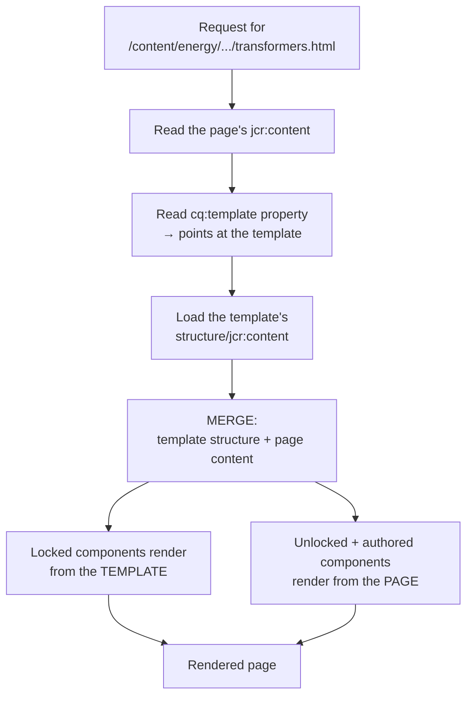
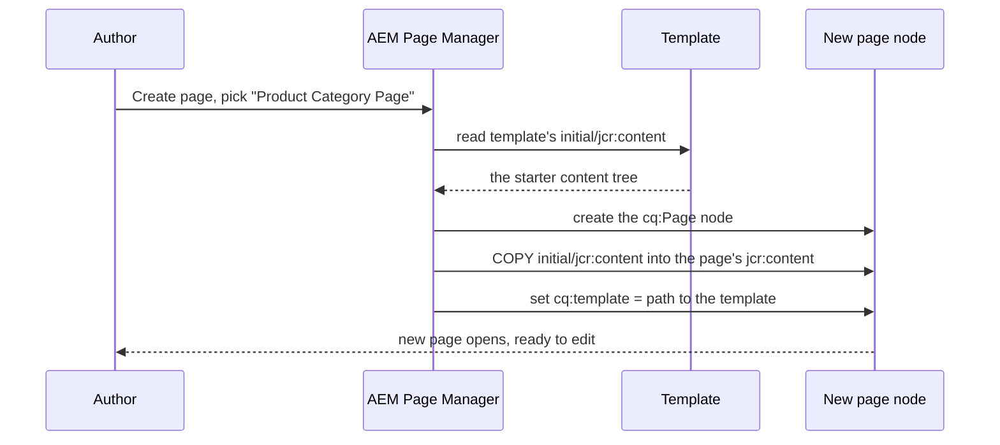

# 03 – Editable Templates and Policies

> **Target:** 3–4 years experienced AEM Developer
> **Syllabus point covered (point 3, in full):** *"Editable templates, how it's created, what is the use of policy. Difference between initial and structure. Where are editable templates stored. How you define policy, page policy, content policy, how to hide/allow component in a page."*
> **Project domain:** a global energy technology company's marketing site.

---

## Before we start — why this one line hides eight questions

Look carefully at your syllabus point. It is written as one line, but it is actually **eight separate questions**:

1. What are editable templates?
2. How are they created?
3. What is the use of a policy?
4. Difference between initial content and structure?
5. Where are editable templates stored?
6. How do you define a policy?
7. Page policy versus content policy?
8. How do you hide or allow a component on a page?

That is not an accident. Whoever wrote that list was recording what an actual interviewer asked them, in order. This is a **thread** — the interviewer asked "what are editable templates," and then kept pulling until the candidate ran out.

So this file is organised to answer them in that order, and each one gets its own section. If you can answer all eight in sequence without stumbling, you have survived one of the most common drill-downs in AEM interviews.

Two of them deserve special attention because they are where candidates lose marks:

**"Difference between initial and structure"** is the single most-asked template question in AEM interviews. Section 2.5 covers it properly.

**"How to hide/allow a component in a page"** sounds trivial but has three different mechanisms depending on what you actually mean. Section 2.9.

---

## 1. Introduction

### 1.1 What problem do templates solve?

Let's start with the problem, because the answer only makes sense once you feel the pain.

Imagine our energy site. We have hundreds of product category pages — transformers, HVDC, grid automation, power quality — and they all look the same: a hero banner, a description, a grid of sub-product cards, an FAQ section, and a contact block at the bottom.

Now, without templates, an author creating a new product category page would have to drag every one of those components onto a blank page, in the right order, every single time. Hundreds of times. And every page would drift slightly from every other page.

**A template is the answer: a pre-defined page structure that new pages are created from.**

But that raises the real question, and it is the one that separates static from editable templates:

> **Who is allowed to change the template — a developer, or a business user?**

### 1.2 Static templates — the old answer

For most of AEM's history, the answer was "a developer."

A **static template** lives under `/apps`, in your code. It defines the page structure in XML. Changing it means changing code, raising a pull request, and going through a deployment.

That worked, but it had a painful consequence. Every time marketing wanted to add a component to product pages — say, a new "related downloads" section — they had to raise a ticket, wait for a sprint, and wait for a release. For a change that adds no logic at all.

And there was a worse problem. **A static template only applies at page creation.** Once a page exists, it has no live connection to its template. So if you changed the static template, every existing page kept its old structure. Rolling out a change across 400 existing pages meant writing a migration script.

### 1.3 Editable templates — the current answer

Adobe introduced **editable templates** in AEM 6.2, and they have been the standard approach since 6.3.

Two things changed, and both matter:

**One — templates moved out of code and into content.** They live under `/conf`, not `/apps`. That means a suitably-privileged business user, called a **template author**, can edit them through a UI. No deployment.

**Two — the template stays connected to its pages.** Change the template's structure, and every existing page using it reflects that change immediately. No migration script.

That second point is genuinely powerful and genuinely dangerous, which is why interviewers probe it. We come back to it in section 2.5.

### 1.4 Who does what — the three roles

This is worth being precise about, because interview questions often hinge on it:

| Role | What they control | Where they work |
|---|---|---|
| **Developer** | Components, template *types*, the code | `/apps`, in Git |
| **Template author** | Templates, structure, policies | `/conf`, via Tools → Templates |
| **Content author** | Page content | `/content`, via the page editor |

The middle role is the one editable templates created. On many projects it is still a developer wearing a different hat, but the **separation** is the point — and saying that in an interview shows you understand *why* editable templates exist rather than just *what* they are.

### 1.5 A real project example to adapt

> "On our site we have about twelve editable templates — a product category page, a product detail page, a news article, a country landing page, a campaign page, and a few utility ones like search results and error pages. The templates live under `/conf/<project>/settings/wcm/templates` and ship as mutable content through our `ui.content` package. Our content leads have template-author access on lower environments, so they can adjust which components are allowed on a page type without raising a development ticket, and we review the change before it's promoted."

That answer covers storage location, packaging, and the governance question an interviewer is likely to ask next.

---

## 2. Core Concepts

### 2.1 Where editable templates are stored *(syllabus question 5)*

Let's answer the storage question early, because everything else refers back to it.

```
/conf/<project>/settings/wcm/
    ├── template-types/          ← blueprints used to CREATE templates
    │      └── product-page/
    │
    ├── templates/               ← THE TEMPLATES THEMSELVES
    │      ├── product-category-page/
    │      ├── product-detail-page/
    │      └── news-article-page/
    │
    └── policies/                ← THE POLICY DEFINITIONS
           └── wcm/foundation/components/responsivegrid/
```

**The three paths to memorise:**

| What | Where |
|---|---|
| Editable templates | `/conf/<project>/settings/wcm/templates` |
| Policies | `/conf/<project>/settings/wcm/policies` |
| Template types | `/conf/<project>/settings/wcm/template-types` |

**And the contrast that interviewers want:**

| | Static template | Editable template |
|---|---|---|
| Stored under | `/apps/<project>/templates` | `/conf/<project>/settings/wcm/templates` |
| Is it code or content? | **Code** | **Content** |
| Deployed how? | In `ui.apps`, immutable | In `ui.content`, mutable |
| Editable at runtime? | No | Yes |

**Why `/conf` and not `/apps`?** Connect it back to file 01 and you will sound like you understand the platform rather than having memorised a path:

> "Because `/apps` is code and `/conf` is content. Templates are edited by business users at runtime, so they cannot live in `/apps` — especially on Cloud Service, where `/apps` is immutable and read-only. Putting them in `/conf` also means they're per-site, so different brands or regions can have completely different templates from the same codebase."

**A packaging detail worth knowing:** because templates are content, they ship in the `ui.content` package, and the filter needs `mode="merge"`:

```xml
<filter root="/conf/energy" mode="merge"/>
```

Without `merge`, every deployment would wipe out template changes made by template authors. That is a real incident waiting to happen, and mentioning it shows production experience.

### 2.2 How an editable template is created *(syllabus question 2)*

There are two paths — through the UI, and in code. Interviewers usually want the UI steps, but knowing both is better.

**Through the UI:**

1. Go to **Tools → General → Templates**.
2. Pick the configuration folder for your site — for example `/conf/energy`.
3. Click **Create**, and choose a **template type**. (More on those in 2.10.)
4. Give it a title, for example "Product Category Page", and create it.
5. The template opens in the **template editor**, which has several modes:
   - **Structure** — add the components that appear on every page.
   - **Initial Content** — set what a brand-new page starts with.
   - **Layout** — set responsive column widths per breakpoint.
   - **Page Design / Page Policy** — configure the page-level policy.
6. Set the template's **status to Enabled** — a draft template will not appear when authors create a page.
7. Set **`allowedPaths`** in template properties so the template can only be used under the right content branch.

**Steps 6 and 7 are the ones candidates forget**, and they are exactly the two reasons a template "doesn't show up" — which is a classic scenario question.

**In code**, the same thing is just nodes under `/conf`. Full XML is in section 8.

### 2.3 The anatomy of an editable template

Now open a template folder and look inside. This is the structure you should be able to draw:

```
/conf/energy/settings/wcm/templates/product-category-page/
│
├── jcr:content              ← the template's OWN properties
│     ├── jcr:title = "Product Category Page"
│     ├── status = "enabled"
│     └── allowedPaths = ["/content/energy(/.*)?"]
│
├── structure/               ← what appears on EVERY page (live)
│     └── jcr:content
│           ├── cq:template = ".../product-category-page"
│           ├── sling:resourceType = "energy/components/page"
│           └── root/
│                ├── hero            (locked)
│                ├── container       (unlocked — authors work here)
│                └── contactblock    (locked)
│
├── initial/                 ← what a NEW page starts with (copied once)
│     └── jcr:content
│           └── root/
│                └── container/
│                     └── text       (a starter component)
│
├── policies/                ← which policy applies to which component
│     └── jcr:content
│           └── root/
│                ├── cq:policy = "wcm/foundation/components/responsivegrid/default"
│                └── container/
│                     └── cq:policy = "...responsivegrid/product_container"
│
└── thumbnail.png
```

**Four children, four jobs:**

- **`jcr:content`** — metadata about the template itself: its title, whether it is enabled, and where it can be used.
- **`structure`** — the component tree that appears on every page using this template. **Live.**
- **`initial`** — the content a brand-new page is created with. **Copied once.**
- **`policies`** — a mapping tree that mirrors the structure and says which policy applies to which node.

That fourth one confuses people, so say it clearly: **the `policies` folder inside a template does not contain policies.** It contains *pointers* to policies, which live somewhere else entirely. We cover this in 2.7.

### 2.4 Template types — where templates come from

Before we get to structure versus initial, one quick concept, because step 3 of creating a template referred to it.

A **template type** is a blueprint for creating a template. When a template author clicks Create, they must pick a starting point — and that starting point is a template type.

They live at `/conf/<project>/settings/wcm/template-types/` and look almost identical to a template: they have `structure`, `initial` and `policies` children too.

**Why do they exist?** So that template authors start from something sensible rather than a completely blank page. Our energy site's "product page" template type might already include the page component, a responsive root container, and a sensible default policy — so a template author creating a new product template gets the right skeleton automatically.

**Who creates template types?** Developers. They ship in code alongside the components.

**The interview one-liner:** *"A template type is the template for a template — the starting skeleton a template author picks when creating a new one."*

### 2.5 Structure versus Initial Content *(syllabus question 4 — the big one)*

This is the most-asked editable template question in AEM interviews. Let's build it up properly, because the difference is easy to state and easy to get backwards under pressure.

**Start with what each one is for.**

**Structure** answers: *"What must appear on every single page of this type, and stay under the template's control?"*

On our product category pages, that is the hero banner, the breadcrumb, and the contact block at the bottom. Every product category page has them. Marketing does not want an author accidentally deleting the contact block from one page.

**Initial content** answers: *"What should a brand-new page start with, as a helpful starting point that the author can then change or delete?"*

That might be one empty text component and one image placeholder, so the author is not staring at a blank page.

**Now the difference that actually matters — and this is the answer:**

| | Structure | Initial Content |
|---|---|---|
| Appears on | Every page using the template | Only pages created **after** it was set |
| Applied when | **Every page render** — it's live | **Once**, at page creation |
| Change it later → existing pages? | **Yes, immediately** | **No, never** |
| Can the author delete it? | Only if unlocked | Yes, it's just page content |
| Stored where at runtime? | Stays in the template | Copied into the page's own `jcr:content` |

**Say the difference like this in an interview:**

> "Structure is live and initial content is a one-time copy.
>
> Structure defines what appears on every page using the template, and it stays owned by the template — so if I add a component to the structure today, it appears on all 400 existing product pages immediately, with no migration.
>
> Initial content is only a starting point. It's copied into the new page's own `jcr:content` at the moment the page is created, and after that the page owns it. So if I change the initial content today, existing pages are completely unaffected — only pages created from tomorrow get it.
>
> The practical way I remember it: **structure is a live link, initial content is a photocopy.**"

**The follow-up you should expect:** *"So if I want to add a component to all existing pages, which one do I use?"*

> "Structure — that's exactly what it's for, and it's the biggest advantage editable templates have over static ones. With static templates I'd have needed a migration script to touch 400 pages. But I'd be careful, because it's immediate and it's global. I'd test on a lower environment first, because there's no undo — the change is live on every page the moment I save it."

That caution is what makes the answer sound like experience rather than recall.

**A second follow-up:** *"Where does initial content physically go?"*

> "It's copied into the new page's `jcr:content`. So after creation there's no link back to the template's initial node at all — the page owns that content outright. That's why changing it later has no effect on existing pages."

### 2.6 Locked and unlocked components

Structure raises an obvious question: if a structure component appears on every page, can the author edit it?

By default, **no**. Components you place in the structure are **locked**. They render on every page identically, and the content author cannot select, edit or delete them. The content lives in the template, not on the page.

But often that is too rigid. Our hero banner should appear on every product page — that is structure — but each page obviously needs its *own* headline and image.

That is what **unlocking** does.

When a template author unlocks a component in the structure, it becomes editable per page. The component still appears on every page (structure guarantees that), but its **content** is now stored on each individual page and each author can set their own.

In the repository, unlocking sets a property on the structure node:

```
editable = "{Boolean}true"
```

**The rule to remember:**

| | Locked | Unlocked |
|---|---|---|
| Appears on every page | Yes | Yes |
| Author can edit content | **No** | **Yes** |
| Author can delete it | No | No — it's still structure |
| Content stored in | The template | Each page |
| Property | (default) | `editable="{Boolean}true"` |

**And the classic scenario question this answers:** *"An author says they cannot edit a component on the page. Why?"*

> "Most likely it's a locked structure component. It's placed by the template and deliberately not editable per page. If it should be editable, the fix is in the template — unlock it in structure mode. The other possibilities are that the author's group lacks modify permission on that path, or the component isn't allowed by the policy — but with editable templates, a locked structure component is the most common cause by far."

Giving all three possibilities in priority order is a much stronger answer than giving one.

### 2.7 What is a policy, and what is it for? *(syllabus questions 3 and 6)*

Now the second half of this topic. And let's start with the problem again, because "policy" is a vague word.

**The problem.** You have a Layout Container on your product page template. An author can drop components into it. But *which* components? All 45 in the system? That would let someone put a stock-ticker component on a product page.

You need a way to say: *"in this container, on this template, authors may only use these components."*

That is a policy.

**The definition:**

> **A policy is the design-time configuration for a component as used within a particular template.**

Notice the three parts of that sentence, because they are what makes policies confusing until they click:

- **Design-time** — set by a template author, not a content author.
- **For a component** — a policy always attaches to a specific component.
- **Within a particular template** — the same component can have a different policy on a different template.

That last part is the key insight. The Layout Container on your product page template and the Layout Container on your news article template are the *same component*, but they can allow completely different sets of child components — because each template maps it to a different policy.

**What can a policy configure?** It depends on the component, but commonly:

| Component | What its policy controls |
|---|---|
| Layout Container | **Which components are allowed inside** |
| Text | Which rich-text plugins and formatting options authors get |
| Image | Allowed widths, whether the DAM is required, lazy loading |
| Page | Which clientlib categories load on this page type |
| Any component | **Style System classes** the author can choose from |

**Where policies are stored:**

```
/conf/energy/settings/wcm/policies/
    └── wcm/foundation/components/responsivegrid/
            ├── product_container
            └── news_container
```

Notice the path mirrors the **component's resource type**. A policy for the responsive grid lives under a path matching `wcm/foundation/components/responsivegrid`. That is how AEM organises them.

**The crucial structural point — and this is where candidates get lost:**

There are **two** places involved, and they do different jobs.

**Place 1 — the policy definition.** The actual settings. Lives under `/conf/.../policies/`. Reusable.

```
/conf/energy/settings/wcm/policies/wcm/foundation/components/responsivegrid/product_container
    ├── jcr:title = "Product Page Container"
    └── components = ["group:Energy - Content", "energy/components/faq"]
```

**Place 2 — the policy mapping.** Inside the template, a tree mirroring the structure, where each node says which policy applies.

```
/conf/energy/settings/wcm/templates/product-category-page/policies/jcr:content/root/container
    └── cq:policy = "wcm/foundation/components/responsivegrid/product_container"
```

**Say it like this:**

> "There are two halves. The policy *definition* holds the actual settings and lives centrally under `/conf/.../settings/wcm/policies`, so it can be shared. The policy *mapping* lives inside the template under a `policies` node that mirrors the structure tree, and each node has a `cq:policy` property pointing at a definition.
>
> The reason for the split is reuse. Three templates can point at the same policy definition, so I configure the allowed components once. But the flip side — and this catches people out — is that editing that shared policy changes all three templates at once."

That last sentence is worth saying unprompted. It shows you understand the consequence, not just the mechanism.

### 2.8 Page policy versus content policy *(syllabus question 7)*

Your syllabus lists these separately, so an interviewer clearly asked about both. They are the same mechanism applied at two levels.

**Content policy** — a policy attached to a component *inside* the page. The Layout Container's policy that lists allowed components is a content policy. So is the Text component's policy defining which RTE options authors get.

**Page policy** — the policy attached to the **page component itself**, at the root of the structure. It configures things that belong to the whole page rather than one component inside it.

The most important thing a page policy controls is **which clientlib categories load on this page type**. So your product pages can load the product CSS and JS bundle, while news article pages load a different, lighter one — without any code change and without a different page component.

| | Page policy | Content policy |
|---|---|---|
| Attached to | The page component (root of structure) | A component inside the page |
| Set via | Template editor → **Page Design** / Page Policy | Select a component → its policy icon |
| Typically controls | Clientlib categories, page-level design settings | Allowed components, RTE plugins, styles, image settings |
| Example | "Product pages load the `energy.product` clientlib" | "This container allows only Energy - Content components" |
| Scope | The whole page | That one component |

**The interview answer:**

> "They're the same mechanism at two levels. A content policy configures a component inside the page — the classic one being the container policy that lists which components authors can add. A page policy attaches to the page component itself and configures page-wide things, most importantly which clientlib categories load for that page type. So on our site, product pages and news pages use the same page component but different page policies, which is how they load different CSS and JS bundles without any code change."

That example is concrete and immediately shows why the distinction is useful.

### 2.9 How to allow or hide a component on a page *(syllabus question 8)*

The syllabus asks this as one question, but "hide a component" can mean three different things. A strong answer separates them, because the interviewer is often checking whether you understand that.

**Meaning 1 — "which components can an author add to this container?"**

This is the policy. Set the `components` property on the container's policy:

```
components = [
    "group:Energy - Content",
    "energy/components/faq",
    "energy/components/categorylisting"
]
```

You can allow **individually** by resource type, or **by group** using the `group:` prefix, which is what most projects do because it scales.

To *hide* a component here, you remove it from the list. It then never appears in the component browser for that container.

**Meaning 2 — "this component should not appear in the component browser at all, anywhere."**

That is the component's own `componentGroup`, from file 02. Set it to `.hidden` and it never appears for authors — which is what you want for helper components like an accordion item.

**Meaning 3 — "this component exists on the page but should not render right now."**

That is neither templates nor policies — it is logic. Either a `data-sly-test` guard in HTL, or an author-facing toggle in the component's own dialog.

**The complete answer:**

> "It depends which of three things is meant.
>
> If it's 'which components can an author add here', that's the **policy** on the container — the `components` property, which takes either individual resource types or whole component groups with a `group:` prefix. Removing one from that list hides it for that container on that template. And because it's per-template, the same container component can allow different things on different page types.
>
> If it's 'this component should never appear in the component browser at all', that's the component's own `componentGroup` set to `.hidden`.
>
> And if it's 'this component is on the page but shouldn't render', that's a `data-sly-test` in the HTL or a toggle in its dialog — nothing to do with templates.
>
> The one that catches people out is that **both** the component group and the policy have to allow it. A component with a valid group still won't appear if the policy doesn't list it, and that's usually the answer when someone says 'my component isn't showing up.'"

**One more layer, worth knowing:** there is also control over **which templates can be used at all** under a given content path. Two mechanisms:

- **`allowedPaths`** on the template — a regex on the template's own `jcr:content` saying where it may be used. For example `/content/energy(/.*)?`.
- **`cq:allowedTemplates`** on a content folder's `jcr:content` — a list from the content side saying which templates are permitted below this point.

These two are frequently confused, so here they are side by side:

| | `allowedPaths` | `cq:allowedTemplates` |
|---|---|---|
| Lives on | The **template** | A **content** node's `jcr:content` |
| Says | "I may be used under these paths" | "Only these templates may be used here" |
| Direction | Template → content | Content → template |
| Format | Regex array | Path array (regex supported) |

If a template is not appearing in the Create Page dialog, one of these two is very often why — along with the template's `status` still being `draft`.

### 2.10 Template status — draft, enabled, disabled

Small but it generates a real scenario question.

A template's `jcr:content` has a `status` property with three possible values:

- **`draft`** — being built. **Does not appear** when authors create a page.
- **`enabled`** — live and available.
- **`disabled`** — no longer offered for new pages, but existing pages using it keep working.

**That last point matters.** Disabling a template does not break the pages already built from it. It just stops new ones being created. That is how you retire a template gracefully.

---

## 3. Internal Working

### 3.1 How a page and its template combine at render time

This is the part that makes editable templates click, and it is a genuinely good thing to be able to explain.

Here is the question: if the structure lives in the template and the content lives on the page, **how does one page get rendered from two separate places in the repository?**

The answer is a **merge**.



**In words:**

1. The request resolves to the page, and Sling reads its `jcr:content`.
2. On that node is a **`cq:template`** property pointing at the template path. This is the live link.
3. AEM loads the template's `structure/jcr:content`.
4. AEM **merges** the two trees. Where a node exists only in the structure, it renders from the template. Where the author has content on the page, that wins.
5. The merged result is what Sling renders.

**Why this explains so much.** Once you see that the structure is read on every render:

- It is obvious why a structure change appears instantly on all existing pages — every render re-reads it.
- It is obvious why locked components cannot be edited on the page — their content is not on the page at all.
- It is obvious why initial content behaves differently — it was copied into the page once and is no longer connected.

**The interview version:**

> "The page's `jcr:content` has a `cq:template` property pointing at its template. At render time AEM reads the template's structure and merges it with the page's own content — locked structure components render from the template, and anything the author owns renders from the page. That merge happening on **every render** is exactly why a structure change shows up on existing pages immediately, whereas initial content — which was copied into the page at creation — doesn't."

### 3.2 What happens when a page is created

A shorter flow, but it is what makes initial content make sense:



**Two things happen that you should name explicitly:**

1. The **initial content is copied** into the new page. A copy. The link is gone the moment it is made.
2. The **`cq:template` property is set**, creating the permanent live link to the structure.

Those two lines are the entire structure-versus-initial difference, expressed as behaviour.

### 3.3 How a policy is resolved

When AEM needs to know "which components are allowed in this container," it does this:

```
1. Which page am I on?
       → read cq:template from the page's jcr:content

2. Which node in the structure am I?
       → e.g. root/container

3. Look inside the template's policy MAPPING at the same relative path:
       /conf/energy/settings/wcm/templates/product-category-page/policies/jcr:content/root/container

4. Read its cq:policy property
       → "wcm/foundation/components/responsivegrid/product_container"

5. Load the policy DEFINITION:
       /conf/energy/settings/wcm/policies/wcm/foundation/components/responsivegrid/product_container

6. Read its "components" property → the allowed list
```

**Notice step 3.** The policy mapping tree **mirrors the structure tree**. That is how AEM knows which policy belongs to which container — by position, not by name.

This is also why a container that has been moved or renamed in the structure can suddenly lose its policy: the mapping no longer matches the structure's shape. That is a real production issue and a good scenario answer.

### 3.4 Policy inheritance

A question that comes up: *"How are policies inherited?"*

Two different senses, and it is worth separating them:

**Down the content tree** — policies are resolved through **context-aware configuration**, using the `sling:configRef` property on a content branch, which points to a `/conf` folder. So `/content/energy/us` can point at `/conf/energy` and inherit everything defined there. A sub-brand could point at its own `/conf/energy-subsidiary`, which falls back to the parent for anything it does not define.

**Within a template** — nested containers do **not** automatically inherit their parent's allowed-components list. Each container node in the mapping gets its own `cq:policy`. If a nested container has no policy mapped, authors get nothing allowed in it — which is a very common "why can't I add anything here" bug.

**The answer:**

> "Two senses. Across content, policies resolve through context-aware configuration — a content branch has a `sling:configRef` pointing at a `/conf` folder, and resolution falls back up that chain, which is how a sub-brand can override some settings and inherit the rest. Within a single template, though, nested containers don't inherit from their parent — each container needs its own policy mapped, and forgetting that is why authors sometimes find they can't add anything inside a nested container."

---

## 4. Important Interview Questions

### 4.1 Basic

**Q1. What is a template in AEM?**
A pre-defined page structure that new pages are created from. It defines which components appear, in what arrangement, and what authors are allowed to do.

*Cross:* Static or editable? · Where is each stored? · Which is current?

**Q2. What is an editable template?**
A template stored under `/conf` as content rather than code, editable through a UI by a template author, and — crucially — one that stays live-linked to its pages so structure changes reflect on existing pages.

*Cross:* When was it introduced? (AEM 6.2, standard from 6.3) · Who edits it? · Why `/conf` and not `/apps`?

**Q3. Where are editable templates stored?**
`/conf/<project>/settings/wcm/templates`. Policies are at `/conf/<project>/settings/wcm/policies`, and template types at `/conf/<project>/settings/wcm/template-types`.

*Cross:* Why `/conf`? · Which Maven module ships them? (`ui.content`) · Why does the filter need `mode="merge"`?

**Q4. How do you create an editable template?**
Tools → Templates → pick the configuration folder → Create → choose a template type → edit its structure, initial content, layout and policies → **set status to Enabled** → set `allowedPaths`.

*Cross:* What happens if you skip Enable? (it won't appear in Create Page) · What is a template type? · Can a developer create one in code? (yes — it's just nodes)

**Q5. What are the parts of an editable template?**
`jcr:content` for the template's own properties, `structure` for what appears on every page, `initial` for what a new page starts with, and `policies` for the policy mappings.

*Cross:* Does the `policies` folder contain policies? (No — it contains *pointers*) · Where do the actual policies live?

**Q6. What is a policy?**
The design-time configuration for a component as used within a particular template — most commonly which components are allowed inside a container, but also RTE options, image settings, and Style System classes.

*Cross:* Who sets it? (template author) · Where is it stored? · Can two templates share one? (yes — and changing it affects both)

**Q7. What is `cq:template`?**
A property on a page's `jcr:content` pointing at the template it was created from. It is the live link that makes structure changes reach existing pages.

*Cross:* What happens if you change it? (the page picks up a different structure) · Is it on the page node or `jcr:content`? (`jcr:content`)

**Q8. What is a template type?**
A blueprint for creating templates — the skeleton a template author picks from when creating a new one. Stored at `/conf/<project>/settings/wcm/template-types` and created by developers.

*Cross:* How is it different from a template? · Who creates it? · Does it have structure and initial too? (yes)

**Q9. What are the template statuses?**
`draft`, `enabled`, `disabled`. Only enabled templates appear when authors create a page. Disabling stops new pages being created without breaking existing ones.

*Cross:* Why disable rather than delete? · What happens to existing pages when you disable?

**Q10. What is `allowedPaths`?**
A regex array on the template's `jcr:content` restricting where the template may be used — for example `/content/energy(/.*)?`.

*Cross:* How is it different from `cq:allowedTemplates`? · What happens if it doesn't match? (the template won't be offered)

### 4.2 Intermediate

**Q11. Difference between structure and initial content?**
→ Section 2.5. **The one-liner: structure is a live link, initial content is a photocopy.**

*Cross:* If I change structure, do existing pages update? (yes, immediately) · If I change initial content? (no, never) · Where does initial content physically end up? (copied into the page's `jcr:content`) · Which one would you use to add a component to 400 existing pages?

**Q12. Difference between static and editable templates?**
→ Full table in section 15. The two headline differences: where they live (`/apps` code versus `/conf` content) and whether they stay connected to existing pages.

*Cross:* Why did Adobe introduce editable templates? · Can you still use static ones? (yes, but they're legacy) · How would you migrate?

**Q13. What is the difference between page policy and content policy?**
→ Section 2.8. Same mechanism, two levels. Page policy is on the page component and controls page-wide settings, most importantly clientlib categories. Content policy is on a component inside the page.

*Cross:* How do you set each in the UI? · Give an example of each · How do two page types load different CSS with the same page component?

**Q14. How do you allow or hide a component on a page?**
→ Section 2.9. Separate the three meanings: policy `components` list, `componentGroup` set to `.hidden`, or render logic in HTL.

*Cross:* Can you allow by group? (yes — `group:` prefix) · Do both the group and the policy have to allow it? (yes) · Can the same container allow different components on different templates? (yes — that's the point of policies)

**Q15. What is a locked component, and how do you unlock one?**
Structure components are locked by default — they appear on every page and authors cannot edit them. Unlocking in the template editor sets `editable="{Boolean}true"`, which keeps the component on every page but moves its content onto each page so authors can set their own.

*Cross:* Can an author delete an unlocked structure component? (no — it's still structure) · Where is the content stored in each case? · What's the most common cause of "I can't edit this component"?

**Q16. How does a page render if the structure is in the template?**
→ Section 3.1. `cq:template` points at the template; AEM merges the template's structure with the page's content on every render.

*Cross:* Why does that make structure changes instant? · Why can't locked components be edited? · What happens if `cq:template` points at a deleted template?

**Q17. How are policies inherited?**
→ Section 3.4. Across content via context-aware configuration and `sling:configRef`; within a template, nested containers do **not** inherit and each needs its own mapping.

*Cross:* What is `sling:configRef`? · Why can't authors add anything to my nested container? · How would a sub-brand override one setting and inherit the rest?

**Q18. Can multiple templates share one policy?**
Yes — that is the reason the definition and the mapping are separate. Several templates can map to the same policy definition. The trade-off is that editing that definition changes every template pointing at it.

*Cross:* How would you avoid an accidental cross-template change? (separate definitions where the intent differs, and clear `policyTitle` naming) · Where would you see which templates use a policy?

**Q19. What is the Style System and how does it relate to policies?**
Style classes are defined in a component's **policy** as `cq:styleGroups`. The author then picks a style from a dropdown in the editor, and AEM applies the CSS class to the component's wrapper. It lets authors change appearance with no code and no new components.

*Cross:* Where exactly are styles defined? (in the policy) · How is the class applied? (on the decoration wrapper) · Why is this better than building variant components? → file 02.

**Q20. How do editable templates ship in a Maven project?**
As mutable content in `ui.content`, with a filter on `/conf/<project>` using `mode="merge"` so a deployment doesn't wipe template-author changes.

*Cross:* Why not `ui.apps`? (`/conf` is mutable content; `/apps` is immutable) · What breaks without `merge`? · How do you promote a template change from dev to prod?

### 4.3 Advanced

**Q21. You need to add a component to all 400 existing product pages. How?**

> "Add it to the template's **structure**, not the initial content. Because the structure is merged into every page at render time, it appears on all 400 immediately with no content migration — that's the main reason editable templates exist.
>
> The care I'd take: it's live and global the instant I save, so I'd make the change on a lower environment first and check a representative sample of pages, including ones with unusual content. I'd also think about where in the structure it sits, because inserting it above existing content changes the visual order everywhere at once. And if it needs per-page content, I'd unlock it so authors can fill it in, accepting that it will render empty on all 400 until they do — which might mean a `data-sly-test` guard so it renders nothing rather than an empty box."

*Cross:* What if it needs different content per page? · What's the rollback if it goes wrong? · How does this differ with static templates?

**Q22. A template change broke production. Walk me through what happened and how you'd prevent it.**

> "The likely cause is a structure change, because those are live and global. Someone edits the template on production and every page using it changes on the next render — there's no deployment gate and no staged rollout.
>
> Prevention is governance, not code. We restrict template-author permissions on production so template edits happen on lower environments and are promoted through the deployment pipeline as `ui.content` package changes. That way a template change is reviewed and versioned like any other change. Where business users genuinely need to self-serve, we scope it to specific policies rather than structure — letting them change the allowed components list is much lower risk than letting them restructure the page."

*Cross:* Should business users have template access on prod? · How do you version a template change? · What if a policy is shared across templates?

**Q23. How do editable templates interact with MSM and live copies?**

Pages in a live copy keep their `cq:template` reference, so they use the same template as the blueprint. That means a structure change reaches blueprint pages and live copy pages alike — which is usually what you want for a multi-country site.

The complication is `/conf`. If a country site points at a different configuration folder via `sling:configRef`, it can resolve different policies, so the same template can allow different components per country. That is powerful but easy to lose track of.

*Cross:* Do live copies inherit the template? (yes, via `cq:template`) · Can different countries have different policies? (yes, via `sling:configRef`) · What happens on rollout? → file 12.

**Q24. How would you migrate static templates to editable templates?**

> "Two routes. Adobe ships the **AEM Modernization Tools**, which convert static templates, their design configurations and their components semi-automatically — that's the starting point. Or you rebuild the template as editable under `/conf` and run a script to update `cq:template` on existing pages.
>
> Either way the risky part is content, not the template. Static templates paired with `/etc/designs` design configurations, and those have to become policies. And existing page content was authored against the old structure, so the component tree may not line up. I'd always run the conversion against a copy of production content first and diff the rendered output, because the failure mode is subtle — pages that render but have lost a component or a design setting."

*Cross:* What replaces `/etc/designs`? (policies) · What is the repository restructuring? → file 01 · How do you validate the migration?

**Q25. What are the risks of giving business users template access?**

Structure changes are live, global and immediate, with no review gate and no easy rollback. A well-meaning edit can change 400 pages at once.

The mitigation is scope: give template-author permissions on lower environments, promote through the pipeline, and where self-service is genuinely needed, scope it to policies rather than structure.

*Cross:* How do you scope permissions to policies only? · What's your promotion process? · Have you seen this go wrong?

**Q26. A nested container won't let authors add anything. Why?**

It has no policy mapped. Nested containers do not inherit their parent's policy — each container node in the template's policy mapping needs its own `cq:policy`. With no policy, the allowed list is empty, so the component browser shows nothing.

*Cross:* Where exactly do you fix it? · Why doesn't it inherit? · How would you spot this quickly? (check the mapping tree in CRXDE against the structure tree)

**Q27. How do product pages and news pages load different CSS with the same page component?**

Different **page policies**. The page policy defines the clientlib categories for that page type, so the same page component loads `energy.product` on one template and `energy.news` on another — no code change, no separate page component.

*Cross:* Where is that configured? (template editor → Page Design) · What property holds it? · Why is that better than a separate page component? → file 04.

---

## 5. Cross Questions — the thread from your syllabus

Your syllabus point *is* the thread. Here it is as an interviewer would actually run it, with what they are checking at each step:

| # | Question | What they're really testing |
|---|---|---|
| 1 | What are editable templates? | Do you know they're content, not code |
| 2 | Where are they stored? | Have you actually looked in the repository |
| 3 | How are they created? | Have you built one, or only used them |
| 4 | What's the difference between structure and initial? | **The main filter question** |
| 5 | So if I change structure, what happens to existing pages? | Do you understand the live merge |
| 6 | What is a policy for? | Do you understand design-time vs content-time |
| 7 | Where are policies stored? | Do you know about the definition/mapping split |
| 8 | Page policy vs content policy? | Depth |
| 9 | How do you allow a component in a container? | Practical experience |
| 10 | How do you hide one? | Do you know there are three different meanings |

**Two more threads that branch off:**

**Thread B — from "structure changes are live"**
So how do existing pages know? → What is `cq:template`? → How does the merge work? → Why can't authors edit locked components? → How do you unlock one? → What property does that set? → Where is the content stored then?

**Thread C — from "policies control allowed components"**
Can two templates share a policy? → What happens if you edit a shared one? → How are they inherited across content? → What is `sling:configRef`? → Do nested containers inherit? → What if a nested container has no policy?

**The technique, same as always:** answer in two sentences plus one example. A fuller answer absorbs the next question, so the thread runs out before you do.

---

## 6. Best Interview Answers

### 6.1 "What are editable templates?" — about 90 seconds

> "Editable templates are templates stored as content under `/conf` rather than as code under `/apps`, which means a business user with template-author permissions can change them through a UI without a deployment.
>
> But the more important difference is that they stay **live-linked** to their pages. A page has a `cq:template` property pointing at its template, and at render time AEM merges the template's structure with the page's own content. So if I add a component to the structure, it appears on every existing page using that template immediately — no migration script. With static templates, the template only applied at page creation, so changing it did nothing to pages that already existed.
>
> A template has four parts. `jcr:content` holds its own properties like title and status. `structure` is what appears on every page and stays owned by the template. `initial` is the starting content copied into a new page once at creation. And `policies` maps each structure node to a policy definition.
>
> On our project we have around twelve of them — product category, product detail, news article, country landing and so on — and they ship as mutable content in our `ui.content` package with a merge filter so deployments don't overwrite template-author changes."

### 6.2 "Difference between structure and initial content?" — about 60 seconds

**This is the one to have word-perfect.**

> "The simplest way to put it: **structure is a live link, initial content is a photocopy.**
>
> Structure defines what appears on every page using the template, and it stays owned by the template. It's merged into the page on every single render, which is why changing it updates all existing pages immediately.
>
> Initial content is just a starting point. At the moment a page is created, it's copied into that page's own `jcr:content`, and from then on the page owns it — there's no link back. So changing the initial content today affects only pages created from tomorrow. Existing pages never see it.
>
> Practically, I use structure for anything that must be on every page and stay consistent — our hero banner, breadcrumb and the contact block at the bottom of product pages. I use initial content for a helpful starting point the author is free to change or delete, like an empty text component so they're not staring at a blank page.
>
> And the follow-on that matters: if I'm asked to add something to 400 existing pages, the answer is structure. That's the single biggest advantage editable templates have."

### 6.3 "What is a policy and how do you define one?" — about 90 seconds

> "A policy is the design-time configuration for a component as used within a particular template. The most common use is the container policy that lists which components an author may add — but policies also control things like which rich-text options the Text component offers, allowed image widths, and the Style System classes an author can pick.
>
> The structure has two halves, and this is the part people find confusing. The policy **definition** holds the actual settings and lives centrally under `/conf/<project>/settings/wcm/policies`, at a path mirroring the component's resource type. The policy **mapping** lives inside the template, in a `policies` node that mirrors the structure tree, where each node has a `cq:policy` property pointing at a definition.
>
> The split exists for reuse — several templates can point at the same definition so I configure it once. The trade-off is that editing a shared definition changes every template using it, so I'm careful with naming and I separate definitions where the intent genuinely differs.
>
> To define one in practice, I select the component in the template editor, open its policy, either create a new one or pick an existing one, and configure it. For a container that means setting the allowed components — either individually by resource type, or by group with a `group:` prefix, which is what we do because it scales as we add components."

---

## 7. Real Project Examples

### Story 1 — Adding a compliance block to every product page

**Requirement.** A regulatory change meant every product page had to carry a standardised technical-compliance statement with a link to the relevant certification documents. Roughly 400 existing product pages, plus everything created afterwards.

**Why it's a good template story.** The obvious approach — ask authors to add a component to 400 pages — was never realistic. It would take weeks and would be incomplete, which for a compliance requirement is a genuine risk.

**Approach.** Added the component to the **structure** of the product category and product detail templates, positioned above the contact block. Because structure is merged on every render, all existing pages picked it up immediately with no content migration.

**The decisions that mattered.** The statement text is identical across products, so we left the component **locked** — authors cannot accidentally delete or reword a compliance statement, which was exactly the point. But the certification document link differs by product family, so that one field came from context-aware configuration under `/conf` per product line, rather than being authored per page.

**The care taken.** We made the change on stage first and reviewed a sample of pages including some with unusual layouts, because a structure change is live and global the moment it's saved — there's no staged rollout and no easy undo. And we shipped it as a `ui.content` package change through the pipeline rather than editing the template directly on production, so the change was reviewed and versioned.

**Result.** All product pages compliant the same day, no author effort, and no way for the statement to be removed by accident.

### Story 2 — Splitting one over-permissive policy into three

**Requirement.** Authors were putting the wrong components on the wrong page types — a campaign component on a technical product page, a product listing inside a news article.

**The cause.** Every template's main container mapped to the same policy definition, and that policy allowed every component group. It had grown that way because each time someone needed a new component somewhere, it got added to the one shared policy.

**Approach.** Split it into three definitions with clear titles — one for product pages, one for editorial and news pages, one for campaign pages — and remapped each template's `cq:policy` accordingly. Allowed lists were set by **group** rather than individual resource types, so adding a new component to a group automatically makes it available everywhere that group is allowed.

**The hard part.** Working out what was actually in use before restricting anything. Removing a component from an allowed list does not delete it from pages that already have it — the component keeps rendering, authors just cannot add new ones. So we audited existing usage first to avoid a situation where a component is on live pages but nobody can add it to a new page.

**Result.** Wrong-component tickets dropped substantially, and adding a new component became a matter of putting it in the right group rather than editing multiple policies.

### Story 3 — Making the hero editable without letting authors delete it

**Requirement.** Every product page must have a hero banner — non-negotiable, it's the page's identity. But each page obviously needs its own headline, image and intro text.

**The tension.** Locked structure components guarantee the hero is present but make it uneditable. Putting it in initial content makes it editable but lets authors delete it, and does nothing for existing pages.

**Approach.** Put it in the **structure** and **unlock** it. The component is guaranteed on every page and cannot be deleted, but because `editable="{Boolean}true"` is set, its content lives on each page and each author sets their own.

**The detail that mattered.** Because the hero renders on every page immediately, it rendered empty on pages nobody had filled in yet. So the component guards its outer element with `data-sly-test` and shows an authoring placeholder in edit mode — it renders nothing on publish rather than an empty banner, and shows a clickable placeholder to authors.

**Result.** Structural guarantee and per-page content at the same time, and it became our default pattern for anything that must exist but must vary.

---

## 8. Coding Examples

Templates are content, so these are all repository XML. This is exactly what ships in `ui.content`.

### 8.1 The template's own properties

`ui.content/.../conf/energy/settings/wcm/templates/product-category-page/.content.xml`

```xml
<?xml version="1.0" encoding="UTF-8"?>
<jcr:root xmlns:cq="http://www.day.com/jcr/cq/1.0"
          xmlns:jcr="http://www.jcp.org/jcr/1.0"
    jcr:primaryType="cq:Template">
    <jcr:content
        jcr:primaryType="cq:PageContent"
        jcr:title="Product Category Page"
        jcr:description="Landing page for a product category, with sub-product cards and FAQ"
        status="enabled"
        ranking="{Long}10"
        allowedPaths="[/content/energy(/.*)?]"/>
</jcr:root>
```

**Line by line, and what each one causes if you get it wrong:**

**`status="enabled"`** — leave this as `draft` and the template simply will not appear when authors create a page. This is the number one reason for "my template isn't showing up."

**`allowedPaths`** — a **regex array**. `/content/energy(/.*)?` means "the `/content/energy` node itself, or anything below it." Get the regex wrong and the template is invisible in the Create Page dialog even though it is enabled.

**`ranking`** — controls the order templates appear in. Small usability detail; authors notice.

### 8.2 The structure — locked and unlocked

`.../product-category-page/structure/.content.xml`

```xml
<?xml version="1.0" encoding="UTF-8"?>
<jcr:root xmlns:sling="http://sling.apache.org/jcr/sling/1.0"
          xmlns:cq="http://www.day.com/jcr/cq/1.0"
          xmlns:jcr="http://www.jcp.org/jcr/1.0"
          xmlns:nt="http://www.jcp.org/jcr/nt/1.0"
    jcr:primaryType="cq:Page">
    <jcr:content
        jcr:primaryType="cq:PageContent"
        jcr:title="Product Category Page"
        sling:resourceType="energy/components/page"
        cq:template="/conf/energy/settings/wcm/templates/product-category-page">

        <root
            jcr:primaryType="nt:unstructured"
            sling:resourceType="wcm/foundation/components/responsivegrid">

            <!-- LOCKED: breadcrumb is identical on every page,
                 authors must not be able to touch it -->
            <breadcrumb
                jcr:primaryType="nt:unstructured"
                sling:resourceType="energy/components/breadcrumb"/>

            <!-- UNLOCKED: appears on every page, but each page
                 sets its own headline and image.
                 editable=true is what unlocking does. -->
            <hero
                jcr:primaryType="nt:unstructured"
                sling:resourceType="energy/components/hero"
                editable="{Boolean}true"/>

            <!-- The main authoring area. Authors add components here,
                 restricted by this container's policy. -->
            <container
                jcr:primaryType="nt:unstructured"
                sling:resourceType="wcm/foundation/components/responsivegrid"/>

            <!-- LOCKED: compliance block, must not be removable -->
            <compliance
                jcr:primaryType="nt:unstructured"
                sling:resourceType="energy/components/compliance"/>

        </root>
    </jcr:content>
</jcr:root>
```

**The one property to point at in an interview** is `editable="{Boolean}true"` on the hero. That single property is the entire locked/unlocked mechanism. Without it, the hero renders identically on all 400 pages from the template. With it, the component is still guaranteed present but each page owns its content.

### 8.3 Initial content — the one-time copy

`.../product-category-page/initial/.content.xml`

```xml
<?xml version="1.0" encoding="UTF-8"?>
<jcr:root xmlns:sling="http://sling.apache.org/jcr/sling/1.0"
          xmlns:cq="http://www.day.com/jcr/cq/1.0"
          xmlns:jcr="http://www.jcp.org/jcr/1.0"
          xmlns:nt="http://www.jcp.org/jcr/nt/1.0"
    jcr:primaryType="cq:Page">
    <jcr:content
        jcr:primaryType="cq:PageContent"
        sling:resourceType="energy/components/page"
        cq:template="/conf/energy/settings/wcm/templates/product-category-page">
        <root jcr:primaryType="nt:unstructured"
              sling:resourceType="wcm/foundation/components/responsivegrid">
            <container jcr:primaryType="nt:unstructured"
                       sling:resourceType="wcm/foundation/components/responsivegrid">

                <!-- A starting point ONLY. Copied into the new page at
                     creation, then the page owns it. Changing this later
                     does NOT affect any existing page. -->
                <text
                    jcr:primaryType="nt:unstructured"
                    sling:resourceType="energy/components/text"
                    text="&lt;p&gt;Add your category introduction here.&lt;/p&gt;"/>

            </container>
        </root>
    </jcr:content>
</jcr:root>
```

**Notice** that this tree mirrors the structure's shape — same `root`, same `container` — but only contains the starter components. It is dropped **into** the structure's containers at page creation.

### 8.4 The policy mapping — inside the template

`.../product-category-page/policies/.content.xml`

```xml
<?xml version="1.0" encoding="UTF-8"?>
<jcr:root xmlns:cq="http://www.day.com/jcr/cq/1.0"
          xmlns:jcr="http://www.jcp.org/jcr/1.0"
          xmlns:nt="http://www.jcp.org/jcr/nt/1.0"
    jcr:primaryType="cq:Page">
    <jcr:content
        jcr:primaryType="nt:unstructured"

        <!-- THE PAGE POLICY: attached to the page component itself.
             This is what makes product pages load the product clientlib. -->
        cq:policy="energy/components/page/product_page_policy">

        <root jcr:primaryType="nt:unstructured">

            <!-- CONTENT POLICY on the main authoring container -->
            <container
                jcr:primaryType="nt:unstructured"
                cq:policy="wcm/foundation/components/responsivegrid/product_container"/>

            <!-- Nested containers need their OWN policy.
                 They do NOT inherit from the parent -- forget this and
                 authors can't add anything inside. -->
            <hero
                jcr:primaryType="nt:unstructured"
                cq:policy="energy/components/hero/product_hero"/>

        </root>
    </jcr:content>
</jcr:root>
```

**Three things to say about this file:**

It **mirrors the structure tree** — same node names, same nesting. That positional match is how AEM connects a structure node to its policy.

The `cq:policy` on `jcr:content` itself is the **page policy**; the ones on child nodes are **content policies**. Same property, different level — which is exactly the answer to syllabus question 7.

And each node needs its own `cq:policy`. There is no inheritance down this tree.

### 8.5 The policy definition — the actual settings

`ui.content/.../conf/energy/settings/wcm/policies/.content.xml` (extract)

```xml
<?xml version="1.0" encoding="UTF-8"?>
<jcr:root xmlns:sling="http://sling.apache.org/jcr/sling/1.0"
          xmlns:cq="http://www.day.com/jcr/cq/1.0"
          xmlns:jcr="http://www.jcp.org/jcr/1.0"
          xmlns:nt="http://www.jcp.org/jcr/nt/1.0"
    jcr:primaryType="nt:unstructured">

    <wcm jcr:primaryType="nt:unstructured">
        <foundation jcr:primaryType="nt:unstructured">
            <components jcr:primaryType="nt:unstructured">
                <responsivegrid jcr:primaryType="nt:unstructured">

                    <product_container
                        jcr:primaryType="nt:unstructured"
                        jcr:title="Product Page Container"
                        jcr:description="Components allowed on product category and detail pages"
                        sling:resourceType="wcm/foundation/components/responsivegrid"

                        <!-- THE ALLOWED COMPONENTS LIST.
                             group: prefix allows a whole componentGroup,
                             which scales far better than listing each one. -->
                        components="[
                            group:Energy - Content,
                            group:Energy - Product,
                            energy/components/faq,
                            energy/components/categorylisting
                        ]">

                        <!-- Style System: the classes authors can pick -->
                        <cq:styleGroups jcr:primaryType="nt:unstructured">
                            <item0 jcr:primaryType="nt:unstructured"
                                   cq:styleGroupLabel="Background">
                                <cq:styles jcr:primaryType="nt:unstructured">
                                    <item0 jcr:primaryType="nt:unstructured"
                                           cq:styleId="1001"
                                           cq:styleLabel="Light"
                                           cq:styleClasses="bg--light"/>
                                    <item1 jcr:primaryType="nt:unstructured"
                                           cq:styleId="1002"
                                           cq:styleLabel="Dark"
                                           cq:styleClasses="bg--dark"/>
                                </cq:styles>
                            </item0>
                        </cq:styleGroups>
                    </product_container>

                </responsivegrid>
            </components>
        </foundation>
    </wcm>
</jcr:root>
```

**The `components` property is the answer to "how do you allow a component."** And notice the `group:` prefix — allowing by group means that when a developer adds a new component to the `Energy - Content` group, it becomes available everywhere that group is allowed, with no policy edit. That is the scaling decision, and it is worth calling out.

### 8.6 The page policy — different CSS per page type

`.../policies/energy/components/page/.content.xml` (extract)

```xml
<product_page_policy
    jcr:primaryType="nt:unstructured"
    jcr:title="Product Page Design"
    sling:resourceType="energy/components/page"
    clientlibs="[energy.base,energy.product]"
    clientlibsJsHead="[energy.base]"/>
```

And the news template maps to a different one:

```xml
<news_page_policy
    jcr:primaryType="nt:unstructured"
    jcr:title="News Page Design"
    sling:resourceType="energy/components/page"
    clientlibs="[energy.base,energy.editorial]"/>
```

**Same page component. Different clientlibs. No code change.** That is the practical value of a page policy, and it is the example to give when asked what one is for. Full clientlib detail is in file 04.

### 8.7 The package filter that stops you destroying template changes

`ui.content/src/main/content/META-INF/vault/filter.xml`

```xml
<?xml version="1.0" encoding="UTF-8"?>
<workspaceFilter version="1.0">
    <filter root="/conf/energy" mode="merge"/>
    <filter root="/content/energy" mode="merge"/>
</workspaceFilter>
```

**`mode="merge"` is not optional here.** Without it, every deployment replaces everything under `/conf/energy`, wiping any template or policy change a template author made since the last release. That is a genuinely bad production incident, and mentioning it unprompted is a strong signal.

---

## 9. Common Mistakes

| The mistake | What actually happens | The fix |
|---|---|---|
| Template left as `draft` | Doesn't appear when authors create a page | Set `status="enabled"` |
| `allowedPaths` regex wrong or missing | Template invisible in Create Page even though enabled | `/content/energy(/.*)?` style regex |
| No `mode="merge"` on the `/conf` filter | Deployment wipes template-author changes | Add `mode="merge"` |
| Putting templates in `ui.apps` | `/conf` is mutable content; breaks the immutable/mutable split | Ship in `ui.content` |
| Expecting initial content changes to reach existing pages | They never will — it was a one-time copy | Use structure for that |
| Editing structure on production casually | Live and global immediately, on every page | Change on lower envs, promote through the pipeline |
| Nested container with no policy mapped | Authors can't add anything inside it | Give every container node its own `cq:policy` |
| Editing a shared policy without checking usage | Silently changes every template pointing at it | Check usage; split definitions where intent differs |
| Listing components individually instead of by group | Every new component needs a policy edit | Use `group:` prefix |
| Locking a component that needs per-page content | Authors complain they can't edit it | Unlock it — `editable="{Boolean}true"` |
| Unlocking a component and not handling the empty state | Renders as an empty box on every page until filled | `data-sly-test` guard plus an edit-mode placeholder |
| Renaming or moving a structure node | Its policy mapping no longer matches, so the policy is lost | Update the mapping tree to match |
| Assuming removing a component from a policy removes it from pages | It keeps rendering; authors just can't add new ones | Audit usage before restricting |
| Confusing `allowedPaths` with `cq:allowedTemplates` | Wrong thing configured, template still missing | Template-side versus content-side — see 2.9 |

---

## 10. Best Practices

**On template design.** Keep the number of templates small — one per genuinely different page type, not one per visual variation. Visual variations belong to the Style System. If you find yourself creating "product page with sidebar" and "product page without sidebar," those should be one template plus a policy or style.

**On structure versus initial.** Use structure for anything that must be present and consistent. Use initial content only as a helpful starting point. When in doubt, ask "would I want this on all existing pages if I added it tomorrow?" — if yes, it is structure.

**On locking.** Lock by default; unlock deliberately. A locked component is a guarantee. Unlock only when the content genuinely varies per page, and when you do, handle the empty state.

**On policies.** Allow by **group**, not by individual component, so adding a component doesn't mean editing policies. Give policies descriptive `jcr:title` values — "Product Page Container" tells the next person what it is for; "policy_1584032" does not. Split definitions where the intent differs, even if the settings happen to match today, because they will diverge.

**On governance.** Template-author access on production is a business decision, not a technical one — but the safe default is no. Promote template changes through the pipeline as `ui.content` so they are reviewed and versioned like code.

**On packaging.** Always `mode="merge"` on `/conf` and `/content` filters. Keep template types in your project so template authors start from the right skeleton.

---

## 11. Debugging Tips

**When a template doesn't appear in Create Page**, check these four in order — this ordering is the answer to a very common scenario question:

1. Is `status` set to `enabled`, not `draft`?
2. Does `allowedPaths` match the path where the author is creating the page?
3. Is there a `cq:allowedTemplates` on that content folder's `jcr:content` restricting the list?
4. Does the author's group have read access to the `/conf` folder holding the template?

**When authors can't add a component**, check in this order:

1. Does the container's policy list it — either directly or via its group?
2. Is the component's own `componentGroup` empty or `.hidden`?
3. Is it a **nested** container with no policy mapped at all?
4. Does the author's group have modify permission on that path?

**When a component can't be edited on the page:** it is almost certainly a **locked structure component**. Open the template in structure mode and check whether it is unlocked.

**When a policy seems to have no effect:** open the template's policy mapping tree in CRXDE and compare it against the structure tree. If a structure node was renamed or moved, the mapping no longer lines up and the policy is silently lost.

**Useful paths for inspecting all this directly:**

```
/conf/<project>/settings/wcm/templates/<name>/structure/jcr:content
    → what appears on every page

/conf/<project>/settings/wcm/templates/<name>/initial/jcr:content
    → what a new page starts with

/conf/<project>/settings/wcm/templates/<name>/policies/jcr:content
    → the cq:policy mapping (compare against structure!)

/conf/<project>/settings/wcm/policies/
    → the actual policy definitions

/content/.../mypage/jcr:content @ cq:template
    → which template this page is using

/content/... @ sling:configRef
    → which /conf folder this content branch resolves configuration from
```

**A quick diagnostic worth knowing:** open a page's `jcr:content` in CRXDE and read `cq:template`. If it points at a template that no longer exists or was renamed, the page loses its structure entirely and renders bare. That is the explanation for "this page suddenly lost its header and footer."

---

## 12. Performance Optimization

Templates are not usually a performance problem, but three things are worth knowing:

**Structure is merged on every render.** A very deep or very large structure means more merging work on every page request. Keep structures reasonably flat — this is one more reason not to build a template with dozens of locked components.

**Page policies control clientlibs, which is your real lever.** Loading one giant site-wide CSS and JS bundle on every page type is the most common front-end performance mistake in AEM projects. Different page policies for different page types means product pages don't download the campaign JavaScript. This is genuinely the highest-impact thing on this page, and it lives in the page policy.

**Responsive grid configuration** is set in Layout mode and stored as `cq:responsive` on the container. Getting breakpoints right at the template level avoids components doing their own ad-hoc responsive logic.

**Caching is unaffected** — a page created from an editable template caches exactly like any other page. But note that a **structure change invalidates nothing automatically.** The template changed, but the dispatcher's cached pages did not. Existing cached pages keep serving the old structure until they are flushed. That is a genuinely good detail to raise: after a structure change, you need a cache flush, and on a large site that is a deliberate operation.

---

## 13. Real Production Scenarios

**1. Template not appearing when creating a page.** Check in order: `status` is `draft`; `allowedPaths` doesn't match; `cq:allowedTemplates` on the content folder; author lacks read on `/conf`.

**2. Author says they can't edit a component.** Locked structure component. Unlock it in the template if it should be editable.

**3. Author can't add anything to a container.** Policy doesn't allow it, or — if it's a nested container — no policy is mapped at all.

**4. Changed the template, existing pages didn't update.** You changed **initial content**. Only structure reaches existing pages.

**5. Changed the template and broke 400 pages at once.** You changed **structure**, which is live and global. Restore from a version of the `/conf` node, and move template edits off production.

**6. A component is on live pages but authors can't add new ones.** It was removed from the policy's allowed list. Removing from a policy doesn't remove it from existing content.

**7. Editing one policy changed three templates.** They share a policy definition. Split it if the intent differs.

**8. Deployment wiped the template changes.** Missing `mode="merge"` on the `/conf` filter.

**9. A page suddenly lost its header and footer.** Its `cq:template` points at a template that was renamed or deleted, so there is no structure to merge.

**10. Structure change made but the live site still shows the old layout.** The dispatcher is serving cached pages. A structure change doesn't invalidate the cache — flush it.

**11. Two countries need different allowed components on the same template.** Point each country's content branch at a different `/conf` folder via `sling:configRef`, so policies resolve differently per branch.

**12. A nested container lost its policy after a redesign.** A structure node was renamed, so the policy mapping tree no longer matches by position. Update the mapping.

**13. Product pages loading campaign JavaScript.** All templates share one page policy. Split them so each page type loads only its own clientlibs.

**14. Unlocked hero renders as an empty band on pages nobody has filled in.** No empty-state guard. Add `data-sly-test` so it renders nothing on publish, plus an edit-mode placeholder.

**15. Authors report the component browser shows nothing at all.** Usually the policy is missing entirely rather than restrictive — check that the container node has a `cq:policy` at all.

**16. Live copy pages don't reflect a template change.** Check whether the live copy points at a different `/conf` via `sling:configRef`, resolving different policies. The structure itself should reach them via `cq:template`.

**17. Style System dropdown is empty for authors.** `cq:styleGroups` isn't defined on that component's policy.

**18. Migrating a static template and pages render but look wrong.** Design configuration from `/etc/designs` wasn't converted into policies.

**19. Template author changed something and nobody knows what.** No versioning, because the change was made directly on production. This is the governance argument.

**20. `allowedPaths` works on one environment and not another.** The regex includes an environment-specific path segment. Keep it generic to the site root.

---

## 14. Follow-up Questions

- How many templates does your project have?
- Who has template-author access, and on which environments?
- Has a template change ever broken production?
- How do you promote a template change from dev to prod?
- How do you version template changes?
- Do you allow components individually or by group, and why?
- How many policies do you have, and are any shared across templates?
- Have you migrated static templates to editable ones?
- How do different page types load different clientlibs?
- **What would you change about how your project manages templates?**

For that last one, a genuine answer: *"I'd tighten the governance. We allow template-author access on staging, and a change there can be overwritten by the next deployment if someone forgets it isn't the source of truth. I'd rather all template changes originate in Git."*

---

## 15. Comparison Tables

**Static versus Editable templates** — the table interviewers most often want

| | Static template | Editable template |
|---|---|---|
| Stored at | `/apps/<project>/templates` | `/conf/<project>/settings/wcm/templates` |
| Code or content? | Code | Content |
| Maven module | `ui.apps` (immutable) | `ui.content` (mutable) |
| Who can edit | Developer only | Template author, through a UI |
| Needs a deployment | Yes | No |
| Connected to existing pages | **No** | **Yes**, via `cq:template` |
| Structure change affects existing pages | No — needs a migration | **Yes, immediately** |
| Design configuration | `/etc/designs` (legacy) | **Policies** |
| Allowed components set by | `cq:allowedTemplates`, design config | **Policy** `components` property |
| Responsive layout | Manual | Layout mode, `cq:responsive` |
| Current recommendation | Legacy | **Standard** |

**Structure versus Initial Content** — the most-asked question

| | Structure | Initial Content |
|---|---|---|
| Purpose | What appears on every page | What a new page starts with |
| Applied | On every render (live merge) | Once, at page creation |
| Change affects existing pages | **Yes, immediately** | **No, never** |
| Owned by | The template | The page, after creation |
| Author can delete | No | Yes |
| Author can edit | Only if unlocked | Yes |
| Analogy | A live link | A photocopy |

**Locked versus Unlocked structure components**

| | Locked (default) | Unlocked |
|---|---|---|
| On every page | Yes | Yes |
| Author can edit content | No | Yes |
| Author can delete | No | No |
| Content stored in | The template | Each page |
| Property | (none) | `editable="{Boolean}true"` |
| Use for | Breadcrumb, compliance block | Hero, page intro |

**Page policy versus Content policy**

| | Page policy | Content policy |
|---|---|---|
| Attached to | The page component (`jcr:content`) | A component inside the page |
| Set via | Template editor → Page Design | Select component → policy icon |
| Controls | Clientlib categories, page-level design | Allowed components, RTE options, styles |
| Example | Product pages load `energy.product` | This container allows Energy - Content |

**`allowedPaths` versus `cq:allowedTemplates`**

| | `allowedPaths` | `cq:allowedTemplates` |
|---|---|---|
| Lives on | The template's `jcr:content` | A content folder's `jcr:content` |
| Means | "I may be used under these paths" | "Only these templates here" |
| Direction | Template → content | Content → template |

**Where everything lives**

| Thing | Path |
|---|---|
| Editable templates | `/conf/<project>/settings/wcm/templates` |
| Template types | `/conf/<project>/settings/wcm/template-types` |
| Policy definitions | `/conf/<project>/settings/wcm/policies` |
| Policy mappings | Inside each template, under `policies/` |
| Static templates (legacy) | `/apps/<project>/templates` |
| Legacy design configs | `/etc/designs` |

---

## 16. Memory Tricks

**Structure vs Initial:** *"Structure is a live link, initial is a photocopy."* This one sentence answers the most-asked question in this topic.

**Structure vs Initial, second angle:** *"Structure = every page, forever. Initial = new pages, once."*

**Where templates live:** *"Conf for content, apps for code."* Editable templates are content, so `/conf`.

**The four template parts:** *"Properties, Structure, Initial, Policies"* — **P-S-I-P**. Or: *"what I am, what's always there, what you start with, what you're allowed."*

**Policy split:** *"Definition lives central, mapping lives in the template."*

**Locked vs unlocked:** *"Locked means the template owns it. Unlocked means the page owns it."*

**Allowing components:** *"Group and policy — both must say yes."* (Same rule as file 02.)

**Template not showing:** *"Draft or path."* Status is `draft`, or `allowedPaths` doesn't match. Those two cover most cases.

**Nested containers:** *"Every container needs its own policy — nothing is inherited downward."*

---

## 17. Revision Notes

- **Editable templates** live at `/conf/<project>/settings/wcm/templates`. Content, not code. Ship in `ui.content` with `mode="merge"`.
- **Policies** at `/conf/<project>/settings/wcm/policies`. **Template types** at `/conf/<project>/settings/wcm/template-types`.
- **Static templates** live at `/apps/<project>/templates` — code, legacy, no live link to pages.
- Four template parts: `jcr:content` (properties), `structure`, `initial`, `policies`.
- **STRUCTURE = live, every page, changes reach existing pages immediately.**
- **INITIAL = copied once at page creation, changes never reach existing pages.**
- Structure components are **locked** by default. **Unlock** = `editable="{Boolean}true"` → still on every page, but content lives per page.
- Page ↔ template link is **`cq:template`** on the page's `jcr:content`. At render time AEM **merges** template structure with page content.
- **Policy = design-time configuration for a component within a template.** Two halves: the **definition** (central, reusable, under `/conf/.../policies`) and the **mapping** (inside the template, mirrors the structure, `cq:policy` property).
- **Page policy** = on the page component; controls clientlibs and page-level design. **Content policy** = on a component inside the page; controls allowed components, RTE, styles.
- **Allow a component** = the `components` property on the container's policy. Use `group:` prefix to allow a whole component group.
- **Hide a component** has three meanings: remove from the policy list; `componentGroup=".hidden"`; or a `data-sly-test` in HTL.
- Nested containers **do not inherit** policies — each needs its own `cq:policy`.
- Template not showing → `status` is `draft`, or `allowedPaths` doesn't match, or `cq:allowedTemplates` restricts it.
- Structure change does **not** invalidate the dispatcher cache — flush it.
- Style System classes are defined in the **policy** as `cq:styleGroups`.

---

## 18. Cheat Sheet

**Paths**
```
/conf/<project>/settings/wcm/templates/<name>/       the template
        ├── jcr:content        status, allowedPaths, jcr:title
        ├── structure/         every page, LIVE
        ├── initial/           new pages only, copied once
        └── policies/          cq:policy mapping (mirrors structure)

/conf/<project>/settings/wcm/policies/               policy DEFINITIONS
/conf/<project>/settings/wcm/template-types/         template blueprints
/apps/<project>/templates/                           static templates (legacy)
/etc/designs/                                        legacy design configs
```

**Template properties (`jcr:content`)**
```
jcr:title           name shown to authors
status              draft | enabled | disabled
allowedPaths        regex array, e.g. [/content/energy(/.*)?]
ranking             order in the Create Page list
```

**Structure properties**
```
sling:resourceType  the page component
cq:template         self-reference to the template
editable="{Boolean}true"    UNLOCK a structure component
cq:responsive       responsive grid breakpoints
```

**Policy properties**
```
cq:policy           on a mapping node → points at a definition
components          allowed list: ["group:My Group", "proj/components/x"]
cq:styleGroups      Style System class definitions
clientlibs          on a PAGE policy → categories to load
jcr:title           name it properly, not policy_1584032
```

**Content-side properties**
```
cq:template         on a page's jcr:content → its template
cq:allowedTemplates on a folder's jcr:content → permitted templates below
sling:configRef     which /conf folder this branch resolves config from
```

**Package filter (ui.content)**
```xml
<filter root="/conf/energy" mode="merge"/>
<filter root="/content/energy" mode="merge"/>
```

**Diagnostic checklist — template not appearing**
```
1. status = enabled?
2. allowedPaths regex matches the creation path?
3. cq:allowedTemplates on the content folder?
4. author has read on /conf?
```

**Diagnostic checklist — can't add a component**
```
1. In the container policy's components list (directly or by group)?
2. componentGroup empty or .hidden?
3. Nested container with NO cq:policy mapped?
4. Author has modify permission on the path?
```

---

## 19. Frequently Forgotten Things

1. **Structure is live; initial content is a one-time copy.** The most-asked question, and the easiest to state backwards under pressure.
2. **`status="enabled"`** — a draft template never appears in Create Page.
3. **`allowedPaths` is a regex**, not a plain path.
4. **`mode="merge"`** on the `/conf` filter, or deployments wipe template changes.
5. **The `policies` folder inside a template contains pointers, not policies.**
6. **The policy mapping mirrors the structure tree by position** — rename a structure node and the policy is silently lost.
7. **Nested containers don't inherit policies.**
8. **Unlocking sets `editable="{Boolean}true"`** — the component is still structure, so it still cannot be deleted.
9. **`cq:template` lives on `jcr:content`**, not on the page node.
10. **Removing a component from a policy doesn't remove it from existing pages** — it just stops new ones being added.
11. **A structure change doesn't flush the dispatcher cache.**
12. **`allowedPaths` is template-side; `cq:allowedTemplates` is content-side.** Opposite directions.
13. **Editing a shared policy changes every template pointing at it.**
14. **Page policies control clientlibs** — that's how one page component serves different CSS per page type.
15. **Template types are created by developers**, templates by template authors.

---

## 20. Final Interview Summary

**1. What they are.** Templates stored as content under `/conf`, editable by a business user through a UI, and live-linked to their pages.

**2. Where they live.** `/conf/<project>/settings/wcm/templates`, with policies and template-types as siblings under `settings/wcm`.

**3. The four parts.** `jcr:content` properties, `structure`, `initial`, `policies`.

**4. Structure vs initial.** Live link versus photocopy. Structure reaches existing pages immediately; initial content never does.

**5. Locked vs unlocked.** Locked means the template owns the content; unlocked means each page does. `editable="{Boolean}true"`.

**6. How rendering works.** `cq:template` links the page to the template, and AEM merges structure with page content on every render — which is exactly why structure changes are instant.

**7. What a policy is.** Design-time configuration for a component within a template. Definition central and reusable; mapping inside the template mirroring the structure.

**8. Page vs content policy.** Same mechanism, two levels. Page policy controls clientlibs; content policy controls allowed components, RTE and styles.

**9. Allow and hide.** The `components` property on the container policy, using `group:` prefixes. Both the component group and the policy must permit it.

**10. The risk.** Structure changes are live, global and immediate, with no deployment gate — which is why template governance is a real conversation, not a technicality.

---

## 21. Mock Interview

**How to use this:** cover the answers, 25-minute timer, speak every answer out loud.

### The interviewer asks:

1. What is an editable template and why did Adobe introduce them?
2. Where are editable templates stored, and why there?
3. How do you create one? Walk me through the steps.
4. What are the parts of an editable template?
5. **What is the difference between structure and initial content?**
6. If I change the structure, what happens to 400 existing pages?
7. If I change the initial content, what happens to those pages?
8. Why does that difference exist — what's happening at render time?
9. What is `cq:template` and where does it live?
10. What is a locked component, and how do you unlock one?
11. An author says they can't edit a component on the page. What are the possible causes?
12. What is a policy and what is it used for?
13. Where are policies stored?
14. What's the difference between a policy definition and a policy mapping?
15. What is the difference between a page policy and a content policy?
16. **How do you allow a component in a container? How do you hide one?**
17. Can two templates share a policy? What's the risk?
18. Why can't authors add anything to my nested container?
19. My template isn't appearing in the Create Page dialog. Debug it.
20. Static versus editable templates — give me the full comparison.

### Model answers

**1.** Templates stored as content under `/conf` rather than as code under `/apps`, so a business user with template-author permissions can edit them through a UI without a deployment. Adobe introduced them in 6.2 for two reasons: to remove the development bottleneck on structural changes, and — more importantly — because static templates only applied at page creation, so changing one did nothing to pages that already existed. Editable templates stay live-linked, so a structure change reaches every existing page immediately.

**2.** `/conf/<project>/settings/wcm/templates`. Policies are at `/conf/<project>/settings/wcm/policies` and template types at `/conf/<project>/settings/wcm/template-types`. They're in `/conf` because that's content, and `/apps` is code — especially on Cloud Service where `/apps` is immutable at runtime, so anything a business user edits couldn't live there. It also means templates are per-site, so different brands or regions can have different templates from one codebase.

**3.** Tools → General → Templates, pick the configuration folder, click Create, choose a template type, name it. Then edit it in the template editor — Structure mode for what appears on every page, Initial Content for what a new page starts with, Layout for responsive breakpoints, and Page Design for the page policy. Then two steps people forget: set the status to **Enabled**, because a draft template won't appear when authors create a page, and set **`allowedPaths`** so it can only be used under the right content branch.

**4.** Four children. `jcr:content` holds the template's own properties — title, status, allowedPaths. `structure` is the component tree that appears on every page and stays owned by the template. `initial` is the starting content copied into a new page at creation. And `policies` is a mapping tree that mirrors the structure and says which policy definition applies to which node — note that it contains pointers, not the policies themselves.

**5.** Structure is a live link; initial content is a photocopy. Structure defines what appears on every page using the template and stays owned by the template — it's merged into the page on every render. Initial content is only a starting point: it's copied into the new page's own `jcr:content` at creation, and after that the page owns it with no link back.

**6.** All 400 update immediately, with no migration. That's the single biggest advantage editable templates have over static ones. I'd be careful though — it's live and global the moment I save, so I'd make the change on a lower environment first and check a sample of pages, including ones with unusual layouts. And I'd remember that it doesn't flush the dispatcher cache, so cached pages keep serving the old structure until they're invalidated.

**7.** Nothing. Existing pages are completely unaffected, because their copy was made at creation time and there's no link back to the template's initial node. Only pages created after the change get the new initial content.

**8.** Because of how a page renders. The page's `jcr:content` has a `cq:template` property pointing at its template. On every render, AEM reads the template's structure and merges it with the page's own content — locked structure components render from the template, and anything the author owns renders from the page. Since that merge happens on every single render, structure is always current. Initial content isn't part of that merge at all; it was just a copy operation at creation.

**9.** A property on the page's `jcr:content` — not on the page node itself — pointing at the template path. It's the live link that makes the structure merge possible. If it points at a template that's been renamed or deleted, the page loses its structure entirely and renders bare, which is the explanation for "this page suddenly lost its header and footer."

**10.** Components placed in the structure are locked by default — they appear on every page and the content author can't select, edit or delete them, because the content lives in the template rather than on the page. Unlocking, done in the template editor's structure mode, sets `editable="{Boolean}true"`. The component is still structure, so it's still guaranteed present and still can't be deleted, but its content now lives on each page so each author sets their own. We use that for the hero on product pages — every page must have one, but every page needs its own headline and image.

**11.** Three possibilities, in order of likelihood. Most likely it's a locked structure component, placed by the template and deliberately not editable per page — the fix is unlocking it in the template. Second, the author's group might lack modify permission on that path. Third, though this affects adding rather than editing, the policy might not allow the component. With editable templates, the locked structure component is the answer the large majority of the time.

**12.** A policy is the design-time configuration for a component as used within a particular template. The most common use is the container policy listing which components an author may add, but policies also control the rich-text options the Text component offers, allowed image widths, and the Style System classes an author can pick. The key phrase is "within a particular template" — the same container component can allow completely different components on the product template versus the news template.

**13.** Definitions live at `/conf/<project>/settings/wcm/policies`, at a path mirroring the component's resource type. The mappings live inside each template under a `policies` node.

**14.** The definition holds the actual settings and lives centrally so it can be shared. The mapping lives inside the template, mirrors the structure tree node for node, and each node has a `cq:policy` property pointing at a definition. The split exists for reuse — several templates can point at one definition so I configure it once. The trade-off is that editing a shared definition changes every template using it, which is a genuine source of surprise changes.

**15.** Same mechanism at two levels. A content policy configures a component inside the page — the classic one being the container policy that lists allowed components. A page policy attaches to the page component itself and configures page-wide settings, most importantly which clientlib categories load. That's how our product pages and news pages use the same page component but load completely different CSS and JavaScript bundles, with no code change.

**16.** To allow: set the `components` property on that container's policy. It takes either individual resource types or whole component groups with a `group:` prefix — we allow by group because then adding a new component to a group makes it available everywhere that group is allowed, with no policy edit.

To hide, it depends what's meant. If it's "not available in this container," remove it from that policy's list. If it's "never available anywhere," set the component's own `componentGroup` to `.hidden` — that's what we do for helper components like accordion items. And if it's "on the page but shouldn't render," that's a `data-sly-test` in the HTL, nothing to do with templates. The thing that catches people out is that both the component group **and** the policy have to allow it — a component with a perfectly good group still won't appear if the policy doesn't list it.

**17.** Yes, and that's the reason the definition and mapping are separate. The risk is that editing a shared definition silently changes every template pointing at it — someone adjusts the allowed components for product pages and inadvertently changes news pages too. I mitigate it by naming policies descriptively rather than leaving auto-generated names, and by splitting definitions where the intent differs even if the settings currently match, because they always diverge eventually.

**18.** It has no policy mapped. Nested containers don't inherit their parent's policy — each container node in the template's policy mapping needs its own `cq:policy`. With no policy at all, the allowed list is empty, so the component browser shows nothing. I'd check by opening the template's policy mapping tree in CRXDE and comparing it node for node against the structure tree.

**19.** Four checks in order. Is `status` set to `enabled` rather than `draft` — that's the most common cause. Does the `allowedPaths` regex actually match the path where the author is creating the page. Is there a `cq:allowedTemplates` property on that content folder's `jcr:content` restricting which templates are permitted there. And does the author's group have read access to the `/conf` folder holding the template. Those four cover essentially every case.

**20.** *(Give the full table from section 15. The two headline differences to lead with: where they live — `/apps` as code versus `/conf` as content — and whether they stay connected to existing pages. Then design configuration moving from `/etc/designs` to policies, who can edit them, and whether a deployment is needed.)*

---

## Next file

**`04-Clientlibs.md`** — your syllabus points 4 and 5 together: what a clientlib is, why we use them, how to call them in HTML, why `js.txt` and `css.txt` exist, what `allowProxy` actually does and why setting it to true matters, and the difference between `categories`, `embed` and `dependencies`.

---

*File 03 of the AEM Interview Preparation repository. Teaching style, energy-sector project domain.*
