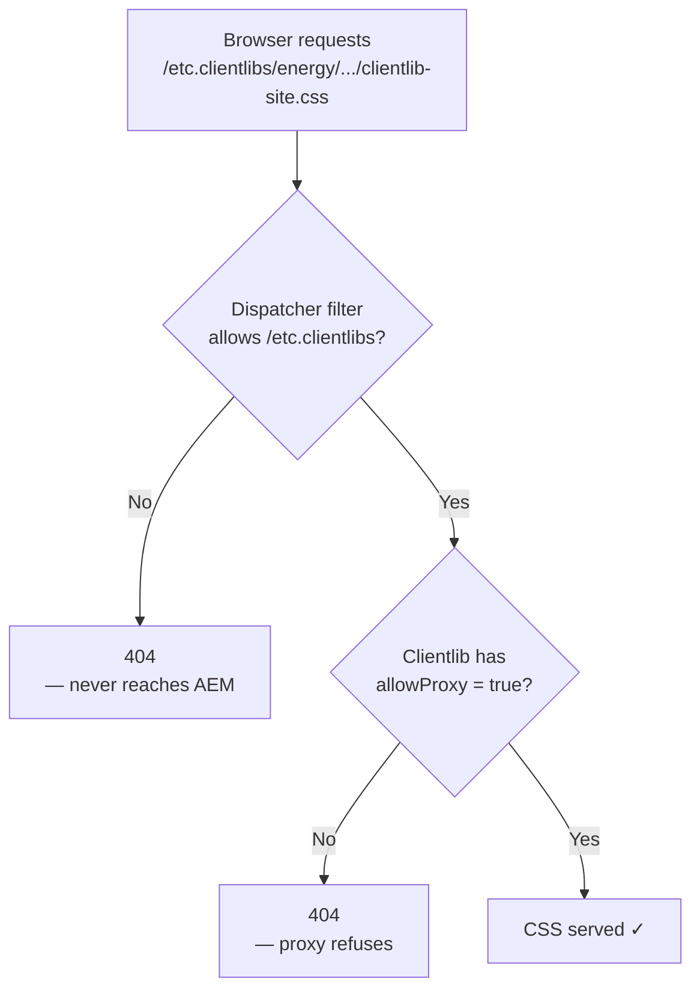
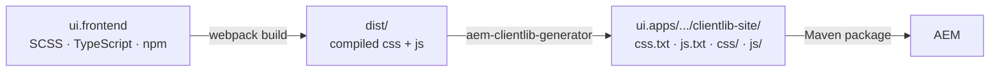
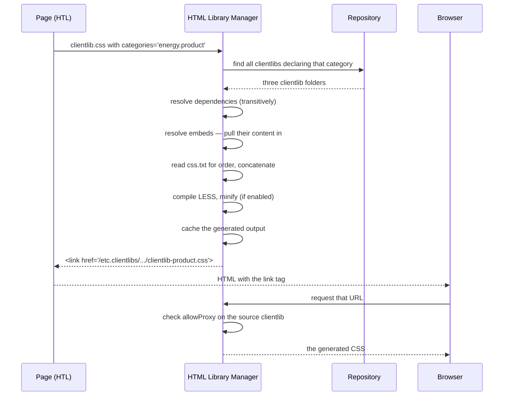
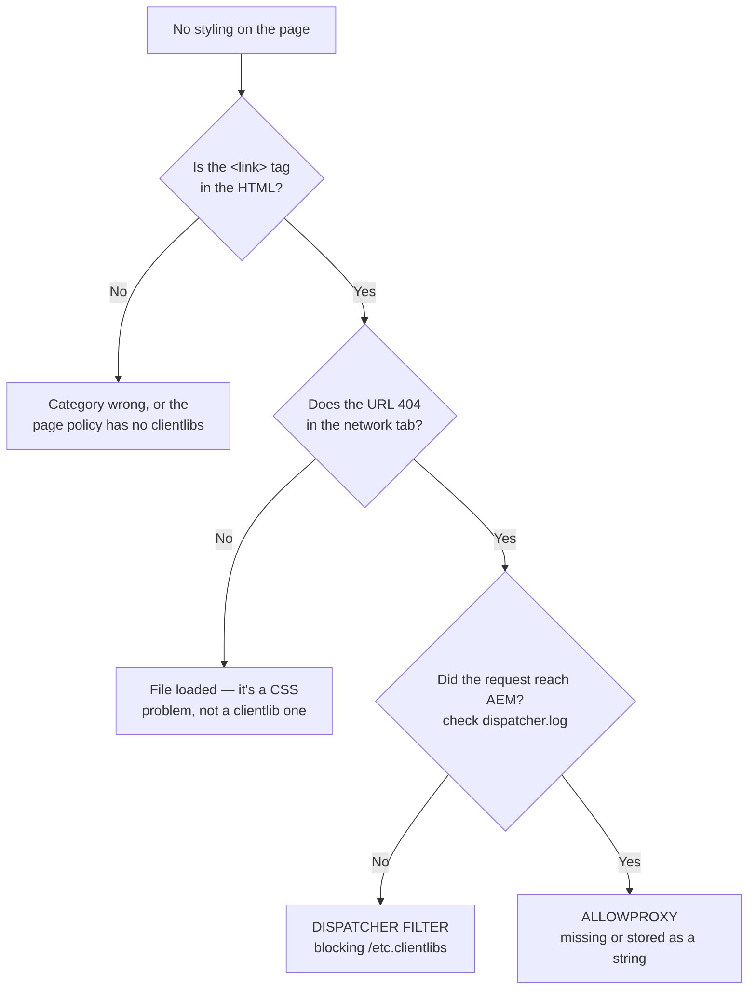

# 04 – Client Libraries (Clientlibs)

> **Target:** 3–4 years experienced AEM Developer
> **Syllabus points covered (4 and 5, in full):**
> *Point 4 — "What is a clientlib? Why do we use it? How do you call it in HTML? Why are `js.txt` and `css.txt` used? Setting `allowProxy` to true."*
> *Point 5 — "What are `categories`, `embed`, and `dependencies`? How are they used in a clientlib?"*
> **Project domain:** a global energy technology company's marketing site.

---

## Before we start — why this topic catches people out

Clientlibs look like the easiest topic in AEM. It is just CSS and JavaScript, after all.

And yet this is the topic that produces the single most common AEM support ticket:

> *"The styling works perfectly on author. On publish, the page has no CSS at all."*

Your syllabus even calls out the cause by name — **`allowProxy`**. Whoever recorded that list was asked about it directly, which tells you interviewers use it as a marker. It separates people who have deployed to a real publish environment from people who have only worked locally on an author instance.

So this file spends serious time on three things:

1. **Why clientlibs exist at all** — because "it's a folder for CSS" is not an answer.
2. **`allowProxy` and the `/etc.clientlibs` proxy servlet** — the publish 404 problem, explained properly.
3. **`categories` vs `embed` vs `dependencies`** — three words that sound similar, do completely different things, and get mixed up constantly.

There is also a nice continuity point from the last file: **the page policy decides which clientlib categories load.** That is how our product pages and news pages ship different CSS from the same page component. Templates and clientlibs meet exactly there.

---

## 1. Introduction

### 1.1 What is a clientlib?

Short definition first, then we will earn it:

> **A client library — clientlib — is a folder in the repository that holds CSS, JavaScript and related assets, and lets AEM manage how they are merged, minified, ordered and delivered to the browser.**

In the repository it is a node of type **`cq:ClientLibraryFolder`**.

But that definition tells you *what it is*, not *why it exists*. And in an interview, "why" is the better answer.

### 1.2 Why not just put CSS in a file and link to it?

This is the question to answer first, because it justifies everything else.

Imagine our energy site without clientlibs. The front-end team writes forty CSS files and twenty JavaScript files. Now you have problems:

**Problem one — too many requests.** Sixty separate `<link>` and `<script>` tags. Every one is a round trip. Page load suffers badly.

**Problem two — order.** CSS cascade depends on order. JavaScript often depends on other JavaScript being loaded first. Who guarantees that `jquery.js` loads before the plugin that needs it? Somebody has to maintain that order by hand, in every template, forever.

**Problem three — minification.** Someone has to run a build step and remember to do it every time.

**Problem four — hardcoded paths.** Every template references `/apps/energy/clientlibs/css/main.css`. Move or rename anything and every template breaks.

**Problem five — caching after a deploy.** You ship a CSS change and browsers keep serving yesterday's file, because the URL did not change.

**Clientlibs solve all five.** AEM merges the files into one, minifies them, works out the load order from your declarations, lets you reference libraries by a logical name rather than a path, and can add a content hash to the URL so caches refresh automatically.

**The interview answer:**

> "A clientlib is a repository folder holding CSS and JavaScript, typed as `cq:ClientLibraryFolder`, that AEM manages for us. We use them rather than plain files for five reasons: AEM merges many source files into one request, minifies them, resolves load order from declared dependencies, lets us reference a library by a logical **category** name instead of a hardcoded path, and — importantly on Cloud Service — can version the URL so a deployment actually invalidates browser and CDN caches. The category indirection is the one I'd emphasise, because it means a page template asks for `energy.product` and doesn't care where those files physically live."

### 1.3 Where do clientlibs live?

This changed in AEM 6.4, and knowing both is worth a mark.

| | Old (pre-6.4) | Current |
|---|---|---|
| Path | `/etc/clientlibs/<project>/...` | `/apps/<project>/clientlibs/...` |
| Why it moved | — | Repository restructuring: `/apps` is where application code belongs |
| Publicly readable? | Yes, `/etc` was readable | **No** — `/apps` is not readable by anonymous |
| So how is it served? | Directly | Through the **`/etc.clientlibs` proxy** |

That last row is the whole `allowProxy` story, and we cover it properly in section 2.6. But notice the shape of the problem already: **the code moved somewhere the public cannot read, so something had to bridge the gap.**

### 1.4 A real project example to adapt

> "On our site the front-end code lives in a `ui.frontend` module built with webpack, and the build output is copied into a clientlib under `ui.apps`. We have a base clientlib that every page loads, and then page-type-specific ones — a product bundle and an editorial bundle — that are selected by the **page policy** on each template. So a product page and a news article use the same page component but ship different CSS and JavaScript, with no code change. Component-level clientlibs are embedded into those bundles rather than being served individually, so we're not making a request per component."

That paragraph covers the build pipeline, the category strategy, the templates link, and the embed pattern — four follow-up questions answered before they are asked.

---

## 2. Core Concepts

### 2.1 The anatomy of a clientlib

Here is a real one. You should be able to draw this from memory.

```
/apps/energy/clientlibs/clientlib-site/
│
├── .content.xml         ← the clientlib definition (categories, allowProxy, embed…)
│
├── css.txt              ← WHICH css files, and in WHAT ORDER
├── js.txt               ← WHICH js files, and in WHAT ORDER
│
├── css/
│   ├── variables.less
│   ├── base.less
│   └── layout.less
│
├── js/
│   ├── utils.js
│   └── main.js
│
└── resources/           ← images, fonts — served as-is, not merged
    ├── icons/
    └── fonts/
```

Four things to notice:

**`.content.xml`** makes the folder a clientlib and carries all its configuration.

**`css.txt` and `js.txt`** are not optional decoration — they are how AEM knows what to include. Section 2.4.

**`css/` and `js/`** hold the actual source files.

**`resources/`** is special: files here are served **as-is**, not merged or minified. Fonts, background images, anything your CSS references by relative path. This is the folder people forget exists, and then wonder why their `background-image: url(...)` 404s.

### 2.2 The `.content.xml` — every property explained

```xml
<?xml version="1.0" encoding="UTF-8"?>
<jcr:root xmlns:cq="http://www.day.com/jcr/cq/1.0"
          xmlns:jcr="http://www.jcp.org/jcr/1.0"
    jcr:primaryType="cq:ClientLibraryFolder"
    categories="[energy.site]"
    allowProxy="{Boolean}true"
    dependencies="[jquery]"
    embed="[energy.component.accordion,energy.component.cta]"/>
```

| Property | What it does | Covered in |
|---|---|---|
| `jcr:primaryType="cq:ClientLibraryFolder"` | Makes the folder a clientlib at all | — |
| `categories` | The logical name(s) this library answers to | 2.3 |
| `allowProxy` | Lets it be served publicly via `/etc.clientlibs` | 2.6 |
| `dependencies` | Other categories to load **before** this one, separately | 2.8 |
| `embed` | Other categories to pull **into** this one, merged | 2.9 |

Five properties. Three of them are your syllabus point 5, and one of them is the second half of point 4. This single file is most of the topic.

### 2.3 `categories` — the logical name *(syllabus point 5)*

**The concept:** a category is the **name you use to ask for a library**, rather than its path.

```xml
categories="[energy.site]"
```

Now anywhere in your code — a template, a page policy, HTL — you ask for `energy.site` and AEM finds it. You never write `/apps/energy/clientlibs/clientlib-site`.

**Why that indirection matters:** you can move, rename or split the clientlib folder and nothing that references it needs to change. That is the same reasoning as `sling:resourceType` pointing at a component rather than pages hardcoding a path — AEM does this consistently.

**Two behaviours that surprise people, and both get asked:**

**One — a clientlib can have several categories.**

```xml
categories="[energy.site,energy.product]"
```

This library now answers to both names. Useful when a library belongs to a general bundle and a specific one.

**Two — several clientlibs can share one category.**

If three separate clientlib folders all declare `categories="[energy.site]"`, then requesting `energy.site` includes **all three**, merged together.

That is genuinely useful — it lets you split source across folders while serving one bundle. But it is also a real source of confusion, because a developer adds a category to a new clientlib, and suddenly extra CSS appears on pages they never touched.

**Naming convention.** Use a dotted, namespaced scheme so categories sort and group sensibly:

```
energy.base                    loaded on every page
energy.product                 product page types
energy.editorial               news and blog pages
energy.component.accordion     one component
energy.component.cta           one component
energy.author                  authoring-only styling
```

**The interview answer:**

> "A category is the logical name a clientlib answers to, so code references `energy.product` rather than a repository path — same indirection principle as `sling:resourceType`. Two things worth knowing: one clientlib can declare several categories, and several clientlibs can share one category, in which case requesting that category includes all of them merged. That second behaviour is powerful for splitting source files across folders, but it's also how unexpected CSS ends up on a page — someone adds a shared category to a new library and it starts loading everywhere that category is requested."

### 2.4 `css.txt` and `js.txt` — why they exist *(syllabus point 4)*

Your syllabus asks this specifically, which means an interviewer asked it directly. Here is the proper answer.

**What they are.** Plain text files listing which source files belong to the library, and — crucially — **in what order**.

`js.txt`:
```
#base=js

vendor/polyfills.js
utils.js
components/navigation.js
main.js
```

`css.txt`:
```
#base=css

variables.less
mixins.less
base.less
layout.less
components.less
```

**The syntax:**

- **`#base=<folder>`** sets the directory that following paths are relative to. So `utils.js` above means `js/utils.js`.
- Then one file per line, **in load order**.
- Lines starting with `#` are comments.
- You *can* list a folder name to include everything in it, but then the order is alphabetical, which is almost never what you want.

**Now the actual question: why do these files exist at all? Why not just include everything in the folder?**

Two reasons, and the first one is the real answer:

**Reason one — order is everything.**

In CSS, order determines the cascade. `variables.less` must come before anything that uses those variables. `base.less` must come before `components.less`, or component styles get overridden by base styles instead of the other way round.

In JavaScript, order determines whether things exist. A polyfill must run before the code that needs it. A utility module must be defined before it is called.

If AEM just globbed the folder, you would get alphabetical order — `base`, `components`, `layout`, `mixins`, `variables`. Your variables would load last, and nothing would work.

**Reason two — explicit control.**

You can keep a file in the folder without including it. Work in progress, an experiment, a file only used by a different bundle. Without the text file, everything in the folder ships whether you want it or not.

**The interview answer:**

> "`css.txt` and `js.txt` declare which source files are part of the library and, more importantly, the **order** they're concatenated in. Order matters enormously — in CSS the cascade depends on it, so a variables or base file has to come before the component styles that override it, and in JavaScript a dependency has to be defined before it's used. If AEM just included everything in the folder it would be alphabetical, which would be wrong almost every time.
>
> The syntax is a `#base=` line setting the source folder, then one file per line in load order. They also give you control — you can leave a file in the folder without shipping it.
>
> And the failure mode is worth knowing: if `js.txt` is missing or empty, the clientlib silently produces **no JavaScript at all**. No error, just nothing. That's caught me before."

That last paragraph is the detail that makes it sound lived-in.

### 2.5 How to call a clientlib in HTML *(syllabus point 4)*

Your syllabus asks this too. There are two templates you can use, and you should know both.

**The Granite one** — always available:

```html
<sly data-sly-use.clientlib="/libs/granite/sightly/templates/clientlib.html"
     data-sly-call="${clientlib.all @ categories='energy.site'}"/>
```

**The Core Components one** — preferred if Core Components are in your project, because it supports more options:

```html
<sly data-sly-use.clientlib="core/wcm/components/commons/v1/templates/clientlib.html"
     data-sly-call="${clientlib.all @ categories='energy.site'}"/>
```

**Three calls are available:**

| Call | What it outputs |
|---|---|
| `clientlib.all` | Both the `<link>` for CSS and the `<script>` for JS |
| `clientlib.css` | Only the CSS `<link>` |
| `clientlib.js` | Only the JS `<script>` |

**And here is why you rarely want `all`.** Best practice is CSS in the `<head>` so the page never renders unstyled, and JavaScript at the end of the `<body>` so it does not block rendering. `all` puts both wherever you called it.

So a real page component looks like this:

```html
<!DOCTYPE html>
<html lang="${currentPage.language}">
<head>
    <sly data-sly-use.clientlib="core/wcm/components/commons/v1/templates/clientlib.html"/>

    <!-- CSS in the head -->
    <sly data-sly-call="${clientlib.css @ categories=page.clientLibCategories}"/>
</head>
<body>

    <sly data-sly-resource="${'content' @ decoration=false}"/>

    <!-- JS at the end of the body -->
    <sly data-sly-call="${clientlib.js @ categories=page.clientLibCategories}"/>

</body>
</html>
```

**Notice `page.clientLibCategories`.** That is not a hardcoded string — it comes from the **page policy**, which is exactly the link back to file 03. The template's page policy defines the categories, the page component reads them, and that is how product pages and news pages load different bundles from one component.

**Extra options** the Core Components template supports:

```html
<!-- Load JS asynchronously -->
<sly data-sly-call="${clientlib.js @ categories='energy.analytics', async=true}"/>

<!-- Defer until the document is parsed -->
<sly data-sly-call="${clientlib.js @ categories='energy.site', defer=true}"/>

<!-- Print-only stylesheet -->
<sly data-sly-call="${clientlib.css @ categories='energy.print', media='print'}"/>
```

**And the legacy JSP form**, worth recognising in an older codebase:

```jsp
<cq:includeClientLib categories="energy.site"/>
```

**The interview answer:**

> "I use the clientlib HTL template — either the Granite one at `/libs/granite/sightly/templates/clientlib.html`, or the Core Components one, which I prefer because it supports `async`, `defer` and `media`. You `data-sly-use` it and then `data-sly-call` with a categories parameter.
>
> There are three calls — `all`, `css` and `js` — and I almost always use `css` and `js` separately rather than `all`, because CSS belongs in the head so the page never flashes unstyled, and JavaScript belongs at the end of the body so it doesn't block rendering.
>
> And the categories usually aren't hardcoded — they come from the page policy, so each template controls which bundles its page type loads."

### 2.6 `allowProxy` — the publish 404 problem *(syllabus point 4)*

**This is the most important section in the file.** Your syllabus names it explicitly, and it is behind the most common clientlib incident in production.

**Start with the problem.**

Clientlibs live under `/apps`. On a publish instance, the visitor is **anonymous**, and the anonymous user has **no read permission on `/apps`**.

That is not a misconfiguration — it is deliberate and correct. `/apps` holds your application code. You absolutely do not want the public able to read it.

But that creates an obvious problem. If the page renders:

```html
<link rel="stylesheet" href="/apps/energy/clientlibs/clientlib-site.css">
```

then on publish that request is **denied**. The page loads with no styling at all.

And here is why it is so confusing: **on author it works perfectly**, because an author is logged in and their user *does* have read access to `/apps`. So the developer tests locally, everything is fine, it goes to publish, and the site is unstyled.

**The solution: the `/etc.clientlibs` proxy.**

AEM provides a **proxy servlet** that can serve clientlib output without exposing `/apps` itself. It works by path translation:

```
The clientlib lives at:   /apps/energy/clientlibs/clientlib-site
It is served from:        /etc.clientlibs/energy/clientlibs/clientlib-site.css
                          ↑                ↑
                     the proxy      /apps stripped off
```

The proxy serves **only the generated CSS and JS output**, plus anything in `resources/`. It does not expose your source files, your components, or anything else under `/apps`.

**But — and this is the whole point — the proxy only serves a clientlib that has explicitly opted in:**

```xml
allowProxy="{Boolean}true"
```

Without that property, the proxy refuses, and you get a 404 on publish.

**Note the `{Boolean}` type hint.** Write `allowProxy="true"` without it and you store the *string* `"true"`, which is not the boolean `true`, and the proxy will not honour it. This is exactly the same trap as `required="{Boolean}true"` in dialogs from file 02, and it is a genuinely nasty one because everything *looks* correct in the XML.

**The interview answer — learn this one properly:**

> "Clientlibs live under `/apps`, and on publish the anonymous user has no read access to `/apps` — deliberately, because that's application code. So if a page linked directly to `/apps/.../clientlib-site.css`, publish would return 404 and the site would render with no styling.
>
> AEM solves it with a proxy servlet. A clientlib that sets `allowProxy="{Boolean}true"` can be served through `/etc.clientlibs/`, which strips the `/apps` prefix — so `/apps/energy/clientlibs/clientlib-site` is served as `/etc.clientlibs/energy/clientlibs/clientlib-site.css`. The proxy exposes only the generated output and the `resources` folder, not the source or anything else under `/apps`.
>
> The failure is nasty because it's environment-specific — it works fine on author, since an author is authenticated and can read `/apps`, and only breaks on publish. That's the classic 'CSS works on author, missing on publish' ticket, and `allowProxy` is the first thing I check.
>
> Two related gotchas: the `{Boolean}` type hint matters, because without it you store the string 'true' and the proxy ignores it. And the dispatcher has to allow `/etc.clientlibs` in its filter rules, or you'll get the same 404 one layer further out even with `allowProxy` set correctly."

**That last point deserves emphasis.** There are **two** independent things that can cause the identical symptom:



Knowing there are two layers, and being able to tell them apart, is what makes this a strong answer rather than a memorised fact. **How to tell:** check the dispatcher log. If the request never reached the publish instance, it is the dispatcher filter. If it reached AEM and AEM returned 404, it is `allowProxy`.

### 2.7 When you do *not* need `allowProxy`

A useful piece of nuance that shows real understanding.

If a clientlib is **only ever embedded into another clientlib** (see 2.9), it is never requested directly by the browser. Its content is baked into the parent bundle, which is the thing actually served.

So a component-level clientlib that is embedded into the site bundle does **not** need `allowProxy`. Only the bundle that the browser actually requests needs it.

That is worth saying, because it shows you understand *why* the property exists rather than just cargo-culting it onto every clientlib.

### 2.8 `dependencies` — load something else first *(syllabus point 5)*

```xml
dependencies="[jquery]"
```

**What it means:** "before this library loads, make sure the `jquery` category has loaded."

**What AEM does:** it includes the dependency as a **separate** file, before this one.

```html
<script src="/etc.clientlibs/.../jquery.js"></script>        ← the dependency
<script src="/etc.clientlibs/.../clientlib-site.js"></script> ← this library
```

**Two separate requests. Two separate files.**

**When to use it:** when this library genuinely needs another one to already be present and running. A jQuery plugin depends on jQuery. A component's JavaScript depends on a shared utility library.

**A property worth knowing:** dependencies are **transitive**. If A depends on B and B depends on C, requesting A loads C, then B, then A. AEM resolves the whole chain.

### 2.9 `embed` — pull the code inside *(syllabus point 5)*

```xml
embed="[energy.component.accordion,energy.component.cta]"
```

**What it means:** "take the content of those libraries and **include it inside** this one."

**What AEM does:** it merges everything into a **single** generated file.

```html
<script src="/etc.clientlibs/.../clientlib-site.js"></script>
<!-- ↑ this ONE file now contains the site JS
       PLUS the accordion JS PLUS the CTA JS -->
```

**One request. One file.**

**When to use it:** this is the pattern for component-level clientlibs. From file 02, each component can have its own clientlib folder, which is great for organisation. But you absolutely do not want a separate HTTP request per component — a page with twelve components would make twelve requests.

So each component declares a narrow category, and the site bundle embeds them all:

```
energy/components/accordion/clientlibs/  →  categories="[energy.component.accordion]"
energy/components/cta/clientlibs/        →  categories="[energy.component.cta]"

energy/clientlibs/clientlib-site/        →  categories="[energy.site]"
                                            embed="[energy.component.accordion,
                                                    energy.component.cta]"
```

Organised source, single delivered file. That is the point.

**The danger with embed:** if two different bundles both embed the same library, its code is **duplicated** in both. Load a page that uses both bundles and that code runs twice. For CSS that usually just bloats the file; for JavaScript that registers event handlers, it can genuinely break things.

### 2.10 `dependencies` versus `embed` — the comparison they want

This is the comparison the syllabus is driving at, and it is asked constantly.

| | `dependencies` | `embed` |
|---|---|---|
| What it does | Loads another category **before** this one | Copies another category's content **into** this one |
| Result | **Separate** files | **One merged** file |
| HTTP requests | More | Fewer |
| The other library is | Loaded independently | Absorbed |
| Does the embedded one need `allowProxy`? | Yes — it's served directly | **No** — it's never requested directly |
| Use it for | A genuine load-order requirement (jQuery before a plugin) | Bundling component clientlibs into a site bundle |
| Risk | Extra requests | **Duplication** if two bundles embed the same thing |

**The interview answer:**

> "`dependencies` says 'load that other category before me, as a separate file.' `embed` says 'take that other category's code and put it inside my file.'
>
> So dependencies gives you separate requests with a guaranteed order, and embed gives you one merged file.
>
> I use dependencies for a genuine ordering requirement — a plugin that needs jQuery already loaded. I use embed for the component clientlib pattern: each component has its own small clientlib for organisation, and the site bundle embeds them all, so we get tidy source without one HTTP request per component.
>
> Two things worth knowing. An embedded clientlib doesn't need `allowProxy`, because the browser never requests it directly — only the bundle that embeds it does. And the risk with embed is duplication: if two bundles both embed the same library and a page loads both, that code ships twice, which for JavaScript that binds event handlers can actually cause bugs, not just bloat."

**A memory hook that works:** *"Dependencies are neighbours; embeds are ingredients."* A neighbour lives in their own house and arrives before you. An ingredient goes inside the dish.

### 2.11 The `ui.frontend` module — how modern projects actually build this

Worth knowing, because interviewers ask how front-end code gets into AEM on a real project.

The AEM Maven archetype includes a **`ui.frontend`** module. It is a normal npm and webpack project — the front-end team works there with the tooling they already know: SASS, TypeScript, ES modules, whatever.

When you build, webpack compiles everything, and a tool called `aem-clientlib-generator` copies the compiled output into a clientlib folder inside `ui.apps`.



**Why this matters:** it decouples the front-end workflow from AEM. Front-end developers do not need an AEM instance to work. And you get the whole modern toolchain — SASS, module bundling, tree shaking, linting — which AEM's built-in LESS compiler cannot offer.

**Note the consequence for `css.txt` and `js.txt`:** in this setup they are **generated**, not hand-maintained. So do not edit them — your change is overwritten on the next build. Editing a generated `js.txt` and wondering why it reverts is a real time-waster, and mentioning it shows you have worked in this setup.

---

## 3. Internal Working

### 3.1 What happens when a page requests a category



**The service doing all this is the HTML Library Manager**, an OSGi service. Being able to name it is a small credibility marker.

**Two important points from that flow:**

**Generated output is cached.** AEM does not recompile on every request. That is why a change sometimes does not appear until you rebuild the clientlibs — covered in section 11.

**The `allowProxy` check happens at the last step**, when the browser actually requests the file. Not at generation time. That is why the page HTML looks perfectly correct — the `<link>` tag is there, pointing at a sensible URL — and yet the file 404s. The page is fine; the fetch fails.

That distinction is genuinely useful in an interview, because it explains why "view source looks right but there's no CSS."

### 3.2 How the proxy path is derived

Simple but worth being able to state precisely:

```
Source:   /apps/energy/clientlibs/clientlib-site
                ↓  strip the leading /apps
Proxy:    /etc.clientlibs/energy/clientlibs/clientlib-site.css
```

The same works for `/libs`:

```
Source:   /libs/clientlibs/granite/jquery
Proxy:    /etc.clientlibs/clientlibs/granite/jquery.js
```

And files in `resources/` are served through the same proxy at their relative path:

```
/apps/energy/clientlibs/clientlib-site/resources/fonts/icons.woff2
        ↓
/etc.clientlibs/energy/clientlibs/clientlib-site/resources/fonts/icons.woff2
```

**That last one is why `resources/` exists.** If your CSS says `url('resources/fonts/icons.woff2')`, the relative path resolves correctly through the proxy. Put the font anywhere else and it will not.

### 3.3 Versioned clientlibs and cache busting

**The problem.** You deploy a CSS fix. The URL is still `/etc.clientlibs/energy/clientlibs/clientlib-site.css` — identical to yesterday. Browsers and the CDN have it cached with a long TTL, so they do not refetch. Users keep seeing the old styling, sometimes for days.

**The solution: put a content hash in the URL**, so the URL changes whenever the content changes.

```
/etc.clientlibs/energy/clientlibs/clientlib-site.lc-a1b2c3d4-lc.min.css
                                              ↑ hash of the content
```

Change the CSS, the hash changes, the URL changes, every cache treats it as a brand new file and fetches it. Nothing changes, the URL stays the same, and it keeps being served from cache with a long TTL. Best of both.

**How you get it:**

| Platform | Approach |
|---|---|
| **AEM as a Cloud Service** | Built in — long-cache clientlib URLs with a content hash |
| **AEM 6.5 / on-premise** | **ACS Commons Versioned ClientLibs**, a widely used community package |

**The interview answer:**

> "Without versioning, the clientlib URL doesn't change between deployments, so browsers and the CDN keep serving the cached file and users see stale CSS. The fix is putting a content hash in the URL, so it changes whenever the content does. On Cloud Service that's built in. On 6.5 the standard answer is ACS Commons Versioned ClientLibs. It also lets you set a long TTL safely, which you can't really do without it."

**Mentioning ACS Commons at all is a positive signal** — it is the community toolkit almost every real AEM project uses, and knowing it suggests you have worked on one.

---

## 4. Important Interview Questions

### 4.1 Basic

**Q1. What is a clientlib?**
A repository folder of node type `cq:ClientLibraryFolder` holding CSS, JavaScript and related assets, which AEM merges, minifies, orders and delivers.

*Cross:* What node type? · Where do they live now versus before 6.4? · What's in the folder?

**Q2. Why use clientlibs instead of plain CSS files?**
Merging into fewer requests, automatic minification, declared load order, reference by logical category rather than path, and versioned URLs for cache busting.

*Cross:* Which of those matters most? (the category indirection, and versioning) · What would break without them?

**Q3. Where do clientlibs live?**
`/apps/<project>/clientlibs/...`. Before AEM 6.4 they lived under `/etc/clientlibs`, and the repository restructuring moved them.

*Cross:* Why did they move? · What problem did that create? (`/apps` isn't publicly readable) · How was that solved? (the proxy)

**Q4. What are `css.txt` and `js.txt` for?**
They declare which source files are in the library and, crucially, in what order they are concatenated.

*Cross:* What is `#base=`? · What happens if `js.txt` is missing? (no JS at all, silently) · Why does order matter? · Can you list a folder? (yes, but the order becomes alphabetical)

**Q5. What is the `resources` folder?**
Files served as-is rather than merged — fonts, images, anything your CSS references by relative path. Served through the proxy at its relative path.

*Cross:* Why not put images in `css/`? · How does a relative `url()` in CSS resolve?

**Q6. How do you include a clientlib in HTML?**
`data-sly-use` the clientlib template, then `data-sly-call` with `categories`. Either the Granite template or the Core Components one.

*Cross:* Difference between `.all`, `.css` and `.js`? · Where should each go on the page? · What was the JSP way? (`<cq:includeClientLib>`)

**Q7. What is a category?**
The logical name a clientlib answers to, used instead of its path.

*Cross:* Can one clientlib have several? (yes) · Can several clientlibs share one? (yes — all get included) · What's a sensible naming convention?

**Q8. What is `allowProxy`?**
A boolean on the clientlib that permits it to be served publicly through `/etc.clientlibs`, without exposing `/apps`.

*Cross:* Why is it needed at all? · What happens without it on publish? · Why does it work on author? · Why does the `{Boolean}` type hint matter?

**Q9. What is the difference between `embed` and `dependencies`?**
Dependencies load another category before this one as a separate file. Embed pulls the other category's content into this one, producing a single merged file.

*Cross:* Which reduces HTTP requests? · Which risks duplication? · Does an embedded clientlib need `allowProxy`? (no)

**Q10. How do you debug clientlib problems?**
`?debugClientLibs=true` on the URL to get unminified individual files, and the `dumplibs` tooling to inspect what's registered.

*Cross:* What's the dumplibs path? · How do you check what a category resolves to? · How do you rebuild clientlibs?

### 4.2 Intermediate

**Q11. CSS works on author but the publish site has no styling. Debug it.**

**The most likely single question in this file.** Answer in order:

1. **`allowProxy`** — is it set, and set as `{Boolean}true` rather than the string `"true"`? This is the most common cause.
2. **Dispatcher filter** — does it allow `/etc.clientlibs`? Check `dispatcher.log`; if the request never reached publish, it is the filter, not AEM.
3. **Was the clientlib in the package filter** and actually deployed to publish?
4. **Category typo** in the page policy or the HTL call.
5. **CDN** serving a cached 404.

*Cross:* How do you tell the dispatcher case from the `allowProxy` case? (whether the request reached AEM at all) · Why does it work on author? · What does the page HTML look like in each case? (the `<link>` tag is present and correct in both — the *fetch* fails)

**Q12. How do product pages and news pages load different CSS with the same page component?**

Different **page policies**. The page policy defines the clientlib categories for that page type, the page component reads them, and each template gets its own bundle. No code change, no separate page component.

*Cross:* Where is that configured? (template editor → Page Design) → file 03 · Why is that better than a separate page component? · How does the page component read it?

**Q13. Why should CSS go in the head and JS at the end of the body?**

CSS in the head means the browser has the styles before it paints, so the page never flashes unstyled. A blocking `<script>` in the head stops HTML parsing until it downloads and executes, delaying first paint. Putting it at the end of the body — or using `defer` — means parsing completes first.

*Cross:* What do `async` and `defer` actually do differently? · Does the clientlib template support them? (the Core Components one does) · What is render-blocking CSS?

**Q14. Two components' JavaScript conflicts on the same page. What's the likely cause?**

Often duplication from embed — two bundles both embedding the same component clientlib, so its code runs twice and event handlers bind twice. Also possible: component JS using IDs or global selectors rather than scoping to its own element.

*Cross:* How would you detect duplication? (dumplibs, or search the generated output) · How do you scope component JS properly?

**Q15. What is the `ui.frontend` module?**

A webpack and npm project in the Maven build where front-end code actually lives. The build compiles it and `aem-clientlib-generator` copies the output into a clientlib in `ui.apps`.

*Cross:* Why not write LESS directly in the clientlib? (no modern tooling, no tree shaking, front-end devs need an AEM instance) · Are `css.txt` and `js.txt` hand-written there? (**no — generated**, don't edit them) · How does the front-end team work without AEM?

**Q16. How do you make a clientlib load only in the authoring environment?**

Give it its own category and include it conditionally with `wcmmode`, or use the `cq.authoring.editor` categories for extending the editor itself. Author-only styling should never ship to publish.

*Cross:* How do you check for edit mode in HTL? (`wcmmode.edit`) · Where do dialog validation clientlibs go? (category `cq.authoring.dialog`) → file 11

**Q17. What happens if two clientlibs declare the same category?**

Both are included when that category is requested, merged together. Useful for splitting source across folders — but also how unexpected CSS starts appearing on pages, when someone adds a shared category to a new library.

*Cross:* What order are they merged in? (not guaranteed between folders — use dependencies if order matters) · How would you find all clientlibs in a category? (dumplibs)

**Q18. How do you handle cache busting after a deployment?**

Content-hash versioning in the URL — built in on Cloud Service, ACS Commons Versioned ClientLibs on 6.5. Without it the URL is unchanged, so browsers and the CDN keep serving the old file.

*Cross:* Why can't you just flush the dispatcher? (the browser and CDN caches are outside your control) · What TTL would you set with versioning? (long — that's the benefit)

**Q19. When does a clientlib NOT need `allowProxy`?**

When it is only ever embedded into another clientlib. The browser never requests it directly, so the proxy is never involved. Only the bundle that is actually served needs it.

*Cross:* So which clientlibs in your project have it? (the page-level bundles) · Why not just set it everywhere? (unnecessary surface area; it's an explicit opt-in for a reason)

**Q20. Are clientlibs cached? What if my change doesn't appear?**

Yes — AEM caches the generated output. If a source change is not showing, rebuild the clientlibs via the dumplibs rebuild tool, and check the dispatcher and browser caches too.

*Cross:* Where's the rebuild page? · How do you bypass minification for debugging? (`?debugClientLibs=true`) · Which cache would you check first?

### 4.3 Advanced

**Q21. How would you structure clientlibs for a large multi-brand site?**

> "Layered. A `base` clientlib with resets, typography, grid and shared utilities that every page loads. Then page-type bundles — product, editorial, campaign — selected by the page policy on each template. Then component-level clientlibs, each with a narrow category, embedded into the relevant bundles rather than served individually.
>
> For multi-brand, the shared structure stays in the base and brand differences go into CSS custom properties, so a brand theme is a small variables file rather than a duplicated stylesheet. That way brand B doesn't ship a full copy of the layout code.
>
> The thing I'd guard against is one giant site-wide bundle, which is the default drift on most projects — every page ends up downloading the campaign JavaScript it never uses."

*Cross:* How do you stop the base bundle growing? · How would you measure whether it's too big? · What about a component used on only two pages?

**Q22. A page loads 400KB of JavaScript and most of it is unused. How do you approach it?**

Measure first — Chrome DevTools coverage tab shows exactly what proportion of each bundle actually executes. Then split by page type using page policies so pages only load their own bundle. Then move genuinely optional things — a video player, a map — to load on demand rather than up front. Then check for duplication from embed.

*Cross:* Which of those gives the biggest win? (usually the page-type split) · How do you load something on demand from a clientlib? · What is tree shaking and can AEM do it? (webpack in `ui.frontend` can; AEM's own merging cannot)

**Q23. How do clientlibs interact with the dispatcher and CDN?**

The dispatcher must allow `/etc.clientlibs` in its filters or everything 404s. Once allowed, clientlib responses cache well because they are static files on a stable path. With versioned URLs you can set a long TTL safely, since the URL changes when the content does.

*Cross:* What's the dispatcher rule? · What TTL? · What happens on deployment without versioning? · Does flushing the dispatcher help the browser cache? (no)

**Q24. How would you implement critical CSS in AEM?**

Inline the small amount of CSS needed for above-the-fold content directly in the `<head>`, then load the full stylesheet asynchronously. In AEM you would generate the critical CSS as part of the `ui.frontend` build and inline it in the page component, with the main clientlib loaded non-blocking.

*Cross:* Why does that help? (removes the render-blocking request before first paint) · What's the trade-off? (the inlined CSS isn't cached separately, and it has to be regenerated when styles change)

**Q25. Component clientlib versus site clientlib — how do you decide?**

If a component appears on most pages, its CSS belongs in the shared bundle — a separate library adds overhead for no benefit. If it appears on a handful of pages, a component clientlib embedded only into the bundles for those page types keeps the common bundle smaller. And for something genuinely heavy and rare, consider loading on demand.

*Cross:* How do you know how many pages use a component? · What's the cost of getting it wrong either way?

---

## 5. Cross Questions — how this topic gets drilled

**Thread A — from "what is a clientlib" (the syllabus thread)**
Why not just use CSS files? → Where do they live? → Why did they move from `/etc`? → So how are they served publicly? → What is `/etc.clientlibs`? → **What is `allowProxy`?** → What happens without it? → Why does it work on author then? → What else could cause the same 404?

**Thread B — from "what are `css.txt` and `js.txt`"**
Why does order matter? → What's `#base=`? → What if the file is missing? → Can you list a folder? → What order would that give? → Who writes these in your project? → What if you're using `ui.frontend`? (they're generated)

**Thread C — from "categories, embed, dependencies"**
What's a category? → Can two clientlibs share one? → What happens then? → What's the difference between embed and dependencies? → Which makes fewer requests? → Does an embedded library need `allowProxy`? → What's the risk with embed? → How would you spot duplication?

**Thread D — from "how do you include a clientlib"**
Which template? → What's the difference between the Granite and Core Components one? → `.all` vs `.css` vs `.js`? → Where does each go on the page? → Why? → Where do the categories come from? → What's a page policy? *(and now you're back in file 03)*

---

## 6. Best Interview Answers

### 6.1 "What is a clientlib and why do we use it?" — about 90 seconds

> "A clientlib is a folder in the repository, of node type `cq:ClientLibraryFolder`, that holds CSS, JavaScript and related assets. AEM manages the delivery rather than us linking to files directly.
>
> We use them for five reasons. AEM merges many source files into a single request. It minifies automatically. It resolves load order from what we declare rather than us maintaining it by hand. It lets us reference a library by a logical **category** name instead of a hardcoded path — the same indirection idea as `sling:resourceType` pointing at a component. And it can put a content hash in the URL, so a deployment actually invalidates browser and CDN caches instead of users seeing stale CSS for days.
>
> The folder itself holds a `.content.xml` with the configuration, `css.txt` and `js.txt` declaring which files are included and in what order, the source folders, and a `resources` folder for things served as-is like fonts.
>
> On our project the front-end code actually lives in a `ui.frontend` webpack module, and the build output gets copied into a clientlib in `ui.apps` — so the front-end team works with modern tooling and doesn't need an AEM instance."

### 6.2 "Why are `css.txt` and `js.txt` needed?" — about 45 seconds

> "They declare which source files belong to the library and, more importantly, **the order** they're concatenated in.
>
> Order matters enormously. In CSS the cascade depends on it — variables and base styles have to come before the component styles that build on them. In JavaScript, a dependency has to be defined before anything calls it. If AEM just included everything in the folder, you'd get alphabetical order, which would put `variables` last and break everything.
>
> The format is a `#base=` line setting the source folder, then one file per line in load order. They also give you control — you can leave a work-in-progress file in the folder without shipping it.
>
> One failure mode worth knowing: if `js.txt` is missing or empty, the clientlib produces no JavaScript at all, silently. No error, just nothing. And if you're using the `ui.frontend` module, these files are **generated** by the build, so editing them by hand gets overwritten on the next build."

### 6.3 "What is `allowProxy` and why do we set it to true?" — about 90 seconds

**This is the one to have word-perfect. Your syllabus names it.**

> "Clientlibs live under `/apps`. On a publish instance the visitor is anonymous, and the anonymous user deliberately has no read access to `/apps`, because that's application code — you don't want the public reading it.
>
> So if a page linked directly to `/apps/energy/clientlibs/clientlib-site.css`, publish would return 404 and the site would render completely unstyled.
>
> AEM solves that with a proxy servlet. A clientlib that sets `allowProxy` to true can be served through `/etc.clientlibs`, which is just the clientlib path with the `/apps` prefix stripped — so `/apps/energy/clientlibs/clientlib-site` is served as `/etc.clientlibs/energy/clientlibs/clientlib-site.css`. The proxy exposes only the generated CSS and JS and the `resources` folder, not the source files or anything else under `/apps`.
>
> The reason it's such a common bug is that it's environment-specific. On author it works fine, because an author is authenticated and can read `/apps`. It only fails on publish. That's the classic 'styling works on author but not on publish' ticket, and `allowProxy` is the first thing I check.
>
> Two related things. The `{Boolean}` type hint matters — write `allowProxy=\"true\"` without it and you store the string 'true', which isn't the boolean, and the proxy ignores it. And the dispatcher has to allow `/etc.clientlibs` in its filter rules, or you get an identical 404 one layer further out. I tell those two apart by checking whether the request reached AEM at all — if it never got there, it's the dispatcher filter.
>
> One more nuance: a clientlib that's only ever **embedded** into another one doesn't need `allowProxy`, because the browser never requests it directly. Only the bundle that's actually served needs it."

### 6.4 "Difference between categories, embed and dependencies?" — about 90 seconds

> "**Categories** are the logical names a clientlib answers to. Code asks for `energy.product` rather than a repository path, so the folder can move or be renamed without breaking anything. One clientlib can declare several categories, and several clientlibs can share one — in which case requesting that category includes all of them merged, which is useful for splitting source but also how unexpected CSS ends up on a page.
>
> **Dependencies** say 'load that other category before me, as a separate file.' They're transitive, so AEM resolves the whole chain. I use them for a genuine ordering requirement — a plugin that needs jQuery already present.
>
> **Embed** says 'take that other category's code and put it inside my generated file.' One request instead of two.
>
> So the practical difference is separate files versus one merged file. I use embed for the component clientlib pattern: each component has a small clientlib for organisation, with a narrow category, and the page-level bundle embeds them all. That gives tidy per-component source without one HTTP request per component.
>
> Two things to watch. An embedded library doesn't need `allowProxy`. And embed can duplicate code — if two bundles both embed the same library and a page loads both, that code ships and runs twice, which for JavaScript that binds event handlers can cause real bugs rather than just bloat.
>
> The way I keep them straight: **dependencies are neighbours, embeds are ingredients.**"

---

## 7. Real Project Examples

### Story 1 — The publish-only styling outage

**What happened.** A new component shipped with its own clientlib. It looked perfect on author and on the local environment. It went to production and the component rendered completely unstyled on the live site.

**The investigation.** The page HTML was correct — the `<link>` tag was there, pointing at a sensible `/etc.clientlibs` URL. So the page was fine; the *fetch* was failing. The browser network tab showed a 404 on the CSS.

Two candidates: the dispatcher was blocking the path, or the clientlib had not opted into the proxy. The dispatcher log settled it — the request had reached the publish instance, so it was not the filter. That left `allowProxy`.

**The cause.** The clientlib had `allowProxy="true"` — as a **string**, without the `{Boolean}` type hint. So the property existed, looked correct in the XML, and was not the boolean the proxy checks for.

**The fix.** `allowProxy="{Boolean}true"`.

**What we changed afterwards.** Added a check to our code review checklist, and — more usefully — restructured so component clientlibs are **embedded** into the page-level bundles rather than served individually. That means only three clientlibs in the whole project need `allowProxy` at all, instead of forty. Fewer places to get it wrong, and fewer HTTP requests.

**Why this story works in an interview:** it demonstrates the diagnostic split between the two possible causes, names a subtle trap, and ends with a structural fix rather than just a patch.

### Story 2 — Cutting the JavaScript payload

**Requirement.** Page performance work ahead of a site relaunch. Core Web Vitals were failing, and JavaScript was the biggest contributor.

**The problem.** Every page loaded a single site-wide bundle — around 400KB of JavaScript. Chrome DevTools coverage showed roughly 70% of it never executed on a typical product page. The campaign carousel code, the interactive map, and a heavy data-table library all shipped to every page whether used or not.

**Approach, in order of impact.**

First, **split by page type using page policies**. Product pages, editorial pages and campaign pages each got their own bundle, selected by the page policy on their template — no code change to the page component, which is exactly what page policies are for.

Second, **moved the genuinely optional things to load on demand**. The map library only loads when a page actually contains a map component, triggered from the component's own markup rather than shipped up front.

Third, **found and removed duplication**. Two bundles both embedded a shared utility library, so pages loading both shipped it twice.

**The hard part.** Working out what was actually safe to remove. A global bundle means nobody knows what depends on what. We used the coverage tool per page type, then removed things incrementally with monitoring rather than in one change.

**Result.** The typical product page went from around 400KB to roughly 120KB of JavaScript, and the render-blocking time dropped substantially.

### Story 3 — Component clientlibs without the request explosion

**Requirement.** The team wanted each component's CSS and JS to live inside the component folder, so that deleting a component removes its styling and it is obvious what belongs to what.

**The problem.** Doing that naively means one HTTP request per component. A product page with a dozen components would make a dozen extra requests, which is worse than the organisational benefit is worth.

**Approach.** Each component clientlib declares a narrow category — `energy.component.accordion`, `energy.component.cta` — and does **not** set `allowProxy`, because it is never requested directly. The page-level bundles then **embed** the categories they need.

```
accordion/clientlibs   → categories=[energy.component.accordion]   (no allowProxy)
cta/clientlibs         → categories=[energy.component.cta]          (no allowProxy)

clientlib-product      → categories=[energy.product]
                         allowProxy=true
                         embed=[energy.component.accordion, energy.component.cta]
```

**The discipline it required.** A rule that a component clientlib is embedded by exactly one bundle, tracked in a simple list, because the failure mode is two bundles embedding the same thing and duplicating it.

**Result.** Source organised per component, delivered as one file per page type. Only the page-level bundles need `allowProxy`, which removed a whole class of mistake.

---

## 8. Coding Examples

### 8.1 A page-level clientlib

`ui.apps/.../apps/energy/clientlibs/clientlib-product/.content.xml`

```xml
<?xml version="1.0" encoding="UTF-8"?>
<jcr:root xmlns:cq="http://www.day.com/jcr/cq/1.0"
          xmlns:jcr="http://www.jcp.org/jcr/1.0"
    jcr:primaryType="cq:ClientLibraryFolder"

    <!-- The logical name templates and policies ask for -->
    categories="[energy.product]"

    <!-- REQUIRED: this bundle is requested directly by the browser,
         so it must be servable through the /etc.clientlibs proxy.
         The {Boolean} type hint is NOT optional -- without it you
         store the string "true" and the proxy ignores it. -->
    allowProxy="{Boolean}true"

    <!-- Loaded BEFORE this one, as separate files -->
    dependencies="[energy.base]"

    <!-- Pulled INTO this one, producing a single merged file.
         These component clientlibs deliberately do NOT set
         allowProxy, because they are never requested directly. -->
    embed="[energy.component.accordion,
            energy.component.cta,
            energy.component.categorylisting]"/>
```

**Every property here answers a syllabus question.** `categories` and `embed` and `dependencies` are point 5; `allowProxy` is point 4.

### 8.2 `css.txt` and `js.txt`

`clientlib-product/css.txt`

```
# Order matters -- the CSS cascade depends on it.
# Variables and mixins MUST come before anything that uses them.

#base=css

variables.less
mixins.less

base/typography.less
base/layout.less

components/product-hero.less
components/spec-table.less
components/downloads.less
```

`clientlib-product/js.txt`

```
# Order matters -- a module must be defined before it is used.

#base=js

utils/dom.js
utils/analytics.js

components/spec-table.js
components/downloads.js

main.js
```

**What to point at in an interview:**

The `#base=` line sets the folder, so `variables.less` means `css/variables.less`.

The ordering is deliberate and load-bearing: variables, then base, then components. Alphabetical order would put `base` before `variables` and break every variable reference.

`main.js` is last, because it initialises things the other modules define.

### 8.3 A component-level clientlib

`ui.apps/.../apps/energy/components/accordion/clientlibs/.content.xml`

```xml
<?xml version="1.0" encoding="UTF-8"?>
<jcr:root xmlns:cq="http://www.day.com/jcr/cq/1.0"
          xmlns:jcr="http://www.jcp.org/jcr/1.0"
    jcr:primaryType="cq:ClientLibraryFolder"
    categories="[energy.component.accordion]"/>
```

**Note what is absent: `allowProxy`.**

That is deliberate, and it is the answer to a good follow-up question. This clientlib is embedded into `energy.product` and `energy.editorial`, so the browser never requests it directly. Adding `allowProxy` here would expose it unnecessarily for no benefit.

### 8.4 The page component — calling clientlibs correctly

`ui.apps/.../apps/energy/components/page/page.html`

```html
<!DOCTYPE html>
<html lang="${currentPage.language}">
<head>
    <meta charset="utf-8"/>
    <meta name="viewport" content="width=device-width, initial-scale=1"/>
    <title>${currentPage.title}</title>

    <sly data-sly-use.page="com.energy.core.models.PageModel"/>
    <sly data-sly-use.clientlib="core/wcm/components/commons/v1/templates/clientlib.html"/>

    <!-- CSS in the HEAD so the page never renders unstyled.
         Categories come from the PAGE POLICY, not hardcoded -- that is
         how product and editorial pages ship different bundles from
         this one page component. -->
    <sly data-sly-call="${clientlib.css @ categories=page.clientLibCategories}"/>

    <!-- Print stylesheet, non-blocking -->
    <sly data-sly-call="${clientlib.css @ categories='energy.print', media='print'}"/>
</head>
<body class="${page.bodyClasses}">

    <sly data-sly-resource="${'header' @ resourceType='energy/components/header'}"/>
    <sly data-sly-resource="${'root' @ decoration=false}"/>
    <sly data-sly-resource="${'footer' @ resourceType='energy/components/footer'}"/>

    <!-- JS at the END OF BODY so it never blocks HTML parsing -->
    <sly data-sly-call="${clientlib.js @ categories=page.clientLibCategories}"/>

    <!-- Analytics loaded async: nothing on the page waits for it -->
    <sly data-sly-call="${clientlib.js @ categories='energy.analytics', async=true}"/>

</body>
</html>
```

**Three decisions worth explaining:**

**CSS in the head, JS at the end of the body.** CSS in the head means the browser has styles before it paints, so there is no unstyled flash. A blocking script in the head halts HTML parsing until it downloads and runs.

**Categories from the page policy, not hardcoded.** This is the direct link to file 03. One page component, different bundles per template.

**`async` on analytics.** Nothing on the page depends on it, so it should never delay anything.

### 8.5 Reading the page policy's clientlib categories

```java
package com.energy.core.models;

import com.day.cq.wcm.api.designer.Style;
import org.apache.sling.api.SlingHttpServletRequest;
import org.apache.sling.models.annotations.DefaultInjectionStrategy;
import org.apache.sling.models.annotations.Model;
import org.apache.sling.models.annotations.injectorspecific.ScriptVariable;

import javax.annotation.PostConstruct;
import java.util.Arrays;
import java.util.List;

@Model(
        adaptables = SlingHttpServletRequest.class,
        defaultInjectionStrategy = DefaultInjectionStrategy.OPTIONAL
)
public class PageModel {

    /** Always loaded, regardless of what the policy says. */
    private static final String BASE_CATEGORY = "energy.base";

    /**
     * currentStyle is the resolved POLICY for this component on this
     * template. This is how the page component reads what the page
     * policy configured -- see file 03.
     */
    @ScriptVariable
    private Style currentStyle;

    private String[] clientLibCategories;

    @PostConstruct
    protected void init() {
        // "clientlibs" is the property set on the page policy
        String[] fromPolicy = currentStyle != null
                ? currentStyle.get("clientlibs", new String[0])
                : new String[0];

        // Base always first, then whatever this page type needs
        this.clientLibCategories = new String[fromPolicy.length + 1];
        this.clientLibCategories[0] = BASE_CATEGORY;
        System.arraycopy(fromPolicy, 0, this.clientLibCategories, 1, fromPolicy.length);
    }

    public String[] getClientLibCategories() {
        return clientLibCategories.clone();   // defensive copy
    }

    public List<String> getCategoryList() {
        return Arrays.asList(clientLibCategories);
    }
}
```

**The key line is `currentStyle.get("clientlibs", ...)`.** `currentStyle` is the resolved policy for this component on this template — that is the bridge between file 03's page policy and this file's clientlib categories.

Note also the model adapts from `SlingHttpServletRequest` rather than `Resource`, because `@ScriptVariable` for `currentStyle` needs request context. That is a real distinction covered properly in file 05.

### 8.6 The dispatcher rule that must exist

`dispatcher/src/conf.dispatcher.d/filters/filters.any` (extract)

```
# Deny everything by default
/0001 { /type "deny" /glob "*" }

# ... other allow rules ...

# Allow clientlib delivery through the proxy.
# WITHOUT THIS, every clientlib 404s even with allowProxy set
# correctly -- the request never reaches the publish instance.
/0100 { /type "allow" /path "/etc.clientlibs/*" /extension '(css|js|jpg|jpeg|png|gif|svg|woff|woff2|ttf|eot)' }
```

**Say this in an interview:** `allowProxy` and the dispatcher filter are **two independent gates**, and both must pass. They produce an identical symptom — a 404 on the CSS — but you tell them apart by whether the request reached AEM at all. Check the dispatcher log; if it never got through, it is the filter.

---

## 9. Common Mistakes

| The mistake | What actually happens | The fix |
|---|---|---|
| `allowProxy` missing on a served clientlib | **404 on publish, works on author** | `allowProxy="{Boolean}true"` |
| `allowProxy="true"` without `{Boolean}` | Stored as a string; the proxy ignores it. Looks correct in the XML. | Add the type hint |
| Dispatcher not allowing `/etc.clientlibs` | Identical 404, one layer earlier | Add the filter rule |
| Missing or empty `js.txt` | **No JavaScript at all, silently** — no error | Create it, list files in order |
| Wrong order in `css.txt` | Variables load after the styles using them; everything breaks subtly | Variables → base → components |
| Listing a folder instead of files | Alphabetical order, almost always wrong | List files explicitly |
| Editing generated `css.txt` / `js.txt` | Overwritten on the next `ui.frontend` build | Change the webpack config instead |
| Two bundles embedding the same clientlib | Code shipped and executed twice; JS handlers bind twice | One embedder per component clientlib |
| One giant site-wide bundle | Every page downloads everything | Split by page type via page policies |
| Hardcoding categories in the page component | Every page type gets the same bundle | Read them from the page policy |
| `allowProxy` on component clientlibs that are embedded | Unnecessary exposure, more places to get wrong | Only page-level bundles need it |
| Assets outside `resources/` | Relative `url()` in CSS 404s | Put fonts and images in `resources/` |
| No versioning on 6.5 | Users see stale CSS for days after a deploy | ACS Commons Versioned ClientLibs |
| JS in the `<head>` without `defer` | Blocks HTML parsing, delays first paint | End of body, or `defer` |
| Component JS using IDs / global selectors | Two instances on one page conflict | Scope to the component's own element |
| Author-only styling in the site bundle | Shipped to every visitor for no reason | Separate category, included conditionally |

---

## 10. Best Practices

**On structure.** Layer it: a base clientlib every page loads, page-type bundles selected by page policy, and component clientlibs embedded into those bundles. Resist the single site-wide bundle — it is the default drift and it is what makes pages slow.

**On categories.** Namespace them — `energy.base`, `energy.product`, `energy.component.accordion`. Be deliberate about sharing a category across folders, because it means requesting that category pulls in all of them.

**On `allowProxy`.** Set it only on clientlibs the browser actually requests. Embedded ones do not need it. Always use the `{Boolean}` type hint.

**On `css.txt` and `js.txt`.** Order deliberately — variables, then base, then components. List files explicitly rather than folders. If they are generated by `ui.frontend`, do not hand-edit them.

**On embed versus dependencies.** Embed component clientlibs into bundles to avoid a request per component. Use dependencies only for a genuine ordering requirement. Keep a rule that each component clientlib is embedded by exactly one bundle.

**On loading.** CSS in the head, JS at the end of the body. `async` for anything nothing depends on, like analytics. `media="print"` for print styles so they never block rendering.

**On caching.** Versioned URLs, always. On Cloud Service it is built in; on 6.5 use ACS Commons. Then you can safely set a long TTL, which is the actual win.

**On the front-end workflow.** Use `ui.frontend` so the front-end team gets modern tooling and does not need an AEM instance to work.

---

## 11. Debugging Tips

**The single most useful trick:** add `?debugClientLibs=true` to any page URL. Instead of one merged, minified file you get the individual source files listed separately and unminified — so you can see exactly what is being included, in what order, and read the actual CSS.

**The `dumplibs` tooling** — worth memorising at least the first path:

```
/libs/granite/ui/content/dumplibs.html
    → every clientlib registered, with its categories, dependencies and embeds

/libs/granite/ui/content/dumplibs.test.html?categories=energy.product
    → exactly what a given category resolves to, in order

/libs/granite/ui/content/dumplibs.validate.html
    → flags duplicate categories and other issues

/libs/granite/ui/content/dumplibs.rebuild.html
    → force a rebuild of the generated output
```

**The diagnostic flow for "my styling isn't there":**



**Splitting the problem the same way as always:** is the reference wrong, or is the fetch failing? The `<link>` tag being present tells you the page and the policy are fine, and the problem is delivery.

**When a change doesn't appear:**
1. Rebuild the clientlibs via the dumplibs rebuild page — the generated output is cached.
2. Hard refresh the browser, or check in a private window.
3. Flush the dispatcher.
4. If it is production, remember the CDN.

**When you suspect duplication:** load with `?debugClientLibs=true` and look for the same file listed twice, or search the merged output for a distinctive function name.

| Tool | What it tells you |
|---|---|
| `?debugClientLibs=true` | Individual unminified files, in order |
| `dumplibs.html` | All clientlibs, categories, embeds, dependencies |
| `dumplibs.test.html?categories=X` | What one category actually resolves to |
| `dumplibs.rebuild.html` | Force regeneration |
| Browser network tab | Whether the fetch 404s, and the response headers |
| `dispatcher.log` | Whether the request even reached AEM |
| DevTools → Coverage | How much of your CSS/JS actually executes |

---

## 12. Performance Optimization

Clientlibs are usually the **largest front-end performance lever** in an AEM project, so this section matters more than it does in most files.

**Split by page type.** This is almost always the biggest single win. One site-wide bundle means every page downloads the campaign carousel, the interactive map, and the data-table library whether it uses them or not. Page policies make the split free — no code change, just different categories per template.

**Measure before cutting.** Chrome DevTools has a Coverage tab that shows exactly what proportion of each file executes on a given page. Guessing what is unused is how you break things.

**Load CSS in the head, JS at the end of the body.** CSS is render-blocking by design, which is what you want — the page should not paint unstyled. JavaScript blocking the parser is not what you want.

**Use `async` and `defer` appropriately.** `async` for anything nothing depends on and whose order does not matter, like analytics. `defer` for scripts that need the DOM parsed but should not block it.

**Non-blocking print styles.** `media="print"` means the browser downloads it at low priority and it never blocks rendering.

**Versioned URLs plus a long TTL.** This is the caching win. Without versioning you cannot safely set a long TTL, because you have no way to force a refresh. With it, you can cache for a year.

**Watch for embed duplication.** Two bundles embedding the same library means shipping it twice.

**Consider critical CSS** for the highest-traffic templates — inline the above-the-fold styles and load the rest asynchronously. Real gain, real maintenance cost; worth it on a landing page, usually not everywhere.

**Load genuinely heavy, rare things on demand.** A map library or video player used on a handful of pages should not be in the main bundle.

**Numbers worth quoting:** aim for well under 200KB of JavaScript on a typical content page, and check Largest Contentful Paint under 2.5 seconds.

---

## 13. Real Production Scenarios

**1. CSS works on author, missing on publish.** `allowProxy` not set, or set as a string without `{Boolean}`. The single most common clientlib incident.

**2. Same symptom, but `allowProxy` is correct.** The dispatcher is not allowing `/etc.clientlibs`. Distinguish by whether the request reached AEM.

**3. No JavaScript at all, no error.** `js.txt` missing or empty.

**4. Styles apply in the wrong order.** Wrong order in `css.txt`, or a folder listed instead of files so it went alphabetical.

**5. Users still see old CSS days after a deploy.** No versioned URLs. The URL never changed, so nothing refetched.

**6. A source change doesn't appear even after a hard refresh.** The generated output is cached — rebuild via dumplibs. Then check dispatcher and CDN.

**7. A JavaScript event fires twice.** The clientlib is duplicated — two bundles embedding the same one, so the handler binds twice.

**8. Fonts or background images 404.** They are not in the `resources/` folder, so the relative path does not resolve through the proxy.

**9. Unexpected CSS appearing on a page.** Another clientlib declares the same category, so it is included too.

**10. Page is slow, huge JavaScript payload.** One site-wide bundle. Split by page type using page policies.

**11. Component works in isolation, breaks with two on a page.** Component JS using IDs or document-wide selectors rather than scoping to its own element.

**12. Author-only styling visible to visitors.** Authoring clientlib included in the site bundle instead of conditionally.

**13. Front-end changes keep getting reverted.** Someone is editing the generated `css.txt` or `js.txt` by hand instead of the `ui.frontend` source.

**14. Clientlib works locally, missing on the server.** Not included in the package filter, so it never deployed.

**15. Print stylesheet blocking page render.** Loaded without `media="print"`.

**16. LESS compilation errors after a merge.** A file listed in `css.txt` no longer exists, or a variable moved after the file that uses it.

**17. Category renamed and half the site lost styling.** Categories are referenced from page policies too, not just HTL — those need updating as well.

**18. Two page types accidentally sharing a bundle.** Both templates' page policies point at the same categories.

**19. Analytics script delaying first paint.** Loaded synchronously instead of `async`.

**20. `/etc.clientlibs` returns 403 rather than 404.** Usually an ACL or a dispatcher rule that matches but denies, rather than the path being absent.

---

## 14. Follow-up Questions

- How many clientlibs does your project have?
- How is your front-end code built — in AEM, or in `ui.frontend`?
- Do you write LESS or SASS?
- How big is the JavaScript payload on a typical page?
- How do different page types get different bundles?
- How do you handle cache busting?
- Have you had the publish 404 problem?
- Do component clientlibs get embedded or served individually?
- Who owns the front-end build on your team?
- **What would you change about how your project handles clientlibs?**

For the last one: *"Our base bundle has grown over time — things get added to it because it's the easy place, and nobody removes anything. I'd want a size budget enforced in the build so it fails when the base bundle grows past a threshold."*

---

## 15. Comparison Tables

**`categories` vs `embed` vs `dependencies`** — the syllabus comparison

| | `categories` | `dependencies` | `embed` |
|---|---|---|---|
| What it is | The name this library answers to | Load another category **first** | Pull another category **inside** |
| Direction | Names *this* library | Points at others | Points at others |
| Result | — | Separate files | One merged file |
| HTTP requests | — | More | Fewer |
| Order guaranteed | — | Yes | Yes (it's one file) |
| Target needs `allowProxy` | — | Yes | **No** |
| Use for | Naming and grouping | jQuery before a plugin | Component clientlibs into a bundle |
| Risk | Accidental sharing | Extra requests | **Duplication** |

**Clientlib locations**

| | Pre-6.4 | Current |
|---|---|---|
| Path | `/etc/clientlibs/<project>` | `/apps/<project>/clientlibs` |
| Publicly readable | Yes | **No** |
| Served via | Directly | `/etc.clientlibs` proxy |
| Needs `allowProxy` | No | **Yes**, if served directly |

**`clientlib.all` vs `.css` vs `.js`**

| | Outputs | Where to put it |
|---|---|---|
| `clientlib.all` | Both `<link>` and `<script>` | Rarely ideal |
| `clientlib.css` | Just the `<link>` | In `<head>` |
| `clientlib.js` | Just the `<script>` | End of `<body>` |

**Component clientlib vs site clientlib**

| | Component clientlib | Site / page-type bundle |
|---|---|---|
| Lives in | The component folder | `/apps/<project>/clientlibs` |
| Category | Narrow, e.g. `energy.component.cta` | Broad, e.g. `energy.product` |
| `allowProxy` | **Not needed** if embedded | **Required** |
| Served directly | No | Yes |
| Good for | Components used on some pages | Everything a page type needs |

**Where `allowProxy` is needed**

| Clientlib | Requested by browser? | `allowProxy`? |
|---|---|---|
| Page-level bundle | Yes | **Yes** |
| Component clientlib, embedded | No | No |
| Author-only clientlib on publish | No | No |
| Anything referenced directly in HTL | Yes | **Yes** |

---

## 16. Memory Tricks

**Why `allowProxy` exists:** *"Apps is private, etc.clientlibs is the doorway."* Code lives somewhere the public cannot read, so there is a controlled opening.

**The author/publish trap:** *"Authors are logged in; visitors are not."* That one sentence explains why it works on author and fails on publish.

**embed vs dependencies:** *"Dependencies are neighbours, embeds are ingredients."* A neighbour has their own house and arrives first; an ingredient goes inside the dish.

**Which needs `allowProxy`:** *"Only what the browser asks for."* Embedded libraries are never asked for directly.

**`css.txt` order:** *"Variables, base, components."* Never alphabetical.

**Where to put them:** *"CSS up top, JS at the bottom."*

**The two gates:** *"Dispatcher first, allowProxy second."* Same 404, two causes, and the dispatcher log tells you which.

**Categories:** *"Ask by name, not by address."* Same principle as `sling:resourceType`.

---

## 17. Revision Notes

- A clientlib is a `cq:ClientLibraryFolder` holding CSS, JS and resources. AEM merges, minifies, orders and serves it.
- Why: fewer requests, minification, controlled order, reference by **category** not path, and versioned URLs for cache busting.
- Location: `/apps/<project>/clientlibs`. Was `/etc/clientlibs` before AEM 6.4.
- Folder contents: `.content.xml`, `css.txt`, `js.txt`, `css/`, `js/`, `resources/` (served as-is — fonts and images go here).
- **`css.txt` / `js.txt`** declare which files and **in what order**. `#base=` sets the folder. **Missing `js.txt` = no JS at all, silently.** Generated by the build if you use `ui.frontend` — do not hand-edit.
- **`categories`** = the logical name. One lib can have several; several libs can share one (all included).
- **`allowProxy="{Boolean}true"`** = lets the browser fetch it via `/etc.clientlibs`, which is the clientlib path with `/apps` stripped. Needed because anonymous users can't read `/apps`. **Works on author, 404s on publish** without it. The `{Boolean}` hint is mandatory.
- **Two independent gates** produce that same 404: the dispatcher filter allowing `/etc.clientlibs`, and `allowProxy`. Tell them apart via `dispatcher.log`.
- **`dependencies`** = load another category first, as a **separate file**. Transitive.
- **`embed`** = pull another category's content **into** this file. One request. Embedded libs **don't need `allowProxy`**. Risk: duplication if two bundles embed the same one.
- Include with `data-sly-use` the clientlib template + `data-sly-call` — `.all`, `.css`, `.js`. **CSS in head, JS at end of body.** Core Components template supports `async`, `defer`, `media`.
- Categories come from the **page policy** (file 03) — that's how one page component ships different bundles per template.
- Versioned URLs: built in on AEMaaCS, ACS Commons Versioned ClientLibs on 6.5.
- Debug: `?debugClientLibs=true`, and `/libs/granite/ui/content/dumplibs.html`.

---

## 18. Cheat Sheet

**Folder structure**
```
/apps/<project>/clientlibs/clientlib-site/
    .content.xml      cq:ClientLibraryFolder + config
    css.txt           which CSS files, in order
    js.txt            which JS files, in order
    css/              LESS/CSS source
    js/               JS source
    resources/        served AS-IS: fonts, images
```

**`.content.xml` properties**
```xml
jcr:primaryType="cq:ClientLibraryFolder"
categories="[energy.product]"           the logical name(s)
allowProxy="{Boolean}true"              servable via /etc.clientlibs
dependencies="[energy.base,jquery]"     load first, SEPARATE files
embed="[energy.component.cta]"          pull INSIDE, ONE file
```

**`css.txt` / `js.txt`**
```
#base=css          set the source folder
# comment

variables.less     one file per line
base.less          IN LOAD ORDER
components.less
```

**Proxy path translation**
```
/apps/energy/clientlibs/clientlib-site
        ↓  strip /apps
/etc.clientlibs/energy/clientlibs/clientlib-site.css
/etc.clientlibs/energy/clientlibs/clientlib-site/resources/fonts/x.woff2
```

**Including in HTL**
```html
<sly data-sly-use.clientlib="core/wcm/components/commons/v1/templates/clientlib.html"/>

<sly data-sly-call="${clientlib.css @ categories='energy.site'}"/>       in <head>
<sly data-sly-call="${clientlib.js  @ categories='energy.site'}"/>       end of <body>
<sly data-sly-call="${clientlib.all @ categories='energy.site'}"/>       both

@ async=true       don't block, order not guaranteed
@ defer=true       run after parsing
@ media='print'    non-blocking print styles
```

**Granite alternative**
```html
<sly data-sly-use.clientlib="/libs/granite/sightly/templates/clientlib.html"/>
```

**Legacy JSP**
```jsp
<cq:includeClientLib categories="energy.site"/>
```

**Debug URLs**
```
?debugClientLibs=true                                     unminified, individual files
/libs/granite/ui/content/dumplibs.html                    all clientlibs
/libs/granite/ui/content/dumplibs.test.html?categories=X  what X resolves to
/libs/granite/ui/content/dumplibs.validate.html           duplicate categories
/libs/granite/ui/content/dumplibs.rebuild.html            force rebuild
```

**Dispatcher rule**
```
/0100 { /type "allow" /path "/etc.clientlibs/*"
        /extension '(css|js|png|jpg|svg|woff|woff2)' }
```

**OSGi config** — HTML Library Manager
```
com.adobe.granite.ui.clientlibs.impl.HtmlLibraryManagerImpl
    debug     · minify · gzip · timing
```

---

## 19. Frequently Forgotten Things

1. **`allowProxy` needs the `{Boolean}` type hint.** `allowProxy="true"` is a string and is silently ignored.
2. **It works on author and fails on publish** — because authors are authenticated and can read `/apps`.
3. **Two independent gates cause the same 404:** the dispatcher filter and `allowProxy`.
4. **An embedded clientlib does not need `allowProxy`.**
5. **A missing `js.txt` produces no JavaScript, silently.** No error at all.
6. **`#base=` is relative to the clientlib folder**, and files listed are relative to that base.
7. **Listing a folder gives alphabetical order**, which is nearly always wrong.
8. **`resources/` is served as-is** — that's where fonts and CSS-referenced images belong.
9. **Several clientlibs can share one category**, and all of them get included.
10. **Embed duplicates code** if two bundles embed the same library.
11. **Dependencies are transitive**; embeds are a flat copy.
12. **Clientlib output is cached** — rebuild via dumplibs if a change doesn't appear.
13. **`css.txt` / `js.txt` are generated** when you use `ui.frontend`. Editing them by hand gets overwritten.
14. **Categories are referenced from page policies too**, not just HTL — renaming one means updating both.
15. **Clientlibs moved from `/etc/clientlibs` to `/apps` in AEM 6.4**, and the proxy exists because of that move.

---

## 20. Final Interview Summary

**1. What it is.** A `cq:ClientLibraryFolder` holding CSS, JS and resources, managed by AEM.

**2. Why.** Fewer requests, minification, controlled order, reference by category not path, versioned URLs for cache busting.

**3. Where.** `/apps/<project>/clientlibs` since 6.4. That move is why the proxy exists.

**4. `css.txt` and `js.txt`.** Which files, and in what order. Order is load-bearing. Missing means nothing ships.

**5. `categories`.** The logical name. One lib can have several; several libs can share one.

**6. `allowProxy`.** Lets the browser fetch via `/etc.clientlibs`, because anonymous users can't read `/apps`. Works on author, 404s on publish without it. Needs the `{Boolean}` hint.

**7. `dependencies` vs `embed`.** Neighbours versus ingredients. Separate files versus one merged file. Embedded libraries don't need `allowProxy`; embed risks duplication.

**8. How to include.** The clientlib HTL template, `.css` in the head and `.js` at the end of the body, with categories coming from the page policy.

**9. Performance.** Split by page type via page policies — usually the biggest single win. Measure with the Coverage tab before cutting.

**10. The war story.** The publish 404, the two possible causes, and how you told them apart. That's the answer that shows you've shipped.

---

## 21. Mock Interview

**How to use this:** cover the answers, 25-minute timer, speak every answer out loud.

### The interviewer asks:

1. What is a clientlib?
2. Why do we use clientlibs instead of just linking CSS files?
3. Where do clientlibs live, and where did they used to live?
4. **What are `css.txt` and `js.txt`, and why are they needed?**
5. What happens if `js.txt` is missing?
6. What is the `resources` folder for?
7. **How do you include a clientlib in HTML?**
8. Why put CSS in the head and JavaScript at the end of the body?
9. What is a category? Can two clientlibs share one?
10. **What is `allowProxy` and why do we set it to true?**
11. Why does the styling work on author but not on publish?
12. What is `/etc.clientlibs` and how is the path derived?
13. **What's the difference between `embed` and `dependencies`?**
14. Does an embedded clientlib need `allowProxy`?
15. What's the risk of using embed?
16. How do product pages and news pages load different CSS from the same page component?
17. Users see old CSS after a deployment. Why, and how do you fix it?
18. How do you debug a clientlib that isn't loading?
19. What is the `ui.frontend` module?
20. A page loads 400KB of unused JavaScript. How do you approach it?

### Model answers

**1.** A folder in the repository of node type `cq:ClientLibraryFolder` holding CSS, JavaScript and related assets, which AEM merges, minifies, orders and delivers to the browser. It contains a `.content.xml` with the configuration, `css.txt` and `js.txt` declaring the files and their order, the source folders, and a `resources` folder for things served as-is.

**2.** Five reasons. AEM merges many source files into a single request rather than dozens. It minifies automatically. It resolves load order from what we declare, instead of us maintaining it by hand in every template. It lets us reference a library by a logical category name rather than a hardcoded path — same indirection principle as `sling:resourceType` pointing at a component. And it can put a content hash in the URL so a deployment actually invalidates browser and CDN caches. Without that last one, users see stale CSS for days.

**3.** `/apps/<project>/clientlibs`. Before AEM 6.4 they lived under `/etc/clientlibs`, and the repository restructuring moved them into `/apps` where application code belongs. That move created a problem, though — `/apps` isn't readable by anonymous users — which is exactly why the `/etc.clientlibs` proxy exists.

**4.** They declare which source files belong to the library and, crucially, the order they're concatenated in. Order matters enormously: in CSS the cascade depends on it, so variables and base styles must come before the component styles built on them; in JavaScript a module has to be defined before anything calls it. If AEM just included everything in the folder, you'd get alphabetical order, which would put `variables` after `base` and break everything. The syntax is a `#base=` line setting the source folder, then one file per line in load order.

**5.** The clientlib produces no JavaScript at all — and silently. No error, no warning, just nothing in the output. It's a confusing failure because everything else looks fine.

**6.** Files served as-is rather than merged and minified — fonts, images, anything the CSS references by a relative path. It matters because those files are served through the proxy at their relative path, so `url('resources/fonts/icons.woff2')` in your CSS resolves correctly. Put a font anywhere else in the clientlib and it 404s.

**7.** `data-sly-use` the clientlib template — either the Granite one at `/libs/granite/sightly/templates/clientlib.html` or the Core Components one, which I prefer because it supports `async`, `defer` and `media`. Then `data-sly-call` with a categories parameter. There are three calls: `all`, `css` and `js`. I almost always use `css` and `js` separately rather than `all`, so I can put them in the right places.

**8.** CSS in the head means the browser has the styles before it paints, so the page never flashes unstyled. A blocking `<script>` in the head stops HTML parsing until it downloads and executes, which delays first paint — so JavaScript goes at the end of the body, or uses `defer`. For anything nothing depends on, like analytics, I use `async` so it never delays anything.

**9.** A category is the logical name a clientlib answers to, so code asks for `energy.product` rather than a repository path — which means the folder can move or be renamed without breaking anything. And yes, several clientlibs can share one category, in which case requesting it includes all of them merged. That's useful for splitting source across folders, but it's also how unexpected CSS ends up on a page — someone adds a shared category to a new library and it starts loading everywhere.

**10.** *(The full section 6.3 answer. Anonymous can't read `/apps`; the proxy strips the prefix; it's environment-specific which is why it works on author; the `{Boolean}` hint; and the dispatcher as the second gate.)*

**11.** Because an author is authenticated and their user has read access to `/apps`, so the direct path works. A publish visitor is anonymous and doesn't, so the same reference 404s. That's why the bug only shows up after deployment, and why it's such a common ticket.

**12.** `/etc.clientlibs` is a proxy servlet that serves clientlib output without exposing `/apps` itself. The path is derived by stripping the leading `/apps` — so `/apps/energy/clientlibs/clientlib-site` is served as `/etc.clientlibs/energy/clientlibs/clientlib-site.css`. It works the same way for `/libs`. The proxy exposes only the generated CSS and JS plus the `resources` folder, not the source or anything else under `/apps`.

**13.** `dependencies` says "load that other category before me, as a separate file" — so you get two requests with a guaranteed order, and it's transitive so AEM resolves the whole chain. `embed` says "take that other category's code and put it inside my generated file" — one request, one merged file. I use dependencies for a genuine ordering requirement like a plugin needing jQuery, and embed for the component clientlib pattern, where each component has a small clientlib for organisation and the page-level bundle embeds them all.

**14.** No — and that's a good indicator you understand why the property exists. The browser never requests an embedded clientlib directly; its content is inside the bundle that *is* requested. So only the page-level bundles in our project have `allowProxy`, which cut the number of places we could get it wrong from about forty down to three.

**15.** Duplication. If two bundles both embed the same library and a page loads both, that code ships and executes twice. For CSS it's usually just bloat, but for JavaScript that binds event handlers it causes real bugs — handlers fire twice. We manage it with a rule that each component clientlib is embedded by exactly one bundle.

**16.** Different page policies. The page policy on each template defines which clientlib categories that page type loads, and the page component reads them from the resolved policy rather than hardcoding them. So both templates use the same page component but ship completely different bundles, with no code change. That's genuinely the main practical use of a page policy.

**17.** Because the clientlib URL doesn't change between deployments, so browsers and the CDN keep serving the cached file — flushing the dispatcher doesn't help, since those caches are outside our control. The fix is putting a content hash in the URL so it changes whenever the content does. On Cloud Service that's built in; on 6.5 the standard answer is ACS Commons Versioned ClientLibs. It also lets you set a long TTL safely, which you can't really do without it.

**18.** First I check whether the `<link>` tag is even in the page HTML. If it isn't, the category is wrong or the page policy has no clientlibs configured. If it is there, I check the network tab — if the URL 404s, the reference is fine and the fetch is failing, which means one of two things. I check `dispatcher.log`: if the request never reached AEM, the dispatcher filter isn't allowing `/etc.clientlibs`; if it did reach AEM and AEM returned 404, it's `allowProxy`. Beyond that, `?debugClientLibs=true` shows me the individual unminified files so I can see exactly what's included and in what order, and the dumplibs pages show what a category actually resolves to.

**19.** A webpack and npm module in the Maven build where the front-end code actually lives — SASS, TypeScript, modern tooling. The build compiles it and `aem-clientlib-generator` copies the output into a clientlib in `ui.apps`. The benefit is that front-end developers get their normal workflow and don't need a running AEM instance to work. The consequence to remember is that `css.txt` and `js.txt` are then generated, so editing them by hand gets overwritten on the next build.

**20.** Measure first — Chrome DevTools has a Coverage tab showing exactly what proportion of each bundle executes on a given page, so I'm not guessing. Then the biggest win is usually splitting by page type using page policies, so a product page stops downloading the campaign JavaScript. Then move genuinely optional heavy things — a map library, a video player — to load on demand from the component that needs them rather than shipping up front. Then check for duplication from embed. On a project I worked on that took a typical page from around 400KB to roughly 120KB, and the ordering matters — the page-type split gave most of it.

---

## Next topic

**`05-Sling-Models`** — your syllabus points 6, 8, 9, 10 and 12 together: what a Sling Model is, how you turn a Java class into one, every annotation you need, what `adaptables` means and when you use `Resource.class` versus `SlingHttpServletRequest.class`, why `@PostConstruct` exists, `@ValueMapValue` versus `@Inject`, `@OSGiService` for calling a service from a model, and what `@ChildResource` is for.

---

*Topic 04 of the AEM Interview Preparation repository. Teaching style, energy-sector project domain.*
