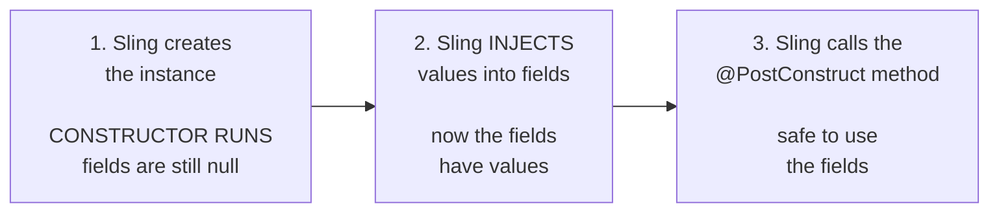
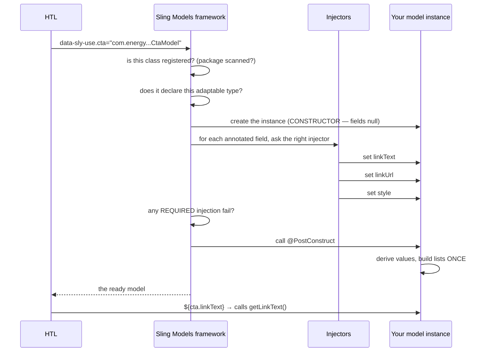
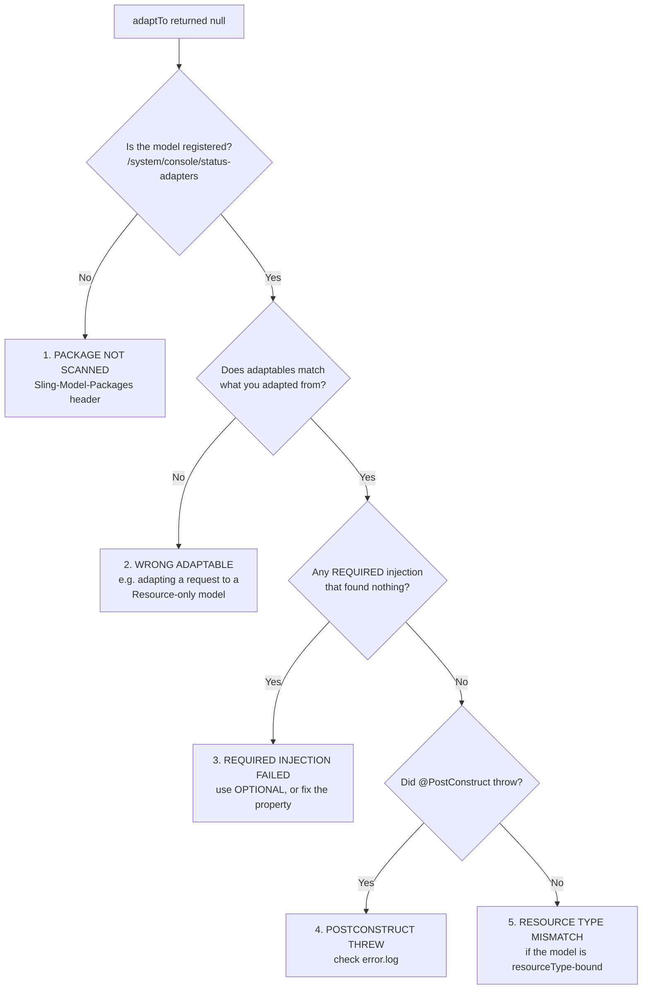

# 05 – Sling Models

> **Target:** 3–4 years experienced AEM Developer
> **Syllabus points covered (6, 8, 9, 10, 12):**
> *Point 6 — "What is a Sling Model? How do you convert a Java class into a model? What annotations are used in a model class? What is `adaptables`? When do you use `Resource.class` and `SlingHttpServletRequest.class` in adaptables?"*
> *Point 8 — "Why do we use `@PostConstruct`?"*
> *Point 9 — "`@ValueMapValue`, `@Inject` annotations."*
> *Point 10 — "Which annotation is used to call a service class in a model?"*
> *Point 12 — "Why do we use `@ChildResource`?"*
> **Project domain:** a global energy technology company's marketing site.

---

## Before we start — this is the file that matters most

Five of your syllabus points land in this one topic. That is not a coincidence. **Sling Models are where AEM development actually happens.**

Components are folders. Templates are configuration. Clientlibs are CSS. But the Sling Model is where you write Java, and it is where an interviewer finds out whether you can actually code or have only assembled things.

That also makes this the file to slow down on. Every other AEM topic can be learned by reading. This one needs the Java underneath to be solid — because the questions here are genuinely Java questions wearing AEM clothes:

- *"Why `@PostConstruct` instead of a constructor?"* → that is an object lifecycle question.
- *"Why `@ValueMapValue` instead of `@Inject`?"* → that is a dependency injection question.
- *"Why can't you use `@Reference` in a model?"* → that is a question about who creates the object.

So this file explains the Java reasoning first and the AEM syntax second. If a concept feels shaky, it is worth rereading rather than moving on — every later file assumes this one.

---

## 1. Introduction

### 1.1 The problem Sling Models solve

Let's start with what the code looked like before them, because the improvement is the point.

Say you want a component's title and description from the repository. Without Sling Models, that is:

```java
// The old way. Do not write this.
Node node = resource.adaptTo(Node.class);
String title = null;
String description = null;
try {
    if (node.hasProperty("jcr:title")) {
        title = node.getProperty("jcr:title").getString();
    }
    if (node.hasProperty("description")) {
        description = node.getProperty("description").getString();
    }
} catch (RepositoryException e) {
    // ... and now what?
}
```

Look at what is wrong there. Twelve lines to read two values. A checked exception you cannot meaningfully handle. Manual `hasProperty` checks. Property names as raw strings scattered through the method. And it is nearly impossible to unit test, because you need a JCR session.

Now the same thing with a Sling Model:

```java
@Model(adaptables = Resource.class)
public class TitleModel {

    @ValueMapValue
    private String title;

    @ValueMapValue
    private String description;

    public String getTitle() { return title; }
    public String getDescription() { return description; }
}
```

**The values arrive by themselves.** No lookups, no exceptions, no null-checking ceremony.

That is the whole idea, and it is the first thing to say in an interview:

> "A Sling Model is a plain Java class that Sling populates for you. You declare fields, annotate them to say where the values come from, and Sling fills them in when the model is created. It replaced a lot of boilerplate JCR API code that was verbose, exception-heavy and hard to test."

### 1.2 What "adapting" means — the concept underneath

Before the annotations, one concept has to be solid, because the whole mechanism sits on it.

**Sling has an idea called adaptation.** It means: *"I have an object of one type. Give me a different type built from it."*

The method is `adaptTo()`, and you have seen it already:

```java
resource.adaptTo(Node.class);        // Resource → JCR Node
resource.adaptTo(ValueMap.class);    // Resource → a map of its properties
resource.adaptTo(Page.class);        // Resource → an AEM Page
resource.adaptTo(CtaModel.class);    // Resource → YOUR model
```

That last line is the one that matters. **A Sling Model is just another thing a Resource can be adapted into.** You are extending Sling's adaptation system with your own types.

**A useful analogy.** Think of a Resource as a raw ingredient — say, a repository node. Adaptation is asking a kitchen to turn it into a specific dish. Sling ships with several recipes built in (Node, ValueMap, Page). A Sling Model is you handing the kitchen your own recipe.

**The one thing to remember about `adaptTo()`, forever:**

> **It can return `null`.**

If there is no recipe for the conversion, or the recipe fails, you get `null` — not an exception. This is the single largest source of NullPointerExceptions in AEM code, and it is why every `adaptTo` in this repository is null-checked.

### 1.3 What actually is an annotation?

If your Java is rusty, this is worth thirty seconds, because the whole file is annotations.

An annotation like `@ValueMapValue` is **not code that runs.** It is a label attached to a field. On its own it does nothing at all.

What makes it work is that **something else reads those labels**. In our case, the Sling Models framework inspects your class, sees the labels, and acts on them.

```java
@ValueMapValue          ← a label saying "fill this from the ValueMap"
private String title;   ← the field the label is attached to
```

So the flow is: you attach labels → Sling reads them → Sling does the work. You are not calling anything. You are **describing what you want**, and a framework is doing the fetching.

That mental model matters, because it explains several behaviours later — particularly why `@PostConstruct` exists at all.

### 1.4 A real project example to adapt

> "On our site every component has a Sling Model in the `core` bundle, and the HTL just calls it with `data-sly-use`. We adapt from `Resource` by default and only from the request when we genuinely need something request-scoped, like the current page or the resolved policy. Models expose an interface with the implementation in a non-exported `impl` package, following the Core Components pattern, and each one is unit tested with AEM Mocks — mostly against the cases authors actually create, like a half-filled component."

That covers the layering, the adaptables decision, the interface pattern and testing — four likely follow-ups, pre-empted.

---

## 2. Core Concepts

### 2.1 How to turn a Java class into a Sling Model *(syllabus point 6)*

Your syllabus asks this directly. There are four steps, and step 2 is the one people forget.

**Step 1 — Annotate the class with `@Model`.**

```java
@Model(adaptables = Resource.class)
public class CtaModel {
}
```

`adaptables` is mandatory. It says what this model can be built from.

**Step 2 — Make sure the package is scanned.**

This is the step that causes "my model returns null and I have no idea why."

Sling does not scan every class in every bundle — that would be slow. Your bundle has to declare which packages contain models. Classically that is a bundle header:

```
Sling-Model-Packages: com.energy.core.models
```

In newer AEM archetypes using the `bnd` plugin, this is generated automatically from the `@Model` annotation, so you often do not write it by hand. But **you must know it exists**, because when a model mysteriously will not adapt, this is a prime suspect.

**How to check:** open `/system/console/status-adapters`. If your model is registered, its adapter appears there. If it does not appear, the package is not being scanned — which is a much faster diagnosis than staring at the class.

**Step 3 — Declare fields with injector annotations.**

```java
@ValueMapValue
private String linkText;
```

**Step 4 — Add getters.**

```java
public String getLinkText() {
    return linkText;
}
```

Getters matter because **HTL can only call getters.** In HTL, `${cta.linkText}` calls `getLinkText()`. A public field will not work — HTL follows the JavaBeans convention.

**Then use it.** From HTL:

```html
<sly data-sly-use.cta="com.energy.core.models.CtaModel"/>
${cta.linkText}
```

Or from Java:

```java
CtaModel model = resource.adaptTo(CtaModel.class);
if (model != null) {          // ALWAYS null-check
    String text = model.getLinkText();
}
```

**The interview answer:**

> "Four steps. Annotate the class with `@Model` and declare what it adapts from. Make sure the package is registered for model scanning — classically the `Sling-Model-Packages` bundle header, though newer archetypes generate that from the annotation. Declare fields with injector-specific annotations like `@ValueMapValue`. And add getters, because HTL follows the JavaBeans convention and can only reach values through a getter.
>
> The step that trips people up is the package scanning, because when it's wrong the model just silently returns null. I check `/system/console/status-adapters` first — if the adapter isn't registered there, it's a scanning problem, not a code problem."

### 2.2 `adaptables` — what it means *(syllabus point 6)*

```java
@Model(adaptables = Resource.class)
```

**`adaptables` declares what types this model can be built from.**

Read it as: *"you can call `.adaptTo(CtaModel.class)` on a Resource, and you'll get one of these."*

You can list more than one:

```java
@Model(adaptables = {Resource.class, SlingHttpServletRequest.class})
```

Now both a Resource and a request can produce this model. Useful for a model that mostly needs content but occasionally needs request data.

**What happens if you get it wrong:** you call `adaptTo` on a request, but the model only declares `Resource.class`, and you get `null`. No exception, no message. Silent null. This is the second most common cause of "my model is null," after package scanning.

### 2.3 `Resource.class` versus `SlingHttpServletRequest.class` *(syllabus point 6 — asked explicitly)*

Your syllabus asks when to use each, which means an interviewer asked exactly that. Here is the reasoning rather than a rule to memorise.

**The difference in one line:**

> A **Resource** is a piece of content. A **request** is a visit to that content by a particular person, with particular parameters, on a particular page.

So the question becomes: **does your model need to know anything about the visit, or only about the content?**

**Use `Resource.class` when the model only needs content.** Titles, descriptions, links, child nodes — anything stored on the node.

**Use `SlingHttpServletRequest.class` when you need something that only exists during a request.** Specifically:

| You need | Only available from a request |
|---|---|
| `currentPage` — the page being rendered | Yes |
| `currentStyle` — the resolved policy (from file 03) | Yes |
| `pageManager` | Yes |
| `wcmmode` — is this edit mode? | Yes |
| Selectors, suffix, request parameters | Yes |
| Request attributes set by a filter | Yes |
| The request or response object itself | Yes |

**Why `Resource.class` should be your default** — three genuine reasons, and giving all three is what makes this answer strong:

**One — it is easier to unit test.** A test can create a Resource from a JSON fixture in one line. Mocking a full request is more setup.

**Two — it is reusable outside a request.** A scheduled job, a workflow step or a servlet iterating over search results has resources but no page-rendering request. A request-adaptable model simply cannot be used there.

**Three — it is honest about dependencies.** Declaring `Resource.class` says "this model depends only on content." That is a smaller, clearer contract.

**A detail that impresses:** when you adapt from a request, `@ValueMapValue` and `@ChildResource` still work — they resolve against the request's resource. So going request-adaptable does not cost you the content injections. You are adding capability, not swapping it.

**The interview answer:**

> "The question I ask is whether the model needs to know anything about the *visit*, or only about the *content*.
>
> If it only needs content — titles, links, child nodes — I adapt from `Resource`. That's my default for three reasons: it's easier to unit test, since a test can build a resource from a JSON fixture without mocking a request; it's reusable outside a request, so a scheduler or workflow step can use the same model; and it declares a smaller dependency, which is honest about what the model actually needs.
>
> I adapt from `SlingHttpServletRequest` when I need something that only exists during a request — `currentPage`, `currentStyle` for the resolved policy, `wcmmode` to check for edit mode, or selectors and request parameters. Anything injected with `@ScriptVariable` needs the request, because those come from the HTL bindings.
>
> Worth knowing: adapting from the request doesn't lose you the content injections. `@ValueMapValue` and `@ChildResource` still resolve against the request's resource. So it's additive."

**A concrete example from our project** makes it land:

```java
// Resource is enough -- this only reads content
@Model(adaptables = Resource.class)
public class CtaModel { ... }

// Request is required -- currentStyle is the resolved POLICY,
// which only exists in a rendering context
@Model(adaptables = SlingHttpServletRequest.class)
public class PageModel {
    @ScriptVariable
    private Style currentStyle;   // needs the request
}
```

### 2.4 The annotations — the full map *(syllabus point 6)*

Your syllabus asks "what annotations are used in a model class." Rather than a flat list, here they are grouped by **where the value comes from**, which is how you should think about them.

**Group 1 — reading content**

| Annotation | Gets you | Typical use |
|---|---|---|
| `@ValueMapValue` | A **property** on this node | Title, description, a link path |
| `@ChildResource` | A **child node**, or a list of them | Composite multifield rows, nested config |
| `@ResourcePath` | A Resource, from a path stored in a property | Follow a `fileReference` to the asset |

**Group 2 — reaching outside the content**

| Annotation | Gets you | Typical use |
|---|---|---|
| `@OSGiService` | An **OSGi service** | Call a shared service from the model |
| `@ScriptVariable` | An **HTL binding** | `currentPage`, `currentStyle`, `pageManager`, `wcmmode` |
| `@RequestAttribute` | A request attribute | A value set upstream by a filter |
| `@SlingObject` | A common Sling object | `resourceResolver`, `resource`, `request` |
| `@Self` | The adaptable itself | Adapt this model into another model |

**Group 3 — modifiers** (they change how another injection behaves)

| Annotation | Effect |
|---|---|
| `@Named("propertyName")` | The property name differs from the field name |
| `@Default(values = "...")` | Supply a fallback when nothing is found |
| `@Optional` / `@Required` | Override the injection strategy for one field |
| `@Via("resource")` | Change what the injection resolves against |
| `@Filter("(...)")` | Narrow an `@OSGiService` to a specific implementation |

**Group 4 — lifecycle**

| Annotation | Effect |
|---|---|
| `@PostConstruct` | Run a method **after** injection completes — section 2.7 |

**Group 5 — the generic one**

| Annotation | Effect |
|---|---|
| `@Inject` | Try **every** injector until one returns something — section 2.6 |

**If you learn five, learn these:** `@ValueMapValue`, `@ChildResource`, `@OSGiService`, `@ScriptVariable`, `@PostConstruct`. Those cover the overwhelming majority of real model code, and four of them are in your syllabus.

### 2.5 `@ValueMapValue` — reading a property *(syllabus point 9)*

**The workhorse.** It reads a property from the node's ValueMap.

```java
@ValueMapValue
private String linkText;      // reads the "linkText" property
```

**By default the field name is the property name.** If they differ, say so:

```java
@ValueMapValue
@Named("jcr:title")
private String title;         // field "title", property "jcr:title"
```

That `@Named` case comes up constantly, because JCR property names contain colons and a Java field cannot.

**Type conversion is automatic:**

```java
@ValueMapValue
private String title;         // String property

@ValueMapValue
private boolean newTab;       // Boolean property

@ValueMapValue
private Integer maxItems;     // Long in JCR → Integer in Java

@ValueMapValue
private String[] tags;        // multi-value property → array

@ValueMapValue
private Calendar publishDate; // Date property
```

**A subtlety worth knowing:** prefer `Integer` over `int` for numbers. A primitive `int` cannot be null, so a missing property becomes `0`, which is indistinguishable from an author genuinely entering zero. With `Integer` you get `null` and can tell the difference. Same reasoning for `Boolean` versus `boolean` when "not set" and "false" mean different things — which, as file 02 showed, is exactly the checkbox `uncheckedValue` situation.

**Defaults:**

```java
@ValueMapValue
@Default(values = "arrow")
private String style;
```

### 2.6 `@Inject` versus `@ValueMapValue` *(syllabus point 9)*

Your syllabus lists these together, which means the interviewer compared them. Here is the real answer.

**`@Inject` is the generic annotation.** It does not say where the value comes from. Sling tries **every registered injector in ranking order** until one returns something:

```
script bindings → value map → child resources → request attributes
→ OSGi services → resource path → self → sling object → ...
```

**`@ValueMapValue` is injector-specific.** It goes straight to the ValueMap. Nothing else is tried.

**Three reasons injector-specific wins:**

**One — it is unambiguous.** Reading `@ValueMapValue private String title;` tells you exactly where that value comes from. Reading `@Inject private String title;` tells you nothing — you have to know the injector ranking to guess.

**Two — it is faster.** `@Inject` may try several injectors before one succeeds. On a page with fifty component instances, that adds up.

**Three — and this is the real danger — `@Inject` can pick up the wrong thing.**

Script bindings are tried **before** the ValueMap. So if you write:

```java
@Inject
private String currentPage;    // you meant a property called "currentPage"
```

you get the HTL binding `currentPage` — an AEM `Page` object — not your property. And it fails in a confusing way, because the types do not match.

That class of bug is genuinely hard to find, and it disappears entirely if you are specific.

**The interview answer:**

> "`@Inject` is generic — it tries every registered injector in ranking order until one returns a value. `@ValueMapValue` is injector-specific and goes straight to the resource's ValueMap.
>
> I always use the injector-specific ones. Three reasons. It's self-documenting — you can see where a value comes from just by reading the field. It's faster, because `@Inject` may try several injectors first, which matters on a page with many component instances. And most importantly it avoids a real class of bug: script bindings are tried before the ValueMap, so an `@Inject` field named the same as an HTL binding silently picks up the binding instead of your property.
>
> `@Inject` isn't wrong exactly — it's older and it works — but on a project you're maintaining, being explicit is worth a lot."

**Being able to say `@Inject` is legacy but functional, rather than just "wrong," is the more senior answer.**

### 2.7 `@PostConstruct` — why it exists *(syllabus point 8)*

Your syllabus asks this directly. It is a Java lifecycle question, so let's build it properly.

**Start with the natural question.** In normal Java, you initialise an object in its constructor:

```java
public class Normal {
    private String greeting;

    public Normal(String name) {
        this.greeting = "Hello " + name;   // constructor does the setup
    }
}
```

So why can't a Sling Model do its setup in a constructor?

**Because of the order things happen in.**



**The constructor runs before injection.** So inside a constructor, every injected field is still `null`. Any setup that depends on injected values would fail there.

**`@PostConstruct` is the hook that runs after injection.** Think of it as *"the constructor that runs at the right time."*

```java
@Model(adaptables = Resource.class)
public class CtaModel {

    @ValueMapValue
    private String linkUrl;

    private boolean external;

    public CtaModel() {
        // linkUrl is NULL here. Injection hasn't happened yet.
    }

    @PostConstruct
    protected void init() {
        // linkUrl HAS its value now. Safe.
        this.external = linkUrl != null && linkUrl.startsWith("http");
    }
}
```

**Now — what do you actually use it for?** Three things, and the second is the one interviewers like.

**Use 1 — derive values from injected fields.** As above.

**Use 2 — do expensive work exactly once.**

This is the important one, and it comes straight from file 02.

**HTL can call a getter many times.** Inside a `data-sly-list` over fifty items, a getter called in the loop body runs fifty times. If that getter does a repository lookup or builds a list, you have just done it fifty times.

```java
// BAD -- runs on every single call
public List<CardModel> getCards() {
    return buildCardList();     // expensive
}

// GOOD -- runs exactly once
private List<CardModel> cards;

@PostConstruct
protected void init() {
    this.cards = buildCardList();
}

public List<CardModel> getCards() {
    return cards;               // just returns the field
}
```

**Use 3 — validate, and make the model refuse to exist.**

This one surprises people. **If `@PostConstruct` throws an exception, `adaptTo` returns `null`.**

So you can use it as a gate:

```java
@PostConstruct
protected void init() throws IllegalStateException {
    if (StringUtils.isBlank(rootPath)) {
        throw new IllegalStateException("rootPath is required");
    }
    // ...
}
```

Now a misconfigured component gives you `null` rather than a half-built model. Whether that is a good idea depends — usually returning a valid model with an `isReady()` flag is friendlier for HTL. But knowing the behaviour exists is worth a mark.

**The rules:**

- The method must return `void` and take **no arguments**.
- Make it `protected` or `private` — it is not part of your public API.
- Name it whatever you like; `init` is conventional.
- In an inheritance chain, the parent's `@PostConstruct` runs first.

**The interview answer:**

> "Because injection happens *after* the object is constructed. Sling creates the instance first — so inside the constructor every injected field is still null — then injects the values, and only then calls `@PostConstruct`. So it's effectively the constructor that runs at the right time, once the injected values are actually available.
>
> I use it for three things. Deriving values from injected fields, which can't be done in a constructor. Doing expensive work exactly once — that's the important one, because HTL can call a getter many times, and a getter inside a `data-sly-list` over fifty items runs fifty times. So I build lists and do lookups in `@PostConstruct` and store the result in a field.
>
> And third, validation — if `@PostConstruct` throws, `adaptTo` returns null, so you can make a misconfigured model refuse to exist. Though in practice I usually prefer returning a valid model with an `isReady()` flag, because it gives HTL something cleaner to test against.
>
> The method has to be void with no arguments, and I keep it protected since it isn't public API."

### 2.8 `@OSGiService` — calling a service from a model *(syllabus point 10)*

Your syllabus asks: *"which annotation is used to call a service class in a model?"*

**The answer is `@OSGiService`.**

```java
@Model(adaptables = Resource.class)
public class ProductModel {

    @OSGiService
    private ProductDataService productDataService;

    @PostConstruct
    protected void init() {
        this.specs = productDataService.getSpecifications(productId);
    }
}
```

**And now the follow-up that always comes:** *"why not `@Reference`?"*

This is a good question and the answer shows whether you understand OSGi.

> "`@Reference` is an OSGi Declarative Services annotation, and it only works inside an OSGi component — a class annotated with `@Component`. Those are created and managed by the DS runtime, which is what wires the references.
>
> A Sling Model isn't an OSGi component. It's created by the Sling Models framework, freshly, each time something adapts to it. The DS runtime never sees it, so it can't inject anything into it.
>
> So the rule is: **`@Reference` inside an `@Component`, `@OSGiService` inside a `@Model`.** Same idea — get me a service — but two different frameworks doing the injecting."

That distinction is exactly your syllabus points 10 and 11 side by side, and here they are as a table:

| | Inside a Sling Model | Inside an OSGi component |
|---|---|---|
| Annotation | `@OSGiService` | `@Reference` |
| Framework doing the injecting | Sling Models | OSGi Declarative Services |
| Applies to classes marked | `@Model` | `@Component` |
| Examples | Component models | Services, servlets, filters, schedulers |

**Picking a specific implementation.** If several implementations of an interface are registered, narrow it with a filter:

```java
@OSGiService(filter = "(component.name=com.energy.core.services.impl.CachedProductDataService)")
private ProductDataService productDataService;
```

**One important caution.** Injecting a service into a model is easy, which makes it easy to abuse. A model that calls an external API synchronously during rendering blocks the page. Keep the service call cheap, or move the fetch client-side — the caching argument from file 02 applies directly.

### 2.9 `@ChildResource` — reading child nodes *(syllabus point 12)*

Your syllabus asks why we use it. The answer is easiest as a contrast:

> **`@ValueMapValue` reads a property *on* this node. `@ChildResource` reads a *child node* of it.**

Recall the composite multifield from file 02:

```
faqs/
  ├── item0/
  │    ├── question = "What is a transformer in electricity?"
  │    └── answer   = "<p>It changes the voltage level...</p>"
  └── item1/
       ├── question = "What do electrical transformers do?"
       └── answer   = "<p>They transfer energy between circuits...</p>"
```

`question` and `answer` are not properties on the component node. They are properties on **child** nodes. `@ValueMapValue` cannot see them.

**Three ways to use `@ChildResource`:**

**As a raw Resource:**
```java
@ChildResource
private Resource image;      // the child node called "image"
```

**Adapted into another model — much more useful:**
```java
@ChildResource
private LinkModel link;      // child node "link", adapted to LinkModel
```

**As a list — this is the multifield case:**
```java
@ChildResource
private List<FaqItemModel> faqs;   // faqs/item0, faqs/item1, ... each adapted
```

That last form is why the annotation matters in practice. **A composite multifield produces child nodes, and `@ChildResource` with a `List` is how you read them.** Section 8 has the full working example.

**The interview answer:**

> "`@ValueMapValue` reads a property on the current node; `@ChildResource` reads a child node. The main reason I use it is composite multifields — those store each row as a child node like `faqs/item0` rather than as properties on the component, so `@ValueMapValue` can't see them at all. I inject `List<FaqItemModel>` with `@ChildResource` and Sling adapts each child node into that nested model class.
>
> It's also useful for any structured sub-node — a nested configuration block, or an image node with several properties that deserves its own small model rather than five loose fields on the parent."

### 2.10 `defaultInjectionStrategy` — OPTIONAL versus REQUIRED

A small setting with large consequences.

```java
@Model(
    adaptables = Resource.class,
    defaultInjectionStrategy = DefaultInjectionStrategy.OPTIONAL
)
```

**`REQUIRED` is the default if you say nothing.** It means: if **any** injection fails to find a value, the whole model fails and `adaptTo` returns `null`.

**`OPTIONAL` means:** a missing value is just `null`, and the model is still created.

**For components, `OPTIONAL` is almost always right**, because authors leave fields empty constantly. With `REQUIRED`, one blank optional field makes the entire component vanish.

**But state the trade-off, because interviewers ask:**

> "`OPTIONAL` hides mistakes. If I typo a property name, I get null instead of an error — the model builds fine and the value is silently missing. So `OPTIONAL` is right for component models, since authors leave fields blank all the time and I'd rather render partially than not at all, but it does mean a typo shows up as an empty page rather than a stack trace. That's why 'my model is returning null' is such a common debugging question — and also why `@Required` on genuinely mandatory fields is worth using."

**Per-field override:**

```java
@ValueMapValue(injectionStrategy = InjectionStrategy.REQUIRED)
private String rootPath;     // this one really is mandatory
```

### 2.11 Interfaces, `adapters` and `resourceType` — the professional pattern

Worth knowing, because it is how Core Components are built and it comes up in senior rounds.

Instead of one class, you write an **interface** (the public contract) and an **implementation** (internal):

```java
// Exported package -- this is the API
public interface Cta {
    String getLinkText();
    String getLinkUrl();
}
```

```java
// NON-exported .impl package
@Model(
    adaptables = Resource.class,
    adapters = Cta.class,                      // register AS the interface
    resourceType = "energy/components/cta",    // bind to a resource type
    defaultInjectionStrategy = DefaultInjectionStrategy.OPTIONAL
)
public class CtaImpl implements Cta {
    // ...
}
```

Now HTL uses the interface:

```html
<sly data-sly-use.cta="com.energy.core.models.Cta"/>
```

**Why bother?** Three reasons:

**One — you can change the implementation without touching HTL** or anything else that depends on the interface.

**Two — `resourceType` binding.** With it set, Sling can pick the right model based on the resource's type. That matters when several implementations share one interface, and it is **required** for the Sling Model Exporter (file 17).

**Three — module boundaries.** The interface lives in an exported package; the implementation lives in an `.impl` package that is not exported. That is proper OSGi hygiene, from file 01.

---

## 3. Internal Working

### 3.1 The full lifecycle of a model



**Four points to draw out of that:**

**Registration is checked first.** If the package is not scanned, nothing else happens — you get `null` immediately.

**The constructor runs before injection.** That is `@PostConstruct`'s entire reason for existing.

**A failed REQUIRED injection kills the whole model**, returning `null`.

**Getters are called last, and possibly many times.** That is why expensive work belongs in `@PostConstruct`.

### 3.2 Why a model returns `null` — the five causes

"My Sling Model is null" is one of the most common AEM debugging questions. There are exactly five reasons, and knowing them in order is the answer:



**Being able to list those five in order is a genuinely strong answer**, because it turns a vague symptom into a checklist.

### 3.3 Injector ranking — why `@Inject` is risky

Sling's injectors are tried in a defined order. Roughly:

```
1. script-bindings      ← currentPage, currentStyle, wcmmode, pageManager
2. value-map            ← node properties
3. child-resources      ← child nodes
4. request-attributes
5. osgi-services
6. resource-path
7. self
8. sling-object
```

**Notice that script bindings come first.** That is why `@Inject private String currentPage;` gets you the HTL binding rather than a property of that name — the bindings injector answers before the ValueMap ever gets asked.

Injector-specific annotations skip this entire list and go directly to one injector. That is the whole argument for using them.

### 3.4 `@Model(cache = true)`

By default, adapting the same resource twice creates **two separate instances**, and any `@PostConstruct` work runs twice.

```java
@Model(adaptables = Resource.class, cache = true)
```

With caching on, the instance is reused for the same adaptable within the same request.

**When it helps:** a model doing genuinely expensive work in `@PostConstruct` that gets adapted from more than one place during a render.

**When to leave it off:** simple models. The caching has its own small cost, and for a model that just reads three properties it is not worth it.

---

## 4. Important Interview Questions

### 4.1 Basic

**Q1. What is a Sling Model?**
A plain Java class annotated with `@Model` that Sling populates automatically from a Resource or a request, so you get typed access to content without JCR API boilerplate.

*Cross:* Is it an OSGi component? (**no**) · Who creates it? (the Sling Models framework) · What replaced what? (it replaced WCMUsePojo and JSP scriptlets)

**Q2. How do you turn a Java class into a Sling Model?**
→ Section 2.1. Four steps: `@Model` with adaptables, package registered for scanning, annotated fields, getters.

*Cross:* What's `Sling-Model-Packages`? · What happens if the package isn't scanned? (silent null) · Why do you need getters? (HTL follows JavaBeans)

**Q3. What is `adaptables`?**
It declares which types the model can be built from — `Resource.class`, `SlingHttpServletRequest.class`, or both.

*Cross:* What if you adapt from the wrong type? (null) · Can it be both? (yes) · Which is the default choice?

**Q4. When do you use `Resource.class` versus `SlingHttpServletRequest.class`?**
→ Section 2.3. Resource for content only; request when you need `currentPage`, `currentStyle`, `wcmmode`, selectors or parameters.

*Cross:* Why is Resource easier to test? · Can a scheduler use a request-adaptable model? (no) · Do `@ValueMapValue` injections still work from a request? (yes)

**Q5. What does `@ValueMapValue` do?**
Injects a property from the resource's ValueMap, converting the type automatically.

*Cross:* What if the property name differs from the field? (`@Named`) · How do you set a default? (`@Default`) · Why `Integer` rather than `int`?

**Q6. What does `@ChildResource` do?**
Injects a child node — as a Resource, adapted into another model, or as a `List` for a multifield.

*Cross:* How is that different from `@ValueMapValue`? · What produces child nodes? (composite multifields) · What are they named? (`item0`, `item1`, …)

**Q7. Why do we use `@PostConstruct`?**
→ Section 2.7. Because injection happens after construction, so the constructor sees null fields. It is the hook that runs once injection is complete.

*Cross:* What are the method rules? (void, no arguments) · What happens if it throws? (adaptTo returns null) · What do you actually use it for?

**Q8. Which annotation calls an OSGi service from a model?**
`@OSGiService`.

*Cross:* Why not `@Reference`? (a model isn't an OSGi component) · How do you pick between two implementations? (`filter`) · What's the risk of a service call in a model?

**Q9. What is `defaultInjectionStrategy`?**
`REQUIRED` (the default) means any failed injection returns null for the whole model. `OPTIONAL` means missing values are just null.

*Cross:* Which for a component and why? · What does OPTIONAL hide? · How do you override for one field?

**Q10. How do you use a model in HTL?**
`data-sly-use` with the fully-qualified class name, then call getters via `${model.property}`.

*Cross:* How does `${cta.linkText}` map to Java? (`getLinkText()`) · Can HTL read a public field? (no) · How do you use it from Java? (`adaptTo`, then null-check)

### 4.2 Intermediate

**Q11. Difference between `@Inject` and `@ValueMapValue`?**
→ Section 2.6. Generic versus specific; ambiguity, performance, and the script-bindings-shadowing bug.

*Cross:* What's the injector order? · Give an example where `@Inject` picks the wrong thing · Is `@Inject` wrong, or just old? (legacy but functional)

**Q12. My Sling Model returns null. Debug it.**
→ Section 3.2. Five causes in order: package not scanned, wrong adaptable, REQUIRED injection failed, `@PostConstruct` threw, resource type mismatch.

*Cross:* Which do you check first? (`status-adapters`) · How does OPTIONAL change the picture? · Where would you see a `@PostConstruct` exception? (`error.log`)

**Q13. Why is `@Reference` not usable in a Sling Model?**
Because `@Reference` is an OSGi DS annotation that only works in classes the DS runtime manages — `@Component` classes. A model is created by the Sling Models framework instead, so DS never sees it.

*Cross:* What's the equivalent then? (`@OSGiService`) · Which classes use `@Reference`? (services, servlets, filters, schedulers) · Who creates each?

**Q14. Why put work in `@PostConstruct` rather than a getter?**
Because HTL can call a getter many times — inside a `data-sly-list` it runs once per item. Expensive work in a getter multiplies.

*Cross:* Give a concrete example · What if the work is cheap? (a plain getter is fine) · What is `cache = true` for?

**Q15. What is `@ScriptVariable` and what does it require?**
It injects an HTL binding — `currentPage`, `currentStyle`, `pageManager`, `wcmmode`. It **requires a request-adaptable model**, because bindings only exist during rendering.

*Cross:* Name three bindings · Why can't a Resource-adaptable model use it? · How would you get the current page without a request? (from the resource path via `PageManager`)

**Q16. How do you read a composite multifield in a model?**
`@ChildResource` injecting a `List` of a nested model class. Each multifield row is a child node, and Sling adapts each one.

*Cross:* What if the list is empty? (null — return an empty list from the getter) · Where do you filter out incomplete rows? (`@PostConstruct`) · What about a simple multifield? (`@ValueMapValue` with `String[]`)

**Q17. Should a getter ever return null?**
No. Return an empty string for text and an empty list for collections. Otherwise HTL renders the literal text "null", or you need null guards everywhere in the markup.

*Cross:* What does HTL do with a null? · How do you handle an unconfigured component? (an `isReady()` flag plus `data-sly-test`) · What about a null collection in `data-sly-list`?

**Q18. What's the interface-and-implementation pattern for models?**
→ Section 2.11. Interface in an exported package, `@Model` implementation in a non-exported `.impl` package, registered via `adapters` and bound with `resourceType`.

*Cross:* Why bother? · What does `resourceType` enable? (model picking, and the Exporter) · Where do Core Components do this? (everywhere)

**Q19. How do you unit test a Sling Model?**
AEM Mocks with JUnit 5 — load content from a JSON fixture, register the model classes, adapt a resource, assert. Register mock OSGi services with `context.registerService`.

*Cross:* What is `AemContext`? · What do you actually test? (the empty and partial cases authors create) · How do you mock an injected service?

**Q20. What is `@Self` used for?**
It injects the adaptable itself, most often to adapt the current request or resource into **another** model — so one model can delegate to another rather than duplicating logic.

*Cross:* Give a use case (a page model delegating to a navigation model) · How is that different from `@SlingObject`? (`@SlingObject` gets you common Sling objects; `@Self` gets the adaptable itself)

### 4.3 Advanced

**Q21. Your model needs data from an external API. How do you structure it?**

> "The API call goes in an **OSGi service**, not in the model — so it's reusable, independently testable, and its endpoint and timeouts come from a run-mode OSGi config rather than being hardcoded. The model injects it with `@OSGiService` and calls it from `@PostConstruct`, so it happens once per model rather than once per getter call.
>
> Then the two production concerns. **Timeouts and a fallback** — connect and socket timeouts always set, and the model exposes a sensible state when the service can't answer, so the component degrades instead of breaking the page. And **caching**, because otherwise every uncached page request hits that API — either caching inside the service with a short TTL, or moving the fetch client-side entirely if the data is per-visitor, which keeps the page dispatcher-cacheable."

*Cross:* Why not put the call in the model? · What happens if the API hangs? · How does this affect dispatcher caching? → files 02 and 07.

**Q22. Two models on a page both need the same expensive lookup. How do you avoid doing it twice?**

Put the lookup in an OSGi service that caches, so both models share the result. Or use `@Model(cache = true)` if it is genuinely the same model adapted from the same resource. Or restructure so a parent model does the lookup once and passes it down, with children using `@Self` to reach it.

*Cross:* What's the scope of `cache = true`? · What are the risks of caching in a service? (staleness, memory) · How would you measure whether it matters?

**Q23. What is `@Via` and when do you need it?**

`@Via` changes what an injection resolves against. The common case is a request-adaptable model where you want an injection to go through the request's **resource** explicitly — `@Via("resource")`. It also supports other strategies, like `@Via(type = ResourceSuperType.class)` for inherited resources.

*Cross:* Do you need it with `@ValueMapValue`? (usually not — it already resolves against the resource) · When have you actually used it? · What's `ResourceSuperType` via for?

**Q24. How does a Sling Model become JSON for a headless consumer?**

The **Sling Model Exporter** — add `@Exporter(name = "jackson", extensions = "json")` and the model is available at `<path>.model.json`. It needs a `resourceType`-bound model, and you control the output with Jackson annotations like `@JsonProperty` and `@JsonIgnore`.

*Cross:* What's the URL pattern? · How does it relate to the SPA Editor? · Difference from Content Fragments and GraphQL? → file 17.

**Q25. What are the performance considerations for Sling Models?**

Expensive work in `@PostConstruct`, never in getters that HTL may call in a loop. Prefer `Resource` adaptables — cheaper and no request needed. Never make a blocking external call during rendering without a timeout. Put a hard ceiling on anything that builds a list, so a misconfigured path degrades rather than taking the instance down. And injector-specific annotations, since `@Inject` tries several injectors per field and that multiplies across component instances.

*Cross:* How would you profile a slow model? · What's a reasonable list ceiling? · Does `cache = true` always help? (no)

**Q26. Model versus WCMUsePojo versus a JSP scriptlet — what changed and why?**

Scriptlets put Java in the view, which is untestable and unmaintainable. WCMUsePojo moved it into a class but tied you to an AEM base class with an `activate()` method, so tests needed AEM types. Sling Models are plain classes with annotations — no base class, so unit testing is straightforward, and they work with the Model Exporter for headless.

*Cross:* Can you still use WCMUsePojo? (yes, legacy) · What's the testing difference exactly? · Why does the Exporter matter?

---

## 5. Cross Questions — how this topic gets drilled

**Thread A — from "what is a Sling Model" (your syllabus thread)**
How do you make a class into one? → What's `adaptables`? → When Resource, when request? → Why is Resource easier to test? → What annotations do you use? → What's `@ValueMapValue`? → How's that different from `@Inject`? → Why is `@Inject` risky? → What's the injector order?

**Thread B — from "@PostConstruct"**
Why not a constructor? → What order do things happen in? → What's null in the constructor? → What do you use it for? → Why not do the work in a getter? → How many times can HTL call a getter? → What happens if `@PostConstruct` throws?

**Thread C — from "calling a service"**
Which annotation? → Why not `@Reference`? → What's the difference between the two frameworks? → Who creates a Sling Model? → Who creates an OSGi component? → Which classes use which? → What if there are two implementations?

**Thread D — from "my model is null"**
What would you check first? → What's `status-adapters`? → What's `Sling-Model-Packages`? → What else could it be? → What does REQUIRED do? → Why is OPTIONAL usually right? → What does OPTIONAL hide?

---

## 6. Best Interview Answers

### 6.1 "What is a Sling Model?" — about 90 seconds

> "A Sling Model is a plain Java class annotated with `@Model` that Sling populates for you. You declare fields, annotate them to say where the values come from, and Sling fills them in when something adapts to the model.
>
> It replaced a lot of painful JCR API code. Reading two properties used to mean adapting to a Node, checking `hasProperty` on each one, catching a `RepositoryException` you couldn't do anything useful with, and ending up with something you couldn't unit test. With a model that's two annotated fields.
>
> Mechanically it plugs into Sling's adaptation system — the same `adaptTo` you already use for `resource.adaptTo(Node.class)` or `adaptTo(ValueMap.class)`. A Sling Model is just another type a Resource can be adapted into, so you're extending Sling with your own recipe.
>
> The important thing to remember is that `adaptTo` returns **null** on failure rather than throwing, so every adaptation needs a null check. That's the biggest source of NullPointerExceptions in AEM code.
>
> On our project every component has one, in the core bundle, and the HTL just calls it with `data-sly-use`. The HTL stays presentational and the logic sits somewhere unit-testable."

### 6.2 "When do you use Resource.class versus SlingHttpServletRequest.class?" — about 75 seconds

> "The question I ask is whether the model needs to know anything about the **visit**, or only about the **content**.
>
> A Resource is a piece of content. A request is a particular person visiting that content, with particular selectors and parameters, on a particular page.
>
> So if the model only reads content — titles, links, child nodes — I adapt from `Resource`, and that's my default for three reasons. It's easier to unit test, because a test can build a resource from a JSON fixture without mocking a whole request. It's reusable outside a request, so a scheduled job or workflow step can use the same model, which a request-adaptable one simply can't. And it declares a smaller dependency, which is honest about what the model actually needs.
>
> I adapt from the request when I need something that only exists during rendering — `currentPage`, `currentStyle` for the resolved policy, `wcmmode` to check for edit mode, or selectors, suffix and request parameters. Anything injected with `@ScriptVariable` needs the request, because those come from the HTL bindings.
>
> And it's additive rather than a trade — `@ValueMapValue` and `@ChildResource` still resolve against the request's resource, so you don't lose the content injections by adapting from the request."

### 6.3 "Why do we use @PostConstruct?" — about 75 seconds

> "Because injection happens **after** the object is constructed.
>
> The order is: Sling creates the instance, so the constructor runs while every injected field is still null. Then Sling injects the values. Then it calls `@PostConstruct`. So `@PostConstruct` is effectively the constructor that runs at the right time, once the injected values actually exist. Anything you tried to derive in a real constructor would be working with nulls.
>
> I use it for three things.
>
> Deriving values from injected fields — working out whether a link is external, normalising a value, that sort of thing.
>
> Doing expensive work exactly once, which is the one that matters in production. HTL can call a getter many times — a getter used inside a `data-sly-list` over fifty items runs fifty times. So I build lists and do lookups in `@PostConstruct` and store the result in a field, and the getter just returns it.
>
> And validation, because if `@PostConstruct` throws, `adaptTo` returns null — so you can make a misconfigured model refuse to exist. In practice I usually prefer returning a valid model with an `isReady()` flag instead, because it gives HTL something cleaner to guard on.
>
> The method has to be void with no arguments, and I keep it protected since it isn't part of the public API."

### 6.4 "How do you call a service from a model, and why not @Reference?" — about 60 seconds

> "`@OSGiService` — you annotate the field with the service interface type and Sling injects it from the OSGi service registry.
>
> `@Reference` doesn't work because it's an OSGi Declarative Services annotation, and DS only manages classes annotated with `@Component`. Those are created and wired by the DS runtime. A Sling Model isn't an OSGi component at all — it's created fresh by the Sling Models framework each time something adapts to it, so the DS runtime never sees it and can't inject anything.
>
> So the rule is `@Reference` inside an `@Component`, `@OSGiService` inside a `@Model`. Same intent, two different frameworks doing the injecting.
>
> If several implementations of the interface are registered, `@OSGiService` takes a `filter` so you can target a specific one.
>
> One caution I'd add: injecting a service into a model is easy, which makes it easy to overuse. A model that calls an external API synchronously during rendering blocks the page and makes it uncacheable. So I keep the call cheap, always set timeouts, and if the data is per-visitor I fetch it client-side instead."

---

## 7. Real Project Examples

### Story 1 — The getter that ran two hundred times

**What happened.** A product category listing page became noticeably slow after a release. Nothing obvious had changed in the query.

**The investigation.** `request.log` showed the page taking several seconds server-side. Adding a temporary log line inside the model's getter showed it being called over two hundred times for a single page render.

**The cause.** The model built its card list inside `getCards()`:

```java
public List<CardModel> getCards() {
    return buildCardList();      // walks the page tree every call
}
```

The HTL called `${listing.cards}` in `data-sly-list`, and also `${listing.cards.size}` for a count, and a `data-sly-test` guard. Each of those triggered a full rebuild — and the list itself had twenty items, with a nested loop inside.

**The fix.** Move the build into `@PostConstruct` and store the result:

```java
private List<CardModel> cards;

@PostConstruct
protected void init() {
    this.cards = buildCardList();     // once
}

public List<CardModel> getCards() {
    return cards;
}
```

**Result.** Server-side render time dropped from several seconds to well under a hundred milliseconds. One structural change, no algorithmic work.

**Why this story works in an interview:** it demonstrates the `@PostConstruct` rationale concretely rather than as theory, and it shows a measurement-first debugging approach.

### Story 2 — The `@Inject` that picked up the wrong thing

**What happened.** A component intermittently failed to render, with a type-related exception in the log that pointed at a line that looked completely fine.

**The cause.** The model had:

```java
@Inject
private String currentPage;      // meant a property called "currentPage"
```

The author-facing dialog did have a property called `currentPage`. But `@Inject` tries **script bindings first**, and `currentPage` is an HTL binding holding an AEM `Page` object. So Sling injected a `Page` where a `String` was expected.

It only failed on request-adaptable renders, which is why it looked intermittent.

**The fix.** Two lines:

```java
@ValueMapValue
@Named("currentPage")
private String currentPageProperty;
```

**What we changed afterwards.** A lint rule flagging `@Inject` in the codebase, and a migration of the remaining uses to injector-specific annotations. About forty fields, and it surfaced two other places where the injected value was not coming from where the developer assumed.

**Why this works:** it explains the injector-ranking argument with a real consequence rather than as a style preference.

### Story 3 — Splitting a model that had grown too big

**Requirement.** The product detail page model had accumulated around forty fields and a thousand lines — specifications, downloads, related products, contact details, breadcrumb data.

**The problems.** It was slow, because it built everything whether the page used it or not. It was untestable in any meaningful way. And it adapted from the request purely because two of its forty fields needed `currentPage`, which meant nothing else could reuse it.

**Approach.** Split by responsibility. A `SpecificationsModel`, a `DownloadsModel`, a `RelatedProductsModel` — each adapting from `Resource`, each with its own small `@PostConstruct`, each independently testable. The page-level model kept only what genuinely needed the request and used `@Self` to delegate where it made sense.

**The benefit that mattered most.** Because the sub-models adapt from `Resource`, we could reuse them from a servlet that produces JSON for the mobile app — which was impossible when everything needed a rendering request. That reuse was not the original goal, but it saved a substantial piece of work later.

**Result.** Each model under a hundred lines, real unit test coverage, and only the parts a given page actually renders get built.

---

## 8. Coding Examples

Building on the components from file 02, at the three levels.

### 8.1 Simple — the CTA model, annotated line by line

```java
package com.energy.core.models;

import org.apache.commons.lang3.StringUtils;
import org.apache.sling.api.resource.Resource;
import org.apache.sling.api.resource.ResourceResolver;
import org.apache.sling.models.annotations.DefaultInjectionStrategy;
import org.apache.sling.models.annotations.Model;
import org.apache.sling.models.annotations.injectorspecific.SlingObject;
import org.apache.sling.models.annotations.injectorspecific.ValueMapValue;

import javax.annotation.PostConstruct;

@Model(
        // Only needs CONTENT, so Resource is enough.
        // Easier to test, and reusable from a servlet or scheduler.
        adaptables = Resource.class,

        // Authors leave fields blank constantly. With REQUIRED (the
        // default), one empty optional field would make the whole
        // model null and the component would vanish.
        defaultInjectionStrategy = DefaultInjectionStrategy.OPTIONAL
)
public class CtaModel {

    // Injector-SPECIFIC. Goes straight to the ValueMap.
    // Field name = property name.
    @ValueMapValue
    private String linkText;

    @ValueMapValue
    private String linkUrl;

    @ValueMapValue
    private String style;

    // Boolean (not boolean): a missing property gives null, which we
    // can distinguish from an author explicitly setting false.
    // This is the uncheckedValue situation from file 02.
    @ValueMapValue
    private Boolean newTab;

    // @SlingObject gets us common Sling objects without a request
    @SlingObject
    private ResourceResolver resourceResolver;

    // Derived fields -- NOT injected, computed in @PostConstruct
    private String resolvedUrl;
    private boolean openInNewTab;

    /**
     * Runs AFTER injection. In the constructor every field above
     * would still be null, which is exactly why this hook exists.
     */
    @PostConstruct
    protected void init() {
        this.resolvedUrl  = resolveUrl(linkUrl);
        this.openInNewTab = Boolean.TRUE.equals(newTab) || isDocument(linkUrl);
    }

    private String resolveUrl(String url) {
        if (StringUtils.isBlank(url)) {
            return null;
        }
        if (url.startsWith("/content")) {
            String mapped = resourceResolver.map(url);
            return url.startsWith("/content/dam") ? mapped : mapped + ".html";
        }
        return url;
    }

    private boolean isDocument(String url) {
        return url != null && StringUtils.endsWithAny(
                url.toLowerCase(), ".pdf", ".docx", ".xlsx");
    }

    // GETTERS -- HTL can only reach values through these.
    // ${cta.linkText} calls getLinkText().

    public String getLinkText() {
        return StringUtils.defaultString(linkText);   // never null
    }

    public String getLinkUrl() {
        return resolvedUrl;
    }

    public String getStyle() {
        return StringUtils.defaultIfBlank(style, "arrow");
    }

    /** Returning null means HTL omits the attribute entirely. */
    public String getTarget() {
        return openInNewTab ? "_blank" : null;
    }

    public String getRel() {
        return openInNewTab ? "noopener noreferrer" : null;
    }

    public boolean isReady() {
        return StringUtils.isNotBlank(linkText) && StringUtils.isNotBlank(resolvedUrl);
    }
}
```

**The five decisions to be able to defend:**

`adaptables = Resource.class` — content only, so keep the dependency small.

`OPTIONAL` — because authors leave fields blank, and a vanished component is worse than a partial one.

`Boolean` not `boolean` — so "not set" and "false" stay distinguishable.

`@PostConstruct` for the derived values — impossible in a constructor, and it runs once.

**Getters never return null** for text, so HTL never renders the literal string "null". The exception is `getTarget()` and `getRel()`, where null is deliberate — HTL omits the whole attribute rather than writing `target=""`.

### 8.2 Medium — `@ChildResource` for a composite multifield

This is syllabus point 12 in practice, reading the FAQ accordion from file 02.

**The nested row model** — one per multifield row:

```java
package com.energy.core.models;

import org.apache.commons.lang3.StringUtils;
import org.apache.sling.api.resource.Resource;
import org.apache.sling.models.annotations.DefaultInjectionStrategy;
import org.apache.sling.models.annotations.Model;
import org.apache.sling.models.annotations.injectorspecific.SlingObject;
import org.apache.sling.models.annotations.injectorspecific.ValueMapValue;

@Model(
        adaptables = Resource.class,
        defaultInjectionStrategy = DefaultInjectionStrategy.OPTIONAL
)
public class FaqItemModel {

    // These read properties on the CHILD node (faqs/item0),
    // because that is the resource this model was adapted from.
    @ValueMapValue
    private String question;

    @ValueMapValue
    private String answer;

    // The child node's OWN resource -- used for a stable unique id
    @SlingObject
    private Resource resource;

    public String getQuestion() {
        return StringUtils.defaultString(question);
    }

    public String getAnswer() {
        return StringUtils.defaultString(answer);
    }

    /**
     * IDs derived from the resource PATH, not a counter.
     * A counter restarts at 0 for each accordion, so two accordions
     * on one page would both emit id="faq-0" -- duplicate IDs break
     * the aria-controls relationships and are invalid HTML.
     */
    public String getId() {
        return "faq-" + Math.abs(resource.getPath().hashCode());
    }

    public boolean isValid() {
        return StringUtils.isNotBlank(question) && StringUtils.isNotBlank(answer);
    }
}
```

**The parent model** — this is where `@ChildResource` does its work:

```java
package com.energy.core.models;

import org.apache.commons.lang3.StringUtils;
import org.apache.sling.api.resource.Resource;
import org.apache.sling.models.annotations.DefaultInjectionStrategy;
import org.apache.sling.models.annotations.Model;
import org.apache.sling.models.annotations.injectorspecific.ChildResource;
import org.apache.sling.models.annotations.injectorspecific.ValueMapValue;

import javax.annotation.PostConstruct;
import java.util.Collections;
import java.util.List;
import java.util.stream.Collectors;

@Model(
        adaptables = Resource.class,
        defaultInjectionStrategy = DefaultInjectionStrategy.OPTIONAL
)
public class FaqModel {

    // A PROPERTY on this node
    @ValueMapValue
    private String heading;

    /**
     * CHILD NODES of this node.
     *
     * A composite multifield stores each row as a child node:
     *     faqs/item0/question, faqs/item0/answer
     *     faqs/item1/question, faqs/item1/answer
     *
     * @ValueMapValue could never see these -- they are not properties
     * on this node. @ChildResource reads them, and Sling adapts each
     * child into FaqItemModel because that is the List's type.
     */
    @ChildResource
    private List<FaqItemModel> faqs;

    private List<FaqItemModel> validFaqs;

    @PostConstruct
    protected void init() {
        // Filter ONCE here, not in the getter -- HTL may call
        // getFaqs() several times per render.
        this.validFaqs = (faqs == null)
                ? Collections.emptyList()
                : faqs.stream()
                      .filter(FaqItemModel::isValid)
                      .collect(Collectors.toList());
    }

    public String getHeading() {
        return StringUtils.defaultString(heading);
    }

    /** Empty list, never null -- data-sly-list handles empty cleanly. */
    public List<FaqItemModel> getFaqs() {
        return validFaqs;
    }

    public boolean isReady() {
        return !validFaqs.isEmpty();
    }
}
```

**The three points to make about this pair:**

`@ChildResource` on a `List<FaqItemModel>` reads the child nodes **and adapts each one** into the nested model. Sling works out the target type from the generic parameter.

**The injected list can be null** if the author never added a row. That is why `@PostConstruct` normalises it and the getter returns an empty list.

**Filtering happens once** in `@PostConstruct`, not in the getter — the same lesson as story 1.

### 8.3 Complex — request-adaptable, with a service and a policy

Everything together: `@ScriptVariable` needing the request, `@OSGiService` for syllabus point 10, and a hard ceiling.

```java
package com.energy.core.models;

import com.day.cq.wcm.api.Page;
import com.day.cq.wcm.api.PageManager;
import com.day.cq.wcm.api.designer.Style;
import com.energy.core.services.ProductDataService;
import org.apache.commons.lang3.StringUtils;
import org.apache.sling.api.SlingHttpServletRequest;
import org.apache.sling.models.annotations.DefaultInjectionStrategy;
import org.apache.sling.models.annotations.Model;
import org.apache.sling.models.annotations.injectorspecific.OSGiService;
import org.apache.sling.models.annotations.injectorspecific.ScriptVariable;
import org.apache.sling.models.annotations.injectorspecific.ValueMapValue;
import org.slf4j.Logger;
import org.slf4j.LoggerFactory;

import javax.annotation.PostConstruct;
import java.util.ArrayList;
import java.util.Collections;
import java.util.Iterator;
import java.util.List;

@Model(
        // REQUEST-adaptable, because @ScriptVariable needs the HTL
        // bindings, which only exist during a render.
        adaptables = SlingHttpServletRequest.class,
        defaultInjectionStrategy = DefaultInjectionStrategy.OPTIONAL
)
public class CategoryListingModel {

    private static final Logger LOG =
            LoggerFactory.getLogger(CategoryListingModel.class);

    /** Hard ceiling. A misconfigured root should degrade, not kill the instance. */
    private static final int MAX_ITEMS = 200;

    // --- content: dialog properties ---
    @ValueMapValue
    private String rootPath;

    @ValueMapValue
    private Integer maxItems;

    // --- request-only: HTL bindings ---

    /** The page being rendered. Needs the request. */
    @ScriptVariable
    private Page currentPage;

    /** The RESOLVED POLICY for this component on this template -- file 03. */
    @ScriptVariable
    private Style currentStyle;

    @ScriptVariable
    private PageManager pageManager;

    // --- an OSGi service: SYLLABUS POINT 10 ---

    /**
     * @OSGiService, NOT @Reference.
     *
     * @Reference is an OSGi Declarative Services annotation and only
     * works in classes DS manages -- i.e. @Component classes. A Sling
     * Model is created by the Sling Models framework, so DS never
     * sees it and cannot inject into it.
     */
    @OSGiService
    private ProductDataService productDataService;

    private List<CardModel> cards;
    private String effectiveRootPath;

    @PostConstruct
    protected void init() {
        // Fall back to the current page if the author left it blank
        this.effectiveRootPath = StringUtils.isNotBlank(rootPath)
                ? rootPath
                : currentPage.getPath();

        this.cards = collectCards();
    }

    private List<CardModel> collectCards() {
        Page root = pageManager.getPage(effectiveRootPath);
        if (root == null) {
            LOG.warn("Listing root not found: {}", effectiveRootPath);
            return Collections.emptyList();
        }

        // A bounded traversal under a KNOWN root needs no Oak index
        // and has predictable cost. A repo-wide query would need one.
        int limit = resolveLimit();
        List<CardModel> result = new ArrayList<>();
        Iterator<Page> children = root.listChildren();

        while (children.hasNext() && result.size() < limit) {
            Page child = children.next();
            if (child.isHideInNav()) {
                continue;
            }
            // adaptTo can ALWAYS return null -- guard it
            CardModel card = child.getContentResource() != null
                    ? child.getContentResource().adaptTo(CardModel.class)
                    : null;
            if (card != null && card.isValid()) {
                result.add(card);
            }
        }
        return result;
    }

    private int resolveLimit() {
        // Author value, else the POLICY default, else our constant
        if (maxItems != null && maxItems > 0) {
            return Math.min(maxItems, MAX_ITEMS);
        }
        int fromPolicy = currentStyle != null
                ? currentStyle.get("defaultMaxItems", 12)
                : 12;
        return Math.min(fromPolicy, MAX_ITEMS);
    }

    public List<CardModel> getCards() {
        return cards;
    }

    public boolean isReady() {
        return !cards.isEmpty();
    }
}
```

**What to point at when walking an interviewer through this:**

**Why request-adaptable** — `@ScriptVariable` for `currentPage`, `currentStyle` and `pageManager`. Without those three, this model would adapt from `Resource` and be easier to test.

**`@OSGiService` not `@Reference`** — with the reason, not just the fact.

**A hard ceiling constant** — an author typing a bad root path should produce an empty list, not a repository walk that takes the instance down.

**Every `adaptTo` is null-checked**, including inside the loop.

**The limit falls back through three sources** — author, then policy, then constant. That policy fallback is file 03 meeting file 05.

### 8.4 The interface pattern — how Core Components do it

```java
// Exported package: the public contract
package com.energy.core.models;

public interface Cta {
    String getLinkText();
    String getLinkUrl();
    String getStyle();
    boolean isReady();
}
```

```java
// NON-exported .impl package: the implementation
package com.energy.core.models.impl;

import com.energy.core.models.Cta;
// ...

@Model(
        adaptables = Resource.class,
        adapters = Cta.class,                      // register AS the interface
        resourceType = CtaImpl.RESOURCE_TYPE,      // bind to a resource type
        defaultInjectionStrategy = DefaultInjectionStrategy.OPTIONAL
)
public class CtaImpl implements Cta {

    protected static final String RESOURCE_TYPE = "energy/components/cta";

    // ... same fields and logic as 8.1
}
```

HTL uses the **interface**:

```html
<sly data-sly-use.cta="com.energy.core.models.Cta"/>
```

**Three benefits, worth stating:** the implementation can change without touching HTL; the `resourceType` binding lets Sling pick the right implementation and is required by the Model Exporter; and the impl package stays unexported, which is proper OSGi module hygiene from file 01.

### 8.5 Unit test — testing what actually breaks

```java
package com.energy.core.models;

import com.energy.core.services.ProductDataService;
import io.wcm.testing.mock.aem.junit5.AemContext;
import io.wcm.testing.mock.aem.junit5.AemContextExtension;
import org.apache.sling.api.resource.Resource;
import org.junit.jupiter.api.BeforeEach;
import org.junit.jupiter.api.Test;
import org.junit.jupiter.api.extension.ExtendWith;
import org.mockito.Mockito;

import static org.junit.jupiter.api.Assertions.*;

@ExtendWith(AemContextExtension.class)
class FaqModelTest {

    private final AemContext context = new AemContext();

    @BeforeEach
    void setUp() {
        context.load().json("/faq/content.json", "/content");

        // Register BOTH the parent and the nested model, or
        // @ChildResource cannot adapt the child nodes.
        context.addModelsForClasses(FaqModel.class, FaqItemModel.class);

        // Mock any injected OSGi service
        context.registerService(ProductDataService.class,
                Mockito.mock(ProductDataService.class));
    }

    @Test
    void readsQuestionsFromChildNodes() {
        FaqModel model = adapt("/content/faq");
        assertEquals(2, model.getFaqs().size());
        assertEquals("What is a transformer in electricity?",
                model.getFaqs().get(0).getQuestion());
    }

    @Test
    void returnsEmptyListWhenAuthorAddedNoRows() {
        // The injected List is NULL here, not empty.
        // This is the case @PostConstruct normalises.
        FaqModel model = adapt("/content/faq-empty");
        assertNotNull(model);
        assertTrue(model.getFaqs().isEmpty(), "must be empty, never null");
        assertFalse(model.isReady());
    }

    @Test
    void skipsRowsWhereTheAnswerIsBlank() {
        // Authors WILL do this. Most common real-world case.
        FaqModel model = adapt("/content/faq-partial");
        assertEquals(1, model.getFaqs().size());
    }

    @Test
    void twoAccordionsOnOnePageProduceDifferentIds() {
        String first  = adapt("/content/page/faq-one").getFaqs().get(0).getId();
        String second = adapt("/content/page/faq-two").getFaqs().get(0).getId();
        assertNotEquals(first, second, "duplicate IDs break aria-controls");
    }

    private FaqModel adapt(String path) {
        Resource resource = context.resourceResolver().getResource(path);
        assertNotNull(resource, "test content missing at " + path);
        FaqModel model = resource.adaptTo(FaqModel.class);
        assertNotNull(model, "model failed to adapt at " + path);
        return model;
    }
}
```

**Two things to call out.** You must register **both** model classes, or `@ChildResource` cannot adapt the children — that is a real and confusing test failure. And the tests target the cases authors actually create: no rows, a half-filled row, two instances on a page. Testing that a getter returns its field proves nothing.

---

## 9. Common Mistakes

| The mistake | What actually happens | The fix |
|---|---|---|
| Package not registered for scanning | Model silently returns null | `Sling-Model-Packages`; check `status-adapters` |
| Wrong `adaptables` | Silent null when adapting from the other type | Declare what you actually adapt from |
| Leaving `defaultInjectionStrategy` as REQUIRED | One blank field makes the whole component vanish | `OPTIONAL` for component models |
| Using `@Inject` instead of injector-specific | Ambiguous, slower, can pick up a script binding | `@ValueMapValue`, `@ChildResource`, etc. |
| Doing work in a getter | HTL calls it repeatedly — sometimes hundreds of times | `@PostConstruct`, store in a field |
| Trying to initialise in the constructor | Fields are still null there | `@PostConstruct` |
| Returning null from a getter | HTL renders "null", or you need guards everywhere | Empty string / empty list |
| Not null-checking `adaptTo` | NullPointerException, the classic AEM one | Always guard, including inside loops |
| `@Reference` in a model | Does not compile meaningfully / never injects | `@OSGiService` |
| `int` instead of `Integer` | Missing property becomes 0, indistinguishable from a real 0 | Use the wrapper type |
| `boolean` where "not set" matters | Missing property becomes false | `Boolean` |
| `@ValueMapValue` for a child node | Nothing injected — it only reads properties | `@ChildResource` |
| Forgetting to register the nested model in tests | `@ChildResource` list is empty, confusing failure | `addModelsForClasses(Parent.class, Child.class)` |
| Request-adaptable when Resource would do | Harder to test, unusable outside a render | Default to `Resource.class` |
| Unbounded list building | A bad path walks the whole repository | A hard ceiling constant |
| Blocking external call in the model | Slow pages, threads hang without a timeout | OSGi service, timeouts, cache, or fetch client-side |
| Property name mismatch with no `@Named` | Silent null under OPTIONAL | `@Named("jcr:title")` |

---

## 10. Best Practices

**On adaptables.** Default to `Resource.class`. Move to the request only when you genuinely need `@ScriptVariable` or request data — and notice when that is only one or two fields, because it may mean the model should be split.

**On annotations.** Always injector-specific. `@Inject` is legacy: it works, but it is ambiguous and occasionally picks up the wrong source.

**On `@PostConstruct`.** Derive there, build lists there, do lookups there. Keep getters trivial. Assume every getter can be called many times.

**On null.** Never return null from a getter — empty string for text, empty list for collections. Always null-check `adaptTo`, including inside loops. Use wrapper types where "not set" and "zero/false" mean different things.

**On structure.** One model per component, and split when a model grows past roughly a couple of hundred lines or starts serving several unrelated concerns. Interface plus non-exported `.impl` for anything reused or exported.

**On safety.** A hard ceiling on anything that builds a collection. Timeouts on anything that leaves the JVM. Log at warn when a configured path does not resolve, so a misconfiguration is visible rather than silent.

**On testing.** Test the empty case, the partial case and the two-instances-on-a-page case. Register nested models. Mock injected services with `context.registerService`.

---

## 11. Debugging Tips

**The single most useful console:** `/system/console/status-adapters`. If your model's adapter is not listed there, the class is not registered at all — a scanning problem, not a code problem. Checking this first saves a lot of time staring at annotations.

**The five-cause checklist for a null model**, in order:

1. **Package not scanned** → `status-adapters`
2. **Wrong adaptable** → does `adaptables` match what you called `adaptTo` on?
3. **A REQUIRED injection failed** → switch to OPTIONAL temporarily to see if it appears
4. **`@PostConstruct` threw** → `error.log`
5. **Resource type mismatch** → only if the model is `resourceType`-bound

**A quick test from HTL.** Output the model object itself:

```html
${listing}
```

An object reference means the model resolved and the problem is in a getter. Nothing at all means the adaptation returned null.

**When a value is missing but the model resolves:** the property name and the field name probably do not match, and `OPTIONAL` is hiding it. Open the node in CRXDE and compare the actual property name against your field. This is the same "split the problem in half" move from file 02 — is the data absent, or is the reading wrong?

**When something is slow:** add a temporary log line at the top of the suspect getter and count how often it appears for one page render. If it is more than once, the work belongs in `@PostConstruct`.

**The Sling Log Tracer** at `/system/console/tracer` lets you trace what happened during a single request without redeploying — useful when the problem only reproduces on a specific page.

| Tool | What it tells you |
|---|---|
| `/system/console/status-adapters` | Whether the model is registered at all |
| `/system/console/tracer` | What happened during one request |
| `/system/console/bundles` | Whether the core bundle is even ACTIVE |
| `error.log` | `@PostConstruct` exceptions |
| `${model}` in HTL | Did the adaptation succeed |
| `/crx/de` | The real property names on the node |

---

## 12. Performance Optimization

**Expensive work goes in `@PostConstruct`.** This is the biggest single lever, and story 1 shows why — a getter used three times in HTL, over a twenty-item list, ran two hundred times.

**Prefer `Resource` adaptables.** Cheaper to create and testable without a request.

**Injector-specific annotations.** `@Inject` may try several injectors per field. On a page with fifty component instances that adds up.

**A hard ceiling on collections.** Not just for correctness — an unbounded `listChildren()` under a misconfigured root can genuinely take an instance down.

**Prefer a bounded traversal over a repository-wide query.** Walking children of a known path needs no Oak index and has predictable cost. If you must query, it must be indexed and limited.

**Never block on an external call during rendering** without a timeout, and think hard about whether that data should be fetched client-side instead so the page stays dispatcher-cacheable.

**`cache = true`** when the same model is adapted from several places in one render and does real work. Not worth it for a model reading three properties.

---

## 13. Real Production Scenarios

**1. Model returns null.** Work the five causes in order — scanning, adaptables, REQUIRED injection, `@PostConstruct` exception, resource type.

**2. Model resolves but one value is always empty.** Property name doesn't match the field, and OPTIONAL is hiding it. Compare against CRXDE.

**3. Page slow after a release.** A getter doing work, called repeatedly by HTL. Move to `@PostConstruct`.

**4. Component renders on author but is blank on publish.** OPTIONAL injection failing silently on publish because referenced content wasn't activated, or anonymous lacks read on a path the model touches.

**5. A type-related exception on a line that looks fine.** `@Inject` picking up a script binding instead of your property.

**6. `@ChildResource` list is empty even though content exists.** The nested model class isn't registered, or the child nodes aren't where you think — check CRXDE.

**7. NullPointerException in a listing.** An `adaptTo` inside a loop that wasn't null-checked.

**8. Model works locally, null on the server.** The bundle didn't deploy or isn't ACTIVE — `/system/console/bundles`.

**9. A checkbox toggle doesn't behave.** `boolean` instead of `Boolean`, so a missing property (from no `uncheckedValue`) is indistinguishable from false.

**10. A number field behaves oddly at zero.** `int` instead of `Integer` — a missing property became 0.

**11. Instance memory climbing.** A model holding a ResourceResolver it opened and never closed. Models shouldn't open their own resolvers; use `@SlingObject` for the request-scoped one.

**12. Publish CPU spikes on one page.** A model with a repository-wide unindexed query, or an unbounded traversal.

**13. All threads hung.** A model calling an external API with no socket timeout.

**14. Model can't be reused in a servlet.** It's request-adaptable for the sake of one or two fields. Split it.

**15. Test passes locally, fails in CI.** A model depending on an OSGi service that isn't registered in the test context.

**16. Two components on a page show identical IDs.** IDs generated from a counter rather than the resource path.

**17. Changing the implementation broke HTL.** HTL bound to the concrete class rather than an interface.

**18. Model Exporter returns nothing useful.** No `resourceType` on the `@Model`, or getters returning types Jackson can't serialise.

---

## 14. Follow-up Questions

- How many Sling Models does your project have?
- Do you use interfaces or concrete classes?
- What's your test coverage on models?
- Have you had the null-model problem? How did you diagnose it?
- Do you use `@Inject` anywhere?
- How do you handle a model that needs external data?
- How do you decide between Resource and request adaptables?
- What's the largest model in your codebase? *(a trap — a very large one signals poor separation)*
- **What would you refactor about your models if you had time?**

For the last: *"We have a few request-adaptable models that only need the request for one field. Splitting those would let us reuse them from the servlet that feeds the mobile app — which we ended up needing later anyway."*

---

## 15. Comparison Tables

**`Resource.class` vs `SlingHttpServletRequest.class`**

| | `Resource.class` | `SlingHttpServletRequest.class` |
|---|---|---|
| Gives access to | Content only | Content **plus** request context |
| `@ValueMapValue` | Yes | Yes (via the request's resource) |
| `@ChildResource` | Yes | Yes |
| `@ScriptVariable` | **No** | Yes |
| Selectors, suffix, parameters | No | Yes |
| Unit testing | Easier | More setup |
| Usable from a scheduler or servlet | **Yes** | No |
| Use as | The **default** | Only when you need request data |

**`@Inject` vs injector-specific**

| | `@Inject` | `@ValueMapValue` etc. |
|---|---|---|
| Source | Tries every injector in ranking order | One specific injector |
| Self-documenting | No | **Yes** |
| Performance | Slower | Faster |
| Risk | Can pick up a script binding | None |
| Status | Legacy but functional | **Preferred** |

**`@ValueMapValue` vs `@ChildResource`**

| | `@ValueMapValue` | `@ChildResource` |
|---|---|---|
| Reads | A **property** on this node | A **child node** |
| Types | String, Boolean, Integer, arrays, Calendar | Resource, a model, or a `List` of models |
| Use for | Dialog fields | Composite multifields, nested structures |

**`@OSGiService` vs `@Reference`** — syllabus points 10 and 11

| | `@OSGiService` | `@Reference` |
|---|---|---|
| Used inside | A Sling Model | An OSGi `@Component` |
| Injected by | Sling Models framework | OSGi Declarative Services |
| Works in a model | **Yes** | **No** |
| Works in a servlet or service | No | **Yes** |
| Filtering | `filter = "(...)"` | `target = "(...)"` |

**`REQUIRED` vs `OPTIONAL`**

| | REQUIRED (default) | OPTIONAL |
|---|---|---|
| Missing value | Whole model → **null** | That field → null |
| Good for | Genuinely mandatory config | **Component models** |
| Downside | One blank field kills the component | Hides typos |

**Sling Model vs WCMUsePojo vs scriptlet**

| | Scriptlet | WCMUsePojo | Sling Model |
|---|---|---|---|
| Where the logic lives | In the view | A class extending an AEM base class | A plain annotated class |
| Unit testable | No | Awkward | **Yes** |
| Base class required | — | Yes | **No** |
| Model Exporter / headless | No | No | **Yes** |
| Status | Dead | Legacy | **Current** |

---

## 16. Memory Tricks

**What `@PostConstruct` is:** *"The constructor that runs at the right time."* Construction first, injection second, `@PostConstruct` third.

**Resource vs request:** *"Content or visit?"* Only content → Resource. Anything about the visit → request.

**`@ValueMapValue` vs `@ChildResource`:** *"Properties versus children."*

**`@OSGiService` vs `@Reference`:** *"Model gets OSGiService, Component gets Reference."* Two frameworks, two annotations.

**Why not `@Inject`:** *"Generic guesses, specific knows."*

**Getters:** *"Getters are dumb, PostConstruct is smart."* All the thinking happens once, up front.

**Null:** *"adaptTo can always be null."* Every single time.

**Wrapper types:** *"Integer tells you nothing was set; int tells you zero."*

**The five null causes:** *"Scan, Adapt, Require, Throw, Type."*

---

## 17. Revision Notes

- A Sling Model is a plain Java class with `@Model` that Sling populates. It plugs into `adaptTo`, and **`adaptTo` returns null on failure, never an exception.**
- **Making one:** `@Model(adaptables = ...)` → package registered for scanning (`Sling-Model-Packages`) → annotated fields → **getters** (HTL follows JavaBeans).
- **`adaptables`** = what the model can be built from. `Resource.class` is the default; `SlingHttpServletRequest.class` only when you need `@ScriptVariable`, selectors, suffix or parameters.
- Resource is preferred because it's **easier to test**, **reusable outside a request**, and declares a **smaller dependency**. `@ValueMapValue` and `@ChildResource` still work from a request.
- **`@ValueMapValue`** = a property on this node. `@Named` when the names differ. Use `Integer`/`Boolean` not `int`/`boolean` when "not set" matters.
- **`@ChildResource`** = a child node — as a Resource, a model, or a **`List`** for a composite multifield (`item0`, `item1`, …).
- **`@Inject`** tries every injector in ranking order — **script bindings first**, which is how it silently picks up `currentPage` instead of your property. Always use injector-specific.
- **`@PostConstruct`** exists because **injection happens after construction**, so the constructor sees nulls. Use it to derive values, do expensive work **once** (HTL calls getters repeatedly), and validate — if it throws, `adaptTo` returns null. Void, no arguments, protected.
- **`@OSGiService`** calls a service from a model. **Not `@Reference`** — that's OSGi DS and only works in `@Component` classes, which a model is not.
- **`defaultInjectionStrategy`**: REQUIRED (default) → any failed injection nulls the whole model. **OPTIONAL** for component models — but it hides typos.
- **Never return null from a getter.** Empty string, empty list.
- **Five causes of a null model:** package not scanned · wrong adaptable · REQUIRED injection failed · `@PostConstruct` threw · resource type mismatch. Check `/system/console/status-adapters` first.
- Interface + non-exported `.impl`, with `adapters` and `resourceType` — the Core Components pattern, and `resourceType` is required for the Model Exporter.

---

## 18. Cheat Sheet

**The `@Model` annotation**
```java
@Model(
    adaptables = Resource.class,                    // or SlingHttpServletRequest.class, or both
    adapters = Cta.class,                           // register as an interface
    resourceType = "energy/components/cta",         // bind to a resource type
    defaultInjectionStrategy = DefaultInjectionStrategy.OPTIONAL,
    cache = true                                    // reuse the instance per adaptable
)
```

**Injector-specific annotations**
```java
@ValueMapValue          property on THIS node
@ChildResource          child node -- Resource, model, or List<Model>
@ResourcePath           resolve a path property into a Resource
@OSGiService            an OSGi service  (NOT @Reference)
@ScriptVariable         HTL binding -- REQUIRES request adaptable
@RequestAttribute       set upstream by a filter
@SlingObject            resourceResolver, resource, request, response
@Self                   the adaptable itself
```

**Modifiers**
```java
@Named("jcr:title")                     property name != field name
@Default(values = "arrow")              fallback value
@Optional / @Required                   per-field injection strategy
@Via("resource")                        change what it resolves against
@OSGiService(filter = "(...)")          pick one implementation
```

**Lifecycle**
```java
@PostConstruct
protected void init() { }     // void, NO arguments, after injection
```

**`@ScriptVariable` bindings (request-adaptable only)**
```java
currentPage      the page being rendered
currentStyle     the RESOLVED POLICY (file 03)
pageManager      look up pages by path
wcmmode          edit / preview / disabled
currentDesign    legacy design
resourceResolver
```

**Using a model**
```html
<sly data-sly-use.cta="com.energy.core.models.Cta"/>
${cta.linkText}          → calls getLinkText()
${cta.ready}             → calls isReady()
```
```java
CtaModel m = resource.adaptTo(CtaModel.class);
if (m != null) { ... }        // ALWAYS
```

**Bundle header**
```
Sling-Model-Packages: com.energy.core.models
```

**Debugging**
```
/system/console/status-adapters     is the model registered?
/system/console/tracer              trace one request
error.log                           @PostConstruct exceptions
${model} in HTL                     did adaptation succeed?
```

**Test setup**
```java
context.load().json("/faq/content.json", "/content");
context.addModelsForClasses(FaqModel.class, FaqItemModel.class);   // BOTH
context.registerService(MyService.class, Mockito.mock(MyService.class));
```

---

## 19. Frequently Forgotten Things

1. **`adaptTo` returns null, it doesn't throw.** The number one source of NPEs in AEM.
2. **The package must be registered for scanning**, or the model silently never resolves.
3. **The constructor runs before injection** — fields are null there. That is the entire reason for `@PostConstruct`.
4. **HTL can call a getter many times**, especially inside `data-sly-list`.
5. **`@Inject` tries script bindings first** — that's the `currentPage` shadowing bug.
6. **`@Reference` doesn't work in a model.** It's `@OSGiService`.
7. **`@ScriptVariable` needs a request-adaptable model.**
8. **`@ValueMapValue` still works from a request** — you don't lose it by going request-adaptable.
9. **The `@ChildResource` list can be null**, not empty, when the author added no rows.
10. **Register nested models in tests** or `@ChildResource` lists come back empty.
11. **REQUIRED is the default**, and one blank field nulls the entire model.
12. **OPTIONAL hides typos** — a misspelled property gives null, not an error.
13. **`int` and `boolean` can't represent "not set".** Use `Integer` and `Boolean` when that matters.
14. **`@PostConstruct` throwing makes `adaptTo` return null** — usable as validation.
15. **`resourceType` on `@Model` is required for the Sling Model Exporter.**
16. **Getters must follow JavaBeans naming** — `getX()` for `${model.x}`, `isX()` for a boolean.

---

## 20. Final Interview Summary

**1. What it is.** A plain Java class with `@Model` that Sling populates, plugged into the `adaptTo` system. Replaced verbose, untestable JCR API code.

**2. Making one.** `@Model` with adaptables → package scanned → annotated fields → getters.

**3. `adaptables`.** What it can be built from. Resource by default; request only for `@ScriptVariable`, selectors or parameters. Resource is easier to test and reusable outside a render.

**4. The annotations.** `@ValueMapValue` for properties, `@ChildResource` for child nodes, `@OSGiService` for services, `@ScriptVariable` for bindings, `@PostConstruct` for lifecycle.

**5. `@Inject` vs specific.** Generic tries every injector in ranking order, script bindings first — ambiguous, slower, and occasionally wrong. Always be specific.

**6. `@PostConstruct`.** Injection happens after construction, so the constructor sees nulls. Derive there, do expensive work once there, validate there.

**7. Services.** `@OSGiService` in a model; `@Reference` only in an `@Component`, because a model isn't one.

**8. `@ChildResource`.** Properties versus children — this is how composite multifields are read.

**9. Null discipline.** `adaptTo` can be null; getters never should be. Empty string, empty list.

**10. The five null causes.** Scanning, adaptables, REQUIRED injection, `@PostConstruct` exception, resource type. Check `status-adapters` first.

---

## 21. Mock Interview

**How to use this:** cover the answers, 25-minute timer, speak every answer out loud.

### The interviewer asks:

1. What is a Sling Model, and what problem does it solve?
2. **How do you convert a plain Java class into a Sling Model?**
3. **What is `adaptables`?**
4. **When do you use `Resource.class` versus `SlingHttpServletRequest.class`?**
5. Why is `Resource.class` usually preferred?
6. **What annotations do you use in a model class?**
7. **What is `@ValueMapValue`?**
8. **What's the difference between `@Inject` and `@ValueMapValue`?**
9. Give me a concrete example of `@Inject` going wrong.
10. **Why do we use `@PostConstruct`? Why not a constructor?**
11. What are the rules for a `@PostConstruct` method?
12. What happens if `@PostConstruct` throws an exception?
13. **Which annotation calls an OSGi service from a model?**
14. **Why can't you use `@Reference` in a Sling Model?**
15. **Why do we use `@ChildResource`?**
16. How do you read a composite multifield in a model?
17. What's `defaultInjectionStrategy`, and which do you use?
18. My model returns null. Debug it.
19. Should a getter ever return null?
20. How do you unit test a Sling Model, and what do you actually test?

### Model answers

**1.** A plain Java class annotated with `@Model` that Sling populates automatically. It solves the boilerplate problem — reading two properties with the JCR API meant adapting to a Node, checking `hasProperty` on each, catching a `RepositoryException` you couldn't act on, and ending up with untestable code. A model is two annotated fields. Mechanically it plugs into Sling's adaptation system, so a model is just another type a Resource can be adapted into.

**2.** Four steps. Annotate the class with `@Model` and declare `adaptables`. Make sure the package is registered for model scanning — classically the `Sling-Model-Packages` bundle header, though newer archetypes generate it from the annotation. Declare fields with injector-specific annotations. And add getters, because HTL follows the JavaBeans convention — `${cta.linkText}` calls `getLinkText()`, and a public field won't work. The step people miss is the scanning, because when it's wrong the model just silently returns null.

**3.** It declares which types the model can be built from — so `adaptables = Resource.class` means you can call `resource.adaptTo(MyModel.class)`. You can list more than one. Getting it wrong is a silent null: adapt from a request to a Resource-only model and you get null with no error.

**4.** The question I ask is whether the model needs to know about the **visit** or only the **content**. Content only — titles, links, child nodes — means `Resource`. I need the request when I need something that only exists during rendering: `currentPage`, `currentStyle` for the resolved policy, `wcmmode`, or selectors and request parameters. Anything with `@ScriptVariable` needs the request, because those come from the HTL bindings.

**5.** Three reasons. It's easier to unit test — a test builds a resource from a JSON fixture rather than mocking a whole request. It's reusable outside a rendering request, so a scheduler, workflow step or servlet can use the same model, which a request-adaptable one can't. And it declares a smaller dependency, which is honest about what the model needs. Worth adding: going request-adaptable is additive, not a trade — `@ValueMapValue` and `@ChildResource` still resolve against the request's resource.

**6.** I group them by where the value comes from. Content: `@ValueMapValue` for a property, `@ChildResource` for child nodes, `@ResourcePath` to resolve a path property into a Resource. Outside the content: `@OSGiService` for services, `@ScriptVariable` for HTL bindings, `@SlingObject` for things like the resource resolver, `@Self` for the adaptable itself. Modifiers: `@Named` when the property name differs from the field, `@Default` for a fallback, `@Optional` or `@Required` per field. And `@PostConstruct` for lifecycle.

**7.** It injects a property from the resource's ValueMap, with automatic type conversion — String, Boolean, Integer, arrays, Calendar. By default the field name is the property name; `@Named` handles the mismatch, which comes up constantly because JCR names contain colons and Java fields can't.

**8.** `@Inject` is generic — it tries every registered injector in ranking order until one returns a value. `@ValueMapValue` goes straight to the ValueMap. I always use the specific ones for three reasons: it's self-documenting, since you can see where a value comes from by reading the field; it's faster, because `@Inject` may try several injectors first, which multiplies across component instances; and it avoids a real bug class, because script bindings are tried before the ValueMap.

**9.** We had `@Inject private String currentPage;` where the developer meant a dialog property of that name. But `currentPage` is an HTL binding holding a `Page` object, and bindings are tried first — so Sling injected a `Page` where a `String` was expected. It only failed on request-adaptable renders, so it looked intermittent, and the exception pointed at a line that looked completely fine. We migrated the whole codebase to injector-specific annotations after that, and it surfaced two other places where the value wasn't coming from where the developer assumed.

**10.** Because injection happens after construction. Sling creates the instance first — so in the constructor every injected field is still null — then injects, then calls `@PostConstruct`. So it's effectively the constructor that runs at the right time. I use it for deriving values from injected fields, for doing expensive work exactly once, and for validation. The middle one matters most in production: HTL can call a getter many times, and a getter inside a `data-sly-list` over fifty items runs fifty times.

**11.** Void return, no arguments. I make it protected or private since it isn't public API. Name is conventionally `init`. In an inheritance chain the parent's runs first.

**12.** `adaptTo` returns null — so a misconfigured model can be made to refuse to exist. That's occasionally useful as a validation gate, though in practice I usually prefer returning a valid model with an `isReady()` flag, because it gives HTL something cleaner to guard on and doesn't turn a content mistake into a null.

**13.** `@OSGiService`, with the service interface as the field type. If several implementations are registered, it takes a `filter` to target one.

**14.** Because `@Reference` is an OSGi Declarative Services annotation, and DS only manages classes annotated with `@Component` — it creates and wires those. A Sling Model isn't an OSGi component; it's created fresh by the Sling Models framework each time something adapts to it, so DS never sees it and can't inject into it. The rule is `@Reference` inside an `@Component`, `@OSGiService` inside a `@Model` — same intent, two different frameworks doing the injecting.

**15.** `@ValueMapValue` reads a property on the current node; `@ChildResource` reads a child node. The main reason is composite multifields — those store each row as a child node like `faqs/item0`, so `@ValueMapValue` can't see them at all. It's also good for any structured sub-node that deserves its own small model rather than five loose fields on the parent.

**16.** `@ChildResource` on a `List` of a nested model type — Sling reads the child nodes and adapts each one into that model, working the target type out from the generic parameter. Two things to watch: the injected list is **null**, not empty, if the author added no rows, so I normalise it in `@PostConstruct` and return an empty list from the getter. And in tests you have to register both the parent and the nested model class, or the list comes back empty.

**17.** It controls what happens when an injection finds nothing. REQUIRED — the default — means any failed injection makes the whole model null. OPTIONAL means that field is just null and the model still builds. For component models I always use OPTIONAL, because authors leave fields blank constantly and I'd rather render partially than have the component vanish. The trade-off is that OPTIONAL hides typos — a misspelled property name gives null rather than an error, which is why "my model returns null" is such a common debugging question.

**18.** Five causes, in order. Package not registered for scanning — I check `/system/console/status-adapters` first, because if the adapter isn't listed there it's a registration problem, not a code problem. Wrong adaptables. A REQUIRED injection that found nothing. `@PostConstruct` throwing, which I'd see in `error.log`. And a resource type mismatch, if the model is `resourceType`-bound. A quick way to narrow it: output `${model}` in HTL — an object reference means it adapted and the problem is in a getter; nothing means adaptation returned null.

**19.** No. Empty string for text, empty list for collections. If a getter returns null, HTL renders the literal text "null", or you need null guards scattered through the markup. For an unconfigured component I expose an `isReady()` flag and guard the outer element with `data-sly-test`, which is cleaner than checking five fields individually. The one exception is where null is deliberate — returning null for `target` means HTL omits the attribute entirely rather than writing `target=""`.

**20.** AEM Mocks with JUnit 5 — load test content from a JSON fixture, register the model classes with `addModelsForClasses`, adapt a resource, assert. Injected OSGi services get registered as mocks with `context.registerService`. But the important part is *what* I test: not that a getter returns its field, which proves nothing, but the cases authors actually create — a component with no multifield rows, a half-filled row, two instances on one page. Those are the paths that break in production.

---

## Next topic

**`06-OSGi-and-Services`** — your syllabus points 7, 11 and 13: every OSGi annotation and what it does, `@Reference` for calling a service from a servlet or another service, the difference between a service and a component, and how you actually turn a class into a service.

---

*Topic 05 of the AEM Interview Preparation repository. Teaching style, energy-sector project domain.*
