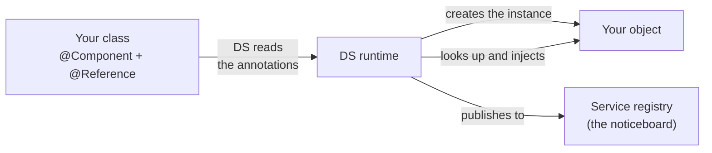
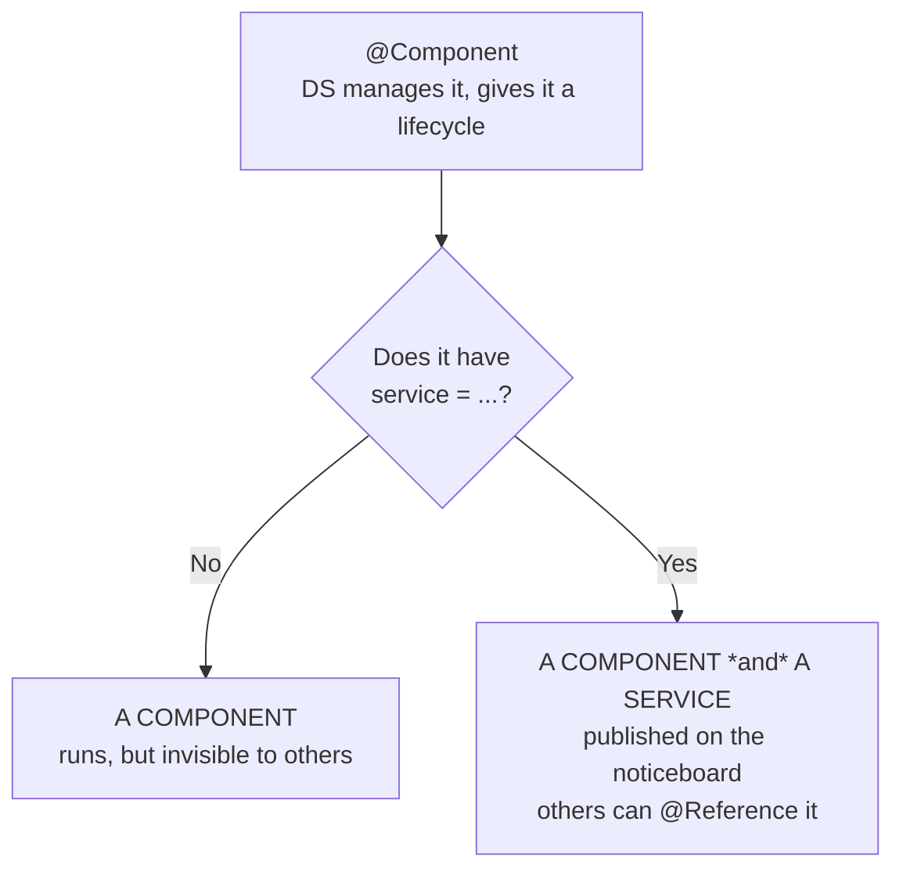
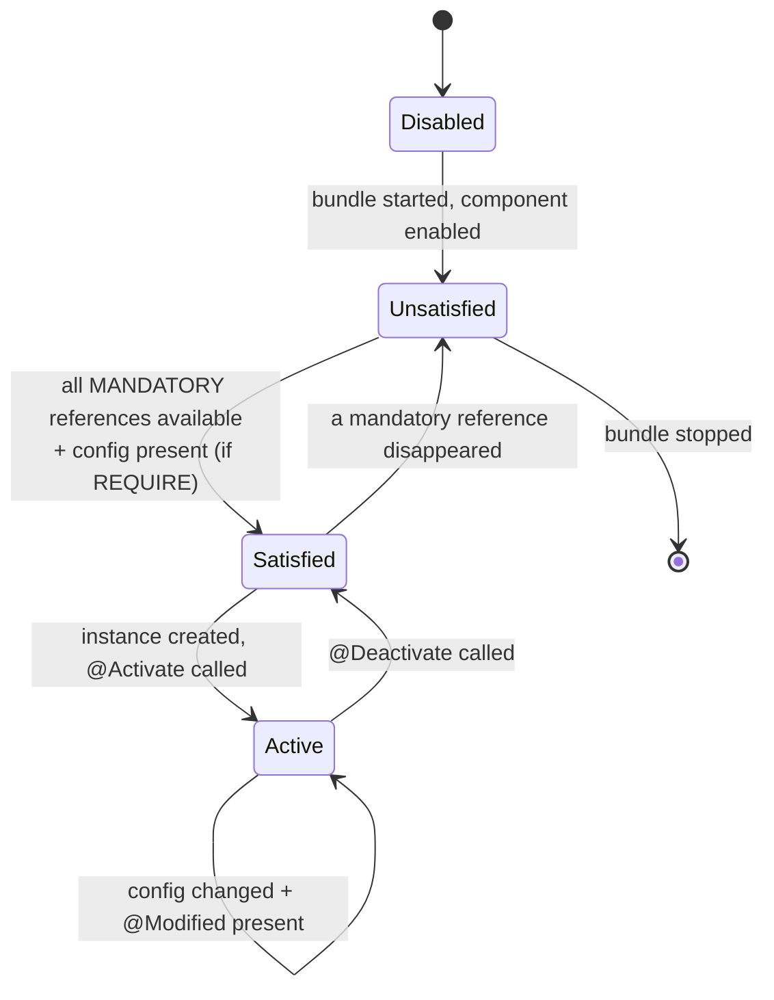
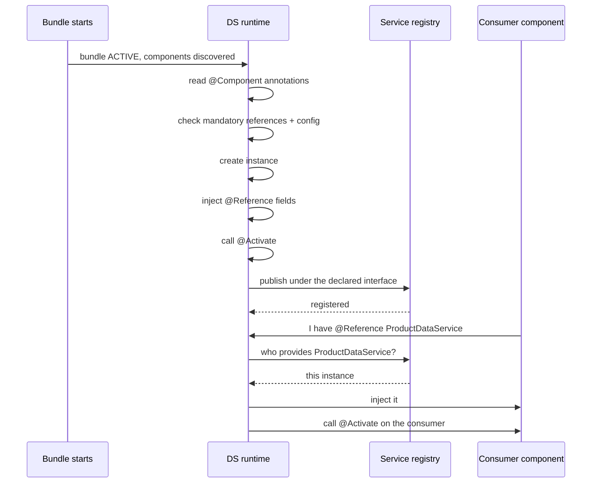
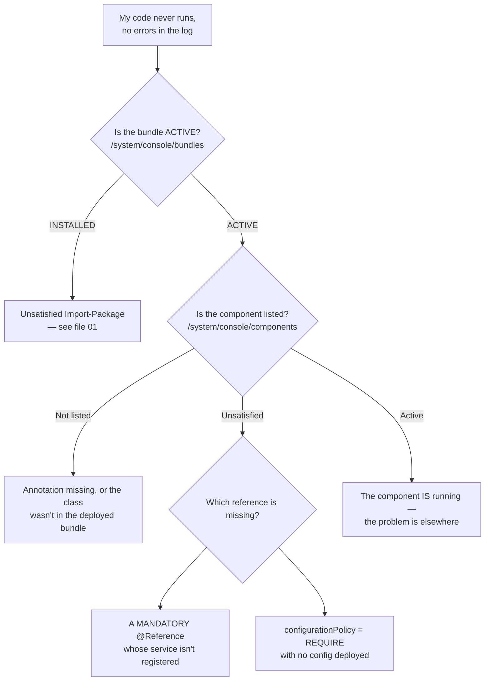

# 06 – OSGi, Components and Services

> **Target:** 3–4 years experienced AEM Developer
> **Syllabus points covered (7, 11, 13):**
> *Point 7 — "Memorise the use of all the OSGi annotations."*
> *Point 11 — "Which annotation do you use when calling a service class from a servlet or another service?"*
> *Point 13 — "What is the difference between a service and a component? How do you make a class a service?"*
> **Project domain:** a global energy technology company's marketing site.

---

## Before we start — don't memorise the list

Your syllabus says *"memorise all the OSGi annotations."* That is what the candidate wrote down, and it is understandable — but it is the wrong way to prepare, and it will show in an interview.

There are roughly fifteen annotations that matter. Memorised as a flat list, they blur together and you will fumble under pressure. But they fall into **five groups by purpose**, and each group answers one question:

| Group | The question it answers |
|---|---|
| 1. Declaring | *How do I tell OSGi this class exists?* |
| 2. Lifecycle | *How do I run code when it starts and stops?* |
| 3. Injection | *How do I get hold of another service?* |
| 4. Configuration | *How do I make settings change per environment?* |
| 5. Registration | *How do I register a servlet or a filter?* |

Learn the groups, and you can **derive** the annotation you need rather than recalling it. That is also how you sound in an interview — someone who understands the model, not someone reciting.

There is also a natural continuity from file 05. That file ended on: *"`@Reference` doesn't work in a Sling Model because a model isn't an OSGi component."* This file is the other half of that sentence — what an OSGi component actually is, and why `@Reference` works there.

---

## 1. Introduction

### 1.1 A quick recap of why OSGi exists

From file 01, but worth restating because everything here builds on it.

**The problem with plain Java.** Build a normal Java web application and you get one big classpath. Every JAR can see every other JAR. There is no way to say "this package is internal, don't use it." And changing one class means redeploying and restarting everything.

**OSGi's answer is the bundle** — a JAR with extra manifest information declaring two things:

- **`Export-Package`** — "other bundles may use these packages of mine"
- **`Import-Package`** — "I need these packages from someone else"

Because those dependencies are explicit, OSGi knows exactly what depends on what. Which means it can stop one bundle, replace it, and restart it without touching anything else.

**The apartment building analogy** from file 01: each flat is a bundle, with its own front door and plumbing. You can renovate flat 3B without evacuating the building, because the building knows what 3B connects to.

### 1.2 The bit that file 01 left out — how bundles talk to each other

Here is the interesting problem. Bundles are deliberately isolated. So how does code in bundle A actually *use* something from bundle B?

Not by `new`-ing it. Bundle A does not have bundle B's implementation class on its classpath — and even if it did, hardcoding `new ProductDataServiceImpl()` would defeat the whole point of modularity.

**OSGi's answer is the service registry.**

Think of it as a noticeboard in the middle of the building:

- Bundle B **publishes** a notice: *"I provide `ProductDataService`. Here's my instance."*
- Bundle A **looks at the board**: *"Does anyone provide `ProductDataService`?"*
- OSGi hands A the instance B published.

Bundle A never knows which class implements it. It only knows the interface. Swap the implementation tomorrow and A does not change or even notice.

**That noticeboard is the single most important concept in this file.** Every question about services, `@Reference`, and "why is my component unsatisfied" comes back to it.

### 1.3 Declarative Services — who does the work

Publishing to and reading from that registry by hand is verbose. So OSGi has a layer called **Declarative Services**, usually shortened to **DS**.

DS is what makes annotations work. You *declare* what you provide and what you need, and the **DS runtime** does the actual registering and wiring.



**Remember this, because it is the answer to a syllabus question:** the DS runtime only manages classes annotated with `@Component`. That is precisely why `@Reference` cannot work in a Sling Model — DS never sees it.

### 1.4 A real project example to adapt

> "On our project the core bundle has around fifteen OSGi services — things like a product data service that talks to the internal product API, a document link resolver for our technical downloads, and a few Sling servlets and filters. Each one is an interface in an exported package with the implementation in a non-exported `impl` package. Configuration is done with `@ObjectClassDefinition` and shipped as run-mode-specific JSON files in `ui.config`, so the API endpoint and timeouts differ between dev, stage and production without any code change."

That covers the interface pattern, configuration, and run modes — three likely follow-ups.

---

## 2. Core Concepts

### 2.1 Component versus Service *(syllabus point 13)*

Your syllabus asks this directly, and it is one of the most common OSGi interview questions. Let's get it exactly right.

**A component** is a class that the DS runtime manages. You mark it with `@Component`. DS creates it, calls its lifecycle methods, injects its references, and destroys it. Nothing more.

**A service** is a component that has additionally been **published to the registry under one or more interfaces**, so other code can find and use it.

```java
// A COMPONENT. DS manages it, but nobody can look it up.
@Component
public class SomeStartupTask {
    @Activate
    protected void activate() {
        // runs at startup, does its work, registers nothing
    }
}
```

```java
// A COMPONENT *AND* A SERVICE. Published under ProductDataService.
@Component(service = ProductDataService.class)
public class ProductDataServiceImpl implements ProductDataService {
    // now other bundles can @Reference ProductDataService
}
```

**The whole difference is the `service` attribute.**



**The relationship, in the sentence interviewers want:**

> **Every service is a component. Not every component is a service.**

**The interview answer:**

> "A component is a class the Declarative Services runtime manages — DS creates it, injects its references, and calls its `@Activate` and `@Deactivate` methods. If you've used Spring, it's close to a Spring bean.
>
> A service is a component that's additionally been published to the OSGi service registry under an interface, so other code can look it up and use it. You do that with the `service` attribute on `@Component`.
>
> So every service is a component, but not every component is a service. A component with no `service` attribute still has a full lifecycle and still runs — it just isn't discoverable. We use that for things that do work on activation and don't need to be called by anyone else.
>
> The practical significance is the boundary: consumers depend on the *interface* that's published, never on the implementation class. That's what lets us swap an implementation without touching anything that uses it."

### 2.2 How to make a class a service *(syllabus point 13)*

Your syllabus asks this explicitly. Four steps, and step 1 is the one that separates good code from bad.

**Step 1 — Define an interface.** This is the contract.

```java
// Exported package -- this is public API for other bundles
package com.energy.core.services;

import java.util.List;

public interface ProductDataService {

    /**
     * Returns the technical specifications for a product,
     * or an empty list if the product is unknown or the
     * upstream service is unavailable.
     */
    List<Specification> getSpecifications(String productId);

    boolean isAvailable();
}
```

**Step 2 — Write the implementation in a non-exported `impl` package.**

```java
package com.energy.core.services.impl;   // NOT exported

import com.energy.core.services.ProductDataService;
import org.osgi.service.component.annotations.Component;

@Component(service = ProductDataService.class)
public class ProductDataServiceImpl implements ProductDataService {
    // ...
}
```

**Step 3 — `service = ProductDataService.class`** is what publishes it. Note it is registered under the **interface**, not under `ProductDataServiceImpl`.

**Step 4 — Consumers reference the interface:**

```java
@Reference
private ProductDataService productDataService;
```

**Now the question that always follows: why bother with an interface?**

Four reasons, and giving several is what makes the answer senior:

**One — swappable implementations.** We started with a service that called the API directly. Later we added a caching implementation. Because consumers depended on the interface, nothing else changed.

**Two — module boundaries.** The interface package is exported; the `impl` package is not. Other bundles physically cannot import the implementation class even if they wanted to. That is the OSGi hygiene point from file 01, enforced rather than merely intended.

**Three — testability.** Consumers can be unit tested with a mock of the interface.

**Four — a documented contract.** The interface is where you say what happens when the product is unknown or the upstream is down. That is the kind of thing that gets lost in an implementation.

**The interview answer:**

> "Four steps. Define an interface in an exported package — that's the contract. Write the implementation in a non-exported `impl` package. Annotate the implementation with `@Component(service = MyService.class)`, which is what actually publishes it to the registry under that interface. Then consumers inject it with `@Reference` on the interface type.
>
> The interface isn't ceremony. It means we can swap implementations without touching consumers — we did exactly that when we added caching to our product data service. It gives us a real module boundary, since the impl package isn't exported so other bundles physically can't import it. It makes consumers unit testable with a mock. And it's where the contract gets documented — what happens when the upstream is unavailable, for instance."

### 2.3 The annotations, by purpose *(syllabus point 7)*

Now the list your syllabus asks for — organised so you can derive rather than recall.

#### Group 1 — Declaring

| Annotation | Purpose |
|---|---|
| `@Component` | Tell DS this class exists and should be managed |
| `@Component(service = X.class)` | …and publish it as a service under `X` |

Everything in OSGi starts here. There is exactly one declaring annotation, with an attribute that decides component-versus-service.

#### Group 2 — Lifecycle

| Annotation | When it runs |
|---|---|
| `@Activate` | When the component starts — dependencies satisfied, config applied |
| `@Modified` | When the configuration changes, **without** a restart |
| `@Deactivate` | When the component stops |

#### Group 3 — Injection

| Annotation | Purpose |
|---|---|
| `@Reference` | Inject another service from the registry |

One annotation, but several attributes that change its behaviour substantially — section 2.5.

#### Group 4 — Configuration

| Annotation | Purpose |
|---|---|
| `@ObjectClassDefinition` | Define the shape of the configuration |
| `@AttributeDefinition` | Define one configuration field |
| `@Designate` | Connect that definition to a component |

#### Group 5 — Sling/AEM registration

| Annotation | Purpose |
|---|---|
| `@SlingServletResourceTypes` | Register a servlet **by resource type** |
| `@SlingServletPaths` | Register a servlet **by path** |
| `@SlingServletFilter` | Register a request filter |

These are Sling conveniences. Under the hood they are just `@Component` with the right service interface and properties — but they are far more readable, and they are the current way. Servlets get their own file (07).

#### Supporting types you should recognise

| Type | Where it's used |
|---|---|
| `ConfigurationPolicy` | `@Component(configurationPolicy = ...)` — OPTIONAL / REQUIRE / IGNORE |
| `ReferenceCardinality` | `@Reference(cardinality = ...)` — MANDATORY / OPTIONAL / MULTIPLE / AT_LEAST_ONE |
| `ReferencePolicy` | `@Reference(policy = ...)` — STATIC / DYNAMIC |
| `ReferencePolicyOption` | `@Reference(policyOption = ...)` — RELUCTANT / GREEDY |
| `ServiceScope` | `@Component(scope = ...)` — SINGLETON / BUNDLE / PROTOTYPE |

**How to answer "list all the OSGi annotations" in an interview:**

> "I'd group them by what they're for rather than list them flat.
>
> **Declaring:** `@Component`, with its `service` attribute deciding whether it's just a component or also a published service.
>
> **Lifecycle:** `@Activate`, `@Deactivate`, and `@Modified` — the last one meaning a configuration change doesn't force a full restart of the component.
>
> **Injection:** `@Reference`, with `cardinality`, `policy` and `target` controlling whether it's mandatory, whether it can be swapped at runtime, and which implementation to pick.
>
> **Configuration:** `@ObjectClassDefinition` and `@AttributeDefinition` to define the settings, and `@Designate` to attach them to a component.
>
> **Sling registration:** `@SlingServletResourceTypes`, `@SlingServletPaths` and `@SlingServletFilter`, which are readable wrappers over `@Component` for servlets and filters.
>
> And I'd add that the older Felix SCR annotations — `@Service` and `@Property` as separate annotations — are deprecated. In current code `@Service` is replaced by the `service` attribute and `@Property` by `@ObjectClassDefinition`."

**That last paragraph is worth including.** It shows you can read an older codebase and know what to modernise.

### 2.4 `@Component` — the attributes that matter

```java
@Component(
    service = ProductDataService.class,
    immediate = true,
    configurationPolicy = ConfigurationPolicy.REQUIRE,
    property = { "service.ranking:Integer=100" },
    scope = ServiceScope.SINGLETON
)
```

**`service`** — which interface(s) to publish under. Omit it and you have a component that is not a service. You can list several: `service = {ProductDataService.class, Runnable.class}`.

**`immediate`** — this one has non-obvious default behaviour, so it comes up.

By default, a component that *provides a service* is **delayed** — DS does not create the instance until somebody actually asks for the service. That is a sensible optimisation.

But sometimes you need the component to start doing something whether or not anyone consumes it — a listener, a warm-up task, something that registers with an external system. `immediate = true` forces activation as soon as its dependencies are satisfied.

**`configurationPolicy`** — three values:

| Value | Behaviour |
|---|---|
| `OPTIONAL` (default) | Activates with or without configuration |
| `REQUIRE` | **Only** activates if a configuration exists |
| `IGNORE` | Ignores configuration entirely |

`REQUIRE` is genuinely useful. If a service is meaningless without an API endpoint, `REQUIRE` means it stays inactive rather than activating in a broken state. It is also how factory configurations work — one component instance per configuration.

**But it is also a classic support ticket:** "my component never activates" when the answer is `configurationPolicy = REQUIRE` and the config file was never deployed.

**`property`** — service properties, used for filtering and ranking. The `:Integer` syntax types the value:

```java
property = { "service.ranking:Integer=100" }
```

**`scope`** — how many instances exist:

| Value | Behaviour |
|---|---|
| `SINGLETON` (default) | One instance shared by everyone |
| `BUNDLE` | One instance per consuming bundle |
| `PROTOTYPE` | A new instance per consumer |

**SINGLETON has a consequence people miss, and it is a strong point to raise unprompted:** one instance is shared across **every request and every thread**. So any mutable instance field is shared state. Section 2.8.

### 2.5 `@Reference` — calling a service *(syllabus point 11)*

Your syllabus asks: *"which annotation do you use when calling a service class from a servlet or another service?"*

**The answer is `@Reference`.**

```java
@Component(service = Servlet.class)
public class ProductServlet extends SlingSafeMethodsServlet {

    @Reference
    private ProductDataService productDataService;
}
```

That is field injection, and it is what you will write almost every time.

**And immediately, the comparison your syllabus is really driving at** — points 10 and 11 side by side:

| | In a **Sling Model** | In an **OSGi component** |
|---|---|---|
| Annotation | `@OSGiService` | **`@Reference`** |
| Injected by | Sling Models framework | OSGi Declarative Services |
| Class is marked | `@Model` | `@Component` |
| Examples | Component models | Services, servlets, filters, schedulers, listeners |

**Why they are different**, in one sentence: *"DS only manages `@Component` classes, and a Sling Model isn't one — it's created by the Sling Models framework, so DS never sees it and can't inject into it."*

Now the `@Reference` attributes that change behaviour.

**`cardinality` — how many, and is it mandatory?**

```java
// MANDATORY (1..1) -- the default.
// The component will NOT activate without it.
@Reference
private ProductDataService productDataService;

// OPTIONAL (0..1) -- activates even if absent. Must be volatile.
@Reference(cardinality = ReferenceCardinality.OPTIONAL,
           policy = ReferencePolicy.DYNAMIC)
private volatile AnalyticsService analyticsService;

// MULTIPLE (0..n) -- a list, possibly empty
@Reference(cardinality = ReferenceCardinality.MULTIPLE,
           policy = ReferencePolicy.DYNAMIC)
private volatile List<ContentEnricher> enrichers;
```

| Cardinality | Meaning |
|---|---|
| `MANDATORY` (default) | Exactly one. No service → component never activates. |
| `OPTIONAL` | Zero or one. Activates regardless. |
| `MULTIPLE` | Zero or more, injected as a `List`. |
| `AT_LEAST_ONE` | One or more. |

**`MANDATORY` being the default is the single most important thing here**, because it is the direct cause of the most common OSGi production problem: a component sitting **unsatisfied** and never activating because one service it needs is not there. Section 3.3.

**`policy` — can the reference change while running?**

| Policy | Behaviour |
|---|---|
| `STATIC` (default) | If the service goes away or is replaced, the component is deactivated and reactivated |
| `DYNAMIC` | The reference is swapped in place; the component keeps running |

`DYNAMIC` requires the field to be `volatile`, because another thread will write it while your threads read it.

**`policyOption` — should it switch to a better service?**

| Option | Behaviour |
|---|---|
| `RELUCTANT` (default) | Once bound, stay bound even if a higher-ranked service appears |
| `GREEDY` | Rebind to a higher-ranked service when one shows up |

**`target` — which implementation, when there are several?**

```java
@Reference(target = "(component.name=com.energy.core.services.impl.CachedProductDataService)")
private ProductDataService productDataService;
```

That is an LDAP filter over the service's properties.

**The interview answer for point 11:**

> "`@Reference`. In a servlet or another service, I annotate a field with the service **interface** type and DS injects it.
>
> The attribute I actually think about is `cardinality`. It defaults to `MANDATORY`, which means the component won't activate at all if that service isn't available — and that's the most common OSGi problem in production. A component sits 'unsatisfied' in the components console and you get no error at runtime, just a servlet that never responds. So for genuinely optional dependencies I set `OPTIONAL` with a `DYNAMIC` policy and a volatile field, so the component still activates and degrades gracefully.
>
> The distinction I'd make explicit: `@Reference` only works inside an OSGi component, because DS is what does the injecting. In a Sling Model you use `@OSGiService` instead, since a model isn't managed by DS."

### 2.6 Lifecycle — `@Activate`, `@Deactivate`, `@Modified`

```java
@Component(service = ProductDataService.class)
@Designate(ocd = ProductDataServiceConfig.class)
public class ProductDataServiceImpl implements ProductDataService {

    private String apiEndpoint;
    private CloseableHttpClient httpClient;

    @Activate
    @Modified
    protected void activate(ProductDataServiceConfig config) {
        this.apiEndpoint = config.apiEndpoint();
        this.httpClient  = buildClient(config);
    }

    @Deactivate
    protected void deactivate() {
        // Release anything you hold. Not doing this is a leak.
        IOUtils.closeQuietly(httpClient);
    }
}
```

**`@Activate`** runs when the component starts — all mandatory references satisfied, configuration applied. It is the right place to read configuration and set up resources.

**`@Deactivate`** runs when it stops — a bundle stop, a redeploy, or a configuration change under STATIC policy. **This is where you release things**: close HTTP clients, shut down thread pools, unregister listeners. Skipping it is a genuine leak, and it bites on every redeploy since components stop and start constantly during development.

**`@Modified`** is the interesting one, and a good interview point.

Without `@Modified`, changing a configuration causes DS to **deactivate and reactivate** the component — a full teardown and rebuild.

With `@Modified`, DS just calls that method with the new configuration. The component keeps running and keeps its state.

**Why it matters:** if your `@Activate` builds an HTTP connection pool or opens a connection, a config change without `@Modified` tears all of that down and rebuilds it. Notice above that `@Activate` and `@Modified` point at the **same method** — that is the common pattern, because usually you want identical behaviour either way.

**`@Activate` signatures.** DS accepts several, and picks based on the parameter type:

```java
@Activate protected void activate() { }
@Activate protected void activate(MyConfig config) { }              // typed config -- preferred
@Activate protected void activate(Map<String, Object> props) { }    // raw properties
@Activate protected void activate(ComponentContext ctx) { }         // full context
@Activate protected void activate(BundleContext ctx) { }
```

The typed-config form is the modern, readable one.

### 2.7 Configuration — `@ObjectClassDefinition` and `@Designate`

This is how a service gets settings that differ per environment.

**Step 1 — Define the configuration shape.**

Note it is an **`@interface`** — a Java annotation type, not a class or an interface. That surprises people the first time.

```java
package com.energy.core.services.impl;

import org.osgi.service.metatype.annotations.AttributeDefinition;
import org.osgi.service.metatype.annotations.AttributeType;
import org.osgi.service.metatype.annotations.ObjectClassDefinition;

@ObjectClassDefinition(
        name = "Energy — Product Data Service",
        description = "Connection settings for the internal product API"
)
public @interface ProductDataServiceConfig {

    @AttributeDefinition(
            name = "API Endpoint",
            description = "Base URL of the product API",
            type = AttributeType.STRING
    )
    String apiEndpoint() default "https://api.internal/v1";

    @AttributeDefinition(
            name = "Connect Timeout (ms)",
            description = "Give up if the connection is not established in this time"
    )
    int connectTimeout() default 3000;

    @AttributeDefinition(
            name = "Socket Timeout (ms)",
            description = "Give up if no data arrives in this time"
    )
    int socketTimeout() default 5000;

    @AttributeDefinition(name = "Cache TTL (seconds)")
    int cacheTtl() default 300;

    @AttributeDefinition(
            name = "Enabled",
            description = "Turn the integration off without redeploying"
    )
    boolean enabled() default true;
}
```

**Each method becomes a configuration property.** The method name is the property name; `default` supplies the fallback.

**Step 2 — Attach it with `@Designate`.**

```java
@Component(service = ProductDataService.class)
@Designate(ocd = ProductDataServiceConfig.class)
public class ProductDataServiceImpl implements ProductDataService {

    @Activate
    @Modified
    protected void activate(ProductDataServiceConfig config) {
        // typed access -- no string keys, no casting
        this.apiEndpoint = config.apiEndpoint();
        this.timeout     = config.connectTimeout();
    }
}
```

**Step 3 — Ship configuration values as JSON, per run mode.**

`ui.config/.../apps/energy/osgiconfig/config.publish.prod/com.energy.core.services.impl.ProductDataServiceImpl.cfg.json`

```json
{
  "apiEndpoint": "https://api.internal.company.com/v2",
  "connectTimeout": 3000,
  "socketTimeout": 5000,
  "cacheTtl": 600,
  "enabled": true
}
```

**Two naming rules that cause real problems when broken:**

**The filename must be the component's PID**, which by default is the fully-qualified class name. A typo means the config file exists, deploys successfully, and is silently never applied. There is no error.

**The folder name selects the run mode** — `config.publish.prod` from file 01. That is how the endpoint differs between environments with one codebase.

**Factory configurations** — when you need several instances of the same component with different settings:

```java
@Designate(ocd = MyConfig.class, factory = true)
```

Then the filenames carry an instance suffix after a tilde:

```
com.energy.core.services.impl.MyServiceImpl~products.cfg.json
com.energy.core.services.impl.MyServiceImpl~downloads.cfg.json
```

Each file produces its own component instance with its own configuration.

### 2.8 Thread safety — the point most candidates miss

This is worth knowing because raising it unprompted marks you out.

**A `SINGLETON` service — the default — is one instance shared across every request and every thread.**

On a publish instance under load, that means dozens of threads inside your service simultaneously. So:

```java
@Component(service = ProductDataService.class)
public class BadServiceImpl implements ProductDataService {

    // SHARED MUTABLE STATE. Every request thread writes this.
    private String lastProductId;          // BUG

    @Override
    public List<Specification> getSpecifications(String productId) {
        this.lastProductId = productId;    // race condition
        return fetch(this.lastProductId);  // may be another thread's value
    }
}
```

Two requests arrive at once, both write `lastProductId`, and one of them reads the other's value. It works perfectly in testing and fails intermittently under load — the worst kind of bug.

**The rule:** in a singleton service, instance fields must be **immutable after activation** (configuration read once in `@Activate` is fine) or genuinely thread-safe. Anything request-specific belongs in a local variable or a parameter.

**Say this in an interview and it lands:**

> "One thing I'm careful about is that a singleton service — which is the default scope — is shared across every request thread on the instance. So instance fields have to be either immutable after `@Activate` or thread-safe. Configuration read once in `@Activate` is fine because it doesn't change per request, but anything request-specific has to be a local variable. Mutable instance state is the classic bug there: it passes every test and then fails intermittently under production load."

### 2.9 Old versus new annotations

You will meet older code, and knowing the difference is a small credibility marker.

| Old (Felix SCR — deprecated) | Current (OSGi DS R6/R7) |
|---|---|
| `@Component` from `org.apache.felix.scr.annotations` | `@Component` from `org.osgi.service.component.annotations` |
| `@Service` — a **separate** annotation | The **`service` attribute** on `@Component` |
| `@Property` on the class | `@ObjectClassDefinition` + `@AttributeDefinition` |
| `@Reference` from Felix | `@Reference` from `org.osgi.service.component.annotations` |
| `@Activate` with a `Map` | `@Activate` with a typed config |

**The one to remember:** `@Service` no longer exists as an annotation. If you see `@Service` in a codebase, that is the old Felix SCR style, and the modern equivalent is `service = X.class` on `@Component`.

This also explains an interview question that otherwise seems like a trick: *"what does `@Service` do?"* The right answer is that it is the deprecated Felix annotation, replaced by the `service` attribute.

---

## 3. Internal Working

### 3.1 The component lifecycle



**The state that matters in practice is `Unsatisfied`.** It means DS knows about your component but will not create it, because something it declared as mandatory is missing.

Two things put a component there:

1. A **`MANDATORY` `@Reference`** whose service is not registered.
2. **`configurationPolicy = REQUIRE`** with no configuration present.

Both produce the same symptom: your code simply never runs, with no exception anywhere.

### 3.2 What happens when a service is published and consumed



**Notice the ordering:** references are injected **before** `@Activate`. That is why it is safe to use an injected service inside `@Activate` — the same reasoning as `@PostConstruct` in file 05, and worth pointing out as a pattern AEM applies consistently.

### 3.3 The unsatisfied-component problem — the top production question

*"My servlet isn't responding"* or *"my service isn't doing anything"* with no errors in the log. Here is the diagnosis.



**The components console tells you exactly which reference is unsatisfied.** That is the single most useful screen in AEM for this class of problem — it names the missing service rather than making you guess.

**A subtle cascade worth knowing:** if service A is unsatisfied, then every component with a mandatory reference to A also becomes unsatisfied, and so on. One missing configuration can silently disable a chain of six components. So when you see several unsatisfied components, look for the **one at the root** rather than fixing them individually.

### 3.4 Service ranking — choosing between implementations

When two implementations of the same interface are registered, which one does a single-cardinality `@Reference` get?

**The highest `service.ranking`.** Default is 0, and ties are broken by service ID — meaning the oldest registered wins, which is not something you want to depend on.

```java
@Component(
    service = ProductDataService.class,
    property = { "service.ranking:Integer=100" }
)
public class CachedProductDataServiceImpl implements ProductDataService { }
```

**A genuinely useful pattern:** ship a default implementation at ranking 0, and let a project-specific one override it at ranking 100 without either bundle knowing about the other. That is how a lot of AEM's own extensibility works.

**And a caution:** if two implementations end up registered and you did not intend it, you get behaviour that depends on ranking and registration order. `/system/console/services` shows what is actually registered under each interface, which is how you confirm.

---

## 4. Important Interview Questions

### 4.1 Basic

**Q1. What is OSGi and why does AEM use it?**
A Java modularity framework. AEM uses it so code ships as bundles with explicitly declared dependencies, deployable and replaceable at runtime without restarting the server, and with real package-level module boundaries.

*Cross:* What's a bundle? · `Import-Package` vs `Export-Package`? · Which implementation does AEM use? (Apache Felix)

**Q2. What is the difference between a component and a service?**
→ Section 2.1. A component is DS-managed; a service is a component published to the registry under an interface. Every service is a component; not every component is a service.

*Cross:* How do you make one a service? (`service` attribute) · Give an example of a component that isn't a service · What is the service registry?

**Q3. How do you make a class an OSGi service?**
→ Section 2.2. Interface in an exported package, implementation in a non-exported `impl` package, `@Component(service = MyService.class)` on the implementation, consumers reference the interface.

*Cross:* Why an interface? · Why isn't `impl` exported? · What if you skip the interface? (it works, but you lose swappability and the module boundary)

**Q4. Which annotation calls a service from a servlet or another service?**
`@Reference`, on a field of the interface type.

*Cross:* Why not `@OSGiService`? (that's for Sling Models) · What's the default cardinality? (MANDATORY) · What happens if the service isn't there?

**Q5. What are `@Activate` and `@Deactivate`?**
`@Activate` runs when the component starts, once references are injected and configuration is applied. `@Deactivate` runs when it stops — the place to release resources.

*Cross:* What signatures does `@Activate` accept? · What must you do in `@Deactivate`? (close clients, shut down pools, unregister listeners) · What happens if you don't?

**Q6. What is `@Modified`?**
It handles a configuration change **without** deactivating and reactivating the component, so state and resources survive.

*Cross:* What happens without it? (full deactivate + activate) · Why does that matter? (a rebuilt connection pool, lost state) · Can it point at the same method as `@Activate`? (yes, and usually does)

**Q7. How do you configure an OSGi service?**
`@ObjectClassDefinition` defines the settings, `@Designate` attaches them to the component, and values ship as a `.cfg.json` file named after the component's PID, in a run-mode folder.

*Cross:* Why is it an `@interface`? · What if the filename is wrong? (**silently never applied**) · How does it differ per environment? (the run-mode folder)

**Q8. What is `service.ranking`?**
A property that decides which implementation wins when several are registered under the same interface. Higher wins; default 0.

*Cross:* How do you set it? · What if two are equal? (service ID — effectively registration order) · Where do you check what's registered? (`/system/console/services`)

**Q9. What are the bundle states?**
INSTALLED, RESOLVED, STARTING, ACTIVE, STOPPING, UNINSTALLED. Stuck in INSTALLED means an unsatisfied `Import-Package`.

*Cross:* Difference between a bundle state and a component state? · What does "unsatisfied component" mean? · Where do you check each?

**Q10. What is `@Designate`?**
It links an `@ObjectClassDefinition` to a component, so the component's `@Activate` can take the typed configuration as a parameter.

*Cross:* What is `factory = true` for? · How does the config file get named then? (a tilde plus an instance name)

### 4.2 Intermediate

**Q11. My component shows as unsatisfied. Debug it.**
→ Section 3.3. Open `/system/console/components`, which names the missing reference. Then it is either a mandatory `@Reference` whose service isn't registered, or `configurationPolicy = REQUIRE` with no configuration deployed.

*Cross:* Difference from a bundle stuck in INSTALLED? (bundle-level vs component-level) · How do you find *why* the referenced service is missing? (it is probably unsatisfied too — follow the chain) · Why no error in the log? (DS doesn't create the component at all, so nothing throws)

**Q12. What is `cardinality` and what's the default?**
MANDATORY by default — the component will not activate without that service. OPTIONAL activates regardless; MULTIPLE injects a list; AT_LEAST_ONE requires one or more.

*Cross:* Why is MANDATORY the cause of most unsatisfied components? · When would you use OPTIONAL? · What must the field be for DYNAMIC policy? (`volatile`)

**Q13. STATIC versus DYNAMIC policy?**
STATIC — if the referenced service changes, the component is deactivated and reactivated. DYNAMIC — the reference is swapped in place and the component keeps running, but the field must be `volatile`.

*Cross:* Why volatile? (another thread writes it while yours read) · When is DYNAMIC worth it? (optional or multiple references that come and go) · What's `policyOption`?

**Q14. Why can't you use `@Reference` in a Sling Model?**
Because `@Reference` is a DS annotation and DS only manages `@Component` classes. A Sling Model is created by the Sling Models framework, per adaptation, so DS never sees it. The model equivalent is `@OSGiService`.

*Cross:* Who creates each? · Could you make a model an OSGi component? (no — different lifecycles and instantiation models) · What else uses `@Reference`? (servlets, filters, schedulers, listeners)

**Q15. What does `immediate = true` do?**
Forces the component to activate as soon as its dependencies are satisfied, instead of waiting for a consumer. A service-providing component is delayed by default.

*Cross:* Why is delayed the default? (avoid creating instances nobody uses) · When do you need immediate? (listeners, warm-up tasks, anything that must run unprompted)

**Q16. What is `configurationPolicy = REQUIRE` for, and what's the risk?**
It prevents the component activating unless a configuration exists — good when a service is meaningless without, say, an endpoint. The risk is that a missing config file means the component silently never activates, with no error.

*Cross:* How would you spot that? (components console) · What's the alternative? (OPTIONAL with sensible defaults) · How does this relate to factory configs?

**Q17. Where do OSGi configurations live in a Maven project?**
`ui.config`, under `/apps/<project>/osgiconfig/config.<runmode>/`, as `.cfg.json` files named after the component's PID.

*Cross:* Why not `ui.apps`? (they're configuration, and the archetype separates them) · What decides which one applies? (run mode, most specific wins) · What happens if you edit the config in the Felix console on AEMaaCS prod? (you can't — it must be in code)

**Q18. What are `@SlingServletResourceTypes` and `@SlingServletPaths`?**
Sling's readable annotations for registering a servlet — by resource type or by path. Under the hood they are `@Component` with the servlet service interface and the right properties.

*Cross:* Which should you prefer and why? (resource type — ACLs apply, no dispatcher whitelist needed) → file 07 · What's the old way? (`@Component` with `sling.servlet.*` properties)

**Q19. Is an OSGi service thread-safe by default?**
No. The default `SINGLETON` scope means one instance shared across every request thread, so any mutable instance field is shared state. Fields should be immutable after `@Activate`, or genuinely thread-safe.

*Cross:* What's a concrete bug? (a request value stored in a field, read by another thread) · How would that show up? (intermittent, only under load) · What are the other scopes? (BUNDLE, PROTOTYPE)

**Q20. What's the difference between old Felix SCR annotations and the current ones?**
`@Service` was a separate annotation and is now the `service` attribute on `@Component`. `@Property` is replaced by `@ObjectClassDefinition` and `@AttributeDefinition`. The package changed from `org.apache.felix.scr.annotations` to `org.osgi.service.component.annotations`.

*Cross:* What would you do if you found the old ones? (migrate, since they're deprecated and unsupported in newer AEM) · Do they still work? (in older versions, but not the current standard)

### 4.3 Advanced

**Q21. How would you design a service that talks to an external API?**

> "An interface in an exported package defining the contract — including what happens when the upstream is unavailable, because that's the part that gets lost otherwise. The implementation in a non-exported `impl` package, registered under the interface.
>
> Configuration through `@ObjectClassDefinition` — endpoint, connect and socket timeouts, a cache TTL, and an `enabled` flag so we can turn the integration off without a deployment. Values ship as run-mode JSON in `ui.config`, so dev points at the test API and prod at the live one with no code difference.
>
> The HTTP client gets built in `@Activate` and closed in `@Deactivate`, with `@Modified` pointing at the same method so a config change doesn't tear down and rebuild the connection pool.
>
> Then the production concerns. **Timeouts always**, because a missing socket timeout is how every request thread ends up hung on a service that stopped responding. **A caching layer**, because otherwise every uncached page render hits the API. And **graceful degradation** — the interface returns an empty result rather than throwing, so a component renders without that data instead of breaking the page.
>
> And because it's a singleton shared across threads, nothing request-specific goes in an instance field."

*Cross:* Where exactly would you cache? · What if the API is slow rather than down? · How would you unit test it? · How do you monitor whether it's healthy?

**Q22. Several components are unsatisfied after a deployment. How do you approach it?**

Look for the **root**, not the symptoms. Unsatisfied components cascade — if A is unsatisfied, everything with a mandatory reference to A is unsatisfied too. The components console names the missing reference for each, so trace the chain back to the one that has no missing reference of its own. That one is usually a missing configuration or a bundle that failed to resolve.

*Cross:* How does a bundle stuck in INSTALLED cause this? (its services are never registered) · What's the difference between bundle and component state? · How would you prevent it? (health checks, and not using `REQUIRE` unless genuinely necessary)

**Q23. How do you make a service optional so its absence doesn't break the consumer?**

```java
@Reference(cardinality = ReferenceCardinality.OPTIONAL,
           policy = ReferencePolicy.DYNAMIC)
private volatile AnalyticsService analyticsService;
```

Then null-check before use. The field must be volatile because DYNAMIC means another thread can rebind it.

*Cross:* Why not just MANDATORY? (an optional integration shouldn't stop the whole feature activating) · Why volatile? · What if you forget the null check? (intermittent NPE when the service is absent or restarting)

**Q24. What's the difference between a Sling Job, a Scheduler and a plain OSGi component doing background work?**

A plain component with `immediate = true` runs once at activation, and again on every restart or redeploy — no scheduling, no guarantees. A **Scheduler** runs on a cron expression, but it is fire-and-forget with no guarantee across a restart, and in a cluster it may run on every node unless you handle that. A **Sling Job** is persisted, guaranteed at-least-once, and cluster-aware.

*Cross:* Nightly report? (Scheduler) · Process 100,000 assets? (Sling Jobs) · Which runs once in a cluster? → file 10

**Q25. How do you handle two implementations of the same interface where the choice depends on environment?**

Two clean options. Either service ranking with run-mode configuration — both are registered but only one is configured to activate, using `configurationPolicy = REQUIRE`. Or one implementation with a config flag that switches behaviour, which is simpler if the difference is small.

I would avoid relying on ranking alone across environments, because it makes the active implementation invisible in the code and you can only discover it in the services console.

*Cross:* How would you verify which is active? (`/system/console/services`) · What's the risk of ranking? (silent, order-dependent behaviour) · How would you test both?

**Q26. What happens to your components during a Cloud Manager deployment?**

New bundles are installed, so components deactivate and reactivate — meaning `@Deactivate` runs and anything you hold must be released properly. On Cloud Service, publish pods are replaced rather than updated in place, so anything held in memory is lost. Any state that must survive belongs in the repository or an external store, and any external registration must be re-established in `@Activate` rather than assumed.

*Cross:* What about in-flight requests? (rolling update — old pods drain first) · What about scheduled jobs mid-run? · Why is `@Deactivate` more important on the cloud? (pods recycle constantly)

---

## 5. Cross Questions — how this topic gets drilled

**Thread A — from "component versus service" (your syllabus thread)**
What makes it a service? → What's the service registry? → How do consumers find it? → Which annotation? → Why the interface and not the impl? → What if there are two implementations? → What is service ranking? → How do you check what's registered?

**Thread B — from "all the OSGi annotations"**
Which ones declare? → Which handle lifecycle? → What does `@Modified` do that `@Activate` doesn't? → What happens without it? → How do you configure a service? → Why is the OCD an `@interface`? → Where does the config file go? → What names it?

**Thread C — from "@Reference"**
What's the default cardinality? → What happens if the service isn't there? → What is an unsatisfied component? → How do you find which reference is missing? → How do you make it optional? → Why does the field need to be volatile? → What's STATIC vs DYNAMIC?

**Thread D — from "why not `@Reference` in a Sling Model"**
Who creates a Sling Model? → Who creates an OSGi component? → What is DS? → So which annotation in a model? → Can a Sling Model be an OSGi component? → What about a servlet — which does it use?

---

## 6. Best Interview Answers

### 6.1 "What is the difference between a component and a service?" — about 60 seconds

> "A component is a class the Declarative Services runtime manages. DS creates the instance, injects its `@Reference` fields, and calls its `@Activate` and `@Deactivate` methods. If you've used Spring, it's close to a Spring bean.
>
> A service is a component that's additionally been published to the OSGi service registry under one or more interfaces, so other code can look it up. You do that with the `service` attribute on `@Component`.
>
> So the relationship is: every service is a component, but not every component is a service. A component with no `service` attribute still has a full lifecycle and still runs — it just isn't discoverable by anyone else. We use that for things that do their work on activation and don't need to be called.
>
> The practical significance is the boundary. Consumers depend on the interface that's published, never on the implementation class — which is what lets us swap an implementation without touching anything that uses it. We did exactly that when we added caching to our product data service: new implementation, same interface, no consumer changed."

### 6.2 "How do you make a class a service?" — about 60 seconds

> "Four steps.
>
> First I define an **interface** in an exported package. That's the contract, and it's where I document what happens in the edge cases — what a lookup returns when the upstream service is unavailable, for instance.
>
> Then the implementation goes in a `.impl` package that is deliberately **not exported**, so other bundles physically cannot import it.
>
> Then `@Component(service = MyService.class)` on the implementation. That `service` attribute is what actually publishes it to the registry, and note it registers under the **interface**, not the implementation class.
>
> Then consumers inject it with `@Reference` on the interface type.
>
> The interface isn't ceremony — it gives us swappable implementations, a real module boundary that OSGi enforces rather than just documents, and consumers we can unit test with a mock."

### 6.3 "Walk me through the OSGi annotations" — about 2 minutes

> "I'd group them by purpose rather than list them.
>
> **Declaring** — `@Component`. One annotation, and its `service` attribute decides whether it's just a component or also a published service.
>
> **Lifecycle** — `@Activate` when it starts, `@Deactivate` when it stops, and `@Modified` for a configuration change. `@Deactivate` is the one people skip, and it matters because that's where you close HTTP clients and shut down thread pools — components stop and start on every redeploy, so a leak there compounds fast. `@Modified` is worth understanding too: without it, a config change causes a full deactivate and reactivate, so anything expensive you built in `@Activate` gets torn down and rebuilt.
>
> **Injection** — `@Reference`. The attribute I actually think about is `cardinality`, which defaults to MANDATORY, meaning the component won't activate at all if that service is missing. That's the most common OSGi problem in production.
>
> **Configuration** — `@ObjectClassDefinition` to define the settings and `@Designate` to attach them. The definition is an `@interface` where each method is a property with a default. Values ship as a `.cfg.json` named after the component's PID, in a run-mode folder, so the endpoint differs per environment with one codebase.
>
> **Sling registration** — `@SlingServletResourceTypes`, `@SlingServletPaths` and `@SlingServletFilter` for servlets and filters. They're readable wrappers over `@Component`.
>
> And I'd add that the older Felix SCR annotations are deprecated — `@Service` as a standalone annotation became the `service` attribute, and `@Property` became `@ObjectClassDefinition`. Worth knowing when you open an older codebase."

### 6.4 "How do you call a service from a servlet?" — about 45 seconds

> "`@Reference` on a field of the service **interface** type, and DS injects it. The servlet itself is an OSGi component too — registered with `@SlingServletResourceTypes` or `@SlingServletPaths` — which is exactly why `@Reference` works there.
>
> The attribute worth thinking about is `cardinality`. It defaults to MANDATORY, so if that service isn't registered the servlet component never activates at all — and you get no exception, just a servlet that silently never responds. It shows as 'unsatisfied' in the components console, which names the missing reference.
>
> For a genuinely optional dependency — analytics, say, where I don't want the whole servlet disabled if it's absent — I use OPTIONAL cardinality with DYNAMIC policy and a volatile field, then null-check before use.
>
> And the contrast worth stating: `@Reference` only works inside an OSGi component. In a Sling Model it's `@OSGiService` instead, because a model isn't managed by DS."

---

## 7. Real Project Examples

### Story 1 — The service that silently never activated

**What happened.** A new product data integration was deployed to stage. The bundle was ACTIVE, no errors anywhere in `error.log`, and the component simply did nothing. Pages using it rendered without the data, silently.

**The investigation.** `/system/console/bundles` showed the bundle ACTIVE, so it was not a package resolution problem. `/system/console/components` showed the component **unsatisfied**.

**The cause.** The component had `configurationPolicy = ConfigurationPolicy.REQUIRE`, which was deliberate — the service is meaningless without an API endpoint, so activating without one would be worse. But the configuration file had been placed in `config.publish` rather than `config.author.stage`, so on the stage author instance there was no configuration and DS correctly refused to activate it.

**Why it took so long to find.** There is no error. DS does not create the component at all, so nothing throws and nothing logs. From the outside it is indistinguishable from a component that ran and found nothing.

**The fix and what changed afterwards.** The config went into the right run-mode folder. More usefully, we added a **health check** that reports whether our key services are active, surfaced in the Operations Dashboard, so an unsatisfied component becomes visible rather than silent.

**Why this works in an interview:** it demonstrates the components console as a diagnostic, explains why the failure is silent, and ends with a preventive measure rather than a patch.

### Story 2 — The race condition that only appeared under load

**What happened.** An intermittent bug where a product page occasionally showed specifications belonging to a *different* product. It could not be reproduced on demand, and never happened on lower environments.

**The cause.** The service stored the current product ID in an instance field:

```java
private String currentProductId;      // BUG

public List<Specification> getSpecifications(String productId) {
    this.currentProductId = productId;
    return fetchFrom(this.currentProductId);
}
```

An OSGi service is `SINGLETON` by default — one instance shared across every request thread on the publish instance. Under real traffic, two requests would be inside the method simultaneously, one would overwrite the field, and the other would read the wrong value.

It never reproduced on lower environments because there was never enough concurrent traffic.

**The fix.** Trivial once understood — use the parameter, hold no request state:

```java
public List<Specification> getSpecifications(String productId) {
    return fetchFrom(productId);       // local, per-call
}
```

**What we changed afterwards.** A code review rule: in any `@Component`, a non-final instance field has to be justified. Configuration read once in `@Activate` is fine. Anything request-specific is not.

**Why this works:** it explains singleton scope concretely, and intermittent-under-load bugs are exactly the kind interviewers want to hear you have met.

### Story 3 — Adding caching without touching consumers

**Requirement.** The product data service was being called on every uncached page render, and the upstream API was becoming a bottleneck.

**Why it was easy.** Consumers — several Sling Models and a servlet — all depended on the `ProductDataService` **interface**, never on the implementation.

**Approach.** Wrote a second implementation that wrapped the first with a short-TTL cache, registered under the same interface with a higher `service.ranking`. Consumers rebound to it without a single line changing anywhere else.

**The care taken.** We were explicit rather than relying on ranking alone, because ranking makes the active implementation invisible in the code — you can only discover it in the services console. So the direct implementation got `configurationPolicy = REQUIRE` with no config deployed in production, meaning only one was ever active, and which one was visible in `ui.config` rather than implied.

**Result.** API call volume dropped by roughly 90%, no consumer changed, and the switch was reversible by moving a config file.

**The lesson to state:** *"That refactor was only cheap because we'd used an interface from the start. If consumers had depended on the implementation class, it would have been a change across five files instead of a new class and a config."*

---

## 8. Coding Examples

### 8.1 The interface — the contract

```java
package com.energy.core.services;

import java.util.List;
import java.util.Optional;

/**
 * Reads product data from the internal product API.
 *
 * <p>Implementations must never throw for an unknown product or an
 * unavailable upstream — callers render pages and a failure here must
 * degrade the component, not break the page.
 */
public interface ProductDataService {

    /**
     * @return the specifications, or an EMPTY list if the product is
     *         unknown or the upstream service is unavailable.
     */
    List<Specification> getSpecifications(String productId);

    /**
     * @return the product, or empty if unknown/unavailable.
     */
    Optional<Product> getProduct(String productId);

    /**
     * @return false if the integration is disabled or the upstream is
     *         currently failing. Components can use this to decide
     *         whether to render a degraded state.
     */
    boolean isAvailable();
}
```

**Note the Javadoc is doing real work.** It documents the failure behaviour, which is exactly the thing that gets lost when people skip the interface.

### 8.2 The configuration definition

```java
package com.energy.core.services.impl;

import org.osgi.service.metatype.annotations.AttributeDefinition;
import org.osgi.service.metatype.annotations.AttributeType;
import org.osgi.service.metatype.annotations.ObjectClassDefinition;

/**
 * Note this is an @interface -- a Java annotation type.
 * Each method becomes a configuration property; `default` is its fallback.
 */
@ObjectClassDefinition(
        name = "Energy — Product Data Service",
        description = "Connection and caching settings for the internal product API"
)
public @interface ProductDataServiceConfig {

    @AttributeDefinition(
            name = "API Endpoint",
            description = "Base URL of the product API",
            type = AttributeType.STRING
    )
    String apiEndpoint() default "https://api.internal/v1";

    @AttributeDefinition(
            name = "Connect Timeout (ms)",
            description = "Give up if the connection is not established in this time"
    )
    int connectTimeout() default 3000;

    @AttributeDefinition(
            name = "Socket Timeout (ms)",
            description = "Give up if no data arrives in this time"
    )
    int socketTimeout() default 5000;

    @AttributeDefinition(
            name = "Cache TTL (seconds)",
            description = "How long to reuse a response. 0 disables caching."
    )
    int cacheTtl() default 300;

    @AttributeDefinition(
            name = "Enabled",
            description = "Turn the integration off without a deployment"
    )
    boolean enabled() default true;
}
```

### 8.3 The implementation — every annotation in context

```java
package com.energy.core.services.impl;

import com.energy.core.services.ProductDataService;
import com.energy.core.services.Specification;
import org.apache.http.client.config.RequestConfig;
import org.apache.http.impl.client.CloseableHttpClient;
import org.apache.http.impl.client.HttpClients;
import org.osgi.service.component.annotations.Activate;
import org.osgi.service.component.annotations.Component;
import org.osgi.service.component.annotations.ConfigurationPolicy;
import org.osgi.service.component.annotations.Deactivate;
import org.osgi.service.component.annotations.Modified;
import org.osgi.service.component.annotations.Reference;
import org.osgi.service.component.annotations.ReferenceCardinality;
import org.osgi.service.component.annotations.ReferencePolicy;
import org.osgi.service.metatype.annotations.Designate;
import org.slf4j.Logger;
import org.slf4j.LoggerFactory;

import java.io.IOException;
import java.util.Collections;
import java.util.List;

@Component(
        // Publish under the INTERFACE, not this class
        service = ProductDataService.class,

        // Meaningless without an endpoint, so refuse to activate
        // without configuration rather than run half-broken.
        // NOTE: a missing config file then means SILENT non-activation.
        configurationPolicy = ConfigurationPolicy.REQUIRE
)
@Designate(ocd = ProductDataServiceConfig.class)
public class ProductDataServiceImpl implements ProductDataService {

    private static final Logger LOG =
            LoggerFactory.getLogger(ProductDataServiceImpl.class);

    /**
     * MANDATORY by default: this component will not activate at all
     * if no ResourceResolverFactory is registered.
     */
    @Reference
    private org.apache.sling.api.resource.ResourceResolverFactory resolverFactory;

    /**
     * OPTIONAL + DYNAMIC: analytics is a nice-to-have. Without this,
     * a missing analytics service would stop the whole product
     * integration from activating.
     *
     * volatile is REQUIRED with DYNAMIC -- another thread rebinds it
     * while request threads are reading it.
     */
    @Reference(cardinality = ReferenceCardinality.OPTIONAL,
               policy = ReferencePolicy.DYNAMIC)
    private volatile AnalyticsService analyticsService;

    // Set once in @Activate, never mutated afterwards.
    // This service is a SINGLETON shared across every request thread,
    // so anything mutable here would be a race condition.
    private String apiEndpoint;
    private boolean enabled;
    private CloseableHttpClient httpClient;

    /**
     * @Activate and @Modified point at the SAME method.
     *
     * Without @Modified, a config change would deactivate and
     * reactivate the component, tearing down and rebuilding the
     * HTTP connection pool. With it, we just reconfigure in place.
     */
    @Activate
    @Modified
    protected void activate(ProductDataServiceConfig config) {
        this.apiEndpoint = config.apiEndpoint();
        this.enabled     = config.enabled();

        // Close any previous client before replacing it (@Modified path)
        closeClient();

        // TIMEOUTS ARE NOT OPTIONAL. Without a socket timeout, a
        // hung upstream consumes every request thread on the instance.
        RequestConfig requestConfig = RequestConfig.custom()
                .setConnectTimeout(config.connectTimeout())
                .setSocketTimeout(config.socketTimeout())
                .build();

        this.httpClient = HttpClients.custom()
                .setDefaultRequestConfig(requestConfig)
                .build();

        LOG.info("Product data service activated. endpoint={} enabled={}",
                apiEndpoint, enabled);
    }

    /**
     * Release everything. Components stop and start on EVERY redeploy,
     * so skipping this leaks a connection pool per deployment.
     */
    @Deactivate
    protected void deactivate() {
        closeClient();
        LOG.info("Product data service deactivated");
    }

    private void closeClient() {
        if (httpClient != null) {
            try {
                httpClient.close();
            } catch (IOException e) {
                LOG.warn("Failed to close HTTP client", e);
            }
            httpClient = null;
        }
    }

    @Override
    public List<Specification> getSpecifications(String productId) {
        if (!enabled) {
            return Collections.emptyList();
        }
        try {
            List<Specification> specs = fetchSpecifications(productId);

            // Null-check: OPTIONAL reference may genuinely be absent
            if (analyticsService != null) {
                analyticsService.trackLookup(productId);
            }
            return specs;

        } catch (Exception e) {
            // NEVER propagate. The contract says degrade, don't break.
            LOG.warn("Product lookup failed for {}: {}", productId, e.getMessage());
            return Collections.emptyList();
        }
    }

    @Override
    public boolean isAvailable() {
        return enabled && httpClient != null;
    }

    private List<Specification> fetchSpecifications(String productId) {
        // productId stays a LOCAL/parameter value -- never an instance
        // field, because this singleton is shared across threads.
        return Collections.emptyList();   // real HTTP call omitted
    }
}
```

**The seven decisions to be able to defend:**

`service = ProductDataService.class` publishes under the interface, so consumers never see this class.

`configurationPolicy = REQUIRE` means no half-configured activation — but you must know it makes a missing config a silent failure.

`@Activate` and `@Modified` on one method, so a config change reconfigures rather than rebuilds.

`@Deactivate` closes the client. Components restart on every redeploy.

**Timeouts always.** A missing socket timeout is how every request thread ends up hung.

The `OPTIONAL` reference is `volatile` and null-checked.

**No mutable request state in instance fields**, because this singleton is shared across threads.

### 8.4 The configuration files, per run mode

`ui.config/.../apps/energy/osgiconfig/config.author.dev/com.energy.core.services.impl.ProductDataServiceImpl.cfg.json`

```json
{
  "apiEndpoint": "https://api-test.internal/v1",
  "connectTimeout": 5000,
  "socketTimeout": 10000,
  "cacheTtl": 0,
  "enabled": true
}
```

`ui.config/.../apps/energy/osgiconfig/config.publish.prod/com.energy.core.services.impl.ProductDataServiceImpl.cfg.json`

```json
{
  "apiEndpoint": "https://api.internal.company.com/v2",
  "connectTimeout": 3000,
  "socketTimeout": 5000,
  "cacheTtl": 600,
  "enabled": true
}
```

**Two rules that cause silent failures when broken:**

**The filename must exactly match the component's PID** — the fully-qualified class name. A typo deploys fine and is never applied, with no error at all.

**The folder name selects the run mode.** Dev gets the test API and longer timeouts with caching off for easier debugging; production gets the live API, tighter timeouts and a ten-minute cache.

### 8.5 Consuming it — from a servlet and from a model

**From a servlet — `@Reference`, syllabus point 11:**

```java
package com.energy.core.servlets;

import com.energy.core.services.ProductDataService;
import org.apache.sling.api.servlets.SlingSafeMethodsServlet;
import org.apache.sling.servlets.annotations.SlingServletResourceTypes;
import org.osgi.service.component.annotations.Component;
import org.osgi.service.component.annotations.Reference;

import javax.servlet.Servlet;

@Component(service = Servlet.class)
@SlingServletResourceTypes(
        resourceTypes = "energy/components/productdetail",
        selectors = "specs",
        extensions = "json",
        methods = "GET"
)
public class ProductSpecsServlet extends SlingSafeMethodsServlet {

    /**
     * @Reference works here because the SERVLET IS an OSGi component --
     * @SlingServletResourceTypes is a wrapper over @Component.
     * MANDATORY by default: no service, no servlet.
     */
    @Reference
    private ProductDataService productDataService;

    // ... doGet
}
```

**From a Sling Model — `@OSGiService`, syllabus point 10, for contrast:**

```java
@Model(adaptables = Resource.class)
public class ProductModel {

    /**
     * @OSGiService, NOT @Reference.
     *
     * A Sling Model is created by the Sling Models framework, not by
     * Declarative Services -- so DS never sees this class and cannot
     * inject into it.
     */
    @OSGiService
    private ProductDataService productDataService;
}
```

**Being able to show these two side by side is the cleanest possible answer to syllabus points 10 and 11.**

### 8.6 A component that is *not* a service

```java
package com.energy.core.startup;

import org.osgi.service.component.annotations.Activate;
import org.osgi.service.component.annotations.Component;

/**
 * No `service` attribute → this is a COMPONENT but NOT a SERVICE.
 * Nothing can @Reference it. It exists to do work at startup.
 *
 * immediate = true because a component that provides no service would
 * otherwise have nothing to trigger its activation.
 */
@Component(immediate = true)
public class CacheWarmupTask {

    @Activate
    protected void activate() {
        // warm up an internal cache at startup
    }
}
```

**This is the concrete example to give** when asked "give me a component that isn't a service."

### 8.7 Unit testing a service

```java
package com.energy.core.services.impl;

import com.energy.core.services.ProductDataService;
import io.wcm.testing.mock.aem.junit5.AemContext;
import io.wcm.testing.mock.aem.junit5.AemContextExtension;
import org.junit.jupiter.api.BeforeEach;
import org.junit.jupiter.api.Test;
import org.junit.jupiter.api.extension.ExtendWith;

import java.util.HashMap;
import java.util.Map;

import static org.junit.jupiter.api.Assertions.*;

@ExtendWith(AemContextExtension.class)
class ProductDataServiceImplTest {

    private final AemContext context = new AemContext();

    private ProductDataService service;

    @BeforeEach
    void setUp() {
        // Register the component WITH configuration -- required,
        // because configurationPolicy = REQUIRE means it will not
        // activate without one.
        Map<String, Object> config = new HashMap<>();
        config.put("apiEndpoint", "https://test.local/v1");
        config.put("connectTimeout", 1000);
        config.put("socketTimeout", 1000);
        config.put("enabled", true);

        service = context.registerInjectActivateService(
                new ProductDataServiceImpl(), config);
    }

    @Test
    void returnsEmptyListWhenDisabled() {
        Map<String, Object> disabled = new HashMap<>();
        disabled.put("apiEndpoint", "https://test.local/v1");
        disabled.put("enabled", false);

        ProductDataService off = context.registerInjectActivateService(
                new ProductDataServiceImpl(), disabled);

        assertTrue(off.getSpecifications("P-1").isEmpty());
        assertFalse(off.isAvailable());
    }

    @Test
    void neverThrowsForAnUnknownProduct() {
        // The contract says degrade, don't break.
        assertNotNull(service.getSpecifications("does-not-exist"));
    }
}
```

**`context.registerInjectActivateService` is the method to remember** — it registers the component, injects its references, and calls `@Activate` with the configuration you supply, in one call.

---

## 9. Common Mistakes

| The mistake | What actually happens | The fix |
|---|---|---|
| No `service` attribute when you meant a service | Nothing can `@Reference` it; consumers stay unsatisfied | `service = MyService.class` |
| Registering under the impl class instead of the interface | Consumers coupled to the implementation | Register under the interface |
| Exporting the `impl` package | Module boundary gone; others depend on internals | Export the interface package only |
| `configurationPolicy = REQUIRE` with no config deployed | **Silent non-activation** — no error at all | Deploy the config, or use OPTIONAL with defaults |
| Config filename not matching the PID | Deploys fine, silently never applied | Filename = fully-qualified class name |
| Config in the wrong run-mode folder | Works in one environment, not another | Check the folder name |
| Missing `@Deactivate` | Leaks a connection pool or thread pool on every redeploy | Release everything you hold |
| Missing `@Modified` | A config change tears down and rebuilds the component | Point `@Modified` at the same method |
| Mutable instance field holding request state | **Race condition** — passes tests, fails under load | Local variables and parameters only |
| DYNAMIC policy without `volatile` | Threads may read a stale reference | Make the field volatile |
| Not null-checking an OPTIONAL reference | Intermittent NPE when the service is absent | Always null-check |
| MANDATORY for a genuinely optional dependency | One missing service disables the whole feature | OPTIONAL + DYNAMIC + volatile |
| No timeouts on an external call | Every request thread hangs on an unresponsive upstream | Connect **and** socket timeouts |
| Throwing out of a service used during rendering | Breaks the page instead of degrading the component | Return an empty result, log at warn |
| Using deprecated Felix `@Service` / `@Property` | Unsupported in newer AEM | `service` attribute and `@ObjectClassDefinition` |
| `@Reference` in a Sling Model | Never injected — DS doesn't manage models | `@OSGiService` |

---

## 10. Best Practices

**On structure.** Always an interface, in an exported package, with the implementation in a non-exported `impl` package. Document failure behaviour on the interface, because that is where it will actually be read.

**On configuration.** Use `@ObjectClassDefinition` with sensible defaults, so the service works out of the box and configuration only overrides. Ship values as run-mode JSON in `ui.config`. Include an `enabled` flag on any external integration, so it can be switched off without a deployment.

**On lifecycle.** Build expensive things in `@Activate`, release them in `@Deactivate`, and point `@Modified` at the same method as `@Activate` unless you have a reason not to.

**On references.** MANDATORY only for things the component genuinely cannot function without. Optional integrations get OPTIONAL + DYNAMIC + volatile + a null check.

**On thread safety.** Treat every singleton service as shared across all request threads. Fields immutable after activation. Nothing request-specific in a field, ever.

**On resilience.** Timeouts on every outbound call. Never throw out of a service used during rendering — return an empty result and log at warn. Consider a health check so an unsatisfied or failing service is visible rather than silent.

**On testing.** `registerInjectActivateService` with configuration. Test the disabled path and the upstream-failure path, because those are the ones that matter in production and the ones nobody writes.

---

## 11. Debugging Tips

**The two consoles that answer almost everything:**

**`/system/console/bundles`** — is the bundle even ACTIVE? Stuck in INSTALLED means an unsatisfied `Import-Package`, which is a **bundle**-level problem (file 01).

**`/system/console/components`** — is the component Active, or Unsatisfied? **And crucially, it names the reference that is missing.** That turns guesswork into a single reading.

**Getting the distinction right matters**, and it is worth stating in an interview:

| Symptom | Level | Where to look |
|---|---|---|
| Bundle stuck in INSTALLED | Bundle | `/system/console/bundles` — unsatisfied import |
| Component Unsatisfied | Component | `/system/console/components` — missing reference or config |
| Component Active but wrong behaviour | Configuration | `/system/console/configMgr` — effective values |
| Two implementations, wrong one used | Registry | `/system/console/services` — what's registered and its ranking |

**Following the cascade.** Several unsatisfied components usually mean one root cause. Trace each missing reference back until you find a component whose own references are all satisfied — that one is the actual problem, and it is typically a missing configuration or a bundle that failed to resolve.

**When a configuration seems not to apply:**
1. Open `/system/console/configMgr` and find the component — it shows the **effective** values.
2. If the values are defaults, the config file was never matched. Check the filename against the PID, character for character.
3. Check the run-mode folder name.
4. Check the file actually deployed — is it in the package filter?

**When a component is Active but not doing anything:** it is running, so the problem is inside your code, not in OSGi. Add a package-scoped DEBUG logger at `/system/console/slinglog` rather than guessing.

| Console | Answers |
|---|---|
| `/system/console/bundles` | Is the bundle ACTIVE? Which import is unsatisfied? |
| `/system/console/components` | Active or Unsatisfied — **and which reference is missing** |
| `/system/console/configMgr` | What configuration values are actually in effect |
| `/system/console/services` | What's registered under an interface, with ranking |
| `/system/console/slinglog` | Add a DEBUG logger for just your package |
| `/system/console/depfinder` | Which bundle exports a package you need |

---

## 12. Performance Optimization

**Timeouts on every outbound call.** This is the highest-impact item on the page. A missing socket timeout means request threads block indefinitely on an unresponsive upstream, and once the thread pool is exhausted the entire publish instance stops responding — not just the affected feature.

**Cache in the service, not in the model.** A service is a natural caching layer because it is a singleton with a lifecycle. Set the TTL from configuration so it can be tuned per environment.

**Build expensive resources once, in `@Activate`.** An HTTP client with a connection pool should be created once, not per call. And use `@Modified` so a config change does not rebuild it.

**Do not do heavy work in `@Activate`** on a component that activates during startup — it delays the instance becoming available. Warm caches asynchronously if they take real time.

**Watch reference cardinality.** A STATIC MANDATORY reference means the component is torn down and rebuilt whenever that service restarts. For something that restarts often, DYNAMIC avoids the churn.

**Mind the singleton.** One instance serving all threads means any synchronisation you add is a global bottleneck. Prefer immutable state over locking.

---

## 13. Real Production Scenarios

**1. Component shows Unsatisfied.** A mandatory `@Reference` whose service isn't registered, or `configurationPolicy = REQUIRE` with no config. The components console names it.

**2. Bundle stuck in INSTALLED.** Unsatisfied `Import-Package` — a bundle-level problem, usually a Maven scope or version mismatch (file 01).

**3. Six components unsatisfied at once.** A cascade. Find the root — the one whose own references are all satisfied.

**4. Configuration deployed but not applied.** Filename doesn't match the PID, or it's in the wrong run-mode folder. Confirm via `configMgr`.

**5. Works on dev, not on prod.** Run-mode config exists for one and not the other.

**6. Intermittent wrong data under load.** Mutable request state in a singleton service field.

**7. All request threads hung.** No socket timeout on an outbound call.

**8. Memory grows after each deployment.** `@Deactivate` isn't releasing an HTTP client or thread pool, so each redeploy leaks one.

**9. Config change caused a brief outage.** No `@Modified`, so the component fully deactivated and reactivated, rebuilding its connection pool.

**10. The wrong implementation is active.** Two registered under one interface — check ranking in `/system/console/services`.

**11. Intermittent NPE on an injected service.** An OPTIONAL reference used without a null check, failing while the service restarts.

**12. Component restarts constantly.** A STATIC reference to a service that itself keeps restarting. DYNAMIC policy, or fix the underlying instability.

**13. Service works locally, missing on the server.** The bundle didn't deploy, or isn't ACTIVE.

**14. A page breaks when an external API is down.** The service throws instead of degrading. Return empty and log at warn.

**15. Deployment causes lost in-flight work.** Components deactivate during deployment. Anything that must survive belongs in the repository or a persisted job.

**16. Old Felix annotations stop working after an AEM upgrade.** Deprecated SCR annotations removed. Migrate to OSGi DS.

**17. `registerInjectActivateService` fails in a test.** The component has `REQUIRE` policy and the test supplied no configuration.

**18. Scheduled work runs multiple times in a cluster.** A component activating on every node with no topology awareness → file 10.

---

## 14. Follow-up Questions

- How many OSGi services does your project have?
- Do you use interfaces for all of them?
- How do you configure them per environment?
- Have you had an unsatisfied component in production?
- How do you monitor whether your services are healthy?
- Have you written a factory configuration?
- How do you handle an external service being down?
- Do you have any deprecated Felix annotations left?
- **What would you change about how your project uses OSGi?**

For the last: *"We use `configurationPolicy = REQUIRE` more than we should. It's correct in principle, but it turns a missing config file into a completely silent failure. For anything with sensible defaults I'd rather activate with those and log a warning than not activate at all."*

---

## 15. Comparison Tables

**Component vs Service** — syllabus point 13

| | Component | Service |
|---|---|---|
| Annotation | `@Component` | `@Component(service = X.class)` |
| Managed by DS | Yes | Yes |
| Has a lifecycle | Yes | Yes |
| In the service registry | **No** | **Yes** |
| Others can `@Reference` it | No | Yes |
| Relationship | — | Every service **is** a component |

**`@Reference` vs `@OSGiService`** — syllabus points 10 and 11

| | `@Reference` | `@OSGiService` |
|---|---|---|
| Used in | An OSGi `@Component` | A Sling `@Model` |
| Injected by | Declarative Services | Sling Models framework |
| Servlets, filters, services | **Yes** | No |
| Component models | No | **Yes** |
| Filtering attribute | `target` | `filter` |

**Reference cardinality**

| Cardinality | Count | Component activates without it? |
|---|---|---|
| `MANDATORY` (default) | 1..1 | **No** |
| `OPTIONAL` | 0..1 | Yes |
| `MULTIPLE` | 0..n | Yes |
| `AT_LEAST_ONE` | 1..n | No |

**STATIC vs DYNAMIC policy**

| | STATIC (default) | DYNAMIC |
|---|---|---|
| Service changes | Component deactivates and reactivates | Reference swapped in place |
| Field must be volatile | No | **Yes** |
| Component state preserved | No | Yes |
| Use for | Stable mandatory dependencies | Optional or multiple references |

**`configurationPolicy`**

| Value | Behaviour | Risk |
|---|---|---|
| `OPTIONAL` (default) | Activates with or without config | May run with defaults you didn't intend |
| `REQUIRE` | Only activates with config | **Silent non-activation** if config is missing |
| `IGNORE` | Ignores configuration | No configurability |

**Old vs new annotations**

| Old (Felix SCR, deprecated) | Current (OSGi DS) |
|---|---|
| `@Service` (separate) | `service` attribute on `@Component` |
| `@Property` | `@ObjectClassDefinition` + `@AttributeDefinition` |
| `org.apache.felix.scr.annotations` | `org.osgi.service.component.annotations` |

**Bundle state vs Component state**

| | Bundle | Component |
|---|---|---|
| States | INSTALLED, RESOLVED, ACTIVE… | Unsatisfied, Satisfied, Active |
| Stuck because | Unsatisfied `Import-Package` | Missing `@Reference` or config |
| Console | `/system/console/bundles` | `/system/console/components` |

---

## 16. Memory Tricks

**Component vs Service:** *"A service is a component with a nameplate."* The nameplate is the `service` attribute — it is what puts you on the noticeboard.

**The five annotation groups:** *"Declare, Live, Inject, Configure, Register."*

**`@Reference` vs `@OSGiService`:** *"Component gets Reference, Model gets OSGiService."*

**The default that causes trouble:** *"Mandatory by default."* That is why components sit unsatisfied.

**`@Modified`:** *"Without Modified, config change means restart."*

**`@Deactivate`:** *"Whatever you open in Activate, close in Deactivate."*

**Thread safety:** *"One instance, many threads."* Say it before adding any instance field.

**Two consoles:** *"Bundles for imports, Components for references."*

**Config filename:** *"The filename is the class name."*

---

## 17. Revision Notes

- **OSGi** = modularity. A **bundle** is a JAR with `Import-Package`/`Export-Package`. Bundles talk through the **service registry**.
- **Declarative Services (DS)** manages classes annotated `@Component` — it creates them, injects `@Reference`, calls lifecycle methods. **DS only sees `@Component` classes**, which is why `@Reference` doesn't work in a Sling Model.
- **Component vs Service:** a component is DS-managed; a service is a component published under an interface via `service = X.class`. **Every service is a component; not every component is a service.**
- **Making a service:** interface in an exported package → impl in a non-exported `.impl` → `@Component(service = Interface.class)` → consumers `@Reference` the interface.
- **The five annotation groups:** Declare (`@Component`) · Lifecycle (`@Activate`, `@Deactivate`, `@Modified`) · Inject (`@Reference`) · Configure (`@ObjectClassDefinition`, `@AttributeDefinition`, `@Designate`) · Register (`@SlingServletResourceTypes`, `@SlingServletPaths`, `@SlingServletFilter`).
- **`@Reference` cardinality defaults to MANDATORY** — no service, component never activates, **no error**. That's the top OSGi production problem.
- **OPTIONAL + DYNAMIC + `volatile` + null check** for genuinely optional dependencies.
- **`@Modified`** avoids a full deactivate/reactivate on config change. Usually points at the same method as `@Activate`.
- **`@Deactivate`** releases resources. Components restart on every redeploy — skipping it leaks per deployment.
- **Configuration:** `@ObjectClassDefinition` is an **`@interface`**; each method is a property with a `default`. `@Designate` attaches it. Values ship as `.cfg.json` **named after the PID** in a **run-mode folder**. Wrong filename = silently never applied.
- **`configurationPolicy = REQUIRE`** means no config → silent non-activation.
- **Singleton scope is the default** — one instance across all request threads. **No mutable request state in fields.**
- **Timeouts on every outbound call**, or hung threads exhaust the instance.
- **Consoles:** `bundles` for import problems, `components` for reference problems (**it names the missing one**), `configMgr` for effective config, `services` for what's registered and its ranking.
- **Deprecated:** Felix `@Service` and `@Property`. Now the `service` attribute and `@ObjectClassDefinition`.

---

## 18. Cheat Sheet

**Declaring**
```java
@Component                                    // component, NOT a service
@Component(service = MyService.class)         // component AND service
@Component(service = {A.class, B.class})      // several interfaces
@Component(immediate = true)                  // activate without a consumer
@Component(configurationPolicy = ConfigurationPolicy.REQUIRE)
@Component(property = {"service.ranking:Integer=100"})
@Component(scope = ServiceScope.SINGLETON)    // default
```

**Lifecycle**
```java
@Activate   protected void activate(MyConfig config) { }
@Modified   // usually the SAME method as @Activate
@Deactivate protected void deactivate() { }   // RELEASE RESOURCES
```

**Injection**
```java
@Reference
private MyService service;                    // MANDATORY by default

@Reference(cardinality = ReferenceCardinality.OPTIONAL,
           policy = ReferencePolicy.DYNAMIC)
private volatile MyService optional;          // volatile REQUIRED

@Reference(cardinality = ReferenceCardinality.MULTIPLE,
           policy = ReferencePolicy.DYNAMIC)
private volatile List<Handler> handlers;

@Reference(target = "(component.name=com.energy.CachedImpl)")
private MyService specific;
```

**Configuration**
```java
@ObjectClassDefinition(name = "My Service")
public @interface MyConfig {
    @AttributeDefinition(name = "Endpoint")
    String endpoint() default "https://api/v1";

    @AttributeDefinition(name = "Timeout (ms)")
    int timeout() default 3000;
}

@Component(service = MyService.class)
@Designate(ocd = MyConfig.class)              // add factory = true for many instances
public class MyServiceImpl implements MyService { }
```

**Config file**
```
ui.config/.../apps/energy/osgiconfig/config.publish.prod/
    com.energy.core.services.impl.MyServiceImpl.cfg.json     ← PID = class name

    factory instance:
    com.energy...MyServiceImpl~products.cfg.json
```

**Sling registration**
```java
@Component(service = Servlet.class)
@SlingServletResourceTypes(resourceTypes = "...", selectors = "...",
                           extensions = "html", methods = "GET")

@Component(service = Servlet.class)
@SlingServletPaths("/bin/energy/export")

@Component(service = Filter.class)
@SlingServletFilter(scope = SlingServletFilterScope.REQUEST)
```

**Consoles**
```
/system/console/bundles      bundle state, unsatisfied imports
/system/console/components   component state + WHICH REFERENCE IS MISSING
/system/console/configMgr    effective configuration values
/system/console/services     what's registered, and ranking
/system/console/slinglog     package-scoped DEBUG logger
```

**Testing**
```java
service = context.registerInjectActivateService(new MyServiceImpl(), configMap);
```

---

## 19. Frequently Forgotten Things

1. **No `service` attribute means it's a component, not a service** — nothing can reference it.
2. **`@Reference` cardinality is MANDATORY by default**, and the failure is silent.
3. **DS only manages `@Component` classes**, which is why `@Reference` fails in a Sling Model.
4. **DYNAMIC policy requires `volatile`.**
5. **Always null-check an OPTIONAL reference.**
6. **`@Deactivate` must release what `@Activate` opened** — components restart on every redeploy.
7. **Without `@Modified`, a config change fully restarts the component.**
8. **The `@ObjectClassDefinition` is an `@interface`**, not a class.
9. **The config filename must exactly match the PID**, or it's silently ignored.
10. **The run-mode folder decides where it applies.**
11. **`configurationPolicy = REQUIRE` + no config = silent non-activation.**
12. **Singleton scope is the default** — one instance across all threads. No mutable request state.
13. **The components console names the missing reference** — you don't have to guess.
14. **Unsatisfied components cascade.** Find the root.
15. **Felix `@Service` and `@Property` are deprecated.**
16. **References are injected before `@Activate`**, so it's safe to use them there.

---

## 20. Final Interview Summary

**1. OSGi.** Modularity through bundles with explicit dependencies, communicating via the service registry.

**2. DS.** The runtime that reads your annotations, creates components, injects references and calls lifecycle methods. It only manages `@Component` classes.

**3. Component vs service.** A service is a component published under an interface. Every service is a component; not every component is a service.

**4. Making a service.** Interface exported, impl not exported, `@Component(service = Interface.class)`, consumers reference the interface.

**5. The five annotation groups.** Declare, Lifecycle, Inject, Configure, Register.

**6. `@Reference`.** MANDATORY by default — the top cause of unsatisfied components. OPTIONAL + DYNAMIC + volatile for optional dependencies.

**7. Lifecycle.** Build in `@Activate`, release in `@Deactivate`, and use `@Modified` so a config change doesn't rebuild everything.

**8. Configuration.** `@ObjectClassDefinition` plus `@Designate`, shipped as PID-named JSON in a run-mode folder.

**9. Thread safety.** Singleton means shared across all request threads. Nothing mutable and request-specific in a field.

**10. Debugging.** `bundles` for import problems, `components` for reference problems — and it names the missing reference.

---

## 21. Mock Interview

**How to use this:** cover the answers, 25-minute timer, speak every answer out loud.

### The interviewer asks:

1. What is OSGi and why does AEM use it?
2. How do two bundles communicate with each other?
3. **What is the difference between a component and a service?**
4. Give me an example of a component that is not a service.
5. **How do you make a class an OSGi service?**
6. Why bother with an interface?
7. **Walk me through the OSGi annotations you use.**
8. **Which annotation calls a service from a servlet?**
9. Why can't you use `@Reference` in a Sling Model?
10. What is the default cardinality of `@Reference`, and why does that matter?
11. My component shows as Unsatisfied. Debug it.
12. What's the difference between that and a bundle stuck in INSTALLED?
13. What does `@Modified` do, and what happens without it?
14. What goes in `@Deactivate`, and what happens if you skip it?
15. **How do you configure an OSGi service per environment?**
16. What is `configurationPolicy = REQUIRE`, and what's the risk?
17. Is an OSGi service thread-safe? Why does that matter?
18. Two implementations of one interface — which one wins?
19. What are the old Felix annotations and what replaced them?
20. Design me a service that calls an external API.

### Model answers

**1.** A Java modularity framework. AEM uses it so all code ships as bundles with explicitly declared package-level dependencies, which means a bundle can be deployed, updated or stopped at runtime without restarting the server, and internal packages genuinely stay internal rather than just being documented as such.

**2.** Through the service registry — think of it as a noticeboard. One bundle publishes "I provide this interface, here's my instance," another asks "who provides this interface," and OSGi hands it over. The consumer never knows which class implements it, only the interface, which is what makes implementations swappable. Declarative Services is the layer that does the publishing and looking-up for you based on annotations.

**3.** A component is a class the DS runtime manages — it creates the instance, injects `@Reference` fields, and calls `@Activate` and `@Deactivate`. Close to a Spring bean. A service is a component that's additionally published to the registry under an interface, using the `service` attribute on `@Component`. So every service is a component, but not every component is a service — a component without that attribute still has a full lifecycle, it just isn't discoverable.

**4.** A startup or warm-up task — `@Component(immediate = true)` with no `service` attribute. It activates, does its work in `@Activate`, and registers nothing. Nobody can reference it, and nothing needs to. The `immediate = true` matters there because a component providing no service would otherwise have nothing to trigger its activation.

**5.** Four steps. Interface in an exported package, which is the contract and where I document failure behaviour. Implementation in a `.impl` package that's deliberately not exported. `@Component(service = MyService.class)` on the implementation — registering under the interface, not the class. Then consumers use `@Reference` on the interface type.

**6.** Four reasons. Swappable implementations — we added caching to our product data service by writing a second implementation, and no consumer changed. A real module boundary, because the impl package isn't exported so other bundles physically cannot import it. Testability, since consumers can be tested with a mock. And it's where the contract gets documented — what a lookup returns when the upstream is down, which is exactly the thing that gets lost otherwise.

**7.** *(The 6.3 answer — five groups: Declare, Lifecycle, Inject, Configure, Register, with the `@Deactivate` and `@Modified` points, and the note about deprecated Felix annotations.)*

**8.** `@Reference`, on a field of the service interface type. It works because the servlet is itself an OSGi component — `@SlingServletResourceTypes` is a wrapper over `@Component`, so DS manages it and can inject into it.

**9.** Because `@Reference` is a Declarative Services annotation, and DS only manages classes annotated `@Component` — it creates and wires those. A Sling Model isn't an OSGi component; it's created by the Sling Models framework, freshly, each time something adapts to it. DS never sees it, so it can't inject anything. In a model you use `@OSGiService` instead.

**10.** MANDATORY. It matters because it means the component will not activate at all if that service isn't registered — and there's no exception and nothing in the log. Your code simply never runs. It shows as Unsatisfied in the components console. That's the single most common OSGi problem in production, and it's why I use OPTIONAL cardinality with DYNAMIC policy and a volatile field for anything that's genuinely a nice-to-have.

**11.** Open `/system/console/components` and find it — the console names the reference that's missing, so I don't have to guess. Then it's one of two things: a MANDATORY `@Reference` whose service isn't registered, or `configurationPolicy = REQUIRE` with no configuration deployed. If it's a missing service, that service is probably unsatisfied too, so I follow the chain back — unsatisfied components cascade, and several at once usually means one root cause.

**12.** They're at different levels. A bundle stuck in INSTALLED is a **bundle**-level problem — an `Import-Package` isn't satisfied, so none of its components exist at all. An Unsatisfied component means the bundle is fine and ACTIVE, but that particular component is missing a reference or a configuration. Different console for each: bundles for the first, components for the second.

**13.** `@Modified` handles a configuration change without deactivating and reactivating the component. Without it, DS tears the component down and rebuilds it on every config change — so anything expensive built in `@Activate`, like an HTTP connection pool, gets destroyed and recreated. We had a brief outage from exactly that. It usually points at the same method as `@Activate`, since normally you want identical behaviour either way.

**14.** Anything you hold — HTTP clients, thread pools, external registrations, listeners. If you skip it you leak, and it compounds fast because components stop and start on **every** redeploy. During active development that's many times a day. We had memory climbing after each deployment and it was an HTTP client never being closed.

**15.** `@ObjectClassDefinition` defines the settings — it's an `@interface` where each method is a property with a `default`. `@Designate` attaches it to the component, and `@Activate` takes it as a typed parameter. Values ship as a `.cfg.json` file in `ui.config`, named after the component's PID, inside a run-mode folder like `config.publish.prod`. So dev points at the test API and production at the live one, from one codebase. Two things that fail silently: a filename that doesn't exactly match the PID, and the wrong run-mode folder — both deploy fine and are never applied.

**16.** It means the component only activates if a configuration exists. It's correct in principle for a service that's meaningless without, say, an endpoint — better to stay inactive than run half-configured. The risk is that a missing config file becomes a completely silent failure: no error, no log, the component just never activates. We hit that exact problem when a config landed in the wrong run-mode folder. Now I add a health check for key services so it's visible.

**17.** No. The default scope is SINGLETON, meaning one instance shared across every request thread on the instance. So any mutable instance field is shared state. Configuration read once in `@Activate` is fine because it doesn't change per request, but anything request-specific has to be a local variable or parameter. We had an intermittent bug where a product page occasionally showed another product's specifications — the service was storing the product ID in an instance field. It passed every test and only failed under real concurrent load, which is the worst kind of bug.

**18.** The one with the highest `service.ranking`, which defaults to 0; ties break on service ID, effectively registration order, which isn't something to depend on. You can check what's actually registered in `/system/console/services`. I'd avoid relying on ranking alone across environments though, because it makes the active implementation invisible in the code — you can only discover it in a console. We used `configurationPolicy = REQUIRE` on the one we didn't want active instead, so which implementation runs is visible in `ui.config`.

**19.** The Felix SCR annotations from `org.apache.felix.scr.annotations`. `@Service` was a separate annotation and is now the `service` attribute on `@Component`. `@Property` on the class is now `@ObjectClassDefinition` with `@AttributeDefinition`. They're deprecated and removed in newer AEM versions, so finding them in a codebase is a migration item.

**20.** *(The Q21 answer: interface with documented failure behaviour, impl not exported, `@ObjectClassDefinition` with endpoint, timeouts, cache TTL and an enabled flag, run-mode config, client built in `@Activate` and closed in `@Deactivate` with `@Modified` on the same method, timeouts always, caching, graceful degradation, and no request state in instance fields.)*

---

## Next topic

**`07-Servlets`** — your syllabus points 14, 15 and 16: all the servlet annotations and methods, the two ways to register a servlet — by path and by resource type — what the real difference is and when to use each, GET/POST/PUT/DELETE examples, and when you extend `SlingSafeMethodsServlet` versus `SlingAllMethodsServlet`.

---

*Topic 06 of the AEM Interview Preparation repository. Teaching style, energy-sector project domain.*
