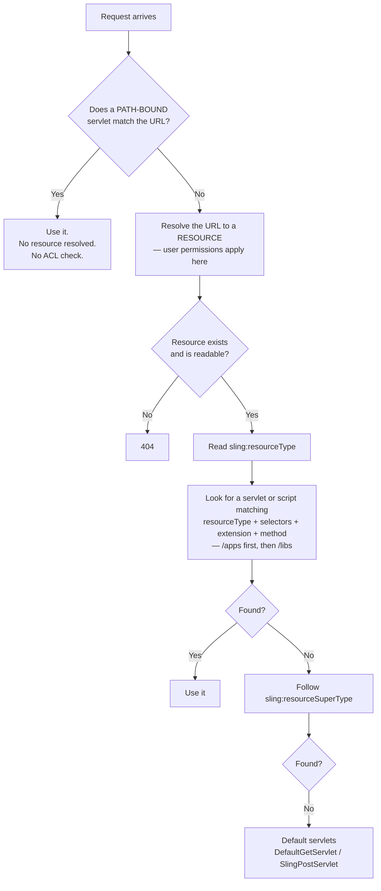

# 07 – Sling Servlets

> **Target:** 3–4 years experienced AEM Developer
> **Syllabus points covered (14, 15, 16):**
> *Point 14 — "All the annotations for services and servlets, and their simple methods."*
> *Point 15 — "Servlets are registered in two ways, path and resource type. What is the difference between them, and what is the use? Memorise GET, POST, PUT and DELETE method examples."*
> *Point 16 — "When do you extend/implement `SlingSafeMethodsServlet` and `SlingAllMethodsServlet` in a servlet?"*
> **Project domain:** a global energy technology company's marketing site.

---

## Before we start — the one question that decides this topic

Your syllabus point 15 says servlets are registered two ways and asks what the difference is. Almost every candidate answers that with something like:

> *"By path you give it a URL, by resource type you tie it to a component."*

That is true, and it scores about half a mark. It describes the **syntax** but misses the two things that actually matter:

1. **Path-bound servlets bypass content permissions.** There is no resource, so there is nothing for Sling to check ACLs against. You have to do authorisation yourself, and most people don't.
2. **Path-bound servlets have to be whitelisted in the dispatcher.** Resource-type servlets sit on real content paths, which are already allowed.

Those two are why Adobe recommends resource-type registration and treats path binding as the exception. If you lead with security and dispatcher behaviour rather than syntax, you have given a clearly better answer than the room.

There is also a strong continuity thread here. File 02's flagship component story — the tabbed listing with Load More — hinged on registering a servlet **by resource type with a selector and suffix** so the responses stayed dispatcher-cacheable. That decision lives in this file. If you tell that story, expect to be asked to justify it here.

---

## 1. Introduction

### 1.1 What is a servlet, and why do you need one in AEM?

A servlet is a Java class that handles an HTTP request and writes a response. That is standard Java EE, not AEM-specific.

But here is the question worth asking first, because interviewers do: **AEM already renders pages through HTL and Sling Models. So when do you actually need a servlet?**

**You don't need one for rendering a page.** That is what components and HTL are for.

**You need one when the browser needs data rather than a page.** Three real cases from our project:

**Case one — the browser asks for more data after the page has loaded.** The product listing's Load More button. The page is already rendered; JavaScript needs the next batch of cards. That is not a page render, so HTL is the wrong tool.

**Case two — a form submits somewhere that isn't a repository node.** A "request a quote" form that has to reach an external CRM. The Sling Post Servlet writes to the repository, which is not what we want here.

**Case three — an alternative representation of existing content.** The same product page as JSON, for the mobile app or a partner integration.

**The interview answer:**

> "In AEM most rendering goes through HTL and Sling Models, so I write a servlet when the browser needs *data* rather than a page. Typically that's three cases: an AJAX call after page load, like a Load More or a filter; a form posting somewhere that isn't a repository node; or exposing existing content in another format, usually JSON for a front-end or a partner system.
>
> If I find myself writing a servlet to render HTML for a page, that's usually a sign I should have used a component instead."

### 1.2 A servlet is just an OSGi component

This is the bridge from file 06, and it explains everything about how servlets are registered.

**A Sling servlet is an OSGi component registered as a service under the `javax.servlet.Servlet` interface.**

```java
@Component(service = Servlet.class)      // ← this is the whole mechanism
public class ProductSpecsServlet extends SlingSafeMethodsServlet {
}
```

That is it. Registering under `Servlet.class` puts it on the noticeboard from file 06. Sling's **servlet resolver** watches that noticeboard and reads each servlet's **service properties** to decide which requests it should handle.

**Two consequences worth stating in an interview**, because they tie the files together:

**One — `@Reference` works in a servlet.** File 05 explained why it does not work in a Sling Model: Declarative Services only manages `@Component` classes. A servlet *is* one, so DS manages it and can inject into it.

**Two — a servlet can be unsatisfied.** All of file 06's component lifecycle applies. If a servlet has a mandatory `@Reference` to a service that isn't registered, the servlet component never activates — and you get no error, just a URL that returns 404 forever. That is a genuinely common and confusing production problem.

### 1.3 A real project example to adapt

> "We have around eight servlets. Most are registered by resource type — the Load More endpoint for our product listing, a specifications endpoint the product page calls, and a couple of JSON endpoints for the mobile app. Two are path-bound: a form handler that posts to an external CRM, and a health check endpoint. For those two we do our own authorisation, because path-bound servlets bypass content ACLs, and both paths are explicitly whitelisted in the dispatcher configuration."

That covers the split, the security consequence, and the dispatcher — three follow-ups pre-empted.

---

## 2. Core Concepts

### 2.1 The two base classes *(syllabus point 16)*

Your syllabus asks when you extend each. Let's start here because it shapes the code you write.

There are two abstract classes, and one extends the other:

```
javax.servlet.Servlet                        (interface)
        ↑
GenericServlet
        ↑
SlingSafeMethodsServlet        ← GET, HEAD, OPTIONS, TRACE
        ↑
SlingAllMethodsServlet         ← adds POST, PUT, DELETE
```

**A small precision point, since your syllabus says "extend/implement":** you **extend** these — they are abstract classes, not interfaces. You would *implement* `javax.servlet.Servlet`, but in practice nobody does that directly. Saying "extend" correctly is a small but real signal.

**`SlingSafeMethodsServlet`** handles only the HTTP methods that are **safe** — meaning they read but do not change anything:

| Method | What it does |
|---|---|
| `GET` | Retrieve something |
| `HEAD` | Like GET but headers only |
| `OPTIONS` | What methods does this support? |
| `TRACE` | Diagnostic echo |

You override `doGet`, and occasionally `doHead`.

**`SlingAllMethodsServlet`** extends the safe one and adds the **unsafe** methods — the ones that change state:

| Method | What it does |
|---|---|
| `POST` | Create, or submit |
| `PUT` | Replace |
| `DELETE` | Remove |

You override `doPost`, `doPut`, `doDelete`, plus anything from the safe set.

**Now the question your syllabus is actually asking: when do you use each?**

The rule is one sentence:

> **If the servlet only reads, extend `SlingSafeMethodsServlet`. If it changes anything, extend `SlingAllMethodsServlet`.**

**And the follow-up that separates a good answer: why not just always use `SlingAllMethodsServlet`?**

Three reasons:

**One — least privilege.** Extending `SlingAllMethodsServlet` means your servlet advertises that it handles POST, PUT and DELETE. If you only implemented `doGet`, you have declared an interface you did not build. The inherited methods return **405 Method Not Allowed**, so nothing breaks — but you have widened the surface for no reason.

**Two — intent.** A reader seeing `SlingSafeMethodsServlet` knows immediately this endpoint is read-only. That is free documentation.

**Three — code review.** Extending `SlingAllMethodsServlet` for a read-only servlet is a standard code review comment, and on a security-reviewed project it will be raised.

**The interview answer:**

> "`SlingSafeMethodsServlet` handles the safe HTTP methods — GET, HEAD, OPTIONS and TRACE — meaning the ones that read without changing state. `SlingAllMethodsServlet` extends it and adds POST, PUT and DELETE.
>
> So the rule is: read-only servlet extends the safe one, anything that writes extends the all-methods one.
>
> I wouldn't just always use `SlingAllMethodsServlet`, even though it would work, for three reasons. It advertises methods I haven't implemented — they'd return 405, so nothing breaks, but it's a wider surface than needed. It loses the intent, because `SlingSafeMethodsServlet` tells the next developer at a glance that this endpoint is read-only. And it's a routine code review finding on any security-conscious project.
>
> Small precision: these are abstract classes, so you extend them. You'd only *implement* `javax.servlet.Servlet` directly, which nobody does in practice."

### 2.2 Registering by path *(syllabus point 15)*

```java
@Component(service = Servlet.class)
@SlingServletPaths("/bin/energy/quote-request")
public class QuoteRequestServlet extends SlingAllMethodsServlet {

    @Override
    protected void doPost(SlingHttpServletRequest request,
                          SlingHttpServletResponse response) { }
}
```

**What this means:** the servlet answers at that exact URL. `https://www.example.com/bin/energy/quote-request`.

**The URL is arbitrary.** It does not correspond to anything in the repository. There is no node at `/bin/energy/quote-request`.

**And that last sentence is the source of everything important about path binding**, which we come to in 2.4.

**The older property-based form**, which you will see in existing codebases:

```java
@Component(
    service = Servlet.class,
    property = {
        "sling.servlet.paths=/bin/energy/quote-request",
        "sling.servlet.methods=POST"
    })
```

Same thing, less readable. The annotation is current.

**A constraint worth knowing:** recent AEM and Sling versions restrict which path prefixes a path-bound servlet may use, and there is an allowlist configuration in the Sling Servlet Resolver. Conventionally these live under **`/bin/`**. Registering a servlet at an arbitrary top-level path is either discouraged or blocked depending on your version, so `/bin/<project>/<name>` is the pattern to follow.

### 2.3 Registering by resource type *(syllabus point 15)*

```java
@Component(service = Servlet.class)
@SlingServletResourceTypes(
        resourceTypes = "energy/components/categorylisting",
        selectors = "cards",
        extensions = "html",
        methods = HttpConstants.METHOD_GET
)
public class CategoryCardsServlet extends SlingSafeMethodsServlet {
}
```

**What this means:** this servlet handles requests for **any content node whose `sling:resourceType` is `energy/components/categorylisting`**, when the request has the selector `cards`, the extension `html`, and the method GET.

So it answers at URLs like:

```
/content/energy/global/en/products.cards.html/2
        └─── a real content path ───┘  └sel┘└ext┘└suffix┘
```

**Notice this is exactly the Sling resolution model from file 01** — `URL → Resource → Resource Type → Script`. A resource-type servlet slots into that chain in place of an HTL script. It is not a separate mechanism; it is the same one.

**The four attributes:**

| Attribute | Purpose | Required? |
|---|---|---|
| `resourceTypes` | Which content this serves | **Yes** |
| `selectors` | Narrow to a selector, e.g. `cards` | No, but almost always used |
| `extensions` | `html`, `json`, `csv` | Recommended |
| `methods` | `GET`, `POST`, … | Recommended |

**Why you almost always want a selector.** Without one, your servlet takes over *every* GET for that resource type — including the page render itself. With `selectors = "cards"`, the normal page still renders through HTL and only `.cards.` requests reach your servlet.

**The older property form:**

```java
@Component(
    service = Servlet.class,
    property = {
        "sling.servlet.resourceTypes=energy/components/categorylisting",
        "sling.servlet.selectors=cards",
        "sling.servlet.extensions=html",
        "sling.servlet.methods=GET"
    })
```

### 2.4 The real difference — and why it matters *(syllabus point 15)*

This is the heart of the file. Four differences, and the first two are the ones that count.

#### Difference 1 — permissions

**This is the most important one, and most candidates miss it.**

With a **resource-type** servlet, the URL is a real content path. So Sling does what it always does: it resolves the path to a resource **using the current user's permissions**. If an anonymous visitor cannot read that content, the resource does not resolve and they get a 404 before your code runs at all.

**You get content permissions for free.**

With a **path-bound** servlet, there is no resource. `/bin/energy/quote-request` is not a node. So there is nothing for Sling to check permissions against, and your servlet runs for **anyone who knows the URL**.

**You must do authorisation yourself, in code.** And if you forget — which is common — you have an unauthenticated endpoint on your public site.

> "The difference people usually miss is permissions. A resource-type servlet sits on a real content path, so Sling resolves that resource using the current user's session and content ACLs apply automatically — if the user can't read the content, they never reach my code. A path-bound servlet has no resource behind it, so there's nothing to check against and it runs for anyone who knows the URL. That means every path-bound servlet has to do its own authorisation, and forgetting is how you end up with an unauthenticated endpoint on a public site."

#### Difference 2 — the dispatcher

From file 01: the dispatcher denies everything by default and whitelists what the site needs.

A **resource-type** servlet lives under `/content`, which is already allowed. Nothing extra to do.

A **path-bound** servlet lives under `/bin`, which is **not** allowed by default. It must be explicitly whitelisted:

```
/0200 { /type "allow" /path "/bin/energy/*" /method "POST" }
```

**And this produces a very common bug:** the servlet works perfectly on author and locally, and returns 404 on the published site — because the dispatcher rejected the request before it ever reached AEM. It is the same shape of failure as `allowProxy` in file 04: environment-specific, and the code is fine.

#### Difference 3 — caching

A resource-type servlet with a selector and extension produces a URL that is **part of the path**, so the dispatcher can cache it as a file.

```
/content/energy/global/en/products.cards.html/2      ← cacheable
/bin/energy/cards?page=2                              ← not cacheable
```

**This is exactly the decision in file 02's Load More story.** Same data, but one form caches and the other hits publish on every click.

#### Difference 4 — flexibility

Path binding gives you any URL you like, with no content required. Resource-type binding requires real content to exist at that path.

That is the genuine advantage of path binding, and it is why it still exists.

#### The comparison table

| | By Path | By Resource Type |
|---|---|---|
| Annotation | `@SlingServletPaths` | `@SlingServletResourceTypes` |
| URL | Arbitrary, e.g. `/bin/energy/x` | A real content path with a selector |
| Backed by a real resource | **No** | **Yes** |
| Content ACLs apply | **No — do it yourself** | **Yes, automatically** |
| Dispatcher | **Must be whitelisted** | Already allowed |
| Cacheable | Rarely | **Yes**, with selector + extension |
| Needs content to exist | No | Yes |
| Adobe's recommendation | Use sparingly | **Preferred** |
| Good for | Global utilities, external form handlers, health checks | Almost everything else |

#### When to actually use path binding

Be specific here, because "never" is a weak answer:

**Use a path-bound servlet when there is genuinely no content context.** Three legitimate cases:

- A **form handler** posting to an external system, where no repository node is involved.
- A **health check** or diagnostic endpoint.
- A **webhook receiver** where an external system must call a fixed, stable URL.

**Everything else should be resource-type bound.**

**The complete interview answer:**

> "Two mechanisms. `@SlingServletPaths` binds to a fixed URL like `/bin/energy/export`. `@SlingServletResourceTypes` binds to a resource type plus selector, extension and method, so it answers on real content paths.
>
> The syntax difference is the obvious part. The two that actually matter are security and the dispatcher.
>
> **Security:** a resource-type servlet resolves a real resource, so content ACLs are applied automatically — an anonymous user who can't read that content gets a 404 before my code runs. A path-bound servlet has no resource, so nothing is checked and it runs for anyone with the URL. Authorisation becomes my job.
>
> **Dispatcher:** `/content` paths are already allowed, but `/bin` has to be explicitly whitelisted. That's why a path-bound servlet frequently works on author and 404s on the live site.
>
> There's also caching. A resource-type servlet with a selector produces a path-based URL the dispatcher can cache as a file. A path-bound one usually takes query parameters, which aren't cacheable — that difference was significant on a listing component we built with a Load More.
>
> So I default to resource type. I use path binding only when there's genuinely no content context — a form handler posting to an external CRM, a health check, or a webhook that needs a fixed URL. And when I do, I write explicit authorisation and add the dispatcher rule."

### 2.5 The methods — GET, POST, PUT, DELETE *(syllabus point 15)*

Your syllabus says to memorise examples of each. Note the signature: **`SlingHttpServletRequest`**, not the plain `HttpServletRequest`. The Sling versions give you `getResource()`, `getResourceResolver()` and `getRequestPathInfo()`.

```java
@Override
protected void doGet(SlingHttpServletRequest request,
                     SlingHttpServletResponse response)
        throws ServletException, IOException { }

@Override
protected void doPost(SlingHttpServletRequest request,
                      SlingHttpServletResponse response)
        throws ServletException, IOException { }

@Override
protected void doPut(SlingHttpServletRequest request,
                     SlingHttpServletResponse response)
        throws ServletException, IOException { }

@Override
protected void doDelete(SlingHttpServletRequest request,
                        SlingHttpServletResponse response)
        throws ServletException, IOException { }
```

**Four things they all share:**

- `protected`, not public.
- Return `void` — you write to the response, you do not return a value.
- Throw `ServletException` and `IOException`.
- Take the **Sling** request and response types.

**What each is for, semantically** — worth being able to say, because it shows you understand HTTP rather than just AEM:

| Method | Meaning | Safe? | Idempotent? |
|---|---|---|---|
| `GET` | Read something | Yes | Yes |
| `POST` | Create, or submit | No | **No** |
| `PUT` | Replace at a known location | No | Yes |
| `DELETE` | Remove | No | Yes |

**"Idempotent" means calling it twice has the same effect as calling it once.** PUT and DELETE are — deleting the same thing twice leaves it deleted. POST is not — posting a form twice creates two records. That is why browsers warn you before re-submitting a form, and it is a good detail to drop in.

Full working examples of all four are in section 8.

### 2.6 Every servlet and service annotation *(syllabus point 14)*

Your syllabus asks for all the annotations for services and servlets together. Services were file 06; here is the combined map.

**Servlet registration** (`org.apache.sling.servlets.annotations`):

| Annotation | Purpose |
|---|---|
| `@SlingServletResourceTypes` | Register by resource type — **preferred** |
| `@SlingServletPaths` | Register by fixed path |
| `@SlingServletName` | Give it a readable name in the consoles |
| `@SlingServletFilter` | Register a request filter |

**Always paired with:**

```java
@Component(service = Servlet.class)
```

**`@SlingServletResourceTypes` attributes:**

```java
@SlingServletResourceTypes(
    resourceTypes = "energy/components/categorylisting",   // required
    resourceSuperType = "...",                             // optional
    selectors = { "cards", "list" },                       // optional, use one
    extensions = { "html", "json" },
    methods = { HttpConstants.METHOD_GET }
)
```

**`@SlingServletPaths`:**

```java
@SlingServletPaths({ "/bin/energy/quote", "/bin/energy/quote/v2" })
```

**Note it takes no `methods` attribute** — you control that by which `doXxx` methods you override, and by your base class.

**The old property names**, so you can read legacy code:

```
sling.servlet.resourceTypes
sling.servlet.resourceSuperType
sling.servlet.selectors
sling.servlet.extensions
sling.servlet.methods
sling.servlet.paths
sling.servlet.prefix          ← search-path priority: "/apps" beats "/libs"
```

**Service annotations from file 06, which servlets also use:**

| Annotation | Purpose in a servlet |
|---|---|
| `@Component(service = Servlet.class)` | Registers it |
| `@Reference` | Inject a service — works because a servlet **is** an OSGi component |
| `@Activate` / `@Deactivate` | Lifecycle, if the servlet holds resources |
| `@ObjectClassDefinition` / `@Designate` | Configure the servlet per run mode |
| `@ServiceDescription` | A human-readable description in the console |

**The one-line summary for point 14:**

> "For servlets it's `@Component(service = Servlet.class)` plus either `@SlingServletResourceTypes` or `@SlingServletPaths`, and `@SlingServletFilter` for filters. Because a servlet is an OSGi component, everything from the service side applies too — `@Reference` for injection, `@Activate` and `@Deactivate` for lifecycle, and `@ObjectClassDefinition` with `@Designate` if it needs configuration. The older style used `sling.servlet.*` properties on `@Component` directly, which still works but is much less readable."

### 2.7 The default servlets — the ones you didn't write

Two servlets ship with Sling and handle requests you never wrote code for. Both come up in interviews, and both have security implications.

**`DefaultGetServlet`** handles a GET when nothing else matches. It renders a node as `.json`, `.html`, `.xml` or `.res`.

**This is what serves `.infinity.json`** — and it is why `/content.infinity.json` can dump your repository if the dispatcher does not block it. That connects straight back to file 01.

It is configurable — you can disable the JSON renderer, and cap how many nodes `.infinity.json` will return.

**`SlingPostServlet`** handles a POST to a repository path, creating and updating nodes from form fields.

**This is what saves your component dialogs** — the mechanism from file 02. Nobody writes a servlet for a dialog because this one already exists.

Its special parameters are worth knowing:

| Parameter | Effect |
|---|---|
| `:operation` | `delete`, `move`, `copy`, `import` |
| `@TypeHint` | Force a property type, e.g. `Boolean`, `Long`, `Date` |
| `@Delete` | Remove a property |
| `@ValueFrom` | Take the value from a differently-named field |
| `:redirect` | Where to go after the POST |
| `:status` | `browser` for a redirect, or return a plain status |

**Why this matters for security:** the Sling Post Servlet means **any authenticated user who can write to a path can create content there by POSTing to it**. On publish that is why POST is normally blocked at the dispatcher for content paths.

---

## 3. Internal Working

### 3.1 How Sling picks a servlet

This extends the script resolution from file 01, and it explains why path-bound servlets behave differently.



**The single most important thing in that diagram is the top branch.**

Path-bound servlets are checked **first**, in a separate registry, and they **skip the resource resolution step entirely**. That is not a quirk — it is the definition of path binding. And since resource resolution is where permissions are checked, skipping it is exactly why ACLs do not apply.

Being able to explain the security consequence as a *consequence of the resolution order*, rather than as an isolated fact, is what makes the answer sound like understanding.

### 3.2 Servlet versus script — the same slot

A useful reframing that impresses interviewers.

A resource-type servlet and an HTL script compete for **the same position** in resolution. Both answer "what renders this resource type with these selectors?"

```
resourceType = energy/components/categorylisting, selector = cards, extension = html

Candidates, in order:
  /apps/energy/components/categorylisting/cards.html      ← an HTL script
  a registered servlet with matching properties            ← your servlet
```

**So you could implement Load More as either an HTL script or a servlet.** The reason to choose a servlet is that the logic is substantial and belongs in testable Java rather than in a template.

> "A resource-type servlet occupies the same slot in Sling's resolution as an HTL script — they're alternatives for the same job. I use a servlet when there's real logic that belongs in testable Java, and a script when it's genuinely presentational. Knowing they're interchangeable is useful, because it means a servlet with a selector doesn't need any special URL — it just uses the normal content URL with a selector on it."

### 3.3 What a servlet has access to

Because it takes `SlingHttpServletRequest`, a servlet gets the whole Sling context:

```java
Resource resource = request.getResource();               // the resolved resource
ResourceResolver resolver = request.getResourceResolver(); // the user's session
RequestPathInfo info = request.getRequestPathInfo();     // selectors, suffix, extension
String param = request.getParameter("q");                // query/form parameter
```

**`getResourceResolver()` is important and easy to get wrong.** It returns a resolver **bound to the current user** — anonymous on publish. So repository reads through it automatically respect that user's permissions.

That is usually what you want. If you need to read something the visitor cannot see, you need a **service user** — the pattern from file 01, with try-with-resources. But do that deliberately, because you are stepping outside the permission model on purpose.

**And crucially: never close the request's resolver.** You did not open it; Sling did, and Sling will close it. Closing it breaks the rest of the request.

That is a genuinely good detail — it inverts the usual "always close your resolver" rule, and knowing *when* the rule applies shows real understanding.

---

## 4. Important Interview Questions

### 4.1 Basic

**Q1. What is a Sling servlet?**
A Java class handling an HTTP request, registered as an OSGi component under the `javax.servlet.Servlet` interface, which Sling's servlet resolver then matches to requests using its service properties.

*Cross:* What makes it a servlet? (`@Component(service = Servlet.class)`) · Can you use `@Reference` in it? (yes — it's an OSGi component) · Can a servlet be unsatisfied? (yes, all of file 06 applies)

**Q2. When do you write a servlet rather than a component?**
When the browser needs data rather than a page — an AJAX call after load, a form posting somewhere that isn't a repository node, or content in another format like JSON.

*Cross:* Why not use a servlet to render a page? · What renders a page then? · What handles a dialog save? (the Sling Post Servlet)

**Q3. What are the two ways to register a servlet?**
By path with `@SlingServletPaths`, or by resource type with `@SlingServletResourceTypes`.

*Cross:* Which is preferred and why? · What was the old way? (`sling.servlet.*` properties) · Can a servlet use both? (technically, but don't)

**Q4. What is `SlingSafeMethodsServlet`?**
The base class for read-only servlets — it handles GET, HEAD, OPTIONS and TRACE.

*Cross:* What does "safe" mean in HTTP? (no side effects) · Which methods does it not handle? · Do you extend or implement it? (**extend** — it's abstract)

**Q5. What is `SlingAllMethodsServlet`?**
It extends `SlingSafeMethodsServlet` and adds POST, PUT and DELETE.

*Cross:* Why not always use it? · What happens if you POST to a safe-methods servlet? (405 Method Not Allowed) · What's the inheritance chain?

**Q6. What methods do you override?**
`doGet`, `doPost`, `doPut`, `doDelete` — all protected, returning void, taking `SlingHttpServletRequest` and `SlingHttpServletResponse`.

*Cross:* Why the Sling types rather than `HttpServletRequest`? (`getResource`, `getResourceResolver`, `getRequestPathInfo`) · What do they throw?

**Q7. What's the difference between a selector and a query parameter for a servlet?**
Selectors are part of the URL path so the dispatcher can cache the response; query parameters are not, so those responses go through to publish every time.

*Cross:* What about the suffix? (also cacheable) · How do you read each? · Why does that matter for a Load More?

**Q8. What is the `DefaultGetServlet`?**
Sling's fallback for GET when nothing else matches — it renders a node as JSON, HTML or XML. It is what serves `.infinity.json`, which is why that must be blocked at the dispatcher.

*Cross:* What's the security concern? · Can you disable it? (yes, via OSGi config) · What's the POST equivalent? (Sling Post Servlet)

**Q9. What is the Sling Post Servlet?**
Sling's built-in handler for POST to a repository path — it creates and updates nodes from form fields. It is what saves component dialogs.

*Cross:* What is `:operation`? · What is `@TypeHint`? · Why is POST restricted at the dispatcher on publish?

**Q10. How do you inject a service into a servlet?**
`@Reference`, on a field of the service interface type. It works because a servlet is an OSGi component.

*Cross:* Why doesn't `@Reference` work in a Sling Model? · What's the default cardinality? (MANDATORY) · What happens if the service is missing? (the servlet never activates — 404, no error)

### 4.2 Intermediate

**Q11. Path versus resource type — what's the real difference?**
→ Section 2.4. Lead with **permissions** and the **dispatcher**, not syntax.

*Cross:* Why do ACLs not apply to a path-bound servlet? · What must you do about it? · Why does a path servlet 404 on publish but work on author? · Which caches better?

**Q12. When would you legitimately use a path-bound servlet?**
When there is genuinely no content context — a form handler posting to an external system, a health check, or a webhook needing a fixed URL.

*Cross:* What do you have to add for each? (authorisation, and a dispatcher rule) · Where should the path live? (`/bin/<project>/...`) · Why not an arbitrary top-level path?

**Q13. Why must you write your own authorisation in a path-bound servlet?**
Because there is no resource for Sling to resolve, so no ACL check happens. The servlet runs for anyone who knows the URL.

*Cross:* How would you implement it? (check the resolver's user, check group membership, or check a permission on a related path) · What's the risk if you forget? · How would you test it? (as anonymous, against publish)

**Q14. My servlet isn't being invoked. Debug it.**

In order:
1. **`/system/console/servletresolver`** — enter the URL and it shows exactly what resolves. This is the fastest single check.
2. **`/system/console/components`** — is the servlet component Active, or Unsatisfied because of a missing `@Reference`?
3. Do the registration properties actually match — resource type, selector, extension, **method**?
4. If path-bound on publish: is the dispatcher whitelisting it?

*Cross:* Why is a missing `@Reference` so confusing here? (no error — just a 404) · What if it works on author only? · What if it returns 405?

**Q15. What does a 405 from your servlet mean?**
The servlet was found, but that HTTP method has no implementation — usually you extended `SlingSafeMethodsServlet` and the client sent POST, or you registered `methods = GET` and something sent POST.

*Cross:* How do you fix it? · Which is more likely? · Difference between 404 and 405 here? (404 = no servlet matched; 405 = matched but wrong method)

**Q16. How do you make a servlet's response cacheable?**
Register by resource type, use a **selector and extension** rather than query parameters so the URL is path-based, and set appropriate cache headers. The dispatcher builds its cache filename from the path.

*Cross:* What about the suffix? (also part of the path) · What if you need many parameter combinations? (cache explosion — reconsider) · How would you invalidate it? (a flush rule when the underlying content changes)

**Q17. How do you read selectors and the suffix in a servlet?**
Through `request.getRequestPathInfo()` — `getSelectors()`, `getSelectorString()`, `getSuffix()`, `getExtension()`. Never parse the URL yourself.

*Cross:* What does `getSuffix()` return with no suffix? (**null**) · Should you trust those values? (**no** — validate and clamp) · Why not use `substring`?

**Q18. Should you close the ResourceResolver in a servlet?**
**Not the one from the request** — Sling opened it and Sling will close it, and closing it breaks the rest of the request. You *do* close a resolver you opened yourself from a service user, with try-with-resources.

*Cross:* When would you open your own? (to read something the visitor can't) · What happens if you leak one? (session leak, eventually memory exhaustion) · What happens if you close the request's? (the rest of the request fails)

**Q19. How do you return JSON properly from a servlet?**
Set the content type and character encoding explicitly, and serialise with a real library like Jackson rather than building strings.

*Cross:* Why not string concatenation? (a quote or apostrophe in the data breaks it) · What content type? (`application/json`) · Why set encoding explicitly? (defaults vary by container)

**Q20. What is a Sling filter and how does it differ from a servlet?**
A filter intercepts requests before and after they reach a servlet or script, for cross-cutting concerns like security headers, logging or redirects. A servlet handles the request; a filter wraps it. Registered with `@SlingServletFilter`, and ordered by `service.ranking`.

*Cross:* What are the scopes? (REQUEST, INCLUDE, COMPONENT, FORWARD, ERROR) · Difference between REQUEST and COMPONENT? (once per request vs per component include) · Why keep filters light? (they run on every request)

### 4.3 Advanced

**Q21. Design a cacheable pagination endpoint.**

This is file 02's Load More story, and the answer is the reasoning behind it:

> "Register by **resource type** with a selector, and take the page number as a **suffix** rather than a query parameter — so the URL is `/content/.../listing.cards.html/2`, which is entirely path-based and the dispatcher caches it as a file. The obvious implementation with `?page=2` isn't cacheable, so every Load More click reaches publish.
>
> I'd have the servlet return a **rendered HTML fragment** rather than raw JSON, because the first batch is server-rendered by HTL for SEO and later batches come from here. Two templates for the same card drift apart and the grid visibly breaks at the batch boundary — returning HTML means one template.
>
> I'd **clamp the page number**, because a value from a URL can be anything and I don't want someone requesting page 99999 and making the server build an enormous list.
>
> And because the underlying listing is derived from the page tree, I'd add a **flush rule** so publishing a child page invalidates the cached parent — otherwise the cached fragments go stale silently."

*Cross:* Why a suffix and not a query param? · Why HTML and not JSON? · What if there are a hundred pages? · How does invalidation work?

**Q22. Your servlet needs to read content the visitor can't see. How?**

A **service user** with the minimum ACLs, obtained through `getServiceResourceResolver` with a subservice name mapped in the `ServiceUserMapper`, and always in try-with-resources. Never `getAdministrativeResourceResolver` — deprecated and blocked on Cloud Service.

And be deliberate: you are stepping outside the permission model on purpose, so make sure the *output* doesn't leak anything the visitor shouldn't see.

*Cross:* How is the service user created on AEMaaCS? (**Repoinit** — file 01) · What's the mapping format? (`bundle:subservice=[user]`) · Why try-with-resources? · What's the risk of over-granting? (that user's permissions apply to every call through it)

**Q23. How do you secure a POST endpoint?**

Several layers: authorisation in code, since path-bound servlets get none for free; **CSRF protection** using AEM's token filter, because a POST from a browser can be forged from another site; input validation and size limits; rate limiting or a captcha for anything public; and never returning stack traces, which leak internals.

*Cross:* What is CSRF and why does it apply to POST? · Where does AEM's CSRF token come from? (`/libs/granite/csrf/token.json`) · Should the endpoint be on publish at all?

**Q24. What happens if two servlets match the same request?**

The more specific registration wins — more selectors is more specific. If they are genuinely equal, `service.ranking` decides, and beyond that it is registration order, which you should never depend on. `/system/console/servletresolver` shows what actually resolves and the candidates it considered.

*Cross:* How would you make one deliberately win? (`service.ranking`, or `sling.servlet.prefix`) · What's `sling.servlet.prefix`? (search-path priority — `/apps` over `/libs`) · How do you avoid the situation? (always use a selector)

**Q25. How do you unit test a servlet?**

AEM Mocks — `context.request()` and `context.response()`, set the resource, selectors and parameters on the mock request, call `doGet` directly, then assert on the response's status, content type and output. Injected services get registered as mocks.

*Cross:* What do you actually test? (**the failure paths** — bad input, missing content, the service being unavailable) · How do you set a suffix on a mock request? · How do you test authorisation?

**Q26. Servlet, filter, or Sling Model — how do you choose?**

A Sling Model when it feeds a page render. A servlet when the browser requests data directly. A filter when the concern applies to *every* request regardless of what handles it — security headers, logging, redirects.

The mistake I'd avoid is a filter doing work that belongs in one servlet, because a filter runs on every request and that cost multiplies.

*Cross:* Give an example of each · What's a filter that shouldn't be a filter? · How do you order two filters?

---

## 5. Cross Questions — how this topic gets drilled

**Thread A — from "how do you register a servlet" (your syllabus thread)**
Two ways? → What's the difference? → *(if you only say syntax)* → What about permissions? → Why don't ACLs apply to a path servlet? → So what do you do about it? → What about the dispatcher? → Why does it work on author and not publish? → Which caches better? → When would you ever use path binding?

**Thread B — from "which base class"**
Which methods does each handle? → What does "safe" mean in HTTP? → Why not always use AllMethods? → What happens if you POST to a safe servlet? → What status? → Extend or implement? → What's the inheritance chain?

**Thread C — from "my servlet isn't invoked"**
What's the first thing you check? → What does the servlet resolver console tell you? → What if the component is unsatisfied? → Why does that give a 404 rather than an error? → What if it's path-bound and only fails on publish? → How would you confirm the dispatcher is the cause?

**Thread D — from "how do you return JSON"**
Which library? → Why not build the string? → What content type? → What encoding? → How do you handle an error? → What status code? → Would you return the stack trace? (no) → How would you make it cacheable?

---

## 6. Best Interview Answers

### 6.1 "What's the difference between path and resource type registration?" — about 2 minutes

**This is the answer to have word-perfect. Your syllabus asks it directly.**

> "There are two mechanisms. `@SlingServletPaths` binds the servlet to a fixed URL like `/bin/energy/quote-request`. `@SlingServletResourceTypes` binds it to a resource type plus selector, extension and method, so it answers on real content paths — something like `/content/energy/global/en/products.cards.html`.
>
> The syntax is the obvious difference. The two that actually matter are security and the dispatcher.
>
> **Security first.** A resource-type servlet sits on a real content path, so Sling resolves that path to a resource using the current user's session — which means content ACLs apply automatically. If an anonymous visitor can't read that content, they get a 404 before my code ever runs. A path-bound servlet has no resource behind it. `/bin/energy/quote-request` isn't a node, so there's nothing for Sling to check permissions against, and the servlet runs for anyone who knows the URL. That means every path-bound servlet has to do its own authorisation, and forgetting is exactly how you end up with an unauthenticated endpoint on a public site.
>
> **Then the dispatcher.** Our dispatcher denies by default and whitelists what the site needs. `/content` paths are already allowed, so a resource-type servlet needs nothing extra. `/bin` isn't, so a path-bound servlet has to be explicitly whitelisted — and that's why one typically works perfectly on author and returns 404 on the live site. It's an environment-specific failure where the code is completely fine.
>
> **There's also caching.** A resource-type servlet with a selector produces a URL that's entirely path-based, so the dispatcher caches the response as a file. A path-bound one usually takes query parameters, which aren't part of the path and so aren't cached. That mattered on a product listing we built with a Load More — moving the page number from a query parameter to a suffix made every Load More response cacheable instead of hitting publish on each click.
>
> So I default to resource type. I use path binding only when there's genuinely no content context — a form handler posting to an external CRM, a health check, or a webhook that needs a fixed URL. And when I do, I write explicit authorisation and add the dispatcher rule as part of the same change."

### 6.2 "When do you extend SlingSafeMethodsServlet versus SlingAllMethodsServlet?" — about 60 seconds

> "`SlingSafeMethodsServlet` handles the safe HTTP methods — GET, HEAD, OPTIONS and TRACE. 'Safe' is the HTTP term for methods that read without changing state. `SlingAllMethodsServlet` extends it and adds POST, PUT and DELETE.
>
> So the rule is simple: if the servlet only reads, I extend the safe one; if it changes anything, the all-methods one.
>
> I wouldn't just always use `SlingAllMethodsServlet` even though it would work, for three reasons. It advertises POST, PUT and DELETE that I haven't implemented — they'd return 405 so nothing breaks, but it's a wider surface for no benefit. It loses intent, because `SlingSafeMethodsServlet` tells the next developer at a glance that this endpoint is read-only. And on any security-reviewed project, extending the all-methods class for a read-only servlet is a routine review finding.
>
> One small precision: these are abstract classes, so you extend them rather than implement them. You'd only implement `javax.servlet.Servlet` directly, which nobody does in practice."

### 6.3 "My servlet isn't being invoked" — about 60 seconds

> "I'd check four things in order.
>
> First, `/system/console/servletresolver`. You give it a URL and it shows exactly which servlet or script resolves, along with the candidates it considered. That's the fastest single check and it usually answers the question outright.
>
> Second, `/system/console/components` — is the servlet component actually Active, or Unsatisfied? A servlet is an OSGi component, so if it has a mandatory `@Reference` to a service that isn't registered, the component never activates. What makes that confusing is that you get no error at all — just a URL that returns 404, exactly as if the servlet didn't exist.
>
> Third, do the registration properties genuinely match the request — resource type, selector, extension, and the HTTP method. The method is the one people forget: registering `methods = GET` and then sending a POST gives you a 405, not a 404, and that distinction tells you the servlet *was* found.
>
> Fourth, if it's path-bound and only failing on publish, it's almost certainly the dispatcher not whitelisting `/bin`. I'd confirm by checking whether the request reached AEM at all in `dispatcher.log` — same diagnostic split as the `allowProxy` problem with clientlibs."

---

## 7. Real Project Examples

### Story 1 — The unauthenticated endpoint found in a security review

**What happened.** An external security review flagged that a path-bound servlet on our publish tier was reachable by anyone and returned internal product data — including some fields not meant to be public.

**The cause.** The servlet was registered with `@SlingServletPaths("/bin/energy/product-data")`. The developer had reasonably assumed that because the underlying content was protected, the endpoint was too.

It wasn't. **A path-bound servlet resolves no resource**, so there is no ACL check. Sling never touches the content permissions, because it never resolves content. The servlet ran for every request that reached it.

**Why it survived testing.** On author, everyone testing it was authenticated, so it looked correct. On publish, nobody thought to try it anonymously — and the URL wasn't linked from anywhere, so it never came up.

**The fix.** Re-registered by **resource type** with a selector, so the endpoint became `/content/energy/.../product.data.json`. That single change made content ACLs apply automatically — an anonymous user who cannot read the content now gets a 404 before the servlet's code runs.

**What we changed afterwards.** A rule that any path-bound servlet needs an explicit authorisation check and a comment explaining why it can't be resource-type bound. We went from five path-bound servlets to two.

**Why this works in an interview:** it demonstrates the security consequence concretely, explains why it isn't caught in testing, and the fix is architectural rather than a patch.

### Story 2 — The Load More that hit publish on every click

**What happened.** The product listing's Load More worked correctly but the publish tier saw far more traffic than expected during a campaign.

**The cause.** The endpoint was `/bin/energy/cards?listing=/content/...&page=2`. Path-bound, with query parameters. **Query parameters aren't part of the URL path, so the dispatcher doesn't cache those responses** — every single Load More click went through to a publish instance, and each one ran a page-tree traversal.

**The fix.** Re-registered by resource type with a `cards` selector, and moved the page number from a query parameter to a **suffix**:

```
before:  /bin/energy/cards?listing=/content/...&page=2      not cacheable
after:   /content/energy/global/en/products.cards.html/2     cached as a file
```

Same data, same JavaScript, entirely different caching behaviour. The listing path became implicit in the URL rather than a parameter, which also removed a small injection surface.

**A detail worth mentioning.** We also clamped the page number. A suffix comes from the URL, so it can be anything — without a clamp, someone requesting page 99999 makes the server build an enormous list. Never trust a value that arrived in a URL.

**Result.** Load More responses became cacheable, publish traffic during the campaign dropped substantially, and we handled the peak without scaling out.

### Story 3 — The servlet that silently never existed

**What happened.** A new specifications endpoint was deployed. It returned 404 on every environment. The bundle was ACTIVE and there was nothing in `error.log`.

**The investigation.** `/system/console/servletresolver` showed nothing resolving for that URL — so the servlet wasn't registered at all. `/system/console/components` showed the servlet **Unsatisfied**.

**The cause.** The servlet had `@Reference` to a product data service, and that service had `configurationPolicy = REQUIRE` with its config file in the wrong run-mode folder. So the service never activated, so the servlet's mandatory reference was never satisfied, so the servlet component never activated either.

**Why it was hard to spot.** A 404 looks like a routing problem, so everyone looked at the registration properties. But it was a **component lifecycle** problem one layer down — exactly the cascade from file 06, where one missing configuration silently disables a chain.

**The lesson to state:** *"A servlet is an OSGi component, so when it 404s I now check the components console before I check the registration. An unsatisfied servlet and a mistyped selector look identical from the outside, and only one of them is visible in the resolver console."*

---

## 8. Coding Examples

### 8.1 Resource-type servlet with all four methods

The reference example. Note the base class choice and the input handling.

```java
package com.energy.core.servlets;

import com.energy.core.services.ProductDataService;
import com.fasterxml.jackson.databind.ObjectMapper;
import org.apache.sling.api.SlingHttpServletRequest;
import org.apache.sling.api.SlingHttpServletResponse;
import org.apache.sling.api.resource.Resource;
import org.apache.sling.api.servlets.HttpConstants;
import org.apache.sling.api.servlets.SlingAllMethodsServlet;
import org.apache.sling.servlets.annotations.SlingServletResourceTypes;
import org.osgi.service.component.annotations.Component;
import org.osgi.service.component.annotations.Reference;
import org.slf4j.Logger;
import org.slf4j.LoggerFactory;

import javax.servlet.Servlet;
import java.io.IOException;

/**
 * Demonstrates all four methods on ONE servlet for reference.
 * In production these would normally be separate servlets with
 * separate selectors -- this is deliberately a teaching example.
 */
@Component(service = Servlet.class)
@SlingServletResourceTypes(
        resourceTypes = "energy/components/productdetail",
        selectors = "specs",
        extensions = "json",
        methods = {
                HttpConstants.METHOD_GET,
                HttpConstants.METHOD_POST,
                HttpConstants.METHOD_PUT,
                HttpConstants.METHOD_DELETE
        }
)
public class ProductSpecsServlet extends SlingAllMethodsServlet {
    // SlingAllMethodsServlet because this one WRITES.
    // A read-only servlet would extend SlingSafeMethodsServlet.

    private static final long serialVersionUID = 1L;
    private static final Logger LOG = LoggerFactory.getLogger(ProductSpecsServlet.class);
    private static final ObjectMapper MAPPER = new ObjectMapper();

    /**
     * @Reference works because a servlet IS an OSGi component.
     * MANDATORY by default -- if this service isn't registered,
     * this servlet never activates and the URL 404s with no error.
     */
    @Reference
    private ProductDataService productDataService;

    // ---------------- GET: read ----------------

    @Override
    protected void doGet(SlingHttpServletRequest request,
                         SlingHttpServletResponse response)
            throws IOException {

        // The resolved resource -- ACLs already applied by Sling,
        // because this is resource-type bound.
        Resource resource = request.getResource();

        // Read the suffix, never by parsing the URL yourself
        String productId = readProductId(request);
        if (productId == null) {
            sendError(response, SlingHttpServletResponse.SC_BAD_REQUEST,
                      "A product id is required in the suffix");
            return;
        }

        writeJson(response, productDataService.getSpecifications(productId));
    }

    // ---------------- POST: create / submit ----------------

    @Override
    protected void doPost(SlingHttpServletRequest request,
                          SlingHttpServletResponse response)
            throws IOException {

        String productId = request.getParameter("productId");
        if (productId == null || productId.trim().isEmpty()) {
            sendError(response, SlingHttpServletResponse.SC_BAD_REQUEST,
                      "productId is required");
            return;
        }

        try {
            productDataService.createSpecification(productId, request.getParameter("value"));
            response.setStatus(SlingHttpServletResponse.SC_CREATED);   // 201
            writeJson(response, java.util.Collections.singletonMap("status", "created"));

        } catch (Exception e) {
            // Log the detail; return something generic.
            // NEVER send a stack trace to the client -- it leaks internals.
            LOG.error("Failed to create specification for {}", productId, e);
            sendError(response, SlingHttpServletResponse.SC_INTERNAL_SERVER_ERROR,
                      "Could not create the specification");
        }
    }

    // ---------------- PUT: replace ----------------

    @Override
    protected void doPut(SlingHttpServletRequest request,
                         SlingHttpServletResponse response)
            throws IOException {

        String productId = readProductId(request);
        if (productId == null) {
            sendError(response, SlingHttpServletResponse.SC_BAD_REQUEST, "Missing product id");
            return;
        }
        // PUT is idempotent: calling it twice has the same effect as once.
        productDataService.replaceSpecifications(productId, request.getReader());
        response.setStatus(SlingHttpServletResponse.SC_NO_CONTENT);    // 204
    }

    // ---------------- DELETE: remove ----------------

    @Override
    protected void doDelete(SlingHttpServletRequest request,
                            SlingHttpServletResponse response)
            throws IOException {

        String productId = readProductId(request);
        if (productId == null) {
            sendError(response, SlingHttpServletResponse.SC_BAD_REQUEST, "Missing product id");
            return;
        }
        // Also idempotent: deleting twice leaves it deleted.
        boolean removed = productDataService.deleteSpecifications(productId);
        response.setStatus(removed
                ? SlingHttpServletResponse.SC_NO_CONTENT      // 204
                : SlingHttpServletResponse.SC_NOT_FOUND);     // 404
    }

    // ---------------- helpers ----------------

    /**
     * Reads the suffix. NEVER trust a value that arrived in a URL --
     * validate its shape before using it.
     */
    private String readProductId(SlingHttpServletRequest request) {
        String suffix = request.getRequestPathInfo().getSuffix();
        if (suffix == null) {
            return null;                       // getSuffix() is null when absent
        }
        String id = suffix.replaceFirst("^/", "").trim();
        // Whitelist the shape rather than blacklisting bad characters
        return id.matches("[A-Za-z0-9_-]{1,64}") ? id : null;
    }

    private void writeJson(SlingHttpServletResponse response, Object payload)
            throws IOException {
        // Set BOTH -- container defaults vary and a wrong charset
        // mangles non-ASCII characters.
        response.setContentType("application/json");
        response.setCharacterEncoding("UTF-8");
        // Serialise with a real library. String concatenation breaks
        // the moment a value contains a quote or apostrophe.
        MAPPER.writeValue(response.getWriter(), payload);
    }

    private void sendError(SlingHttpServletResponse response, int status, String message)
            throws IOException {
        response.setStatus(status);
        writeJson(response, java.util.Collections.singletonMap("error", message));
    }
}
```

**The eight decisions to be able to defend:**

`SlingAllMethodsServlet` because it writes. Read-only would be the safe class.

`@Reference` works because a servlet is an OSGi component — and the comment names the failure mode.

The suffix is read via `getRequestPathInfo()`, never string-sliced.

**Input is whitelisted by shape**, not blacklisted — a URL value can be anything.

**Errors log the detail and return something generic.** A stack trace to the client is an information leak.

Content type **and** encoding are both set explicitly.

JSON is serialised by Jackson, not built with string concatenation.

**Correct status codes** — 201 for created, 204 for no content, 400 for bad input, 404, 500.

### 8.2 The cacheable Load More servlet — file 02's story in code

```java
package com.energy.core.servlets;

import org.apache.sling.api.SlingHttpServletRequest;
import org.apache.sling.api.SlingHttpServletResponse;
import org.apache.sling.api.request.RequestDispatcherOptions;
import org.apache.sling.api.servlets.HttpConstants;
import org.apache.sling.api.servlets.SlingSafeMethodsServlet;
import org.apache.sling.servlets.annotations.SlingServletResourceTypes;
import org.osgi.service.component.annotations.Component;

import javax.servlet.Servlet;
import java.io.IOException;

/**
 * Serves additional card batches for the product listing.
 *
 * WHY RESOURCE TYPE + SELECTOR + SUFFIX, not a path + query parameter:
 *
 *   The dispatcher builds its cache filename from the URL PATH.
 *   A selector and a suffix are part of the path, so
 *       /content/energy/global/en/products.cards.html/2
 *   is cached as a file, exactly like a page.
 *
 *   A query parameter is not part of the path, so
 *       /bin/energy/cards?page=2
 *   goes through to publish on EVERY Load More click.
 *
 *   Same data. One caches, the other doesn't.
 *
 * It also means content ACLs apply automatically, because Sling
 * resolves a real resource before this code runs.
 */
@Component(service = Servlet.class)
@SlingServletResourceTypes(
        resourceTypes = "energy/components/categorylisting",
        selectors = "cards",
        extensions = "html",
        methods = HttpConstants.METHOD_GET
)
public class CategoryCardsServlet extends SlingSafeMethodsServlet {
    // SAFE methods class: this endpoint only reads.

    private static final long serialVersionUID = 1L;
    private static final int MAX_BATCH = 20;

    @Override
    protected void doGet(SlingHttpServletRequest request,
                         SlingHttpServletResponse response)
            throws IOException {

        int batch = parseBatch(request.getRequestPathInfo().getSuffix());

        response.setContentType("text/html");
        response.setCharacterEncoding("UTF-8");

        // Return a RENDERED HTML FRAGMENT, not raw JSON.
        //
        // The first batch is server-rendered by HTL for SEO -- a crawler
        // will never click Load More. Later batches come from here. Two
        // separate templates for the same card drifted apart and the grid
        // visibly broke at the batch boundary, so we render through the
        // same script instead.
        RequestDispatcherOptions options = new RequestDispatcherOptions();
        options.setReplaceSelectors("cardsfragment." + batch);

        request.getRequestDispatcher(request.getResource(), options)
               .include(request, response);
    }

    /**
     * NEVER trust a suffix value. Without clamping, someone requesting
     * batch 99999 makes the server build an enormous list.
     */
    private int parseBatch(String suffix) {
        if (suffix == null) {
            return 1;
        }
        try {
            int value = Integer.parseInt(suffix.replace("/", "").trim());
            return Math.max(1, Math.min(value, MAX_BATCH));
        } catch (NumberFormatException e) {
            return 1;
        }
    }
}
```

### 8.3 A path-bound servlet — done correctly

When path binding is genuinely justified, this is what it has to include.

```java
package com.energy.core.servlets;

import com.energy.core.services.CrmService;
import org.apache.sling.api.SlingHttpServletRequest;
import org.apache.sling.api.SlingHttpServletResponse;
import org.apache.sling.api.resource.ResourceResolver;
import org.apache.sling.api.servlets.SlingAllMethodsServlet;
import org.apache.sling.servlets.annotations.SlingServletPaths;
import org.osgi.service.component.annotations.Component;
import org.osgi.service.component.annotations.Reference;
import org.slf4j.Logger;
import org.slf4j.LoggerFactory;

import javax.servlet.Servlet;
import java.io.IOException;

/**
 * Handles "request a quote" submissions, which go to an external CRM
 * rather than to a repository node.
 *
 * PATH-BOUND IS JUSTIFIED HERE because there is genuinely no content
 * context -- nothing is created in the repository, so there is no
 * resource for a resource-type registration to attach to.
 *
 * TWO THINGS THIS COSTS US, both handled explicitly below:
 *
 *   1. NO CONTENT ACLs. Sling resolves no resource, so no permission
 *      check happens. Authorisation is entirely our responsibility.
 *
 *   2. DISPATCHER WHITELIST. /bin is denied by default, so this needs
 *      an explicit allow rule or it 404s on publish while working
 *      perfectly on author.
 */
@Component(service = Servlet.class)
@SlingServletPaths("/bin/energy/quote-request")
public class QuoteRequestServlet extends SlingAllMethodsServlet {

    private static final long serialVersionUID = 1L;
    private static final Logger LOG = LoggerFactory.getLogger(QuoteRequestServlet.class);
    private static final int MAX_MESSAGE_LENGTH = 2000;

    @Reference
    private CrmService crmService;

    @Override
    protected void doPost(SlingHttpServletRequest request,
                          SlingHttpServletResponse response)
            throws IOException {

        // ---- AUTHORISATION: mandatory, because Sling did none ----
        if (!isAuthorised(request)) {
            // 403, and no detail about why -- don't help an attacker
            response.setStatus(SlingHttpServletResponse.SC_FORBIDDEN);
            return;
        }

        // ---- VALIDATION: everything from a form is untrusted ----
        String email   = request.getParameter("email");
        String message = request.getParameter("message");

        if (!isValidEmail(email)) {
            sendError(response, SlingHttpServletResponse.SC_BAD_REQUEST,
                      "A valid email address is required");
            return;
        }
        if (message == null || message.length() > MAX_MESSAGE_LENGTH) {
            sendError(response, SlingHttpServletResponse.SC_BAD_REQUEST,
                      "Message is missing or too long");
            return;
        }

        try {
            crmService.submitQuoteRequest(email, message);
            response.setStatus(SlingHttpServletResponse.SC_ACCEPTED);   // 202

        } catch (Exception e) {
            LOG.error("Quote submission failed", e);
            sendError(response, SlingHttpServletResponse.SC_INTERNAL_SERVER_ERROR,
                      "Could not submit your request. Please try again.");
        }
    }

    /**
     * Our own permission check, since there is no resource to check.
     * What "authorised" means depends on the endpoint -- here the form
     * is public, so we verify the CSRF token rather than a user, which
     * stops another site posting on a visitor's behalf.
     */
    private boolean isAuthorised(SlingHttpServletRequest request) {
        ResourceResolver resolver = request.getResourceResolver();
        // NOTE: do NOT close this resolver. Sling opened it and Sling
        // will close it -- closing it here breaks the rest of the request.
        String user = resolver.getUserID();
        LOG.debug("Quote request from user: {}", user);

        // AEM's CSRF filter handles the token check for us when enabled;
        // an internal-only endpoint would check group membership here.
        return true;
    }

    private boolean isValidEmail(String email) {
        return email != null && email.matches("^[^@\\s]+@[^@\\s]+\\.[^@\\s]+$");
    }

    private void sendError(SlingHttpServletResponse response, int status, String message)
            throws IOException {
        response.setStatus(status);
        response.setContentType("application/json");
        response.setCharacterEncoding("UTF-8");
        response.getWriter().write(
                "{\"error\":\"" + message.replace("\"", "'") + "\"}");
    }
}
```

**And the dispatcher rule it requires:**

```
# /bin is denied by default. Without this, the servlet works on
# author and returns 404 on the published site.
/0200 { /type "allow" /path "/bin/energy/quote-request" /method "POST" }
```

**Note the rule is as narrow as possible** — one exact path, one method. Allowing `/bin/*` for all methods would expose every path-bound servlet in the system, including ones you didn't write.

### 8.4 A Sling filter

```java
package com.energy.core.filters;

import org.apache.sling.api.SlingHttpServletRequest;
import org.apache.sling.api.SlingHttpServletResponse;
import org.apache.sling.engine.EngineConstants;
import org.apache.sling.servlets.annotations.SlingServletFilter;
import org.apache.sling.servlets.annotations.SlingServletFilterScope;
import org.osgi.service.component.annotations.Component;
import org.osgi.service.component.propertytypes.ServiceRanking;

import javax.servlet.*;
import java.io.IOException;

/**
 * Adds security headers to every request.
 *
 * REQUEST scope = runs ONCE per request.
 * COMPONENT scope would run for every component include, which for
 * response headers would be pointless work repeated dozens of times.
 */
@Component(service = Filter.class)
@SlingServletFilter(scope = SlingServletFilterScope.REQUEST)
@ServiceRanking(-700)   // ordering relative to other filters
public class SecurityHeadersFilter implements Filter {

    @Override
    public void doFilter(ServletRequest request, ServletResponse response,
                         FilterChain chain) throws IOException, ServletException {

        if (response instanceof SlingHttpServletResponse) {
            SlingHttpServletResponse slingResponse = (SlingHttpServletResponse) response;
            slingResponse.setHeader("X-Content-Type-Options", "nosniff");
            slingResponse.setHeader("X-Frame-Options", "SAMEORIGIN");
            slingResponse.setHeader("Referrer-Policy", "strict-origin-when-cross-origin");
        }

        // Keep filters LIGHT -- this runs on every single request.
        chain.doFilter(request, response);
    }

    @Override public void init(FilterConfig config) { }
    @Override public void destroy() { }
}
```

### 8.5 Unit testing a servlet

```java
package com.energy.core.servlets;

import com.energy.core.services.ProductDataService;
import io.wcm.testing.mock.aem.junit5.AemContext;
import io.wcm.testing.mock.aem.junit5.AemContextExtension;
import org.junit.jupiter.api.BeforeEach;
import org.junit.jupiter.api.Test;
import org.junit.jupiter.api.extension.ExtendWith;
import org.mockito.Mockito;

import static org.junit.jupiter.api.Assertions.*;

@ExtendWith(AemContextExtension.class)
class ProductSpecsServletTest {

    private final AemContext context = new AemContext();
    private ProductSpecsServlet servlet;

    @BeforeEach
    void setUp() {
        context.load().json("/servlets/content.json", "/content");
        context.registerService(ProductDataService.class,
                Mockito.mock(ProductDataService.class));
        servlet = context.registerInjectActivateService(new ProductSpecsServlet());
    }

    @Test
    void rejectsARequestWithNoSuffix() throws Exception {
        context.currentResource("/content/product");
        // no suffix set

        servlet.doGet(context.request(), context.response());

        assertEquals(400, context.response().getStatus());
    }

    @Test
    void rejectsAMalformedProductId() throws Exception {
        // Whitelist validation should reject path-traversal style input
        context.currentResource("/content/product");
        context.requestPathInfo().setSuffix("/../../etc/passwd");

        servlet.doGet(context.request(), context.response());

        assertEquals(400, context.response().getStatus());
    }

    @Test
    void returnsJsonContentType() throws Exception {
        context.currentResource("/content/product");
        context.requestPathInfo().setSuffix("/TX-4000");

        servlet.doGet(context.request(), context.response());

        assertEquals(200, context.response().getStatus());
        assertTrue(context.response().getContentType().contains("application/json"));
    }
}
```

**Note what is being tested: the failure paths.** Missing input, malformed input, the content type. Testing the happy path proves the least — it is the bad input and the error handling that break in production, and for a public endpoint the malformed-input test is the one a security reviewer will look for.

---

## 9. Common Mistakes

| The mistake | What actually happens | The fix |
|---|---|---|
| Path-bound servlet with no authorisation | **Unauthenticated endpoint** — anyone with the URL gets data | Register by resource type, or check permissions in code |
| Path-bound servlet not whitelisted in the dispatcher | Works on author, 404 on publish | Add a narrow allow rule for that exact path and method |
| `/bin/*` allowed broadly in the dispatcher | Exposes every path-bound servlet, including ones you didn't write | One rule per path, per method |
| Resource-type servlet with no selector | Takes over the page render for that resource type | Always use a selector |
| Query parameters instead of a selector or suffix | Response isn't dispatcher-cacheable | Selector + suffix |
| Not clamping a value from the URL | Someone requests page 99999 and the server builds a huge list | Parse, validate the shape, clamp |
| `SlingAllMethodsServlet` for a read-only servlet | Advertises methods you didn't implement; a review finding | `SlingSafeMethodsServlet` |
| Closing `request.getResourceResolver()` | Breaks the rest of the request — you didn't open it | Only close resolvers you opened yourself |
| Leaking a service-user resolver you opened | Session leak, eventually memory exhaustion | try-with-resources |
| Returning a stack trace to the client | Leaks internal paths, class names, versions | Log the detail, return something generic |
| Building JSON with string concatenation | Breaks on the first quote or apostrophe in the data | Jackson or another serialiser |
| Not setting content type and encoding | Wrong rendering, mangled non-ASCII characters | Set both explicitly |
| Always returning 200 | Clients can't distinguish success from failure | 201, 204, 400, 403, 404, 500 as appropriate |
| Parsing the URL with `substring` | Breaks as soon as a selector or suffix appears | `getRequestPathInfo()` |
| Heavy logic inside a filter | Runs on every single request, so the cost multiplies | Move it to a servlet or service |
| Forgetting the servlet is an OSGi component | A missing `@Reference` gives a silent 404 | Check `/system/console/components` |

---

## 10. Best Practices

**On registration.** Default to resource type. Always include a selector so you don't shadow the page render. Use path binding only when there is genuinely no content context, and when you do, add the authorisation check and the dispatcher rule in the same change.

**On base classes.** `SlingSafeMethodsServlet` unless it writes. That is free documentation and a smaller surface.

**On input.** Everything from a URL or a form is untrusted. Validate by whitelisting the expected shape rather than blacklisting bad characters, and clamp anything numeric.

**On output.** Set content type and encoding explicitly. Serialise with a library. Use meaningful status codes. Never return a stack trace.

**On resolvers.** Never close the request's resolver. Always close one you opened yourself, with try-with-resources. Use a service user only when you genuinely need to read past the visitor's permissions, and check that the output doesn't leak what you just read.

**On structure.** Keep servlets thin — parse the request, call a service, write the response. Business logic belongs in an OSGi service where it is reusable and testable.

**On caching.** Decide cacheability before you write the endpoint. Selector and suffix if it should cache; accept that query parameters won't.

**On filters.** Only for genuinely cross-cutting concerns, `REQUEST` scope unless you specifically need per-include behaviour, and keep them light.

---

## 11. Debugging Tips

**The single most useful console for this topic is `/system/console/servletresolver`.** You give it a URL and it tells you exactly which servlet or script will handle it — and which candidates it considered and rejected. That converts "why isn't my servlet called" from guesswork into one reading.

**The four-step checklist**, in order:

1. **`/system/console/servletresolver`** — what actually resolves for that URL?
2. **`/system/console/components`** — is the servlet component Active or Unsatisfied? A missing `@Reference` gives a silent 404.
3. **Registration properties** — do resource type, selector, extension **and method** all match?
4. **Dispatcher** — if path-bound and only failing on publish, check `dispatcher.log` to see whether the request reached AEM at all.

**Reading the status code is a diagnostic in itself:**

| Status | What it tells you |
|---|---|
| **404** | No servlet matched — or the component is unsatisfied, or the dispatcher blocked it |
| **405** | A servlet **was** found, but that HTTP method isn't implemented — wrong base class, or `methods` doesn't include it |
| **403** | Permission denied — the resource ACL, or your own check |
| **500** | Your code threw — check `error.log` |
| **200 with an empty body** | The servlet ran but wrote nothing — usually an early return without a status |

**404 versus 405 is the most useful distinction here.** 405 means the resolution worked and only the method is wrong, which eliminates three of the four checks above immediately.

| Console | Answers |
|---|---|
| `/system/console/servletresolver` | Which servlet handles this URL |
| `/system/console/components` | Is the servlet component Active or Unsatisfied |
| `/system/console/services` | Is it registered under `javax.servlet.Servlet` |
| `/system/console/slinglog` | A DEBUG logger for just your servlet package |
| `dispatcher.log` | Did the request even reach AEM |
| Browser network tab | Status code, content type, response body |

---

## 12. Performance Optimization

**Make it cacheable, and this dominates everything else.** A resource-type servlet with a selector and suffix produces a path-based URL that the dispatcher caches as a file. The same endpoint with query parameters hits publish on every single request. On the Load More story that was the difference between a cached fragment and a page-tree traversal per click.

**Keep the servlet thin.** Parse, delegate to a service, write. Logic in a service can be cached at the service layer and reused by models and other servlets.

**Never make a blocking external call without a timeout.** Same rule as file 06 — a hung upstream consumes request threads until the instance stops responding.

**Clamp everything.** Limits, page sizes, batch numbers. An unbounded value from a URL is how someone makes your server do arbitrary amounts of work.

**Return only what's needed.** A JSON endpoint returning the full node tree when the client uses four fields wastes bandwidth and serialisation time.

**Set cache headers deliberately**, so the CDN can cache too, not just the dispatcher.

**Keep filters minimal.** A filter runs on every request, so a few milliseconds there is a few milliseconds on every page in the site.

---

## 13. Real Production Scenarios

**1. Servlet returns 404 everywhere.** Check the resolver console, then the components console — an unsatisfied `@Reference` gives a silent 404 that looks exactly like a registration problem.

**2. Works on author, 404 on publish.** Path-bound and not whitelisted in the dispatcher. Confirm via `dispatcher.log`.

**3. Returns 405.** The servlet was found but the method isn't implemented — wrong base class, or `methods` doesn't include it.

**4. Servlet takes over the whole page.** Resource-type registration with no selector.

**5. Publish load far higher than expected.** The endpoint uses query parameters, so nothing is cached.

**6. Security review flags an open endpoint.** Path-bound with no authorisation — ACLs never applied.

**7. Non-ASCII characters render as garbage.** Character encoding not set on the response.

**8. JSON breaks on certain records.** Built by string concatenation and the data contained a quote.

**9. Client can't tell success from failure.** Always returning 200.

**10. Stack traces visible in the browser.** Exceptions written to the response instead of the log.

**11. Memory grows over time.** A service-user resolver opened per request and never closed.

**12. The rest of the request fails after your servlet.** You closed `request.getResourceResolver()`, which Sling owns.

**13. Someone requested an enormous page number and CPU spiked.** No clamp on a URL value.

**14. Two servlets both claim a URL.** Equal specificity — check the resolver console, then differentiate with a selector or `service.ranking`.

**15. Everything slows down after adding a filter.** Heavy work in a filter, multiplied across every request.

**16. `/content.infinity.json` returns the repository.** The `DefaultGetServlet` doing its job; the dispatcher isn't blocking it.

**17. Anyone can create nodes by POSTing.** The Sling Post Servlet is reachable — POST to content paths must be restricted on publish.

**18. Load More fragments show stale content.** They're cached correctly, but nothing invalidates them when the underlying content changes. Add a flush rule.

---

## 14. Follow-up Questions

- How many servlets does your project have?
- How many are path-bound, and why those?
- How do you authorise path-bound servlets?
- What's your dispatcher rule for them?
- Are your servlet responses cacheable?
- Have you had a servlet fail on publish only?
- How do you test servlets?
- Do you have any filters, and what do they do?
- **What would you change about your servlets?**

For the last: *"Two of ours are path-bound out of habit rather than necessity. Moving them to resource type would give us content ACLs for free and remove two dispatcher rules — every rule is one more thing to get wrong."*

---

## 15. Comparison Tables

**Path vs Resource Type** — syllabus point 15

| | `@SlingServletPaths` | `@SlingServletResourceTypes` |
|---|---|---|
| URL | Fixed, e.g. `/bin/energy/x` | Content path + selector |
| Real resource behind it | **No** | **Yes** |
| Content ACLs | **Not applied** | **Applied automatically** |
| Authorisation | **Your responsibility** | Free |
| Dispatcher | **Must be whitelisted** | Already allowed |
| Cacheable | Rarely | **Yes**, with selector/suffix |
| Needs content to exist | No | Yes |
| Recommendation | Exception | **Default** |

**`SlingSafeMethodsServlet` vs `SlingAllMethodsServlet`** — syllabus point 16

| | Safe | All |
|---|---|---|
| Methods | GET, HEAD, OPTIONS, TRACE | + POST, PUT, DELETE |
| Changes state | No | Yes |
| Override | `doGet`, `doHead` | + `doPost`, `doPut`, `doDelete` |
| Relationship | — | **Extends** the safe one |
| Use for | Read-only endpoints | Anything that writes |

**HTTP methods**

| Method | Purpose | Safe | Idempotent | Typical success status |
|---|---|---|---|---|
| GET | Read | Yes | Yes | 200 |
| POST | Create / submit | No | **No** | 201 or 202 |
| PUT | Replace | No | Yes | 200 or 204 |
| DELETE | Remove | No | Yes | 204 |

**Servlet vs Filter vs Sling Model**

| | Sling Model | Servlet | Filter |
|---|---|---|---|
| Runs when | A page renders | A URL is requested directly | **Every** request |
| Purpose | Supply data to HTL | Handle a data request | Cross-cutting concerns |
| Injection | `@OSGiService` | `@Reference` | `@Reference` |
| Use for | Component logic | AJAX, form handlers, JSON | Headers, logging, redirects |

**Selector vs Suffix vs Query parameter** (from file 01, applied here)

| | Selector | Suffix | Query param |
|---|---|---|---|
| Example | `.cards.` | `.html/2` | `?page=2` |
| Part of the path | Yes | Yes | **No** |
| Dispatcher-cacheable | **Yes** | **Yes** | **No** |
| Read with | `getSelectors()` | `getSuffix()` | `getParameter()` |

**Default servlets**

| | `DefaultGetServlet` | `SlingPostServlet` |
|---|---|---|
| Handles | GET with no match | POST to a repository path |
| Produces | `.json`, `.html`, `.xml` | Creates/updates nodes |
| Known for | `.infinity.json` | **Saving dialogs** |
| Security concern | Can dump content | Anyone with write access can create nodes |

---

## 16. Memory Tricks

**Path vs resource type:** *"Path skips the resource, so it skips the permissions."* One sentence, and it carries the most important difference.

**The dispatcher consequence:** *"Content is allowed, `/bin` is not."* That is why one works on publish and the other doesn't.

**Base classes:** *"Safe reads, All writes."*

**Safe methods:** *"GET HEAD OPTIONS TRACE"* — none of them change anything.

**Caching:** *"A dot is cached, a question mark is not."* Same hook as files 01 and 04.

**Idempotent:** *"PUT and DELETE twice is the same as once. POST twice is two."*

**Debugging:** *"Resolver console first, components console second."*

**404 vs 405:** *"404 means not found, 405 means found but wrong door."*

**Resolvers:** *"Close what you opened. Never close what Sling gave you."*

---

## 17. Revision Notes

- A servlet is an **OSGi component** registered as `@Component(service = Servlet.class)`. So `@Reference` works, and an unsatisfied reference gives a **silent 404**.
- **Two registrations:** `@SlingServletPaths` (fixed URL) and `@SlingServletResourceTypes` (resource type + selector + extension + method).
- **The real differences:** path binding **resolves no resource**, so (a) **content ACLs don't apply** — you must authorise yourself — and (b) it must be **whitelisted in the dispatcher**, which is why it works on author and 404s on publish. Resource type also **caches**, because the URL is path-based.
- **Use path binding only** where there's genuinely no content context: an external form handler, a health check, a webhook. Put it under `/bin/<project>/...`.
- **Always use a selector** on a resource-type servlet, or it takes over the page render.
- **`SlingSafeMethodsServlet`** = GET, HEAD, OPTIONS, TRACE (read-only). **`SlingAllMethodsServlet`** extends it, adding POST, PUT, DELETE. **Extend**, don't implement — they're abstract classes. Don't use All for a read-only servlet.
- **Methods:** `doGet`, `doPost`, `doPut`, `doDelete` — protected, void, taking `SlingHttpServletRequest`/`Response`. POST is **not idempotent**; PUT and DELETE are.
- **Read selectors and suffix** via `getRequestPathInfo()`. `getSuffix()` is **null** when absent. **Never trust it** — validate the shape and clamp numbers.
- **Never close `request.getResourceResolver()`** — Sling owns it. Always close one you opened from a service user, with try-with-resources.
- **Output:** set content type **and** encoding, serialise with Jackson, use real status codes, never return a stack trace.
- **Default servlets:** `DefaultGetServlet` (serves `.infinity.json` — block at the dispatcher) and `SlingPostServlet` (saves dialogs; restrict POST on publish).
- **Debugging:** `/system/console/servletresolver` first, then `/system/console/components`. **404 = not matched; 405 = matched, wrong method.**

---

## 18. Cheat Sheet

**Registration**
```java
@Component(service = Servlet.class)
@SlingServletResourceTypes(
    resourceTypes = "energy/components/listing",
    selectors     = "cards",
    extensions    = "html",
    methods       = HttpConstants.METHOD_GET
)

@Component(service = Servlet.class)
@SlingServletPaths("/bin/energy/quote")     // + authorisation + dispatcher rule
```

**Old property style**
```
sling.servlet.resourceTypes · sling.servlet.selectors
sling.servlet.extensions    · sling.servlet.methods
sling.servlet.paths         · sling.servlet.prefix
```

**Base classes**
```
SlingSafeMethodsServlet   GET HEAD OPTIONS TRACE      (read-only)
SlingAllMethodsServlet    + POST PUT DELETE           (writes)
```

**Methods**
```java
protected void doGet   (SlingHttpServletRequest req, SlingHttpServletResponse res)
protected void doPost  (...)
protected void doPut   (...)
protected void doDelete(...)
```

**Reading the request**
```java
request.getResource()                          the resolved resource
request.getResourceResolver()                  the USER's resolver — do NOT close
request.getRequestPathInfo().getSelectors()    ["cards"]
request.getRequestPathInfo().getSuffix()       "/2"  — NULL if absent
request.getRequestPathInfo().getExtension()    "html"
request.getParameter("q")                      query/form parameter
```

**Writing the response**
```java
response.setContentType("application/json");
response.setCharacterEncoding("UTF-8");
response.setStatus(SlingHttpServletResponse.SC_CREATED);
new ObjectMapper().writeValue(response.getWriter(), payload);
```

**Status codes**
```
200 OK          201 Created      202 Accepted    204 No Content
400 Bad Request 403 Forbidden    404 Not Found   405 Method Not Allowed
500 Internal Server Error
```

**Filter**
```java
@Component(service = Filter.class)
@SlingServletFilter(scope = SlingServletFilterScope.REQUEST)
@ServiceRanking(-700)
```
Scopes: `REQUEST` · `INCLUDE` · `COMPONENT` · `FORWARD` · `ERROR`

**Dispatcher rule for a path servlet**
```
/0200 { /type "allow" /path "/bin/energy/quote" /method "POST" }
```

**Debugging**
```
/system/console/servletresolver    which servlet handles this URL
/system/console/components         Active or Unsatisfied
404 = not matched  ·  405 = matched, wrong method
```

---

## 19. Frequently Forgotten Things

1. **A path-bound servlet bypasses content ACLs** — the single most important fact here.
2. **`/bin` must be whitelisted in the dispatcher**, which is why it works on author and 404s on publish.
3. **A servlet is an OSGi component**, so an unsatisfied `@Reference` gives a **silent 404**.
4. **Always use a selector** on a resource-type servlet, or you shadow the page render.
5. **`getSuffix()` returns null** when there's no suffix.
6. **Never trust a URL value** — validate the shape and clamp numbers.
7. **Never close `request.getResourceResolver()`.**
8. **Always close a resolver you opened yourself**, with try-with-resources.
9. **`SlingAllMethodsServlet` extends `SlingSafeMethodsServlet`** — one direction only.
10. **You extend these classes**, you don't implement them.
11. **405 means the servlet was found** but the method isn't handled — that's diagnostic information.
12. **Query parameters aren't cacheable**; selectors and suffixes are.
13. **Set content type AND encoding.**
14. **Never return a stack trace** to the client.
15. **The Sling Post Servlet saves dialogs** — nobody writes a servlet for that.
16. **`DefaultGetServlet` serves `.infinity.json`** — block it at the dispatcher.

---

## 20. Final Interview Summary

**1. What it is.** An OSGi component registered under `javax.servlet.Servlet`, matched to requests by its service properties.

**2. When you write one.** The browser needs data, not a page — AJAX, form handlers, JSON.

**3. Two registrations.** Path (fixed URL) and resource type (content path + selector).

**4. The real difference.** Path skips resource resolution, so **no ACLs** and **dispatcher whitelisting required**. Resource type gets both for free, and caches.

**5. When path binding is right.** No content context — external form handler, health check, webhook. Then authorise explicitly.

**6. Base classes.** Safe for read-only, All for writes. Extend, don't implement.

**7. Methods.** `doGet`, `doPost`, `doPut`, `doDelete`. POST isn't idempotent; PUT and DELETE are.

**8. Input.** Read via `getRequestPathInfo()`, validate by shape, clamp numbers. Never trust a URL.

**9. Output.** Content type and encoding, a real serialiser, real status codes, never a stack trace.

**10. Debugging.** Servlet resolver console first, components console second. 404 versus 405 narrows it immediately.

---

## 21. Mock Interview

**How to use this:** cover the answers, 25-minute timer, speak every answer out loud.

### The interviewer asks:

1. What is a Sling servlet, and how is it registered with AEM?
2. When would you write a servlet rather than a component?
3. **What are the two ways to register a servlet?**
4. **What is the real difference between them?**
5. Why don't content ACLs apply to a path-bound servlet?
6. Why does a path-bound servlet often work on author but 404 on publish?
7. When would you legitimately use path binding?
8. **When do you extend `SlingSafeMethodsServlet` versus `SlingAllMethodsServlet`?**
9. Why not always use `SlingAllMethodsServlet`?
10. **Show me the four method signatures.**
11. Which HTTP methods are idempotent, and why does that matter?
12. How do you read a selector and a suffix?
13. Should you validate a suffix value? How?
14. Can you use `@Reference` in a servlet? Why?
15. **My servlet returns 404. Debug it.**
16. What does a 405 tell you?
17. Should you close the ResourceResolver in a servlet?
18. How do you make a servlet response cacheable?
19. What are the Sling default servlets and why do they matter for security?
20. Design me a cacheable pagination endpoint.

### Model answers

**1.** A Java class handling an HTTP request, registered as an OSGi component under the `javax.servlet.Servlet` interface with `@Component(service = Servlet.class)`. Sling's servlet resolver watches the service registry and matches requests using each servlet's service properties. Because it's an OSGi component, everything from the DS lifecycle applies — including that it can sit unsatisfied and never activate.

**2.** When the browser needs data rather than a page. Three cases in practice: an AJAX call after the page has loaded, like a Load More or a filter; a form posting somewhere that isn't a repository node, such as an external CRM; or exposing existing content in another format, usually JSON. If I'm writing a servlet to render HTML for a page, that's normally a sign it should have been a component.

**3.** By path, with `@SlingServletPaths`, which binds it to a fixed URL. Or by resource type, with `@SlingServletResourceTypes`, which binds it to a resource type plus selector, extension and method so it answers on real content paths.

**4.** *(The full 6.1 answer — lead with permissions and the dispatcher, then caching, then when path binding is justified.)*

**5.** Because there's no resource to check them against. `/bin/energy/export` isn't a node. Sling's normal flow resolves a URL to a resource using the current user's session, and that's where ACLs are enforced — but path-bound servlets are checked first, in a separate registry, and skip resource resolution entirely. So the permission check never happens, and the servlet runs for anyone who knows the URL. That means authorisation becomes my code's job.

**6.** Because the dispatcher denies everything by default and whitelists what the site needs. `/content` paths are already allowed, so a resource-type servlet works. `/bin` isn't, so a path-bound servlet is rejected before the request ever reaches AEM. On author there's usually no dispatcher in the path during development, so it works fine — it's an environment-specific failure where the code is completely correct. It's the same shape as the `allowProxy` problem with clientlibs, and I'd diagnose it the same way: check `dispatcher.log` to see whether the request reached AEM at all.

**7.** When there's genuinely no content context. A form handler posting to an external system, where nothing is created in the repository so there's no resource to attach to. A health check or diagnostic endpoint. Or a webhook where an external system needs a fixed, stable URL. In each case I'd put it under `/bin/<project>/...`, add an explicit authorisation check, and add a narrow dispatcher rule for that exact path and method — not `/bin/*`, because that would expose every path-bound servlet in the system.

**8.** `SlingSafeMethodsServlet` handles the safe HTTP methods — GET, HEAD, OPTIONS and TRACE, meaning the ones that read without changing state. `SlingAllMethodsServlet` extends it and adds POST, PUT and DELETE. So read-only extends the safe one; anything that writes extends the all-methods one.

**9.** Three reasons. It advertises POST, PUT and DELETE I haven't implemented — they'd return 405 so nothing breaks, but it's a wider surface for no benefit. It loses the intent, because `SlingSafeMethodsServlet` tells the next developer at a glance the endpoint is read-only. And it's a routine code review finding on any security-conscious project. Also worth noting these are abstract classes, so you extend them rather than implement them.

**10.** All four are protected, return void, take `SlingHttpServletRequest` and `SlingHttpServletResponse`, and throw `ServletException` and `IOException`. `doGet`, `doPost`, `doPut`, `doDelete`. The Sling request type matters — it's what gives you `getResource()`, `getResourceResolver()` and `getRequestPathInfo()`, which the plain `HttpServletRequest` doesn't have.

**11.** PUT and DELETE are idempotent — calling them twice has the same effect as once, since replacing something twice leaves the same result and deleting something twice leaves it deleted. POST isn't: submitting a form twice creates two records. That's why browsers warn before re-submitting. Practically it matters for retry behaviour — a client can safely retry a failed PUT or DELETE, but retrying a POST risks a duplicate.

**12.** Through `request.getRequestPathInfo()` — `getSelectors()` for the array, `getSelectorString()` for them joined, `getSuffix()`, `getExtension()`. Never by parsing the URL with `substring`, because that breaks the moment a selector or suffix appears. And `getSuffix()` returns null when there's no suffix, so it always needs a null check.

**13.** Yes, always — a suffix comes from the URL so it can be anything. I validate by whitelisting the expected shape with a regex rather than blacklisting bad characters, and I clamp anything numeric. Without a clamp, someone requesting page 99999 makes the server build an enormous list, which is a cheap denial of service. Path-traversal style input in a suffix is another one worth testing for explicitly.

**14.** Yes, because a servlet **is** an OSGi component — `@SlingServletResourceTypes` is a wrapper over `@Component`, so Declarative Services manages it and can inject into it. That's the contrast with a Sling Model, where `@Reference` doesn't work because models are created by the Sling Models framework and DS never sees them. The catch is that `@Reference` is MANDATORY by default, so if the service isn't registered the servlet component never activates and the URL 404s with no error at all.

**15.** *(The 6.3 answer — resolver console, components console, registration properties including method, then the dispatcher for path-bound servlets on publish.)*

**16.** That the servlet **was** found, but that HTTP method isn't handled. So resolution worked, which immediately eliminates most of the checks. It's usually one of two things: I extended `SlingSafeMethodsServlet` and the client is sending POST, or I registered `methods = GET` and something is sending a different method. The 404-versus-405 distinction is genuinely useful, because 404 means nothing matched while 405 means something matched and only the method is wrong.

**17.** Not the one from the request. Sling opened it and Sling will close it — closing it breaks the rest of the request. That inverts the usual rule, which trips people up. But I **do** close a resolver I opened myself, for instance one from a service user when I need to read past the visitor's permissions, and that always goes in try-with-resources because a leaked resolver leaks a JCR session, and enough of those exhaust the instance.

**18.** Register by resource type, and put any variable data in a **selector or suffix** rather than query parameters, because the dispatcher builds its cache filename from the URL path. So `/content/.../listing.cards.html/2` caches as a file, while `?page=2` goes through to publish every time. Then set appropriate cache headers so the CDN caches too. And think about invalidation — if the response is derived from content, publishing that content needs to flush the cached fragments, or they go stale silently.

**19.** Two. `DefaultGetServlet` handles a GET when nothing else matches and renders a node as JSON, HTML or XML — that's what serves `.infinity.json`, which can dump the repository if the dispatcher doesn't block it. `SlingPostServlet` handles POST to a repository path, creating and updating nodes from form fields — it's what saves component dialogs, so nobody writes a servlet for that. Its security implication is that any user who can write to a path can create content there by POSTing, which is why POST to content paths is normally blocked at the dispatcher on publish.

**20.** *(The Q21 answer — resource type with a selector, page number as a suffix rather than a query parameter so it's path-based and cacheable, returning a rendered HTML fragment so there's one card template rather than two that drift, clamping the batch number, and a flush rule so publishing a child invalidates the cached parent.)*

---

## Next file

**`08-HTL-Sightly.md`** — your syllabus points 17 and 18: how you call a Sling Model from HTL, every `data-sly` block element and what it's for, expression options and the display contexts, and why HTL deliberately can't do what JSP could.

---

*File 07 of the AEM Interview Preparation repository. Teaching style, energy-sector project domain.*
