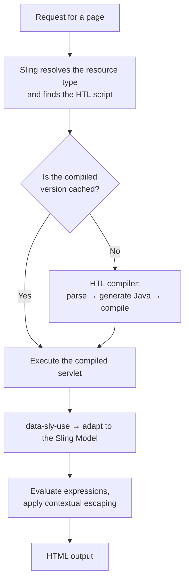
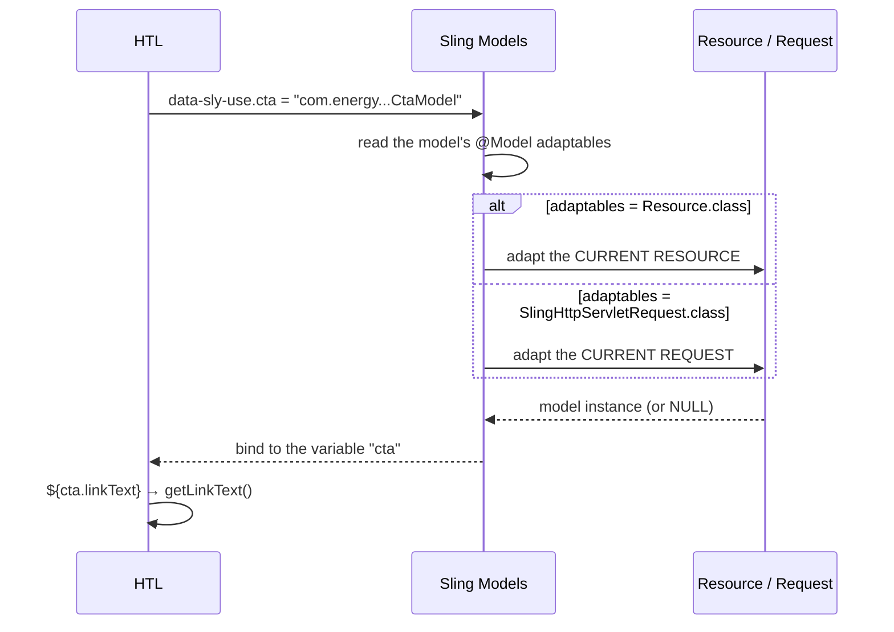
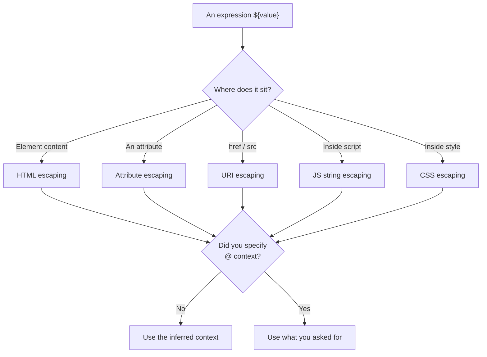

# 08 – HTL (Sightly)

> **Target:** 3–4 years experienced AEM Developer
> **Syllabus points covered (17, 18):**
> *Point 17 — "How will a model be called in HTL?"*
> *Point 18 — "Sightly tags and their uses."*
> **Project domain:** a global energy technology company's marketing site.

---

## Before we start — a note on the name

Your syllabus says **"sightly tags."** That is worth a moment, because it tells you something useful.

**Sightly was the original name.** Adobe introduced it in AEM 6.0 as the replacement for JSP. In **AEM 6.3 it was renamed to HTL** — HTML Template Language — when Adobe donated it to Apache Sling as an open specification.

They are the same thing. But a lot of people in the industry still say Sightly, and interviewers who learned AEM before 6.3 often do.

**How to handle it if an interviewer says "Sightly":** just answer normally and use "HTL" naturally in your response. Something like *"Sightly — or HTL as it's called since 6.3 — is..."* That signals you know both names and roughly when the change happened, without correcting them. Correcting an interviewer on terminology is never worth the point.

---

## The one idea that makes this whole topic click

Most people describe HTL as a limited templating language, as though the limits are an unfortunate compromise.

**That is backwards. The restrictions are the entire design.**

HTL deliberately **cannot** express arbitrary logic. You cannot write a loop with a counter, call a static method, or perform a calculation. And that is not because Adobe ran out of time — it is the point.

Here is what JSP allowed:

```jsp
<%
    // This is real, valid JSP. People wrote this.
    String title = currentNode.getProperty("jcr:title").getString();
    if (title.length() > 50) {
        title = title.substring(0, 50) + "...";
    }
    ResourceResolver resolver = resource.getResourceResolver();
    // ... twenty more lines of business logic ...
%>
<h2><%= title %></h2>
```

Business logic in the view. Untestable, unreviewable, and impossible for a front-end developer to touch safely. And note there is no escaping on that output — a classic XSS hole.

HTL makes that **impossible**. There is no syntax for it. So the logic has to move into a Sling Model, where it can be unit tested — which is exactly what file 05 was about.

**Say this in an interview and it lands:**

> "The thing I'd emphasise about HTL is that its restrictions are the feature, not a limitation. It deliberately can't express arbitrary logic, which forces business logic out of the template and into a Sling Model where it's testable and reviewable. JSP allowed scriptlets, and that's how you end up with business rules hidden in a view nobody can test. HTL also escapes output automatically based on context, so XSS becomes something you have to actively opt out of rather than something you have to remember to prevent."

That answer covers security, testability and maintainability in three sentences, and it frames you as someone who understands *why* rather than *what*.

---

## 1. Introduction

### 1.1 What is HTL?

> **HTL is AEM's server-side templating language. An HTL file is a valid HTML file with special `data-sly-*` attributes that AEM processes when rendering.**

Three properties that follow from that:

**It is valid HTML.** You can open an HTL file in a browser and it renders — not with real data, but the structure is visible. `data-sly-*` are just data attributes, which browsers ignore. That means a front-end developer can work with the file directly.

**It is compiled.** AEM compiles HTL into a Java servlet at runtime, then caches it. So HTL is not interpreted per request — the performance is closer to Java than to a scripting language.

**It is server-side only.** Everything happens on AEM before the HTML reaches the browser.

### 1.2 Why HTL replaced JSP

Four reasons, and giving several is what makes a good answer:

**Security.** HTL escapes output automatically, and — crucially — it picks the escaping based on **where the value appears**. A value in element content is HTML-escaped; the same value in an `href` is URI-escaped. In JSP you had to call the XSS API manually every single time, and one forgotten call was a vulnerability.

**Separation of concerns.** HTL cannot express business logic, so logic has to live in a Sling Model.

**Front-end friendliness.** A valid HTML file that opens in a browser. A front-end developer can work with it without understanding Java.

**Fewer ways to be wrong.** Less expressive means fewer mistakes possible.

### 1.3 A real project example to adapt

> "All our components use HTL — we have no JSP left. The pattern is consistent: `data-sly-use` binds a Sling Model, the HTL guards its outer element with `data-sly-test` so an unconfigured component renders nothing rather than an empty div, and all the logic lives in the model. We use `<sly>` wherever we need an HTL construct without an element in the output, so the markup stays clean for the front-end team. The only place we use `context='unsafe'` is emitting JSON-LD structured data, and that's justified because the JSON is produced by a serialiser rather than concatenated by hand."

That covers the pattern, the empty-state discipline, markup cleanliness, and the one security exception with its justification.

---

## 2. Core Concepts

### 2.1 How you call a Sling Model from HTL *(syllabus point 17)*

Your syllabus asks this directly. The answer is `data-sly-use`.

```html
<div data-sly-use.cta="com.energy.core.models.CtaModel">
    ${cta.linkText}
</div>
```

**Breaking it down piece by piece:**

**`data-sly-use`** is the block element that instantiates something.

**`.cta`** is the **variable name you choose**. It could be `.model`, `.banner`, anything. This trips people up — the part after the dot is not fixed, it is your identifier for the rest of the template.

**The value is the fully qualified class name.**

**`${cta.linkText}`** then calls the getter. And this follows the **JavaBeans convention**, which is the detail worth stating:

| In HTL | Calls in Java |
|---|---|
| `${cta.linkText}` | `getLinkText()` |
| `${cta.ready}` | `isReady()` — or `getReady()` |
| `${cta.faqs}` | `getFaqs()` |

**That is why file 05 insisted on getters.** A public field will not work — HTL looks for a getter.

**Now, what is the model actually adapted from?**

`data-sly-use` adapts the **current resource** — or the **current request**, if the model declares `SlingHttpServletRequest.class` in its `adaptables`. HTL works this out from the model's declaration; you do not tell it.

**That connects back to file 05's adaptables question.** If your model is `Resource`-adaptable, HTL adapts the resource the component is rendering. If it is request-adaptable, HTL adapts the request. Either way the same `data-sly-use` syntax works — which is why you can change a model's adaptables without touching the HTL.

**Passing parameters into a model:**

```html
<sly data-sly-use.listing="${'com.energy.core.models.CategoryListingModel'
                            @ rootPath='/content/energy/products', maxItems=12}"/>
```

Those arrive as injectable values in the model — a `@ValueMapValue` or `@RequestAttribute` named `rootPath` can pick it up. Useful when the same model needs different inputs in different places.

**Two other things `data-sly-use` can load**, worth knowing because interviewers ask what else it does:

```html
<!-- Another HTL file, for its templates -->
<sly data-sly-use.lib="/apps/energy/components/templates.html"/>

<!-- A JavaScript Use-object (the JS Use-API) -->
<sly data-sly-use.logic="logic.js"/>
```

The JS Use-API exists but is rare in modern projects — server-side JavaScript in AEM is generally discouraged in favour of Sling Models, and saying so shows current awareness.

**The interview answer for point 17:**

> "`data-sly-use`, with the fully qualified class name. So `data-sly-use.cta="com.energy.core.models.CtaModel"` — where `cta` is a variable name I choose, not a keyword.
>
> Then I call getters through the expression syntax: `${cta.linkText}` calls `getLinkText()`, and `${cta.ready}` calls `isReady()`. It follows the JavaBeans convention, which is why a Sling Model needs getters rather than public fields.
>
> HTL adapts either the current resource or the current request depending on what the model declares in its `adaptables` — I don't specify that in the HTL, which is why I can change a model from resource-adaptable to request-adaptable without touching the template.
>
> I can also pass parameters with the `@` syntax if the same model needs different inputs in different places. And `data-sly-use` can load two other things: another HTL file, usually to reuse its `data-sly-template` blocks, or a JavaScript Use-object — though the JS Use-API is rare now, since Sling Models are the standard."

### 2.2 The `<sly>` element — the one you'll use constantly

Before the full list of block elements, this one deserves its own section because it appears everywhere.

**The problem it solves.** Every `data-sly-*` attribute has to sit on an element. But often you want the HTL behaviour without an element in the output.

```html
<!-- Produces a pointless wrapper div -->
<div data-sly-use.cta="com.energy.core.models.CtaModel">
    <a href="${cta.linkUrl}">${cta.linkText}</a>
</div>
```

That div exists purely to hold the attribute, and it will interfere with your CSS.

**`<sly>` is a synthetic element that never appears in the output.**

```html
<sly data-sly-use.cta="com.energy.core.models.CtaModel"/>
<a href="${cta.linkUrl}">${cta.linkText}</a>
```

Same behaviour, no wrapper.

**`<sly>` is the modern approach.** The older way was `data-sly-unwrap`, which you will still see:

```html
<div data-sly-unwrap data-sly-use.cta="...">   <!-- old style -->
```

Both work; `<sly>` is cleaner and current.

**One caution:** a `<sly>` with `data-sly-use` still scopes its variable to the rest of the template, so a self-closing `<sly/>` followed by usage works fine — which is the pattern above.

### 2.3 Every block element and what it's for *(syllabus point 18)*

Your syllabus asks for "sightly tags and their uses." Here they are, grouped by purpose.

#### Group 1 — Getting data

| Block element | Purpose |
|---|---|
| `data-sly-use` | Instantiate a Sling Model, another HTL file, or a JS object |
| `data-sly-set` | Define a variable for reuse |

#### Group 2 — Controlling output

| Block element | Purpose |
|---|---|
| `data-sly-test` | Render this element only if the expression is truthy |
| `data-sly-list` | Repeat the element's **children** |
| `data-sly-repeat` | Repeat the **element itself** |
| `data-sly-unwrap` | Remove the element, keep its content |

#### Group 3 — Including other things

| Block element | Purpose |
|---|---|
| `data-sly-resource` | Include another **resource** |
| `data-sly-include` | Include another **script** in the same resource context |
| `data-sly-template` | Define a reusable markup block |
| `data-sly-call` | Call one of those blocks |

#### Group 4 — Modifying the element

| Block element | Purpose |
|---|---|
| `data-sly-element` | Set the element's tag name dynamically |
| `data-sly-attribute` | Set attributes dynamically |
| `data-sly-text` | Replace the element's content |

**That is eleven, plus `<sly>`.** Now each one properly.

### 2.4 `data-sly-test` — conditional rendering

```html
<div class="cmp-cta" data-sly-test="${cta.ready}">
    <a href="${cta.linkUrl}">${cta.linkText}</a>
</div>
```

**If the expression is falsy, the element and everything inside it is removed.** Not hidden — not rendered at all.

**What counts as falsy in HTL:**

| Falsy | Truthy |
|---|---|
| `null` | Any non-empty string |
| Empty string `""` | Any non-zero number |
| `false` | `true` |
| `0` | A non-empty collection |
| An empty collection | Any other object |

**Storing the result for reuse** — this is the feature people forget:

```html
<div data-sly-test.hasImage="${cta.image}">
    
</div>

<div data-sly-test="${!hasImage}">
    <!-- fallback when there's no image -->
</div>
```

`data-sly-test.hasImage` both tests **and** stores the result in a variable, which you can then negate. That is HTL's version of if/else, and it is worth knowing because HTL has no `else`.

**Why you should always guard the outer element** — the discipline from file 02:

```html
<!-- BAD: an unconfigured component renders an empty div,
     which breaks flex and grid layouts and confuses authors -->
<div class="cmp-cta">
    <a href="${cta.linkUrl}">${cta.linkText}</a>
</div>

<!-- GOOD: renders nothing at all when unconfigured -->
<div class="cmp-cta" data-sly-test="${cta.ready}">
    <a href="${cta.linkUrl}">${cta.linkText}</a>
</div>
```

And notice `${cta.ready}` is a **single flag from the model** rather than five separate checks in the template. That is the right split: the model decides whether it has enough to render; the template just asks.

### 2.5 `data-sly-list` and `data-sly-repeat` — iteration

**The difference is what gets repeated.**

**`data-sly-list` repeats the element's children:**

```html
<ul data-sly-list.faq="${model.faqs}">
    <li>${faq.question}</li>
</ul>
```

Output: **one** `<ul>` containing several `<li>`.

**`data-sly-repeat` repeats the element itself:**

```html
<li data-sly-repeat.faq="${model.faqs}">${faq.question}</li>
```

Output: several `<li>` and no wrapper.

**The rule:** use `data-sly-list` when you want the container rendered once; use `data-sly-repeat` when the repeated thing *is* the element.

**The loop variables** — these come up in interviews:

```html
<ul data-sly-list.item="${model.cards}">
    <li class="${itemList.first ? 'is-first' : ''}
               ${itemList.odd ? 'is-odd' : ''}">
        ${itemList.count}. ${item.title}
    </li>
</ul>
```

For a loop variable named `item`, HTL automatically provides **`itemList`** with:

| Property | Meaning |
|---|---|
| `itemList.index` | 0-based position |
| `itemList.count` | 1-based position |
| `itemList.first` | Is this the first? |
| `itemList.last` | Is this the last? |
| `itemList.middle` | Neither first nor last |
| `itemList.odd` | Is `count` odd? |
| `itemList.even` | Is `count` even? |

**The naming rule:** the list object is your variable name plus `List`. Name it `.card` and you get `cardList`. If you omit the name entirely, the defaults are `item` and `itemList`.

**A performance point that connects to file 05:** everything inside a loop runs once per iteration. A getter called inside `data-sly-list` over fifty items is called fifty times. That is exactly why expensive work belongs in `@PostConstruct`.

### 2.6 `data-sly-resource` versus `data-sly-include`

These look similar and are genuinely different. This is a common interview question.

**`data-sly-resource` includes a resource** — it changes what content is being rendered, and Sling resolves the script for that resource type.

```html
<div data-sly-resource="${'header' @ resourceType='energy/components/header'}"></div>
```

**`data-sly-include` includes a script** — the resource stays the same, only the script changes.

```html
<div data-sly-include="partials/specs-table.html"></div>
```

**The distinction:**

> **`data-sly-resource` changes the resource. `data-sly-include` changes the script.**

**When to use each:** `data-sly-resource` for rendering a child component or another piece of content — that is what you use most of the time. `data-sly-include` for splitting one component's own markup across several files, where the resource context should not change.

**`data-sly-resource` options**, several of which you have already met:

```html
<!-- Force a resource type -->
<sly data-sly-resource="${'child' @ resourceType='energy/components/cta'}"/>

<!-- No wrapper div -- the decoration control from file 02 -->
<sly data-sly-resource="${'child' @ decoration=false}"/>

<!-- Change the wrapper element, e.g. inside a <ul> -->
<sly data-sly-resource="${item.path @ decorationTagName='li'}"/>

<!-- Add a selector to the included render -->
<sly data-sly-resource="${resource.path @ addSelectors='teaser'}"/>
```

`decoration` and `decorationTagName` are the extra-divs answer from file 02, and being able to place them here shows the files connect.

### 2.7 `data-sly-template` and `data-sly-call` — reusable markup

This is HTL's version of a function, and it is how the clientlib helper from file 04 works.

**Define a template:**

```html
<template data-sly-template.card="${@ card}">
    <article class="card">
        <h3>${card.title}</h3>
        <p>${card.description}</p>
    </article>
</template>
```

**Call it:**

```html
<sly data-sly-call="${card @ card=product}"/>
```

**Templates from another file** — the important pattern:

```html
<sly data-sly-use.lib="/apps/energy/components/templates.html"/>
<sly data-sly-call="${lib.card @ card=product}"/>
```

**And now file 04 makes more sense.** This is exactly the clientlib mechanism:

```html
<sly data-sly-use.clientlib="core/wcm/components/commons/v1/templates/clientlib.html"/>
<sly data-sly-call="${clientlib.css @ categories='energy.product'}"/>
```

`clientlib.html` is a file full of `data-sly-template` blocks named `css`, `js` and `all`. You load the file with `data-sly-use` and call a template from it. Being able to explain that connection is a good moment in an interview.

**Why templates matter practically:** they are how you avoid duplicating markup between a server-rendered first batch and an AJAX-loaded second batch — the exact problem in file 02's Load More story.

### 2.8 `data-sly-element`, `data-sly-attribute`, `data-sly-text`

**`data-sly-element` sets the tag name dynamically:**

```html
<sly data-sly-element="${model.headingLevel}">${model.text}</sly>
```

If `headingLevel` is `"h2"`, that renders `<h2>...</h2>`.

**Why this matters:** heading levels should fit the page's document outline for accessibility, so authors need to choose. Without `data-sly-element` you would need a chain of tests for h1 through h6.

**A security note:** HTL restricts this to a whitelist of safe elements. You cannot inject `<script>` through it, which is deliberate.

**`data-sly-attribute` sets attributes dynamically:**

```html
<a data-sly-attribute.href="${model.linkUrl}"
   data-sly-attribute.target="${model.target}">${model.linkText}</a>
```

**And here is the behaviour that connects to file 05:** if the value is null or empty, **the attribute is removed entirely** rather than rendered empty.

That is why file 05's `CtaModel` returned `null` from `getTarget()`:

```java
public String getTarget() {
    return openInNewTab ? "_blank" : null;   // null → attribute omitted
}
```

You get `<a href="...">` rather than `<a href="..." target="">`. Cleaner and valid.

**You can also set a whole map of attributes:**

```html
<div data-sly-attribute="${model.dataAttributes}"></div>
```

**`data-sly-text` replaces the element's content:**

```html
<p data-sly-text="${model.description}">
    This placeholder text is replaced at render time.
</p>
```

**Why it exists:** the placeholder stays visible when a front-end developer opens the file directly in a browser, but is replaced when AEM renders. That is the front-end-friendliness point in practice.

### 2.9 `data-sly-set` and `data-sly-unwrap`

**`data-sly-set` defines a variable:**

```html
<sly data-sly-set.heading="${model.heading || 'Related Products'}"/>
<h2>${heading}</h2>
```

Useful for a value used several times, so an expensive getter is called once.

**`data-sly-unwrap` removes the element but keeps the content:**

```html
<div data-sly-unwrap data-sly-test="${model.ready}">
    <p>Content stays, the div goes.</p>
</div>
```

Largely superseded by `<sly>`, but common in older code.

### 2.10 The expression language

**Basic access:**

```html
${model.title}
${properties.description}
${currentPage.title}
```

**Property names containing a colon need bracket notation** — this is a genuinely common trip-up:

```html
${properties.jcr:title}         <!-- BROKEN -- the colon isn't valid syntax -->
${properties['jcr:title']}      <!-- Correct -->
```

**Operators:**

```html
${a && b}          <!-- and -->
${a || b}          <!-- or -->
${!a}              <!-- not -->
${a == b}          <!-- comparison -->
${a > b}
${condition ? 'yes' : 'no'}     <!-- ternary -->
```

**What is deliberately absent:** no arithmetic, no method calls with arguments, no string manipulation, no variable assignment beyond `data-sly-set`. If you need any of those, they belong in the model. **That absence is the design.**

**String formatting** — the correct way to build a string:

```html
${'Page {0} of {1}' @ format=[currentPage, totalPages]}
```

**Joining an array:**

```html
${model.tags @ join=', '}
```

**Internationalisation:**

```html
${'Read more' @ i18n}
${'Read more' @ i18n, locale=currentPage.language}
${'Downloads' @ i18n, hint='Label on the product page tab'}
```

The `hint` gives translators context, which matters on a multi-country site where the same English word translates differently by context.

**Date and number formatting:**

```html
${model.publishDate @ format='dd MMMM yyyy'}
${model.price @ format='#,###.00'}
```

### 2.11 Display contexts — HTL's security model

**This is the most important security concept in HTL**, and it comes up in every security-conscious interview.

**HTL escapes every expression automatically.** But escaping is not one thing — the correct escaping depends on **where the value lands**.

```html
<p>${value}</p>                     <!-- HTML escaping -->
<a href="${value}">                 <!-- URI escaping -->
<div class="${value}">              <!-- attribute escaping -->
<script>var x = "${value}";</script> <!-- JavaScript string escaping -->
```

**HTL infers the context from position and applies the right one.** That is the fundamental improvement over JSP, where you had to call the XSS API with the correct method yourself, every time.

**You can override the context explicitly:**

```html
${model.richText @ context='html'}
```

**The contexts worth knowing:**

| Context | Use for | Notes |
|---|---|---|
| `text` | Element content | Default there |
| `html` | Rich text that should render as markup | Allows a safe subset of tags |
| `attribute` | Attribute values | Default there |
| `uri` | URLs in `href`, `src` | Blocks `javascript:` and similar |
| `scriptString` | Inside a JavaScript string literal | |
| `styleString` | Inside a CSS value | |
| `elementName` | A tag name | Whitelisted |
| `number` | Numeric output | |
| `unsafe` | **No escaping at all** | Dangerous — see below |

**The two you will actually use are `html` and `uri`.**

`context='html'` for rich-text fields, because the author's markup is meant to render:

```html
<div>${model.bodyText @ context='html'}</div>
```

Without it, the author sees literal `<p>` tags on the page — which is scenario 17 in file 02.

`context='uri'` for URLs, to block `javascript:` URLs:

```html
<a href="${model.linkUrl @ context='uri'}">
```

**And `context='unsafe'` — the one to be careful about.**

It disables escaping completely. The only place we use it is the JSON-LD structured data from file 02:

```html
<script type="application/ld+json">${model.structuredData @ context='unsafe'}</script>
```

**And the justification matters more than the usage:**

> "JSON-LD must not be HTML-escaped or search engines can't parse it, so `unsafe` is necessary there. It's safe **because the JSON was produced by Jackson**, which escapes its own values — not because the content is trusted. If I'd built that string by concatenating author input, `unsafe` would be a genuine XSS hole. That distinction is the whole argument: `unsafe` is acceptable when a serialiser produced the string, and never when I assembled it myself."

**Being able to state that reasoning is what separates knowing the option from understanding it.**

### 2.12 The global objects

HTL gives you a set of objects without any `data-sly-use`:

| Object | What it is |
|---|---|
| `properties` | ValueMap of the **current resource** |
| `pageProperties` | ValueMap of the current page's `jcr:content` |
| `inheritedPageProperties` | Page properties with inheritance up the tree |
| `currentPage` | The AEM `Page` being rendered |
| `resource` | The current `Resource` |
| `resourceResolver` | The current resolver |
| `currentStyle` | **The resolved policy** — from file 03 |
| `wcmmode` | `wcmmode.edit`, `wcmmode.preview`, `wcmmode.disabled` |
| `component` | The component definition |
| `request` / `response` | The Sling request and response |
| `pageManager` | Look up pages |

**`wcmmode` is the one worth calling out**, because it drives the authoring placeholder pattern used throughout this repository:

```html
<sly data-sly-test="${!model.ready && wcmmode.edit}"
     data-sly-resource="${'' @ resourceType='wcm/core/components/placeholder'}"/>
```

An unconfigured component renders **nothing on publish**, but shows a clickable placeholder to authors. Small touch, and authors genuinely notice.

**A caution on `properties` and `currentPage`:** they are convenient, and using them for anything beyond trivial display drags logic back into the template. If you find yourself writing conditionals over `properties`, that decision belongs in the model.

---

## 3. Internal Working

### 3.1 How HTL actually runs



**Two things worth taking from this:**

**HTL is compiled, not interpreted.** It becomes a Java servlet, which is then cached. So the performance is Java performance, not scripting-language performance.

**Which means HTL has compilation errors**, and they appear in `error.log` at first render — not at deploy time. A malformed expression will deploy successfully and fail the first time someone loads the page. That is worth knowing, because it explains why a broken template gets through a build.

### 3.2 How `data-sly-use` resolves a model



**The critical branch is in the middle.** HTL reads the model's `adaptables` and adapts accordingly. You never specify it in the template — which is why changing a model's adaptables requires no HTL change.

**And note the "or NULL".** If adaptation fails, `data-sly-use` binds nothing, and every `${cta.something}` renders empty. **No error, no exception, just a blank component.** That is why "my component renders nothing" is usually a Sling Model problem rather than an HTL problem, and why file 05's five-cause checklist is the thing to reach for.

**A quick diagnostic:** output the object itself.

```html
${cta}
```

An object reference means the model resolved and the problem is in a getter. Nothing at all means adaptation returned null.

### 3.3 How contextual escaping is chosen



**The key insight:** the default is inferred from position and is almost always correct. You only specify a context when you deliberately want something other than the safe default — rich text that should render as markup, or serialised JSON that must not be escaped.

**Which reframes the risk:** in JSP, forgetting to escape was a vulnerability. In HTL, you have to **actively override** the safe default to create one. That inversion is the security story.

---

## 4. Important Interview Questions

### 4.1 Basic

**Q1. What is HTL?**
AEM's server-side templating language. An HTL file is valid HTML with `data-sly-*` attributes, compiled by AEM into a Java servlet at runtime.

*Cross:* What was it called before? (Sightly, renamed in 6.3) · What did it replace? (JSP) · Is it interpreted or compiled? (compiled and cached)

**Q2. Why did HTL replace JSP?**
Automatic contextual escaping for security; it cannot express business logic, which forces logic into testable Java; it is valid HTML so front-end developers can work with it; and it is less expressive so there are fewer ways to be wrong.

*Cross:* What's a scriptlet and why is it bad? · How did JSP handle XSS? (manual XSS API calls) · Can you still use JSP? (yes, legacy)

**Q3. How do you call a Sling Model from HTL?**
`data-sly-use` with the fully qualified class name, then getters through `${...}`.

*Cross:* What's the part after the dot? (**your chosen variable name**) · How does `${cta.ready}` map to Java? (`isReady()`) · What is it adapted from? (resource or request, per the model's `adaptables`)

**Q4. What is `<sly>`?**
A synthetic element that never appears in the output — used when you need an HTL construct without an element in the markup.

*Cross:* What did people use before? (`data-sly-unwrap`) · Why does it matter? (no pointless wrapper divs) · Can it be self-closing? (yes)

**Q5. What does `data-sly-test` do?**
Renders the element and its content only if the expression is truthy; otherwise both are removed entirely.

*Cross:* What's falsy? (null, empty string, false, 0, empty collection) · Can you store the result? (yes — `data-sly-test.name`) · Does HTL have an `else`? (no — negate a stored test)

**Q6. Difference between `data-sly-list` and `data-sly-repeat`?**
`data-sly-list` repeats the element's children, so the container renders once. `data-sly-repeat` repeats the element itself, with no container.

*Cross:* Which for a `<ul>` with `<li>` items? (list on the `ul`) · What loop variables do you get? · What's the naming rule? (your variable name plus `List`)

**Q7. What are the loop variables?**
`itemList.index` (0-based), `.count` (1-based), `.first`, `.last`, `.middle`, `.odd`, `.even` — named after your loop variable plus `List`.

*Cross:* If you name it `.card`, what's the list object? (`cardList`) · What's the default? (`item` / `itemList`) · How would you style alternate rows? (`itemList.odd`)

**Q8. Difference between `data-sly-resource` and `data-sly-include`?**
`data-sly-resource` includes a **resource**, changing what content is rendered. `data-sly-include` includes a **script**, keeping the same resource context.

*Cross:* Which for a child component? (resource) · Which for splitting your own markup? (include) · What options does resource take? (`resourceType`, `decoration`, `decorationTagName`, `addSelectors`)

**Q9. What are `data-sly-template` and `data-sly-call`?**
`data-sly-template` defines a reusable markup block; `data-sly-call` invokes it. You can load templates from another file with `data-sly-use`.

*Cross:* Where have you seen this? (**the clientlib helper** from file 04) · How do you pass parameters? · Why is it useful? (one template for markup rendered two ways)

**Q10. What does `data-sly-attribute` do when the value is empty?**
It **removes the attribute entirely** rather than rendering it empty.

*Cross:* Why does that matter? (cleaner, valid markup) · How does a model use that? (**return null from the getter**) · Give an example (`target` on a link)

### 4.2 Intermediate

**Q11. What are display contexts and why do they matter?**
HTL escapes every expression, choosing the escaping based on where the value appears — HTML in element content, URI in an `href`, JavaScript inside a script block. That is what makes XSS something you have to opt out of rather than remember to prevent.

*Cross:* Name five contexts · Which do you actually use? (`html` and `uri`) · What's the default in an attribute? · What happens with the wrong context?

**Q12. When do you use `context='html'`?**
For rich-text fields, where the author's markup is meant to render. Without it, HTL escapes the tags and the visitor sees literal `<p>` on the page.

*Cross:* What's the risk? (the RTE must be configured to restrict what authors can insert) · What if it's plain text? (use the default) · How does the RTE relate? (its allowed plugins are set in the **policy** — file 03)

**Q13. What is `context='unsafe'` and when is it acceptable?**
It disables escaping completely. Acceptable when a serialiser produced the string — emitting JSON-LD built by Jackson, for example. Never acceptable for anything you concatenated yourself from author input.

*Cross:* Give a concrete example · Why is the serialiser the justification? · What would make it a vulnerability?

**Q14. My component renders nothing. Is that an HTL problem?**
Usually not. If `data-sly-use` fails to adapt the model, it binds nothing and every expression renders empty — with no error. So it is normally a Sling Model problem, and I would run file 05's checklist. A quick way to tell: output `${model}` — an object reference means it adapted and the problem is in a getter; nothing means adaptation returned null.

*Cross:* What are the five causes of a null model? · Where would you check first? (`/system/console/status-adapters`) · What if the model resolves but one value is empty?

**Q15. How do you access a property with a colon in its name?**
Bracket notation: `${properties['jcr:title']}`. The dot form breaks because a colon isn't valid in that syntax.

*Cross:* Why does it break? · Where else does this come up? (any `jcr:` or `cq:` property) · Better alternative? (expose it from the model with `@Named`)

**Q16. Can you do string concatenation or arithmetic in HTL?**
No, and deliberately not. Use `@ format` for building strings from parts. Anything computed belongs in the Sling Model.

*Cross:* What's the `format` syntax? · Why is the restriction a good thing? · Where does the logic go instead?

**Q17. What is `wcmmode` and what do you use it for?**
It tells you whether the page is in edit, preview or disabled mode. The main use is showing an authoring placeholder for an unconfigured component — visible to authors, absent on publish.

*Cross:* Show the placeholder pattern · Why not always render something? (visitors would see an empty box) · What else uses it? (edit-mode-only helper text)

**Q18. How does the clientlib helper actually work?**
It is a `data-sly-template` file. You load it with `data-sly-use` and call one of its templates — `css`, `js` or `all` — with `data-sly-call`, passing `categories`.

*Cross:* Where does it live? · What options does it support? (`async`, `defer`, `media`) · Where do the categories come from? (**the page policy** — files 03 and 04)

**Q19. How do you control the wrapper div AEM adds?**
`decoration=false` on a `data-sly-resource` include, `cq:noDecoration` on the component, or `decorationTagName` to change the element.

*Cross:* Why does AEM add it? (the editor needs something to attach to) · Which would you prefer? (`decorationTagName`, since removing it makes the component harder to select) · When must you change the tag? (inside a `<ul>`)

**Q20. What's the performance concern with HTL?**
Everything inside a loop runs per iteration, so a getter called inside `data-sly-list` over fifty items is called fifty times. The fix is not in HTL — it is doing the work once in the model's `@PostConstruct`.

*Cross:* Give a real example (file 05's 200-call getter) · How would you detect it? (a temporary log line, counting calls) · What about `data-sly-resource` in a loop? (each include has real cost — keep the list bounded)

### 4.3 Advanced

**Q21. How would you build a component whose markup is rendered both server-side and via AJAX?**

`data-sly-template`. Define the markup once as a template, call it from the main HTL for the server-rendered batch, and have the servlet include the same script for later batches.

That is exactly file 02's Load More problem — two separate templates for the same card drifted apart and the grid visibly broke at the batch boundary. One template is the fix.

*Cross:* Why not have the servlet return JSON? (then you need a second template in JavaScript) · How does the servlet render it? (`getRequestDispatcher` with `replaceSelectors`) · What if the markup differs slightly between batches? (a template parameter)

**Q22. How do you make a component accessible in HTL?**

Semantic elements rather than div soup. `data-sly-element` so the heading level is authorable and fits the document outline. `aria-*` attributes set through `data-sly-attribute` so they are omitted when empty rather than rendered blank. Real `<button>` and `<a>` elements rather than divs with click handlers. And an `aria-live` region for anything updated dynamically.

*Cross:* Why is heading level authorable? (it must fit the page outline, which the component can't know) · Why does the attribute-removal behaviour matter? (`aria-controls=""` is invalid) · How do you test? (axe, keyboard-only)

**Q23. When would you use the JavaScript Use-API?**

Rarely, and I would push back. It exists for server-side JavaScript logic, but Sling Models are the standard — they are testable with normal Java tooling, they work with the Model Exporter for headless, and they keep one language on the server. I would only consider it in a codebase already committed to it.

*Cross:* Is it deprecated? (not formally, but it isn't the recommended approach) · What can't it do? (no Model Exporter, harder to unit test) · Have you seen it? (usually in older projects)

**Q24. How do you handle internationalisation in HTL?**

`@ i18n` on any literal string, with the dictionaries stored in the repository. `locale` to force a specific one, and `hint` to give translators context — which genuinely matters on a multi-country site, because the same English word can translate differently depending on where it appears.

*Cross:* Where do dictionaries live? · How does this differ from translating **content**? (i18n is for UI labels; content translation is MSM and the translation workflow — file 12) · What if a key is missing? (the key itself is rendered)

**Q25. What are the limits of HTL, and when do they become a problem?**

No arithmetic, no method calls with arguments, no string manipulation. In practice that is almost never a problem, because anything you would want those for belongs in the model. Where it does bite is quick fixes — you cannot patch something in the template, you have to change Java and redeploy. But that friction is the point: it keeps logic where it can be tested.

*Cross:* Give something you genuinely couldn't do · How did you solve it? (expose it from the model) · Would you want HTL to be more powerful? (no — that's how JSP became unmaintainable)

**Q26. How do you debug an HTL problem?**

First split it: is the data missing, or is the rendering wrong? Output `${model}` — an object reference means adaptation worked and the problem is downstream; nothing means the model returned null and it is a Sling Model problem. HTL compilation errors surface in `error.log` at first render, not at deploy time, which catches people out. And the Developer layer in the page editor shows which script actually rendered each component, which resolves "is my HTL even being used."

*Cross:* Why do compilation errors appear late? (compiled on first render) · What if the escaping looks wrong? (check the context) · How would you find which script rendered a component?

---

## 5. Cross Questions — how this topic gets drilled

**Thread A — from "how do you call a model" (your syllabus thread)**
Which attribute? → What's the part after the dot? → How does `${cta.ready}` map to Java? → Why does the model need getters? → What is it adapted from? → How does HTL know? → What if adaptation fails? → How would you tell?

**Thread B — from "what sightly tags do you know"**
Name them → What's the difference between list and repeat? → Between resource and include? → What is `<sly>` for? → What did people use before? → What does `data-sly-attribute` do with an empty value? → How does a model exploit that?

**Thread C — from "how does HTL prevent XSS"**
What's automatic escaping? → How does it choose? → Name the contexts → When do you use `html`? → What's `unsafe`? → When is that acceptable? → Why is a serialiser the justification? → How did JSP handle this?

**Thread D — from "why did HTL replace JSP"**
What's a scriptlet? → Why is logic in the view bad? → Where does logic go instead? → Can HTL do arithmetic? → Is that a limitation? → What if you need a calculation? → Has that ever blocked you?

---

## 6. Best Interview Answers

### 6.1 "How do you call a Sling Model in HTL?" — about 60 seconds

**Your syllabus point 17, word for word.**

> "`data-sly-use` with the fully qualified class name. So `data-sly-use.cta="com.energy.core.models.CtaModel"` — and the `cta` after the dot is a variable name I choose, not a keyword, which is something people assume is fixed.
>
> Then I call getters through the expression syntax. `${cta.linkText}` calls `getLinkText()`, and `${cta.ready}` calls `isReady()`. It follows the JavaBeans convention, which is exactly why a Sling Model needs getters rather than public fields — HTL can't reach a field.
>
> What the model gets adapted from depends on its own `adaptables` declaration — the current resource if it declares `Resource.class`, the current request if it declares `SlingHttpServletRequest.class`. I don't specify that in the HTL, which is useful because I can change a model's adaptables without touching any template.
>
> I usually put the `data-sly-use` on a `<sly>` element so it doesn't produce a wrapper div, then use the variable in the real markup below.
>
> One thing worth knowing for debugging: if adaptation fails, `data-sly-use` binds nothing and every expression renders empty — no error at all. So 'my component renders nothing' is usually a Sling Model problem rather than an HTL one, and outputting `${cta}` on its own tells you which: an object reference means it adapted, nothing means it returned null."

### 6.2 "What Sightly tags do you know?" — about 2 minutes

**Your syllabus point 18. Group them rather than listing.**

> "I'd group them by what they do.
>
> **Getting data:** `data-sly-use` to instantiate a Sling Model or load another HTL file, and `data-sly-set` to define a variable.
>
> **Controlling output:** `data-sly-test` for conditional rendering — it removes the element and its content entirely if the expression is falsy, and it can store the result in a variable, which is how you get an else branch since HTL doesn't have one. Then `data-sly-list` and `data-sly-repeat` for iteration — list repeats the element's children so the container renders once, repeat repeats the element itself. Both give you loop variables like `itemList.first`, `.count` and `.odd`.
>
> **Including things:** `data-sly-resource` includes another resource, so the resource context changes and Sling resolves the script for that resource type. `data-sly-include` includes another script but keeps the same resource. And `data-sly-template` with `data-sly-call` for reusable markup blocks — that's actually how the clientlib helper works, it's a file of templates you load and call.
>
> **Modifying the element:** `data-sly-element` to set the tag name dynamically, which we use so authors can choose a heading level that fits the page outline; `data-sly-attribute` for attributes, which removes the attribute entirely when the value is empty rather than rendering it blank; and `data-sly-text` to replace content.
>
> Plus `<sly>`, which isn't a data attribute but is used constantly — a synthetic element that never appears in the output, so you can use an HTL construct without adding a wrapper div. The older equivalent was `data-sly-unwrap`."

### 6.3 "How does HTL prevent XSS?" — about 90 seconds

> "HTL escapes every expression automatically, and — this is the important part — it chooses the escaping based on **where the value appears**. Escaping isn't one thing: a value in element content needs HTML escaping, the same value in an `href` needs URI escaping, and inside a script block it needs JavaScript string escaping. HTL infers which from position.
>
> That's the fundamental improvement over JSP. In JSP you called the XSS API manually with the right method every single time, and one forgotten call was a vulnerability. In HTL, the safe thing is the default and you have to actively opt out to create a hole.
>
> I can override the context explicitly when I need to. The two I actually use are `context='html'` for rich-text fields, where the author's markup is meant to render — without it, visitors see literal `<p>` tags on the page. And `context='uri'` for URLs, which blocks things like `javascript:` links.
>
> There's also `context='unsafe'`, which disables escaping completely. The only place we use it is emitting JSON-LD structured data, because JSON-LD mustn't be HTML-escaped or search engines can't parse it. And the justification matters: it's safe **because Jackson produced that string** and escapes its own values — not because the content is trusted. If I'd concatenated that JSON by hand from author input, `unsafe` would be a real XSS hole. That distinction is the whole thing — a serialiser produced it, so it's fine; I assembled it, so it isn't."

---

## 7. Real Project Examples

### Story 1 — Rich text rendering as literal tags

**What happened.** After a release, FAQ answers on product pages displayed literal `<p>` and `<strong>` tags rather than formatted text. Authors reported it immediately and it looked like a content problem.

**The cause.** The HTL rendered the rich-text field with HTL's default escaping:

```html
<div class="cmp-faq__answer">${item.answer}</div>
```

The default in element content is HTML escaping — which is correct almost everywhere and exactly wrong here, because the value is authored rich text that is *meant* to be markup.

**The fix.** One option:

```html
<div class="cmp-faq__answer">${item.answer @ context='html'}</div>
```

**The part worth explaining in an interview.** `context='html'` is not "turn off escaping" — it allows a **safe subset** of HTML while still stripping dangerous constructs like `<script>`. So it is genuinely safer than it sounds. And what an author can insert in the first place is constrained by the rich text editor's allowed plugins, which are set in the component's **policy** — so the actual protection is layered across file 03 and file 08.

**The mirror-image bug** we found while fixing it: a plain-text field somewhere else had been given `context='html'` by a developer who had hit this problem before and applied the fix by reflex. That one *was* a risk, because the field allowed arbitrary text with no RTE restrictions.

**The lesson:** the fix is per-field and depends on whether the field genuinely contains markup. Applying it by habit is how you create the vulnerability you were trying to avoid.

### Story 2 — The Load More that broke at the batch boundary

**What happened.** On the product listing, the first twelve cards rendered correctly, but cards loaded by the Load More button had slightly different spacing and a missing icon. The break was visible exactly at the batch boundary.

**The cause.** Two templates for the same card. The server-rendered first batch used the component's HTL. The AJAX batches were built by JavaScript from a JSON response. Someone changed the HTL for a design tweak and the JavaScript version was never updated — and there was nothing to make that connection visible.

**The fix.** One template, called from both paths. The card markup became a `data-sly-template`:

```html
<template data-sly-template.card="${@ card}">
    <article class="cmp-card">...</article>
</template>
```

The main HTL calls it in a loop for the first batch. The servlet then includes the same script for later batches, returning a rendered HTML fragment rather than JSON.

**Why this is the right fix rather than a workaround.** As long as two templates exist, they *will* drift — not because anyone is careless, but because nothing connects them. Removing the second template removes the possibility.

**The trade-off worth acknowledging:** returning HTML rather than JSON makes the endpoint less reusable for a non-web client. We accepted that because this endpoint exists only for this page's Load More. If a mobile app needed the same data, that would be a separate JSON endpoint — which is a Sling Model Exporter job, not this one.

### Story 3 — The getter called two hundred times

*(This is file 05's story, and it belongs here too, because the cause was visible in the HTL.)*

**What happened.** A listing page became noticeably slow.

**The cause.** The model built its card list inside `getCards()` rather than in `@PostConstruct`. The HTL called `${listing.cards}` three times — once in `data-sly-list`, once for a count, and once in a `data-sly-test` guard — and the list itself had twenty items with a nested loop.

**Why the HTL is worth looking at.** Reading the model alone, `getCards()` looks fine. Reading the HTL, you can see it is called three times per render and once per iteration of a nested loop. **The multiplication is only visible in the template.**

**The fix** was in the model — `@PostConstruct` — but the diagnosis came from the HTL.

**The habit worth describing:** *"When something's slow, I read the HTL to count how many times each getter is actually reached. The model looks innocent on its own; the template is where the multiplication is visible."*

---

## 8. Coding Examples

### 8.1 The simple CTA — every element explained

```html
<!--/* Load the model. On <sly> so there's no wrapper div. */-->
<sly data-sly-use.cta="com.energy.core.models.CtaModel"/>

<!--/* Guard the outer element: an unconfigured component renders
       NOTHING rather than an empty <a> that breaks the layout.
       The model exposes ONE flag rather than the template checking
       several fields -- that decision belongs in Java. */-->
<a data-sly-test="${cta.ready}"
   class="cmp-cta cmp-cta--${cta.style}"

   <!--/* context='uri' blocks javascript: URLs. Not the default
          in an href, so it has to be explicit. */-->
   href="${cta.linkUrl @ context='uri'}"

   <!--/* The model returns NULL for these when not applicable,
          and data-sly-attribute omits the attribute entirely
          rather than rendering target="" -- valid markup for free. */-->
   data-sly-attribute.target="${cta.target}"
   data-sly-attribute.rel="${cta.rel}">

    <span class="cmp-cta__text">${cta.linkText}</span>

    <!--/* Decorative icon: aria-hidden so a screen reader doesn't
           announce "right arrow" after every single link. */-->
    <span class="cmp-cta__icon" aria-hidden="true"
          data-sly-test="${cta.style == 'arrow'}">&rarr;</span>
</a>

<!--/* Authoring placeholder: visible to authors in edit mode only,
       so they get something clickable instead of nothing at all.
       Renders nothing on publish. */-->
<sly data-sly-test="${!cta.ready && wcmmode.edit}"
     data-sly-resource="${'' @ resourceType='wcm/core/components/placeholder'}"/>
```

**Note the comment syntax:** `<!--/* ... */-->` is an **HTL comment** and is stripped from the output. A plain `<!-- ... -->` HTML comment is sent to the browser. Using the wrong one leaks your internal notes to every visitor — a small thing that occasionally shows up in a security review.

### 8.2 The FAQ accordion — lists, loop variables, contexts and ARIA

```html
<sly data-sly-use.faq="com.energy.core.models.FaqModel"/>

<section class="cmp-faq" data-sly-test="${faq.ready}">

    <!--/* data-sly-element sets the tag name from the dialog, so the
           heading level fits the page's document outline. Without it
           we'd need a chain of tests for h2 through h6. HTL restricts
           this to a whitelist, so you can't inject <script>. */-->
    <sly data-sly-element="${faq.headingLevel}" data-sly-test="${faq.heading}">
        <span class="cmp-faq__heading">${faq.heading}</span>
    </sly>

    <!--/* data-sly-list repeats the CHILDREN, so we get one <dl>
           containing many <dt>/<dd> pairs. data-sly-repeat would
           give us many <dl> elements instead. */-->
    <dl class="cmp-faq__list">
        <sly data-sly-list.item="${faq.faqs}">

            <dt class="cmp-faq__question">
                <!--/* A real <button>, not a div with a click handler --
                       keyboard focus and activation come for free. */-->
                <button class="cmp-faq__button"
                        type="button"
                        id="${item.buttonId}"
                        aria-expanded="false"
                        aria-controls="${item.panelId}">
                    <span>${item.question}</span>

                    <!--/* itemList is named after the loop variable
                           plus "List". Used here to open the first
                           panel by default. */-->
                    <span class="cmp-faq__indicator"
                          aria-hidden="true"
                          data-sly-attribute.data-first="${itemList.first}"></span>
                </button>
            </dt>

            <dd class="cmp-faq__answer"
                id="${item.panelId}"
                role="region"
                aria-labelledby="${item.buttonId}"
                hidden>
                <!--/* context='html' because this IS authored rich text
                       and is meant to render as markup. It still strips
                       dangerous constructs -- it allows a safe subset,
                       it doesn't disable escaping. */-->
                ${item.answer @ context='html'}
            </dd>

        </sly>
    </dl>
</section>

<!--/* JSON-LD for search engines. context='unsafe' is REQUIRED here,
       because JSON-LD must not be HTML-escaped or crawlers can't parse
       it. It is SAFE only because the model built this string with
       Jackson, which escapes its own values. Hand-concatenated JSON
       here would be a genuine XSS hole. */-->
<script type="application/ld+json"
        data-sly-test="${faq.structuredData}">${faq.structuredData @ context='unsafe'}</script>

<sly data-sly-test="${!faq.ready && wcmmode.edit}"
     data-sly-resource="${'' @ resourceType='wcm/core/components/placeholder'}"/>
```

### 8.3 Templates — one markup definition, two render paths

**The template file** — `/apps/energy/components/templates/card.html`:

```html
<!--/* A reusable markup block. The ${@ card, showBadge} syntax
       declares the parameters it accepts. */-->
<template data-sly-template.productCard="${@ card, showBadge}">
    <article class="cmp-card">
        <a class="cmp-card__link" href="${card.url @ context='uri'}">

            

            <h3 class="cmp-card__title">${card.title}</h3>
            <p class="cmp-card__description">${card.description}</p>

            <span class="cmp-card__badge"
                  data-sly-test="${showBadge && card.isNew}">
                ${'New' @ i18n}
            </span>
        </a>
    </article>
</template>
```

**Used by the component for the first batch:**

```html
<sly data-sly-use.listing="com.energy.core.models.CategoryListingModel"/>
<sly data-sly-use.cards="/apps/energy/components/templates/card.html"/>

<div class="cmp-listing" data-sly-test="${listing.ready}"
     data-load-more-url="${listing.loadMoreUrl @ context='uri'}">

    <div class="cmp-listing__grid" data-listing-grid>
        <sly data-sly-list.card="${listing.cards}">
            <sly data-sly-call="${cards.productCard @ card=card, showBadge=true}"/>
        </sly>
    </div>

    <button class="cmp-listing__more" type="button"
            data-sly-test="${listing.hasMore}" data-load-more>
        ${'Load more' @ i18n}
    </button>

    <!--/* Announces new results to screen readers when the grid updates.
           Without this, a screen reader user gets no feedback at all. */-->
    <div class="sr-only" role="status" aria-live="polite" data-listing-status></div>
</div>
```

**And the same template for the AJAX batches** — `cardsfragment.html`, which the servlet from file 07 includes:

```html
<sly data-sly-use.listing="com.energy.core.models.CategoryListingModel"/>
<sly data-sly-use.cards="/apps/energy/components/templates/card.html"/>

<!--/* SAME template as the first batch. That is the whole point --
       two separate templates drifted apart and the grid visibly
       broke at the batch boundary. */-->
<sly data-sly-list.card="${listing.nextBatch}">
    <sly data-sly-call="${cards.productCard @ card=card, showBadge=true}"/>
</sly>
```

**This is the payoff of the servlet decision in file 07** — returning rendered HTML rather than JSON is what lets both paths share one template.

### 8.4 The page component — global objects, clientlibs, wcmmode

```html
<!DOCTYPE html>
<html lang="${currentPage.language}">
<head>
    <meta charset="utf-8"/>
    <meta name="viewport" content="width=device-width, initial-scale=1"/>

    <!--/* pageProperties reads the current page's jcr:content.
           Bracket notation is REQUIRED for names with a colon --
           ${pageProperties.jcr:title} is a syntax error. */-->
    <title>${pageProperties['jcr:title'] || currentPage.title}</title>

    <meta name="description"
          data-sly-attribute.content="${pageProperties['jcr:description']}"/>

    <sly data-sly-use.page="com.energy.core.models.PageModel"/>

    <!--/* The clientlib helper is itself a data-sly-template file --
           loaded with data-sly-use, invoked with data-sly-call. */-->
    <sly data-sly-use.clientlib="core/wcm/components/commons/v1/templates/clientlib.html"/>

    <!--/* CSS in the head so the page never flashes unstyled.
           Categories come from the PAGE POLICY, not hardcoded --
           that is how product and news pages ship different bundles
           from this one page component. */-->
    <sly data-sly-call="${clientlib.css @ categories=page.clientLibCategories}"/>
    <sly data-sly-call="${clientlib.css @ categories='energy.print', media='print'}"/>
</head>

<body class="${page.bodyClasses}">

    <sly data-sly-resource="${'header' @ resourceType='energy/components/header'}"/>

    <!--/* decoration=false: no wrapper div around the main container */-->
    <main data-sly-resource="${'root' @ decoration=false}"></main>

    <sly data-sly-resource="${'footer' @ resourceType='energy/components/footer'}"/>

    <!--/* Author-only helper, never sent to visitors */-->
    <div class="author-hint" data-sly-test="${wcmmode.edit}">
        ${'Template' @ i18n}: ${currentPage.template.title}
    </div>

    <!--/* JS at the end of the body so it never blocks parsing */-->
    <sly data-sly-call="${clientlib.js @ categories=page.clientLibCategories}"/>
    <sly data-sly-call="${clientlib.js @ categories='energy.analytics', async=true}"/>

</body>
</html>
```

### 8.5 Common patterns worth memorising

```html
<!--/* If / else -- HTL has no else, so store the test and negate it */-->
<sly data-sly-test.hasImage="${model.imageUrl}">
    
</sly>
<div class="placeholder" data-sly-test="${!hasImage}"></div>

<!--/* Default value */-->
<sly data-sly-set.heading="${model.heading || 'Related Products'}"/>
<h2>${heading}</h2>

<!--/* Build a string -- no + operator in HTL */-->
${'Showing {0} of {1} products' @ format=[model.shown, model.total]}

<!--/* Join an array */-->
${model.applications @ join=', '}

<!--/* Translate, with a hint for translators */-->
${'Downloads' @ i18n, hint='Tab label on the product detail page'}

<!--/* Format a date */-->
${model.publishDate @ format='dd MMMM yyyy'}

<!--/* Alternating rows */-->
<li data-sly-repeat.row="${model.rows}"
    class="row ${rowList.odd ? 'row--odd' : 'row--even'}">
    ${rowList.count}. ${row.label}
</li>

<!--/* Valid HTML inside a list: the wrapper becomes an <li>, not a <div> */-->
<ul>
    <sly data-sly-list.item="${model.items}">
        <sly data-sly-resource="${item.path @ decorationTagName='li'}"/>
    </sly>
</ul>

<!--/* HTL comment -- stripped from the output */-->
<!--/* This never reaches the browser */-->

<!--/* HTML comment -- SENT to the browser. Don't put notes here. */-->
<!-- This is visible in view-source -->
```

---

## 9. Common Mistakes

| The mistake | What actually happens | The fix |
|---|---|---|
| Business logic in HTL | Untestable, unreviewable — the thing HTL exists to prevent | Move it to the Sling Model |
| Missing `context='html'` on rich text | Visitors see literal `<p>` and `<strong>` tags | Add it — but only for genuine rich text |
| Adding `context='html'` by reflex | A plain-text field becomes an injection point | Per-field decision, not a habit |
| `context='unsafe'` casually | Genuine XSS hole | Only for serialiser-produced output, with a comment |
| No `data-sly-test` guard | Unconfigured components render empty divs that break layouts | Guard the outer element with one model flag |
| Several field checks in the template | Logic creeping back into the view | One `isReady()` on the model |
| `${properties.jcr:title}` | Syntax error — the colon isn't valid | `${properties['jcr:title']}` |
| Not using `<sly>` | Pointless wrapper divs | `<sly>` for any construct without markup |
| HTML comments for internal notes | Sent to the browser, visible in view-source | HTL comments `<!--/* */-->` |
| Expensive getters called in a loop | Runs per iteration — potentially hundreds of times | `@PostConstruct` in the model |
| `data-sly-repeat` where `data-sly-list` was meant | Duplicated containers instead of duplicated items | List repeats children, repeat repeats the element |
| Duplicating markup for AJAX rendering | The two drift and break at the boundary | `data-sly-template`, called from both paths |
| Divs with click handlers instead of buttons | Not keyboard accessible | Real `<button>` and `<a>` |
| Hardcoded UI strings | Can't be translated | `@ i18n` |
| Hardcoded clientlib categories in the page component | Every page type gets the same bundle | Read them from the page policy |
| `decoration=false` everywhere | Components become hard to select in the editor | `decorationTagName` where possible |

---

## 10. Best Practices

**On the split.** HTL is presentation only. If you are writing a condition over more than one field, that decision belongs in the model as a single flag.

**On guarding.** Always guard the outer element with `data-sly-test`, and add an edit-mode placeholder so authors get something clickable while visitors get nothing.

**On markup.** `<sly>` for any construct that should not produce an element. `decorationTagName` rather than `decoration=false` where the element matters. Semantic elements throughout.

**On escaping.** Trust the default. Only add a context when you deliberately need something other than safe — `html` for genuine rich text, `uri` for URLs. Treat `unsafe` as requiring a written justification in a comment.

**On performance.** Assume everything in a loop runs per iteration. Store a repeated value with `data-sly-set`. Keep the real work in the model's `@PostConstruct`.

**On reuse.** `data-sly-template` for any markup rendered from more than one place — especially anything rendered both server-side and via AJAX.

**On accessibility.** Authorable heading levels via `data-sly-element`. `aria-*` through `data-sly-attribute` so empty values omit the attribute. Real buttons and links. An `aria-live` region for anything that updates.

**On i18n.** Every user-visible literal gets `@ i18n`, with a `hint` where the word is ambiguous.

---

## 11. Debugging Tips

**Split the problem first**, the same move as every other file: **is the data missing, or is the rendering wrong?**

```html
${model}
```

An object reference means the model adapted and the problem is in a getter or the markup. Nothing at all means adaptation returned null — which is a **Sling Model** problem, and file 05's five-cause checklist applies.

**HTL compilation errors appear at first render, not at deploy.** HTL is compiled into a Java servlet the first time a page uses it, so a malformed expression deploys successfully and fails when someone loads the page. The error is in `error.log` and usually names the file and line. This surprises people who expect a build to catch it.

**The Developer layer in the page editor** shows which script actually rendered each component, along with its resource type. That answers "is my HTL even being used" in one look — useful when an inherited script from a `sling:resourceSuperType` is winning and you did not realise.

**When the escaping looks wrong:** view source rather than the rendered page. If you see `&lt;p&gt;` you are missing `context='html'`. If you see raw tags where you expected escaping, someone has used `unsafe`.

**When a component renders nothing:** check the `data-sly-test` guard first — it may be working exactly as designed because the model says it is not ready. Temporarily removing the guard tells you which.

| Tool | Answers |
|---|---|
| `${model}` in HTL | Did the model adapt at all |
| `error.log` | HTL compilation errors, at first render |
| Developer layer in the editor | Which script rendered this component |
| `/system/console/status-adapters` | Is the Sling Model registered |
| View source | Whether escaping is the problem |
| `?debugClientLibs=true` | Clientlib inclusion (file 04) |

---

## 12. Performance Optimization

**The loop multiplication is the main one.** Everything inside `data-sly-list` or `data-sly-repeat` runs once per iteration. A getter that does a repository lookup, inside a fifty-item loop, is fifty lookups. **The fix is in the model — `@PostConstruct` — but the diagnosis is in the template**, because that is where you can see how many times a getter is actually reached.

**Store repeated values** with `data-sly-set` rather than calling the same getter several times.

**`data-sly-resource` has real cost.** Each include is a resource resolution and a script execution. In a loop over many items that adds up, which is one more reason to bound list sizes in the model.

**Keep the guard cheap.** `data-sly-test="${model.ready}"` should be a boolean field set in `@PostConstruct`, not a getter that does work.

**Clientlib splitting is the biggest front-end lever**, and it lives in the page policy rather than the HTL — file 04.

**HTL itself is fast.** It compiles to a Java servlet and is cached, so the template language is rarely the bottleneck. When a page is slow it is almost always the model, a query, or an external call — not the HTL.

---

## 13. Real Production Scenarios

**1. Rich text shows literal tags.** Missing `context='html'`.

**2. A plain-text field flagged in a security review.** `context='html'` applied by reflex to a field with no RTE restrictions.

**3. Component renders nothing.** Either the `data-sly-test` guard is correctly saying "not ready", or the model returned null. `${model}` tells you which.

**4. Empty divs breaking a flex layout.** No `data-sly-test` guard on the outer element.

**5. Internal notes visible in view-source.** HTML comments used instead of HTL comments.

**6. Page slow after a release.** An expensive getter called inside a loop.

**7. AJAX-loaded items look different from server-rendered ones.** Two templates that drifted. One `data-sly-template`, called from both.

**8. `${properties.jcr:title}` fails to compile.** Colon in the property name — use bracket notation.

**9. A component renders unstyled and unselectable in the editor.** `decoration=false` removed the element the editor attaches to.

**10. Invalid HTML inside a list.** A `<div>` wrapper inside a `<ul>` — use `decorationTagName='li'`.

**11. Screen readers announce "right arrow" after every link.** A decorative icon without `aria-hidden`.

**12. `target=""` in the output.** The getter returns an empty string rather than null, so the attribute is rendered rather than omitted.

**13. Heading levels out of order on a page.** Hardcoded `<h2>` instead of an authorable `data-sly-element`.

**14. Strings can't be translated for a new country site.** Hardcoded literals with no `@ i18n`.

**15. A page fails only in production.** An HTL compilation error on a template path only reached there — compiled at first render, so it survived the build.

**16. All page types load the same CSS.** Clientlib categories hardcoded in the page component instead of read from the policy.

**17. Alternating row styling is wrong.** `itemList.index` is 0-based and `itemList.count` is 1-based, and the wrong one was used.

**18. An inherited script renders instead of yours.** `sling:resourceSuperType` fallback — the Developer layer shows which script actually won.

---

## 14. Follow-up Questions

- Do you have any JSP left in your codebase?
- Have you used the JavaScript Use-API?
- How do you handle rich text safely?
- Where do you use `context='unsafe'`, and how is it justified?
- How do you keep markup in sync between server rendering and AJAX?
- How do you handle internationalisation?
- Has HTL's restrictiveness ever blocked you?
- How do you debug an HTL problem?
- **What would you change about how your project writes HTL?**

For the last: *"Some of our older components do several field checks in the template instead of exposing one `isReady()` from the model. It works, but it's logic in the view — the exact thing HTL exists to prevent, just expressed in `data-sly-test` instead of a scriptlet."*

---

## 15. Comparison Tables

**HTL vs JSP**

| | HTL | JSP |
|---|---|---|
| Logic in the view | **Impossible** | Scriptlets allowed |
| XSS escaping | **Automatic, contextual** | Manual XSS API calls |
| Valid HTML file | **Yes** | No |
| Front-end friendly | Yes | No |
| Compiled | Yes, to a servlet | Yes |
| Status | **Current** | Legacy |

**`data-sly-list` vs `data-sly-repeat`**

| | `data-sly-list` | `data-sly-repeat` |
|---|---|---|
| Repeats | The element's **children** | The **element itself** |
| Container | Rendered once | Not rendered |
| Use on | `<ul>` with `<li>` inside | The `<li>` itself |

**`data-sly-resource` vs `data-sly-include`**

| | `data-sly-resource` | `data-sly-include` |
|---|---|---|
| Changes | The **resource** | The **script** |
| Script resolution | By the new resource's type | You name the file |
| Use for | Child components, other content | Splitting your own markup |
| Options | `resourceType`, `decoration`, `decorationTagName`, `addSelectors` | Path only |

**Display contexts**

| Context | Escapes for | Typical use |
|---|---|---|
| `text` | HTML | Element content (default) |
| `html` | Allows safe tags | **Rich text** |
| `attribute` | Attribute values | Attributes (default) |
| `uri` | URLs, blocks `javascript:` | **`href`, `src`** |
| `scriptString` | JS string literals | Inside `<script>` |
| `styleString` | CSS values | Inside `<style>` |
| `elementName` | Whitelisted tags | `data-sly-element` |
| `unsafe` | **Nothing** | Serialiser-produced JSON-LD only |

**`<sly>` vs `data-sly-unwrap`**

| | `<sly>` | `data-sly-unwrap` |
|---|---|---|
| What it is | A synthetic element | An attribute on a real element |
| In the output | Never | The element is removed |
| Status | **Current** | Older style |

**Where logic goes**

| Concern | Belongs in |
|---|---|
| Reading a property | HTL (`${model.title}`) |
| Deciding whether to render | The **model** — expose `isReady()` |
| Formatting a date | HTL (`@ format`) or the model |
| Any calculation | The **model** |
| Combining several fields | The **model** |
| Translating a label | HTL (`@ i18n`) |

---

## 16. Memory Tricks

**The core idea:** *"HTL's limits are the point."* If you can only say one thing about HTL, say that.

**`data-sly-use`:** *"Use brings it in, `${}` gets it out."*

**The variable name:** *"The bit after the dot is yours."* Not a keyword.

**list vs repeat:** *"List repeats the children, repeat repeats itself."*

**resource vs include:** *"Resource changes the content, include changes the script."*

**`<sly>`:** *"Sly is invisible."*

**Escaping:** *"HTL escapes by default — unsafe is opting out."*

**`unsafe`:** *"Safe only if a serialiser wrote it."*

**Colons:** *"Colons need brackets."* `${properties['jcr:title']}`

**Empty attributes:** *"Null omits, empty renders."* Return null to drop the attribute.

**Comments:** *"Slash-star stays server-side."* `<!--/* */-->` is stripped; `<!-- -->` is sent.

---

## 17. Revision Notes

- **HTL = Sightly**, renamed in AEM 6.3. Server-side, valid HTML, **compiled** to a Java servlet and cached.
- **The restrictions are the design** — no arbitrary logic, so logic goes into a testable Sling Model. JSP allowed scriptlets, which is exactly what HTL prevents.
- **Call a model with `data-sly-use.name="fully.qualified.ClassName"`**. The part after the dot is **your variable name**. `${name.title}` calls `getTitle()`; `${name.ready}` calls `isReady()` — JavaBeans convention, which is why models need getters.
- **HTL adapts the resource or the request** depending on the model's `adaptables`. If adaptation fails it binds nothing and everything renders empty, **with no error**.
- **Block elements:** `data-sly-use` · `data-sly-set` · `data-sly-test` · `data-sly-list` · `data-sly-repeat` · `data-sly-unwrap` · `data-sly-resource` · `data-sly-include` · `data-sly-template` · `data-sly-call` · `data-sly-element` · `data-sly-attribute` · `data-sly-text`. Plus **`<sly>`**.
- **list repeats children; repeat repeats the element.** Loop object = your variable name + `List`: `.index` (0-based), `.count` (1-based), `.first`, `.last`, `.odd`, `.even`.
- **resource changes the resource; include changes the script.** Resource options: `resourceType`, `decoration`, `decorationTagName`, `addSelectors`.
- **`data-sly-template` + `data-sly-call`** = reusable markup. That's how the **clientlib helper** works.
- **`data-sly-attribute` omits the attribute** when the value is null or empty — which is why models return null rather than "".
- **`data-sly-test` has no else** — store the result (`data-sly-test.hasX`) and negate it.
- **Contextual escaping is automatic** and chosen by position. Override with `@ context` — `html` for rich text, `uri` for URLs. **`unsafe` disables it** and is only justifiable for serialiser-produced output.
- **Colons need bracket notation:** `${properties['jcr:title']}`.
- **No arithmetic or string concatenation.** Use `@ format`, `@ join`, `@ i18n`.
- **Globals:** `properties`, `pageProperties`, `currentPage`, `currentStyle` (the policy), `wcmmode`, `resource`, `component`.
- **HTL comments `<!--/* */-->` are stripped**; HTML comments are sent to the browser.
- **Everything in a loop runs per iteration** — the multiplication is visible in the template, the fix is `@PostConstruct` in the model.

---

## 18. Cheat Sheet

**Calling a model**
```html
<sly data-sly-use.cta="com.energy.core.models.CtaModel"/>
${cta.linkText}          → getLinkText()
${cta.ready}             → isReady()

<!-- with parameters -->
<sly data-sly-use.m="${'com.x.Model' @ rootPath='/content/x', max=12}"/>
```

**All block elements**
```html
data-sly-use.name="..."          instantiate
data-sly-set.name="${...}"       define a variable
data-sly-test="${...}"           conditional
data-sly-test.name="${...}"      conditional + store
data-sly-list.item="${...}"      repeat CHILDREN
data-sly-repeat.item="${...}"    repeat the ELEMENT
data-sly-unwrap                  drop the element, keep content
data-sly-resource="${...}"       include a RESOURCE
data-sly-include="file.html"     include a SCRIPT
data-sly-template.name="${@ a}"  define reusable markup
data-sly-call="${name @ a=x}"    call it
data-sly-element="${...}"        set the tag name
data-sly-attribute.href="${...}" set an attribute
data-sly-text="${...}"           replace content
<sly>                            invisible element
```

**Loop variables** (for `data-sly-list.item`)
```
itemList.index    0-based
itemList.count    1-based
itemList.first    itemList.last    itemList.middle
itemList.odd      itemList.even
```

**`data-sly-resource` options**
```html
@ resourceType='energy/components/cta'
@ decoration=false
@ decorationTagName='li'
@ addSelectors='teaser'
```

**Expression options**
```html
${v @ context='html'}                       rich text
${v @ context='uri'}                        URLs
${v @ context='unsafe'}                     NO escaping -- justify it
${'{0} of {1}' @ format=[a, b]}             build a string
${arr @ join=', '}                          join an array
${'Label' @ i18n, hint='where it appears'}  translate
${date @ format='dd MMM yyyy'}              format a date
```

**Contexts**
```
text · html · attribute · uri · scriptString
styleString · elementName · number · unsafe
```

**Globals**
```
properties · pageProperties · inheritedPageProperties
currentPage · currentStyle (the POLICY) · resource
resourceResolver · wcmmode · component · request
```

**Patterns**
```html
<!-- if / else -->
<sly data-sly-test.hasX="${m.x}">A</sly>
<sly data-sly-test="${!hasX}">B</sly>

<!-- default -->
<sly data-sly-set.t="${m.title || 'Fallback'}"/>

<!-- authoring placeholder -->
<sly data-sly-test="${!m.ready && wcmmode.edit}"
     data-sly-resource="${'' @ resourceType='wcm/core/components/placeholder'}"/>

<!-- colon property -->
${properties['jcr:title']}

<!-- comments -->
<!--/* stripped */-->      <!-- sent to the browser -->
```

---

## 19. Frequently Forgotten Things

1. **The part after the dot in `data-sly-use.x` is your variable name**, not a keyword.
2. **`${model.ready}` calls `isReady()`** — JavaBeans naming, which is why models need getters.
3. **HTL adapts resource or request** based on the model's `adaptables` — you never say which.
4. **A failed adaptation renders everything empty with no error.**
5. **`data-sly-list` repeats children; `data-sly-repeat` repeats the element.**
6. **The loop object is your variable name + `List`.** `.index` is 0-based, `.count` is 1-based.
7. **`data-sly-resource` changes the resource; `data-sly-include` changes the script.**
8. **`data-sly-attribute` removes the attribute** when the value is null or empty.
9. **HTL has no `else`** — store the test result and negate it.
10. **Colons need bracket notation.**
11. **No arithmetic or `+` concatenation** — use `@ format`.
12. **`context='html'` allows a safe subset**; it does not disable escaping. **`unsafe` does.**
13. **`unsafe` is only justifiable for serialiser-produced output.**
14. **HTL comments are stripped; HTML comments are sent to the browser.**
15. **HTL compilation errors appear at first render**, not at deploy time.
16. **Everything in a loop runs per iteration.**
17. **`<sly>` is current; `data-sly-unwrap` is the older equivalent.**

---

## 20. Final Interview Summary

**1. What it is.** AEM's server-side template language, formerly Sightly, renamed in 6.3. Valid HTML, compiled to a Java servlet.

**2. Why it exists.** Its restrictions force logic into testable Java, and its automatic contextual escaping makes XSS opt-out rather than opt-in.

**3. Calling a model.** `data-sly-use` with the class name; the variable is yours; getters via JavaBeans naming.

**4. The block elements.** Grouped: get data, control output, include things, modify the element — plus `<sly>`.

**5. list vs repeat.** Children versus the element itself, with the `itemList` variables.

**6. resource vs include.** Resource versus script.

**7. Templates.** `data-sly-template` and `data-sly-call` — reusable markup, and how the clientlib helper works.

**8. Escaping.** Automatic and contextual. `html` for rich text, `uri` for URLs, `unsafe` only for serialiser output.

**9. The discipline.** Guard the outer element, one readiness flag from the model, `<sly>` for clean markup, an authoring placeholder.

**10. Performance.** Loops multiply everything — the diagnosis is in the template, the fix is in the model.

---

## 21. Mock Interview

**How to use this:** cover the answers, 25-minute timer, speak every answer out loud.

### The interviewer asks:

1. What is Sightly, and is that still what it's called?
2. Why did HTL replace JSP?
3. **How do you call a Sling Model in HTL?**
4. What does `${model.ready}` call in Java?
5. What is the model adapted from, and how does HTL decide?
6. **What Sightly tags do you know? Walk me through them.**
7. What is `<sly>` and why do you use it?
8. What's the difference between `data-sly-list` and `data-sly-repeat`?
9. What loop variables do you get, and what's the naming rule?
10. What's the difference between `data-sly-resource` and `data-sly-include`?
11. What are `data-sly-template` and `data-sly-call` for?
12. What happens when `data-sly-attribute` gets an empty value?
13. **How does HTL prevent XSS?**
14. When do you use `context='html'`?
15. What is `context='unsafe'` and when is it acceptable?
16. Does HTL have an `else`?
17. How do you access `jcr:title` from `properties`?
18. Can you do arithmetic or string concatenation in HTL?
19. My component renders nothing. Is that an HTL problem?
20. What's the main performance concern with HTL?

### Model answers

**1.** Sightly was the original name; it was renamed to HTL — HTML Template Language — in AEM 6.3, when Adobe donated it to Apache Sling as an open specification. Same thing, and plenty of people still say Sightly. It's AEM's server-side templating language: an HTL file is a valid HTML file with `data-sly-*` attributes, compiled into a Java servlet at runtime and cached.

**2.** Four reasons. Security — HTL escapes every expression automatically and picks the escaping based on where the value appears, whereas JSP required manual XSS API calls and one forgotten call was a vulnerability. Separation of concerns — JSP allowed scriptlets, so business logic ended up in the view where it couldn't be tested; HTL literally can't express that, so logic has to go into a Sling Model. Front-end friendliness — an HTL file is valid HTML that opens in a browser, so a front-end developer can work with it. And it's less expressive, so there are fewer ways to get it wrong. The thing I'd emphasise is that the restrictions are the design, not a compromise.

**3.** `data-sly-use` with the fully qualified class name — `data-sly-use.cta="com.energy.core.models.CtaModel"`. The `cta` after the dot is a variable name I choose, not a keyword, which people often assume is fixed. Then getters through the expression syntax. I usually put it on a `<sly>` so it doesn't produce a wrapper div.

**4.** `isReady()`. It follows the JavaBeans convention — `${model.title}` calls `getTitle()`, and for a boolean it looks for `isReady()` or `getReady()`. That's precisely why a Sling Model needs getters rather than public fields; HTL can't reach a field.

**5.** Either the current resource or the current request, depending on what the model declares in its `@Model` `adaptables`. HTL reads that and adapts accordingly — I don't specify it in the template. That's genuinely useful, because I can change a model from resource-adaptable to request-adaptable without touching any HTL. And if adaptation fails, `data-sly-use` binds nothing and every expression renders empty with no error at all, which is why "my component renders nothing" is usually a model problem.

**6.** *(The 6.2 answer — grouped: getting data, controlling output, including things, modifying the element, plus `<sly>`.)*

**7.** A synthetic element that never appears in the output. Every `data-sly-*` attribute has to sit on an element, but often you want the behaviour without adding markup — a `<div>` that exists purely to hold a `data-sly-use` will interfere with your CSS. `<sly>` solves that. The older equivalent was `data-sly-unwrap`, which you'll still see in existing code.

**8.** `data-sly-list` repeats the element's children, so the container renders once — that's what you want on a `<ul>` containing `<li>` items. `data-sly-repeat` repeats the element itself, with no container, so you'd put it directly on the `<li>`. The rule is: list when you want the container once, repeat when the repeated thing *is* the element.

**9.** For a loop variable named `item`, you automatically get `itemList` with `.index` which is 0-based, `.count` which is 1-based, `.first`, `.last`, `.middle`, `.odd` and `.even`. The naming rule is your variable name plus `List` — so name it `.card` and you get `cardList`. If you don't name it, the defaults are `item` and `itemList`. The 0-based versus 1-based distinction catches people out in alternating-row styling.

**10.** `data-sly-resource` includes a **resource** — the resource context changes, and Sling resolves the script based on that resource's type. `data-sly-include` includes a **script** while the resource stays the same. So resource for rendering a child component or other content, which is what you use most of the time; include for splitting one component's own markup across files. Resource also takes the options I care about — `resourceType`, `decoration`, `decorationTagName` and `addSelectors`.

**11.** `data-sly-template` defines a reusable block of markup and `data-sly-call` invokes it, optionally with parameters. You can load templates from another file with `data-sly-use`. It's actually how the clientlib helper works — `clientlib.html` is a file of templates named `css`, `js` and `all`, and you load it then call one. Practically, it's how you avoid duplicating markup between something rendered server-side and the same thing rendered via AJAX, which is a real problem we hit on a Load More.

**12.** The attribute is removed entirely rather than rendered empty. That's why our models return **null** from getters like `getTarget()` rather than an empty string — you get `<a href="...">` instead of `<a href="..." target="">`. Cleaner and valid, and it matters for ARIA attributes too, because `aria-controls=""` is invalid HTML.

**13.** *(The 6.3 answer — automatic contextual escaping, chosen by position; the JSP contrast; `html` and `uri`; `unsafe` with the serialiser justification.)*

**14.** For rich-text fields, where the author's markup is genuinely meant to render. Without it, HTL escapes the tags and visitors see literal `<p>` and `<strong>` on the page — we had exactly that bug after a release. Worth being precise though: `context='html'` doesn't disable escaping, it allows a **safe subset** of HTML while stripping dangerous constructs. And it's a per-field decision, not a habit — we also found a plain-text field that had been given `context='html'` by someone who'd hit the rich-text bug before and applied the fix by reflex, and that one *was* a risk.

**15.** It disables escaping entirely. The only place we use it is emitting JSON-LD structured data, because JSON-LD mustn't be HTML-escaped or search engines can't parse it. And the justification is what matters: it's safe **because Jackson produced that string** and escapes its own values — not because the content is trusted. If I'd built that JSON by concatenating author input, `unsafe` would be a genuine XSS hole. So the rule I'd give is: acceptable when a serialiser produced the string, never when I assembled it myself.

**16.** No. You store the test result and negate it — `data-sly-test.hasImage="${model.imageUrl}"` both tests and stores, then `data-sly-test="${!hasImage}"` gives you the else branch. It's slightly awkward, but it keeps the language simple.

**17.** Bracket notation: `${properties['jcr:title']}`. The dot form is a syntax error because a colon isn't valid there. It comes up constantly, since anything with a `jcr:` or `cq:` prefix hits it. Honestly though, if I'm reaching for a namespaced property in the template, I'd usually rather expose it from the model with `@Named` — it keeps the HTL cleaner.

**18.** No, and deliberately not. For building strings there's `@ format` — `${'Page {0} of {1}' @ format=[a, b]}` — and `@ join` for arrays. Anything genuinely computed belongs in the Sling Model. It's occasionally mildly annoying, but that friction is exactly the point: it's what stops logic accumulating in the view the way it did with JSP.

**19.** Usually not. If `data-sly-use` fails to adapt the model it binds nothing, so every expression renders empty with no error — which looks like an HTL problem but is a Sling Model problem. I split it by outputting `${model}` on its own: an object reference means it adapted and the issue is in a getter or the markup; nothing means adaptation returned null, and then I'd run the five-cause checklist — package not scanned, wrong adaptables, a REQUIRED injection failing, `@PostConstruct` throwing, or a resource type mismatch. The other possibility is much simpler: the `data-sly-test` guard is working correctly because the model genuinely says it isn't ready.

**20.** Loop multiplication. Everything inside `data-sly-list` runs once per iteration, so a getter doing a repository lookup inside a fifty-item loop is fifty lookups. We had a listing page where a getter was being called over two hundred times for one render — the HTL called it three times, and the list had twenty items with a nested loop. The fix was in the model, moving the work to `@PostConstruct`, but the **diagnosis came from reading the HTL**, because the model looked perfectly innocent on its own. The multiplication is only visible in the template.

---

## Next topic

**`09-Workflows`** — your syllabus point 19: what a workflow is, the model/process/launcher structure, writing a custom process step, and how workflows differ from schedulers and Sling Jobs. Your syllabus note says *"say you haven't done it but you know it"* — so this file is built to let you answer confidently and honestly at the same time.

---

*Topic 08 of the AEM Interview Preparation repository. Teaching style, energy-sector project domain.*
