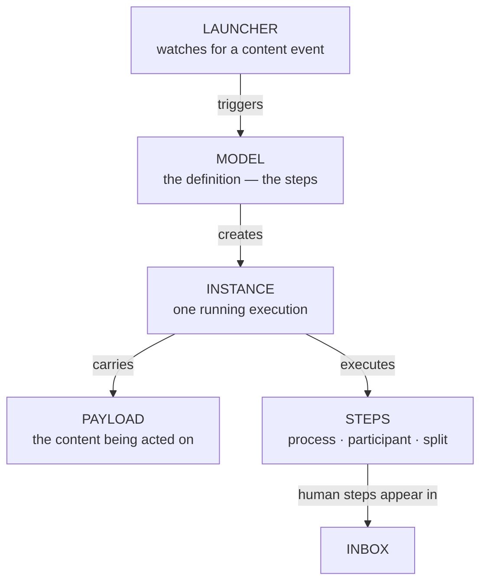
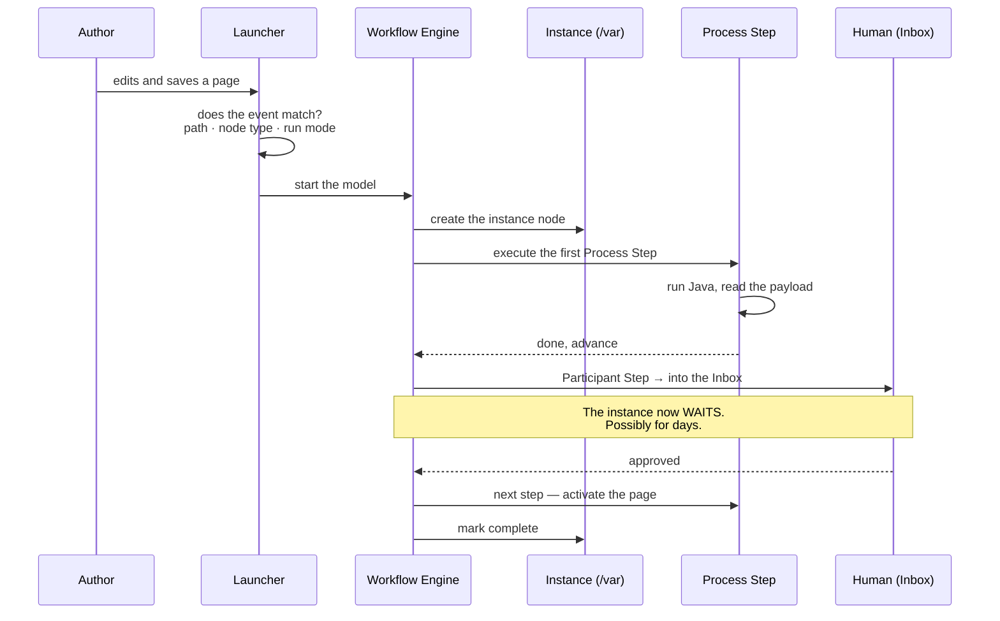
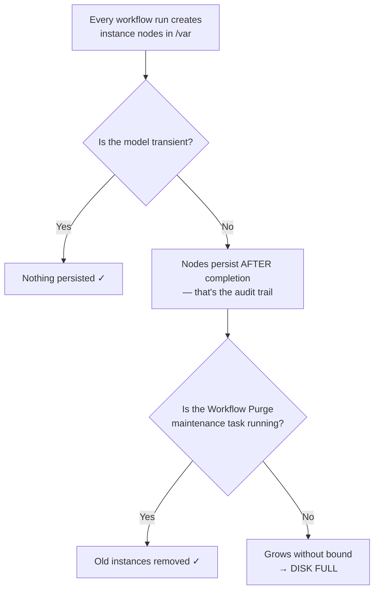

# 09 – Workflows

> **Target:** 3–4 years experienced AEM Developer
> **Syllabus point covered (19, first half):** *"Scheduler/workflow examples. Say you haven't done it but you know about it."*
> **Project domain:** a global energy technology company's marketing site.

---

## Before we start — about that note in your syllabus

Your syllabus point 19 says something the others don't:

> *"scheduler/workflow ke examples. **bol dena kiya nai par pata hai**"*
> — *"say you haven't done it, but you know about it."*

That is a note the candidate wrote to themselves about **how to answer**, not about what to learn. And it is genuinely good instinct, so this file is built to support it properly.

**Why it's the right instinct.** Workflows are a topic where plenty of AEM developers have real gaps. Many projects use the out-of-the-box workflows and never write a custom process step. Claiming deep hands-on experience you don't have is dangerous here, because the follow-ups get specific fast — *"where is the model stored?"*, *"what does your process step's `execute` signature look like?"*, *"how did you get a resource resolver inside it?"* — and vague answers to those are worse than a clean admission.

**But "I haven't done it" on its own scores zero.** The version that scores well has three parts:

1. **Say what you have seen.** Almost everyone has *used* workflows even if they haven't built one — approving a page, watching DAM Update Asset run, seeing items in the Inbox.
2. **Demonstrate you understand the model.** Structure, storage, step types, how a custom step is written.
3. **Say how you'd approach it.** Concretely enough that it's obvious you could.

Done that way, an honest answer often lands *better* than an inflated one, because interviewers can tell the difference and they are actively watching for it. Section 6.1 is that answer written out.

**One more thing worth knowing before you decide how to pitch it.** On AEM as a Cloud Service, asset processing has **moved off workflows** to Asset Compute microservices, and long-running workflows are actively discouraged because pods get recycled. So workflows matter less on modern projects than they did on 6.5 — and saying that shows current awareness rather than a gap. Section 2.9.

---

## 1. Introduction

### 1.1 What is a workflow?

> **A workflow is a defined sequence of steps that automates a business process in AEM — including steps that require a human.**

That last clause is what makes workflows distinct from everything else in AEM. A scheduler runs code on a timer. A Sling Job processes something asynchronously. **Only a workflow can stop and wait for a person.**

**A concrete example from our domain.** A product page for a high-voltage transformer cannot simply be published by whoever edited it. Technical claims have to be checked by an engineer, and regulatory statements by compliance. So:

```
Author finishes the page
        ↓
Technical review        ← a human step. The workflow WAITS.
        ↓
Compliance review       ← another human step
        ↓
Publish                 ← automatic once both approve
        ↓
Notify the author
```

That process has waiting, branching, accountability and an audit trail. **That is what workflows are for.**

### 1.2 When do you use a workflow — and when don't you?

This is the question interviewers actually care about, because reaching for a workflow when you don't need one is a common design mistake.

**Use a workflow when:**

- A **human** must approve or act.
- You need an **audit trail** — who approved what, and when.
- The process is **long-running** and may pause for hours or days.
- Business users need to **see and manage** it in a UI.

**Don't use a workflow when:**

- It's just **time-based** — that's a **Scheduler**.
- It's **bulk async processing** with no human involved — that's a **Sling Job**.
- It needs to happen **during a request** — that's a servlet or a service.

**The comparison in one line, which is worth memorising:**

> *"Scheduler is time. Job is throughput. Workflow is people and paper trail."*

### 1.3 What you've almost certainly seen, even if you haven't built one

Worth cataloguing, because this is the honest foundation of a good answer:

**DAM Update Asset** — runs whenever an asset is uploaded, generating renditions and extracting metadata. On AEM 6.5 this is a workflow. If you've ever uploaded an image and watched thumbnails appear, you've watched a workflow run.

**Request for Activation** — when an author lacks publish rights, activating creates a workflow that sends the request to an approver's Inbox.

**Translation workflows** — created when you start a translation project.

**Scheduled activation** — publishing a page with an on-time creates a workflow that waits.

**Saying this in an interview is a genuinely strong move**, because it is true, it's specific, and it converts "I haven't done it" into "here's what I've actually observed."

---

## 2. Core Concepts

### 2.1 The five pieces

Every workflow question comes back to these. Learn them as a set.



| Piece | What it is |
|---|---|
| **Model** | The **definition** — the steps and their order. Like a class. |
| **Instance** | One **running execution** of a model. Like an object. |
| **Launcher** | A rule that **starts** a workflow when something happens in the repository |
| **Payload** | The **content** the workflow is acting on — usually a page or asset path |
| **Step** | One unit of work — automated, or assigned to a person |

**The model/instance distinction is the one to be crisp about.** A model is the design; an instance is one run of it. Ten authors submitting ten pages produces one model and ten instances. That is also why `/var/workflow/instances` grows and needs purging — every run leaves a record.

### 2.2 Where everything is stored

Interviewers ask this, and the answer changed across versions — which is worth knowing.

| What | Where |
|---|---|
| **Model (design)** | `/conf/global/settings/workflow/models/<model-name>` |
| **Model (runtime)** | `/var/workflow/models/...` |
| **Launchers** | `/conf/global/settings/workflow/launcher/config/` |
| **Instances** | `/var/workflow/instances/` |
| **Inbox items** | `/var/workflow/instances/.../workItems` |

**Two things to notice:**

**Models moved out of `/etc`.** In AEM 6.2 and earlier they lived at `/etc/workflow/models`. The **repository restructuring** in 6.4/6.5 moved them to `/conf` — the same shift that moved templates and clientlibs, from file 01. Mentioning that connection shows you understand the pattern rather than having memorised a path.

**There are two copies of every model** — a design copy under `/conf` and a runtime copy under `/var`. That surprises people, and it explains a real bug:

> **If you edit a workflow model and your change doesn't take effect, you probably didn't sync it.** The editor has a Sync button that regenerates the runtime copy from the design copy. Until you do, running instances use the old definition.

That is a good detail to have, because it's the kind of thing only someone who has actually opened the workflow editor knows.

### 2.3 The step types

There are more than people expect. Knowing the range — even without having built each — demonstrates real familiarity.

| Step type | What it does |
|---|---|
| **Process Step** | Runs Java code. The one developers write. |
| **Participant Step** | Assigns to a user or group; appears in their Inbox and **waits** |
| **Dynamic Participant Step** | Same, but the assignee is chosen at runtime by code |
| **Dialog Participant Step** | A participant step where the person fills in a dialog |
| **Or Split** | Conditional branching — one path taken |
| **And Split** | Parallel branches — all paths taken |
| **Container Step** | Runs another workflow model inside this one |
| **Goto Step** | Jumps to another step — conditional loops |
| **External Process Step** | For long-running work handled outside AEM |

**The two that matter most:**

**Process Step** is where developers live. It runs a Java class you wrote.

**Participant Step** is what makes a workflow a workflow. It assigns the item to a person or group, puts it in their Inbox, and **the instance pauses indefinitely** until they act.

**A distinction worth having ready:** *"Or Split takes one branch based on a condition; And Split runs branches in parallel and rejoins."* That's a common quick question.

### 2.4 Writing a custom process step

This is the code developers actually write, and the piece to be able to sketch even if you haven't shipped one.

```java
@Component(
        service = WorkflowProcess.class,
        property = {
                "process.label=Energy - Notify Compliance Team"
        }
)
public class NotifyComplianceProcess implements WorkflowProcess {

    @Override
    public void execute(WorkItem workItem,
                        WorkflowSession workflowSession,
                        MetaDataMap metaDataMap) throws WorkflowException {
        // your logic
    }
}
```

**Four things to be able to explain:**

**`service = WorkflowProcess.class`** — this is an OSGi service, so everything from file 06 applies. It's registered under the `WorkflowProcess` interface, which is how the workflow engine finds it.

**`process.label`** — this is what appears in the **dropdown** when someone configures a Process Step in the workflow editor. Without it, your step is unlabelled and effectively unfindable. This is the property people forget.

**The `execute` signature** takes three things:

| Parameter | What it gives you |
|---|---|
| `WorkItem` | The current step, and the **payload** |
| `WorkflowSession` | The workflow API — and a way to get a `ResourceResolver` |
| `MetaDataMap` | Arguments configured on the step in the editor |

**Getting the payload** — the content the workflow is acting on:

```java
String payloadPath = workItem.getWorkflowData().getPayload().toString();
```

**Getting a ResourceResolver** — and this is a genuinely good detail:

```java
ResourceResolver resolver = workflowSession.adaptTo(ResourceResolver.class);
```

That resolver is **the workflow session's**, so do not close it — the same rule as the request's resolver in file 07. If you need different permissions, open your own service-user resolver in try-with-resources.

**Reading step arguments:**

```java
String args = metaDataMap.get("PROCESS_ARGS", String.class);
```

`PROCESS_ARGS` is the free-text argument field on the Process Step's configuration dialog — how one Java class is reused across several steps with different settings.

### 2.5 Workflow Launchers

A launcher is a rule: *"when this happens in the repository, start this workflow."*

**What you configure:**

| Setting | Purpose |
|---|---|
| **Event Type** | Created, Modified, Removed |
| **Node Type** | e.g. `cq:PageContent`, `dam:Asset` |
| **Path** | A regex — which part of the repository |
| **Condition** | An optional expression for finer control |
| **Workflow** | Which model to run |
| **Run Modes** | **author** and/or **publish** |
| **Activate** | Enabled or not |

**Two things that cause real production problems, and both make good scenario answers:**

**Too broad a path.** A launcher on `/content` with node type `cq:PageContent` fires on **every page edit across the entire site**. On a large site that's thousands of workflow instances an hour, and `/var/workflow/instances` fills the disk. Scope the path as narrowly as possible.

**No run mode restriction.** A launcher with no run mode set runs on **publish too**. An approval workflow firing on the publish tier is both pointless and a performance problem — publish should be serving pages, not running business processes. Almost every launcher should be restricted to `author`.

### 2.6 Transient workflows — the performance option

A detail that separates people who have operated AEM from people who have only read about it.

**The problem.** Every workflow instance creates nodes under `/var/workflow/instances` — the history, the work items, the metadata. For an approval workflow running a few times a day, that's fine and you *want* the record. For a workflow that runs on **every asset upload**, when you're ingesting fifty thousand product images, it's a serious repository problem.

**The solution.** A model can be marked **transient**. A transient workflow **doesn't persist instance nodes at all**. It runs, does its work, and leaves no trace.

| | Normal | Transient |
|---|---|---|
| Instance nodes created | Yes | **No** |
| Repository growth | Yes | None |
| Speed | Slower | **Faster** |
| History / audit trail | **Yes** | **No** |
| Visible in the Workflow console | Yes | No |
| Can have human steps | Yes | **No** |
| Use for | Approvals, anything auditable | High-volume automated processing |

**DAM Update Asset is transient by default** in newer AEM versions, for exactly this reason.

**The trade-off to state:** you give up the audit trail and the ability to see or restart the instance. So transient is right for automated, high-volume, low-stakes processing — and wrong for anything anyone might need to prove happened.

### 2.7 The out-of-the-box workflows

Being able to name several shows familiarity even without custom development:

| Workflow | What it does |
|---|---|
| **DAM Update Asset** | Renditions, metadata extraction, smart tags on upload |
| **Request for Activation** | Approval before publishing, when the author lacks rights |
| **Request for Deletion** | Approval before deleting |
| **Scheduled Activation / Deactivation** | Waits until a set time, then publishes or unpublishes |
| **Move / Delete DAM Asset** | Handles references when assets move |
| **Translation workflows** | Created by translation projects |
| **Publish Example / Approve for Adobe Campaign** | Sample models |

### 2.8 Workflow versus Scheduler versus Sling Job

**This is the comparison your syllabus is really asking about**, since point 19 groups schedulers and workflows together. Full detail on the other two is file 10.

| | **Workflow** | **Scheduler** | **Sling Job** |
|---|---|---|---|
| Triggered by | Content event, launcher, or manually | **Time** (cron) | Code, programmatically |
| Human steps | **Yes** | No | No |
| Persisted | Yes (`/var`) | **No** | Yes |
| Survives a restart | Yes | **No** | **Yes** |
| Guaranteed to run | Yes | No | **At least once** |
| Cluster-aware | Yes | Needs care | **Yes** |
| Visible to business users | **Yes** — Inbox, console | No | Job queue console only |
| Audit trail | **Yes** | No | Limited |
| Use for | Approvals, business process | Nightly report, cache warm-up | Bulk async processing |

**The three-example answer** interviewers like:

- *"Send a report every night at 2am"* → **Scheduler**. Time-based, no human, no record needed.
- *"Process 100,000 assets"* → **Sling Jobs**. Needs guaranteed execution and cluster awareness, but no human.
- *"Legal must approve before publish"* → **Workflow**. A human step, an audit trail, and business users need to see it.

### 2.9 Workflows on AEM as a Cloud Service — what changed

**This matters, and raising it unprompted turns a knowledge gap into current awareness.**

**Asset processing moved off workflows entirely.** On 6.5, DAM Update Asset ran on the AEM instance — CPU-heavy image and video processing competing with authors for resources. On Cloud Service that moved to **Asset Compute microservices**, configured through **Processing Profiles** rather than a workflow model.

**Long-running workflows are discouraged.** Publish and author pods are recycled — during deployment, during scaling, or if a pod becomes unhealthy. A workflow paused mid-execution has to survive that, which is fine for a persisted approval workflow waiting on a person, but bad for a step doing hours of continuous processing.

**Maintenance is automated.** Adobe handles workflow purging, which on 6.5 was a task you had to configure and monitor.

**What still applies:** custom approval and business-process workflows work exactly as before. It's specifically the *asset processing* use case that moved.

**Why this is worth saying:**

> "It's worth noting that workflows matter less on Cloud Service than they did on 6.5. Asset processing — which was the highest-volume workflow use case — moved off to Asset Compute microservices and Processing Profiles. And long-running workflows are discouraged because pods get recycled. Custom approval workflows are still workflows, but the heavy automated processing that used to be a workflow problem is now a different mechanism."

That reframes "I haven't built many workflows" as "our platform doesn't need as many," which is both honest and current.

---

## 3. Internal Working

### 3.1 The lifecycle of a workflow instance



**Three things worth drawing out:**

**The launcher decides whether to start anything.** Path, node type and run mode are all evaluated first — which is why a badly scoped launcher creates thousands of unwanted instances.

**A Participant Step pauses indefinitely.** The instance sits in `/var` consuming a little space until a person acts. If nobody ever does, it sits there forever — which is how workflows "pile up."

**Every instance leaves a record** unless the model is transient. That is the audit trail, and it is also the disk-space problem.

### 3.2 Why `/var/workflow/instances` fills the disk

A classic production scenario, and the mechanism is worth understanding.



**The key insight: completed instances are not deleted.** They stay, deliberately, because they *are* the audit record. Something has to remove them, and that something is the **Workflow Purge** maintenance task.

**Three things make it worse:**

- A **launcher scoped too broadly**, creating far more instances than intended.
- **Stalled instances** waiting on a person who never acts — those can't be purged as completed.
- Purge configured to keep too long a history.

That combination — too-broad launcher plus no purge — is behind most "AEM disk full" incidents on 6.5, and it is a good scenario answer because it links a design mistake to an operational failure.

### 3.3 Workflow failures

When a Process Step throws, the instance goes into a **Failure** state rather than silently dying. You can see failures in the workflow console and retry or terminate them.

**Which is why exception handling in a process step matters.** Throwing `WorkflowException` puts the instance in Failures where someone can act on it. Swallowing the exception silently marks the step complete and the workflow moves on as though it succeeded — which is worse, because the process appears to have worked.

> "In a process step I'd throw `WorkflowException` on a genuine failure rather than swallowing it, so the instance lands in the Failures queue where someone can see and retry it. Silently catching means the workflow completes as though it succeeded, and for something like a compliance approval that's a much worse outcome than a visible failure."

---

## 4. Important Interview Questions

### 4.1 Basic

**Q1. What is a workflow in AEM?**
A defined sequence of steps automating a business process, uniquely able to include steps that pause and wait for a human.

*Cross:* What makes it different from a scheduler? (human steps, persistence, audit trail) · Give an example · Have you built one?

**Q2. What are the main components of the workflow system?**
Model (the definition), Instance (one execution), Launcher (what starts it), Payload (the content it acts on), and Steps.

*Cross:* Model vs instance? (definition vs execution — like class vs object) · What's a payload? · Where does each live?

**Q3. Where are workflow models stored?**
Design copy at `/conf/global/settings/workflow/models`, runtime copy at `/var/workflow/models`. They moved out of `/etc` in the 6.4/6.5 repository restructuring.

*Cross:* Why two copies? · What happens if you don't sync? (**the change doesn't take effect**) · Where were they before?

**Q4. Where are workflow instances stored?**
`/var/workflow/instances`.

*Cross:* Why does that matter? (unbounded growth → disk full) · What removes them? (the Workflow Purge maintenance task) · What about transient workflows? (nothing is stored)

**Q5. What is a workflow launcher?**
A rule that starts a workflow when a repository event matches — configured with event type, node type, path, condition and run modes.

*Cross:* Where are they stored? · Why restrict run modes? (**otherwise it runs on publish too**) · What happens with too broad a path?

**Q6. What are the main step types?**
Process Step (runs Java), Participant Step (assigns to a person and waits), Or Split and And Split for branching, Container Step, Goto Step, and Dynamic/Dialog Participant variants.

*Cross:* Which do developers write? (Process) · Or Split vs And Split? (one branch vs parallel) · What makes a workflow pause? (a Participant Step)

**Q7. How do you write a custom workflow step?**
An OSGi component implementing `WorkflowProcess`, registered with `service = WorkflowProcess.class` and a `process.label` property, overriding `execute(WorkItem, WorkflowSession, MetaDataMap)`.

*Cross:* What is `process.label` for? (**the dropdown in the editor**) · How do you get the payload? · What's in the `MetaDataMap`?

**Q8. How do you get the payload in a process step?**
`workItem.getWorkflowData().getPayload().toString()` gives the path.

*Cross:* What types can a payload be? (`JCR_PATH` or `JCR_UUID`) · How do you get a `ResourceResolver`? (`workflowSession.adaptTo`) · Should you close it? (**no** — you didn't open it)

**Q9. What's the difference between a workflow and a scheduler?**
A scheduler is time-triggered, isn't persisted, and has no human steps. A workflow is triggered by a content event or manually, persists its state, supports human steps, and leaves an audit trail.

*Cross:* And a Sling Job? · Which for a nightly report? (Scheduler) · Which for an approval? (Workflow)

**Q10. Name some out-of-the-box workflows.**
DAM Update Asset, Request for Activation, Request for Deletion, Scheduled Activation, and the translation workflows.

*Cross:* Which have you seen run? · What does DAM Update Asset do? · Does it still apply on Cloud Service? (**no — Asset Compute replaced it**)

### 4.2 Intermediate

**Q11. What is a transient workflow and when would you use one?**
A model marked transient doesn't persist instance nodes at all. Faster and no repository growth, but no history, no audit trail, no visibility in the console, and no human steps. Right for high-volume automated processing — DAM Update Asset is transient by default in newer versions.

*Cross:* What do you give up? · Why is asset processing the classic case? · Could an approval workflow be transient? (**no** — it needs both human steps and the audit trail)

**Q12. Workflows are piling up and the disk is filling. What's happening?**

Completed instances aren't deleted automatically — they *are* the audit record. So either the **Workflow Purge** maintenance task isn't running or is retaining too much, or a **launcher is scoped too broadly** and creating far more instances than intended, or instances are stalled waiting on people who never act.

*Cross:* How would you check? (Tools → Workflow → Instances, and the `/var` node count) · What's the immediate fix versus the real fix? · How does this differ on Cloud Service? (**purging is automated**)

**Q13. A workflow is stuck. How do you investigate?**
Look at the instance in the workflow console to see which step it's on. If it's a Participant Step, it's waiting on a person — check who it's assigned to and whether that user or group still exists. If it's a Process Step, check `error.log` and the Failures queue. From the console you can terminate, retry or advance it.

*Cross:* What if the assignee left the company? (reassign, or use a group rather than a user) · What's the Failures queue? · How do you prevent it? (assign to groups, and add timeouts)

**Q14. Why must a launcher be restricted by run mode?**
Without a restriction it runs on **publish** as well as author. An approval workflow on publish is pointless, and it consumes resources on the tier that should be serving pages. Almost every launcher should be author-only.

*Cross:* How do you set it? · What else should be scoped? (**the path**) · What happens with a launcher on all of `/content`?

**Q15. You edited a workflow model but nothing changed. Why?**
There are two copies — the design model in `/conf` and the runtime model in `/var`. The editor's **Sync** regenerates the runtime copy. Until then, instances use the old definition.

*Cross:* Why two copies? · Where exactly are they? · Does this affect already-running instances? (they continue on the version they started with)

**Q16. How do you pass configuration into a process step?**
Through the `MetaDataMap`, reading `PROCESS_ARGS` — the argument field on the step's dialog in the model editor. That's how one Java class serves several steps with different settings.

*Cross:* How do you parse multiple arguments? (your own convention — commonly comma or colon separated) · What else is in the MetaDataMap? · How does that differ from workflow metadata? (**workflow metadata persists across steps**; work-item metadata is per step)

**Q17. What happens when a process step throws an exception?**
The instance goes into the **Failures** queue rather than dying silently, and someone can retry or terminate it from the console.

*Cross:* Should you catch and swallow? (**no** — throw `WorkflowException`, or the workflow completes as though it succeeded) · Why does that matter for an approval? · Where do you see failures?

**Q18. How do workflows differ on AEM as a Cloud Service?**
Asset processing moved off workflows to Asset Compute microservices and Processing Profiles. Long-running workflows are discouraged because pods get recycled. Purging is automated. Custom approval workflows still work as before.

*Cross:* Why did asset processing move? (CPU-heavy work competing with authors) · What's a Processing Profile? · What does "pods get recycled" mean for a paused workflow? (a *persisted* one survives; a step mid-computation may not)

**Q19. How do you assign a step to a person dynamically?**
A **Dynamic Participant Step**, backed by a class implementing `ParticipantStepChooser`, which returns the participant based on the payload — for example the product line's owning team, read from a page property.

*Cross:* Why not a plain Participant Step? (the assignee depends on the content) · Would you assign to a user or a group? (**a group** — people leave) · How does the class get registered? (an OSGi service, like a process step)

**Q20. How do you avoid a workflow running on every page edit?**
Scope the launcher's path narrowly, use the node type to match only what you care about, add a condition where finer control is needed, and restrict run modes to author.

*Cross:* What node type for pages? (`cq:PageContent`) · Why not `cq:Page`? (the modification happens on `jcr:content`) · What's the risk of a condition? (it's evaluated on every matching event, so keep it cheap)

### 4.3 Advanced

**Q21. Design an approval workflow for our product pages.**

This is the question the "I haven't built one, but here's how I'd approach it" answer is for:

> "The requirement is that a product page can't be published without technical and compliance sign-off.
>
> **Launcher:** on `cq:PageContent` under the product content path only, on Modified, restricted to the **author** run mode — because it's pointless on publish and would waste resources there. I'd scope the path as narrowly as possible, because a launcher on all of `/content` creates thousands of instances and that's a genuine disk-space problem.
>
> **Model:** a Process Step to validate the page has the mandatory fields, then a **Participant Step** assigned to the technical review **group**, then one assigned to compliance, then a Process Step to activate, then one to notify the author.
>
> **Assign to groups, not individuals** — people go on leave and leave the company, and an instance assigned to a departed user sits stuck forever.
>
> **Not transient**, because the audit trail is the entire point here — for a compliance approval you have to be able to show who approved what and when.
>
> **The process steps** would be OSGi components implementing `WorkflowProcess`, with a `process.label` so they appear in the editor's dropdown, reading the payload from the work item and getting a resolver from the workflow session. On a genuine failure I'd throw `WorkflowException` so the instance lands in Failures where someone sees it, rather than swallowing it and having the workflow complete as though it succeeded.
>
> **And I'd think about the stuck case up front** — what happens if nobody acts for two weeks. Either a timeout with escalation, or at minimum a report of instances older than N days, because otherwise those instances accumulate silently."

*Cross:* What if compliance rejects? (an Or Split back to the author, or a Goto Step) · How would you handle escalation? · What about bulk publishing fifty pages?

**Q22. When would you choose a Sling Job over a workflow?**

When there's no human involved and no audit requirement, but you need guaranteed execution. Processing a hundred thousand assets is a Sling Job — a workflow would create a hundred thousand instances in `/var` and the overhead would dominate the actual work. A workflow is right when a person must act, or when the record of what happened matters.

*Cross:* What if you need both? (a workflow that dispatches jobs) · What about transient workflows for volume? (closer to a job, but still heavier) · Which is cluster-aware? (both, but jobs are designed for it)

**Q23. How would you handle a workflow that needs to call a slow external system?**

Not synchronously inside a process step, because that blocks a workflow thread and risks timing out. Either an **External Process Step**, which is designed for work completed outside AEM that signals back, or have the process step dispatch a Sling Job and let the workflow continue, with the job signalling completion.

And always timeouts on the call, for the same reason as file 06 — a hung external call consumes a thread indefinitely.

*Cross:* What's an External Process Step? · What if the external system never responds? · How would this behave on Cloud Service? (**worse** — pods recycle, so long-running steps are actively discouraged)

**Q24. How do you test a workflow process step?**

The step is an OSGi component, so it's testable like any other — AEM Mocks, mock the `WorkItem`, `WorkflowSession` and `MetaDataMap`, call `execute` directly, and assert on the effect. The valuable tests are the failure paths: a missing payload, a payload of the wrong type, and the external dependency being unavailable.

*Cross:* How do you mock the payload? · What do you actually assert? · Can you test the whole model? (integration territory — much harder, and rarely worth it)

**Q25. What are the performance concerns with workflows?**

Launcher scope is the big one — too broad and you create orders of magnitude more instances than intended. Then repository growth in `/var` if purging isn't running. Then anything slow inside a process step, since it occupies a workflow thread. And transient models where the audit trail genuinely isn't needed.

*Cross:* How would you measure the impact? (instance counts, and the `/var` node count) · What's a reasonable retention? · How does Cloud Service change this? (purging automated, and asset processing moved off entirely)

---

## 5. Cross Questions — how this topic gets drilled

**Thread A — from "have you worked with workflows?"**
Which ones? → Did you build a custom one? → *(be honest here)* → What would a process step look like? → What's the `execute` signature? → How do you get the payload? → How do you get a resolver? → What's `process.label` for?

**Thread B — from "workflow vs scheduler"**
What's the difference? → What about Sling Jobs? → Which for a nightly report? → Which for 100,000 assets? → Which for an approval? → Which survive a restart? → Which are cluster-aware?

**Thread C — from "workflows are piling up"**
Why aren't they deleted? → What removes them? → Where are they stored? → What makes it worse? → What's a transient workflow? → What do you lose? → How does Cloud Service handle it?

**Thread D — from "how does a workflow start?"**
What's a launcher? → What do you configure? → Why restrict run modes? → What happens if you don't? → Why scope the path? → What node type for pages? → Why `cq:PageContent` and not `cq:Page`?

---

## 6. Best Interview Answers

### 6.1 "Have you worked with workflows?" — the honest answer that scores

**This is the answer your syllabus note is asking for. Learn this shape.**

> "I've worked with the out-of-the-box ones rather than building custom models from scratch. On our project we use Request for Activation for pages where the author doesn't have publish rights, and I've spent a fair bit of time around DAM Update Asset — mostly diagnosing why renditions weren't generating, which usually turned out to be the workflow failing on a particular file type.
>
> I haven't designed a custom approval model end to end, so I'd rather be straight about that than overstate it. But I understand the structure well enough to build one.
>
> The pieces are the **model**, which is the definition stored under `/conf/global/settings/workflow/models` with a runtime copy in `/var` — and you have to sync it or your changes don't take effect, which catches people out. Then the **instance**, which is one execution, stored in `/var/workflow/instances`. The **launcher**, which starts it on a repository event and needs to be scoped tightly by path and restricted to the author run mode, otherwise it fires on publish too and creates far more instances than you want. And the **steps** — Process Steps that run Java, Participant Steps that assign to a person and pause the instance, and the split types for branching.
>
> If I were writing a custom step, it's an OSGi service implementing `WorkflowProcess`, registered with a `process.label` so it appears in the editor's dropdown, overriding `execute` with the work item, workflow session and metadata map. You get the payload path from the work item and a resource resolver by adapting the workflow session — and you don't close that one, because you didn't open it.
>
> One thing worth adding: on Cloud Service, workflows matter less than they used to. Asset processing — which was the highest-volume workflow use case — moved off to Asset Compute microservices and Processing Profiles, and long-running workflows are discouraged because pods get recycled. So a lot of what used to be a workflow problem is now a different mechanism entirely."

**Why this works, and why it beats an inflated answer:**

It **opens with what's genuinely true** and specific — Request for Activation, DAM Update Asset debugging. That's real and defensible.

It **admits the gap in one clean sentence** and moves straight on, without dwelling.

It then **demonstrates real understanding** — storage paths, the sync gotcha, launcher scoping, the process step signature, the resolver rule. None of that requires having shipped a custom workflow, and all of it is checkable.

It **finishes on current platform awareness**, which reframes the gap as "our platform needs fewer of these" rather than "I've missed something."

**What makes this land is the specificity.** "I know about workflows" is worthless. "You have to sync the model or your changes don't take effect" is the kind of detail that only comes from having actually opened the editor.

### 6.2 "Workflow vs Scheduler vs Sling Job" — about 75 seconds

> "They solve three different problems, and I'd pick based on two questions: is a human involved, and does anyone need a record?
>
> A **Scheduler** is purely time-based — a cron expression, fire and forget. It isn't persisted, so it doesn't survive a restart in any meaningful way, and in a cluster you have to be careful it doesn't run on every node. Right for a nightly report or a cache warm-up.
>
> A **Sling Job** is for asynchronous processing where you need guaranteed execution. It's persisted, it's at-least-once, and it's cluster-aware by design. Right for processing a hundred thousand assets — no human involved, but you can't afford to silently lose work.
>
> A **Workflow** is the only one that can pause and wait for a person. It's persisted, it has an audit trail, and business users can see and manage it in the Inbox and the workflow console. Right when legal has to approve before publishing.
>
> The way I'd summarise it: **scheduler is time, job is throughput, workflow is people and paper trail.**
>
> The mistake I'd avoid is using a workflow for bulk processing. A hundred thousand assets through a workflow means a hundred thousand instances in `/var`, and the instance overhead dominates the actual work — that's what transient workflows exist to mitigate, and why asset processing eventually moved off workflows entirely on Cloud Service."

### 6.3 "Design an approval workflow" — about 2 minutes

→ Section 4.3, Q21. The structure that makes it work: **launcher scoping → model steps → groups not individuals → not transient because audit is the point → the process step mechanics → and the stuck case handled up front.**

That last part is what makes it sound like design rather than recitation. Anyone can list steps. Asking "what happens if nobody approves for two weeks" is what an experienced person does.

---

## 7. Real Project Examples

**A note on these.** Given the honest positioning in 6.1, don't tell these as "I built this." Tell them as **"here's how I'd approach it"** or **"here's what I've observed."** Story 1 is genuinely observational and safe to tell as experience; stories 2 and 3 are design answers.

### Story 1 — Diagnosing why renditions weren't generating *(observational — safe to tell as your own)*

**What happened.** Product images uploaded to the DAM were appearing, but without thumbnails or web renditions. Authors couldn't use them, and it only affected some files.

**The investigation.** Renditions are generated by **DAM Update Asset**, which is a workflow. So the question became "did the workflow run, and did it succeed?" Tools → Workflow → Instances showed the workflow starting; the **Failures** queue showed it failing partway through for the affected assets.

**The cause.** A specific file type the processing step couldn't handle, throwing on every attempt.

**Why this is a good story to tell honestly.** It's real, it demonstrates you know where workflow instances and failures live, and it shows the diagnostic instinct — *"renditions come from a workflow, so check whether the workflow ran."* That connection is exactly what an interviewer is probing for, and it doesn't require having built anything.

**And it opens a good follow-up you can answer:** on Cloud Service this wouldn't be a workflow at all — asset processing moved to Asset Compute microservices, so the equivalent diagnosis would be checking the asset's processing status and the Processing Profile.

### Story 2 — How I'd design product page approval *(a design answer)*

Frame it as: *"We don't have this today, but if I were asked to build it, here's how I'd approach it."*

**Requirement.** Product pages carry technical specifications and regulatory statements. Neither can go live without review — technical accuracy by an engineer, regulatory wording by compliance.

**Launcher.** `cq:PageContent`, on Modified, scoped to the product content path only, restricted to the **author** run mode. Both restrictions matter: an unscoped launcher on `/content` fires on every page edit site-wide and floods `/var`, and without the run mode restriction it also runs on publish, which is pointless and wasteful.

**Model.** Validate → technical review → compliance review → activate → notify.

**Assign to groups, not individuals.** People go on leave and leave the company, and an instance assigned to a departed user is stuck indefinitely with no obvious owner.

**Not transient.** The whole point is the audit trail — being able to show who approved what and when. Transient would make it faster and leave no record, which for compliance is the opposite of what's needed.

**The design decision worth mentioning unprompted:** what happens when nobody approves. A workflow that pauses on a Participant Step waits forever. So either a timeout with escalation, or at minimum a scheduled report of instances older than a threshold — otherwise they accumulate silently and someone discovers it months later when the disk fills.

### Story 3 — Why bulk processing shouldn't be a workflow *(a design answer)*

**The scenario.** A bulk metadata update across roughly eighty thousand product assets — adding a taxonomy field derived from the folder structure.

**The tempting approach.** A workflow with a launcher on the DAM path. It would work.

**Why it's the wrong tool.** Eighty thousand assets means eighty thousand workflow instances in `/var/workflow/instances`. The instance creation, the history nodes, the work items — that overhead would dominate the actual work, which is a single property write per asset. And it would leave the repository substantially larger with an audit trail nobody will ever read.

**The better approach.** A **Sling Job** per batch, or a scheduled task processing in chunks with a bounded batch size. Guaranteed execution and cluster awareness without the per-item instance overhead.

**If it had to be a workflow** — say because the process genuinely needed the workflow engine's step model — then **transient**, so no instance nodes are persisted. That's precisely why DAM Update Asset is transient by default.

**The point this story makes:** *"the tool choice is the design decision, and reaching for a workflow because it's the familiar mechanism is how you create an operational problem."*

---

## 8. Coding Examples

### 8.1 A custom process step, annotated

```java
package com.energy.core.workflows;

import com.adobe.granite.workflow.WorkflowException;
import com.adobe.granite.workflow.WorkflowSession;
import com.adobe.granite.workflow.exec.WorkItem;
import com.adobe.granite.workflow.exec.WorkflowProcess;
import com.adobe.granite.workflow.metadata.MetaDataMap;
import com.day.cq.wcm.api.Page;
import org.apache.sling.api.resource.ModifiableValueMap;
import org.apache.sling.api.resource.Resource;
import org.apache.sling.api.resource.ResourceResolver;
import org.osgi.service.component.annotations.Component;
import org.osgi.service.component.annotations.Reference;
import org.slf4j.Logger;
import org.slf4j.LoggerFactory;

import javax.jcr.RepositoryException;
import java.util.Calendar;

/**
 * Marks a product page as technically reviewed.
 *
 * A workflow process step is an OSGi SERVICE -- everything from file 06
 * applies, including that it can sit unsatisfied and never appear.
 */
@Component(
        service = WorkflowProcess.class,
        property = {
                // THIS IS WHAT APPEARS IN THE DROPDOWN when someone
                // configures a Process Step in the model editor.
                // Without it, the step is effectively unfindable.
                "process.label=Energy - Mark Technically Reviewed"
        }
)
public class MarkReviewedProcess implements WorkflowProcess {

    private static final Logger LOG = LoggerFactory.getLogger(MarkReviewedProcess.class);

    @Reference
    private com.energy.core.services.NotificationService notificationService;

    /**
     * @param workItem         the current step -- carries the PAYLOAD
     * @param workflowSession  the workflow API, and a source of a ResourceResolver
     * @param metaDataMap      arguments configured on this step in the editor
     */
    @Override
    public void execute(WorkItem workItem,
                        WorkflowSession workflowSession,
                        MetaDataMap metaDataMap) throws WorkflowException {

        // ---- 1. The payload: the content this workflow is acting on ----
        String payloadPath = workItem.getWorkflowData().getPayload().toString();

        // Payload can be JCR_PATH or JCR_UUID -- check rather than assume
        String payloadType = workItem.getWorkflowData().getPayloadType();
        if (!"JCR_PATH".equals(payloadType)) {
            throw new WorkflowException("Expected a JCR_PATH payload, got " + payloadType);
        }

        // ---- 2. Step arguments from the editor's dialog ----
        // PROCESS_ARGS is the free-text argument field. It is how ONE
        // Java class serves several steps with different settings.
        String args = metaDataMap.get("PROCESS_ARGS", String.class);
        String reviewType = (args != null && !args.isEmpty()) ? args.trim() : "technical";

        // ---- 3. A ResourceResolver from the workflow session ----
        // NOTE: do NOT close this. The workflow session owns it -- same
        // rule as the request's resolver in file 07. If I needed
        // different permissions I would open my own service-user
        // resolver in try-with-resources instead.
        ResourceResolver resolver = workflowSession.adaptTo(ResourceResolver.class);
        if (resolver == null) {
            throw new WorkflowException("Could not obtain a ResourceResolver");
        }

        Resource resource = resolver.getResource(payloadPath);
        if (resource == null) {
            // The page may have been deleted while the workflow waited
            // on a human step -- a very real case for long-paused workflows.
            throw new WorkflowException("Payload no longer exists: " + payloadPath);
        }

        try {
            // ---- 4. Do the work ----
            Resource contentResource = resource.getChild("jcr:content");
            if (contentResource == null) {
                throw new WorkflowException("No jcr:content at " + payloadPath);
            }

            ModifiableValueMap properties = contentResource.adaptTo(ModifiableValueMap.class);
            if (properties == null) {
                throw new WorkflowException("Content is not modifiable: " + payloadPath);
            }

            properties.put("reviewStatus", reviewType + "-approved");
            properties.put("reviewedBy", workItem.getWorkflow().getInitiator());
            properties.put("reviewedOn", Calendar.getInstance());

            resolver.commit();

            LOG.info("Marked {} as {} reviewed", payloadPath, reviewType);

            // ---- 5. Workflow metadata: persists ACROSS steps ----
            // Work-item metadata is per step; workflow metadata is shared
            // by every step in the instance.
            workItem.getWorkflow().getWorkflowData().getMetaDataMap()
                    .put("lastReviewType", reviewType);

        } catch (Exception e) {
            // THROW, don't swallow.
            //
            // Throwing puts the instance in the FAILURES queue where a
            // human can see and retry it. Catching silently marks the
            // step complete and the workflow proceeds as though it
            // succeeded -- for a compliance approval, far worse than a
            // visible failure.
            LOG.error("Failed to mark {} as reviewed", payloadPath, e);
            throw new WorkflowException("Could not mark page as reviewed", e);
        }
    }
}
```

**The six things to be able to point at:**

**`process.label`** is what makes the step selectable in the editor. Forgetting it is the classic first mistake.

**The payload type is checked**, not assumed.

**The resolver comes from the workflow session and is not closed** — you didn't open it.

**The payload may no longer exist**, because a workflow can pause for days on a human step and content changes meanwhile. That check is the kind of thing only someone thinking about long-paused instances includes.

**Work-item metadata versus workflow metadata** — per step versus shared across the instance.

**Exceptions are thrown, not swallowed**, with the reason stated.

### 8.2 A dynamic participant chooser

For when the assignee depends on the content.

```java
package com.energy.core.workflows;

import com.adobe.granite.workflow.WorkflowException;
import com.adobe.granite.workflow.WorkflowSession;
import com.adobe.granite.workflow.exec.WorkItem;
import com.adobe.granite.workflow.exec.ParticipantStepChooser;
import com.adobe.granite.workflow.metadata.MetaDataMap;
import org.apache.sling.api.resource.Resource;
import org.apache.sling.api.resource.ResourceResolver;
import org.apache.sling.api.resource.ValueMap;
import org.osgi.service.component.annotations.Component;

/**
 * Chooses the reviewer group based on the product line of the page.
 *
 * Used by a DYNAMIC PARTICIPANT STEP, where a plain Participant Step
 * can't be used because the assignee depends on the payload.
 */
@Component(
        service = ParticipantStepChooser.class,
        property = {
                "chooser.label=Energy - Route to Product Line Reviewers"
        }
)
public class ProductLineReviewerChooser implements ParticipantStepChooser {

    private static final String FALLBACK_GROUP = "energy-content-reviewers";

    @Override
    public String getParticipant(WorkItem workItem,
                                 WorkflowSession workflowSession,
                                 MetaDataMap metaDataMap) throws WorkflowException {

        String payloadPath = workItem.getWorkflowData().getPayload().toString();
        ResourceResolver resolver = workflowSession.adaptTo(ResourceResolver.class);

        Resource content = resolver != null
                ? resolver.getResource(payloadPath + "/jcr:content")
                : null;

        if (content == null) {
            return FALLBACK_GROUP;
        }

        ValueMap properties = content.getValueMap();
        String productLine = properties.get("productLine", String.class);

        // ALWAYS return a GROUP, never an individual user.
        // People go on leave and leave the company; an instance assigned
        // to a departed user sits stuck with no obvious owner.
        if (productLine == null || productLine.isEmpty()) {
            return FALLBACK_GROUP;
        }
        return "energy-reviewers-" + productLine.toLowerCase();

        // NOTE: a returned group that doesn't exist leaves the instance
        // stuck. In production I'd verify it exists and fall back if not.
    }
}
```

### 8.3 A workflow launcher configuration

```
/conf/global/settings/workflow/launcher/config/product-page-approval
```

```xml
<?xml version="1.0" encoding="UTF-8"?>
<jcr:root xmlns:jcr="http://www.jcp.org/jcr/1.0"
          xmlns:nt="http://www.jcp.org/jcr/nt/1.0"
    jcr:primaryType="nt:unstructured"

    <!-- SCOPE THE PATH NARROWLY.
         A launcher on /content with this node type fires on EVERY page
         edit across the whole site -- thousands of instances an hour on
         a large site, and /var/workflow/instances fills the disk. -->
    glob="/content/energy/global/en/products/(.*)"

    <!-- The modification happens on jcr:content, not on the cq:Page node -->
    nodetype="cq:PageContent"

    eventType="{Long}16"
    description="Start product page approval on modification"
    enabled="{Boolean}true"

    <!-- RESTRICT THE RUN MODE.
         Without this it runs on PUBLISH too, which is pointless for an
         approval and wastes resources on the tier that should be
         serving pages. Almost every launcher should be author-only. -->
    runModes="[author]"

    <!-- Optional finer control. Evaluated on every matching event,
         so keep it cheap. -->
    condition="jcr:content[@cq:template='/conf/energy/settings/wcm/templates/product-detail-page']"

    workflow="/var/workflow/models/energy/product-page-approval"/>
```

**The two properties that cause production incidents** are `glob` and `runModes`, and both are commented above for exactly that reason.

### 8.4 Testing a process step

```java
package com.energy.core.workflows;

import com.adobe.granite.workflow.WorkflowException;
import com.adobe.granite.workflow.WorkflowSession;
import com.adobe.granite.workflow.exec.WorkItem;
import com.adobe.granite.workflow.exec.WorkflowData;
import com.adobe.granite.workflow.metadata.MetaDataMap;
import io.wcm.testing.mock.aem.junit5.AemContext;
import io.wcm.testing.mock.aem.junit5.AemContextExtension;
import org.junit.jupiter.api.BeforeEach;
import org.junit.jupiter.api.Test;
import org.junit.jupiter.api.extension.ExtendWith;
import org.mockito.Mockito;

import static org.junit.jupiter.api.Assertions.*;
import static org.mockito.Mockito.when;

@ExtendWith(AemContextExtension.class)
class MarkReviewedProcessTest {

    private final AemContext context = new AemContext();
    private MarkReviewedProcess process;

    private WorkItem workItem;
    private WorkflowSession workflowSession;
    private MetaDataMap metaDataMap;

    @BeforeEach
    void setUp() {
        context.load().json("/workflows/content.json", "/content");
        process = context.registerInjectActivateService(new MarkReviewedProcess());

        workItem        = Mockito.mock(WorkItem.class);
        workflowSession = Mockito.mock(WorkflowSession.class);
        metaDataMap     = Mockito.mock(MetaDataMap.class);

        // The workflow session is how the step gets its resolver
        when(workflowSession.adaptTo(org.apache.sling.api.resource.ResourceResolver.class))
                .thenReturn(context.resourceResolver());
    }

    @Test
    void failsWhenThePayloadNoLongerExists() {
        // A REAL case: the workflow paused for days on a human step
        // and the page was deleted meanwhile.
        mockPayload("/content/does-not-exist", "JCR_PATH");

        assertThrows(WorkflowException.class,
                () -> process.execute(workItem, workflowSession, metaDataMap));
    }

    @Test
    void rejectsAnUnexpectedPayloadType() {
        mockPayload("/content/product", "JCR_UUID");

        assertThrows(WorkflowException.class,
                () -> process.execute(workItem, workflowSession, metaDataMap));
    }

    @Test
    void marksThePageReviewed() throws Exception {
        mockPayload("/content/product", "JCR_PATH");
        when(metaDataMap.get("PROCESS_ARGS", String.class)).thenReturn("compliance");

        process.execute(workItem, workflowSession, metaDataMap);

        String status = context.resourceResolver()
                .getResource("/content/product/jcr:content")
                .getValueMap().get("reviewStatus", String.class);

        assertEquals("compliance-approved", status);
    }

    private void mockPayload(String path, String type) {
        WorkflowData data = Mockito.mock(WorkflowData.class);
        when(data.getPayload()).thenReturn(path);
        when(data.getPayloadType()).thenReturn(type);
        when(workItem.getWorkflowData()).thenReturn(data);
    }
}
```

**Note the tests target the failure paths** — a deleted payload, the wrong payload type. The deleted-payload case is specifically a workflow concern, because instances can pause for days and the world changes underneath them.

---

## 9. Common Mistakes

| The mistake | What actually happens | The fix |
|---|---|---|
| No `process.label` | The step never appears in the editor's dropdown | Add the property |
| Launcher path too broad | Thousands of unwanted instances; `/var` fills the disk | Scope the `glob` narrowly |
| No run mode restriction | The workflow also runs on **publish** | `runModes="[author]"` |
| Not syncing the model | Your edits have no effect | Sync in the editor |
| Assigning steps to individuals | Stuck forever when that person leaves | Assign to **groups** |
| Swallowing exceptions in a process step | The workflow completes as though it succeeded | Throw `WorkflowException` |
| Closing the workflow session's resolver | Breaks the rest of the step | Only close resolvers you opened |
| Assuming the payload still exists | Instances pause for days; content changes | Null-check and fail cleanly |
| Assuming the payload type | It can be `JCR_PATH` or `JCR_UUID` | Check it |
| Using a workflow for bulk processing | Instance overhead dominates the work | Sling Jobs, or a transient model |
| Transient for an auditable process | No record of who approved what | Transient only for automated, non-audited work |
| No Workflow Purge configured | `/var/workflow/instances` grows without bound | Configure the maintenance task |
| Slow synchronous external calls in a step | Blocks a workflow thread; risks timeout | External Process Step, or dispatch a job |
| Ignoring the stuck case | Instances accumulate silently for months | Timeouts, escalation, or a stale-instance report |
| Using `cq:Page` in a launcher node type | Doesn't fire — the modification is on `jcr:content` | `cq:PageContent` |

---

## 10. Best Practices

**On launchers.** Scope the path as narrowly as the requirement allows, always restrict run modes to author, and match on `cq:PageContent` for page edits. Every unnecessary instance is repository growth you'll pay for later.

**On models.** Assign to groups, never individuals. Design the stuck case up front — what happens when nobody acts. Use transient only where the audit trail genuinely doesn't matter.

**On process steps.** Throw rather than swallow, so failures are visible. Don't close the workflow session's resolver. Null-check the payload, because it may have gone. Keep steps fast, and push slow external work out to a job or an External Process Step.

**On operations.** Make sure Workflow Purge is configured and actually running on 6.5. Monitor the instance count as a leading indicator — it rises long before the disk fills.

**On tool choice.** Workflow for people and audit trails. Scheduler for time. Sling Job for throughput. Reaching for a workflow because it's familiar is how bulk processing becomes an operational problem.

---

## 11. Debugging Tips

**The workflow console is the starting point:** Tools → Workflow, or `/libs/cq/workflow/content/console.html`.

| Tab | What it tells you |
|---|---|
| **Models** | The definitions, and where you sync after editing |
| **Instances** | What's running, and which step each is on |
| **Failures** | Instances where a process step threw |
| **Launchers** | What's configured to start what |
| **Archive** | Completed instances |

**When a workflow is stuck**, look at which step the instance is on:

- **A Participant Step** → it's waiting on a person. Check who it's assigned to, and whether that user or group still exists. An instance assigned to a departed user is the classic case.
- **A Process Step** → check `error.log` and the Failures queue.

From the console you can terminate, retry or advance an instance.

**When a workflow doesn't start at all**, check the launcher: is it enabled, does the path glob actually match, is the node type right (`cq:PageContent`, not `cq:Page`), and does the run mode include this instance?

**When your model edits have no effect**, you didn't sync. There are two copies and the runtime one is generated from the design one.

**When renditions or asset processing fail**, remember which platform you're on. On 6.5 that's DAM Update Asset — a workflow, so check Instances and Failures. On Cloud Service it's Asset Compute, so check the asset's processing status and the Processing Profile instead.

| Tool | Answers |
|---|---|
| Tools → Workflow → Instances | What's running and where it's stuck |
| Tools → Workflow → Failures | Which steps threw |
| Tools → Workflow → Launchers | Why it did or didn't start |
| `/var/workflow/instances` in CRXDE | The real instance count |
| `error.log` | Process step exceptions |
| `/system/console/components` | Is the process step's OSGi component even active |

**That last one is worth remembering:** a process step is an OSGi service, so if it has an unsatisfied `@Reference`, the component never activates and the step simply doesn't appear in the editor — exactly the file 06 problem in a new place.

---

## 12. Performance Optimization

**Launcher scope is the highest-impact lever.** An unscoped launcher can create orders of magnitude more instances than intended, and every one is repository writes and workflow-engine work.

**Transient models where audit isn't needed.** No instance nodes, meaningfully faster, no repository growth. This is why DAM Update Asset is transient by default.

**Workflow Purge must actually be running** on 6.5. Completed instances persist deliberately — something has to remove them.

**Keep process steps fast.** Each occupies a workflow thread. Slow external calls belong in a job or an External Process Step, and always with timeouts.

**Don't use workflows for bulk.** Per-instance overhead dominates when the work per item is small.

**Watch the instance count as a leading indicator.** It grows long before the disk fills, so it's the thing to alert on.

---

## 13. Real Production Scenarios

**1. Workflows piling up, disk filling.** Purge not running, or a launcher scoped too broadly, or stalled instances waiting on people.

**2. Workflow stuck on a participant step.** Assigned to a user who left. Reassign, and switch to group assignment.

**3. Workflow never starts.** Launcher disabled, path glob doesn't match, wrong node type, or run mode excludes this instance.

**4. Model changes have no effect.** Not synced — the runtime copy is still the old one.

**5. Custom step missing from the editor's dropdown.** No `process.label`, or the OSGi component is unsatisfied.

**6. Workflow runs on publish.** No run mode restriction on the launcher.

**7. Renditions not generating (6.5).** DAM Update Asset failing — check Failures.

**8. Renditions not generating (Cloud Service).** Not a workflow — check the Processing Profile and the asset's processing status.

**9. Process step fails silently and the workflow completes.** The exception was caught and swallowed instead of thrown.

**10. Workflow fails because the page was deleted.** It paused on a human step for days and the content changed. Null-check the payload.

**11. Bulk asset update took the instance down.** A workflow used where a Sling Job was appropriate.

**12. Approval history missing for an audit.** The model was made transient — no instance record exists.

**13. Every page edit triggers a workflow.** Launcher on all of `/content`.

**14. Launcher doesn't fire on page edits.** Node type is `cq:Page`; it needs `cq:PageContent`, because the modification is on `jcr:content`.

**15. Workflow times out on an external system.** A slow synchronous call inside a process step with no timeout.

**16. Long-running workflow behaves oddly on Cloud Service.** Pods recycle. Long-running steps are discouraged there.

**17. Reviewers never see items.** Assigned to a group that doesn't exist, or that nobody is a member of.

**18. Instance count grows steadily even though workflows complete.** Purge retention set too long.

---

## 14. Follow-up Questions

- Have you built a custom workflow? *(be honest)*
- Which out-of-the-box workflows does your project use?
- Have you written a process step?
- How do you handle a stuck workflow?
- What's your workflow purge retention?
- Do you use transient workflows anywhere?
- How does asset processing work on your platform?
- Have you had a workflow-related production incident?
- **When would you NOT use a workflow?**

**That last one is a genuinely good question to be ready for**, because it lets you demonstrate judgment rather than recall: *"Bulk processing with no human involved. A workflow per item means an instance per item, and the overhead dominates. That's a Sling Job."*

---

## 15. Comparison Tables

**Workflow vs Scheduler vs Sling Job**

| | Workflow | Scheduler | Sling Job |
|---|---|---|---|
| Trigger | Content event, launcher, manual | **Time** (cron) | Code |
| Human steps | **Yes** | No | No |
| Persisted | Yes | **No** | Yes |
| Survives restart | Yes | No | **Yes** |
| Guaranteed | Yes | No | **At least once** |
| Cluster-aware | Yes | Needs care | **Yes** |
| Visible to business users | **Yes** | No | Console only |
| Audit trail | **Yes** | No | Limited |
| Use for | Approvals | Nightly tasks | Bulk async |

**Model vs Instance**

| | Model | Instance |
|---|---|---|
| What it is | The definition | One execution |
| Analogy | A class | An object |
| Stored at | `/conf/.../workflow/models` + `/var/workflow/models` | `/var/workflow/instances` |
| How many | One | One per run |

**Normal vs Transient**

| | Normal | Transient |
|---|---|---|
| Instance nodes | Created | **None** |
| Audit trail | **Yes** | No |
| Human steps | Yes | **No** |
| Speed | Slower | Faster |
| Visible in console | Yes | No |
| Use for | Approvals | High-volume automation |

**Step types**

| Step | Purpose |
|---|---|
| Process | Runs Java |
| Participant | Assigns to a person; **pauses** |
| Dynamic Participant | Assignee chosen by code |
| Dialog Participant | Person fills in a dialog |
| Or Split | One branch, by condition |
| And Split | Parallel branches |
| Container | Runs another model |
| Goto | Jumps to a step |
| External Process | Work completed outside AEM |

**AEM 6.5 vs Cloud Service**

| | 6.5 | Cloud Service |
|---|---|---|
| Asset processing | DAM Update Asset **workflow** | **Asset Compute microservices** |
| Configured via | Workflow model | **Processing Profiles** |
| Long-running workflows | Acceptable | **Discouraged** — pods recycle |
| Purging | You configure it | **Automated** |
| Custom approval workflows | Yes | **Yes, unchanged** |

---

## 16. Memory Tricks

**Tool choice:** *"Scheduler is time. Job is throughput. Workflow is people and paper trail."*

**Model vs instance:** *"Model is the class, instance is the object."*

**Two copies:** *"Design in conf, runtime in var — sync or nothing changes."*

**Launcher discipline:** *"Scope the path, set the run mode."* The two properties behind most workflow incidents.

**Node type:** *"Pages change on jcr:content"* — so `cq:PageContent`, not `cq:Page`.

**Assignment:** *"Groups, not people. People leave."*

**Transient:** *"Transient means no trail."*

**Exceptions:** *"Throw so it fails visibly."*

**Resolvers:** *"Close what you opened."* Same rule as file 07.

---

## 17. Revision Notes

- A workflow automates a business process and is **the only AEM mechanism that can pause and wait for a human**.
- **Five pieces:** Model (definition) · Instance (one execution) · Launcher (what starts it) · Payload (the content) · Steps.
- **Storage:** models at `/conf/global/settings/workflow/models` **plus a runtime copy at `/var/workflow/models`** — **sync or your edits don't take effect**. Launchers at `/conf/global/settings/workflow/launcher/config`. Instances at `/var/workflow/instances`.
- Models moved out of `/etc` in the 6.4/6.5 **repository restructuring** — same shift as templates and clientlibs.
- **Step types:** Process (Java) · Participant (assigns and **pauses**) · Dynamic/Dialog Participant · Or Split (one branch) · And Split (parallel) · Container · Goto · External Process.
- **Custom step:** OSGi service implementing `WorkflowProcess`, with **`process.label`** for the editor dropdown, overriding `execute(WorkItem, WorkflowSession, MetaDataMap)`. Payload from `workItem.getWorkflowData().getPayload()`. Resolver from `workflowSession.adaptTo(...)` — **don't close it**. Arguments from `PROCESS_ARGS`.
- **Throw `WorkflowException`, don't swallow** — the instance goes to Failures where someone can act.
- **Launchers:** scope the **path** narrowly and restrict **run modes to author**, or you get thousands of instances and it runs on publish. Node type for page edits is **`cq:PageContent`**, not `cq:Page`.
- **Transient** models persist no instance nodes — faster, no growth, but **no audit trail and no human steps**. DAM Update Asset is transient by default.
- **`/var/workflow/instances` grows unbounded** unless **Workflow Purge** runs. Completed instances persist deliberately — they're the audit record.
- **Workflow vs Scheduler vs Job:** people and paper trail · time · throughput.
- **Cloud Service:** asset processing moved to **Asset Compute + Processing Profiles**; long-running workflows discouraged (pods recycle); purging automated; custom approval workflows unchanged.

---

## 18. Cheat Sheet

**Paths**
```
/conf/global/settings/workflow/models/           model DESIGN
/var/workflow/models/                            model RUNTIME (sync!)
/conf/global/settings/workflow/launcher/config/  launchers
/var/workflow/instances/                         running + completed instances
```

**Custom process step**
```java
@Component(service = WorkflowProcess.class,
           property = {"process.label=Energy - My Step"})
public class MyProcess implements WorkflowProcess {
    @Override
    public void execute(WorkItem workItem,
                        WorkflowSession session,
                        MetaDataMap metaData) throws WorkflowException { }
}
```

**Inside execute**
```java
String path  = workItem.getWorkflowData().getPayload().toString();
String type  = workItem.getWorkflowData().getPayloadType();   // JCR_PATH | JCR_UUID
String args  = metaData.get("PROCESS_ARGS", String.class);
ResourceResolver r = session.adaptTo(ResourceResolver.class); // do NOT close

// metadata shared across steps
workItem.getWorkflow().getWorkflowData().getMetaDataMap().put(k, v);
```

**Dynamic participant**
```java
@Component(service = ParticipantStepChooser.class,
           property = {"chooser.label=Energy - Route by Product Line"})
public class MyChooser implements ParticipantStepChooser {
    public String getParticipant(...) { return "a-group-name"; }
}
```

**Launcher properties**
```
glob        = "/content/energy/.../products/(.*)"   SCOPE IT
nodetype    = "cq:PageContent"                      not cq:Page
eventType   = Created | Modified | Removed
runModes    = "[author]"                            RESTRICT IT
condition   = optional expression
workflow    = /var/workflow/models/...
enabled     = true
```

**Consoles**
```
Tools → Workflow → Models       definitions, and SYNC
Tools → Workflow → Instances    what's running, where it's stuck
Tools → Workflow → Failures     steps that threw
Tools → Workflow → Launchers    why it did/didn't start
/system/console/components      is the process step even active
```

**Tool choice**
```
Time-based, no human            → Scheduler
Bulk async, guaranteed          → Sling Job
Human step or audit trail       → Workflow
```

---

## 19. Frequently Forgotten Things

1. **Two copies of every model** — design in `/conf`, runtime in `/var`. **Sync, or nothing changes.**
2. **`process.label`** is what puts the step in the editor's dropdown.
3. **Restrict launcher run modes to author**, or it runs on publish too.
4. **Scope the launcher path**, or you flood `/var`.
5. **`cq:PageContent`, not `cq:Page`** — page modifications happen on `jcr:content`.
6. **Don't close the workflow session's resolver.**
7. **Throw `WorkflowException`** — swallowing makes the workflow appear to succeed.
8. **The payload may no longer exist** — instances pause for days.
9. **Payload type can be `JCR_PATH` or `JCR_UUID`.**
10. **Completed instances aren't deleted** — Workflow Purge removes them.
11. **Transient = no instance nodes, no audit trail, no human steps.**
12. **Assign to groups, not individuals.**
13. **A process step is an OSGi service** — it can be unsatisfied and silently absent.
14. **Asset processing on Cloud Service is not a workflow** — it's Asset Compute and Processing Profiles.
15. **Models moved from `/etc` to `/conf`** in the repository restructuring.

---

## 20. Final Interview Summary

**1. What it is.** An automated business process — the only AEM mechanism that pauses for a human.

**2. The five pieces.** Model, Instance, Launcher, Payload, Steps.

**3. Storage.** `/conf` for the design model, `/var` for the runtime copy and instances. Sync after editing.

**4. Step types.** Process runs Java; Participant assigns and pauses; splits branch.

**5. Custom steps.** OSGi service implementing `WorkflowProcess`, with `process.label`, overriding `execute`.

**6. Launchers.** Scope the path, restrict the run mode. Those two properties cause most workflow incidents.

**7. Transient.** No instance nodes, no audit trail. For volume, not for approvals.

**8. The operational reality.** Instances persist deliberately; purging must run, or the disk fills.

**9. Tool choice.** Scheduler is time, Job is throughput, Workflow is people and paper trail.

**10. Cloud Service.** Asset processing moved to Asset Compute; long-running workflows discouraged. Worth raising unprompted.

---

## 21. Mock Interview

**How to use this:** cover the answers, 25-minute timer, speak every answer out loud. **Question 1 is the one to rehearse hardest** — get the honest framing right and the rest follows.

### The interviewer asks:

1. **Have you worked with workflows in AEM?**
2. What is a workflow, and when would you use one?
3. What are the main components of the workflow system?
4. What's the difference between a model and an instance?
5. Where are workflow models stored?
6. You edited a model and nothing changed. Why?
7. What step types are there?
8. **How would you write a custom workflow step?**
9. What is `process.label` for?
10. How do you get the payload inside a process step?
11. How do you get a ResourceResolver, and should you close it?
12. What happens if a process step throws?
13. What is a workflow launcher and what do you configure?
14. Why must you restrict a launcher's run modes?
15. **What is a transient workflow, and what do you give up?**
16. Workflows are piling up and the disk is filling. What's happening?
17. A workflow is stuck. How do you investigate?
18. **Workflow vs Scheduler vs Sling Job?**
19. How do workflows differ on AEM as a Cloud Service?
20. Design an approval workflow for a product page.

### Model answers

**1.** *(The 6.1 answer. Open with what you've genuinely seen — Request for Activation, debugging DAM Update Asset. Admit the custom-model gap in one sentence. Then demonstrate the structure, the sync gotcha, launcher scoping and the process step signature. Close on the Cloud Service shift.)*

**2.** A defined sequence of steps automating a business process, and uniquely in AEM it can include steps that pause and wait for a person. I'd use one when a human has to approve or act, when there's an audit requirement, when the process may pause for days, or when business users need to see and manage it. I'd **not** use one for something purely time-based — that's a scheduler — or for bulk processing with no human involved, which is a Sling Job.

**3.** Five pieces. The **model** is the definition — the steps and their order. The **instance** is one running execution of it. The **launcher** is a rule that starts a workflow when something happens in the repository. The **payload** is the content being acted on, usually a page or asset path. And the **steps** themselves, which are either automated or assigned to a person.

**4.** The model is the definition, the instance is one execution — like a class and an object. Ten authors submitting ten pages gives you one model and ten instances. That distinction is also why `/var/workflow/instances` grows and needs purging: every run leaves a record, deliberately, because that record is the audit trail.

**5.** There are two copies. The design model is at `/conf/global/settings/workflow/models`, and there's a runtime copy at `/var/workflow/models`. They moved out of `/etc` in the 6.4/6.5 repository restructuring — the same shift that moved templates to `/conf` and clientlibs to `/apps`.

**6.** Because of those two copies — you edited the design model but didn't **sync** it, so the runtime copy is still the old definition. There's a Sync button in the editor that regenerates it. And already-running instances continue on the version they started with, which is correct behaviour but sometimes surprising.

**7.** **Process Step** runs Java — that's the one developers write. **Participant Step** assigns to a user or group, puts it in their Inbox, and pauses the instance indefinitely. There are Dynamic and Dialog Participant variants — dynamic picks the assignee at runtime by code. Then **Or Split** for conditional branching where one path is taken, **And Split** for parallel branches, **Container Step** to run another model inside this one, **Goto Step** for jumps and loops, and **External Process Step** for work completed outside AEM.

**8.** An OSGi service implementing `WorkflowProcess`, registered with `service = WorkflowProcess.class` and a `process.label` property. You override `execute`, which takes the work item, the workflow session and a metadata map. You get the payload path from the work item, arguments from `PROCESS_ARGS` in the metadata map, and a resource resolver by adapting the workflow session. And because it's an OSGi service, everything from the component lifecycle applies — including that an unsatisfied `@Reference` means it never activates and simply doesn't appear in the editor.

**9.** It's the label that appears in the **dropdown** when someone configures a Process Step in the workflow model editor. Without it, your step is effectively unfindable — it's registered, but nobody can select it. It's the classic first mistake.

**10.** `workItem.getWorkflowData().getPayload().toString()` gives the path. I'd also check `getPayloadType()` rather than assume, because it can be `JCR_PATH` or `JCR_UUID`. And I'd null-check the resource, because a workflow can pause on a human step for days and the content may have been deleted while it waited — that's a real case, not a theoretical one.

**11.** `workflowSession.adaptTo(ResourceResolver.class)`. And **no, don't close it** — the workflow session owns it, same as the request's resolver in a servlet. The rule I'd apply is close what you opened: if I needed different permissions I'd open my own service-user resolver in try-with-resources and close that one.

**12.** The instance goes into the **Failures** queue rather than silently dying, and someone can retry or terminate it from the workflow console. That's why I'd throw `WorkflowException` rather than catching and swallowing — swallowing marks the step complete and the workflow proceeds as though it succeeded, which for something like a compliance approval is a much worse outcome than a visible failure.

**13.** A rule that starts a workflow when a repository event matches. You configure the event type — created, modified, removed — the node type, a path glob, optionally a condition, which model to run, and the run modes. The two that cause production problems are the **path glob** and the **run modes**.

**14.** Because without a restriction it runs on **publish** as well as author. An approval workflow on publish is pointless, and it consumes resources on the tier that should be serving pages. Almost every launcher should be author-only. The same reasoning applies to the path — a launcher on all of `/content` with node type `cq:PageContent` fires on every page edit across the whole site, which on a large site is thousands of instances an hour and fills `/var`.

**15.** A model marked transient doesn't persist instance nodes at all — it runs, does the work, and leaves no trace. It's faster and causes no repository growth. What you give up is the audit trail, visibility in the workflow console, the ability to retry a stuck instance, and human steps entirely. So it's right for high-volume automated processing — DAM Update Asset is transient by default for exactly that reason — and completely wrong for an approval, where the record of who approved what is the whole point.

**16.** Completed instances aren't deleted automatically — they persist deliberately because they **are** the audit record. So something has to remove them, and that's the **Workflow Purge** maintenance task. If workflows are piling up it's one of three things: purge isn't running or is retaining too long; a launcher is scoped too broadly and creating far more instances than intended; or instances are stalled on participant steps waiting for people who never act. I'd check the instance count in `/var/workflow/instances` and the Instances view, and I'd treat the instance count as a leading indicator — it climbs long before the disk fills, so that's the thing to alert on. On Cloud Service purging is automated, so this is much more a 6.5 problem.

**17.** Look at the instance in the workflow console and see which step it's on. If it's a **Participant Step**, it's waiting on a person — so check who it's assigned to and whether that user or group still exists. The classic case is an instance assigned to someone who's left the company, which is exactly why I'd assign to groups rather than individuals. If it's a **Process Step**, check `error.log` and the Failures queue. From the console you can terminate, retry or advance it.

**18.** *(The 6.2 answer — the two questions, the three tools, the one-line summary, and the bulk-processing mistake.)*

**19.** The biggest change is that asset processing moved off workflows entirely. On 6.5, DAM Update Asset was a workflow running on the instance, doing CPU-heavy image and video processing that competed with authors. On Cloud Service that moved to **Asset Compute microservices**, configured through **Processing Profiles** rather than a workflow model. Long-running workflows are also discouraged, because pods get recycled during deployment and scaling — a persisted workflow waiting on a human survives that fine, but a step doing hours of continuous processing may not. And purging is automated rather than something you configure. Custom approval workflows work exactly as before. So workflows genuinely matter less on modern projects than they did, which is worth knowing rather than assuming the 6.5 model still applies.

**20.** *(The Q21 answer — launcher scoping and run mode, the model steps, groups not individuals, not transient because audit is the point, the process step mechanics, and the stuck case designed for up front.)*

---

## Next topic

**`10-Schedulers-Jobs-and-Events`** — the second half of your syllabus point 19: Sling Scheduler with cron expressions, Sling Jobs and why they're the right answer for bulk processing, event handlers and observation, and the cluster problem — how you stop a scheduled task running on every node.

---

*Topic 09 of the AEM Interview Preparation repository. Teaching style, energy-sector project domain.*
