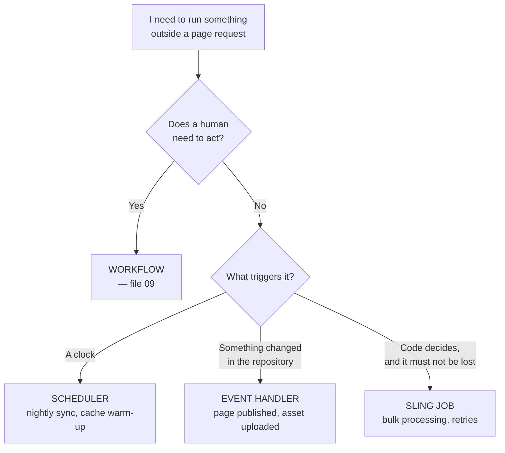
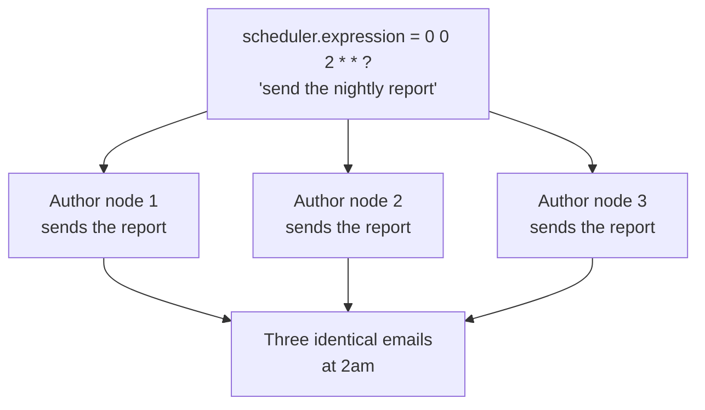
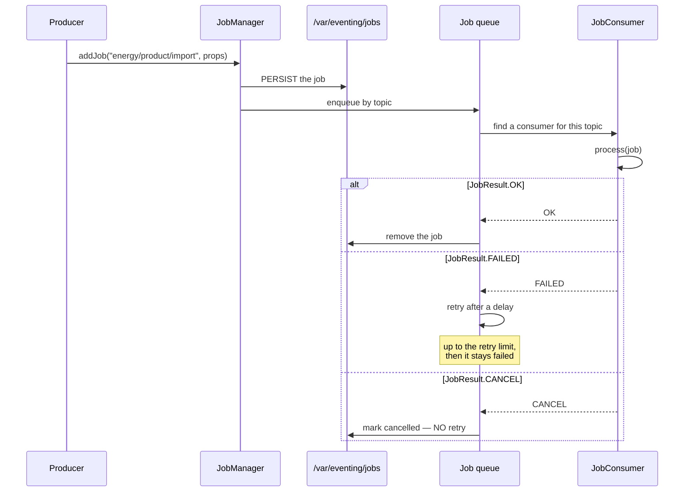
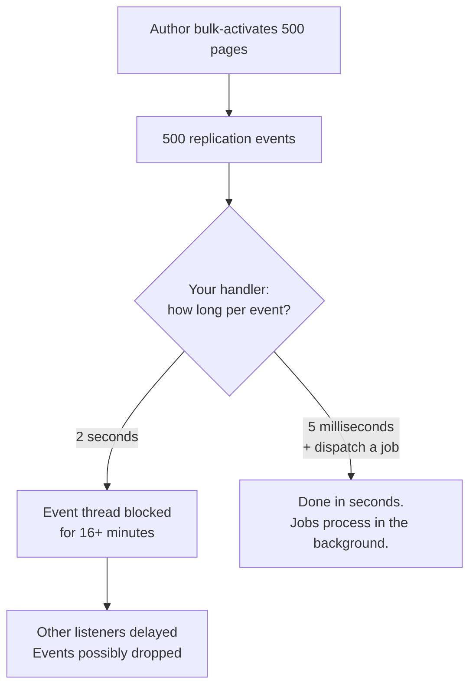

# 10 – Schedulers, Sling Jobs and Event Handlers

> **Target:** 3–4 years experienced AEM Developer
> **Syllabus point covered (19, second half):** *"Scheduler/workflow examples. Say you haven't done it but you know about it."*
> **Project domain:** a global energy technology company's marketing site.

---

## Before we start — the question underneath all of this

File 09 covered workflows. This file covers the other three ways to run code that isn't tied to a page request: **schedulers**, **Sling Jobs**, and **event handlers**.

And the interview question is almost never "how do you write a scheduler." It is:

> **"You need to do X in the background. Which mechanism, and why?"**

That is a **judgment** question, and there is a right answer for each shape of problem. Getting the choice right matters far more than remembering cron syntax.

Here is the decision, up front, because everything else in this file supports it:



**And there is one trap sitting underneath all three**, which is the thing that genuinely separates candidates:

> **AEM runs on more than one machine. Your background code has to know that.**

An author tier can be clustered. A publish tier on Cloud Service auto-scales to several pods. So a scheduler written the obvious way runs **once per node** — your "nightly report" sends four emails, or your data sync runs four times concurrently and corrupts itself.

That is section 2.6, and it is the highest-value thing in this file.

---

## 1. Introduction

### 1.1 The three mechanisms, in one paragraph each

**A Scheduler** runs code on a timer. You give it a cron expression and it fires. It is simple, it is not persisted, and it has no memory — if the instance is down at 2am, that run simply doesn't happen.

**A Sling Job** is a unit of work you hand to AEM saying "run this, and don't lose it." It is persisted in the repository, it retries on failure, and it is designed for clusters — exactly one node processes each job. This is the right answer for bulk processing.

**An Event Handler** reacts to something happening in the repository — a page published, an asset uploaded, a node changed. It runs **synchronously** on the event dispatch thread, which is the single most important thing to know about it.

### 1.2 A real project example to adapt

> "We use all three. There's a scheduler that refreshes the product data cache overnight — configured with a cron expression in an OSGi config so it differs between environments, and set to run on a single node so it doesn't fire once per pod. We use Sling Jobs for bulk work, like reprocessing metadata across the asset library, because jobs are persisted and cluster-aware so nothing gets lost or duplicated. And we have a resource change listener that reacts to product pages being published, which does almost nothing itself — it just dispatches a job, because an event handler runs on the event thread and you can't do real work there."

That paragraph covers all three, the cluster problem, and the event-handler discipline — which is most of the interview.

---

## 2. Core Concepts

### 2.1 The Sling Scheduler

**The common pattern** — usually called the "whiteboard" pattern, because you register a `Runnable` and the scheduler picks it up:

```java
@Component(service = Runnable.class, immediate = true)
@Designate(ocd = ProductSyncConfig.class)
public class ProductSyncTask implements Runnable {

    @Override
    public void run() {
        // your work
    }
}
```

**Three things about that:**

**`service = Runnable.class`** — you register under `Runnable`, and the Sling scheduler watches for those.

**`immediate = true`** — from file 06. A component providing a service is delayed by default, meaning nothing creates it until someone consumes it. Nothing consumes a scheduled task, so without `immediate = true` it may never start.

**It implements `Runnable`** — so the work goes in `run()`.

**The scheduling properties:**

| Property | Purpose |
|---|---|
| `scheduler.expression` | A cron expression |
| `scheduler.period` | Interval in seconds — an alternative to cron |
| `scheduler.concurrent` | Allow a run to start while the previous is still going |
| `scheduler.runOn` | **Cluster behaviour** — section 2.6 |

**`scheduler.concurrent` deserves attention.** It defaults to allowing concurrent runs. So if your task normally takes two minutes but occasionally takes twelve, and it's scheduled every five minutes, you end up with **three copies running simultaneously** — competing for the same data, possibly corrupting it.

**Set `scheduler.concurrent = false` unless you have a specific reason not to.** That is a good detail to raise unprompted.

### 2.2 Cron expressions

Quartz format, and note it starts with **seconds** — which trips up people used to Unix cron:

```
second  minute  hour  day-of-month  month  day-of-week  [year]
```

| Expression | Meaning |
|---|---|
| `0 0 2 * * ?` | 2:00 AM every day |
| `0 */15 * * * ?` | Every 15 minutes |
| `0 0 */4 * * ?` | Every 4 hours |
| `0 0 3 ? * MON` | 3:00 AM every Monday |
| `0 0 0 1 * ?` | Midnight on the 1st of each month |
| `0 30 6 ? * MON-FRI` | 6:30 AM on weekdays |

**The `?` is the thing people get wrong.** You cannot specify both day-of-month and day-of-week meaningfully, so one of them must be `?` meaning "no specific value."

- Scheduling by **date** → `?` in day-of-week: `0 0 0 1 * ?`
- Scheduling by **weekday** → `?` in day-of-month: `0 0 3 ? * MON`

Using `*` in both is a common mistake and produces behaviour you did not intend.

**Always make the expression configurable** through an OSGi config rather than hardcoding it. Then dev can run every five minutes for testing while production runs nightly — the run-mode config pattern from file 06.

### 2.3 Sling Jobs

**The idea.** A job is a unit of work you hand to AEM with a **topic** and some properties, saying "run this somewhere, and don't lose it."

**Two halves.** Something creates the job; a **consumer** registered for that topic processes it.

**Creating a job:**

```java
@Reference
private JobManager jobManager;

Map<String, Object> properties = new HashMap<>();
properties.put("productId", "TX-4000");
jobManager.addJob("energy/product/import", properties);
```

**Consuming it:**

```java
@Component(
        service = JobConsumer.class,
        property = { JobConsumer.PROPERTY_TOPICS + "=energy/product/import" }
)
public class ProductImportJobConsumer implements JobConsumer {

    @Override
    public JobResult process(Job job) {
        String productId = job.getProperty("productId", String.class);
        // ... do the work ...
        return JobResult.OK;
    }
}
```

**The topic is the routing key** — it connects the producer to the consumer. Conventionally a slash-separated namespace like `energy/product/import`.

**`JobResult` tells the framework what happened:**

| Result | Meaning |
|---|---|
| `OK` | Done. Remove the job. |
| `FAILED` | Failed — **retry** according to the retry configuration |
| `CANCEL` | Failed permanently — do not retry |
| `ASYNC` | Completing asynchronously; signal later |

**The `FAILED` versus `CANCEL` distinction matters.** A network timeout is `FAILED` — retrying may well succeed. A malformed product ID is `CANCEL` — retrying will fail identically every time and just burns the retry budget.

**Why jobs beat a scheduler for real work:**

| | Scheduler | Sling Job |
|---|---|---|
| Persisted | **No** | **Yes** (`/var/eventing/jobs`) |
| Survives a restart | No | **Yes** |
| Retries on failure | No | **Yes**, configurable |
| Cluster behaviour | You must handle it | **Handled** — one node per job |
| Triggered by | A clock | Code |

**Jobs are stored in `/var/eventing/jobs`.** Same lesson as workflow instances from file 09: if consumers fail or a topic has no consumer at all, jobs accumulate there.

### 2.4 At-least-once, and why your consumer must be idempotent

**This is the most important thing about Sling Jobs**, and it is a genuinely good point to raise unprompted.

Sling Jobs guarantee **at-least-once** delivery. Not exactly-once. Which means:

> **Your job consumer may process the same job more than once.**

A node can crash after doing the work but before recording completion. On restart, the job is still there and gets processed again.

**So the consumer must be idempotent** — running it twice must have the same effect as running it once.

```java
// NOT idempotent -- runs twice, the counter is wrong
properties.put("viewCount", currentCount + 1);

// Idempotent -- runs twice, same result
properties.put("importedAt", jobTimestamp);
properties.put("status", "imported");
```

**Where it bites in practice:** sending an email, charging something, incrementing a counter, appending to a list. Setting a value or writing a file is naturally idempotent; anything cumulative is not.

**The interview answer:**

> "Sling Jobs are at-least-once, not exactly-once — a node can crash after doing the work but before marking the job complete, and on restart it runs again. So the consumer has to be idempotent. Setting a property or writing a file is naturally safe; anything cumulative like incrementing a counter or sending an email isn't, and needs a guard — usually checking whether the work was already done before doing it."

### 2.5 Event handlers — reacting to repository changes

Three mechanisms, and the modern one is the answer.

**`ResourceChangeListener`** — the current, recommended approach:

```java
@Component(
        service = ResourceChangeListener.class,
        property = {
                ResourceChangeListener.PATHS + "=/content/energy/global/en/products",
                ResourceChangeListener.CHANGES + "=ADDED",
                ResourceChangeListener.CHANGES + "=CHANGED"
        }
)
public class ProductPageChangeListener implements ResourceChangeListener {

    @Override
    public void onChange(List<ResourceChange> changes) {
        for (ResourceChange change : changes) {
            // react
        }
    }
}
```

**Why this one is preferred:** it is **path-scoped**, so AEM only notifies you about the branch you care about rather than every change in the repository. That is a real performance property, not just tidiness.

**`EventHandler`** — the OSGi event mechanism, for events that aren't resource changes:

```java
@Component(
        service = EventHandler.class,
        property = { EventConstants.EVENT_TOPIC + "=" + ReplicationAction.EVENT_TOPIC }
)
public class ReplicationEventHandler implements EventHandler {

    @Override
    public void handleEvent(Event event) {
        // react to a page being published
    }
}
```

Useful topics to know:

| Topic | Fires on |
|---|---|
| `ReplicationAction.EVENT_TOPIC` | A page or asset is activated or deactivated |
| `PageEvent.EVENT_TOPIC` | Page created, moved, deleted |
| `DamEvent.EVENT_TOPIC` | Asset events |
| `SlingConstants.TOPIC_RESOURCE_ADDED` | A resource is added |

**`javax.jcr.observation.EventListener`** — the low-level JCR mechanism. It works, but it requires manual registration and deregistration in `@Activate` and `@Deactivate`, and it is not path-scoped in the same convenient way. **Avoid it in new code** — `ResourceChangeListener` exists precisely to replace it. Knowing that it exists and that you would not use it is the right answer.

### 2.6 The rule that governs every event handler

**Event handlers run synchronously, on the event dispatch thread.**

That has a hard consequence:

> **Do almost nothing in an event handler. Decide, then dispatch.**

If your handler takes two seconds and a bulk activation publishes five hundred pages, you have just blocked the event thread for over sixteen minutes. Other listeners are delayed, and events may be dropped.

**The correct pattern:**

```java
@Override
public void onChange(List<ResourceChange> changes) {
    for (ResourceChange change : changes) {
        if (!isRelevant(change)) {      // cheap check
            continue;
        }
        // Hand the real work to a JOB and return immediately
        Map<String, Object> props = new HashMap<>();
        props.put("path", change.getPath());
        jobManager.addJob("energy/product/reindex", props);
    }
}
```

**The handler decides. The job does.** That single sentence is the answer to a lot of questions in this area, and it is the thing that separates someone who has caused a production incident from someone who hasn't.

### 2.7 The cluster problem — the highest-value section here

**The setup.** AEM does not run on one machine:

- An **author tier** can be clustered — several instances sharing a MongoDB repository.
- A **publish tier on Cloud Service auto-scales** — several pods, and the number changes with traffic.

**The problem.** A scheduler is just a component. Every instance has the component. So every instance runs it.



Three emails. Or worse — three concurrent data syncs writing the same nodes.

**And on Cloud Service publish it is worse**, because the number of pods **changes**. You cannot even predict how many times it will run, and it will differ between a quiet night and a busy one.

**Three solutions, in order of preference:**

**Solution 1 — `scheduler.runOn`:**

```java
property = {
    "scheduler.expression=0 0 2 * * ?",
    "scheduler.runOn=SINGLE"
}
```

| Value | Behaviour |
|---|---|
| `SINGLE` | Run on exactly **one** instance in the cluster |
| `LEADER` | Run only on the cluster **leader** |
| `ALL` | Run on every instance — occasionally what you want, e.g. clearing a local in-memory cache |

**Solution 2 — use a Sling Job instead.** Jobs are cluster-aware by design: exactly one node consumes each job. If the work is substantial, this is better than a scheduler anyway, because you also get persistence and retries.

**Solution 3 — check leadership yourself**, via the Sling topology API. More code, and only worth it when you need finer control than `runOn` gives.

**The Cloud Service caveat worth raising:** the safest pattern on Cloud Service is to keep scheduled work on the **author** tier and avoid schedulers on publish entirely, because publish pods are ephemeral and their count is not under your control.

**The interview answer:**

> "The trap is that a scheduler is just an OSGi component, so every instance in the cluster has it and every instance runs it. On a clustered author that means your nightly report goes out three times; on Cloud Service publish it's worse, because the pod count changes with traffic so you can't even predict how many times.
>
> The direct fix is `scheduler.runOn` set to `SINGLE` or `LEADER`. But if the work is substantial I'd rather dispatch a **Sling Job**, because jobs are cluster-aware by design — exactly one node consumes each one — and you get persistence and retries as well.
>
> On Cloud Service I'd also keep scheduled work on author rather than publish, since publish pods are ephemeral."

---

## 3. Internal Working

### 3.1 How a Sling Job flows



**Three things worth drawing out:**

**The job is persisted before anything runs.** That is what makes it survive a restart — and it is also why jobs accumulate in `/var/eventing/jobs` when something is wrong.

**If no consumer is registered for the topic, the job just sits there.** No error, no warning. It waits for a consumer that never arrives. That is a genuinely confusing failure, and the fix is checking `/system/console/slingevent`.

**The retry path is why `FAILED` and `CANCEL` differ.** `FAILED` costs a retry; `CANCEL` doesn't.

### 3.2 Why event handlers must be fast



**The comparison is the argument.** Same work, but where it happens changes everything.

### 3.3 Where things are stored

| What | Where | Grows? |
|---|---|---|
| Sling Jobs | `/var/eventing/jobs` | **Yes** — if consumers fail or are missing |
| Workflow instances | `/var/workflow/instances` | Yes — file 09 |
| Scheduler state | Nowhere — **in memory** | No |

**That "nowhere" is the point about schedulers.** No persistence means no recovery. If the instance is down at 2am, that run simply did not happen and nothing will notice.

---

## 4. Important Interview Questions

### 4.1 Basic

**Q1. How do you schedule a task in AEM?**
Register an OSGi component as a `Runnable` with a `scheduler.expression` cron property, and put the work in `run()`.

*Cross:* Why `immediate = true`? (nothing consumes it, so it may never activate) · What's the cron format? (Quartz, starting with **seconds**) · How do you make the schedule configurable?

**Q2. What's the cron format?**
Quartz — `second minute hour day-of-month month day-of-week [year]`. Note it starts with seconds, unlike Unix cron.

*Cross:* Write "2am daily" (`0 0 2 * * ?`) · What's `?` for? (no specific value, when the other day field is set) · Why can't both day fields be `*`?

**Q3. What is `scheduler.concurrent`?**
Whether a run may start while the previous one is still going. It allows concurrency by default, which means a task that overruns its interval ends up with several copies running at once.

*Cross:* When would you allow it? (rarely — only genuinely independent work) · What goes wrong? (competing for the same data) · What would you set? (`false`)

**Q4. What is a Sling Job?**
A persisted unit of work with a topic, handed to the JobManager and processed by a consumer registered for that topic. It survives restarts, retries on failure, and is cluster-aware.

*Cross:* Where are they stored? (`/var/eventing/jobs`) · What's a topic? (the routing key) · How does a consumer register?

**Q5. What are the JobResult values?**
`OK`, `FAILED` (retry), `CANCEL` (don't retry), and `ASYNC`.

*Cross:* When would you return CANCEL rather than FAILED? (a permanent error — malformed input will fail identically every time) · What happens after the retry limit? (it stays failed and can be inspected)

**Q6. What is an event handler?**
A component that reacts to something happening — a resource change, a page publish, an asset upload. Registered by topic or by path.

*Cross:* Which mechanisms exist? (`ResourceChangeListener`, `EventHandler`, JCR `EventListener`) · Which is preferred? (`ResourceChangeListener`) · Does it run sync or async? (**synchronously**)

**Q7. Why must an event handler be fast?**
It runs synchronously on the event dispatch thread. Slow handlers block that thread, delay other listeners, and can cause events to be dropped.

*Cross:* What do you do instead? (**dispatch a Sling Job**) · What's a realistic bad case? (bulk activation of 500 pages) · How would you notice? (event backlog in JMX)

**Q8. Scheduler versus Sling Job?**
A scheduler is time-triggered, not persisted, and runs on every cluster node unless you configure otherwise. A job is code-triggered, persisted, retried, and processed by exactly one node.

*Cross:* Which for a nightly report? (scheduler) · Which for 100,000 items? (jobs) · Which survives a restart? (jobs)

**Q9. What is `ResourceChangeListener` and why is it preferred?**
The modern Sling API for reacting to resource changes. It is preferred because it is **path-scoped**, so AEM only notifies you about the branch you registered for, rather than every change in the repository.

*Cross:* What's the alternative? (JCR `EventListener` — manual registration, not path-scoped) · What changes can you subscribe to? (ADDED, CHANGED, REMOVED) · Does it still need to be fast? (**yes**)

**Q10. Where are Sling Jobs stored?**
`/var/eventing/jobs`.

*Cross:* Why does that matter? (they accumulate if consumers fail or are missing) · How do you monitor them? (`/system/console/slingevent`) · What if no consumer exists for a topic? (**they just sit there, silently**)

### 4.2 Intermediate

**Q11. Your scheduled task runs multiple times in a cluster. Why, and how do you fix it?**
→ Section 2.7. A scheduler is just a component, so every node has it and every node runs it. Fix with `scheduler.runOn=SINGLE` or `LEADER`, or dispatch a Sling Job, which is cluster-aware by design.

*Cross:* Why is Cloud Service worse? (**pod count changes with traffic**) · Which fix would you prefer? (a job, if the work is substantial — you get persistence and retries too) · When would `ALL` be right? (clearing a local in-memory cache on each node)

**Q12. Why must a job consumer be idempotent?**
Sling Jobs are **at-least-once**, not exactly-once. A node can crash after doing the work but before recording completion, and the job runs again on restart.

*Cross:* What's a non-idempotent operation? (incrementing a counter, sending an email) · How would you make sending an email safe? (record that it was sent and check first) · Is exactly-once possible? (not in a distributed system without a lot of extra machinery)

**Q13. What's the difference between `JobResult.FAILED` and `CANCEL`?**
`FAILED` triggers a retry; `CANCEL` marks it permanently failed. Use `FAILED` for transient problems like a network timeout, and `CANCEL` for permanent ones like malformed input, which would fail identically on every retry.

*Cross:* What happens after the retry limit? · How do you configure retries? (queue configuration) · Where do you see failed jobs? (`/system/console/slingevent`)

**Q14. An event handler is slowing down the site. What's the fix?**
Move the work out. The handler should do a cheap relevance check and dispatch a Sling Job, then return. It runs on the event dispatch thread, so anything slow there blocks event processing globally.

*Cross:* How would you confirm it's the cause? (thread dump, or the event queue backlog in JMX) · What's a cheap check? (a path or property comparison, no repository traversal) · Why not just make it async yourself? (jobs already solve persistence, retries and clustering)

**Q15. How do you make a schedule configurable per environment?**
Put the cron expression in an `@ObjectClassDefinition` and ship run-mode-specific config files — dev every five minutes for testing, production nightly.

*Cross:* Which module? (`ui.config`) · What's the folder naming? (`config.author.prod`) · Why not hardcode it? (you'd need a code change and deployment to retune)

**Q16. Jobs are piling up and not being processed. What's wrong?**
Most likely no consumer is registered for that topic — which fails silently, since jobs just wait. Or the consumer component is **unsatisfied** because of a missing `@Reference`. Or the consumer keeps returning `FAILED` and the retries are churning.

*Cross:* Where do you check? (`/system/console/slingevent`, then `/system/console/components`) · Why is a missing consumer silent? (a job with no consumer is valid — it waits) · How would you clean up? (cancel from the console, then fix the cause)

**Q17. How would you process 100,000 assets?**
Sling Jobs, one per asset or per batch, dispatched by a scheduler or a servlet. Jobs are persisted so nothing is lost, cluster-aware so the work distributes, and retried on transient failure. **Not** a workflow — that would create 100,000 workflow instances and the overhead would dominate the work.

*Cross:* One job per asset, or per batch? (batching reduces overhead but a failure retries the whole batch — usually a moderate batch size) · How do you avoid overwhelming the instance? (queue configuration limits concurrency) · How would you track progress?

**Q18. What is the whiteboard pattern?**
Registering a service that a framework watches for, rather than calling a registration API yourself. A scheduler registered as a `Runnable`, or a `JobConsumer` registered with a topic property — you publish it and the framework picks it up.

*Cross:* What's the alternative? (calling the `Scheduler` API programmatically) · When would you use the API instead? (a schedule computed at runtime rather than fixed) · Why is whiteboard preferred? (declarative, and the lifecycle is handled for you)

**Q19. Which mechanism reacts to a page being published?**
An `EventHandler` on `ReplicationAction.EVENT_TOPIC`. And it should be fast — a cheap check, then dispatch a job.

*Cross:* Author or publish? (both see events; scope by run mode) · What's in the event? (path, type, user) · What's a realistic use? (invalidating a derived listing cache — the file 02 story)

**Q20. What runs on all nodes and what runs on one?**
By default a scheduler runs on all — that is the trap. A Sling Job is consumed by exactly one node. An event handler runs on the node where the event occurred, so on a cluster that's whichever node handled the change.

*Cross:* How do you make a scheduler run on one? (`scheduler.runOn`) · When is "all" correct? (per-node local state, like an in-memory cache) · What about Cloud Service publish? (**pod count varies — avoid schedulers there**)

### 4.3 Advanced

**Q21. Design a nightly product data synchronisation.**

> "The trigger is a **scheduler**, with the cron expression in an OSGi config so dev can run it every few minutes for testing while production runs at 2am. `scheduler.concurrent=false`, so a long run never overlaps the next one.
>
> Cluster handling matters: I'd set `scheduler.runOn=SINGLE`, or better, have the scheduler do almost nothing itself — just fetch the list of products to sync and **dispatch a Sling Job per batch**. That way the work is persisted, it retries on failure, and it distributes across the cluster properly rather than one node doing everything.
>
> The **consumer must be idempotent**, because jobs are at-least-once and a node can crash after doing the work but before marking it complete. Setting properties is naturally safe; anything cumulative would need a guard.
>
> The API call goes in an **OSGi service** with timeouts, not inline in the job — same reasoning as file 06, because a hung call with no socket timeout consumes a thread indefinitely.
>
> For **failure handling**, I'd return `FAILED` for a network timeout so it retries, and `CANCEL` for a malformed product record, because retrying that just burns the retry budget for something that will never succeed.
>
> And I'd want **visibility** — logging at the batch level, and ideally a health check reporting the last successful sync, because a silent scheduler is the worst kind. If it stops running, nothing tells you."

*Cross:* One job per product or per batch? · What if the API is down all night? · How do you know it ran? · What if it takes longer than 24 hours?

**Q22. How do you invalidate a derived cache when content changes?**

This is file 02's Load More problem — a derived listing goes stale when a child page is published.

> "A `ResourceChangeListener` scoped to the product content path, or an `EventHandler` on the replication topic if I specifically want *published* rather than *saved*.
>
> The handler does a cheap check — is this a product page — and then dispatches a job, because flushing a cache may involve an HTTP call to the dispatcher and that absolutely cannot happen on the event thread.
>
> The job does the actual invalidation. And I'd make it idempotent, which cache invalidation naturally is — flushing twice is harmless."

*Cross:* Replication event or resource change? (replication, if you care about publish rather than save) · What if 500 pages are activated at once? (**the handler must stay fast** — that's the whole reason for the job) · How do you avoid flushing the same path repeatedly? (dedupe in the job, or accept it, since it's idempotent)

**Q23. What happens to schedulers and jobs during a Cloud Service deployment?**

Pods are replaced, so components deactivate and reactivate. A **scheduler** loses nothing because it holds no state — but a run scheduled during the window may simply not happen, and nothing records that. A **Sling Job** in progress is not lost, because it is persisted; it gets retried, which is another reason idempotency matters.

That difference is a good argument for jobs over schedulers for anything that must not be missed.

*Cross:* How would you know a scheduled run was missed? (a health check on last-success timestamp) · What about a job mid-processing? (retried — hence idempotency) · Should scheduled work run on publish? (**no** — pods are ephemeral)

**Q24. How do you configure job queues?**

Through the Sling job queue configuration — queue type (ordered, parallel, topic round-robin), maximum parallel jobs, retry count and retry delay, bound to a topic pattern.

The lever that matters is **concurrency**: an unbounded parallel queue processing a hundred thousand jobs will saturate the instance. Capping it keeps the site responsive while the batch works through.

*Cross:* Ordered vs parallel? (ordered guarantees sequence but is slower; parallel is faster but unordered) · When do you need ordered? (when jobs for the same entity must not interleave) · Where do you see queue stats? (`/system/console/slingevent`)

**Q25. When would you use `ALL` for `scheduler.runOn`?**

When each node has its own local state that needs the same treatment — clearing an in-memory cache held per JVM, for instance. Since that cache exists separately on each node, each node genuinely needs to clear its own.

For anything touching shared state — the repository, an external system, sending email — `ALL` is wrong.

*Cross:* Give a counter-example (sending a report — that's `SINGLE`) · How would you know which you need? (does the work touch shared state or per-node state?) · Is there a middle ground? (`LEADER`, when one designated node should act)

---

## 5. Cross Questions — how this topic gets drilled

**Thread A — from "how do you run something on a schedule"**
Which annotation? → Why `immediate = true`? → What's the cron format? → What's `?` for? → Is the expression configurable? → What happens in a cluster? → How do you fix that? → What about Cloud Service publish?

**Thread B — from "what's a Sling Job"**
How do you create one? → How does a consumer register? → What's a topic? → What are the JobResults? → FAILED vs CANCEL? → What if no consumer exists? → Where are jobs stored? → Are they exactly-once? → **So what does that mean for your consumer?**

**Thread C — from "how do you react to a page being published"**
Which mechanism? → Which topic? → Does it run sync or async? → **So what can you do in it?** → What if 500 pages are activated? → What do you do instead? → Why a job rather than a thread?

**Thread D — from "scheduler vs job vs workflow"**
Which for a nightly report? → For 100,000 items? → For an approval? → Which are persisted? → Which are cluster-aware? → Which survive a restart? → Which does a business user see?

---

## 6. Best Interview Answers

### 6.1 "Which mechanism would you use, and why?" — about 90 seconds

**This is the question that actually gets asked. Learn this framing.**

> "I'd ask two questions. Does a human need to act, and what triggers it.
>
> If a human needs to act — an approval, anything needing an audit trail — that's a **workflow**, because it's the only one that can pause and wait for a person.
>
> Otherwise it depends on the trigger. If it's a **clock**, that's a **Scheduler** — a nightly sync, a cache warm-up. If it's **something changing in the repository**, that's an **event handler** — a page published, an asset uploaded. And if code decides when, and the work must not be lost, that's a **Sling Job**.
>
> The one I'd flag is that Sling Jobs are the right answer more often than people expect. They're persisted, so they survive a restart. They retry on failure. And they're cluster-aware — exactly one node processes each job. So for anything substantial I'd often have a scheduler do nothing but dispatch jobs, rather than doing the work itself.
>
> And the trap underneath all of it is that AEM runs on more than one machine. A clustered author, or an auto-scaling publish tier on Cloud Service. A scheduler is just an OSGi component, so every node has it and every node runs it — your nightly report goes out three times. That's what `scheduler.runOn` is for, or you sidestep it entirely by using jobs."

### 6.2 "Why must a job consumer be idempotent?" — about 45 seconds

> "Because Sling Jobs guarantee at-least-once delivery, not exactly-once. A node can do the work and then crash before recording that the job completed — so on restart the job is still there and gets processed again.
>
> That means running the consumer twice has to have the same effect as running it once. Setting a property or writing a file is naturally idempotent. Anything cumulative isn't — incrementing a counter, appending to a list, sending an email.
>
> Where it actually bites is side effects outside AEM. If a job sends a notification, the safe pattern is to record that it was sent and check before sending, so a retry doesn't produce a second email.
>
> Exactly-once isn't really achievable in a distributed system without a lot of extra machinery, so the framework gives you at-least-once and pushes the correctness requirement onto the consumer. That's a reasonable trade — but only if you know about it."

### 6.3 "Why can't you do the work in an event handler?" — about 60 seconds

> "Because event handlers run **synchronously, on the event dispatch thread**. So whatever your handler does, the event system waits for it.
>
> That's fine when there's one event. The problem is bulk operations. If an author activates five hundred pages and my handler takes two seconds each, I've blocked the event thread for more than sixteen minutes. Other listeners are delayed behind mine, and events can start being dropped — so it's not just my feature that breaks, it's anything else listening.
>
> The pattern is: **the handler decides, the job does**. The handler does a cheap check — is this path relevant, is this the right kind of change — and if so it dispatches a Sling Job and returns immediately. Everything real happens in the job.
>
> I'd use a job rather than just spawning a thread, because jobs give me persistence, retries and cluster awareness for free, and a raw thread gives me none of those and a resource leak if I'm careless."

---

## 7. Real Project Examples

### Story 1 — The nightly report that went out four times

**What happened.** A scheduled task emailed a content summary to the marketing team at 6am. After the author tier was scaled from one instance to a cluster of three, recipients started getting three identical emails every morning.

**The cause.** A scheduler is just an OSGi component. Every instance in the cluster had the bundle, so every instance had the component, so every instance ran it at 6am. Nothing was wrong with the code — it was correct for a single instance and became wrong the moment the topology changed.

**Why it was easy to miss.** It worked perfectly for months. Nothing in the code changed. The **infrastructure** changed, and the code had an unstated assumption about it.

**The fix.** `scheduler.runOn=SINGLE`, which made exactly one node run it.

**What we changed afterwards.** For the heavier scheduled tasks we restructured so the scheduler does almost nothing — it works out what needs doing and **dispatches Sling Jobs**. That gave us cluster-safety, persistence and retries in one change, and it removed the class of bug entirely rather than fixing one instance of it.

**Why this works in an interview:** it demonstrates the cluster trap concretely, shows an assumption becoming wrong when infrastructure changed, and ends with a structural fix.

### Story 2 — The event handler that stalled a bulk publish

**What happened.** During a campaign launch, an author bulk-activated around four hundred product pages. The author instance became unresponsive for several minutes, and some pages appeared not to publish at all.

**The cause.** A replication event handler that, for each published page, made an HTTP call to invalidate a derived listing cache. Each call took a second or two.

Four hundred events, each blocking the event dispatch thread for a couple of seconds. The event queue backed up, other listeners were starved behind it, and some events were dropped — which is why some pages appeared not to publish.

**The insight.** The handler was fine when authors published one page at a time, which was all anyone had tested. **The bug was in how it behaved under a burst**, not in the logic.

**The fix.** The handler was reduced to a cheap check — is this a product page — followed by dispatching a Sling Job. The HTTP call moved into the job.

**Why the job rather than a thread.** Jobs are persisted, so an invalidation isn't lost if the instance restarts mid-burst. They retry, so a temporary dispatcher failure doesn't silently skip a flush. And the queue can be capped so four hundred invalidations don't saturate the instance either.

**The lesson to state:** *"An event handler runs on the event thread, so the question isn't 'is this fast enough for one event' — it's 'what happens when five hundred arrive at once'."*

### Story 3 — Bulk metadata processing without taking the instance down

**Requirement.** Add a derived taxonomy field to roughly eighty thousand product assets.

**The options considered.** A workflow — rejected, because eighty thousand workflow instances in `/var` would cost far more than the work itself, as file 09 covered. A single scheduled task looping over everything — rejected, because a failure halfway through leaves you with no idea what completed, and one long-running task on one node doesn't use the cluster at all.

**The approach.** A scheduler that queries for unprocessed assets in bounded batches and dispatches a **Sling Job per batch**. Each job processes its batch and marks the assets done.

**Three things that made it work:**

**Idempotency.** Jobs are at-least-once, so a crash mid-batch means the batch runs again. Since the operation was "set this property to this derived value," re-running was harmless — and we checked that deliberately rather than assuming.

**Queue concurrency capped.** Without a limit, the queue would process as many jobs in parallel as it could and saturate the instance while authors were working. Capping it meant the batch took longer and nobody noticed it running.

**`FAILED` versus `CANCEL` used deliberately.** A repository write conflict returned `FAILED` so it retried. An asset with corrupt metadata returned `CANCEL`, because retrying it five times would just burn the retry budget on something that could never succeed.

**Result.** The full set processed over about two days of background running, with no impact on authoring and a clear record of the few assets that genuinely failed.

---

## 8. Coding Examples

### 8.1 A cluster-safe scheduled task

```java
package com.energy.core.schedulers;

import com.energy.core.services.ProductDataService;
import org.osgi.service.component.annotations.Activate;
import org.osgi.service.component.annotations.Component;
import org.osgi.service.component.annotations.Modified;
import org.osgi.service.component.annotations.Reference;
import org.osgi.service.event.jobs.JobManager;
import org.osgi.service.metatype.annotations.AttributeDefinition;
import org.osgi.service.metatype.annotations.Designate;
import org.osgi.service.metatype.annotations.ObjectClassDefinition;
import org.slf4j.Logger;
import org.slf4j.LoggerFactory;

import java.util.HashMap;
import java.util.List;
import java.util.Map;

@ObjectClassDefinition(name = "Energy — Nightly Product Sync")
@interface ProductSyncConfig {

    // CONFIGURABLE, not hardcoded: dev runs it every 5 minutes
    // for testing, production runs it at 2am. Run-mode configs
    // supply the difference -- file 06.
    @AttributeDefinition(name = "Cron expression",
            description = "Quartz format: sec min hour day-of-month month day-of-week")
    String scheduler_expression() default "0 0 2 * * ?";

    // FALSE: if a run overruns, do NOT start another on top of it.
    // The default allows concurrency, which is almost never what you want.
    @AttributeDefinition(name = "Allow concurrent runs")
    boolean scheduler_concurrent() default false;

    // THE CLUSTER FIX.
    // A scheduler is just an OSGi component, so EVERY node has it and
    // EVERY node runs it. SINGLE means exactly one node does.
    // On Cloud Service publish this matters even more, because the pod
    // count changes with traffic -- you can't even predict the multiple.
    @AttributeDefinition(name = "Run on",
            options = {
                    @org.osgi.service.metatype.annotations.Option(label = "Single instance", value = "SINGLE"),
                    @org.osgi.service.metatype.annotations.Option(label = "Cluster leader", value = "LEADER"),
                    @org.osgi.service.metatype.annotations.Option(label = "All instances", value = "ALL")
            })
    String scheduler_runOn() default "SINGLE";

    @AttributeDefinition(name = "Batch size")
    int batchSize() default 100;

    @AttributeDefinition(name = "Enabled")
    boolean enabled() default true;
}

/**
 * Registered as a Runnable -- the "whiteboard" pattern. The Sling
 * scheduler watches for Runnables carrying scheduler.* properties.
 *
 * immediate = true because NOTHING CONSUMES this service. A
 * service-providing component is delayed by default (file 06), so
 * without this it might never activate at all.
 */
@Component(service = Runnable.class, immediate = true)
@Designate(ocd = ProductSyncConfig.class)
public class ProductSyncScheduler implements Runnable {

    private static final Logger LOG = LoggerFactory.getLogger(ProductSyncScheduler.class);
    private static final String JOB_TOPIC = "energy/product/sync";

    @Reference
    private JobManager jobManager;

    @Reference
    private ProductDataService productDataService;

    private boolean enabled;
    private int batchSize;

    @Activate
    @Modified
    protected void activate(ProductSyncConfig config) {
        this.enabled   = config.enabled();
        this.batchSize = config.batchSize();
    }

    @Override
    public void run() {
        if (!enabled) {
            return;
        }

        try {
            // THE SCHEDULER DOES ALMOST NOTHING ITSELF.
            //
            // It works out what needs doing and dispatches JOBS. That gives
            // us persistence (a restart mid-run loses nothing), retries on
            // transient failure, and proper distribution across the cluster
            // instead of one node doing all the work.
            List<String> productIds = productDataService.getProductIdsToSync();

            LOG.info("Product sync: dispatching {} products in batches of {}",
                    productIds.size(), batchSize);

            for (int i = 0; i < productIds.size(); i += batchSize) {
                List<String> batch = productIds.subList(
                        i, Math.min(i + batchSize, productIds.size()));

                Map<String, Object> props = new HashMap<>();
                props.put("productIds", batch.toArray(new String[0]));
                props.put("batchNumber", (i / batchSize) + 1);

                jobManager.addJob(JOB_TOPIC, props);
            }

        } catch (Exception e) {
            // A scheduler that throws is SILENT -- nothing surfaces it.
            // Log it, and ideally back it with a health check reporting
            // the last successful run.
            LOG.error("Product sync dispatch failed", e);
        }
    }
}
```

**The five decisions to be able to defend:**

**The cron expression is configurable**, not hardcoded, so it differs per environment.

**`scheduler.concurrent = false`**, so a slow run never overlaps the next.

**`scheduler.runOn = SINGLE`** — the cluster fix, with the reason in the comment.

**`immediate = true`**, because nothing consumes this service.

**The scheduler dispatches jobs rather than doing the work** — persistence, retries and cluster distribution in one decision.

### 8.2 An idempotent job consumer

```java
package com.energy.core.jobs;

import com.energy.core.services.ProductDataService;
import org.apache.sling.event.jobs.Job;
import org.apache.sling.event.jobs.consumer.JobConsumer;
import org.osgi.service.component.annotations.Component;
import org.osgi.service.component.annotations.Reference;
import org.slf4j.Logger;
import org.slf4j.LoggerFactory;

import java.net.SocketTimeoutException;

@Component(
        service = JobConsumer.class,
        property = {
                // The TOPIC is the routing key connecting producer to consumer.
                // If NO consumer is registered for a topic, jobs just sit in
                // /var/eventing/jobs forever -- silently. No error at all.
                JobConsumer.PROPERTY_TOPICS + "=energy/product/sync"
        }
)
public class ProductSyncJobConsumer implements JobConsumer {

    private static final Logger LOG = LoggerFactory.getLogger(ProductSyncJobConsumer.class);

    @Reference
    private ProductDataService productDataService;

    @Override
    public JobResult process(Job job) {

        String[] productIds = job.getProperty("productIds", String[].class);
        Integer batchNumber = job.getProperty("batchNumber", Integer.class);

        if (productIds == null || productIds.length == 0) {
            // Nothing to do, and retrying won't change that.
            return JobResult.CANCEL;
        }

        try {
            for (String productId : productIds) {

                // IDEMPOTENCY.
                //
                // Sling Jobs are AT-LEAST-ONCE, not exactly-once. A node can
                // do the work and crash before recording completion, and on
                // restart this job runs AGAIN.
                //
                // This operation is naturally idempotent -- it sets values to
                // a derived result, so running twice produces the same state.
                // Anything CUMULATIVE (a counter, an email, an append) would
                // need an explicit guard.
                productDataService.syncProduct(productId);
            }

            LOG.info("Product sync batch {} completed ({} products)",
                    batchNumber, productIds.length);
            return JobResult.OK;

        } catch (SocketTimeoutException e) {
            // TRANSIENT: the API was slow or briefly unavailable.
            // FAILED means retry -- which may well succeed.
            LOG.warn("Product sync batch {} timed out, will retry", batchNumber);
            return JobResult.FAILED;

        } catch (IllegalArgumentException e) {
            // PERMANENT: malformed data. Retrying will fail identically
            // every time and just burns the retry budget.
            // CANCEL means don't retry.
            LOG.error("Product sync batch {} has invalid data, cancelling",
                    batchNumber, e);
            return JobResult.CANCEL;

        } catch (Exception e) {
            LOG.error("Product sync batch {} failed", batchNumber, e);
            return JobResult.FAILED;
        }
    }
}
```

**The distinction to point at:** `FAILED` versus `CANCEL`, chosen deliberately per exception type. Returning `FAILED` for everything means permanent failures consume the retry budget pointlessly; returning `CANCEL` for everything means a transient network blip loses the work.

### 8.3 An event handler that stays fast

```java
package com.energy.core.listeners;

import org.apache.sling.api.resource.observation.ResourceChange;
import org.apache.sling.api.resource.observation.ResourceChangeListener;
import org.apache.sling.event.jobs.JobManager;
import org.osgi.service.component.annotations.Component;
import org.osgi.service.component.annotations.Reference;

import java.util.HashMap;
import java.util.List;
import java.util.Map;

/**
 * Reacts to product page changes.
 *
 * ResourceChangeListener is the MODERN approach, preferred over the JCR
 * EventListener because it is PATH-SCOPED -- AEM only notifies us about
 * the branch we registered for, rather than every change in the repository.
 * That is a real performance property, not just tidiness.
 */
@Component(
        service = ResourceChangeListener.class,
        property = {
                // Scope as NARROWLY as possible
                ResourceChangeListener.PATHS + "=/content/energy/global/en/products",
                ResourceChangeListener.CHANGES + "=ADDED",
                ResourceChangeListener.CHANGES + "=CHANGED",
                ResourceChangeListener.CHANGES + "=REMOVED"
        }
)
public class ProductPageChangeListener implements ResourceChangeListener {

    private static final String JOB_TOPIC = "energy/listing/invalidate";

    @Reference
    private JobManager jobManager;

    /**
     * THIS RUNS SYNCHRONOUSLY ON THE EVENT DISPATCH THREAD.
     *
     * Whatever happens here, the event system waits for. If an author
     * bulk-activates 500 pages and this took 2 seconds each, the event
     * thread would be blocked for over 16 minutes -- other listeners
     * starve behind it and events can be DROPPED.
     *
     * So: DECIDE here, DO elsewhere.
     */
    @Override
    public void onChange(List<ResourceChange> changes) {

        for (ResourceChange change : changes) {

            // A cheap check only -- string comparison, no repository
            // traversal, no adaptTo, no external calls.
            if (!isProductPageContent(change.getPath())) {
                continue;
            }

            // Hand the real work to a JOB and return immediately.
            //
            // A job rather than a raw thread, because jobs give us
            // persistence (an invalidation isn't lost on restart),
            // retries (a temporary dispatcher failure doesn't silently
            // skip a flush), and a capped queue so 500 invalidations
            // don't saturate the instance.
            Map<String, Object> props = new HashMap<>();
            props.put("path", change.getPath());
            props.put("changeType", change.getType().name());

            jobManager.addJob(JOB_TOPIC, props);
        }
    }

    private boolean isProductPageContent(String path) {
        return path != null && path.endsWith("/jcr:content");
    }
}
```

### 8.4 Reacting to replication specifically

When you care about a page being **published**, not merely saved:

```java
package com.energy.core.listeners;

import com.day.cq.replication.ReplicationAction;
import com.day.cq.replication.ReplicationActionType;
import org.osgi.service.component.annotations.Component;
import org.osgi.service.component.annotations.Reference;
import org.osgi.service.event.Event;
import org.osgi.service.event.EventConstants;
import org.osgi.service.event.EventHandler;
import org.apache.sling.event.jobs.JobManager;

import java.util.HashMap;
import java.util.Map;

@Component(
        service = EventHandler.class,
        property = {
                EventConstants.EVENT_TOPIC + "=" + ReplicationAction.EVENT_TOPIC
        }
)
public class ProductPublishEventHandler implements EventHandler {

    @Reference
    private JobManager jobManager;

    @Override
    public void handleEvent(Event event) {

        ReplicationAction action = ReplicationAction.fromEvent(event);
        if (action == null) {
            return;
        }

        // Only care about activation, not deactivation or delete
        if (action.getType() != ReplicationActionType.ACTIVATE) {
            return;
        }

        String path = action.getPath();
        if (path == null || !path.startsWith("/content/energy/global/en/products")) {
            return;
        }

        // Again: DECIDE here, DO in the job.
        Map<String, Object> props = new HashMap<>();
        props.put("path", path);
        props.put("user", action.getUserId());

        jobManager.addJob("energy/listing/invalidate", props);
    }
}
```

**`ResourceChangeListener` versus this** is worth being able to distinguish: a resource change fires when content is **saved**; a replication event fires when it is **published**. For invalidating a public cache you want the second one, because saving on author changes nothing the public can see.

### 8.5 Testing a job consumer

```java
package com.energy.core.jobs;

import com.energy.core.services.ProductDataService;
import io.wcm.testing.mock.aem.junit5.AemContext;
import io.wcm.testing.mock.aem.junit5.AemContextExtension;
import org.apache.sling.event.jobs.Job;
import org.apache.sling.event.jobs.consumer.JobConsumer;
import org.junit.jupiter.api.BeforeEach;
import org.junit.jupiter.api.Test;
import org.junit.jupiter.api.extension.ExtendWith;
import org.mockito.Mockito;

import java.net.SocketTimeoutException;

import static org.junit.jupiter.api.Assertions.assertEquals;
import static org.mockito.ArgumentMatchers.anyString;
import static org.mockito.Mockito.*;

@ExtendWith(AemContextExtension.class)
class ProductSyncJobConsumerTest {

    private final AemContext context = new AemContext();
    private ProductDataService productDataService;
    private ProductSyncJobConsumer consumer;

    @BeforeEach
    void setUp() {
        productDataService = Mockito.mock(ProductDataService.class);
        context.registerService(ProductDataService.class, productDataService);
        consumer = context.registerInjectActivateService(new ProductSyncJobConsumer());
    }

    @Test
    void cancelsWhenThereIsNothingToDo() {
        // No retry -- an empty batch will still be empty next time.
        assertEquals(JobConsumer.JobResult.CANCEL, consumer.process(jobWith(null)));
    }

    @Test
    void retriesOnATransientTimeout() throws Exception {
        doThrow(new SocketTimeoutException()).when(productDataService).syncProduct(anyString());

        assertEquals(JobConsumer.JobResult.FAILED,
                consumer.process(jobWith(new String[]{"TX-4000"})));
    }

    @Test
    void doesNotRetryOnPermanentlyInvalidData() throws Exception {
        doThrow(new IllegalArgumentException("bad id")).when(productDataService).syncProduct(anyString());

        assertEquals(JobConsumer.JobResult.CANCEL,
                consumer.process(jobWith(new String[]{"???"})));
    }

    @Test
    void isIdempotent() throws Exception {
        // At-least-once delivery means this WILL happen. Running the same
        // job twice must be safe.
        Job job = jobWith(new String[]{"TX-4000"});

        assertEquals(JobConsumer.JobResult.OK, consumer.process(job));
        assertEquals(JobConsumer.JobResult.OK, consumer.process(job));

        verify(productDataService, times(2)).syncProduct("TX-4000");
        // The service call is itself idempotent -- that is the contract
        // this test is documenting.
    }

    private Job jobWith(String[] productIds) {
        Job job = Mockito.mock(Job.class);
        when(job.getProperty("productIds", String[].class)).thenReturn(productIds);
        when(job.getProperty("batchNumber", Integer.class)).thenReturn(1);
        return job;
    }
}
```

**The valuable tests are the result-code decisions and the idempotency contract** — not the happy path. Those are what break in production.

---

## 9. Common Mistakes

| The mistake | What actually happens | The fix |
|---|---|---|
| Scheduler with no cluster handling | Runs on **every** node — three emails, or three concurrent syncs | `scheduler.runOn=SINGLE`, or dispatch jobs |
| Missing `immediate = true` on a scheduler | May never activate, since nothing consumes it | Add it |
| `scheduler.concurrent` left at default | A slow run overlaps the next; copies compete | Set it `false` |
| Hardcoded cron expression | Can't retune without a deployment | `@ObjectClassDefinition` + run-mode config |
| `*` in both day fields | Doesn't do what you expect | One must be `?` |
| Forgetting cron starts with **seconds** | Everything runs at the wrong time | Quartz format has 6–7 fields |
| Real work inside an event handler | Blocks the event thread; events dropped under bulk operations | Cheap check, then dispatch a job |
| Non-idempotent job consumer | Duplicate side effects on retry — two emails, double counts | Design for at-least-once |
| `FAILED` for permanent errors | Burns the retry budget on something that can never succeed | `CANCEL` for permanent failures |
| `CANCEL` for transient errors | Work silently lost on a brief network blip | `FAILED` for transient |
| No consumer registered for a topic | Jobs accumulate in `/var/eventing/jobs` **silently** | Check `/system/console/slingevent` |
| Unbounded job queue concurrency | Saturates the instance during a bulk run | Cap it in the queue configuration |
| Scheduler that swallows exceptions | Silent failure — nothing tells you it stopped working | Log, and add a health check on last success |
| Using a raw thread instead of a job | No persistence, no retry, no cluster awareness, possible leak | Use a job |
| Scheduled work on Cloud Service **publish** | Pods are ephemeral and the count varies | Keep scheduled work on author |
| JCR `EventListener` in new code | Manual registration, not path-scoped | `ResourceChangeListener` |
| Listener path scoped too broadly | Notified about every change in the repository | Scope to the narrowest branch |

---

## 10. Best Practices

**On schedulers.** Make the cron configurable. Set `scheduler.concurrent = false`. Always decide the cluster behaviour explicitly rather than accepting the default. Log failures and back the task with a health check — a silent scheduler that stopped running is the worst failure mode, because nothing surfaces it.

**On jobs.** Design consumers to be idempotent, and treat that as a requirement rather than a nicety. Choose `FAILED` and `CANCEL` deliberately per failure type. Cap queue concurrency so a bulk run doesn't starve the site. Batch where the per-item overhead would dominate.

**On event handlers.** Do the cheapest possible check, then dispatch a job. Scope paths as narrowly as the requirement allows. Prefer `ResourceChangeListener` over the JCR `EventListener`. Ask "what happens when five hundred of these arrive at once" before shipping.

**On the choice.** Scheduler for a clock, event handler for a change, job for guaranteed work, workflow for people. And prefer jobs for anything substantial, because you get persistence, retries and cluster-safety in one decision.

**On external calls.** Timeouts always, wherever the call happens — same rule as file 06.

---

## 11. Debugging Tips

**The two consoles that answer most of it:**

**`/system/console/scheduler`** lists every scheduled job with its expression and next fire time. If your task isn't there, it never registered — check `/system/console/components` for an unsatisfied component, which is the file 06 problem showing up again.

**`/system/console/slingevent`** shows job queues, topics, and statistics — queued, processed, failed, cancelled. This is where you find out that jobs are accumulating for a topic nobody consumes.

**When a scheduled task doesn't run:**

1. Is it in `/system/console/scheduler`? If not, it never registered.
2. Is the component Active in `/system/console/components`?
3. Is the cron expression what you think? Check the next fire time in the console rather than reading the expression.
4. Is `enabled` set false in the config?
5. On a cluster — is `runOn` set such that this node isn't the one running it? (In which case it *is* working.)

**When jobs pile up:**

1. Is a consumer registered for that topic? `/system/console/slingevent` shows topics with no consumer.
2. Is the consumer component Active, or unsatisfied?
3. Is it returning `FAILED` repeatedly? The queue statistics show retry counts.
4. Is the queue concurrency so low that it can't keep up with the arrival rate?

**When something runs more times than expected:** count your nodes. This is almost always the cluster problem, and the giveaway is that the multiple matches the instance count.

**When events seem to be missed:** check whether a handler is slow. A thread dump during a bulk operation shows threads sitting in your handler, and the event queue backlog is visible via JMX.

| Console | Answers |
|---|---|
| `/system/console/scheduler` | Is it registered, and when does it next fire |
| `/system/console/slingevent` | Job queues, topics, failures, statistics |
| `/system/console/components` | Is the component Active or Unsatisfied |
| `/system/console/jmx` | Event queue backlog, topology |
| `/var/eventing/jobs` in CRXDE | The real job count |
| `error.log` | Exceptions from `run()` and `process()` |

---

## 12. Performance Optimization

**Cap job queue concurrency.** An unbounded parallel queue will process as many jobs at once as it can and saturate the instance. Capping it means the batch takes longer and nobody notices it running — which is almost always the better trade.

**Batch where per-item overhead dominates.** Eighty thousand jobs each doing one property write spends more on job machinery than on work. But note the trade-off: a failed batch retries the whole batch, so moderate batch sizes are usually right.

**Keep event handlers to microseconds.** A cheap string check, then dispatch. Anything else on the event thread multiplies under bulk operations.

**Scope listener paths narrowly.** A listener registered on `/content` is woken for every change in the entire repository, and yours is not the only listener paying that cost.

**Never block on an external call without a timeout**, whether in a scheduler, a job or a handler.

**Schedule heavy work for quiet periods**, and prefer the author tier — publish should be serving pages.

**Watch queue depth as a leading indicator.** Like workflow instance counts in file 09, it rises long before anything visibly breaks.

---

## 13. Real Production Scenarios

**1. A nightly task runs three times.** Cluster — every node has the component. `scheduler.runOn=SINGLE`, or dispatch jobs.

**2. On Cloud Service, a task runs an unpredictable number of times.** Publish pods auto-scale. Move scheduled work to author.

**3. Scheduled task never runs.** Not in `/system/console/scheduler` — the component is unsatisfied, or `immediate = true` is missing.

**4. Task runs at the wrong time.** Cron expression — most often forgetting it starts with **seconds**.

**5. Several copies of a task running at once.** `scheduler.concurrent` left at its default while the task overran its interval.

**6. Jobs accumulating in `/var/eventing/jobs`.** No consumer registered for the topic — which fails silently.

**7. Jobs retrying forever.** The consumer returns `FAILED` for a permanent error; it should be `CANCEL`.

**8. Work silently lost.** The consumer returns `CANCEL` for a transient error; it should be `FAILED`.

**9. Duplicate emails or double-counted values.** A non-idempotent consumer meeting at-least-once delivery.

**10. Instance unresponsive during a bulk publish.** A slow event handler blocking the event dispatch thread.

**11. Some pages appear not to publish during a bulk operation.** Events dropped because the queue backed up behind a slow handler.

**12. The site slows to a crawl during a batch run.** Unbounded job queue concurrency.

**13. A scheduled task stopped working and nobody noticed for weeks.** It threw and swallowed the exception. No health check on last success.

**14. Author instance slow after adding a listener.** Path scoped too broadly, so it wakes on every repository change.

**15. Work lost on deployment.** A raw thread instead of a Sling Job — no persistence.

**16. Cache invalidation missed intermittently.** The invalidation happened inline in a handler and failed silently, with no retry.

**17. A job runs on the wrong tier.** No run-mode restriction on the consumer or the producer.

**18. Everything works locally and breaks on stage.** Local is a single instance; stage is clustered. The cluster assumption was never tested.

---

## 14. Follow-up Questions

- Do you have any scheduled tasks? What do they do?
- How do you handle the cluster problem?
- Have you used Sling Jobs?
- Are your job consumers idempotent?
- Have you had something run more times than expected?
- What do you use event handlers for?
- How do you know a scheduled task is still working?
- How do you process something across a hundred thousand items?
- **What would you change about your background processing?**

For the last: *"A couple of our schedulers still do the work inline rather than dispatching jobs. They're cluster-safe because of `runOn`, but they lose the run entirely if the instance restarts mid-execution, and there's no retry. Moving them to jobs would fix both."*

---

## 15. Comparison Tables

**The four mechanisms**

| | Scheduler | Sling Job | Event Handler | Workflow |
|---|---|---|---|---|
| Trigger | **Clock** | Code | **Repository change** | Event, launcher, manual |
| Persisted | **No** | **Yes** | N/A | Yes |
| Survives restart | No | **Yes** | N/A | Yes |
| Retries | No | **Yes** | No | Manual |
| Cluster behaviour | **Runs on all** unless configured | **One node** | Node where it happened | Handled |
| Runs sync | N/A | No | **Yes — blocks** | No |
| Human steps | No | No | No | **Yes** |
| Use for | Nightly tasks | Bulk, guaranteed work | Reacting to changes | Approvals |

**`scheduler.runOn`**

| Value | Behaviour | Use when |
|---|---|---|
| `SINGLE` | Exactly one instance | Shared state — the usual choice |
| `LEADER` | Only the cluster leader | One designated node must act |
| `ALL` | Every instance | Per-node local state, e.g. an in-memory cache |

**`JobResult`**

| Result | Retried? | Use for |
|---|---|---|
| `OK` | — | Success |
| `FAILED` | **Yes** | Transient — timeout, temporary unavailability |
| `CANCEL` | **No** | Permanent — malformed data, missing content |
| `ASYNC` | — | Completing later |

**Event mechanisms**

| | `ResourceChangeListener` | `EventHandler` | JCR `EventListener` |
|---|---|---|---|
| Level | Sling resources | OSGi events | JCR |
| Path-scoped | **Yes** | No | Partially |
| Registration | Declarative | Declarative | **Manual** |
| Use for | Content changes | Replication, page, DAM events | Avoid in new code |
| Status | **Preferred** | For non-resource events | Legacy |

**Resource change vs replication event**

| | Resource change | Replication event |
|---|---|---|
| Fires when | Content is **saved** | Content is **published** |
| Tier | Where the change happened | Author (and publish on receipt) |
| Use for | Reacting to authoring | **Invalidating public caches** |

---

## 16. Memory Tricks

**The choice:** *"Clock, change, code,人 — Scheduler, Event handler, Job, Workflow."* Clock ticks → scheduler. Something changed → event handler. Code decides → job. A person acts → workflow.

**The cluster trap:** *"Every node has the component, so every node runs it."*

**Event handlers:** *"The handler decides, the job does."*

**Jobs:** *"At-least-once means maybe twice."*

**FAILED vs CANCEL:** *"Fail for flaky, cancel for broken."*

**Schedulers:** *"No persistence means no second chance."*

**Cron:** *"Quartz counts seconds first."*

**Cron day fields:** *"One day field must be a question mark."*

**Concurrency:** *"Concurrent is true by default, and you almost never want it."*

---

## 17. Revision Notes

- **Four mechanisms:** Scheduler (clock) · Event handler (repository change) · Sling Job (code decides, guaranteed) · Workflow (a human acts — file 09).
- **Scheduler:** `@Component(service = Runnable.class, immediate = true)` with `scheduler.expression`. **`immediate = true` matters** — nothing consumes it, so it may never activate.
- **Cron is Quartz format starting with SECONDS:** `sec min hour day-of-month month day-of-week`. **One day field must be `?`.** `0 0 2 * * ?` = 2am daily.
- **`scheduler.concurrent` defaults to allowing overlap** — set it `false`.
- **THE CLUSTER TRAP:** a scheduler is just a component, so **every node runs it**. Fix with **`scheduler.runOn` = SINGLE / LEADER / ALL**, or dispatch **Sling Jobs**, which are cluster-aware by design. On Cloud Service publish, pod count **varies** — keep scheduled work on author.
- **Sling Job:** `jobManager.addJob(topic, props)`; a `JobConsumer` registered for that topic processes it. Persisted in **`/var/eventing/jobs`**, survives restarts, retries, one node per job.
- **`JobResult`:** `OK` · **`FAILED` = retry** (transient) · **`CANCEL` = don't retry** (permanent) · `ASYNC`.
- **Jobs are AT-LEAST-ONCE, not exactly-once** — so **consumers must be idempotent**. Cumulative operations (counters, emails) need a guard.
- **No consumer for a topic = jobs accumulate silently.** Check `/system/console/slingevent`.
- **Event handlers run SYNCHRONOUSLY on the event dispatch thread.** A slow handler blocks it — 500 bulk activations × 2 seconds = 16 minutes, and events get dropped. **Decide in the handler, do in a job.**
- **`ResourceChangeListener` is preferred** — path-scoped and declarative. JCR `EventListener` needs manual registration; avoid it in new code.
- **Resource change = saved. Replication event = published.** For invalidating a public cache you want replication.
- **Consoles:** `/system/console/scheduler` (registered and next fire time) · `/system/console/slingevent` (queues, topics, failures).
- A **silent scheduler is the worst failure** — back it with a health check on last successful run.

---

## 18. Cheat Sheet

**Scheduler**
```java
@Component(service = Runnable.class, immediate = true)
@Designate(ocd = MyConfig.class)
public class MyTask implements Runnable {
    public void run() { }
}

// properties
scheduler.expression = "0 0 2 * * ?"
scheduler.concurrent = false        // almost always
scheduler.runOn      = "SINGLE"     // SINGLE | LEADER | ALL
scheduler.period     = 3600         // alternative to cron, in seconds
```

**Cron (Quartz — starts with SECONDS)**
```
sec min hour day-of-month month day-of-week [year]

0 0 2 * * ?        2am daily
0 */15 * * * ?     every 15 minutes
0 0 */4 * * ?      every 4 hours
0 0 3 ? * MON      3am Mondays
0 0 0 1 * ?        midnight, 1st of the month
0 30 6 ? * MON-FRI 6:30am weekdays

ONE day field must be ?  (not both *)
```

**Sling Job — produce**
```java
@Reference private JobManager jobManager;

Map<String, Object> props = new HashMap<>();
props.put("productId", "TX-4000");
jobManager.addJob("energy/product/sync", props);
```

**Sling Job — consume**
```java
@Component(service = JobConsumer.class,
    property = {JobConsumer.PROPERTY_TOPICS + "=energy/product/sync"})
public class MyConsumer implements JobConsumer {
    public JobResult process(Job job) {
        String id = job.getProperty("productId", String.class);
        return JobResult.OK;    // FAILED = retry | CANCEL = don't
    }
}
```

**ResourceChangeListener**
```java
@Component(service = ResourceChangeListener.class,
    property = {
        ResourceChangeListener.PATHS   + "=/content/energy/products",
        ResourceChangeListener.CHANGES + "=ADDED",
        ResourceChangeListener.CHANGES + "=CHANGED"
    })
public class MyListener implements ResourceChangeListener {
    public void onChange(List<ResourceChange> changes) {
        // CHEAP CHECK ONLY, then dispatch a job
    }
}
```

**EventHandler**
```java
@Component(service = EventHandler.class,
    property = {EventConstants.EVENT_TOPIC + "=" + ReplicationAction.EVENT_TOPIC})
public class MyHandler implements EventHandler {
    public void handleEvent(Event event) {
        ReplicationAction a = ReplicationAction.fromEvent(event);
    }
}
```

**Storage**
```
/var/eventing/jobs           Sling Jobs
/var/workflow/instances      Workflow instances (file 09)
schedulers                   IN MEMORY -- nothing persisted
```

**Consoles**
```
/system/console/scheduler    registered tasks + next fire time
/system/console/slingevent   job queues, topics, failures
/system/console/components   Active or Unsatisfied
```

**The choice**
```
Clock                  → Scheduler
Repository change      → Event handler (then dispatch a job)
Code decides, must not be lost → Sling Job
A human must act       → Workflow
```

---

## 19. Frequently Forgotten Things

1. **A scheduler runs on EVERY cluster node** unless you set `scheduler.runOn`.
2. **On Cloud Service publish the pod count varies**, so the multiple is unpredictable.
3. **`immediate = true`** on a scheduler — nothing consumes it otherwise.
4. **`scheduler.concurrent` allows overlap by default.**
5. **Cron starts with SECONDS**, not minutes.
6. **One day field must be `?`**, never both `*`.
7. **Event handlers run synchronously and block the event thread.**
8. **The bulk case is what breaks a handler**, not the single-event case.
9. **Sling Jobs are at-least-once — consumers must be idempotent.**
10. **`FAILED` retries; `CANCEL` doesn't.** Choose per failure type.
11. **A topic with no consumer accumulates jobs silently.**
12. **Schedulers persist nothing** — a missed run is simply gone.
13. **A scheduler that throws fails silently** — add a health check.
14. **`ResourceChangeListener` is path-scoped;** JCR `EventListener` needs manual registration.
15. **Resource change = saved; replication event = published.**
16. **A job consumer is an OSGi component** — it can be unsatisfied and silently absent.

---

## 20. Final Interview Summary

**1. The choice.** Clock → scheduler. Repository change → event handler. Code decides and it must not be lost → Sling Job. A human acts → workflow.

**2. Schedulers.** `Runnable` with a cron property, `immediate = true`, concurrency off, expression configurable.

**3. The cluster trap.** Every node runs it. `scheduler.runOn`, or use jobs. Worse on Cloud Service, where the pod count varies.

**4. Sling Jobs.** Persisted, retried, one node per job. The right answer for bulk work.

**5. At-least-once.** Consumers must be idempotent. This is the fact to raise unprompted.

**6. FAILED vs CANCEL.** Retry the transient, cancel the permanent.

**7. Event handlers are synchronous.** Decide in the handler, do in a job.

**8. The bulk case.** Always ask what happens when five hundred events arrive at once.

**9. `ResourceChangeListener`** over the JCR listener — path-scoped and declarative.

**10. Visibility.** A silent scheduler that stopped running is the worst failure mode. Health-check it.

---

## 21. Mock Interview

**How to use this:** cover the answers, 25-minute timer, speak every answer out loud.

### The interviewer asks:

1. **You need to run something in the background. How do you decide which mechanism?**
2. How do you write a scheduled task in AEM?
3. Why does it need `immediate = true`?
4. What's the cron format, and what's the `?` for?
5. What is `scheduler.concurrent` and what would you set it to?
6. **Your scheduled task runs three times a night. Why?**
7. How do you fix that? And on Cloud Service?
8. **What is a Sling Job, and why would you use one over a scheduler?**
9. How does a job consumer register?
10. What are the JobResult values?
11. **When would you return CANCEL rather than FAILED?**
12. **Why must a job consumer be idempotent?**
13. Jobs are piling up and not processing. What's wrong?
14. How would you process a hundred thousand assets?
15. **How do you react to a page being published?**
16. Do event handlers run synchronously or asynchronously?
17. **Why can't you do the work in an event handler?**
18. What's the difference between a resource change and a replication event?
19. Which event mechanism is preferred and why?
20. How do you know a scheduled task is still working?

### Model answers

**1.** *(The 6.1 answer — two questions: does a human act, and what triggers it. Then the four mechanisms, the point that jobs are the right answer more often than people expect, and the cluster trap underneath all of it.)*

**2.** An OSGi component registered as a `Runnable` with a `scheduler.expression` property carrying a cron expression, and the work in `run()`. It's the whiteboard pattern — you register the service and the Sling scheduler picks it up rather than you calling a registration API. I'd put the cron expression in an `@ObjectClassDefinition` so it's configurable per run mode, because otherwise retuning it means a code change and a deployment.

**3.** Because a component that provides a service is **delayed** by default — the DS runtime doesn't create the instance until something consumes the service. Nothing consumes a scheduled task; the scheduler just watches for it. So without `immediate = true` it may never activate at all, and you get a task that silently never runs.

**4.** Quartz format — second, minute, hour, day-of-month, month, day-of-week, optionally year. The thing that catches people is that it **starts with seconds**, unlike Unix cron. The `?` means "no specific value," and you need it because you can't meaningfully specify both day-of-month and day-of-week — so one of them has to be `?`. Scheduling by date puts `?` in day-of-week; scheduling by weekday puts `?` in day-of-month. Using `*` in both is a common mistake.

**5.** It controls whether a run may start while the previous one is still going, and it **allows concurrency by default**. So a task that normally takes two minutes but occasionally takes twelve, scheduled every five minutes, ends up with three copies running at once competing for the same data. I set it `false` unless there's a specific reason not to.

**6.** Because a scheduler is just an OSGi component, and every instance in the cluster has the bundle, so every instance has the component and every instance runs it at the scheduled time. Nothing is wrong with the code — it's correct for a single instance and becomes wrong the moment the topology changes. We had exactly this when the author tier went from one instance to three and the morning report started going out three times.

**7.** The direct fix is `scheduler.runOn` set to `SINGLE`, so exactly one node runs it, or `LEADER` for the cluster leader. But if the work is substantial I'd rather have the scheduler dispatch **Sling Jobs**, because jobs are cluster-aware by design and I also get persistence and retries. On Cloud Service it's worse, because publish pods auto-scale so the count changes with traffic — you can't even predict the multiple. There I'd keep scheduled work on the author tier entirely, since publish pods are ephemeral.

**8.** A persisted unit of work with a topic, handed to the `JobManager` and processed by a consumer registered for that topic. Over a scheduler: it's persisted in `/var/eventing/jobs` so it survives a restart, it retries on failure, and it's cluster-aware — exactly one node processes each job. A scheduler holds no state at all, so if the instance is down at 2am that run simply didn't happen and nothing records it.

**9.** `@Component(service = JobConsumer.class)` with a `JobConsumer.PROPERTY_TOPICS` property naming the topic, implementing `process(Job)` and returning a `JobResult`. The topic is the routing key connecting producer to consumer.

**10.** `OK` for success, `FAILED` which triggers a retry, `CANCEL` which marks it permanently failed with no retry, and `ASYNC` for completing later.

**11.** `CANCEL` for a **permanent** failure — malformed input, a missing product record, anything that would fail identically on every retry. `FAILED` for a **transient** one, like a socket timeout, where retrying may well succeed. Getting it backwards is costly both ways: `FAILED` for a permanent error burns the retry budget pointlessly, and `CANCEL` for a transient one silently loses the work over a brief network blip.

**12.** *(The 6.2 answer — at-least-once not exactly-once; crash after work but before recording completion; setting values is safe, cumulative operations aren't; record-and-check for side effects like email; exactly-once isn't practical in a distributed system.)*

**13.** Most likely no consumer is registered for that topic — and that fails **silently**, because a job with no consumer is perfectly valid, it just waits. So I'd check `/system/console/slingevent`, which shows topics and their statistics. If a consumer exists, the next check is `/system/console/components` — the consumer is an OSGi component, so an unsatisfied `@Reference` means it never activated and the jobs sit unprocessed. Third possibility is the consumer returning `FAILED` repeatedly and churning through retries, which the queue statistics show.

**14.** Sling Jobs, dispatched in batches by a scheduler. Jobs because they're persisted so nothing is lost if the instance restarts halfway, cluster-aware so the work distributes, and retried on transient failure. **Not** a workflow — that would create a hundred thousand instances in `/var` and the overhead would dominate the actual work. I'd batch rather than one job per item, because the per-job machinery would cost more than a single property write, though with moderate batch sizes since a failed batch retries entirely. And I'd cap the queue concurrency, because an unbounded parallel queue would saturate the instance while authors are working.

**15.** An `EventHandler` on `ReplicationAction.EVENT_TOPIC`, checking for `ACTIVATE` specifically and filtering by path. But the handler itself does almost nothing — it checks relevance and dispatches a Sling Job, because it's running on the event dispatch thread.

**16.** **Synchronously.** That's the single most important thing about them, and it's what dictates how you write one.

**17.** *(The 6.3 answer — the event system waits; 500 activations × 2 seconds = 16+ minutes; other listeners starve and events get dropped; decide in the handler, do in the job; a job rather than a thread because you get persistence, retries and cluster awareness.)*

**18.** A resource change fires when content is **saved**; a replication event fires when it's **published**. That distinction matters for anything public-facing — if I'm invalidating a dispatcher cache, saving on author changes nothing the public can see, so I want the replication event. If I'm reacting to authoring activity, the resource change is right.

**19.** `ResourceChangeListener`, for two reasons. It's **path-scoped**, so AEM only notifies me about the branch I registered for rather than every change in the repository — which is a real performance property, since a listener on `/content` is woken for everything. And it's declarative, whereas the JCR `EventListener` requires manual registration and deregistration in `@Activate` and `@Deactivate`, which is easy to get wrong. I'd use `EventHandler` for things that aren't resource changes, like replication or DAM events, and I'd avoid the raw JCR listener in new code.

**20.** This is the failure mode I'd actually worry about, because a scheduler that stops working is **silent** — nothing surfaces it, and you find out weeks later when someone asks why the data is stale. So: log at the start and end of each run, catch and log exceptions rather than letting them vanish, and back it with a **health check** that reports the last successful run timestamp. Then an alert on that going stale tells you within a day rather than a month. The console at `/system/console/scheduler` shows the next fire time, which confirms registration, but it won't tell you the last run threw.

---

## Next file

**`11-Dialogs-and-Validation.md`** — your syllabus point 20: how you write validation JavaScript for a component dialog, the Granite UI validation registry, where the clientlib goes and which category it needs, and the built-in validation you get before writing any code.

---

*File 10 of the AEM Interview Preparation repository. Teaching style, energy-sector project domain.*
