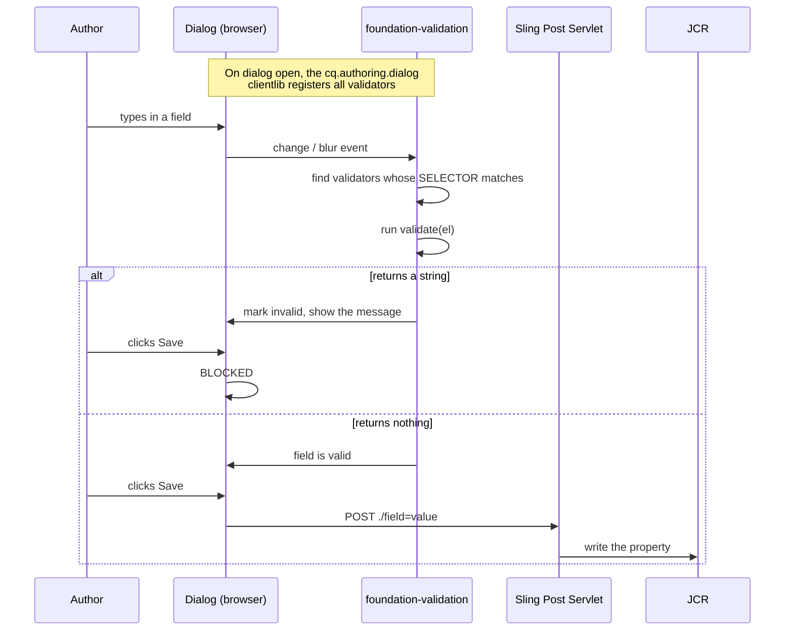
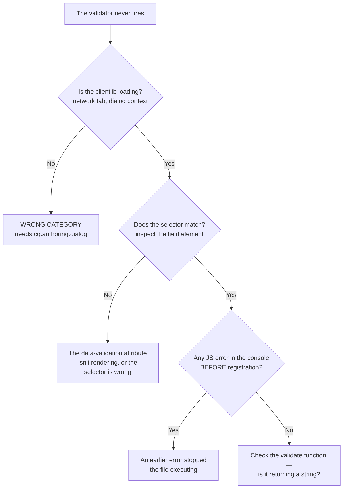

# 11 – Dialog Validation

> **Target:** 3–4 years experienced AEM Developer
> **Syllabus point covered (20):** *"How do you write validation JS for a component dialog?"*
> **Project domain:** a global energy technology company's marketing site.

---

## Before we start — two things that reframe this question

Your syllabus asks how to write validation JavaScript. That's the right question, but there are two things worth knowing before you write a line of it, and both are good things to say in an interview.

**First: try not to write any.** Granite UI gives you `required`, and the field types themselves constrain a lot — a pathfield restricted with `rootPath` cannot produce a bad path, and a select cannot produce a value outside its options. A good `fieldDescription` prevents more errors than a validator catches, because it stops the author making the mistake rather than telling them off afterwards. Reaching for custom JavaScript first is a mild code smell.

**Second, and more important: dialog validation is UX, not enforcement.**

It runs in the author's browser. It can be bypassed — by disabling JavaScript, by posting to the node directly, by a package install, by a content migration script, by MSM rolling a value in from a blueprint. So if a constraint genuinely matters for correctness or security, **it cannot only live in the dialog**.

That distinction is the thing that separates a good answer from a merely correct one. Section 2.8 covers where the real enforcement goes.

---

## 1. Introduction

### 1.1 What dialog validation actually is

Recall from file 02: a dialog is an **HTML form**, and saving it is a POST handled by the **Sling Post Servlet**. There is no special "dialog save" API.

So dialog validation is exactly what form validation is anywhere on the web — **client-side JavaScript that inspects field values and blocks submission if something is wrong.**

AEM provides a framework for it called **foundation-validation**, part of Granite UI. It is jQuery-based, and it works by letting you **register a validator against a CSS selector**. Any field matching that selector gets validated by your function.

That selector-based design is worth noticing, because it means a validator is not attached to a specific field — it is attached to a *pattern*, and any field that matches picks it up. One validator can serve twenty fields across ten components.

### 1.2 What you get for free

Before any JavaScript:

| Mechanism | What it does |
|---|---|
| `required="{Boolean}true"` | Field cannot be empty; submission is blocked |
| `rootPath` on a pathfield | Author can only browse within that subtree |
| A `select` field | Value must be one of the options |
| `min` / `max` on a numberfield | Numeric bounds |
| Field type itself | A datepicker cannot produce a non-date |

**The point worth making:** most validation requirements are better solved by **choosing the right field and constraining it** than by validating free text afterwards. If an author must pick a product page, a pathfield with `rootPath` is better than a textfield plus a validator — it makes the wrong answer unreachable rather than rejected.

### 1.3 A real project example to adapt

> "We have three custom validators. One checks that our product code fields match the expected format, because the codes feed an external system and a malformed one fails silently downstream. One enforces a character limit on SEO fields — technically it's a soft limit, so it warns rather than blocks. And one is a cross-field validator on a date range, making sure the end date is after the start.
>
> They live in a clientlib with category `cq.authoring.dialog`, which is what AEM loads in the dialog context. And for anything that genuinely matters we don't rely on the dialog alone — the product code is also validated in the Sling Model, because dialog validation is client-side and can be bypassed by a package install or an MSM rollout."

That covers the mechanism, the clientlib, the soft-versus-hard distinction, and the enforcement point.

---

## 2. Core Concepts

### 2.1 The foundation-validation registry

**This is the API your syllabus is asking about.**

```javascript
(function ($, $document) {
    "use strict";

    $.validator.register({
        selector: "[data-validation='energy.productcode']",

        validate: function (el) {
            var value = el.val();

            if (value && !/^[A-Z]{2}-\d{4}$/.test(value)) {
                // Returning a STRING means INVALID.
                // The string is the message shown to the author.
                return "Product code must be two letters, a hyphen, then four digits — e.g. TX-4000";
            }

            // Returning nothing means VALID.
        }
    });

})(jQuery, jQuery(document));
```

**Three things to understand about that:**

**`selector`** is a CSS selector. Any field in any dialog matching it gets this validator. That is why validators are reusable across components.

**`validate`** receives the element and returns either **a string** (invalid — and the string is the message shown) or **nothing** (valid). That inverted convention catches people: you return a value to indicate *failure*, not success.

**The empty check.** Notice `if (value && ...)`. An empty field is not this validator's problem — that is what `required` is for. Without that guard, an optional field would be flagged invalid when left blank, which is wrong and infuriating for authors.

### 2.2 Connecting the dialog field to the validator

The link is the **`validation` property** on the field, which Granite renders as a **`data-validation` attribute** on the element.

```xml
<productCode
    jcr:primaryType="nt:unstructured"
    sling:resourceType="granite/ui/components/coral/foundation/form/textfield"
    fieldLabel="Product Code"
    fieldDescription="Format: two letters, hyphen, four digits — for example TX-4000"
    name="./productCode"
    required="{Boolean}true"
    validation="energy.productcode"/>
```

That renders roughly as:

```html
<input type="text" name="./productCode" data-validation="energy.productcode">
```

Which is what `selector: "[data-validation='energy.productcode']"` matches.

**Why this indirection is good:** the field names a validator; the validator declares what it matches. Neither knows about the other's implementation, so you can change the rule without touching any dialog.

**You can select by anything, though.** The `data-validation` attribute is the conventional route, but the selector is a plain CSS selector:

```javascript
selector: "[name='./productCode']"                    // by field name
selector: ".energy-product-code"                      // by granite:class
selector: "coral-multifield [data-validation='x']"    // scoped to multifields
```

**Namespace your validator names.** `energy.productcode`, not `productcode`. These are global across every dialog in the instance — including Adobe's — so a generic name risks colliding with something you didn't write.

### 2.3 Where the clientlib goes

**This is the part that most often causes "my validation isn't running."**

```
/apps/energy/clientlibs/clientlib-authoring/
    ├── .content.xml
    ├── js.txt
    └── js/
        └── validators.js
```

`.content.xml`:

```xml
<?xml version="1.0" encoding="UTF-8"?>
<jcr:root xmlns:cq="http://www.day.com/jcr/cq/1.0"
          xmlns:jcr="http://www.jcp.org/jcr/1.0"
    jcr:primaryType="cq:ClientLibraryFolder"
    categories="[cq.authoring.dialog]"/>
```

**`cq.authoring.dialog` is the category AEM loads in the dialog context.** Get it wrong and your JavaScript never loads, the validator is never registered, and the field simply saves — with no error anywhere, because nothing failed. It just isn't there.

**Related categories worth knowing:**

| Category | Loaded in |
|---|---|
| `cq.authoring.dialog` | Component dialogs — **the one you want** |
| `cq.authoring.editor.hook` | The page editor itself |
| `granite.ui.coral.foundation` | The general Granite UI (Adobe's — don't add to it) |

**And a point that connects to file 04:** this is an **author-only** clientlib. It must never be embedded into the site bundle that visitors download. Authoring JavaScript shipped to the public is pure waste — and occasionally an information leak, since validators often encode business rules.

### 2.4 Hard versus soft validation

A distinction worth raising, because it shows you think about authors rather than just rules.

**Hard validation blocks the save.** Return a message from `validate` and the field is marked invalid and submission is prevented. Right when the value would actually break something.

**Soft validation warns but allows.** Sometimes the rule is a guideline — an SEO title *should* be under 60 characters, but an author may have a good reason to exceed it, and blocking them is presumptuous.

For soft rules, don't return a message. Show a hint instead:

```javascript
$.validator.register({
    selector: "[data-validation='energy.seolength']",
    validate: function (el) {
        var $el = $(el);
        var max = parseInt($el.data("maxLength"), 10) || 60;
        var length = ($el.val() || "").length;

        // A WARNING, not an error -- we show it and allow the save.
        var $hint = $el.closest(".coral-Form-fieldwrapper").find(".energy-length-hint");
        if (length > max) {
            $hint.text(length + " characters — search engines typically show about " + max)
                 .addClass("is-warning");
        } else {
            $hint.text("").removeClass("is-warning");
        }

        // Return NOTHING: the field stays valid and the author can save.
    }
});
```

**The interview point:**

> "I'd distinguish between rules that must block the save and rules that are guidance. A malformed product code breaks a downstream integration, so that blocks. An SEO title over sixty characters is a recommendation — the author might have a reason, and blocking them is presumptuous. For those I show a hint and let them save. Over-blocking is how authors end up hating a component."

### 2.5 Cross-field validation — and the trap in it

The genuinely tricky case: validating one field against another.

```javascript
$.validator.register({
    selector: "[data-validation='energy.enddate']",
    validate: function (el) {
        var $el = $(el);
        var $form = $el.closest("form");

        var start = $form.find("[name='./startDate']").val();
        var end = $el.val();

        if (start && end && new Date(end) < new Date(start)) {
            return "End date must be after the start date";
        }
    }
});
```

**That works — and it has a bug that catches nearly everyone.**

**The validator only runs when *its own* field changes.** So:

1. Author sets start = 1 June, end = 1 July. Valid. ✓
2. Author then changes start to 1 August.
3. **The end-date validator does not re-run**, because the end date didn't change.
4. The dialog saves with an invalid range.

**The fix is to trigger revalidation of the dependent field when the other one changes:**

```javascript
$document.on("change", "[name='./startDate']", function () {
    var $form = $(this).closest("form");
    // Poke the dependent field so its validator runs again
    $form.find("[name='./endDate']").trigger("change");
});
```

**This is an excellent thing to raise unprompted**, because it demonstrates you've actually built one rather than read about it:

> "The trap with cross-field validation is that a validator only fires when its own field changes. So if someone validates the end date against the start date, and the author then goes back and changes the *start* date, the validator never re-runs and an invalid range saves. You have to explicitly trigger a change event on the dependent field when the other one changes."

### 2.6 Passing configuration into a validator with `granite:data`

Rather than hardcoding limits in JavaScript, put them on the field:

```xml
<seoTitle
    jcr:primaryType="nt:unstructured"
    sling:resourceType="granite/ui/components/coral/foundation/form/textfield"
    fieldLabel="SEO Title"
    name="./seoTitle"
    validation="energy.maxlength">
    <granite:data
        jcr:primaryType="nt:unstructured"
        maxLength="60"/>
</seoTitle>
```

`granite:data` renders as `data-*` attributes, so in the validator:

```javascript
var max = parseInt($(el).data("maxLength"), 10) || 60;
```

**Why this matters:** one validator now serves every length-limited field in the project, with the limit configured per field in the dialog. Without it you'd need a validator per limit, or the limit hardcoded somewhere a template author can't see.

### 2.7 Show/hide — adjacent, and frequently asked together

Not validation, but it comes up in the same conversation and AEM gives it to you built in.

**Show a group of fields based on a dropdown:**

```xml
<linkType
    jcr:primaryType="nt:unstructured"
    sling:resourceType="granite/ui/components/coral/foundation/form/select"
    fieldLabel="Link Type"
    name="./linkType"
    granite:class="cq-dialog-dropdown-showhide">
    <granite:data
        jcr:primaryType="nt:unstructured"
        cq-dialog-dropdown-showhide-target=".link-type-target"/>
    <items jcr:primaryType="nt:unstructured">
        <internal jcr:primaryType="nt:unstructured" text="Internal page" value="internal"/>
        <external jcr:primaryType="nt:unstructured" text="External URL" value="external"/>
        <document jcr:primaryType="nt:unstructured" text="Document download" value="document"/>
    </items>
</linkType>

<internalGroup
    jcr:primaryType="nt:unstructured"
    sling:resourceType="granite/ui/components/coral/foundation/container"
    granite:class="hide link-type-target">
    <granite:data jcr:primaryType="nt:unstructured" showhidetargetvalue="internal"/>
    <items jcr:primaryType="nt:unstructured">
        <internalPath
            jcr:primaryType="nt:unstructured"
            sling:resourceType="granite/ui/components/coral/foundation/form/pathfield"
            fieldLabel="Page"
            name="./internalPath"
            rootPath="/content/energy"/>
    </items>
</internalGroup>
```

**The mechanism:** `cq-dialog-dropdown-showhide` on the select, a `cq-dialog-dropdown-showhide-target` selector pointing at the groups, and each group carrying `showhidetargetvalue` for the option that reveals it. There is an equivalent `cq-dialog-checkbox-showhide`.

**Worth mentioning because it's free.** Candidates often write custom JavaScript for this, and AEM already does it.

### 2.8 Where real enforcement lives

**The most important section in this file.**

Dialog validation runs in the author's browser. It can be bypassed:

- JavaScript disabled, or an error earlier in the clientlib preventing registration
- POSTing to the node directly
- Installing a content package
- A content migration script
- **An MSM rollout pushing a value in from a blueprint** — a real one on a multi-country site
- Content copied between environments

**So for anything that genuinely matters, validate again where it counts:**

**In the Sling Model**, treating the value as untrusted:

```java
@PostConstruct
protected void init() {
    // The dialog validator SHOULD have caught this, but a package
    // install or MSM rollout can write anything.
    this.validCode = productCode != null && PRODUCT_CODE.matcher(productCode).matches();
}

public boolean isReady() {
    return validCode;      // render nothing rather than something broken
}
```

**Or in a `SlingPostProcessor`**, which runs after the Sling Post Servlet has processed a POST — server-side, so it applies regardless of how the POST arrived.

**The interview answer:**

> "Dialog validation is UX, not enforcement. It runs in the author's browser, so it can be bypassed by disabling JavaScript, by POSTing directly, by a package install, by a content migration, or — the one people forget — by an MSM rollout pushing a value in from a blueprint.
>
> So for anything that actually matters I validate again server-side. Usually in the Sling Model, treating the value as untrusted and exposing an `isReady()` that renders nothing rather than something broken. For a hard constraint I'd use a `SlingPostProcessor`, which runs after the Sling Post Servlet regardless of how the POST arrived.
>
> The dialog validator is still worth having — it gives the author immediate, specific feedback at the point they can fix it, which is a much better experience than discovering a broken page later. But it's the first line, not the only one."

---

## 3. Internal Working

### 3.1 The validation lifecycle



**Three things to draw out:**

**Validators register when the clientlib loads, not per field.** If the clientlib isn't in the dialog context, nothing registers and every field silently passes.

**Validation runs on change and blur, and again on submit.** So a field the author never touched still gets checked at submit time — which is how `required` catches an untouched empty field.

**Once it reaches the Sling Post Servlet, no client-side validation exists any more.** That is the whole argument in 2.8, expressed as a diagram.

### 3.2 Why "my validation isn't running" is nearly always one of three things



**The third branch is the sneaky one.** A JavaScript error anywhere earlier in the same file — or in another file loaded before it in the same clientlib — stops execution, so `$.validator.register` never runs. The symptom is a validator that simply doesn't exist, with the real error sitting further up the console.

---

## 4. Important Interview Questions

### 4.1 Basic

**Q1. How do you add validation to a component dialog?**
Start with what's built in — `required`, `rootPath` on a pathfield, a select instead of free text. For anything custom, register a validator with `$.validator.register` in a clientlib with category `cq.authoring.dialog`, and point the field at it with a `validation` property.

*Cross:* What's the clientlib category? · What does `validate` return? · Why prefer built-ins first?

**Q2. What does the `validate` function return?**
A **string** if the value is invalid — that string becomes the message shown. **Nothing** if it's valid.

*Cross:* Isn't that backwards? (yes, it catches people) · What if the field is empty? (guard it — that's `required`'s job) · Can you show a warning without blocking? (yes — return nothing and display a hint)

**Q3. What is the clientlib category for dialog JavaScript?**
`cq.authoring.dialog`.

*Cross:* What happens with the wrong category? (**silent** — nothing registers, everything passes) · What's `cq.authoring.editor.hook`? (the page editor) · Should it be in the site bundle? (**never** — author-only)

**Q4. How does the field connect to the validator?**
The `validation` property on the field renders as a `data-validation` attribute, and the validator's `selector` matches it.

*Cross:* Can you select by something else? (yes — any CSS selector: name, class, structure) · Why namespace the validator name? (they're global across all dialogs, including Adobe's)

**Q5. What validation do you get without writing JavaScript?**
`required`, `rootPath` constraining a pathfield, `min`/`max` on a numberfield, and the field type itself — a select can't produce an off-list value, a datepicker can't produce a non-date.

*Cross:* Which would you prefer? (**constrain the field** — makes the wrong answer unreachable rather than rejected) · Give an example (pathfield with `rootPath` beats textfield plus validator)

**Q6. Can dialog validation be bypassed?**
Yes — it runs in the author's browser. Disabled JavaScript, a direct POST, a package install, a content migration, or an MSM rollout all bypass it.

*Cross:* So where does real enforcement go? (Sling Model, or a `SlingPostProcessor`) · Is the dialog validator still worth having? (**yes** — immediate feedback where the author can fix it)

**Q7. How do you pass configuration into a validator?**
A `granite:data` node on the field, which renders as `data-*` attributes and is readable with `$(el).data(...)`.

*Cross:* Why not hardcode it? (one validator serves many fields, each configured in its own dialog) · Give an example (a per-field character limit)

**Q8. How do you show and hide dialog fields based on a dropdown?**
`cq-dialog-dropdown-showhide` on the select, with a `cq-dialog-dropdown-showhide-target` selector and `showhidetargetvalue` on each group. Built into AEM — no custom JavaScript needed.

*Cross:* Is there a checkbox version? (yes) · Why does this come up? (people write custom JS for it unnecessarily)

### 4.2 Intermediate

**Q9. How do you validate one field against another?**
Traverse from the element to the form and read the other field's value in the `validate` function.

*Cross:* **What's the problem with that?** → Q10.

**Q10. What's the trap with cross-field validation?**
A validator only fires when **its own** field changes. So if the end date validates against the start date, and the author then changes the *start* date, the validator never re-runs and an invalid combination saves. You have to explicitly trigger a change on the dependent field.

*Cross:* How do you trigger it? (`$field.trigger("change")` from a listener on the other field) · Where does that listener go? (the same clientlib, bound on `$document`) · What if there are several dependents? (trigger each — or reconsider the design)

**Q11. My validation isn't running. Debug it.**
→ Section 3.2. Three causes: wrong clientlib category so nothing loads; the selector doesn't match the rendered element; or a JavaScript error earlier in the file stopped `register` from running.

*Cross:* How do you check the first? (network tab in the dialog context) · The second? (inspect the field, look for `data-validation`) · Why is the third sneaky? (**the real error is further up the console**)

**Q12. When would you warn rather than block?**
When the rule is guidance rather than correctness. An SEO title over 60 characters is a recommendation and the author may have a reason; a malformed product code breaks a downstream integration. Over-blocking is how authors end up resenting a component.

*Cross:* How do you implement a warning? (show a hint, return nothing) · Who decides which is which? (the content team, ideally — it's a business rule)

**Q13. Where should validation actually live?**
Both places, for different reasons. The dialog for immediate, specific feedback where the author can act on it. Server-side — the Sling Model or a `SlingPostProcessor` — for anything that must actually hold, because the dialog can be bypassed.

*Cross:* What's a `SlingPostProcessor`? (a service running after the Sling Post Servlet, regardless of how the POST arrived) · What does the model do with a bad value? (`isReady()` false — render nothing rather than something broken) · Which bypass do people forget? (**MSM rollout**)

**Q14. How do you validate inside a multifield?**
The same way — validators are selector-based, so a validator matching fields inside a multifield applies to every row. If you need cross-row validation, scope the traversal to the multifield rather than the whole form.

*Cross:* How do you scope it? (`.closest("coral-multifield-item")` for the row, `.closest("coral-multifield")` for the set) · What about validating the number of rows? (harder — the model is a better place, with a limit)

**Q15. Where does the authoring clientlib fit relative to your site clientlibs?**
Completely separate. Category `cq.authoring.dialog`, never embedded into the site bundle, because it's author-only. Shipping authoring JavaScript to visitors is wasted bytes and can leak business rules encoded in the validators.

*Cross:* Does it need `allowProxy`? (it's loaded on author where the user is authenticated, so the publish-404 problem from file 04 doesn't arise) · How would you catch it being in the site bundle? (`?debugClientLibs=true` on a public page)

### 4.3 Advanced

**Q16. Design validation for a product code field that feeds an external system.**

> "Layered, because the consequence is a silent downstream failure rather than a visible page problem.
>
> **In the dialog:** `required` plus a format validator, with a `fieldDescription` showing the expected format — so the author sees the rule *before* they get it wrong, not after. The error message includes an example, because 'invalid format' tells them nothing.
>
> **In the Sling Model:** validate again and treat it as untrusted. The dialog validator can be bypassed by a package install or an MSM rollout, and on a multi-country site rollouts genuinely do push values in from a blueprint. The model exposes `isReady()` so a bad value renders nothing rather than a broken integration.
>
> **And I'd log it** when the model finds an invalid code, at warn level with the path — because if it's arriving through a rollout, nobody will report it as a bug and it needs to be discoverable.
>
> **What I'd avoid** is validating the code against the external system live from the dialog. It's tempting, but it makes the dialog slow and it fails when the API is down — so the author is blocked by an outage in a system they've never heard of. If we needed that, it'd be an explicit 'check' button rather than blocking validation."

*Cross:* Why not call the API on blur? · What if the format changes? (a config, not a hardcoded regex) · How would the author know a rollout broke it? (the log, plus ideally a report)

**Q17. How would you validate that a component isn't used more than once on a page?**

Not in the dialog — the dialog can't see the rest of the page reliably, and by the time it opens the component already exists. This belongs in the **template policy** (file 03), which controls what's allowed in a container, or in the component's own rendering, where the model can detect siblings of the same resource type and render a message in edit mode.

*Cross:* Why not the dialog? (wrong layer — the constraint is about placement, not values) · How would the model detect it? (walk the parent's children comparing resource types) · What would you render? (edit-mode-only warning, nothing on publish)

**Q18. An author says a validator is blocking something legitimate. How do you handle it?**

Treat it as a requirements question first. Either the rule is wrong and should be relaxed, or it's right and the author has a genuine exception that needs an explicit route. What I'd avoid is quietly weakening the validator so it stops complaining — that removes the protection for everyone to solve one case.

If it's genuinely guidance rather than correctness, converting it from hard to soft validation is usually the right answer.

*Cross:* Who decides? (the content owner, not the developer) · What if it's a compliance rule? (then it hardens, not softens — and it needs server-side enforcement too)

**Q19. How do you test dialog validation?**

Honestly, mostly manually — it's browser JavaScript in the authoring UI. The realistic approaches are the AEM UI test framework or an external browser automation suite, which most projects run for a handful of critical flows rather than every validator.

**What I would definitely test automatically is the server-side counterpart** — the Sling Model's handling of a bad value is a normal unit test, and that's the layer that actually has to hold.

*Cross:* Is that a gap? (yes, and worth admitting) · What would you prioritise? (the server-side validation, because it's the one that matters) · What about the validator logic itself? (extractable into a pure function and unit-testable with a JS test runner, if the project has one)

---

## 5. Cross Questions — how this topic gets drilled

**Thread A — from "how do you write dialog validation"**
Which API? → What does `validate` return? → What if the field is empty? → Where does the JavaScript live? → Which clientlib category? → What if it's wrong? → How does the field find the validator?

**Thread B — from "can it be bypassed"**
How? → Name three ways → What about MSM? → So where does real validation go? → What's a `SlingPostProcessor`? → What does the model do with a bad value? → Is the dialog validator still worth having?

**Thread C — from "cross-field validation"**
How do you read the other field? → **What's the problem?** → When does a validator fire? → So what breaks? → How do you fix it? → Where does that listener live?

**Thread D — from "my validation isn't running"**
What would you check first? → How do you confirm the clientlib loaded? → How do you confirm the selector matches? → What else could stop registration? → Why is a JS error sneaky here?

---

## 6. Best Interview Answers

### 6.1 "How do you write validation JS for a component dialog?" — about 2 minutes

**Your syllabus point 20, directly.**

> "First, I'd try not to. Granite gives you `required`, and constraining the field type solves most requirements better than validating free text afterwards — a pathfield with a `rootPath` makes a bad path unreachable rather than rejected, and a good `fieldDescription` prevents more errors than a validator catches.
>
> When I do need custom validation, AEM has the **foundation-validation** framework. You register a validator with `$.validator.register`, giving it a **CSS selector** and a **validate function**. The selector decides which fields it applies to, and the validate function returns a **string** if the value is invalid — that string becomes the message shown — or **nothing** if it's valid. That's inverted from what people expect, so it's worth being explicit about.
>
> The JavaScript goes in a clientlib with category **`cq.authoring.dialog`**, which is what AEM loads in the dialog context. Getting that category wrong is the most common reason validation 'doesn't work' — nothing registers and every field silently passes, with no error anywhere.
>
> The field connects to the validator through a **`validation` property**, which Granite renders as a `data-validation` attribute that the selector matches. I namespace the names — `energy.productcode` rather than `productcode` — because they're global across every dialog in the instance including Adobe's.
>
> For configuration I use a **`granite:data`** node on the field, which renders as data attributes. So one length validator serves every length-limited field, with the limit set per field in the dialog rather than hardcoded in JavaScript.
>
> And the thing I'd add unprompted: **dialog validation is UX, not enforcement.** It runs in the author's browser, so it's bypassed by a direct POST, a package install, a content migration, or — the one people forget — an MSM rollout pushing a value in from a blueprint. So for anything that actually matters I validate again in the Sling Model, treating the value as untrusted and rendering nothing rather than something broken. The dialog validator is still worth having, because immediate feedback at the point the author can fix it is a much better experience than discovering a broken page later. But it's the first line, not the only one."

### 6.2 "What's the trap with cross-field validation?" — about 45 seconds

> "A validator only fires when **its own** field changes.
>
> So say I validate that an end date is after a start date. The author sets start to June and end to July — valid. Then they go back and change the start date to August. The end-date validator never re-runs, because the end date didn't change, and the dialog saves with an invalid range.
>
> The fix is to explicitly trigger revalidation of the dependent field when the other one changes — bind a change listener on the start date that fires a change event on the end date, so its validator runs again.
>
> It's the kind of thing you only find by actually building one, because it works perfectly in the obvious test where you fill the fields in order."

### 6.3 "Where should validation really live?" — about 60 seconds

> "Both places, for different reasons.
>
> The **dialog** is for the author's benefit — immediate, specific feedback at the moment they can fix it, with a message that says what the right format actually is. That's a genuinely better experience than saving and discovering a broken page later.
>
> But it can't be the only line, because it's client-side. It's bypassed by disabling JavaScript, by POSTing to the node directly, by installing a package, by a content migration script, and — the one that catches people on a multi-country site — by an **MSM rollout** pushing a value in from a blueprint. None of those go anywhere near the dialog.
>
> So for anything that matters I validate again **server-side**. Usually in the Sling Model, treating the value as untrusted and exposing an `isReady()` so a bad value renders nothing rather than something broken. For a hard constraint I'd use a `SlingPostProcessor`, which runs after the Sling Post Servlet regardless of how the POST arrived.
>
> And I'd log at warn when the model rejects a value, because if it arrived through a rollout nobody is going to report it as a bug."

---

## 7. Real Project Examples

### Story 1 — The validator that silently wasn't there

**What happened.** A product code validator was written, tested locally, and deployed. Weeks later, malformed codes started appearing in the downstream system. The validator had never run in production.

**The investigation.** Opening a dialog and inspecting the field showed the `data-validation` attribute rendering correctly. So the field was configured right. But the network tab showed the authoring clientlib was never requested.

**The cause.** The clientlib's category was `cq.authoring.dialogs` — plural. A single character.

**Why it survived testing.** The developer had tested by loading the JavaScript through the browser console during development, which registered the validator for that session. The dialog behaved correctly. The clientlib itself was never actually exercised.

**Why the failure is so quiet.** A missing validator doesn't error — it doesn't exist. Every field just passes. There's nothing in any log, because nothing failed.

**The fix and what changed.** The category, obviously. But more usefully we added a **server-side check in the Sling Model**, so a malformed code renders nothing and logs at warn. That turned a silent downstream failure into a visible one, and it would have caught the problem regardless of the clientlib.

**The lesson to state:** *"Client-side validation failing is silent by nature, so the server-side check isn't just defence in depth — it's the only thing that will actually tell you."*

### Story 2 — The date range that saved backwards

**What happened.** A campaign banner with start and end dates occasionally went live with an end date before the start, so it never displayed. Authors insisted the dialog had validated.

**The cause.** They were right. The validator worked — but only when the *end* date changed. Authors were setting both dates, seeing it validate, then going back and adjusting the **start** date. The end-date validator never re-ran.

**The fix.** A change listener on the start date that triggers a change on the end date, forcing revalidation.

**Why it took a while to find.** Every reproduction attempt filled the fields in order, which works. The bug only appears when you go back and edit an earlier field — which is exactly what real authors do and test scripts don't.

**What we changed more broadly.** We took the same approach with the model: it checks the range and renders nothing if it's inverted, rather than rendering a banner that silently never displays. A component that renders nothing is diagnosable; one that renders and doesn't show is not.

### Story 3 — Softening a validator instead of removing it

**What happened.** An SEO title validator enforced a 60-character maximum as a hard block. The content team raised it repeatedly — some product names are genuinely long, and the rule is a guideline about how search results display, not a correctness constraint.

**The initial reaction** was to relax the limit to 80. Which would have been wrong — it doesn't solve the problem, it just moves it, and it weakens the guidance for the 95% of cases where 60 is right.

**What we did instead.** Converted it from hard to soft. The field shows a live character count with a warning above 60 explaining *why* — that search engines typically truncate around there. The author sees the guidance, understands the reason, and can proceed if they have cause.

**Result.** The complaints stopped, and the average title length actually went *down*, because authors could see the count as they typed rather than being blocked after the fact.

**The point to make:** *"The question wasn't 'what should the limit be', it was 'is this a rule or a guideline'. Getting that wrong in either direction causes problems — over-blocking makes authors resent the component, and under-blocking lets real errors through."*

---

## 8. Coding Examples

### 8.1 The complete validator clientlib

`/apps/energy/clientlibs/clientlib-authoring/.content.xml`

```xml
<?xml version="1.0" encoding="UTF-8"?>
<jcr:root xmlns:cq="http://www.day.com/jcr/cq/1.0"
          xmlns:jcr="http://www.jcp.org/jcr/1.0"
    jcr:primaryType="cq:ClientLibraryFolder"

    <!-- THE CATEGORY THAT MATTERS.
         cq.authoring.dialog is what AEM loads in the dialog context.
         Get this wrong and NOTHING registers -- every field silently
         passes, with no error anywhere, because nothing failed. -->
    categories="[cq.authoring.dialog]"/>
```

`js.txt`

```
#base=js

validators.js
listeners.js
```

`js/validators.js`

```javascript
/**
 * Dialog validators for the energy site.
 *
 * Registered against the Granite UI foundation-validation framework.
 * Validators are selector-based, so one validator serves every field
 * whose data-validation attribute matches -- across all components.
 *
 * NAMING: always namespaced ("energy.*"). These are GLOBAL across
 * every dialog in the instance, including Adobe's own, so a generic
 * name risks colliding with something we didn't write.
 */
(function ($, $document) {
    "use strict";

    var PRODUCT_CODE = /^[A-Z]{2}-\d{4}$/;

    // ---------------------------------------------------------------
    // 1. FORMAT VALIDATION (hard -- blocks the save)
    // ---------------------------------------------------------------
    $.validator.register({
        selector: "[data-validation='energy.productcode']",

        validate: function (el) {
            var value = el.val();

            // Empty is NOT this validator's problem -- that's what
            // required is for. Without this guard an optional field
            // would be flagged when left blank, which is wrong and
            // infuriating for authors.
            if (!value) {
                return;
            }

            if (!PRODUCT_CODE.test(value)) {
                // Returning a STRING means INVALID, and the string is
                // the message shown. Include an EXAMPLE -- "invalid
                // format" tells the author nothing actionable.
                return "Product code must be two letters, a hyphen, then four digits — for example TX-4000";
            }

            // Returning NOTHING means valid.
        }
    });

    // ---------------------------------------------------------------
    // 2. INTERNAL LINK VALIDATION (hard)
    // ---------------------------------------------------------------
    $.validator.register({
        selector: "[data-validation='energy.internallink']",

        validate: function (el) {
            var value = el.val();
            if (!value) {
                return;
            }
            // External URLs are fine; internal paths must be in our tree
            if (value.indexOf("/") === 0 && value.indexOf("/content/energy") !== 0) {
                return "Internal links must point to a page under /content/energy";
            }
        }
    });

    // ---------------------------------------------------------------
    // 3. LENGTH GUIDANCE (SOFT -- warns but ALLOWS the save)
    // ---------------------------------------------------------------
    $.validator.register({
        selector: "[data-validation='energy.seolength']",

        validate: function (el) {
            var $el = $(el);

            // Configuration comes from granite:data on the FIELD, so one
            // validator serves every length-limited field with its own
            // limit set in its own dialog.
            var max = parseInt($el.data("maxLength"), 10) || 60;
            var length = ($el.val() || "").length;

            var $wrapper = $el.closest(".coral-Form-fieldwrapper");
            var $hint = $wrapper.find(".energy-length-hint");

            if ($hint.length === 0) {
                $hint = $("<span class='energy-length-hint'></span>").appendTo($wrapper);
            }

            if (length > max) {
                $hint.text(length + " characters — search engines typically show about " + max)
                     .addClass("is-warning");
            } else {
                $hint.text(length + " / " + max).removeClass("is-warning");
            }

            // RETURN NOTHING.
            //
            // This is guidance, not correctness. An author may have a
            // genuine reason to exceed it, and blocking them is
            // presumptuous. Over-blocking is how authors come to resent
            // a component.
        }
    });

    // ---------------------------------------------------------------
    // 4. CROSS-FIELD VALIDATION (hard)
    // ---------------------------------------------------------------
    $.validator.register({
        selector: "[data-validation='energy.enddate']",

        validate: function (el) {
            var $el = $(el);
            var $form = $el.closest("form");

            var start = $form.find("[name='./startDate']").val();
            var end = $el.val();

            if (!start || !end) {
                return;
            }

            if (new Date(end) < new Date(start)) {
                return "End date must be after the start date";
            }

            // NOTE: this validator only fires when THIS field changes.
            // If the author later edits the START date, it does NOT
            // re-run. See listeners.js for the fix.
        }
    });

})(jQuery, jQuery(document));
```

`js/listeners.js` — **the cross-field fix**

```javascript
/**
 * Triggers revalidation of dependent fields.
 *
 * THE PROBLEM THIS SOLVES:
 *
 *   A Granite validator only fires when ITS OWN field changes. So:
 *
 *     1. Author sets start = June, end = July     → valid
 *     2. Author goes back, changes start = August
 *     3. The END DATE validator does NOT re-run
 *     4. The dialog saves with an invalid range
 *
 *   It works perfectly if you fill the fields in order, which is
 *   exactly what every test does and no real author does.
 */
(function ($, $document) {
    "use strict";

    $document.on("change", "[name='./startDate']", function () {
        var $form = $(this).closest("form");
        // Poke the dependent field so its validator runs again
        $form.find("[name='./endDate']").trigger("change");
    });

    // Live character count as the author types, not just on blur
    $document.on("input", "[data-validation='energy.seolength']", function () {
        $(this).trigger("change");
    });

})(jQuery, jQuery(document));
```

### 8.2 The dialog fields

```xml
<productCode
    jcr:primaryType="nt:unstructured"
    sling:resourceType="granite/ui/components/coral/foundation/form/textfield"
    fieldLabel="Product Code"

    <!-- fieldDescription PREVENTS errors; the validator only CATCHES
         them. Showing the format up front is worth more than a good
         error message afterwards. -->
    fieldDescription="Two letters, a hyphen, then four digits — for example TX-4000"

    name="./productCode"
    required="{Boolean}true"

    <!-- Renders as data-validation="energy.productcode",
         which the validator's selector matches. -->
    validation="energy.productcode"/>

<seoTitle
    jcr:primaryType="nt:unstructured"
    sling:resourceType="granite/ui/components/coral/foundation/form/textfield"
    fieldLabel="SEO Title"
    fieldDescription="Shown in search results. Around 60 characters displays well."
    name="./seoTitle"
    validation="energy.seolength">
    <!-- Configuration for the validator, per field.
         Renders as data-max-length, read with $(el).data("maxLength"). -->
    <granite:data
        jcr:primaryType="nt:unstructured"
        maxLength="60"/>
</seoTitle>

<startDate
    jcr:primaryType="nt:unstructured"
    sling:resourceType="granite/ui/components/coral/foundation/form/datepicker"
    fieldLabel="Campaign Start"
    name="./startDate"
    type="date"
    displayedFormat="DD MMMM YYYY"
    valueFormat="YYYY-MM-DD"/>

<endDate
    jcr:primaryType="nt:unstructured"
    sling:resourceType="granite/ui/components/coral/foundation/form/datepicker"
    fieldLabel="Campaign End"
    name="./endDate"
    type="date"
    displayedFormat="DD MMMM YYYY"
    valueFormat="YYYY-MM-DD"
    validation="energy.enddate"/>

<!-- No validator needed: rootPath makes a wrong answer UNREACHABLE
     rather than rejected. Constraining the field beats validating it. -->
<productPage
    jcr:primaryType="nt:unstructured"
    sling:resourceType="granite/ui/components/coral/foundation/form/pathfield"
    fieldLabel="Product Page"
    name="./productPage"
    rootPath="/content/energy/global/en/products"/>
```

### 8.3 The server-side counterpart

**The layer that actually holds.**

```java
package com.energy.core.models;

import org.apache.commons.lang3.StringUtils;
import org.apache.sling.api.resource.Resource;
import org.apache.sling.models.annotations.DefaultInjectionStrategy;
import org.apache.sling.models.annotations.Model;
import org.apache.sling.models.annotations.injectorspecific.SlingObject;
import org.apache.sling.models.annotations.injectorspecific.ValueMapValue;
import org.slf4j.Logger;
import org.slf4j.LoggerFactory;

import javax.annotation.PostConstruct;
import java.util.regex.Pattern;

@Model(adaptables = Resource.class,
       defaultInjectionStrategy = DefaultInjectionStrategy.OPTIONAL)
public class ProductCodeModel {

    private static final Logger LOG = LoggerFactory.getLogger(ProductCodeModel.class);

    // The SAME rule as the dialog validator. Kept here because the
    // dialog can be bypassed and this is the layer that has to hold.
    private static final Pattern PRODUCT_CODE = Pattern.compile("^[A-Z]{2}-\\d{4}$");

    @ValueMapValue
    private String productCode;

    @SlingObject
    private Resource resource;

    private boolean valid;

    @PostConstruct
    protected void init() {
        this.valid = StringUtils.isNotBlank(productCode)
                && PRODUCT_CODE.matcher(productCode).matches();

        if (StringUtils.isNotBlank(productCode) && !valid) {
            // LOG IT.
            //
            // The dialog validator SHOULD have caught this. If an invalid
            // value is here, it arrived some other way -- a package
            // install, a content migration, or an MSM rollout pushing a
            // value in from a blueprint. Nobody is going to report that
            // as a bug, so it has to be discoverable.
            LOG.warn("Invalid product code '{}' at {} — dialog validation was bypassed",
                    productCode, resource.getPath());
        }
    }

    public String getProductCode() {
        return valid ? productCode : null;
    }

    /**
     * Render NOTHING rather than something broken. A component that
     * renders nothing is diagnosable; one that renders and silently
     * fails downstream is not.
     */
    public boolean isReady() {
        return valid;
    }
}
```

### 8.4 Show/hide without custom JavaScript

```xml
<linkType
    jcr:primaryType="nt:unstructured"
    sling:resourceType="granite/ui/components/coral/foundation/form/select"
    fieldLabel="Link Type"
    name="./linkType"
    granite:class="cq-dialog-dropdown-showhide">
    <granite:data
        jcr:primaryType="nt:unstructured"
        cq-dialog-dropdown-showhide-target=".link-type-target"/>
    <items jcr:primaryType="nt:unstructured">
        <internal jcr:primaryType="nt:unstructured" text="Internal page"     value="internal" selected="{Boolean}true"/>
        <external jcr:primaryType="nt:unstructured" text="External URL"      value="external"/>
        <document jcr:primaryType="nt:unstructured" text="Document download" value="document"/>
    </items>
</linkType>

<internalGroup
    jcr:primaryType="nt:unstructured"
    sling:resourceType="granite/ui/components/coral/foundation/container"
    granite:class="hide link-type-target">
    <granite:data jcr:primaryType="nt:unstructured" showhidetargetvalue="internal"/>
    <items jcr:primaryType="nt:unstructured">
        <internalPath
            jcr:primaryType="nt:unstructured"
            sling:resourceType="granite/ui/components/coral/foundation/form/pathfield"
            fieldLabel="Page"
            name="./internalPath"
            rootPath="/content/energy"/>
    </items>
</internalGroup>

<externalGroup
    jcr:primaryType="nt:unstructured"
    sling:resourceType="granite/ui/components/coral/foundation/container"
    granite:class="hide link-type-target">
    <granite:data jcr:primaryType="nt:unstructured" showhidetargetvalue="external"/>
    <items jcr:primaryType="nt:unstructured">
        <externalUrl
            jcr:primaryType="nt:unstructured"
            sling:resourceType="granite/ui/components/coral/foundation/form/textfield"
            fieldLabel="URL"
            name="./externalUrl"
            validation="energy.externalurl"/>
    </items>
</externalGroup>
```

**Zero custom JavaScript.** This is built into AEM, and candidates frequently write their own. There is an equivalent `cq-dialog-checkbox-showhide`.

---

## 9. Common Mistakes

| The mistake | What actually happens | The fix |
|---|---|---|
| Wrong clientlib category | **Nothing registers — silently.** Every field passes. | `cq.authoring.dialog` |
| Validator name not namespaced | Collides with another validator, including Adobe's | `energy.something` |
| No empty-value guard | Optional fields flagged invalid when blank | `if (!value) return;` |
| Returning `true` for valid | Backwards — a truthy return means invalid | Return **nothing** for valid |
| Vague error messages | Author can't tell what to change | Include the expected format and an example |
| Cross-field validator with no trigger | **Stale** — doesn't re-run when the other field changes | Trigger a change on the dependent field |
| Hard-blocking a guideline | Authors resent the component and route around it | Warn and allow |
| Relying only on dialog validation | Bypassed by package install, migration, **MSM rollout** | Validate again in the model |
| Hardcoding limits in JavaScript | One validator per limit, invisible to template authors | `granite:data` on the field |
| Authoring clientlib in the site bundle | Author-only JavaScript shipped to visitors | Separate category, never embedded |
| Custom JS for show/hide | Reinventing something AEM provides | `cq-dialog-dropdown-showhide` |
| Free text plus a validator where a constrained field would do | Rejects bad input instead of preventing it | Pathfield with `rootPath`, or a select |
| Calling an external API from a validator | Slow dialogs, and the author is blocked by someone else's outage | An explicit check button, or validate server-side |
| Slow validate function | Runs on every change — the dialog feels laggy | Keep it cheap; no network calls |
| A JS error earlier in the file | Registration never runs; the validator doesn't exist | Check the console **above** where you're looking |

---

## 10. Best Practices

**Prefer prevention.** Constrain the field type before validating free text. A pathfield with `rootPath` beats a textfield plus a regex. A `fieldDescription` stating the format prevents more errors than any message catches.

**Distinguish rules from guidelines.** Hard-block what would actually break; warn on what's merely advisable. Over-blocking is how authors come to resent a component and start working around it.

**Write messages an author can act on.** Include the expected format and an example. "Invalid" is useless.

**Namespace validators**, and configure them with `granite:data` rather than hardcoding, so one validator serves many fields.

**Guard the empty case.** Emptiness is `required`'s job.

**Handle the cross-field trap** explicitly — a dependent validator needs a trigger from the field it depends on.

**Always validate server-side too** for anything that matters, and log at warn when the server rejects something, because a bypassed value arrived some way nobody will report.

**Keep the validate function cheap.** It runs on every change. No network calls.

**Keep authoring clientlibs out of the site bundle.**

---

## 11. Debugging Tips

**The three causes, in order**, from section 3.2:

**1. Is the clientlib loading?** Open a dialog, look at the network tab, and search for your category. If it isn't there, the category is wrong — and remember this failure is completely silent, because a missing validator doesn't error, it just doesn't exist.

**2. Does the selector match?** Inspect the field element in the DOM and confirm the `data-validation` attribute is actually rendered with the value you expect. If the field has no attribute, the `validation` property is missing or misspelled in the dialog XML.

**3. Is there a JavaScript error *earlier* in the file?** This is the sneaky one. An error anywhere before `$.validator.register` stops execution, so registration never happens. The real error is further up the console than where you're looking.

**A quick way to confirm registration** — in the browser console with a dialog open:

```javascript
// Does the selector match anything in this dialog?
jQuery("[data-validation='energy.productcode']").length
```

Zero means the field isn't rendering the attribute. Non-zero means the field is fine and the problem is registration.

**When validation blocks but shows no message:** the validate function is returning something non-string-like, or the field wrapper structure isn't what your custom display code expects.

**When it works on one dialog and not another:** the selector is matching more or less than you intended. Test it in the console on both dialogs.

| Tool | Answers |
|---|---|
| Network tab, dialog open | Did the authoring clientlib load |
| Element inspector | Is `data-validation` rendered |
| Browser console | JS errors that stopped registration |
| `jQuery("[data-validation='x']").length` | Does the selector match |
| `?debugClientLibs=true` on a public page | Did authoring JS leak into the site bundle |

---

## 12. Performance Notes

**The validate function runs on every change event.** A regex is fine. A repository lookup or an HTTP call is not — the dialog becomes laggy and the author feels it on every keystroke.

**Never call an external system from a validator.** Beyond the latency, it means the author is blocked when a system they've never heard of is down. If you genuinely need to check against an external source, make it an explicit action the author triggers, not something that runs while they type.

**Keep the authoring clientlib small and separate.** It only loads on author, so it doesn't affect site performance — but only if it isn't embedded in the site bundle.

**`input` events fire per keystroke.** If you bind to them for a live character count, that's fine for a string length check and wrong for anything heavier.

---

## 13. Real Production Scenarios

**1. Validation never runs, no errors anywhere.** Wrong clientlib category. Silent by nature.

**2. Validator works locally, not after deployment.** The clientlib wasn't in the package filter, or the category differs between environments.

**3. Optional fields flagged invalid when empty.** No empty-value guard in the validator.

**4. Cross-field validation saves invalid combinations.** The dependent validator doesn't re-run when the other field changes.

**5. Authors complain a validator blocks legitimate content.** A guideline implemented as a hard rule. Convert to a warning.

**6. Invalid values appear despite validation.** Bypassed — package install, migration, or an **MSM rollout**.

**7. A validator stops working after adding another JS file.** An error in the new file stopped the whole clientlib executing.

**8. Two validators conflict.** Names not namespaced, or selectors overlapping unintentionally.

**9. Dialog feels sluggish while typing.** Expensive work in a validate function bound to `input`.

**10. Authors blocked when an external system is down.** A validator calling an API.

**11. Authoring JavaScript downloaded by site visitors.** The authoring clientlib embedded into the site bundle.

**12. Validation works for the first multifield row only.** The selector is scoped too narrowly, or bound once rather than delegated.

**13. Error message shown but the author can't fix it.** The message states the rule without the expected format.

**14. Show/hide implemented in custom JS and broken by an AEM upgrade.** Should have used `cq-dialog-dropdown-showhide`.

**15. Field validates on save but not on change.** The selector matches at submit but the change binding is on a different element.

---

## 14. Follow-up Questions

- How many custom validators does your project have?
- Where does the validation clientlib live?
- Have you done cross-field validation?
- Do you validate server-side as well?
- Has a validator ever blocked something legitimate?
- How do you decide between blocking and warning?
- How do you test dialog validation?
- **What's the most annoying dialog you've had to work with?**

That last one is a genuine opening: *"One with fifteen required fields across one tab and no field descriptions. Authors filled it in wrong constantly, and the fix wasn't more validation — it was tabs, help text, and sensible `cq:template` defaults so the component didn't arrive empty."*

---

## 15. Comparison Tables

**Validation layers**

| Layer | Runs where | Bypassable | Purpose |
|---|---|---|---|
| Field type / `rootPath` | Browser | Hard to | **Prevention** — makes wrong unreachable |
| `required` | Browser | Yes | Basic completeness |
| Custom validator JS | Browser | Yes | Specific rules, good messages |
| Sling Model check | **Server** | **No** | Correctness at render |
| `SlingPostProcessor` | **Server** | **No** | Hard constraint on write |

**Hard versus soft**

| | Hard | Soft |
|---|---|---|
| Returns | A message string | Nothing |
| Save | **Blocked** | Allowed |
| Use for | Would actually break something | Guidance |
| Example | Malformed product code | SEO title length |

**Clientlib categories**

| Category | Loaded in |
|---|---|
| `cq.authoring.dialog` | **Component dialogs** |
| `cq.authoring.editor.hook` | The page editor |
| Your site category | Public pages — **never** put authoring JS here |

**Constrain versus validate**

| Requirement | Better approach |
|---|---|
| Must be a page in our site | **Pathfield with `rootPath`** |
| One of three values | **A select** |
| A date | **A datepicker** |
| Non-empty | **`required`** |
| A specific format | A validator (nothing else fits) |
| Consistent with another field | A validator, plus the change trigger |

---

## 16. Memory Tricks

**The return convention:** *"Return a message to reject; return nothing to accept."* Backwards from instinct, so say it out loud.

**The category:** *"Dialog JS lives in `cq.authoring.dialog`."* The single most common failure.

**The silence:** *"A missing validator doesn't error — it doesn't exist."*

**Cross-field:** *"A validator only fires for its own field."*

**Enforcement:** *"The dialog is UX; the server is the rule."*

**Design order:** *"Constrain, describe, then validate."* Pick the right field, explain it, and only then write JavaScript.

**Hard vs soft:** *"Block what breaks, warn what's merely better."*

**Empty:** *"Empty is `required`'s job, not yours."*

---

## 17. Revision Notes

- A dialog is an HTML form; saving is a POST handled by the **Sling Post Servlet** (file 02). Validation is ordinary client-side form validation.
- **Try built-ins first:** `required`, `rootPath` on a pathfield, a select, `min`/`max`. **Constraining the field beats validating free text** — it makes the wrong answer unreachable rather than rejected.
- **Custom validation** uses Granite's **foundation-validation**: `$.validator.register({ selector, validate })`.
- **`validate` returns a STRING if invalid** (that string is the message) and **nothing if valid**. Inverted from instinct.
- **Guard the empty case** — `if (!value) return;` — because emptiness is `required`'s job.
- **The clientlib category is `cq.authoring.dialog`.** Wrong category = **nothing registers, silently**. Never embed authoring JS in the site bundle.
- The field's **`validation` property** renders as a **`data-validation` attribute**, which the selector matches. **Namespace validator names** — they're global across all dialogs including Adobe's.
- **`granite:data`** on the field renders as `data-*` attributes, so one validator serves many fields with per-field configuration.
- **Hard vs soft:** return a message to block; show a hint and return nothing to warn. Over-blocking makes authors resent the component.
- **CROSS-FIELD TRAP:** a validator only fires when **its own** field changes. Change the *other* field afterwards and it never re-runs. Fix by triggering a change on the dependent field.
- **Show/hide is built in:** `cq-dialog-dropdown-showhide` with `cq-dialog-dropdown-showhide-target` and `showhidetargetvalue`. No custom JS needed.
- **Dialog validation is UX, not enforcement.** Bypassed by a direct POST, a package install, a content migration, and **MSM rollouts**. Validate again in the **Sling Model** (`isReady()` renders nothing) or a **`SlingPostProcessor`**, and **log at warn**, because a bypassed value arrived a way nobody will report.
- **Debugging, in order:** clientlib loaded? · selector matching? · **a JS error earlier in the file** stopping registration?

---

## 18. Cheat Sheet

**Register a validator**
```javascript
(function ($, $document) {
    "use strict";
    $.validator.register({
        selector: "[data-validation='energy.productcode']",
        validate: function (el) {
            var v = el.val();
            if (!v) { return; }                     // empty = required's job
            if (!/^[A-Z]{2}-\d{4}$/.test(v)) {
                return "Must be like TX-4000";      // STRING = invalid
            }
            // nothing returned = valid
        }
    });
})(jQuery, jQuery(document));
```

**Clientlib**
```xml
jcr:primaryType="cq:ClientLibraryFolder"
categories="[cq.authoring.dialog]"
```

**Dialog field**
```xml
validation="energy.productcode"      → renders data-validation="..."
required="{Boolean}true"
fieldDescription="Format: TX-4000"   → prevents, don't just catch

<granite:data jcr:primaryType="nt:unstructured" maxLength="60"/>
    → renders data-max-length, read as $(el).data("maxLength")
```

**Cross-field revalidation**
```javascript
$document.on("change", "[name='./startDate']", function () {
    $(this).closest("form").find("[name='./endDate']").trigger("change");
});
```

**Show/hide (built in)**
```xml
select:  granite:class="cq-dialog-dropdown-showhide"
         <granite:data cq-dialog-dropdown-showhide-target=".my-target"/>
group:   granite:class="hide my-target"
         <granite:data showhidetargetvalue="optionValue"/>

checkbox equivalent: cq-dialog-checkbox-showhide
```

**Server-side counterpart**
```java
@PostConstruct
protected void init() {
    this.valid = PATTERN.matcher(value).matches();
    if (value != null && !valid) {
        LOG.warn("Invalid value '{}' at {} — dialog validation bypassed",
                 value, resource.getPath());
    }
}
public boolean isReady() { return valid; }
```

**Debug**
```
network tab (dialog open)                did the clientlib load
inspect the field                        is data-validation rendered
console, ABOVE where you're looking      earlier JS error
jQuery("[data-validation='x']").length   does the selector match
```

---

## 19. Frequently Forgotten Things

1. **Return a string for INVALID, nothing for valid.** Backwards from instinct.
2. **`cq.authoring.dialog`** is the clientlib category.
3. **A wrong category fails silently** — no error, every field passes.
4. **Guard the empty case**, or optional fields get flagged.
5. **A validator only fires for its own field** — the cross-field trap.
6. **`validation` renders as `data-validation`.**
7. **Namespace validator names** — they're global across every dialog.
8. **`granite:data` renders as `data-*`** for per-field configuration.
9. **Dialog validation is bypassable** — including by **MSM rollouts**.
10. **Log server-side rejections at warn**, because nobody will report a bypassed value.
11. **Show/hide is built in** — don't write it.
12. **Authoring clientlibs must not be in the site bundle.**
13. **A JS error earlier in the file** stops registration entirely.
14. **Constraining a field beats validating free text.**
15. **The validate function runs on every change** — keep it cheap.

---

## 20. Final Interview Summary

**1. Try not to.** Constrain the field, describe it well, and only then validate.

**2. The API.** `$.validator.register` with a selector and a validate function.

**3. The return convention.** String = invalid and it's the message; nothing = valid.

**4. The clientlib.** `cq.authoring.dialog`. Wrong category fails silently.

**5. The connection.** `validation` on the field renders as `data-validation`; the selector matches it.

**6. Configuration.** `granite:data` for per-field settings, so one validator serves many.

**7. Hard vs soft.** Block what breaks; warn what's merely better.

**8. The cross-field trap.** A validator only fires for its own field — trigger the dependent one.

**9. Show/hide is built in.** `cq-dialog-dropdown-showhide`.

**10. It's UX, not enforcement.** Validate again server-side, and log when the server catches something — that's the tell that it was bypassed.

---

## 21. Mock Interview

**How to use this:** cover the answers, 20-minute timer, speak every answer out loud.

### The interviewer asks:

1. **How do you write validation JS for a component dialog?**
2. What does the `validate` function return?
3. Which clientlib category, and what happens if it's wrong?
4. How does the dialog field connect to the validator?
5. Why namespace validator names?
6. What validation do you get without writing any JavaScript?
7. When would you constrain the field instead of validating it?
8. How do you pass configuration into a validator?
9. **How do you validate one field against another — and what's the trap?**
10. When would you warn instead of blocking?
11. **Can dialog validation be bypassed? How?**
12. So where does real enforcement go?
13. My validation isn't running. Debug it.
14. How do you show and hide fields based on a dropdown?
15. How do you test dialog validation?

### Model answers

**1.** *(The 6.1 answer — built-ins first, then `$.validator.register` with selector and validate, the return convention, the `cq.authoring.dialog` category, the `data-validation` link, `granite:data` for configuration, and the closing point that it's UX not enforcement.)*

**2.** A **string** if the value is invalid — and that string becomes the message shown to the author. **Nothing** if it's valid. It's inverted from what people expect, so it's worth being explicit. I'd also always guard the empty case at the top, because an empty field is `required`'s job — without that guard an optional field gets flagged when the author leaves it blank, which is both wrong and infuriating.

**3.** `cq.authoring.dialog`. If it's wrong, the JavaScript never loads in the dialog context, so nothing registers and every field silently passes. And that failure is completely quiet — there's no error anywhere, because nothing failed. The validator just doesn't exist. We had exactly that: the category was `cq.authoring.dialogs`, plural, and malformed data reached a downstream system for weeks before anyone noticed.

**4.** Through the `validation` property on the field, which Granite renders as a `data-validation` attribute on the element. The validator's `selector` then matches that. The indirection is useful — the field names a validator, the validator declares what it matches, and neither knows the other's implementation, so I can change the rule without touching any dialog. You can select by anything though; `data-validation` is just the conventional route.

**5.** Because they're **global across every dialog in the instance**, including Adobe's own. A generic name like `email` or `length` risks colliding with something I didn't write, and the failure would be confusing — a validator firing on fields I've never seen. So `energy.productcode`, not `productcode`.

**6.** `required` for completeness, `rootPath` on a pathfield to constrain browsing, `min` and `max` on a numberfield, and the field type itself — a select can't produce a value outside its options, a datepicker can't produce a non-date. Plus `fieldDescription`, which isn't validation but prevents more errors than validation catches.

**7.** Almost always, if the option exists. If an author must pick a page in our site, a pathfield with `rootPath` is better than a textfield plus a regex — it makes the wrong answer **unreachable** rather than rejected. Rejecting is a worse experience: the author does work, then gets told off. Constraining means they can't go wrong in the first place. I'd only reach for a validator when the requirement is genuinely a format or a relationship that no field type expresses.

**8.** A `granite:data` node on the field, which renders as `data-*` attributes, read with `$(el).data(...)`. So one length validator serves every length-limited field in the project, with the limit configured per field in its own dialog. Without it you'd need a validator per limit, or the limit hardcoded in JavaScript where a template author can't see or change it.

**9.** *(The 6.2 answer — traverse to the form and read the other field, then the trap: a validator only fires when its own field changes, so editing the *other* field afterwards never re-runs it and an invalid combination saves. Fix by binding a change listener that triggers a change on the dependent field. And the reason it's hard to find: it works perfectly if you fill the fields in order, which is what every test does and no real author does.)*

**10.** When the rule is guidance rather than correctness. A malformed product code breaks a downstream integration, so that blocks. An SEO title over sixty characters is a recommendation about how search results display — the author may have a genuine reason, and blocking them is presumptuous. For those I show a live character count with an explanation of *why* sixty matters, and let them save. We converted one from hard to soft and the complaints stopped — and average title length actually went down, because authors could see the count as they typed rather than being blocked after the fact.

**11.** Yes — it's client-side, so it runs entirely in the author's browser. Disabled JavaScript, or an error earlier in the clientlib stopping registration. POSTing to the node directly. Installing a content package. A content migration script. And the one people forget: an **MSM rollout** pushing a value in from a blueprint, which on a multi-country site happens routinely and never goes near a dialog.

**12.** Server-side, for anything that matters. Usually in the Sling Model — validate the value as untrusted, and expose an `isReady()` so a bad value renders nothing rather than something broken. A component that renders nothing is diagnosable; one that renders and silently fails downstream is not. For a hard constraint I'd use a `SlingPostProcessor`, which runs after the Sling Post Servlet regardless of how the POST arrived. And I'd **log at warn** when the server rejects something, because if the value arrived through a rollout or a package, nobody is going to report it as a bug — the log is the only thing that will tell you.

**13.** Three things, in order. Is the clientlib actually loading — open a dialog and check the network tab for the category, because a wrong category is silent. Does the selector match — inspect the field and confirm `data-validation` is rendered with the value I expect. And the sneaky one: is there a **JavaScript error earlier in the file**, because an error anywhere before `$.validator.register` stops execution and registration never happens, so the real cause is further up the console than where I'm looking. A quick console check is `jQuery("[data-validation='energy.x']").length` with the dialog open — zero means the field isn't rendering the attribute, non-zero means the field is fine and it's a registration problem.

**14.** It's built in — no custom JavaScript. Put `cq-dialog-dropdown-showhide` as a `granite:class` on the select, add a `granite:data` node with `cq-dialog-dropdown-showhide-target` pointing at a CSS class, then give each group that class plus `hide`, with its own `granite:data` carrying `showhidetargetvalue` for the option that reveals it. There's a `cq-dialog-checkbox-showhide` equivalent. It's worth knowing because people write their own version of this fairly often, and then it breaks on an AEM upgrade.

**15.** Honestly, mostly manually — it's browser JavaScript in the authoring UI, so the realistic automated options are the AEM UI test framework or an external browser automation suite, and most projects run those for a few critical flows rather than every validator. I'd be straight that it's a gap.

What I **would** test automatically is the server-side counterpart, because that's the layer that actually has to hold — the Sling Model's handling of a bad value is a normal unit test with AEM Mocks. And if the validator logic is non-trivial, I'd extract the pure rule into a function that a JavaScript test runner can cover, separately from the DOM interaction. But the honest priority is the server-side check, because that's what protects correctness regardless of what the browser did.

---

## Next file

**`12-MSM-and-Translation.md`** — your syllabus point 21 in full: what MSM is, blueprint versus live copy versus language copy, how rollout configurations work, inheritance and how it's cancelled, and how translation actually runs on a multi-country project.

---

*File 11 of the AEM Interview Preparation repository. Teaching style, energy-sector project domain.*
