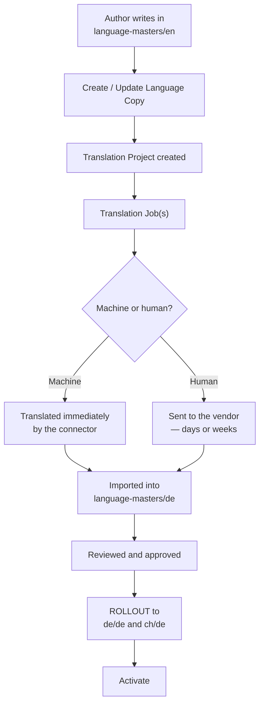
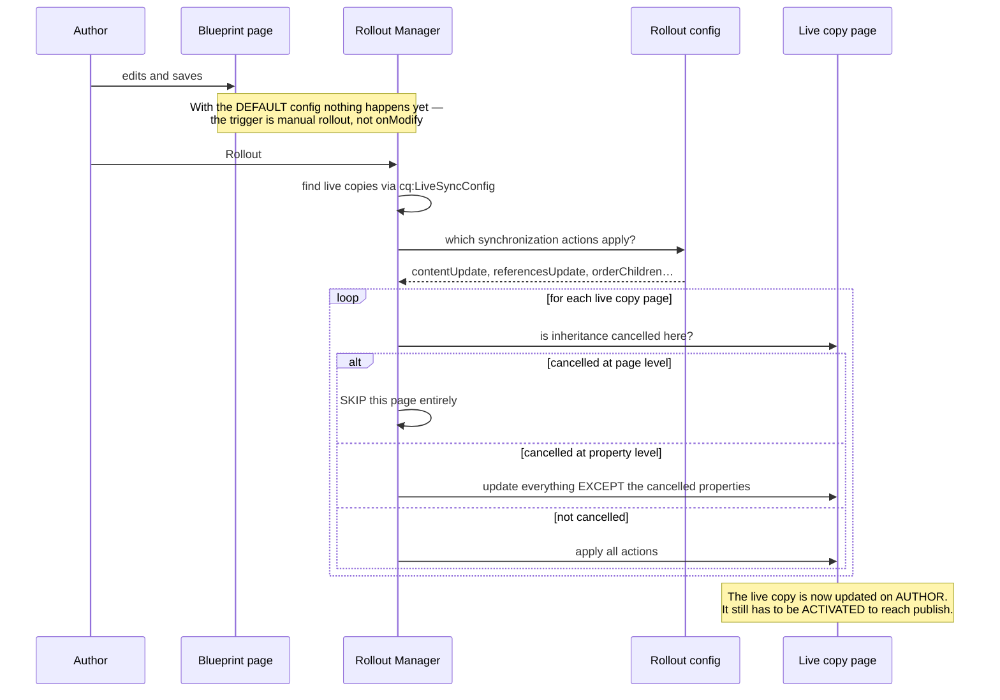
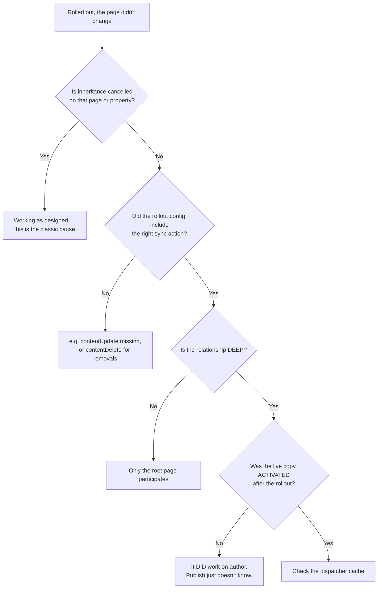

# 12 – MSM, Live Copies and Translation

> **Target:** 3–4 years experienced AEM Developer
> **Syllabus point covered (21):** *"What is MSM? Language copy, live copy, what is a blueprint? How is translation used in a project?"*
> **Project domain:** a global energy technology company's marketing site.

---

## Before we start — why this topic fits your project story perfectly

Every other file in this repository has needed the energy domain as a backdrop. This one **is** the domain.

A global energy technology company sells transformers, HVDC systems and grid automation into dozens of countries. The product range is largely the same everywhere. The technical specifications are identical. But each country needs its own site, in its own language, with local contacts, local certifications and local pricing pages.

**That is precisely the problem MSM exists to solve**, and it is why URLs on sites like this look like `/us/en/products-and-solutions/...` and `/in/en/products-and-solutions/...` alongside a global site.

So when an interviewer asks about MSM, you have a genuinely natural story. The trick is getting the vocabulary exactly right, because this topic has four terms that people mix up constantly:

**Blueprint. Live copy. Language copy. Rollout.**

Section 2 pins each one down, and section 2.6 covers the relationship between the last two — which is the part almost everyone gets muddled, because a page can be **both** a language copy and a live copy at the same time.

---

## 1. Introduction

### 1.1 The problem MSM solves

Imagine our energy site without MSM.

You have a product page for a high-voltage transformer. It exists on the global site, and on the US site, and the German site, the Indian site, the Brazilian site — twenty countries. The technical specifications are identical everywhere.

Now a specification changes. Without MSM, someone edits twenty pages by hand. They will miss some. The sites drift apart. Six months later nobody knows which version is correct.

**MSM — Multi Site Manager — is AEM's answer.** You author once in a source site, and the other sites **inherit** from it. Change the source, push the change out, and every site that inherits gets it.

**But — and this is the part that makes MSM interesting rather than trivial — inheritance has to be breakable.** The German site genuinely needs a different local contact. The US site has a different certification statement. So MSM isn't simply copying; it is **inheritance with controlled exceptions**, and most of the complexity lives in those exceptions.

### 1.2 The four terms, in one sentence each

Get these right and the rest follows:

| Term | What it means |
|---|---|
| **Blueprint** | The **source** that others inherit from |
| **Live copy** | A copy that **stays connected** to its source and receives updates |
| **Rollout** | The **act of pushing** changes from blueprint to live copies |
| **Language copy** | A copy in a **different language**, created for translation |

**The single most useful distinction:**

> **A live copy is about *place* — same content, different site or region.
> A language copy is about *language* — same content, different words.**

### 1.3 A real project structure to describe

This is the standard AEM reference architecture for a multi-country site, and being able to draw it is worth a lot:

```
/content/energy/
│
├── language-masters/          ← authored + translated masters
│   ├── en                     ← THE source. Authored here.
│   ├── de                     ← language copy of en (translated)
│   ├── fr                     ← language copy of en (translated)
│   └── pt                     ← language copy of en (translated)
│
├── global/
│   └── en                     ← live copy of language-masters/en
│
├── us/
│   └── en                     ← live copy of language-masters/en
│
├── de/
│   └── de                     ← live copy of language-masters/de
│
├── ch/                        ← Switzerland: two languages
│   ├── de                     ← live copy of language-masters/de
│   └── fr                     ← live copy of language-masters/fr
│
└── br/
    └── pt                     ← live copy of language-masters/pt
```

**Read that structure carefully, because it contains the whole answer.**

**Translation happens once, horizontally**, inside `language-masters`. English is translated into German once — not once per German-speaking country.

**Distribution happens vertically**, from a language master out to every country using that language. Switzerland and Germany both take live copies of `language-masters/de`, so they share one translation.

**A country page is therefore both** — it is a live copy of a language master, and that language master is itself a language copy of English.

That two-layer structure is the thing to be able to explain. Almost every MSM question resolves to it.

### 1.4 A real project example to adapt

> "We run about twenty country sites off one codebase. The structure is a `language-masters` branch where English is authored and then translated into each language — so German is translated once, not once per German-speaking country. Then each country site is an MSM live copy of the relevant language master, so Germany and Switzerland's German site both inherit from `language-masters/de`.
>
> Country teams can cancel inheritance where they genuinely need something local — a contact block or a certification statement — and we push them to cancel at the smallest scope possible, ideally a single property rather than a whole page, because a page-level cancellation means that page silently stops receiving every future update.
>
> Translation goes through a Translation Integration Framework config pointing at our vendor, and subsequent updates use Update Language Copy so only changed content is sent for translation rather than the whole page."

That paragraph covers the structure, the translation strategy, the inheritance discipline and the cost model. It answers four follow-ups before they're asked.

---

## 2. Core Concepts

### 2.1 Blueprint — and the ambiguity in the word

**"Blueprint" is used in two different senses**, which is a genuine source of confusion. Being able to separate them is a good signal.

**Sense 1 — informally, the source of a live copy.** If `/content/energy/us/en` is a live copy of `/content/energy/language-masters/en`, people call the latter "the blueprint." That is the everyday usage.

**Sense 2 — formally, a Blueprint Configuration.** This is an actual configuration object that points at a source path.

**What does a Blueprint Configuration actually give you?** Two things:

1. **The Rollout action from the source side.** Without a blueprint config, you can only *pull* from the live copy ("Synchronize"). With one, an author standing on the source page can *push* to all its live copies ("Rollout"), and see which live copies exist.
2. **It appears in the Create Site wizard**, so new sites can be created from it.

**The important consequence, which interviewers probe:**

> **You do not need a blueprint configuration to create a live copy.** A live copy works fine without one. What you lose is the ability to roll out *from the source side* and to see the live copy relationships from there.

**The interview answer:**

> "The word is used two ways, which trips people up. Informally, the blueprint is just the source page a live copy inherits from. Formally, a Blueprint Configuration is a separate configuration pointing at a source path.
>
> The configuration isn't required to create a live copy — a live copy works without one. What it gives you is the Rollout action from the source side, so an author on the blueprint page can push to all its live copies and see which ones exist. Without it you can still synchronise, but only by pulling from each live copy individually, which doesn't scale to twenty countries."

### 2.2 Live copy — how the relationship is actually stored

**A live copy is a copy that stays connected to its source.**

The connection is stored in the repository, and knowing where is a strong detail.

When you create a live copy, its root page's `jcr:content` gets a **`cq:LiveSyncConfig`** child node:

```
/content/energy/us/en/jcr:content/
    └── cq:LiveSyncConfig
         ├── cq:master = "/content/energy/language-masters/en"
         ├── cq:isDeep = true
         └── cq:rolloutConfigs = ["/libs/msm/wcm/rolloutconfigs/default"]
```

| Property | Meaning |
|---|---|
| `cq:master` | The **source path** this inherits from |
| `cq:isDeep` | Does the relationship extend to descendants? |
| `cq:rolloutConfigs` | Which rollout configurations apply |

**`cq:isDeep` is worth understanding.** With it true, the whole subtree below this page participates — pages added to the blueprint later appear here. With it false, only this page is connected, and new blueprint pages do not propagate. For a country site you almost always want deep.

**The relationship is tracked per page**, not just at the root, which is what allows an individual page deep in the tree to have its inheritance cancelled while its siblings continue inheriting.

### 2.3 Rollout — pushing changes out

**A rollout is the act of copying changes from the blueprint to its live copies.**

Two directions, and the vocabulary differs:

| From the source | From the live copy |
|---|---|
| **Rollout** — push to live copies | **Synchronize** — pull from the blueprint |
| Needs a blueprint configuration | Always available |
| One action reaches many sites | One live copy at a time |

**What actually happens during a rollout** is decided by the **rollout configuration**, not by MSM itself. That is the next section, and it is the part people skip.

### 2.4 Rollout configurations and synchronization actions

**This is where MSM stops being simple**, and it is the depth question in this topic.

A **rollout configuration** is a named set of **synchronization actions** plus a **trigger**.

**The trigger says *when* a rollout happens:**

| Trigger | Fires when |
|---|---|
| `onModify` | The blueprint page is **modified** — immediate, automatic |
| `onActivate` | The blueprint page is **activated** |
| `onDeactivate` | The blueprint page is deactivated |
| `rollout` | **Only on an explicit, manual rollout** |

**The default — "Standard rollout config" — uses the manual trigger.** So by default, editing a blueprint page does **not** automatically update live copies. Someone has to roll out.

**That default is deliberate and worth explaining:** automatic rollout on every modification means every keystroke-level save propagates to twenty sites, which is both a performance problem and a governance one — half-finished edits reaching live sites. Manual rollout means someone decides when the change is ready to distribute.

**The synchronization actions say *what* happens:**

| Action | What it does |
|---|---|
| `contentCopy` | Copies content for **new** pages |
| `contentUpdate` | Updates content that **changed** |
| `contentDelete` | Removes content deleted in the blueprint |
| `referencesUpdate` | **Rewrites internal references** to point at live copy paths |
| `orderChildren` | Applies child page ordering |
| `versionCopy` | Creates a version before overwriting |
| `pageMove` | Handles pages moved in the blueprint |
| `workflow` | Starts a workflow on rollout |
| `notify` | Sends a notification |

**`referencesUpdate` is the one that causes real production problems when it's missing.**

Think about it: a page on the blueprint links to `/content/energy/language-masters/en/products/transformers`. Roll that out to the US site without `referencesUpdate`, and the US page still links to the **language master** — so a US visitor clicks a link and lands on the wrong site, or on a path that isn't published at all. With the action, the reference is rewritten to `/content/energy/us/en/products/transformers`.

**Where rollout configs live:** out-of-the-box ones under `/libs/msm/wcm/rolloutconfigs`, and custom ones in your project under `/apps/msm/wcm/rolloutconfigs`.

### 2.5 Inheritance and cancellation — the heart of the topic

**MSM would be useless if inheritance were absolute.** The German site genuinely needs a different contact; the US site has different certification wording. So MSM lets authors break inheritance — and **at what scope** is the critical decision.

**Three scopes, from smallest to largest:**

**Property level.** A single field stops inheriting; everything else on the page continues. Stored as a **`cq:propertyInheritanceCancelled`** property — a multi-value list of the property names whose inheritance is cancelled.

**Component level.** One component stops receiving rollouts. Its siblings on the same page carry on inheriting.

**Page level.** The whole page stops inheriting. Two flavours in the UI:

- **Suspend** — pause inheritance, resumable later. The relationship still exists.
- **Detach** — permanently break the live relationship. This is not reversible in the same way; the page becomes an ordinary page.

**The discipline that matters — and this is the answer that shows experience:**

> **Cancel at the smallest scope that solves the problem.**

Because cancellation is **silent and permanent in effect**. A page-level cancellation means that page stops receiving *every* future update — including ones nobody anticipated. A year later, the blueprint gets a new compliance section, it rolls out to nineteen countries, and one country silently doesn't get it. Nobody notices, because a rollout that skips a cancelled page is working exactly as designed.

**The failure is invisible**, which is what makes it dangerous.

**The interview answer:**

> "Inheritance can be cancelled at three scopes — a single property, a component, or the whole page. Property level is stored as `cq:propertyInheritanceCancelled`, a multi-value list of the property names that no longer inherit. At page level you can either suspend, which is resumable, or detach, which permanently breaks the relationship.
>
> The discipline I'd push for is cancelling at the **smallest scope that solves the problem**. If a country needs a different phone number, cancel that property — not the component, and definitely not the page.
>
> The reason is that cancellation is silent. A page-level cancellation means that page stops receiving every future update, including ones nobody has thought of yet. So a year later the blueprint gets a new compliance block, it rolls out to nineteen countries, and one silently doesn't get it — and nothing reports that, because a rollout skipping a cancelled page is behaving exactly as designed. That's the classic MSM production problem, and it's why we audit cancellations rather than treating them as a local decision."

### 2.6 Language copy versus live copy — the comparison

**This is the crux of your syllabus point, and where most candidates get muddled.**

| | **Live copy** | **Language copy** |
|---|---|---|
| Purpose | Same language, **different site or region** | **Different language** |
| Created by | MSM | The Language Copy wizard |
| Content differs by | Local exceptions | **Translation** |
| Stays connected? | **Yes** — receives rollouts | Optionally — often also a live copy |
| Typical example | `us/en` from `language-masters/en` | `language-masters/de` from `language-masters/en` |
| Updated by | Rollout | Translation (Update Language Copy) |

**And now the part that confuses people:**

> **A page can be both.** In the standard structure, `language-masters/de` is a *language copy* of `language-masters/en`, and `de/de` is a *live copy* of `language-masters/de`.

**Why the two-layer structure exists** — this is the reasoning to give:

> "You translate horizontally and distribute vertically.
>
> If Germany and Switzerland each took a live copy of the English master and translated separately, you'd pay for the same German translation twice, and the two would drift apart in wording.
>
> So instead you translate English into German **once**, in `language-masters/de`. Then Germany and Switzerland both take live copies of *that*. One translation, many countries, and a specification change flows from English through the German master out to both."

**The follow-up that's worth pre-empting:** *"So what happens when the English master changes?"*

> "The English change has to be translated into German before it reaches the German-speaking countries. That's what **Update Language Copy** is for — it identifies what's changed since the last translation and sends only that for translation, rather than resubmitting whole pages. Once the German master is updated, a rollout pushes it out to Germany and Switzerland."

### 2.7 Translation — how it actually works on a project

**Translation in AEM has three parts**, and knowing all three is what makes the answer complete.

**Part 1 — the Translation Integration Framework (TIF) configuration.** A cloud configuration that says which translation provider to use and how. It sets whether translation is **machine** or **human**, and connects to the vendor's connector.

It lives under `/conf/<site>/settings/cloudconfigs/translation` and is referenced from page properties, so different parts of the site can use different providers or settings.

**Part 2 — the language copy structure.** Created through the **Create Language Copy** wizard, which builds the target language tree. This is structural — it creates the pages, it doesn't translate them.

**Part 3 — Translation Projects.** The actual workflow. Creating a language copy generates a **translation project**, which contains **translation jobs**. Each job is a batch of content sent to the provider, tracked through states — draft, submitted, in progress, ready for review, approved — and then imported back.

**The full flow:**



**Notice the last two steps.** Translation gets content into the language master. **A rollout is still needed** to distribute it to the country sites, and then activation to publish it. Candidates often stop at "it gets translated" and miss that translation and distribution are separate operations.

**Machine versus human**, and the honest framing:

| | Machine | Human |
|---|---|---|
| Speed | Immediate | Days to weeks |
| Cost | Low | High |
| Quality | Variable | High |
| Right for | Drafts, low-stakes content, bulk | **Technical specifications, legal, regulatory** |

**For an energy site this distinction is genuinely important**, and it makes a good point to raise: technical specifications and regulatory statements need human translation, because a machine mistranslation of a safety-critical specification is a real liability. Blog posts and news might be fine machine-translated with review.

**Update Language Copy** is the operation for subsequent rounds. It identifies content that changed since the last translation and sends **only that** — which matters enormously for cost, because re-translating whole pages every time a paragraph changes is how translation budgets get destroyed.

### 2.8 Language roots

A small but practically important detail.

AEM identifies a **language root** by the page name being a valid language or locale code — `en`, `de`, `fr`, `en_us`, `pt_br` — and by the `jcr:language` property on the page's `jcr:content`.

**Why it matters:** the Create Language Copy wizard, translation tooling, and the language switcher component all rely on this. Name a language root `english` instead of `en` and the tooling stops recognising it.

That is a good "gotcha" to know, because it produces a confusing failure — everything looks right, and the language copy wizard just doesn't offer what you expect.

### 2.9 MSM and the rest of AEM

**Two connections worth making, because they show the files joining up.**

**MSM and templates (file 03).** A country site can point at a different `/conf` folder via `sling:configRef`, which means different **policies** — so the same template can allow different components in different countries. The template structure is shared via `cq:template`, but what authors may place can differ per country.

**MSM and dialog validation (file 11).** A rollout writes values directly into the live copy. It does not go anywhere near a dialog, so **no client-side validation runs**. That is one of the concrete ways dialog validation gets bypassed, and it is a genuinely good example to cite in either topic.

---

## 3. Internal Working

### 3.1 What happens during a rollout



**Three things to draw out of that:**

**The cancellation check happens per page and per property**, which is what makes fine-grained exceptions possible — and also what makes a cancellation silently skip future updates.

**The rollout config decides what happens**, not MSM itself. Missing `referencesUpdate` means links stay pointing at the blueprint.

**A rollout only updates the author instance.** The live copy pages still need activating. That is a very common "the rollout didn't work" report — it did work, on author, and nobody published.

### 3.2 How a live relationship is resolved

When AEM needs to know whether a page is a live copy and what it inherits from, it walks **up** the tree looking for a `cq:LiveSyncConfig` with `cq:isDeep` set.

```
/content/energy/de/de/products/transformers/oil-filled
                                              ↑ is there a LiveSyncConfig here?
                                    ↑ here?
                          ↑ here?
              ↑ HERE — cq:master = /content/energy/language-masters/de
                       cq:isDeep = true
```

The relationship is inherited down the tree from the live copy root. So a page five levels deep is part of the live copy because an ancestor declares a deep relationship — not because it has its own configuration.

**That explains a common confusion:** you look at a deep page in CRXDE, see no `cq:LiveSyncConfig`, and conclude it isn't a live copy. It is — the configuration is on an ancestor.

### 3.3 Why a rollout "does nothing"

The most common MSM support ticket, and the diagnosis order is the answer:



**The first and last branches account for most real cases** — cancelled inheritance, and a rollout that worked but was never published.

---

## 4. Important Interview Questions

### 4.1 Basic

**Q1. What is MSM?**
Multi Site Manager — AEM's framework for running many sites from shared content, by creating live copies that inherit from a source and receive updates through rollouts.

*Cross:* What problem does it solve? · When would you not use it? (sites with genuinely unrelated content) · What's the alternative? (copying, and then drift)

**Q2. What is a blueprint?**
Informally, the source a live copy inherits from. Formally, a Blueprint Configuration pointing at a source path, which enables the Rollout action from the source side.

*Cross:* Do you need the configuration to create a live copy? (**no**) · What do you lose without it? (rollout from the source, and visibility of live copies) · Where is it configured?

**Q3. What is a live copy?**
A copy that stays connected to its source and receives updates. The connection is a `cq:LiveSyncConfig` node under the live copy root's `jcr:content`.

*Cross:* What properties does it hold? (`cq:master`, `cq:isDeep`, `cq:rolloutConfigs`) · What does `cq:isDeep` do? · How does a deep page know it's in a live copy? (an ancestor declares it)

**Q4. What is a rollout?**
The act of pushing changes from a blueprint to its live copies. From the live copy side the equivalent pull is called Synchronize.

*Cross:* What decides what happens during one? (the rollout configuration) · Does it publish? (**no — author only**) · Push or pull?

**Q5. What is a language copy?**
A copy of a site in a different language, created through the Language Copy wizard and populated by translation.

*Cross:* How is it different from a live copy? · Can it also be a live copy? (**yes** — that's the standard pattern) · What identifies a language root? (a valid language code as the page name, plus `jcr:language`)

**Q6. Live copy versus language copy?**
Live copy is about **place** — same language, different site or region, connected and receiving rollouts. Language copy is about **language** — same content, different words, populated by translation.

*Cross:* Give the structure · Which one does Switzerland's German site use? (**both** — live copy of the German master) · Why translate once?

**Q7. What is a rollout configuration?**
A named set of synchronization actions plus a trigger, deciding when a rollout happens and what it does.

*Cross:* What are the triggers? (`onModify`, `onActivate`, `onDeactivate`, manual `rollout`) · What's the default? (**manual**) · Name some actions

**Q8. Name some synchronization actions.**
`contentCopy` for new pages, `contentUpdate` for changes, `contentDelete` for removals, `referencesUpdate` to rewrite internal links, `orderChildren`, `versionCopy`, `pageMove`.

*Cross:* Which causes problems when missing? (**`referencesUpdate`** — links keep pointing at the blueprint) · Why would you want `versionCopy`? (a rollback point before overwriting)

**Q9. How do you break inheritance?**
At three scopes: a single property (`cq:propertyInheritanceCancelled`), a component, or the whole page — where page level offers suspend (resumable) or detach (permanent).

*Cross:* Which should you prefer? (**the smallest that works**) · Why? (cancellation is silent and permanent in effect) · Suspend vs detach?

**Q10. What is the Translation Integration Framework?**
A cloud configuration specifying the translation provider and whether translation is machine or human, referenced from page properties.

*Cross:* Where does it live? (`/conf/<site>/settings/cloudconfigs/translation`) · Machine vs human — when each? · What are translation projects and jobs?

### 4.2 Intermediate

**Q11. Describe the structure of a multi-country site.**
→ Section 1.3. The `language-masters` branch for authoring and translation, then country sites as live copies of the relevant language master. **Translate horizontally, distribute vertically.**

*Cross:* Why not translate per country? (you'd pay twice for German and they'd drift) · How does Switzerland get two languages? (two live copies, from `de` and `fr` masters) · What happens when English changes?

**Q12. A rollout didn't update a page. Why?**
→ Section 3.3, in order: inheritance cancelled on that page or property; the rollout config missing the needed action; the relationship not deep; or — very commonly — **the rollout worked on author and nobody activated the live copy**.

*Cross:* Which is most common? (cancelled inheritance, then not activated) · How do you check for cancellation? (page properties, or `cq:propertyInheritanceCancelled` in CRXDE) · Would there be an error? (**no** — skipping a cancelled page is correct behaviour)

**Q13. Why is a page-level inheritance cancellation risky?**
Because it's silent and it's forever. That page stops receiving **every** future update, including ones nobody has anticipated. A new compliance block rolls out to nineteen countries and one silently doesn't get it, with nothing reporting the omission.

*Cross:* What's the alternative? (cancel the property) · How would you find existing cancellations? (a query for `cq:propertyInheritanceCancelled`, and the MSM Control Center) · How would you prevent it? (governance, and a periodic audit)

**Q14. What does `referencesUpdate` do and what breaks without it?**
It rewrites internal references so a link in the blueprint pointing at a blueprint path becomes a link to the equivalent live copy path. Without it, a US visitor clicks a link and lands on the language master — a path that may not even be published.

*Cross:* How does it know the mapping? (the live copy relationship) · What about references to assets? (usually shared, so often intentionally not rewritten) · How would you spot the problem? (links on a country site pointing at `/language-masters/`)

**Q15. What's the default rollout trigger, and why?**
Manual. Editing a blueprint page does **not** automatically update live copies. That's deliberate — automatic rollout on every save would propagate half-finished edits to twenty sites and create a performance problem.

*Cross:* When would you use `onModify`? (tightly-controlled content where immediacy matters more than review) · What about `onActivate`? (a reasonable middle ground — roll out when the source is published) · Can different pages use different configs?

**Q16. Translation has finished. Is the country site updated?**
No — two more steps. Translation puts content into the **language master**. A **rollout** distributes it to the country live copies, and then those pages need **activating** to reach publish.

*Cross:* Why are they separate? (translation is about language, rollout about distribution) · What if only one country should get it early? · What's Update Language Copy?

**Q17. What is Update Language Copy?**
The operation for subsequent translation rounds — it identifies what changed since the last translation and sends only that, rather than resubmitting whole pages.

*Cross:* Why does that matter? (**cost** — human translation is priced per word) · How does it know what changed? (it tracks the translation state) · What if the structure changed?

**Q18. How do live copies interact with editable templates?**
Live copy pages keep their `cq:template`, so they use the same template as the blueprint and structure changes reach them. But a country branch can point at a different `/conf` via `sling:configRef`, which means different **policies** — so the same template can allow different components per country.

*Cross:* So can Germany have a component the US doesn't? (yes, via policy) · Does a structure change reach live copies? (yes — it's live, file 03) · What about page policies and clientlibs?

**Q19. How does MSM bypass dialog validation?**
A rollout writes values directly into the live copy node. It never opens a dialog, so no client-side validation runs. That's one of the concrete ways dialog validation gets bypassed, and why anything that matters needs server-side validation too.

*Cross:* What else bypasses it? (package install, migration, direct POST) · Where should the real check be? (Sling Model or `SlingPostProcessor`) · Would you log it? (**yes** — nobody reports a value that arrived through a rollout)

**Q20. When would you NOT use MSM?**
When sites genuinely don't share content — different brands with different products, or a microsite with nothing in common. MSM adds real complexity in inheritance management, and it only pays for itself when there's substantial shared content to keep in sync.

*Cross:* What's the alternative? (separate sites, shared components and templates) · Where's the tipping point? (how much content is genuinely common) · Can you mix? (yes — MSM for the product catalogue, standalone for campaign microsites)

### 4.3 Advanced

**Q21. Design the content structure for a twenty-country energy site.**

> "I'd use the standard two-layer pattern: a `language-masters` branch and country sites as live copies.
>
> English is authored in `language-masters/en`. That's the single source of truth for the product catalogue. It gets translated into each language once — `language-masters/de`, `fr`, `pt` and so on — so the German translation is paid for once, not once per German-speaking country.
>
> Then each country site is a **live copy** of the relevant language master. Germany and Switzerland's German site both inherit from `language-masters/de`; Switzerland also has a French site inheriting from `language-masters/fr`.
>
> The reason for the two layers is that you **translate horizontally and distribute vertically**. If each country took a live copy of English and translated separately, you'd pay for German three times and the three would drift apart in wording — which for technical specifications is a real problem, not a cosmetic one.
>
> For **rollout configuration** I'd use the manual trigger rather than `onModify`, so a change is distributed when someone decides it's ready rather than on every save — otherwise half-finished edits reach twenty live sites. And I'd make sure `referencesUpdate` is in the config, because without it every internal link on a country site points back at the language master.
>
> For **inheritance**, the governance rule is cancel at the smallest scope that solves the problem. A country needing a different phone number cancels that property, not the page. And I'd want a periodic audit of cancellations, because they're silent — a page-level cancellation means that page stops receiving every future update and nothing ever reports it.
>
> For **translation**, human translation for technical specifications and anything regulatory, since a machine mistranslation of a safety specification is a genuine liability. Machine translation with review is defensible for news and blog content. Subsequent rounds go through Update Language Copy so only changed content is sent, because human translation is priced per word."

*Cross:* What if a country needs a page that doesn't exist in the blueprint? (it can have local pages — they simply aren't part of the relationship) · How do you handle a country-specific product? · What about a country that leaves the group?

**Q22. A compliance change rolled out to nineteen of twenty countries. Find the twentieth.**

> "That's almost certainly a cancelled inheritance, and the important thing is that it's **not an error** — a rollout skipping a cancelled page is behaving exactly as designed, so there's nothing in any log.
>
> I'd check the page's inheritance status first — page properties show whether the live relationship is suspended or detached, and `cq:propertyInheritanceCancelled` in CRXDE shows property-level cancellations. The MSM Control Center gives an overview of relationships and their status.
>
> The likely history is that someone cancelled inheritance months ago for a legitimate local reason — a different contact block — but did it at page level rather than property level. So the page correctly stopped receiving that one thing, and incorrectly stopped receiving everything else too.
>
> The fix for this instance is to apply the change manually and then re-scope the cancellation to the property. The fix for the class of problem is auditing — a query for cancellations across the tree, reviewed periodically, because otherwise you only discover them when something important is missing."

*Cross:* How would you query for it? · Could you prevent cancellation at page level? (permissions, plus governance — technically it's an author action) · How would you monitor it?

**Q23. Blueprint content changed. Walk me through getting it live in Germany.**

> "Four steps, and people usually miss the middle two.
>
> One — the change is authored in `language-masters/en`.
>
> Two — it has to be **translated**. Update Language Copy identifies what changed and sends only that to the provider, and it comes back into `language-masters/de` for review and approval.
>
> Three — a **rollout** from `language-masters/de` to `de/de` and `ch/de`. Translation put the content into the language master; it doesn't distribute it.
>
> Four — **activation**. The rollout updated the author instance. The country pages still have to be published.
>
> The two people forget are translation and activation. 'The rollout didn't work' is very often 'the rollout worked and nobody published', and 'the German site is showing English' is usually 'it rolled out before it was translated'."

*Cross:* What if it's urgent and translation takes two weeks? (roll out untranslated and accept English temporarily, or hold — it's a business decision) · Can you roll out to one country only? (yes — target specific live copies) · How do you track where it's got to?

**Q24. How do you handle a country needing a genuinely different page?**

Three options depending on what "different" means. If the page exists everywhere but the content differs, that's **inheritance cancellation** at the appropriate scope. If the country needs a page nobody else has, it can simply create one — local pages that aren't part of the blueprint relationship coexist fine. If the country should *not* have a page others do, that's a deletion in the live copy, which will be restored on the next rollout unless inheritance is cancelled for it.

That last case is the awkward one and worth mentioning, because "we deleted it and it came back" is a real MSM support ticket.

*Cross:* What if the country wants a different template? (possible, but it breaks the inheritance model — usually a sign the structure is wrong) · Can a live copy have a different `/conf`? (**yes**, via `sling:configRef` — different policies)

**Q25. What are the performance implications of MSM?**

A rollout on a large site is substantial work — it walks the tree, evaluates cancellation per page, and writes to every live copy. Rolling out the root of a twenty-country site with thousands of pages is a heavy operation and shouldn't be done casually during business hours.

That's another argument against the `onModify` trigger: it turns every author save into a multi-site write.

And rollouts happen on **author**, so they compete with authoring. On a large migration or restructure, doing it out of hours is a reasonable precaution.

*Cross:* How would you roll out a large change safely? (scope it to a subtree, out of hours, and check a sample afterwards) · Does it affect publish? (only once activated) · What about the dispatcher? (activation invalidates; a large rollout means a large flush)

---

## 5. Cross Questions — how this topic gets drilled

**Thread A — from "what is MSM" (your syllabus thread)**
What problem does it solve? → What's a blueprint? → What's a live copy? → How is the relationship stored? → What's a rollout? → What decides what a rollout does? → What are sync actions? → Which one breaks links if missing?

**Thread B — from "live copy versus language copy"**
Which is about language? → Can a page be both? → Draw the structure → Why translate once? → What happens when English changes? → What's Update Language Copy? → Does translation update the country sites? (**no**)

**Thread C — from "how do you break inheritance"**
At what scopes? → What property stores it? → Suspend vs detach? → Which scope should you prefer? → **Why?** → What's the risk? → How would you find existing cancellations?

**Thread D — from "the rollout didn't work"**
What would you check? → Is cancellation an error? (**no**) → What else? → Is it deep? → **Did anyone activate it?** → What about the dispatcher?

---

## 6. Best Interview Answers

### 6.1 "What is MSM, and how is it structured on your project?" — about 2 minutes

**Your syllabus point 21, in one answer.**

> "MSM — Multi Site Manager — is AEM's framework for running many sites off shared content. Rather than copying a product page into twenty country sites and maintaining twenty copies, you author once and the other sites **inherit**, receiving updates through rollouts.
>
> The vocabulary matters here. The **blueprint** is the source that others inherit from. A **live copy** is a copy that stays connected — the relationship is stored as a `cq:LiveSyncConfig` node under the live copy root's `jcr:content`, holding `cq:master` pointing at the source and `cq:isDeep` for whether it covers descendants. A **rollout** is the act of pushing changes out.
>
> On our project we run about twenty country sites, and the structure is two layers. There's a `language-masters` branch where English is authored and then translated into each language — so `language-masters/de` is a **language copy** of `language-masters/en`. Then each country site is a **live copy** of the relevant language master, so Germany and Switzerland's German site both inherit from `language-masters/de`.
>
> The reason for those two layers is that you **translate horizontally and distribute vertically**. If each country took a live copy of English and translated separately, we'd pay for the German translation three times and the three would drift apart in wording — which for technical specifications is a real problem.
>
> So a country page is actually both: a live copy of a language master, which is itself a language copy of English.
>
> Where it gets interesting is **inheritance exceptions**. Countries genuinely need local content — a different contact, a different certification statement. So authors can cancel inheritance at three scopes: a single property, a component, or the whole page. Our governance rule is to cancel at the smallest scope that works, because a page-level cancellation means that page silently stops receiving every future update — and nothing ever reports that, because a rollout skipping a cancelled page is behaving exactly as designed."

### 6.2 "Live copy versus language copy?" — about 60 seconds

> "The simplest way to put it: **a live copy is about place, a language copy is about language.**
>
> A live copy is the same content in a different site or region, staying connected to its source so it receives rollouts — that's MSM. A language copy is the same content in a different language, created by the Language Copy wizard and populated by translation.
>
> The thing that confuses people is that **a page can be both**, and in the standard structure it is. `language-masters/de` is a language copy of `language-masters/en` — same content, translated. And `de/de` is a live copy of `language-masters/de` — same language, different site.
>
> That two-layer structure exists so you translate once and distribute many times. German is translated once in the language master, and then Germany, Switzerland and Austria all take live copies of it. If you did it the other way round — a live copy per country, then translate — you'd pay for the same translation repeatedly and end up with three subtly different Germans.
>
> One thing worth adding: translation and distribution are **separate operations**. Translation gets content into the language master; a rollout is still needed to reach the country sites, and then activation to publish. 'The rollout didn't work' is very often 'nobody published it'."

### 6.3 "What's the risk with cancelling inheritance?" — about 60 seconds

> "That it's silent, and that its effect is permanent even when the intent was narrow.
>
> Say a country needs a different phone number on one page. An author cancels inheritance — but at **page** level, because that's the obvious control in the UI. It solves the immediate problem perfectly.
>
> Then a year later the blueprint gets a new regulatory compliance block. It rolls out to nineteen countries and silently doesn't reach the twentieth, because that page stopped inheriting everything, not just the phone number. And **nothing reports it** — a rollout skipping a cancelled page is correct behaviour, so there's no error, no warning, nothing in any log. You find out when somebody notices a country site is missing a compliance statement, which for us would be a genuinely serious problem.
>
> So the discipline is: cancel at the **smallest scope that solves the problem**. A different phone number cancels that property, using `cq:propertyInheritanceCancelled`, not the whole page.
>
> And because it's silent, I'd want a periodic **audit** — a query for cancellations across the tree, reviewed by someone who can tell whether each one is still justified. Otherwise the only way you discover them is when something important goes missing."

---

## 7. Real Project Examples

### Story 1 — The country that missed a compliance update

**What happened.** A regulatory statement was added to all product pages and rolled out to every country site. Months later, an internal audit found one country's pages didn't have it.

**The cause.** Eighteen months earlier, that country's team had needed a different local contact block on those pages. They cancelled inheritance — at **page** level, because that's the obvious control in the editor.

It solved their problem perfectly. It also meant those pages stopped receiving **every** subsequent update.

**Why nobody noticed for months.** A rollout that skips a cancelled page is **not an error**. It's the feature working exactly as designed. There's no warning, no log entry, nothing in the rollout report that says "nineteen of twenty." From the outside it looks identical to a successful rollout.

**The fix.** For those pages, applied the change manually and re-scoped the cancellation to the specific properties that genuinely needed to differ — so the contact block stays local and everything else resumes inheriting.

**What we changed structurally.** A quarterly audit query across the content tree listing every inheritance cancellation, reviewed with the country teams. Most turned out to be broader than necessary — cancelled at page level when a property would have done — usually because nobody had explained the difference.

**The point that lands in an interview:** *"The dangerous thing about MSM isn't that it breaks. It's that a mis-scoped cancellation looks exactly like correct behaviour, forever."*

### Story 2 — Every link on the country sites pointed at the master

**What happened.** After a restructure, links on country sites started pointing at `/content/energy/language-masters/...`. Visitors clicking through either landed on the wrong site or got a 404, because the language master branch isn't published.

**The cause.** A custom rollout configuration had been created for the restructure, and `referencesUpdate` wasn't among its synchronization actions. So content was copied faithfully — including internal links, which still pointed at the source paths they were authored against.

**Why it wasn't caught earlier.** On author, the language master pages exist and are readable, so every link worked when tested by an authenticated author on the authoring instance. It only failed on publish, where that branch isn't published at all. Same environment-specific shape as the `allowProxy` problem in file 04 — the code and content were fine, and the difference was who could see what where.

**The fix.** Added `referencesUpdate` to the rollout config and re-rolled out.

**The lesson to state:** *"A rollout config is a set of actions, not a single behaviour. If you build a custom one, you're choosing every action explicitly — and `referencesUpdate` is the one whose absence isn't visible until publish."*

### Story 3 — Translating once instead of three times

**The situation.** The original structure had each country site as a direct live copy of the English master, with translation happening inside each country site.

**The problems.** German was being translated three times — once for Germany, once for Switzerland, once for Austria. Three invoices for the same words. And because three different translators worked on them at different times, the three Germans diverged in terminology. For a technical product catalogue, that's not cosmetic: the same component had three different names across three sites, which confused customers and made search worse.

**The restructure.** Introduced the `language-masters` layer. English is authored and translated into each language once. Countries became live copies of the relevant language master rather than of English.

**The hard part.** Migrating existing content without losing the local exceptions countries had legitimately made. We had to audit every inheritance cancellation first, understand what each one was for, and reapply the justified ones at the right scope in the new structure. That audit took longer than the restructure.

**Result.** German translated once. Terminology consistent across all German-speaking sites. Translation spend for those languages dropped substantially, and — the benefit nobody predicted — updates reached the German-speaking countries faster, because there was one translation cycle to wait for instead of three.

---

## 8. Configuration Examples

### 8.1 The live copy relationship in the repository

`/content/energy/de/de/jcr:content/cq:LiveSyncConfig`

```xml
<?xml version="1.0" encoding="UTF-8"?>
<jcr:root xmlns:cq="http://www.day.com/jcr/cq/1.0"
          xmlns:jcr="http://www.jcp.org/jcr/1.0"
    jcr:primaryType="cq:LiveSyncConfig"

    <!-- The SOURCE this inherits from.
         Note it points at the GERMAN language master, not English --
         the German master is itself a language copy of English. -->
    cq:master="/content/energy/language-masters/de"

    <!-- DEEP: the whole subtree participates, so pages added to the
         master later appear here too. Without this, only the root
         page is connected and new blueprint pages never propagate. -->
    cq:isDeep="{Boolean}true"

    <!-- Which rollout configuration(s) apply -->
    cq:rolloutConfigs="[/libs/msm/wcm/rolloutconfigs/default]"/>
```

**The three properties to be able to name.** And note that a page deep in the tree has **no** `cq:LiveSyncConfig` of its own — it's part of the live copy because this ancestor declares a deep relationship. That's why looking at a deep page in CRXDE and seeing nothing is misleading.

### 8.2 Property-level inheritance cancellation

On a live copy page's `jcr:content`, or on an individual component node:

```xml
<?xml version="1.0" encoding="UTF-8"?>
<jcr:root xmlns:cq="http://www.day.com/jcr/cq/1.0"
          xmlns:jcr="http://www.jcp.org/jcr/1.0"
    jcr:primaryType="nt:unstructured"

    <!-- ONLY these two properties stop inheriting.
         Everything else on this node continues to receive rollouts.
         THIS IS THE SCOPE YOU WANT -- a page-level cancellation
         would silently stop ALL future updates. -->
    cq:propertyInheritanceCancelled="[contactPhone,contactEmail]"

    contactPhone="+49 30 1234 5678"
    contactEmail="kontakt@example.de"

    <!-- These still inherit and will be updated on every rollout -->
    jcr:title="Leistungstransformatoren"
    productCode="TX-4000"/>
```

**This is the good pattern, and worth showing as a contrast** to a page-level cancellation. Two properties are local; everything else keeps flowing.

### 8.3 A custom rollout configuration

`/apps/msm/wcm/rolloutconfigs/energy-standard/.content.xml`

```xml
<?xml version="1.0" encoding="UTF-8"?>
<jcr:root xmlns:cq="http://www.day.com/jcr/cq/1.0"
          xmlns:jcr="http://www.jcp.org/jcr/1.0"
          xmlns:nt="http://www.jcp.org/jcr/nt/1.0"
    jcr:primaryType="cq:RolloutConfig"
    jcr:title="Energy — Standard Rollout"
    jcr:description="Manual rollout with reference rewriting and versioning"

    <!-- TRIGGER: manual rollout only.
         NOT onModify -- that would propagate every author save to
         twenty live sites, which is both a performance problem and
         a governance one, since half-finished edits would go live. -->
    cq:trigger="rollout">

    <!-- The ACTIONS decide what actually happens. MSM itself does
         nothing without these. -->

    <!-- Create a version first, so there's a rollback point -->
    <versionCopy
        jcr:primaryType="cq:LiveSyncAction"
        jcr:title="Create a version before overwriting"/>

    <!-- New pages in the blueprint appear in the live copy -->
    <contentCopy
        jcr:primaryType="cq:LiveSyncAction"
        jcr:title="Copy new content"/>

    <!-- Changed content is updated -->
    <contentUpdate
        jcr:primaryType="cq:LiveSyncAction"
        jcr:title="Update changed content"/>

    <!-- Pages deleted in the blueprint are removed here -->
    <contentDelete
        jcr:primaryType="cq:LiveSyncAction"
        jcr:title="Delete removed content"/>

    <!-- CRITICAL. Rewrites internal links so a country page links to
         the COUNTRY equivalent, not back to the language master.
         Without this, every internal link on every country site points
         at /language-masters/ -- which works on author (where an
         authenticated author can read it) and 404s on publish (where
         that branch isn't published at all). -->
    <referencesUpdate
        jcr:primaryType="cq:LiveSyncAction"
        jcr:title="Rewrite internal references"/>

    <!-- Child page ordering follows the blueprint -->
    <orderChildren
        jcr:primaryType="cq:LiveSyncAction"
        jcr:title="Apply page order"/>

</jcr:root>
```

**The comment on `referencesUpdate` is the one to be able to explain**, because it's story 2 and it's the action whose absence isn't visible until publish.

### 8.4 Reading live copy information in Java

Occasionally needed — for a component that behaves differently in a live copy, or for an audit report.

```java
package com.energy.core.services.impl;

import com.day.cq.wcm.msm.api.LiveRelationship;
import com.day.cq.wcm.msm.api.LiveRelationshipManager;
import org.apache.sling.api.resource.Resource;
import org.apache.sling.api.resource.ResourceResolver;
import org.osgi.service.component.annotations.Component;
import org.osgi.service.component.annotations.Reference;
import org.slf4j.Logger;
import org.slf4j.LoggerFactory;

import javax.jcr.RepositoryException;

@Component(service = LiveCopyInfoService.class)
public class LiveCopyInfoServiceImpl implements LiveCopyInfoService {

    private static final Logger LOG =
            LoggerFactory.getLogger(LiveCopyInfoServiceImpl.class);

    @Reference
    private LiveRelationshipManager liveRelationshipManager;

    @Override
    public boolean isLiveCopy(Resource resource) {
        // The relationship may be declared on an ANCESTOR with
        // cq:isDeep, so this walks up rather than checking only
        // the node itself.
        return liveRelationshipManager.hasLiveRelationship(resource);
    }

    @Override
    public String getBlueprintPath(Resource resource) {
        try {
            LiveRelationship relationship =
                    liveRelationshipManager.getLiveRelationship(resource, false);

            // ALWAYS null-check -- not every page is in a live copy
            if (relationship == null) {
                return null;
            }
            return relationship.getSourcePath();

        } catch (RepositoryException e) {
            LOG.warn("Could not read the live relationship for {}",
                    resource.getPath(), e);
            return null;
        }
    }

    /**
     * Used by an audit report: is this page still actually receiving
     * rollouts, or has someone cancelled inheritance?
     *
     * A cancelled page silently stops receiving EVERY future update,
     * and nothing reports it -- which is exactly why we audit.
     */
    @Override
    public boolean isInheritanceCancelled(Resource resource) {
        try {
            LiveRelationship relationship =
                    liveRelationshipManager.getLiveRelationship(resource, false);
            if (relationship == null) {
                return false;
            }
            return relationship.getStatus() != null
                    && relationship.getStatus().isCancelled();

        } catch (RepositoryException e) {
            LOG.warn("Could not read the relationship status for {}",
                    resource.getPath(), e);
            return false;
        }
    }
}
```

**`LiveRelationshipManager` is the API name worth knowing.** Being able to name it — rather than only describing the UI — is a useful signal.

### 8.5 Finding cancellations — the audit

The practical response to story 1. A QueryBuilder query for property-level cancellations:

```
path=/content/energy
type=nt:unstructured
property=cq:propertyInheritanceCancelled
property.operation=exists
p.limit=-1
```

**Note `p.limit=-1` is fine for a one-off audit run by an administrator**, but it's exactly what you would never put in a component — file 05's rule about unbounded results applies to anything on the render path.

**The point to make:** cancellations aren't reported anywhere by default, so if you care about them, you have to go looking. That's a governance answer, not a technical one.

---

## 9. Common Mistakes

| The mistake | What actually happens | The fix |
|---|---|---|
| Cancelling inheritance at page level for one property | That page **silently** stops receiving all future updates | Cancel the property with `cq:propertyInheritanceCancelled` |
| No audit of cancellations | You discover them when something important is missing | Periodic query and review |
| `referencesUpdate` missing from a custom rollout config | Country site links point at the language master; works on author, 404s on publish | Include the action |
| Translating per country instead of per language | Paying repeatedly for the same translation, and terminology drifts | The `language-masters` layer |
| `cq:isDeep` false when you want a whole site | New blueprint pages never appear in the live copy | Set it true |
| Using `onModify` as the rollout trigger | Every author save propagates to every live site | Manual, or `onActivate` |
| Expecting a rollout to publish | It updates **author** only | Activate afterwards |
| Expecting translation to update country sites | Translation reaches the **language master** only | Roll out afterwards |
| Re-translating whole pages each round | Translation is priced per word | Update Language Copy |
| Language root not named with a language code | The wizard and language tooling stop recognising it | `en`, `de`, `pt_br` — and set `jcr:language` |
| Deleting a page in a live copy | It comes back on the next rollout | Cancel inheritance for it, or delete in the blueprint |
| Assuming a deep page has its own `cq:LiveSyncConfig` | It doesn't — the ancestor declares it | Walk up, or use `LiveRelationshipManager` |
| Relying on dialog validation for rolled-in values | **A rollout never opens a dialog** | Validate in the model too (file 11) |
| Rolling out the site root during business hours | Heavy operation competing with authors | Scope it, and do it out of hours |
| Machine-translating technical specifications | A mistranslated safety spec is a real liability | Human translation for anything technical or regulatory |

---

## 10. Best Practices

**On structure.** Use the `language-masters` pattern. Translate horizontally, distribute vertically. Decide the structure before building, because restructuring later means auditing and reapplying every inheritance exception — which takes longer than the restructure itself.

**On inheritance.** Cancel at the smallest scope that solves the problem. Audit cancellations periodically, because they're silent by design. Make sure country teams understand the difference between property and page level — most over-broad cancellations are ignorance, not intent.

**On rollout configs.** Manual trigger by default. Always include `referencesUpdate`. Include `versionCopy` so there's a rollback point. Be explicit about `contentDelete`, because it's the one with destructive potential.

**On translation.** Human for technical, legal and regulatory content; machine with review is defensible elsewhere. Use Update Language Copy for subsequent rounds. Remember translation and distribution are separate steps.

**On operations.** Rollouts run on author and compete with authoring — scope large ones and run them out of hours. Remember activation is a separate step, and a large rollout means a large dispatcher flush.

---

## 11. Debugging Tips

**"The rollout didn't work" — check in this order:**

1. **Is inheritance cancelled?** By far the most common cause, and remember it is **not an error** — there's nothing in any log. Check page properties, and `cq:propertyInheritanceCancelled` in CRXDE.
2. **Was it actually activated?** A rollout updates author only. This is the second most common cause and the one people are most embarrassed by.
3. **Does the rollout config include the needed action?** No `contentUpdate` means no updates; no `contentDelete` means removals don't propagate.
4. **Is `cq:isDeep` true?** If false, only the root page participates.
5. **Dispatcher cache** — activated, but the old page is still cached.

**"The country site links to the wrong place":** `referencesUpdate` is missing from the rollout config. Confirm by looking at an internal link's `href` on a country page — if it contains `/language-masters/`, that's it.

**"We deleted a page and it came back":** it's still inheriting, so the next rollout restored it. Either delete it in the blueprint or cancel inheritance for it.

**"The German site is showing English":** it was rolled out before it was translated. Translation and rollout are separate operations and can happen in the wrong order.

**Useful places to look:**

| Where | What it tells you |
|---|---|
| Page properties → Live Copy tab | Relationship status, source, whether inheritance is cancelled |
| **MSM Control Center** (Tools → Sites) | Overview of blueprints and live copies |
| `cq:LiveSyncConfig` in CRXDE | `cq:master`, `cq:isDeep`, `cq:rolloutConfigs` |
| `cq:propertyInheritanceCancelled` | Which properties stopped inheriting |
| Blueprint page → Rollout dialog | Which live copies exist and their status |
| `/apps` and `/libs/msm/wcm/rolloutconfigs` | What actions a config actually performs |

**A habit worth describing:** *"When something's inconsistent across countries, my first question is always 'is inheritance cancelled somewhere' — because that's the failure mode that produces no error and looks exactly like normal operation."*

---

## 12. Performance Notes

**A rollout on a large tree is heavy.** It walks the structure, evaluates cancellation per page, and writes to every live copy. Rolling out the root of a twenty-country site is a significant operation.

**It runs on author**, competing with authoring. Scope large rollouts to a subtree and run them out of hours.

**This is another argument against `onModify`** — it turns every author save into a multi-site write operation.

**Activation after a large rollout means a large dispatcher flush**, which can cause a burst of cache misses on publish. On a big change, that's worth anticipating rather than discovering.

**Translation jobs on large trees** take real time and vendor capacity. Update Language Copy limits the volume by sending only changes, which matters for turnaround as well as cost.

---

## 13. Real Production Scenarios

**1. One country missed an update.** Inheritance cancelled — and it produces no error.

**2. Rollout appears to do nothing.** Cancelled inheritance, or it worked on author and nobody activated.

**3. Country site links point at the language master.** `referencesUpdate` missing from the rollout config. Works on author, 404s on publish.

**4. A deleted page reappears.** Still inheriting; the next rollout restored it.

**5. New blueprint pages don't appear in a country site.** `cq:isDeep` is false, or `contentCopy` isn't in the config.

**6. Local edits overwritten by a rollout.** Inheritance wasn't cancelled where it should have been.

**7. The German site shows English.** Rolled out before translation completed.

**8. Translation finished but country sites unchanged.** Translation updates the language master; a rollout is still needed.

**9. Paying for the same translation repeatedly.** Translating per country instead of per language.

**10. Terminology inconsistent across German-speaking sites.** Same cause — separate translations that drifted.

**11. Language Copy wizard doesn't offer the expected languages.** Language root not named with a valid language code, or `jcr:language` not set.

**12. Author instance slow during a rollout.** A large rollout competing with authoring. Scope it and run it out of hours.

**13. A country needs a component others don't.** Different `/conf` via `sling:configRef`, so different policies (file 03).

**14. An invalid value appears despite dialog validation.** A rollout wrote it directly — dialogs are never involved (file 11).

**15. Nobody knows which cancellations exist.** They aren't reported anywhere. Audit query.

**16. Restructuring loses local exceptions.** Cancellations weren't audited before the migration.

**17. Rollout succeeded but the live site is stale.** Dispatcher cache — activation invalidates, but a large flush takes time.

**18. A country wants to leave the group.** Detach the live copy, which permanently breaks the relationship and leaves ordinary pages.

---

## 14. Follow-up Questions

- How many country sites does your project run?
- How is the content structured?
- Do you translate per language or per country?
- What rollout trigger do you use, and why?
- How do you handle country-specific content?
- Have you had a rollout go wrong?
- How do you track inheritance cancellations?
- Machine or human translation, and how do you decide?
- **What would you change about your MSM setup?**

For the last: *"Cancellation governance. Authors cancel at page level because it's the obvious control in the UI, and they don't realise it stops everything forever. I'd want better training and an automated report, because right now we only find over-broad cancellations when something important goes missing."*

---

## 15. Comparison Tables

**Live copy vs Language copy** — the syllabus comparison

| | Live copy | Language copy |
|---|---|---|
| About | **Place** — site, region, country | **Language** |
| Framework | MSM | Language Copy wizard + Translation |
| Stays connected | **Yes** — receives rollouts | Optionally (often also a live copy) |
| Updated by | **Rollout** | **Translation** / Update Language Copy |
| Example | `us/en` ← `language-masters/en` | `language-masters/de` ← `language-masters/en` |
| Can be both? | **Yes — that's the standard pattern** | |

**Blueprint — the two senses**

| | Informal | Formal (Blueprint Configuration) |
|---|---|---|
| What it is | The source of a live copy | A configuration pointing at a source path |
| Required for a live copy? | — | **No** |
| Gives you | — | Rollout from the source side; Create Site wizard |

**Rollout triggers**

| Trigger | Fires | Use |
|---|---|---|
| `rollout` (manual) | On explicit rollout | **The sensible default** |
| `onModify` | On every blueprint save | Rarely — propagates unfinished edits |
| `onActivate` | When the blueprint is published | A reasonable middle ground |
| `onDeactivate` | On unpublish | Keeping live copies in step |

**Key synchronization actions**

| Action | Purpose | Missing it means |
|---|---|---|
| `contentCopy` | New pages | New blueprint pages never appear |
| `contentUpdate` | Changed content | Nothing updates |
| `contentDelete` | Removals | Deleted pages linger |
| **`referencesUpdate`** | **Rewrite internal links** | **Links point at the blueprint** |
| `orderChildren` | Page order | Order drifts |
| `versionCopy` | Version before overwrite | No rollback point |

**Cancellation scopes**

| Scope | Stored as | Effect | Prefer? |
|---|---|---|---|
| Property | `cq:propertyInheritanceCancelled` | Those properties only | **Yes** |
| Component | On the component node | That component only | Sometimes |
| Page — suspend | Relationship suspended | Whole page, **resumable** | Rarely |
| Page — detach | Relationship removed | Whole page, **permanent** | Only to leave the model |

**Machine vs human translation**

| | Machine | Human |
|---|---|---|
| Speed | Immediate | Days to weeks |
| Cost | Low | High (per word) |
| Right for | News, blogs, drafts | **Technical specs, legal, regulatory** |

---

## 16. Memory Tricks

**The core distinction:** *"Live copy is place. Language copy is language."*

**The structure:** *"Translate horizontally, distribute vertically."*

**The two layers:** *"Language masters translate. Country sites inherit."*

**The dangerous thing:** *"A cancelled page fails silently, forever."*

**Cancellation discipline:** *"Cancel the property, not the page."*

**The three steps people forget:** *"Translate, roll out, activate."* Each one is separate.

**The missing action:** *"No referencesUpdate, no correct links."*

**Rollout scope:** *"Rollout reaches author. Activation reaches the world."*

**Blueprint config:** *"Not required — it just lets you push instead of pull."*

---

## 17. Revision Notes

- **MSM = Multi Site Manager.** Run many sites off shared content through inheritance and rollouts.
- **Blueprint** — two senses: informally the source of a live copy; formally a **Blueprint Configuration** pointing at a source path. **Not required** to create a live copy — it enables **Rollout from the source side** and the Create Site wizard.
- **Live copy** — a connected copy. Relationship stored as **`cq:LiveSyncConfig`** under the live copy root's `jcr:content`, with **`cq:master`** (source), **`cq:isDeep`** (covers descendants), **`cq:rolloutConfigs`**. Deep pages have no config of their own — an **ancestor** declares it.
- **Rollout** = push from the source. **Synchronize** = pull from the live copy.
- **Rollout configuration** = a **trigger** plus **synchronization actions**. Triggers: `rollout` (manual — **the default**), `onModify`, `onActivate`, `onDeactivate`. Actions: `contentCopy`, `contentUpdate`, `contentDelete`, **`referencesUpdate`**, `orderChildren`, `versionCopy`, `pageMove`.
- **`referencesUpdate` rewrites internal links** to country paths. Without it, links point at the language master — **works on author, 404s on publish**.
- **Cancellation scopes:** property (`cq:propertyInheritanceCancelled`) · component · page (**suspend** = resumable, **detach** = permanent). **Cancel at the smallest scope that works** — a page-level cancellation **silently** stops all future updates, and skipping a cancelled page is **not an error**, so nothing reports it.
- **Live copy = place. Language copy = language.** A page can be **both**.
- **Standard structure:** `language-masters/en` authored → translated to `language-masters/de` etc. → country sites are **live copies of the language master**. **Translate horizontally, distribute vertically** — German translated once, used by Germany, Switzerland and Austria.
- **Translation:** TIF cloud config (`/conf/<site>/settings/cloudconfigs/translation`) → Language Copy wizard → **translation projects and jobs** → machine or human. **Update Language Copy** sends only what changed — matters for cost.
- **Three separate steps:** translate → **roll out** → **activate**. Translation reaches the language master; a rollout reaches country sites; activation reaches publish.
- **Language root** = page named with a valid language code plus `jcr:language`. Get it wrong and the tooling stops recognising it.
- **A rollout bypasses dialog validation entirely** — it writes values directly (file 11).
- API: **`LiveRelationshipManager`**.

---

## 18. Cheat Sheet

**Structure**
```
/content/energy/
├── language-masters/
│   ├── en          authored SOURCE
│   ├── de          language copy of en (translated)
│   └── fr          language copy of en (translated)
├── us/en           live copy of language-masters/en
├── de/de           live copy of language-masters/de
└── ch/
    ├── de          live copy of language-masters/de
    └── fr          live copy of language-masters/fr
```

**Live copy relationship**
```
<page>/jcr:content/cq:LiveSyncConfig
    cq:master         = "/content/energy/language-masters/de"
    cq:isDeep         = true
    cq:rolloutConfigs = ["/libs/msm/wcm/rolloutconfigs/default"]
```

**Cancellation**
```
cq:propertyInheritanceCancelled = ["contactPhone","contactEmail"]
                                   ← PREFER THIS SCOPE

page level: Suspend (resumable) | Detach (permanent)
```

**Rollout config**
```
cq:trigger = "rollout" | "onModify" | "onActivate" | "onDeactivate"

actions:
    versionCopy        rollback point
    contentCopy        new pages
    contentUpdate      changed content
    contentDelete      removals
    referencesUpdate   REWRITE INTERNAL LINKS  ← don't omit
    orderChildren      page order
    pageMove           moved pages

/libs/msm/wcm/rolloutconfigs/    out of the box
/apps/msm/wcm/rolloutconfigs/    custom
```

**Translation**
```
TIF config: /conf/<site>/settings/cloudconfigs/translation
Language root: page named en | de | pt_br, plus jcr:language
Create Language Copy   → structure + translation project
Update Language Copy   → only what CHANGED (cost)
Machine: news, blogs · Human: specs, legal, regulatory
```

**The three steps**
```
1. TRANSLATE   → into the language master
2. ROLL OUT    → to country live copies (AUTHOR only)
3. ACTIVATE    → to publish
```

**Java API**
```java
@Reference LiveRelationshipManager liveRelationshipManager;

liveRelationshipManager.hasLiveRelationship(resource);
liveRelationshipManager.getLiveRelationship(resource, false);
    → relationship.getSourcePath()
    → relationship.getStatus().isCancelled()
```

**Audit query**
```
path=/content/energy
property=cq:propertyInheritanceCancelled
property.operation=exists
```

**Debug order for "the rollout didn't work"**
```
1. Inheritance cancelled?   (most common, and NOT an error)
2. Was it ACTIVATED?        (second most common)
3. Right sync action?
4. cq:isDeep true?
5. Dispatcher cache
```

---

## 19. Frequently Forgotten Things

1. **A rollout updates AUTHOR only** — activation is separate.
2. **Translation updates the LANGUAGE MASTER only** — a rollout is still needed.
3. **A skipped cancelled page is NOT an error** — nothing is logged.
4. **Page-level cancellation stops everything, forever.**
5. **`referencesUpdate`** — without it, links point at the blueprint.
6. **That link problem only shows on publish**, because the master branch isn't published.
7. **The default rollout trigger is manual**, not `onModify`.
8. **A blueprint configuration isn't required** for a live copy.
9. **Deep pages have no `cq:LiveSyncConfig`** — an ancestor declares it.
10. **`cq:isDeep` false** means new blueprint pages never appear.
11. **A deleted live copy page comes back** on the next rollout.
12. **Language roots must be named with a valid language code.**
13. **Translate per language, not per country.**
14. **Update Language Copy sends only changes** — cost matters.
15. **A rollout never opens a dialog**, so dialog validation is bypassed.
16. **Rollouts run on author** and compete with authoring.

---

## 20. Final Interview Summary

**1. What MSM is.** Many sites from shared content, through inheritance and rollouts.

**2. The four terms.** Blueprint = source. Live copy = connected copy. Rollout = the push. Language copy = a different language.

**3. The distinction.** Live copy is place; language copy is language. A page can be both.

**4. The structure.** `language-masters` for authoring and translation; country sites as live copies. Translate horizontally, distribute vertically.

**5. How the relationship is stored.** `cq:LiveSyncConfig` with `cq:master`, `cq:isDeep`, `cq:rolloutConfigs`.

**6. Rollout configs.** A trigger plus actions. Manual by default. `referencesUpdate` matters most.

**7. Cancellation.** Three scopes. Prefer the property. Page level is silent and permanent.

**8. The risk.** A cancelled page skipped by a rollout is correct behaviour, so nothing reports it. Audit.

**9. Translation.** TIF config, language copies, projects and jobs. Human for technical and regulatory. Update Language Copy for cost.

**10. The three steps.** Translate, roll out, activate — each separate, and the last two are the ones people forget.

---

## 21. Mock Interview

**How to use this:** cover the answers, 25-minute timer, speak every answer out loud.

### The interviewer asks:

1. **What is MSM and what problem does it solve?**
2. What is a blueprint?
3. Do you need a blueprint configuration to create a live copy?
4. What is a live copy, and how is the relationship stored?
5. **What's the difference between a live copy and a language copy?**
6. Can a page be both?
7. **Describe the content structure of a multi-country site.**
8. Why translate in a language master rather than per country?
9. What is a rollout, and what decides what it does?
10. What's the default rollout trigger, and why?
11. Name some synchronization actions.
12. **What does `referencesUpdate` do, and what breaks without it?**
13. **How do you break inheritance, and at what scopes?**
14. **What's the risk with a page-level cancellation?**
15. A compliance change reached nineteen of twenty countries. Find the twentieth.
16. Translation has completed. Is the German site updated?
17. What is Update Language Copy and why does it matter?
18. When would you use machine translation versus human?
19. A rollout appears to have done nothing. Debug it.
20. How do live copies interact with editable templates?

### Model answers

**1.** *(The 6.1 answer — the problem, the four terms, the two-layer structure, and the inheritance-exception point.)*

**2.** The word is used two ways. Informally it's just the source page a live copy inherits from. Formally, a Blueprint Configuration is a separate configuration object pointing at a source path. Separating those two senses is worth doing, because people use the word loosely and then get confused about whether a configuration is required.

**3.** No. A live copy works perfectly well without one. What the configuration gives you is the **Rollout action from the source side** — so an author standing on the blueprint page can push to all its live copies and see which ones exist — plus the source appearing in the Create Site wizard. Without it you can still synchronise, but only by pulling from each live copy individually, which doesn't scale to twenty countries.

**4.** A copy that stays connected to its source and receives updates through rollouts. The relationship is a `cq:LiveSyncConfig` node under the live copy root's `jcr:content`, with `cq:master` pointing at the source, `cq:isDeep` for whether descendants participate, and `cq:rolloutConfigs` for which configurations apply. Worth knowing that a page deep in the tree has **no** config of its own — it's part of the live copy because an ancestor declares a deep relationship, which catches people out in CRXDE.

**5.** *(The 6.2 answer — place versus language, both at once, the two-layer reasoning, and the point that translation and distribution are separate.)*

**6.** Yes, and in the standard structure it is. `language-masters/de` is a **language copy** of `language-masters/en` — same content, translated. And `de/de` is a **live copy** of `language-masters/de` — same language, different site. So a country page is a live copy of a language master which is itself a language copy of English.

**7.** *(Draw section 1.3 — `language-masters` with en, de, fr, pt; then country sites as live copies; Switzerland with two.)* The key property is that translation happens once per language, horizontally, and distribution happens vertically to every country using that language.

**8.** Cost and consistency. If Germany, Switzerland and Austria each took a live copy of English and translated separately, you'd pay for the same German translation three times — human translation is priced per word — and because three different translators worked at different times, the three Germans would drift apart in terminology. For a technical product catalogue that's not cosmetic: the same component ends up with three different names, which confuses customers and hurts search. We actually restructured to fix exactly that.

**9.** A rollout is the act of pushing changes from a blueprint to its live copies — from the live copy side, the equivalent pull is called Synchronize. What actually happens is decided by the **rollout configuration**, not by MSM itself: a trigger saying when, and a set of synchronization actions saying what.

**10.** Manual — the standard config uses the explicit `rollout` trigger, so editing a blueprint page does **not** automatically update live copies. That's deliberate. `onModify` would propagate every author save to twenty live sites, which is a performance problem and a governance one — half-finished edits reaching live sites with no review. Manual means someone decides when a change is ready to distribute. `onActivate` is a reasonable middle ground if you want more automation.

**11.** `contentCopy` for new pages, `contentUpdate` for changed content, `contentDelete` for removals, `referencesUpdate` to rewrite internal links, `orderChildren` for page ordering, `versionCopy` to create a rollback point before overwriting, and `pageMove` for moved pages.

**12.** It rewrites internal references so a link authored against a blueprint path becomes a link to the equivalent live copy path. Without it, a link on the US site still points at `/content/energy/language-masters/en/...`. And the nasty part is **when** you find out — on author it works fine, because an authenticated author can read the language master branch, so every link tests correctly. It only breaks on publish, where that branch isn't published at all. Same environment-specific shape as the `allowProxy` problem with clientlibs. We hit this after building a custom rollout config and leaving the action out.

**13.** Three scopes. **Property level**, stored as `cq:propertyInheritanceCancelled` — a multi-value list of the property names that stop inheriting, with everything else on the node continuing. **Component level**, where one component stops receiving rollouts and its siblings carry on. And **page level**, which in the UI is either **suspend** — pause, resumable, relationship intact — or **detach**, which permanently breaks the live relationship and leaves an ordinary page.

**14.** *(The 6.3 answer — silent, permanent in effect, the compliance example, "skipping a cancelled page is correct behaviour so nothing reports it", cancel the property not the page, and audit.)*

**15.** Almost certainly a cancelled inheritance, and the first thing I'd say is that it's **not an error** — there'll be nothing in any log, because a rollout skipping a cancelled page is the feature working as designed. I'd check the page's Live Copy tab in page properties for suspend or detach, and `cq:propertyInheritanceCancelled` in CRXDE for property-level cancellations. The likely history is that someone cancelled months ago for a legitimate local reason but did it at page level rather than property level, so the page correctly stopped receiving that one thing and incorrectly stopped receiving everything else. The fix for the instance is to apply it manually and re-scope the cancellation; the fix for the class of problem is a periodic audit query, because otherwise you only find them when something important goes missing.

**16.** No — two more steps. Translation puts the content into the **language master**, `language-masters/de`. A **rollout** is still needed to distribute it to `de/de` and `ch/de`, and then those pages need **activating** to reach publish. Translation is about language; rollout is about distribution; activation is about publishing. They're three separate operations, and the last two are the ones people forget — "the rollout didn't work" is very often "the rollout worked and nobody published."

**17.** The operation for subsequent translation rounds. Rather than resubmitting whole pages, it identifies what's changed since the last translation and sends only that. It matters because human translation is priced per word — re-translating a full page every time a paragraph changes is how a translation budget gets destroyed. It also improves turnaround, because the vendor has less to do.

**18.** Human for anything technical, legal or regulatory. On an energy site that's most of the product catalogue — a machine mistranslation of a safety specification isn't a quality issue, it's a liability. Machine translation with human review is defensible for news, blog posts and lower-stakes marketing content, where speed and volume matter more and an awkward phrase isn't dangerous. In practice it's a per-content-type decision made with the content team, not a blanket one.

**19.** Five things in order. **Is inheritance cancelled** on that page or property — most common, and remember it produces no error. **Was the live copy activated** — a rollout updates author only, and this is the second most common cause. **Does the rollout config include the action you need** — no `contentUpdate` means nothing updates, no `contentDelete` means removals don't propagate. **Is `cq:isDeep` true** — if not, only the root page participates. And finally the **dispatcher cache**, if it did activate but the live site still shows the old page.

**20.** Live copy pages keep their `cq:template`, so they use the same template as the blueprint — which means structure changes reach them, since editable template structure is live and merged at render time. But a country branch can point at a different `/conf` folder via `sling:configRef`, and that means different **policies**. So the same template can allow different components in different countries — Germany can have a component the US doesn't, without a separate template or any code change. That's a genuinely useful combination, though it's also easy to lose track of, so it's worth documenting which countries diverge and why.

---

## Next topic

**`13-Users-Groups-and-Permissions`** — your syllabus point 22: users, groups, ACLs and how permissions are actually evaluated, closest-match and deny-wins, service users and Repoinit, and the standard AEM groups you should be able to name.

---

*Topic 12 of the AEM Interview Preparation repository. Teaching style, energy-sector project domain.*
