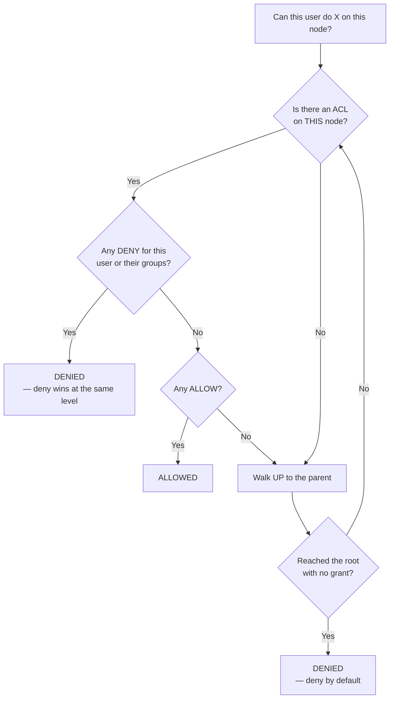
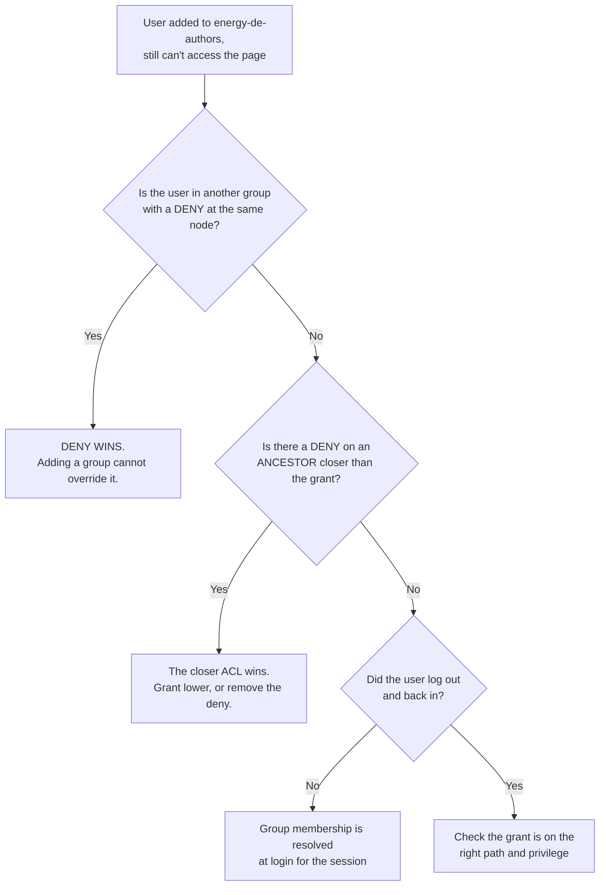

# 13 – Users, Groups, Roles and Permissions

> **Target:** 3–4 years experienced AEM Developer
> **Syllabus point covered (22):** *"User roles and group permissions."*
> **Project domain:** a global energy technology company's marketing site.

---

## Before we start — the question this topic actually tests

Your syllabus point is short, but the question underneath it is not "can you list the AEM groups." It is:

> **"Do you understand how AEM decides whether a user can do something?"**

Because permission problems in AEM are almost never "someone forgot to grant access." They are almost always **evaluation** problems — a deny inherited from somewhere unexpected, an ACL set at the wrong level, or a user in two groups where one contradicts the other.

So section 2.4 — **how permissions are evaluated** — is the centre of this file. Three rules govern everything, and if you can state them cleanly you can reason your way through any scenario an interviewer throws at you.

There is also a pattern worth noticing that connects several earlier files. *"The component renders on author but is blank on publish"* has appeared in files 02, 05 and 08, and one of the standard causes has always been permissions. This file is where that finally gets explained properly: **author and publish run as different users**, and the anonymous user on publish has a much smaller world.

---

## 1. Introduction

### 1.1 Where users and groups live

Everything in AEM is content, and users are no exception.

```
/home/
├── users/
│   └── e/
│       └── energy-author-01     ← rep:User
└── groups/
    └── e/
        └── energy-de-authors    ← rep:Group
```

**Two things worth noticing:**

**The single-letter folders are buckets.** AEM hashes the authorizable ID and distributes users into subfolders, so you don't end up with fifty thousand child nodes under one parent — the flat-structure problem from file 01. So you can't reliably guess a user's path; you look them up by ID.

**Users are nodes, so they have properties and ACLs like anything else.** Which is why user management is just content management with a specialised UI on top.

### 1.2 The one rule that matters most

Before any detail:

> **Grant permissions to groups. Put users in groups. Never grant permissions to a user directly.**

**Why:** people join, leave and change roles. A permission granted to `maria.schmidt` becomes invisible technical debt the moment Maria moves teams — nobody knows why it exists, nobody dares remove it, and when her replacement arrives they don't inherit it.

A permission granted to `energy-de-authors` survives every personnel change. Onboarding becomes "add to group"; offboarding becomes "remove from group."

**This is the first thing to say in an interview**, because it is the practice that actually matters and it costs nothing to state.

### 1.3 A real project example to adapt

> "We have a group per country editorial team — `energy-de-authors`, `energy-us-authors` and so on — each with read and write on their own country branch under `/content/energy`, plus read on the language masters so they can see what they're inheriting. There's a separate group for the people who can publish, because in most countries authoring and publishing are different responsibilities.
>
> All permissions go to groups, never to individuals, and group membership on author comes from our identity provider rather than being managed locally, so joiners and leavers are handled by the same process as everything else.
>
> On the publish side the important one is anonymous — it has read on the published content tree and nothing else, and that's what makes the site public. Anything that shouldn't be public either isn't published or sits behind a closed user group."

That covers group-based permissions, the country structure, SSO, and the publish side — four follow-ups pre-empted.

---

## 2. Core Concepts

### 2.1 Privileges versus permissions

Two words for related things, and being precise is a small credibility marker.

**Privileges** are the atomic, JCR-level rights. They're what actually gets stored.

| Privilege | What it allows |
|---|---|
| `jcr:read` | Read nodes and properties |
| `jcr:modifyProperties` | Change property values |
| `jcr:addChildNodes` | Create child nodes |
| `jcr:removeNode` | Delete a node |
| `jcr:removeChildNodes` | Delete children |
| `jcr:readAccessControl` | See the ACLs |
| `jcr:modifyAccessControl` | Change the ACLs |
| `jcr:versionManagement` | Create and restore versions |
| `jcr:lockManagement` | Lock and unlock |
| `jcr:nodeTypeManagement` | Change node types |
| `crx:replicate` | **Activate and deactivate** — AEM-specific |
| `rep:write` | **Aggregate** — modifyProperties + addChildNodes + removeNode + removeChildNodes |
| `jcr:all` | **Everything** |

**Permissions** are the friendlier grouping shown in AEM's UI — read, modify, create, delete, read acl, edit acl, replicate. Each maps to one or more privileges.

**Two worth calling out specifically:**

**`crx:replicate`** is AEM's own, not part of the JCR spec. It's what separates "can edit" from "can publish" — and on most projects those are deliberately different groups, because publishing is a business decision with different accountability from editing.

**`rep:write`** is an aggregate. Granting it grants four privileges at once. Convenient, and worth knowing so you're not surprised that a user who "only has write" can also delete.

### 2.2 How an ACL is stored

An access control list lives on the node it protects, as a `rep:policy` child:

```
/content/energy/de/
└── rep:policy                        (rep:ACL)
     ├── allow                        (rep:GrantACE)
     │    ├── rep:principalName = "energy-de-authors"
     │    └── rep:privileges = [jcr:read, rep:write]
     └── deny                         (rep:DenyACE)
          ├── rep:principalName = "energy-de-authors"
          └── rep:privileges = [crx:replicate]
```

**So an ACL is just content.** Which is why it can be created by Repoinit, inspected in CRXDE, and — importantly — why it's covered by the same package and deployment mechanics as everything else.

**Each entry is either a grant or a deny**, names a **principal** (a user or group), and lists **privileges**.

### 2.3 Restrictions — `rep:glob` and friends

An ACE can be narrowed with **restrictions**, and `rep:glob` is the one that comes up.

```
rep:glob = "*/jcr:content*"
```

| `rep:glob` value | Applies to |
|---|---|
| *(absent)* | The node and **everything below it** |
| `""` (empty string) | **The node itself only** — no descendants |
| `*` | Everything below |
| `*/jcr:content*` | Any `jcr:content` node and below it |
| `/products*` | Paths starting `/products` under this node |

**The empty glob is the one worth remembering.** `rep:glob=""` means "this node and nothing under it," which is how you grant access to a folder without granting access to its contents — useful for letting someone see that a branch exists while not seeing what's in it.

**Other restrictions** worth being able to name: `rep:ntNames` (restrict by node type), `rep:itemNames` (by property or child name), `rep:prefixes` (by namespace).

### 2.4 How permissions are evaluated — the centre of this file

**Three rules. Learn them in this order, because they apply in this order.**

#### Rule 1 — Deny by default

If nothing grants a permission, it is denied. There is no implicit access. A brand new group can do nothing at all until you grant something.

#### Rule 2 — The closest ACL wins

ACLs are inherited down the tree. But an ACL on a **deeper** node takes precedence over one on an ancestor, for that subtree.

```
/content/energy              allow  read  →  energy-de-authors
    └── de                   (inherits: read allowed)
        └── internal         deny   read  →  energy-de-authors
            └── pricing      (inherits from /internal: read DENIED)
```

The group can read `/content/energy` and `/content/energy/de`, but not `/content/energy/de/internal` or anything below it — because the closer ACL wins for that subtree.

**This is what makes fine-grained control possible**, and it's also the source of most confusion: a permission problem deep in the tree is often caused by an ACL several levels up that nobody remembered.

#### Rule 3 — At the same level, deny wins

If a user is in two groups, and at the same node one group is allowed and the other denied, **the deny wins.**

```
User is in BOTH:
    energy-de-authors     →  allow read on /content/energy/de
    energy-restricted     →  deny  read on /content/energy/de

Result: DENIED
```

**Why this matters practically:** it means a deny is a blunt instrument. Once you deny something to a group, you cannot grant it back to a member by adding them to another group at the same level. That surprises people, and it is the mechanism behind "I added them to the right group and they still can't get in."

**A useful nuance to have, honestly stated:** Oak evaluates entries within a single ACL in order, so the precise mechanics are more subtle than "deny always wins." But **deny-wins-at-the-same-level is the model AEM's documentation teaches and the one interviewers expect**, and it correctly predicts the behaviour in essentially every real case you'll meet. If you want to sound careful, say "at the same level, an explicit deny takes precedence" rather than claiming absolute universality.

#### The three rules together



**The interview answer:**

> "Three rules, in order.
>
> **Deny by default** — nothing is permitted unless something explicitly grants it. A new group can do nothing at all.
>
> **The closest ACL wins** — permissions inherit down the tree, but an ACL on a deeper node overrides one on an ancestor for that subtree. So you grant broadly at a high level and carve out exceptions lower down.
>
> **At the same level, an explicit deny takes precedence over an allow.** So if a user is in two groups and one denies what the other grants on the same node, they're denied. That's the rule people get caught by — you can't grant something back by adding someone to another group, which is why 'I added them to the right group and it still doesn't work' is such a common ticket.
>
> The practical consequence is that **deny is a blunt instrument**. I'd rather structure content so that broad grants at a high level naturally cover the right thing, and use deny sparingly for genuine exceptions — because a deny somewhere high up produces confusing failures a long way down the tree."

### 2.5 The standard groups

Worth being able to name, and one of them has a property that matters.

| Group | What it's for |
|---|---|
| `administrators` | Full access — effectively `jcr:all` on everything |
| `contributors` | The base group authoring groups build on |
| `dam-users` | Access to the DAM |
| `workflow-users` | Participate in workflows |
| `user-administrators` | Manage users and groups |
| `tag-administrators` | Manage the taxonomy |
| **`everyone`** | **Every user is implicitly a member — including `anonymous`** |

**`everyone` is the one to understand.** Every authorizable in the system belongs to it automatically. You don't add anyone; membership is implicit.

**Which makes it dangerous.** A deny on `everyone` denies essentially the whole system, and because of rule 3 you cannot grant it back to a specific group at the same level. It's occasionally the right tool — denying `everyone` read on a sensitive branch and then granting it back at a *deeper* node relies on rule 2 rather than rule 3 — but it needs care and it should be a deliberate decision, not a convenience.

### 2.6 The user your code runs as

**This is where several earlier files converge**, and it's the explanation for a recurring symptom.

**On author**, requests come from authenticated users. Their group memberships determine what they can see.

**On publish**, most requests are the **`anonymous`** user. What makes your site public is precisely that `anonymous` has `jcr:read` on the published content tree.

**And this is why "works on author, blank on publish" keeps appearing.** Two different users with two very different worlds:

| | Author | Publish |
|---|---|---|
| User | Authenticated, in groups | **`anonymous`** |
| Can read `/apps` | Usually yes | **No** — the `allowProxy` story, file 04 |
| Can read unpublished content | Yes | No — it isn't there |
| Can read restricted branches | Depends on groups | No |

**From files 05 and 07:** `request.getResourceResolver()` gives you a resolver **bound to the current user**. So repository reads through it automatically respect that user's permissions — which is usually exactly what you want, and occasionally the reason your component silently renders nothing on publish.

**When you genuinely need to read past the visitor's permissions**, that's a **service user** — section 2.7.

### 2.7 Service users

From file 01, and worth restating because it's the correct pattern and it comes up.

**A service user is a system user with no password**, created for a specific piece of code, granted only the permissions that code needs.

**How the wiring works:**

```
Your code asks for a resolver by SUBSERVICE NAME
        ↓
ServiceUserMapper config maps  bundle:subservice → system user
        ↓
The resolver runs as that system user, with its ACLs
```

**Why not just use an admin session?** Because `getAdministrativeResourceResolver()` grants everything, everywhere, forever — so a bug in one service becomes a full-repository problem. It's deprecated and blocked on Cloud Service.

**Two things to always say:**

**Least privilege.** Grant the service user exactly what it needs and nothing more. If it reads product pages, give it read on that branch — not read on `/content`.

**Close it.** A service resolver is one you opened, so it goes in try-with-resources. That's the file 07 rule: close what you opened, never close what Sling gave you.

### 2.8 Repoinit — the only supported way on Cloud Service

Users, groups, ACLs and folder structures all have to exist before your code runs. On Cloud Service you can't create them with an install hook or an admin session, so **Repoinit** is how it's done.

```
create service user energy-content-reader with path system/cq:services/energy

set ACL for energy-content-reader
    allow jcr:read on /content/energy
    allow jcr:read on /conf/energy
end

create group energy-de-authors

set ACL for energy-de-authors
    allow jcr:read,rep:write on /content/energy/de
    allow jcr:read on /content/energy/language-masters
    deny  crx:replicate on /content/energy/de
end
```

**It's idempotent by design**, which matters because pods restart constantly on Cloud Service — creating a group that already exists is not an error.

**And it means permissions are in Git**, reviewed like code and versioned. That's a genuinely better model than clicking through a UI on each environment and hoping they match, and it's worth saying so.

### 2.9 Closed User Groups

**The requirement:** part of the published site should only be visible to logged-in users — a partner portal, technical documentation behind registration, pricing for authenticated customers.

**A CUG restricts a published subtree to specific principals.** Two things happen: the subtree requires authentication, and access is limited to named groups.

In modern AEM this is configured through **Page Properties → Permissions**, which writes a CUG policy onto the page. Older AEM used `cq:cugEnabled` and `cq:cugPrincipals` properties, which you may still meet.

**The point worth making:** a CUG is a **publish-side** concern. It's not about who can author the content — it's about who can view it once it's live. Those are different questions and different groups.

### 2.10 Roles, honestly

Your syllabus says "user roles," so it's worth being straight about this:

> **AEM has no formal "role" concept.** What people call roles are groups, plus the permissions granted to those groups.

If someone asks about roles, they mean "how do you model different kinds of user." The answer is a group hierarchy:

```
contributors                     base authoring capability
    └── energy-authors           read/write on /content/energy
            ├── energy-de-authors    + their own country branch
            ├── energy-us-authors    + their own country branch
            └── energy-publishers    + crx:replicate
```

**Groups can be members of groups**, and permissions accumulate down that chain — which is how you build "role" hierarchies. Saying this explicitly, rather than pretending AEM has roles, is the more accurate answer.

---

## 3. Internal Working

### 3.1 Walking the tree

When Oak decides whether a user can read a node, it works from the node **upward**, and the first applicable ruling wins:

```
Can energy-de-authors read /content/energy/de/internal/pricing?

  /content/energy/de/internal/pricing   → any ACL? no, keep going
  /content/energy/de/internal           → DENY jcr:read  →  DENIED. Stop.
  /content/energy/de                    (never reached)
  /content/energy                       (never reached)
```

**The walk stops at the first ruling.** That's rule 2 in mechanical form, and it explains why an ACL high up can be invisible until you go looking — the effective permission on a deep node may be decided several levels above it.

### 3.2 Why "I added them to the group and it still doesn't work"

A classic ticket, and the mechanism is rule 3:



**The third branch catches people out and is worth knowing:** group membership is resolved into the session. A user who was already logged in when you changed their groups may need to log out and back in.

### 3.3 Where permissions bite in code

Tying together files 05 and 07:

| Where | Runs as | Consequence |
|---|---|---|
| `request.getResourceResolver()` | **The current user** | Reads respect their permissions automatically |
| A Sling Model reading content | The same resolver | A component can silently render nothing on publish |
| A service-user resolver | **The service user** | Reads past the visitor — deliberately |
| A path-bound servlet | Whoever calls it | **No ACL check at all** — file 07 |

**That last row is the one to remember.** A path-bound servlet resolves no resource, so no permission check happens. Which is why file 07 insisted that path-bound servlets do their own authorisation — this file is where that requirement comes from.

---

## 4. Important Interview Questions

### 4.1 Basic

**Q1. Where are users and groups stored?**
`/home/users` and `/home/groups`, as `rep:User` and `rep:Group` nodes, distributed into hashed subfolders so no single parent has too many children.

*Cross:* Why the letter folders? (avoid a flat structure — file 01) · Can you guess a user's path? (**no** — look them up by ID) · Are ACLs content too? (yes — `rep:policy` nodes)

**Q2. Should you grant permissions to users or groups?**
**Groups, always.** People join, leave and change roles; a permission on an individual becomes invisible debt nobody dares remove. Onboarding becomes "add to group."

*Cross:* What if one person genuinely needs something unique? (make a group of one — it's still auditable) · How do you audit? (list group grants; per-user grants are what you go looking for)

**Q3. What's the difference between a privilege and a permission?**
Privileges are the atomic JCR rights that are actually stored — `jcr:read`, `rep:write`, `crx:replicate`. Permissions are the friendlier groupings in AEM's UI, each mapping to one or more privileges.

*Cross:* Name five privileges · What's `rep:write`? (an aggregate of four) · Which is AEM-specific? (`crx:replicate`)

**Q4. What is `crx:replicate`?**
AEM's own privilege for activating and deactivating content. It's what separates "can edit" from "can publish," which on most projects are deliberately different groups.

*Cross:* Why separate them? (publishing is a business decision with different accountability) · Is it part of the JCR spec? (no — AEM-specific) · How would you model an approval flow? (workflow — file 09)

**Q5. How are permissions evaluated?**
→ Section 2.4. Deny by default; the closest ACL wins; at the same level, deny takes precedence.

*Cross:* Give an example of each · What if a user is in two conflicting groups? (denied) · Can you grant it back? (**not at the same level**)

**Q6. What is the `everyone` group?**
Every user is implicitly a member, including `anonymous`. You don't add anyone to it.

*Cross:* What's the danger? (a deny on it denies essentially everything, and you can't grant back at the same level) · When is it useful? (a baseline grant, or a deny you then override at a deeper node)

**Q7. Which user does publish run as?**
`anonymous`, for public traffic. Its read access to the published content tree is exactly what makes the site public.

*Cross:* Why does that matter for developers? (**"works on author, blank on publish"**) · Can it read `/apps`? (**no** — hence `allowProxy`, file 04) · How do you test as anonymous? (private window, direct publish URL)

**Q8. What is a service user?**
A system user with no password, created for a specific piece of code and granted only what that code needs. Your bundle requests a resolver by subservice name, and a mapping config connects that to the system user.

*Cross:* Why not an admin session? (grants everything everywhere; deprecated and blocked on Cloud Service) · Do you close the resolver? (**yes** — you opened it) · How is it created on Cloud Service? (**Repoinit**)

**Q9. What is Repoinit?**
A declarative language for repository initialisation — users, groups, ACLs, folders — supplied as an OSGi config and run at startup. Idempotent by design, and mandatory on Cloud Service.

*Cross:* Why is it mandatory there? (`/apps` is immutable, no admin session, no install hooks) · Why is idempotency needed? (pods restart constantly) · What's the benefit beyond necessity? (**permissions in Git**, reviewed and versioned)

**Q10. Does AEM have roles?**
Not formally. What people call roles are groups plus the permissions granted to them. Groups can contain groups, so you build hierarchies that way.

*Cross:* How would you model an approver? (a group with `crx:replicate`) · Country-specific authors? (a group per country, all inheriting a common base)

### 4.2 Intermediate

**Q11. What is `rep:glob` and when do you use it?**
A restriction narrowing which paths an ACE applies to. `rep:glob=""` means the node itself only, with no descendants — that's how you let someone see a folder exists without seeing what's inside. `*/jcr:content*` scopes a grant to page content nodes.

*Cross:* What does an absent glob mean? (node and everything below) · What other restrictions exist? (`rep:ntNames`, `rep:itemNames`, `rep:prefixes`) · Give a real use for the empty glob

**Q12. A user was added to the right group and still can't access the page. Why?**
→ Section 3.2. Three candidates: they're in another group with a deny at the same node, and deny wins; there's a deny on an ancestor closer than the grant; or they were logged in when the membership changed and need to log out and back in.

*Cross:* Which is most common? (a deny somewhere they didn't know about) · How would you find it? (CRXDE's Access Control tab, or the effective permissions view) · Can you override a deny by adding a group? (**no**)

**Q13. Why does a component render on author but not publish?**
Different users. Author is authenticated with group memberships; publish is `anonymous`. So it's either that `anonymous` lacks read on a path the component reads, or that something the component references was never activated and so isn't there at all.

*Cross:* How do you test? (private window against the publish URL directly, bypassing the dispatcher) · What else causes the same symptom? (`allowProxy`, unactivated references, a model returning null) · Why is this such a recurring theme? (it's the same root cause presenting in different topics)

**Q14. How do you restrict part of the published site to logged-in users?**
A Closed User Group, configured through Page Properties → Permissions, which makes the subtree require authentication and limits access to named groups.

*Cross:* Is that the same as authoring permissions? (**no** — CUG is about viewing on publish) · What were the legacy properties? (`cq:cugEnabled`, `cq:cugPrincipals`) · Where do those users come from? (usually an external identity provider)

**Q15. How would you structure groups for a twenty-country site?**
A base group with the common capability, a group per country granted read and write on that country's branch plus read on the language masters, and a separate publishing group holding `crx:replicate` — because in most organisations authoring and publishing are different responsibilities.

*Cross:* Why read on language masters? (so authors can see what they're inheriting — file 12) · Why separate publishing? (accountability) · How do people get into groups? (SSO, ideally)

**Q16. Why is deny a blunt instrument?**
Because of rule 3 — once denied at a level, you can't grant it back at the same level by adding another group. And because a deny high in the tree produces confusing failures far below it, where nobody thinks to look.

*Cross:* What's the alternative? (structure content so broad grants naturally cover the right thing) · When is deny genuinely right? (a narrow exception inside a broadly granted branch) · How do you make it discoverable? (Repoinit in Git, so it's reviewable)

**Q17. How do you test what a user can actually do?**
**Impersonation** — an administrator can impersonate a user and see the system exactly as they see it. That's far more reliable than reading ACLs and reasoning about them, because the evaluation rules interact in ways that are easy to get wrong on paper.

*Cross:* Where is it? (Tools → Security → Users) · What else? (CRXDE's Access Control tab shows the effective policy on a node) · How do you test anonymous? (private window against publish)

**Q18. Where do permissions bite in code?**
`request.getResourceResolver()` runs as the current user, so every read through it respects their permissions automatically. That's usually what you want. A service-user resolver deliberately runs as something else. And a **path-bound servlet resolves no resource at all**, so no permission check happens — which is why it must authorise itself.

*Cross:* Why does a path-bound servlet skip ACLs? (nothing is resolved, so nothing is checked — file 07) · When would you use a service user? (reading past the visitor, deliberately) · What must you do afterwards? (**close it**)

**Q19. How do users get into AEM on a real project?**
Usually from an identity provider rather than being created locally — SSO through Adobe IMS on Cloud Service, or SAML/LDAP on older setups. Group membership is then driven by the IdP, so joiners and leavers follow the same process as every other system.

*Cross:* Why does that matter? (offboarding is handled centrally rather than being remembered) · What about publish? (mostly anonymous; CUG users often come from a separate customer directory) · What about service users? (**always local**, created by Repoinit — they're for code, not people)

**Q20. What's the risk of granting `jcr:all` or using `administrators`?**
It removes every boundary. A mistake by that user or that code affects everything, and audit becomes meaningless because you can't tell what was intentionally permitted. It also makes least-privilege reviews impossible — you can't spot an over-grant when everything is granted.

*Cross:* What's the correct approach? (grant what's needed on the paths needed) · How do you know what's needed? (start narrow and widen when something fails, rather than starting broad) · Who should be an administrator? (very few people, and no code)

### 4.3 Advanced

**Q21. Design the permission model for a multi-country site.**

> "I'd start from groups, never individuals, because personnel change and a per-user grant becomes debt nobody dares remove.
>
> **The structure** would be a base group with common authoring capability, then a group per country granted read and write on that country's branch — `/content/energy/de` for the German team — plus **read** on `/content/energy/language-masters`, so they can see what they're inheriting. That read matters more than people expect: without it, an author trying to understand why a page changed after a rollout has no way to look at the source.
>
> **Publishing separately.** `crx:replicate` goes to its own group, because in most organisations editing and publishing are different responsibilities with different accountability. That also gives you a natural place to hang an approval workflow later.
>
> **Assets** need thought, because the DAM is usually shared. Everyone reads it; a smaller group manages it. Country teams uploading into their own folders is a reasonable middle ground.
>
> **Deny sparingly.** I'd rather structure the content so that broad grants at the right level naturally cover the right thing, and use deny only for genuine exceptions — because a deny can't be overridden by adding someone to another group at the same level, and one high in the tree produces confusing failures far below.
>
> **All of it in Repoinit**, so permissions live in Git, get reviewed like code, and are identical across environments. That's much better than clicking through a UI on each environment and hoping they match — which is how environments drift.
>
> **And I'd verify by impersonation** rather than by reading the ACLs, because the evaluation rules interact in ways that are easy to get wrong on paper."

*Cross:* What if a country needs access to another's content? (a specific grant, not widening the base) · How do you handle a shared campaign branch? · How do you audit it?

**Q22. A service is failing with a `LoginException`. Walk me through it.**

> "That means the resolver couldn't be obtained, and there are three usual causes.
>
> **The subservice name doesn't match** the `ServiceUserMapper` configuration. The mapping format is bundle symbolic name, colon, subservice name, equals the system user in brackets — and all three have to line up exactly. A typo in any of them gives you this.
>
> **The system user doesn't exist**, because the Repoinit script didn't run or failed. I'd check the logs at startup, since a Repoinit failure is visible there.
>
> **The mapping config didn't deploy** to that environment — a run-mode folder problem, which is the file 06 issue in a new place.
>
> What makes it confusing is that it's environment-specific. It usually works locally, because someone created the user by hand while developing, and fails on a fresh environment where only the Repoinit script ran. So I'd check whether the user actually exists in `/home/users/system` on the failing environment first — that splits the problem immediately."

*Cross:* Where would you see a Repoinit failure? (startup logs) · What's the mapping format? · Why does it work locally? (**a hand-created user that isn't in code**)

**Q23. How would you audit permissions on a large site?**

> "Three angles.
>
> **Find per-user grants.** Any ACL naming an individual rather than a group is worth questioning — usually it was a quick fix that became permanent.
>
> **Find denies.** They're the ones that cause confusing failures, and each should have a documented reason. A deny nobody can explain is a deny that should probably be a narrower grant somewhere else.
>
> **Check for over-grants** — anything with `jcr:all`, or `rep:write` where read would do, or a grant at `/content` where a branch would do.
>
> Practically I'd query the repository for `rep:policy` nodes under the content tree and report on their principals and privileges. And I'd compare it against Repoinit — anything in the repository that isn't in Repoinit was added by hand, which means it exists on one environment and not others.
>
> That last check is the valuable one, because environment drift in permissions is how something works on stage and fails on production."

*Cross:* How would you find per-user grants? (principals not in the group list) · What's the fix for drift? (everything through Repoinit) · How often? (with each release, ideally automated)

**Q24. How do permissions interact with MSM?**

Country teams have write access to their own branch, and a rollout writes into that branch — but the rollout runs as whoever triggered it, or as a system process, not as the country author. So a country team can have read-only access to content that still receives updates.

The subtler point: **a rollout bypasses the authoring permission model** in the sense that it writes values the local author might not have been able to set themselves. That's usually intended — it's how central control works — but it's worth understanding when someone asks why content changed that "nobody has permission to change."

*Cross:* Who does a rollout run as? (the triggering user, or a service context) · Can a country author cancel inheritance? (if they can write, yes — which is a governance question, file 12) · Should they be able to?

**Q25. What changes about permissions on Cloud Service?**

Users come from Adobe IMS rather than being created locally, so group membership is managed centrally. There's **no admin session** available to code. Service users and ACLs **must** be created by Repoinit, because `/apps` is immutable and install hooks aren't available. And because pods are recreated, anything not in code doesn't survive — a permission granted by hand on one pod is meaningless.

The net effect is that permissions become genuinely code-managed, which is a better model even though it removes the quick manual fix.

*Cross:* What if you need an emergency permission change? (through the pipeline — there's no back door, deliberately) · How do you test locally? (Repoinit runs the same way on the SDK) · What about publish users for a CUG? (usually an external directory)

---

## 5. Cross Questions — how this topic gets drilled

**Thread A — from "how do you manage permissions"**
Users or groups? → Why groups? → How do you structure them? → What's a privilege? → Name some → What's `crx:replicate`? → Why separate publishing?

**Thread B — from "how are permissions evaluated"**
What's the default? → What happens with nested ACLs? → Which wins? → What if a user is in two groups? → **Can you grant it back?** → So why is deny risky? → How would you avoid it?

**Thread C — from "works on author, not publish"**
Which user is each? → What can anonymous read? → What can't it? → How would you test? → What else causes that symptom? → How does this relate to `allowProxy`?

**Thread D — from "service users"**
Why not admin? → How does the mapping work? → How is the user created? → What's Repoinit? → Why must it be idempotent? → What happens if the name doesn't match? → Why does it work locally?

---

## 6. Best Interview Answers

### 6.1 "How do you handle users, roles and permissions?" — about 2 minutes

**Your syllabus point 22, in one answer.**

> "The first thing I'd say is that AEM doesn't really have roles as a formal concept — what people call roles are **groups**, plus the permissions granted to those groups. Groups can contain groups, so you build hierarchies that way.
>
> And the rule I'd never break is: **permissions go to groups, never to individual users**. People join, leave and change teams, and a permission granted to a person becomes invisible debt — nobody knows why it exists and nobody dares remove it. With groups, onboarding is 'add to group' and offboarding is 'remove from group'.
>
> On our project that means a base authoring group, then a group per country with read and write on their own branch plus **read** on the language masters so they can see what they're inheriting. Publishing is a separate group holding `crx:replicate`, because editing and publishing are different responsibilities with different accountability.
>
> The mechanics: ACLs are stored on the node as a `rep:policy` child, each entry granting or denying **privileges** — the atomic JCR rights like `jcr:read`, `rep:write`, and AEM's own `crx:replicate` — to a principal. You can narrow an entry with restrictions, most usefully `rep:glob`.
>
> **Evaluation** follows three rules. Deny by default. The closest ACL wins, so permissions inherit down the tree but a deeper ACL overrides an ancestor. And at the same level, an explicit deny takes precedence over an allow. That third one is what catches people — you can't grant something back by adding a user to another group, which is why 'I added them to the right group and it still doesn't work' is such a common ticket.
>
> On Cloud Service all of this goes through **Repoinit**, so permissions live in Git and get reviewed like code and are identical across environments. That's genuinely better than clicking through a UI per environment and hoping they match.
>
> And I verify by **impersonating** a user rather than reading the ACLs, because the rules interact in ways that are easy to get wrong on paper."

### 6.2 "How are permissions evaluated?" — about 60 seconds

> "Three rules, applied in order.
>
> **Deny by default.** Nothing is permitted unless something explicitly grants it. A brand new group can do nothing at all.
>
> **The closest ACL wins.** Permissions inherit down the tree, but an ACL on a deeper node overrides one on an ancestor for that subtree. So the pattern is: grant broadly at a high level, and carve out exceptions lower down.
>
> **At the same level, an explicit deny takes precedence over an allow.** So a user in two groups, one granting and one denying at the same node, is denied.
>
> That third rule is the one with practical consequences, because it means **deny is a blunt instrument**. You cannot grant something back by adding someone to another group at that level. So I use deny sparingly — I'd rather structure the content so that broad grants at the right level naturally cover the right thing, and reserve deny for genuine exceptions. A deny high in the tree produces confusing failures a long way down, where nobody thinks to look for it."

### 6.3 "Why does a component work on author but not publish?" — about 45 seconds

> "Because they run as different users. On author the request is an authenticated user with group memberships; on publish it's **`anonymous`**, whose world is much smaller.
>
> So it's usually one of two things. Either `anonymous` doesn't have read access on a path the component reads — a restricted branch, or something the component references. Or the referenced content was simply never activated, so it isn't on publish at all.
>
> The way I'd test is a private browsing window hitting the **publish instance directly**, bypassing the dispatcher — because that separates a permissions problem from a caching one, which otherwise look identical.
>
> This same root cause shows up in a few different disguises. `allowProxy` on clientlibs is the same thing — `/apps` isn't readable by anonymous. And a Sling Model with optional injection renders empty rather than erroring when it can't read something, so the symptom is a blank component with nothing in the log."

---

## 7. Real Project Examples

### Story 1 — The deny nobody could find

**What happened.** A new author was added to the German content team's group and still couldn't open a section of pages. Everyone confirmed the group was correct, and colleagues in the same group had access.

**The investigation.** The group grant was right. Impersonating the user reproduced it immediately, which ruled out anything client-side.

**The cause.** The user was also in a second group — added months earlier for a short-term project — that had a **deny** on that branch. Because of rule 3, at the same level the deny won, and adding them to the authoring group could not override it.

**Why it was hard to find.** Two things. The deny was on a group nobody associated with content access, and nothing surfaces "you are denied because of a group you're in" — the user just sees pages they can't open, exactly as if the grant were missing.

**The fix.** Removing the obsolete group membership. But the more useful outcome was realising the deny shouldn't have existed at all — it had been added as a quick way to hide a branch during a project, and a narrower grant elsewhere would have achieved the same thing without leaving a trap.

**The lesson to state:** *"A deny doesn't just restrict — it becomes something you can't grant around at the same level. So every deny is a permanent constraint on the model, and it needs a documented reason."*

### Story 2 — The service that worked locally and failed everywhere else

**What happened.** A service reading product data threw `LoginException` on every environment except the developer's local instance.

**The cause.** During development, the developer had created the system user by hand in the UI to get moving. The Repoinit script that should have created it had a syntax error, so it silently didn't run — and locally nobody noticed, because the user was already there.

**Why it's a good story.** It's the exact shape of a whole class of problem: **something exists on one environment because a human made it, and doesn't exist elsewhere because the code that should create it doesn't work.** Permissions are particularly prone to this because the manual route is so easy.

**The fix.** Fixing the Repoinit script, and then **deleting the hand-created user locally** to prove the script actually worked. That second step is the important one — until you remove the manual artefact, you haven't tested anything.

**What we changed.** A rule that anything created by hand during development gets deleted before the change is considered done. And checking startup logs for Repoinit failures, since they're visible there but nobody was looking.

### Story 3 — Splitting publish rights from edit rights

**The situation.** Originally, anyone who could edit a page could publish it. Convenient, and fine while the site was small.

**The problem it caused.** As country teams grew, pages started going live before review — not maliciously, just because the publish button is right there and the distinction between "saved" and "live" isn't obvious in the UI when you have both permissions.

**The change.** Moved `crx:replicate` out of the authoring groups into a separate publishing group with a smaller membership.

**What it enabled.** Two things beyond the immediate fix. It gave a natural home for an approval workflow later — the people in the publishing group are exactly the approvers. And it made "who published this" a meaningful question, because the set of people who could have is now small.

**The friction, honestly.** It slowed some teams down, and there was pushback. The resolution was per-country: markets with a review process kept the split, and a couple of small markets where the same person does everything got both permissions, deliberately and documented, rather than as an accident.

**The point to make:** *"Permission design is an organisational question wearing technical clothes. The right answer depends on how the team actually works, not on what's technically tidiest."*

---

## 8. Configuration Examples

### 8.1 Groups and ACLs in Repoinit

`ui.config/.../org.apache.sling.jcr.repoinit.RepositoryInitializer~energy.cfg.json`

Readable form of the script:

```
# ---------------------------------------------------------------
# SERVICE USERS -- for code, not people.
# Least privilege: exactly what the code needs, nothing more.
# ---------------------------------------------------------------

create service user energy-content-reader with path system/cq:services/energy

set ACL for energy-content-reader
    # Read only, and only the branches it actually touches.
    # NOT /content -- that would grant far more than needed.
    allow jcr:read on /content/energy
    allow jcr:read on /conf/energy
end


create service user energy-report-writer with path system/cq:services/energy

set ACL for energy-report-writer
    allow jcr:read on /content/energy
    # Write ONLY where it writes
    allow jcr:read,rep:write on /var/energy/reports
end


# ---------------------------------------------------------------
# GROUPS -- permissions go here, never to individual users
# ---------------------------------------------------------------

create group energy-authors
add energy-authors to group contributor

set ACL for energy-authors
    # Everyone authoring can read the whole site
    allow jcr:read on /content/energy
    # And the shared asset library
    allow jcr:read on /content/dam/energy
end


create group energy-de-authors
add energy-de-authors to group energy-authors

set ACL for energy-de-authors
    # Write ONLY on their own country branch
    allow jcr:read,rep:write on /content/energy/de

    # READ on the language masters matters more than people expect:
    # without it, an author can't look at the source to understand
    # why a page changed after a rollout (file 12).
    allow jcr:read on /content/energy/language-masters

    # Upload into their own asset folder only
    allow jcr:read,rep:write on /content/dam/energy/de
end


# ---------------------------------------------------------------
# PUBLISHING -- SEPARATE, because editing and publishing are
# different responsibilities with different accountability.
# ---------------------------------------------------------------

create group energy-publishers

set ACL for energy-publishers
    allow jcr:read on /content/energy
    allow crx:replicate on /content/energy
    allow crx:replicate on /content/dam/energy
end


# ---------------------------------------------------------------
# A NARROW EXCEPTION.
#
# Note this is a DENY, and denies are blunt: because deny wins at
# the same level, nobody can be granted access here by adding them
# to another group. That's the intent -- but it means this line is
# a permanent constraint on the model and needs a documented reason.
# ---------------------------------------------------------------

set ACL for energy-authors
    deny jcr:read on /content/energy/internal
end
```

**The four things to be able to defend:**

**Service users get exactly what they need** — `/content/energy`, not `/content`.

**Groups, never users.** Every ACL names a group.

**Read on the language masters**, because otherwise authors can't understand their own content.

**`crx:replicate` is separate**, because publishing is a different responsibility.

### 8.2 The service user mapping

`ui.config/.../org.apache.sling.serviceusermapping.impl.ServiceUserMapperImpl.amended-energy.cfg.json`

```json
{
  "user.mapping": [
    "com.energy.core:content-reader=[energy-content-reader]",
    "com.energy.core:report-writer=[energy-report-writer]"
  ]
}
```

**Format: `<bundle symbolic name>:<subservice name>=[<system user>]`.**

**All three have to line up exactly** — the bundle name must match your `core` bundle, the subservice name must match the constant in your Java, and the system user must be the one Repoinit created. A mismatch in any of them gives you a `LoginException` at runtime, and it's the most common cause of "works locally, fails on the server."

### 8.3 Using it in code

```java
package com.energy.core.services.impl;

import org.apache.sling.api.resource.LoginException;
import org.apache.sling.api.resource.ResourceResolver;
import org.apache.sling.api.resource.ResourceResolverFactory;
import org.osgi.service.component.annotations.Component;
import org.osgi.service.component.annotations.Reference;
import org.slf4j.Logger;
import org.slf4j.LoggerFactory;

import java.util.Collections;
import java.util.Map;

@Component(service = ProductLookupService.class)
public class ProductLookupServiceImpl implements ProductLookupService {

    private static final Logger LOG =
            LoggerFactory.getLogger(ProductLookupServiceImpl.class);

    // Must match the ServiceUserMapper config EXACTLY.
    private static final String SUBSERVICE = "content-reader";

    @Reference
    private ResourceResolverFactory resolverFactory;

    @Override
    public String readTitle(String path) {

        Map<String, Object> params =
                Collections.singletonMap(ResourceResolverFactory.SUBSERVICE, SUBSERVICE);

        // try-with-resources: THIS resolver is one we OPENED, so we
        // close it. Contrast with request.getResourceResolver(),
        // which Sling owns and we must NOT close (file 07).
        try (ResourceResolver resolver =
                     resolverFactory.getServiceResourceResolver(params)) {

            // Reads through this resolver run as the SERVICE USER,
            // with its ACLs -- deliberately reading past whatever the
            // visitor could see.
            return java.util.Optional
                    .ofNullable(resolver.getResource(path + "/jcr:content"))
                    .map(r -> r.getValueMap().get("jcr:title", String.class))
                    .orElse(null);

        } catch (LoginException e) {
            // Three usual causes:
            //   1. The subservice name doesn't match the mapping config
            //   2. The system user doesn't exist (Repoinit failed)
            //   3. The mapping config didn't deploy to this run mode
            //
            // It typically works LOCALLY because someone created the
            // user by hand while developing, and fails on a fresh
            // environment where only Repoinit ran.
            LOG.error("Could not obtain a resolver for subservice '{}'", SUBSERVICE, e);
            return null;
        }
    }
}
```

### 8.4 `rep:glob` — narrowing a grant

```
set ACL for energy-de-authors

    # The node itself ONLY -- no descendants.
    # Lets them see that the folder exists without seeing inside it.
    allow jcr:read on /content/energy/shared restriction(rep:glob,"")

    # Only page content nodes below this point
    allow jcr:read,rep:write on /content/energy/de restriction(rep:glob,"*/jcr:content*")

end
```

**The empty glob is the one worth remembering.** Without a glob, a grant covers the node and everything below it. With `rep:glob=""`, it covers only the node — which is how you make a branch visible in the tree without exposing its contents.

### 8.5 Checking permissions in Java

Occasionally needed — for a component that behaves differently depending on what the user can do.

```java
import org.apache.jackrabbit.api.security.user.UserManager;
import org.apache.sling.api.resource.ResourceResolver;

import javax.jcr.Session;

public boolean canPublish(ResourceResolver resolver, String path) {
    Session session = resolver.adaptTo(Session.class);
    if (session == null) {
        return false;
    }
    try {
        // Ask the session what it's actually permitted to do, rather
        // than reading the ACLs and reasoning about them. The
        // evaluation rules interact in ways that are easy to get
        // wrong on paper.
        return session.hasPermission(path, Session.ACTION_SET_PROPERTY);
    } catch (Exception e) {
        return false;
    }
}
```

**The principle here generalises:** ask the system what a user can do rather than deducing it. That's true in code, and it's the reason impersonation beats ACL-reading when debugging.

---

## 9. Common Mistakes

| The mistake | What actually happens | The fix |
|---|---|---|
| Granting permissions to individual users | Invisible debt; breaks when they leave | **Always groups** |
| Using deny where a narrower grant would do | Can't be overridden at the same level; confusing failures far below | Structure grants; deny only for genuine exceptions |
| Denying on `everyone` | Denies essentially everybody, and you can't grant back at that level | Grant deliberately instead |
| Granting `jcr:all` or using `administrators` for code | No boundary; a bug becomes a repository-wide problem | Least privilege, per path |
| Service user granted `/content` | Far more than the code needs | Grant the specific branch |
| Not closing a service resolver | Session leak → memory exhaustion | try-with-resources |
| Closing `request.getResourceResolver()` | Breaks the rest of the request | Only close what you opened |
| Creating users by hand during development | Works locally, fails everywhere else | **Repoinit**, then delete the manual one to prove it |
| Repoinit failure unnoticed | The user silently doesn't exist | Check startup logs |
| Subservice name not matching the mapping | `LoginException` at runtime | Bundle, subservice and user must all line up |
| Forgetting authors need read on language masters | They can't see why a rollout changed something | Grant read on the blueprint branch |
| Publishing rights bundled with editing | Pages go live before review | Separate `crx:replicate` |
| Assuming author and publish behave the same | "Works on author, blank on publish" | Test as anonymous against publish directly |
| Reasoning about ACLs instead of testing | The rules interact in non-obvious ways | **Impersonate** |
| Permissions clicked in per environment | Drift — works on stage, fails on prod | Everything through Repoinit |
| Forgetting `rep:glob` semantics | A grant covers far more or less than intended | Absent = everything below; `""` = the node only |

---

## 10. Best Practices

**Groups, always.** Permissions to groups, users into groups. Even a permission for one person gets a group of one, because that's auditable.

**Least privilege.** Grant the narrowest path and the fewest privileges that work. Start too narrow and widen when something legitimately fails — starting broad means you never find out what was actually needed.

**Deny sparingly.** Every deny is a permanent constraint that can't be granted around at the same level. Document why each one exists.

**Separate publishing from editing.** `crx:replicate` in its own group. It matches how organisations actually work, and it gives you a place to hang approval later.

**Everything in Repoinit.** Permissions in Git, reviewed like code, identical across environments. And delete anything you created by hand while developing, or you haven't tested the script.

**Test by impersonation**, not by reading ACLs. And test publish as anonymous, in a private window, against publish directly.

**Audit periodically.** Look for per-user grants, unexplained denies, over-grants, and anything in the repository that isn't in Repoinit — that last one is how you catch environment drift.

---

## 11. Debugging Tips

**Impersonation is the single most useful tool here.** Tools → Security → Users → Impersonate. It shows you the system exactly as that user sees it, which beats reading ACLs and reasoning about them — the rules interact in ways that are genuinely easy to get wrong on paper.

**CRXDE's Access Control tab** shows the effective policy on a node, including entries inherited from ancestors. That's where you find the deny nobody remembered.

**"They're in the group and it still doesn't work" — check in this order:**

1. **Are they in another group with a deny at that level?** Deny wins, and adding a group can't override it.
2. **Is there a deny on an ancestor closer than the grant?** The closest ACL wins.
3. **Did they log out and back in?** Group membership is resolved into the session.
4. **Is the grant on the right path and the right privilege?** `jcr:read` when they need `rep:write` is easy to miss.

**"Works on author, blank on publish":**

Test in a private window against the **publish instance directly**, bypassing the dispatcher — that separates permissions from caching, which otherwise present identically. Then check whether `anonymous` has read on every path the component touches, and whether everything it references was actually activated.

**`LoginException` on a service:**

Check whether the system user actually exists in `/home/users/system` on the failing environment. If it doesn't, Repoinit failed — look at the startup logs. If it does, the subservice name or the mapping config is wrong.

| Tool | Answers |
|---|---|
| Tools → Security → Users → **Impersonate** | What can this user actually do |
| CRXDE → **Access Control** tab | The effective policy on a node, including inherited |
| Tools → Security → Permissions | Grant and review permissions |
| `/home/users/system` in CRXDE | Does the service user exist here |
| Startup logs | Repoinit failures |
| Private window on publish directly | Anonymous behaviour, without the dispatcher |

---

## 12. Performance Notes

**Permission evaluation happens on every read.** Oak walks up the tree evaluating ACLs, so a deeply nested structure with many ACLs at many levels costs more than a shallow one with a few.

**Keep ACLs high and few.** A grant at a branch root covering everything below is cheaper and far easier to reason about than a hundred grants scattered through the tree.

**Restrictions add cost.** `rep:glob` is evaluated per node, so a complex glob on a heavily-read branch is not free. Use them where they genuinely help, not as a default.

**Groups with very large memberships** cost more to resolve at login. In practice this is rarely the bottleneck, but it's worth knowing if a directory sync has produced groups with tens of thousands of members.

**And the honest framing:** permissions are rarely the performance problem in an AEM project. Uncached pages and unindexed queries dominate. But an over-complicated ACL structure is a **maintainability** problem long before it's a performance one, and that's the better argument for keeping it simple.

---

## 13. Real Production Scenarios

**1. User in the right group still denied.** Another group has a deny at that level, and deny wins.

**2. Permission works for one page, not a sibling.** A closer ACL on one branch overrides the ancestor grant.

**3. Nobody can access a branch after a change.** A deny on `everyone`, which can't be granted around at the same level.

**4. Works on author, blank on publish.** `anonymous` lacks read, or the referenced content was never activated.

**5. `LoginException` on a service.** Subservice name mismatch, missing system user, or the mapping config didn't deploy.

**6. Service works locally, fails on every other environment.** The user was created by hand locally; Repoinit failed silently.

**7. Permission exists on stage but not production.** Clicked in by hand rather than deployed through Repoinit.

**8. Memory climbing on publish.** A leaked service resolver never closed.

**9. Pages going live without review.** Editing and publishing rights bundled together.

**10. Author can't see why a page changed after a rollout.** No read access on the language masters (file 12).

**11. Author can't edit a component.** Could be permissions — but check first whether it's a **locked structure component** (file 03), which is the more common cause and looks identical.

**12. Everything breaks after granting one permission.** A deny added somewhere broad, or `jcr:all` removed from something that needed it.

**13. A user's new group membership has no effect.** They were logged in when it changed; group membership is resolved into the session.

**14. Path-bound servlet reachable by anyone.** No resource is resolved, so no ACL check happens (file 07).

**15. An asset is visible on publish that shouldn't be.** Published, and `anonymous` can read it. Publishing is the exposure, not the ACL.

**16. Someone changed permissions and nobody knows who.** Changed in the UI rather than through Repoinit, so there's no review trail.

---

## 14. Follow-up Questions

- How are your groups structured?
- Do you grant anything to individual users?
- How do users get into AEM — locally or SSO?
- Do you separate publishing from editing?
- How do you manage permissions across environments?
- Have you used Repoinit?
- How do you test that permissions are correct?
- Have you had a permission problem in production?
- **What would you change about your permission model?**

For the last: *"We have a handful of denies nobody can explain — added years ago for reasons that are lost. They're the ones that cause confusing failures, and I'd want each one either documented or replaced with a narrower grant. Right now they're landmines."*

---

## 15. Comparison Tables

**Privileges you should be able to name**

| Privilege | Allows |
|---|---|
| `jcr:read` | Read nodes and properties |
| `jcr:modifyProperties` | Change values |
| `jcr:addChildNodes` | Create children |
| `jcr:removeNode` / `jcr:removeChildNodes` | Delete |
| `jcr:readAccessControl` / `jcr:modifyAccessControl` | See / change ACLs |
| `jcr:versionManagement` | Versions |
| **`crx:replicate`** | **Activate and deactivate — AEM-specific** |
| `rep:write` | **Aggregate** of the four write privileges |
| `jcr:all` | Everything |

**The three evaluation rules**

| Rule | Meaning |
|---|---|
| 1. Deny by default | Nothing unless granted |
| 2. Closest wins | A deeper ACL overrides an ancestor |
| 3. Deny wins at the same level | Conflicting group grants → denied |

**`rep:glob`**

| Value | Applies to |
|---|---|
| *(absent)* | The node **and everything below** |
| `""` | **The node itself only** |
| `*` | Everything below |
| `*/jcr:content*` | Page content nodes |

**Author vs Publish**

| | Author | Publish |
|---|---|---|
| User | Authenticated | **`anonymous`** |
| Reads `/apps` | Usually yes | **No** |
| Reads unpublished content | Yes | It isn't there |
| Symptom when it differs | — | "Works on author, blank on publish" |

**Which resolver runs as whom**

| Source | Runs as | Close it? |
|---|---|---|
| `request.getResourceResolver()` | **The current user** | **No** — Sling owns it |
| `getServiceResourceResolver(...)` | **The service user** | **Yes** — you opened it |
| `getAdministrativeResourceResolver()` | Everything | Deprecated, blocked on Cloud Service |

**Groups worth naming**

| Group | For |
|---|---|
| `administrators` | Full access |
| `contributors` | Base authoring |
| `dam-users` | Assets |
| `workflow-users` | Workflow participation |
| **`everyone`** | **Everyone, implicitly — including `anonymous`** |

---

## 16. Memory Tricks

**The rule that matters most:** *"Groups get permissions. Users get groups."*

**The three evaluation rules:** *"Nothing by default. Nearest wins. Deny beats allow."*

**Why deny is dangerous:** *"You can't grant around a deny at the same level."*

**Author vs publish:** *"Author is somebody. Publish is anonymous."*

**`rep:glob`:** *"Empty glob means the node and nothing else."*

**Service users:** *"Least privilege, and close what you opened."*

**Repoinit:** *"If it isn't in code, it isn't on the next environment."*

**Debugging:** *"Impersonate, don't deduce."*

**`crx:replicate`:** *"Editing and publishing are different jobs."*

---

## 17. Revision Notes

- Users and groups are **content**: `/home/users`, `/home/groups`, node types `rep:User` and `rep:Group`, distributed into hashed buckets.
- **Permissions go to GROUPS, never individual users.** People change; groups persist.
- **Privileges** are the atomic JCR rights (`jcr:read`, `jcr:modifyProperties`, `jcr:addChildNodes`, `jcr:removeNode`, `jcr:readAccessControl`, `jcr:modifyAccessControl`, `crx:replicate`). **`rep:write`** is an aggregate of the four write privileges. **`jcr:all`** is everything. **`crx:replicate`** is AEM's own — it's what separates editing from publishing.
- **ACLs are stored on the node** as a `rep:policy` child, with `rep:GrantACE` / `rep:DenyACE` entries naming a principal and privileges.
- **Restrictions** narrow an entry. **`rep:glob=""` means the node itself only**; absent means the node and everything below. Also `rep:ntNames`, `rep:itemNames`.
- **EVALUATION — three rules:** ① **deny by default** ② **the closest ACL wins** (deeper overrides ancestor) ③ **at the same level, deny takes precedence**. Rule 3 means **you cannot grant something back by adding another group** — the source of "I added them to the group and it still doesn't work."
- **Deny is blunt.** Prefer structuring grants; use deny for genuine, documented exceptions.
- **`everyone`** contains every user implicitly, including **`anonymous`**. A deny on it denies nearly everything.
- **Author is authenticated; publish is `anonymous`.** That's why "works on author, blank on publish" — and why `/apps` needs `allowProxy` (file 04).
- **`request.getResourceResolver()` runs as the current user** and Sling closes it. **A service resolver runs as the service user** and **you** close it, in try-with-resources.
- **A path-bound servlet resolves no resource, so no ACL check happens** (file 07) — it must authorise itself.
- **Service users:** system user, no password, mapped `bundle:subservice=[user]`. Least privilege. Never the admin resolver.
- **Repoinit** creates users, groups, ACLs and paths declaratively. **Idempotent.** Mandatory on Cloud Service. Puts permissions **in Git**, reviewed and consistent across environments.
- **AEM has no formal roles** — roles are groups plus grants, and groups can nest.
- **CUG** restricts a *published* subtree to authenticated principals — a publish-side concern, separate from authoring permissions.
- **Debug by impersonation**, not by reading ACLs.

---

## 18. Cheat Sheet

**Where things live**
```
/home/users/<bucket>/<userid>       rep:User
/home/groups/<bucket>/<groupid>     rep:Group
/home/users/system/...              service users
<node>/rep:policy                   the ACL (rep:GrantACE / rep:DenyACE)
```

**Privileges**
```
jcr:read
jcr:modifyProperties · jcr:addChildNodes
jcr:removeNode · jcr:removeChildNodes
jcr:readAccessControl · jcr:modifyAccessControl
jcr:versionManagement · jcr:lockManagement
crx:replicate          ← AEM: activate / deactivate
rep:write              ← aggregate of the 4 write privileges
jcr:all                ← everything
```

**Evaluation**
```
1. DENY BY DEFAULT
2. CLOSEST ACL WINS       (deeper overrides ancestor)
3. DENY BEATS ALLOW       (at the same level)

→ You CANNOT grant around a deny by adding another group.
```

**`rep:glob`**
```
(absent)         node + everything below
""               THE NODE ONLY
*                everything below
*/jcr:content*   page content nodes
```

**Repoinit**
```
create service user energy-content-reader with path system/cq:services/energy
create group energy-de-authors
add energy-de-authors to group energy-authors

set ACL for energy-de-authors
    allow jcr:read,rep:write on /content/energy/de
    allow jcr:read on /content/energy/language-masters
    allow jcr:read on /content/energy/shared restriction(rep:glob,"")
    deny  crx:replicate on /content/energy/de
end

create path (sling:Folder) /var/energy/reports
```

**Service user mapping**
```json
{ "user.mapping": [
    "com.energy.core:content-reader=[energy-content-reader]"
]}
```
Format: `bundle-symbolic-name:subservice=[system-user]` — **all three must match.**

**Getting a resolver**
```java
Map<String,Object> p = Collections.singletonMap(
        ResourceResolverFactory.SUBSERVICE, "content-reader");

try (ResourceResolver r = factory.getServiceResourceResolver(p)) {
    // runs as the SERVICE USER
}   // CLOSE what you opened

request.getResourceResolver();   // current user -- do NOT close
```

**Standard groups**
```
administrators · contributors · dam-users
workflow-users · user-administrators
everyone   ← EVERY user implicitly, including anonymous
```

**Debug**
```
Tools → Security → Users → IMPERSONATE     ← the best tool
CRXDE → Access Control tab                 effective policy, incl. inherited
/home/users/system                         does the service user exist
startup logs                               Repoinit failures
private window → publish directly          anonymous, no dispatcher
```

---

## 19. Frequently Forgotten Things

1. **Permissions go to groups, never users.**
2. **Deny wins at the same level** — you can't grant around it.
3. **The closest ACL wins**, so a deny high up decides things far below.
4. **`everyone` includes `anonymous`** and every user, implicitly.
5. **Publish runs as `anonymous`** — that's the "works on author" answer.
6. **`crx:replicate` is AEM-specific** and separates editing from publishing.
7. **`rep:write` is an aggregate** — granting it grants four privileges.
8. **`rep:glob=""` means the node itself only.**
9. **Absent glob means everything below.**
10. **Close a service resolver; never close the request's.**
11. **A path-bound servlet gets no ACL check at all.**
12. **Group membership is resolved at login** — a change needs a re-login.
13. **Repoinit is idempotent** and is the only supported route on Cloud Service.
14. **Anything created by hand doesn't exist on the next environment.**
15. **Impersonate rather than reasoning about ACLs.**
16. **Authors need read on the language masters** to understand rollouts.

---

## 20. Final Interview Summary

**1. The rule.** Permissions to groups; users into groups. Never individuals.

**2. Roles.** AEM has none formally — roles are groups plus grants, and groups nest.

**3. Privileges.** The atomic rights. `rep:write` aggregates; `crx:replicate` is AEM's own and separates publishing from editing.

**4. Storage.** ACLs are content — `rep:policy` on the node, with grant and deny entries naming principals.

**5. Evaluation.** Deny by default; closest wins; deny beats allow at the same level.

**6. The consequence.** Deny is blunt — you can't grant around it. Structure grants instead.

**7. Author versus publish.** Authenticated versus `anonymous`. That's the recurring "blank on publish" cause.

**8. Service users.** Least privilege, mapped by subservice, closed in try-with-resources. Never admin.

**9. Repoinit.** Permissions in Git, idempotent, mandatory on Cloud Service, consistent across environments.

**10. Debugging.** Impersonate; don't deduce. And test publish as anonymous, directly.

---

## 21. Mock Interview

**How to use this:** cover the answers, 25-minute timer, speak every answer out loud.

### The interviewer asks:

1. **How do you handle users, roles and permissions in AEM?**
2. Does AEM have roles?
3. Why grant to groups rather than users?
4. Where are users and groups stored?
5. What's the difference between a privilege and a permission?
6. What is `crx:replicate` and why does it matter?
7. **How are permissions evaluated?**
8. A user is in the right group and still can't access a page. Why?
9. **Can you override a deny by adding someone to another group?**
10. What is the `everyone` group, and what's the danger?
11. What is `rep:glob`, and what does an empty one mean?
12. **Why does a component work on author but not publish?**
13. How would you test what a user can actually do?
14. What is a service user, and why not use an admin session?
15. What is Repoinit and why is it mandatory on Cloud Service?
16. A service throws `LoginException`. Debug it.
17. Which resolvers do you close, and which don't you?
18. **How would you structure groups for a twenty-country site?**
19. How would you audit permissions?
20. What's a Closed User Group?

### Model answers

**1.** *(The 6.1 answer — no formal roles, groups get permissions, the country structure, the mechanics, the three evaluation rules, Repoinit, and impersonation for verification.)*

**2.** Not formally. What people call roles are **groups**, plus the permissions granted to those groups. Groups can be members of groups, so you build hierarchies that way — a base authoring group, country groups inheriting from it, a publishing group holding replication rights. I'd be straight about that rather than pretending AEM has a role concept, because the follow-up is always "so how do you model it" and the group hierarchy is the real answer.

**3.** Because people join, leave and change teams. A permission granted to an individual becomes invisible debt — six months later nobody knows why it exists, nobody dares remove it, and their replacement doesn't inherit it. Granted to a group, onboarding is "add to group" and offboarding is "remove from group," and the permission model itself doesn't change. Even where one person genuinely needs something unique, I'd make a group of one, because at least that's auditable.

**4.** `/home/users` and `/home/groups`, as `rep:User` and `rep:Group` nodes. They're distributed into single-letter bucket folders based on a hash of the authorizable ID, so no single parent ends up with tens of thousands of children — the flat-structure problem from file 01. Which means you can't reliably guess a user's path; you look them up by ID. And since they're nodes, they have properties and ACLs like anything else — user management is content management with a specialised UI.

**5.** Privileges are the atomic JCR-level rights that actually get stored — `jcr:read`, `jcr:modifyProperties`, `jcr:addChildNodes`, `crx:replicate` and so on. Permissions are the friendlier groupings shown in AEM's UI — read, modify, create, delete, replicate — each mapping to one or more privileges. Two worth calling out: `rep:write` is an **aggregate** of the four write privileges, so granting it grants more than people expect; and `crx:replicate` is AEM's own rather than part of the JCR spec.

**6.** It's the privilege for activating and deactivating content — publishing. It matters because it's what lets you separate "can edit" from "can publish," which on most projects are deliberately different groups. We split them after pages started going live before review — not maliciously, just because the publish button is right there when you have both permissions. Splitting also gave us a natural place to hang an approval workflow later, since the publishing group is exactly the set of approvers.

**7.** *(The 6.2 answer — three rules in order, with the practical consequence that deny is blunt.)*

**8.** Three candidates, in order. Most likely they're in **another group with a deny** at that level — and because deny wins at the same level, adding them to the right group can't override it. That's what we hit: a user in an obsolete project group that had a deny on the branch. Second, there might be a deny on an **ancestor closer than the grant**, since the closest ACL wins. Third, and easily missed, group membership is resolved into the session — so if they were logged in when the membership changed, they need to log out and back in.

**9.** **No** — not at the same level. That's the practical consequence of rule three and it's what surprises people. Once you deny something to a group at a node, a member of that group can't be granted it back by adding them to another group there. You'd have to remove the deny, or grant at a **deeper** node, which works because rule two says the closest ACL wins. That's why I treat every deny as a permanent constraint on the model rather than a quick fix.

**10.** Every user in the system is implicitly a member, including `anonymous` — you don't add anyone, membership is automatic. The danger is that a deny on `everyone` denies essentially everybody, and because deny wins at the same level you can't grant it back to a specific group there. It's occasionally the right tool — deny on `everyone` at a branch root, then grant back at a deeper node, which works via the closest-wins rule — but it needs to be a deliberate decision, not a convenience.

**11.** A restriction that narrows which paths an ACE applies to. Without a glob, a grant covers the node **and everything below it**. With `rep:glob=""` — an empty string — it covers **only the node itself**, no descendants. That's how you let someone see that a folder exists in the tree without seeing what's inside it. Other useful patterns are `*/jcr:content*` to scope a grant to page content nodes. There are other restrictions too — `rep:ntNames` by node type, `rep:itemNames` by property or child name.

**12.** *(The 6.3 answer — different users, anonymous versus authenticated, the two causes, testing in a private window against publish directly, and the connection to `allowProxy` and silent optional injection.)*

**13.** **Impersonation** — Tools → Security → Users → Impersonate. It shows the system exactly as that user sees it. I'd strongly prefer that over reading the ACLs and reasoning about them, because the three evaluation rules interact in ways that are genuinely easy to get wrong on paper — I've seen people stare at a correct-looking grant for an hour when the answer was a deny two levels up from a group they'd forgotten about. CRXDE's Access Control tab is the complement: it shows the effective policy on a node including inherited entries, which is where you find the deny nobody remembered. For publish, a private browsing window against the publish instance directly.

**14.** A system user with no password, created for a specific piece of code and granted only what that code needs. The code asks for a resolver by **subservice name**, and a `ServiceUserMapper` config maps bundle plus subservice to the system user. Not an admin session because that grants everything everywhere — so a bug in one service becomes a full-repository problem, and audit becomes meaningless since you can't tell what was intentionally permitted. It's deprecated, and blocked entirely on Cloud Service.

**15.** A declarative language for repository initialisation — creating users, groups, ACLs and folder paths — supplied as an OSGi configuration and executed at startup. It's mandatory on Cloud Service because `/apps` is immutable, there's no admin session, and install hooks aren't available, so there's simply no other route. It's idempotent by design, which matters because pods restart constantly and creating a group that already exists mustn't be an error. But the benefit beyond necessity is that **permissions live in Git** — reviewed like code, versioned, and identical across environments. That's a much better model than clicking through a UI on each environment and hoping they match, which is exactly how environments drift.

**16.** Three usual causes. The **subservice name doesn't match** the mapping config — and the format is bundle symbolic name, colon, subservice, equals the user in brackets, with all three having to line up exactly. The **system user doesn't exist**, because Repoinit failed — and a Repoinit failure is visible in the startup logs, but nobody's usually looking. Or the **mapping config didn't deploy** to that environment, which is a run-mode folder problem. The first thing I'd actually check is whether the user exists in `/home/users/system` on the failing environment, because that splits the problem immediately. And the classic pattern is that it works **locally** and fails everywhere else — because someone created the user by hand while developing and never noticed the script was broken. We fixed exactly that, and the important part of the fix was deleting the hand-created user to prove the script actually worked.

**17.** Close what you opened, never close what Sling gave you. A service-user resolver from `getServiceResourceResolver` is one I opened, so it goes in try-with-resources — a leaked resolver leaks a JCR session, and enough of those exhaust the instance. But `request.getResourceResolver()` is Sling's; it opened it and it will close it, and closing it myself breaks the rest of the request. That inverts the usual "always close your resolver" advice, which is why it's worth stating as a rule about ownership rather than about resolvers.

**18.** *(The Q21 answer — base group, country groups with their own branch plus read on the language masters, publishing separate, assets considered, deny sparingly, all in Repoinit, verified by impersonation.)*

**19.** Three angles. Look for **per-user grants** — any ACL naming an individual rather than a group is usually a quick fix that became permanent. Look for **denies**, because they're what cause confusing failures, and each should have a documented reason; a deny nobody can explain should probably be a narrower grant somewhere else. And look for **over-grants** — `jcr:all`, or `rep:write` where read would do, or a grant at `/content` where a branch would do. Practically I'd query for `rep:policy` nodes under the content tree and report on principals and privileges. But the most valuable check is comparing the repository against Repoinit: anything present that isn't in the script was added by hand, which means it exists on one environment and not others. That's how you catch the drift that makes something work on stage and fail on production.

**20.** A Closed User Group — it restricts part of the **published** site to authenticated users, so a partner portal or gated technical documentation is only visible to specific principals. In modern AEM it's configured through Page Properties → Permissions, which writes a CUG policy onto the page; older versions used `cq:cugEnabled` and `cq:cugPrincipals` properties. The distinction worth making is that a CUG is a **publish-side viewing** concern, entirely separate from who can author the content — those are different questions, different groups, and usually the CUG users come from an external customer directory rather than being AEM authors at all.

---

## Next file

**`14-AEM-as-a-Cloud-Service.md`** — your syllabus point 23: the genuine benefits over on-premise and how to argue them, what actually changes for a developer, and the honest limitations, so you can answer "why is cloud better" without it sounding like a sales pitch.

---

*File 13 of the AEM Interview Preparation repository. Teaching style, energy-sector project domain.*
