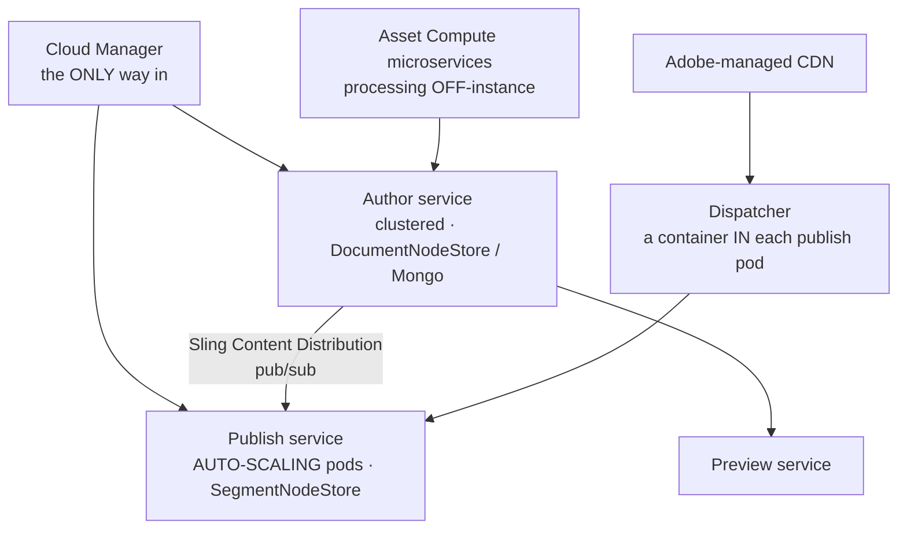
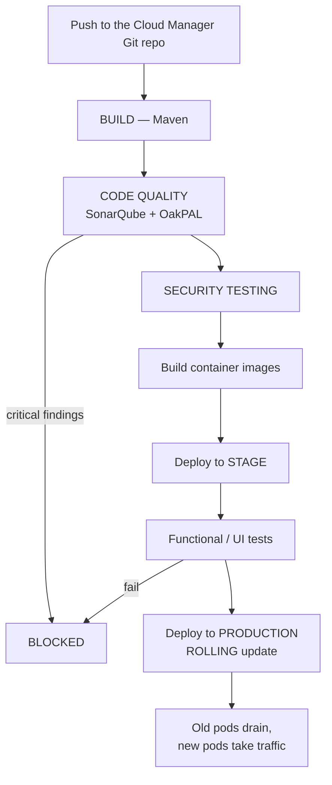
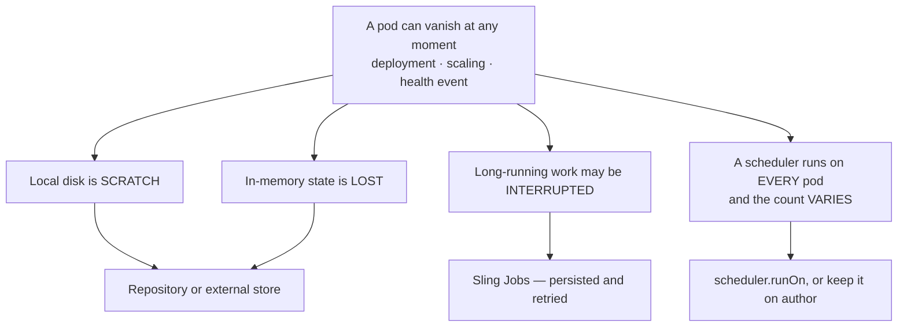

# 14 – AEM as a Cloud Service

> **Target:** 3–4 years experienced AEM Developer
> **Syllabus point covered (23):** *"If you have worked on AEM Cloud, what is the benefit? How is it better than on-premise?"*
> **Project domain:** a global energy technology company's marketing site.

---

## Before we start — the trap in this question

Your syllabus point 23 asks *"what's the benefit, how is it better than on-prem."* That phrasing invites a sales pitch, and a sales pitch is exactly the wrong answer.

**Here's why.** The interviewer almost certainly works on a project that either runs Cloud Service, is migrating to it, or deliberately stayed on 6.5. In all three cases they know the real trade-offs. A candidate who recites "auto-scaling, always up to date, lower TCO" sounds like they read the marketing page. A candidate who says *"the biggest practical change for me was that `/apps` became read-only, which meant we had to rewrite five services that used admin sessions"* sounds like they lived it.

**So the answer that scores is the one framed around what actually changed for a developer** — and that includes the things that got harder, not just easier.

There is also a second reason to be careful. This question is frequently a **screening question for whether you've genuinely worked on Cloud Service**. The follow-ups get specific fast: *how do you get logs? what's an RDE? what happens to `/apps` at runtime? how do you create a service user?* Vague benefit-talk followed by "I'm not sure" on those is worse than a smaller, honest claim.

**Everything in this file has already appeared in earlier files** — immutability in file 01, Repoinit in files 01 and 13, Asset Compute in file 09, pod recycling in file 10. This file assembles it into one answer.

---

## 1. Introduction

### 1.1 The one sentence that frames everything

> **On AEM 6.5 you own a server. On Cloud Service you consume a service.**

Almost every difference follows from that.

A **server** is a machine you can log into. You can change it, restart it, put a file on its disk and expect it there tomorrow. You are also responsible for it — patching, upgrading, monitoring, backing up.

A **service** is something Adobe runs. The machines are containers created and destroyed as needed. They are **immutable** — you cannot change them while they run — and **disposable** — one might vanish and be replaced at any moment. You are not responsible for them, and you also cannot fix them.

**That trade is the honest summary:** you give up control and gain not having to care.

### 1.2 A real project example to adapt

> "We're on Cloud Service, migrated from 6.5 about two years ago. The genuine day-to-day benefits are that we stopped doing version upgrades entirely — Adobe ships updates continuously — and the publish tier scales itself during campaigns, which used to mean provisioning instances weeks ahead and then paying for them all year.
>
> The bigger change for us as developers was the discipline it forced. `/apps` is read-only at runtime, so there's no hotfixing in CRXDE — everything goes through Git and a Cloud Manager pipeline with quality gates. That's slower for a genuine emergency, but it eliminated a whole class of problem where production had drifted from what was in source control.
>
> The migration itself was mostly about removing things Cloud Service doesn't allow — admin sessions, install hooks, a custom run mode, and a service that wrote generated files to local disk."

That covers benefits, the developer-facing change, an honest cost, and migration reality — four follow-ups pre-empted.

---

## 2. Core Concepts

### 2.1 The architecture, and what's genuinely different

From file 01, but focused on what changed:



**Four structural changes worth naming:**

**Publish auto-scales.** Pods are added and removed based on traffic. That's the headline benefit, and it's also the source of the cluster problems in file 10 — you cannot know how many instances are running.

**Content distribution replaced replication agents.** On 6.5 the author pushed to a known list of publish instances. That can't work when pods appear and disappear, so **Sling Content Distribution** uses a pub/sub pipeline that pods subscribe to. A newly created pod pulls current content by itself. Full detail in file 18.

**The dispatcher moved into the publish pod** as a sidecar container, and its configuration lives in Git and is validated by the pipeline — rather than being hand-edited on an Apache box.

**Asset processing moved off-instance** to Asset Compute microservices, configured by Processing Profiles rather than the DAM Update Asset workflow (file 09).

**The node store detail that catches people out**, and which is worth getting right because it's a common near-miss:

> **Author uses the DocumentNodeStore backed by MongoDB, because the author tier is clustered and instances share one repository. Publish uses the SegmentNodeStore, because each pod holds its own read-only copy and speed matters more than sharing.**

Most candidates say "the cloud uses Mongo" for both. Getting the split right is a genuine differentiator.

### 2.2 The genuine benefits — and how to argue each one

**Not a list. Each one with the reason it actually matters.**

#### No more version upgrades

On 6.5, an AEM upgrade was a project — weeks of regression testing, a migration window, and often deferred so long that you ended up several versions behind and the eventual jump was worse.

On Cloud Service, Adobe ships updates continuously with no downtime. **The version problem simply stops existing.**

**Why this is the strongest benefit to lead with:** it removes recurring project cost, not just operational cost. Teams on 6.5 spend real engineering time on upgrades that produces no features.

#### Auto-scaling publish

On 6.5, capacity was provisioned for peak. So you sized for the campaign, then paid for that capacity for the other eleven months.

**A concrete framing:** our campaign traffic is roughly ten times a normal day. On 6.5 that meant provisioning ahead and running the capacity year-round. On Cloud Service the publish tier scales during the campaign and back afterwards.

#### Deployment discipline

This one is a benefit **and** a constraint, which is why it's worth being honest about.

Cloud Manager pipelines are the only route to production. Every change goes through build, code quality gates, security testing, and functional tests on stage before reaching production.

**The benefit:** production cannot drift from source control. On 6.5, someone fixing something urgently in CRXDE at 2am creates a difference between what's running and what's in Git — and nobody discovers it until the next deployment overwrites the fix.

**The cost:** there is no emergency hotfix path. A genuine production emergency waits for a pipeline. That's a real trade and pretending otherwise is what makes an answer sound rehearsed.

#### Operational work disappears

Repository maintenance — compaction, revision garbage collection, data store garbage collection, index management — is real, ongoing work on 6.5. It's also invisible until it isn't: the classic 6.5 incident is a disk filling because compaction hasn't run.

Adobe handles all of it, along with monitoring, patching and backups.

#### Asset processing off-instance

On 6.5, DAM Update Asset ran on the AEM instance. Uploading a few thousand product images meant CPU-heavy image processing competing with authors, and authors noticing.

Asset Compute runs it externally. **Authors stop being affected by asset ingestion**, which is a benefit people don't anticipate until they've experienced the alternative.

#### A CDN is included

Adobe provides and manages a CDN. On 6.5 you brought your own — another contract, another configuration, another thing to coordinate.

### 2.3 What changes for a developer — the part that scores

**This is the section that separates a real answer from a recited one.** Six things change, and they're all consequences of immutability and disposability.

#### 1. `/apps` and `/libs` are read-only at runtime

They're baked into the container image at build time. So:

- **No hotfixing in CRXDE on production.** Not restricted — impossible.
- **CRXDE Lite is only available on development environments**, not stage or production.
- No install hook can write to `/apps`.

#### 2. Service users and ACLs must come from Repoinit

There's no admin session, and install hooks can't create them. So everything structural — service users, ACLs, folder paths — is declared in **Repoinit** (files 01 and 13).

**And this is the honest reframing:** it's a constraint that turned out to be an improvement. Permissions now live in Git, get reviewed like code, and are identical across environments — instead of being clicked in per environment and drifting.

#### 3. The Maven project must cleanly separate mutable from immutable

`ui.apps` holds immutable content; `ui.content` and `ui.config` hold mutable. Mix them and the build **fails validation** — it's enforced, not advisory.

#### 4. Custom run modes don't exist

You get `author` and `publish` crossed with `dev`, `stage` and `prod`. No `config.uat`. Teams migrating from on-premise frequently had custom run modes and have to collapse them.

#### 5. Local disk is scratch space

Pods are replaced during deployment, scaling, and health events. Anything written to local disk may vanish. It belongs in the repository or an external store.

#### 6. Long-running processes are discouraged

Because pods recycle. A workflow paused on a human step survives fine — it's persisted. A step doing hours of continuous computation may not (file 09).

**The interview answer for this section:**

> "The biggest change is that `/apps` and `/libs` are immutable at runtime — baked into the container image. So there's no hotfixing in CRXDE, and CRXDE Lite isn't even available on stage or production.
>
> That has knock-on effects. Service users and ACLs have to be declared in Repoinit, because there's no admin session and no install hooks. The Maven project has to cleanly separate `ui.apps` from `ui.content` and `ui.config`, and the build fails validation if you mix them. Custom run modes are gone — you get author and publish crossed with dev, stage and prod. And because pods are recycled, local disk is scratch space and long-running processes are discouraged.
>
> The honest framing is that most of those are constraints that turned out to be improvements. Repoinit meant permissions moved into Git and stopped drifting between environments. The package separation forced us to be clear about what's code and what's content. The one genuine cost is that there's no emergency hotfix path — a real production incident waits for a pipeline."

### 2.4 The honest limitations

**Raising these unprompted is what makes the whole answer credible.**

**No emergency hotfix.** Everything through a pipeline. For a genuine production incident that's a real constraint, and the mitigation is feature flags and configuration you can change through the faster config pipeline rather than a full build.

**Less introspection.** No CRXDE on stage or production, no Felix console for editing configuration. You get the Developer Console and downloadable logs, which is less than being on the box.

**Constrained customisation.** No custom run modes, no writing to `/apps`, no admin sessions, no assuming local disk. Things that worked on 6.5 sometimes have no direct equivalent.

**Adobe's release cadence is yours.** Continuous updates mean you don't control when the platform changes. That's mostly good, and occasionally you're debugging something that changed underneath you.

**Migration isn't free.** The Best Practices Analyzer typically finds real work — admin sessions, install hooks, custom run modes, local disk writes, custom asset workflows.

**Cost is different, not automatically lower.** Whether it's cheaper depends on the workload. The honest claim is that operational *effort* drops substantially; the licensing conversation is separate.

### 2.5 The tooling you should be able to name

Naming these is a quick check on whether you've actually worked on Cloud Service.

| Tool | What it's for |
|---|---|
| **Cloud Manager** | Git repository, pipelines, environments, logs — the control plane |
| **AEM SDK** | The local quickstart plus dispatcher tools |
| **RDE** — Rapid Development Environment | A cloud environment you can deploy to in **seconds**, bypassing the full pipeline, for development iteration |
| **Developer Console** | Status dumps, bundles, OSGi configs on cloud environments |
| **`aio` CLI** | Adobe I/O CLI — RDE deployments and **live log tailing** |
| **Best Practices Analyzer** | Run on 6.5 pre-migration; reports what will break |
| **Cloud Acceleration Manager** | Tracks the migration plan |
| **Repository Modernizer** | Restructures a Maven project into immutable/mutable |
| **Dispatcher Converter** | Converts dispatcher config to the cloud format |
| **Content Transfer Tool** | Moves content from 6.5 to Cloud Service |

**RDE is the one worth understanding**, because it answers an obvious objection.

**The problem it solves:** a full Cloud Manager pipeline takes a long time. During active development, waiting that long to see a change on a cloud environment is unworkable.

**RDE** lets you deploy a bundle or content package to a cloud environment in seconds, using the `aio` CLI. It's for development iteration only — not a path to production — but it makes cloud development practical.

**Mentioning RDE unprompted is a strong signal**, because it's the thing you only know about if you've hit the problem it solves.

### 2.6 Cloud Manager pipelines

**Types worth distinguishing:**

| Pipeline | Deploys | Speed |
|---|---|---|
| **Full-stack** | Code and content — the whole application | Slowest |
| **Front-end** | Only the front-end build output | Faster |
| **Web-tier** | Only dispatcher configuration | Fast |
| **Config** | Only certain configurations | Fast |

**Why several types exist:** a dispatcher rule change shouldn't require a full application build and test cycle. Knowing that web-tier and config pipelines exist — and that they're the answer to "how do you change a dispatcher rule quickly" — is a practical detail.

**Quality gates** in a full-stack pipeline: code quality via SonarQube plus Adobe's own **OakPAL** rules, security testing, and functional tests on stage. Some findings are warnings; critical ones block the deployment.

**The deployment itself is a rolling update** — old pods keep serving until new ones are healthy, so the publish tier has no downtime.

### 2.7 Migration — the honest version

If asked how you'd migrate, the tools in order:

1. **Best Practices Analyzer** on 6.5 — what will break
2. **Cloud Acceleration Manager** — track the plan
3. **Repository Modernizer** — restructure the Maven project
4. **Dispatcher Converter** — convert dispatcher config
5. **Asset Workflow Migration** — DAM workflows to Processing Profiles
6. **Content Transfer Tool** — move content, then Content Copy for deltas

**What actually breaks**, which is the more useful half of the answer:

| What | Why | Fix |
|---|---|---|
| `getAdministrativeResourceResolver()` | Blocked | Service user + Repoinit |
| Install hooks writing to `/apps` | Immutable | Repoinit |
| Custom run modes | Not supported | Collapse into the fixed set |
| Writes to local disk | Pods are ephemeral | Repository or external store |
| Custom DAM workflows | Asset processing moved | Processing Profiles |
| Long-running workflow steps | Pods recycle | Async, or Sling Jobs |
| `/apps` and `/content` in one package | Validation fails | Split into `ui.apps` and `ui.content` |

---

## 3. Internal Working

### 3.1 What happens during a deployment



**Three things worth drawing out:**

**The gates are real.** Critical findings block. That's the discipline benefit, and it's also why there's no emergency path.

**Images are built, not patched.** A deployment produces new container images — which is exactly why `/apps` is immutable at runtime.

**Rolling update means no publish downtime**, but it also means components deactivate and reactivate on every deployment. Which is why `@Deactivate` matters more here than on a server you restart occasionally (file 06).

### 3.2 Why pods being disposable changes your code



**That single fact — pods are disposable — generates most of file 10's content.** A scheduler running on an unpredictable number of pods, jobs needing persistence, and idempotency mattering because work gets retried, all come from here.

---

## 4. Important Interview Questions

### 4.1 Basic

**Q1. What is AEM as a Cloud Service?**
Adobe's managed, containerised AEM. Adobe runs the infrastructure, ships updates continuously, and the publish tier auto-scales. You deploy only through Cloud Manager pipelines.

*Cross:* How is it different from AMS? (AMS is Adobe-managed **VMs** running 6.5 — cloud-native is a different architecture) · Can you SSH to it? (**no**) · Which Java version? (11)

**Q2. What are the main benefits over on-premise?**
→ Section 2.2. Lead with **no more version upgrades**, then auto-scaling, then that operational maintenance disappears, then deployment discipline. Give the reason each one matters, not just the label.

*Cross:* Which matters most to you? · What are the downsides? (**have them ready**) · Is it cheaper? (**operational effort drops; licensing is a separate conversation**)

**Q3. What changes for a developer?**
→ Section 2.3. `/apps` immutable, Repoinit for service users and ACLs, mutable/immutable package separation enforced, no custom run modes, ephemeral local disk, long-running processes discouraged.

*Cross:* Which caused you the most work? · What can't you do any more? · Which turned out to be an improvement?

**Q4. What does "immutable content" mean?**
`/apps` and `/libs` are baked into the container image at build time and are read-only at runtime. No hotfixing, no install hooks writing there, and CRXDE Lite isn't available on stage or production.

*Cross:* So how do you create a service user? (**Repoinit**) · What's mutable? (`/content`, `/conf`, `/var`, `/home`) · What happens if you mix them in a package? (**build validation fails**)

**Q5. Which node store does each tier use?**
**Author uses DocumentNodeStore on MongoDB**, because the author tier is clustered and shares one repository. **Publish uses SegmentNodeStore**, because each pod has its own read-only copy and speed matters more than sharing.

*Cross:* Why not Mongo for both? (publish doesn't need to share, and Segment is faster) · Where do binaries go? (a separate blob store) · Why does publish scale more easily? (stateless reads)

**Q6. How does content get from author to publish?**
**Sling Content Distribution** over a pub/sub pipeline that publish pods subscribe to — replacing 6.5's replication agents.

*Cross:* Why did that have to change? (**the author can't know about pods that don't exist yet**) · How does a new pod get content? (it subscribes and pulls) → file 18

**Q7. How do you deploy?**
Cloud Manager pipelines only. Build, code quality gates, security testing, deploy to stage, run tests, then a rolling deployment to production.

*Cross:* Can you use Package Manager on production? (**no**) · What blocks a deployment? (critical quality findings, failed tests) · Is there downtime? (no — rolling)

**Q8. What is Repoinit and why is it mandatory here?**
A declarative language for creating service users, ACLs and paths, supplied as an OSGi config and run at startup. Mandatory because `/apps` is immutable, there's no admin session, and install hooks aren't available.

*Cross:* Why must it be idempotent? (**pods restart constantly**) · What's the benefit beyond necessity? (permissions in Git, consistent across environments) · Where do failures show? (startup logs)

**Q9. How do you get logs?**
Download them from Cloud Manager, or tail them live with the `aio` CLI.

*Cross:* Can you read files on the box? (**no**) · What's the Developer Console? (status dumps, bundles, configs on cloud environments) · How do you enable DEBUG for one package? (a logger config, deployed)

**Q10. What is an RDE?**
Rapid Development Environment — a cloud environment you can deploy to in seconds with the `aio` CLI, bypassing the full pipeline. For development iteration only.

*Cross:* Why does it exist? (**a full pipeline is too slow to iterate against**) · Can you deploy to production that way? (no) · Have you used one?

### 4.2 Intermediate

**Q11. What are the honest downsides?**
→ Section 2.4. No emergency hotfix path; less introspection with no CRXDE on stage or prod; constrained customisation; Adobe's release cadence; migration effort; and cost being different rather than automatically lower.

*Cross:* How do you handle a genuine emergency? (feature flags, config pipeline, or accept the pipeline duration) · What do you miss most from 6.5? · Would you recommend it anyway? (**yes, with reasons**)

**Q12. What are the pipeline types and why several?**
Full-stack for the application, front-end for the FE build, web-tier for dispatcher config, and config pipelines. Several exist because a dispatcher rule change shouldn't need a full application build and test cycle.

*Cross:* Which for a dispatcher rule? (**web-tier**) · Which is slowest? · Why does that matter operationally? (it's the closest thing to a fast fix)

**Q13. What are the quality gates?**
SonarQube plus Adobe's OakPAL rules for code quality, security testing, and functional tests on stage. Some findings are warnings; critical ones block.

*Cross:* What's OakPAL? (Adobe's package validation — checks for things like writing outside allowed paths) · Can you skip a gate? (not the blocking ones) · What commonly fails? (deprecated API use, admin sessions, package structure)

**Q14. Why are custom run modes not supported?**
The environment model is fixed — author and publish crossed with dev, stage and prod. Teams migrating from on-premise often had extras like `uat` and have to collapse them.

*Cross:* How would you handle a UAT environment? (**use `stage`, or a second stage environment**) · What breaks if you try? (the config folder never matches, so it silently never applies) · How did you migrate one?

**Q15. What happens to your code during a deployment?**
Pods are replaced, so components deactivate and reactivate — `@Deactivate` runs and anything held must be released. In-memory state is lost. Persisted Sling Jobs survive and get retried, which is another reason consumers must be idempotent.

*Cross:* What about in-flight requests? (rolling — old pods drain first) · What about a scheduled task due during the window? (**it may simply not run**, and nothing records that) · Why does `@Deactivate` matter more here? (**pods recycle far more often than a server restarts**)

**Q16. How does asset processing work?**
**Asset Compute microservices**, configured through **Processing Profiles**, running off-instance — rather than the DAM Update Asset workflow on 6.5.

*Cross:* Why did it move? (CPU-heavy work competing with authors) · What's the benefit? (**authors stop being affected by ingestion**) · How do you debug a failed rendition? (asset processing status and the profile, not the workflow console)

**Q17. How would you migrate from 6.5?**
→ Section 2.7. The tools in order, and then — more usefully — what actually breaks: admin sessions, install hooks, custom run modes, local disk writes, custom DAM workflows, and package structure.

*Cross:* Which is the biggest job usually? (**content transfer for a large DAM**, and rewriting admin sessions) · How do you handle a 3TB DAM? (Content Transfer Tool in migration sets, binaries first) · How do you validate?

**Q18. How do you handle a scheduled task on Cloud Service?**
Carefully, because publish pods auto-scale and the count varies — so a scheduler runs an unpredictable number of times. Keep scheduled work on **author**, set `scheduler.runOn`, or better, dispatch **Sling Jobs**, which are cluster-aware by design (file 10).

*Cross:* Why is it worse than a 6.5 cluster? (**there you know the node count**) · What's the safest pattern? · How would you know if it stopped running? (health check on last success)

**Q19. What tooling is available for debugging?**
The Developer Console for status dumps, bundles and OSGi configs; downloadable logs from Cloud Manager or live tailing via `aio`; CRXDE Lite on **development environments only**.

*Cross:* What can't you do? (read files on the box, edit configs in the Felix console on prod) · How do you enable DEBUG? (a logger config, deployed) · Is that enough? (**honestly, it's less than being on the box** — mitigated by better logging discipline)

**Q20. Is Cloud Service cheaper?**
Operational effort drops substantially — no upgrades, no repository maintenance, no capacity provisioning for peak. Whether the total is lower depends on the workload and the licensing arrangement, and I'd be careful about claiming a cost saving without knowing both.

*Cross:* Where does the effort actually go? (upgrades and maintenance) · What about the peak-capacity argument? (**strong** — you stop paying year-round for campaign capacity) · What's the hidden cost? (migration, and rewriting things that no longer work)

### 4.3 Advanced

**Q21. Argue for and against moving a 6.5 project to Cloud Service.**

**A genuinely good question, because a one-sided answer fails it.**

> "**For:** version upgrades stop being a project, which is recurring engineering cost that produces no features. The publish tier scales itself, so you stop provisioning for peak and paying for it year-round. Repository maintenance — compaction, garbage collection, index management — disappears, and that's work that's invisible until a disk fills. Asset processing moves off-instance so authors stop being affected by ingestion. And the pipeline discipline means production can't drift from source control.
>
> **Against:** there's no emergency hotfix path, which for some organisations is genuinely hard to accept. You lose introspection — no CRXDE on stage or production. Customisation is constrained, so things that worked may have no direct equivalent. Adobe's release cadence becomes yours. And migration is real work: admin sessions, install hooks, custom run modes and local disk writes all need rewriting, plus content transfer for a large DAM.
>
> **How I'd decide:** it depends on where the team's pain actually is. If they're spending months on upgrades and firefighting repository maintenance, the case is strong. If they have a heavily customised setup that relies on things Cloud Service doesn't allow, the migration cost may outweigh it in the short term — though I'd note that most of those customisations are themselves a maintenance burden.
>
> The argument I'd be careful with is cost. Operational effort clearly drops; whether the total is lower depends on licensing and workload, and I wouldn't claim a saving without seeing both."

*Cross:* What would make you say no? · How would you sequence it? · What's the biggest risk?

**Q22. How do you handle a production emergency with no hotfix path?**

> "You design for it in advance, because there isn't a way to shortcut a pipeline.
>
> **Feature flags** are the main tool — anything risky ships behind a flag so it can be turned off through configuration rather than a code change. And a **config pipeline** is much faster than a full-stack one, so a change expressible as configuration can go out in a fraction of the time.
>
> **Content is another route.** If a component is broken, an author can often remove or reconfigure it immediately, which contains the impact while the real fix goes through the pipeline.
>
> And **the dispatcher and CDN** give you options — a rule change through the web-tier pipeline, or a CDN-level block, is faster than a full deployment.
>
> The honest part is that if none of those apply, you wait for the pipeline. That's a genuine cost, and the mitigation is investing in the things above rather than pretending there's a back door."

*Cross:* Have you had one? · What's a realistic pipeline duration? · Does that change how you review code? (**yes — more caution, because rollback is also a pipeline**)

**Q23. What breaks most often in a migration, and why?**

> "In rough order of frequency:
>
> **Admin sessions.** `getAdministrativeResourceResolver` is everywhere in older codebases because it was the path of least resistance. Each one becomes a service user with least-privilege ACLs in Repoinit — and the work isn't the code change, it's working out what permissions each service actually needs, because nobody documented it.
>
> **Install hooks.** Anything creating folders or ACLs at install time. Becomes Repoinit.
>
> **Custom run modes.** Usually a `uat` that has to collapse into `stage`.
>
> **Local disk writes.** Generated files, caches, exports. Have to move into the repository or an external store.
>
> **Custom DAM workflows.** Asset processing moved to Asset Compute and Processing Profiles, so custom rendition logic needs rethinking.
>
> **Package structure.** `/apps` and `/content` in one package fails validation, so the project needs restructuring — that's what Repository Modernizer is for.
>
> The one that takes longest in practice is usually **content transfer** for a large DAM, which is a scheduling problem more than a technical one."

*Cross:* How do you find them all? (Best Practices Analyzer, then a code review) · How do you test the migration? (a copy of production content, then compare rendered output) · What did you underestimate?

**Q24. How does Cloud Service change how you write code?**

Six things, all following from immutability and disposability: no runtime writes to `/apps`; structure declared in Repoinit; clean mutable/immutable package separation; the fixed run-mode set; no reliance on local disk or in-memory state surviving; and no long-running processes.

Plus the operational ones: `@Deactivate` matters more because pods recycle constantly; schedulers need cluster-awareness because pod count varies; and job consumers must be idempotent because work is retried.

*Cross:* Which surprised you most? · Which is easy to get wrong silently? (**scheduler on publish** — it runs an unpredictable number of times with no error) · What would you check in a code review?

**Q25. What's the Preview service for?**

A separate tier, alongside author and publish, that lets authors see content as it will appear on publish before actually publishing it. Content is distributed there the same way, but it isn't public.

**Why it matters:** on 6.5 the options were previewing on author — which doesn't reflect publish rendering, permissions or caching — or publishing and hoping. Preview gives you a genuine publish-like rendering without exposing it.

*Cross:* How is content sent there? (the same distribution mechanism) · Is it public? (no) · Did 6.5 have an equivalent? (not really — people used a staging publish instance)

---

## 5. Cross Questions — how this topic gets drilled

**Thread A — from "what's the benefit"**
Which matters most? → **What are the downsides?** → How do you handle an emergency? → What's a config pipeline? → How fast is it? → What if it's not expressible as config?

**Thread B — from "what changes for a developer"**
What does immutable mean? → So how do you create a service user? → What's Repoinit? → Why idempotent? → Where do failures show? → What else can't you do?

**Thread C — from "have you worked on Cloud Service"** *(the screening thread)*
How do you get logs? → What's the Developer Console? → Is CRXDE available? → **What's an RDE?** → Why does it exist? → How do you deploy?

**Thread D — from "how does it scale"**
Which tier auto-scales? → Which node store does each use? → **Why the difference?** → How does a new pod get content? → What does that mean for schedulers? → How do you fix that?

---

## 6. Best Interview Answers

### 6.1 "What's the benefit of Cloud Service over on-premise?" — about 2 minutes

**Your syllabus point 23. Note it ends on downsides — that's deliberate.**

> "The framing I'd use is that on 6.5 you own a **server** and on Cloud Service you consume a **service**. Almost everything follows from that.
>
> The benefit I'd lead with is that **version upgrades stop being a project**. On 6.5 an upgrade meant weeks of regression testing and a migration window, and because it was painful it got deferred — so you ended up several versions behind and the eventual jump was worse. Adobe now ships updates continuously with no downtime. That's recurring engineering cost that produces no features, and it just disappears.
>
> Second, the **publish tier auto-scales**. Our campaign traffic is roughly ten times a normal day. On 6.5 that meant provisioning capacity ahead of time and then paying for it the other eleven months.
>
> Third, **operational maintenance disappears** — compaction, revision and data store garbage collection, index management. That's real work on 6.5, and it's invisible until a disk fills.
>
> Fourth, **asset processing moved off-instance** to Asset Compute microservices, so ingesting thousands of product images no longer competes with authors for CPU.
>
> And fifth — this is a benefit and a constraint — **everything goes through Cloud Manager pipelines** with quality gates. Production can't drift from source control any more, which on 6.5 happens the moment someone fixes something urgently in CRXDE at 2am.
>
> **But I'd want to be honest about the costs**, because they're real. There's **no emergency hotfix path** — a genuine production incident waits for a pipeline, and you mitigate that with feature flags and the faster config pipeline rather than pretending there's a back door. You lose introspection: no CRXDE on stage or production. Customisation is constrained — no custom run modes, no admin sessions, no assuming local disk survives. And migration is real work; the Best Practices Analyzer usually finds a lot.
>
> Would I still recommend it? Yes — but because the operational burden genuinely drops, not because it's a straightforward win."

### 6.2 "What actually changed for you as a developer?" — about 90 seconds

**The answer that proves you lived it.**

> "The single biggest thing is that `/apps` and `/libs` became **read-only at runtime**. They're baked into the container image at build time, so there's no hotfixing in CRXDE, and CRXDE Lite isn't even available on stage or production.
>
> That cascades. Service users and ACLs have to be declared in **Repoinit**, because there's no admin session and install hooks can't write to `/apps`. Our migration meant rewriting five services that used `getAdministrativeResourceResolver` — and the work wasn't the code change, it was working out what permissions each service actually needed, because nobody had ever documented it.
>
> The Maven project has to cleanly separate `ui.apps` from `ui.content` and `ui.config`, and the build **fails validation** if you mix them. Custom run modes are gone, so our `uat` had to collapse into `stage`. And because pods are recycled during deployment and scaling, local disk is scratch space and long-running processes are discouraged.
>
> There are subtler ones too. `@Deactivate` matters much more, because components stop and start on every deployment rather than on the rare server restart. And schedulers became a genuine problem — publish pods auto-scale, so a scheduled task runs an unpredictable number of times, which is worse than a 6.5 cluster where at least you know the node count.
>
> The honest reflection is that most of those constraints turned out to be improvements. Repoinit meant our permissions moved into Git and stopped drifting between environments — which we'd never have done voluntarily. The one genuine loss is the emergency fix path."

### 6.3 "Which node store does each tier use?" — about 30 seconds

**Short, but it's a differentiator.**

> "**Author uses the DocumentNodeStore backed by MongoDB**, because the author tier is clustered — multiple instances sharing one repository, so it has to support concurrent access.
>
> **Publish uses the SegmentNodeStore**, because each publish pod holds its own read-only copy. There's nothing to share, so you take the faster option.
>
> Most people say the cloud uses Mongo for both, and that's the near-miss. The split is what makes publish scale so easily — each pod is independent, so adding one is just starting a container and letting it pull content."

---

## 7. Real Project Examples

### Story 1 — Rewriting five admin sessions

**What happened.** The Best Practices Analyzer flagged five services using `getAdministrativeResourceResolver()`.

**Why it wasn't a simple find-and-replace.** Each needed a service user with least-privilege ACLs. But the codebase gave no indication of what permissions each service actually required — an admin session grants everything, so nobody ever had to think about it. The original authors had left.

**How we approached it.** For each service, we created a system user with **no permissions at all**, ran the service, and let it fail. Each failure told us exactly what it needed. We granted that, and repeated until it worked.

**Slow, and exactly right.** Starting from nothing and widening on failure gives you the genuine minimum. Starting from a guess — "it probably needs read on `/content`" — means you never find out what it actually uses, and you carry an over-grant forever.

**What we found.** One service had been reading `/home/users` for something nobody could explain. It turned out to be dead code from a feature removed years earlier. An admin session had been hiding it, because nothing ever failed.

**The lesson to state:** *"Least privilege isn't just safer — it's the only way to discover what your code actually does. An admin session is a permanent excuse not to know."*

### Story 2 — The scheduler that ran an unpredictable number of times

**What happened.** After migrating, a task that reconciles data with an external system started producing duplicate records — sometimes two, sometimes five, varying by day.

**The cause.** The scheduler was registered on **publish**. On 6.5 the publish tier was three fixed instances, and the task had `scheduler.runOn=SINGLE`, so it ran once.

On Cloud Service, publish pods auto-scale. The `runOn` setting still applied within the topology, but the topology itself was changing during the window — pods being added as traffic rose meant the "single" instance wasn't stable across the run.

**Why the count varied by day.** Scaling follows traffic. A quiet night meant fewer pods and fewer duplicates; a busy one meant more.

**The fix.** Moved the scheduled work to the **author** tier, where the instance count is stable, and had it dispatch **Sling Jobs** for the actual work. Jobs are persisted and cluster-aware by design, so exactly one consumer processes each.

**The broader lesson:** *"On Cloud Service, anything scheduled on publish is running on a tier whose size you don't control and can't predict. The safe default is that scheduled work belongs on author, and anything substantial should be a job rather than a scheduler."*

### Story 3 — Discovering there was no hotfix path

**What happened.** A component started throwing on a specific content configuration, breaking a section of the live site. On 6.5 the team would have fixed it in CRXDE within minutes.

**What we did instead.** Three things in parallel. An author removed the affected component from the live pages, which contained the impact immediately. We checked whether the behaviour could be disabled through existing configuration — it couldn't, because the feature had no flag. And we started the pipeline.

**The pipeline took what it takes.** During that window the site was degraded but not broken, because the content change had contained it.

**What we changed afterwards.** Two things. Anything with meaningful risk now ships behind a **feature flag**, so it can be disabled through the fast config pipeline rather than a full build. And we got more deliberate about what a component does when its content is unexpected — the failing component now renders nothing rather than throwing, which is the `isReady()` discipline from file 05.

**The honest framing:** *"There genuinely isn't a back door, so you design for it. Feature flags and components that degrade rather than throw are the mitigation — and both are better engineering anyway, so the constraint pushed us somewhere good."*

---

## 8. Comparison Tables

### 8.1 The full comparison

| Aspect | AEM 6.5 / AMS | AEM as a Cloud Service |
|---|---|---|
| Hosting | VMs you or AMS manage | Adobe-managed containers |
| **Upgrades** | **A project every 2–3 years** | **Continuous, zero-downtime** |
| **Scaling** | Provision for peak | **Publish auto-scales** |
| Deployment | Package Manager, Jenkins, anything | **Cloud Manager pipelines only** |
| **`/apps` at runtime** | Writable | **Immutable** |
| CRXDE Lite | Everywhere | **Dev environments only** |
| Author → Publish | Replication agents | **Sling Content Distribution** |
| Author node store | TarMK or Mongo cluster | **DocumentNodeStore (Mongo)** |
| Publish node store | TarMK | **SegmentNodeStore** |
| Asset processing | DAM Update Asset **workflow** | **Asset Compute microservices** |
| Dispatcher | A separate Apache VM | **A container in each publish pod** |
| Dispatcher config | Hand-edited on the box | **In Git, pipeline-validated** |
| CDN | Bring your own | **Adobe-managed, included** |
| Service users / ACLs | Install hooks, packages | **Repoinit only** |
| Custom run modes | Yes | **No** |
| Admin session | Available | **Blocked** |
| Local disk | Persists | **Ephemeral** |
| Repository maintenance | **Your job** | Adobe's |
| Preview tier | Not standard | **Built in** |
| Emergency hotfix | Possible | **No — pipeline only** |
| Long-running workflows | Fine | **Discouraged** |

### 8.2 Pipeline types

| Pipeline | Deploys | Speed | Use for |
|---|---|---|---|
| Full-stack | Everything | Slowest | Application changes |
| Front-end | FE build output | Faster | CSS/JS only |
| **Web-tier** | **Dispatcher config** | **Fast** | **A cache or filter rule** |
| Config | Certain configurations | Fast | **The closest thing to a fast fix** |

### 8.3 What breaks in migration

| What | Why | Replacement |
|---|---|---|
| `getAdministrativeResourceResolver()` | Blocked | Service user + Repoinit |
| Install hooks writing to `/apps` | Immutable | Repoinit |
| Custom run modes | Fixed set | Collapse into `stage` |
| Local disk writes | Ephemeral pods | Repository or external store |
| Custom DAM workflows | Processing moved | Processing Profiles |
| Long-running workflow steps | Pods recycle | Async, or Sling Jobs |
| Mixed `/apps` + `/content` package | Validation | `ui.apps` + `ui.content` |

### 8.4 The migration tools

| Tool | Stage |
|---|---|
| Best Practices Analyzer | On 6.5 — what will break |
| Cloud Acceleration Manager | Track the plan |
| Repository Modernizer | Restructure the Maven project |
| Dispatcher Converter | Convert dispatcher config |
| Asset Workflow Migration | Workflows → Processing Profiles |
| Content Transfer Tool | Move content, then Content Copy for deltas |

---

## 9. Common Mistakes

| The mistake | What happens | The fix |
|---|---|---|
| Answering with marketing points only | Sounds recited; the follow-ups expose it | Frame around **what changed for a developer** |
| No downsides in the answer | Reads as inexperience | **Volunteer them** |
| "Cloud uses Mongo" for both tiers | The classic near-miss | **Author Mongo, publish Segment** |
| Assuming a hotfix path exists | There isn't one | Feature flags and the config pipeline |
| Custom run mode in a config folder | Silently never applies | The fixed set only |
| Admin session in new code | Blocked | Service user + Repoinit |
| Writing to local disk | Lost when the pod recycles | Repository or external store |
| A scheduler on publish | Runs an unpredictable number of times | Author tier, or Sling Jobs |
| Mixing `/apps` and `/content` in one package | Build validation fails | Split the modules |
| Skipping `@Deactivate` | Leaks on every deployment — and pods recycle constantly | Release what you hold |
| Long-running workflow steps | May be interrupted mid-run | Async or jobs |
| Expecting the same debugging access | No CRXDE on stage or prod | Better logging discipline |
| Claiming a cost saving | You don't know their licensing | Say **operational effort** drops |

---

## 10. Best Practices

**On the answer itself.** Frame around developer experience, not features. Volunteer the downsides. Have one concrete migration story ready, because that's what proves you were there.

**On code.** No admin sessions. Everything structural in Repoinit. Clean package separation. Never assume local disk or in-memory state survives. `@Deactivate` releases everything, because pods recycle constantly.

**On background work.** Scheduled work on author. Sling Jobs for anything substantial. Idempotent consumers, because work gets retried.

**On operations.** Feature-flag anything risky, so it can be disabled without a full build. Components should degrade rather than throw. Log well, because you can't get onto the box.

**On migration.** Best Practices Analyzer first. Start service users from zero permissions and widen on failure. Content transfer is usually the long pole.

---

## 11. Debugging on Cloud Service

**What you have:**

| Tool | Gives you |
|---|---|
| **Developer Console** | Status dumps, bundle list, OSGi configurations |
| **Cloud Manager → Download logs** | `error.log`, `request.log`, dispatcher logs |
| **`aio` CLI** | **Live log tailing**, and RDE deployment |
| **CRXDE Lite** | **Development environments only** |
| **RDE** | Deploy in seconds to iterate |

**What you don't have:** SSH, files on the box, editing OSGi configs in the Felix console on stage or production, and CRXDE on anything above dev.

**What that changes about how you work:**

**Logging discipline matters more.** You can't attach a debugger to production, so what you logged is what you get. That pushes you toward logging decisions and state transitions rather than only errors.

**Health checks matter more.** A silent failure — a scheduler that stopped, a service that's unsatisfied — is harder to notice without console access. Section 11 of file 10 makes the same point, and it's more true here.

**RDE is how you iterate.** A full pipeline is too slow for development, and RDE closes that gap.

**And the honest framing:** *"It's less introspection than being on the box, and I'd rather have both. The mitigation is being more deliberate about logging and health checks — which is better practice anyway, but it was forced rather than chosen."*

---

## 12. Real Production Scenarios

**1. A scheduled task runs an unpredictable number of times.** Registered on publish, where pod count varies. Move to author, or dispatch jobs.

**2. Configuration deployed but never applied.** A custom run mode folder that can't match, or the wrong run mode.

**3. A service throws `LoginException` on cloud but works locally.** The system user was created by hand locally; Repoinit failed. Check startup logs.

**4. Memory grows after every deployment.** `@Deactivate` isn't releasing something, and pods recycle far more often here than a 6.5 server restarts.

**5. Generated files disappear.** Written to local disk on an ephemeral pod.

**6. Build fails on mutable/immutable content.** `/apps` and `/content` in the same package.

**7. Deployment blocked by a quality gate.** Critical Sonar or OakPAL finding.

**8. Renditions not generating.** Not a workflow here — check the Processing Profile and the asset's processing status.

**9. A long-running workflow step doesn't complete.** The pod recycled mid-run.

**10. No way to hotfix a broken component.** Contain with content changes, disable with a feature flag if one exists, otherwise wait for the pipeline.

**11. Can't reproduce a production issue locally.** No CRXDE on production to inspect content. Content Copy to a lower environment.

**12. A new publish pod serves stale content briefly.** It's subscribing and pulling; content distribution takes a moment.

**13. Dispatcher rule change needs a full deployment.** It doesn't — use the **web-tier pipeline**.

**14. Repoinit fails silently and users don't exist.** Visible in startup logs, but nobody's looking. Add a health check.

**15. Local development diverges from cloud.** The SDK isn't identical to the cloud environment. Use an RDE to verify.

---

## 13. Follow-up Questions

- How long have you been on Cloud Service?
- Did you go through the migration?
- What broke?
- How do you handle a production emergency?
- How do you get logs?
- Have you used an RDE?
- What do you miss from 6.5?
- How do you handle scheduled tasks?
- **Would you recommend it? Why?**

For the last: *"Yes, but because the operational burden genuinely drops — no upgrades, no repository maintenance, no provisioning for peak. Not because it's a straightforward win. The lack of a hotfix path is a real cost, and a team that isn't ready to work behind feature flags will feel it."*

---

## 14. Memory Tricks

**The frame:** *"6.5 is a server. Cloud is a service."*

**The developer change:** *"Code is frozen, content flows."*

**The node stores:** *"Author shares, so Mongo. Publish doesn't, so Segment."*

**Repoinit:** *"If it isn't in code, it isn't on the next pod."*

**Pods:** *"Disposable means nothing local survives."*

**Schedulers:** *"You don't know how many pods there are."*

**The honest close:** *"No back door — design for it."*

**Pipelines:** *"Web-tier for dispatcher, config for settings, full-stack for everything else."*

---

## 15. Revision Notes

- **The frame:** on 6.5 you own a **server**; on Cloud Service you consume a **service**. Containers are **immutable** and **disposable**.
- **Benefits, with reasons:** no more version upgrades (recurring cost that produces no features) · publish **auto-scales** (stop provisioning for peak) · repository maintenance disappears · **asset processing moved off-instance** so authors aren't affected · pipeline discipline means production can't drift from Git.
- **Honest downsides:** **no emergency hotfix path** · no CRXDE on stage/prod · constrained customisation · Adobe's release cadence · migration effort · cost is *different*, not automatically lower.
- **Developer changes:** `/apps` and `/libs` **immutable at runtime** · **Repoinit** for service users and ACLs · mutable/immutable **package separation enforced** · **no custom run modes** · local disk **ephemeral** · long-running processes discouraged.
- **Node stores:** **author = DocumentNodeStore (Mongo)** because clustered; **publish = SegmentNodeStore** because each pod has its own copy. **Not Mongo for both.**
- **Content distribution:** **Sling Content Distribution**, pub/sub — replaced replication agents, because the author can't know about pods that don't exist yet.
- **Dispatcher** is a container inside each publish pod, config in Git, validated by the pipeline.
- **Asset processing:** **Asset Compute microservices** + **Processing Profiles**, not the DAM Update Asset workflow.
- **Pipelines:** full-stack · front-end · **web-tier (dispatcher)** · config. Gates: SonarQube + **OakPAL**, security testing, functional tests. Rolling deployment, no publish downtime.
- **Tooling to name:** Cloud Manager · AEM SDK · **RDE** (deploy in seconds, dev only) · Developer Console · **`aio` CLI** (log tailing) · Best Practices Analyzer · Repository Modernizer · Dispatcher Converter · **Content Transfer Tool**.
- **What breaks in migration:** admin sessions · install hooks · custom run modes · local disk writes · custom DAM workflows · mixed packages.
- **Operational consequences:** `@Deactivate` matters more (pods recycle constantly) · **schedulers on publish run an unpredictable number of times** · job consumers must be idempotent because work is retried.
- **Preview tier** is built in — publish-like rendering without publishing.

---

## 16. Cheat Sheet

**The frame**
```
6.5   = a SERVER you own      → you can change it, and you maintain it
AEMaaCS = a SERVICE you use   → immutable, disposable, Adobe maintains it
```

**Benefits (with the reason)**
```
No version upgrades       recurring cost that produces no features
Publish auto-scales       stop provisioning for peak
No repo maintenance       compaction, GC, indexes — invisible until a disk fills
Asset Compute             ingestion stops competing with authors
Pipeline discipline       production can't drift from Git
Adobe CDN included        one less contract and configuration
```

**Downsides — say these**
```
NO emergency hotfix path
No CRXDE on stage / prod
No custom run modes, no admin session, no local disk
Adobe's release cadence
Migration is real work
Cost is different, not automatically lower
```

**Developer changes**
```
/apps + /libs        IMMUTABLE at runtime
Service users, ACLs  REPOINIT only
Packages             ui.apps (immutable) vs ui.content + ui.config (mutable)
Run modes            author|publish × dev|stage|prod  — FIXED
Local disk           ephemeral
Long-running work    discouraged
@Deactivate          matters more — pods recycle constantly
Schedulers           pod count VARIES on publish
```

**Node stores**
```
AUTHOR   → DocumentNodeStore (MongoDB)   clustered, shares a repository
PUBLISH  → SegmentNodeStore              own copy per pod, faster
```

**Pipelines**
```
full-stack   everything            slowest
front-end    FE build output
web-tier     DISPATCHER config     fast
config       certain settings      fast — the closest thing to a quick fix
```

**Tooling**
```
Cloud Manager       pipelines, environments, logs
AEM SDK             local quickstart + dispatcher tools
RDE                 deploy in SECONDS, dev iteration only
Developer Console   status, bundles, OSGi configs
aio CLI             LIVE LOG TAILING, RDE deploys
```

**Migration tools, in order**
```
Best Practices Analyzer → Cloud Acceleration Manager
→ Repository Modernizer → Dispatcher Converter
→ Asset Workflow Migration → Content Transfer Tool
```

---

## 17. Frequently Forgotten Things

1. **Author = Mongo, publish = Segment.** Not Mongo for both.
2. **There is no emergency hotfix path.**
3. **CRXDE Lite is dev-only.**
4. **Custom run modes don't exist** — the config silently never applies.
5. **Repoinit is the only route** for service users and ACLs.
6. **Repoinit must be idempotent** — pods restart constantly.
7. **Local disk is ephemeral.**
8. **A scheduler on publish runs an unpredictable number of times.**
9. **`@Deactivate` matters more** because pods recycle far more often than servers restart.
10. **Asset processing is not a workflow** — it's Asset Compute and Processing Profiles.
11. **The dispatcher is a container in the publish pod**, with config in Git.
12. **Web-tier and config pipelines exist** and are much faster than full-stack.
13. **RDE deploys in seconds** and is dev-only.
14. **Mixed `/apps` and `/content` packages fail build validation.**
15. **Sling Content Distribution replaced replication agents** because pods are unknowable in advance.
16. **A Preview tier exists** and 6.5 had no real equivalent.

---

## 18. Final Interview Summary

**1. The frame.** A server you own versus a service you consume. Immutable and disposable containers.

**2. Lead with upgrades.** Version upgrades stop being a project — recurring cost that produces nothing.

**3. Then scaling.** Publish auto-scales; you stop provisioning for peak.

**4. Then maintenance.** Compaction, GC and index management disappear.

**5. Then assets.** Processing moved off-instance, so authors aren't affected by ingestion.

**6. Then discipline.** Pipelines with gates mean production can't drift from Git.

**7. Now the costs.** No hotfix path, less introspection, constrained customisation, real migration work.

**8. What changed for you.** Immutability, Repoinit, package separation, fixed run modes, ephemeral disk.

**9. The detail that proves it.** Author on Mongo, publish on Segment. And RDE, because you only know about it if you've needed it.

**10. The verdict.** Recommend it — because operational burden genuinely drops, not because it's a free win.

---

## 19. Mock Interview

**How to use this:** cover the answers, 20-minute timer, speak every answer out loud. **Question 8 is the screening one** — if you can't answer it specifically, the benefit answer loses credibility.

### The interviewer asks:

1. **Have you worked on AEM as a Cloud Service?**
2. **What are the benefits over on-premise?**
3. What are the downsides?
4. **What changed for you as a developer?**
5. What does "immutable content" mean?
6. So how do you create a service user?
7. Which node store does each tier use, and why?
8. **How do you get logs? What's an RDE?**
9. How does content get from author to publish?
10. What are the pipeline types?
11. How would you change a dispatcher rule quickly?
12. How do you handle a production emergency?
13. What happens to your code during a deployment?
14. How does asset processing work?
15. How do you handle a scheduled task?
16. What breaks when migrating from 6.5?
17. What's the Preview service?
18. Are custom run modes supported?
19. Is it cheaper?
20. **Would you recommend it?**

### Model answers

**1.** *(Answer honestly, then immediately get specific. If yes: how long, whether you went through the migration, and one concrete thing that changed. If you've only worked on 6.5, say so and pivot to what you understand about the differences — that's a far better answer than vague benefit-talk, and section 6.1 of file 09's honest-answer framing applies here too.)*

**2.** *(The 6.1 answer — five benefits each with the reason it matters, then volunteer the costs.)*

**3.** No emergency hotfix path, which is the one that genuinely hurts — everything goes through a pipeline. Less introspection, since there's no CRXDE on stage or production and you can't edit configs in the Felix console. Constrained customisation: no custom run modes, no admin sessions, no assuming local disk survives. Adobe's release cadence becomes yours. And migration is real work — the Best Practices Analyzer usually finds a lot.

**4.** *(The 6.2 answer — immutability first, then the cascade, then the subtler operational ones, and the honest reflection that most constraints turned out to be improvements.)*

**5.** `/apps` and `/libs` are baked into the container image at build time and are read-only while running. So no hotfixing in CRXDE, no install hooks writing there, and CRXDE Lite isn't available on stage or production at all. Mutable content — `/content`, `/conf`, `/var`, `/home` — is installed into the running repository. And the build **fails validation** if a package mixes them, so it's enforced rather than advisory.

**6.** **Repoinit** — a declarative language supplied as an OSGi configuration and executed at startup, which creates the system user, grants its ACLs, and creates any paths it needs. It's the only supported route, because there's no admin session and install hooks can't write to `/apps`. It has to be idempotent, since pods restart constantly and creating a user that already exists mustn't be an error. The benefit beyond necessity is that permissions end up in Git, reviewed like code and identical across environments.

**7.** **Author uses the DocumentNodeStore backed by MongoDB**, because the author tier is clustered — several instances sharing one repository, so it needs to support concurrent access. **Publish uses the SegmentNodeStore**, because each pod holds its own read-only copy; there's nothing to share, so you take the faster option. That split is also what makes publish scale so easily — each pod is independent, so adding one is just starting a container and letting it pull content. Most people say the cloud uses Mongo for both, and that's the near-miss.

**8.** Logs come from Cloud Manager as a download, or live via the `aio` CLI, which tails them. The Developer Console gives status dumps, the bundle list and OSGi configurations on cloud environments. CRXDE Lite is available on development environments only.

An **RDE** is a Rapid Development Environment — a cloud environment you can deploy a bundle or content package to in **seconds** using `aio`, bypassing the full pipeline. It exists because a full Cloud Manager pipeline is far too slow to iterate against during development, so without it you'd be stuck testing everything locally on the SDK and hoping it behaves the same on cloud. It's development-only; there's no path from RDE to production.

**9.** **Sling Content Distribution**, over a pub/sub pipeline that publish pods subscribe to. It replaced 6.5's replication agents, and it had to — replication agents push to a known list of publish instances, and that can't work when pods are created and destroyed by autoscaling. With distribution, a brand new pod subscribes and pulls current content by itself, which is exactly what autoscaling requires.

**10.** Full-stack deploys the whole application and is slowest. Front-end deploys only the front-end build output. **Web-tier** deploys only dispatcher configuration. And config pipelines deploy certain configurations. They exist because a dispatcher rule change shouldn't need a full application build and test cycle — and practically, the faster pipelines are the closest thing you have to a quick fix.

**11.** A **web-tier pipeline**. The dispatcher configuration lives in Git and is validated by the pipeline, so a filter or cache rule change goes through that rather than a full-stack deployment. That's much faster, and it's worth knowing because "how do you change a dispatcher rule" otherwise sounds like it requires a full deployment.

**12.** *(The Q22 answer — feature flags, the config pipeline, containing impact with content changes, dispatcher and CDN options, and the honest admission that if none apply, you wait.)*

**13.** Pods are replaced, so components deactivate and reactivate — `@Deactivate` runs and anything you hold has to be released. That matters much more here than on 6.5, because pods recycle on every deployment and during scaling, whereas a server restarts rarely. In-memory state is lost. Persisted Sling Jobs survive and get retried, which is another reason consumers must be idempotent. And in-flight requests are fine, because it's a rolling update — old pods drain before they're removed. The thing to watch is a scheduled task due during the window; it may simply not run, and nothing records that.

**14.** **Asset Compute microservices**, running off-instance, configured through **Processing Profiles** rather than the DAM Update Asset workflow. It moved because it's CPU-heavy work that used to compete with authors — ingesting a few thousand product images on 6.5 was something authors noticed. The practical consequence for debugging is that a missing rendition isn't a workflow problem any more; you check the asset's processing status and the Processing Profile, not the workflow console.

**15.** Carefully, because publish pods auto-scale and you don't know how many there are. We had a task producing a varying number of duplicate records after migration for exactly that reason — the pod count changed with traffic during the run window. The safe pattern is to keep scheduled work on the **author** tier, where the instance count is stable, and have the scheduler dispatch **Sling Jobs** for the actual work rather than doing it inline. Jobs are persisted and cluster-aware by design, so exactly one consumer processes each.

**16.** *(The Q23 answer — admin sessions first and why the work is discovering permissions rather than changing code; then install hooks, custom run modes, local disk writes, custom DAM workflows, package structure; and content transfer being the long pole in practice.)*

**17.** A separate tier alongside author and publish that lets authors see content rendered as it will appear on publish, without actually publishing it. Content is distributed there the same way, but it isn't public. It matters because on 6.5 your options were previewing on author — which doesn't reflect publish rendering, permissions or caching — or publishing and hoping. Some teams maintained a staging publish instance for this; Preview makes it standard.

**18.** No. You get `author` and `publish` crossed with `dev`, `stage` and `prod`, and that's the complete set. Teams migrating from on-premise often had extras — ours had a `uat` — which have to collapse into the fixed ones. The failure mode is quiet: a `config.uat` folder deploys perfectly happily and simply never matches, so the configuration silently never applies, with no error anywhere.

**19.** Operational effort clearly drops — no upgrades, no repository maintenance, no provisioning capacity for peak that you then pay for year-round. Whether the total cost is lower depends on the workload and the licensing arrangement, and I'd be careful about claiming a saving without seeing both. The peak-capacity argument is the strongest one financially: on 6.5 our campaign traffic was roughly ten times normal, and we paid for that headroom continuously.

**20.** Yes, but for the operational reasons rather than as a straightforward win. Version upgrades stopping being a project is genuinely significant — that's recurring engineering time producing no features. Repository maintenance disappearing removes a class of incident that's invisible until a disk fills. And the pipeline discipline means production can't drift from source control.

But I'd want a team to go in knowing there's **no hotfix path**, because that changes how you work — you need feature flags, components that degrade rather than throw, and more caution in review, since rollback is also a pipeline. A team that isn't prepared for that will find the first production incident genuinely uncomfortable. So I'd recommend it, with that caveat stated up front rather than discovered.

---

## Next file

**`15-Content-Fragments.md`** — your syllabus points 24 and 25: what a Content Fragment is, how models work, how you read one in a Sling Model, and the headless delivery story with GraphQL.

---

*File 14 of the AEM Interview Preparation repository. Teaching style, energy-sector project domain.*
