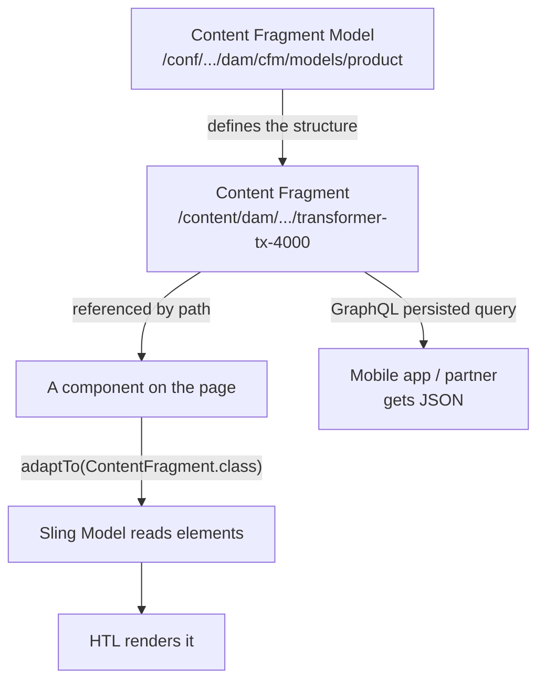
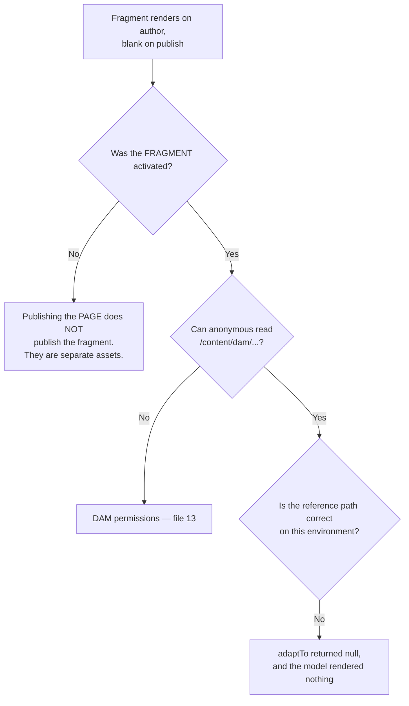

# 15 – Content Fragments

> **Target:** 3–4 years experienced AEM Developer
> **Syllabus points covered (24 partly, 25 in full):**
> *Point 24 — "CF and XF, and the difference between them."* (Content Fragments here; Experience Fragments and the full comparison in file 16.)
> *Point 25 — "How do you read a CF in a model class?"*
> **Project domain:** a global energy technology company's marketing site.

---

## Before we start — the sentence that separates CF from XF

Your syllabus asks for the difference between Content Fragments and Experience Fragments, and there is one sentence that gets you most of the way:

> **A Content Fragment is content without presentation. An Experience Fragment is presentation with content.**

Everything else follows. A Content Fragment holds *what you want to say* — a product name, a specification, a description — with no opinion about how it looks. An Experience Fragment holds *a piece of a page* — actual components, laid out and styled.

Which means they answer different questions:

- *"I need this same information on the website, in the mobile app, and in a partner's system."* → **Content Fragment**
- *"I need this same banner on twenty pages."* → **Experience Fragment**

Get that distinction crisp and the rest of both files is detail.

**One thing worth flagging early**, because it surprises people and comes up: **Content Fragments are stored in the DAM**, under `/content/dam`, as assets. They are not pages and they are not under `/content`. That trips candidates up, and knowing it is a small proof you have actually worked with them.

---

## 1. Introduction

### 1.1 The problem Content Fragments solve

Our energy site has a product page for each transformer, with technical specifications — voltage range, cooling type, standards compliance, weight.

Now the mobile app needs the same specifications. And a partner integration wants them as JSON. And the specifications also appear in a comparison table on a different page.

**Without Content Fragments**, those specifications live inside a component on the product page — as dialog values on a `jcr:content` node somewhere. Which means they are *presentation-bound*. The mobile app cannot easily consume them, because they are entangled with the page that renders them.

**A Content Fragment separates the content from anywhere it happens to be displayed.** The specification exists as a piece of structured content in its own right. The web page renders it. The mobile app fetches it as JSON. The comparison table references it. One source, many consumers.

**That is what "channel-agnostic" and "headless" actually mean in practice**, and it is the framing to use.

### 1.2 Where they live, and why that matters

```
/content/dam/energy/fragments/products/transformer-tx-4000
```

**Content Fragments are assets in the DAM.** Not pages, not under `/content/<site>`.

**Why that's the right design:** a fragment is a piece of content that belongs to no particular page. Putting it under a site's content tree would imply it belongs to that site. The DAM is where reusable, non-page content lives — alongside images and documents, which have exactly the same property.

**Two practical consequences:**

**DAM permissions apply.** Authors who can create fragments need DAM access, not just site access (file 13). And on publish, `anonymous` needs read on the fragment path or a component renders nothing.

**They're activated like assets.** Publishing a page that references a fragment does not publish the fragment. That is a genuinely common "works on author, blank on publish" cause, and it's the same family of problem as file 13's.

### 1.3 A real project example to adapt

> "We use Content Fragments for product specifications and technical articles — anything that needs to exist independently of a page. The specifications for a transformer are a fragment, modelled with typed fields for voltage range, cooling type and standards compliance, and they're consumed three ways: rendered on the product page by a component, pulled into a comparison table on a different page, and delivered to the mobile app as JSON through GraphQL persisted queries.
>
> The reason for persisted queries rather than ad-hoc GraphQL is caching — a persisted query is a GET on a stable path, so the dispatcher and CDN cache it like any other response. An ad-hoc POST query isn't cacheable at all, which for an app hitting it on every launch would have meant every request reaching publish."

That covers the use case, the model, the three consumers, and the caching decision — which is the architecturally interesting part.

---

## 2. Core Concepts

### 2.1 Content Fragment Models

**A model defines the structure.** It is the schema — what fields a fragment of this kind has, and what type each one is.

**Where models live:**

```
/conf/<project>/settings/dam/cfm/models/<model-name>
```

**Note that's `/conf`** — the same place as templates and policies from file 03. Models are configuration, per-site, and they ship in `ui.content` as mutable content.

**The field types available:**

| Type | For |
|---|---|
| Single line text | Names, short values |
| Multi line text | Body content — **plain text, rich text, or markdown** |
| Number | Numeric values |
| Boolean | Flags |
| Date and time | Dates |
| Enumeration | A fixed set of options |
| Tags | Taxonomy references |
| **Content reference** | A path to another asset or page |
| **Fragment reference** | A reference to **another Content Fragment** |
| JSON object | Arbitrary structured data |

**Two worth calling out:**

**Fragment reference** is what lets you compose fragments — a product fragment referencing a manufacturer fragment, for instance. That's how you avoid duplicating shared data.

**Multi line text has a content type**, which matters for rendering. It can be plain text, rich text (HTML) or markdown, and your code has to know which — section 2.6.

**A model must be enabled** before fragments can be created from it. A disabled model simply doesn't appear in the create dialog, which is the same shape as the `status="draft"` problem with templates in file 03.

### 2.2 The repository structure of a fragment

Worth knowing, because it explains both the API and a shortcut people take.

```
/content/dam/energy/fragments/products/transformer-tx-4000    (dam:Asset)
└── jcr:content                                               (dam:AssetContent)
    ├── data
    │   ├── cq:model = "/conf/energy/settings/dam/cfm/models/product"
    │   ├── master                          ← the MASTER variation
    │   │   ├── productName = "TX-4000"
    │   │   ├── voltageRange = "72.5 kV"
    │   │   └── description = "<p>...</p>"
    │   └── social                          ← another variation
    │       └── description = "<p>shorter...</p>"
    └── metadata
```

**Three things to notice:**

**`cq:model`** points at the Content Fragment Model. That's the link between fragment and schema.

**`master` is a variation**, not a special container — it's simply the default one. Other variations sit beside it.

**Element values live under a variation**, which is why the API has both element and variation concepts.

### 2.3 Variations

**A variation is an alternative version of the fragment's content**, for a different channel or context.

The canonical example: a description that's three paragraphs on the website, one sentence for a social media card, and a two-line summary for a listing. Same fragment, same underlying content, different renderings of the *text itself* — not different styling.

**That last distinction matters.** A variation is not "the same content styled differently" — that would be presentation, and presentation isn't a Content Fragment's job. A variation is genuinely different *wording* for a different context.

**`master` is the default.** If you ask for a variation that doesn't exist, you fall back to master.

**A caution worth raising:** variations are easy to over-use. Every variation is content someone has to write and maintain, and they drift. If the difference is purely how it's displayed, that belongs in the rendering, not in a variation.

### 2.4 Reading a Content Fragment in a Sling Model *(syllabus point 25)*

**Your syllabus asks this directly.** Here's the proper answer.

**The API is `com.adobe.cq.dam.cfm.ContentFragment`, and you get there by adapting the fragment's resource:**

```java
Resource fragmentResource = resourceResolver.getResource(fragmentPath);
ContentFragment fragment = fragmentResource.adaptTo(ContentFragment.class);
```

**Note you adapt the asset node itself** — `/content/dam/.../transformer-tx-4000` — not its `jcr:content`.

**And as always, `adaptTo` can return null** (file 05). If the path is wrong, or the resource isn't a Content Fragment, you get null rather than an exception.

**The three classes to know:**

| Class | What it is |
|---|---|
| `ContentFragment` | The fragment |
| `ContentElement` | One field |
| `FragmentData` | The typed value of an element |

**Reading a field:**

```java
ContentElement element = fragment.getElement("productName");
if (element != null) {
    String value = element.getContent();
}
```

**Reading it typed**, which matters for numbers, booleans and dates:

```java
FragmentData data = element.getValue();
String contentType = data.getContentType();      // "text/html", "text/plain", …
Object value = data.getValue();
String asString = data.getValue(String.class);
```

**Reading a variation:**

```java
ContentVariation variation = element.getVariation("social");
String value = (variation != null)
        ? variation.getContent()
        : element.getContent();      // fall back to master
```

**Iterating the elements**, when you don't know the model in advance:

```java
Iterator<ContentElement> elements = fragment.getElements();
```

**Fragment metadata:**

```java
fragment.getName();
fragment.getTitle();
fragment.getDescription();
```

**The full worked example is in section 8**, but the interview answer is:

> "I get the fragment's resource by path and adapt it to `ContentFragment` — and I adapt the asset node itself, not its `jcr:content`. Then `getElement(name)` gives me a `ContentElement`, and `getContent()` gives me the value, or `getValue()` gives me a `FragmentData` if I need the type. Variations come from `element.getVariation(name)`, falling back to master when it doesn't exist.
>
> Two things I'm careful about. `adaptTo` returns **null** if the path is wrong or the resource isn't a fragment, so it's always null-checked — and I'd do that work in `@PostConstruct` rather than in a getter, because HTL can call getters repeatedly.
>
> And for multi-line text I check the **content type**, because a field can be plain text, rich text or markdown. If it's `text/html` I render it with `context='html'` in HTL; if I use the default escaping the author sees literal tags on the page."

### 2.5 The shortcut, and why to avoid it

Because the repository structure is knowable, you *can* read a fragment with plain Sling Model injections:

```java
// This works. Don't do it.
@ValueMapValue
@Via("resource")
private String productName;   // reading jcr:content/data/master/productName
```

**Why not:**

**It's fragile.** You're depending on the internal storage layout, which the API exists to insulate you from.

**You lose the type information.** No content type, so you can't tell rich text from plain.

**Variations become manual.** You'd hand-code the fallback to master.

**And it breaks if the model changes shape.**

**Being able to say "you can, but I wouldn't, and here's why" is a better answer than either just knowing the API or just knowing the shortcut.**

### 2.6 Content types on multi-line text — the rendering trap

A multi-line text element carries a **content type**:

| Content type | Means |
|---|---|
| `text/plain` | Plain text |
| `text/html` | **Rich text — contains markup** |
| `text/x-markdown` | Markdown |

**Why this matters** connects directly to file 08. If the element is `text/html` and you render it with HTL's default escaping, the visitor sees literal `<p>` and `<strong>` tags. If it's `text/plain` and you render it with `context='html'`, you've created an injection point.

**So the model should expose the content type**, and the HTL should branch on it — or the model should normalise it. Section 8 shows both.

**This is the same bug as story 1 in file 11**, arriving from a different direction, which is worth noticing: rich text is rich text wherever it comes from.

### 2.7 GraphQL — the headless delivery story

**This is what makes Content Fragments architecturally interesting**, and it's where the interview usually goes next.

**Content Fragment Models automatically generate a GraphQL schema.** Create a `product` model and you get query types for it — fetch one by path, or list them with filters. You write no schema code.

**Two ways to query, and the difference is the whole point:**

| | Ad-hoc query | **Persisted query** |
|---|---|---|
| How | POST to the GraphQL endpoint | Query stored server-side, called by **GET** |
| URL | The endpoint | `/graphql/execute.json/<config>/<queryName>` |
| **Cacheable** | **No** | **Yes** |
| Good for | Development, exploration | **Production** |

**Why persisted queries are the production answer** — and this is the same reasoning as files 01, 04 and 07:

A POST to a single endpoint isn't cacheable. Every request reaches publish. A **persisted query** is a **GET on a stable, path-based URL**, so the dispatcher caches it as a file and the CDN caches it at the edge.

For a mobile app fetching product data on every launch, that's the difference between every launch hitting publish and almost none of them doing so.

**A second benefit worth mentioning:** persisted queries mean the client can't send arbitrary queries. An ad-hoc GraphQL endpoint lets a caller construct expensive or over-broad queries; persisted queries constrain them to ones you've approved. That's a security and performance property, not just a caching one.

**The interview answer:**

> "Content Fragment Models generate a GraphQL schema automatically, so you get queries per model without writing any schema code.
>
> The important decision is **persisted queries versus ad-hoc**. An ad-hoc query is a POST to the endpoint, which isn't cacheable — every request goes through to publish. A persisted query is stored server-side and called with a **GET on a stable path**, so the dispatcher and CDN cache it like any other response. For an app hitting it on every launch that's the difference between all the traffic reaching publish and almost none of it.
>
> There's a second reason too: persisted queries mean callers can only run queries we've approved, rather than constructing arbitrary ones that might be expensive or expose more than intended."

### 2.8 When to use a Content Fragment — and when not to

**Use one when:**

- The content is consumed by **more than one channel** — web, app, partner system.
- It's **structured** — distinct typed fields, not free-form layout.
- It has **its own lifecycle** — created, reviewed and updated independently of any page.
- The same content appears in several **different renderings**.

**Don't use one when:**

- The content only ever appears in one place, in one way. A component dialog is simpler and authors find it easier.
- What you actually want is **layout reuse** — that's an Experience Fragment (file 16).
- You'd be putting HTML markup into a single multi-line field, which defeats the purpose.

**That last one is worth stating**, because it's a genuine anti-pattern: a fragment with one rich-text field containing a whole page's worth of markup is not structured content. It's a page in the wrong place, and none of the headless benefits apply because a consumer can't do anything with an opaque blob of HTML.

---

## 3. Internal Working

### 3.1 How a fragment reaches a page



**The key structural point:** the fragment is referenced **by path**, from a component. It has no knowledge of where it's used, which is exactly what makes it reusable — and also why deleting or moving one can silently break pages that reference it.

### 3.2 Why a fragment renders on author but not publish

**A recurring theme, arriving here from a new direction:**



**The first branch is the common one and it's worth stating clearly:** a Content Fragment is a separate asset with its own publication state. Activating the page that references it does not activate it. That's not a bug — the fragment might be referenced by fifty pages — but it surprises people every time.

### 3.3 Model changes and existing fragments

A practical concern that gets asked:

| Change to the model | Effect on existing fragments |
|---|---|
| **Add** a field | Safe — existing fragments simply have no value for it |
| **Rename** a field | **Breaks** — the stored property name no longer matches |
| **Remove** a field | Data remains in the repository but is no longer surfaced |
| **Change** a field's type | Risky — existing values may not convert |

**The point to make:** a Content Fragment Model is much harder to change than a component dialog, because fragments are content that already exists and there's no dialog-save to migrate it. So **model design deserves more care up front** than a dialog does.

---

## 4. Important Interview Questions

### 4.1 Basic

**Q1. What is a Content Fragment?**
Channel-agnostic structured content — text and typed data with no presentation. It exists independently of any page, so the same content can be rendered on the web, delivered to a mobile app as JSON, and consumed by other systems.

*Cross:* What's it *not*? (**no layout or styling**) · How is it different from an Experience Fragment? · What makes it "headless"?

**Q2. Where are Content Fragments stored?**
In the DAM, under `/content/dam`, as assets — not as pages under `/content`.

*Cross:* Why the DAM? (they belong to no page; the DAM is where reusable non-page content lives) · What does that mean for permissions? (**DAM permissions apply**) · And for publishing? (**they're activated separately from pages**)

**Q3. What is a Content Fragment Model?**
The schema — it defines what fields a fragment of that kind has and what type each one is. Stored at `/conf/<project>/settings/dam/cfm/models`.

*Cross:* Why `/conf`? (it's configuration, per-site — like templates) · What field types exist? · What happens if it isn't enabled? (**it doesn't appear in the create dialog**)

**Q4. What field types are available?**
Single and multi line text, number, boolean, date and time, enumeration, tags, content reference, **fragment reference**, and JSON object.

*Cross:* What's a fragment reference for? (**composing fragments** — a product referencing a manufacturer) · What's special about multi line text? (**it has a content type** — plain, rich or markdown)

**Q5. What is a variation?**
An alternative version of the fragment's content for a different channel or context — a shorter description for a social card, say. `master` is the default, and an absent variation falls back to it.

*Cross:* Is it different styling? (**no** — that's presentation, which isn't a fragment's job) · Where is it stored? (a sibling of `master` under `jcr:content/data`) · When would you over-use them? (when the difference is really about display)

**Q6. How do you read a Content Fragment in a Sling Model?**
Get the resource by path, `adaptTo(ContentFragment.class)`, then `getElement(name)` and `getContent()`.

*Cross:* Which node do you adapt? (**the asset node**, not `jcr:content`) · What if it returns null? (always null-check) · Where do you do the work? (`@PostConstruct`, not a getter)

**Q7. What's the difference between a Content Fragment and an Experience Fragment?**
**Content Fragment = content without presentation. Experience Fragment = presentation with content.** A CF is structured data for any channel; an XF is a laid-out group of components for reuse across pages.

*Cross:* Where is each stored? (`/content/dam` vs `/content/experience-fragments`) · Which is headless? (**CF**) · Give an example of each → file 16

**Q8. How is a Content Fragment delivered headlessly?**
Through **GraphQL**. Models generate a schema automatically, and content is fetched by query.

*Cross:* Persisted or ad-hoc? (**persisted, for production**) · Why? (**cacheable**) · What's the URL pattern?

**Q9. What is a persisted query?**
A GraphQL query stored server-side and called by **GET** on a stable path, rather than POSTed ad-hoc — which makes the response cacheable by the dispatcher and CDN.

*Cross:* Why can't a POST be cached? (**it isn't a path-based GET** — the file 01 rule) · What's the second benefit? (**callers can only run approved queries**) · Where are they stored?

**Q10. When would you not use a Content Fragment?**
When content appears in exactly one place in one way — a component dialog is simpler and authors prefer it. Or when what you actually want is layout reuse, which is an Experience Fragment.

*Cross:* What's the anti-pattern? (**a single rich-text field containing a page's worth of HTML** — that's a page in the wrong place) · Why does that defeat the purpose? (a consumer can't do anything with an opaque HTML blob)

### 4.2 Intermediate

**Q11. Walk me through reading a fragment in code.**
→ Section 2.4 and section 8. Resource by path, `adaptTo`, null-check, `getElement`, `getContent` or `getValue`, variation with a fallback to master, all in `@PostConstruct`.

*Cross:* What does `getValue()` give you that `getContent()` doesn't? (`FragmentData` — the **type** and content type) · How do you handle a missing element? · Why `@PostConstruct`? (HTL calls getters repeatedly — file 05)

**Q12. You can read a fragment with plain `@ValueMapValue`. Should you?**
It works, because the storage layout is knowable — the values are under `jcr:content/data/master`. But I wouldn't: it depends on internal structure the API exists to insulate you from, you lose the content type so you can't tell rich text from plain, and variations become manual.

*Cross:* When might you? (a genuinely simple, stable case — but it's a trade) · What breaks it? (a model change, or needing variations) · Which would you use in a code review?

**Q13. A fragment's rich text renders as literal tags. Why?**
The element's content type is `text/html` but the HTL is using default escaping. Rich text needs `context='html'` (file 08). The model should expose the content type so the HTL can branch, rather than hardcoding it.

*Cross:* What if you apply `context='html'` to plain text? (**an injection point**) · How do you know the content type? (`element.getValue().getContentType()`) · Where should that decision live? (the model, ideally)

**Q14. The fragment shows on author but not publish. Why?**
Most likely the **fragment wasn't activated** — publishing the page doesn't publish the fragment, because they're separate assets. Then anonymous read permission on the DAM path. Then a path that differs between environments, in which case `adaptTo` returned null and the model rendered nothing silently.

*Cross:* Why doesn't publishing the page publish it? (**it might be referenced by fifty pages**) · How do you find references? (the References panel) · How do you test? (private window against publish directly)

**Q15. What happens if you change a Content Fragment Model?**
Adding a field is safe. **Renaming breaks**, because the stored property name no longer matches. Removing leaves data in the repository but stops surfacing it. Changing a type is risky because existing values may not convert.

*Cross:* Why is that harder than changing a dialog? (**fragments are content that already exists**, with no save to migrate it) · So what follows? (**design the model carefully up front**) · How would you migrate?

**Q16. What's a fragment reference and when would you use it?**
A field type that references another Content Fragment — so a product fragment can reference a shared manufacturer fragment rather than duplicating that data.

*Cross:* How do you read it in code? (the value is a path — resolve and adapt it) · What's the risk? (**deep reference chains** get expensive, and GraphQL queries can fan out) · How would you limit it?

**Q17. How do persisted queries get cached?**
They're a **GET on a stable path** — `/graphql/execute.json/<config>/<queryName>` — so the dispatcher caches the response as a file and the CDN caches it at the edge. Same principle as selectors and suffixes from file 01: a dot is cached, a question mark isn't.

*Cross:* What about query variables? (they're part of the path, so still cacheable) · How do you invalidate? (publishing a fragment should flush the relevant queries) · What if a query is user-specific? (**then it shouldn't be cached** — reconsider the design)

**Q18. How do you enable the GraphQL endpoint?**
It's enabled per Sites configuration, and persisted queries are stored under `/conf/<project>/settings/graphql`. It isn't on by default.

*Cross:* Should it be on for publish? (**only if you're delivering headlessly** — otherwise it's unnecessary surface) · How is it secured? (dispatcher rules plus persisted queries constraining what can be run) · What about an ad-hoc endpoint on publish? (**avoid it** — arbitrary queries from the internet)

**Q19. Should you build a custom component to render fragments?**
Usually not — Core Components include a Content Fragment component, and the same argument from file 02 applies: it's tested and maintained, and you'd proxy it and override only what you need.

*Cross:* When would you build custom? (a genuinely different rendering, like a comparison table) · How would you extend the Core one? (proxy plus `sling:resourceSuperType`) · What do you gain? (accessibility and Adobe's ongoing maintenance)

**Q20. How do Content Fragments interact with translation?**
They're content, so they translate like content — a fragment can be part of a translation project and a language copy. On a multi-country site that means specifications translate once in the language master and are then referenced by the country sites (file 12).

*Cross:* Do fragments live in the language structure? (they can — organised per language under the DAM) · What about variations versus languages? (**different concepts** — a variation is a channel, a language copy is a language) · How does that interact with MSM?

### 4.3 Advanced

**Q21. Design headless delivery of product specifications to a mobile app.**

> "**Model first**, and carefully — a Content Fragment Model is much harder to change than a component dialog, because fragments are content that already exists. So typed fields for each specification rather than one free-text blob: voltage range as a number with a unit, cooling type as an enumeration, standards as tags. The temptation is a single rich-text field, and that defeats the whole purpose — an app can't do anything useful with opaque HTML.
>
> **Fragments in the DAM**, organised per product family, and per language if the app is multi-market.
>
> **Delivery through GraphQL persisted queries.** That's the important decision. An ad-hoc POST query isn't cacheable, so every app launch would reach publish. A persisted query is a GET on a stable path, so the dispatcher caches it as a file and the CDN caches it at the edge — for an app fetching on every launch, that's almost all the traffic never reaching AEM. It also means the app can only run queries we've approved, rather than constructing arbitrary ones.
>
> **Invalidation** needs thinking about: publishing a fragment has to flush the cached query responses, or the app serves stale specifications. That's the same derived-content invalidation problem as the listing component in file 02.
>
> **Permissions** — the anonymous user needs read on the fragment paths on publish, or the query returns nothing.
>
> And **the fragments have to be activated separately** from any page. They're assets with their own publication state, and that's a very common cause of 'it works on author'."

*Cross:* How do you version the API? (persisted query names, effectively) · What if the app needs a field the model doesn't have? (**add it — that's the safe change**) · How do you handle images?

**Q22. When would you choose a Content Fragment over a component dialog?**

> "The test I'd apply is: **does this content need to exist independently of a page?**
>
> If it's consumed by more than one channel, or has its own review and approval lifecycle, or appears in several different renderings, it's a fragment. Product specifications are the clear case for us — the web page, the comparison table and the mobile app all need them.
>
> If it appears in exactly one place in one way, a component dialog is better. It's simpler, authors find it easier because they edit in context, and there's no indirection.
>
> The mistake I'd avoid is using fragments because they sound more architectural. They add a layer — authors edit somewhere other than the page, references can break, and they publish separately. That's worth paying for reuse and it isn't worth paying for a single-use text field."

*Cross:* What do authors think? (they generally prefer in-context editing — worth acknowledging) · What's the migration cost if you get it wrong? · How would you decide as a team?

**Q23. What are the performance considerations?**

Reading a fragment is a repository read plus an adaptation, so the same rules as everywhere apply: do it once in `@PostConstruct`, not in a getter HTL might call repeatedly.

**Fragment references are the one to watch.** A fragment referencing another which references another means several reads per render, and in GraphQL a nested query can fan out considerably. That's worth bounding.

And for headless, **persisted queries versus ad-hoc is the whole performance story** — one is cacheable and one guarantees traffic reaches publish.

*Cross:* How would you bound reference depth? (model design, and limits in the query) · How do you measure? (`request.log`, and the query response times) · What about a listing of many fragments? (**a limit**, same as file 05)

**Q24. How would you handle a fragment that's referenced by many pages and needs to change?**

The References panel shows what references it, which is the first thing to check — the whole point of a fragment is that it doesn't know where it's used, so you need the tooling to tell you.

For the change itself, editing the fragment updates every page that renders it, which is usually the intent. But if the change is significant, the same caution as a template structure change in file 03 applies: it's live and global, so test somewhere lower first.

And cached pages won't know. Publishing the fragment should invalidate the pages that render it, which needs a flush rule — otherwise the fragment is updated and the pages keep serving the old version.

*Cross:* How would that flush rule work? (invalidate referencing pages on fragment activation) · What if you need a change for one page only? (**a variation, or a separate fragment** — not editing in place) · How do you find references programmatically?

---

## 5. Cross Questions — how this topic gets drilled

**Thread A — from "what is a Content Fragment"**
Where is it stored? → Why the DAM? → What's a model? → Where do models live? → What field types? → What's a fragment reference? → What's a variation?

**Thread B — from "how do you read one in code"** *(your syllabus thread)*
Which API? → Which node do you adapt? → What if it's null? → How do you get an element? → How do you get the type? → What about variations? → Where do you do the work? → Could you use `@ValueMapValue` instead? → **Would you?**

**Thread C — from "CF versus XF"**
Which has presentation? → Where is each stored? → What is each based on? → Which is headless? → When would you use each? → Can an XF contain a CF? → *(→ file 16)*

**Thread D — from "headless delivery"**
How? → GraphQL — what generates the schema? → Persisted or ad-hoc? → **Why does that matter?** → How is a persisted query cached? → What's the second benefit? → How do you invalidate?

---

## 6. Best Interview Answers

### 6.1 "What is a Content Fragment?" — about 90 seconds

> "A Content Fragment is **channel-agnostic structured content** — typed fields with no presentation attached. The defining property is that it exists independently of any page.
>
> The problem it solves for us is that our product specifications are needed in three places: rendered on the product page, pulled into a comparison table elsewhere, and delivered to the mobile app as JSON. If those specifications lived in a component dialog on the product page, they'd be entangled with the page that renders them and the app couldn't easily consume them. As a fragment, there's one source and several consumers.
>
> Structurally, a **Content Fragment Model** defines the schema — the fields and their types — and lives under `/conf`, like templates and policies. The fragments themselves are stored in the **DAM**, under `/content/dam`, as assets rather than pages. That surprises people, but it's the right place: a fragment belongs to no particular page, and the DAM is where reusable non-page content lives.
>
> Two practical consequences of that. DAM permissions apply, so authors need DAM access. And fragments are **activated separately from pages** — publishing a page that references a fragment does not publish the fragment, which is a very common cause of 'it works on author and not on publish'.
>
> The headless story is GraphQL: models generate a schema automatically, and we deliver through **persisted queries** rather than ad-hoc ones, because a persisted query is a GET on a stable path and therefore cacheable, whereas a POST goes through to publish every time."

### 6.2 "How do you read a Content Fragment in a model class?" — about 75 seconds

**Your syllabus point 25.**

> "I get the fragment's resource by path from the resource resolver, then `adaptTo(ContentFragment.class)` — and it's the **asset node** you adapt, not its `jcr:content`, which is an easy mistake.
>
> `adaptTo` returns **null** if the path is wrong or the resource isn't a fragment, so that's always null-checked. And I do all of this in **`@PostConstruct`** rather than in a getter, because HTL can call a getter many times and I don't want a repository read per call.
>
> From the fragment, `getElement(name)` gives me a `ContentElement`, and `getContent()` gives me the value as a string. If I need the type — for a number, a date, or to know whether text is rich or plain — I use `getValue()`, which returns a `FragmentData` carrying the value and its content type. For variations, `element.getVariation(name)` with a fallback to master when it doesn't exist.
>
> The **content type** matters more than people expect. A multi-line text element can be plain text, rich text or markdown, and if it's `text/html` I need `context='html'` in the HTL or the author sees literal tags on the page. So I expose the content type from the model rather than hardcoding the assumption.
>
> One thing worth mentioning: you **can** read a fragment with plain `@ValueMapValue` injections, because the values are stored under `jcr:content/data/master` and that structure is knowable. But I wouldn't — it depends on internal storage the API exists to insulate you from, you lose the content type, and variations become manual."

### 6.3 "Why persisted queries?" — about 45 seconds

> "Caching, primarily.
>
> An ad-hoc GraphQL query is a **POST to the endpoint**. A POST isn't cacheable, so every single request goes through to publish. For a mobile app that fetches product data on every launch, that means all of that traffic hitting AEM.
>
> A **persisted query** is stored server-side and called with a **GET on a stable path** — `/graphql/execute.json/<config>/<queryName>`. That's path-based, so the dispatcher caches the response as a file and the CDN caches it at the edge. Almost none of that traffic reaches publish.
>
> It's the same principle as selectors versus query parameters from earlier — a dot is cached, a question mark isn't. GraphQL is just another place where it applies.
>
> There's a second benefit worth mentioning: a persisted query means callers can only run queries we've approved. An open ad-hoc endpoint lets anyone construct an arbitrary query, which could be expensive or return more than we intended — so on publish I'd want persisted queries only."

---

## 7. Real Project Examples

### Story 1 — Fragments that rendered on author and vanished on publish

**What happened.** Product specification blocks appeared correctly on author and were completely blank on the live site. The pages had been published, the components were configured, and nothing appeared in `error.log`.

**The cause.** The **fragments themselves had never been activated**. The team had published the pages, reasonably assuming that publishing a page publishes what it shows.

It doesn't. A Content Fragment is an asset in the DAM with its own publication state, and that's correct behaviour — a fragment might be referenced by fifty pages, so tying its lifecycle to any one of them would be wrong.

**Why it was silent.** The component's Sling Model resolved the fragment path, `adaptTo` returned **null** because the resource didn't exist on publish, and the model's `isReady()` returned false — so it rendered nothing, exactly as designed. No exception, nothing logged. That's the `OPTIONAL` injection discipline from file 05 working correctly, and being unhelpful.

**The fix.** Activating the fragments. But the more useful outcome was adding a log line at warn when the fragment path resolves to nothing — so an unactivated or missing fragment becomes visible rather than silently rendering an absence.

**The lesson to state:** *"A component rendering nothing is diagnosable only if something says so. Silent absence is correct behaviour and terrible debugging, so I log when a referenced resource isn't there."*

### Story 2 — The fragment that was really a page

**What happened.** A team modelled technical articles as Content Fragments with a single multi-line rich-text field containing the whole article — headings, images, tables, all as HTML in one field.

**Why it was wrong.** It got none of the benefits. The mobile app team, who were the reason for using fragments at all, received a blob of HTML they couldn't do anything with — they couldn't render headings natively, couldn't extract a summary, couldn't handle images their own way. They ended up parsing the HTML, which is exactly what structured content is supposed to prevent.

**The deeper problem.** The content wasn't structured, so nothing downstream could be structured either. A fragment with one opaque field is a page stored in the DAM.

**The restructure.** Modelled it properly — a title field, a summary field, a list of section fragments each with a heading and body, and image references as content references rather than embedded markup. More work up front, and considerably more work to migrate the existing articles.

**What made the migration painful** connects to section 3.3: you can add fields to a model safely, but restructuring existing fragments means moving content that already exists, and there's no dialog-save to do it for you. We wrote a migration script.

**The lesson:** *"Model design deserves more care than a component dialog, because fragments are content that already exists and changing the shape means migrating it. The single-rich-text-field model is the anti-pattern to watch for, because it looks like it works right up until a consumer needs the structure."*

### Story 3 — Moving the app from ad-hoc to persisted queries

**What happened.** The mobile app used ad-hoc GraphQL queries. Publish load from the app was far higher than expected — roughly proportional to app launches rather than to content changes.

**The cause.** Ad-hoc queries are POSTs, and POSTs aren't cached. Every app launch, every product view, every comparison reached publish and ran a query.

**The fix.** Converted the app's queries to **persisted queries**, so each became a GET on a stable path that the dispatcher and CDN cache.

**The number worth quoting.** Almost all of that traffic stopped reaching publish, because the same handful of queries serve every user and the content changes rarely.

**The part that needed thought.** Invalidation. Once responses are cached, publishing a fragment has to flush the relevant cached queries or the app serves stale specifications. That's the same derived-content invalidation problem as the listing component in file 02 — cached output derived from content that can change underneath it.

**And a benefit we hadn't planned for:** persisted queries meant the app could only run queries we'd defined. Previously the app team could construct any query, and one of them was pulling far more data than the screen needed — which nobody had noticed because it worked.

---

## 8. Coding Examples

### 8.1 Reading a fragment properly

```java
package com.energy.core.models;

import com.adobe.cq.dam.cfm.ContentElement;
import com.adobe.cq.dam.cfm.ContentFragment;
import com.adobe.cq.dam.cfm.ContentVariation;
import com.adobe.cq.dam.cfm.FragmentData;
import org.apache.commons.lang3.StringUtils;
import org.apache.sling.api.resource.Resource;
import org.apache.sling.api.resource.ResourceResolver;
import org.apache.sling.models.annotations.DefaultInjectionStrategy;
import org.apache.sling.models.annotations.Model;
import org.apache.sling.models.annotations.injectorspecific.SlingObject;
import org.apache.sling.models.annotations.injectorspecific.ValueMapValue;
import org.slf4j.Logger;
import org.slf4j.LoggerFactory;

import javax.annotation.PostConstruct;

@Model(adaptables = Resource.class,
       defaultInjectionStrategy = DefaultInjectionStrategy.OPTIONAL)
public class ProductSpecificationModel {

    private static final Logger LOG =
            LoggerFactory.getLogger(ProductSpecificationModel.class);

    private static final String HTML_CONTENT_TYPE = "text/html";

    /** The dialog holds a PATH to the fragment in the DAM. */
    @ValueMapValue
    private String fragmentPath;

    /** Optional: which variation to render. Empty means master. */
    @ValueMapValue
    private String variationName;

    @SlingObject
    private ResourceResolver resourceResolver;

    private ContentFragment fragment;

    // Derived once, in @PostConstruct
    private String productName;
    private String description;
    private boolean descriptionIsHtml;
    private String voltageRange;

    @PostConstruct
    protected void init() {
        // ALL the work happens ONCE here. HTL can call getters many
        // times, and each of these is a repository read (file 05).

        if (StringUtils.isBlank(fragmentPath)) {
            return;
        }

        Resource fragmentResource = resourceResolver.getResource(fragmentPath);
        if (fragmentResource == null) {
            // LOG IT. A missing fragment renders nothing, which is
            // correct behaviour and terrible debugging -- most often
            // this means the fragment was never ACTIVATED, because
            // publishing the page does not publish the fragment.
            LOG.warn("Content fragment not found at {} — is it activated?", fragmentPath);
            return;
        }

        // Adapt the ASSET node, not its jcr:content.
        // adaptTo returns NULL if this isn't a Content Fragment.
        this.fragment = fragmentResource.adaptTo(ContentFragment.class);
        if (fragment == null) {
            LOG.warn("Resource at {} is not a Content Fragment", fragmentPath);
            return;
        }

        this.productName  = readElement("productName");
        this.voltageRange = readElement("voltageRange");

        // Rich text needs its content type, so HTL can escape correctly
        readDescription();
    }

    /**
     * Reads an element, honouring the requested variation and falling
     * back to master when that variation doesn't exist.
     */
    private String readElement(String elementName) {
        ContentElement element = fragment.getElement(elementName);
        if (element == null) {
            // The model may have changed, or the name may be wrong
            return "";
        }

        if (StringUtils.isNotBlank(variationName)) {
            ContentVariation variation = element.getVariation(variationName);
            if (variation != null) {
                return StringUtils.defaultString(variation.getContent());
            }
            // Variation absent → fall back to master. Not an error.
        }

        return StringUtils.defaultString(element.getContent());
    }

    /**
     * Multi-line text carries a CONTENT TYPE -- plain, rich or markdown.
     *
     * It matters for rendering: if it's text/html and we use HTL's
     * default escaping, the visitor sees literal <p> tags. If it's
     * plain text and we use context='html', we've created an injection
     * point. So the model exposes the type rather than the HTL guessing.
     */
    private void readDescription() {
        ContentElement element = fragment.getElement("description");
        if (element == null) {
            this.description = "";
            return;
        }

        FragmentData data = element.getValue();
        if (data != null) {
            this.descriptionIsHtml = HTML_CONTENT_TYPE.equals(data.getContentType());
            String value = data.getValue(String.class);
            this.description = StringUtils.defaultString(value);
        } else {
            this.description = StringUtils.defaultString(element.getContent());
        }
    }

    // ---- getters: trivial, never null ----

    public String getProductName()  { return StringUtils.defaultString(productName); }
    public String getVoltageRange() { return StringUtils.defaultString(voltageRange); }
    public String getDescription()  { return StringUtils.defaultString(description); }

    /** Lets the HTL choose the right escaping context. */
    public boolean isDescriptionHtml() { return descriptionIsHtml; }

    /** Render nothing rather than an empty shell (file 05). */
    public boolean isReady() {
        return fragment != null && StringUtils.isNotBlank(productName);
    }
}
```

**The six decisions to be able to defend:**

**Everything in `@PostConstruct`** — each element read is a repository operation, and HTL calls getters repeatedly.

**Adapt the asset node**, not `jcr:content`.

**Null-check `adaptTo`**, and **log when the fragment is missing** — because silent absence is correct behaviour and useless for debugging.

**Variation with a fallback to master**, treated as normal rather than an error.

**The content type is read and exposed**, so the HTL can escape correctly rather than guessing.

**Getters never return null** (file 05), and `isReady()` guards the render.

### 8.2 The HTL

```html
<sly data-sly-use.spec="com.energy.core.models.ProductSpecificationModel"/>

<div class="cmp-product-spec" data-sly-test="${spec.ready}">

    <h2 class="cmp-product-spec__name">${spec.productName}</h2>

    <dl class="cmp-product-spec__values" data-sly-test="${spec.voltageRange}">
        <dt>${'Voltage range' @ i18n}</dt>
        <dd>${spec.voltageRange}</dd>
    </dl>

    <!--/* The model told us the content type, so we escape correctly
           rather than guessing. Rich text needs context='html' or the
           visitor sees literal tags; plain text with context='html'
           would be an injection point (file 08). */-->
    <div class="cmp-product-spec__description" data-sly-test="${spec.description}">
        <sly data-sly-test="${spec.descriptionHtml}">${spec.description @ context='html'}</sly>
        <sly data-sly-test="${!spec.descriptionHtml}">${spec.description}</sly>
    </div>

</div>

<sly data-sly-test="${!spec.ready && wcmmode.edit}"
     data-sly-resource="${'' @ resourceType='wcm/core/components/placeholder'}"/>
```

### 8.3 The dialog

```xml
<fragmentPath
    jcr:primaryType="nt:unstructured"
    sling:resourceType="granite/ui/components/coral/foundation/form/pathfield"
    fieldLabel="Product Specification"
    fieldDescription="Select a product specification fragment"
    name="./fragmentPath"
    required="{Boolean}true"

    <!-- rootPath makes the wrong answer UNREACHABLE rather than
         rejected -- the constrain-don't-validate principle from
         file 11. An author physically cannot pick something outside
         the fragments folder. -->
    rootPath="/content/dam/energy/fragments"

    <!-- Restrict to Content Fragments specifically -->
    filter="hierarchyNotFile"/>

<variationName
    jcr:primaryType="nt:unstructured"
    sling:resourceType="granite/ui/components/coral/foundation/form/textfield"
    fieldLabel="Variation"
    fieldDescription="Leave empty to use the master variation"
    name="./variationName"/>
```

### 8.4 Iterating elements when the model isn't known in advance

Useful for a generic renderer — a specifications table that shows whatever fields the fragment has.

```java
@PostConstruct
protected void init() {
    // ... resolve and adapt the fragment ...

    this.rows = new ArrayList<>();

    Iterator<ContentElement> elements = fragment.getElements();
    while (elements.hasNext() && rows.size() < MAX_ROWS) {   // BOUNDED
        ContentElement element = elements.next();

        String value = element.getContent();
        if (StringUtils.isBlank(value)) {
            continue;      // skip empty fields rather than showing blanks
        }

        rows.add(new SpecRow(element.getTitle(), value));
    }
}
```

**Note the bound.** Same rule as file 05 — anything building a list gets a ceiling, so a misconfigured or unexpectedly large fragment degrades rather than causing a problem.

**And `element.getTitle()`** gives the human-readable label from the model, which is what you want in a table header rather than the field name.

### 8.5 A persisted GraphQL query

The query, stored server-side:

```graphql
query getProductByPath($path: String!) {
  productByPath(_path: $path) {
    item {
      productName
      voltageRange
      coolingType
      description {
        html
        plaintext
      }
      standards
    }
  }
}
```

Called by the app as a **GET**:

```
GET /graphql/execute.json/energy/getProductByPath;path=/content/dam/energy/fragments/products/tx-4000
```

**Why this is the production answer:**

```
Ad-hoc:     POST /content/_cq_graphql/energy/endpoint     ← NOT cacheable
Persisted:  GET  /graphql/execute.json/energy/getProduct  ← CACHED as a file
```

**The variables are part of the path**, so different products produce different cacheable URLs — the same principle as selectors and suffixes from file 01.

**Note also `description { html plaintext }`** — GraphQL exposes both renderings of a multi-line field, so the consumer picks what it needs. That's the structured-content benefit in practice: the app can take `plaintext` for a summary and `html` where it renders markup.

---

## 9. Common Mistakes

| The mistake | What happens | The fix |
|---|---|---|
| Not activating the fragment | Renders on author, **blank on publish** | Fragments are assets — activate them separately |
| Not logging a missing fragment | Silent absence; nothing to debug | Log at warn when the path resolves to nothing |
| Not null-checking `adaptTo` | NullPointerException, or silent nothing | Always check — file 05 |
| Adapting `jcr:content` instead of the asset node | Returns null | Adapt the asset node |
| Reading elements in a getter | A repository read per HTL call | `@PostConstruct` |
| One rich-text field holding a whole article | **Not structured content** — consumers can't use it | Model it with typed fields |
| Ignoring the content type | Literal tags rendered, or an injection point | Read `getContentType()`, branch in HTL |
| Reading with `@ValueMapValue` from `data/master` | Fragile; loses type; variations manual | Use the `ContentFragment` API |
| Renaming a model field | **Breaks existing fragments** | Add, don't rename |
| Ad-hoc GraphQL in production | **Not cacheable** — all traffic reaches publish | Persisted queries |
| No invalidation for cached queries | The app serves stale content | Flush cached queries on fragment activation |
| Unbounded element iteration | Same risk as any unbounded list | A ceiling constant |
| Deep fragment reference chains | Several reads per render; GraphQL fan-out | Bound the depth in the model design |
| Using a fragment for single-use content | Unnecessary indirection; authors dislike it | A component dialog |
| No `rootPath` on the fragment pathfield | Authors pick the wrong thing | Constrain the field (file 11) |
| Forgetting anonymous DAM read on publish | Query or component returns nothing | Grant read on the fragment path (file 13) |

---

## 10. Best Practices

**On modelling.** Design the model carefully up front, because it's much harder to change than a dialog — fragments are content that already exists. Use typed fields rather than free text. Never model an entire article as one rich-text field.

**On reading.** Use the `ContentFragment` API, not raw property injection. All the work in `@PostConstruct`. Null-check everything and log when a referenced fragment is missing. Read and expose the content type rather than assuming.

**On rendering.** Prefer the Core Components Content Fragment component, proxied, unless you genuinely need a different rendering. Constrain the fragment pathfield with `rootPath`. Guard the render with `isReady()`.

**On headless.** Persisted queries in production, always. Plan invalidation at the same time — cached query responses go stale when fragments change. Keep the ad-hoc endpoint off on publish.

**On operations.** Remember fragments publish separately from pages. Check the References panel before changing a widely-used fragment. Grant anonymous read on fragment paths for publish.

---

## 11. Debugging Tips

**"The fragment renders on author but not publish" — check in this order:**

1. **Was the fragment activated?** Publishing the page doesn't publish it. This is the most common cause by a wide margin.
2. **Can `anonymous` read the DAM path?** File 13.
3. **Is the path the same on both environments?** If not, `adaptTo` returned null and the model rendered nothing.

**"The component renders nothing and there's no error."** That's the model working as designed — `adaptTo` returned null and `isReady()` is false. Which is exactly why the warn-level log line in section 8.1 matters: it turns silence into a signal.

**"Rich text shows literal tags."** The element is `text/html` and the HTL is using default escaping. Check `getContentType()` and branch (file 08).

**"An element returns empty."** Either the name doesn't match the model, or the value genuinely isn't set. Look at the fragment in CRXDE under `jcr:content/data/master` — that tells you immediately whether the data is absent or the read is wrong. Same split-the-problem-in-half move as everywhere else.

**"A GraphQL query returns nothing on publish."** Usually permissions — anonymous can't read the fragment paths — or the fragments aren't published.

| Tool | Answers |
|---|---|
| CRXDE at `jcr:content/data/master` | Is the value actually there |
| The References panel on a fragment | Which pages use it |
| Fragment editor → publication status | Has it been activated |
| GraphiQL (dev environments) | Does the query work at all |
| `error.log` | Your warn line when a fragment is missing |
| Private window on publish directly | Anonymous behaviour, without the dispatcher |

---

## 12. Performance Notes

**Read once, in `@PostConstruct`.** Each element access is a repository operation, and HTL calls getters repeatedly.

**Bound anything iterative.** Element iteration, fragment lists, reference chains — a ceiling constant, as everywhere.

**Fragment references compound.** A fragment referencing another which references another means several reads per render, and in GraphQL a nested query can fan out considerably. That's a model-design decision as much as a code one.

**Persisted queries are the headless performance story.** Ad-hoc POST queries guarantee every request reaches publish; persisted queries are cached at the dispatcher and CDN. For an app fetching on launch, that's the whole difference.

**And plan invalidation with the caching.** Cached query responses derived from fragments go stale when fragments change, which is the same problem as the derived listing in file 02.

---

## 13. Real Production Scenarios

**1. Fragment renders on author, blank on publish.** The fragment wasn't activated — pages and fragments publish separately.

**2. Component renders nothing, no error.** `adaptTo` returned null; `isReady()` is false. Correct behaviour, invisible without a log line.

**3. Rich text shows literal `<p>` tags.** Content type is `text/html`, HTL using default escaping.

**4. Plain text field flagged in a security review.** `context='html'` applied to a field that isn't rich text.

**5. An element returns empty after a model change.** A field was renamed, so the stored property no longer matches.

**6. The mobile app receives unusable HTML.** The article was modelled as one rich-text field.

**7. Publish load proportional to app launches.** Ad-hoc GraphQL POST queries, which aren't cacheable.

**8. The app shows stale specifications.** Cached persisted-query responses with no invalidation on fragment publish.

**9. Page render time increased.** Elements read in getters rather than `@PostConstruct`.

**10. A GraphQL query returns nothing on publish.** Anonymous lacks read on the fragment paths.

**11. Authors can't create fragments.** The model isn't enabled, or they lack DAM permissions.

**12. Authors pick the wrong path.** No `rootPath` on the pathfield.

**13. Changing one fragment changed twenty pages.** That's the intent — but check the References panel before editing a widely-used one.

**14. A fragment was deleted and pages broke.** Fragments don't know where they're used; the References panel is the only way to find out.

**15. Deep reference chains slow rendering.** Each hop is a read. Bound it in the model design.

**16. Translation didn't reach a country site.** Fragments translate like content, and then still need distributing — file 12's three-step point applies.

---

## 14. Follow-up Questions

- What do you use Content Fragments for?
- How many models do you have?
- Do you deliver headlessly? How?
- Persisted or ad-hoc queries?
- How do you handle invalidation?
- Have you had to change a model after fragments existed?
- Do authors like working with them?
- **When would you not use a Content Fragment?**

That last one is the good one, because it tests judgment: *"Single-use content. A fragment adds indirection — authors edit somewhere other than the page, references can break, and it publishes separately. That's worth paying for genuine reuse and it isn't worth paying for one text field."*

---

## 15. Comparison Tables

**Content Fragment vs Experience Fragment** *(full treatment in file 16)*

| | Content Fragment | Experience Fragment |
|---|---|---|
| Contains | **Structured content, no presentation** | **Laid-out components** |
| Stored | `/content/dam` (as **assets**) | `/content/experience-fragments` |
| Based on | A **Content Fragment Model** (`/conf`) | A **template** |
| Headless | **Yes** — GraphQL | Partially (plain HTML export) |
| Reused for | Same content, many **channels** | Same experience, many **pages** |
| Example | Product specifications | A promo banner, a footer |

**Field types**

| Type | Note |
|---|---|
| Single / multi line text | Multi-line carries a **content type** |
| Number, boolean, date | Typed |
| Enumeration | Fixed options |
| Tags | Taxonomy |
| Content reference | To an asset or page |
| **Fragment reference** | **Compose fragments** |
| JSON object | Arbitrary structure |

**Ad-hoc vs persisted GraphQL**

| | Ad-hoc | **Persisted** |
|---|---|---|
| Method | POST | **GET** |
| URL | The endpoint | A stable path |
| **Cacheable** | **No** | **Yes** |
| Callers can run | Anything | **Only approved queries** |
| Use for | Development | **Production** |

**Reading a fragment: API vs raw injection**

| | `ContentFragment` API | `@ValueMapValue` on `data/master` |
|---|---|---|
| Depends on storage layout | No | **Yes** |
| Content type available | **Yes** | No |
| Variations | `getVariation()` | Manual |
| Survives model changes | Better | Fragile |
| Recommended | **Yes** | No |

**Model changes**

| Change | Effect on existing fragments |
|---|---|
| **Add** a field | **Safe** |
| Rename | **Breaks** |
| Remove | Data remains, stops surfacing |
| Change type | Risky |

---

## 16. Memory Tricks

**The core distinction:** *"Content Fragment is content without presentation."*

**Where they live:** *"Fragments are assets, not pages."*

**The publish trap:** *"Publishing the page does not publish the fragment."*

**Reading:** *"Adapt the asset, not the jcr:content."*

**Content type:** *"Multi-line text has a type — check it before you escape."*

**GraphQL:** *"Persisted is a GET, so it caches. Ad-hoc is a POST, so it doesn't."*

**Modelling:** *"One rich-text field is a page in the wrong place."*

**Model changes:** *"Add is safe. Rename breaks."*

---

## 17. Revision Notes

- A Content Fragment is **channel-agnostic structured content** — typed fields, **no presentation**. It exists independently of any page.
- **Stored in the DAM** under `/content/dam`, as **assets** — not pages. So **DAM permissions apply**, and they are **activated separately from pages**.
- **Content Fragment Model** = the schema. Lives at **`/conf/<project>/settings/dam/cfm/models`**. Must be **enabled**.
- Field types: single/multi line text · number · boolean · date · enumeration · tags · content reference · **fragment reference** (compose fragments) · JSON.
- **Multi-line text carries a CONTENT TYPE** — `text/plain`, `text/html`, `text/x-markdown`. Rich text needs `context='html'` in HTL; plain text with `context='html'` is an injection point.
- Repository structure: `jcr:content/data/` with **`cq:model`** and a **`master`** variation plus any others.
- **Variations** are alternative *wording* for a channel — not different styling. Missing variation falls back to **master**.
- **READING ONE (syllabus 25):** `resourceResolver.getResource(path)` → **`adaptTo(ContentFragment.class)`** on the **asset node** → `getElement(name)` → `getContent()`, or `getValue()` for `FragmentData` with the **content type**. Variations via `element.getVariation(name)` with a master fallback. **Null-check**, and do it all in **`@PostConstruct`**.
- You *can* read via `@ValueMapValue` from `data/master`, but it's **fragile, loses the content type, and makes variations manual**.
- **GraphQL:** models generate a schema automatically. **Persisted queries** are a **GET on a stable path** and therefore **cacheable**; ad-hoc queries are **POSTs** and are not. Persisted also constrains callers to approved queries.
- **Model changes:** **add is safe**, **rename breaks**, remove hides, type change is risky. Harder than a dialog because fragments are existing content.
- **Anti-pattern:** one rich-text field holding a whole article — not structured, so consumers can't use it.
- Prefer the **Core Components** Content Fragment component, proxied.
- **CF vs XF:** content without presentation vs presentation with content.

---

## 18. Cheat Sheet

**Paths**
```
/conf/<project>/settings/dam/cfm/models/<model>    the MODEL
/content/dam/<...>/fragments/<fragment>            the FRAGMENT (an asset)
    jcr:content/data/
        cq:model = <path to the model>
        master/       ← default variation
        <variation>/  ← others
```

**Reading in a model**
```java
Resource r = resourceResolver.getResource(fragmentPath);   // null-check
ContentFragment fragment = r.adaptTo(ContentFragment.class);  // null-check
                                    // ↑ the ASSET node, not jcr:content

ContentElement element = fragment.getElement("productName");
String value = element.getContent();

FragmentData data = element.getValue();
String contentType = data.getContentType();     // text/html | text/plain
String typed = data.getValue(String.class);

ContentVariation v = element.getVariation("social");   // null → use master

Iterator<ContentElement> all = fragment.getElements();
fragment.getName() · getTitle() · getDescription()
```

**Do it in `@PostConstruct`, not a getter.**

**Content types**
```
text/plain        → default HTL escaping
text/html         → ${value @ context='html'}
text/x-markdown   → render as markdown
```

**GraphQL**
```
Ad-hoc:     POST to the endpoint          NOT cacheable
Persisted:  GET /graphql/execute.json/<config>/<queryName>;var=value
                                          CACHED as a file

Persisted queries stored under /conf/<project>/settings/graphql
```

**Model changes**
```
ADD    field  → safe
RENAME field  → BREAKS existing fragments
REMOVE field  → data stays, stops surfacing
CHANGE type   → risky
```

**Debug order — "blank on publish"**
```
1. Was the FRAGMENT activated?   ← publishing the page does NOT
2. Can anonymous read the DAM path?
3. Is the path the same on both environments?
```

---

## 19. Frequently Forgotten Things

1. **Fragments are assets in the DAM**, not pages.
2. **Publishing the page does NOT publish the fragment.**
3. **Adapt the asset node**, not its `jcr:content`.
4. **`adaptTo` returns null** — always check, and log it.
5. **Multi-line text has a content type** — check before escaping.
6. **`text/html` needs `context='html'`**; plain text with it is an injection point.
7. **Missing variation falls back to master** — that's normal, not an error.
8. **Models live in `/conf`** and must be **enabled**.
9. **Renaming a model field breaks existing fragments.**
10. **Adding a field is safe.**
11. **Persisted queries are GETs and cache; ad-hoc are POSTs and don't.**
12. **Persisted queries also constrain what callers can run.**
13. **Cached query responses need invalidation** when fragments change.
14. **DAM permissions apply**, including anonymous read on publish.
15. **A fragment doesn't know where it's used** — the References panel does.
16. **One rich-text field is a page in the wrong place.**

---

## 20. Final Interview Summary

**1. What it is.** Channel-agnostic structured content — typed fields, no presentation, existing independently of any page.

**2. Where.** The DAM, as assets. So DAM permissions, and separate activation.

**3. The model.** The schema, in `/conf`, and it must be enabled. Harder to change than a dialog.

**4. Variations.** Alternative wording per channel, with a master fallback.

**5. Reading it.** Resource by path → `adaptTo(ContentFragment.class)` on the asset node → `getElement` → `getContent` or `getValue`. Null-check, in `@PostConstruct`.

**6. Content type.** Multi-line text can be rich — check it and escape accordingly.

**7. Headless.** GraphQL, with **persisted queries** because they're cacheable GETs and they constrain callers.

**8. The publish trap.** Publishing the page doesn't publish the fragment.

**9. The anti-pattern.** One rich-text field holding an article — no structure, no benefit.

**10. CF vs XF.** Content without presentation, versus presentation with content.

---

## 21. Mock Interview

**How to use this:** cover the answers, 20-minute timer, speak every answer out loud.

### The interviewer asks:

1. **What is a Content Fragment?**
2. Where are they stored, and why there?
3. What is a Content Fragment Model, and where does it live?
4. What field types are available?
5. What is a variation?
6. **How do you read a Content Fragment in a Sling Model?**
7. Which node do you adapt?
8. What does `getValue()` give you that `getContent()` doesn't?
9. Could you read one with `@ValueMapValue` instead? Would you?
10. **Rich text from a fragment renders as literal tags. Why?**
11. **The fragment renders on author but not publish. Why?**
12. **What's the difference between a Content Fragment and an Experience Fragment?**
13. How are Content Fragments delivered headlessly?
14. **Persisted or ad-hoc queries, and why?**
15. What happens if you change a model after fragments exist?
16. When would you *not* use a Content Fragment?
17. What's the anti-pattern in modelling?
18. Would you build a custom component to render them?
19. What are the performance considerations?
20. How do fragments interact with translation?

### Model answers

**1.** *(The 6.1 answer — channel-agnostic structured content, the three-consumer problem it solves, models in `/conf`, fragments in the DAM, the permission and activation consequences, and the GraphQL headless story.)*

**2.** In the DAM, under `/content/dam`, as **assets** — not as pages under `/content`. That's the right place because a fragment belongs to no particular page; putting it in a site's content tree would imply it did. The DAM is where reusable non-page content lives, alongside images and documents, which have the same property. Two practical consequences: **DAM permissions apply**, so authors need DAM access and anonymous needs read on publish; and fragments are **activated separately from pages**, which is the single most common cause of "it works on author."

**3.** The schema — it defines what fields a fragment of that kind has and their types. It lives at `/conf/<project>/settings/dam/cfm/models`, which is the same place as templates and policies, because it's configuration rather than code. It ships in `ui.content` as mutable content. And it has to be **enabled** before fragments can be created from it — a disabled model just doesn't appear in the create dialog, which is the same shape as a draft template in file 03.

**4.** Single and multi line text, number, boolean, date and time, enumeration, tags, content reference, fragment reference, and JSON object. Two worth calling out: a **fragment reference** lets you compose fragments, so a product can reference a shared manufacturer fragment rather than duplicating it. And **multi-line text carries a content type** — plain text, rich text or markdown — which matters for rendering.

**5.** An alternative version of the fragment's **content** for a different channel — a shorter description for a social card, or a two-line summary for a listing. `master` is the default, and asking for a variation that doesn't exist falls back to master, which is normal rather than an error. The distinction I'd make is that a variation is genuinely different **wording**, not different styling — styling is presentation, and presentation isn't a fragment's job. They're also easy to over-use; every variation is content someone has to write and maintain, and they drift.

**6.** *(The 6.2 answer — get the resource, adapt the asset node, null-check, `getElement` and `getContent`, `getValue` for the type, variations with a master fallback, all in `@PostConstruct`, and the content-type point.)*

**7.** The **asset node** — `/content/dam/.../my-fragment` — not its `jcr:content`. Adapting `jcr:content` returns null, which is a confusing failure because everything looks right.

**8.** `getContent()` gives you the value as a string. `getValue()` returns a **`FragmentData`**, which carries the typed value and, crucially, the **content type**. That matters for numbers, booleans and dates where you want the actual type rather than a string, and it matters for multi-line text where you need to know whether it's `text/html` or `text/plain` before deciding how to escape it in HTL.

**9.** You can — the values are stored under `jcr:content/data/master`, and that structure is knowable, so plain `@ValueMapValue` injections work. But I wouldn't. It depends on internal storage layout that the API exists to insulate you from, so a model change or a structural change breaks it. You lose the content type entirely, so you can't tell rich text from plain. And variations become something you hand-code rather than something the API handles. It's the kind of shortcut that works fine until it doesn't, and then fails in a way that's hard to trace.

**10.** Because the element's content type is `text/html` — it's rich text containing markup — but the HTL is using default escaping, so the tags get escaped and the visitor sees them literally. It needs `context='html'`. But I'd be careful about how that's decided: the model should read `getContentType()` and expose it so the HTL can branch, rather than the HTL hardcoding an assumption. Applying `context='html'` to a field that's actually plain text would create an injection point — that's the mirror-image bug from file 11.

**11.** *(The 7.1 story — the fragment wasn't activated, because publishing the page doesn't publish the fragment; the model's `adaptTo` returned null and `isReady()` was false so it rendered nothing silently; and the fix being both activation and a warn-level log so absence becomes visible. Then the other two causes: anonymous DAM read, and a path that differs between environments.)*

**12.** **Content Fragment is content without presentation; Experience Fragment is presentation with content.** A CF is structured, typed data with no layout — stored in the DAM, based on a Content Fragment Model, and it's the headless building block delivered via GraphQL. An XF is a fully laid-out group of actual components with styling — stored under `/content/experience-fragments`, based on a template like a page. So a CF answers "I need this information in several channels," and an XF answers "I need this banner on twenty pages."

**13.** Through **GraphQL**. Content Fragment Models automatically generate a schema — you create a `product` model and you get query types for it without writing any schema code. Then the app queries it. The endpoint has to be enabled per Sites configuration; it isn't on by default.

**14.** *(The 6.3 answer — caching as the primary reason, POST versus a GET on a stable path, the dot-versus-question-mark principle, and the second benefit that persisted queries constrain callers to approved queries.)*

**15.** **Adding a field is safe** — existing fragments simply have no value for it. **Renaming breaks**, because the stored property name no longer matches what the model expects. Removing leaves the data in the repository but stops surfacing it. And changing a type is risky, because existing values may not convert. The broader point is that a Content Fragment Model is much harder to change than a component dialog, because fragments are **content that already exists** and there's no dialog-save to migrate it — you'd write a script. So model design deserves genuinely more care up front than a dialog does.

**16.** When the content appears in exactly one place, in one way. A component dialog is simpler, and authors generally prefer it because they edit in context rather than navigating to the DAM. A fragment adds a layer — indirection, references that can break, and separate publishing — and that's worth paying for genuine reuse across channels. It isn't worth paying for a single text field. The mistake I'd avoid is reaching for fragments because they sound more architectural.

**17.** Modelling something as **one multi-line rich-text field containing the whole thing**. We had a team do that with technical articles — headings, images, tables, all as HTML in one field. It gets none of the benefits: the mobile app, which was the entire reason for using fragments, received a blob of HTML it couldn't do anything with. They ended up parsing it, which is exactly what structured content is supposed to prevent. A fragment with one opaque field is a page stored in the DAM. The fix was modelling it properly — title, summary, a list of section fragments, image references — and migrating the existing content with a script, which was considerably more work than getting it right initially.

**18.** Usually not. Core Components include a Content Fragment component, and the same argument as file 02 applies — it's tested and maintained by Adobe, so I'd proxy it and override only what I need rather than rebuilding. I'd build custom when the rendering is genuinely different, like a comparison table that pulls several fragments and normalises their fields into a grid, which isn't what the Core Component does.

**19.** Reading a fragment is a repository read plus an adaptation, so the first rule is doing it once in `@PostConstruct` rather than in a getter HTL might call repeatedly. Anything iterative — element iteration, fragment lists — gets a ceiling constant. **Fragment references are the one to watch**: a fragment referencing another which references another means several reads per render, and in GraphQL a nested query can fan out considerably, so bounding reference depth is a model-design decision as much as a code one. And for headless the whole performance story is persisted versus ad-hoc queries — one is cacheable and one guarantees every request reaches publish.

**20.** They're content, so they translate like content — a fragment can be part of a translation project and a language copy. On a multi-country site that means specifications get translated once in the language master and then referenced by the country sites, which is the same translate-horizontally-distribute-vertically pattern from file 12. One distinction worth being clear about: **variations and languages are different concepts**. A variation is a channel or context — a shorter version for social. A language copy is a language. Using variations for languages would be a mistake, because you'd lose all the translation tooling and the language structure that MSM and the language copy wizard depend on.

---

## Next file

**`16-Experience-Fragments.md`** — the other half of your syllabus point 24: what an Experience Fragment is, how it differs from a Content Fragment in practice, the plain HTML export for third-party channels, and when to use each.

---

*File 15 of the AEM Interview Preparation repository. Teaching style, energy-sector project domain.*
