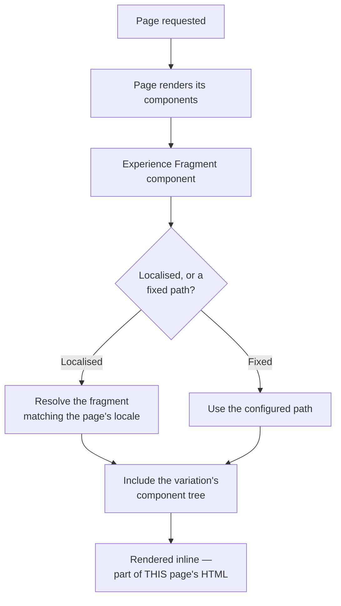
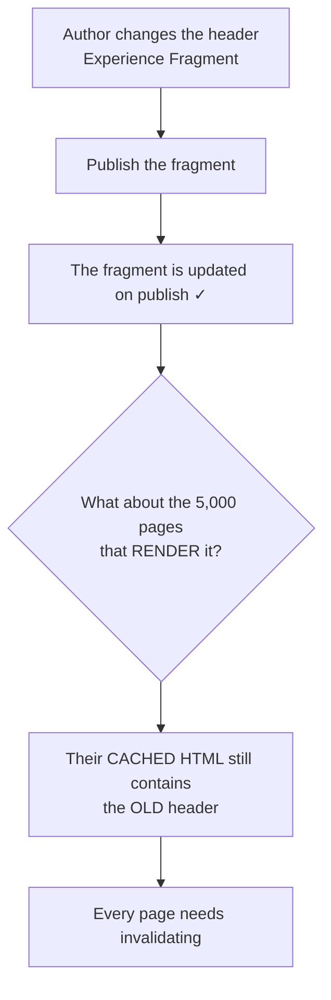

# 16 – Experience Fragments

> **Target:** 3–4 years experienced AEM Developer
> **Syllabus point covered (24, completing it):** *"CF and XF, and the difference between them."*
> **Project domain:** a global energy technology company's marketing site.

---

## Before we start — this file exists to complete one comparison

File 15 covered Content Fragments. This one covers Experience Fragments, and more importantly it gives you the **full comparison**, because your syllabus asks for the difference and that is what actually gets asked.

The sentence to build everything on, repeated from file 15 because it's the answer:

> **A Content Fragment is content without presentation. An Experience Fragment is presentation with content.**

**And here's the framing that makes the distinction land**, which most candidates miss: they reuse along **different axes**.

- A **Content Fragment** is reused across **channels** — the same product specification on the website, in the mobile app, in a partner's system.
- An **Experience Fragment** is reused across **pages** — the same promo banner on twenty product pages.

One is about *where the content goes*. The other is about *where the experience appears*. Say it that way and the interviewer knows you understand rather than recite.

---

## 1. Introduction

### 1.1 What an Experience Fragment is

> **An Experience Fragment is a group of components, laid out and styled, saved so it can be reused on many pages.**

Concretely: your site header. It's a logo component, a navigation component, a search component and a language selector, arranged in a particular way with particular styling. Every page needs it, and it must be identical everywhere.

**Without Experience Fragments**, you'd either build it into the page template's structure — which works but means a change requires a developer — or authors would rebuild it per page, which is unmaintainable.

**With one**, it's authored once as a normal page in the page editor, and referenced wherever it's needed. Change it, and every page using it changes.

### 1.2 The key structural fact

**An Experience Fragment is essentially a page.**

It lives under `/content/experience-fragments`, it's a `cq:Page`, it's built from a **template**, and it's edited in the **page editor** with drag and drop. Everything you know about pages applies — components, policies, templates, publishing, MSM.

**Contrast that with a Content Fragment**, which is a `dam:Asset` in the DAM, built from a **Content Fragment Model**, and edited in a form-like editor.

**That single structural difference explains almost all the others:**

| Because a CF is an asset from a model… | Because an XF is a page from a template… |
|---|---|
| It has typed fields | It has components |
| It has no layout | It has full layout and styling |
| It's edited as a form | It's edited in the page editor |
| It delivers as JSON | It delivers as HTML |
| It's for channels | It's for pages |

**If you can derive the differences from "one is an asset, one is a page," you don't need to memorise the comparison table.**

### 1.3 A real project example to adapt

> "We use Experience Fragments for the header, the footer, and reusable promotional blocks. The header and footer are placed in the page template's structure, so they're on every page and authors can't remove them — but they're authored as Experience Fragments, so the content team can change the navigation without a deployment.
>
> The useful part for us is localisation. We have twenty country sites, and the Core Components Experience Fragment component can resolve a localised fragment based on the current page's language — so one component in one template structure serves every country, each getting its own header content.
>
> We also use the plain HTML export for a couple of promotional blocks that a partner embeds on their own site, which means they always get our current version rather than a copy that drifts."

That covers the header/footer pattern, template structure placement, localisation, and the plain HTML export — four things that show real use rather than theory.

---

## 2. Core Concepts

### 2.1 Where they live, and the structure

```
/content/experience-fragments/
└── energy/
    └── de/
        └── de/
            └── site/
                └── header                 ← the Experience Fragment
                    ├── master             ← a VARIATION (a cq:Page)
                    │   └── jcr:content
                    │       └── root/      ← the actual components
                    └── social             ← another variation
```

**Two levels to notice:**

**The Experience Fragment itself** is a container. **Variations** live inside it, and each variation is a page with its own component tree.

**`master` is the default variation.** You reference a specific variation, not the fragment as a whole — so a reference points at `.../header/master`.

**And the folder structure carries locale**, which is what makes localisation work — section 2.4.

### 2.2 Variations — and how they differ from CF variations

**This is a good comparison question**, because both CF and XF have "variations" and they mean different things.

| | Content Fragment variation | Experience Fragment variation |
|---|---|---|
| What varies | The **wording** | The **layout and components** |
| Example | A shorter description for social | A Facebook-formatted version |
| Stored as | A sibling under `jcr:content/data` | **A separate page** |
| Can use a different template | No | **Yes** |

**An XF variation can use a different template entirely**, which is the point — a Facebook variation has different dimensions, different constraints, and genuinely different components from the web variation.

AEM ships templates for social variations. In practice most projects use the web variation and occasionally one more.

### 2.3 The three ways an Experience Fragment is used

**1. Placed on a page by an author.** The Experience Fragment component, pointed at a variation. This is the promotional-banner case — an author drops it on twenty pages, and changing the fragment changes all twenty.

**2. Placed in a template's structure.** This is the header and footer case, and it's the more architecturally interesting one.

From file 03: components in a template's **structure** appear on every page using that template and are **locked** so authors can't remove them. Put an Experience Fragment component there, and you get:

- The header appears on every page — guaranteed by the template structure.
- Authors can't delete it — it's locked structure.
- But the header's **content** is authored in the page editor as an Experience Fragment, so the content team changes navigation without a deployment.

**That combination is genuinely useful**, and being able to explain why it's better than hardcoding the header in the template is a good answer: the template guarantees presence, the fragment allows change.

**3. Exported as plain HTML.** `.plain.html` renders just the fragment's markup, with no page chrome. Used by external systems, email templates, and Adobe Target.

### 2.4 Localised Experience Fragments — the header/footer pattern

**This is the pattern worth understanding**, because it connects to file 12 and it's how multi-country sites actually work.

**The problem.** Twenty country sites all need a header. Structurally identical — logo, navigation, search, language selector. But the content differs: navigation labels are translated, the language selector shows different options, some countries have extra links.

**The naive approaches both fail.** One shared header means no localisation. Twenty separate references in twenty templates means twenty templates to maintain.

**The solution.** The Core Components Experience Fragment component supports **localisation**. You place one component in one template structure, and it resolves the correct localised fragment based on the current page's language.

```
Page:      /content/energy/de/de/products/transformers
                            ↑ locale

Resolves:  /content/experience-fragments/energy/de/de/site/header/master
                                                 ↑ same locale
```

**One component, one template, twenty localised headers.** The structure carries the locale, and the component does the lookup.

**And it composes with MSM (file 12).** Experience Fragments are pages, so they can be live copies. A country's header can be a live copy of a language master's header — inheriting structure while allowing local exceptions, exactly like site content.

**The interview answer:**

> "The pattern we use is placing an Experience Fragment component in the page template's **structure** for the header and footer. That gives us two things at once: the template guarantees it's on every page and authors can't remove it, but the content is authored as a fragment in the page editor, so the content team changes navigation without a deployment.
>
> For twenty country sites, the Core Components Experience Fragment component supports **localisation** — it resolves the fragment matching the current page's locale from the folder structure. So one component in one template serves every country, each getting its own header.
>
> And because Experience Fragments are pages, they work with MSM — a country header can be a live copy of a language master's header, inheriting structure with local exceptions."

### 2.5 Plain HTML export

`.plain.html` on an Experience Fragment variation renders **just the fragment's markup** — no page wrapper, no head, no site chrome.

```
/content/experience-fragments/energy/de/de/site/promo/master.plain.html
```

**What it's for:**

**Third-party embedding.** A partner site includes your promotional block. They get your current version rather than a copy that drifts out of date.

**Email templates.** Marketing tools that need HTML.

**Adobe Target.** Experience Fragments can be exported to Target as offers, for personalisation and testing.

**The caching point worth making:** it's a normal GET on a path-based URL, so the dispatcher and CDN cache it like any page. Which is good — but it also means a third party may serve a cached version, so invalidation matters when the fragment changes.

**And the security point:** if you're exposing it to a third party, that URL is public. It should contain nothing that isn't meant to be.

### 2.6 Can an Experience Fragment contain a Content Fragment?

**Yes** — and this question is a good test of whether you understand the relationship.

An Experience Fragment is a group of components. One of those components can be a Content Fragment component, rendering a fragment.

**A concrete case:** a product promo Experience Fragment — heading, image, call-to-action, laid out and styled — where the specification block inside it is rendered from a Content Fragment. The *layout* is reused across pages; the *specification data* is reused across channels.

**They're not alternatives. They're different axes**, and a real page often uses both.

### 2.7 The full comparison *(syllabus point 24)*

**This is the table the question is asking for.**

| | **Content Fragment** | **Experience Fragment** |
|---|---|---|
| **In one line** | Content **without** presentation | Presentation **with** content |
| Contains | Typed fields — text, number, date, references | **Actual components**, laid out and styled |
| Node type | **`dam:Asset`** | **`cq:Page`** |
| Stored at | `/content/dam/...` | `/content/experience-fragments/...` |
| Created from | A **Content Fragment Model** (`/conf/.../dam/cfm/models`) | A **template** (`/conf/.../wcm/templates`) |
| Edited in | The Content Fragment editor — **form-like** | The **page editor** — drag and drop |
| Variations vary | The **wording** | The **layout**, and can use a different template |
| Delivered as | **JSON** via GraphQL, or rendered by a component | **HTML**, or plain HTML export |
| Headless | **Yes — the headless building block** | Partially — plain HTML only |
| Reused across | **Channels** — web, app, partner | **Pages** |
| Translation | Translated as content | Translated as **pages** — MSM and language copies |
| Typical use | Product specifications, articles, structured data | **Header, footer, promo banner, campaign block** |
| Can contain the other? | No | **Yes** — an XF can include a CF component |

**The derivation to remember**, because it beats memorising the table:

> **A Content Fragment is an asset built from a model. An Experience Fragment is a page built from a template.** Everything else follows.

### 2.8 Choosing between them

**Use a Content Fragment when:**
- The content is consumed by more than one **channel**
- It's structured — distinct typed fields
- It has its own lifecycle, independent of any page
- A mobile app or external system needs it as data

**Use an Experience Fragment when:**
- You're reusing a **laid-out piece of a page** across pages
- The presentation is part of what's being reused
- It's a header, footer, banner or campaign block
- A third party needs the rendered HTML

**A useful test question:** *"If I gave this to a mobile app developer, would they want the data or the HTML?"* Data means Content Fragment. HTML means Experience Fragment.

---

## 3. Internal Working

### 3.1 How an Experience Fragment renders into a page



**The key consequence is at the bottom:** the fragment is rendered **inline** into the page. It becomes part of that page's HTML, and therefore part of that page's dispatcher cache entry.

**Which produces the invalidation problem in the next section.**

### 3.2 The invalidation problem

**This is the practical issue with Experience Fragments**, and it's the same shape as the derived listing in file 02 and cached GraphQL responses in file 15.



**The header is rendered into every page's cached HTML.** So publishing the fragment updates the fragment, and every cached page keeps serving the old version until it's invalidated.

**For a header or footer that means flushing essentially the whole site.** Which is correct, and also a significant operation on a large site — a full cache flush means a burst of cache misses while everything re-renders.

**Three things follow, and saying them shows operational awareness:**

**Header and footer changes are not casual.** They invalidate everything.

**They should be done at a sensible time**, not during peak traffic, because the re-render burst hits publish.

**And you need the flush rule to exist.** Publishing a fragment doesn't automatically invalidate the pages that include it — something has to make that connection.

### 3.3 Why an Experience Fragment looks wrong in its own editor

A practical problem worth knowing, because the cause isn't obvious.

**The symptom:** the header looks correct on a page and completely unstyled when you open the Experience Fragment itself for editing.

**The cause:** the Experience Fragment is rendered by **its own template**, and that template's page policy decides which **clientlibs** load (files 03 and 04). If the XF template doesn't include the site's clientlibs, the fragment renders without the site's CSS.

**The fix** is aligning the XF template's page policy with the site's, so the fragment previews accurately.

**Why it matters beyond aesthetics:** authors editing a fragment that doesn't look like the real thing make layout decisions blind. It's a genuine authoring-experience problem, not a cosmetic one.

---

## 4. Important Interview Questions

### 4.1 Basic

**Q1. What is an Experience Fragment?**
A group of components, laid out and styled, saved so it can be reused across pages. Structurally it's a page — a `cq:Page` under `/content/experience-fragments`, built from a template and edited in the page editor.

*Cross:* How is it different from a Content Fragment? · Where is it stored? · What's it built from? (**a template**, not a model)

**Q2. What's the difference between a Content Fragment and an Experience Fragment?**
→ Section 2.7. **Content without presentation versus presentation with content.** Then the structural derivation: a CF is an asset from a model, an XF is a page from a template.

*Cross:* Which is headless? (**CF**) · Which axis does each reuse along? (**channels vs pages**) · Can one contain the other? (**an XF can contain a CF**)

**Q3. Where are Experience Fragments stored?**
`/content/experience-fragments`, as pages. Each fragment contains variations, and each variation is itself a page.

*Cross:* Why not the DAM? (**they're pages, not assets**) · What's `master`? (the default variation) · Do you reference the fragment or a variation? (**a variation**)

**Q4. What is a variation, and how does it differ from a CF variation?**
An XF variation is a different **layout** for a different channel, and it can use a different template entirely. A CF variation is different **wording** of the same content.

*Cross:* Give an example (a Facebook variation with different dimensions and components) · Where is each stored? · Which can use a different template? (**XF**)

**Q5. How is an Experience Fragment used on a page?**
Three ways: an author places the Experience Fragment component on a page; it's placed in a **template's structure** for headers and footers; or it's exported as plain HTML for external use.

*Cross:* Which is the header/footer case? (**template structure**) · Why place it in structure rather than let authors add it? (**guaranteed present, and locked**) · What's the plain HTML export for?

**Q6. What is the plain HTML export?**
`.plain.html` on a variation renders just the fragment's markup with no page chrome — for third-party embedding, email templates, and Adobe Target.

*Cross:* Is it cacheable? (yes — a normal path-based GET) · What's the security consideration? (**it's a public URL**) · What's the benefit for a partner? (they get the current version, not a drifting copy)

**Q7. Can an Experience Fragment contain a Content Fragment?**
Yes. An XF is a group of components, and one of those can be a Content Fragment component. The layout is reused across pages; the fragment's data is reused across channels.

*Cross:* Give an example (a promo block whose specification section comes from a CF) · Are they alternatives? (**no — different axes**)

**Q8. Which one is headless?**
Content Fragments. They deliver structured JSON via GraphQL, which is what a mobile app or partner system can actually use. Experience Fragments deliver HTML — the plain export is useful for embedding, but HTML isn't headless in any meaningful sense.

*Cross:* Why isn't HTML headless? (**a consumer can't do anything structured with it** — file 15's anti-pattern) · When would a plain HTML export be right? (a partner embedding a rendered block)

### 4.2 Intermediate

**Q9. How do you handle a header across twenty country sites?**
→ Section 2.4. An Experience Fragment component in the page **template's structure**, using **localisation** so it resolves the fragment matching the page's locale from the folder structure. One component, one template, twenty localised headers.

*Cross:* Why in the structure? (guaranteed present, locked, but content-authorable) · How does localisation resolve? (from the folder structure matching the page's locale) · Does it work with MSM? (**yes — XFs are pages, so they can be live copies**)

**Q10. You changed the header fragment and pages still show the old one. Why?**
The fragment renders **inline** into each page, so it's part of every page's cached HTML. Publishing the fragment updates the fragment; every cached page keeps serving the old version until it's invalidated.

*Cross:* How many pages? (**for a header, essentially all of them**) · What does that mean operationally? (a near-full flush, and a re-render burst — not a peak-hours change) · Whose job is the flush rule? (it has to exist — publishing a fragment doesn't invalidate including pages by itself)

**Q11. The Experience Fragment looks unstyled in its own editor. Why?**
It's rendered by its own template, and that template's page policy decides which clientlibs load. If the XF template doesn't include the site's clientlibs, it renders without the site's CSS.

*Cross:* Where's the fix? (align the XF template's page policy — files 03 and 04) · Why does it matter? (**authors make layout decisions blind**) · Does it affect the page rendering? (no — only the fragment's own editor)

**Q12. Do Experience Fragments need publishing separately?**
Yes — like Content Fragments, they have their own publication state. Publishing a page that includes a fragment does not publish the fragment.

*Cross:* Why? (it may be included by thousands of pages) · What's the symptom? (**works on author, missing on publish** — the recurring theme) · How do you find what includes it? (the References panel)

**Q13. How do Experience Fragments interact with MSM?**
They're pages, so everything from file 12 applies — an XF can be a live copy, receive rollouts, and have inheritance cancelled per property. A country's header can be a live copy of a language master's, inheriting structure while allowing local links.

*Cross:* And Content Fragments? (they translate as content, but they're assets, not pages) · Which is easier to localise? (XF, because the page machinery already handles it) · What about the cancellation risk? (**the same silent-skip problem from file 12**)

**Q14. When would you use an XF rather than building the header into the template?**
When the content should change without a deployment. Building it into the template means a developer changes navigation. An Experience Fragment placed in the template structure gives you both — the template guarantees presence, the fragment allows content change.

*Cross:* What do you lose? (a small amount of indirection, and the invalidation cost) · When would you hardcode it instead? (if it genuinely never changes, which is rare) · What about a footer with legal text? (**definitely a fragment** — legal text changes and shouldn't need a release)

**Q15. What's the performance consideration with Experience Fragments?**
The fragment renders inline, so it's part of the page's render and its cache entry. That's fine for the page. The cost is **invalidation** — changing a header means invalidating every page, which on a large site is a significant flush and a re-render burst.

*Cross:* How would you mitigate? (change them out of hours; consider a grace period on the dispatcher) · Does it slow page rendering? (marginally — it's an include) · What about many fragments on one page?

### 4.3 Advanced

**Q16. Design the header and footer for a twenty-country site.**

> "Experience Fragments placed in the page **template's structure**.
>
> Putting them in the structure rather than letting authors add them gives two things: they're guaranteed present on every page, and they're **locked**, so an author can't accidentally delete the footer. That's the file 03 structure-versus-initial-content distinction doing real work.
>
> But the content is authored as an **Experience Fragment**, so the content team changes navigation labels or footer links without a deployment. Hardcoding the header in the template would mean a developer for every wording change.
>
> For twenty countries, I'd use the Core Components Experience Fragment component's **localisation** — one component in one template structure, resolving the fragment matching the current page's locale from the folder structure. One component serves every country.
>
> And because Experience Fragments are pages, they compose with **MSM**. A country header can be a live copy of the language master's header, so structural changes roll out centrally while a country can cancel inheritance on a specific link if they genuinely need to — with the same discipline from file 12 about cancelling at the smallest scope, because a page-level cancellation would silently stop that header receiving every future change.
>
> The thing I'd plan for explicitly is **invalidation**. A header change invalidates every page on the site, which is a near-full cache flush and a re-render burst on publish. So header changes are scheduled rather than casual, and there needs to be a flush rule connecting fragment publication to the pages that include it — because that connection doesn't exist by default."

*Cross:* What if one country needs an extra nav item? (a local page, or cancelled inheritance on that property) · How do you preview accurately? (**align the XF template's page policy with the site's**) · What's the rollback if a header change breaks?

**Q17. A partner wants to embed one of your promotional blocks. How?**

> "The **plain HTML export** — `.plain.html` on the variation renders just the fragment's markup with no page chrome, and the partner includes that.
>
> The benefit over sending them a copy is that they always get our current version rather than something that drifts out of date, which is exactly the problem that copies create.
>
> Three things I'd think about. **It's a public URL**, so the fragment must contain nothing that isn't meant to be public — no internal links, no draft content. **It's cacheable**, which is good for load but means invalidation matters when we change it. And **the styling is ours, not theirs** — the markup carries our class names, so either they include our clientlib or we scope the styles inline, and that's a conversation to have before shipping rather than after.
>
> If the partner actually wants the *data* rather than our rendering, that's a Content Fragment and GraphQL instead — and it's worth asking, because 'embed our block' and 'show our data in their design' are different requests that sound similar."

*Cross:* How do they get the CSS? · What if they want it in their own layout? (**then it's a CF**) · How do you version it?

**Q18. When is an Experience Fragment the wrong tool?**

When what's being reused is **content, not presentation**. If a mobile app needs the same information, an XF gives it HTML it can't structure — that's file 15's anti-pattern arriving from the other direction.

Also when something appears once. An XF for a block used on one page adds indirection, a separate publication step, and an invalidation relationship, for no reuse benefit.

And when the reuse is really about **structure across page types** rather than content — that may be a template concern (file 03) rather than a fragment one.

*Cross:* How do you decide? (**would a consumer want the data or the HTML?**) · What's the cost of getting it wrong? · Can you convert one to the other? (not directly — it's a re-author)

---

## 5. Cross Questions — how this topic gets drilled

**Thread A — from "what's the difference between CF and XF"** *(your syllabus thread)*
Which has presentation? → Where is each stored? → What node type? → What is each built from? → How is each edited? → Which is headless? → **What does each get reused across?** → Can one contain the other?

**Thread B — from "how do you do a header"**
XF or template? → Why in the structure? → What does locking give you? → How do twenty countries work? → How does localisation resolve? → Does it work with MSM? → **What about caching?**

**Thread C — from "the header change didn't appear"**
Was the fragment published? → Is it rendered inline? → So what's cached? → How many pages? → What does that flush cost? → When would you make the change?

**Thread D — from "plain HTML export"**
What is it? → What's it for? → Is it cacheable? → Is it public? → What about styling? → **What if they want the data instead?**

---

## 6. Best Interview Answers

### 6.1 "What's the difference between a Content Fragment and an Experience Fragment?" — about 90 seconds

**Your syllabus point 24, in full.**

> "The one-line version is that a **Content Fragment is content without presentation, and an Experience Fragment is presentation with content**.
>
> Structurally the distinction is cleaner than that, and it's where I'd derive everything from. A **Content Fragment is an asset in the DAM built from a Content Fragment Model** — typed fields, no layout, edited in a form-like editor. An **Experience Fragment is a page under `/content/experience-fragments` built from a template** — actual components, laid out and styled, edited in the normal page editor with drag and drop.
>
> Once you have that, the rest follows. A CF has typed fields because it comes from a model; an XF has components because it's a page. A CF delivers as JSON through GraphQL; an XF delivers as HTML. A CF is the headless building block; an XF isn't really headless, though it has a plain HTML export for embedding.
>
> The framing I find most useful is that they **reuse along different axes**. A Content Fragment is reused across **channels** — the same product specification on the website, in the mobile app, in a partner's system. An Experience Fragment is reused across **pages** — the same promo banner on twenty product pages.
>
> So on our project, product specifications are Content Fragments because the app needs them as data. The header, footer and promotional blocks are Experience Fragments because what we're reusing is the laid-out experience.
>
> And they're not alternatives — an Experience Fragment can contain a Content Fragment component. A promo block might be an XF for the layout, with its specification section rendered from a CF."

### 6.2 "How would you handle a header across twenty country sites?" — about 75 seconds

> "An Experience Fragment component placed in the page **template's structure**.
>
> The structure placement matters for two reasons. It's guaranteed present on every page using that template, and it's **locked**, so an author can't accidentally delete the footer — that's the structure-versus-initial-content distinction doing real work.
>
> But the content is an Experience Fragment, so the content team changes navigation labels without a deployment. Hardcoding the header in the template would mean a developer for every wording change, which is exactly the bottleneck editable templates were meant to remove.
>
> For twenty countries, the Core Components Experience Fragment component supports **localisation** — it resolves the fragment matching the current page's locale from the folder structure. So one component in one template serves every country, each getting its own header content.
>
> And because Experience Fragments are pages, they work with MSM. A country's header can be a live copy of the language master's, so structural changes roll out centrally while a country can cancel inheritance on one link if it genuinely needs to.
>
> The thing I'd plan for explicitly is **invalidation**. The header renders inline into every page, so it's part of every page's cached HTML. Changing it means invalidating essentially the whole site — a near-full flush and a re-render burst on publish. So header changes get scheduled rather than made casually, and there has to be a flush rule connecting fragment publication to the pages that include it, because that connection doesn't exist by default."

---

## 7. Real Project Examples

### Story 1 — The header change that flushed the site

**What happened.** A navigation label change to the header Experience Fragment was published mid-morning. Publish CPU spiked and page response times degraded noticeably for about twenty minutes.

**The cause.** The header renders **inline** into every page, so it's part of every page's cached HTML. Publishing the fragment triggered a flush of essentially the entire site, and then every page had to re-render on its next request.

**Why nobody anticipated it.** The change itself was trivial — one word. The *scope* of the change was the whole site, and nothing in the authoring experience suggests that. From the author's point of view they edited one fragment.

**What we changed.** Header and footer changes moved to a scheduled window outside peak hours. And we tuned the dispatcher's grace period so that during a flush, stale content is served briefly rather than every request stampeding publish simultaneously.

**The lesson to state:** *"With an Experience Fragment in a template structure, the blast radius of a change is every page that uses the template. That's exactly what you want functionally, and it's a cache event you have to plan for operationally."*

### Story 2 — The fragment that looked broken to authors

**What happened.** Authors reported that the header "looked broken" when they opened it to edit, even though it rendered correctly on pages. Several stopped editing it because they weren't confident about what they were changing.

**The cause.** The Experience Fragment is rendered by **its own template** when you open it in the editor, and that template's page policy determines which clientlibs load. The XF template hadn't been given the site's clientlib categories, so the fragment rendered with no site CSS.

**Why it mattered more than it looked.** It wasn't cosmetic. Authors were making layout decisions — spacing, ordering, which items to include — against a rendering that bore no relationship to the real thing. One of them had added items that looked fine unstyled and broke the real navigation.

**The fix.** Aligned the XF template's page policy with the site's, so the fragment previews accurately.

**The connection worth drawing:** *"That's a page policy problem, from file 03 — the policy decides the clientlibs, and the XF template had a different one. It's a good example of how the template and clientlib topics show up somewhere you wouldn't expect."*

### Story 3 — The partner who actually wanted data

**What happened.** A partner asked to embed one of our product promotional blocks on their site. We set up a plain HTML export and gave them the URL.

**The problem.** Their integration looked wrong. Our markup carried our class names and expected our CSS, and their page had a different design system. They ended up overriding our styles with their own, which broke every time we changed the fragment.

**What we'd misunderstood.** They didn't want our *block*. They wanted our *product data*, rendered in their own design. "Embed our promotional block" and "show our data in your layout" sound like the same request and are completely different.

**The fix.** Moved them to **Content Fragments delivered via GraphQL persisted queries** (file 15). They get structured data and render it themselves. Our changes to specifications reach them; our changes to styling don't affect them at all.

**The lesson, and it's the useful test:** *"The question to ask is 'would the consumer rather have the data or the HTML?' Data means Content Fragment. HTML means Experience Fragment. We answered it wrong because the request was phrased in terms of the block rather than the content, and that cost us a rework."*

---

## 8. Configuration Examples

### 8.1 An Experience Fragment component in a template structure

Inside a page template's `structure`, from file 03:

```xml
<root
    jcr:primaryType="nt:unstructured"
    sling:resourceType="wcm/foundation/components/responsivegrid">

    <!-- LOCKED structure component: guaranteed on every page using this
         template, and authors cannot delete it. But the CONTENT is an
         Experience Fragment, so the content team changes navigation
         without a deployment.

         Note: no editable="{Boolean}true" -- deliberately locked. -->
    <header
        jcr:primaryType="nt:unstructured"
        sling:resourceType="energy/components/experiencefragment"
        fragmentVariationPath="/content/experience-fragments/energy/site/header/master"/>

    <container
        jcr:primaryType="nt:unstructured"
        sling:resourceType="wcm/foundation/components/responsivegrid"/>

    <footer
        jcr:primaryType="nt:unstructured"
        sling:resourceType="energy/components/experiencefragment"
        fragmentVariationPath="/content/experience-fragments/energy/site/footer/master"/>

</root>
```

**The `fragmentVariationPath` points at a variation**, not the fragment itself — `.../header/master`, not `.../header`.

**And for a localised site**, the Core Components component resolves the locale-specific fragment from the page's language rather than using a fixed path — so one template serves every country.

### 8.2 The proxy component

Following the file 02 pattern:

`/apps/energy/components/experiencefragment/.content.xml`

```xml
<?xml version="1.0" encoding="UTF-8"?>
<jcr:root xmlns:sling="http://sling.apache.org/jcr/sling/1.0"
          xmlns:cq="http://www.day.com/jcr/cq/1.0"
          xmlns:jcr="http://www.jcp.org/jcr/1.0"
    jcr:primaryType="cq:Component"
    jcr:title="Experience Fragment"
    componentGroup="Energy - Structure"

    <!-- Proxy the Core Component: we control the version, and we can
         override the HTL later without touching content. Same reasoning
         as file 02. -->
    sling:resourceSuperType="core/wcm/components/experiencefragment/v1/experiencefragment"/>
```

### 8.3 The folder structure for localisation

```
/content/experience-fragments/energy/
├── language-masters/
│   ├── en/site/header/master        ← authored
│   └── de/site/header/master        ← language copy of en
├── de/de/site/header/master         ← LIVE COPY of language-masters/de
├── ch/de/site/header/master         ← LIVE COPY of language-masters/de
└── us/en/site/header/master         ← LIVE COPY of language-masters/en
```

**This mirrors the content structure from file 12 exactly**, and that's the point: Experience Fragments are pages, so the same MSM patterns apply. Translate horizontally in the language masters, distribute vertically to the country fragments.

### 8.4 Plain HTML export

```
GET /content/experience-fragments/energy/de/de/site/promo/master.plain.html
```

Returns just the fragment's markup:

```html
<div class="cmp-promo">
    <h2 class="cmp-promo__title">Neue Transformatorenreihe</h2>
    <p class="cmp-promo__text">...</p>
    <a class="cmp-cta cmp-cta--arrow" href="/de/de/products/transformers">Mehr erfahren</a>
</div>
```

**Three things to note:**

**No page chrome** — no `<html>`, no `<head>`, no site header.

**It's a normal path-based GET**, so the dispatcher and CDN cache it like a page. Good for load; means invalidation matters.

**The class names are ours.** A consumer either includes our clientlib or writes their own styles. If they want it in *their* design system, they wanted a Content Fragment — story 3.

---

## 9. Common Mistakes

| The mistake | What happens | The fix |
|---|---|---|
| Not publishing the fragment | Works on author, missing on publish | XFs have their own publication state |
| Not planning invalidation | Pages keep serving the old fragment | A flush rule connecting fragment publish to including pages |
| Changing a header during peak hours | Near-full cache flush and a re-render burst | Schedule it |
| XF template missing the site's clientlibs | **Authors edit against an unstyled preview** | Align the XF template's page policy |
| Referencing the fragment rather than a variation | Doesn't resolve | Point at `.../master` |
| Using an XF where a CF is right | A consumer gets HTML it can't structure | **Ask: data or HTML?** |
| Using an XF for a single-use block | Indirection and a publish step for no reuse | A component on the page |
| Hardcoding the header in the template | Content changes need a developer | XF in the template structure |
| Placing the header as initial content instead of structure | Authors can delete it | Structure, locked (file 03) |
| Twenty templates for twenty countries | Unmaintainable | **One localised XF component** |
| Exposing internal content in a plain HTML export | It's a **public URL** | Review what's in the fragment |
| Assuming a partner wants the HTML | They may want the data | Ask before building |
| Inheritance cancelled at page level on a country header | Silently stops receiving all changes | File 12's discipline applies |

---

## 10. Best Practices

**On placement.** Header and footer belong in the **template structure**, locked — guaranteed present, undeletable, but content-authorable.

**On localisation.** One localised Experience Fragment component rather than one template per country. And use MSM for the fragments themselves, since they're pages.

**On invalidation.** Plan it before you ship. A header change invalidates everything, so schedule those changes and make sure a flush rule exists connecting fragment publication to including pages.

**On previewing.** Align the XF template's page policy with the site's, so authors edit against an accurate rendering. This is not cosmetic — they make layout decisions against what they see.

**On choosing.** Ask whether a consumer wants the data or the HTML. Data is a Content Fragment; HTML is an Experience Fragment. And remember they compose — an XF can contain a CF.

**On the plain HTML export.** Remember it's a public URL, and agree the styling question with the consumer before shipping rather than after.

---

## 11. Debugging Tips

**"The fragment doesn't appear on publish."** The fragment wasn't published — it has its own publication state, exactly like a Content Fragment. Publishing pages that include it doesn't publish it.

**"I changed the fragment and pages show the old version."** It's rendered inline, so it's part of every including page's cached HTML. The fragment is updated; the pages are cached. Check whether the flush actually reached those pages.

**"The fragment looks unstyled in its own editor."** The XF template's page policy doesn't include the site's clientlibs (files 03 and 04).

**"The localised fragment isn't resolving."** The folder structure under `/content/experience-fragments` has to mirror the locale structure the component expects. A mismatch means it falls back or finds nothing.

**"I can't find what uses this fragment."** The **References panel** — the same tool as for Content Fragments. A fragment doesn't know where it's used, which is the point, so the tooling has to tell you.

| Tool | Answers |
|---|---|
| The References panel | Which pages include this fragment |
| Fragment publication status | Has it been activated |
| The XF template's page policy | Which clientlibs load in the editor |
| Page source on publish | Is the old or new fragment markup cached |
| Private window on publish directly | Anonymous behaviour, without the dispatcher |

---

## 12. Performance Notes

**The fragment renders inline**, so it's an include during page render — a small cost, and it becomes part of the page's cache entry.

**The real cost is invalidation.** A header change invalidates every page. On a large site that's a near-full flush plus a re-render burst on publish, which is a genuine operational event rather than a background one.

**Mitigations:** schedule those changes outside peak hours, and use the dispatcher's grace period so stale content is served briefly during a flush rather than every request stampeding publish at once.

**Many fragments on one page** each add an include. That's rarely the bottleneck, but a page assembled from a dozen fragments is doing a dozen includes.

**The plain HTML export caches normally**, which is good for third-party load — and means the same invalidation thinking applies.

---

## 13. Real Production Scenarios

**1. Fragment missing on publish.** It wasn't activated — separate publication state.

**2. Header change doesn't appear.** Rendered inline, so cached in every page. Flush needed.

**3. Publish CPU spike after a header change.** Near-full cache flush and re-render burst. Schedule these.

**4. Fragment looks unstyled to authors.** XF template's page policy missing the site's clientlibs.

**5. Author deleted the footer.** It was in initial content rather than structure. Structure is locked (file 03).

**6. Localised fragment doesn't resolve.** Folder structure doesn't match the expected locale pattern.

**7. A country header stopped getting updates.** Inheritance cancelled at page level — file 12's silent-skip problem.

**8. A partner's embed looks wrong.** They have their own design system; they wanted the data, not the HTML.

**9. Internal content visible in a plain HTML export.** It's a public URL, and the fragment contained something it shouldn't.

**10. Twenty templates to maintain for twenty countries.** Should be one localised XF component.

**11. A mobile app can't use an Experience Fragment.** Correct — it delivers HTML. That's a Content Fragment requirement.

**12. Fragment deleted and pages broke.** Fragments don't know where they're used; check the References panel first.

---

## 14. Comparison Tables

**The full CF vs XF comparison** — section 2.7. Learn the **derivation** rather than the table:

> **A Content Fragment is an asset built from a model. An Experience Fragment is a page built from a template.**

**Variations, compared**

| | CF variation | XF variation |
|---|---|---|
| Varies | **Wording** | **Layout and components** |
| Stored as | A sibling under `jcr:content/data` | **A separate page** |
| Different template | No | **Yes** |
| Example | A shorter description | A Facebook version |

**How each is delivered**

| | CF | XF |
|---|---|---|
| Rendered on a page | By a component | Inline include |
| To an app | **JSON via GraphQL** | Not really |
| To a third party | GraphQL persisted query | **`.plain.html`** |
| To Adobe Target | — | **As an offer** |

**Placement options for an XF**

| Where | Effect |
|---|---|
| Author places it on a page | Reusable block, author-controlled |
| **In the template structure** | **Guaranteed present, locked** — headers and footers |
| Plain HTML export | External consumption |

---

## 15. Memory Tricks

**The core one:** *"Content Fragment is content without presentation. Experience Fragment is presentation with content."*

**The derivation:** *"CF is an asset from a model. XF is a page from a template."*

**The axes:** *"CF is reused across channels. XF is reused across pages."*

**The choosing test:** *"Would they rather have the data or the HTML?"*

**The header pattern:** *"Structure guarantees it. The fragment allows change."*

**The caching cost:** *"An inline include means the page cache holds it."*

**Both publish separately:** *"Fragments have their own publication state."*

---

## 16. Revision Notes

- An **Experience Fragment is a group of components, laid out and styled**, reused across pages. Structurally it is a **`cq:Page` under `/content/experience-fragments`**, built from a **template**, edited in the **page editor**.
- **THE DERIVATION:** a **CF is an asset built from a model**; an **XF is a page built from a template**. Every other difference follows.
- **CF vs XF one-liner:** content **without** presentation vs presentation **with** content.
- **The axes:** CF is reused across **channels**; XF is reused across **pages**.
- **Variations:** an XF variation is a different **layout**, and **can use a different template**. A CF variation is different **wording**.
- You reference a **variation** (`.../header/master`), not the fragment.
- **Three uses:** placed on a page by an author · placed in a **template structure** (headers/footers — **guaranteed and locked**) · **`.plain.html` export** for third parties, email and Adobe Target.
- **The header pattern:** XF component in the template **structure** → present on every page, locked so authors can't delete it, but content-authorable without a deployment.
- **Localisation:** the Core Components XF component resolves the fragment matching the page's **locale** from the folder structure — one component, one template, twenty localised headers.
- **XFs are pages, so MSM applies** — a country header can be a **live copy** of a language master's, with the same cancellation discipline from file 12.
- **An XF can contain a CF.** They're not alternatives.
- **Headless:** CF yes (JSON via GraphQL); XF only via plain HTML, which isn't really headless because a consumer can't structure it.
- **XFs publish separately** from the pages that include them.
- **INVALIDATION IS THE COST:** the fragment renders **inline**, so it's in every including page's cached HTML. A header change invalidates **everything** — schedule it, and make sure a flush rule exists.
- **The unstyled-editor problem:** the XF template's **page policy** decides which clientlibs load. Align it, or authors edit blind.
- **The choosing test:** *would the consumer rather have the data or the HTML?*

---

## 17. Cheat Sheet

**Structure**
```
/content/experience-fragments/energy/de/de/site/header/
    master        ← a VARIATION (a cq:Page) -- reference THIS
    social        ← another variation, possibly a different template
```

**Placement in a template structure**
```xml
<header sling:resourceType="energy/components/experiencefragment"
        fragmentVariationPath=".../site/header/master"/>
        <!-- no editable=true → LOCKED -->
```

**Plain HTML export**
```
/content/experience-fragments/.../master.plain.html
    → just the markup, no page chrome
    → a normal cacheable GET
    → a PUBLIC URL
```

**CF vs XF**
```
CF: dam:Asset   · /content/dam                  · from a MODEL    · JSON  · CHANNELS
XF: cq:Page     · /content/experience-fragments · from a TEMPLATE · HTML  · PAGES

"Content without presentation"  vs  "Presentation with content"
```

**Localisation**
```
/content/experience-fragments/energy/
    language-masters/en|de/site/header/master   ← authored + translated
    de/de/site/header/master                    ← LIVE COPY
    ch/de/site/header/master                    ← LIVE COPY
```

**Debug**
```
Missing on publish       → the FRAGMENT wasn't activated
Old version showing      → rendered inline; the PAGE cache holds it
Unstyled in the editor   → XF template's page policy lacks the clientlibs
Won't resolve localised  → folder structure doesn't match the locale
Who uses it?             → the References panel
```

---

## 18. Frequently Forgotten Things

1. **An XF is a page; a CF is an asset.** Everything derives from that.
2. **Reference a variation** (`.../master`), not the fragment.
3. **XFs publish separately** from the pages that include them.
4. **The fragment renders inline**, so it lives in every including page's cache.
5. **A header change invalidates the whole site.**
6. **The XF template's page policy decides the editor's clientlibs** — otherwise authors edit unstyled.
7. **Structure placement locks it**; initial content doesn't (file 03).
8. **Localisation resolves from the folder structure.**
9. **XFs work with MSM** because they're pages.
10. **An XF can contain a CF.**
11. **`.plain.html` is a public URL** carrying **our** class names.
12. **A CF variation is wording; an XF variation is layout.**
13. **HTML isn't headless** — a consumer can't structure it.
14. **The References panel is the only way** to find what uses a fragment.

---

## 19. Final Interview Summary

**1. What it is.** A laid-out group of components, reused across pages. A page under `/content/experience-fragments`, built from a template.

**2. The derivation.** CF is an asset from a model; XF is a page from a template. Everything follows.

**3. The one-liner.** Content without presentation versus presentation with content.

**4. The axes.** Channels versus pages.

**5. The header pattern.** XF component in the template structure — guaranteed, locked, content-authorable.

**6. Localisation.** One component resolves per-locale fragments. One template, twenty countries.

**7. MSM applies.** XFs are pages, so live copies and rollouts work.

**8. Plain HTML export.** For third parties, email and Target. Public and cacheable.

**9. They compose.** An XF can contain a CF.

**10. The cost.** Inline rendering means a header change invalidates everything. Plan it.

---

## 20. Mock Interview

**How to use this:** cover the answers, 15-minute timer, speak every answer out loud.

### The interviewer asks:

1. **What is an Experience Fragment?**
2. **What's the difference between a Content Fragment and an Experience Fragment?**
3. Where is each stored, and what node type?
4. What is each built from?
5. What does each get reused across?
6. Can an Experience Fragment contain a Content Fragment?
7. Which one is headless, and why?
8. How do variations differ between the two?
9. **How would you handle a header across twenty country sites?**
10. Why place it in the template structure rather than let authors add it?
11. **You changed the header and pages still show the old one. Why?**
12. The fragment looks unstyled in its own editor. Why?
13. What is the plain HTML export for?
14. Do Experience Fragments work with MSM?
15. **When is an Experience Fragment the wrong tool?**

### Model answers

**1.** A group of components, laid out and styled, saved so it can be reused across pages — a header, a footer, a promotional block. Structurally it's essentially a page: a `cq:Page` under `/content/experience-fragments`, built from a template and edited in the normal page editor with drag and drop. Everything you know about pages applies to it, including publishing and MSM.

**2.** *(The 6.1 answer — the one-liner, the structural derivation, what follows from it, the channels-versus-pages axes, our examples, and the fact they compose.)*

**3.** A **Content Fragment** is a `dam:Asset` under `/content/dam` — an asset in the DAM. An **Experience Fragment** is a `cq:Page` under `/content/experience-fragments`. That difference is the root of all the others: an asset has typed fields, a page has components.

**4.** A Content Fragment is built from a **Content Fragment Model**, which lives at `/conf/<project>/settings/dam/cfm/models` and defines the typed fields. An Experience Fragment is built from a **template**, exactly like a page — so it has a structure, initial content and policies, with everything from file 03 applying.

**5.** Different axes, and this is the framing I find most useful. A **Content Fragment is reused across channels** — the same product specification on the website, in the mobile app, in a partner's system. An **Experience Fragment is reused across pages** — the same promo banner on twenty product pages. One is about where the content goes; the other is about where the experience appears.

**6.** Yes. An XF is a group of components, and one of those can be a Content Fragment component. A good example is a product promo block: it's an Experience Fragment for the layout, which is reused across pages, and the specification section inside it is rendered from a Content Fragment, which is reused across channels. They're not alternatives — a real page often uses both.

**7.** **Content Fragments.** They deliver structured JSON via GraphQL, which is something a mobile app or partner system can actually work with — take the fields it needs, render them in its own design. Experience Fragments deliver HTML. The plain HTML export is genuinely useful for embedding, but HTML isn't headless in any meaningful sense, because a consumer can't do anything structured with it. That's the same anti-pattern as modelling an article as one rich-text field — an opaque blob that has to be parsed.

**8.** They sound the same and mean different things. A **CF variation** is different **wording** of the same content — a shorter description for a social card — stored as a sibling under `jcr:content/data`. An **XF variation** is a different **layout**, stored as a separate page, and it can use a **different template** entirely, which is the point: a Facebook variation has different dimensions and genuinely different components from the web one.

**9.** *(The 6.2 answer — XF component in the template structure, why structure rather than initial content, localisation resolving from the folder structure, MSM composing because XFs are pages, and the invalidation planning.)*

**10.** Two reasons, and they're the file 03 structure-versus-initial-content distinction doing real work. Structure means it's **guaranteed present** on every page using that template — you can't have a page that accidentally lacks a footer. And structure components are **locked**, so an author can't delete it. If you put it in initial content instead, it would appear on new pages and authors could remove it, which for a footer containing legal text is not acceptable. But the content is still an Experience Fragment, so the content team changes navigation without a deployment — the template guarantees presence, the fragment allows change.

**11.** Because the fragment renders **inline** into the page — it becomes part of that page's HTML, and therefore part of that page's dispatcher cache entry. So publishing the fragment updates the fragment, and every cached page keeps serving the old markup until it's invalidated. For a header that's essentially every page on the site. We had exactly this: a one-word navigation change published mid-morning triggered a near-full flush and a re-render burst that degraded response times for about twenty minutes. Nobody anticipated it because the change looked trivial — the *scope* was the whole site and nothing in the authoring experience suggests that. Now header and footer changes are scheduled outside peak hours, and we tuned the dispatcher grace period so stale content is served briefly rather than every request stampeding publish at once.

**12.** Because the Experience Fragment is rendered by **its own template** when you open it in the editor, and that template's **page policy** decides which clientlibs load. If the XF template doesn't include the site's clientlib categories, it renders with none of the site's CSS. That's a page policy problem from file 03 combined with clientlibs from file 04 — and it matters more than it sounds, because it isn't cosmetic. Authors were making layout decisions against a rendering that bore no relationship to the real thing, and one of them added items that looked fine unstyled and broke the actual navigation. The fix is aligning the XF template's page policy with the site's.

**13.** `.plain.html` on a variation renders just the fragment's markup with no page chrome — no `<html>`, no `<head>`, no site header. It's used for third-party embedding, email templates, and exporting to Adobe Target as offers. The benefit over sending a partner a copy is that they always get our current version rather than something that drifts. Three things to be aware of: it's a **public URL**, so the fragment must contain nothing internal; it's a normal cacheable GET, so invalidation matters; and the markup carries **our** class names, so the consumer either includes our clientlib or writes their own styles — which is a conversation to have before shipping.

**14.** Yes, and cleanly, because Experience Fragments are pages — so everything from file 12 applies. A country's header can be a **live copy** of a language master's header, inheriting structure while a country cancels inheritance on a specific link if it genuinely needs to. We mirror the content structure exactly: language masters for authoring and translation, country fragments as live copies. The same discipline applies too — cancel at the smallest scope, because a page-level cancellation on a country header would silently stop it receiving every future change, and a rollout skipping a cancelled page is correct behaviour so nothing reports it.

**15.** When what's being reused is **content, not presentation**. If a mobile app or a partner needs the same information, an Experience Fragment gives them HTML they can't structure — we got this wrong with a partner who asked to embed a promotional block, set up a plain HTML export, and then found their integration broke every time we changed styling. What they actually wanted was our **product data** rendered in their own design system, which is a Content Fragment delivered via GraphQL. "Embed our block" and "show our data in your layout" sound like the same request and are completely different. The test I'd apply now is: **would the consumer rather have the data or the HTML?** Data means Content Fragment; HTML means Experience Fragment.

It's also wrong for something that appears once — an XF adds indirection, a separate publication step and an invalidation relationship, and that's worth paying for genuine reuse but not for a single-use block.

---

## Next file

**`17-Sling-Model-Exporter.md`** — your syllabus point 26: what the Sling Model Exporter is, how `@Exporter` turns a model into JSON, the `.model.json` selector, how it relates to the SPA Editor, and where it fits alongside Content Fragments and GraphQL for headless delivery.

---

*File 16 of the AEM Interview Preparation repository. Teaching style, energy-sector project domain.*
