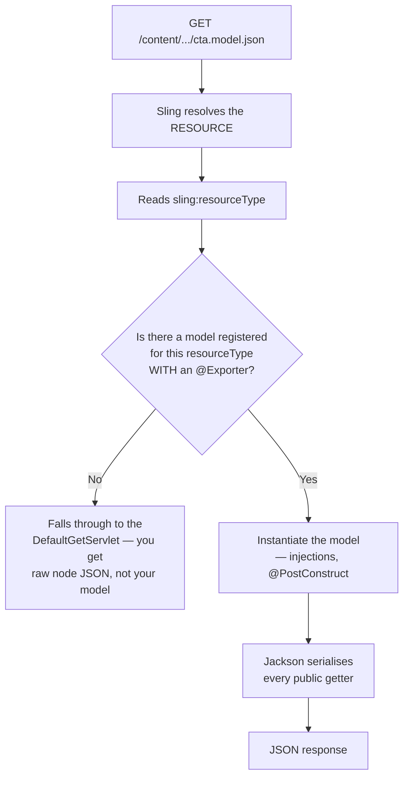
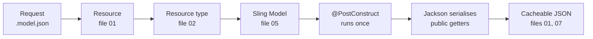

# 17 – Sling Model Exporter

> **Target:** 3–4 years experienced AEM Developer
> **Syllabus point covered (26):** *"What is the Sling Model Exporter?"*
> **Project domain:** a global energy technology company's marketing site.

---

## Before we start — where this fits

You now have three ways to get content out of AEM as JSON, and an interviewer who asks about the Model Exporter will very often follow up with *"so when would you use this rather than GraphQL?"*

That follow-up is the real question. Here is the answer in one line, and the rest of this file supports it:

> **The Sling Model Exporter gives you the page's structure as JSON. Content Fragments and GraphQL give you content that has no page structure at all.**

Which means they suit different consumers:

- A consumer that **mirrors the authored page** — an SPA where a React component corresponds to an AEM component — wants the **Model Exporter**.
- A consumer with **its own structure** — a native mobile app, a partner system — wants **Content Fragments and GraphQL** (file 15).

If you can make that distinction, you've answered the question properly rather than describing an annotation.

---

## 1. Introduction

### 1.1 What it is

> **The Sling Model Exporter turns a Sling Model into JSON, served at a URL, without you writing a servlet.**

You add one annotation to a model you already have:

```java
@Exporter(name = "jackson", extensions = "json")
```

And the model becomes available at:

```
/content/energy/global/en/products/jcr:content/root/container/cta.model.json
```

**That's it.** No servlet, no serialisation code, no route registration.

### 1.2 The problem it solves

From file 07: when the browser needs *data* rather than a page, you write a servlet. And a lot of those servlets do exactly the same thing — read a resource, build an object, serialise it as JSON.

You already have something that reads a resource and builds an object. It's the Sling Model. The Model Exporter removes the duplication.

**Without it:**

```java
@Component(service = Servlet.class)
@SlingServletResourceTypes(resourceTypes = "energy/components/cta",
                           selectors = "json", extensions = "json")
public class CtaJsonServlet extends SlingSafeMethodsServlet {
    @Override
    protected void doGet(...) {
        CtaModel model = request.getResource().adaptTo(CtaModel.class);
        response.setContentType("application/json");
        new ObjectMapper().writeValue(response.getWriter(), model);
    }
}
```

**With it:** one annotation on the model, and the servlet disappears.

### 1.3 A real project example to adapt

> "We use the Model Exporter in two places. The obvious one is a couple of components that expose their authored content as JSON for a front-end widget that loads asynchronously — the `.model.json` endpoint means we didn't have to write a servlet for each.
>
> The more interesting decision was where **not** to use it. Our mobile app doesn't consume `.model.json`, because that JSON mirrors our page structure — it's shaped like the page, with our component names and our nesting. The app has its own information architecture, so tying it to how we happen to lay out a web page would be a bad contract. That's Content Fragments and GraphQL instead.
>
> The thing we got wrong initially was treating the exported JSON as an implementation detail. It isn't — it's a public API contract. Renaming a getter renames a JSON field and breaks the consumer, so we use `@JsonProperty` to decouple the Java name from the JSON name."

That covers the use, the deliberate non-use with reasoning, and a genuine lesson — three follow-ups pre-empted.

---

## 2. Core Concepts

### 2.1 Making a model exportable

**Three things are required**, and the second one is where people get stuck.

```java
@Model(
        adaptables = SlingHttpServletRequest.class,
        adapters = { ComponentExporter.class, Cta.class },
        resourceType = "energy/components/cta",          // ← REQUIRED
        defaultInjectionStrategy = DefaultInjectionStrategy.OPTIONAL
)
@Exporter(
        name = ExporterConstants.SLING_MODEL_EXPORTER_NAME,   // "jackson"
        extensions = ExporterConstants.SLING_MODEL_EXTENSION  // "json"
)
public class CtaImpl implements Cta {
    // ...
}
```

**1. `@Exporter`** — this is what makes it exportable. `name = "jackson"` selects the Jackson serialiser; `extensions = "json"` says which extension it responds to. Using the `ExporterConstants` rather than string literals is the conventional form.

**2. `resourceType` on `@Model`** — **this is required and it's the usual cause of a 404.**

Think about how the request resolves (file 01): a request for `/content/.../cta.model.json` resolves the resource, reads its `sling:resourceType`, and then needs to find a model bound to that type with an exporter. Without `resourceType` on the `@Model`, there's no binding, so nothing is found.

**3. Adaptable from the request** — for the SPA Editor case specifically, and generally the safer choice for an exported model, because the exporter machinery works in a request context.

**And a fourth thing that isn't strictly required but matters:** `adapters` including the interface. That's the file 05 interface pattern, and here it also controls what gets exported.

### 2.2 The URL

```
<resource path>.model.json
```

**On a component:**
```
/content/energy/global/en/products/jcr:content/root/container/cta.model.json
```

**On a page:**
```
/content/energy/global/en/products.model.json
```

**`model` is a selector and `json` is an extension**, which — from files 01 and 07 — means the URL is **entirely path-based** and therefore **dispatcher-cacheable**. That's a genuine benefit over a servlet taking query parameters.

**But it also means the dispatcher has to allow it.** The `model` selector and `json` extension need to be in the filter rules, or you get the same environment-specific 404 as every other path-allowlist problem in this repository.

### 2.3 What gets exported — and the security consequence

**By default, every public getter on the model is serialised.**

That is the single most important behavioural fact here, and it has a consequence people miss:

> **Adding a getter to an exported model changes your public API.**

A getter you added for internal use — a helper the HTL calls, a debugging convenience, a path you resolve — becomes a field in JSON that anyone can fetch.

**So `@JsonIgnore` is not optional hygiene; it's how you control the contract.**

```java
@JsonIgnore
public String getInternalPath() {
    return internalPath;    // used by HTL, NOT part of the JSON contract
}
```

**The interview point:**

> "The default is expose-everything — every public getter is serialised. That means adding a getter to an exported model silently changes the public API, which is easy to do without noticing. So `@JsonIgnore` on anything that isn't part of the contract, and I treat the exported JSON as an API rather than an implementation detail."

### 2.4 Controlling the output with Jackson annotations

| Annotation | Effect |
|---|---|
| `@JsonProperty("linkUrl")` | Rename the field in the JSON |
| `@JsonIgnore` | Exclude a getter entirely |
| `@JsonInclude(NON_NULL)` | Omit null values from the output |
| `@JsonFormat` | Control date and number formatting |
| `@JsonPropertyOrder` | Fix the field order |

**`@JsonProperty` deserves emphasis**, and this is the lesson from section 1.3:

The exported JSON is a **contract with a consumer**. If the JSON field name is derived from your Java getter name, then renaming `getLinkUrl()` to `getUrl()` — an ordinary refactor — silently renames a JSON field and breaks whoever is consuming it.

**`@JsonProperty` decouples them.** The Java name can change; the JSON name is stated explicitly and deliberately.

```java
@JsonProperty("url")
public String getResolvedLinkUrl() {   // rename this freely
    return resolvedUrl;                 // the JSON field stays "url"
}
```

**That's a genuinely good practice to volunteer**, because it shows you think about the consumer.

### 2.5 `ComponentExporter` and the SPA Editor

**This is where the Model Exporter gets architecturally interesting**, and it's the reason it exists in the form it does.

**The SPA Editor** lets you author a React or Angular single-page application inside AEM. The SPA fetches a JSON representation of the page and renders it, and AEM's editor overlays authoring UI on top.

**For that to work, the page has to be describable as JSON** — the whole component tree, nested, with each component identifying its type so the SPA knows which React component to render.

**Two interfaces make it work:**

| Interface | Provides | For |
|---|---|---|
| `ComponentExporter` | `getExportedType()` | **Every** exportable component |
| `ContainerExporter` | `getExportedItems()`, `getExportedItemsOrder()` | Components that **contain** others |

**`getExportedType()` returns the resource type**, which is how the SPA maps a piece of JSON to a component:

```javascript
MapTo('energy/components/cta')(CtaComponent);
```

**The resulting JSON is page-shaped:**

```json
{
  ":type": "energy/components/page",
  ":items": {
    "root": {
      ":type": "wcm/foundation/components/responsivegrid",
      ":items": {
        "cta": {
          ":type": "energy/components/cta",
          "linkText": "Read the Press Release",
          "url": "/global/en/news/grid-upgrade.html"
        }
      },
      ":itemsOrder": ["cta"]
    }
  },
  ":itemsOrder": ["root"]
}
```

**The `:`-prefixed keys are structural metadata** — `:type`, `:items`, `:itemsOrder` — while the unprefixed ones are the component's own content. That separation is deliberate, so a consumer can distinguish structure from data.

**And notice `:itemsOrder`.** JSON objects have no guaranteed key order, so the order has to be stated explicitly. That's a small design detail worth noticing, and it explains why `ContainerExporter` has two methods rather than one.

### 2.6 Model Exporter versus GraphQL — the question that follows

**This is the comparison an interviewer will reach for**, and it's the important part of the topic.

| | **Sling Model Exporter** | **Content Fragments + GraphQL** |
|---|---|---|
| What it exposes | **A component's content, page-shaped** | **Structured content, page-independent** |
| Structure mirrors | Your **page and component tree** | Your **content model** |
| Coupled to | How the page is authored | Nothing — fragments stand alone |
| Consumer must | Understand your component structure | Understand your content model |
| Best for | **SPA Editor**, page-aware consumers | **Native apps, partners**, true headless |
| Setup | One annotation | Model design plus query setup |
| Cacheable | Yes — path-based GET | Yes — with persisted queries |
| Query flexibility | None — you get what the model exposes | The consumer selects fields |

**The distinction to state:**

> "The Model Exporter gives you the **page's structure** as JSON. It's shaped like the page — component names, nesting, our layout decisions. That's exactly right for the SPA Editor, where a React component corresponds to an AEM component and the SPA is deliberately mirroring the authored page.
>
> It's the wrong contract for a native mobile app, because the app has its own information architecture. Tying it to how we happen to lay out a web page means our layout refactor breaks their app. That's Content Fragments and GraphQL — content that has no page structure at all, and the consumer picks the fields it needs.
>
> So the question I'd ask is: **does the consumer want to mirror our page, or does it have its own structure?**"

### 2.7 When to use a custom servlet instead

Worth having, because the honest answer isn't always "use the exporter."

**Use the Model Exporter** when the JSON you want is essentially "this component's content."

**Use a custom servlet** (file 07) when you need something the model doesn't naturally produce — aggregating several resources, applying a filter passed in the request, returning a rendered HTML fragment rather than JSON, or shaping the response for a specific consumer.

**The Load More endpoint from file 02 is the example.** It returns rendered HTML, takes a batch number as a suffix, and clamps it. None of that is a model exporting itself, so a servlet is correct.

---

## 3. Internal Working

### 3.1 How a `.model.json` request resolves



**The branch on the right is the diagnostic that matters.**

If no model is found, Sling doesn't error — it falls through to the **`DefaultGetServlet`** from file 07, which renders the node as raw JSON. So you get *some* JSON back, just not yours.

**That's a genuinely confusing symptom**, because a naive check ("did I get JSON? yes") passes while the answer is wrong. The tell is that the output looks like raw node properties — `jcr:primaryType`, `sling:resourceType` — rather than your model's fields.

**And the usual cause is a missing `resourceType` on `@Model`.**

### 3.2 The full chain

Worth seeing because it ties several files together:



**Note `@PostConstruct` still runs**, with everything from file 05 applying — expensive work happens once, and a model that returns null adapts to nothing.

**And the caching point:** because it's a selector-and-extension URL, it's path-based and the dispatcher caches it as a file. Same principle as everywhere else in this repository.

---

## 4. Important Interview Questions

### 4.1 Basic

**Q1. What is the Sling Model Exporter?**
A feature that serialises a Sling Model to JSON at a URL, without writing a servlet. You add `@Exporter(name = "jackson", extensions = "json")` to a model and it becomes available at `<path>.model.json`.

*Cross:* What does it save you? (a servlet per component) · What's the selector and extension? (`model`, `json`) · Which serialiser? (Jackson)

**Q2. What's required to make a model exportable?**
The `@Exporter` annotation, and — critically — **`resourceType` on `@Model`**, because that's how Sling finds the model for the requested resource. Typically also request-adaptable, and `adapters` including the interface.

*Cross:* What happens without `resourceType`? (**it falls through to the DefaultGetServlet** — you get raw node JSON) · Why request-adaptable? (the exporter works in a request context) · What's `adapters` for?

**Q3. What's the URL pattern?**
`<resource path>.model.json` — `model` as a selector, `json` as the extension. Works on a component resource or a page.

*Cross:* Is it cacheable? (**yes** — path-based, selector and extension) · What must the dispatcher allow? (the selector and extension) · Component or page — what's the difference in output?

**Q4. What gets exported by default?**
**Every public getter.** Which means adding a getter changes the public API.

*Cross:* How do you exclude one? (`@JsonIgnore`) · Why does that matter? (**a helper getter becomes public data**) · What else can you control? (naming, null handling, ordering)

**Q5. How do you control the JSON field names?**
`@JsonProperty("name")`. And I'd use it deliberately rather than relying on the getter name, because the JSON is a contract — renaming a getter would otherwise rename a field and break the consumer.

*Cross:* Give an example of that breaking · What about nulls? (`@JsonInclude(NON_NULL)`) · Field order? (`@JsonPropertyOrder`)

**Q6. What is `ComponentExporter`?**
An interface providing `getExportedType()`, which returns the resource type. It's how a SPA maps a piece of JSON to the right component.

*Cross:* What's `ContainerExporter`? (adds `getExportedItems()` and `getExportedItemsOrder()` for components that contain others) · Why is order separate? (**JSON objects have no guaranteed key order**) · Who implements these? (Core Components do)

**Q7. What are the `:`-prefixed keys in the JSON?**
Structural metadata — `:type` for the resource type, `:items` for children, `:itemsOrder` for their order — as distinct from the component's own content fields.

*Cross:* Why the prefix? (to separate structure from data) · What consumes them? (**the SPA Editor**) · What's `:type` used for? (`MapTo` in the SPA)

**Q8. When would you use this rather than GraphQL?**
→ Section 2.6. **The Model Exporter is page-shaped; GraphQL with Content Fragments is page-independent.** So the exporter suits a consumer mirroring the authored page — the SPA Editor — and GraphQL suits one with its own structure, like a native app.

*Cross:* Which is "true" headless? (**Content Fragments**) · What's the risk of exporting page structure to an app? (**your layout refactor breaks their app**) · Can you use both? (yes — different consumers)

### 4.2 Intermediate

**Q9. `.model.json` returns JSON, but not my model's fields. Why?**
Sling didn't find a model registered for that resource type with an exporter, so it fell through to the **DefaultGetServlet**, which renders the raw node. The output is node properties like `jcr:primaryType` rather than your fields.

*Cross:* Most likely cause? (**missing `resourceType` on `@Model`**) · How do you tell quickly? (the output shape) · Why is it confusing? (**you get JSON, so a naive check passes**)

**Q10. Why is `resourceType` required?**
Because resolution goes URL → resource → resource type → model. Without a resource type on the `@Model`, there's no binding from the requested resource to your model, so nothing is found.

*Cross:* How is that different from `data-sly-use`? (**HTL names the class explicitly**; the exporter resolves by type) · Can one resource type have two exported models? (that's ambiguous — avoid it)

**Q11. Is `.model.json` cacheable?**
Yes — `model` is a selector and `json` is an extension, so the URL is entirely path-based and the dispatcher caches it as a file. The dispatcher filter has to allow the selector and extension, and invalidation needs planning like any derived output.

*Cross:* What's the alternative that isn't cacheable? (a servlet with query parameters) · What's the principle? (**a dot is cached, a question mark isn't**) · What about invalidation? (publishing the content should flush it)

**Q12. What's the security consideration?**
Every public getter is serialised, so a getter added for internal use becomes publicly fetchable data. And the endpoint is as public as the resource is — if the page is public, so is its `.model.json`.

*Cross:* How do you control it? (`@JsonIgnore` deliberately) · What might leak? (internal paths, resolved user data, anything a helper getter computes) · Would you export on publish? (**only what's meant to be public**)

**Q13. What is the SPA Editor and how does this relate?**
The SPA Editor lets you author a React or Angular SPA in AEM. The SPA fetches the page's `.model.json` and renders it, with AEM overlaying authoring UI. `ComponentExporter` and `ContainerExporter` are what make the page describable as nested JSON.

*Cross:* How does the SPA know which component to render? (`:type` and `MapTo`) · What's `:itemsOrder` for? · Do Core Components support this? (yes)

**Q14. Would you use `.model.json` for a native mobile app?**
Generally no. That JSON mirrors the page structure — component names, nesting, layout decisions — so the app becomes coupled to how we author a web page. A layout refactor would break it. A native app has its own information architecture, which is what Content Fragments and GraphQL are for.

*Cross:* When would you? (if the app genuinely mirrors the page — which is the SPA case) · What's the coupling cost? · Could you shape it with `@JsonProperty`? (partly — but the *structure* is still page-shaped)

**Q15. Model Exporter or a custom servlet?**
Exporter when the JSON is essentially "this component's content." Servlet when you need something else — aggregating several resources, applying a request parameter, returning rendered HTML, or shaping the response for a specific consumer.

*Cross:* Give an example of the servlet case (**the Load More endpoint from file 02** — it returns HTML and clamps a suffix) · Which is less code? (exporter) · Which is more flexible? (servlet)

### 4.3 Advanced

**Q16. Treat the exported JSON as an API. What follows?**

> "Three things, and we learned all of them the hard way.
>
> **Naming is a contract.** If the JSON field name comes from the getter name, then renaming `getLinkUrl()` to `getUrl()` — an ordinary refactor with no behavioural change — silently renames a JSON field and breaks the consumer. So I use `@JsonProperty` to state the JSON name explicitly and decouple it from the Java name.
>
> **Adding is also a change.** Every public getter is exported by default, so adding a helper getter for the HTL to use silently adds a field to the public API. `@JsonIgnore` on anything that isn't part of the contract, deliberately rather than as an afterthought.
>
> **Removing is breaking.** Which means the usual API discipline applies — you can add fields safely, but you can't remove or rename them without coordinating with the consumer.
>
> Practically that means an exported model needs more care in review than an ordinary one, because the blast radius of a rename is somebody else's application."

*Cross:* How would you version it? (a new selector, or a separate model — there's no built-in versioning) · How would you know who consumes it? (**you often don't**, which is the argument for being conservative) · Would you export everything by default?

**Q17. Design headless delivery for both a SPA and a native app.**

> "They want different things, so they get different mechanisms.
>
> **The SPA mirrors the authored page** — that's the whole premise of the SPA Editor. A React component corresponds to an AEM component, and authors edit in AEM. So it consumes the page's **`.model.json`**, with components implementing `ComponentExporter` so each identifies its type via `:type`, and containers implementing `ContainerExporter` for `:items` and `:itemsOrder`. The SPA uses `MapTo` to bind a resource type to a React component.
>
> **The native app has its own information architecture.** It doesn't have a 'page' in our sense, and it certainly shouldn't be shaped by our layout decisions. So it consumes **Content Fragments via GraphQL persisted queries** — structured content with no page structure, and the app picks the fields it needs.
>
> The reason not to serve both from `.model.json` is coupling. If the app consumed our page model, then reordering components or renaming a container would break it. With Content Fragments, our layout is entirely our business.
>
> **Both are cacheable**, which matters: `.model.json` is a selector-and-extension URL, and a persisted query is a GET on a stable path. Both need invalidation planned — publishing content has to flush the derived JSON."

*Cross:* What if the app wants something the fragments don't have? (**add a field — the safe model change**) · What if the SPA and app need the same data? (the fragment is the source; the SPA can render one too) · How do you version each?

**Q18. What are the performance considerations?**

Everything from file 05 applies, because it's a Sling Model — `@PostConstruct` runs, so expensive work happens once, and getters that do work are called during serialisation.

**The exporter-specific one is that serialisation calls every public getter**, whether or not the consumer wants that field. So an expensive getter you added for one HTL use is now executed on every JSON request too. That's an argument for `@JsonIgnore` on cost grounds as well as contract grounds.

And **caching is the big lever** — a path-based URL means the dispatcher serves it as a file, so most requests never reach publish.

*Cross:* How would you find an expensive getter? (a temporary log line, counting calls — file 05's technique) · What about a container exporting a large tree? (**bound it** — the same rule as everywhere) · Does `@JsonIgnore` skip the getter call? (yes — it isn't invoked)

---

## 5. Cross Questions — how this topic gets drilled

**Thread A — from "what is the Model Exporter"**
What annotation? → What else is required? → **Why `resourceType`?** → What's the URL? → Is it cacheable? → What does the dispatcher need? → What gets exported? → How do you exclude something?

**Thread B — from "when would you use it over GraphQL"**
What shape is the JSON? → What is it coupled to? → So which consumer suits it? → What's the risk for a native app? → What would break them? → Can you use both?

**Thread C — from "the SPA Editor"**
How does the SPA get the page? → What's `ComponentExporter`? → What's `:type` for? → What's `ContainerExporter`? → **Why is `:itemsOrder` separate?** → Do Core Components support it?

**Thread D — from "`.model.json` returns the wrong JSON"**
What does it return instead? → Why? → What's the DefaultGetServlet? → What's the likely cause? → How do you spot it quickly?

---

## 6. Best Interview Answers

### 6.1 "What is the Sling Model Exporter?" — about 90 seconds

**Your syllabus point 26.**

> "It turns a Sling Model into JSON at a URL, without writing a servlet. You add `@Exporter` with the Jackson name and the json extension to a model you already have, and it becomes available at `<resource path>.model.json`.
>
> The problem it solves is duplication. When the browser needs data rather than a page you'd write a servlet, and a lot of those servlets do the same thing — read a resource, build an object, serialise it. You already have something that reads a resource and builds an object; that's the Sling Model. The exporter removes the servlet.
>
> The requirement people get stuck on is **`resourceType` on the `@Model`**. Resolution goes URL to resource to resource type to model, so without that binding Sling can't find your model — and it doesn't error, it falls through to the DefaultGetServlet and renders the raw node. So you get JSON back, just not yours, which is a confusing failure because a naive check passes.
>
> Two things I'd flag. **Every public getter is exported by default**, so adding a helper getter silently adds a field to what is effectively a public API — `@JsonIgnore` on anything that isn't part of the contract. And I'd use `@JsonProperty` to name the JSON fields explicitly, because otherwise renaming a getter is an ordinary refactor that silently breaks a consumer.
>
> It's also **cacheable**, because `model` is a selector and `json` an extension — so the URL is path-based and the dispatcher serves it as a file, which is a real advantage over a servlet taking query parameters."

### 6.2 "When would you use it rather than GraphQL?" — about 60 seconds

**The follow-up that matters.**

> "The distinction is what shape the JSON is.
>
> The **Model Exporter gives you the page's structure**. The JSON mirrors the component tree — our component names, our nesting, our layout decisions. That's exactly right for the **SPA Editor**, where a React component deliberately corresponds to an AEM component and the SPA is mirroring the authored page. That's what `ComponentExporter` and `ContainerExporter` exist for — `:type` tells the SPA which component to render, and `:items` and `:itemsOrder` describe the tree.
>
> **Content Fragments and GraphQL give you content with no page structure at all.** That's right for a consumer with its own information architecture — a native mobile app, or a partner system.
>
> So the question I'd ask is: **does the consumer want to mirror our page, or does it have its own structure?**
>
> The reason it matters is coupling. If our mobile app consumed `.model.json`, then reordering components or renaming a container would break the app. Our web layout would become their API. With Content Fragments, our layout is entirely our own business, and the app gets stable structured content."

---

## 7. Real Project Examples

### Story 1 — The refactor that broke a partner

**What happened.** A routine cleanup renamed a model's getter from `getResolvedLinkUrl()` to `getUrl()`. Tests passed, the page rendered identically, and it shipped. A partner consuming the component's `.model.json` broke within hours.

**The cause.** The JSON field name was derived from the getter name. Renaming the getter renamed the field from `resolvedLinkUrl` to `url`. Nothing in AEM flagged it, because from AEM's point of view nothing had changed — the model still worked and the page still rendered.

**Why it wasn't caught.** The exported JSON wasn't treated as an API. It had no schema, no contract test, and nobody on our side knew which consumers existed. The model looked like an internal class, and refactoring an internal class is normally safe.

**The fix and what changed.** Immediately, we restored the field name with `@JsonProperty("resolvedLinkUrl")` while keeping the cleaner Java name. Longer term:

**Every exported model now uses `@JsonProperty` explicitly** on every field, so the JSON name is stated deliberately and the Java name can change freely.

**And `@JsonIgnore` on anything not part of the contract**, because the default is expose-everything and a helper getter added for HTL becomes public data without anyone deciding it should.

**The lesson to state:** *"An exported model isn't an internal class — it's a published API with no schema and possibly unknown consumers. That means it needs more care in review than an ordinary model, because the blast radius of a rename is somebody else's application."*

### Story 2 — The endpoint that returned the wrong JSON

**What happened.** A new exported model returned JSON at `.model.json`, but the fields were `jcr:primaryType`, `sling:resourceType` and the raw node properties — not the model's fields.

**The confusing part.** It returned **valid JSON with a 200**. So the first check — "is the endpoint working?" — passed. It took a while to notice the output was the wrong *shape* rather than the endpoint being broken.

**The cause.** No `resourceType` on the `@Model`. Sling resolved the resource, looked for a model registered for that resource type with an exporter, found none, and fell through to the **DefaultGetServlet** — which renders any node as JSON. That's correct Sling behaviour (file 07); it just isn't what we wanted.

**The tell**, which is now the first thing we check: if the output contains `jcr:primaryType`, you're looking at the DefaultGetServlet, not your model.

**The lesson:** *"A failure that returns valid output is worse than one that errors. This one looks like success until you read the fields."*

### Story 3 — Deciding not to use it for the mobile app

**The situation.** The mobile app team asked for JSON. `.model.json` already existed on our components and was the obvious answer — no work required.

**Why we didn't.** The exported JSON is **page-shaped**. It has our component names, our container nesting, and our layout decisions baked into its structure. Giving that to the app would have made our web page layout their API.

**The concrete risk.** We reorganise page layouts fairly regularly — moving a component into a different container, splitting a container, renaming a section. Every one of those is a normal web change with no functional impact. Every one would have broken the app.

**What we did instead.** Content Fragments with GraphQL persisted queries (file 15). The app gets structured product content that has no relationship to how we lay out a web page.

**The result.** We've restructured page layouts several times since, and the app has never been affected — because there's no coupling to break.

**The framing worth using:** *"The question isn't 'can this produce JSON'. It's 'what am I promising, and can I keep promising it?' `.model.json` promises our page structure, and we weren't willing to freeze that."*

---

## 8. Coding Examples

### 8.1 An exported model, annotated

```java
package com.energy.core.models.impl;

import com.adobe.cq.export.json.ComponentExporter;
import com.adobe.cq.export.json.ExporterConstants;
import com.energy.core.models.Cta;
import com.fasterxml.jackson.annotation.JsonIgnore;
import com.fasterxml.jackson.annotation.JsonInclude;
import com.fasterxml.jackson.annotation.JsonProperty;
import org.apache.commons.lang3.StringUtils;
import org.apache.sling.api.SlingHttpServletRequest;
import org.apache.sling.api.resource.ResourceResolver;
import org.apache.sling.models.annotations.DefaultInjectionStrategy;
import org.apache.sling.models.annotations.Exporter;
import org.apache.sling.models.annotations.Model;
import org.apache.sling.models.annotations.injectorspecific.SlingObject;
import org.apache.sling.models.annotations.injectorspecific.ValueMapValue;

import javax.annotation.PostConstruct;

@Model(
        // Request-adaptable: the exporter works in a request context,
        // and this is what the SPA Editor machinery expects.
        adaptables = SlingHttpServletRequest.class,

        // Register as the interface AND as ComponentExporter, which is
        // what lets the SPA Editor treat this as a component.
        adapters = { Cta.class, ComponentExporter.class },

        // REQUIRED for export.
        //
        // Resolution goes: URL → resource → resource type → model.
        // Without this binding, Sling finds no model and falls through
        // to the DefaultGetServlet -- which returns the RAW NODE as
        // JSON. You get a 200 and valid JSON, just not yours.
        resourceType = CtaImpl.RESOURCE_TYPE,

        defaultInjectionStrategy = DefaultInjectionStrategy.OPTIONAL
)
@Exporter(
        name = ExporterConstants.SLING_MODEL_EXPORTER_NAME,      // "jackson"
        extensions = ExporterConstants.SLING_MODEL_EXTENSION     // "json"
)
// Omit nulls rather than emitting "field": null for everything unset
@JsonInclude(JsonInclude.Include.NON_NULL)
public class CtaImpl implements Cta, ComponentExporter {

    protected static final String RESOURCE_TYPE = "energy/components/cta";

    @ValueMapValue
    private String linkText;

    @ValueMapValue
    private String linkUrl;

    @SlingObject
    private ResourceResolver resourceResolver;

    private String resolvedUrl;

    @PostConstruct
    protected void init() {
        // Same rule as file 05: do the work ONCE. Serialisation calls
        // every exported getter, so an expensive getter costs on every
        // JSON request as well as every HTL call.
        this.resolvedUrl = resolveUrl(linkUrl);
    }

    // ---------------------------------------------------------------
    // EXPORTED FIELDS
    //
    // @JsonProperty names the JSON field EXPLICITLY, decoupling it from
    // the Java method name. Without this, renaming a getter -- an
    // ordinary refactor -- silently renames a JSON field and breaks the
    // consumer. We shipped exactly that once.
    // ---------------------------------------------------------------

    @Override
    @JsonProperty("text")
    public String getLinkText() {
        return StringUtils.defaultString(linkText);
    }

    @Override
    @JsonProperty("url")
    public String getLinkUrl() {          // rename this freely -- JSON stays "url"
        return resolvedUrl;
    }

    // ---------------------------------------------------------------
    // NOT EXPORTED
    //
    // The default is EXPOSE EVERYTHING -- every public getter becomes a
    // JSON field. So a helper the HTL needs silently becomes public
    // data. @JsonIgnore is how you control the contract, and it also
    // means the getter isn't invoked during serialisation.
    // ---------------------------------------------------------------

    @Override
    @JsonIgnore
    public boolean isReady() {
        return StringUtils.isNotBlank(linkText) && StringUtils.isNotBlank(resolvedUrl);
    }

    @Override
    @JsonIgnore
    public String getStyle() {
        return "arrow";      // presentation -- not part of the data contract
    }

    // ---------------------------------------------------------------
    // ComponentExporter: how a SPA maps this JSON to a component.
    // The SPA does MapTo('energy/components/cta')(CtaComponent).
    // ---------------------------------------------------------------

    @Override
    @JsonProperty(":type")
    public String getExportedType() {
        return RESOURCE_TYPE;
    }

    private String resolveUrl(String url) {
        if (StringUtils.isBlank(url)) {
            return null;
        }
        return url.startsWith("/content")
                ? resourceResolver.map(url) + ".html"
                : url;
    }
}
```

**The five decisions to defend:**

**`resourceType` is present** — and the comment explains the failure mode if it isn't.

**`@JsonProperty` on every exported field**, decoupling the JSON contract from Java names.

**`@JsonIgnore` on internal getters**, deliberately, because the default is expose-everything.

**`@JsonInclude(NON_NULL)`** so the output isn't cluttered with nulls.

**`getExportedType()` returns the resource type**, which is what the SPA maps against.

### 8.2 The resulting JSON

```
GET /content/energy/global/en/products/jcr:content/root/container/cta.model.json
```

```json
{
  ":type": "energy/components/cta",
  "text": "Read the Press Release",
  "url": "/global/en/news/grid-upgrade.html"
}
```

**Note what's absent:** `isReady` and `style` aren't there, because they're `@JsonIgnore`d. And `resolvedLinkUrl` isn't there — it's `url`, because `@JsonProperty` said so.

### 8.3 A container, for the SPA Editor

```java
@Model(
        adaptables = SlingHttpServletRequest.class,
        adapters = { Container.class, ContainerExporter.class, ComponentExporter.class },
        resourceType = ContainerImpl.RESOURCE_TYPE,
        defaultInjectionStrategy = DefaultInjectionStrategy.OPTIONAL
)
@Exporter(name = ExporterConstants.SLING_MODEL_EXPORTER_NAME,
          extensions = ExporterConstants.SLING_MODEL_EXTENSION)
public class ContainerImpl implements Container, ContainerExporter {

    protected static final String RESOURCE_TYPE = "energy/components/container";

    @SlingObject
    private Resource resource;

    private Map<String, ComponentExporter> exportedItems;
    private String[] exportedItemsOrder;

    @PostConstruct
    protected void init() {
        // Build ONCE. And BOUND it -- the same rule as file 05.
        // A container with an unexpected number of children shouldn't
        // be able to produce an enormous serialisation.
        this.exportedItems = buildItems();
        this.exportedItemsOrder = exportedItems.keySet().toArray(new String[0]);
    }

    /** Child components, keyed by node name. */
    @Override
    @JsonProperty(":items")
    public Map<String, ? extends ComponentExporter> getExportedItems() {
        return exportedItems;
    }

    /**
     * The order is a SEPARATE field because JSON objects have no
     * guaranteed key order. A consumer can't rely on the order of
     * ":items", so the order has to be stated explicitly.
     */
    @Override
    @JsonProperty(":itemsOrder")
    public String[] getExportedItemsOrder() {
        return exportedItemsOrder.clone();      // defensive copy
    }

    @Override
    @JsonProperty(":type")
    public String getExportedType() {
        return RESOURCE_TYPE;
    }

    private Map<String, ComponentExporter> buildItems() {
        Map<String, ComponentExporter> items = new LinkedHashMap<>();
        int count = 0;
        for (Resource child : resource.getChildren()) {
            if (count++ >= MAX_ITEMS) {         // BOUND IT
                break;
            }
            // adaptTo can ALWAYS return null -- guard it (file 05)
            ComponentExporter exporter = child.adaptTo(ComponentExporter.class);
            if (exporter != null) {
                items.put(child.getName(), exporter);
            }
        }
        return items;
    }
}
```

**The `:itemsOrder` comment is the detail worth knowing** — it explains why `ContainerExporter` has two methods rather than one, and it's a small design point that shows you've read the interface rather than just used it.

### 8.4 The dispatcher rule

```
# .model.json is a selector-and-extension URL, so it's path-based and
# CACHEABLE -- a real advantage over a servlet taking query parameters.
#
# But the dispatcher denies by default, so it has to be allowed
# explicitly. Otherwise it works on author and 404s on publish -- the
# same environment-specific failure as allowProxy and path-bound
# servlets elsewhere in this repository.
/0110 { /type "allow" /selectors "model" /extension "json" /path "/content/*" }
```

### 8.5 What the SPA does with it

```javascript
// The resource type from ":type" binds the JSON to a React component.
import { MapTo } from '@adobe/aem-react-editable-components';

const Cta = ({ text, url }) => (
    <a className="cmp-cta" href={url}>{text}</a>
);

MapTo('energy/components/cta')(Cta);
```

**That's the payoff of `getExportedType()`** — the SPA doesn't need to know anything about our page except the resource types, and AEM's editor can overlay authoring UI because the mapping is explicit.

---

## 9. Common Mistakes

| The mistake | What happens | The fix |
|---|---|---|
| No `resourceType` on `@Model` | **Falls through to the DefaultGetServlet** — valid JSON, wrong shape | Add `resourceType` |
| Not noticing the wrong shape | A 200 and valid JSON, so a naive check passes | Look for `jcr:primaryType` in the output |
| Relying on getter names for JSON fields | **A refactor silently breaks the consumer** | `@JsonProperty` on every exported field |
| Not using `@JsonIgnore` | Helper getters become public API | Ignore anything not in the contract, deliberately |
| Treating the JSON as internal | It's a published API with unknown consumers | Review exported models more carefully |
| Dispatcher not allowing the selector | Works on author, 404 on publish | Allow `model` selector, `json` extension |
| Expensive getters exported | Executed on every JSON request, not just HTL | `@JsonIgnore`, or move work to `@PostConstruct` |
| Unbounded container export | An enormous serialisation | Bound it, as everywhere |
| Using `.model.json` for a native app | **Couples them to your page layout** | Content Fragments + GraphQL |
| Not planning invalidation | Cached JSON goes stale | Flush on content publish |
| Exporting sensitive data | It's as public as the resource | `@JsonIgnore`, and review what's exposed |

---

## 10. Best Practices

**Always set `resourceType`.** Without it the export silently doesn't work, in a way that looks like it does.

**Treat the JSON as a published API.** `@JsonProperty` on every exported field so Java names can change freely. `@JsonIgnore` on everything not in the contract. Remember you can add fields safely but not rename or remove them.

**Default to hiding.** The framework's default is expose-everything, so the discipline has to come from you.

**Keep getters cheap**, because serialisation calls all of them. Work belongs in `@PostConstruct`.

**Bound anything that builds a collection**, especially container exports.

**Allow the selector in the dispatcher**, and plan invalidation for the cached JSON.

**Choose deliberately between this and GraphQL.** Page-shaped for a page-mirroring consumer; Content Fragments for anything with its own structure.

---

## 11. Debugging Tips

**"`.model.json` returns JSON but not my fields."** Look at the output. If it contains `jcr:primaryType` and `sling:resourceType`, you're seeing the **DefaultGetServlet** rendering the raw node — Sling found no model for that resource type. The cause is almost always a missing `resourceType` on `@Model`.

**"It returns 404."** Either the resource doesn't exist at that path, or — on publish — the dispatcher isn't allowing the `model` selector. Check `dispatcher.log` to see whether the request reached AEM at all, the same split as everywhere else.

**"A field is missing."** Either `@JsonIgnore` is on it, or the getter returned null and `@JsonInclude(NON_NULL)` omitted it. Both are easy to forget you configured.

**"A field appeared that shouldn't be there."** Someone added a public getter. That's the expose-everything default doing what it does.

**"Jackson can't serialise something."** A getter returns a type Jackson doesn't know how to handle — a `Resource`, a `Page`, a JCR type. Return simple types or a small DTO instead.

| Tool | Answers |
|---|---|
| The JSON output's shape | Your model, or the DefaultGetServlet |
| `/system/console/status-adapters` | Is the model registered at all (file 05) |
| `/system/console/servletresolver` | What handles this URL |
| `dispatcher.log` | Did the request reach AEM |
| `error.log` | Jackson serialisation failures |

---

## 12. Performance Notes

**Serialisation calls every exported getter**, so an expensive getter now costs on every JSON request as well as every HTL call. `@JsonIgnore` removes both the field and the call.

**All of file 05 applies** — `@PostConstruct` for the work, cheap getters, bounded collections.

**Caching is the big lever.** `.model.json` is a path-based URL, so the dispatcher serves it as a file and most requests never reach publish. That's a genuine advantage over a servlet taking query parameters.

**Container exports can fan out.** A container exporting children which export their children means a deep tree serialised in one request. Bound it.

---

## 13. Real Production Scenarios

**1. `.model.json` returns node properties, not model fields.** No `resourceType` — the DefaultGetServlet answered.

**2. A partner's integration broke after a refactor.** A getter was renamed, so the JSON field was renamed.

**3. An internal value appeared in public JSON.** A helper getter was added; the default is expose-everything.

**4. Works on author, 404 on publish.** Dispatcher not allowing the `model` selector.

**5. Page slow after adding an export.** Expensive getters now called during serialisation too.

**6. Jackson throws on serialisation.** A getter returns a type Jackson can't handle.

**7. The JSON is full of nulls.** No `@JsonInclude(NON_NULL)`.

**8. The SPA renders nothing for a component.** No `:type`, or no matching `MapTo`.

**9. SPA components render in the wrong order.** `:itemsOrder` missing or not honoured.

**10. Cached JSON is stale.** No invalidation on content publish.

**11. A mobile app broke after a layout change.** It was consuming `.model.json` — page-shaped coupling.

**12. An enormous response from a container.** Unbounded child export.

---

## 14. Comparison Tables

**Model Exporter vs Content Fragments + GraphQL vs custom servlet**

| | Model Exporter | CF + GraphQL | Custom servlet |
|---|---|---|---|
| Shape | **Page-shaped** | **Content-shaped** | Whatever you write |
| Coupled to | Your component tree | Nothing | Your design |
| Effort | One annotation | Model + queries | A full servlet |
| Consumer selects fields | No | **Yes** | Depends |
| Cacheable | Yes (selector) | Yes (persisted) | Depends |
| Best for | **SPA Editor** | **Native apps, partners** | Aggregation, HTML, bespoke |

**The exporter interfaces**

| Interface | Method | Purpose |
|---|---|---|
| `ComponentExporter` | `getExportedType()` → `:type` | Which component this is |
| `ContainerExporter` | `getExportedItems()` → `:items` | Children |
| | `getExportedItemsOrder()` → `:itemsOrder` | **Order — JSON keys aren't ordered** |

**Jackson annotations**

| Annotation | Effect |
|---|---|
| `@JsonProperty("x")` | **Name the field explicitly** — decouples from the getter name |
| `@JsonIgnore` | Exclude, and skip the getter call |
| `@JsonInclude(NON_NULL)` | Omit nulls |
| `@JsonFormat` | Date and number formatting |

---

## 15. Memory Tricks

**What it is:** *"An annotation instead of a servlet."*

**The requirement:** *"No resourceType, no export."*

**The failure:** *"Valid JSON, wrong shape — that's the DefaultGetServlet."*

**The default:** *"Every public getter is public API."*

**The contract:** *"`@JsonProperty` so a refactor can't break a consumer."*

**The choice:** *"Exporter is page-shaped. GraphQL is content-shaped."*

**The test:** *"Does the consumer mirror our page, or have its own structure?"*

**Order:** *"JSON keys aren't ordered, so `:itemsOrder` exists."*

---

## 16. Revision Notes

- The **Sling Model Exporter** serialises a Sling Model to JSON at `<path>.model.json`, with no servlet. Add **`@Exporter(name = "jackson", extensions = "json")`**.
- **`resourceType` on `@Model` is REQUIRED.** Resolution is URL → resource → resource type → model. Without it, Sling **falls through to the DefaultGetServlet** and returns the **raw node** as JSON — valid JSON, a 200, and the wrong shape. **The tell is `jcr:primaryType` in the output.**
- Typically **request-adaptable**, with `adapters` including the interface and `ComponentExporter`.
- **`model` is a selector, `json` an extension** → the URL is **path-based and dispatcher-cacheable**. The dispatcher must **allow the selector and extension**, or it works on author and 404s on publish.
- **Every public getter is exported by default.** So adding a getter silently changes the public API. **`@JsonIgnore`** on anything not in the contract — it also skips the getter call.
- **`@JsonProperty`** names the JSON field explicitly, decoupling it from the Java name. Without it, **renaming a getter breaks the consumer**.
- `@JsonInclude(NON_NULL)` to omit nulls.
- **`ComponentExporter`** → `getExportedType()` → **`:type`**, which the SPA maps with `MapTo`.
- **`ContainerExporter`** → `getExportedItems()` → **`:items`**, and `getExportedItemsOrder()` → **`:itemsOrder`** — separate because **JSON objects have no guaranteed key order**.
- **Exporter vs GraphQL:** the exporter is **page-shaped** (component names, nesting, layout) — right for the **SPA Editor**. Content Fragments + GraphQL are **page-independent** — right for a **native app or partner** with its own structure. *Does the consumer mirror our page, or have its own structure?*
- Using `.model.json` for a native app **couples it to your page layout** — a container rename breaks their app.
- **Custom servlet** when you need aggregation, request parameters, rendered HTML, or a bespoke shape (file 07).
- All of **file 05** applies: `@PostConstruct` for work, cheap getters, bounded collections — and serialisation calls **every** exported getter.

---

## 17. Cheat Sheet

**Making a model exportable**
```java
@Model(
    adaptables = SlingHttpServletRequest.class,
    adapters = { MyModel.class, ComponentExporter.class },
    resourceType = "energy/components/cta",       // ← REQUIRED
    defaultInjectionStrategy = DefaultInjectionStrategy.OPTIONAL
)
@Exporter(name = ExporterConstants.SLING_MODEL_EXPORTER_NAME,   // "jackson"
          extensions = ExporterConstants.SLING_MODEL_EXTENSION) // "json"
@JsonInclude(JsonInclude.Include.NON_NULL)
public class CtaImpl implements Cta, ComponentExporter { }
```

**The URL**
```
/content/.../cta.model.json          a component
/content/.../page.model.json         a whole page (SPA)

selector = model · extension = json  → PATH-BASED → CACHEABLE
```

**Controlling the output**
```java
@JsonProperty("url")     name the field EXPLICITLY (contract safety)
@JsonIgnore              exclude — and skip the getter call
@JsonInclude(NON_NULL)   omit nulls
```

**SPA interfaces**
```java
ComponentExporter  → getExportedType()       → ":type"
ContainerExporter  → getExportedItems()      → ":items"
                   → getExportedItemsOrder() → ":itemsOrder"
```

**SPA binding**
```javascript
MapTo('energy/components/cta')(CtaComponent);
```

**Dispatcher**
```
/0110 { /type "allow" /selectors "model" /extension "json" /path "/content/*" }
```

**Debug**
```
JSON has jcr:primaryType?  → the DefaultGetServlet answered
                             → missing resourceType on @Model
404 on publish only        → dispatcher selector not allowed
Field missing              → @JsonIgnore, or null + NON_NULL
Field appeared             → someone added a public getter
```

**The choice**
```
Consumer mirrors our page      → Model Exporter (page-shaped)
Consumer has its own structure → Content Fragments + GraphQL
Aggregation / HTML / bespoke   → custom servlet
```

---

## 18. Frequently Forgotten Things

1. **`resourceType` on `@Model` is required** — without it, the DefaultGetServlet answers.
2. **The failure returns valid JSON with a 200** — look for `jcr:primaryType`.
3. **Every public getter is exported by default.**
4. **Adding a getter changes the public API.**
5. **Renaming a getter renames a JSON field** — use `@JsonProperty`.
6. **`@JsonIgnore` also skips the getter call**, so it's a performance tool too.
7. **`model` is a selector, so the URL is cacheable** — and the dispatcher must allow it.
8. **`:itemsOrder` exists because JSON keys have no order.**
9. **`:type` is what the SPA maps against.**
10. **Serialisation calls every exported getter**, not just the ones a consumer uses.
11. **`.model.json` is page-shaped** — wrong contract for a native app.
12. **It's as public as the resource is.**

---

## 19. Final Interview Summary

**1. What it is.** An annotation that turns a Sling Model into JSON at `<path>.model.json`, with no servlet.

**2. The requirement.** `resourceType` on `@Model`, or it silently falls through to the DefaultGetServlet.

**3. The failure mode.** Valid JSON, wrong shape. The tell is `jcr:primaryType`.

**4. The default.** Every public getter is exported — so adding one changes your public API.

**5. The contract.** `@JsonProperty` to name fields explicitly; `@JsonIgnore` for everything else.

**6. Caching.** Selector-and-extension means path-based and dispatcher-cacheable.

**7. The SPA interfaces.** `ComponentExporter` for `:type`, `ContainerExporter` for `:items` and `:itemsOrder`.

**8. Why order is separate.** JSON objects have no guaranteed key order.

**9. Versus GraphQL.** Page-shaped versus content-shaped. Does the consumer mirror your page, or have its own structure?

**10. The judgment.** Don't give a native app your page structure — that makes your layout their API.

---

## 20. Mock Interview

**How to use this:** cover the answers, 15-minute timer, speak every answer out loud.

### The interviewer asks:

1. **What is the Sling Model Exporter?**
2. What do you need to make a model exportable?
3. **Why is `resourceType` required?**
4. What's the URL pattern, and is it cacheable?
5. **What gets exported by default?**
6. How do you exclude a getter, and why does it matter?
7. Why would you use `@JsonProperty`?
8. What is `ComponentExporter`?
9. What is `ContainerExporter`, and why is order a separate method?
10. What are the `:`-prefixed keys?
11. **When would you use this rather than GraphQL?**
12. Would you use `.model.json` for a native mobile app?
13. `.model.json` returns JSON but not my fields. Why?
14. When would you write a servlet instead?
15. What are the performance considerations?

### Model answers

**1.** *(The 6.1 answer — what it does, the duplication it removes, the `resourceType` requirement and its failure mode, the expose-everything default, `@JsonProperty` for contract safety, and cacheability.)*

**2.** Three things. The `@Exporter` annotation with the Jackson name and json extension. **`resourceType` on the `@Model`**, which is the one people miss. And typically request-adaptable, with `adapters` including the interface and `ComponentExporter` if the SPA Editor is involved.

**3.** Because of how the request resolves. It goes URL → resource → resource type → model, exactly like any other Sling request. Without a `resourceType` on the `@Model` there's no binding from the requested resource to your model, so Sling finds nothing. And it doesn't error — it falls through to the **DefaultGetServlet**, which renders any node as JSON. So you get a 200 and valid JSON that just isn't yours.

**4.** `<resource path>.model.json` — `model` as a selector, `json` as an extension. And yes, cacheable: because both are part of the **path**, the dispatcher caches the response as a file, same principle as selectors and suffixes throughout. That's a genuine advantage over a servlet taking query parameters, which can't be cached. The catch is that the dispatcher denies by default, so the selector and extension have to be allowed explicitly — otherwise it works on author and 404s on publish.

**5.** **Every public getter.** That's the default and it has a consequence people miss: adding a getter to an exported model silently adds a field to what is effectively a public API. A helper you added for the HTL to use becomes publicly fetchable data without anyone deciding it should be.

**6.** `@JsonIgnore`. It matters because the default is expose-everything, so hiding has to be deliberate. It's also a performance tool — an ignored getter isn't invoked during serialisation at all, which matters if it does real work. I'd `@JsonIgnore` anything that's presentation rather than data, anything internal, and anything expensive.

**7.** Because the exported JSON is a **contract**, and without `@JsonProperty` the field name is derived from the getter name. So renaming `getResolvedLinkUrl()` to `getUrl()` — an ordinary refactor with no behavioural change — silently renames a JSON field and breaks the consumer. We shipped exactly that and broke a partner within hours, and nothing flagged it because from AEM's point of view nothing had changed. Now every exported field has `@JsonProperty`, so the JSON name is stated deliberately and the Java name can change freely.

**8.** An interface providing `getExportedType()`, which returns the resource type and appears in the JSON as `:type`. It's how a SPA knows which component to render for a given piece of JSON — the SPA does `MapTo('energy/components/cta')(CtaComponent)`, and the `:type` is what that matches against. Core Components implement it.

**9.** `ContainerExporter` extends the idea to components that contain others. It adds `getExportedItems()`, which becomes `:items` — the child components keyed by node name — and `getExportedItemsOrder()`, which becomes `:itemsOrder`. The order is a **separate method** because **JSON objects have no guaranteed key order**, so a consumer can't rely on the order of `:items` and the order has to be stated explicitly as an array. It's a small design detail but it's the answer to why there are two methods rather than one.

**10.** Structural metadata, as distinct from the component's own content. `:type` is the resource type, `:items` are child components, `:itemsOrder` is their order, and for pages there's `:children` and `:hierarchyType`. The prefix exists so a consumer can distinguish structure from data — everything unprefixed is the component's authored content, everything prefixed describes the tree.

**11.** *(The 6.2 answer — page-shaped versus content-shaped, the SPA Editor as the exporter's natural fit, native apps and partners for GraphQL, and the coupling argument.)*

**12.** Generally no, and we deliberately didn't. The exported JSON is **page-shaped** — it carries our component names, our container nesting, and our layout decisions in its structure. Giving that to an app makes our web page layout their API. And we reorganise page layouts fairly regularly — moving a component into a different container, splitting a section — each of which is a normal web change with no functional impact and each of which would have broken the app. So the app consumes Content Fragments via GraphQL instead. We've restructured layouts several times since and the app has never been affected, because there's no coupling to break. The framing I'd use is: the question isn't "can this produce JSON", it's "what am I promising, and can I keep promising it?"

**13.** Because Sling didn't find a model registered for that resource type with an exporter, so it fell through to the **DefaultGetServlet** — which renders any node as JSON. So the endpoint "works" in the sense that you get a 200 and valid JSON, but it's the raw node rather than your model. The tell is the output shape: if it contains `jcr:primaryType` and `sling:resourceType`, that's the DefaultGetServlet. And the cause is almost always a missing `resourceType` on the `@Model`. It's a nasty one because a naive check — "is the endpoint returning JSON?" — passes.

**14.** When the JSON I want isn't simply "this component's content." Aggregating several resources, applying a filter passed in the request, returning rendered HTML rather than JSON, or shaping the response for a particular consumer. The Load More endpoint we built is the example — it returns a rendered HTML fragment rather than JSON, takes a batch number as a suffix and clamps it, and none of that is a model exporting itself. The exporter is the right tool when the model already is the answer; a servlet is right when you need to do something with it.

**15.** Everything from Sling Models applies, because it is one — work in `@PostConstruct`, cheap getters, bounded collections. The exporter-specific point is that **serialisation calls every exported getter**, whether or not the consumer wants that field. So an expensive getter added for one HTL use is now executed on every JSON request too, which is an argument for `@JsonIgnore` on cost grounds as well as contract grounds. Container exports can also fan out — a container exporting children which export their children serialises a deep tree in one request, so that needs bounding. And the big lever is caching: because it's a path-based URL the dispatcher serves it as a file, so most requests never reach publish at all.

---

## Next topic

**`18-Replication-and-Distribution`** — your syllabus point 27, and the last of the core set: what replication is, how agents work on 6.5, how Sling Content Distribution replaces them on Cloud Service, reverse replication, flush agents, and the queue problems that show up in production.

---

*Topic 17 of the AEM Interview Preparation repository. Teaching style, energy-sector project domain.*
