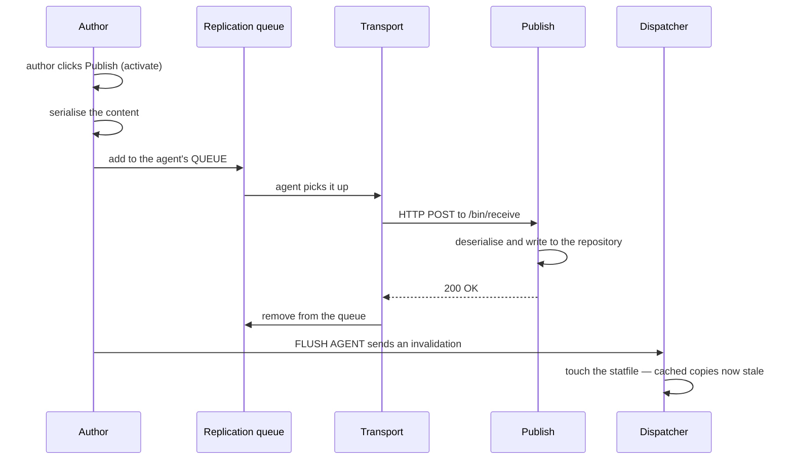
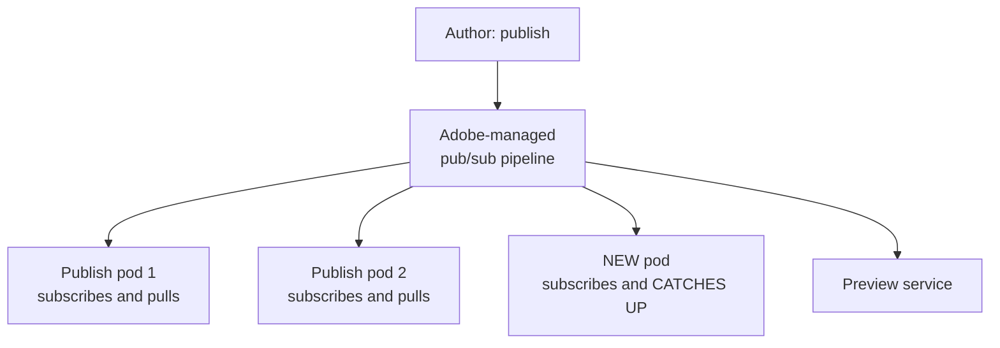
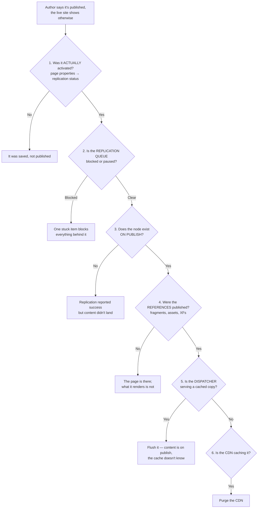

# 18 – Replication and Content Distribution

> **Target:** 3–4 years experienced AEM Developer
> **Syllabus point covered (27):** *"What is replication, and what are its uses?"*
> **Project domain:** a global energy technology company's marketing site.

---

## Before we start — this file closes a loop

This is the last of your 27 syllabus points, and it closes something that has run through the whole repository.

*"It works on author but not on publish"* has appeared in files 02, 04, 05, 08, 13, 15 and 16. Each time, one of the causes was **"was it actually published?"** — and each time I deferred the mechanism to this file.

This is that mechanism. And the reason it deserves its own file rather than a footnote is that **"was it published" has several distinct failure points**, and being able to walk them in order is the answer to the most common production question in AEM:

> **"The author says they published it and it's not on the live site."**

Section 3.3 is that walk. It's the single most reusable thing here.

There is also a genuine architectural shift to understand. On AEM 6.5 replication **pushes** to a known list of publish instances. On Cloud Service that model is impossible, because publish pods are created and destroyed by autoscaling — so it was replaced by a **publish/subscribe** model. Explaining *why* it had to change is a much better answer than knowing that it did.

---

## 1. Introduction

### 1.1 What replication is

> **Replication is how content moves between AEM instances — primarily from author to publish.**

Authors work on the author instance. Visitors see the publish instance. Nothing an author does is visible to the public until it has been **replicated**.

**"Activate" and "publish" are the same operation.** "Activate" is the technical term used in the API, the agents and the logs; "Publish" is what the button says. Knowing they're the same avoids a moment of confusion when an interviewer switches between them.

### 1.2 The four actions

| Action | What it does |
|---|---|
| **Activate** | Copy content to publish — "publish" |
| **Deactivate** | Remove it from publish — "unpublish" |
| **Delete** | Remove it from publish and author |
| **Test** | A connectivity check, sending nothing real |

**Deactivate versus delete** is worth being precise about: deactivating removes content from publish while leaving it on author, so it can be republished. Deleting removes it from both.

### 1.3 What it's used for — beyond the obvious

Your syllabus asks about uses, and the answer is broader than "publishing pages":

**Publishing content** — pages, assets, Content Fragments, Experience Fragments. Each is replicated independently, which is exactly the trap from files 15 and 16.

**Dispatcher cache invalidation** — a **flush agent** tells the dispatcher that content has changed, so it stops serving the cached copy. This is a replication agent too, and people often don't realise it.

**Unpublishing** — deactivation, for content that must come down.

**Reverse replication** — moving content created *on publish* back to author. Rare in modern AEM, but it exists.

**Triggering downstream work** — replication fires events (file 10), so other systems can react to something being published.

### 1.4 A real project example to adapt

> "We're on Cloud Service, so content moves through **Sling Content Distribution** rather than replication agents — the author publishes into a pipeline and publish pods subscribe and pull. That change was necessary rather than cosmetic: replication agents push to a configured list of publish instances, and on Cloud Service pods are created and destroyed by autoscaling, so the author can't know about a pod that doesn't exist yet. With pub/sub, a new pod subscribes and catches up on its own.
>
> From an author's point of view nothing changed — they still press Publish. What changed for us is monitoring: instead of watching an agent queue we look at Cloud Manager.
>
> The thing that still catches people is that **references publish separately**. Publishing a product page doesn't publish the Content Fragment it renders or the Experience Fragment in its header, and that's the most common cause of 'it works on author'."

That covers the mechanism, why it changed, the operational difference, and the recurring trap — four follow-ups pre-empted.

---

## 2. Core Concepts — AEM 6.5

### 2.1 How replication works on 6.5

The flow, which is worth knowing even if you're on Cloud Service, because interviewers ask and because it explains why the cloud model differs:



**Four things to draw out:**

**It's a queue.** Activation doesn't happen instantly; it's queued and processed. Which means it can back up, and one item can block the ones behind it.

**It's an HTTP POST to `/bin/receive`** on the publish instance, authenticated as a transport user. So it's a network operation with credentials — and both can fail.

**Publish confirms before the item leaves the queue.** If publish doesn't respond, the item stays.

**Dispatcher invalidation is separate.** A different agent, sending a different request. Content reaching publish and the dispatcher serving it are two different things — which is why a page can be on publish and still not visible.

### 2.2 Replication agents

**Agents are configured under `/etc/replication/agents.author` and `/etc/replication/agents.publish`.**

| Agent | Direction | Purpose |
|---|---|---|
| **Default (publish)** | Author → publish | The main one — content |
| **Flush** | Author → dispatcher | **Cache invalidation** |
| **Reverse** | Publish → author | Content created on publish |
| Static | — | Legacy, writes static files |

**The configuration tabs worth knowing:**

**Settings** — enabled, serialisation type, retry delay, the **agent user** (who the agent runs as on author, reading the content) and log level.

**Transport** — the **URI** (`http://publish-host:4503/bin/receive`), and the **user and password** it authenticates with on publish.

**Triggers** — including **"On Modification"**, which auto-replicates when content changes rather than waiting for an explicit publish.

**Two user identities, and confusing them is a real source of bugs:**

> **The agent user** reads the content on **author**. If it can't read something, that content isn't replicated.
>
> **The transport user** authenticates on **publish** and needs permission to write there.

A permissions failure on either side breaks replication, and the symptom differs — the first silently skips content, the second blocks the queue with a 401.

### 2.3 The flush agent and dispatcher invalidation

**This is the piece people forget**, and it explains a whole class of "I published it and it's still old."

When content is activated, a **flush agent** sends an invalidation request to the dispatcher. The dispatcher **touches its statfile** — a file called `.stat` — and any cached file older than that statfile is treated as stale and refetched on the next request.

**Note it doesn't delete anything.** Files stay on disk; they're simply outdated by comparison with the statfile.

**`statfileslevel`** controls how deep in the directory tree statfiles are maintained. A higher level means invalidation is more targeted; level 0 means one flush effectively invalidates everything.

**Which is why publishing one page can invalidate its siblings** — a statfile sits at a directory level, not per file. That's a good detail from file 01 arriving here with its mechanism.

### 2.4 Reverse replication

**Content created on publish** — form submissions, comments, user-generated content — sometimes needs to reach author.

**How it works:** publish maintains an **outbox**, and the author's reverse replication agent **polls** it and pulls content back.

**Note the direction of initiative.** Normal replication is author pushing to publish. Reverse replication is author *pulling* from publish — because publish shouldn't be able to initiate connections into the author tier, which sits behind a firewall.

**That firewall reasoning is the point worth making**, and it's why the design is asymmetric.

**In practice it's rare in modern AEM.** Form submissions typically go to an external system or a form service instead, which is simpler and doesn't couple your publish tier to your author tier.

### 2.5 Replication queues — where things go wrong

**The queue is where production problems show up.**

| Problem | Cause | Symptom |
|---|---|---|
| **Queue blocked** | Publish instance unreachable | Nothing publishes |
| **401 in the queue** | Wrong transport credentials | Nothing publishes |
| **One item stuck** | A very large payload timing out | **Everything behind it is blocked** |
| Queue paused | Someone paused it and forgot | Nothing publishes, no error |

**The head-of-line blocking point matters:** a single problematic item at the front of the queue stops everything behind it. So "nothing is publishing" often means "one thing failed," and clearing that item releases the rest.

**Testing an agent:** each agent has a test link that sends a test replication, which confirms connectivity and credentials without publishing anything real.

### 2.6 The replication API

For triggering replication from code:

```java
@Reference
private Replicator replicator;

Session session = resourceResolver.adaptTo(Session.class);
replicator.replicate(session, ReplicationActionType.ACTIVATE, path);
```

**`ReplicationActionType`:** `ACTIVATE`, `DEACTIVATE`, `DELETE`, `TEST`.

**Two things to say about doing this in code:**

**The session's user needs `crx:replicate`** — from file 13. Replication runs as somebody, and that somebody needs permission to publish.

**Bulk replication from code is dangerous.** Activating a thousand pages in a loop floods the queue and can effectively stall publishing for everything else. That belongs in a **Sling Job** with batching (file 10), not a tight loop.

### 2.7 References publish separately — the recurring trap

**This is the single most useful practical point in this file**, because it explains a symptom that has appeared in six earlier files.

**Publishing a page does not publish what the page references.**

| The page references | Which is a separate thing |
|---|---|
| An image in the DAM | An asset |
| A **Content Fragment** | An asset (file 15) |
| An **Experience Fragment** | A page (file 16) |
| A linked page | A page |

**AEM's publish dialog does show references and offers to include them.** But it's easy to skip, and **programmatic activation doesn't offer anything** — it publishes exactly what you tell it to.

**Why the design is right, even though it surprises people:** a Content Fragment might be referenced by fifty pages. Tying its publication to any one of them would be wrong. Each thing has its own lifecycle deliberately.

**And the failure is silent.** The page publishes successfully. The component that renders the missing fragment gets a null and renders nothing (file 05's `OPTIONAL` injection). No error anywhere.

---

## 3. Core Concepts — AEM as a Cloud Service

### 3.1 Why replication agents couldn't survive

**This is the explanation that makes the answer good rather than memorised.**

A replication agent has a **transport URI** — a specific publish instance to push to. On 6.5 you configure one agent per publish instance, because you know how many there are and where they live.

**On Cloud Service, neither is true.** Publish pods are created and destroyed by autoscaling. During a traffic spike new pods appear; afterwards they disappear.

**Two things break:**

**The author can't push to a pod that doesn't exist yet.** You can't configure an agent for it.

**A newly created pod has no content.** It needs to catch up on everything published so far, and nothing is going to re-push it.

**So the model had to invert:** instead of the author **pushing** to known instances, the author **publishes into a pipeline** and pods **subscribe and pull**.

### 3.2 Sling Content Distribution



**The key property:** a new pod subscribes and catches up **by itself**. Nothing has to know it exists in advance, which is exactly what autoscaling requires.

**What this changes for you:**

| | 6.5 | Cloud Service |
|---|---|---|
| Model | **Push** to known instances | **Publish/subscribe** |
| Configuration | Agents you manage | Adobe-managed |
| A new instance | Configure a new agent | **Subscribes automatically** |
| Monitoring | The agent queue page | **Cloud Manager** |
| Dispatcher invalidation | A flush agent you configure | Handled as part of distribution and CDN purge |
| The author's experience | Press Publish | **Identical** |

**That last row matters.** Authors see no difference — the button is the same. This is an infrastructure change, not a workflow one.

### 3.3 The Preview tier

Cloud Service adds a **Preview** service (file 14) — content can be distributed there separately, so authors see a genuine publish-like rendering without exposing it publicly.

---

## 3.4 "It's published and it's not live" — the diagnostic walk

**The most reusable thing in this file.** Six checks, in order, and the order matters because each one eliminates a layer.



**Why this order:** each step is cheaper to check than the next, and each eliminates a whole layer. Steps 1 and 5 are the two most common by a wide margin — *"it wasn't actually published"* and *"the cache doesn't know yet"*.

**And step 4 is the one that connects to every other file** — the references trap.

---

## 4. Important Interview Questions

### 4.1 Basic

**Q1. What is replication?**
The mechanism that moves content between AEM instances, primarily author to publish. Nothing an author does is visible publicly until it's replicated.

*Cross:* Is "activate" the same as "publish"? (**yes** — technical versus UI term) · What are the actions? · What else is it used for? (**dispatcher invalidation, via a flush agent**)

**Q2. What are the replication actions?**
Activate, deactivate, delete, and test. Deactivate removes from publish while leaving it on author; delete removes it from both.

*Cross:* When would you deactivate rather than delete? (content that may come back) · What does test do? (connectivity and credentials, publishing nothing)

**Q3. How does replication work on 6.5?**
The author serialises the content and puts it in the agent's **queue**. The agent POSTs it to `/bin/receive` on the publish instance as a transport user. Publish deserialises and writes it, confirms, and the item leaves the queue. Separately, a **flush agent** invalidates the dispatcher.

*Cross:* Why a queue? (it can back up, and one item can block others) · Where are agents configured? (`/etc/replication/agents.author`) · What's the flush agent for?

**Q4. What agent types are there?**
The default publish agent (author → publish), the **flush agent** (author → dispatcher, for cache invalidation), the reverse replication agent (publish → author), and the legacy static agent.

*Cross:* Which surprises people? (**the flush agent is a replication agent too**) · What's reverse replication for? · Which do you configure per publish instance? (the publish agent)

**Q5. What's the difference between the agent user and the transport user?**
The **agent user** reads the content on **author** — if it can't read something, that content isn't replicated. The **transport user** authenticates on **publish** and needs permission to write there.

*Cross:* What breaks with each? (silent skipping vs a 401 blocking the queue) · Which permission does the transport user need? (write, plus `crx:replicate` context) · Where are they configured? (Settings and Transport tabs)

**Q6. What is a flush agent?**
A replication agent that sends an invalidation request to the dispatcher when content is activated, so it stops serving the cached copy.

*Cross:* What does the dispatcher do with it? (**touches the statfile**) · Does it delete cached files? (**no** — they're outdated by comparison) · What's `statfileslevel`?

**Q7. What is reverse replication?**
Moving content created **on publish** — form submissions, comments — back to author. Publish maintains an outbox and the author **polls** it.

*Cross:* Why does the author pull rather than publish push? (**publish shouldn't initiate connections into the author tier**, which is behind a firewall) · Is it common? (**no** — an external system or form service is simpler) · What are the risks?

**Q8. How do you replicate from code?**
The `Replicator` service — `replicator.replicate(session, ReplicationActionType.ACTIVATE, path)`.

*Cross:* What permission does the session's user need? (**`crx:replicate`** — file 13) · What's the risk in a loop? (**flooding the queue and stalling publishing for everything else**) · What would you do instead? (Sling Jobs with batching — file 10)

**Q9. Does publishing a page publish its references?**
**No.** Assets, Content Fragments, Experience Fragments and linked pages are separate things with their own publication state. The publish dialog offers to include references, but it's easy to skip, and programmatic activation doesn't offer anything.

*Cross:* Why is that the right design? (**a fragment may be referenced by fifty pages**) · What's the symptom? (**the page publishes, the component renders nothing, no error**) · How do you find references? (the References panel)

**Q10. How does this work on Cloud Service?**
**Sling Content Distribution** over a pub/sub pipeline. The author publishes into the pipeline and publish pods subscribe and pull.

*Cross:* **Why did it have to change?** (pods are created and destroyed — the author can't push to what doesn't exist) · How does a new pod get content? (it subscribes and catches up) · Do authors notice? (**no**)

### 4.2 Intermediate

**Q11. Why couldn't replication agents work on Cloud Service?**
→ Section 3.1. An agent pushes to a **configured transport URI**. Publish pods are created and destroyed by autoscaling, so the author can't have an agent for a pod that doesn't exist, and a new pod has no content and nothing to re-push it. Pub/sub inverts it: pods subscribe and pull.

*Cross:* What's the key property of pub/sub here? (**a new pod catches up by itself**) · What changed for developers? (monitoring, not workflow) · What about the dispatcher? (invalidation is part of distribution and CDN purge)

**Q12. The replication queue is blocked. What do you do?**
Open the agent and read the error. Usual causes: the publish instance is unreachable; the transport credentials are wrong, giving a 401; or **one oversized item is stuck at the head and blocking everything behind it**. Clear the blocking item, fix the cause, restart the queue.

*Cross:* Why does one item block the rest? (**head-of-line blocking**) · So what does "nothing is publishing" often mean? (**one thing failed**) · How would you test the agent? (its test link)

**Q13. "I published it and it's not on the live site." Walk me through it.**
→ Section 3.4. Six checks in order: was it actually activated; is the queue blocked; does the node exist on publish; were the references published; is the dispatcher serving a cached copy; is the CDN.

*Cross:* Which two are most common? (**not actually published, and the cache**) · Why that order? (each is cheaper and eliminates a layer) · How do you check publish directly? (a private window against publish, bypassing the dispatcher)

**Q14. What's the statfile and how does invalidation work?**
The dispatcher touches a `.stat` file on invalidation. Any cached file older than the statfile is treated as stale and refetched — files aren't deleted, they're outdated by comparison. `statfileslevel` controls how deep statfiles are maintained, so it controls how targeted invalidation is.

*Cross:* Why does publishing one page invalidate siblings? (**the statfile is at a directory level**) · How do you make it more targeted? (raise `statfileslevel`) · What's the trade-off? (more statfiles to maintain)

**Q15. How do you publish a lot of content safely?**
Not in a loop. Tree activation for a subtree, with the "only modified" option so you're not republishing everything unnecessarily. From code, **Sling Jobs with batching** (file 10) rather than a tight loop, because flooding the queue stalls publishing for everyone.

*Cross:* What happens if you flood it? (**normal publishing stops** while it drains) · When would you do it? (out of hours) · What about the dispatcher? (**a large activation means a large flush** and a re-render burst)

**Q16. What permission is needed to publish?**
`crx:replicate` — AEM's own privilege, from file 13. It's what separates "can edit" from "can publish," and on most projects those are deliberately different groups.

*Cross:* Why separate them? (publishing is a business decision with different accountability) · Where does it go? (a publishing group) · What if an author lacks it? (**Request for Activation** — a workflow, file 09)

**Q17. What happens when you deactivate?**
The content is removed from publish while remaining on author, and the dispatcher is invalidated so it stops serving the cached copy.

*Cross:* What if the flush fails? (**the page is gone from publish but still cached and served** — a genuinely bad case) · How would you verify? (check publish directly, then through the dispatcher) · Difference from delete?

**Q18. Does replication fire events?**
Yes — `ReplicationAction.EVENT_TOPIC` (file 10). That's how you react to something being published, for instance invalidating a derived cache.

*Cross:* What should the handler do? (**almost nothing** — dispatch a job, since it runs on the event thread) · What's the difference from a resource change event? (**saved versus published**) · What's a real use? (invalidating a derived listing — file 02)

### 4.3 Advanced

**Q19. Design a safe process for publishing a large content migration.**

> "The main risk is that a bulk activation floods the replication queue and stalls normal publishing for everyone else, and then triggers a cache flush large enough to cause a re-render burst on publish.
>
> So: **batch it**, through Sling Jobs rather than a loop, with the queue concurrency capped so it processes steadily rather than as fast as it can. **Out of hours**, because both the replication load and the subsequent cache misses hit publish.
>
> **Publish references first** — assets and fragments before the pages that render them. Otherwise pages go live rendering nothing, which is worse than not being live at all.
>
> **Monitor the queue**, because queue depth is the leading indicator — it climbs long before anything visibly breaks, the same principle as workflow instances in file 09.
>
> And **plan the dispatcher impact**. A large activation invalidates a lot, so a grace period helps — stale content is served briefly rather than every request stampeding publish at once.
>
> On Cloud Service the queue mechanics differ, but the shape is the same: batch, throttle, references first, out of hours."

*Cross:* How would you verify it worked? (sample checks on publish directly, not through the dispatcher) · What's the rollback? (deactivation, which has the same volume problem) · How long would you allow?

**Q20. How do you handle a derived cache that goes stale when content publishes?**

This is the thread running through files 02, 15, 16 and 17, and the answer is the same shape each time.

> "Publishing content invalidates the page that content is on. It does **not** invalidate anything **derived** from it — a listing built from the page tree, a cached GraphQL response, a page that includes an Experience Fragment, cached `.model.json`.
>
> So you need a **replication event handler** that reacts to activation and invalidates the derived output. And that handler must do almost nothing itself — a cheap relevance check, then dispatch a Sling Job — because it runs on the event dispatch thread, and during a bulk publish there could be hundreds of events (file 10).
>
> The general principle is: **anything cached that's derived from content needs an explicit invalidation relationship.** Nothing creates that connection for you."

*Cross:* Give three examples of derived output · Why a job rather than doing it inline? · What if the flush itself fails? (retry — which is another argument for a job)

**Q21. What are the security considerations around replication?**

> "Several.
>
> **`crx:replicate` should be a separate group** from editing, because publishing is a business decision with different accountability — and it gives you a natural place to attach an approval workflow.
>
> **The transport user should be dedicated and minimally privileged.** It needs to write on publish and nothing else. It's a credential that exists on the author instance and can reach publish, so it deserves care.
>
> **The agent user matters too** — it reads content on author, so if it's over-privileged it can replicate things it shouldn't, and if it's under-privileged content silently doesn't replicate.
>
> **`/bin/receive` must not be publicly reachable.** It's the endpoint that accepts content, so the dispatcher should never allow it from outside.
>
> And **deactivation needs to actually work**. If a page is removed from publish but the flush fails, it's gone from the repository and still being served from cache — which for content that had to come down for legal or regulatory reasons is a serious problem, not an inconvenience."

*Cross:* How would you verify a deactivation? (**check through the dispatcher, not just publish**) · What's the risk of a shared transport user? · How does this change on Cloud Service? (Adobe manages the transport; `crx:replicate` still applies)

---

## 5. Cross Questions — how this topic gets drilled

**Thread A — from "what is replication"**
What are the actions? → How does it work on 6.5? → What's the queue? → What's in an agent config? → Agent user vs transport user? → What breaks with each?

**Thread B — from "it's published and not live"** *(the important one)*
What would you check first? → Then? → How do you check publish directly? → What about references? → What about the dispatcher? → The CDN? → **Which two are most common?**

**Thread C — from "how does Cloud Service differ"**
What replaced agents? → **Why did it have to change?** → How does a new pod get content? → What changed for authors? → For developers? → What about dispatcher invalidation?

**Thread D — from "references"**
Does publishing a page publish them? → What kinds? → **Why is that the right design?** → What's the symptom when they're missing? → Why is it silent? → How do you find them?

---

## 6. Best Interview Answers

### 6.1 "What is replication and what is it used for?" — about 90 seconds

**Your syllabus point 27.**

> "Replication is how content moves between AEM instances, primarily author to publish. Authors work on author, visitors see publish, and nothing is public until it's replicated. 'Activate' and 'publish' are the same operation — one's the technical term, one's what the button says.
>
> The actions are activate, deactivate, delete and test. Deactivate removes content from publish while leaving it on author, so it can come back; delete removes it from both.
>
> On 6.5 the mechanism is a **queue**. The author serialises the content, puts it in a replication agent's queue, and the agent POSTs it to `/bin/receive` on the publish instance as a transport user. Publish writes it and confirms, then the item leaves the queue. That queue is where production problems show up — if publish is unreachable or the credentials are wrong, it blocks, and one oversized item stuck at the head blocks everything behind it.
>
> Beyond publishing pages, the uses that people forget: **dispatcher cache invalidation** is a replication agent too — a flush agent tells the dispatcher content has changed so it stops serving the cached copy. **Reverse replication** brings content created on publish back to author, though that's rare now. And replication **fires events**, so other systems can react to something being published.
>
> On Cloud Service it's **Sling Content Distribution** instead — pub/sub rather than push. That change was necessary rather than cosmetic, because replication agents push to a configured list of publish instances and Cloud Service pods are created and destroyed by autoscaling. The author can't push to a pod that doesn't exist, and a new pod has no content. With pub/sub, the author publishes into a pipeline and pods subscribe and catch up on their own."

### 6.2 "The author says they published it and it's not live" — about 75 seconds

**The most useful answer in this file.**

> "Six checks, in order, because each one is cheaper than the next and eliminates a whole layer.
>
> **One — was it actually activated?** Page properties show the replication status. Surprisingly often it was saved rather than published, or published to preview rather than publish.
>
> **Two — is the replication queue blocked?** If publish was unreachable or the credentials are wrong, nothing is going through. And one stuck item blocks everything behind it, so 'nothing is publishing' often means 'one thing failed'.
>
> **Three — does the node actually exist on publish?** I'd check publish directly rather than through the dispatcher, in a private window, because that separates a content problem from a caching one.
>
> **Four — were the references published?** This is the one that catches people. Publishing a page doesn't publish the Content Fragment it renders, the Experience Fragment in its header, or the images in the DAM. The page publishes fine, the component gets a null and renders nothing, and there's **no error anywhere**.
>
> **Five — is the dispatcher serving a cached copy?** Content can be on publish while the cache doesn't know. That means the flush didn't happen or didn't reach it.
>
> **Six — is the CDN caching it?** Same problem one layer out, and flushing the dispatcher doesn't help.
>
> In practice steps one and five account for most cases — it wasn't actually published, or the cache doesn't know yet."

### 6.3 "Why did replication change on Cloud Service?" — about 45 seconds

> "Because the push model becomes impossible when you don't know how many publish instances there are.
>
> A replication agent has a **transport URI** — a specific publish instance it pushes to. On 6.5 you configure one agent per publish instance, which works because you know how many there are and where they live.
>
> On Cloud Service, publish pods are **created and destroyed by autoscaling**. So two things break. The author can't push to a pod that doesn't exist yet — you can't configure an agent for it. And a newly created pod has **no content**, and nothing is going to re-push everything that was published before it existed.
>
> So the model inverts. Instead of the author pushing to known instances, the author **publishes into a pipeline** and pods **subscribe and pull**. A new pod subscribes and catches up by itself, which is exactly what autoscaling requires.
>
> For authors nothing changed — they still press Publish. What changed for us is monitoring: instead of an agent queue page, it's Cloud Manager."

---

## 7. Real Project Examples

### Story 1 — One stuck item stopped all publishing

**What happened.** Authors reported that nothing was publishing. Pages showed as activated on author and none of the changes reached the live site. This had apparently started sometime the previous evening.

**The cause.** A single very large asset had been activated the night before and its transfer had timed out. It sat at the head of the replication queue, retrying, and **everything queued behind it was blocked**.

**Why it looked like a total outage.** From an author's point of view, publishing was completely broken — every page they published simply didn't appear. The actual failure was one item.

**The fix.** Cleared the blocking item, and the queue drained rapidly — everything behind it published within minutes.

**What we changed.** Added monitoring on **queue depth** rather than only on errors. Queue depth is a leading indicator: it climbs steadily long before anyone notices anything, so an alert on it would have caught this overnight rather than at nine the next morning. Same principle as workflow instance counts in file 09.

**The lesson to state:** *"'Nothing is publishing' usually means 'one thing failed'. Head-of-line blocking means a single stuck item looks like a total outage, so I check the head of the queue before assuming anything systemic."*

### Story 2 — The page that published and rendered nothing

**What happened.** A new product page was published. It appeared on the live site with its header and footer, and the entire main content area was empty.

**The cause.** The page's content came from **Content Fragments**, and the fragments had never been activated. The team published the page, reasonably assuming that publishing a page publishes what it shows.

**Why it's silent.** The page published successfully — no error, correct replication status. On publish, the component's Sling Model resolved the fragment path, `adaptTo` returned null because the resource didn't exist there, and the model's `isReady()` returned false, so it rendered nothing. That's `OPTIONAL` injection from file 05 working exactly as designed, and being completely unhelpful.

**Why the design is right anyway.** A Content Fragment may be referenced by fifty pages. Tying its publication to any one of them would be wrong — each thing has its own lifecycle deliberately.

**What we changed.** Two things. **A warn-level log** when a referenced fragment doesn't resolve, so absence becomes a signal rather than silence. And a **pre-publish checklist** for content teams covering references — fragments, experience fragments, assets — because the publish dialog does offer to include them and it's genuinely easy to click past.

**The lesson:** *"A component rendering nothing is correct behaviour and terrible debugging. If content can be legitimately absent, something has to say so."*

### Story 3 — The deactivation that didn't take effect

**What happened.** A product page had to be taken down for a compliance reason. An author deactivated it, confirmed it was gone from publish, and reported it done. It was still being served to visitors.

**The cause.** The deactivation removed the page from publish, but the **dispatcher flush didn't take effect**, so the cached HTML was still being served from disk. The page was genuinely gone from the repository and still perfectly visible on the internet.

**Why it was verified wrongly.** The author checked the publish instance directly and correctly saw the page was gone. Nobody checked **through the dispatcher**, which is what visitors actually hit.

**Why this one mattered more than a stale page.** Content that has to come down for a compliance or legal reason has to actually come down. "It's removed from the repository" is not the same as "it's not being served," and only the second one counts.

**What we changed.** Deactivation verification now means checking **through the dispatcher and the CDN**, from outside, in a private window — the path a visitor takes. And for anything compliance-driven, an explicit CDN purge rather than relying on the invalidation chain.

**The lesson to state:** *"For a takedown, verify the way a visitor sees it, not the way the system sees it. Those are different questions, and only one of them is the one you were asked."*

---

## 8. Configuration and Code

### 8.1 A replication agent (6.5)

`/etc/replication/agents.author/publish/jcr:content`

```xml
<?xml version="1.0" encoding="UTF-8"?>
<jcr:root xmlns:jcr="http://www.jcp.org/jcr/1.0"
          xmlns:cq="http://www.day.com/jcr/cq/1.0"
    jcr:primaryType="nt:unstructured"
    jcr:title="Default Agent"
    sling:resourceType="cq/replication/components/agent"
    enabled="{Boolean}true"

    <!-- THE AGENT USER: reads content on AUTHOR.
         If it cannot read something, that content is silently NOT
         replicated. Under-privileging here fails quietly. -->
    userId="replication-agent-user"

    <!-- THE TRANSPORT: where to POST, and who to authenticate as
         on PUBLISH. This user needs to WRITE there.
         Wrong credentials → 401 → the QUEUE BLOCKS. -->
    transportUri="http://publish-host:4503/bin/receive?sling:authRequestLogin=1"
    transportUser="replication-receiver"
    transportPassword="{encrypted}"

    <!-- Triggers. "On Modification" would auto-replicate on every
         save, which is rarely what you want -- it publishes
         half-finished edits. -->
    triggerModified="{Boolean}false"
    triggerDistribute="{Boolean}false"
    triggerOnOffTime="{Boolean}true"

    retryDelay="{Long}60000"
    logLevel="info"

    serializationType="durbo"/>
```

**The two user identities are the thing to be able to explain.** The `userId` reads on author; the `transportUser` writes on publish. They fail differently — the first silently skips content, the second blocks the queue with a 401.

### 8.2 A flush agent

`/etc/replication/agents.author/flush/jcr:content`

```xml
<?xml version="1.0" encoding="UTF-8"?>
<jcr:root jcr:primaryType="nt:unstructured"
    jcr:title="Dispatcher Flush"
    sling:resourceType="cq/replication/components/agent"
    enabled="{Boolean}true"

    <!-- Points at the DISPATCHER, not at publish.
         This is how the dispatcher learns that content changed --
         it touches its statfile, and any cached file older than
         the statfile is treated as stale. Files are NOT deleted;
         they are outdated by comparison. -->
    transportUri="http://dispatcher-host/dispatcher/invalidate.cache"

    serializationType="flush"
    protocolHTTPMethod="GET"
    protocolHTTPHeaders="[CQ-Action:{action},CQ-Handle:{path},CQ-Path:{path}]"/>
```

**The point worth making:** the flush agent is a **replication agent**, which surprises people. Content reaching publish and the dispatcher knowing about it are two separate operations, and this is the second one.

### 8.3 Replicating from code

```java
package com.energy.core.services.impl;

import com.day.cq.replication.ReplicationActionType;
import com.day.cq.replication.ReplicationException;
import com.day.cq.replication.Replicator;
import org.apache.sling.api.resource.ResourceResolver;
import org.osgi.service.component.annotations.Component;
import org.osgi.service.component.annotations.Reference;
import org.slf4j.Logger;
import org.slf4j.LoggerFactory;

import javax.jcr.Session;
import java.util.List;

@Component(service = PublishService.class)
public class PublishServiceImpl implements PublishService {

    private static final Logger LOG = LoggerFactory.getLogger(PublishServiceImpl.class);

    @Reference
    private Replicator replicator;

    @Override
    public void publish(ResourceResolver resolver, String path) {
        Session session = resolver.adaptTo(Session.class);
        if (session == null) {
            return;
        }
        try {
            // The session's USER needs crx:replicate (file 13).
            // A service user doing this needs it granted explicitly.
            replicator.replicate(session, ReplicationActionType.ACTIVATE, path);

        } catch (ReplicationException e) {
            LOG.error("Failed to activate {}", path, e);
        }
    }

    /**
     * DO NOT do this for large volumes.
     *
     * Activating hundreds of paths in a loop floods the replication
     * queue, which stalls publishing FOR EVERYONE ELSE while it
     * drains -- and then triggers a cache flush large enough to cause
     * a re-render burst on publish.
     *
     * For bulk work: Sling Jobs with batching and capped queue
     * concurrency (file 10), run out of hours, REFERENCES FIRST.
     */
    @Override
    public void publishMany(ResourceResolver resolver, List<String> paths) {
        throw new UnsupportedOperationException(
                "Use the batched job-based publisher — see BulkPublishJobConsumer");
    }
}
```

### 8.4 Reacting to a publish event

From file 10, and it's the answer to the derived-cache problem:

```java
@Component(service = EventHandler.class,
           property = { EventConstants.EVENT_TOPIC + "=" + ReplicationAction.EVENT_TOPIC })
public class ProductPublishHandler implements EventHandler {

    @Reference
    private JobManager jobManager;

    @Override
    public void handleEvent(Event event) {
        ReplicationAction action = ReplicationAction.fromEvent(event);
        if (action == null || action.getType() != ReplicationActionType.ACTIVATE) {
            return;
        }

        String path = action.getPath();
        if (path == null || !path.startsWith("/content/energy")) {
            return;
        }

        // DECIDE here, DO in the job.
        //
        // This runs SYNCHRONOUSLY on the event dispatch thread. During
        // a bulk publish there may be hundreds of these, so anything
        // slow here blocks event processing globally (file 10).
        //
        // Invalidating a derived listing may mean an HTTP call to the
        // dispatcher -- absolutely not on this thread.
        Map<String, Object> props = new HashMap<>();
        props.put("path", path);
        jobManager.addJob("energy/listing/invalidate", props);
    }
}
```

**Why this exists at all:** publishing content invalidates the page it's on. It does **not** invalidate anything **derived** from it — a listing built from the page tree, a cached GraphQL response, a page that includes an Experience Fragment. That connection has to be made explicitly, and nothing makes it for you.

---

## 9. Common Mistakes

| The mistake | What happens | The fix |
|---|---|---|
| Assuming a page publishes its references | **The page is live and renders nothing** | Include references; check the References panel |
| Not logging a missing reference | Silent absence, nothing to debug | Warn when a referenced resource doesn't resolve |
| Not checking the head of the queue | "Nothing publishes" looks systemic | **One stuck item blocks everything** |
| Monitoring only errors, not queue depth | You find out hours later | Alert on depth — it's the leading indicator |
| Verifying a takedown on publish only | **Removed from the repository, still served from cache** | Verify through the dispatcher and CDN |
| Bulk activation in a loop | Floods the queue; stalls publishing for everyone | Sling Jobs, batched, capped, out of hours |
| Publishing pages before their references | Pages go live rendering nothing | **References first** |
| `triggerModified` enabled | Every save publishes, including half-finished edits | Leave it off |
| Over-privileged transport user | A credential on author that can do too much on publish | Dedicated, minimal |
| Under-privileged agent user | Content **silently** not replicated | Ensure it can read what it must |
| `/bin/receive` reachable publicly | The endpoint that accepts content is exposed | Block it at the dispatcher |
| Expecting a flush to delete cached files | It doesn't — it **outdates** them via the statfile | Understand the statfile model |
| No invalidation for derived output | Listings, GraphQL responses, `.model.json` go stale | A replication event handler dispatching a job |
| Heavy work in a replication event handler | Blocks the event thread during a bulk publish | Cheap check, then a job |
| `crx:replicate` bundled with editing | Pages go live without review | A separate publishing group (file 13) |

---

## 10. Best Practices

**On publishing.** References first, then pages. Use the publish dialog's reference list rather than clicking past it. Keep `crx:replicate` in a separate group from editing.

**On bulk.** Never a loop. Batched Sling Jobs with capped concurrency, out of hours, and plan for the cache flush that follows.

**On monitoring.** Alert on **queue depth**, not just errors — it rises long before anything visibly breaks.

**On verification.** Check the way a visitor sees it — through the dispatcher and CDN — not just on publish. Especially for takedowns.

**On derived content.** Anything cached that's derived from content needs an explicit invalidation relationship. A replication event handler that dispatches a job, never doing the work inline.

**On security.** A dedicated, minimally-privileged transport user. `/bin/receive` blocked from outside. And an agent user that can read everything it needs, because under-privileging there fails silently.

---

## 11. Debugging Tips

**The six-step walk from section 3.4 is the main tool.** Was it activated → is the queue blocked → does the node exist on publish → were references published → is the dispatcher caching it → is the CDN.

**The key technique** is checking **publish directly**, in a private window, bypassing the dispatcher. That single move separates a content problem from a caching problem, which otherwise present identically. It's the same technique as files 04, 13 and 15 — the recurring diagnostic in this repository.

**Where to look:**

| Where | Tells you |
|---|---|
| Page properties → replication status | Was it activated, when, by whom |
| The agent's queue page | Blocked, paused, or what's stuck at the head |
| The agent's test link | Connectivity and credentials, publishing nothing |
| `error.log` on author | `ReplicationException` |
| A private window on publish directly | Is the content genuinely there |
| `dispatcher.log` | Did the invalidation arrive |
| The References panel | What else needs publishing |
| Cloud Manager | Distribution status on Cloud Service |

**A habit worth describing:** *"When content isn't live, my first question is always 'is this a content problem or a cache problem?' — and hitting publish directly answers it in one step. Everything after that is much more targeted."*

---

## 12. Performance Notes

**Replication is queued, so it's throughput-limited.** Flooding the queue doesn't make it faster; it makes everything else wait.

**Large binaries are the usual cause of a stuck queue** — a transfer that times out and retries at the head.

**A large activation means a large flush**, and a large flush means a re-render burst on publish as caches refill. A dispatcher grace period helps, serving stale content briefly rather than every request stampeding at once.

**Replication runs on author**, so bulk work competes with authoring. Out of hours for anything substantial.

**Queue depth is the metric to watch**, for the same reason as workflow instance counts in file 09 — it's a leading indicator that rises before anything visibly fails.

---

## 13. Real Production Scenarios

**1. Nothing is publishing.** One stuck item at the head of the queue blocking everything behind it.

**2. Queue blocked with a 401.** Wrong transport credentials.

**3. Queue blocked, publish unreachable.** Network or the instance is down.

**4. Page published but not on publish.** Check the queue before assuming anything else.

**5. Page on publish but the live site is stale.** Dispatcher cache — the flush didn't happen or didn't arrive.

**6. Still stale after flushing the dispatcher.** The CDN, one layer out.

**7. Page live but renders nothing.** **References weren't published** — fragments, assets, experience fragments.

**8. Deactivated and still being served.** The flush didn't take effect. Serious for a compliance takedown.

**9. A derived listing shows old content.** Nothing invalidates derived output automatically.

**10. Cached GraphQL or `.model.json` is stale.** Same cause, different output.

**11. Bulk publish stalled everything.** A loop instead of batched jobs.

**12. Publishing spiked publish CPU.** A large flush and the resulting re-render burst.

**13. Some content silently never replicates.** The **agent user** can't read it on author.

**14. Every author save appears on publish.** `triggerModified` is enabled.

**15. Authors can't publish at all.** They lack `crx:replicate` — which may be intentional, with Request for Activation as the route (file 09).

**16. A new publish pod serves stale content briefly.** On Cloud Service, it's subscribing and catching up.

---

## 14. Comparison Tables

**6.5 replication vs Cloud Service distribution**

| | **6.5 replication** | **Cloud Service distribution** |
|---|---|---|
| Model | **Push** to known instances | **Publish / subscribe** |
| Mechanism | Agent POSTs to `/bin/receive` | Adobe-managed pipeline |
| Configuration | Agents you manage | Adobe-managed |
| A new instance | Configure an agent | **Subscribes and catches up** |
| Why it changed | — | **Pods are created and destroyed** |
| Monitoring | The agent queue page | Cloud Manager |
| Dispatcher invalidation | A flush agent | Part of distribution and CDN purge |
| Author experience | Press Publish | **Identical** |

**Agent types**

| Agent | Direction | Purpose |
|---|---|---|
| Default (publish) | Author → publish | Content |
| **Flush** | Author → dispatcher | **Cache invalidation** |
| Reverse | Publish → author (**pulled**) | Content created on publish |
| Static | — | Legacy |

**The two users**

| | Agent user | Transport user |
|---|---|---|
| Runs on | **Author** | Authenticates on **publish** |
| Needs | **Read** what's being replicated | **Write** on publish |
| Failure | **Silent** — content skipped | **401** — the queue blocks |

**Replication actions**

| Action | Effect |
|---|---|
| Activate | Content → publish |
| Deactivate | Removed from publish, **stays on author** |
| Delete | Removed from **both** |
| Test | Connectivity only |

**What publishes separately**

| Referenced thing | Separate? |
|---|---|
| DAM assets | **Yes** |
| Content Fragments | **Yes** (file 15) |
| Experience Fragments | **Yes** (file 16) |
| Linked pages | **Yes** |

---

## 15. Memory Tricks

**The terms:** *"Activate is publish. Same thing, different word."*

**The queue:** *"One stuck item blocks everything behind it."*

**The two users:** *"Agent reads on author. Transport writes on publish."*

**References:** *"Publishing a page publishes the page. Nothing else."*

**The failure:** *"The page publishes, the component renders nothing, and nothing errors."*

**The cache:** *"On publish isn't the same as being served."*

**Takedowns:** *"Verify the way a visitor sees it."*

**Cloud Service:** *"You can't push to a pod that doesn't exist yet."*

**Statfiles:** *"A flush outdates; it doesn't delete."*

**Derived content:** *"Nothing invalidates what you derived from it."*

---

## 16. Revision Notes

- **Replication** moves content between instances, primarily **author → publish**. **"Activate" and "publish" are the same thing.**
- **Actions:** activate · **deactivate** (off publish, stays on author) · **delete** (both) · test.
- **6.5 flow:** serialise → **queue** → agent POSTs to **`/bin/receive`** on publish as the **transport user** → publish writes and confirms → item leaves the queue. Separately, a **flush agent** invalidates the dispatcher.
- **Agents** live at `/etc/replication/agents.author`. Types: **default/publish** · **flush** (author → dispatcher — *it's a replication agent too*) · **reverse** (publish → author, **pulled** because publish must not initiate into author) · static (legacy).
- **Two users:** the **agent user** reads on **author** (under-privileged = **silent skipping**); the **transport user** writes on **publish** (wrong = **401, queue blocks**).
- **Queues block**, and there is **head-of-line blocking** — one stuck item stops everything behind it. So *"nothing is publishing"* usually means *"one thing failed."* **Monitor queue depth**, not just errors.
- **Flush agent → dispatcher touches the statfile.** Cached files older than the statfile are **stale** — nothing is deleted. **`statfileslevel`** controls granularity, which is why publishing one page can invalidate siblings.
- **Publishing a page does NOT publish its references** — assets, **Content Fragments**, **Experience Fragments**, linked pages. Right design (a fragment may serve fifty pages), but the failure is **silent**: the page publishes, the component gets null, renders nothing, no error.
- **From code:** `Replicator.replicate(session, ReplicationActionType.ACTIVATE, path)`. The session's user needs **`crx:replicate`**. **Never in a loop** — batched Sling Jobs, out of hours, references first.
- **Replication fires events** (`ReplicationAction.EVENT_TOPIC`). Handlers run **synchronously** — decide there, dispatch a job.
- **Derived output isn't invalidated automatically** — listings, GraphQL responses, `.model.json`, pages including an XF. That relationship must be built.
- **CLOUD SERVICE: Sling Content Distribution**, pub/sub. **Why it had to change:** agents push to a configured transport URI, and pods are **created and destroyed** by autoscaling — the author can't push to a pod that doesn't exist, and a new pod has no content. Pods **subscribe and catch up**. Authors notice nothing; monitoring moves to Cloud Manager.
- **THE SIX-STEP WALK:** activated? → queue blocked? → node on publish? → **references published?** → dispatcher cached? → CDN? *(Steps 1 and 5 are most common.)*
- **Verify a takedown through the dispatcher**, not on publish — "gone from the repository" is not "not being served."

---

## 17. Cheat Sheet

**Actions**
```
ACTIVATE    → publish
DEACTIVATE  → remove from publish, KEEP on author
DELETE      → remove from BOTH
TEST        → connectivity only
```

**Agents**
```
/etc/replication/agents.author/
    publish   author → publish        (content)
    flush     author → dispatcher     (CACHE INVALIDATION)
    reverse   publish → author        (polled by author)

Settings tab   → enabled, AGENT USER (reads on author), retry, log level
Transport tab  → URI /bin/receive, TRANSPORT USER (writes on publish)
Triggers tab   → On Modification (leave OFF), On Off Time
```

**The two users**
```
Agent user      reads on AUTHOR    → under-privileged = SILENT skipping
Transport user  writes on PUBLISH  → wrong = 401, QUEUE BLOCKS
```

**From code**
```java
@Reference private Replicator replicator;
Session session = resolver.adaptTo(Session.class);
replicator.replicate(session, ReplicationActionType.ACTIVATE, path);
// user needs crx:replicate
// NEVER in a loop → batched Sling Jobs, out of hours, REFERENCES FIRST
```

**Events**
```java
ReplicationAction.EVENT_TOPIC
ReplicationAction.fromEvent(event).getType() == ACTIVATE
// runs SYNCHRONOUSLY — decide here, dispatch a job
```

**Cloud Service**
```
Sling Content Distribution — PUB/SUB
Author publishes to a pipeline; pods SUBSCRIBE and PULL.
A new pod catches up BY ITSELF.

Why: agents push to a CONFIGURED URI; pods are created and
destroyed, so you can't configure an agent for one that
doesn't exist yet — and a new pod has no content.
```

**THE SIX-STEP WALK**
```
1. Was it ACTIVATED?          page properties → replication status
2. Is the QUEUE blocked?      one stuck item blocks the rest
3. Node on PUBLISH?           private window, publish DIRECTLY
4. REFERENCES published?      fragments, assets, XFs  ← the silent one
5. DISPATCHER cached?         flush didn't happen / didn't arrive
6. CDN cached?                one layer further out

Most common: 1 and 5.
```

---

## 18. Frequently Forgotten Things

1. **"Activate" and "publish" are the same operation.**
2. **Publishing a page does NOT publish its references.**
3. **That failure is silent** — the page publishes and the component renders nothing.
4. **One stuck queue item blocks everything behind it.**
5. **Queue depth is the leading indicator**, not error count.
6. **The flush agent is a replication agent too.**
7. **A flush outdates cached files; it doesn't delete them.**
8. **Agent user reads on author; transport user writes on publish** — different failures.
9. **An under-privileged agent user fails silently.**
10. **Deactivate keeps it on author; delete doesn't.**
11. **"Gone from publish" is not "not being served"** — verify through the dispatcher.
12. **Reverse replication is polled by author**, because publish must not initiate into author.
13. **Bulk activation in a loop stalls publishing for everyone.**
14. **`crx:replicate` is the permission** (file 13).
15. **Replication events run synchronously** — dispatch a job (file 10).
16. **Derived output isn't invalidated automatically.**
17. **On Cloud Service the author can't push to a pod that doesn't exist yet.**

---

## 19. Final Interview Summary

**1. What it is.** How content moves between instances. Activate and publish are the same thing.

**2. The actions.** Activate, deactivate, delete, test — and deactivate keeps it on author.

**3. The 6.5 mechanism.** Queue, agent, POST to `/bin/receive`, transport user, confirm, dequeue.

**4. The agents.** Publish, **flush** (cache invalidation), reverse, static.

**5. The two users.** Agent reads on author; transport writes on publish. They fail differently.

**6. Queues block**, with head-of-line blocking. Monitor depth.

**7. References publish separately** — and the failure is silent.

**8. Cloud Service.** Pub/sub, because you can't push to a pod that doesn't exist yet.

**9. The six-step walk.** Activated → queue → publish → references → dispatcher → CDN.

**10. Verify like a visitor.** Especially for takedowns.

---

## 20. Mock Interview

**How to use this:** cover the answers, 20-minute timer, speak every answer out loud.

### The interviewer asks:

1. **What is replication and what is it used for?**
2. What are the replication actions?
3. **How does replication work on AEM 6.5?**
4. What agent types are there?
5. What's the difference between the agent user and the transport user?
6. What is a flush agent, and what does the dispatcher do with it?
7. What is reverse replication, and why does the author pull rather than publish push?
8. **Does publishing a page publish its references?**
9. **The author says they published it and it's not live. Walk me through it.**
10. The replication queue is blocked. What do you do?
11. **Why did replication change on Cloud Service?**
12. How does a new publish pod get content?
13. How do you replicate from code, and what permission is needed?
14. How would you publish a large migration safely?
15. **A page was deactivated and is still being served. What happened?**

### Model answers

**1.** *(The 6.1 answer — what it is, activate equals publish, the actions, the 6.5 queue mechanism, the uses beyond pages including flush agents and events, and the Cloud Service shift with its reason.)*

**2.** Activate, deactivate, delete and test. The distinction worth making is **deactivate versus delete**: deactivating removes content from publish while leaving it on author, so it can be republished; deleting removes it from both. Test just checks connectivity and credentials without publishing anything real.

**3.** The author serialises the content and puts it in a replication agent's **queue**. The agent picks it up and POSTs it to `/bin/receive` on the publish instance, authenticating as the transport user. Publish deserialises it, writes it to its repository, and responds — and only then does the item leave the queue. Separately, a **flush agent** sends an invalidation to the dispatcher so it stops serving the cached copy. The queue part matters, because that's where problems show up: it can block, and one item can block everything behind it.

**4.** The **default publish agent** for author to publish. The **flush agent**, which sends invalidations to the dispatcher — and that's the one that surprises people, because cache invalidation is a replication agent too. The **reverse replication agent**, publish to author. And the legacy **static agent**, which wrote files to disk and isn't used now.

**5.** They operate on different instances and fail differently. The **agent user** runs on **author** and reads the content being replicated — so if it can't read something, that content is **silently not replicated**, which is a nasty failure because nothing reports it. The **transport user** authenticates on **publish** and needs permission to write there — so wrong credentials give a **401 and the queue blocks**, which is at least visible. Confusing the two is a real source of bugs.

**6.** A replication agent pointing at the dispatcher rather than at publish. When content is activated it sends an invalidation, and the dispatcher **touches its statfile** — a `.stat` file. Any cached file older than the statfile is treated as stale and refetched on the next request. Worth being precise: it doesn't **delete** anything, it outdates by comparison. And `statfileslevel` controls how deep statfiles are maintained, which is why publishing one page can appear to invalidate its siblings — the statfile sits at a directory level, not per file.

**7.** It moves content created **on publish** — form submissions, comments, user-generated content — back to author. The mechanism is that publish maintains an **outbox** and the author's reverse replication agent **polls** it. The direction of initiative is the interesting part: normal replication is author pushing to publish, but reverse replication is author **pulling**, because the publish tier shouldn't be able to initiate connections into the author tier, which sits behind a firewall. That asymmetry is deliberate. In practice it's rare in modern AEM — form submissions usually go to an external system or a form service, which is simpler and doesn't couple the tiers.

**8.** **No.** Assets, Content Fragments, Experience Fragments and linked pages are all separate things with their own publication state. The publish dialog does show references and offer to include them, but it's easy to click past, and programmatic activation offers nothing — it publishes exactly what you tell it. The design is right, because a Content Fragment might be referenced by fifty pages and tying its publication to any one would be wrong. But the failure is **silent**: the page publishes successfully, the component's model gets a null from `adaptTo`, `isReady()` returns false, and it renders nothing with no error anywhere.

**9.** *(The 6.2 answer — the six-step walk, with the note that steps one and five account for most cases, and the technique of hitting publish directly to separate a content problem from a caching one.)*

**10.** Open the agent and read the error, because it usually says. Three common causes: the publish instance is unreachable; the transport credentials are wrong, giving a 401; or a single oversized item is stuck at the head, timing out and retrying. That third one is worth emphasising because of **head-of-line blocking** — one stuck item stops everything behind it, so "nothing is publishing" often means "one thing failed." We had exactly that: a large asset timed out overnight and blocked every publish until morning. Clear the blocking item, fix the cause, restart the queue. And afterwards I'd add monitoring on **queue depth** rather than only errors, because depth climbs long before anyone notices.

**11.** *(The 6.3 answer — agents push to a configured transport URI; pods are created and destroyed by autoscaling; two things break — you can't configure an agent for a pod that doesn't exist, and a new pod has no content; so the model inverts to publish/subscribe.)*

**12.** It **subscribes to the pipeline and catches up by itself**. That's the key property of the pub/sub model and it's exactly what autoscaling requires — nothing has to know the pod exists in advance, and nothing has to re-push everything that was published before it was created. There may be a brief window while a new pod is catching up where it serves less current content, which is worth knowing but is normally short.

**13.** The `Replicator` service — `replicator.replicate(session, ReplicationActionType.ACTIVATE, path)`, with a session from the resource resolver. The session's user needs **`crx:replicate`**, which is AEM's own privilege for publishing — so a service user doing this needs it granted explicitly. The thing I'd warn about is doing it in a loop: activating hundreds of paths floods the replication queue and stalls publishing **for everyone else** while it drains, and then triggers a cache flush large enough to cause a re-render burst on publish. Bulk work belongs in batched Sling Jobs with capped queue concurrency.

**14.** *(The Q19 answer — batch through Sling Jobs with capped concurrency, out of hours because both replication load and the subsequent cache misses hit publish, references before pages so nothing goes live rendering nothing, monitor queue depth as the leading indicator, and plan the dispatcher impact with a grace period.)*

**15.** The deactivation removed it from publish, but the **dispatcher flush didn't take effect** — so the page was genuinely gone from the repository and the cached HTML was still being served from disk. We had this, and the reason it wasn't caught is that the author verified by checking the **publish instance directly**, saw the page was gone, and reported it done. Nobody checked **through the dispatcher**, which is the path a visitor actually takes.

It mattered more than a stale page would, because it was a compliance takedown — and "removed from the repository" is not the same as "not being served." Only the second one is what you were actually asked to do. So now deactivation verification means checking from outside, in a private window, through the dispatcher and CDN, and for anything compliance-driven we do an explicit CDN purge rather than relying on the invalidation chain.

---

## That completes your syllabus

**All 27 points from your list are now covered across files 01–18.**

| Files | Your syllabus points |
|---|---|
| 01 Architecture | 1 |
| 02 Component Development | 2 |
| 03 Editable Templates & Policies | 3 |
| 04 Clientlibs | 4, 5 |
| 05 Sling Models | 6, 8, 9, 10, 12 |
| 06 OSGi & Services | 7, 11, 13 |
| 07 Servlets | 14, 15, 16 |
| 08 HTL / Sightly | 17, 18 |
| 09 Workflows | 19 |
| 10 Schedulers, Jobs & Events | 19 |
| 11 Dialog Validation | 20 |
| 12 MSM & Translation | 21 |
| 13 Users, Groups & Permissions | 22 |
| 14 AEM as a Cloud Service | 23 |
| 15 Content Fragments | 24, 25 |
| 16 Experience Fragments | 24 |
| 17 Sling Model Exporter | 26 |
| 18 Replication & Distribution | 27 |

**Next comes the supplementary set** from your additional list — Dispatcher in depth, Oak and Query Builder, JCR indexes, Core Components, the Style System, GraphQL, Cloud Manager and CI/CD, unit testing with JUnit and Mockito, SonarQube and code quality, security best practices, Java fundamentals for AEM developers, and system design basics.

Then the **README** with the roadmap and the 30, 60 and 90-day plans, written last so it reflects the actual file count.

---

*Topic 18 of the AEM Interview Preparation repository. Teaching style, energy-sector project domain.*
