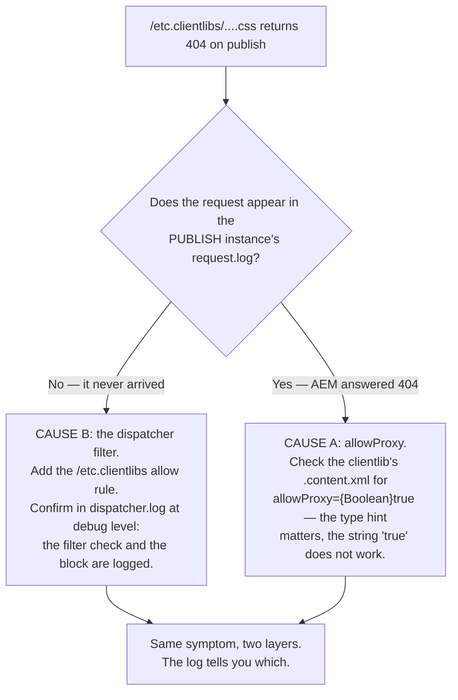
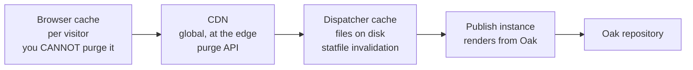
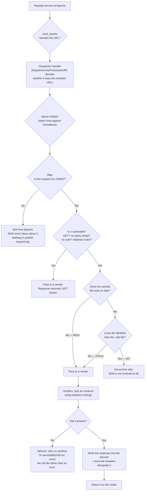
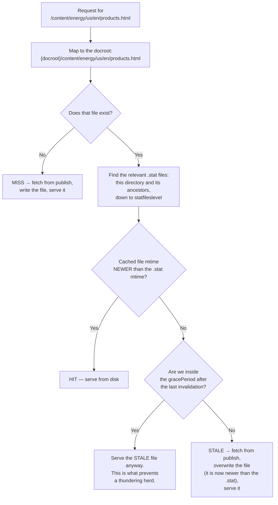
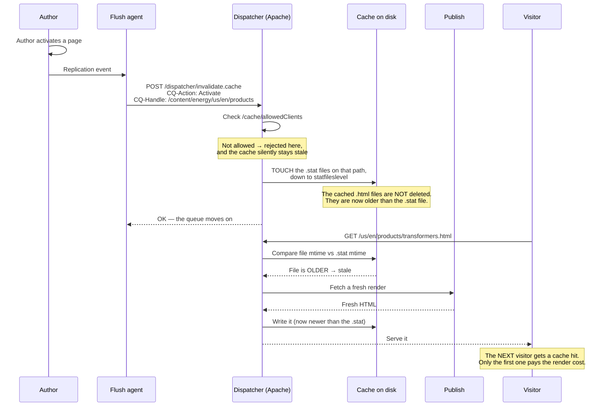
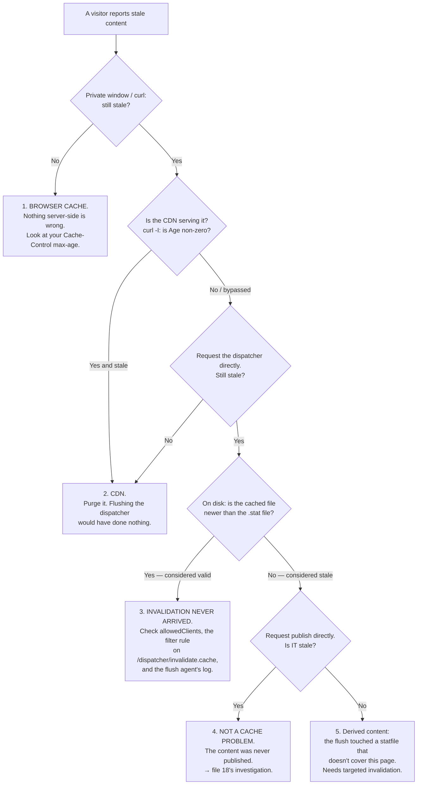

# 19 – Dispatcher, Caching and CDN

> **Target:** 3–4 years experienced AEM Developer
> **Supplementary topic 1 of the additional list:** *"Dispatcher in depth — dispatcher configuration, dispatcher caching, dispatcher flush, Apache, and CDN."*
> **Project domain:** a global energy technology company's marketing site.

---

## Before we start — this is the topic your support experience is worth the most on

Every file so far has asked you to talk like a developer about things you may have only watched from the outside. This one is different.

**If you have spent four years on AEM support tickets, you have already lived inside this file.** "The page is published but the site shows the old version." "CSS is missing on production only." "The site went down when marketing published forty pages at once." "Someone can reach `/system/console` from the internet." Those are dispatcher tickets. You have raised them, escalated them, or watched somebody fix them.

The gap is not experience. The gap is **vocabulary and mechanism** — being able to say *"the statfile was touched but the cached file underneath it had a newer timestamp"* instead of *"the cache didn't clear."*

So this file is deliberately mechanism-first. By the end you should be able to explain, without hedging:

- Why the dispatcher **deletes nothing** when you flush it, and what it does instead.
- Why publishing one page can invalidate its siblings, and which single number controls that.
- Why `?page=2` costs you a cache hit and `.html/2` does not.
- Which of the four caches — browser, CDN, dispatcher, publish — is actually serving a given request, and how to prove it in three commands.

**And there is one framing decision worth making now, because it changes how the whole answer lands.**

Almost everyone introduces the dispatcher as *"AEM's caching layer."* That is the weaker half of the truth. Adobe's own security checklist treats the dispatcher primarily as the **filtering layer that stands between the internet and your publish instances**. A slow site is a bad day. An open `/system/console` on a publish tier is an incident with a customer notification attached to it.

Lead with security, then caching. It is a genuinely better answer, and almost nobody gives it.

**Where this file plugs into the rest of the repository.** File 01 established that the dispatcher denies by default. File 04 left you with `allowProxy` and an unfinished second cause for the same 404. File 07 built a cacheable endpoint with a selector and a suffix and told you *why* without showing you the cache. File 14 said the dispatcher is a container in the publish pod. File 18 sent an invalidation to `/dispatcher/invalidate.cache` and told you a statfile gets touched. **This file is where all five of those threads terminate.**

---

## 1. Introduction

### 1.1 The problem the dispatcher solves

Start with what a publish instance actually does when a page is requested.

It resolves the URL to a resource, checks permissions, reads the resource type, finds the script, runs your Sling Models, executes the HTL, resolves every included component, renders the markup, and writes the response. On a product listing page that walks a page tree, that is a meaningful amount of CPU and a meaningful number of repository reads.

**Now ask: how often does the answer actually change?**

For a marketing page on an energy technology site — a transformer product page, an HVDC case study, a grid automation overview — the answer changes when an author publishes. Which might be once a week. Possibly once a quarter.

**So you have a system doing expensive work to produce an identical answer thousands of times a day.** That is the problem.

The obvious fix is to compute it once and keep the result. And because the result is HTML — a document identified by a path — the natural place to keep it is **as a file on a disk**, laid out in directories that mirror the URL.

That is the dispatcher's cache in one sentence. It is not a clever in-memory data structure. **It is a folder full of HTML files, arranged so the URL is the file path.**

And once you see it that way, several things that seem arbitrary become obvious:

- Why query parameters are a problem — `?page=2` is not part of a file path.
- Why a hit is so cheap — Apache is just serving a static file, exactly as it would serve an image.
- Why invalidation is awkward — you are managing a directory tree, not a key-value store.

### 1.2 What the dispatcher actually *is* — and the misconception to avoid

**This is the single most common wrong answer on the topic, and it is worth being precise about.**

The dispatcher is **not** a standalone product. It is not a server you install and run. It is not a proxy application with its own process.

> **The dispatcher is a module for a web server — in almost every real deployment, an Apache HTTP Server module called `mod_dispatcher`.**

Concretely, on a traditional AEM 6.5 deployment you have Apache installed, and in its configuration there is a line like:

```apache
LoadModule dispatcher_module modules/mod_dispatcher.so
```

That is it. From that point Apache has a new request handler, configured by a file conventionally called `dispatcher.any`.

**Why does this distinction matter enough to be the first thing you say?**

**One — it tells the interviewer you have seen a real deployment.** Someone who has only read about the dispatcher describes it as a box on a diagram. Someone who has configured one knows they were editing `httpd.conf` and `vhosts` alongside it.

**Two — it explains what the dispatcher can and cannot do.** It inherits everything Apache can do: rewrites via `mod_rewrite`, headers via `mod_headers`, SSL, `mod_deflate` for gzip, access control by IP. Half of what people call "dispatcher configuration" is actually Apache configuration sitting next to it. If someone asks how you'd add a redirect or a security header, the answer is often *"that's `mod_rewrite` or `mod_headers`, not the dispatcher module."*

**Three — it explains the cache.** The dispatcher's docroot is normally **the same directory as Apache's `DocumentRoot`**. That is not a coincidence; it is the design. Once the dispatcher has written a cached file there, subsequent hits can be served by Apache as an ordinary static file. That is why a cache hit costs almost nothing.

**A vendor note worth knowing but not leading with:** the module was historically also available for Microsoft IIS. In practice, and universally on Cloud Service, it is Apache.

**A note on the name.** "Dispatcher" is a caching name that sounds like a routing name, which confuses people. It is called that because its original job was to *dispatch* requests across several render instances — load balancing. Caching came to dominate, and the name stuck.

### 1.3 The three jobs

The dispatcher does three things. Interviewers expect all three, and they expect you to order them by real-world importance rather than by fame.

**Job one — caching.** Store rendered responses on disk and serve them without touching AEM. This is the famous one and it is what most of the configuration is about.

**Job two — security filtering.** Decide which requests are even allowed to reach a publish instance, and reject everything else at the web server, before AEM sees it. This is the one that matters most.

**Job three — load balancing.** Distribute requests across several render instances, take a failing one out of rotation, and keep a visitor pinned to the same instance when that is needed.

**Now the argument for putting security first**, which is the differentiating part of this answer:

A publish instance is a full AEM installation. It contains the OSGi web console at `/system/console`. It contains CRXDE at `/crx/de`. It contains the QueryBuilder JSON endpoint at `/bin/querybuilder.json`, which will happily run an arbitrary repository query and return the results. It contains the `DefaultGetServlet` from file 07, which will serialise a whole subtree if you ask for `.infinity.json`.

**None of those are bugs.** They are the tools that make AEM usable on author. They exist on publish because publish runs the same software.

So the only thing standing between the public internet and all of it is **the dispatcher's filter section**. Not AEM's permissions — those help, but a wrongly-configured content ACL plus an open filter is a bad combination. The filter is the layer designed for this job.

> **If the cache misconfigures, the site is slow. If the filter misconfigures, the site is breached.**

That sentence is worth having ready. It reframes the whole topic and it is true.

### 1.4 When and where the dispatcher sits

Between the internet (or the CDN) and the publish instances:

```
Visitor → CDN → Apache + dispatcher module → publish instance(s) → Oak repository
```

**There is normally also a dispatcher in front of author**, and its job is different. It does far less caching — authors need to see their changes immediately — and its filter is configured for authenticated users rather than the public. Its main roles are load balancing across author instances in a cluster and terminating SSL. A common interview question is whether you cache on author, and the answer is *"very little, and never HTML, because an author must see the change they just made."*

### 1.5 A real project example to adapt

> "We run about twenty country sites off one AEM instance, with URLs like `/us/en/` and `/de/de/`. The dispatcher config is one farm per environment with a shared filter section that's included, so a security rule can't be right in one place and wrong in another. Our filter is deny-by-default with roughly a dozen allow rules, and the two we had to add deliberately were `/etc.clientlibs` for the clientlib proxy and one exact `/bin` path for a CRM form handler — one path, one method, not `/bin/*`.
>
> On caching, our hit ratio sits above ninety percent on the country sites, and the work to get there was mostly about URLs — moving listing pagination from a query parameter to a selector and suffix, and getting `statfileslevel` right so a translator publishing a German page doesn't invalidate the US cache. We use a grace period so a bulk publish doesn't stampede publish, and we have a replication event handler that dispatches a Sling Job to invalidate derived pages that a normal flush wouldn't touch — the classic case being pages that include an Experience Fragment.
>
> On Cloud Service the config lives in Git under `dispatcher/src`, we validate it with the dispatcher SDK validator before pushing, and a rule change goes out through the web-tier pipeline, which is dramatically faster than a full-stack deploy."

That paragraph pre-empts about eight follow-ups: filter strategy, the `/bin` rule, the `/etc.clientlibs` rule, hit ratio, statfileslevel, grace period, derived-content invalidation, and the AEMaaCS workflow. It is worth learning the *shape* of it even if your numbers differ.

---

## 2. Core Concepts

### 2.1 The Apache side — what lives where

Because the dispatcher is an Apache module, its configuration is split across two kinds of file, and mixing them up is a common source of confusion.

**Apache configuration** — `httpd.conf`, and the virtual host files. This is where you load the module, point it at its config, set logging, and declare which requests Apache hands to the dispatcher handler.

**Dispatcher configuration** — `dispatcher.any` and whatever it includes. This is where farms, filters, cache rules and renders live.

The Apache side looks roughly like this:

```apache
# Load the module -- this is what makes "the dispatcher" exist at all
LoadModule dispatcher_module modules/mod_dispatcher.so

<IfModule disp_apache2.c>
    # Point at the dispatcher's own configuration file
    DispatcherConfig       conf/dispatcher.any

    # The dispatcher writes its own log, separate from Apache's
    DispatcherLog          logs/dispatcher.log

    # 0 = error, 1 = warn, 2 = info, 3 = debug
    # Debug is your main diagnostic tool. It is very verbose --
    # turn it on to answer a question, then turn it off.
    DispatcherLogLevel     3

    # Don't advertise the server version in responses
    DispatcherNoServerHeader 1

    # Let Apache handle "/" itself rather than passing it to AEM
    DispatcherDeclineRoot  0

    # Use the URL AFTER Apache's rewrites, not the original one.
    # If you use mod_rewrite, you almost always want this on --
    # otherwise the dispatcher filters and caches the pre-rewrite URL.
    DispatcherUseProcessedURL 1

    # Pass AEM's error responses through instead of letting Apache
    # substitute its own error page
    DispatcherPassError    0
</IfModule>
```

And in the virtual host, the block that actually routes requests into the module:

```apache
<VirtualHost *:80>
    ServerName www.example.com

    # The dispatcher docroot and Apache's DocumentRoot are the SAME
    # directory. That is the point: once a file is cached, Apache can
    # serve it as an ordinary static file.
    DocumentRoot /opt/dispatcher/cache

    <Directory /opt/dispatcher/cache>
        <IfModule disp_apache2.c>
            # This is the line that sends requests to the dispatcher
            SetHandler dispatcher-handler
        </IfModule>
        Options FollowSymLinks
        AllowOverride None
        Require all granted
    </Directory>
</VirtualHost>
```

**Two details in there are worth knowing by name**, because they come up:

**`DispatcherUseProcessedURL`.** If you rewrite URLs with `mod_rewrite` — say, mapping `/us/en/products` to `/content/energy/us/en/products.html` — you need the dispatcher to filter and cache the *rewritten* URL, not the incoming one. With this off, your filter rules are being tested against a URL that no longer exists by the time AEM sees it. That mismatch produces filter rules that look correct and do nothing.

**`DispatcherLogLevel 3`.** Debug level is the single most useful diagnostic in this whole file. It logs each filter check and the cache decision for every request. It is also extremely noisy, so it is a "turn on, reproduce, turn off" tool, not a standing setting.

### 2.2 `dispatcher.any` — the anatomy

Now the dispatcher's own file. It uses a bracketed property format that looks unusual the first time. Every key starts with a slash, values are quoted, and blocks are wrapped in braces.

The top level is always `/farms`:

```
/farms
{
  /energysite
  {
    /clientheaders  { ... }    # which request headers to forward to AEM
    /virtualhosts   { ... }    # which hostnames this farm handles
    /renders        { ... }    # the publish instances behind it
    /filter         { ... }    # which requests are ALLOWED at all
    /cache          { ... }    # what gets cached, where, and how it expires
    /statistics     { ... }    # request categories, used for load balancing
    /vanity_urls    { ... }    # let publish's vanity URLs through the filter
  }
}
```

**A farm is a complete configuration for a set of hostnames.** You have more than one when different sites need genuinely different behaviour — the classic split being an author farm and a publish farm, or a public site and a partner portal with session management.

**How the dispatcher picks a farm:** it matches the request's `Host` header against each farm's `/virtualhosts`. When more than one farm could match, ordering decides — the documented behaviour is that the **last matching farm wins**. That is why, in the Cloud Service layout where farm files are included alphabetically, people name them with numeric prefixes: the file name controls the include order, and the include order controls which farm answers.

**Getting the farm wrong is a nasty class of bug**, because everything looks configured — you edited a filter rule and it had no effect, because the request is being handled by a different farm than the one you edited.

**The include mechanism.** Real configurations do not put everything in one file. They use `$include`:

```
/filter {
    $include "/etc/httpd/conf.dispatcher.d/filters/security_filters.any"
    $include "/etc/httpd/conf.dispatcher.d/filters/energy_filters.any"
}
```

**Why that matters beyond tidiness:** a shared, included security filter can be reviewed once and applied to every farm. A copy-pasted one gets fixed in one farm and forgotten in another — and the forgotten one is the one that gets found by a penetration test. On our project the security filter is one included file and nobody is allowed to add allow rules to it without a review; project-specific allows go in the second include.

### 2.3 `/clientheaders` — which headers reach AEM

The dispatcher does not forward every request header to the publish instance. It forwards the ones you list.

```
/clientheaders
{
  "CSRF-Token"
  "referer"
  "user-agent"
  "authorization"
  "from"
  "content-type"
  "content-length"
  "accept-charset"
  "accept-encoding"
  "accept-language"
  "accept"
  "host"
  "if-match"
  "if-none-match"
  "max-forwards"
  "cookie"
  "X-Forwarded-For"
  "*"
}
```

Most shipped configurations end with `"*"`, which forwards everything — but you will meet locked-down configurations that do not.

**The bug this causes**, and it is a genuinely confusing one: you write a servlet that reads a custom header — say `X-Partner-Key` — it works perfectly on author and locally, and on publish the header is always null. **The dispatcher dropped it, because it was not in `/clientheaders`.** Your code is correct, your test is correct, and the header simply never arrived.

**Two more things worth knowing here:**

`X-Forwarded-For` is what carries the visitor's real IP through to AEM, because from the publish instance's point of view every request comes from the dispatcher. If anything in your application logs or geolocates by IP, it depends on this header being forwarded — and on Apache being configured to set it.

`authorization` and `cookie` being forwarded is what makes authenticated requests work at all, and it is directly connected to the caching rules in 2.8.

### 2.4 `/virtualhosts` — which hostnames this farm answers for

```
/virtualhosts
{
  "www.example.com"
  "*.example.com"
  "*"
}
```

Entries are matched against the request's `Host` header, and **more specific entries win over wildcards.** A farm with only `"*"` is a catch-all, which is fine as the last farm and dangerous as the first.

**The practical reason to care:** on our twenty-country setup, one farm serves all of them because the country is a path segment (`/us/en/`, `/de/de/`) rather than a hostname. If a market moved to its own domain with different caching rules, that would become a second farm — and then the ordering question in 2.2 becomes live.

### 2.5 `/renders` — load balancing and sticky connections

This is job three, and it is where the name "dispatcher" comes from.

```
/renders
{
  /rend01
  {
    /hostname "publish1.internal"
    /port     "4503"
    /timeout  "10000"     # milliseconds to wait for a response
  }
  /rend02
  {
    /hostname "publish2.internal"
    /port     "4503"
    /timeout  "10000"
  }
}
```

**With more than one render, the dispatcher distributes requests between them.** It is not a simple round-robin — the dispatcher tracks response times per render (this is what the `/statistics` section is for) and prefers the faster one, which means a struggling instance naturally receives less traffic.

**Failure handling** is configured at farm level:

```
/failover           "1"     # retry a failed request on another render
/numberOfRetries    "5"
/retryDelay         "1"
/unavailablePenalty "1"     # weight applied to a render that just failed
/health_check { /url "/system/health" }
```

`/failover` is the one worth knowing: with it on, if a render returns an error or does not answer, the dispatcher retries the request on a different render rather than passing the failure to the visitor. Combined with `/cache/serveStaleOnError`, that is most of your resilience story.

**Sticky connections** are the part that gets asked about.

Normally it does not matter which publish instance answers, because they are identical. **It matters when the response depends on state held on that specific instance** — most often a server-side session, for example a multi-step quote form that keeps partially-entered data between steps.

```
/stickyConnectionsFor "/content/energy/global/en/quote-request"
```

Or, for several paths:

```
/stickyConnections
{
  /paths
  {
    "/content/energy/global/en/quote-request"
    "/content/energy/global/en/account"
  }
}
```

**How it works:** the dispatcher sets a `renderid` cookie identifying which render served the request, and subsequent requests under a sticky path go back to the same one.

**And here is the answer that separates candidates.** Sticky connections are a workaround, not a design. They mean you have server-side state, which means:

- You cannot cache those paths, because responses are visitor-specific.
- If that render dies, the visitor loses their session.
- Scaling is worse, because load cannot be spread freely.

> "I'd use sticky connections only where there's genuinely instance-local session state, and I'd treat needing them as a signal. The better design is a stateless publish tier — keep the state in the browser, or in an external system the form posts to. On Cloud Service that's not really optional anyway, because pods come and go, so anything that assumes a stable instance is going to fail eventually."

### 2.6 `/filter` — the security section

**This is the most important part of the file.**

The filter decides, for every request, whether it is even allowed to proceed. A rejected request never reaches AEM at all — Apache returns a 404 and the publish instance is unaware anything happened.

**The pattern is deny everything, then whitelist.**

```
/filter
{
  # RULE ZERO. Deny everything. Every subsequent rule is an exception.
  /0001 { /type "deny" /url "*" }

  # Then, deliberately, allow what the site actually needs.
  ...
}
```

**Why deny-by-default rather than blocking known-bad paths?**

Because a blocklist is a list of things you thought of. Every AEM version adds endpoints. Every project adds servlets. Every package you install may register something. **A blocklist ages badly and fails silently — the day it stops being complete, nothing tells you.**

An allowlist fails loudly. If you forget to allow something, that feature breaks in testing and someone raises a ticket. **A wrong allowlist gives you a bug report; a wrong blocklist gives you a breach.** That asymmetry is the whole argument, and it is worth stating in exactly those terms.

#### The elements you can filter on

Older configurations use `/glob`, which matches against the whole request line as one string. Adobe now recommends the **granular elements** instead, because a glob is easy to get subtly wrong and hard to read.

Every table needs its reason, and here it is: these elements are the vocabulary of every filter rule you will ever write or review, and knowing which one to reach for is most of the skill.

| Element | Matches | Example |
|---|---|---|
| `/method` | HTTP method | `"GET"`, `'(GET\|HEAD)'` |
| `/url` | The whole URL, including selectors, extension and suffix | `"/content/*"` |
| `/path` | Only the resource path part, before selectors | `"/content/energy"` |
| `/selectors` | The selector string | `'(infinity\|tidy\|sysview)'` |
| `/extension` | The extension | `'(html\|json\|css\|js)'` |
| `/suffix` | The suffix after the extension | `"/2"` |
| `/query` | The query string | `"debug=*"` |
| `/protocol` | `http` or `https` | `"https"` |
| `/glob` | The entire request line as one string — legacy | `"* /content/* *"` |

**Note the `/path` versus `/url` distinction, because it is exactly the kind of thing that gets asked.** `/path` sees only the resource path. `/url` sees the path plus selectors, extension and suffix. So a rule written against `/path` cannot express "block the `infinity` selector" — you need `/selectors`, or `/url` with a pattern. Getting this wrong produces a rule that appears to block something and does not.

**Values can be regular expressions** when wrapped in single quotes: `/extension '(html|json)'`.

#### What must be blocked on publish

This is the list to be able to recite. Each entry has a *why*, and the why is what earns the mark.

**`/system/console` and everything under `/system`.** The OSGi web console. Install a bundle, change a configuration, read every OSGi service, view configurations that contain credentials. This is administrative control of the application, reachable over HTTP. Nothing on a public publish tier needs it.

**`/crx`, and `/crx/de` specifically.** CRXDE Lite — a repository browser and editor. Reads and writes any node the session can reach. `/crx/packmgr` is Package Manager: build a package of `/content` and download the whole site, or upload a package containing code.

**`/bin/querybuilder.json`.** This one is the favourite of anyone doing an AEM security assessment, and it deserves explaining properly rather than just listing. It accepts query parameters and executes a repository query, returning JSON. So a request like `?path=/home/users&p.limit=-1` walks the user tree. It is not a vulnerability — it is a documented API doing exactly what it says. **The vulnerability is exposing it.** Even where anonymous permissions limit what comes back, it is an information-disclosure surface with no upside on a public site.

**`.infinity.json`.** File 07's `DefaultGetServlet` serialising an entire subtree in one response. `/content.infinity.json` is the demonstration everybody uses because it is dramatic.

**`.tidy.json`, `.query.json`, `.sysview.xml`, `.docview.xml`, `.-1.json`, `.2.json`.** Variants of the same problem. `tidy` is pretty-printed JSON. Numeric selectors control depth, so `.10.json` walks ten levels down. `sysview` and `docview` are the JCR XML export formats. **The right way to handle these is a single rule denying the selector set, not one rule per selector** — that way a new variant does not need a new rule.

**`POST` to content paths.** Because of the `SlingPostServlet` from file 07. A POST to a repository path creates or updates nodes. Anonymous cannot normally write, but this depends entirely on your ACLs being right, and it is exactly the kind of thing that drifts. Blocking POST except where a form genuinely needs it removes the dependency.

**`/apps`, `/libs`, `/home`, `/etc` broadly.** `/apps` is your source code. `/libs` is Adobe's, including tools. `/home` is users and groups. `/etc` historically held everything. Each gets narrow, deliberate exceptions — the important one being `/etc.clientlibs`, which is section 2.14.

**`/dispatcher/invalidate.cache` from outside.** The flush endpoint. If the public can reach it, the public can flush your cache repeatedly, which turns every request into a cache miss and puts your entire traffic load onto publish. That is a denial-of-service you configured yourself. This is guarded by `/cache/allowedClients` as well, and both matter.

#### What a real filter section looks like

```
/filter
{
  # ---------------------------------------------------------------
  # 1. DENY EVERYTHING. Every rule below is a deliberate exception.
  # ---------------------------------------------------------------
  /0001 { /type "deny" /url "*" }

  # ---------------------------------------------------------------
  # 2. Allow the methods and extensions a public site actually uses
  # ---------------------------------------------------------------
  /0010 {
    /type "allow"
    /method '(GET|HEAD)'
    /extension '(css|eot|gif|ico|jpe?g|js|gif|pdf|png|svg|swf|ttf|woff2?|html)'
  }

  # The clientlib proxy from file 04. WITHOUT THIS, every stylesheet
  # and script on the published site returns 404 -- even when
  # allowProxy is set correctly on the clientlib.
  /0011 { /type "allow" /method "GET" /path "/etc.clientlibs" }

  # DAM assets referenced from pages
  /0012 { /type "allow" /method "GET" /path "/content/dam" }

  # ---------------------------------------------------------------
  # 3. Re-deny the dangerous things that the broad allows above
  #    would otherwise let through. Order matters: LAST MATCH WINS.
  # ---------------------------------------------------------------

  # Serialisation selectors -- one rule, not one per selector, so a
  # new variant doesn't need a new rule.
  /0030 {
    /type "deny"
    /selectors '(infinity|tidy|sysview|docview|query|childrenlist|ext|feed)'
    /extension '(json|xml|html|feed)'
  }

  # Numeric depth selectors: .1.json, .10.json, .-1.json
  /0031 { /type "deny" /selectors '([0-9-]+)' /extension "json" }

  # QueryBuilder: an arbitrary repository query over HTTP
  /0032 { /type "deny" /url "/bin/querybuilder.json*" }

  # Administrative surfaces
  /0033 { /type "deny" /path "/system" }
  /0034 { /type "deny" /path "/crx" }
  /0035 { /type "deny" /path "/bin" }
  /0036 { /type "deny" /path "/apps" }
  /0037 { /type "deny" /path "/libs" }
  /0038 { /type "deny" /path "/home" }
  /0039 { /type "deny" /path "/etc" }        # /etc.clientlibs is a
                                             # different path, not under /etc

  # The invalidation endpoint must never be reachable from outside
  /0040 { /type "deny" /url "/dispatcher/invalidate.cache" }

  # ---------------------------------------------------------------
  # 4. Narrow, deliberate exceptions -- each one justified in review
  # ---------------------------------------------------------------

  # The CRM quote form handler from file 07. ONE exact path, ONE
  # method. NEVER /bin/* -- that would re-expose querybuilder and
  # every other path-bound servlet in the system, including ones we
  # didn't write.
  /0100 { /type "allow" /method "POST" /path "/bin/energy/quote-request" }

  # The Sling Model Exporter JSON for the mobile app (file 17),
  # scoped to our content tree and one selector.
  /0101 {
    /type "allow"
    /method "GET"
    /path "/content/energy"
    /selectors "model"
    /extension "json"
  }
}
```

**Three things to be able to defend about that file:**

**Last match wins.** Rules are evaluated in order and the last one that matches decides. That is why the structure is broad-allow then re-deny: you cannot express "allow HTML but not `.infinity.json`" in one rule, so you allow the extension and then deny the selector.

**Numbering is a naming convention, not a priority field.** `/0001` is just a label. It is the *order in the file* that matters. Numbering in gaps of ten or a hundred is convention so rules can be inserted without renumbering.

**Every allow rule is as narrow as the requirement.** One path, one method, one selector, one extension. `/bin/energy/quote-request` and not `/bin/*`. That single discipline is the difference between story 2 in section 7 happening to you and not.

#### What breaks if you get the filter wrong

**Too permissive:** an administrative console or a data-dumping endpoint is reachable from the internet. This is the failure mode that ends up in a security report, and it is usually caused by someone widening a rule to unblock a feature under time pressure and never narrowing it again.

**Too restrictive:** something legitimate 404s on publish and works everywhere else. Stylesheets vanish. An AJAX endpoint fails. A JSON feed a partner depends on stops. **The tell is always the same shape — it works on author, it works locally, it 404s on the published site** — and the confirmation is always the same: check whether the request appears in the publish instance's `request.log` at all.

### 2.7 `/cache` — the caching section

Now job one. The cache block has more parts than people expect.

```
/cache
{
  /docroot          "/opt/dispatcher/cache"
  /statfileslevel   "4"
  /gracePeriod      "2"
  /serveStaleOnError "1"
  /allowAuthorized  "0"
  /enableTTL        "1"

  /rules          { ... }   # which responses may be cached
  /invalidate     { ... }   # which cached files are auto-invalidated
  /allowedClients { ... }   # who may send an invalidation request
  /ignoreUrlParams{ ... }   # query params that don't defeat the cache
  /headers        { ... }   # which response headers to cache alongside
}
```

#### `/docroot` — the cache is a directory tree

```
/docroot "/opt/dispatcher/cache"
```

**And the mapping is the plainest thing in this entire file:**

```
URL:   https://www.example.com/content/energy/us/en/products/transformers.html
File:  /opt/dispatcher/cache/content/energy/us/en/products/transformers.html
```

The URL path *is* the file path under the docroot. You can `ls` it. You can `find` it. You can `rm` it — and people do, though there are better ways.

**Selectors and extensions are part of the filename**, which is exactly why file 07's design worked:

```
/content/energy/us/en/products.cards.html
  → /opt/dispatcher/cache/content/energy/us/en/products.cards.html
```

**A suffix becomes a nested path**, which is worth understanding because it has a real consequence:

```
/content/energy/us/en/products.cards.html/2
  → /opt/dispatcher/cache/content/energy/us/en/products.cards.html/2
```

Notice what that requires: `products.cards.html` has to be a **directory** on disk, containing a file called `2`. And a filesystem cannot hold a file and a directory with the same name. So if the same URL is requested both with and without a suffix, one of the two forms cannot be cached as a file at that location. **In practice this means: pick one shape for an endpoint and stay with it.** If the endpoint takes a suffix, always give it a suffix, including for the first batch — `.cards.html/1` rather than a bare `.cards.html`.

That is a genuinely good detail to drop, because it shows you have looked at the docroot rather than only read about it.

#### `/rules` — what may be cached

```
/rules
{
  # Cache everything by default...
  /0000 { /glob "*" /type "allow" }

  # ...except things that must always be fresh or are per-visitor.
  /0001 { /glob "/content/energy/*/*/search*" /type "deny" }
  /0002 { /glob "*.nocache.html" /type "deny" }   # SDI, section 2.18
}
```

**`/filter` and `/rules` are different questions and people conflate them constantly.**

> **`/filter` asks: is this request allowed to happen at all?**
> **`/rules` asks: may the response be stored?**

A request can pass the filter and be uncacheable — a search results page, for instance. A request blocked by the filter never gets as far as the cache rules.

Being able to state that cleanly is a small, reliable mark.

#### When is a request actually cacheable?

A response is cached only if **all** of these hold. This is the checklist to have memorised, because "why isn't my page caching" is one of the most common real questions on this topic.

**One — the method is GET (or HEAD).** POST, PUT and DELETE are never cached. They change state; caching them would be wrong.

**Two — the URL has no query string**, unless every parameter is covered by `/ignoreUrlParams`. Section 2.8.

**Three — the request carries no authentication**, unless `/allowAuthorized` is 1. Section 2.9.

**Four — the path matches an allow in `/cache/rules`.**

**Five — the response status is cacheable.** A 200 is. Errors and redirects are generally not stored as cached content.

**Six — the response does not tell the dispatcher not to cache it.** With `/enableTTL "1"`, the dispatcher honours `Cache-Control` and `Expires` from AEM, so a response marked `no-store` or with `max-age=0` will not sit in the cache.

**And a seventh that is not a rule but a consequence:** the URL has to be expressible as a file path. Which it always is, but it is why the query-parameter rule exists at all.

### 2.8 Query parameters — "a dot is cached, a question mark is not"

This is the line that ties files 01, 02, 07, 15 and 17 together, and it is the single most commercially valuable idea in this file.

**The mechanism, one more time, because it explains everything:** the dispatcher stores a response as a file whose path is the URL path. A query string is not part of the URL path. There is nowhere to put it.

So:

```
/content/energy/us/en/products.cards.html/2     ← a file path. CACHED.
/bin/energy/cards?listing=/content/...&page=2   ← not a path. NOT CACHED.
```

**Same data. Same JavaScript on the page. Entirely different behaviour on the publish tier.** The first is served from disk by Apache. The second runs a page-tree traversal on a publish instance, every single time, for every visitor.

**Selectors and suffixes are the path-based alternatives**, which is precisely why file 07 chose them:

| | Selector | Suffix | Query parameter |
|---|---|---|---|
| Looks like | `.cards.` | `.html/2` | `?page=2` |
| Part of the URL path | **Yes** | **Yes** | **No** |
| Becomes part of the cache filename | **Yes** | Yes — as a nested path | **No** |
| Dispatcher-cacheable | **Yes** | **Yes** | **No** |
| Read in Java with | `getSelectors()` | `getSuffix()` | `getParameter()` |
| Good for | A variant of the same resource | A parameter to that variant | Genuinely dynamic input |

**Now `/ignoreUrlParams`, which is the escape hatch and also the trap.**

```
/ignoreUrlParams
{
  # Deny by default: any parameter defeats the cache...
  /0001 { /glob "*" /type "deny" }

  # ...except tracking parameters, which don't change the response.
  /0002 { /glob "utm_source"   /type "allow" }
  /0003 { /glob "utm_medium"   /type "allow" }
  /0004 { /glob "utm_campaign" /type "allow" }
  /0005 { /glob "gclid"        /type "allow" }
  /0006 { /glob "fbclid"       /type "allow" }
}
```

**What it actually does:** if *every* parameter in the query string is on the allow list, the dispatcher ignores the query string for caching purposes and serves — or stores — the file at the plain path. The parameters are still forwarded to publish; they are just not part of the cache decision.

If *any* parameter is not on the list, the whole request is uncached.

**Why this is genuinely important on a marketing site.** Campaign links carry `utm_*` parameters. Without this configuration, every visitor arriving from an email campaign or a paid ad gets an uncached request — which is to say, **your entire campaign traffic bypasses the cache**, which is exactly the traffic you most needed the cache for. This is one of the highest-value five-line changes in AEM.

**And the trap, which is a good interview answer.** `/ignoreUrlParams` says "this parameter does not change the response." If you list a parameter that *does* change the response, the dispatcher caches one visitor's version and serves it to everybody.

> "The rule I use is that a parameter only goes in `ignoreUrlParams` if I can state confidently that two requests differing only in that parameter must return byte-identical HTML. Tracking parameters qualify. A `?lang=` or `?region=` parameter absolutely does not — and if someone adds one to fix a cache-miss problem, you get a much worse bug where visitors see the wrong country's content, and it's intermittent because it depends on who warmed the cache."

### 2.9 Authenticated requests — `/allowAuthorized`

```
/allowAuthorized "0"
```

**Zero is the default and it means: do not cache a request that carries authentication information** — an `Authorization` header, or an AEM login token cookie.

**Why that default exists is worth reasoning through rather than memorising.**

A cached file has no concept of who it is for. It is a file on a disk, served to whoever asks for that path. If you cached an authenticated response, you would be storing a page rendered with *that user's* permissions and serving it to the next anonymous visitor.

On an energy technology site that could mean a partner portal page showing distributor pricing served to the public internet. That is a data breach caused by a caching setting.

**So when would you ever set it to 1?** Only in combination with the farm's `/sessionmanagement` block, which makes the dispatcher itself authenticate the request before serving anything from the cache. That is the closed-user-group pattern: everyone in the group sees the same content, and the dispatcher enforces that you are in the group before handing over the cached file.

> "`allowAuthorized` is 0 by default and I'd leave it there unless there's a specific closed-user-group requirement, and then only alongside session management. Turning it on by itself to improve a hit ratio is how you serve a logged-in user's page to an anonymous visitor. It's a one-character change with a breach-shaped outcome."

**This also explains something people find odd:** author instances barely cache. Every author request is authenticated, so with `allowAuthorized` at 0 almost nothing is cacheable — which is exactly what you want, because an author must see the change they just made.

### 2.10 Statfiles and invalidation — the mechanism to actually understand

**This is the part of the topic that separates people who have read about the dispatcher from people who have operated one.** Take it slowly, because the mental model most people arrive with is wrong.

#### The wrong mental model

Most people assume: *"you flush the dispatcher, and it deletes the cached files."*

**It does not delete anything.**

#### What actually happens

The dispatcher maintains small marker files in the cache directory tree, named `.stat`. They contain nothing. **Only their modification timestamp matters.**

When an invalidation arrives, the dispatcher **touches** the relevant `.stat` files — updating their timestamps to now. The cached HTML files are left exactly where they are, untouched.

Then, on the next request for a cached file, the dispatcher performs one comparison:

> **Is this cached file NEWER than the relevant `.stat` file above it?**
>
> - **Newer** → still valid. Serve it from disk.
> - **Older** → stale. Fetch from publish, write the new file (which is now newer than the statfile), serve it.

**That is the entire mechanism.** Nothing is deleted; things are *outdated by comparison*.

**A useful analogy.** Think of the `.stat` file as a "clear the notice board" date pinned to a department's wall. Nobody walks around removing notices. Instead, when someone asks about a notice, you check whether it was posted before or after the date on the wall. Posted before? Ignore it and get a fresh one. Posted after? Still good.

#### Why it is built this way

**Because deleting is expensive and touching is free.** Consider a bulk publish — a translation drop pushing four hundred German pages. Deleting the corresponding cached files means walking a directory tree and issuing hundreds of filesystem deletes while serving live traffic. Touching one or two marker files is a single fast operation regardless of how much content it invalidates.

It also means invalidation is **lazy**. Nothing is re-rendered at invalidation time. A page is only re-rendered when somebody actually asks for it. Pages nobody visits are never rebuilt — you do not pay for content nobody reads.

#### `statfileslevel` — the number that controls granularity

```
/statfileslevel "4"
```

**This controls how deep into the directory tree `.stat` files are maintained**, counting from the docroot.

**At level 0** there is exactly one `.stat` file, at the docroot. Touching it makes *every* cached file in the entire tree older than it. **One page published invalidates the whole site.**

**At a higher level**, `.stat` files exist in directories down to that depth. Invalidating a path touches the statfiles along that path down to the configured level, so the blast radius is confined to that branch.

Work it through on our structure. The cached path for a US product page is:

```
/content /energy /us /en /products /transformers.html
   1        2      3    4     5
```

With `statfileslevel "4"`, statfiles are maintained down to `/content/energy/us/en/`. So publishing a US English page touches the statfile there — and everything cached under `/content/energy/us/en/` becomes stale. **The German tree under `/content/energy/de/de/` is untouched**, because its statfile was not modified.

At level 0, that same publish would have invalidated Germany, France, India and every other market.

#### The consequence people get asked about: siblings

> **"Why does publishing one page invalidate its siblings?"**

Because **statfiles are per-directory, never per-file.** There is no such thing as invalidating exactly one page. The finest granularity available is "everything under this directory", and how far down that directory sits is what `statfileslevel` controls.

That is a complete, mechanism-based answer, and it is a common question precisely because the answer sounds arbitrary until you know the statfile exists.

#### Choosing the value — and the real trade-off

| Level | Blast radius | Cost |
|---|---|---|
| **0** | The entire cache | Trivial to maintain; catastrophic re-render storms |
| **Low (1–2)** | A whole site or region | Cheap; still very broad on a multi-country site |
| **Matching your content depth** | One country/language branch | The usual right answer |
| **Very high** | A single deep folder | More statfiles to maintain; **and it stops covering up missing invalidations** |

**That last row is the sophisticated point, and it is the mistake in story 3.**

A low `statfileslevel` invalidates broadly, which means it accidentally invalidates a lot of things you never explicitly told it about — including pages whose content is *derived* rather than direct. Raise the level and those hidden dependencies stop being covered.

The classic case: a page that includes an **Experience Fragment** (file 16). The XF lives under `/content/experience-fragments/...`. Publishing it touches statfiles in *that* branch. The pages that include it live under `/content/energy/...` — a different branch, whose statfile is not touched. **So the consuming pages keep serving the old fragment, indefinitely.**

At `statfileslevel 0` you never noticed, because everything was being invalidated anyway. Raise the level and the latent bug surfaces.

> "The honest framing is that a low statfileslevel is not really invalidating correctly — it's invalidating everything and getting away with it. Raising it is right, but it exposes every dependency you were relying on that accident for. So on our project raising the level came with an audit of what content is derived from what, and a replication event handler that issues targeted invalidations for the cases a path-based flush can't express."

#### `/gracePeriod` — stopping the stampede

```
/gracePeriod "2"
```

**The problem it solves.** The moment an invalidation lands, every cached file in that branch becomes stale simultaneously. If a hundred visitors are on the site, the next hundred requests are all misses, and they all hit publish at once — each triggering a full render of a page that has not been rebuilt yet.

That is a **thundering herd**, and on a big invalidation it can be enough to take a publish instance down. Which then makes it worse, because the requests queue and retry.

**What the grace period does:** for the configured number of seconds after an invalidation, the dispatcher may still serve the stale cached file rather than passing every request through. It gives the rebuild time to happen and absorbs the initial spike.

**The trade-off, stated honestly:** for those seconds, some visitors see slightly old content. On a marketing site, two seconds of stale product copy is nothing. On something time-sensitive it might matter, and then you tune it down or handle that path separately.

**Where this really earns its keep** is a bulk activation — the translation drop, the campaign launch, the four hundred pages. File 18's advice about publishing large volumes out of hours and the grace period are two halves of the same concern.

#### `/serveStaleOnError`

```
/serveStaleOnError "1"
```

Different problem, related idea. **If a render returns an error, serve the stale cached copy rather than passing the error to the visitor.**

This is one of the highest-value single lines in the config. It means a publish instance failing during a deployment, a restart, or an incident degrades into "the site shows slightly old content" rather than "the site shows 500 errors." For a site that changes weekly, that is very close to no impact at all.

#### `/invalidate` — which files are auto-invalidated

```
/invalidate
{
  /0000 { /glob "*"      /type "deny"  }
  /0001 { /glob "*.html" /type "allow" }
}
```

**This says which cached files participate in statfile-based invalidation.** The convention is: only HTML.

**Why exclude everything else?** Because a lot of cached content is either immutable or managed differently. Clientlib files carry a hash in their filename (file 04) — a new build produces a new URL, so the old file never needs invalidating. Assets under `/content/dam` are usually handled by their own rules or TTLs.

**What it means practically:** a file not covered here is not removed by a normal flush. It goes when its TTL expires, or when something sends an explicit invalidation naming that resource. **That is the cause of a specific and confusing production symptom** — you publish, you flush, the HTML updates, and a cached JSON or feed keeps serving old data because it was never in `/invalidate` in the first place. If your project exposes JSON that must stay in step with page content (file 17's `.model.json`, for instance), it needs to be covered here deliberately.

#### `/allowedClients` — who may flush

```
/allowedClients
{
  # Nobody, by default
  /0001 { /glob "*"           /type "deny"  }
  # Except the author instance that sends flush requests
  /0002 { /glob "10.0.1.15"   /type "allow" }
  /0003 { /glob "10.0.1.16"   /type "allow" }
}
```

**This is a security control, not a convenience setting**, and it is one of the most commonly left wide open.

If anyone can send an invalidation, anyone can invalidate your entire cache — repeatedly, in a loop. Every request then becomes a cache miss, your hit ratio goes to zero, and your full production traffic lands on the publish tier. **That is a denial-of-service with a two-line curl command.**

It is defence in depth alongside the filter rule denying `/dispatcher/invalidate.cache`: the filter stops the request arriving, and `allowedClients` stops it working if it somehow does.

#### `/headers` and `/enableTTL`

```
/headers
{
  "Cache-Control"
  "Content-Disposition"
  "Content-Type"
  "Expires"
  "Last-Modified"
  "Link"
  "X-Content-Type-Options"
}
```

**A cached file on disk has no headers** — it is just bytes. So the dispatcher stores the response headers you list alongside it, and replays them on a cache hit.

**The failure this causes when it is wrong:** a PDF served with the wrong content type on the second request but the right one on the first. Or, more damagingly, `Cache-Control` not being in this list — so the *first* response carries the header that tells the CDN and browser how long to cache, and every subsequent response served from the dispatcher's cache does not. Downstream caching then behaves inconsistently in a way that is very hard to reproduce, because it depends on whether you happened to be the visitor who caused the miss.

```
/enableTTL "1"
```

**With TTL enabled, the dispatcher honours `Cache-Control: max-age` and `Expires` from AEM** and expires the cached file accordingly. This is what lets AEM control cache lifetime from application code rather than only from the dispatcher config — and it is how you give a news feed a five-minute life without touching `dispatcher.any`.

### 2.11 The flush agent — how the invalidation arrives

File 18 built this from the replication side. Here is the dispatcher side of the same conversation.

The author instance has a **flush agent** — a replication agent whose transport URI points not at a publish instance but at the dispatcher:

```
transportUri = "http://dispatcher-host/dispatcher/invalidate.cache"
serializationType = "flush"
```

When content is activated, the agent sends a request that looks essentially like this:

```
POST /dispatcher/invalidate.cache HTTP/1.1
Host: dispatcher-host
CQ-Action: Activate
CQ-Handle: /content/energy/us/en/products/transformers
Content-Type: text/plain
Content-Length: 0
```

**The headers are the whole message:**

| Header | Meaning |
|---|---|
| `CQ-Action` | `Activate`, `Deactivate` or `Delete` |
| `CQ-Handle` | The content path that changed |
| `CQ-Action-Scope` | Optional. `ResourceOnly` means "remove just this resource's cached file, do not touch statfiles" |

**`CQ-Action-Scope: ResourceOnly` is the detail worth knowing**, because it is the answer to "how would you invalidate exactly one page without invalidating its siblings?" It bypasses the statfile mechanism entirely and removes only the named resource's cached file. Tooling that does surgical invalidation — including the widely used ACS AEM Commons dispatcher flush rules — relies on it.

**The dispatcher's side of the handshake:**

1. The request arrives at Apache and hits the dispatcher module.
2. `/cache/allowedClients` is checked. Not allowed → rejected.
3. The `CQ-Handle` path is mapped into the docroot.
4. The relevant `.stat` files are touched.
5. A response goes back, and the agent's queue moves on.

**And this is where the "content is published but the site shows the old page" ticket comes from.** Those are two independent operations: content reaching publish, and the dispatcher being told. Either can succeed while the other fails. File 18's six-step investigation exists precisely because of that split.

### 2.12 `/statistics` and `/vanity_urls`

Two smaller sections that get asked about mainly to see whether you actually know what they do — and `/statistics` has a name that misleads almost everyone.

```
/statistics
{
  /categories
  {
    /html   { /glob "*.html" }
    /others { /glob "*"      }
  }
}
```

**`/statistics` is not about cache hit ratios.** It is part of **load balancing**. The dispatcher measures render response times *per category*, so that a render which is slow at HTML but fine at everything else is judged on the right workload. Those measurements are what drive which render gets the next request.

Getting this right in an interview is a nice, cheap differentiator, because the name invites the wrong answer and most people give it.

```
/vanity_urls
{
  /url   "/libs/granite/dispatcher/content/vanityUrls.html"
  /file  "/tmp/vanity_urls"
  /delay 300
}
```

**The problem this solves:** a vanity URL like `/hvdc` is a property on a page in AEM. The dispatcher's filter knows nothing about it, so a deny-by-default filter blocks it, and authors cannot create working vanity URLs without a developer adding a filter rule each time.

**The solution:** the dispatcher periodically fetches the list of vanity URLs from publish, caches it in a local file, and allows those paths through the filter automatically. `/delay` is the refresh interval in seconds.

**The trade-off, which is the interview-worthy part:** it means authors can effectively punch holes in your filter by creating vanity URLs. That is usually acceptable — a vanity URL resolves to a real page — but it is worth being aware of, and it is one more reason your content ACLs must be right rather than relying on the filter alone.

### 2.13 Cache hit ratio — measuring whether any of this works

Every conversation about dispatcher tuning ends here, so have a number and a method.

**The definition:**

```
hit ratio = requests served from the cache / total requests
```

**What is good?** Above **90%** is the number to quote for a content site, and above **95%** is achievable and normal for a marketing site with mostly static pages. Below 80% means something structural is wrong — almost always query parameters, uncacheable paths, or an invalidation that is far too broad.

**How to actually measure it**, since this is where vague answers get caught. Three methods, in increasing order of effort:

**Method one — compare two logs.** Every request appears in Apache's `access_log`. Only cache misses reach publish and appear in the publish instance's `request.log`. So:

```
hit ratio ≈ (Apache requests − publish requests) / Apache requests
```

Count over the same window, filter to the extensions you care about (usually just `.html`), and you have a defensible number in about two minutes. **This is the answer to give**, because it is simple, it uses logs you already have, and you can describe doing it.

**Method two — the dispatcher log at debug level.** With `DispatcherLogLevel 3`, the dispatcher logs its cache decision for each request. Counting those lines gives you a precise figure. It is verbose enough that this is a sampling exercise, not something you leave running.

**Method three — log the outcome in Apache.** Because a cache hit is served as a static file and a miss goes through the dispatcher handler, you can distinguish them in a custom `LogFormat` — response time (`%D`) is a decent proxy on its own, since a hit is served in microseconds and a miss carries a full render.

**On Cloud Service**, Adobe surfaces cache metrics for the CDN, and the same log-comparison approach works using the dispatcher and publish logs downloaded from Cloud Manager.

**And the important framing:** hit ratio is not a target in itself. **A high ratio on a small number of pages is worth less than a slightly lower ratio across the pages people actually visit.** If your ratio is 94% but the 6% is your homepage, you have a problem that the number is hiding. Say that — it shows you understand the metric rather than just quoting it.

### 2.14 `/etc.clientlibs` — closing file 04's loop

File 04 ended with an unfinished story. This is the ending.

**The recap.** Clientlibs live under `/apps`, which the public cannot read. So AEM serves them through a proxy at `/etc.clientlibs`, and the clientlib must set `allowProxy="{Boolean}true"` to be eligible.

**The part file 04 deferred:** even with `allowProxy` set perfectly, **the dispatcher filter must allow `/etc.clientlibs`**, or the request is rejected at Apache and never reaches AEM.

```
/0011 { /type "allow" /method "GET" /path "/etc.clientlibs" }
```

**So there are two independent causes for one identical symptom** — the site renders unstyled on publish, and every CSS and JS request returns 404:

**Cause A:** `allowProxy` is missing, or was written as the string `"true"` without the `{Boolean}` type hint. AEM itself refuses to serve the file.

**Cause B:** the dispatcher filter has no `/etc.clientlibs` allow rule. The request never gets to AEM.

**Telling them apart is the diagnostic worth memorising**, and it is a two-command answer:



> "It's the same 404 from two different layers, and the way I separate them is to ask whether the request reached AEM at all. If the publish instance's `request.log` has no entry, the dispatcher blocked it and I'm looking at a filter rule. If AEM logged the request and returned 404 itself, the request got through and it's `allowProxy` on the clientlib. Turning `DispatcherLogLevel` up to debug shows the filter evaluation directly, which confirms it either way.
>
> The reason I check in that order is that it's one log grep and it eliminates half the problem space, and I've seen a team spend an afternoon re-checking `allowProxy` on a config that was already correct."

**And there is a third, sneakier variant worth knowing:** the filter allows `/etc.clientlibs` but the request is being rejected on the **extension**. If your broad allow rule lists extensions and someone adds a font format or a source map that is not in the list, those specific files 404 while the CSS and JS work. The symptom is then "the site is styled but the icon font is missing", which sends people looking at fonts rather than at the filter.

### 2.15 CDN — the layer above the dispatcher

The dispatcher removes load from AEM. A CDN removes load from the dispatcher **and** removes distance from the visitor.

**Why distance matters concretely on our project.** The AEM infrastructure sits in one or two regions. Visitors are in Houston, Munich, Bangalore, São Paulo. A round trip from Brazil to a European data centre is a real, measurable delay, repeated for every asset on the page. A CDN puts a copy in a point of presence near the visitor, so most requests never cross an ocean.

**The second thing a CDN gives you is absorption.** It sits in front of everything, so a traffic spike — a campaign, a press mention, an attack — is absorbed at the edge instead of arriving at your Apache tier.

#### On AEM 6.5 versus AEM as a Cloud Service

| | AEM 6.5 (on-premise / AMS) | AEM as a Cloud Service |
|---|---|---|
| CDN | **Bring your own** — a separate contract and configuration | **Adobe-managed and included** |
| Who configures it | You, in the CDN vendor's console or config | Adobe, plus config you supply through the config pipeline |
| Purge | The vendor's own purge API | Adobe's purge mechanism, with an API key configured through the pipeline |
| Coupling to AEM | None — you wire it up | Integrated with the publish tier |

**The AEMaaCS-included CDN is one of the more genuine benefits of the platform**, and it is a better thing to cite in a "why Cloud Service" answer (file 14) than "auto-scaling", because it removes a whole vendor relationship rather than just some capacity planning.

**On 6.5 you can still bring your own CDN in front of AEMaaCS** if you have an existing contract or need specific WAF features, and Adobe supports that arrangement.

#### The headers that control CDN behaviour

This is the vocabulary part, and the `Cache-Control` versus `Surrogate-Control` distinction is a good question because it separates people who have configured a CDN from people who have heard of one.

| Header | Read by | What it controls |
|---|---|---|
| `Cache-Control: max-age=N` | Browser **and** CDN | How long anyone may reuse the response |
| `Cache-Control: s-maxage=N` | **Shared caches only** — the CDN, not the browser | CDN lifetime, overriding `max-age` for the CDN |
| `Surrogate-Control: max-age=N` | **The CDN only** — and it is stripped before the browser sees it | CDN lifetime, invisible to the browser |
| `Cache-Control: private` | Browser only may cache | Keeps a personalised response out of shared caches |
| `Cache-Control: no-store` | Everyone | Do not store this at all |
| `Cache-Control: stale-while-revalidate=N` | CDN | Serve stale for N seconds while fetching fresh in the background |
| `Age` | **Response header, from the CDN** | How many seconds this object has been in the CDN cache |

**The pattern this vocabulary enables is the important bit**, and it is the answer to "how do you cache HTML aggressively without visitors seeing stale content for hours":

```
Cache-Control:     max-age=60          ← browsers hold it for 1 minute
Surrogate-Control: max-age=86400       ← the CDN holds it for a day
```

**Short in the browser, long at the edge.** The CDN takes essentially all the load, but because you can purge the CDN and cannot purge a browser, a content change propagates in about a minute rather than a day. **You keep the performance and keep control.**

That combination is the single most useful CDN idea in this file, and it is a very good thing to be able to explain unprompted.

**`Age` is your main debugging header.** A response with `Age: 0` on a repeat request means the CDN is not caching. A response with a growing `Age` means it is. Many CDNs also send a vendor-specific hit/miss header such as `X-Cache: HIT`, which is even more direct when it is available.

#### Purging

**Two strategies, and knowing when each applies is the answer:**

**Strategy one — versioned URLs, no purge needed.** If the URL changes when the content changes, the old cached object is simply never requested again. **This is exactly what clientlib hashes do** (file 04): a new build produces `clientlib-site.lc-<hash>-lc.min.css`, a URL that has never been cached, so it cannot be stale. It is the most reliable cache invalidation there is, because it does not involve invalidation at all.

**Strategy two — explicit purge.** For HTML, where the URL must stay the same. You call the CDN's purge API for a URL, a set of URLs, or a tag.

**Two things to say about purging that make the answer sound experienced:**

**Purge is not instant and it is not free.** A global purge propagates across every point of presence. It is fine as part of a publish workflow; it is not something to fire on every content event.

**Purging the CDN and flushing the dispatcher are different operations.** Flushing the dispatcher does not touch the CDN. That is the cause of the classic escalation where a developer has flushed the dispatcher, verified the fix against the origin, and the visitor still sees the old page — because the layer above still holds it.

**On AEMaaCS**, Adobe exposes a purge capability configured through the CDN configuration in the config pipeline, using an API key you set up there. **The recommended default posture is still short TTLs on HTML plus versioned URLs for assets**, using purge as the exception for something urgent, rather than building a workflow that purges on every publish.

### 2.16 The layered cache — and knowing which layer is lying to you

Four caches sit between a visitor and the repository. **The most common time-waster in this whole topic is fixing the wrong one.**



Each layer answers if it can, so a stale page can be coming from any of them — and **flushing the dispatcher does nothing at all if the CDN is the one holding it.**

#### The discipline: work inward, one layer per command

**Step 0 — eliminate the browser.** Private window, or a hard reload, or `curl`. `curl` is best because it has no cache at all, so anything it sees is genuinely coming from the network.

**Step 1 — the CDN.** Request the public URL and look at the response headers:

```bash
curl -sSI https://www.example.com/us/en/products/transformers.html
```

A non-zero and growing `Age` means the CDN is serving it. A vendor `X-Cache: HIT` says so directly.

**Step 2 — the dispatcher.** Request the dispatcher host directly, bypassing the CDN:

```bash
curl -sSI -H "Host: www.example.com" http://dispatcher-host/us/en/products/transformers.html
```

Fresh content here but stale from step 1 → **the CDN is the problem**; purge it.

**Step 3 — the dispatcher's disk.** If step 2 is also stale, look at the actual file:

```bash
ls -la /opt/dispatcher/cache/content/energy/us/en/products/transformers.html
ls -la /opt/dispatcher/cache/content/energy/us/en/.stat
```

**Compare the two timestamps.** The cached file newer than the statfile means the dispatcher considers it valid — which means the invalidation never arrived, or it touched a different statfile than you expected. That single comparison is the most direct answer to "why is the dispatcher still serving this."

**Step 4 — publish.** Go straight to the instance:

```bash
curl -sSI http://publish1.internal:4503/content/energy/us/en/products/transformers.html
```

Stale here too? It is not a caching problem at all — the content was never published, and you are now in file 18's investigation.

**Why this order.** Each step is one command, and each one eliminates an entire layer. It also stops you doing the thing everyone does under pressure, which is flush everything, watch it come right, and learn nothing about which layer was actually at fault — so it happens again next month.

> "The mistake I try not to make is flushing every layer at once. It fixes the ticket and teaches you nothing, and the same ticket comes back. Going inward one layer at a time costs about two extra minutes and tells you which layer failed, which is the difference between fixing an incident and fixing a cause."

### 2.17 The dispatcher on AEM as a Cloud Service

File 14 established the shape. Here is what it means day to day.

**The dispatcher is a container inside each publish pod.** Not a separate Apache VM you can SSH into. Each pod has its own Apache-plus-dispatcher container with its own local cache.

**Three consequences that follow from that, and interviewers like all three:**

**One — each pod has an independent cache.** New pod, empty cache. A scale-up event means new pods serving cold, so the first requests to them are misses. **This is a genuine argument for having a CDN in front**, because the CDN absorbs that while the pods warm.

**Two — the cache is ephemeral.** A pod replacement discards its cache. So you cannot treat the dispatcher cache as durable state, and anything that depends on a warm cache to be fast enough is fragile by design.

**Three — you cannot log in and edit the config.** It comes from Git.

**The configuration lives in your Git repository** under a `dispatcher` module, in a prescribed directory layout — `conf.d` for Apache configuration and `conf.dispatcher.d` for the dispatcher's own. The structure uses an "available / enabled" convention borrowed from Debian's Apache packaging:

```
dispatcher/src/
├── conf.d/
│   ├── available_vhosts/          ← all vhost definitions
│   ├── enabled_vhosts/            ← symlinks to the active ones
│   └── rewrites/
└── conf.dispatcher.d/
    ├── available_farms/           ← all farm definitions
    ├── enabled_farms/             ← symlinks to the active ones
    ├── cache/
    ├── clientheaders/
    ├── filters/
    └── virtualhosts/
```

**Why "available and enabled" rather than just the active files:** you can keep a farm definition in the repository without it being live, and enabling it is a symlink change rather than a file move — which is a much cleaner diff in a pull request.

**The dispatcher SDK validator is the tool to know by name.** It ships with the AEM SDK and checks your configuration before you push:

```bash
# Validate the configuration
./bin/validator full -d ./out ./dispatcher/src

# Run the whole thing locally in Docker against a local publish instance
./bin/docker_run ./out host.docker.internal:4503 8080
```

**What it catches:** directives that are not permitted on Cloud Service, structural mistakes, missing includes, broken symlinks. **Why it matters practically:** the Cloud Manager pipeline runs the same validation, so an invalid config fails your deployment. Running it locally turns a failed pipeline into a ten-second local error.

**Deployment goes through the web-tier pipeline** (file 14), and this is the operationally important fact:

> **A dispatcher config change does not need a full-stack build.** The web-tier pipeline deploys only the dispatcher configuration and is dramatically faster.

**Why that matters in an incident.** File 14 was honest that Cloud Service has no emergency hotfix path. The web-tier pipeline is the closest thing to one — a filter rule, a cache rule, a block on an abusive path can go out far faster than a code change. If an interviewer asks "how would you respond quickly to something on Cloud Service", **the web-tier pipeline and a CDN rule are the two real answers**, and knowing that is a practical, senior-sounding detail.

**Flexible mode.** Adobe's Cloud Service dispatcher configuration originally restricted which directives you could use. "Flexible mode" relaxed that considerably, allowing your own includes and a wider set of Apache directives. If you meet a project on the older restricted layout, converting it is a known migration, and the **Dispatcher Converter** tool (file 14) exists for moving a 6.5 configuration to the Cloud Service structure.

**Local development.** The SDK's `docker_run` gives you an Apache-plus-dispatcher container pointed at your local AEM. **This is the thing most developers skip and then regret**, because dispatcher-only bugs — a filter blocking your new servlet, a URL that will not cache — are invisible when you develop against `localhost:4502` directly. Testing behind a local dispatcher catches the entire "works locally, 404s on publish" class of bug before it leaves your machine.

### 2.18 Sling Dynamic Include — dynamic parts of a cached page

**The problem.** A page is ninety-five percent identical for every visitor and five percent personalised — a "recently viewed products" strip, a regional stock indicator, a logged-in partner's name.

**Caching the page caches the personalised part too**, and everyone gets the first visitor's version. So the usual answer is: do not cache the page. Which throws away the ninety-five percent to protect the five.

**Three ways out, and being able to compare them is the answer:**

**Option one — do it client-side.** JavaScript fetches the dynamic part after load. The page stays fully cacheable. **This is the default choice**, and it is what file 02 and file 07 chose for our Load More. The costs are a flash of content appearing after load, and that the content is invisible to crawlers.

**Option two — Sling Dynamic Include (SDI).**

**What it does:** at render time, SDI replaces a configured component's markup with a **server-side include directive** instead of the component's actual output. The dispatcher caches the page *containing the directive*. Then Apache — via `mod_include` for SSI, or the CDN for ESI — resolves that directive on every request by fetching just that fragment.

**So the page is cached and the fragment is not.** You get both.

**Roughly what the flow looks like:**

```
1. Request arrives, page not cached → goes to publish
2. Publish renders the page, but SDI's filter swaps the configured
   component's output for:   <!--#include virtual="/content/....nocache.html" -->
3. The dispatcher caches THAT page, include directive and all
4. Apache's mod_include sees the directive and fetches
   /content/....nocache.html
5. That request is NOT cached (a cache rule denies *.nocache.html)
   so it goes to publish every time
6. Apache assembles the two and returns the response
```

**Configuration is an OSGi factory configuration** — "Apache Sling Dynamic Include - Configuration" — with a configuration per resource type set. The properties that matter:

| Property | What it does |
|---|---|
| `include-filter.config.enabled` | Turn it on for this configuration |
| `include-filter.config.resource-types` | Which components get replaced by an include |
| `include-filter.config.include-type` | `SSI` (Apache), `ESI` (CDN/varnish), or `JSI` (client-side JS) |
| `include-filter.config.selector` | The selector added to the include URL — `nocache` by default |
| `include-filter.config.ttl` | A TTL for the fragment, where the include type supports it |
| `include-filter.config.required_header` | Only apply when this header is present — defaults to a dispatcher-set header, so SDI does not fire when you request publish directly |
| `include-filter.config.add_comment` | Add an HTML comment showing what was replaced — very useful when debugging |

**And SDI needs three things configured outside AEM, all of which are common failure points:**

1. **Apache must have SSI enabled** for the docroot — `Options +Includes` and `SetOutputFilter INCLUDES`, or the include directive is served to the browser as a literal HTML comment and the fragment simply never appears.
2. **The dispatcher filter must allow the `nocache` selector**, or the fragment request is blocked and you get an empty hole.
3. **The dispatcher cache rules must deny caching `*.nocache.html`**, or the fragment gets cached and you are back where you started — with the added confusion that it now looks like it is working.

**Option three — the CDN's own edge personalisation**, where the CDN assembles the page. Powerful, and it moves logic into a layer that is harder to test and version. Worth mentioning as an option; rarely the first choice.

**The honest comparison, which is what an interviewer actually wants:**

> "My default is client-side, because it keeps the page fully cacheable and there's nothing extra to configure or go wrong. SDI is the right answer when the dynamic part has to be in the server-rendered HTML — usually for SEO, or when it would cause visible layout shift appearing late.
>
> The reason I don't reach for SDI first is that it has three dependencies outside AEM — Apache's SSI configuration, a dispatcher filter rule for the include selector, and a cache rule that stops the fragment being cached. Any of those being wrong gives you a confusing failure, and the worst one is the cache rule, because a cached fragment looks like it's working right up until someone sees another visitor's data."

---

## 3. Internal Working

### 3.1 The full request path

This is the diagram to be able to draw on a whiteboard.



**Four things to pull out of that diagram, because they are each a separate interview answer:**

**The filter runs before the cache.** A blocked request is not a cache miss — it is not a cache anything. It never reaches that decision.

**"Cacheable" and "cached" are different questions.** A request can be perfectly allowed, go to publish, and never be stored, because it had a query string or carried authentication.

**A hit costs nothing.** It is a file read. No network call, no render, no repository access.

**A miss writes as a side effect.** The dispatcher does not have a separate cache-population step — serving a miss *is* how the cache gets populated. Which is also why the first visitor after an invalidation pays the render cost, and why the grace period exists.

### 3.2 The statfile decision, precisely



**The whole mechanism is one timestamp comparison**, and once you can say that sentence the rest of the topic follows from it:

- *Why does flushing not free disk space?* Nothing is deleted.
- *Why does publishing one page invalidate siblings?* The comparison is against a directory-level marker.
- *Why does `statfileslevel` change the blast radius?* It changes which directory holds the marker.
- *Why does a grace period help?* It is a temporary override of the comparison.

### 3.3 An invalidation, end to end



**The two failure points to name**, because between them they account for most "published but not live" tickets:

**`allowedClients` rejects the invalidation.** Everything upstream looks perfect — the page is on publish, the replication queue is clean, the agent reported success — and the dispatcher never touched a statfile. From the author's point of view nothing failed. This is why the flush agent's own log is worth checking.

**The statfile touched is not the one the stale file sits under.** With a high `statfileslevel` and content whose relationship is not path-based — an Experience Fragment, a listing built from a page tree, a `.model.json` export — the invalidation lands in the wrong branch and the derived page never notices.

### 3.4 The layered cache as a decision tree



**This decision tree is the single most reusable thing in this file**, and it is worth being able to walk it out loud. It converts the vaguest ticket in AEM — "the site is showing old content" — into five distinct, testable causes.

---

## 4. Important Interview Questions

### 4.1 Basic

**Q1. What is the AEM Dispatcher?**
A module for a web server — in practice an Apache HTTP Server module called `mod_dispatcher` — that sits in front of the publish instances. It does three jobs: caches rendered responses on disk, filters which requests are allowed to reach AEM, and load balances across render instances.

*Cross:* Is it a separate product? (**no — a module, not a standalone server**) · What web server? (Apache; historically IIS too) · Which of the three jobs matters most? (**security filtering**)

**Q2. What are the dispatcher's three responsibilities?**
Caching, security filtering, and load balancing. Caching is the famous one; filtering is the one that would cause an incident if it were wrong.

*Cross:* Why put security first? (a bad cache is a slow site; a bad filter is a breach) · Where does the name come from? (**dispatching requests across renders** — load balancing was the original job)

**Q3. Where is the dispatcher configured?**
Two places. Apache's own configuration loads the module and sets logging and the handler. `dispatcher.any` holds the farms — clientheaders, virtualhosts, renders, filter, cache, statistics, vanity URLs.

*Cross:* What's `DispatcherLogLevel`? (0 error … 3 debug) · What's `DispatcherUseProcessedURL`? (filter and cache the **rewritten** URL) · How is the file structured? (bracketed properties, `$include` for reuse)

**Q4. What is a farm?**
A complete configuration for a set of hostnames — its own filter, cache, and renders. You have more than one when different sites need genuinely different behaviour, typically an author farm and a publish farm.

*Cross:* How is a farm selected? (`/virtualhosts` matched against the Host header) · What if two match? (**the last matching farm wins** — which is why include order matters) · What does that cause? (editing a rule in the wrong farm and seeing no effect)

**Q5. What does the `/filter` section do?**
It decides whether a request is allowed to reach AEM at all. It is deny-by-default, and everything the site needs is explicitly allowed.

*Cross:* Why deny-by-default rather than blocking known-bad paths? (**a blocklist fails silently; an allowlist fails loudly**) · Which rule wins when several match? (**the last one**) · Is the rule number a priority? (no — it's a label; file order decides)

**Q6. Name things that must be blocked on publish.**
`/system/console`, `/crx` and `/crx/de`, `/bin/querybuilder.json`, the serialisation selectors `.infinity.json`, `.tidy.json`, `.query.json`, `.sysview.xml` and numeric depth selectors, POST to content paths, and `/dispatcher/invalidate.cache` from outside.

*Cross:* Why is querybuilder dangerous? (**it runs an arbitrary repository query over HTTP**) · What serves `.infinity.json`? (`DefaultGetServlet`, file 07) · Why block POST? (**the SlingPostServlet writes nodes**) · Why block the invalidate endpoint? (anyone could flush your cache in a loop)

**Q7. How does the dispatcher decide the cache filename?**
The URL path becomes the file path under the docroot. `/content/energy/us/en/products.html` becomes `<docroot>/content/energy/us/en/products.html`.

*Cross:* Where do selectors go? (**into the filename**) · Where does a suffix go? (**a nested path** — the `.html` part becomes a directory) · Why is the docroot the same as Apache's DocumentRoot? (so a hit is served as a plain static file)

**Q8. Why aren't query parameters cached?**
Because the cache is a directory tree and a query string is not part of a URL path. There is nowhere on disk to put it.

*Cross:* What are the alternatives? (**selector and suffix — both part of the path**) · What's `ignoreUrlParams` for? (parameters that don't change the response, like `utm_*`) · What's the risk of misusing it? (**caching one visitor's version and serving it to everyone**)

**Q9. What happens when you flush the dispatcher?**
Nothing is deleted. The dispatcher **touches** a `.stat` file, updating its timestamp. Any cached file older than that statfile is treated as stale on its next request and re-fetched.

*Cross:* Why touch rather than delete? (**deleting is expensive; touching is one operation regardless of volume**) · When is a page re-rendered? (**lazily, on the next request**) · What controls the granularity? (`statfileslevel`)

**Q10. What is a flush agent?**
A replication agent on the author instance whose transport URI points at the dispatcher's `/dispatcher/invalidate.cache` endpoint, sending `CQ-Action` and `CQ-Handle` headers when content is activated.

*Cross:* What does the dispatcher do with it? (touches statfiles) · Who's allowed to send one? (`/cache/allowedClients`) · What's `CQ-Action-Scope: ResourceOnly`? (**remove only that resource's file, don't touch statfiles**)

### 4.2 Intermediate

**Q11. Explain `statfileslevel` and why it matters.**
It sets how deep `.stat` files are maintained from the docroot, which sets the blast radius of an invalidation. At level 0 there is one statfile and every publish invalidates the entire cache. Higher levels confine invalidation to a branch — on a multi-country site, typically the level that isolates one country and language.

*Cross:* Why does publishing one page invalidate its siblings? (**statfiles are per-directory, never per-file**) · What's the cost of raising it? (**it stops accidentally covering derived content**) · Give an example (an Experience Fragment lives in a different branch from the pages that include it)

**Q12. What is `gracePeriod` and what problem does it solve?**
After an invalidation every file in that branch is stale at once, so a burst of requests all miss simultaneously and hit publish together — a thundering herd. The grace period lets the dispatcher keep serving the stale file for a few seconds, absorbing the spike while the first rebuild happens.

*Cross:* What's the trade-off? (a few seconds of stale content) · When does it matter most? (**a bulk activation** — a translation drop, a campaign launch) · What's the related setting for errors? (`serveStaleOnError`)

**Q13. What's the difference between `/filter` and `/cache/rules`?**
`/filter` asks whether the request is allowed at all. `/cache/rules` asks whether the response may be stored. A request can pass the filter and still be uncacheable — a search page, for instance. A filtered request never reaches the cache decision.

*Cross:* Which runs first? (**filter**) · Does a blocked request count as a cache miss? (no — it never gets that far) · Where would you deny caching? (`/cache/rules`, e.g. search and `*.nocache.html`)

**Q14. Why aren't authenticated requests cached?**
Because a cached file has no notion of who it is for. Caching a response rendered with one user's permissions and serving it to the next visitor is a data leak. `allowAuthorized` is 0 by default for exactly that reason.

*Cross:* When would you set it to 1? (**only with `/sessionmanagement`**, for a closed user group) · Why do author instances barely cache? (every request is authenticated) · What's the worst case? (a partner-pricing page served to the public)

**Q15. Our CSS 404s on the published site. Two possible causes — how do you tell them apart?**
Either `allowProxy` is missing or was stored as a string rather than `{Boolean}true`, or the dispatcher filter has no `/etc.clientlibs` allow rule. **The discriminator is whether the request appears in the publish instance's `request.log`.** If it never arrived, it's the filter. If AEM logged it and returned 404 itself, it's `allowProxy`.

*Cross:* Why check that first? (one grep eliminates half the problem space) · What does debug-level dispatcher logging show? (the filter evaluation directly) · What's the third variant? (**the extension isn't in the allow rule** — fonts and source maps 404 while CSS works)

**Q16. What's `Cache-Control` versus `Surrogate-Control`?**
`Cache-Control` is read by browsers and shared caches. `Surrogate-Control` is read only by the CDN and is stripped before the browser sees it. That lets you set a short browser lifetime and a long CDN lifetime — the CDN absorbs the load, and because you can purge a CDN and cannot purge a browser, you keep control.

*Cross:* What's `s-maxage`? (shared-cache lifetime, in `Cache-Control`) · What does `Age` tell you? (**how long the CDN has held the object** — your main debugging header) · How would you cache HTML aggressively but safely? (short `max-age`, long `Surrogate-Control`, purge on publish)

**Q17. The page is published, the dispatcher was flushed, and visitors still see the old version. What now?**
The CDN. Flushing the dispatcher does nothing to the layer above it. Confirm with `curl -I` — a non-zero `Age` means the CDN is serving it — then purge that URL.

*Cross:* What order do you check the layers in? (**browser, CDN, dispatcher, publish — outward in**) · Why not flush everything at once? (it fixes the ticket and teaches you nothing) · How do you bypass the CDN? (request the dispatcher host directly with a `Host` header)

**Q18. How do you calculate cache hit ratio, and what's good?**
Hits over total requests. The practical method is to compare Apache's `access_log` with the publish instance's `request.log` over the same window — everything appears in the first, only misses appear in the second. Above 90% is the number to aim for on a content site; below 80% means something structural, usually query parameters or over-broad invalidation.

*Cross:* Is a high ratio always good? (**not if the misses are your homepage**) · What's the other measurement method? (dispatcher log at debug level) · What's the fastest way to raise it? (`ignoreUrlParams` for tracking parameters)

**Q19. What is Sling Dynamic Include and when would you use it?**
It replaces a configured component's markup with a server-side include directive, so the page can be cached while that one fragment is fetched fresh on every request. It's the answer when a dynamic part must be present in the server-rendered HTML — usually for SEO or to avoid layout shift.

*Cross:* What's the alternative? (**client-side fetch — the usual default**) · What does it need outside AEM? (Apache SSI enabled, a filter rule for the `nocache` selector, a cache rule denying `*.nocache.html`) · What's the worst failure? (**the fragment gets cached**, so it looks fine and serves another visitor's data)

**Q20. How is the dispatcher different on AEM as a Cloud Service?**
It's a container inside each publish pod rather than a separate Apache box. Its configuration lives in Git, is validated by the dispatcher SDK validator and again by the pipeline, and deploys through the fast web-tier pipeline. Each pod has its own ephemeral cache, so new pods start cold.

*Cross:* Why does that argue for a CDN? (**it absorbs the cold-start misses on scale-up**) · How do you change a rule quickly? (**web-tier pipeline** — the closest thing to a hotfix) · Can you SSH in and edit it? (no) · What's the local tool? (`docker_run` from the SDK)

### 4.3 Advanced

**Q21. Design the caching strategy for a twenty-country marketing site.**

> "I'd start from the URL shapes, because that decides what's cacheable before any configuration does. Everything variable goes in the path — selectors and suffixes, never query parameters — so listings, pagination and filtered views are all cacheable as files. Then `ignoreUrlParams` for tracking parameters only, because campaign traffic is exactly the traffic you most need cached, and it arrives with `utm_` parameters attached.
>
> Then `statfileslevel` set so it isolates one country and language branch — publishing a German page must not invalidate the US cache. With `gracePeriod` set to a couple of seconds, because translation drops publish in bulk and a hundred pages going stale at once is a stampede. And `serveStaleOnError`, so a publish instance restarting degrades to slightly old content rather than 500s.
>
> Above that, a CDN with a short `Cache-Control` for browsers and a long `Surrogate-Control` for the edge, plus a purge as part of the publish workflow for anything urgent. Clientlibs and assets get versioned URLs so they never need invalidating at all.
>
> The part I'd plan for explicitly is **derived content** — a listing built from a page tree, a page that includes an Experience Fragment, a `.model.json` export. A path-based flush can't express those relationships, so they need a replication event handler that dispatches a Sling Job to issue targeted invalidations. That's the piece people discover in production instead of designing for."

*Cross:* Why suffix rather than query parameter? · What statfileslevel exactly, and why? · What would you monitor? (hit ratio per country, and publish CPU) · What's the first thing you'd measure?

**Q22. A penetration test finds `/bin/querybuilder.json` reachable on production. Walk me through it.**

> "First, contain it. A deny rule for that exact URL, deployed through the web-tier pipeline on Cloud Service or a config push on 6.5, because that's minutes rather than a full deployment. If even that's too slow, a CDN-level block on the path buys time.
>
> Then find out **why** it was reachable, because that matters more than the one endpoint. Almost always it's a broad allow rule — someone needed `/bin/energy/something` to work, added `/bin/*`, and that one line re-exposed every path-bound servlet in the system including Adobe's. So I'd read the whole filter looking for other over-broad rules rather than fixing the one that was found.
>
> Then assess exposure. Check the access logs for requests to that path before the fix — was it actually being called, from where, and what would have come back given anonymous permissions? That's what turns a finding into an incident report or closes it out.
>
> Then prevent it. Three things. The security portion of the filter becomes a shared include that every farm uses, so a rule can't be right in one farm and wrong in another. Filter changes require a review, with the rule that an allow must name a path, a method and ideally an extension — never a wildcard branch. And a smoke test in the pipeline that requests the known-dangerous URLs against stage and fails the build if any of them returns anything other than a 404."

*Cross:* Why does `/bin/*` happen? (unblocking a servlet under time pressure) · What else would that rule have exposed? · How do you stop it recurring? · What would you check in the logs?

**Q23. Your publish tier is overloaded during a campaign. The hit ratio is 61%. Diagnose it.**

> "61% means roughly four in ten requests are rendering, so I'd look for a systematic reason rather than a slow page.
>
> First I'd find out **what** is missing, not how much. Comparing the Apache access log to the publish request log gives me the ratio; grouping the publish request log by URL tells me which URLs are arriving there. That's usually decisive in about a minute.
>
> The four causes I'd expect, in order of likelihood. **Query parameters** — an endpoint or a campaign link carrying parameters that aren't in `ignoreUrlParams`, so nothing caches. **Invalidation that's too broad** — a low `statfileslevel` meaning every publish empties the cache, which during a campaign with frequent edits is continuous. **A path denied in cache rules** that shouldn't be. And **cold caches**, if the tier scaled up and new pods are serving with nothing on disk.
>
> The campaign detail I'd check first is `utm_` parameters, because that's the case where the traffic you specifically provisioned for is the traffic bypassing the cache, and it's a five-line fix.
>
> Short term I'd raise the grace period and make sure `serveStaleOnError` is on, so the tier degrades gracefully while I fix the cause. Long term it's a URL design change — moving variable data out of query strings and into selectors and suffixes."

*Cross:* Why look at *what* rather than *how much*? · What if it's all one URL? · How would `serveStaleOnError` help here? · Would you scale up? (it treats the symptom, and cold pods make the ratio worse first)

**Q24. How would you invalidate a page that includes an Experience Fragment, when the fragment changes?**

> "A normal flush won't do it, and understanding why is the whole answer. The invalidation touches statfiles on the path of the thing that was published — the fragment, under `/content/experience-fragments/...`. The pages that include it live under `/content/energy/...`, a completely different branch, whose statfiles aren't touched. So those pages keep serving the old fragment indefinitely.
>
> The fix is a **replication event handler** that reacts to the fragment being activated, works out which pages consume it, and issues targeted invalidations for them. Two design points I'd insist on. The handler must do almost nothing itself — a cheap relevance check and then dispatch a Sling Job — because it runs on the event dispatch thread and a bulk publish could fire hundreds of events, which is file 10's rule. And the invalidation should use `CQ-Action-Scope: ResourceOnly` where you want just those pages rather than their whole branch.
>
> The general principle is that **statfile invalidation can only express relationships that are path-based**. Anything derived — a listing built from a page tree, a cached `.model.json`, a page including a fragment — has a dependency the dispatcher cannot see, and something has to tell it. Nothing does that for you."

*Cross:* How do you find the consuming pages? (a query, or a maintained reference) · Why a job rather than doing it inline? · What if the invalidation fails? (retry — another argument for a job) · What else is derived content?

**Q25. When would you *not* use the dispatcher cache, and what do you do instead?**

> "Three cases. **Genuinely per-visitor content** — a logged-in partner portal, a cart, anything showing personal data. Caching it is a data leak, so those paths get a deny in cache rules. **Something that must be real-time** — a live stock or availability indicator. And **search results**, where the space of possible responses is effectively unbounded, so caching would fill the disk with entries that are each requested once.
>
> What I'd do instead depends on which. For per-visitor content, keep the page cacheable and fetch the personal part client-side — that's the default, because it protects the 95% of the page that is identical for everyone. Where it has to be server-rendered, Sling Dynamic Include. For real-time data, a short TTL through `enableTTL` rather than no caching at all — thirty seconds of caching still removes almost all the load. For search, no dispatcher caching, but the underlying query is a Query Builder or Oak problem and belongs in an index, not a cache.
>
> The thing I'd avoid is the reflex of marking a whole page uncacheable because one component on it is dynamic. That trades ninety-five percent of the benefit to protect five percent, and there's almost always a better split."

*Cross:* How do you make sure a personalised page never gets cached? (an explicit deny in cache rules **and** `allowAuthorized 0`) · What's a sensible TTL for near-real-time? · Why is search different from pagination?

**Q26. Your dispatcher config change broke production. How do you get back, and what should have caught it?**

> "Getting back first. On Cloud Service the web-tier pipeline is fast, so the fastest safe path is redeploying the previous config from Git — it's a revert commit and a pipeline run, and it's minutes rather than a full-stack deploy. On 6.5 it's restoring the previous config file and reloading Apache, which is faster still but only if the previous version is genuinely in version control, which is the discipline that makes this survivable.
>
> What should have caught it. Three layers. **The dispatcher SDK validator locally**, which catches structural errors and disallowed directives before anything is pushed — that's ten seconds and it's the step people skip. **The local Docker dispatcher**, so you're testing behind an actual dispatcher rather than hitting AEM directly, which is the only way filter and cache bugs are visible during development. And **a smoke test on stage** that checks both directions: the pages that must work return 200, and the known-dangerous URLs return 404. That second half is the one nobody writes, and it's the one that catches a filter rule you widened by accident.
>
> The honest reflection is that dispatcher config is the least-tested part of most AEM projects, even though it's the layer with both the performance and the security consequences. It's a text file that isn't compiled, isn't unit tested, and often isn't reviewed as carefully as code — and it's the thing standing between the internet and your publish instances."

*Cross:* What's in a stage smoke test exactly? · Why is the config often under-reviewed? · How would you test a cache rule? · What's the rollback on 6.5 versus Cloud Service?

---

## 5. Cross Questions — how this topic gets drilled

**Thread A — from "what is the dispatcher"**
Is it a separate product? → *(if you say yes, you lose the thread)* → What web server? → How is it loaded? → Where's the config? → What are the three jobs? → **Which matters most?** → Why security over caching? → What would be exposed without the filter? → Name five things → Why is querybuilder dangerous? → Why is deny-by-default better than a blocklist?

**Thread B — from "how does caching work"**
Where are cached files stored? → How is the filename derived? → What about selectors? → And a suffix? → **Why aren't query parameters cached?** → What's the alternative? → What's `ignoreUrlParams`? → What would you put in it? → What's the risk? → How would you measure whether caching is working? → What's a good hit ratio? → Is a high ratio always good?

**Thread C — from "how do you flush the dispatcher"**
What happens when you flush? → **Does it delete the files?** → What's a statfile? → How does the comparison work? → Why touch rather than delete? → What's `statfileslevel`? → Why does publishing one page invalidate siblings? → How would you make it more targeted? → **What's the cost of raising it?** → What breaks that you didn't notice before? → How would you invalidate an Experience Fragment's consumers?

**Thread D — from "the site is showing old content"**
Where would you start? → How do you eliminate the browser? → How do you tell whether it's the CDN? → What header? → How do you bypass the CDN? → What do you look at on the dispatcher's disk? → **What two timestamps do you compare?** → What if the file is newer than the statfile? → What if publish is also stale? → Why not just flush everything?

**Thread E — from "how do you make an endpoint cacheable"**
Selector or query parameter? → Why? → What about the suffix? → Where does the suffix go on disk? → What if it needs authentication? → What's `allowAuthorized`? → Why is the default 0? → How would you personalise a cached page? → What's SDI? → What does it need in Apache? → What's the worst SDI misconfiguration?

---

## 6. Best Interview Answers

### 6.1 "What is the dispatcher and what does it do?" — about 2 minutes

**This is the opening question on the topic. The security framing is what makes it stand out.**

> "The first thing worth saying is that the dispatcher isn't a separate product — it's a **module for a web server**, in practice an Apache module called `mod_dispatcher`. You load it in Apache, point it at a configuration file conventionally called `dispatcher.any`, and Apache gains a new request handler. That matters because half of what people call dispatcher configuration is actually Apache configuration sitting next to it — rewrites, headers, SSL, compression.
>
> It does three jobs. It **caches** rendered responses, it **filters** which requests are allowed to reach AEM at all, and it **load balances** across publish instances. The name comes from the third one — dispatching requests across renders was the original job — but caching is what it's known for.
>
> **The one I'd lead with, though, is filtering.** A publish instance is a full AEM install. It has the OSGi console at `/system/console`, CRXDE at `/crx/de`, the QueryBuilder JSON endpoint that will run an arbitrary repository query, and Sling's default GET servlet that will serialise a whole subtree if you ask for `.infinity.json`. None of those are bugs — they're the tools that make AEM usable — but the only thing between them and the public internet is the dispatcher's filter section. So the way I'd frame it is: **if the cache is misconfigured the site is slow; if the filter is misconfigured the site is breached.**
>
> On caching, the mechanism is simpler than people expect. The cache is a directory tree on disk where the URL path is the file path — `/content/energy/us/en/products.html` becomes exactly that path under the docroot. And the docroot is the same directory as Apache's DocumentRoot, so once a file is cached, a hit is just Apache serving a static file. That's why hits are so cheap, and it's also why query parameters can't be cached: a question mark isn't part of a file path, so there's nowhere to put it. Selectors and suffixes are, which is why we design endpoints around them."

### 6.2 "How does dispatcher cache invalidation actually work?" — about 90 seconds

**The "it doesn't delete anything" reveal is what makes this answer land.**

> "The thing that surprises people is that **flushing the dispatcher doesn't delete anything.**
>
> The dispatcher keeps small marker files called `.stat` in the cache tree. They're empty — only the modification timestamp matters. When an invalidation arrives, from a flush agent on the author instance posting to `/dispatcher/invalidate.cache`, the dispatcher **touches** the relevant statfiles, updating their timestamps. The cached HTML files are left exactly where they were.
>
> Then on the next request the dispatcher does one comparison: is the cached file newer than the statfile above it? Newer means valid, serve from disk. Older means stale, so fetch a fresh render, write the file — which is now newer than the statfile — and serve that. Nothing is deleted; things are outdated by comparison.
>
> It's built that way because touching is one cheap operation regardless of how much you're invalidating. A translation drop publishing four hundred pages would otherwise mean hundreds of filesystem deletes while serving live traffic. It also makes invalidation lazy — a page is only re-rendered when someone actually asks for it, so pages nobody visits are never rebuilt.
>
> The number that controls how much gets invalidated is **`statfileslevel`** — how deep in the tree statfiles are maintained. At level 0 there's one statfile at the docroot, so publishing anything invalidates everything. Set it deeper and invalidation is confined to a branch. On our multi-country site it's set so publishing a German page doesn't invalidate the US cache.
>
> And that's the mechanism behind the question people find odd — **why does publishing one page invalidate its siblings?** Because statfiles are per-directory, never per-file. There's no such thing as invalidating exactly one page. The finest granularity is 'everything under this directory', and `statfileslevel` is what decides how deep that directory is."

### 6.3 "The site is showing old content. Walk me through it." — about 2 minutes

**This is the highest-value scripted answer in the file, because it is the most common real question and the method is what's being graded.**

> "There are four caches between the visitor and the repository — browser, CDN, dispatcher, publish — and any of them could be the one holding it. So the mistake I try not to make is flushing everything at once. That fixes the ticket, teaches you nothing, and the same ticket comes back next month. I go inward one layer at a time, and each step is one command that eliminates a whole layer.
>
> **First, eliminate the browser.** Private window, or better, `curl`, because curl has no cache at all — so anything it sees is genuinely from the network. If it's fresh in curl and stale in the browser, nothing server-side is wrong and I'm looking at my `Cache-Control` max-age.
>
> **Second, the CDN.** I `curl -I` the public URL and look at the `Age` header. A non-zero, growing `Age` means the CDN is serving it from its own cache. Many CDNs also send an explicit hit/miss header. If it's the CDN, purging the dispatcher would have done absolutely nothing — that's the classic escalation where a developer has flushed the dispatcher, verified the fix against origin, and the visitor still sees the old page.
>
> **Third, the dispatcher.** I request the dispatcher host directly with a `Host` header, bypassing the CDN. If that's fresh and step two was stale, it's confirmed as the CDN and I purge that URL.
>
> **If the dispatcher is stale too, I look at the disk**, because the answer is two timestamps. I compare the cached file's modification time against the `.stat` file above it. If the cached file is **newer**, the dispatcher considers it valid — which means the invalidation never arrived. Then I'm checking `allowedClients`, the filter rule on the invalidate endpoint, and the flush agent's log on author.
>
> **Fourth, publish directly** on 4503. If publish is also serving the old content, this was never a caching problem — the content wasn't published, and I'm in a completely different investigation.
>
> And there's a fifth case that doesn't fit the ladder: the invalidation arrived correctly but touched a statfile that doesn't cover this page. That's **derived content** — a page including an Experience Fragment, a listing built from a page tree, a cached JSON export. The dependency isn't path-based, so a path-based flush can't express it, and something has to issue a targeted invalidation."

### 6.4 "Why does query parameter versus selector matter so much?" — about 75 seconds

> "It comes down to the fact that the dispatcher cache is a directory tree, and the URL path is the file path.
>
> `/content/energy/us/en/products.cards.html/2` is a path, so it can be a file on disk. Selectors go into the filename, and a suffix becomes a nested path underneath it. `/bin/energy/cards?page=2` isn't a path — a query string has nowhere to live in a filesystem — so the dispatcher doesn't cache it at all.
>
> Same data, same JavaScript on the page, completely different behaviour on the publish tier. One is served from disk by Apache in microseconds. The other runs a page-tree traversal on a publish instance for every visitor, every time.
>
> We hit this on a product listing with a Load More. It worked perfectly and publish load during a campaign was several times what we'd modelled, because every Load More click and every tab switch was a full render. Moving the page number from a query parameter to a suffix, and the tab to a selector, made the whole thing cacheable without changing what it returned.
>
> There's one escape hatch, `ignoreUrlParams`, which tells the dispatcher a specific parameter doesn't change the response so it can cache at the plain path anyway. Tracking parameters are the real use for it — `utm_source`, `gclid` and so on — and it's genuinely high value, because without it your entire campaign traffic bypasses the cache, which is exactly the traffic you most needed it for.
>
> But it's a trap if you misuse it. My test is: two requests differing only in this parameter must return byte-identical HTML. Tracking parameters pass that. A `?region=` parameter absolutely doesn't — put that in `ignoreUrlParams` and you cache one visitor's version and serve it to everyone, intermittently, depending on who warmed the cache."

---

## 7. Real Project Examples

### Story 1 — The cache-miss storm from a question mark

**Requirement.** The product listing on our energy site — transformers, HVDC systems, grid automation, power quality — needed category tabs and a Load More button. Around six hundred products across roughly forty categories, twenty country sites, and a campaign driving paid traffic to the transformer category during a trade show.

**What made it hard.** The component worked. It had passed testing, performance testing on a single instance had been fine, and there was nothing in the logs. The problem only appeared under real traffic patterns.

**What we saw.** During the campaign, publish CPU sat far higher than modelled and response times climbed through the day. Nothing had been deployed. The obvious suspects — a slow query, a memory leak — didn't fit, because the slowness tracked traffic volume almost perfectly rather than building over time.

**The investigation, in the order we actually did it.**

**First, we established it was volume, not slowness.** A single request to a listing page, made directly against publish, was fast. So each render was fine; there were simply far too many of them.

**Second, we measured the hit ratio**, which nobody had looked at. Comparing the Apache access log with the publish `request.log` over the same hour gave us 61%. On a marketing site that should be well above 90%, so roughly four in ten requests were rendering that shouldn't have been.

**Third — and this was the step that mattered — we asked *what* was missing rather than *how much*.** Grouping the publish `request.log` by URL took about a minute and made it obvious. The publish instances were seeing an enormous number of requests to one endpoint:

```
/bin/energy/cards?listing=/content/energy/us/en/products&tab=hvdc&page=2
/bin/energy/cards?listing=/content/energy/us/en/products&tab=hvdc&page=3
/bin/energy/cards?listing=/content/energy/de/de/produkte&tab=transformers&page=2
```

**The cause.** The Load More and tab-switch endpoint was a path-bound servlet taking query parameters. **Query parameters aren't part of a URL path, so the dispatcher cannot cache the response** — there is nowhere on disk to put it. Every tab click and every Load More click from every visitor went through to a publish instance and ran a page-tree traversal.

**And the campaign made it far worse in a way we hadn't anticipated**, because the paid traffic arrived on links carrying `utm_source`, `utm_medium` and `utm_campaign`. Those parameters were not in `ignoreUrlParams`, so **the landing pages themselves weren't caching either.** The single most valuable traffic on the site was the traffic bypassing the cache entirely.

**The fix, in two parts.**

**Part one — five lines, deployed the same afternoon.** Adding the tracking parameters to `ignoreUrlParams` so campaign links cached at the plain path. That alone took the hit ratio from 61% to the low eighties, because the landing pages started caching.

**Part two — the real fix.** Re-registering the endpoint by resource type with a selector, and moving the page number from a query parameter into a suffix. That is file 07's design decision, and this is the story it came from:

```
before:  /bin/energy/cards?listing=/content/...&tab=hvdc&page=2      never cached
after:   /content/energy/us/en/products.cards.hvdc.html/2            cached as a file
```

**The mistake we nearly made, and this is the part worth telling.** Under pressure, the first suggestion in the room was to add `page` and `tab` to `ignoreUrlParams` — it would have taken two minutes and the hit ratio would have jumped immediately.

**It would have been a much worse bug.** `ignoreUrlParams` tells the dispatcher a parameter *doesn't change the response*. `page` and `tab` change it completely. We would have cached page 2 of the HVDC tab and served it to everyone asking for page 1 of transformers — intermittently, depending on who warmed the cache, on twenty country sites. That is a far harder bug to diagnose than the one we had, and it would have looked like it was working.

**The rule that came out of it**, which we wrote into the code review checklist: *a parameter only goes in `ignoreUrlParams` if two requests differing only in that parameter must return byte-identical HTML.*

**Result.** Hit ratio settled above 94%. Publish load during the following campaign was a fraction of the previous one and we handled a larger peak without scaling out. And "is this URL cacheable?" became a question asked at design time rather than discovered in production.

**Why this works in an interview:** it has a measurement-led investigation, a genuine mechanism at the centre, a cheap fix and a proper fix, and a mistake that was nearly made and is more interesting than the fix itself.

### Story 2 — The one-line filter rule that failed a penetration test

**What happened.** An external penetration test on our production publish tier returned a high-severity finding: `/bin/querybuilder.json` was reachable from the internet and would execute repository queries.

**How it got there — and this is the whole point of the story.** Months earlier, a developer had added a path-bound servlet for a CRM quote form under `/bin/energy/quote-request`. It worked on author and locally, and 404'd on the published site — the exact failure from file 07, `/bin` not being allowed by the dispatcher.

Under release pressure, the fix that went in was:

```
/0100 { /type "allow" /url "/bin/*" }
```

**It solved the problem. It also re-allowed every path-bound endpoint under `/bin` in the entire system** — including `/bin/querybuilder.json`, which is Adobe's, not ours, and which nobody was thinking about at the time.

**Why it survived for months.** Nothing broke. The site worked perfectly. The rule looked reasonable in a diff — a one-line allow for a path the project genuinely used. And the reviewer's attention was on the servlet, which was the actual change.

**That is the thing to say out loud in an interview:** an over-permissive filter rule has no symptoms. It is invisible until somebody deliberately goes looking, which is exactly why it needs process rather than vigilance.

**The investigation, in order.**

**First, contain.** A deny rule for that exact URL went out immediately, ahead of anything else, because the exposure was live.

**Second, assess.** We pulled the Apache access logs for the period the rule had existed and searched for requests to that path. There were a handful, all from scanners with no useful parameters, and none returned data of consequence — anonymous permissions limited what a query could reach. That turned a potential incident into a documented finding, and being able to answer "was it actually used" is what determines which of those two it is.

**Third, find the rest.** The important part. We stopped looking at the one endpoint and audited the whole filter for other broad rules. We found two: a `/content/*` allow that was wider than needed, and an extension list that had accumulated additions nobody could justify.

**Fourth, fix properly.** The `/bin/*` rule was replaced with what it should always have been — one path, one method:

```
/0100 { /type "allow" /method "POST" /path "/bin/energy/quote-request" }
```

**What we changed afterwards.** Three things, and the third is the one that actually prevents recurrence.

**The security portion of the filter became a shared `$include`** used by every farm, so a rule cannot be right in one farm and wrong in another. Project-specific allows live in a separate included file.

**Filter changes require a named reviewer**, with a written rule: an allow must name a path and a method, and ideally an extension. A wildcard branch is not an acceptable allow rule, and "it was needed to unblock a release" is not a justification for one.

**A smoke test in the pipeline** that runs against stage and requests the known-dangerous URLs — `/system/console`, `/crx/de`, `/bin/querybuilder.json`, `/content.infinity.json`, a `.sysview.xml` — and fails the build if any of them returns anything other than a 404. **That is the piece nobody writes**, and it is the only one of the three that would have caught this automatically. Everything else depends on a human noticing.

**Why this works in an interview:** it demonstrates the security-first framing concretely, shows a proper incident method (contain, assess, widen, prevent), and the prevention is a test rather than a promise to be more careful.

### Story 3 — The statfile change that revealed a bug it had been hiding

**What happened.** Every translation drop — forty to sixty German or French pages published in a batch by the localisation team — caused a visible slowdown across the entire site for several minutes. Including the US site, which had nothing to do with the content being published.

**The cause.** `statfileslevel` was at **0**. One statfile, at the docroot. So every single publish, of any page, in any country, touched it — and made **every cached file on the entire site** older than it. One German page publishing invalidated the whole cache for twenty countries.

Then the next few hundred requests all missed simultaneously and hit publish at once, each triggering a full render. A thundering herd, several times a day, entirely self-inflicted.

**Why nobody had noticed for a long time.** Individually it looked like normal variation. It only became obvious when the localisation team moved to batch drops and the pattern became a spike you could point at in a graph and correlate with the replication log.

**The fix, and it looked simple.** Raise `statfileslevel` so statfiles are maintained down to the country-and-language level, so invalidation is confined to one branch:

```
/content /energy /us /en /products/...
   1        2      3    4
```

At level 4, publishing a US English page touches the statfile at `/content/energy/us/en/` and everything under it goes stale. **The German tree isn't touched at all.**

We added `/gracePeriod "2"` at the same time, so even within one branch a bulk publish doesn't stampede — the dispatcher keeps serving the stale file for a couple of seconds while the first rebuild happens. And `/serveStaleOnError "1"`, because if a publish instance is struggling, serving slightly old content is enormously better than serving 500s.

**Result of that part.** Translation drops stopped affecting other countries entirely, and the spike within the affected branch flattened out. Hit ratio rose, because the cache stopped being thrown away several times a day.

**And then the mistake surfaced — this is the part of the story worth telling.**

About a week later, marketing reported that the global promotional banner had been updated but was still showing the old campaign on most pages. It had been published correctly. It was correct on publish. It was correct when you viewed the fragment directly. And it was wrong on every page that included it.

**The banner was an Experience Fragment** (file 16), living at `/content/experience-fragments/energy/global/banner`.

**Work through the mechanism and it's inevitable.** Publishing the fragment touches statfiles on *its* path — under `/content/experience-fragments/`. The pages that include it are under `/content/energy/us/en/` and nineteen other country branches. **Different branch. Statfile never touched. Those pages were never stale, so they were never re-rendered.**

**And here is what makes it a genuinely good story rather than just a bug:** this had been broken the entire time. At `statfileslevel 0`, every publish invalidated the whole cache — so the fragment's own publish had been invalidating the consuming pages **by accident**, as collateral damage from a setting that was invalidating far too much.

> **A bug was hiding a bug.** The broken setting was papering over a missing invalidation, and fixing the broken setting exposed it.

**The proper fix**, which is file 18's pattern arriving here with a concrete reason: a **replication event handler** that reacts to an Experience Fragment being activated, works out which pages consume it, and dispatches a **Sling Job** to issue targeted invalidations for them. The handler itself does almost nothing — a cheap check on the path and then it hands off — because it runs on the event dispatch thread and a bulk publish can fire hundreds of events, which is file 10's rule.

**What we changed afterwards.** Raising `statfileslevel` came with an explicit audit of **derived content** — anything whose cached output depends on content in a different branch. We found three categories: pages including Experience Fragments, category landing pages built from a product page tree, and `.model.json` exports consumed by the mobile app (file 17). Each got an explicit invalidation path rather than relying on breadth.

**The lesson to state in an interview:**

> *"Statfile invalidation can only express relationships that are path-based. Anything derived — a fragment, a listing, a JSON export — has a dependency the dispatcher can't see, and nothing tells it. A low `statfileslevel` hides that by invalidating everything, so tightening it correctly is also the moment you find out which invalidations you never actually had."*

**Why this works in an interview:** the mechanism is exact, the fix is right, and the mistake is the interesting kind — not carelessness, but a correct change that surfaced a latent problem. That is a much more senior-sounding story than "we forgot a setting."

---

## 8. Configuration and Coding Examples

### 8.1 A complete, commented publish farm

This is the reference configuration. Every block is commented with the reasoning, not just the syntax.

```
# ==================================================================
#  dispatcher.any  --  publish farm for the energy site
#
#  Read as: /farms holds one or more farms. A farm is a complete
#  configuration for a set of hostnames. The LAST farm whose
#  /virtualhosts matches the request's Host header wins -- which is
#  why the file (and, on Cloud Service, the FILE NAMES) control which
#  farm answers.
# ==================================================================

/farms
{
  /energy_publish
  {
    # --------------------------------------------------------------
    # 1. CLIENTHEADERS
    #    Request headers forwarded from the browser to AEM.
    #    A header NOT listed here never reaches your servlet.
    #    That is the cause of "my custom header is null on publish
    #    but works locally" -- the code is fine, the header was
    #    dropped one layer earlier.
    # --------------------------------------------------------------
    /clientheaders
    {
      "referer"
      "user-agent"
      "authorization"
      "from"
      "content-type"
      "content-length"
      "accept-charset"
      "accept-encoding"
      "accept-language"
      "accept"
      "host"
      "if-match"
      "if-none-match"
      "cookie"
      "CSRF-Token"
      # Carries the visitor's real IP. Without it every request looks
      # to AEM like it came from the dispatcher.
      "X-Forwarded-For"
      "*"
    }

    # --------------------------------------------------------------
    # 2. VIRTUALHOSTS
    #    Which Host headers this farm answers for.
    #    More specific entries beat wildcards.
    # --------------------------------------------------------------
    /virtualhosts
    {
      "www.example.com"
      "*.example.com"
    }

    # --------------------------------------------------------------
    # 3. RENDERS -- the publish instances behind this farm.
    #    With more than one, the dispatcher distributes requests and
    #    uses the /statistics timings to prefer the faster instance.
    # --------------------------------------------------------------
    /renders
    {
      /rend01
      {
        /hostname "publish1.internal"
        /port     "4503"
        # How long to wait before giving up on this render.
        # Too high and a hung publish holds Apache workers open.
        /timeout  "10000"
      }
      /rend02
      {
        /hostname "publish2.internal"
        /port     "4503"
        /timeout  "10000"
      }
    }

    # Retry a failed request on a DIFFERENT render rather than
    # passing the failure to the visitor.
    /failover           "1"
    /numberOfRetries    "5"
    /retryDelay         "1"
    /unavailablePenalty "1"

    # --------------------------------------------------------------
    # 4. FILTER -- the security section. The most important block
    #    in this file. See 8.2 for the full contents; in production
    #    it is an $include so the security rules are shared across
    #    every farm and reviewed in one place.
    # --------------------------------------------------------------
    /filter
    {
      $include "/etc/httpd/conf.dispatcher.d/filters/security_filters.any"
      $include "/etc/httpd/conf.dispatcher.d/filters/energy_filters.any"
    }

    # --------------------------------------------------------------
    # 5. CACHE
    # --------------------------------------------------------------
    /cache
    {
      # The cache is a DIRECTORY TREE. The URL path is the file path.
      #   /content/energy/us/en/products.html
      #     -> /opt/dispatcher/cache/content/energy/us/en/products.html
      # This is the SAME directory as Apache's DocumentRoot, so a
      # cache hit is Apache serving an ordinary static file.
      /docroot "/opt/dispatcher/cache"

      # HOW DEEP .stat FILES ARE MAINTAINED = the blast radius of an
      # invalidation.
      #   /content /energy /us /en
      #      1        2      3   4
      # At 4, publishing a US English page invalidates only the US
      # English branch. The German tree is untouched.
      # At 0 there is ONE statfile at the docroot, so publishing
      # anything invalidates EVERYTHING. That is the re-render storm.
      /statfileslevel "4"

      # After an invalidation, every file in the branch goes stale at
      # the same instant, so a burst of requests all miss together and
      # hit publish at once -- a thundering herd. For this many
      # seconds the dispatcher may still serve the stale file, which
      # absorbs the spike while the first rebuild happens.
      /gracePeriod "2"

      # If a render returns an error, serve the STALE cached copy
      # rather than passing the error on. One of the highest-value
      # lines in this file: a publish restart degrades to "slightly
      # old content" instead of "500 errors".
      /serveStaleOnError "1"

      # Do NOT cache requests carrying authentication.
      # A cached file has no notion of who it is for -- caching an
      # authenticated response means serving one user's page to the
      # next anonymous visitor. Only ever set this to 1 alongside
      # /sessionmanagement, for a closed user group.
      /allowAuthorized "0"

      # Honour Cache-Control / Expires coming FROM AEM, so cache
      # lifetime can be controlled from application code rather than
      # only from this file.
      /enableTTL "1"

      # ---- Which RESPONSES may be stored -------------------------
      # NOTE: this is a different question from /filter.
      #   /filter -> is the request ALLOWED at all?
      #   /rules  -> may the response be STORED?
      /rules
      {
        /0000 { /glob "*" /type "allow" }

        # Per-visitor or unbounded output must never be cached.
        /0001 { /glob "/content/energy/*/*/search*" /type "deny" }
        /0002 { /glob "/content/energy/*/*/account*" /type "deny" }
        # Sling Dynamic Include fragments. If this deny is missing,
        # the fragment gets cached and SDI silently serves one
        # visitor's personalised content to everybody.
        /0003 { /glob "*.nocache.html" /type "deny" }
      }

      # ---- Which cached files are AUTO-invalidated ---------------
      # Only HTML participates in statfile invalidation. Clientlibs
      # carry a hash in the filename (file 04) so a new build is a
      # new URL and the old file never needs invalidating.
      #
      # WATCH OUT: anything NOT listed here is never removed by a
      # normal flush. If you expose .model.json that must stay in
      # step with page content (file 17), add it deliberately.
      /invalidate
      {
        /0000 { /glob "*"      /type "deny"  }
        /0001 { /glob "*.html" /type "allow" }
      }

      # ---- WHO may send an invalidation --------------------------
      # A SECURITY control, not a convenience. If anyone can flush,
      # anyone can flush in a loop -- every request becomes a miss
      # and your full traffic lands on publish. That is a
      # denial-of-service with a two-line curl.
      /allowedClients
      {
        /0001 { /glob "*"         /type "deny"  }
        /0002 { /glob "10.0.1.15" /type "allow" }   # author
        /0003 { /glob "10.0.1.16" /type "allow" }   # author standby
      }

      # ---- Query parameters that do NOT defeat the cache ---------
      # THE TEST: two requests differing only in this parameter must
      # return byte-identical HTML.
      # Tracking parameters pass that test. ?page= and ?region= do
      # NOT -- listing those would cache one visitor's version and
      # serve it to everyone.
      #
      # Without this block, ALL campaign traffic bypasses the cache,
      # because campaign links carry utm_* parameters. That is the
      # traffic you most needed cached.
      /ignoreUrlParams
      {
        /0001 { /glob "*"            /type "deny"  }
        /0002 { /glob "utm_source"   /type "allow" }
        /0003 { /glob "utm_medium"   /type "allow" }
        /0004 { /glob "utm_campaign" /type "allow" }
        /0005 { /glob "utm_term"     /type "allow" }
        /0006 { /glob "utm_content"  /type "allow" }
        /0007 { /glob "gclid"        /type "allow" }
        /0008 { /glob "fbclid"       /type "allow" }
      }

      # ---- Response headers stored alongside the cached file -----
      # A cached file on disk has no headers -- it is just bytes.
      # These are stored next to it and replayed on a hit.
      # If Cache-Control is missing here, the FIRST response carries
      # it and every cached response does not, so downstream caching
      # behaves inconsistently depending on who caused the miss.
      /headers
      {
        "Cache-Control"
        "Content-Disposition"
        "Content-Type"
        "Expires"
        "Last-Modified"
        "Link"
        "X-Content-Type-Options"
      }
    }

    # --------------------------------------------------------------
    # 6. STATISTICS
    #    NOT about cache hit ratios -- this is LOAD BALANCING.
    #    The dispatcher measures render response times per category
    #    so a render that is slow at HTML but fine at everything else
    #    is judged on the right workload.
    # --------------------------------------------------------------
    /statistics
    {
      /categories
      {
        /html   { /glob "*.html" }
        /others { /glob "*"      }
      }
    }

    # --------------------------------------------------------------
    # 7. VANITY URLS
    #    Vanity URLs are page properties in AEM, so a deny-by-default
    #    filter blocks them and authors cannot create working ones
    #    without a developer adding a rule each time.
    #    The dispatcher periodically fetches the list from publish
    #    and lets those paths through automatically.
    #    TRADE-OFF: authors can effectively punch holes in the
    #    filter, so content ACLs must be right in their own terms.
    # --------------------------------------------------------------
    /vanity_urls
    {
      /url   "/libs/granite/dispatcher/content/vanityUrls.html"
      /file  "/tmp/vanity_urls"
      /delay 300
    }
  }
}
```

### 8.2 The filter section, in full

Kept in its own file so it can be `$include`d by every farm and reviewed once.

```
# ==================================================================
#  security_filters.any
#
#  DENY EVERYTHING, then allow exactly what the site needs.
#  LAST MATCHING RULE WINS -- so the structure is
#  deny all -> broad allows -> re-deny the dangerous parts.
#
#  Rule numbers are LABELS, not priorities. Position in the file is
#  what decides. Numbering in gaps lets rules be inserted later.
# ==================================================================

# ---- 1. Deny everything ------------------------------------------
# Why an allowlist and not a blocklist: a blocklist is a list of the
# things you thought of. Every AEM version adds endpoints, every
# project adds servlets. A wrong allowlist gives you a bug report.
# A wrong blocklist gives you a breach.
/0001 { /type "deny" /url "*" }

# ---- 2. What a public site actually needs ------------------------
/0010 {
  /type "allow"
  /method '(GET|HEAD)'
  /extension '(css|eot|gif|ico|jpe?g|js|pdf|png|svg|swf|ttf|woff2?|html)'
}

# The clientlib proxy (file 04). WITHOUT THIS RULE every stylesheet
# and script on the published site returns 404 -- even when
# allowProxy is set perfectly on the clientlib. Same symptom, two
# different layers; the publish request.log tells you which.
/0011 { /type "allow" /method "GET" /path "/etc.clientlibs" }

# DAM assets referenced from pages
/0012 { /type "allow" /method "GET" /path "/content/dam" }

# Sling Dynamic Include fragments (section 2.18). Without this the
# include request is blocked and you get an empty hole in the page.
/0013 { /type "allow" /method "GET" /selectors "nocache" /extension "html" }

# ---- 3. Re-deny what the broad allows above would let through ----

# Serialisation selectors. ONE rule covering the set, so a new
# variant does not need a new rule.
#   .infinity.json  -> DefaultGetServlet dumps a whole subtree
#   .tidy.json      -> the same, pretty-printed
#   .sysview.xml    -> the JCR XML export format
#   .query.json     -> a query endpoint
/0030 {
  /type "deny"
  /selectors '(infinity|tidy|sysview|docview|query|childrenlist|ext|feed)'
  /extension '(json|xml|html|feed)'
}

# Numeric depth selectors: .1.json, .10.json, .-1.json
/0031 { /type "deny" /selectors '([0-9-]+)' /extension "json" }

# QueryBuilder: runs an ARBITRARY repository query over HTTP and
# returns JSON. Not a vulnerability -- a documented API. Exposing it
# is the vulnerability.
/0032 { /type "deny" /url "/bin/querybuilder.json*" }

# Administrative surfaces
/0033 { /type "deny" /path "/system" }          # OSGi web console
/0034 { /type "deny" /path "/crx" }             # CRXDE + Package Manager
/0035 { /type "deny" /path "/bin" }             # path-bound servlets
/0036 { /type "deny" /path "/apps" }            # our source code
/0037 { /type "deny" /path "/libs" }            # Adobe's, incl. tools
/0038 { /type "deny" /path "/home" }            # users and groups
/0039 { /type "deny" /path "/etc" }             # note: /etc.clientlibs
                                                # is a DIFFERENT path

# POST to content paths. The SlingPostServlet (file 07) creates and
# updates nodes from form fields. Anonymous cannot normally write,
# but that depends entirely on ACLs being right, and ACLs drift.
# Blocking POST removes the dependency.
/0040 { /type "deny" /method "POST" /path "/content" }

# The invalidation endpoint must never be reachable from outside.
# Defence in depth alongside /cache/allowedClients: this stops the
# request arriving, allowedClients stops it working if it does.
/0041 { /type "deny" /url "/dispatcher/invalidate.cache" }

# Debug and tracing selectors that leak internals
/0042 { /type "deny" /selectors "debug" }
/0043 { /type "deny" /query "debug=*" }
/0044 { /type "deny" /query "wcmmode=*" }
```

```
# ==================================================================
#  energy_filters.any  --  project-specific exceptions.
#
#  EVERY rule here is reviewed. An allow must name a PATH and a
#  METHOD, and ideally an extension. A wildcard branch is never an
#  acceptable allow rule -- "/bin/*" is how a penetration test finds
#  querybuilder on your production tier.
# ==================================================================

# The CRM quote form handler (file 07). Path-bound because there is
# genuinely no content context -- nothing is written to the
# repository. ONE exact path, ONE method.
/0100 { /type "allow" /method "POST" /path "/bin/energy/quote-request" }

# The Sling Model Exporter JSON for the mobile app (file 17).
# Scoped to our content tree, one selector, one extension.
/0101 {
  /type "allow"
  /method "GET"
  /path "/content/energy"
  /selectors "model"
  /extension "json"
}

# The cacheable Load More / tab endpoint (files 02 and 07).
# Resource-type bound, so it sits on a /content path and is already
# covered by the extension allow above. It needs no rule of its own
# -- which is itself an argument for resource-type registration.
```

### 8.3 The Apache virtual host

```apache
# ==================================================================
#  Apache vhost for the energy publish tier.
#  Half of "dispatcher configuration" is actually Apache
#  configuration sitting next to the module.
# ==================================================================

<VirtualHost *:443>
    ServerName www.example.com

    SSLEngine on
    SSLCertificateFile      /etc/pki/tls/certs/example.crt
    SSLCertificateKeyFile   /etc/pki/tls/private/example.key

    # The dispatcher docroot and Apache's DocumentRoot are the SAME
    # directory. That is the design: once a file is cached, Apache
    # serves it as an ordinary static file with no module involved.
    DocumentRoot /opt/dispatcher/cache

    # ---- Security headers. mod_headers, NOT the dispatcher. -------
    Header always set X-Content-Type-Options    "nosniff"
    Header always set X-Frame-Options           "SAMEORIGIN"
    Header always set Referrer-Policy           "strict-origin-when-cross-origin"
    Header always set Strict-Transport-Security "max-age=31536000; includeSubDomains"
    # Do not advertise what we are running
    Header always unset X-Powered-By
    Header always unset Server

    # ---- Compression. Also Apache, not the dispatcher. -----------
    <IfModule mod_deflate.c>
        AddOutputFilterByType DEFLATE text/html text/css text/plain \
                                      application/javascript application/json \
                                      image/svg+xml
    </IfModule>

    # ---- CDN cache lifetimes -------------------------------------
    # SHORT for the browser, LONG for the CDN. You can purge a CDN;
    # you cannot purge a browser. So the CDN absorbs the load and a
    # content change still propagates in about a minute.
    <LocationMatch "\.html$">
        Header set Cache-Control     "max-age=60"
        Header set Surrogate-Control "max-age=86400"
    </LocationMatch>

    # Clientlibs carry a content hash in the filename (file 04), so
    # the URL changes when the content changes. That means they can
    # be cached effectively forever and NEVER need purging -- the
    # most reliable invalidation there is, because it isn't
    # invalidation at all.
    <LocationMatch "^/etc\.clientlibs/.*\.lc-[0-9a-f]+-lc\.(css|js)$">
        Header set Cache-Control "max-age=31536000, immutable"
    </LocationMatch>

    # ---- Pretty URLs ---------------------------------------------
    # /us/en/products  ->  /content/energy/us/en/products.html
    RewriteEngine On
    RewriteRule ^/(us|de|fr|in|br|cn)/([a-z]{2})/(.*)$ \
                /content/energy/$1/$2/$3 [PT,L]

    # ---- Hand requests to the dispatcher module ------------------
    <Directory /opt/dispatcher/cache>
        <IfModule disp_apache2.c>
            SetHandler dispatcher-handler
        </IfModule>
        Options FollowSymLinks
        AllowOverride None
        Require all granted
    </Directory>

    # The invalidation endpoint, restricted at the Apache layer too.
    # Belt and braces with the filter rule and /cache/allowedClients.
    <Location /dispatcher/invalidate.cache>
        Require ip 10.0.1.15 10.0.1.16
    </Location>

    ErrorLog  logs/energy_error.log
    CustomLog logs/energy_access.log combined
</VirtualHost>
```

```apache
# ==================================================================
#  The module itself -- httpd.conf
# ==================================================================

LoadModule dispatcher_module modules/mod_dispatcher.so

<IfModule disp_apache2.c>
    DispatcherConfig  conf/dispatcher.any
    DispatcherLog     logs/dispatcher.log

    # 0=error 1=warn 2=info 3=debug.
    # Debug logs every filter check and cache decision. It is the
    # single most useful diagnostic here AND extremely noisy:
    # turn it on, reproduce, turn it off.
    DispatcherLogLevel 1

    DispatcherNoServerHeader 1
    DispatcherDeclineRoot    0

    # Filter and cache the REWRITTEN URL, not the incoming one.
    # With mod_rewrite in play and this off, your filter rules are
    # being tested against a URL that no longer exists by the time
    # AEM sees it -- rules that look correct and do nothing.
    DispatcherUseProcessedURL 1

    DispatcherPassError 0
</IfModule>
```

### 8.4 A targeted invalidation for derived content

Story 3's fix, and the piece nothing does for you. This is file 18's event handler with the dispatcher-side reasoning made explicit.

```java
package com.energy.core.listeners;

import org.apache.sling.event.jobs.JobManager;
import org.osgi.service.component.annotations.Component;
import org.osgi.service.component.annotations.Reference;
import org.osgi.service.event.Event;
import org.osgi.service.event.EventConstants;
import org.osgi.service.event.EventHandler;
import com.day.cq.replication.ReplicationAction;
import com.day.cq.replication.ReplicationEvent;

import java.util.HashMap;
import java.util.Map;

/**
 * Invalidates the dispatcher cache for pages that CONSUME an
 * Experience Fragment when that fragment is published.
 *
 * WHY THIS HAS TO EXIST AT ALL:
 *
 *   Statfile invalidation is PATH-BASED. Publishing
 *     /content/experience-fragments/energy/global/banner
 *   touches statfiles in THAT branch.
 *
 *   The pages that include the fragment live at
 *     /content/energy/us/en/...      (and 19 other countries)
 *   -- a completely different branch, whose statfiles are never
 *   touched. So those pages are never considered stale and keep
 *   serving the old fragment INDEFINITELY.
 *
 *   The dependency is not expressible as a path, so the dispatcher
 *   cannot see it, and NOTHING tells it. Something has to.
 *
 * NOTE: at a low statfileslevel this appears to work, because every
 * publish invalidates the whole cache as collateral damage. Raising
 * statfileslevel correctly is exactly when this bug surfaces.
 */
@Component(
        service = EventHandler.class,
        property = {
                EventConstants.EVENT_TOPIC + "=" + ReplicationEvent.EVENT_TOPIC
        })
public class ExperienceFragmentFlushListener implements EventHandler {

    private static final String XF_ROOT = "/content/experience-fragments/energy";

    @Reference
    private JobManager jobManager;

    @Override
    public void handleEvent(Event event) {

        // THIS METHOD RUNS ON THE EVENT DISPATCH THREAD.
        // A bulk publish can fire hundreds of these. Anything slow
        // here blocks event delivery for the whole instance
        // (file 10). So: a cheap check, then hand off. Nothing else.

        ReplicationEvent replicationEvent = ReplicationEvent.fromEvent(event);
        if (replicationEvent == null) {
            return;
        }

        ReplicationAction action = replicationEvent.getReplicationAction();
        if (action == null) {
            return;
        }

        String path = action.getPath();

        // Cheap relevance check: is this even an Experience Fragment?
        // Cheapest possible test, because it runs for EVERY
        // replication event on the instance, not just ours.
        if (path == null || !path.startsWith(XF_ROOT)) {
            return;
        }

        // Only publishes and unpublishes change what visitors see.
        if (action.getType() != ReplicationActionType.ACTIVATE
                && action.getType() != ReplicationActionType.DEACTIVATE) {
            return;
        }

        // HAND OFF TO A SLING JOB and return immediately.
        //
        // Three reasons this is a job rather than inline work:
        //   1. Finding the consuming pages is a repository query --
        //      far too slow for this thread.
        //   2. The invalidation is an HTTP call to the dispatcher,
        //      which can fail. A job RETRIES; an event handler that
        //      throws just loses the work silently.
        //   3. Jobs survive a restart. Events do not.
        Map<String, Object> props = new HashMap<>();
        props.put("fragmentPath", path);
        props.put("actionType", action.getType().getName());

        jobManager.addJob("energy/dispatcher/invalidate-xf-consumers", props);
    }
}
```

**And the job that does the work**, showing the invalidation request itself:

```java
/**
 * Sends targeted dispatcher invalidations for the pages that
 * include a published Experience Fragment.
 *
 * The request is exactly what a flush agent sends:
 *
 *   POST /dispatcher/invalidate.cache
 *   CQ-Action: Activate
 *   CQ-Handle: /content/energy/us/en/products
 *   CQ-Action-Scope: ResourceOnly     <-- see below
 *
 * CQ-Action-Scope: ResourceOnly removes ONLY that resource's cached
 * file and does NOT touch statfiles. That is what makes this
 * surgical: we invalidate the twenty consuming pages, not the
 * twenty country branches they sit in.
 *
 * Without it we would be invalidating far more than we changed,
 * which is the re-render storm from story 3 all over again --
 * just triggered by us instead of by statfileslevel.
 */
```

**The five decisions to be able to defend in that code:**

**The relevance check is the first thing and it is cheap.** This handler runs for every replication event on the instance. A path prefix comparison is the right cost; a repository lookup would not be.

**It dispatches a job rather than doing the work.** The event dispatch thread is shared, a bulk publish fires hundreds of events, and the actual work involves a query and an HTTP call.

**A job because the work can fail.** An HTTP call to the dispatcher can time out. A job retries; an event handler that throws loses the work with nothing to show for it.

**`CQ-Action-Scope: ResourceOnly` keeps it surgical.** Without it we would touch statfiles for twenty country branches to invalidate twenty pages — creating the exact re-render storm we removed.

**It handles deactivation as well as activation.** A fragment being unpublished has to remove it from the consuming pages too, and forgetting that half is a common and awkward bug.

### 8.5 Diagnostic commands

```bash
# ==================================================================
#  Working INWARD one layer at a time. Each command eliminates one
#  layer. Never flush everything at once -- it fixes the ticket and
#  teaches you nothing, so the ticket comes back.
# ==================================================================

# ---- Layer 1: the CDN --------------------------------------------
# A non-zero, growing "Age" means the CDN is serving from its cache.
# Many CDNs also send X-Cache: HIT / MISS.
curl -sSI https://www.example.com/us/en/products/transformers.html \
  | grep -iE 'age|cache-control|x-cache|surrogate|etag|last-modified'

# ---- Layer 2: the dispatcher, bypassing the CDN ------------------
# Fresh here but stale above => it is the CDN. Purge it.
curl -sSI -H "Host: www.example.com" \
  http://dispatcher-host/us/en/products/transformers.html

# ---- Layer 3: the dispatcher's disk ------------------------------
# THE TWO TIMESTAMPS. This single comparison is the most direct
# answer to "why is the dispatcher still serving this".
ls -la /opt/dispatcher/cache/content/energy/us/en/products/transformers.html
ls -la /opt/dispatcher/cache/content/energy/us/en/.stat

#   cached file NEWER than .stat -> considered VALID
#      => the invalidation never arrived.
#         Check /cache/allowedClients, the filter rule on
#         /dispatcher/invalidate.cache, and the flush agent log.
#   cached file OLDER than .stat -> considered STALE
#      => it will be re-fetched on the next request.

# Every statfile in the tree, newest first -- shows what was
# actually invalidated and when.
find /opt/dispatcher/cache -name ".stat" -printf '%T+ %p\n' | sort -r | head -20

# ---- Layer 4: publish directly -----------------------------------
# Stale here too => not a caching problem. The content was never
# published. That is file 18's investigation, not this one.
curl -sSI http://publish1.internal:4503/content/energy/us/en/products/transformers.html

# ==================================================================
#  Cache hit ratio, from logs you already have.
#  Everything appears in Apache's access_log.
#  Only MISSES reach publish and appear in its request.log.
# ==================================================================
APACHE_HTML=$(grep -c '\.html' /var/log/httpd/energy_access.log)
PUBLISH_HTML=$(grep -c '\.html' /opt/aem/publish/crx-quickstart/logs/request.log)
echo "hit ratio: $(( (APACHE_HTML - PUBLISH_HTML) * 100 / APACHE_HTML ))%"

# What is actually missing matters more than how much. Group the
# publish request log by URL -- this is usually decisive in a minute.
grep '\.html' /opt/aem/publish/crx-quickstart/logs/request.log \
  | awk '{print $NF}' | sort | uniq -c | sort -rn | head -20

# ==================================================================
#  Filter verification -- what the pipeline smoke test should do.
#  Every one of these MUST return 404 from the public site.
# ==================================================================
for path in \
  "/system/console/bundles" \
  "/crx/de/index.jsp" \
  "/crx/packmgr/index.jsp" \
  "/bin/querybuilder.json?path=/home&p.limit=-1" \
  "/content.infinity.json" \
  "/content/energy.tidy.json" \
  "/content/energy.sysview.xml" \
  "/content/energy.-1.json" \
  "/dispatcher/invalidate.cache"
do
  code=$(curl -sS -o /dev/null -w '%{http_code}' "https://www.example.com${path}")
  # Anything other than 404 is a finding, not a warning.
  [ "$code" = "404" ] && echo "OK   $code  $path" || echo "FAIL $code  $path"
done

# ==================================================================
#  Sending an invalidation by hand -- to test the plumbing, or to
#  invalidate something a normal flush cannot reach.
# ==================================================================

# Statfile invalidation for a branch
curl -sS -H "CQ-Action: Activate" \
        -H "CQ-Handle: /content/energy/us/en/products" \
        -H "Content-Type: text/plain" \
        -H "Content-Length: 0" \
        http://dispatcher-host/dispatcher/invalidate.cache

# SURGICAL: remove only this resource's cached file, statfiles
# untouched. This is how you invalidate one page without
# invalidating its siblings.
curl -sS -H "CQ-Action: Activate" \
        -H "CQ-Action-Scope: ResourceOnly" \
        -H "CQ-Handle: /content/energy/us/en/products/transformers.html" \
        -H "Content-Type: text/plain" \
        -H "Content-Length: 0" \
        http://dispatcher-host/dispatcher/invalidate.cache

# ==================================================================
#  AEM as a Cloud Service
# ==================================================================

# Validate the config BEFORE pushing. The pipeline runs the same
# validation, so this turns a failed pipeline into a 10-second
# local error. This is the step people skip.
./bin/validator full -d ./out ./dispatcher/src

# Run Apache + dispatcher locally in Docker against a local publish.
# The only way filter and cache bugs are visible during development
# -- develop against localhost:4502 and you will not see them until
# production.
./bin/docker_run ./out host.docker.internal:4503 8080
```

---

## 9. Common Mistakes

| The mistake | What actually happens | The fix |
|---|---|---|
| **Allow-by-default filters** | Everything is reachable — `/system/console`, `/crx`, `.infinity.json` | **Deny `*` first**, then whitelist |
| Allowing an extension without restricting the path | `.json` allowed everywhere exposes the whole repository | Constrain path **and** extension together |
| Forgetting to block `.infinity.json` / `.tidy.json` / `.sysview.xml` | The repository can be dumped through a page URL | Block the selectors explicitly |
| Forgetting `/bin/querybuilder.json` | An open query API on the public internet | Block it |
| Query parameters carrying content variations | **Every request is a cache miss** — the file 02 listing story | Selector or suffix |
| No `/ignoreUrlParams` for tracking parameters | `utm_*` fragments the cache — one entry per campaign link | Ignore them for the cache key |
| `/allowAuthorized "1"` without understanding it | **Authenticated responses get cached and served to other users** | Leave it `"0"` unless you genuinely know why |
| `/statfileslevel 0` on a large site | One page publish invalidates the entire cache | Set it to match your content depth |
| `statfileslevel` too deep | Invalidation misses pages that should have been flushed | Match the real content structure |
| No `/gracePeriod` | A flush causes every request to stampede publish at once | A few seconds is usually enough |
| `/allowedClients` left open | **Anyone on the internet can flush your cache** — a denial-of-service vector | Restrict to the author instance's address |
| Not allowing `/etc.clientlibs` | Every clientlib 404s — indistinguishable from the `allowProxy` bug (file 04) | Allow it, and check `dispatcher.log` to tell the two apart |
| Caching pages with personalised content | One visitor's data served to another | SDI, or client-side fetch (file 02) |
| Testing only through the dispatcher | You can't tell a content problem from a cache problem | **Hit publish directly in a private window** |
| Editing `dispatcher.any` on the box (6.5) | Production drifts from Git | Config in version control |
| Not running the validator before pushing (cloud) | The pipeline fails on something a 10-second local check would have caught | `validator full` locally |
| Assuming a flush deletes files | It **outdates** them via the statfile — files stay on disk | Understand the statfile model |
| Deactivating and not verifying through the dispatcher | Content removed from publish, **still served from cache** | Verify the way a visitor sees it (file 18) |

---

## 10. Best Practices

**On filters.** Deny everything, then whitelist deliberately. Constrain path, extension, selector and method together rather than any one in isolation. Treat the filter section as a security artefact that deserves review, not configuration you copy from the last project.

**On caching.** Design for cacheability before you write the component — selector versus suffix versus query parameter is an architecture decision (file 01). Ignore tracking parameters so campaign links don't fragment the cache. Use a grace period so a flush doesn't stampede publish.

**On invalidation.** Set `statfileslevel` to match your actual content structure. Restrict `/allowedClients` to the instances that legitimately flush. And remember derived output — listings, cached GraphQL responses, pages that include an Experience Fragment — needs an explicit invalidation relationship (files 15, 16, 17, 18).

**On personalisation.** Never cache per-visitor content. Isolate it with SDI or a client-side fetch so the rest of the page stays cacheable.

**On operations.** Config in Git, validated by the pipeline. Run the validator locally before pushing. Measure the hit ratio and treat it as a real metric rather than a curiosity.

**On debugging.** Always be able to hit publish directly, bypassing the dispatcher. That single capability separates half the problems in this file from the other half.

---

## 11. Debugging Tips

**The move that answers most questions: hit publish directly.** In a private window, against the publish instance rather than through the dispatcher. If the content is correct there and wrong through the dispatcher, it's a cache problem. If it's wrong in both, it's a content or publishing problem (file 18). One request eliminates half the possibilities.

**Read the response headers.** They tell you which layer answered:

| Header | Tells you |
|---|---|
| `Dispatcher: hit` / `miss` | Whether the dispatcher served it from disk |
| `Age` | How long the CDN has held it |
| `Cache-Control` | What you told downstream caches to do |
| `Surrogate-Control` | CDN-specific instructions |
| `X-Cache` (CDN-dependent) | Whether the CDN hit or missed |

**Raise the dispatcher log level.** `DispatcherLogLevel 3` gives you the hit/miss decision and — importantly — **which filter rule denied a request**. That turns "it 404s" into "rule 0012 denied it."

**Look at the cache on disk.** The docroot mirrors URL paths, so you can see whether a file exists and compare its timestamp against the statfile. That's the statfile model made concrete.

**Distinguish the two causes of a clientlib 404.** Both `allowProxy` being unset (file 04) and a missing dispatcher rule produce an identical 404. Check `dispatcher.log`: if the request never reached publish, it's the filter; if it reached AEM and AEM returned 404, it's `allowProxy`.

| Tool | Answers |
|---|---|
| **Publish directly, private window** | **Content problem or cache problem** |
| Response headers | Which layer served this |
| `dispatcher.log` at level 3 | Hit/miss, and **which filter rule denied** |
| The docroot on disk | Is the file cached, and how old |
| Statfile timestamp | Why a cached file is or isn't stale |
| `validator full` | Config errors, before the pipeline finds them |
| `docker_run` | Filter and cache behaviour **locally** |
| Apache `access_log` / `error_log` | Requests reaching Apache at all |

---

## 12. Performance Notes

**The hit ratio is the number that matters.** Above 90% is healthy on a content site. Below that, the question is always *why* — and it's almost always either query parameters defeating the cache, or caching rules that exclude more than intended.

**Every request the filter denies is a request publish never sees.** Security and performance are the same lever here, which is worth saying because people treat them as separate.

**A grace period prevents the stampede.** Without one, a flush means every in-flight request misses simultaneously and hits publish at once. A few seconds of serving stale content while the first request re-renders is almost always the right trade.

**Tracking parameters fragment the cache badly.** Every campaign link with a different `utm_` value is a distinct cache entry for identical content. Ignoring them for cache-key purposes is often the single biggest hit-ratio improvement on a marketing site.

**`statfileslevel` is a real tuning decision.** Too shallow and one publish invalidates everything; too deep and invalidation misses pages it should reach. It should match how your content is actually structured.

**A large activation means a large flush** (file 18), and a large flush means a re-render burst. Plan for it rather than discovering it.

---

## 13. Real Production Scenarios

**1. Hit ratio suddenly collapsed.** A component started appending a query parameter — every request became a miss.

**2. Publish CPU pinned during a campaign.** Cache-miss storm from campaign URLs carrying tracking parameters that weren't ignored.

**3. `/system/console` reachable from the internet.** Allow-by-default filters, or an allow rule too broad.

**4. The whole repository dumped as JSON.** `.infinity.json` not blocked.

**5. An open query API found by a scanner.** `/bin/querybuilder.json` not blocked.

**6. Every clientlib 404s.** Either `/etc.clientlibs` not allowed, or `allowProxy` unset (file 04). `dispatcher.log` tells you which.

**7. Published a page, live site still old.** The flush didn't arrive, or the statfile wasn't touched (file 18).

**8. Publishing one page invalidated the whole site.** `statfileslevel` too shallow.

**9. Publishing a page didn't invalidate a related listing.** Derived content needs explicit invalidation (files 02, 18).

**10. A flush caused a traffic spike on publish.** No grace period — every request missed at once.

**11. One visitor saw another's personalised content.** Authenticated or per-visitor content cached.

**12. Deactivated content still being served.** Removed from publish, still cached — and the reason takedowns must be verified through the dispatcher (file 18).

**13. Cache flushed by an unknown source.** `/allowedClients` not restricted.

**14. Works locally, breaks on stage.** Development happened against publish directly, so filter and cache behaviour was never exercised.

**15. Pipeline failed on dispatcher config.** The validator wasn't run locally first.

**16. Stale CSS after a deploy.** Versioned clientlib URLs missing (file 04) — the URL didn't change, so nothing refetched.

**17. Sticky sessions broken after adding a publish instance.** `/renders` configuration or session handling.

**18. A page renders but assets 404.** Extension or path not allowed for the asset paths.

---

## 14. Follow-up Questions

- What's your dispatcher hit ratio?
- How is your dispatcher config managed — in Git?
- Have you had a security finding from the filters?
- How do you handle personalised content on cached pages?
- What's your `statfileslevel`, and why?
- How do you invalidate derived content?
- Have you used the dispatcher SDK locally?
- How do you test filter changes?
- **What would you change about your caching setup?**

For the last: *"We don't ignore tracking parameters, so every campaign link is a separate cache entry for identical content. It's a one-line change and it's probably the biggest single hit-ratio improvement available to us."*

---

## 15. Comparison Tables

**What the dispatcher does**

| Job | Why it matters |
|---|---|
| **Caching** | Publish isn't hit for most requests |
| **Load balancing** | Distributes across publish instances |
| **Security filtering** | **Arguably the most important** — deny by default |

**Cacheable or not**

| | Cacheable | Why |
|---|---|---|
| Selector (`.print.`) | **Yes** | Part of the URL path |
| Suffix (`.html/2024`) | **Yes** | Part of the URL path |
| Query parameter (`?x=1`) | **No** | Not part of the path |
| Authenticated request | **No** (by default) | `/allowAuthorized "0"` |
| POST | **No** | Not a cacheable method |

**The cache layers**

| Layer | Invalidated by | Check with |
|---|---|---|
| Browser | Nothing you control | Private window |
| **CDN** | Purge | `Age` header |
| **Dispatcher** | Statfile touch | `Dispatcher: hit/miss` |
| Publish | — | Hit it directly |

**6.5 vs Cloud Service**

| | 6.5 | Cloud Service |
|---|---|---|
| Where it runs | A separate Apache VM | **A container in each publish pod** |
| Config lives | On the box | **In Git** |
| Deployed by | Manual / config management | **Web-tier pipeline** (fast) |
| Validated | By you | **By the pipeline** |
| CDN | Bring your own | **Adobe-managed** |

**Statfile behaviour**

| `statfileslevel` | Effect |
|---|---|
| `0` | One statfile — any flush invalidates everything |
| Higher | More targeted, more statfiles to maintain |
| Too deep | Invalidation may miss pages it should reach |

---

## 16. Memory Tricks

**What it is:** *"An Apache module, not a product."*

**The three jobs:** *"Cache, balance, and filter — and filter matters most."*

**Filters:** *"Deny everything, then let things in."*

**Caching:** *"A dot is cached, a question mark is not."*

**Invalidation:** *"A flush outdates; it doesn't delete."*

**Statfiles:** *"Older than the statfile means stale."*

**Debugging:** *"Hit publish directly — that halves the problem."*

**Takedowns:** *"Gone from publish isn't gone from the internet."*

**Cloud:** *"Config in Git, validated by the pipeline."*

---

## 17. Revision Notes

- The dispatcher is an **Apache HTTP Server module**, not a standalone product. Three jobs: **caching**, **load balancing**, **security filtering** — and security is arguably the most important.
- **`/filter`: deny by default**, then whitelist. Must block `/system/console`, `/crx`, `/bin/querybuilder.json`, `.infinity.json`, `.tidy.json`, `.sysview.xml`, and POST to content paths. Filter on path, extension, selector, method and suffix **together**.
- **`/cache`**: `/docroot` mirrors URL paths on disk. `/rules` decide what's cacheable. **`/allowAuthorized "0"`** means authenticated responses aren't cached — leave it. **`/ignoreUrlParams`** stops tracking parameters fragmenting the cache. **`/gracePeriod`** prevents a post-flush stampede. **`/allowedClients`** restricts who may invalidate — leaving it open is a denial-of-service vector.
- **Statfiles:** a flush **touches** `.stat`. Any cached file **older than the statfile is stale** — **nothing is deleted**. **`statfileslevel`** controls granularity, which is why publishing one page can invalidate siblings.
- **The flush agent** is a replication agent (file 18) pointing at `/dispatcher/invalidate.cache`.
- **Cacheability:** selectors and suffixes are part of the **path** and cache; **query parameters are not**. This is the same rule as files 01, 07, 15, 17.
- **`/etc.clientlibs` must be allowed**, or every clientlib 404s — identical symptom to `allowProxy` being unset (file 04). Tell them apart with `dispatcher.log`: did the request reach AEM?
- **Layered cache:** browser → CDN → dispatcher → publish. **Hit publish directly** to separate a content problem from a cache problem.
- **Cloud Service:** the dispatcher is a **container in each publish pod**, config lives in **Git**, deployed by the **web-tier pipeline** (much faster than full-stack), and validated by the pipeline. Run **`validator full`** locally first.
- **SDI** keeps a page cacheable while a small fragment is fetched per request.
- **Hit ratio above 90%** is the target. Below that, look for query parameters first.
- **Derived content isn't invalidated automatically** — listings, cached GraphQL, XF-including pages need an explicit relationship (files 15–18).

---

## 18. Cheat Sheet

**Filter — deny first**
```
/0001 { /type "deny"  /glob "*" }

/0025 { /type "allow" /method "GET" /extension '(css|gif|ico|js|png|swf|jpe?g|svg)' }
/0026 { /type "allow" /method "GET" /path "/content/energy" /extension "html" }
/0027 { /type "allow" /method "GET" /path "/etc.clientlibs" /extension '(css|js|woff2?|png|svg)' }

# BLOCK explicitly
/0100 { /type "deny" /selectors '(infinity|tidy|sysview|docview|query)' }
/0101 { /type "deny" /path "/system/*" }
/0102 { /type "deny" /path "/bin/querybuilder*" }
/0103 { /type "deny" /path "/crx*" }
```

**Cache**
```
/cache {
  /docroot         "/mnt/var/www/html"
  /statfileslevel  "3"
  /gracePeriod     "2"
  /allowAuthorized "0"          # do NOT cache authenticated responses
  /ignoreUrlParams { /0001 { /glob "utm_*" /type "allow" } }
  /allowedClients  { /0001 { /glob "*" /type "deny" }
                     /0002 { /glob "<author-ip>" /type "allow" } }
}
```

**Diagnostics**
```
Dispatcher: hit|miss     did the dispatcher serve it
Age                      how long the CDN has held it
Cache-Control            what downstream caches were told
DispatcherLogLevel 3     hit/miss + WHICH FILTER RULE denied

# The move that halves the problem:
curl -I https://publish-host:4503/path      # bypass the dispatcher
```

**Cloud Service SDK**
```bash
./bin/validator full -d ./out ./dispatcher/src     # BEFORE pushing
./bin/docker_run ./out host.docker.internal:4503 8080
```

---

## 19. Frequently Forgotten Things

1. **The dispatcher is an Apache module**, not a separate product.
2. **Deny by default**, then whitelist — never the reverse.
3. **A flush outdates files; it doesn't delete them.**
4. **`statfileslevel` is why one publish can invalidate siblings.**
5. **Query parameters are not cacheable** — selectors and suffixes are.
6. **`/allowAuthorized "0"`** — caching authenticated responses leaks between users.
7. **`/allowedClients` left open** lets anyone flush your cache.
8. **`/etc.clientlibs` must be allowed**, or every clientlib 404s.
9. **That 404 is identical to the `allowProxy` bug** — `dispatcher.log` tells you which.
10. **Tracking parameters fragment the cache** unless ignored.
11. **No grace period means a stampede** after every flush.
12. **Derived content isn't invalidated automatically.**
13. **"Gone from publish" isn't "not being served"** — verify takedowns through the dispatcher.
14. **Hit publish directly** to separate content problems from cache problems.
15. **On Cloud Service the config is in Git** and deployed by the **web-tier pipeline**.
16. **Run the validator locally** — it turns a failed pipeline into a ten-second error.

---

## 20. Final Interview Summary

**1. What it is.** An Apache module — caching, load balancing, and security filtering.

**2. Security first.** Deny by default. Block the console, CRXDE, querybuilder, and the JSON selectors.

**3. Caching.** The docroot mirrors URL paths. Selectors and suffixes cache; query parameters don't.

**4. Invalidation.** A flush touches the statfile; older files become stale. Nothing is deleted.

**5. `statfileslevel`.** Controls granularity — and explains sibling invalidation.

**6. Grace period.** Prevents the post-flush stampede.

**7. The layers.** Browser, CDN, dispatcher, publish — and hitting publish directly tells you which is lying.

**8. Personalisation.** Never cache per-visitor content. SDI or client-side.

**9. Cloud Service.** A container per publish pod, config in Git, web-tier pipeline, validator locally.

**10. The metric.** Hit ratio above 90%, and if it isn't, look for a question mark.

---

## 21. Mock Interview

**How to use this:** cover the answers, 25-minute timer, speak every answer out loud.

### The interviewer asks:

1. **What is the dispatcher?**
2. Is it a caching tool or a security tool?
3. What must be blocked on publish, and why?
4. **How does dispatcher caching work?**
5. Why aren't query parameters cached?
6. **How does invalidation actually work?**
7. What is `statfileslevel`?
8. Why does publishing one page sometimes invalidate others?
9. What is a grace period for?
10. What is `/allowAuthorized`, and why does it matter?
11. What is `/allowedClients`, and what happens if it's open?
12. Every clientlib is 404ing. What are the two possible causes?
13. **The live site is showing old content. Walk me through it.**
14. How do you handle personalised content on a cached page?
15. **How is the dispatcher different on Cloud Service?**
16. What's your hit ratio, and what would you do if it were 40%?
17. How do you test dispatcher changes?
18. How do you invalidate a derived listing?

### Model answers

**1.** An **Apache HTTP Server module** — not a standalone product, which is the common misconception. It sits between the CDN and the publish instances and does three jobs: caches rendered pages as files on the Apache filesystem, load-balances across publish instances, and filters incoming requests.

**2.** Both, and I'd argue security is the more important half. The caching is what people notice because it's what keeps publish load manageable. But the filter section is the first line of defence, and a misconfigured one is one of the most common serious AEM security findings — it's what stops someone requesting `/content.infinity.json` and dumping the repository, or reaching the Felix console on a public server.

**3.** `/system/console`, `/crx` and CRXDE, `/bin/querybuilder.json`, and the JSON and XML selectors — `.infinity.json`, `.tidy.json`, `.sysview.xml`, `.docview.xml`, `.query.json`. Plus POST to content paths, since the Sling Post Servlet would otherwise let someone write to the repository. And the principle matters more than the list: **deny everything first, then whitelist deliberately**. An allow-by-default filter with a few denies will always have a gap.

**4.** The dispatcher stores rendered responses as actual files under a docroot that **mirrors the URL path**. On a request it checks whether that file exists and whether it's still fresh; if so Apache serves it directly and publish is never contacted. If not, it forwards to publish and stores the response on the way back — if the caching rules allow it.

**5.** Because the cache key is derived from the **URL path**, and a query parameter isn't part of the path. So a response with a query string has nowhere stable to be stored, and by default the dispatcher won't cache it — every request goes through to publish. That's why selectors and suffixes exist: they're path components, so they're cacheable. It's the same rule that shows up in servlets and in GraphQL persisted queries — **a dot is cached, a question mark is not**.

**6.** The flush agent — which is itself a replication agent — sends a request to the dispatcher when content is activated. The dispatcher **touches a statfile**, a file called `.stat`. Then any cached file **older than that statfile** is treated as stale and refetched on the next request. The important precision is that **nothing is deleted** — the files stay on disk and are simply outdated by comparison. People assume a flush clears the cache, and it doesn't.

**7.** How deep in the directory tree statfiles are maintained. At level 0 there's effectively one statfile, so any invalidation invalidates everything. Higher levels mean statfiles further down, so invalidation is more targeted — at the cost of maintaining more of them. It should match how your content is actually structured.

**8.** Because the statfile sits at a **directory level**, not per file. So touching the statfile for a directory outdates every cached file beneath it, including siblings of the page you published. That's `statfileslevel` in action, and tuning it is the fix.

**9.** To prevent a stampede. Without one, the moment a flush happens every in-flight request misses simultaneously and hits publish at once — so a routine publish becomes a load spike. A grace period lets the dispatcher serve slightly stale content for a few seconds while the first request re-renders. Almost always the right trade.

**10.** It controls whether responses to **authenticated** requests are cached. The default and correct setting is `"0"` — don't cache them. If you set it to `"1"` without fully understanding the consequences, you can end up caching a response generated for one authenticated user and serving it to another. That's a data leak, not a performance bug.

**11.** It restricts which clients may send **invalidation** requests. If it's left open, anyone who can reach the dispatcher can flush your cache — which is a denial-of-service vector, because they can force every request to re-render on publish. It should be restricted to the addresses that legitimately flush, which is normally just the author instance.

**12.** Either the dispatcher filter doesn't allow `/etc.clientlibs`, or the clientlib doesn't have `allowProxy` set to true (file 04). The symptom is **identical** — a 404 on the CSS with a perfectly correct `<link>` tag in the page. The way to tell them apart is `dispatcher.log`: if the request never reached the publish instance, it's the filter; if it reached AEM and AEM returned 404, it's `allowProxy`. And the `{Boolean}` type hint matters there too — `allowProxy="true"` as a string is silently ignored.

**13.** I'd work down the layers, because each check eliminates one. **Was it actually published**, and is the replication queue clear (file 18). **Does the content exist on publish** — and I'd check that by hitting publish **directly** in a private window, bypassing the dispatcher, because that single request separates a content problem from a cache problem. If publish is correct, it's caching: check whether the dispatcher has a stale file by comparing its timestamp against the statfile, and check whether the flush actually arrived at all. Then the **CDN**, using the `Age` header — and flushing the dispatcher doesn't help there. And finally the browser, which is what the private window rules out. In practice it's usually either "it wasn't really published" or "the flush didn't arrive."

**14.** Don't cache it. The pattern is to keep the page shell cacheable and isolate the personalised part — either **Sling Dynamic Include**, so the cached page contains a placeholder that's resolved per request, or a **client-side fetch** so the personalised data never appears in the cached HTML at all. What I'd avoid is making the whole page uncacheable for the sake of one small block, and I'd absolutely avoid caching authenticated responses.

**15.** It runs as a **container inside each publish pod** rather than on a separate Apache VM, so it scales with the publish tier automatically. The configuration lives in **Git** and is deployed by the **web-tier pipeline**, which is much faster than a full-stack deployment — that's the answer to "how do you change a cache rule quickly." The pipeline **validates** the config, and you can run the same validator locally with the dispatcher SDK, which turns a failed pipeline into a ten-second local error. And the CDN in front is Adobe-managed rather than something you bring.

**16.** Above 90% is what I'd expect on a content site. At 40% my first suspicion would be **query parameters** — either a component appending one, or tracking parameters like `utm_` fragmenting the cache so every campaign link is a separate entry for identical content. That's usually the single biggest win available, and it's a one-line `/ignoreUrlParams` change. After that I'd look at caching rules excluding more than intended, and at whether something is marked uncacheable that doesn't need to be.

**17.** Locally with the **dispatcher SDK** — `docker_run` gives you Apache and the dispatcher against a local publish instance, which is the only way filter and cache behaviour is visible during development. Developing against publish on 4503 directly means you never exercise any of it, and then it breaks on stage. And `validator full` before pushing, because the pipeline runs the same validation and catching it locally takes seconds.

**18.** It doesn't happen automatically — that's the point. Publishing content invalidates the page that content is on, but nothing invalidates output **derived** from it: a listing built from the page tree, a cached GraphQL response, a page that includes an Experience Fragment. So you need a **replication event handler** that reacts to activation and invalidates the derived output. And that handler must do almost nothing itself — a cheap relevance check, then dispatch a Sling Job — because it runs synchronously on the event dispatch thread, and during a bulk publish there could be hundreds of events.

---

## Next topic

**`20-JCR-Oak-and-the-Repository`** — the storage layer underneath everything: nodes and properties, node types, the `cq:Page` and `jcr:content` split, node stores and why AEMaaCS uses different ones per tier, and the repository maintenance that keeps 6.5 alive.

---

*Topic 19 of the AEM Interview Preparation repository. Teaching style, energy-sector project domain.*
