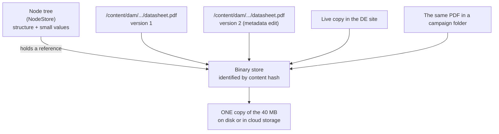
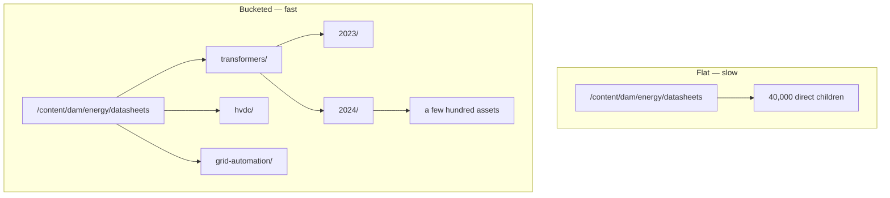
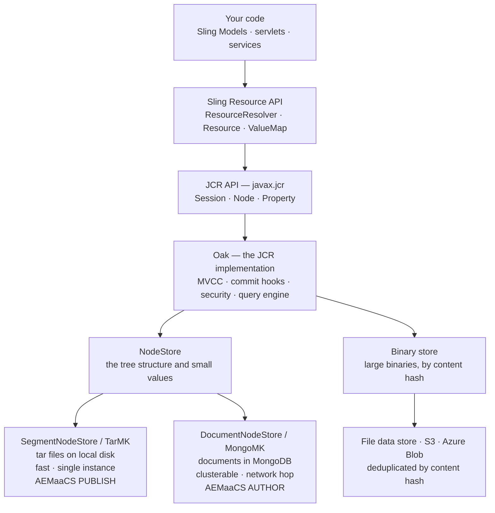
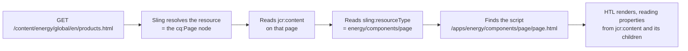

# 20 – JCR, Oak and the Repository

> **Target:** 3–4 years experienced AEM Developer
> **Companies:** Valtech, Publicis Sapient, Deloitte Digital, Cognizant, Accenture, TCS, Capgemini, Infosys, IBM, LTIMindtree
> **Project domain:** a global energy technology company's marketing site.

---

## Before we start — this is the floor everything else stands on

Every file in this repository so far has quietly assumed this one.

File 02 built components — those are nodes. File 03 built templates and policies — those are nodes under `/conf`. File 05's Sling Models read properties — those are JCR properties. File 13's permissions are stored as nodes. File 18's replication moves nodes between instances. **Everything in AEM is the repository.** There is no second place where things live.

So this file is the floor. And it has a particular character in interviews that is worth naming up front.

**Interviewers use this topic to separate two kinds of candidate.** Someone who has only authored and assembled will describe the repository as "the tree in CRXDE." Someone who has actually operated AEM will tell you *why* a page has a `jcr:content` child, *why* binaries are not stored with the nodes, and *what happens to disk usage when nobody runs revision cleanup*. Your four years of support experience is a real advantage here — you have almost certainly seen a disk fill up or a repository grow strangely, and that is exactly the kind of story this topic rewards.

**One warning before we start, and please take it seriously.**

This topic is full of near-misses — facts that are *almost* right. "AEMaaCS uses MongoDB" is a near-miss. "Oak is Jackrabbit version 3" is a near-miss. "Binaries are stored in the node store" is a near-miss. A near-miss is worse than an honest "I'd have to check," because it sounds confident and it is wrong, and an interviewer who knows Oak will hear it instantly.

So throughout this file, where a fact is precise, it is stated precisely and marked. Where the honest answer is "the mechanism works like this, and the exact naming varies," it is written that way deliberately. **Say the mechanism, not a name you half-remember.** That is a stronger answer, not a weaker one.

---

## 1. Introduction

### 1.1 What problem does a content repository solve?

Start with the alternative, because the improvement is the point.

Imagine building a CMS on a normal relational database. You need a `pages` table. Pages have titles, so a `title` column. Then marketing wants a subtitle on some pages — add a column, nullable. Then product pages need a datasheet reference, but news pages need a publication date, and event pages need a venue. Six months in, your `pages` table has ninety columns, eighty of which are null on any given row.

Then someone asks for a page hierarchy. In SQL that is a `parent_id` self-join, and "give me every page under `/products/transformers`" becomes a recursive query. Then someone asks for version history, and you build a `page_versions` table and copy rows into it. Then someone asks who is allowed to edit which branch, and you build a permissions table keyed by path prefix.

**Every one of those problems is solved once, in the specification, by JCR.**

- Content is a **tree**, natively. Hierarchy is not a join, it is the storage model.
- Nodes are **schema-flexible**. A node can have whatever properties it needs, and two sibling nodes can have completely different ones.
- **Versioning, observation and access control are in the specification** — not bolted on by each application.

That is what a content repository is: a database whose data model is a tree of nodes with arbitrary properties, with versioning, events and security built in.

### 1.2 JCR — the specification

**JCR stands for Java Content Repository.** It is a Java specification, not a product.

- **JSR-170** was JCR 1.0 (2005).
- **JSR-283** is **JCR 2.0** (2009), and this is the one AEM implements.

The API lives in the `javax.jcr` package: `Repository`, `Session`, `Node`, `Property`, `Value`, `Workspace`, `QueryManager`. If you have ever written `node.getProperty("jcr:title").getString()`, you have used it.

**Say this precisely in an interview**, because the version numbers are a cheap credibility point:

> "JCR is the Java Content Repository specification — JSR-283 for JCR 2.0, which is the version AEM implements. It defines content as a hierarchy of nodes and properties, and it puts versioning, observation and access control into the specification itself rather than leaving each application to invent them."

### 1.3 Oak — the implementation, and why it replaced classic Jackrabbit

A specification needs an implementation. AEM's is **Apache Jackrabbit Oak**, usually just called **Oak**.

**The naming trips people up, so get this right.** Apache Jackrabbit is the older project — often called "classic Jackrabbit" or Jackrabbit 2.x. Oak is a **separate, newer project** under the same Apache Jackrabbit umbrella. It is **not** "Jackrabbit version 3." Saying that is a near-miss an interviewer will catch.

**Which AEM versions use which:**

| Product | Repository implementation |
|---|---|
| CQ 5.x | Classic Jackrabbit 2.x |
| AEM 6.0 onwards | **Apache Jackrabbit Oak** |
| AEM 6.5 | Oak |
| AEM as a Cloud Service | Oak |

**Now the interesting part — why did Adobe move?** This is the actual question, and there are three reasons worth knowing.

**Reason one — clustering.** Classic Jackrabbit was built around a single repository instance owning its storage. If you wanted several author instances sharing one set of content, you were fighting the design. Oak was built from the start with a **pluggable storage layer**, and one of those plug-ins stores content in a shared database that several instances can use simultaneously. That is what makes a clustered author tier possible — and it is exactly what AEM as a Cloud Service needs.

**Reason two — scale.** Enterprise repositories grew from thousands of nodes to tens of millions. Classic Jackrabbit's design assumed more of the working set would be in memory and used coarser locking. Oak uses **MVCC** — multi-version concurrency control — so readers never block writers and writers never block readers. Each session sees a consistent snapshot of the tree.

**Reason three — a proper query engine with pluggable indexes.** Oak treats indexing as a first-class, pluggable concern with a cost-based query planner. That is the whole of file 21.

**The consequence of MVCC that you will actually meet.** Because writes are optimistic rather than lock-based, two sessions changing the same node concurrently do not queue up — the second one fails at commit time with a `CommitFailedException` about unresolved conflicts. This is why concurrent writes to the same node (a hit counter on a page node, for instance) are a genuinely bad pattern in AEM, and why heavy write workloads get pushed into Sling Jobs (file 10) instead of happening inline.

**The interview answer — about 45 seconds:**

> "AEM uses Apache Jackrabbit Oak, which implements JCR 2.0. Oak replaced classic Jackrabbit from AEM 6.0 onwards — and it's worth being precise that Oak is a separate project, not Jackrabbit version 3.
>
> The move happened for three reasons. Clustering: Oak has a pluggable storage layer, and one of those options lets several instances share one repository, which is what a clustered author tier needs. Scale: Oak uses MVCC, so readers and writers don't block each other, which matters at tens of millions of nodes. And a proper cost-based query engine with pluggable indexes.
>
> The MVCC part has a practical consequence — concurrent writes to the same node don't queue, they fail at commit with a conflict. So write-heavy patterns like counters on a content node are something we deliberately avoid."

### 1.4 Where this shows up in your daily work

You touch the repository constantly without thinking about it:

- Every dialog you build writes **properties on a node**.
- Every Sling Model you write **reads properties from a node** (file 05).
- Every `sling:resourceType` is a **string property** that Sling resolves into a script (file 01).
- Every permission you grant is stored as **nodes under an access control list** (file 13).
- Every activation copies **a node subtree** from author to publish (file 18).
- Every clientlib is a **node of a specific primary type** (file 04).

The repository is not a topic that sits beside AEM development. It *is* AEM development, seen from underneath.

### 1.5 A real project example to adapt

> "On our energy site the repository is the thing I ended up understanding best, mostly because of incidents. We run AEM as a Cloud Service — author is a clustered tier on a shared document store, publish is a set of pods each with its own local segment store, which is why publish scales out by adding pods and author doesn't. Binaries go to a separate blob store, so a two-hundred-megabyte datasheet is stored once and referenced by every page version that points at it rather than being copied per version.
>
> The two things I've personally dealt with are repository growth and structure. We had a migration that created about forty thousand asset nodes as direct children of one folder, and everything touching that folder got slow — that taught me the flat-structure problem properly. And on the 6.5 environment we inherited before the cloud move, disk usage was climbing steadily because revision cleanup and data store garbage collection weren't running in the maintenance window. Both of those are things I can walk through end to end."

That paragraph pre-empts four follow-ups — node stores, blob stores, flat structures and maintenance — and every one of them is a topic in this file.

---

## 2. Core Concepts

### 2.1 Nodes and properties — the two things that exist

The data model is genuinely this small. There are **nodes** and there are **properties**.

**A node** is a point in the tree. It has:
- a **name** (the segment in the path — `en`, `jcr:content`, `teaser`)
- a **path** (`/content/energy/global/en/jcr:content/root/teaser`)
- a **primary type** — exactly one, stored in the `jcr:primaryType` property
- optionally **mixin types** — zero or more, stored in `jcr:mixinTypes`
- **child nodes** and **properties**

**A property** is a named value attached to a node. It has a **type**, and JCR defines the set: `String`, `Long`, `Double`, `Decimal`, `Boolean`, `Date`, `Binary`, `Name`, `Path`, `Reference`, `WeakReference`, `URI`. A property can be **single-valued** or **multi-valued** (an array).

**A detail that catches people in interviews:** JCR has `Long`, not `Integer`. When your dialog stores a number, it lands in the repository as a Long. That is why in file 05 you inject `Integer maxItems` and Sling does the conversion for you — the underlying property is a Long.

**And the one about dates:** a JCR `Date` maps to `java.util.Calendar` in Java, not `Date`. That is why `@ValueMapValue private Calendar publishDate;` is the right shape.

Here is an actual piece of our site:

```
/content/energy/global/en/products/transformers          ← node, type cq:Page
  ├── jcr:primaryType = "cq:Page"                        ← property, type Name
  └── jcr:content                                        ← node, type cq:PageContent
       ├── jcr:primaryType = "cq:PageContent"
       ├── jcr:title = "Power Transformers"              ← property, String
       ├── jcr:created = 2024-03-11T09:14:22.108+05:30   ← property, Date
       ├── sling:resourceType = "energy/components/page" ← property, String
       ├── cq:template = "/conf/energy/settings/wcm/templates/product-page"
       ├── cq:tags = ["energy:products/transformers",    ← property, MULTI-VALUE
       │              "energy:segments/utilities"]
       └── root                                          ← node, nt:unstructured
            └── teaser                                   ← node, nt:unstructured
                 ├── sling:resourceType = "energy/components/teaser"
                 └── jcr:title = "Built for the grid"
```

**Read that structure carefully — there is a lot in it.** The page's own node holds almost nothing. All the content is on `jcr:content`. The components are nodes under `jcr:content/root`. And `sling:resourceType` — the single most important property in AEM — is just a plain String.

### 2.2 Namespaces — reading a property name

The prefix before the colon is a **namespace**, and it tells you **who defined that name**. Being able to decode a prefix on sight is a small thing that signals you have actually read the repository rather than only clicked around it.

| Prefix | Who defined it | Examples |
|---|---|---|
| `jcr:` | The JCR specification itself | `jcr:primaryType`, `jcr:content`, `jcr:title`, `jcr:created`, `jcr:data`, `jcr:uuid` |
| `nt:` | JCR's built-in **node types** | `nt:unstructured`, `nt:folder`, `nt:file`, `nt:resource`, `nt:base` |
| `mix:` | JCR's built-in **mixin** types | `mix:versionable`, `mix:referenceable`, `mix:lockable`, `mix:title` |
| `sling:` | Apache Sling | `sling:resourceType`, `sling:resourceSuperType`, `sling:Folder`, `sling:OrderedFolder` |
| `cq:` | AEM itself — CQ was the old product name, Day Communiqué | `cq:Page`, `cq:PageContent`, `cq:Component`, `cq:Template`, `cq:template`, `cq:tags` |
| `dam:` | AEM Assets | `dam:Asset`, `dam:AssetContent` |
| `rep:` | Oak — mostly **security** | `rep:User`, `rep:Group`, `rep:SystemUser`, `rep:policy`, `rep:principalName` |
| `oak:` | Oak **internals** | `oak:index`, `oak:QueryIndexDefinition` |
| `granite:` | Adobe's Granite platform layer | authoring UI internals |

**Two things to notice, because interviewers ask both.**

**`jcr:` versus `cq:` matters.** `jcr:title` is a specification-defined name that any JCR repository understands. `cq:template` is Adobe's own. When you say "this is a `cq:` property, so it's AEM-specific rather than standard JCR," you have shown you know the difference between the platform and the specification.

**`rep:` and `oak:` are Oak's own, and you generally do not create them.** If you find yourself writing a `rep:` property by hand, stop — you are almost certainly meant to be using the access control API instead (file 13).

**Why a Java field can't be called `jcr:title`.** A colon is not legal in a Java identifier. That is the entire reason `@Named("jcr:title")` exists in file 05:

```java
@ValueMapValue
@Named("jcr:title")     // property name has a colon; the field can't
private String title;
```

### 2.3 Primary types and mixins

**Every node has exactly one primary type.** It is stored in `jcr:primaryType` and it defines what that node is allowed to contain — which properties, which child nodes, and whether children keep an order.

**A node can also have zero or more mixins.** A mixin is an **optional add-on type** that grants extra capabilities. They are stored as a multi-value `jcr:mixinTypes` property.

The analogy that actually helps: **primary type is your job title, mixins are certifications you have added.** You have exactly one job title. You can hold several certifications, and each one lets you do something extra.

The mixins that matter in AEM:

| Mixin | What it grants | Where you meet it |
|---|---|---|
| `mix:versionable` | The node can be checked in and out; versions are kept | On `cq:PageContent` — this is how page versioning works |
| `mix:referenceable` | The node gets a stable `jcr:uuid`, so other nodes can reference it | Assets, tags, anything referenced by identity rather than path |
| `mix:lockable` | The node can be locked | Page locking in the author UI |
| `mix:created` / `mix:lastModified` | Adds the created/modified property pairs | Various content types |

**The one that carries real weight is `mix:versionable`, and here is the fact worth carrying into an interview:** in AEM it is the **`jcr:content` node** of a page that is versionable, not the page node itself. `cq:PageContent` includes `mix:versionable`. That is why a page version restores the page's *content* while the page keeps its place, its name and its URL. It is the same reasoning as the next section, and the two together make one strong answer.

### 2.4 The node types that actually matter

You do not need to memorise the whole node type registry. You need to be able to say what these are **for**, because that is how the question gets asked.

**Content types:**

| Node type | What it is for | Where |
|---|---|---|
| `nt:unstructured` | Accepts any property and any child node. No constraints, and children keep their order. | Every component instance on a page; dialog definitions |
| `cq:Page` | Marks a node as an AEM page | Everything under `/content/<site>` |
| `cq:PageContent` | The `jcr:content` child of a page — versionable | Inside every page |
| `dam:Asset` | Marks a node as a DAM asset | Under `/content/dam` |
| `nt:file` | A file — its content lives on a `jcr:content` child of type `nt:resource` | Renditions, uploaded files |
| `nt:resource` | Holds the actual bytes in a `jcr:data` binary property, plus `jcr:mimeType` | Inside every `nt:file` |

**Code and configuration types:**

| Node type | What it is for | Where |
|---|---|---|
| `cq:Component` | A component definition | `/apps/<project>/components/...` |
| `cq:Template` | A template | `/conf/<project>/settings/wcm/templates/...` |
| `cq:ClientLibraryFolder` | A clientlib — CSS/JS bundle (file 04) | `/apps/<project>/clientlibs/...` |
| `sling:Folder` | A folder that **can** hold arbitrary properties | Config folders, `/var` structures |
| `sling:OrderedFolder` | A `sling:Folder` whose children keep their order | Where sequence matters |
| `nt:folder` | A plain folder — **strict**, no arbitrary properties | Generic folders, `/content/dam` folders |

**Security types:**

| Node type | What it is for |
|---|---|
| `rep:User` | A user under `/home/users` |
| `rep:SystemUser` | A service user — no password, created for code (file 13) |
| `rep:Group` | A group under `/home/groups` |
| `rep:ACL`, `rep:GrantACE`, `rep:DenyACE` | The stored access control entries under a `rep:policy` node |

**Index types:**

| Node type | What it is for |
|---|---|
| `oak:QueryIndexDefinition` | An Oak index definition under `/oak:index` — all of file 21 |

### 2.5 `nt:folder` versus `sling:Folder` — the constraint-violation trap

This one deserves its own section because it produces an error message that tells you almost nothing, and because it is a favourite interview question for exactly that reason.

**`nt:folder` is strict.** It is defined to hold hierarchy nodes — other folders and files — and it does **not** permit arbitrary properties. Try to write your own property onto an `nt:folder` node and the commit fails with a **constraint violation**.

**`sling:Folder` is permissive.** Sling defined it precisely because the strictness of `nt:folder` was painful. It accepts any property and any child node.

**What this looks like in practice.** You write a small piece of code that stores a marker on a folder:

```java
Resource folder = resolver.getResource("/content/dam/energy/datasheets");
ModifiableValueMap map = folder.adaptTo(ModifiableValueMap.class);
map.put("lastSyncedAt", Calendar.getInstance());   // BOOM on an nt:folder
resolver.commit();
```

The commit throws a constraint violation, and the message names a node type rather than saying "you can't put properties here." Developers lose an hour to this.

**The fix is one of two things.** Either change the folder's primary type to `sling:Folder` (which is what you want for a folder you own), or — better in DAM, where you should not be fighting the asset structure — store the marker on a **child node** of type `nt:unstructured` instead of on the folder itself.

**A related gotcha in the same family:** if you create folders through the Assets UI you get one type, and if you create them through CRXDE by picking a type yourself you get another. Mixed folder types under `/content/dam` is a real source of "this works in one folder and not the other."

**The interview answer — about 30 seconds:**

> "`nt:folder` is a strict node type — it's defined to hold files and other folders and it won't accept arbitrary properties. `sling:Folder` is Sling's permissive version, which accepts any property and any child.
>
> The reason it matters practically is the error you get: if code writes a property onto an `nt:folder` node, the commit fails with a constraint violation, and the message names a node type rather than explaining the actual problem. I've seen an hour lost to that. So if a folder needs to carry properties, it should be `sling:Folder`, or the properties should live on an `nt:unstructured` child rather than on the folder itself."

### 2.6 The `cq:Page` / `jcr:content` split — and why it exists

This is the single most important structural fact in AEM, and interviewers use it as a filter. Almost everyone can say *that* pages have a `jcr:content`. Far fewer can say *why*.

**The structure:**

```
/content/energy/global/en/products          ← cq:Page      — the ENVELOPE
  ├── jcr:content                           ← cq:PageContent — the LETTER
  │    ├── jcr:title = "Products"
  │    ├── cq:template = "..."
  │    ├── sling:resourceType = "..."
  │    ├── cq:lastModified, cq:lastModifiedBy
  │    └── root/  (the components)
  ├── transformers                          ← a child cq:Page
  ├── hvdc-systems                          ← a child cq:Page
  └── grid-automation                       ← a child cq:Page
```

**The principle:** the `cq:Page` node is the page's **identity**. Its name is the URL segment, its position in the tree is the site structure, and its children are the child pages. The `jcr:content` node is the page's **content**. Everything an author can change lives there.

**Now — the four reasons this separation is necessary.** Give two of them and you have answered well; give all four and you have answered better than most people with more experience.

**Reason one — versioning.** A version captures the `jcr:content` subtree, because `cq:PageContent` is the versionable node. Restoring a version replaces the content while the page stays exactly where it is, keeps its name, keeps its URL and keeps its children. If content lived on the page node, restoring a version would mean restoring the node that also holds all the child pages — which is a completely different and much more dangerous operation.

**Reason two — child pages are not content.** Look at the tree above. `transformers` is a **sibling of `jcr:content`**, not inside it. That means "the pages below this page" and "the content of this page" are two cleanly separated subtrees. Deleting all a page's content does not touch its children.

**Reason three — publishing and MSM.** Replication and live copies operate on subtrees. Because content is one clean subtree, you can roll out content changes to a live copy without touching the live copy's page structure, and vice versa. File 12's rollout configurations depend on exactly this separation.

**Reason four — the URL.** `/content/energy/global/en/products.html` resolves to the page node. Sling then reads `jcr:content`'s `sling:resourceType` to find the rendering script (file 01). If content and identity were the same node, the resource type would have to sit on the node that also defines the URL structure — which is a much messier contract.

**The line to remember, and it is genuinely memorable:**

> **`cq:Page` is the envelope. `jcr:content` is the letter inside it. You can replace the letter without moving the envelope.**

**Two practical consequences a developer meets constantly:**

`page.getPath()` gives you `/content/.../products`, but `page.getContentResource().getPath()` gives you `/content/.../products/jcr:content`. Mixing those up is the cause of a great many "my property is null" bugs, because you read the property from the page node where it does not exist.

And in file 05, `currentPage.getProperties()` reads from `jcr:content`, which is what you want — but `currentPage.adaptTo(Resource.class).getValueMap()` reads from the **page node**, which is nearly empty. That distinction is worth internalising.

### 2.7 The repository tree — where everything lives and why

The tree is not arbitrary. **Each top-level branch has a rule about who writes to it**, and that rule is the actual content of the answer.

**`/apps` — your code.** Components, template *types*, clientlibs, servlet scripts, your OSGi configurations, and your Oak index definitions. It arrives through a deployment, not through a UI. Nobody edits it by hand on a running production instance.

**`/libs` — Adobe's code.** Every out-of-the-box component and every piece of the authoring UI. **Never edit `/libs`.** Not once. A service pack or an upgrade replaces `/libs` wholesale and your change vanishes silently. If you need to change something there, you overlay it — copy it to the same relative path under `/apps`.

**`/content` — authored content.** Pages under `/content/<site>`, assets under `/content/dam`, experience fragments under `/content/experience-fragments`, tags under `/content/cq:tags`, and launches under `/content/launches`. Authors write here; developers generally do not.

**`/conf` — configuration that belongs to a site or brand.** Editable templates and their policies (file 03), Content Fragment models (file 15), context-aware configuration, and workflow models. The distinguishing question: does this differ per **brand or site**? Then `/conf`. Does it differ per **environment**? Then an OSGi configuration in `/apps` (file 06).

**`/var` — runtime data AEM generates as it runs.** Workflow instances, audit logs, event data, statistics, and various caches. **This is the branch that grows**, and it is the first place to look when a repository is unexpectedly large. It is also the branch that maintenance tasks exist to prune.

**`/home` — users and groups.** `/home/users` and `/home/groups`, including `/home/users/system` for service users (file 13).

**`/etc` — the legacy area.** In older AEM this held a great deal; most of it moved out in the 6.4/6.5 repository restructuring (section 2.13). What remains in practice is `/etc/packages` and `/etc/map` for URL mappings.

**`/oak:index` — Oak's index definitions.** All of file 21 lives here.

**`/tmp` — scratch space.** A genuine repository path meant for transient content. Things written here are not meant to survive, and it gets cleaned. Do not put anything you care about in it.

**`/jcr:system` — the specification's own storage.** Version history lives under `/jcr:system/rep:versionStorage`, along with the node type registry, namespace registry and the permission store. You read it occasionally when debugging versions; you never write to it directly.

**Two paths that are not really nodes.** `/system` (the Felix console and health checks) and `/bin` (servlet endpoints) are **virtual** — they are served by servlets, not stored as content. Looking for `/bin/energy/cards` in CRXDE and not finding it is expected behaviour, not a bug. This surprises people from file 07.

### 2.8 Immutable versus mutable — the AEMaaCS distinction

On AEM 6.5 the whole repository is writable at runtime. Someone with admin rights can open CRXDE on production and change `/apps`. It is a bad idea, but it is possible.

**On AEM as a Cloud Service, that possibility is removed by design**, and the repository is split in two.

**Immutable content: `/apps` and `/libs`.** These are built into the container image at deployment time and are **read-only at runtime**. You cannot write to them, no matter who you are. There is no CRXDE-on-production escape hatch.

**Mutable content: everything else** — `/content`, `/conf`, `/var`, `/home`, `/etc`, `/oak:index`, `/tmp`. This is the actual live data of the environment and it persists across deployments.

**Why this matters far more than it first appears** — three consequences that come up constantly:

**One — configuration must be in code.** An OSGi config typed into the web console on 6.5 survives until someone restarts. On AEMaaCS it cannot even be typed in, because it belongs under `/apps`. Everything is a file in the build (file 14).

**Two — permissions and service users must be created by Repoinit.** You cannot install-hook them, and you cannot create them by hand and expect them to survive, because pods are recreated from the image. Repoinit statements run at startup and put them into the mutable area (file 13).

**Three — this is the reason for the `ui.apps` / `ui.content` package split** in the Maven project. `ui.apps` carries immutable content and is deployed with the image; `ui.content` carries mutable content and is installed into the running repository. Mixing them up — putting a page under `ui.apps`, or a component under `ui.content` — is a build failure or a deployment surprise, and it is one of the checks Adobe's build-time analysis catches.

**Where index definitions sit in this picture, precisely.** Custom Oak index definitions are authored in the project under `ui.apps` and **ship as part of the immutable build**, even though they land at `/oak:index`, which is a mutable path. Practically: you treat index definitions as code, you version them in git, and you never hand-edit them on a cloud environment. File 21 covers the naming convention that makes this work.

### 2.9 NodeStore — SegmentNodeStore versus DocumentNodeStore

This is the highest-value section in the file, and it is also where the classic near-miss lives. Read it twice.

**The concept first.** Oak separates *"what the content tree looks like"* from *"how the bytes are persisted."* The layer that persists the tree is called the **NodeStore**, and Oak has two production implementations.

**SegmentNodeStore — commonly called TarMK.**

It writes the content tree into **segments packed inside `.tar` files on local disk**. Reads are local file reads, so it is **fast**. But it is files on one machine's disk, and exactly **one AEM instance can own a given segment store at a time**. You cannot point two instances at it and expect them to share.

**DocumentNodeStore — commonly called MongoMK when the backend is MongoDB.**

It stores the content tree as **documents in a database**, most commonly MongoDB. (There is also an RDB variant backed by a relational database, which you will rarely meet in practice.) Every read may cross the network, so it is **slower than local disk**. In exchange, **several AEM instances can share the same store** — which is what makes clustering possible.

**The trade-off in one line:**

> **Segment is faster. Document can cluster. You pick based on whether you need more than one instance sharing the content.**

**Now — the near-miss. Read this paragraph slowly.**

**On AEM as a Cloud Service:**

- **Author uses DocumentNodeStore, on MongoDB.** The author tier is a **cluster** — several instances serving the same set of authors, all seeing the same content. That requires a shared store.
- **Publish uses SegmentNodeStore.** Each publish pod holds **its own local copy** of the content. Pods are essentially read-only from the application's point of view — content arrives by distribution from author (file 18) — so the right optimisation is raw local speed, not sharing.

**The wrong answers you will hear, and might say by accident:**

| Near-miss | Why it's wrong |
|---|---|
| "AEMaaCS uses MongoDB" | Only for **author**. Publish is Segment. |
| "AEMaaCS publish is clustered on Mongo" | Publish pods scale out, but each has its **own** segment store. That is not a repository cluster. |
| "Author uses TarMK because it's faster" | Author needs sharing, and TarMK cannot share. |
| "TarMK supports clustering" | It does not. One instance per segment store. |

**Why publish being Segment is actually elegant.** Publish pods auto-scale — under load, more pods appear. If they all shared one repository, that repository would become the bottleneck and adding pods would help less and less. Because each pod has its own local copy and content is pushed to it, adding a pod adds capacity almost linearly. **Scaling out and sharing state pull in opposite directions, and Adobe chose not to share on the tier that needs to scale.**

**On AEM 6.5 on-premise**, the picture is simpler: most installations use **TarMK on both author and publish**, and a clustered author using MongoMK exists but is used far less often than people assume. If asked about 6.5, "TarMK by default on both tiers; MongoMK only where a clustered author was genuinely required" is the accurate answer.

**One more thing worth knowing about 6.5, because it gets confused with clustering.** TarMK **Cold Standby** is a disaster-recovery arrangement where a standby instance continuously receives segment data from a primary. It is **not** a cluster — the standby is not serving traffic and not accepting writes. Calling it clustering is another near-miss.

**The interview answer — about 75 seconds:**

> "Oak separates the content tree from how it's persisted, and that persistence layer is the NodeStore. There are two production implementations.
>
> SegmentNodeStore — TarMK — writes segments into tar files on local disk. It's the fastest option because reads are local, but only one instance can own a given segment store, so it can't be shared.
>
> DocumentNodeStore — MongoMK when the backend is MongoDB — stores nodes as documents in a shared database. Every read may cross the network so it's slower, but multiple instances can share it, which is what makes clustering possible.
>
> On AEM as a Cloud Service the split is specific and worth getting exactly right: **author uses Document on MongoDB, because the author tier is clustered and all authors must see the same content. Publish uses Segment, because each publish pod holds its own local copy and content arrives by distribution.**
>
> The reason that's the right design is that publish auto-scales. If every pod shared one repository, the repository would become the bottleneck and adding pods would stop helping. Because each pod is independent, capacity scales almost linearly.
>
> On 6.5 on-premise it's usually TarMK on both tiers, with MongoMK only where a clustered author was genuinely needed."

### 2.10 BlobStore / DataStore — where binaries actually go

**Start with the problem**, because the design only makes sense once you feel the pain it avoids.

Our energy site has product datasheets. A high-resolution transformer datasheet PDF is 40 MB. The site has thousands of them, plus product photography, plus video.

Now: **someone edits the page that links to that datasheet, and AEM creates a version.** If the binary were stored inside the node tree, versioning that subtree would mean duplicating 40 MB. Do that on every edit, across thousands of assets, and the repository grows without bound while the actual content barely changes.

**So Oak stores binaries separately.** The node tree holds the structure and the small values; **large binary values are written to a separate store and the node holds only a reference to them.**

**The two names, and what they mean.** You will hear both **BlobStore** and **DataStore**, and people use them loosely. The honest, safe framing:

> "Binaries are held outside the node tree, in a separate binary store. Oak has more than one implementation of that — a file-based one, and cloud-backed ones for S3 and Azure Blob. The node tree keeps a reference, not the bytes."

That is accurate and it sidesteps the internal naming, which genuinely varies between Oak versions and AEM versions. **This is exactly the kind of place where being slightly less specific is the stronger answer.**

**The mechanism that makes it powerful — content addressing.**

Binaries are identified by a **cryptographic hash of their content**. That gives you two things for free:

**Deduplication.** Upload the same PDF twice, into two different DAM folders, and there is **one copy of the bytes** with two nodes referencing it. Marketing teams do this constantly — the same brochure lands in three campaign folders — and it costs almost nothing.

**Cheap versioning and cheap copies.** Version a page a hundred times, and every version references the same binary. Create an MSM live copy of a whole country site (file 12), and the copied nodes reference the same binaries. **Copying a subtree does not copy binaries.**



**Where the binary store actually lives:**

| Setup | Binary storage |
|---|---|
| AEM 6.5, single instance | A file data store on local disk |
| AEM 6.5, clustered or shared | A shared file data store, or S3 / Azure Blob |
| AEM as a Cloud Service | Cloud object storage, managed by Adobe |

**The consequence that produces incidents — and this is a genuinely good story to be able to tell.** Because deletion is decoupled from the node tree, **deleting an asset does not immediately free the disk space.** The node goes; the blob stays until garbage collection runs and confirms that nothing references it any more. On a 6.5 environment where data store GC is not running, you can delete gigabytes of assets and watch disk usage not move at all. Section 2.12 covers the maintenance side.

**Direct binary upload — worth one sentence for AEMaaCS.** On the cloud service, large asset uploads go from the client **straight to cloud storage**, with AEM issuing the upload URL and being told when it completes, rather than the bytes streaming through the AEM JVM. That is why asset ingestion behaves differently there and why the old "upload times out through AEM" problem largely went away.

### 2.11 Sessions, ResourceResolver, and how they leak

Now the API layer — because this is where developers actually cause repository problems.

**A `Session` (`javax.jcr.Session`) is a JCR login.** It represents one user's connection to the repository, it carries that user's permissions, and — because of MVCC — it sees a **consistent snapshot** of the content from when it was opened.

**A `ResourceResolver` is Sling's abstraction on top of it.** It is what you actually use in AEM code, and it does more than JCR: it applies **resource type resolution**, **resource mappings** (short URLs), and it can resolve resources that are not JCR-backed at all.

**The relationship, precisely:**

```java
// A ResourceResolver WRAPS a JCR Session. You can reach through:
Session session = resourceResolver.adaptTo(Session.class);
```

**And the rule that matters most:** that session belongs to the resolver. **Do not log it out.** Closing the resolver closes the session. Logging the session out from under the resolver breaks the resolver in a way that is very confusing to debug.

**Which API to use, and the honest answer for an interview:**

> "I work with `ResourceResolver` almost always. It's the Sling-level abstraction, it gives me resource types and mappings, it's what Sling Models and every AEM API expect, and it doesn't force me to handle `RepositoryException` on every read.
>
> I drop to the JCR `Session` only for things that genuinely aren't in the Sling API — versioning operations, the node type registry, JCR observation, or some access control work. And even then I get the session by adapting the resolver rather than opening a second one."

**Now the leak, because this is the production issue.**

Each session and each resolver holds repository state — a snapshot, memory, and a slot in the repository's accounting. If you open one and never close it, that state is never released. Do it inside a request or a scheduled job, and you leak **once per execution**. That compounds until the instance runs out of memory.

**The ownership rule, which is file 13's rule and worth repeating because it is inverted from what people expect:**

> **Close what you opened. Never close what Sling gave you.**

```java
// You OPENED this. You close it. try-with-resources does it for you.
try (ResourceResolver resolver =
         resolverFactory.getServiceResourceResolver(AUTH_INFO)) {
    Resource r = resolver.getResource("/content/energy/global/en");
    // ... work ...
}   // closed automatically, even if something throws

// Sling opened this one and Sling will close it at the end of the request.
// Closing it yourself BREAKS the rest of the request.
ResourceResolver requestResolver = request.getResourceResolver();
```

**The stale-snapshot bug, which is subtler and worth knowing.** Because a session sees a snapshot, a **long-lived** resolver — one held in a field of an OSGi service and reused for hours — gradually goes stale. It keeps returning content as it was when it was opened. The symptom is "my scheduled job doesn't see content that was published an hour ago," and the cause is a resolver that should have been opened per execution and closed. `session.refresh(true)` exists, but the right fix is almost always a shorter-lived resolver.

**How to see leaks:** the JMX console at `/system/console/jmx` exposes repository session information. A session count that climbs steadily and never comes back down is the signature. If it climbs in step with a scheduled job's interval, you have found the culprit.

### 2.12 Repository maintenance on 6.5 — and why a disk fills up

**This is where your support background is worth the most.** These are operational facts, and being able to state them confidently sets you apart from developers who have only ever worked on a laptop instance.

**The underlying reason maintenance is needed at all:** Oak does not overwrite data in place. Because of MVCC, a change writes **new** data and leaves the old revision in place so that sessions holding an older snapshot still work. Old revisions become garbage once nothing needs them — but **garbage is not reclaimed automatically as it becomes garbage.** Something has to sweep it up.

**Two different sweeps, for two different stores. Do not confuse them — interviewers do ask.**

**Revision garbage collection (also called compaction) — cleans the NODE store.**

On TarMK, old revisions accumulate inside the tar files. Revision GC works out what is still reachable, rewrites the live data compactly, and removes the old segments. Without it, the tar files grow steadily even when the content is not growing. On a busy author instance this is dramatic — a repository can be several times larger than its actual content.

It runs in phases — estimation, compaction, and clean-up — and it is designed to run **online**, in a maintenance window, while the instance is up. There is also an **offline** compaction using the `oak-run` tool, which is more thorough but requires the instance to be stopped, and is what you reach for when online cleanup has fallen too far behind.

DocumentNodeStore has its own equivalent revision garbage collection, removing superseded revisions from the backing database.

**Data store garbage collection — cleans the BINARY store.**

This is the one that explains "we deleted 200 GB of assets and disk usage didn't change." Deleting an asset removes the node; the blob is only removed once GC confirms nothing references it.

It works as **mark and sweep** — first mark everything still referenced, then sweep away what was not marked. **The critical operational detail:** if several instances share one data store, you must run the **mark phase on every instance that references it** before running the sweep. Sweeping based on only one instance's references would delete blobs that another instance still uses. That is a genuinely bad day, and knowing this rule marks you as someone who has operated AEM rather than only developed on it.

**Where you configure this on 6.5.** The **Operations Dashboard**, at `/libs/granite/operations/content/maintenance.html`, holds maintenance windows — typically a daily one and a weekly one — with tasks assigned to them. The heavier repository tasks (revision clean-up, data store GC, Lucene binaries cleanup) sit in the weekly window; the content-pruning tasks (workflow purge, audit log maintenance, version purge) sit in the daily window. **The exact defaults vary by version and by what the previous team configured, so the honest answer is "I check the Operations Dashboard to see which tasks are actually enabled and when they last succeeded."**

**The other tasks that keep `/var` under control**, and which cause slow bloat when they are off:

| Task | What it prunes | Symptom when it isn't running |
|---|---|---|
| Workflow purge | Completed workflow instances under `/var/workflow` | `/var` grows continuously; workflow console gets slow |
| Audit log maintenance | Audit entries under `/var/audit` | `/var` grows; page properties dialogs slow down |
| Version purge | Old page versions in version storage | Repository grows; version history unmanageable |
| Lucene binaries cleanup | Old index binaries | Disk grows even with stable content |

**On AEM as a Cloud Service, all of this is Adobe's problem.** Revision cleanup, data store GC and index maintenance are managed by the platform. **You do not configure maintenance windows on AEMaaCS** — and saying so, rather than describing a maintenance dashboard that is not there, is the accurate answer.

**But do not overstate it.** What is still yours on the cloud service: not creating unbounded content (a job that writes a node per run into one folder forever will still cause you a problem), keeping workflow and version growth sane, and structuring content so it does not go flat.

**The interview answer — about 60 seconds:**

> "Oak doesn't overwrite in place — because of MVCC, a change writes new data and leaves the old revision behind so existing sessions stay consistent. So garbage accumulates and something has to reclaim it.
>
> There are two separate collections and it's worth keeping them apart. **Revision garbage collection**, or compaction, cleans the node store — on TarMK it rewrites the live data compactly and drops the old segments. Without it, tar files grow even when content doesn't. **Data store garbage collection** cleans the binary store, and it's mark-and-sweep. That's the one that explains the classic incident where you delete a lot of assets and disk usage doesn't move — the nodes are gone but the blobs aren't reclaimed until GC runs.
>
> The operational detail I'd flag: if several instances share one data store, you have to run the mark phase on all of them before sweeping, or you'll delete blobs another instance still references.
>
> On 6.5 these are maintenance tasks in the Operations Dashboard, and the first thing I check on a repository-growth ticket is whether they're actually enabled and when they last succeeded. On AEM as a Cloud Service Adobe manages all of it — there's no maintenance window for me to configure."

### 2.13 Observation — how AEM knows something changed

The repository can tell you when it changes. This is the mechanism behind a great deal of AEM, and it is also a classic source of self-inflicted performance problems, which ties directly to file 10.

**Two APIs, and one is clearly preferred:**

**JCR observation** (`javax.jcr.observation.EventListener`) is the specification-level API. You register for event types — node added, node removed, property changed — under a path, and Oak calls you.

**Sling's `ResourceChangeListener`** is the modern, recommended API in AEM. You declare paths and change types as OSGi component properties, and you receive resource-level changes. File 10 has the full treatment:

```java
@Component(
    service = ResourceChangeListener.class,
    property = {
        ResourceChangeListener.PATHS + "=/content/energy/global/en/products",
        ResourceChangeListener.CHANGES + "=ADDED",
        ResourceChangeListener.CHANGES + "=CHANGED"
    }
)
public class ProductPageChangeListener implements ResourceChangeListener { }
```

**Prefer `ResourceChangeListener`** for three reasons: it is at the Sling resource level rather than raw JCR, it is configured declaratively rather than by writing registration code, and — importantly — it works in a distributed setup where JCR observation semantics get murky.

**Now the part that causes incidents: the observation queue.**

Changes are delivered **asynchronously**. Each listener effectively has a queue of pending changes. Oak commits the write, queues the events, and delivers them to listeners on a background thread.

**So what happens if a listener is slow?** Its queue backs up. And when queues back up badly, Oak does not silently discard the problem — it logs warnings, and the pressure can reach back into the write path itself, slowing commits down. **One badly written listener degrades authoring for everyone**, and the symptom — "the author instance got slow after we deployed" — points nowhere near the actual cause.

**The three rules for writing one:**

**Rule one — narrow the path.** Registering on `/content` means you are woken by every change anywhere in the site. Register on the smallest branch that actually matters.

**Rule two — do nothing in the listener.** The listener should decide "is this relevant?" and, if so, **hand off to a Sling Job** (file 10) and return immediately. Any real work — a repository write, an external call, a cache flush — happens in the job, not in the listener. This single rule prevents most observation incidents.

**Rule three — never write in a way that re-triggers yourself.** A listener on `/content/energy` that writes back to `/content/energy` will fire itself again. Infinite loops in observation are real and they are very effective at taking an instance down.

**How to diagnose it:** the observation MBeans in `/system/console/jmx` expose per-listener queue information. A backlog that grows and does not drain is the signature. If an author instance became slow after a deployment, this is on the shortlist alongside indexes.

### 2.14 Versioning

Versioning is in the JCR specification, and AEM builds on it.

**The mechanics.** A node with the `mix:versionable` mixin can be **checked in**, which captures its state — including its subtree — into **version storage**, under `/jcr:system/rep:versionStorage`. Each version has an identifier, versions form a history, and you can restore one.

**In AEM, the versionable node is `jcr:content`.** This is the payoff of section 2.6: a page version is a snapshot of the page's content subtree, and restoring it puts the content back without moving the page, renaming it, or affecting its child pages.

**When AEM creates a version.** The one to know is that **activating a page creates a version** — which is genuinely useful, because it means the repository has a record of what was published each time. Versions are also created by explicit "Create Version" actions in the UI and by some workflow steps.

**What you do with them:** view and restore from the Timeline rail in the Sites console, compare two versions, and — the one people forget — **restore a deleted child page** from the parent's version history.

**The operational side.** Version storage grows, forever, unless something prunes it. That is what the version purge maintenance task is for. On a long-lived author instance with heavy publishing, version storage can become a substantial fraction of the repository. Two facts worth having: versions **do not duplicate binaries** (section 2.10 — they reference the same blobs), and version storage is **author-side**; you do not replicate version history to publish.

### 2.15 The flat structure problem

**This is one of the most common real AEM performance problems**, and it is nearly always created by a migration.

**The problem:** put too many child nodes directly under one parent, and operations on that parent get slow. Listing children, adding a child, and — depending on the store — even reading the parent all degrade.

**Why, mechanically.** The parent has to track its children. On DocumentNodeStore, a node's children are managed in a way that scales poorly once the count is very large. And it is worse for **orderable** node types: `nt:unstructured` keeps its children in a defined order, which means the ordering has to be maintained, and inserting into an ordered list of fifty thousand siblings is not cheap.

**A useful rule of thumb, stated honestly:** keep it in the **hundreds to low thousands** per level, and treat tens of thousands as a problem to fix. Adobe's guidance has shifted between versions and store types, so quote it as a rule of thumb rather than a hard number — and be ready to say *why* rather than to defend a specific figure.

**How AEM itself avoids it, which is the best evidence for the answer:** DAM uploads and many generated structures use **date-based bucketing** — `2024/03/11/` — rather than one flat folder. Look at how AEM stores generated content under `/var` and you will see the same pattern. **Copying that pattern is the fix.**

**Our project's version of this, which is a real story:** an asset migration created roughly forty thousand assets as direct children of a single DAM folder. Everything touching that folder was slow — the Assets console took many seconds to open it, and a workflow iterating over it was noticeably worse. The fix was restructuring into a hierarchy by product family and year. Nothing about the assets changed; only the shape of the tree did.

**A related and equally common case:** a scheduled job that writes one node per run into a fixed folder. It is fine for a month and unusable after a year. The fix is the same — bucket by date, and prune.



### 2.16 Repository restructuring in 6.4 / 6.5 — what moved out of `/etc`

**Why it happened.** `/etc` had become a dumping ground. Site configuration, workflow models, tags, designs, cloud service configurations and runtime data all lived there, mixed together. That created three real problems: no clean line between what a *developer* deploys and what an *author* changes; no clean line between what is **code** and what is **content**; and packaging or migrating a site meant untangling `/etc` by hand.

**So Adobe moved things out to where they belong.** The moves worth knowing:

| What | Old location (roughly) | New location |
|---|---|---|
| Tags | `/etc/tags` | `/content/cq:tags` |
| Workflow models | `/etc/workflow/models` | `/conf/global/settings/workflow/models` |
| Workflow instances (runtime) | `/etc/workflow/instances` | `/var/workflow/instances` |
| Cloud service configurations | `/etc/cloudservices` | `/conf/.../settings/cloudconfigs` |
| Designs / static design assets | `/etc/designs` | `/apps/<project>` clientlibs (file 04) |
| Launches | `/etc/launches` | `/content/launches` |
| Segments / ContextHub configuration | `/etc/segmentation` | `/conf` |

Plus others in the same spirit. **The principle behind every one of them is the thing to say**, and it is more valuable than the table:

> **Code went to `/apps`. Site configuration went to `/conf`. Content went to `/content`. Runtime data went to `/var`.** `/etc` was left holding only the genuinely legacy leftovers — in practice `/etc/packages` and `/etc/map`.

**Why an interviewer asks this.** It is a quick way to find out whether you have worked on a *modern* AEM codebase or an old one. Someone who says "templates are in `/etc`" is describing AEM from about 2015. Someone who says "editable templates are in `/conf`, and `/etc` is mostly just packages and mappings now" has worked on something current.

**Two practical notes.** Adobe shipped **compatibility packages** so upgraded instances kept working with old paths — which means an upgraded 6.5 instance may still have plenty in `/etc`. And on **AEM as a Cloud Service** there is no such backwards compatibility to lean on: the new locations are the only locations, which is one of the real work items when moving a 6.5 codebase to the cloud (file 14).

---

## 3. Internal Working

### 3.1 The Oak layer cake



**Four things to point at when you draw this:**

**Your code almost never touches JCR directly.** It goes through Sling's Resource API, which is why `ResourceResolver` rather than `Session` is the everyday object.

**Oak is where the interesting behaviour lives** — MVCC, security enforcement, the query engine and index selection.

**The NodeStore is pluggable, and that is the whole point.** The same content model runs on tar files or on MongoDB.

**Binaries branch off before the NodeStore.** They never enter the tree; the tree keeps a reference.

### 3.2 What actually happens when you save a change

```mermaid
sequenceDiagram
    participant C as Your code
    participant R as ResourceResolver
    participant S as JCR Session
    participant O as Oak core
    participant N as NodeStore
    participant B as Binary store
    participant L as Observation listeners

    C->>R: getResource + ModifiableValueMap.put(...)
    R->>S: change held as TRANSIENT state (in memory only)
    Note over S: nothing is persisted yet;<br/>nobody else can see this
    C->>R: resolver.commit()
    R->>S: session.save()
    S->>O: apply the change set
    O->>O: validate: node types, constraints, permissions
    O->>O: check for CONFLICTS with other commits (MVCC)
    alt a large binary is involved
        O->>B: write the binary, get its content hash
        B-->>O: reference (existing one if already stored)
    end
    O->>N: persist the new revision
    O->>O: update SYNCHRONOUS indexes in this same commit
    O-->>S: commit succeeds
    O->>L: queue observation events (ASYNC)
    Note over O,L: async indexes are updated later,<br/>by a background lane — file 21
    L-->>C: listeners fire on a background thread
```

**The five points to draw out, and each one is an interview answer:**

**Changes are transient until you commit.** `map.put(...)` changes nothing that anyone else can see. Forgetting `resolver.commit()` is the single most common "my code runs but nothing changes" bug in AEM.

**Validation happens at commit, not at put.** Node type constraints and permissions are checked when you save — which is why the `nt:folder` constraint violation from section 2.5 blows up on `commit()`, several lines away from the code that caused it.

**Conflicts are detected at commit.** Two sessions writing the same node concurrently: the second one fails. There is no queue.

**Synchronous indexes are updated inside the commit; asynchronous ones are not.** This is the single most important sentence for file 21, and it is why content you just wrote may not appear in a query result for a few seconds.

**Observation is asynchronous.** Your commit returns before listeners have run. Code that writes a node and immediately expects a listener to have finished is racing, and it will fail intermittently.

### 3.3 How a page becomes a URL — the repository's part



**The repository fact hiding inside this:** `sling:resourceType` lives on **`jcr:content`**, not on the page node. That is why the page node itself is almost empty, and it is why file 01's request flow has to reach one level down before it can decide anything.

---

## 4. Important Interview Questions

### 4.1 Basic

**Q1. What is JCR?**
The Java Content Repository specification — **JSR-283 for JCR 2.0**, which is what AEM implements. It defines content as a hierarchy of nodes and properties, with versioning, observation and access control in the specification itself rather than bolted on per application.

*Cross:* Which JSR? (283 for 2.0, 170 for 1.0) · Is it a product? (no, a specification) · What implements it in AEM? (Oak)

**Q2. What is Apache Jackrabbit Oak?**
AEM's JCR implementation, from AEM 6.0 onwards. It is a separate project from classic Jackrabbit — **not "Jackrabbit 3"** — built for clustering, larger scale and a pluggable, cost-based query engine.

*Cross:* Why did Adobe move from classic Jackrabbit? · What is MVCC? · Which AEM versions use Oak?

**Q3. What is a node and what is a property?**
A node is a point in the tree with a name, a path, exactly one primary type, optional mixins, children and properties. A property is a typed named value on a node — String, Long, Double, Boolean, Date, Binary, and others — single or multi-valued.

*Cross:* Does JCR have an Integer type? (**no — Long**) · What Java type is a JCR Date? (`Calendar`) · How many primary types can a node have? (exactly one)

**Q4. Name the namespaces and say who defines each.**
`jcr:` the specification · `nt:` node types · `mix:` mixins · `sling:` Apache Sling · `cq:` AEM (from Day Communiqué) · `dam:` Assets · `rep:` Oak security · `oak:` Oak internals.

*Cross:* Is `jcr:title` AEM-specific? (no — specification) · Is `cq:template` standard JCR? (no) · Why does `@Named("jcr:title")` exist? (a colon isn't legal in a Java identifier)

**Q5. What is `nt:unstructured` and why is it everywhere?**
It accepts any property and any child node with no constraints, and it keeps its children ordered. That is exactly what a component instance needs, because a dialog can store anything and component order on a page matters.

*Cross:* What's the downside of orderable types? (ordering must be maintained — worse with many siblings) · What's the alternative for a strict structure? (a constrained node type) · Where else do you see it? (dialog definitions)

**Q6. `nt:folder` versus `sling:Folder`?**
`nt:folder` is strict and refuses arbitrary properties — writing one causes a constraint violation at commit. `sling:Folder` accepts any property and any child. `sling:OrderedFolder` adds ordering.

*Cross:* What error do you actually see? (a constraint violation naming a node type, not an obvious message) · Where does this bite? (code writing a marker property onto a DAM folder) · What's the alternative fix? (store it on an `nt:unstructured` child)

**Q7. Why does a page have a `jcr:content` child?**
Because AEM separates the page's **identity** — its path, name, URL and child pages — from its **content**. That separation is what makes versioning, publishing and live copies work.

*Cross:* Which node is versionable? (`jcr:content`, via `cq:PageContent`) · Where do child pages sit? (siblings of `jcr:content`, not inside it) · Where is `sling:resourceType`? (on `jcr:content`)

**Q8. Walk me through the repository tree.**
`/apps` your code · `/libs` Adobe's code, never edit · `/content` authored content including `/content/dam` and `/content/cq:tags` · `/conf` site and brand configuration · `/var` runtime data that grows · `/home` users and groups · `/etc` mostly legacy now · `/oak:index` index definitions · `/tmp` scratch · `/jcr:system` version storage and registries.

*Cross:* Which branch grows and why? (`/var`) · What's the rule for `/conf` versus OSGi config? (per site versus per environment) · Are `/system` and `/bin` real nodes? (**no — virtual, served by servlets**)

**Q9. What's a mixin?**
An optional add-on type a node can carry, stored in `jcr:mixinTypes`. A node has exactly one primary type but any number of mixins. `mix:versionable`, `mix:referenceable`, `mix:lockable` are the ones that matter.

*Cross:* Which mixin makes AEM page versioning work? (`mix:versionable`, on `cq:PageContent`) · What does `mix:referenceable` give you? (a stable `jcr:uuid`) · Job title versus certifications — which is which?

**Q10. Where are binaries stored?**
**Not in the node tree.** They go to a separate binary store — file-based, or S3/Azure Blob — and the node holds a reference. They are identified by a content hash, which means identical binaries are stored once.

*Cross:* Why keep them out of the tree? (versioning and copying would duplicate large files) · What does deduplication give you? (same asset in three folders = one copy) · Why doesn't deleting assets free disk immediately? (GC hasn't run)

### 4.2 Intermediate

**Q11. SegmentNodeStore versus DocumentNodeStore, and which does AEMaaCS use where?**
→ Section 2.9. Segment/TarMK: tar files on local disk, fast, **single instance**. Document/MongoMK: documents in MongoDB, slower per read, **clusterable**. **AEMaaCS: author is Document/Mongo because the author tier is clustered; publish is Segment because each pod holds its own copy.**

*Cross:* Why is publish Segment and not shared? (pods auto-scale; a shared repository would be the bottleneck) · Can TarMK cluster? (**no**) · What's TarMK Cold Standby? (disaster recovery, not a cluster) · What about 6.5? (usually TarMK on both tiers)

**Q12. What is MVCC and what does it cost you?**
Multi-version concurrency control — writes create new revisions rather than overwriting, so readers see a consistent snapshot and never block writers. The cost is twofold: old revisions accumulate and must be garbage collected, and concurrent writes to the same node fail at commit with a conflict rather than queueing.

*Cross:* What exception do you see? (`CommitFailedException` about unresolved conflicts) · What pattern does this rule out? (counters on a content node) · What do you do instead? (Sling Jobs — file 10)

**Q13. Explain repository maintenance on 6.5.**
→ Section 2.12. Two distinct collections. **Revision GC / compaction** cleans the node store. **Data store GC** cleans the binary store, mark-and-sweep, and with a shared data store the mark phase must run on all instances before the sweep. Plus workflow purge, audit maintenance and version purge to keep `/var` and version storage under control. Configured in the Operations Dashboard maintenance windows.

*Cross:* Which one explains "we deleted assets and disk didn't shrink"? (data store GC) · What if revision GC never runs? (tar files grow even with stable content) · What's different on AEMaaCS? (**Adobe manages all of it — there's no window for you to configure**)

**Q14. `ResourceResolver` versus `Session` — which do you use?**
`ResourceResolver` almost always — it is Sling's abstraction, gives you resource types and mappings, and avoids `RepositoryException` on every read. Drop to `Session` only for versioning, node type registry, JCR observation, or some access control work, and get it by adapting the resolver rather than opening a second one.

*Cross:* How do you get the session? (`resolver.adaptTo(Session.class)`) · Should you log that session out? (**no — the resolver owns it**) · What's the closing rule? (close what you opened, never what Sling gave you)

**Q15. What is a session leak and how do you find one?**
An opened resolver or session that is never closed. It holds a snapshot and memory, and repeating it per request or per job run compounds until the instance runs out of memory. You find it by watching session counts in JMX — a count that climbs and never comes back down, especially in step with a job's interval.

*Cross:* try-with-resources — why does it help? · What happens if you close `request.getResourceResolver()`? (you break the rest of the request) · What's the stale-snapshot variant? (a long-lived resolver stops seeing new content)

**Q16. What is the flat structure problem?**
Too many child nodes under one parent makes operations on that parent slow, and it is worse for orderable types because ordering must be maintained. Keep it in the hundreds to low thousands per level and bucket beyond that — typically by date or by category, which is exactly what AEM itself does for DAM uploads.

*Cross:* Why does ordering make it worse? · What creates this? (migrations, and jobs writing into a fixed folder) · How does AEM avoid it internally? (date-based bucketing)

**Q17. What moved out of `/etc` in 6.4/6.5, and why?**
→ Section 2.16. Tags to `/content/cq:tags`, workflow models to `/conf`, workflow instances to `/var`, cloud configs to `/conf`, designs into `/apps` clientlibs, launches to `/content/launches`. The principle: **code to `/apps`, site config to `/conf`, content to `/content`, runtime data to `/var`.**

*Cross:* What's left in `/etc`? (mostly `/etc/packages` and `/etc/map`) · Why did Adobe bother? (no clean code/content or developer/author line) · What about upgraded instances? (compatibility packages, so `/etc` may still be populated) · And on AEMaaCS? (no fallback — new locations only)

**Q18. What is immutable versus mutable content on AEMaaCS?**
`/apps` and `/libs` are immutable — built into the image and read-only at runtime. Everything else is mutable. This is why OSGi configuration must be in code, why service users and ACLs come from Repoinit, and why the Maven project splits `ui.apps` from `ui.content`.

*Cross:* Can you edit `/apps` on a cloud production instance? (**no, not by anyone**) · Where do custom index definitions live? (authored in `ui.apps`, landing at `/oak:index`) · Why does Repoinit exist? (install hooks aren't available and `/apps` is immutable)

**Q19. How does versioning work in AEM?**
`mix:versionable` on `cq:PageContent` means a page's content subtree can be checked in. Versions live in version storage under `/jcr:system/rep:versionStorage`. Activating a page creates a version. Restoring puts the content back without moving or renaming the page or touching its children.

*Cross:* Why is `jcr:content` the versionable node and not the page? · Do versions duplicate binaries? (**no — they reference the same blobs**) · Is version history replicated to publish? (no, it's author-side) · What prunes it? (the version purge task)

**Q20. What is observation, and what's the danger?**
The repository notifying code that content changed — JCR `EventListener`, or preferably Sling's `ResourceChangeListener`. Delivery is asynchronous and queued per listener. A slow listener backs its queue up, Oak logs warnings, and the pressure can reach back into the write path and slow commits down — so one bad listener degrades authoring for everyone.

*Cross:* Which API do you prefer and why? · What should a listener actually do? (decide relevance, hand off to a Sling Job, return) · What's the loop risk? (writing back into the path you listen on) · Where do you see the backlog? (observation MBeans in JMX)

### 4.3 Advanced

**Q21. A production author instance's disk is 85% full. Walk me through it.**

> "I'd work outward from cheapest check to most invasive.
>
> **First, what's actually large.** Repository size versus binary store size versus logs — they're three different problems. Logs filling a disk is common and trivially fixed, so I rule it out immediately.
>
> **Then `/var`.** If workflow purge and audit log maintenance aren't running, `/var` grows continuously. I check the Operations Dashboard for whether those tasks are enabled and when they last succeeded — 'configured' and 'succeeding' are different things.
>
> **Then revision cleanup.** If it hasn't run or has been failing, the tar files hold a lot of unreachable old revisions. The tell is a repository much larger than the content justifies.
>
> **Then data store GC.** Especially if there's been a large asset deletion — the nodes are gone but the blobs are still there. And if the data store is shared, I check that the mark phase ran on every instance before any sweep, because sweeping on partial information is worse than not sweeping.
>
> **Then version storage**, if the instance has been publishing heavily for years without version purge.
>
> **The short-term action** is to get the maintenance tasks running and, if online cleanup has fallen too far behind, plan offline compaction with `oak-run` in a window — that needs the instance stopped, so it's a scheduled activity, not a fix I'd apply at 85%.
>
> **The follow-up** is monitoring, because a disk reaching 85% means nobody was watching the trend. On AEM as a Cloud Service this whole class of issue is Adobe's to manage, which is a genuine argument for the platform."

*Cross:* Which fills the disk faster in practice? · What's the risk of offline compaction? (downtime) · How would you have caught it earlier?

**Q22. Two authors edit the same page component at the same time. What happens at the repository level?**

Because of MVCC there is no lock queueing. Each session works against its own snapshot; the first to commit wins, and the second commit fails with a conflict. **In practice the author UI shields authors from this** through page locking and by writing at component granularity rather than page granularity, so the failure window is small — but the underlying repository behaviour is optimistic, not pessimistic, and code that writes concurrently to the same node must handle a failed commit rather than assume success.

*Cross:* How would you design a hit counter then? (not on the content node — a job, or outside the repository) · What does `mix:lockable` do? · Why is retry-on-conflict a code smell if it happens often?

**Q23. You're moving a 6.5 codebase to AEM as a Cloud Service. What repository-level work does that create?**

> "Four categories.
>
> **Anything writing to `/apps` at runtime stops working** — install hooks, code that modifies `/apps`, any workflow or admin action that writes there. That has to be reworked.
>
> **Permissions and service users move to Repoinit**, because you can't create them by hand and expect them to survive a pod restart, and install hooks aren't available.
>
> **Legacy `/etc` paths have to be migrated properly.** On 6.5 a compatibility package may have been hiding old locations; on the cloud service there's no fallback.
>
> **Index definitions become part of the build**, named to the cloud convention and versioned in git — which is a real change of habit for a team used to editing `/oak:index` in CRXDE.
>
> And a mindset change alongside it: no maintenance windows to configure, no CRXDE on production, and content migration goes through Adobe's tooling rather than a package you build by hand."

*Cross:* What's `ui.apps` versus `ui.content`? · What catches the mistakes? (Adobe's build-time analysis) · Why is publish Segment there?

**Q24. Why don't binaries live in the node store, and what does that buy you concretely?**

Because content operations copy subtrees. Every page version, every MSM live copy, every content package would duplicate every binary in scope. With binaries held separately and addressed by content hash, **a subtree copy copies references, not bytes.** A 40 MB datasheet referenced by a hundred page versions and five country live copies is one copy on disk. The cost is that deletion becomes a two-phase problem — the reference goes immediately, the bytes go when garbage collection confirms nothing else points at them.

*Cross:* What's the operational consequence? (deleted assets don't free space until GC) · How does this interact with S3? · What is direct binary upload on AEMaaCS?

**Q25. An author instance became slow after a release, with no obvious code change. Where do you look, in order?**

> "Four suspects, in this order, because that's cheapest-first.
>
> **Queries and indexes.** A new or changed query that isn't hitting an index makes Oak traverse. The Query Performance tool shows slow queries and traversals, and this is far and away the most common cause. That's file 21.
>
> **Observation listeners.** A new listener registered too broadly — on `/content` rather than a narrow branch — or doing real work inline instead of handing off to a job. The observation MBeans show queue backlog, and the give-away is that authoring got slower generally rather than one page being slow.
>
> **Session leaks.** New code opening a resolver per request and not closing it. Session counts in JMX climbing and never dropping.
>
> **Content shape.** Did the release introduce a job or an import that writes many nodes into one folder? That's the flat structure problem starting.
>
> The reason I'd order it that way is that the first two account for most real cases and both are visible in a console within a couple of minutes."

*Cross:* How do you confirm an index problem quickly? · What does a healthy observation queue look like? · Which of these can you see without a deployment?

**Q26. What's actually different about the repository on AEM as a Cloud Service?**

Author is a clustered tier on DocumentNodeStore/MongoDB; publish pods each run SegmentNodeStore with their own copy. `/apps` and `/libs` are immutable and read-only at runtime. Maintenance — revision cleanup, data store GC, index maintenance — is managed by Adobe. There is no CRXDE and no admin user on production. Binaries go to cloud object storage with direct upload. And content between environments moves through Adobe's tooling rather than through packages you build.

*Cross:* Which of those changes how you write code? (immutability, Repoinit, no admin) · Which changes how you operate? (no maintenance windows) · Which is easy to get wrong in an interview? (the node store split)

---

## 5. Cross Questions — how this topic gets drilled

**Thread A — from "what is JCR"**
What's JCR? → Which JSR? → What implements it? → Why Oak rather than classic Jackrabbit? → What's MVCC? → What does MVCC cost? → Why do old revisions accumulate? → What's revision GC? → What if it never runs? → How is that handled on AEMaaCS?

**Thread B — from "why does a page have jcr:content"**
Why the split? → Which node is versionable? → Where do child pages live? → What does restoring a version actually replace? → Where's `sling:resourceType`? → What's the difference between `page.getPath()` and `getContentResource().getPath()`? → Why do people's properties come back null?

**Thread C — from "where are binaries stored"**
Where do binaries go? → Why not in the node tree? → How are they identified? → What does deduplication buy you? → What happens when you delete an asset? → Why didn't disk usage drop? → What's data store GC? → What's the mark-and-sweep rule with a shared store?

**Thread D — from "SegmentNodeStore versus DocumentNodeStore"**
What's a NodeStore? → What are the two? → Which is faster? → Which can cluster? → Which does AEMaaCS use on author? → And on publish? → Why that way round? → Can TarMK cluster? → What's Cold Standby then? → What about 6.5?

**Thread E — from "the repository got slow"**
What would you check first? → How do you spot an unindexed query? → What about observation? → What does a bad listener do to writes? → What should a listener do instead? → What's a session leak? → How do you see it? → What's the flat structure problem?

---

## 6. Best Interview Answers

### 6.1 "Explain the AEM repository" — about 2 minutes

> "Everything in AEM lives in one content repository — pages, assets, users, permissions, even our OSGi configurations. There's no second database.
>
> The specification is JCR — the Java Content Repository, JSR-283 for JCR 2.0. It defines content as a tree of nodes and properties, with versioning, observation and access control built into the specification rather than reinvented per application. AEM's implementation is Apache Jackrabbit Oak, which replaced classic Jackrabbit from AEM 6.0 — and Oak is a separate project, not Jackrabbit version 3.
>
> Structurally, `/apps` is our code, `/libs` is Adobe's and we never edit it, `/content` is authored content, `/conf` is per-site configuration like editable templates and their policies, `/var` is runtime data that grows and needs pruning, `/home` is users and groups, and `/oak:index` holds the index definitions.
>
> Underneath, Oak splits storage in two ways that are worth knowing. The **NodeStore** persists the tree, and it's pluggable — SegmentNodeStore writes tar files on local disk and is fast but single-instance, while DocumentNodeStore stores nodes in MongoDB and can be shared across a cluster. On AEM as a Cloud Service, author uses Document because the author tier is clustered, and publish uses Segment because each pod holds its own copy and needs raw speed.
>
> And **binaries don't live in the node tree at all.** They go to a separate binary store, identified by a content hash, so identical files are stored once. That's what makes versioning and live copies cheap — copying a subtree copies references, not bytes.
>
> The consequence of all that is maintenance. Oak doesn't overwrite in place, so old revisions accumulate and have to be garbage-collected, and deleted binaries aren't reclaimed until data store GC runs. On 6.5 those are maintenance tasks you have to make sure are actually running; on the cloud service Adobe manages them."

### 6.2 "Why does a page have a jcr:content node?" — about 60 seconds

> "Because AEM separates the page's **identity** from the page's **content**.
>
> The `cq:Page` node is the identity — its name is the URL segment, its position in the tree is the site structure, and its children are the child pages. The `jcr:content` node, of type `cq:PageContent`, holds everything the author can change: the title, the template reference, the resource type, and all the components.
>
> There are four reasons that separation is necessary.
>
> **Versioning** — `cq:PageContent` is the versionable node, so a version captures the content subtree. Restoring puts the content back while the page stays exactly where it is, keeps its name and keeps its children. If content lived on the page node, restoring would mean restoring the node that also holds every child page.
>
> **Child pages aren't content** — they're siblings of `jcr:content`, not inside it. So 'the pages below this one' and 'this page's content' are cleanly separate subtrees.
>
> **Publishing and MSM** operate on subtrees, so a content rollout to a live copy doesn't disturb the live copy's page structure.
>
> And **the URL** — the request resolves to the page node, then Sling reads `sling:resourceType` from `jcr:content` to pick the script.
>
> The way I remember it: **`cq:Page` is the envelope, `jcr:content` is the letter.** And the practical trap is that `page.getPath()` and `page.getContentResource().getPath()` are different paths — reading a property from the page node instead of `jcr:content` is a very common cause of unexplained nulls."

### 6.3 "SegmentNodeStore versus DocumentNodeStore" — about 75 seconds

> "Oak separates the content tree from how it's persisted, and that layer is the NodeStore. It's pluggable, with two production implementations.
>
> **SegmentNodeStore — TarMK** — writes the tree as segments inside tar files on local disk. Reads are local, so it's the fastest option. But it's files on one machine, and only one instance can own a given segment store. It cannot be shared.
>
> **DocumentNodeStore — MongoMK when the backend is MongoDB** — stores nodes as documents in a shared database. Reads may cross the network so it's slower per operation, but multiple AEM instances can share it, which is what makes clustering possible.
>
> So the trade-off is speed versus sharing.
>
> On AEM as a Cloud Service — and this is the part people get backwards — **author uses Document on MongoDB because the author tier is a cluster and every author has to see the same content. Publish uses Segment, because each publish pod holds its own local copy and content arrives by distribution from author.**
>
> And that's the right design, because publish auto-scales. If all the pods shared one repository, the repository would become the bottleneck and adding pods would help less and less. With independent local stores, capacity scales almost linearly. Scaling out and sharing state pull against each other, and Adobe chose not to share on the tier that has to scale.
>
> On 6.5 on-premise it's usually TarMK on both tiers, with MongoMK only where a clustered author was genuinely required. And one thing worth separating: TarMK Cold Standby is a disaster-recovery arrangement, not a cluster — the standby isn't serving traffic."

### 6.4 "Where are binaries stored, and why?" — about 60 seconds

> "Not in the node tree. Oak keeps large binaries in a separate binary store — file-based, or S3 or Azure Blob — and the node holds a reference rather than the bytes.
>
> The reason is that content operations copy subtrees. Every page version, every MSM live copy, every content package would otherwise duplicate every binary in scope. On our site a product datasheet is around 40 MB; if versioning duplicated it, the repository would grow by 40 MB every time someone fixed a typo on the page that links to it.
>
> Binaries are identified by a **hash of their content**, which gives two things. **Deduplication** — the same brochure uploaded into three campaign folders is one copy of the bytes with three references. And **cheap copies** — versioning a page a hundred times, or creating a live copy of a whole country site, copies references, not bytes.
>
> The cost is that deletion becomes two-phase. Deleting an asset removes the node immediately, but the blob stays until garbage collection confirms nothing references it. That's the classic incident where a team deletes a lot of assets and disk usage doesn't move — the fix is data store GC, and if the store is shared across instances you have to run the mark phase on all of them before sweeping."

---

## 7. Real Project Examples

### Story 1 — The migration that created forty thousand siblings

**Requirement.** We consolidated product datasheets from three legacy systems into AEM Assets — roughly forty thousand PDFs for the transformer and grid-automation product lines.

**What made it hard.** The source systems had no usable folder structure. They had a flat list of files and a metadata spreadsheet. The migration script was written the obvious way: read the spreadsheet, upload each PDF into a target DAM folder, set the metadata.

**The approach — and the mistake.** The target folder was a single folder, `/content/dam/energy/datasheets`. It worked in the test run of two hundred files. It worked at five thousand. Somewhere past twenty thousand, everything touching that folder got noticeably slow — the Assets console took many seconds to open it, the migration itself slowed down as it went, and a metadata-update workflow that iterated the folder became unusable.

**The hard part.** The slowness wasn't in the assets themselves. Opening an individual asset was fine. It was **anything that touched the parent** — and that took a while to isolate, because the instinct is to blame the assets or the workflow, not the folder they happen to live in. What made it click was noticing that the slowdown scaled with the *count*, not the *size*: adding more small files hurt as much as adding large ones.

**The fix.** Restructure into a hierarchy — product family, then year — so no folder held more than a few hundred assets. The assets did not change at all. Only the shape of the tree did. We also changed the migration script to create the bucketed path from the metadata rather than dumping everything into one place, and re-ran it.

**Result.** The Assets console became instant again and the metadata workflow went from unusable to a few minutes. But **the more valuable outcome was the rule we wrote down**: any code that creates nodes in a loop must bucket them, and any migration gets a load test at realistic volume rather than at sample volume.

**Why this works in an interview.** It names a real, common failure mode; it shows an investigation that isolated a variable (count, not size); and the lesson generalises — which is what an interviewer is listening for.

### Story 2 — The disk that filled up after a cleanup

**What happened.** On our AEM 6.5 environment, the content team ran a long-overdue asset cleanup and deleted around 200 GB of superseded product imagery. A week later, a disk space alert fired on the author instance. Nobody could work out why deleting 200 GB had preceded a disk problem rather than solving one.

**The investigation order.** First, what was actually growing — logs, repository, or binary store. Logs were normal. Then the maintenance history in the Operations Dashboard, which is where it became clear: **data store garbage collection had not completed successfully in months.** So the 200 GB of deleted assets had removed nodes but freed nothing, and meanwhile the ordinary growth continued.

**The cause underneath the cause.** Two things. The data store GC task had been failing quietly for long enough that nobody associated it with anything, and nobody was monitoring maintenance task *outcomes* — only whether they were *configured*. Those are not the same thing, and that distinction turned out to be the real lesson.

**The fix.** Get the maintenance tasks succeeding again, and then run garbage collection so the deleted binaries were actually reclaimed. Because our data store was shared, that meant running the mark phase on every instance referencing it before sweeping — sweeping on partial reference information would have deleted blobs another instance still needed.

**The mistake I'd own.** In the first hour I assumed the deletion had somehow caused the growth, and I spent time looking at whether the delete had duplicated something. It hadn't. The deletion was a red herring — it was simply the event that made someone look at a disk that had been filling for months. **The lesson is to check the trend before the trigger:** if the graph shows steady growth over months, the thing that happened last week is not the cause.

**Result.** Space reclaimed, maintenance monitored on *success* rather than on *existence*, and an alert on the growth trend rather than only on the threshold. When we later moved to AEM as a Cloud Service, this entire class of problem became Adobe's — which is a genuine argument for the platform and a good note to end the story on.

### Story 3 — The observation listener that slowed down authoring

**Requirement.** When a product page is published, a downstream syndication feed needs to be updated. The obvious implementation is to listen for changes and push the update.

**What made it hard.** The first implementation was a `ResourceChangeListener` registered on `/content/energy` — the whole site — that, when it saw a relevant change, called the syndication API synchronously inside the listener.

**What happened.** Authoring got slower. Not one page — everything. Saving a component took noticeably longer than it had the week before, across the whole site, and nobody connected it to a feature about a syndication feed.

**The investigation.** Because it was general rather than specific, it wasn't a component or a query — those produce localised slowness. That pointed at something in the write path. The observation MBeans in JMX showed a queue that grew during working hours and never fully drained.

**The cause, which was two mistakes stacked.** The listener was registered far too broadly — it woke on **every change anywhere in the site**, including asset metadata and unrelated branches, then filtered in Java. And when it did find a relevant change, it made a **synchronous external call** inside the listener, so every one of those took as long as the third-party API did. Queue back-pressure did the rest, and it reached back into commits.

**The fix — two changes, both from section 2.13's rules.** Narrow the registration to the specific product branch, so the listener wakes far less often. And make the listener do nothing but decide relevance and **hand off to a Sling Job** (file 10), returning immediately. The external call, with a proper timeout, moved into the job.

**Result.** Authoring returned to normal, and the syndication feature kept working — with retries, which the job gave us for free and the listener never had. **The rule I'd give anyone: an observation listener should decide and delegate. If it does any real work, it is wrong.**

---

## 8. Coding and Configuration Examples

### 8.1 Reading and writing content correctly

```java
package com.energy.core.services.impl;

import org.apache.sling.api.resource.*;
import org.osgi.service.component.annotations.Component;
import org.osgi.service.component.annotations.Reference;
import org.slf4j.Logger;
import org.slf4j.LoggerFactory;

import java.util.Collections;
import java.util.HashMap;
import java.util.Map;

@Component(service = ProductSyncService.class)
public class ProductSyncServiceImpl implements ProductSyncService {

    private static final Logger LOG =
            LoggerFactory.getLogger(ProductSyncServiceImpl.class);

    /** Matches the mapping in the service user configuration -- file 13. */
    private static final Map<String, Object> AUTH = Collections.singletonMap(
            ResourceResolverFactory.SUBSERVICE, "energy-content-writer");

    @Reference
    private ResourceResolverFactory resolverFactory;

    @Override
    public void markSynced(String productPath) {

        // try-with-resources: we OPENED this resolver, so we close it.
        // A leaked resolver leaks a JCR session, and enough of those
        // exhaust the instance. This is the single most important
        // line in the whole method.
        try (ResourceResolver resolver =
                     resolverFactory.getServiceResourceResolver(AUTH)) {

            Resource product = resolver.getResource(productPath);
            if (product == null) {
                // getResource returns NULL for a missing path or for a path
                // this user cannot READ. Both look identical here, which is
                // exactly why permission problems present as "not found".
                LOG.warn("Product not found or not readable: {}", productPath);
                return;
            }

            // The CONTENT lives on jcr:content, not on the cq:Page node.
            // Writing to the page node here would "work" -- it would just
            // put the property somewhere nothing reads it.
            Resource content = product.getChild("jcr:content");
            if (content == null) {
                LOG.warn("No jcr:content under {}", productPath);
                return;
            }

            // adaptTo can ALWAYS return null. On a node type that refuses
            // arbitrary properties -- nt:folder, for instance -- you may get
            // a resolver you can adapt but a commit that fails later.
            ModifiableValueMap values = content.adaptTo(ModifiableValueMap.class);
            if (values == null) {
                LOG.warn("Not modifiable: {}", content.getPath());
                return;
            }

            values.put("energySyncedAt", java.util.Calendar.getInstance());

            // NOTHING is persisted until commit(). Until this line the change
            // is TRANSIENT -- in this session's memory only, invisible to
            // everyone else. Forgetting commit() is the most common
            // "my code runs but nothing changes" bug in AEM.
            //
            // Node type validation, permission checks and MVCC conflict
            // detection all happen HERE, not on the put() above. That is why
            // a constraint violation blows up several lines from its cause.
            resolver.commit();

        } catch (LoginException e) {
            // Almost always a missing or misspelled service user mapping.
            LOG.error("Could not get a service resolver -- check the mapping", e);
        } catch (PersistenceException e) {
            // Constraint violation, permission denied, or an MVCC conflict.
            LOG.error("Commit failed for {}", productPath, e);
        }
    }
}
```

**The six decisions to be able to defend:**

**try-with-resources**, because we opened the resolver. File 13's ownership rule.

**A service user, not an admin resolver.** Least privilege, and there is no admin session on AEMaaCS anyway.

**Null-check `getResource`**, and understand that missing and unreadable look identical.

**Write to `jcr:content`, not the page node.** Section 2.6.

**Null-check `adaptTo`.** Always, everywhere — file 05's rule.

**`commit()` is where everything actually happens** — persistence, validation, permission checks and conflict detection.

### 8.2 The `nt:folder` trap, and both ways out

```java
// ---------- WHAT BREAKS ----------

Resource folder = resolver.getResource("/content/dam/energy/datasheets");
ModifiableValueMap map = folder.adaptTo(ModifiableValueMap.class);
map.put("lastSyncedAt", Calendar.getInstance());
resolver.commit();
//        ^^^^^^^^ PersistenceException here, not on the put().
//
// If that folder is nt:folder, the node type does not permit arbitrary
// properties, so the commit fails with a constraint violation. The message
// names a node type rather than saying "you can't put properties here",
// which is why this costs people an hour.


// ---------- FIX A: use a permissive folder type ----------
// Right when the folder is YOURS -- a config folder, a /var structure.
// sling:Folder accepts any property and any child node.

Map<String, Object> props = new HashMap<>();
props.put("jcr:primaryType", "sling:Folder");
resolver.create(parent, "sync-state", props);


// ---------- FIX B: put the property on a child node ----------
// Right inside DAM, where you should NOT be changing the folder type
// out from under the Assets tooling.

Resource state = folder.getChild("energy:syncState");
if (state == null) {
    Map<String, Object> p = new HashMap<>();
    p.put("jcr:primaryType", "nt:unstructured");   // accepts anything
    state = resolver.create(folder, "energy:syncState", p);
}
state.adaptTo(ModifiableValueMap.class)
     .put("lastSyncedAt", Calendar.getInstance());
resolver.commit();
```

### 8.3 A well-behaved change listener

```java
package com.energy.core.listeners;

import org.apache.sling.api.resource.observation.ResourceChange;
import org.apache.sling.api.resource.observation.ResourceChangeListener;
import org.apache.sling.event.jobs.JobManager;
import org.osgi.service.component.annotations.Component;
import org.osgi.service.component.annotations.Reference;

import java.util.Collections;
import java.util.List;
import java.util.Map;

@Component(
    service = ResourceChangeListener.class,
    property = {
        // RULE 1 -- NARROW THE PATH.
        // Registering on /content means this listener is woken by every
        // change anywhere in the site, including asset metadata and
        // unrelated branches, and then filters in Java. That is the
        // difference between waking thousands of times a day and tens.
        ResourceChangeListener.PATHS + "=/content/energy/global/en/products",

        // Only the change types we actually care about.
        ResourceChangeListener.CHANGES + "=CHANGED",
        ResourceChangeListener.CHANGES + "=ADDED"
    }
)
public class ProductChangeListener implements ResourceChangeListener {

    @Reference
    private JobManager jobManager;

    @Override
    public void onChange(List<ResourceChange> changes) {

        // RULE 2 -- DO NOTHING HERE.
        //
        // Decide relevance, hand off, return. Observation delivery is
        // queued per listener; a slow listener backs its queue up, and
        // that back-pressure reaches into the WRITE path -- so one bad
        // listener slows authoring down for everyone, on every page,
        // which is a symptom that points nowhere near this class.
        //
        // Absolutely no external calls, no repository writes, no loops
        // over large result sets in here.
        for (ResourceChange change : changes) {

            if (!change.getPath().endsWith("/jcr:content")) {
                continue;   // only care about page content changes
            }

            // The Sling Job does the real work: retries, offloading,
            // and it can't back up the observation queue. File 10.
            Map<String, Object> payload = Collections.singletonMap(
                    "path", (Object) change.getPath());
            jobManager.addJob("energy/product/syndicate", payload);
        }

        // RULE 3 -- never write back into the path you listen on.
        // A listener on /content/energy that writes to /content/energy
        // fires itself again. That loop is real and it takes instances down.
    }
}
```

### 8.4 Content package filters — where each thing belongs

```xml
<!-- ui.apps/src/main/content/META-INF/vault/filter.xml
     IMMUTABLE content: code. Deployed with the image on AEMaaCS. -->
<workspaceFilter version="1.0">
    <filter root="/apps/energy"/>
    <filter root="/apps/energy-vendor-packages"/>

    <!-- Oak index definitions are authored HERE, as code, and land at
         /oak:index. They belong in git, they are reviewed, and they are
         never hand-edited on a cloud environment. File 21 covers the
         naming convention that makes this safe. -->
    <filter root="/oak:index/energyProductsLucene-custom-1"/>
</workspaceFilter>
```

```xml
<!-- ui.content/src/main/content/META-INF/vault/filter.xml
     MUTABLE content: configuration and content the running instance owns. -->
<workspaceFilter version="1.0">
    <!-- mode="merge" so we don't wipe author changes on every deploy.
         A plain replace filter on /conf is a classic way to destroy
         policies an author configured. -->
    <filter root="/conf/energy" mode="merge"/>
    <filter root="/content/energy" mode="merge"/>
    <filter root="/content/dam/energy" mode="merge"/>
</workspaceFilter>
```

**The mistake this prevents:** putting a page under `ui.apps`, or a component under `ui.content`. On AEMaaCS the first cannot be written at runtime and the second is not in the image — and both fail in ways that are much easier to prevent than to diagnose.

### 8.5 Reading the repository safely from a Sling Model

```java
@Model(adaptables = Resource.class,
       defaultInjectionStrategy = DefaultInjectionStrategy.OPTIONAL)
public class ProductSummaryModel {

    /** Hard ceiling. A misconfigured root degrades; it doesn't kill the pod. */
    private static final int MAX = 200;

    @SlingObject
    private Resource resource;

    private List<String> childTitles;

    @PostConstruct
    protected void init() {
        // ONCE, here -- not in the getter. HTL can call a getter many
        // times per render (file 05, story 1).
        this.childTitles = new ArrayList<>();

        for (Resource child : resource.getChildren()) {
            if (childTitles.size() >= MAX) {
                break;      // bounded, always
            }
            // The content is on jcr:content, NOT on the page node.
            // Reading getValueMap() on the page node returns almost
            // nothing and produces a mysteriously empty list.
            Resource content = child.getChild("jcr:content");
            if (content != null) {
                String title = content.getValueMap()
                        .get("jcr:title", String.class);
                if (StringUtils.isNotBlank(title)) {
                    childTitles.add(title);
                }
            }
        }
    }

    /** Empty list, never null. */
    public List<String> getChildTitles() {
        return childTitles;
    }
}
```

**Why this shape:** a **bounded traversal of a known path** needs no Oak index and has predictable cost. That is the bridge to file 21 — the alternative, a repository-wide query, needs an index and can traverse if it does not have one.

---

## 9. Common Mistakes

| The mistake | What actually happens | The fix |
|---|---|---|
| Forgetting `resolver.commit()` | Code runs, logs look fine, nothing is persisted | Commit; remember changes are transient until then |
| Reading properties from the page node | Everything is null | Read from `jcr:content` |
| Writing a property to an `nt:folder` | Constraint violation at commit, with an unhelpful message | `sling:Folder`, or a `nt:unstructured` child node |
| Saying "AEMaaCS uses MongoDB" | Half right — **author** only; publish is Segment | Author = Document/Mongo, Publish = Segment |
| Saying "Oak is Jackrabbit 3" | It's a separate project | Oak replaced classic Jackrabbit from AEM 6.0 |
| Not closing a resolver you opened | Session leak → memory exhaustion | try-with-resources |
| Closing `request.getResourceResolver()` | Breaks the rest of the request | Only close what you opened |
| Logging out a session you got from `adaptTo` | Breaks the resolver that owns it | Close the resolver instead |
| Holding one resolver in a service field for hours | Stale snapshot — new content never appears | Open per execution, close per execution |
| Thousands of children under one node | Everything touching that parent gets slow | Bucket by date or category |
| An observation listener on `/content` | Woken by every change in the site | Register on the narrowest branch |
| Real work inside a listener | Queue backs up; write path slows for everyone | Decide and delegate to a Sling Job |
| A listener writing into the path it listens on | Infinite loop | Write elsewhere, or guard explicitly |
| Assuming deleting assets frees disk | Nodes go, blobs stay until GC | Run data store GC; mark on all instances first |
| Assuming maintenance is automatic on 6.5 | Tasks may be unconfigured or silently failing | Check the Operations Dashboard for last success |
| Editing `/libs` | Overwritten on the next service pack or upgrade | Overlay into `/apps` |
| Putting content in `ui.apps` | Immutable at runtime on AEMaaCS | `ui.content`, with `mode="merge"` |
| Expecting `/bin` or `/system` in CRXDE | They're virtual, served by servlets | Not a bug |
| Expecting a query to see content you just wrote | Async indexes lag by seconds | File 21 — know which indexes are sync |
| `int` for a JCR number | JCR has Long, not Integer | `Integer`/`Long`, and let Sling convert |

---

## 10. Best Practices

**On structure.** Never let a node accumulate thousands of children — bucket by date or category, the way AEM does for DAM uploads. Any code that creates nodes in a loop needs a bucketing strategy before it ships.

**On the page split.** Always read and write page content on `jcr:content`. When something is unexpectedly null, check which node you are actually reading before you check anything else.

**On node types.** Use `nt:unstructured` where you need flexibility, `sling:Folder` where a folder must carry properties, and never fight `nt:folder` — put the properties somewhere they are allowed.

**On sessions.** Close what you opened, never close what Sling gave you, and keep resolvers short-lived so snapshots do not go stale. Use a service user with the narrowest permissions that work, never an admin resolver.

**On commits.** Commit once per logical unit of work, not once per property. Handle `PersistenceException` — it means constraint violation, permission denied, or a conflict, and treating all three as "something went wrong" loses the diagnosis.

**On binaries.** Do not copy them to make variants when a reference will do. Trust deduplication. And remember deletion is two-phase when someone asks why disk did not shrink.

**On observation.** Narrowest path, no real work in the listener, hand off to a job, never write back into the branch you listen on.

**On maintenance (6.5).** Monitor task **success**, not task existence. Alert on the growth trend, not only on the threshold. Know the mark-and-sweep rule before you touch a shared data store.

**On AEMaaCS.** Treat `/apps` and `/libs` as read-only in your head as well as in the platform. Everything that must survive a pod restart is either in the build or created by Repoinit.

---

## 11. Debugging Tips

**The first question on any repository problem is always: *what does the tree actually look like?*** Not what you think it looks like. Open CRXDE and read the real node — the real primary type, the real property names, the real path. A surprising share of "impossible" bugs are a property one level up from where you were reading.

**The second question is: *transient or committed?*** If code appears to do nothing, check for a missing `commit()` before checking anything else.

| Tool | Path | What it answers |
|---|---|---|
| **CRXDE Lite** | `/crx/de` | What the tree really looks like — types, property names, actual values |
| **Package Manager** | `/crx/packmgr` | What was deployed, and what a package's filters actually cover |
| **Operations Dashboard — Maintenance** | `/libs/granite/operations/content/maintenance.html` | Which maintenance tasks are enabled, and when each last **succeeded** |
| **Diagnosis Tools** | `/libs/granite/operations/content/diagnosis.html` | Health checks and system status in one place |
| **JMX / MBeans** | `/system/console/jmx` | Repository statistics, **session counts**, observation queue backlog, index status |
| **Query Performance** | `/libs/granite/operations/content/diagnosistools/queryPerformance.html` | Slow queries and traversal warnings (file 21) |
| **Felix console — bundles** | `/system/console/bundles` | Whether your bundle is even ACTIVE |
| **`error.log`** | logs | Constraint violations, commit failures, listener exceptions |
| **`.json` on a path** | `/content/....1.json` | The node and its properties as JSON — fast, and works without CRXDE |
| **`oak-run`** | command line | Offline compaction, index tooling, deep repository inspection |

**A trick worth knowing:** appending `.N.json` to any content path returns that node's properties N levels deep — `.1.json` for the node, `.2.json` to include children. It is the fastest way to see a node's real property names without opening CRXDE, and it works from a browser or `curl`.

**And the security note that goes with it:** `.infinity.json` returns an entire subtree, which is why the dispatcher must block it on publish (file 01). The fact that it is useful for debugging is exactly why it is dangerous when exposed.

**Reading a constraint violation.** The message names a node type. Look up what that type permits. Nine times out of ten it is `nt:folder` refusing a property, or a property being written onto a node type that does not allow it.

**Diagnosing "the instance got slow" in order:** indexes and queries first (file 21), then observation queue backlog, then session counts, then content shape. That ordering is cheapest-first and it matches how often each is actually the cause.

---

## 12. Performance Notes

**Bounded traversal beats a repository-wide query.** Walking the children of a known path needs no index and has predictable cost. A repository-wide query needs an index, and without one Oak traverses — which is file 21's entire subject.

**Node count per parent is a performance characteristic.** Hundreds to low thousands per level. Beyond that, bucket. This is not a style preference; it is the difference between a console that opens instantly and one that takes ten seconds.

**Commit granularity matters both ways.** Committing per property in a loop of ten thousand nodes is ten thousand commits, each with validation and index updates. Committing once at the end holds ten thousand changes in memory. **Batch — commit every few hundred** — and you get neither problem.

**Depth costs less than width.** A deep tree is generally fine. A wide one is the problem. When in doubt, go deeper.

**Observation is on the write path in effect.** Even though delivery is asynchronous, a backed-up queue applies pressure that slows commits. Listener design is a write-performance concern, not just a feature concern.

**Sessions are not free.** Each holds a snapshot and memory. Open late, close early, never hold one across requests.

**Binaries are already deduplicated.** Do not build your own copy-to-make-a-variant logic; you will turn a reference copy into a byte copy.

**Maintenance is a performance feature, not just a disk feature.** A repository carrying years of unreclaimed revisions is slower, not merely larger.

---

## 13. Real Production Scenarios

**1. "My code runs but nothing changes."** → **Missing `resolver.commit()`.** Changes are transient until saved.

**2. "Every property comes back null."** → **Reading the page node instead of `jcr:content`.** Check the actual path you resolved.

**3. Commit fails with a constraint violation naming a node type.** → **An `nt:folder` (or another strict type) refusing an arbitrary property.** Use `sling:Folder`, or move the property to an `nt:unstructured` child.

**4. Author instance memory climbs steadily and eventually OOMs.** → **Leaked ResourceResolvers/sessions.** Session counts in JMX climb and never drop. Find the code that opens without try-with-resources.

**5. A scheduled job stops seeing recently published content.** → **A long-lived resolver holding a stale MVCC snapshot.** Open per execution instead of holding one in a field.

**6. Disk 85% full on author; content hasn't grown.** → **Revision GC not running**, so unreachable old revisions accumulate in the node store.

**7. Deleted 200 GB of assets, disk usage unchanged.** → **Data store GC hasn't run.** Nodes are gone; blobs are not reclaimed until mark-and-sweep confirms nothing references them.

**8. Data store GC deleted binaries another instance needed.** → **The mark phase was not run on every instance sharing the data store** before the sweep.

**9. `/var` growing continuously.** → **Workflow purge and audit log maintenance not running.** Both prune under `/var`.

**10. Authoring got generally slower after a release, no single slow page.** → **An observation listener registered too broadly, or doing real work inline.** Check observation queue backlog in JMX.

**11. An import loop appears to run forever, getting slower as it goes.** → **A listener writing back into the branch it listens on**, re-triggering itself — or the flat structure problem compounding as the sibling count grows.

**12. Assets console takes ten seconds to open one folder.** → **Flat structure.** Tens of thousands of direct children. Bucket it.

**13. Two concurrent writers, one fails with a commit conflict.** → **MVCC working as designed.** Do not retry blindly; redesign so concurrent writers do not target the same node.

**14. A page restore didn't bring back a child page.** → **Versions capture the `jcr:content` subtree.** Child pages are siblings of `jcr:content`, so they are restored from the **parent's** version history, not the page's.

**15. An OSGi config typed into the web console vanished after a deployment on AEMaaCS.** → **`/apps` is immutable**; configuration must be in the build. (On 6.5 the equivalent is a config lost on restart.)

**16. A permission granted by hand disappeared after a pod restart.** → **Pods are recreated from the image.** Permissions and service users must come from Repoinit (file 13).

**17. Search returns nothing after a content migration.** → **Indexes not built for the new content.** File 21 — check `/oak:index` and the index status.

**18. A query returns content that another user can't see, or vice versa.** → **Query results are filtered by the querying session's permissions.** Author-as-admin and publish-as-anonymous legitimately give different results (files 13 and 21).

**19. A content package install wiped author-configured policies.** → **A `ui.content` filter on `/conf` without `mode="merge"`**, replacing the subtree rather than merging into it.

**20. `OutOfMemoryError` during a large package install.** → Install in chunks, raise heap, or use purpose-built tooling (`oak-run`, or the Content Transfer Tool) rather than Package Manager for very large content.

**21. Something works on author but not publish, with no error.** → Content not activated, or **anonymous lacks read** on a path the code touches. `getResource` returns null for unreadable exactly as it does for missing.

**22. A property written by code isn't visible to a Sling Model.** → Written to the wrong node (page versus `jcr:content`), or the property name differs from the field name and OPTIONAL injection is hiding it (file 05).

---

## 14. Follow-up Questions

- How large is your repository, and do you know why it's that size?
- Which node store does your author tier use? And publish?
- Have you ever had to run compaction or data store GC?
- What's the deepest and widest part of your content tree?
- Do you have any custom observation listeners? What do they do?
- How do you handle service users and permissions in your deployment?
- Have you migrated content between environments? How?
- Has anything in `/etc` survived on your project?
- Have you ever seen a session leak? How did you find it?
- **What would you change about how your project uses the repository?**

For the last one, a genuine answer:

> "Two things. First, our `/var` growth is still reactive — we notice it when someone raises a ticket rather than from a trend alert, and a growth-rate alert would have caught our data store GC problem months earlier. Second, we have a couple of jobs that write a node per run into a fixed folder. They're fine today and they will not be in two years, and the fix — bucketing by date plus a purge — is an hour's work now and an incident later. I'd rather do the hour."

That answer works because it names a real weakness, quantifies the risk, and shows the judgment that the cheap fix now beats the expensive fix later. That is what "what would you change" is actually testing.

---

## 15. Comparison Tables

**SegmentNodeStore versus DocumentNodeStore**

| | Segment (TarMK) | Document (MongoMK) |
|---|---|---|
| Stores content as | Segments in `.tar` files | Documents in a database (usually MongoDB) |
| Location | Local disk | Shared database, over the network |
| Speed | **Faster** — local reads | Slower per read — network hop |
| Clustering | **No** — one instance per store | **Yes** — instances share the store |
| AEM 6.5 | The common choice on both tiers | Clustered author only, less common |
| AEMaaCS | **Publish** — each pod its own copy | **Author** — the clustered tier |
| Scales by | Adding independent instances | Adding instances that share content |

**Node store versus binary store**

| | Node store | Binary store |
|---|---|---|
| Holds | Tree structure, small values | Large binaries |
| Addressed by | Path | **Content hash** |
| Duplicate content | Stored per node | **Deduplicated** |
| Copying a subtree | Copies nodes | Copies **references**, not bytes |
| Cleaned by | Revision GC / compaction | Data store GC (mark and sweep) |
| Delete behaviour | Immediate | Deferred until GC |

**`nt:folder` versus `sling:Folder` versus `nt:unstructured`**

| | `nt:folder` | `sling:Folder` | `nt:unstructured` |
|---|---|---|---|
| Arbitrary properties | **No** | Yes | Yes |
| Arbitrary children | Restricted | Yes | Yes |
| Children ordered | No | No (`sling:OrderedFolder` does) | **Yes** |
| Typical use | Generic/DAM folders | Config folders, `/var` | Components, dialogs |
| Failure mode | Constraint violation at commit | — | Ordering cost with many siblings |

**`cq:Page` versus `jcr:content` (`cq:PageContent`)**

| | `cq:Page` | `jcr:content` |
|---|---|---|
| Represents | The page's **identity** | The page's **content** |
| Name is | The URL segment | Always `jcr:content` |
| Holds | Child pages | Title, template, resource type, components |
| Versionable | No | **Yes** — `mix:versionable` |
| `sling:resourceType` | No | **Yes** |
| Reached by | `page.getPath()` | `page.getContentResource()` |

**`ResourceResolver` versus `Session`**

| | `ResourceResolver` | `Session` |
|---|---|---|
| Layer | Sling | JCR |
| Resource types | **Yes** | No |
| URL mapping | **Yes** | No |
| Non-JCR resources | **Yes** | No |
| Checked exceptions | Mostly not | `RepositoryException` everywhere |
| Save method | `commit()` | `save()` |
| Use for | **Almost everything** | Versioning, node types, observation, some ACL work |

**Immutable versus mutable on AEMaaCS**

| | Immutable | Mutable |
|---|---|---|
| Paths | `/apps`, `/libs` | `/content`, `/conf`, `/var`, `/home`, `/etc`, `/oak:index`, `/tmp` |
| Written by | The build / container image | The running instance |
| Writable at runtime | **No, by anyone** | Yes |
| Maven module | `ui.apps` | `ui.content` |
| Survives redeploy | Replaced by the new image | Persists |

**AEM 6.5 versus AEMaaCS — repository operations**

| | 6.5 | AEMaaCS |
|---|---|---|
| Author node store | Usually TarMK; Mongo if clustered | **Document / MongoDB** |
| Publish node store | TarMK | **Segment**, per pod |
| Revision GC | Your maintenance window | Adobe manages |
| Data store GC | Your maintenance window | Adobe manages |
| CRXDE on production | Technically possible, bad practice | **Not available** |
| `/apps` writable | Yes | **No** |
| Admin user | Exists | Not available to you |
| Content between environments | Packages you build | Adobe's tooling |

---

## 16. Memory Tricks

**The page split:** *"`cq:Page` is the envelope, `jcr:content` is the letter."* You replace the letter without moving the envelope.

**The node stores:** *"Segment is fast, Document is shared."* And for the cloud — **"Author shares, Publish copies."** Author needs a cluster, so Document. Publish scales out, so Segment.

**Binaries:** *"The tree holds the reference, not the bytes."*

**Deduplication:** *"Same bytes, one copy, many pointers."*

**The two garbage collections:** *"Revision cleans the tree, DataStore cleans the files."*

**Sessions:** *"Close what you opened. Never close what Sling gave you."*

**Folders:** *"`nt:` is strict, `sling:` is friendly."*

**Listeners:** *"Decide and delegate."* A listener that does work is a listener that is wrong.

**Structure:** *"Deep is fine, wide is trouble."*

**Namespaces:** *"`jcr:` is the spec, `cq:` is Adobe, `rep:`/`oak:` are the engine room."*

**Immutability:** *"`/apps` is a photograph, `/content` is a whiteboard."* One is fixed at build time; one is written on all day.

---

## 17. Revision Notes

- **JCR** = Java Content Repository, **JSR-283 / JCR 2.0**. A specification. AEM implements it with **Apache Jackrabbit Oak** — a **separate project** from classic Jackrabbit, used from **AEM 6.0** onwards.
- Oak replaced classic Jackrabbit for **clustering, scale and a pluggable cost-based query engine**. It uses **MVCC** — so readers never block writers, old revisions accumulate (hence GC), and concurrent writes to one node **fail at commit** rather than queueing.
- **Node**: name, path, exactly one **primary type** (`jcr:primaryType`), zero or more **mixins** (`jcr:mixinTypes`), children, properties. **Property**: typed value — JCR has **Long, not Integer**; **Date maps to `Calendar`**; properties can be multi-valued.
- **Namespaces**: `jcr:` spec · `nt:` node types · `mix:` mixins · `sling:` Sling · `cq:` AEM · `dam:` Assets · `rep:` Oak security · `oak:` Oak internals.
- **`nt:folder` is strict** and refuses arbitrary properties → **constraint violation at commit**. **`sling:Folder` is permissive.** `nt:unstructured` accepts anything and keeps children **ordered**.
- **`cq:Page` = identity, `jcr:content` (`cq:PageContent`) = content.** The split exists for **versioning** (`jcr:content` is the versionable node), **child pages being siblings of `jcr:content`**, **publishing/MSM operating on subtrees**, and **URL resolution** (`sling:resourceType` lives on `jcr:content`).
- **Tree**: `/apps` your code · `/libs` Adobe's, never edit · `/content` authored content, DAM, tags, XFs · `/conf` per-site config · `/var` runtime data that **grows** · `/home` users and groups · `/etc` legacy leftovers · `/oak:index` indexes · `/tmp` scratch · `/jcr:system` version storage and registries. `/system` and `/bin` are **virtual**.
- **AEMaaCS immutable = `/apps` + `/libs`** (read-only at runtime, from the image). **Everything else mutable.** Hence config-in-code, Repoinit for users and ACLs, and the `ui.apps` / `ui.content` split.
- **NodeStore**: **Segment/TarMK** = tar files on local disk, fast, **single instance**. **Document/MongoMK** = documents in MongoDB, **clusterable**, network hop. **AEMaaCS: AUTHOR = Document/Mongo (clustered); PUBLISH = Segment (own copy per pod).** TarMK **cannot** cluster; Cold Standby is DR, not clustering.
- **Binaries live outside the node tree**, in a separate binary store (file, S3, Azure Blob), addressed by **content hash** → **deduplicated**. Versioning and live copies copy **references, not bytes**. Deleting an asset does **not** free disk until **data store GC** runs.
- **Two garbage collections**: **Revision GC / compaction** cleans the node store; **Data store GC** cleans binaries, **mark and sweep** — with a **shared** data store, run **mark on every instance** before sweeping. Plus workflow purge, audit maintenance and version purge for `/var` and version storage. **6.5: your Operations Dashboard windows. AEMaaCS: Adobe's job.**
- **`ResourceResolver`** is the everyday API; `Session` only for versioning, node types, observation, some ACL work. **Close what you opened; never close what Sling gave you.** Long-lived resolvers go **stale** (MVCC snapshot).
- **Changes are transient until `commit()`.** Validation, permission checks and conflict detection all happen **at commit**, which is why errors surface away from their cause.
- **Observation** is asynchronous and **queued per listener**. A slow listener backs up its queue and the pressure slows the **write path for everyone**. Rules: **narrow path, no real work, hand off to a Sling Job, never write back into the branch you listen on.**
- **Versioning**: `mix:versionable` on `cq:PageContent`; versions in `/jcr:system/rep:versionStorage`; **activation creates a version**; versions **don't duplicate binaries**; version storage is **author-side** and needs purging.
- **Flat structure**: keep children per parent in the **hundreds to low thousands**; bucket by date or category. Orderable types make it worse. AEM itself buckets DAM uploads by date.
- **Repository restructuring (6.4/6.5)**: tags → `/content/cq:tags`, workflow models → `/conf`, workflow instances → `/var`, cloud configs → `/conf`, designs → `/apps` clientlibs, launches → `/content/launches`. Principle: **code to `/apps`, site config to `/conf`, content to `/content`, runtime data to `/var`.**

---

## 18. Cheat Sheet

**The tree**
```
/apps          your code (IMMUTABLE on AEMaaCS)
/libs          Adobe's code (IMMUTABLE) -- NEVER edit, overlay into /apps
/content       pages
  /dam         assets
  /cq:tags     tags (moved here in 6.4/6.5)
  /experience-fragments
  /launches
/conf          per-site config: editable templates, policies, CF models,
               context-aware config, workflow models
/var           RUNTIME data -- workflow instances, audit, events. GROWS.
/home          /home/users, /home/groups, /home/users/system
/etc           legacy: mostly /etc/packages and /etc/map now
/oak:index     Oak index definitions (file 21)
/tmp           scratch
/jcr:system    version storage, node type + namespace registries
/system, /bin  VIRTUAL -- servlets, not nodes
```

**Node type quick reference**
```
nt:unstructured        anything goes; children ORDERED -- components, dialogs
nt:folder              STRICT: no arbitrary properties -> constraint violation
sling:Folder           permissive folder
sling:OrderedFolder    permissive + ordered
nt:file / nt:resource  a file; bytes in jcr:data on the nt:resource child
cq:Page                page identity
cq:PageContent         the jcr:content child -- mix:versionable
dam:Asset              a DAM asset
cq:Component           a component definition
cq:Template            a template
cq:ClientLibraryFolder a clientlib
rep:User / rep:Group   users and groups
rep:SystemUser         a service user
oak:QueryIndexDefinition   an Oak index definition
```

**Namespaces**
```
jcr:   the JCR specification
nt:    node types
mix:   mixins  (mix:versionable, mix:referenceable, mix:lockable)
sling: Apache Sling
cq:    AEM (from Day Communiqué)
dam:   AEM Assets
rep:   Oak security
oak:   Oak internals
```

**Node stores**
```
SegmentNodeStore  (TarMK)   tar files, LOCAL disk, FAST, ONE instance
DocumentNodeStore (MongoMK) documents in MongoDB, CLUSTERABLE, network hop

AEMaaCS:  AUTHOR  = Document / MongoDB   (clustered tier)
          PUBLISH = Segment              (own copy per pod)
AEM 6.5:  usually TarMK on both; MongoMK only for a clustered author
```

**Session and resolver**
```java
// You opened it -> you close it
try (ResourceResolver r =
        factory.getServiceResourceResolver(AUTH)) { ... }

// Sling opened it -> do NOT close it
ResourceResolver r = request.getResourceResolver();

// Reach the JCR session (do NOT log it out)
Session s = resolver.adaptTo(Session.class);

// Nothing persists until this line
resolver.commit();          // Sling
session.save();             // JCR
```

**Page paths**
```java
page.getPath()                          /content/.../products
page.getContentResource().getPath()     /content/.../products/jcr:content
page.getProperties()                    reads jcr:content   <- what you want
resource.getChild("jcr:content")        the content node
```

**Debugging endpoints**
```
/crx/de                                              CRXDE Lite
/crx/packmgr                                         Package Manager
/system/console/bundles                              is my bundle ACTIVE
/system/console/jmx                                  sessions, observation, indexes
/libs/granite/operations/content/maintenance.html    maintenance tasks (6.5)
/libs/granite/operations/content/diagnosis.html      health checks
<path>.1.json                                        node properties, 1 level
<path>.infinity.json                                 whole subtree -- BLOCK on publish
```

**Maintenance (6.5)**
```
Revision GC / compaction   cleans the NODE store (tar files)
Data store GC              cleans BINARIES -- mark & sweep
                           SHARED store: mark on ALL instances, then sweep
Workflow purge             /var/workflow
Audit log maintenance      /var/audit
Version purge              version storage
Lucene binaries cleanup    old index binaries

AEMaaCS: all of the above is managed by Adobe.
```

---

## 19. Frequently Forgotten Things

1. **Oak is a separate project from classic Jackrabbit** — not "Jackrabbit 3." It arrived with AEM 6.0.
2. **JCR has `Long`, not `Integer`**, and a JCR `Date` maps to `java.util.Calendar` in Java.
3. **A node has exactly one primary type but any number of mixins.**
4. **`jcr:content` is the versionable node, not the page.** That is why restoring a version doesn't move the page or touch its children.
5. **Child pages are siblings of `jcr:content`**, not inside it.
6. **`nt:folder` refuses arbitrary properties** and fails with a constraint violation at commit — not at the `put()`.
7. **Nothing is persisted until `commit()`.** Validation, permissions and conflict detection all happen there.
8. **AEMaaCS: author = Document/Mongo, publish = Segment.** The most commonly reversed fact in this topic.
9. **TarMK cannot cluster.** Cold Standby is disaster recovery, not clustering.
10. **Binaries are not in the node tree**, and they are deduplicated by content hash — so copies and versions cost references, not bytes.
11. **Deleting an asset does not free disk** until data store GC runs; with a shared store, mark on every instance before sweeping.
12. **Revision GC and data store GC are two different things**, cleaning two different stores.
13. **`/apps` and `/libs` are immutable on AEMaaCS** — read-only at runtime for everyone, which is why Repoinit and config-in-code exist.
14. **Close what you opened; never close `request.getResourceResolver()`.**
15. **A long-lived resolver goes stale** because of MVCC snapshots — that's the "my job doesn't see new content" bug.
16. **Observation is asynchronous and queued**, and a backed-up queue slows the write path for everyone.
17. **`/system` and `/bin` are virtual**, not repository nodes — don't go looking for them in CRXDE.
18. **`.infinity.json` dumps a whole subtree** and must be blocked at the dispatcher on publish.
19. **Query results are filtered by the querying session's permissions** — which is why author and publish legitimately return different results (files 13 and 21).
20. **Tags live at `/content/cq:tags` since 6.4/6.5**, not `/etc/tags`.

---

## 20. Final Interview Summary

**1. The specification and the implementation.** JCR is JSR-283 / JCR 2.0 — a specification for hierarchical content with versioning, observation and access control built in. Oak is AEM's implementation, a separate project from classic Jackrabbit, used from AEM 6.0.

**2. Why Oak.** Clustering through a pluggable node store, scale through MVCC, and a cost-based query engine with pluggable indexes. The MVCC cost: accumulating revisions that need GC, and concurrent writes that conflict rather than queue.

**3. Nodes and properties.** One primary type, any number of mixins, typed properties — Long not Integer, Date as Calendar, single or multi-valued.

**4. The page split.** `cq:Page` is identity, `jcr:content` is content. It exists for versioning, for keeping child pages out of the content subtree, for MSM and publishing, and for resource type resolution.

**5. The tree.** `/apps` code, `/libs` Adobe's, `/content` content, `/conf` per-site config, `/var` growing runtime data, `/home` principals, `/oak:index` indexes. On AEMaaCS, `/apps` and `/libs` are immutable and everything else is mutable.

**6. Node stores.** Segment/TarMK is fast and single-instance; Document/MongoMK is clusterable. **AEMaaCS: author Document, publish Segment** — because author must share and publish must scale.

**7. Binaries.** Outside the node tree, addressed by content hash, deduplicated. Copies and versions cost references, not bytes. Deletion is two-phase.

**8. Maintenance.** Revision GC cleans the node store; data store GC cleans binaries with mark-and-sweep. Plus workflow, audit and version purges. Yours on 6.5; Adobe's on AEMaaCS.

**9. Sessions.** `ResourceResolver` almost always. Close what you opened, never what Sling gave you, and keep them short so snapshots don't go stale.

**10. The performance shapes.** Don't go wide — bucket children. Don't do work in observation listeners — decide and delegate. Don't run unindexed queries — that's file 21.

---

## 21. Mock Interview

**How to use this:** cover the answers, 30-minute timer, speak every answer out loud. Deliberately say the node store split out loud several times — it is the one you are most likely to reverse under pressure.

### The interviewer asks:

1. What is JCR, and which specification is it?
2. What is Apache Jackrabbit Oak, and how does it relate to classic Jackrabbit?
3. Why did Adobe move to Oak?
4. What is MVCC and what does it cost you in practice?
5. **What's a node, and what's a property?**
6. What are mixins, and name the ones that matter.
7. **Why does an AEM page have a `jcr:content` child node?**
8. What's the difference between `nt:folder` and `sling:Folder`?
9. **Walk me through the AEM repository tree.**
10. What's immutable versus mutable content on AEM as a Cloud Service?
11. **SegmentNodeStore versus DocumentNodeStore — and which does AEMaaCS use where?**
12. **Where are binaries stored, and why not in the node tree?**
13. Why doesn't deleting assets free disk space immediately?
14. What repository maintenance runs on AEM 6.5, and what happens if it doesn't?
15. `ResourceResolver` or `Session` — which do you use, and why?
16. What's a session leak, and how would you find one?
17. What is observation, and what's the danger with it?
18. What is the flat structure problem?
19. What moved out of `/etc` in 6.4/6.5, and why?
20. An author instance's disk is 85% full. Walk me through it.

### Model answers

**1.** JCR is the Java Content Repository specification — **JSR-283 for JCR 2.0**, which is what AEM implements. It defines content as a hierarchy of nodes and properties, and it builds versioning, observation and access control into the specification rather than leaving every application to reinvent them. The API is `javax.jcr` — `Session`, `Node`, `Property`. The point of a content repository over a relational database is that hierarchy is native rather than a recursive join, and nodes are schema-flexible, so two sibling pages can carry completely different properties without a table full of nullable columns.

**2.** Oak is AEM's JCR implementation, used from AEM 6.0 onwards. It's worth being precise here: **Oak is a separate project, not "Jackrabbit version 3."** Classic Jackrabbit — Jackrabbit 2.x — is the older implementation that CQ 5.x used. They're under the same Apache umbrella but they're different codebases with different designs.

**3.** Three reasons. **Clustering** — Oak has a pluggable storage layer, and one of those options lets several instances share one repository, which is what a clustered author tier requires and what AEM as a Cloud Service is built on. **Scale** — Oak uses MVCC, so readers and writers don't block each other, which matters when repositories reach tens of millions of nodes. And **a proper cost-based query engine with pluggable indexes**, which is the whole reason Oak index definitions exist as first-class content.

**4.** Multi-version concurrency control. A change writes a new revision rather than overwriting in place, so every session sees a consistent snapshot of the tree and readers never block writers. It costs you two things. **Old revisions accumulate**, so garbage collection isn't optional — that's revision cleanup. And **concurrent writes to the same node don't queue, they conflict** — the second commit fails. So a pattern like a hit counter on a content node is genuinely bad in AEM; that kind of work belongs in a Sling Job or outside the repository entirely.

**5.** A node is a point in the tree with a name, a path, exactly one primary type in `jcr:primaryType`, optionally some mixins in `jcr:mixinTypes`, plus child nodes and properties. A property is a typed named value on a node — String, Long, Double, Boolean, Date, Binary and others, single- or multi-valued. Two details worth knowing: **JCR has Long, not Integer**, which is why a dialog number lands as a Long and Sling converts it for you; and a JCR **Date maps to `java.util.Calendar`** in Java, not `java.util.Date`.

**6.** A mixin is an optional add-on type that grants extra capability. A node has exactly one primary type but any number of mixins — job title versus certifications. The ones that matter: **`mix:versionable`**, which makes a node checkable-in and gives it version history; **`mix:referenceable`**, which gives a stable `jcr:uuid` so other nodes can reference it by identity rather than path; and `mix:lockable`. The AEM-specific fact worth adding is that **`cq:PageContent` includes `mix:versionable`** — so it's the `jcr:content` node that carries page version history, not the page node.

**7.** Because AEM separates the page's **identity** from its **content**. The `cq:Page` node is the identity — its name is the URL segment, its position is the site structure, its children are the child pages. `jcr:content` holds everything an author can change. Four reasons that's necessary. **Versioning**: `jcr:content` is the versionable node, so restoring a version replaces content while the page stays put, keeps its name and keeps its children — whereas if content were on the page node, restoring would mean restoring the node that holds every child page. **Child pages are siblings of `jcr:content`**, so structure and content are cleanly separate subtrees. **Publishing and MSM** operate on subtrees, so a content rollout doesn't disturb page structure. And **URL resolution** — Sling resolves to the page node, then reads `sling:resourceType` from `jcr:content` to pick the script. The way I remember it is that `cq:Page` is the envelope and `jcr:content` is the letter. The practical trap is that `page.getPath()` and `page.getContentResource().getPath()` are different, and reading a property from the page node is a very common cause of unexplained nulls.

**8.** `nt:folder` is strict — it's defined to hold files and folders and it will **not** accept arbitrary properties. Write one and the commit fails with a constraint violation whose message names a node type rather than explaining the problem, which is why it costs people an hour. `sling:Folder` is Sling's permissive version and accepts any property and any child; `sling:OrderedFolder` adds ordering. So if a folder needs to carry properties, either make it a `sling:Folder` — right when the folder is yours — or put the properties on an `nt:unstructured` child, which is what I'd do inside DAM rather than changing the folder type under the Assets tooling.

**9.** `/apps` is our code — components, template types, clientlibs, OSGi configs, index definitions — deployed, never hand-edited. `/libs` is Adobe's code and we never edit it, because a service pack replaces it wholesale; if we need to change something there we overlay it into the same relative path under `/apps`. `/content` is authored content, with `/content/dam` for assets, `/content/cq:tags` for tags since 6.4, and experience fragments and launches. `/conf` is per-site configuration — editable templates and policies, Content Fragment models, workflow models — and the distinction I use is that `/conf` differs per brand or site while OSGi config differs per environment. `/var` is runtime data AEM generates: workflow instances, audit logs, statistics. It grows, and it's the first place I look when a repository is unexpectedly large. `/home` is users and groups including service users. `/etc` is mostly legacy now — packages and mappings. `/oak:index` holds index definitions. And `/system` and `/bin` aren't repository nodes at all, they're served by servlets, which surprises people looking for their servlet path in CRXDE.

**10.** On AEM as a Cloud Service, `/apps` and `/libs` are **immutable** — built into the container image and read-only at runtime for everyone, with no CRXDE-on-production exception. Everything else is mutable. That has three consequences I deal with constantly. Configuration must be in the build, because you can't type an OSGi config into a console that can't write to `/apps`. Service users and ACLs must come from **Repoinit**, because install hooks aren't available and anything created by hand dies with the pod. And the Maven project splits `ui.apps` for immutable content from `ui.content` for mutable content, which is why putting a page in `ui.apps` or a component in `ui.content` fails.

**11.** Oak separates the content tree from how it's persisted, and that layer is the NodeStore. **SegmentNodeStore — TarMK** — writes segments into tar files on local disk. Fastest, because reads are local, but only one instance can own a segment store, so it can't be shared. **DocumentNodeStore — MongoMK with a MongoDB backend** — stores nodes as documents in a shared database. Slower per read because of the network hop, but multiple instances can share it, which enables clustering. On AEM as a Cloud Service — and this is the one people reverse — **author uses Document on MongoDB, because the author tier is clustered and every author must see the same content. Publish uses Segment, because each publish pod holds its own local copy and content arrives by distribution from author.** That's the right design because publish auto-scales: if all pods shared one repository, that repository would become the bottleneck and adding pods would stop helping. On 6.5 on-premise it's usually TarMK on both tiers, with MongoMK only where a clustered author was genuinely needed. And one thing worth separating out: TarMK Cold Standby is a disaster-recovery arrangement, not a cluster — the standby isn't serving traffic.

**12.** Not in the node tree. Binaries go to a separate binary store — file-based, or S3 or Azure Blob, and on the cloud service it's Adobe-managed cloud object storage. The node holds a reference. The reason is that content operations copy subtrees: every page version, every MSM live copy, every content package would otherwise duplicate every binary in scope. On our site a product datasheet is around 40 MB, so if versioning duplicated it, fixing a typo on the page that links to it would cost 40 MB. Binaries are identified by a **hash of their content**, which gives deduplication — the same brochure in three campaign folders is one copy with three references — and it makes subtree copies cheap, because they copy references rather than bytes.

**13.** Because deletion is decoupled from the node tree. Deleting the asset removes the node immediately, but the blob stays until **data store garbage collection** runs and confirms nothing else references it — which it can't know without checking. So you get the classic incident where a team deletes hundreds of gigabytes and disk usage doesn't move. The fix is to run data store GC, and the detail worth stating is that it's **mark and sweep**: if several instances share one data store, you must run the mark phase on every one of them before sweeping, or you'll delete blobs another instance still needs.

**14.** Because Oak doesn't overwrite in place, garbage accumulates and something has to reclaim it. There are two separate collections. **Revision garbage collection**, or compaction, cleans the node store — on TarMK it rewrites live data compactly and drops the old segments; without it the tar files grow steadily even when content doesn't. **Data store garbage collection** cleans the binary store, mark and sweep. Alongside those, **workflow purge** and **audit log maintenance** prune `/var`, and **version purge** prunes version storage. They're configured as maintenance windows in the Operations Dashboard. If they don't run, the disk fills — and the important operational point is that "configured" and "succeeding" are different things, so what I actually check is when each task last **succeeded**. On AEM as a Cloud Service, Adobe manages all of this; there's no maintenance window for me to configure.

**15.** `ResourceResolver` almost always. It's the Sling-level abstraction — it gives me resource type resolution and URL mapping, it can resolve non-JCR resources, it's what every AEM API and Sling Models expect, and it doesn't force a `RepositoryException` catch on every read. I drop to the JCR `Session` only for things genuinely not in the Sling API — versioning operations, the node type registry, JCR observation, some access control work — and even then I get it by adapting the resolver rather than opening a second login. And I don't log that session out, because the resolver owns it; closing the resolver closes the session.

**16.** A session leak is an opened resolver or session that's never closed. Each one holds an MVCC snapshot and memory, so if it happens once per request or once per job run it compounds until the instance runs out of memory. I find it in JMX — repository session counts that climb steadily and never come back down. If the climb is in step with a scheduler interval, that's the culprit. The rule that prevents it is about **ownership**: close what you opened, in try-with-resources, and never close `request.getResourceResolver()` because Sling opened that one and closing it breaks the rest of the request. There's a subtler variant too — a resolver held in a service field for hours goes **stale**, because its snapshot is from when it was opened. That's the "my scheduled job doesn't see content published an hour ago" bug, and the fix is a shorter-lived resolver, not a refresh.

**17.** Observation is the repository telling code that content changed — the JCR `EventListener` API, or preferably Sling's `ResourceChangeListener`, which is resource-level and configured declaratively. The danger is that delivery is **asynchronous and queued per listener**. If a listener is slow, its queue backs up, Oak logs warnings, and the pressure reaches back into the write path and slows commits — so one bad listener makes authoring slower across the whole site, and the symptom points nowhere near the cause. We had exactly that: a listener registered on `/content/energy` making a synchronous external call inline. Three rules fix it. **Narrow the path** — register on the smallest branch that matters. **Do no real work in the listener** — decide relevance and hand off to a Sling Job, which also gets you retries. And **never write back into the branch you listen on**, because that re-triggers you.

**18.** Putting too many child nodes directly under one parent. Operations on that parent — listing, adding, the console opening it — degrade badly, and it's worse for orderable node types like `nt:unstructured` because the child ordering has to be maintained. My rule of thumb is hundreds to low thousands per level, and I'd present it as a rule of thumb rather than a hard number because the guidance has shifted between versions and node stores. Beyond that you bucket, usually by date or category — which is exactly what AEM itself does for DAM uploads. We hit this on a migration that put around forty thousand assets in one folder: individual assets were fine, but everything touching the parent was slow, and the tell was that it scaled with the count rather than the file size. The fix was restructuring into product family and year; the assets didn't change at all, only the shape of the tree did.

**19.** `/etc` had become a dumping ground — site configuration, workflow models, tags, designs and runtime data all mixed together, with no clean line between code and content or between what a developer deploys and what an author changes. So 6.4 and 6.5 moved things where they belong: tags to `/content/cq:tags`, workflow models to `/conf`, workflow instances to `/var/workflow`, cloud service configurations to `/conf`, designs into `/apps` clientlibs, launches to `/content/launches`. The principle is the thing to remember — **code to `/apps`, site configuration to `/conf`, content to `/content`, runtime data to `/var`** — and what's left in `/etc` in practice is packages and mappings. Two footnotes: upgraded 6.5 instances may still have plenty in `/etc` because of compatibility packages, and on AEM as a Cloud Service there's no such fallback, so migrating off the old paths is real work in a cloud move.

**20.** I'd go cheapest-first. **What's actually large** — logs, node store, or binary store are three different problems, and logs filling a disk is common and trivial, so I rule that out immediately. Then **`/var`**, because if workflow purge and audit maintenance aren't running it grows continuously. Then **revision cleanup** — the tell is a repository much larger than the content justifies, meaning unreachable old revisions are accumulating. Then **data store GC**, especially if there's been a large deletion, because that's the case where nodes are gone but blobs aren't reclaimed — and if the store is shared I'd check the mark phase ran everywhere before any sweep. Then **version storage**, if the instance has been publishing heavily for years. The immediate action is getting maintenance running again, and if online cleanup has fallen too far behind, scheduling offline compaction with `oak-run`, which needs the instance stopped and so is a planned activity rather than an emergency fix. And the real follow-up is monitoring — a disk reaching 85% means nobody was watching the trend, and I'd alert on growth rate, not just on threshold.

---

## Next topic

**`21-Querying-QueryBuilder-and-Indexes`** — the other half of Oak. Why **every query needs an index or Oak traverses**, QueryBuilder's predicate map and the predicates you actually use, JCR-SQL2 underneath it, Oak index definitions and the AEMaaCS naming convention, how to prove a query is using an index, and the practical rules that keep a listing component from taking down a publish instance.

---

*Topic 20 of the AEM Interview Preparation repository. Teaching style, energy-sector project domain.*
