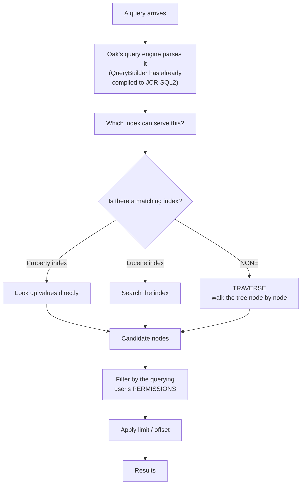
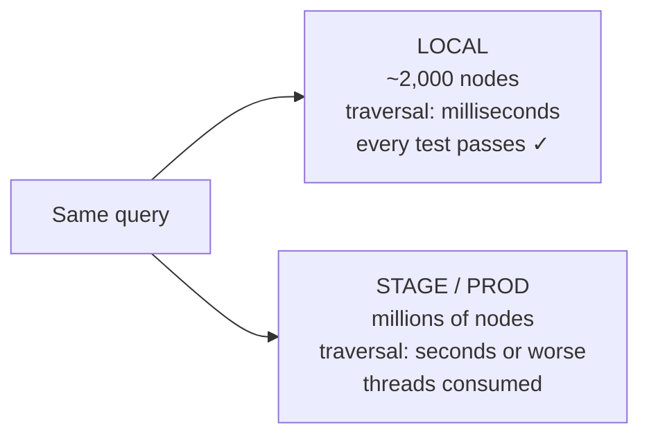
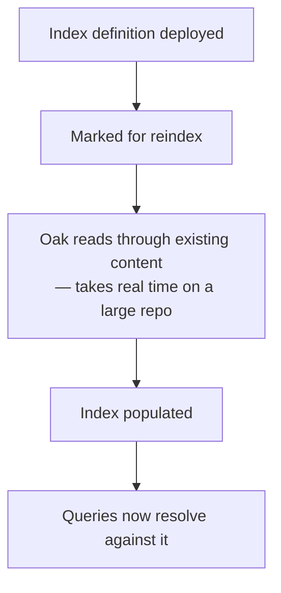

# 21 – Querying: QueryBuilder, JCR-SQL2 and Oak Indexes

> **Target:** 3–4 years experienced AEM Developer
> **Covers from your additional list:** Query Builder · JCR-SQL2 · Lucene indexes · Oak query performance
> **Project domain:** a global energy technology company's marketing site.

---

## Before we start — the one fact this whole topic hangs on

There is a single sentence that, if you genuinely understand it, gives you most of this topic:

> **In Oak, a query that has no matching index does not fail. It traverses.**

Not an error. Not a warning to the caller. Oak simply starts walking the content tree, node by node, checking each one against your criteria. On a repository with a few hundred nodes that's instant. On a real production repository with millions, it can take the instance down.

**And here's what makes it genuinely dangerous rather than merely slow:** it works perfectly on your laptop. Your local instance has a fraction of the content, so a traversing query returns in milliseconds and every test passes. The failure only appears when the content volume is real — which is stage, or worse, production.

That asymmetry is why this topic matters disproportionately, and it's why the interview question is never really "how do you write a query." It's:

> **"How do you know your query is safe?"**

Section 2.7 is that answer. Everything before it is the machinery you need to give it.

---

## 1. Introduction

### 1.1 Why you query at all

Most of what a component does is read content it already knows the path of. A Sling Model reads its own node's properties (file 05); a page renders its own children.

Querying is for the cases where **you don't know the paths in advance**:

- A product listing that shows every product category tagged "transformers"
- A search results page
- A report of all pages modified in the last month
- Finding every page that references a particular Content Fragment

**And the important framing:** each of those is a case where you're asking the repository a question rather than reading a known location. That's fundamentally more expensive, and it's why "can I avoid querying entirely?" is the first question worth asking.

### 1.2 The three ways to query

AEM gives you three, and they're related rather than alternatives:

| | What it is |
|---|---|
| **QueryBuilder** | AEM's own API — you build a map of predicates and it generates the query |
| **JCR-SQL2** | The underlying query language, defined by the JCR specification |
| **XPath** | The older JCR query language — legacy, but you'll see it |

**The key relationship, and it's a common interview question:**

> **QueryBuilder compiles down to JCR-SQL2.** It is not a different engine, and it is not faster or slower. It's a more convenient way to produce the same thing.

So choosing between them is about readability and how the query is constructed, not performance.

### 1.3 A real project example to adapt

> "We query in a few places — the product category listing, site search, and a scheduled report. The rule we settled on is that a component should prefer **walking a known path** over running a query at all: if the content is all under one parent, `listChildren` with a hard ceiling is predictable and needs no index.
>
> Where we genuinely do query — search, and tag-based listings — the query is scoped to a path, always has a limit, and we've confirmed it resolves against an index rather than traversing. We check that with the Query Performance tool rather than assuming, because a query that traverses is fine on a laptop and dangerous on production.
>
> We learned that the hard way: a listing component ran a repository-wide tag query that was instant locally and crawled on stage, because stage had the real content volume."

That covers the preference for traversal-over-query, the discipline when you must query, the verification step, and the incident that taught it.

---

## 2. Core Concepts

### 2.1 QueryBuilder — the API you'll actually use

QueryBuilder takes a **map of predicates** and turns them into a query. It's the most common approach on real projects because the predicate map is easy to read and easy to build dynamically.

```java
Map<String, String> predicates = new HashMap<>();
predicates.put("path", "/content/energy/global/en/products");
predicates.put("type", "cq:Page");
predicates.put("property", "jcr:content/productLine");
predicates.put("property.value", "transformers");
predicates.put("p.limit", "20");

Query query = queryBuilder.createQuery(PredicateGroup.create(predicates), session);
SearchResult result = query.getResult();
```

**Reading that:** find `cq:Page` nodes under the products path whose `jcr:content` has a `productLine` property equal to `transformers`, and give me at most twenty.

### 2.2 The predicates worth knowing

You won't memorise all of them, and you don't need to. These are the ones that appear in real code:

| Predicate | What it does |
|---|---|
| `path` | Restrict to a subtree — **the most important one for performance** |
| `type` | Restrict to a node type, e.g. `cq:Page`, `dam:Asset` |
| `nodename` | Match the node name |
| `property` + `property.value` | Match a property's value |
| `property.operation` | `equals`, `unequals`, `like`, `exists`, `not` |
| `fulltext` | Full-text search — **needs a Lucene index** |
| `daterange` | A date property within a range |
| `tagid` | Match a tag |
| `orderby` | Sort — and `orderby.sort` for direction |
| `group` | Group predicates for OR logic |

**And the ones that control results rather than matching:**

| Predicate | What it does |
|---|---|
| **`p.limit`** | How many results to return |
| `p.offset` | Skip this many — for paging |
| `p.guessTotal` | Don't count every match; estimate |
| `p.hits` | What shape the results come back in |

**`p.limit` deserves emphasis**, because its default behaviour surprises people and the wrong value is genuinely dangerous — section 2.5.

### 2.3 Property paths in predicates

A detail that trips people up on AEM specifically.

Remember from file 20 that a page's content lives on its **`jcr:content`** child, not the page node. So when you're matching a page by one of its properties, the property path is relative to the page node and has to include `jcr:content`:

```java
predicates.put("type", "cq:Page");
predicates.put("property", "jcr:content/productLine");   // NOT just "productLine"
```

**Get that wrong and the query returns nothing**, with no error — because the property genuinely doesn't exist at the path you asked for. It's a silent empty result, which is the hardest kind to debug.

### 2.4 Grouping and OR logic

Predicates are ANDed together by default. For OR, you use a group:

```java
predicates.put("group.p.or", "true");
predicates.put("group.1_property", "jcr:content/productLine");
predicates.put("group.1_property.value", "transformers");
predicates.put("group.2_property", "jcr:content/productLine");
predicates.put("group.2_property.value", "switchgear");
```

**The numbered prefixes** are how QueryBuilder distinguishes predicates within a group. It's verbose, and it's one of the reasons people sometimes prefer writing JCR-SQL2 directly for a complex query.

### 2.5 `p.limit` — and why `-1` is dangerous

**`p.limit=-1` means "return everything."**

That sounds convenient and it is occasionally correct — a one-off administrative report run by hand, for example. In a component, in a servlet, or in anything on the request path, **it is a production incident waiting to happen.**

**Why:** you don't control how much content exists. A query that returns forty results today returns four thousand after a content migration, and the code that built a list from it now builds a list of four thousand — with whatever per-item work it does multiplied accordingly.

**This is the same principle as file 05's hard ceiling**, arriving from the query side. And the right pattern uses both:

```java
predicates.put("p.limit", "20");        // bound the QUERY

// and in the model, bound the LIST as well
if (results.size() > MAX_ITEMS) { ... }
```

**Belt and braces**, because the query limit protects the repository and the code ceiling protects your rendering.

**`p.guessTotal` is worth knowing alongside it.** By default, getting the total number of matches means counting them all — which for a broad query means Oak evaluating far more than the page you're showing. `p.guessTotal` tells it to estimate instead, which is usually all a "showing 20 of about 500" label needs.

### 2.6 JCR-SQL2

The underlying language. QueryBuilder generates it; you can also write it directly.

```sql
SELECT * FROM [cq:Page] AS page
WHERE ISDESCENDANTNODE(page, '/content/energy/global/en/products')
  AND page.[jcr:content/productLine] = 'transformers'
ORDER BY page.[jcr:content/jcr:title]
```

**The constructs worth recognising:**

| Construct | Meaning |
|---|---|
| `FROM [nodeType]` | Restrict to a node type |
| `ISDESCENDANTNODE(x, '/path')` | Everything below a path |
| `ISCHILDNODE(x, '/path')` | Direct children only |
| `CONTAINS(x.*, 'term')` | Full-text search |
| `[property] = 'value'` | Property match — brackets around names with colons |
| `ORDER BY` | Sorting |

**When to write SQL2 directly rather than using QueryBuilder:** when the query is complex enough that the predicate map becomes harder to read than the SQL — joins, or nested OR logic. For most component queries, QueryBuilder is more readable.

**And XPath** is the older JCR query language. You'll see it in legacy code and in some Oak tooling output. Worth recognising; not worth writing new.

### 2.7 Indexes — the part that actually matters

**Now the central mechanism.**

Oak stores content as a tree. To answer "find all pages where `productLine` is `transformers`", it needs either an index that maps property values to nodes, or it has to look at every node.

**There is no third option, and Oak will happily do the second one.**

**Where indexes live:** under `/oak:index` in the repository. They're content, which means they can be deployed in a package like anything else (file 25).

**The two kinds you need to distinguish:**

**A property index** maps values of a specific property to the nodes holding it. Good for exact matches on a property you query often. Updated synchronously as content changes.

**A Lucene index** is a full-text search index. It handles text search, and it can also handle property queries. It's updated **asynchronously**, which has a consequence worth knowing — section 2.9.

**How an index definition is shaped**, at the level worth knowing rather than memorising:

An index is a node under `/oak:index` of type `oak:QueryIndexDefinition`, carrying a `type` property that says which kind it is — `property` or `lucene` — and then configuration describing what it covers. A property index names the properties it indexes; a Lucene index carries rules describing which node types and properties it covers, and is marked asynchronous.

**Setting `reindex` to true triggers a rebuild**, which is how a newly deployed index gets populated with existing content.

**I'd be careful about reciting a full index definition from memory in an interview.** The structure has evolved across Oak versions, and getting a property name wrong is worse than saying "I'd take the existing definition as a starting point and adjust it." What matters is that you know indexes exist under `/oak:index`, that there are property and Lucene kinds, that they must be deployed and reindexed, and that a query without one traverses.

### 2.8 Custom indexes on AEM as a Cloud Service

On Cloud Service, custom index definitions ship in **`ui.apps`** as immutable content (file 25) — they're code, not content you edit at runtime.

**There's a naming convention:** a custom index carries a suffix marking it as yours, conventionally something like `-custom-1`. The reason is that Adobe ships and updates its own index definitions, and the suffix keeps yours from colliding with or being overwritten by theirs.

**And the operational consequence worth stating:** deploying an index definition doesn't instantly make queries fast. The index has to be **built**, which on a large repository takes real time. So an index deployment is an operation with a lag, not an instant switch.

### 2.9 Asynchronous indexing and its consequence

Lucene indexes are updated **asynchronously** — content is written first, and the index catches up shortly after.

**Which means there's a window where content exists and isn't yet findable by a query.** Usually seconds, but it's real.

**Where this bites:** code that writes content and then immediately queries for it. That pattern looks correct and fails intermittently, because sometimes the index has caught up and sometimes it hasn't.

**The fix is usually to not do that** — if you just wrote it, you know its path, so read it directly rather than searching for it. That's the general principle of this file expressed at small scale.

### 2.10 The rule that prevents most problems

**Here is the practical guidance that matters more than any index detail:**

> **Prefer walking a known path over running a query.**

If the content you need is all under one parent — product categories under a products page, articles under a news section — then `listChildren` on that parent is:

- **Predictable** — the cost is proportional to the number of children, which you can bound
- **Index-free** — no index needed, so nothing to deploy, maintain or get wrong
- **Immune to the laptop/production gap** — it behaves the same everywhere

This is exactly what file 02's listing component and file 05's `CategoryListingModel` do, and it's why they do it.

**Query when you genuinely can't walk**, which is when the content could be anywhere and is selected by criteria rather than location — search, or a tag-based listing spanning the site.

**And when you do query, three rules:**

1. **Scope it to a path** — this bounds the work even when an index isn't perfect
2. **Always set a limit** — never `-1` on the request path
3. **Verify it uses an index** — with the tooling, not by assumption

### 2.11 Permissions and query results

A detail that has both a correctness and a performance dimension.

**Query results are filtered by the permissions of the user running the query** (file 13). So the same query returns different results for an author and for `anonymous` on publish.

**The correctness consequence:** a component that queries will show fewer results on publish than on author if some content isn't readable by `anonymous`. That's correct behaviour, and it's another variant of the "works on author, blank on publish" family.

**The performance consequence:** Oak may have to evaluate more candidate nodes than it returns, because it fetches matches and then filters by permission. On a heavily-restricted tree, a query that looks like it returns ten results may have evaluated far more.

**And the practical note:** if you're querying with a **service user** (file 13) to read past the visitor's permissions, you're also bypassing that filtering — so you have to be deliberate about not exposing content the visitor shouldn't see.

---

## 3. Internal Working

### 3.1 How Oak answers a query



**Three things to draw out:**

**The engine chooses the index**, and it may choose one you didn't expect — or none. That's why you verify rather than assume.

**Traversal is a normal path through this diagram**, not an error branch. Nothing fails; it just does the slow thing.

**Permission filtering happens after matching**, which is why a restricted tree costs more than the result count suggests.

### 3.2 Why it works locally and fails on stage



**This is the whole reason the topic is dangerous.** A traversing query is not detectably wrong in development. There's no exception, no failing test, no code review signal — the only difference is content volume, and your laptop doesn't have it.

**Which is why the verification step is not optional**, and why "I checked it uses an index" is a much better answer than "it worked when I tested it."

### 3.3 Reindexing

When you deploy a new index definition, it exists but is empty. It has to be **built** by reading through the existing content.



**The operational point:** between deployment and completion, queries that should use the index don't. So an index deployment on a large repository is a planned operation, not an instant fix — and it's worth doing when the instance has capacity.

**And after a content migration**, indexes may need rebuilding, which is why "search returns nothing after a migration" is a standard scenario (file 20).

---

## 4. Important Interview Questions

### 4.1 Basic

**Q1. What happens if a query has no matching index?**
**Oak traverses** — it walks the content tree node by node. It doesn't fail; it just does the slow thing, and on a large repository that can effectively hang the instance.

*Cross:* Is there an error? (**no** — a traversal warning in the log, but nothing thrown) · Why is that dangerous? (**it works on a laptop**) · How would you know?

**Q2. What is QueryBuilder?**
AEM's query API — you supply a map of predicates and it generates the query. It's the most common approach because the predicate map is readable and easy to build dynamically.

*Cross:* What does it generate? (**JCR-SQL2**) · Is it faster than SQL2? (**no — same thing**) · When would you write SQL2 directly?

**Q3. Is QueryBuilder faster than JCR-SQL2?**
No — QueryBuilder **compiles to** JCR-SQL2, so it's the same engine doing the same work. The choice is about readability and how you construct the query, not performance.

*Cross:* So why does QueryBuilder exist? (a much more convenient API for dynamic queries) · When is SQL2 clearer? (complex or nested logic) · What about XPath? (older, legacy)

**Q4. Name some QueryBuilder predicates.**
`path` to scope to a subtree, `type` for node type, `property` and `property.value` for property matching, `fulltext` for text search, `daterange`, `tagid`, `orderby`, and the result predicates `p.limit`, `p.offset` and `p.guessTotal`.

*Cross:* Which matters most for performance? (**`path`**) · How do you do OR logic? (a group with numbered prefixes) · What's `p.guessTotal` for?

**Q5. What's wrong with `p.limit=-1`?**
It returns everything, and you don't control how much content exists. A query returning forty results today returns four thousand after a migration. It's occasionally fine for a one-off administrative report and never fine on the request path.

*Cross:* What would you use instead? (a real limit, **plus a hard ceiling in code**) · Why both? (the query limit protects the repository; the code ceiling protects rendering)

**Q6. Where do Oak indexes live?**
Under `/oak:index` in the repository. They're content, so they deploy in a package like anything else.

*Cross:* What kinds are there? (**property** and **Lucene**) · Which is asynchronous? (Lucene) · How do you deploy one on Cloud Service? (`ui.apps`, with a custom-name suffix)

**Q7. What's the difference between a property index and a Lucene index?**
A **property index** maps values of a specific property to nodes and is updated synchronously — good for exact matches on a frequently-queried property. A **Lucene index** handles full-text search and is updated **asynchronously**.

*Cross:* Which do you need for `fulltext`? (Lucene) · What does asynchronous mean in practice? (**a window where content exists and isn't findable yet**) · Where does that bite?

**Q8. How do you check whether a query uses an index?**
The **Query Performance** tool, which reports slow queries and traversals, and the query explain facility, which shows the plan Oak chose. Not by assuming, and not by timing it locally.

*Cross:* Why not local timing? (**your laptop doesn't have production content volume**) · Where's the Query Debugger? · What's a traversal warning?

**Q9. Should you query or walk the tree?**
**Prefer walking a known path.** If the content is all under one parent, `listChildren` is predictable, needs no index, and behaves the same on a laptop as in production. Query only when the content could be anywhere and is selected by criteria rather than location.

*Cross:* Give an example of each · What does file 02's listing component do? (**bounded traversal under a known root**) · When must you query? (search, site-wide tag listings)

**Q10. Are query results affected by permissions?**
Yes — results are filtered by the permissions of the user running the query. So the same query returns different results for an author and for `anonymous` on publish.

*Cross:* What's the practical symptom? (**fewer results on publish** — the file 13 family) · What's the performance cost? (Oak may evaluate more nodes than it returns) · What if you use a service user?

### 4.2 Intermediate

**Q11. Why does a query that works locally fail on production?**
Because it traverses, and traversal cost is proportional to content volume. A local instance has a fraction of the content, so a traversing query returns in milliseconds and every test passes. The failure is invisible in development — there's no exception, no failing test, no review signal.

*Cross:* So what's the check? (**verify the index, don't time the query**) · Have you seen this? · How would you catch it before production? (test against a content copy, and check the Query Performance tool)

**Q12. Your page query returns nothing and there's no error. Why?**
A very likely cause on AEM specifically is the **property path**. A page's content lives on its `jcr:content` child (file 20), so matching a page by one of its properties means `jcr:content/productLine`, not `productLine`. Get that wrong and the property genuinely doesn't exist at the path you asked for, so you get a silent empty result.

*Cross:* How would you confirm? (the Query Debugger — run it and adjust) · What else causes an empty result? (permissions, wrong node type, a path typo) · Why is it silent?

**Q13. What does asynchronous indexing mean in practice?**
Lucene indexes catch up shortly after content is written, so there's a window where content exists and isn't yet findable. Code that writes content and immediately queries for it works intermittently.

*Cross:* What's the fix? (**don't do that** — if you just wrote it, you know its path) · How long is the window? (usually seconds) · Does it apply to property indexes? (those are synchronous)

**Q14. You've deployed a new index and queries are still slow. Why?**
The index exists but hasn't been **built** yet. It has to be populated by reading through existing content, which on a large repository takes real time. Until that completes, queries don't resolve against it.

*Cross:* How do you trigger it? (marking it for reindex) · How do you know it finished? · When would you schedule it? (**when the instance has capacity**)

**Q15. How do you write a safe listing query?**
Scope it to a path, set a real limit, verify it uses an index, and put a hard ceiling in the code as well. And before all of that, ask whether you can walk a known path instead — because that avoids the whole class of problem.

*Cross:* Why both a query limit and a code ceiling? · Where does the work go? (`@PostConstruct`, not a getter — file 05) · What if the author configures a bad root path? (**it should degrade, not take the instance down**)

**Q16. How would you find every page referencing a Content Fragment?**
That's a genuine query case — the references could be anywhere. A property query on the field that stores the fragment path, scoped to the content tree and limited. AEM also surfaces this in the References panel, which is the answer for an author rather than for code (file 15).

*Cross:* Why is this a query rather than a walk? (**you don't know the paths**) · What index would it need? · What does the References panel use?

**Q17. Where should a query live in your code?**
Not in a getter. In `@PostConstruct` if it's a Sling Model, so it runs once rather than per HTL call (file 05). For bulk work, in a **Sling Job** rather than on the request path (file 10) — a query that's acceptable once per render is not acceptable in a loop.

*Cross:* What happens in a getter? (HTL calls it repeatedly) · How would you notice? (a temporary log line, counting calls) · Bulk processing? (jobs, batched)

**Q18. What's `p.guessTotal` for?**
Getting an exact total means counting every match, which for a broad query means evaluating far more than the page you're displaying. `p.guessTotal` estimates instead, which is usually all a "showing 20 of about 500" label needs.

*Cross:* When would you want the exact total? (rarely — and it costs) · What's the interaction with `p.limit`? · How does paging work? (`p.offset`)

### 4.3 Advanced

**Q19. Design a search feature for the site.**

> "The first question is scope — site search across pages, or something narrower like product search, because the answer differs.
>
> For **text search** I need a **Lucene index**, because that's what handles full-text. I'd scope the query to the content tree rather than the whole repository, and always limit.
>
> **Paging** with `p.offset`, and `p.guessTotal` rather than an exact count, because counting every match on a broad query is far more work than showing twenty results.
>
> **The architectural decision is caching.** A search results page is inherently uncacheable if the term is a query parameter — which it usually is — so every search reaches publish and runs a query (file 19). That's acceptable for genuine search, but it means the query has to be fast and bounded, because there's no cache protecting the instance.
>
> **Permissions** matter: results are filtered by the querying user, so `anonymous` on publish sees less than an author does, which is correct.
>
> And I'd **verify the index** with the Query Performance tool rather than assuming, because a traversing search query is the worst case — uncached, on the request path, and unbounded in cost."

*Cross:* What about search-as-you-type? (**every keystroke is a query** — debounce, limit hard, and consider whether it should hit AEM at all) · Would you consider an external search service? (for a large site, genuinely worth considering) · How do you handle no results?

**Q20. A query is slow in production. Walk me through it.**

> "First, **is it traversing?** The Query Performance tool reports slow queries and traversal warnings, and the explain facility shows which index Oak actually chose. That's the single most likely cause and it's checkable rather than guessable.
>
> If it's traversing, the fix is either an index, or — often better — **restructuring so it doesn't need one**. If the content is all under a known parent, walking that parent removes the problem entirely rather than solving it with more infrastructure.
>
> If it **is** using an index, then the question is whether it's returning far more than it needs. An unbounded limit, or `p.guessTotal` not set so it's counting everything, or permission filtering evaluating many more nodes than it returns.
>
> Then **where** it runs. A query in a getter runs per HTL call (file 05). A query on an uncached page runs per request. Same query, very different total cost.
>
> And finally, **is a query the right thing at all?** More than once the answer has been to replace it with a bounded traversal under a known path."

*Cross:* How do you find the offending query? (`request.log` for slow pages, then the Query Performance tool) · What if you can't add an index? (restructure, or cache the result) · What's the quickest mitigation? (a limit, and caching)

**Q21. What are the risks of adding an index?**

> "It's not free, which people assume it is.
>
> **Building it costs.** On a large repository, reindexing takes real time and load, so it's a planned operation rather than something you do casually mid-morning.
>
> **Maintaining it costs.** Every content write updates the index, so a broad index over frequently-changing content adds write overhead permanently.
>
> **It takes space.**
>
> And **too many indexes is its own problem** — the query engine has more to choose between, and each one adds write cost.
>
> So the order I'd work in is: can I avoid the query entirely by walking a path? If not, can I scope it tightly enough that an existing index serves it? And only then, add one — deliberately, and knowing what it costs."

*Cross:* How would you decide the index is worth it? (query frequency versus write frequency) · How do you know which indexes exist? (`/oak:index`) · What about removing an unused one?

---

## 5. Cross Questions — how this topic gets drilled

**Thread A — from "how do you query"**
QueryBuilder or SQL2? → Which is faster? → **Neither, why?** → What predicates? → How do you limit? → What's wrong with `-1`? → Where does the query run?

**Thread B — from "what if there's no index"** *(the important one)*
Does it fail? → **What does it do instead?** → Why is that dangerous? → Why does it work locally? → How would you know? → What tool? → How do you fix it?

**Thread C — from "your query returns nothing"**
Is there an error? → What's the most likely cause on a page query? → **Why `jcr:content/`?** → What else? → Permissions? → How would you debug it?

**Thread D — from "indexes"**
Where do they live? → What kinds? → Which is asynchronous? → What's the consequence? → How do you deploy one on cloud? → **Is adding one free?**

---

## 6. Best Interview Answers

### 6.1 "How do you make sure a query is safe?" — about 90 seconds

**The question this whole topic is really asking.**

> "The first thing I'd say is that in Oak, a query with no matching index doesn't fail — it **traverses**, walking the content tree node by node. So there's no exception, no failing test, nothing in code review to catch it. And it works perfectly on a laptop, because a local instance has a fraction of the content. The failure only shows up when the content volume is real.
>
> So my order is:
>
> **First, can I avoid querying entirely?** If the content is all under one parent — product categories under a products page — then walking that parent with `listChildren` is predictable, needs no index, and behaves identically everywhere. That's what our listing components do, and it removes the whole class of problem rather than solving it.
>
> **If I genuinely have to query** — search, or a tag-based listing that spans the site — then three rules. **Scope it to a path**, which bounds the work even when the index isn't perfect. **Always set a limit**, never `-1` on the request path, because I don't control how much content exists next year. And **verify it uses an index** with the Query Performance tool rather than assuming.
>
> Then **where** it runs matters as much as the query. In a Sling Model it goes in `@PostConstruct`, not a getter, because HTL calls getters repeatedly. For bulk work it goes in a Sling Job, not on the request path.
>
> And I'd put a hard ceiling in the code as well as a limit on the query — the query limit protects the repository, the code ceiling protects the rendering if someone misconfigures a root path."

### 6.2 "QueryBuilder or JCR-SQL2?" — about 45 seconds

> "They're not really alternatives — **QueryBuilder compiles down to JCR-SQL2**. It's the same engine doing the same work, so neither is faster. The choice is about readability.
>
> I use **QueryBuilder** for most component queries, because the predicate map is easy to read and easy to build dynamically — if the query depends on dialog values, assembling a map is much cleaner than string-concatenating SQL.
>
> I'd write **SQL2 directly** when the query is complex enough that the predicate map becomes harder to read than the SQL would be — nested OR logic, for instance, where QueryBuilder needs numbered group prefixes that get unwieldy.
>
> **XPath** is the older JCR query language. It's worth recognising because you'll see it in legacy code and in some Oak tooling output, but I wouldn't write new queries in it."

### 6.3 "Why did it work locally and fail on production?" — about 45 seconds

> "Because it was traversing, and traversal cost is proportional to content volume.
>
> My local instance had maybe a couple of thousand nodes, so walking the tree took milliseconds and every test passed. Stage had the real content, and the same query took seconds and started consuming request threads.
>
> What makes it genuinely dangerous is that **it's undetectable in development**. There's no exception, no warning to the caller, no failing test, and nothing a code reviewer would spot — the query is correct, it's just resolved the slow way. The only difference is how much content exists.
>
> Which is why 'I tested it and it was fast' isn't a safety argument. The check is verifying that Oak actually resolves it against an index, using the Query Performance tool — that's the same on a laptop as in production."

---

## 7. Real Project Examples

### Story 1 — The listing query that passed locally and crawled on stage

**What happened.** A product category listing component was built to derive its cards from the page tree, filtered by tag. It worked instantly on every developer's local instance. On stage, the page took seconds to render and other pages slowed down alongside it.

**The cause.** The component ran a **repository-wide** QueryBuilder query filtered by tag. Locally that was fine — the instance had a couple of thousand nodes. Stage had a content copy from production, so the query traversed a substantial portion of the repository on every uncached render.

**Why nobody caught it.** Every test passed. There was no exception, no traversal complaint visible to the developer, and code review has nothing to flag — the query is correct. **The only defect is the resolution strategy, and that's invisible without checking.**

**The investigation.** `request.log` showed the page taking seconds server-side. The Query Performance tool showed the query and reported that it wasn't resolving cleanly against an index.

**The fix, and why it was the right one.** We could have added an index. Instead we **restructured the query to walk a known root** — the product categories are all children of one page, so `listChildren` on that parent with a bounded loop does the job. That's what file 02's listing component and file 05's `CategoryListingModel` do.

**The reasoning worth stating:** an index would have solved the symptom and added permanent write overhead and something to maintain. Removing the need for the query solved the problem. Where a genuine tag query across the site was unavoidable elsewhere, we did deploy an index — deliberately, knowing the cost.

**The lesson:** *"A traversing query is not detectably wrong in development. So 'it was fast when I tested it' isn't evidence — the only check that means anything is verifying the index, and that's the same everywhere."*

### Story 2 — The query that returned nothing, silently

**What happened.** A new listing returned zero results on every environment, including locally with content that obviously matched. No errors anywhere.

**The cause.** The property predicate was `productLine` rather than `jcr:content/productLine`. Because a page's properties live on its `jcr:content` child (file 20), the query was asking for a property on the page node itself — where it genuinely doesn't exist.

**Why it was silent.** Nothing was wrong. The query was valid, it ran, and it correctly found no nodes matching an impossible condition. An empty result is not an error.

**How we found it.** The **Query Debugger** — running the query there and adjusting it interactively made it obvious within a minute, versus a long time staring at Java.

**What we changed.** Two things. The Query Debugger became the first stop for any query returning unexpected results, rather than the last. And in code review we specifically look at property paths in predicates, because the `jcr:content/` prefix is easy to omit and produces a failure that looks like a content problem rather than a code problem.

**The lesson:** *"An empty result set and a broken query look identical from the outside. The Query Debugger tells them apart in seconds, and it's worth reaching for first rather than after an hour."*

### Story 3 — Search that stopped working after a migration

**What happened.** After a large content migration into a lower environment, site search returned nothing. The content was clearly there — you could browse to it.

**The cause.** The **Lucene index hadn't been rebuilt** for the migrated content. Content that arrives through a bulk migration doesn't necessarily flow through the normal indexing path, so the index didn't reflect it.

**Why it was confusing.** Browsing worked perfectly, because browsing reads known paths and doesn't touch an index. Only search was affected — which made it look like a search feature bug rather than an indexing state problem.

**The fix.** Triggering a reindex, and waiting — which on that content volume took real time, and that was the part nobody had planned for.

**What we changed.** Reindexing became an explicit step in the migration runbook, with the expectation that it takes time and should happen before anyone validates search. And it's now on the list of things to check when a search-shaped problem appears after any bulk content operation.

**The lesson to state:** *"Browsing and searching use completely different mechanisms, so 'the content is there' tells you nothing about whether it's findable. After any bulk content operation, the index is a separate question."*

---

## 8. Coding Examples

### 8.1 A safe QueryBuilder query

```java
package com.energy.core.services.impl;

import com.day.cq.search.PredicateGroup;
import com.day.cq.search.Query;
import com.day.cq.search.QueryBuilder;
import com.day.cq.search.result.Hit;
import com.day.cq.search.result.SearchResult;
import org.apache.sling.api.resource.Resource;
import org.apache.sling.api.resource.ResourceResolver;
import org.osgi.service.component.annotations.Component;
import org.osgi.service.component.annotations.Reference;
import org.slf4j.Logger;
import org.slf4j.LoggerFactory;

import javax.jcr.Session;
import java.util.ArrayList;
import java.util.HashMap;
import java.util.List;
import java.util.Map;

@Component(service = ProductSearchService.class)
public class ProductSearchServiceImpl implements ProductSearchService {

    private static final Logger LOG =
            LoggerFactory.getLogger(ProductSearchServiceImpl.class);

    /**
     * A HARD CEILING, independent of whatever limit is requested.
     *
     * The query limit protects the repository; this protects the
     * rendering if someone passes a large limit or the content
     * volume grows. Belt and braces -- the same principle as
     * file 05's bounded traversal.
     */
    private static final int MAX_RESULTS = 100;

    @Reference
    private QueryBuilder queryBuilder;

    @Override
    public List<String> findProducts(ResourceResolver resolver,
                                     String productLine,
                                     int limit) {

        Session session = resolver.adaptTo(Session.class);
        if (session == null) {
            return new ArrayList<>();
        }

        int effectiveLimit = Math.min(Math.max(limit, 1), MAX_RESULTS);

        Map<String, String> predicates = new HashMap<>();

        // SCOPE TO A PATH.
        //
        // This is the single most important predicate for performance.
        // It bounds the work even when the index isn't a perfect match,
        // and it stops a query that should look at products from
        // walking the entire repository.
        predicates.put("path", "/content/energy/global/en/products");

        predicates.put("type", "cq:Page");

        // NOTE THE jcr:content/ PREFIX.
        //
        // A page's properties live on its jcr:content child (file 20),
        // NOT on the page node. Writing "productLine" here asks for a
        // property that genuinely doesn't exist at that path -- and you
        // get an EMPTY RESULT with no error, which looks like a content
        // problem rather than a code bug.
        predicates.put("property", "jcr:content/productLine");
        predicates.put("property.value", productLine);

        // ALWAYS a real limit. NEVER p.limit=-1 on the request path --
        // you don't control how much content exists next year.
        predicates.put("p.limit", String.valueOf(effectiveLimit));

        // Estimate the total rather than counting every match. An exact
        // count means evaluating far more than the page being shown.
        predicates.put("p.guessTotal", "true");

        try {
            Query query = queryBuilder.createQuery(
                    PredicateGroup.create(predicates), session);

            SearchResult result = query.getResult();

            List<String> paths = new ArrayList<>();
            for (Hit hit : result.getHits()) {
                if (paths.size() >= effectiveLimit) {
                    break;                      // defensive, on top of p.limit
                }
                paths.add(hit.getPath());
            }
            return paths;

        } catch (Exception e) {
            // NEVER propagate out of something used during rendering --
            // degrade the component, don't break the page (file 06).
            LOG.warn("Product search failed for productLine={}", productLine, e);
            return new ArrayList<>();
        }
    }
}
```

**The five decisions to be able to defend:**

**`path` first** — it bounds the work regardless of index quality.

**`jcr:content/` in the property path** — the silent-empty-result trap.

**A real limit, clamped** — and a separate code ceiling on top.

**`p.guessTotal`** — because an exact count evaluates far more than you display.

**Failure degrades rather than propagates** — a search that fails should render an empty list, not break the page.

### 8.2 The alternative that avoids the query entirely

**This is usually the better answer**, and it's what file 05's listing model does.

```java
/**
 * Walks the children of a KNOWN root instead of querying.
 *
 * WHY THIS IS PREFERRED:
 *   - No index needed, so nothing to deploy, maintain or get wrong
 *   - Cost is proportional to the number of children, which is bounded
 *   - Behaves IDENTICALLY on a laptop and in production -- it does not
 *     have the traversal problem's laptop/production gap
 *
 * Query only when the content could genuinely be anywhere and is
 * selected by criteria rather than by location.
 */
private List<CardModel> collectCards(String rootPath) {

    Page root = pageManager.getPage(rootPath);
    if (root == null) {
        LOG.warn("Listing root not found: {}", rootPath);
        return Collections.emptyList();
    }

    List<CardModel> cards = new ArrayList<>();
    Iterator<Page> children = root.listChildren();

    // A HARD CEILING. An author typing a bad root path should produce
    // a short list, not a repository walk that takes the instance down.
    while (children.hasNext() && cards.size() < MAX_ITEMS) {
        Page child = children.next();
        if (child.isHideInNav()) {
            continue;
        }
        Resource content = child.getContentResource();
        // adaptTo can ALWAYS return null (file 05)
        CardModel card = (content != null)
                ? content.adaptTo(CardModel.class)
                : null;
        if (card != null && card.isValid()) {
            cards.add(card);
        }
    }
    return cards;
}
```

### 8.3 The equivalent JCR-SQL2

Worth being able to read, even if you write QueryBuilder:

```sql
SELECT * FROM [cq:Page] AS page
WHERE ISDESCENDANTNODE(page, '/content/energy/global/en/products')
  AND page.[jcr:content/productLine] = 'transformers'
ORDER BY page.[jcr:content/jcr:title]
```

**Note the same two things:** the query is **scoped to a path** via `ISDESCENDANTNODE`, and the property reference includes **`jcr:content/`**. Those aren't QueryBuilder quirks — they're properties of how AEM stores pages.

### 8.4 Where a query should and shouldn't live

```java
// WRONG -- runs on every HTL call, and HTL calls getters repeatedly
public List<String> getProducts() {
    return searchService.findProducts(resolver, productLine, 20);
}

// RIGHT -- runs ONCE, in @PostConstruct (file 05)
private List<String> products;

@PostConstruct
protected void init() {
    this.products = searchService.findProducts(resolver, productLine, 20);
}

public List<String> getProducts() {
    return products;          // just returns the field
}
```

**And for bulk work, neither** — that belongs in a **Sling Job** (file 10), batched, off the request path entirely. A query that's acceptable once per render is not acceptable in a loop over thousands of items.

### 8.5 Diagnostic paths

```
# Is a query traversing, and which are slow?
/libs/granite/operations/content/diagnosistools/queryPerformance.html

# Build and test a QueryBuilder query interactively.
# FIRST STOP when a query returns unexpected results -- it will show
# you a wrong property path in under a minute.
/libs/cq/search/content/querydebug.html

# The index definitions themselves
/oak:index        (in CRXDE)

# Slow pages -- start here, then trace to the query
crx-quickstart/logs/request.log
```

---

## 9. Common Mistakes

| The mistake | What actually happens | The fix |
|---|---|---|
| **No index — the query traverses** | Fine locally, **takes the instance down on production** | Verify the index; or restructure to walk a path |
| Assuming "it was fast locally" means safe | **Your laptop doesn't have production content volume** | Check the Query Performance tool |
| `p.limit=-1` on the request path | Returns everything; grows silently with content | A real limit, plus a code ceiling |
| Missing `jcr:content/` in a property path | **Empty result, no error** — looks like a content problem | Page properties live on `jcr:content` |
| Query in a getter | Runs per HTL call — potentially hundreds of times | `@PostConstruct` (file 05) |
| Querying when you could walk a path | Needs an index, and has the laptop/production gap | `listChildren` under a known root |
| No `path` predicate | Unbounded scope even with an index | Always scope |
| Exact totals on a broad query | Counts every match, far beyond what you display | `p.guessTotal` |
| Writing content then immediately querying for it | Lucene indexing is **asynchronous** — intermittent failure | Read the path you just wrote |
| Expecting a new index to work instantly | It has to be **built** first, which takes time | Plan the reindex |
| Adding an index reflexively | Build cost, permanent write overhead, maintenance | Ask whether you can avoid the query first |
| Forgetting index definitions in the package filter | The index never deploys; queries traverse (file 25) | Include the `/oak:index` path |
| Not reindexing after a migration | **Search returns nothing** while browsing works fine | Reindex as a migration step |
| Letting a query exception propagate | Breaks the page instead of degrading the component | Catch, log at warn, return empty |
| Bulk querying on the request path | Should be a job (file 10) | Batch it off the request path |

---

## 10. Best Practices

**Avoid the query first.** If the content is under a known parent, walk it. That removes an entire class of problem rather than managing it, and it behaves the same everywhere.

**When you must query:** scope to a path, always limit, verify the index. Those three cover most of the risk.

**Verify rather than assume.** "It was fast when I tested it" is not a safety argument, because the thing that makes a traversing query dangerous is exactly the thing your laptop lacks.

**Bound in two places.** A limit on the query and a ceiling in the code — the first protects the repository, the second protects rendering.

**Mind where it runs.** `@PostConstruct` not a getter. A job not the request path. An uncached page means the query runs on every request (file 19).

**Treat indexes as a real cost.** Build time, permanent write overhead, maintenance. Add them deliberately.

**Degrade on failure.** A query that throws should render an empty list, not break the page.

**Reindex after bulk content operations**, and expect it to take time.

---

## 11. Debugging Tips

**When a query returns unexpected results, go to the Query Debugger first**, not last. Running the query interactively and adjusting it will surface a wrong property path — the `jcr:content/` trap — in about a minute, versus a long time reading Java.

**When something is slow, start at `request.log`** to find which page, then the **Query Performance** tool to find whether a query is traversing. Don't guess at the query from the code; ask the tool which plan Oak actually chose.

**Split the problem the same way as everywhere else:** is the query wrong, or is the query fine and something else slow? The Query Debugger answers the first; the Query Performance tool answers the second.

**When search breaks but browsing works**, it's an index problem, not a content problem. Browsing reads known paths and never touches an index.

| Tool | Answers |
|---|---|
| **Query Debugger** | **Is my query even correct** — first stop for empty results |
| **Query Performance tool** | Is it traversing, and which queries are slow |
| Query explain | Which index Oak actually chose |
| `/oak:index` in CRXDE | What indexes exist |
| `request.log` | Which page is slow — start here |
| `error.log` | Traversal warnings |

---

## 12. Performance Notes

**Traversal is the dominant risk**, and it's invisible until content volume is real. Everything else on this list matters less.

**Scope beats everything else.** A `path` predicate bounds the work even when the index isn't ideal, and it's the cheapest thing you can add.

**Where the query runs multiplies its cost.** Once per render is one thing; per HTL getter call is another; on an uncached page it's per request (file 19). Same query, wildly different totals.

**Permission filtering costs.** Oak may evaluate considerably more nodes than it returns on a restricted tree (file 13).

**Exact counts cost.** `p.guessTotal` avoids evaluating everything just to display "of about 500."

**Indexes cost on write, permanently.** A broad index over frequently-changing content adds overhead to every save, forever. That's the trade against query speed.

**And an uncached search page has no cache protecting it** — every search is a real query against publish, which is why bounding it matters more there than almost anywhere else.

---

## 13. Real Production Scenarios

**1. Page slow on stage, instant locally.** A traversing query meeting real content volume.

**2. Publish CPU spikes on one page.** An unindexed query on an uncached page.

**3. Query returns nothing, no error.** Property path missing `jcr:content/`.

**4. Query returns nothing on publish, works on author.** Permission filtering — `anonymous` can't read the results (file 13).

**5. Search returns nothing after a migration.** Lucene index not rebuilt. Browsing still works, which disguises it.

**6. New index deployed, queries still slow.** The index hasn't been built yet.

**7. Index never deployed at all.** Not included in the package filter (file 25).

**8. Content written then immediately not findable.** Asynchronous Lucene indexing.

**9. Listing page degrades as content grows.** `p.limit=-1`, or no limit at all.

**10. Query runs hundreds of times per page.** It's in a getter, not `@PostConstruct` (file 05).

**11. Bulk operation stalls the instance.** Querying on the request path instead of in a job (file 10).

**12. A page breaks when the query fails.** The exception propagated instead of degrading.

**13. Writes got slower after an index was added.** Every content write now updates it — the permanent cost.

**14. A misconfigured author root path caused a huge list.** No hard ceiling in code.

**15. Search-as-you-type hammered publish.** Every keystroke a query, uncached, unbounded.

---

## 14. Follow-up Questions

- Where do you query in your project?
- How do you know your queries use an index?
- Have you deployed a custom index?
- Have you had a query cause a production problem?
- Do you prefer QueryBuilder or SQL2, and why?
- How do you handle paging?
- Where does the query run — model, servlet, job?
- **What would you change about how your project queries?**

For the last: *"A couple of our older components query where they could walk a known path. They're indexed so they're not dangerous, but they carry an index we wouldn't otherwise need — and the index has a permanent write cost we're paying for no real benefit."*

---

## 15. Comparison Tables

**The three query languages**

| | QueryBuilder | JCR-SQL2 | XPath |
|---|---|---|---|
| What it is | AEM's predicate API | The JCR query language | The older JCR language |
| Compiles to | **JCR-SQL2** | — | — |
| Faster? | **No — same engine** | Same | Same |
| Best for | Most component queries, dynamic construction | Complex or nested logic | Recognising legacy code |

**Query or walk?**

| | Walk a known path | Query |
|---|---|---|
| Needs an index | **No** | **Yes, or it traverses** |
| Cost | Proportional to children | Depends on the index |
| Laptop vs production | **Identical** | **Can differ enormously** |
| Use when | Content is under a known parent | Content could be anywhere |

**Index types**

| | Property index | Lucene index |
|---|---|---|
| For | Exact property matches | **Full-text**, and property queries |
| Updated | Synchronously | **Asynchronously** |
| Consequence | — | **A window where content isn't findable yet** |

**Bounding a query**

| Control | Protects |
|---|---|
| `path` predicate | The **scope** of the work |
| `p.limit` | The **repository** |
| A ceiling in code | Your **rendering** |
| `p.guessTotal` | Avoids counting everything |

---

## 16. Memory Tricks

**The central fact:** *"No index means traverse, not fail."*

**Why it's dangerous:** *"It works on a laptop because a laptop has no content."*

**The preference:** *"Walk if you can, query if you must."*

**The three rules:** *"Scope it, limit it, verify it."*

**The silent trap:** *"Page properties live on `jcr:content`."*

**QueryBuilder vs SQL2:** *"One compiles to the other — neither is faster."*

**Limits:** *"Limit the query, ceiling the code."*

**Indexes:** *"An index costs on every write, forever."*

**After a migration:** *"Browsing works, searching doesn't — that's the index."*

---

## 17. Revision Notes

- **THE CENTRAL FACT: a query with no matching index does not fail — Oak TRAVERSES**, walking the tree node by node. No exception, nothing thrown to the caller. **It works on a laptop because a laptop has a fraction of the content**, so it's undetectable in development.
- **QueryBuilder compiles to JCR-SQL2.** Same engine, neither is faster. QueryBuilder for readability and dynamic construction; SQL2 for complex logic; XPath is legacy.
- **Predicates:** `path` (**the most important for performance**), `type`, `property` + `property.value`, `property.operation`, `fulltext` (needs Lucene), `daterange`, `tagid`, `orderby`, `group` for OR. Result control: **`p.limit`**, `p.offset`, **`p.guessTotal`**.
- **`p.limit=-1` returns everything** — fine for a one-off admin report, never on the request path.
- **Page property paths need `jcr:content/`** — a page's properties live on its `jcr:content` child (file 20). Omit it and you get an **empty result with no error**.
- **Indexes live under `/oak:index`**, are content, and deploy in a package. **Property index** = exact matches, synchronous. **Lucene index** = full-text, **asynchronous** — so there's a window where content exists and isn't findable.
- **A newly deployed index must be BUILT** before it helps. On a large repository that takes real time.
- **On Cloud Service**, custom indexes ship in **`ui.apps`** with a custom-name suffix so they don't collide with Adobe's.
- **PREFER WALKING A KNOWN PATH over querying.** No index needed, predictable cost, identical behaviour everywhere. Query only when content could be anywhere and is selected by criteria rather than location.
- **When you must query: scope to a path, always limit, verify the index.** Plus a **hard ceiling in code** — the limit protects the repository, the ceiling protects rendering.
- **Where it runs matters:** `@PostConstruct` not a getter (file 05); a Sling Job not the request path (file 10); an uncached page means per request (file 19).
- **Results are filtered by the querying user's permissions** (file 13) — fewer results on publish, and a real evaluation cost on a restricted tree.
- **Adding an index isn't free:** build time, permanent write overhead, maintenance.
- **After a bulk migration, reindex** — browsing works while searching doesn't, which disguises it.
- **Tools:** **Query Debugger** first for wrong results; **Query Performance** tool for traversals and slow queries.

---

## 18. Cheat Sheet

**QueryBuilder**
```java
Map<String, String> p = new HashMap<>();
p.put("path",  "/content/energy/.../products");   // SCOPE -- most important
p.put("type",  "cq:Page");
p.put("property", "jcr:content/productLine");     // jcr:content/ PREFIX
p.put("property.value", "transformers");
p.put("p.limit", "20");                           // NEVER -1 on the request path
p.put("p.guessTotal", "true");

Query q = queryBuilder.createQuery(PredicateGroup.create(p), session);
SearchResult r = q.getResult();
for (Hit hit : r.getHits()) { hit.getPath(); }
```

**Predicates**
```
path · type · nodename
property + property.value + property.operation
fulltext (needs Lucene) · daterange · tagid
orderby + orderby.sort
group.p.or + group.1_… / group.2_…      OR logic

p.limit · p.offset · p.guessTotal · p.hits
```

**JCR-SQL2**
```sql
SELECT * FROM [cq:Page] AS page
WHERE ISDESCENDANTNODE(page, '/content/energy/products')
  AND page.[jcr:content/productLine] = 'transformers'
ORDER BY page.[jcr:content/jcr:title]

ISDESCENDANTNODE · ISCHILDNODE · CONTAINS(x.*, 'term')
```

**Indexes**
```
/oak:index                    where definitions live
type = property               exact matches, SYNCHRONOUS
type = lucene                 full-text, ASYNCHRONOUS
reindex = true                trigger a rebuild

Cloud Service: ship in ui.apps, custom-name suffix
```

**The safety checklist**
```
1. Can I WALK a known path instead?     ← ask this first
2. Is it SCOPED to a path?
3. Does it have a LIMIT?                ← never -1
4. Have I VERIFIED it uses an index?    ← tool, not timing
5. Is there a CEILING in the code too?
6. Where does it RUN? (@PostConstruct / job / uncached page)
```

**Diagnostics**
```
/libs/cq/search/content/querydebug.html                    wrong results — FIRST
/libs/granite/operations/content/diagnosistools/queryPerformance.html
                                                           traversals, slow queries
/oak:index in CRXDE                                        what exists
request.log                                                which page is slow
```

---

## 19. Frequently Forgotten Things

1. **No index means Oak TRAVERSES — it does not fail.**
2. **It works on a laptop**, which is why it reaches production.
3. **QueryBuilder compiles to JCR-SQL2** — neither is faster.
4. **Page properties need the `jcr:content/` prefix.**
5. **That mistake gives an empty result with no error.**
6. **`p.limit=-1` returns everything.**
7. **Bound in two places** — query limit and code ceiling.
8. **`path` is the most important predicate for performance.**
9. **Lucene indexing is asynchronous** — a write isn't instantly findable.
10. **A new index must be built** before it helps.
11. **Adding an index costs on every write, permanently.**
12. **Results are filtered by the querying user's permissions.**
13. **Reindex after a bulk migration** — browsing works while search doesn't.
14. **Index definitions must be in the package filter** or they never deploy.
15. **A query in a getter runs per HTL call.**
16. **The Query Debugger is the first stop for wrong results**, not the last.

---

## 20. Final Interview Summary

**1. The central fact.** No index means traversal, not failure — and traversal is invisible in development.

**2. The preference.** Walk a known path if you can; query only when content could be anywhere.

**3. The three rules.** Scope to a path, always limit, verify the index.

**4. QueryBuilder and SQL2.** One compiles to the other; the choice is readability.

**5. The silent trap.** `jcr:content/` in page property paths.

**6. Limits.** Never `-1` on the request path, and a code ceiling as well.

**7. Index types.** Property is synchronous and exact; Lucene is full-text and asynchronous.

**8. Indexes cost.** Build time, permanent write overhead, maintenance — add them deliberately.

**9. Where it runs.** `@PostConstruct`, not a getter. A job, not the request path.

**10. Verification.** "It was fast when I tested it" isn't evidence. The tool is.

---

## 21. Mock Interview

**How to use this:** cover the answers, 20-minute timer, speak every answer out loud.

### The interviewer asks:

1. **What happens if a query has no matching index?**
2. Why is that dangerous rather than just slow?
3. **Is QueryBuilder faster than JCR-SQL2?**
4. When would you write SQL2 directly?
5. Name the predicates you actually use.
6. **What's wrong with `p.limit=-1`?**
7. Your page query returns nothing and there's no error. Why?
8. Where do Oak indexes live, and what kinds are there?
9. What does asynchronous indexing mean in practice?
10. You deployed an index and queries are still slow. Why?
11. **Should you query, or walk the tree?**
12. **How do you make sure a query is safe?**
13. Where should a query live in your code?
14. Do permissions affect query results?
15. Search stopped working after a migration but browsing is fine. Why?
16. Is adding an index free?
17. **Design a search feature for the site.**
18. A query is slow in production. Walk me through it.

### Model answers

**1.** It **traverses** — Oak walks the content tree node by node checking each one. It doesn't throw, and nothing is reported to the caller. There's a traversal warning in the log, but the query returns normally, just slowly.

**2.** Because it's **undetectable in development**. A local instance has a fraction of the content, so a traversing query returns in milliseconds and every test passes. There's no exception, no failing test, and nothing a code reviewer would spot — the query is correct, it's just resolved the slow way. The only variable is content volume, and your laptop doesn't have it. So it reaches production intact, and on a repository with millions of nodes it can consume request threads and take the instance down.

**3.** No — **QueryBuilder compiles down to JCR-SQL2**. Same engine, same work, so neither is faster. The choice is about readability and how you construct the query. QueryBuilder's predicate map is much cleaner when the query depends on dialog values, because you're assembling a map rather than concatenating strings.

**4.** When the query is complex enough that the predicate map becomes harder to read than the SQL would be — nested OR logic in particular, where QueryBuilder needs numbered group prefixes that get unwieldy fast. For most component queries QueryBuilder is more readable, so I'd default to it.

**5.** `path` to scope to a subtree — which is the most important one for performance. `type` for the node type. `property` with `property.value` and sometimes `property.operation`. `fulltext` for text search, which needs a Lucene index. `daterange`, `tagid`, `orderby`. And `group` with numbered prefixes for OR logic. Then the result predicates: `p.limit`, `p.offset` for paging, and `p.guessTotal`.

**6.** It returns everything, and I don't control how much content exists. A query returning forty results today returns four thousand after a content migration, and whatever per-item work the code does gets multiplied accordingly. It's occasionally right for a one-off administrative report run by hand, and never right on the request path. I'd use a real limit, and separately a hard ceiling in the code — the query limit protects the repository, the code ceiling protects the rendering.

**7.** The most likely cause on AEM specifically is the **property path**. A page's properties live on its `jcr:content` child, not on the page node — so matching a page by a property means `jcr:content/productLine`, not `productLine`. Get that wrong and you're asking for a property at a path where it genuinely doesn't exist, so the query correctly finds nothing. **An empty result isn't an error**, which is why it's silent and why it looks like a content problem rather than a code bug. We had exactly that, and the Query Debugger surfaced it in about a minute — that's now the first thing I reach for rather than the last.

**8.** Under **`/oak:index`** in the repository. They're content, so they deploy in a package like anything else — and if you forget to include that path in the filter, the index never deploys and queries traverse. Two kinds matter: a **property index** for exact matches on a specific property, updated synchronously; and a **Lucene index** for full-text search, updated asynchronously.

**9.** Content is written first and the index catches up shortly after — usually seconds. So there's a window where content exists in the repository and isn't yet findable by a query. Where that bites is code that writes something and immediately queries for it: it looks correct and fails intermittently. The fix is generally not to do that — if you just wrote it, you know its path, so read it directly rather than searching for it.

**10.** Because the index exists but hasn't been **built** yet. A new index definition starts empty and has to be populated by reading through the existing content, which on a large repository takes real time. Until that finishes, queries don't resolve against it. So an index deployment is a planned operation with a lag, not an instant switch — worth doing when the instance has capacity rather than mid-morning.

**11.** **Prefer walking**, wherever the content is under a known parent. `listChildren` on that parent is predictable — the cost is proportional to the number of children, which I can bound — it needs no index at all, and crucially it **behaves identically on a laptop and in production**, so it doesn't have the traversal gap. Query only when the content could genuinely be anywhere and is selected by criteria rather than by location — site search, or a tag-based listing spanning the whole site. On a listing component that was traversing, we fixed it by restructuring to walk a known root rather than by adding an index, because that removed the problem instead of managing it.

**12.** *(The 6.1 answer — the traversal fact, then the order: avoid the query, then scope/limit/verify, then where it runs, then the two-place bounding.)*

**13.** Not in a getter — HTL calls getters repeatedly, potentially hundreds of times on a page with a loop, and a query per call is a serious problem. In a Sling Model it goes in `@PostConstruct`, so it runs once and the getter just returns the field. For bulk work it shouldn't be on the request path at all — that belongs in a **Sling Job**, batched, because a query that's acceptable once per render is not acceptable in a loop over thousands of items. And it's worth remembering that on an **uncached** page, once per render means once per request.

**14.** Yes — results are filtered by the permissions of the user running the query. So the same query returns different results for an author and for `anonymous` on publish, which is correct behaviour but produces another variant of "works on author, blank on publish." There's also a performance dimension: Oak may evaluate considerably more candidate nodes than it returns, because it matches and then filters by permission — so on a heavily restricted tree a query returning ten results may have looked at far more. And if I'm querying with a service user to read past the visitor's permissions, I'm bypassing that filtering, so I have to be deliberate about not exposing content the visitor shouldn't see.

**15.** The index wasn't rebuilt after the migration. Content that arrives through a bulk operation doesn't necessarily flow through the normal indexing path, so the Lucene index doesn't reflect it. What makes it confusing is that **browsing works perfectly** — browsing reads known paths and never touches an index, so the content is obviously there, which makes it look like a search feature bug rather than an indexing state problem. The fix is a reindex, and the thing to plan for is that it takes real time on a large content set. We put it in the migration runbook after that.

**16.** No, and people assume it is. **Building it costs** — reindexing a large repository takes real time and load. **Maintaining it costs permanently** — every content write updates the index, so a broad index over frequently-changing content adds write overhead forever. It takes space. And too many indexes is its own problem, because the query engine has more to evaluate and each one adds write cost. So my order is: can I avoid the query entirely by walking a path? If not, can I scope it tightly enough that an existing index serves it? And only then add one, deliberately, knowing what I'm paying.

**17.** *(The Q19 answer — scope first, Lucene index for text, path-scoped and limited, paging with `p.offset` and `p.guessTotal`, the caching point that a search page is inherently uncacheable so every search reaches publish, permission filtering, and verifying the index because an unindexed search query is the worst case.)*

**18.** *(The Q20 answer — is it traversing, checked with the Query Performance tool and explain; if so, index or restructure, and restructuring is often better; if it is indexed, is it returning far more than needed — limit, `p.guessTotal`, permission filtering; then where it runs, because a getter or an uncached page multiplies it; and finally whether a query is the right thing at all.)*

---

## Next file

**`22-Core-Components-and-Style-System.md`** — Adobe's ready-made components, the proxy pattern in depth, extending via the delegation pattern, and the Style System for author-controlled appearance without new components.

---

*File 21 of the AEM Interview Preparation repository. Teaching style, energy-sector project domain.*
