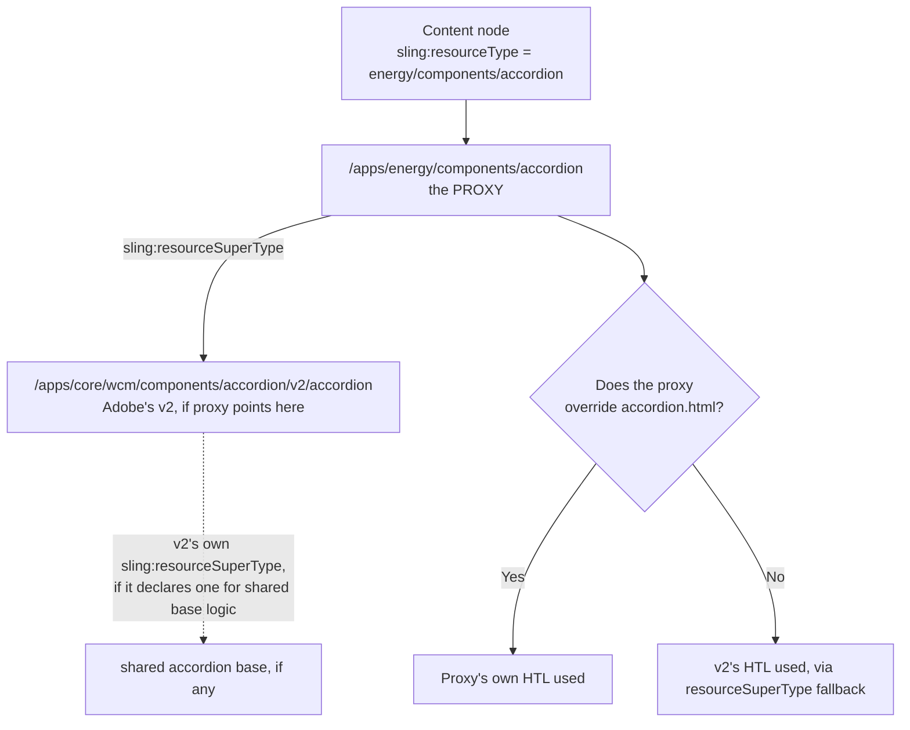
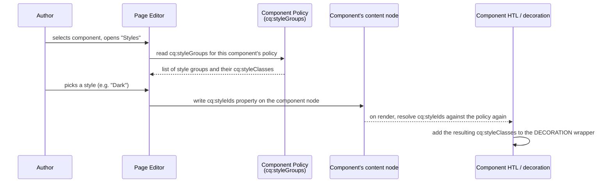
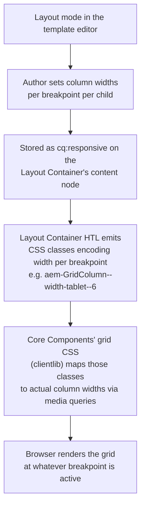

# 22 – Core Components and the Style System

> **Target:** 3–4 years experienced AEM Developer
> **Syllabus point covered:** *"What are Core Components? How do you extend them? What is the Style System and how does it differ from a variation dropdown? What is the Responsive Grid / Layout Container?"*
> **Project domain:** a global energy technology company's marketing site.

---

## Before we start — why this file matters more than most

File 02 already told you the honest modern answer to "how do you build a component": *default to a Core Component, extend it through a proxy, and build custom only when nothing else fits.* That answer is correct, and it is also exactly where most candidates stop — they can say the sentence, but they cannot survive the follow-up.

And there is always a follow-up, because Core Components is the topic where interviewers separate "has read the documentation" from "has lived with this on a real project." The documentation tells you Core Components exist and are versioned. It does not tell you what actually happens when your project sits on v1 of the Accordion and Adobe ships v2 with different HTL data attributes. It does not tell you why the Style System is centrally controlled while a dialog dropdown is not. It does not tell you why the Responsive Grid is the right tool on a landing page and the wrong tool inside a component that already has its own CSS grid.

So this file has one job: take the proxy pattern you already know from file 02, and go **deeper** — into version-upgrade mechanics, the delegation pattern for extending a Core Component's Java logic (not just its markup), the Style System's actual storage location, and the Responsive Grid's real mechanism. If file 02 got you through "would you use Core Components," this file gets you through "you're on v1, Adobe just released v3, walk me through the upgrade."

### A note on the project domain

Same site as every other file in this repository — a global energy technology company selling transformers, HVDC systems, grid automation and power quality equipment to utilities and industrial customers, across roughly twenty country sites. Never name a real client in an interview; "a global energy technology company" is the right level of detail.

> ### ⚠️ Read this before using any story in this file
>
> These stories are shapes, not scripts. If you say "we upgraded Core Components and something broke," expect four follow-up questions about exactly what broke and how you found it. Fill these shapes with something you can actually defend — a POC, a support incident you traced, or WKND tutorial work all count. A borrowed story that collapses under one follow-up does more damage than admitting you haven't done it yet.

---

## 1. Introduction

### 1.1 What Core Components actually are

Here is the definition worth giving first, because it is more precise than "Adobe's pre-built components":

> **Core Components are a separate, versioned open-source project — maintained and released by Adobe independently of the AEM product itself — that ships around thirty production-quality, accessible components covering the things almost every website needs.**

That "independently of the AEM product itself" clause is the part people skip, and it is the part that makes the rest of this file make sense. Core Components are not baked into your AEM installation the way, say, the Sling Post Servlet is. They are a Maven dependency your project pulls in, versioned on their own release cadence (their version numbers do not track AEM's version numbers), and you upgrade them by bumping a dependency — the same way you would upgrade any other library. Adobe ships bug fixes, accessibility improvements and new features to Core Components on a schedule that has nothing to do with when your AEM instance itself gets patched.

That single fact answers a cluster of interview questions at once: why they are versioned per-component rather than per-release, why upgrading them is a project decision rather than something that happens to you, and why two projects on the same AEM version can be running completely different Core Components versions.

### 1.2 Why they exist — the problem before Core Components

Before Core Components, every AEM project built its own Text, Image, Teaser, Carousel and Accordion from scratch. That meant every project separately solved — or failed to solve — the same accessibility requirements, the same responsive image handling, the same edge cases in rich text sanitisation. Adobe's own reference implementations (WCM Foundation components, then the AEM WKND tutorial's demo components) showed the pattern, but did not give you a maintained, reusable library.

Core Components changed the default. Now the honest starting point on any new project is "does a Core Component already do this," not "let's build one." File 02 covered the decision tree; this file assumes you already agree with the conclusion and asks: given that you're using them, what do you actually need to know to run a real project on them?

### 1.3 What's actually in the box

Worth being able to name a representative set, because "which Core Components have you used" is a completely ordinary opening question, and a vague answer ("the usual ones") reads as not having actually built with them.

**Page-structure and navigation:** Page, Breadcrumb, Navigation, Language Navigation, Search.

**Content:** Title, Text, Image, Button.

**Composite / marketing:** Teaser, List, Carousel, Tabs, Accordion.

**Layout / container:** Container (the Layout Container — covered in depth in section 2.9), Experience Fragment, Content Fragment.

**Utility:** Embed, Separator, Download, PDF Viewer.

**Forms:** the Core Form components — Form Container, Text, Checkbox, Options, Button, and others for building AEM Forms-integrated or plain HTML forms.

You will not need every one of these on every project, but you should be able to say which ones your (real or adapted) project actually proxies, because that is exactly the kind of concrete detail that separates a credible answer from a recited list.

### 1.4 The versioning model — v1, v2, v3, and why it exists

Open the Core Components repository or `/libs/core/wcm/components` on your instance and you will see folders like this:

```
/apps/core/wcm/components/
    accordion/
        v1/
            accordion/
        v2/
            accordion/
    teaser/
        v1/
            teaser/
        v2/
            teaser/
```

Notice the version is a **folder**, and the folder is part of the resource type: `core/wcm/components/accordion/v1/accordion` versus `core/wcm/components/accordion/v2/accordion` are two entirely different resource types that happen to render conceptually the same thing.

**Why version this way instead of just updating v1 in place?**

Because Core Components make no promise that v2 is backward compatible with v1's markup, dialog fields, or Sling Model interface. A v2 might change the HTML structure to fix an accessibility issue that required restructuring the DOM, rename a property, or split one dialog into two. If Adobe simply overwrote v1 with those changes, every site using v1 would break silently on the next Core Components upgrade — including sites that never asked to change anything.

Versioned folders solve that by making the breaking change **opt-in**. v1 keeps existing, unchanged, forever. v2 exists alongside it. Nothing forces you onto v2 until you deliberately point your proxy at it.

This is precisely the same reasoning file 02 used to justify the proxy pattern in the first place — decoupling your content from Adobe's paths — applied one level up. The proxy protects you from Adobe renaming or restructuring a component's *internals*; the version folder protects you from Adobe changing a component's *contract*.

### 1.5 A project description to adapt

> "On our site we're currently running Core Components 2.x as a dependency, and most of our proxies point at the latest version available at the time we set them up — mostly v2 for things like Teaser and Image, v1 for a couple of components that haven't needed a v2 yet, like Title. We track the Core Components release notes when we do a quarterly dependency review, and we've done one real upgrade — Accordion v1 to v2 — which is one of the stories I can walk through in detail."

That answer signals you understand versioning is per-component, not a single number for "Core Components" as a whole, and that upgrading is a deliberate, tracked activity rather than something that happens automatically.

---

## 2. Core Concepts

### 2.1 The proxy pattern, reinforced — go read file 02 section 2.3 first

File 02 already covered the mechanics of the proxy component in full: the problem it solves (no customisation point, no version control, coupling to Adobe's paths), the file itself (a `.content.xml` with nothing but `sling:resourceSuperType`), and how the resource-type chain resolves when Sling looks for a script, dialog, or edit config.

This file does not repeat that. What it adds is what happens **inside** the proxy once you actually need to upgrade the version it points at — because that is the part file 02 only sketched, and it is the part interviewers push into once they have confirmed you know what a proxy is.

### 2.2 What actually changes between Core Component versions

Before you can talk credibly about an upgrade, you need to know what kinds of things typically change between a v1 and a v2 of a Core Component, because "what breaks" always traces back to one of these:

**The Sling Model's interface.** Core Components ship a Java interface for each component (for example `Accordion`, `Teaser`) plus a non-exported `.impl` implementation — the same interface-plus-`.impl` pattern file 05 covers for your own models. A v2 model can add methods, but it can also change what an existing method returns, or remove one that v1 exposed. If your project's own code calls into a Core Component's model directly — which you generally should avoid, but people do it — that is where an upgrade breaks compilation.

**The HTL markup and its data attributes.** The most common real-world break. Core Components attach `data-cmp-*` attributes and specific class names that their own client-side JavaScript reads to wire up behaviour — an accordion's expand/collapse JS looks for a specific `data-cmp-hook-accordion="item"` attribute, for instance. If you overrode the HTL for a component (selective override, from file 02) and a version bump changes what attribute the new JavaScript expects, your overridden markup silently stops being interactive, because your markup still matches the old contract and the new JS is looking for the new one.

**The dialog structure.** A v2 might split one dialog field into two, rename a property, or move a field into a different tab. If you added a field via the Sling Resource Merger (file 02, section 3.2) at a specific relative path expecting v1's dialog shape, and v2 reorganises that shape, your merged field can silently stop appearing, or appear in the wrong place.

**The resource type of nested/child resources.** Composite components like Teaser or Carousel sometimes change what resource type their internal child items use. If you wrote custom logic that inspects a child resource's type directly, that is another break point.

**What does NOT usually change: the dialog's exposed properties for basic usage.** Adobe is generally careful to keep the *authored content* — the actual property names an author's data is stored under — stable across versions where possible, because that is content migration, which is a much bigger deal than a markup or JS change. This is worth saying explicitly in an interview, because it is the reassuring half of the answer: most version bumps do not require a content migration, they require checking your overrides.

### 2.3 The upgrade mechanics, step by step

Given the above, here is the actual sequence for moving a proxy from v1 to v2 — the answer you give when asked "walk me through upgrading Accordion v1 to v2":

**Step 1 — bump the dependency.** Core Components version is a Maven dependency (`core.wcm.components.core`, or the equivalent artefact for your setup). Update the version in the project's parent POM, and confirm the new version is actually installed on the target AEM instance (Cloud Service ships a current Core Components version already; on-prem you may need to deploy the new package yourself).

**Step 2 — change the proxy's `sling:resourceSuperType`.** This is the one-line change file 02 promised:

```xml
<!-- before -->
sling:resourceSuperType="core/wcm/components/accordion/v1/accordion"

<!-- after -->
sling:resourceSuperType="core/wcm/components/accordion/v2/accordion"
```

Nothing about your content changes. Every existing accordion on every page still points at `energy/components/accordion` — your resource type never moves. Only what that resource type inherits from moves.

**Step 3 — audit every override you made against v1.** This is the actual work, and it is exactly the list from section 2.2: did you override the HTL? Compare it against v2's reference HTL and check the `data-cmp-*` hooks and class names still line up, or rewrite your override to match v2's contract. Did you add a dialog field via the Resource Merger? Check the merge still lands where you expect against v2's (possibly reorganised) dialog. Did any Java code reference the v1 model directly?

**Step 4 — check clientlibs.** Core Components' own JavaScript and CSS clientlibs are versioned too, and are usually embedded or depended on by category rather than by exact version path, so bumping the dependency usually brings the right JS along automatically — but if your project vendored or copied any Core Components JS to customise it (which is itself a smell, but happens), that copy needs the same review as your HTL override.

**Step 5 — test on a lower environment against real content**, not a fresh page. The reason this matters specifically for Core Components upgrades: a fresh page you build to test the upgrade will use whatever the current dialog produces, but your existing 400 pages have content shaped by whatever v1's dialog produced months or years ago. The upgrade has to render correctly against that historical content, not just against new content you author during testing.

**Step 6 — roll out.** Because the proxy's `sling:resourceSuperType` is a single property on a single node, and it is deployed through your normal `ui.apps` pipeline, the upgrade itself ships like any code change — reviewed, tested, deployed. This is the entire point of the proxy: the upgrade is a one-line, reviewable code change instead of a content migration script touching hundreds of nodes.

**The interview answer, compressed:**

> "Bump the Core Components dependency, then change one property on the proxy — `sling:resourceSuperType` from `v1/accordion` to `v2/accordion`. No content changes, because content still points at our own resource type. The actual work is auditing anything we overrode — our HTL, if we changed it, has to match v2's new `data-cmp-*` hooks or the JavaScript stops finding what it expects; any dialog field we merged in via the Resource Merger has to still land correctly against v2's dialog shape. Then we test against existing content, not just freshly authored pages, because the upgrade has to render historical content correctly too. And because the whole thing is a one-line proxy change plus our own override files, it ships through the normal code pipeline — reviewed and tested — rather than a content migration."

### 2.4 The Sling Model interface + `.impl` pattern — tie to file 05

Every Core Component follows the same Java structure file 05 teaches as best practice for your own models: a public **interface** in an exported package (for example `com.adobe.cq.wcm.core.components.models.Teaser`) describing the component's data as getter method signatures, and a non-exported **`.impl`** package holding the actual `@Model`-annotated implementation class, registered with `adapters = Teaser.class`.

Why does this matter to you as someone extending, not writing, these components? Two reasons.

**One — it tells you what's actually stable.** The interface is the contract. Adobe can rewrite the entire implementation between versions and, as long as the interface's method signatures stay the same, nothing that depends on the interface breaks. When you write HTL that calls `teaser.getTitle()` on the model obtained via `data-sly-use`, you are coding against the interface, and that is exactly the part of a Core Component that changes least often between versions — which is why section 2.2 said the exposed properties are usually the stable half of an upgrade.

**Two — it's what makes ComponentExporter work at all.** File 17 covers `ComponentExporter` and the Sling Model Exporter in full, but the connection here is direct: Core Components' models implement `ComponentExporter` alongside their own interface (for example `adapters = { ComponentExporter.class, Teaser.class }`), which is exactly why every Core Component is automatically exportable as JSON at `<path>.model.json` with no extra work from you — the SPA Editor and any headless consumer of a Core-Component-authored page rely on this being true for every single one of them, consistently.

### 2.5 The delegation pattern — extending a Core Component's Java logic, not just its markup

This is the part of Core Components that most 3-4 year candidates have never had to do, and getting it right is a genuinely strong senior-level answer.

**Start with the problem.** Say you've proxied the Core Component Teaser. Its HTL and its model do everything you need — except one thing: your teaser cards need a computed "estimated read time" badge derived from the linked page's word count, and that logic has to live somewhere. You have three bad options and one good one.

**Bad option 1 — override the HTL and put the logic there.** HTL cannot run arbitrary Java (file 08 covers why deliberately), so you'd need a `data-sly-use` on a *new* model anyway — but then you've thrown away the Core Component's own model logic (URL resolution, link target handling, accessibility attributes) and have to reimplement it, or call it awkwardly from your new model.

**Bad option 2 — copy the Core Component's model class into your own package and modify it.** Now you own a forked copy that Adobe's next version bump does not touch, does not fix, and will drift from silently. This is exactly the coupling-to-Adobe's-internals problem the proxy pattern exists to avoid, just moved into Java instead of markup.

**Bad option 3 — extend the `.impl` class directly** (`public class MyTeaserImpl extends TeaserImpl`). This looks reasonable but Adobe does not guarantee the `.impl` classes are designed for subclassing — they live in a non-exported package specifically because they are not meant to be depended on directly. You would be compiling against an internal implementation detail that can change or even become `final` in a later version with no notice.

**The good option — delegate, using `@Via(type = ResourceSuperType.class)`.** Write your own Sling Model that implements the *same interface* the Core Component implements, and inject an instance of the Core Component's interface **adapted from the resource's super type** as a delegate field. Your model then implements every interface method by forwarding to the delegate, except the one method you actually need to change or add to.

```java
package com.energy.core.models;

import com.adobe.cq.wcm.core.components.models.Teaser;
import org.apache.sling.api.resource.Resource;
import org.apache.sling.models.annotations.Model;
import org.apache.sling.models.annotations.Via;
import org.apache.sling.models.annotations.via.ResourceSuperType;
import org.apache.sling.models.annotations.injectorspecific.SlingObject;

import javax.annotation.PostConstruct;

@Model(
        adaptables = Resource.class,
        adapters = Teaser.class,
        resourceType = "energy/components/teaser"
)
public class EnergyTeaserModel implements Teaser {

    // The Core Component's OWN model, adapted from the super type this
    // resource inherits from via sling:resourceSuperType. This is the
    // delegation: we are not extending Adobe's implementation class, we
    // are asking Sling to build one for us and forwarding to it.
    @Via(type = ResourceSuperType.class)
    @SlingObject
    private Teaser delegate;

    private String readTime;

    @PostConstruct
    protected void init() {
        // Our one piece of added behaviour.
        this.readTime = computeReadTime(delegate.getLinkURL());
    }

    // Every existing Teaser behaviour is untouched -- we simply forward.
    // If Adobe fixes a bug in getLinkURL() in the next version, we get
    // that fix for free because we never reimplemented it.
    @Override public String getTitle()          { return delegate.getTitle(); }
    @Override public String getDescription()    { return delegate.getDescription(); }
    @Override public String getLinkURL()        { return delegate.getLinkURL(); }
    @Override public String getImageSource()    { return delegate.getImageSource(); }
    // ... remaining Teaser interface methods, all forwarded ...

    // The one method that's actually new -- not part of the Teaser
    // interface, so add it as a plain getter and call it from HTL directly.
    public String getReadTime() {
        return readTime;
    }

    private String computeReadTime(String linkUrl) {
        // ... word-count lookup against the linked page, omitted ...
        return "4 min read";
    }
}
```

**Why this is the strong answer.** You get the Core Component's existing behaviour for free — including whatever Adobe fixes in it later — because you never reimplemented it, you asked Sling to hand you an instance built exactly the way Adobe intended (adapted via the resource's own super type) and forwarded to it. You add exactly the one thing you need. And you have not coupled yourself to any internal Adobe class, only to the public interface, which is the stable, documented contract.

**The interview answer:**

> "If I need to extend a Core Component's actual logic, not just its markup, I don't subclass Adobe's `.impl` class — that's an internal implementation detail Adobe doesn't guarantee is stable. Instead I write my own model implementing the same public interface, inject the Core Component's own model as a delegate using `@Via(type = ResourceSuperType.class)` — which adapts the resource through whatever `sling:resourceSuperType` it inherits from — and forward every interface method to that delegate except the one I'm adding or changing. That way I get all of Adobe's existing behaviour, including any future bug fixes, for free, and I've only coupled myself to the public interface, which is the part of a Core Component that changes least between versions."

*Cross:* Why not extend the `.impl` class directly? · What does `ResourceSuperType` mean as a `@Via` type versus the default? · What happens to this pattern across a version upgrade? (Usually nothing, if the interface didn't change — which is exactly why interfaces are the stable half.)

### 2.6 Extending a Core Component — the four ways, ranked

Pulling file 02's decision tree and the above together, here is the complete list of ways to extend a Core Component, from lightest to heaviest:

**1. Style System.** No code, no new resource type. Covered in full in section 2.7 onward. Use this when the requirement is purely visual.

**2. Add a dialog field via the Sling Resource Merger.** File 02, section 3.2. A partial dialog XML with `sling:orderBefore`, merged with the inherited one. Use this when you need one or two extra author-facing fields and the existing markup and logic are otherwise fine.

**3. Override the HTL only.** Your own `.html` file in the proxy folder, same file name as the folder, everything else — dialog, edit config, Java model — still inherited. Use this when the Core Component's data and behaviour are right but the design system needs fundamentally different markup.

**4. Delegate to the Core Component's model.** Section 2.5. Use this when you need new computed data or genuinely different logic, not just different markup, and you still want the underlying component's existing behaviour.

Notice the ordering is the same shape as file 02's decision tree — reach for the lightest mechanism that solves the actual requirement, and only go further down the list when the lighter ones genuinely cannot do it.

### 2.7 The Style System — the problem it solves, and where it actually lives

Start with the problem, because "Style System" as a name tells you nothing.

**The problem.** An author needs a component to look different in different places — a Teaser that's usually a plain card but needs a "featured, larger, bordered" treatment on the homepage, or a Text component that needs a "pull quote" look on an article page. The naive fixes are both bad. Building a second component just for the visual difference means two dialogs, two HTL files and two things to keep in sync for content that is otherwise identical. Adding a "variation" dropdown to the existing dialog means a developer has to add code every time marketing wants a new visual option, and — the part people miss — that dropdown's options are the same everywhere the component is used, because they're hardcoded in one dialog XML file shared by every instance.

**The Style System is Adobe's answer to both problems**, and the mechanism is worth stating precisely:

> **Style classes are defined in the component's policy, not in its dialog, and not in its code.**

That single sentence is the whole idea, and it is why the Style System ties directly back to file 03. A policy, remember, is design-time configuration for a component *as used within a particular template*. Up to now every policy example in file 03 was about permissions — which components are allowed inside a container. The Style System is what a policy configures when the component in question is not a container but an ordinary content component: instead of "what can go inside you," the policy says "what can you look like, here, on this template."

**The actual property, `cq:styleGroups`.** Inside a component's policy definition, a `cq:styleGroups` node holds one or more style groups, and each group holds one or more individual styles:

```
/conf/energy/settings/wcm/policies/energy/components/teaser/product_teaser_policy/
    cq:styleGroups/
        background/                    ← one style GROUP
            cq:styleGroupLabel = "Background"
            cq:styles/
                light/
                    cq:styleId = "2001"
                    cq:styleLabel = "Light"
                    cq:styleClasses = "teaser--bg-light"
                dark/
                    cq:styleId = "2002"
                    cq:styleLabel = "Dark"
                    cq:styleClasses = "teaser--bg-dark"
```

Four properties worth being able to name individually, because interviewers ask for them by name:

**`cq:styleGroupLabel`** — the heading an author sees in the Styles panel, grouping related choices together.

**`cq:styleId`** — a stable numeric-looking ID. This, not the class name, is what gets written onto the content node when an author picks a style. That indirection is deliberate — content records *which choice was made*, and the policy is the only place that records *what that choice currently means*.

**`cq:styleLabel`** — the human-readable name for this specific style, inside its group, shown to the author.

**`cq:styleClasses`** — one or more CSS class names, space-separated if more than one, applied to the component's markup when this style is selected.

**How the class actually reaches the markup.** File 02, section 3.3 already introduced the decoration wrapper — the `<div>` AEM adds around every component so the page editor has something to attach its toolbar to. The Style System's chosen classes are added to exactly that wrapper, not to some element inside your HTL. That is worth stating as its own fact, because it explains a real class of confusion: if your HTL's own root element is *not* the decoration wrapper — for instance because you changed the decoration tag name, or disabled decoration entirely with `cq:noDecoration` — the style class still needs somewhere to land, and disabling decoration without a plan for where style classes go is a real way to make the Style System silently stop working for that component.

### 2.8 Single-select versus multi-select style groups

A single style group behaves like a radio choice: an author picks exactly one style from it, or none. The "Background" group above is exactly this — light or dark, never both, because a background genuinely can only be one thing at a time.

Multi-select is not a separate flag you set on a group. It is simply **having more than one style group on the same component**, each resolved independently. If the policy also defines an "Emphasis" group with a single "Featured" style in it, an author can pick a background *and* independently decide whether to also apply "Featured" — the two choices don't interact, and both sets of resulting classes land on the same wrapper together.

Say it like this in an interview, because it corrects a common misconception in one sentence:

> "There isn't a multi-select toggle on one group — you get 'multi-select' behaviour by defining multiple independent style groups. Within a single group, an author picks one style, like a radio button. Across groups, choices are independent and combine, because each group is authored and resolved on its own."

The practical design consequence: if two style groups' classes might visually conflict when both are chosen — say a "Dark" background and a border colour meant only for light backgrounds — that has to be handled in the CSS itself, because the Style System has no concept of one group depending on another's choice.

### 2.9 Why the Style System beats a dialog "variation" dropdown — and the multi-brand argument

This is one of the highest-value comparisons in this file because it comes up constantly, usually as "why not just add a dropdown?" Give all four reasons, not just one:

**No code, no deployment.** Adding a new style is a policy edit through the template editor's Styles configuration UI. Adding a new dropdown option is a dialog XML change, which is code, which needs a deployment.

**Centrally controlled per template.** A dialog's options live in one XML file shared by every instance of the component everywhere it's used. A policy is per-template (file 03's whole point), so the exact same proxied component can offer a completely different set of styles on one template than on another.

**Owned by the right role.** A template author can manage styles through the UI. A dropdown's options are owned by a developer, because they're in code.

**It scales to multi-brand.** This is the argument worth developing fully, because it is where the Style System's design pays for itself on a real project. Tie it to file 12's territory: our twenty-country energy site runs each country as an MSM live copy of a language master, and different countries can resolve different `/conf` configuration through context-aware configuration and `sling:configRef` (file 03, section 3.4). Because a policy lives under `/conf`, two countries pointing at different configuration roots can define **entirely different style groups for the exact same proxied Core Component**, with zero code differences:

```
/conf/energy-eu/settings/wcm/policies/.../teaser_policy
    cq:styleGroups → Light / Dark

/conf/energy-apac/settings/wcm/policies/.../teaser_policy
    cq:styleGroups → Light / Dark / High-Contrast   (a regional accessibility requirement)
```

Same Teaser component, same Java, same HTL, same proxy. One region simply has a policy with one more style group in it. A dialog dropdown cannot do this at all — its options are baked into one file the whole codebase shares.

**The interview answer, in full:**

> "A dropdown's options are hardcoded in the dialog, so every instance everywhere gets the same choices, and adding one means a developer, code, and a deployment. A Style System style is defined in the component's policy instead, so a template author manages it through the UI with no deployment, and because policies are per-template — and per `/conf` configuration root — the same component can offer completely different style options on different templates, or even different countries on a multi-brand site, without touching a line of code."

*Cross:* Where exactly does the class land? (The decoration wrapper.) · What happens if a style is removed from the policy after being chosen? (Silently stops applying — the stored ID no longer resolves to anything; see the Common Mistakes and Scenarios tables.) · How does this tie to MSM? (Different live copies can resolve different policies via `sling:configRef`.)

### 2.10 Data layer support

**The problem this solves.** Analytics and personalisation tooling needs to know *what* is on a page and *what happened* on it — which teaser was clicked, which accordion panel was opened — without scraping the DOM for CSS class names or text content, because those change with every redesign and are never a stable contract for a downstream analytics tag to depend on.

Core Components ship built-in support for the **Adobe Client Data Layer** pattern to solve exactly this. Two halves to know:

**Description.** A component eligible for the data layer renders a `data-cmp-data-layer` attribute on its markup, containing a JSON description of itself — its own generated ID, its component type, and a handful of component-specific fields (a Teaser's title, or the DAM path of its image, for instance). That JSON is present in the page's own HTML, so any script reading the data layer does not need to infer anything from visual markup — it reads a structured, versioned description that Adobe defines the shape of.

**Events.** On genuine user interaction — an accordion panel expanding, for instance — the component's own JavaScript pushes an event object onto a well-known global array (conventionally `window.adobeDataLayer`), which analytics tooling listens to. That decouples "something happened" from "how the DOM happened to be structured at that moment," which is exactly the fragility a scraping-based analytics integration suffers from.

**Where this is configured.** Data layer support is generally controlled by a project-wide toggle (an OSGi configuration enabling it globally) with the ability to enable or disable it per component through its policy — the exact property naming can differ by Core Components version, so rather than quoting one, know the shape: a global switch, and a per-component override, both design-time, neither requiring you to write the JSON by hand.

**Why this matters to you as someone extending, not writing, Core Components:** if you override a component's HTL, you can accidentally drop the `data-cmp-data-layer` attribute along with everything else you didn't reproduce, silently breaking analytics tracking for that component with no visible symptom on the page itself — nothing looks wrong, the numbers are just quietly missing. That is worth naming as a checklist item alongside file 02's accessibility caution, because both are invisible failure modes an override can introduce without anyone noticing until someone asks why a report has a gap in it.

### 2.11 Accessibility — what "built to WCAG standards" actually means in practice

File 02 already gave you the one-line argument: Core Components are built to WCAG standards, and extending one inherits that work for free. Here is what that claim actually cashes out to, because "accessible" said without specifics sounds like a slogan, and with specifics sounds like you've read the markup.

**Semantic elements over div soup.** A `<button>` for anything clickable and interactive, not a `<div>` with a click handler — the file 02 FAQ accordion example showed exactly why: a real button is keyboard-focusable and activatable with Enter or Space for free, with no JavaScript required to make it so.

**The full ARIA contract where semantics alone aren't enough.** Interactive composite components — Accordion, Tabs, Carousel — follow the WAI-ARIA authoring pattern for that widget type: `aria-expanded` on a toggle, `aria-selected` on a tab, `aria-controls` linking a control to what it affects, `role="region"` or `role="tabpanel"` marking the controlled content as a landmark. File 02, section 8B.4 walked through this table for the accordion in full, and the same shape of contract applies to Tabs and Carousel.

**Keyboard operability, not just focusability.** Being reachable by Tab is necessary but not sufficient — Tabs and Carousel additionally support the arrow-key navigation pattern users of assistive technology expect for that widget type, not just Tab-and-Enter.

**Alt text as an authoring requirement, not an afterthought.** The Image component's dialog includes a field for alternative text, and — importantly — a way to mark an image as purely decorative, which should render an empty `alt=""` rather than either omitting the attribute (which some screen readers announce as the filename) or forcing an author to invent a description for an image that conveys no content.

**Focus management on things that show and hide content.** A component that opens a panel or a modal-like overlay needs to consider where keyboard focus goes when it opens and where it returns when it closes — this is one of the genuinely hard parts of accessible interactive UI, and it is exactly the kind of thing a from-scratch custom component is most likely to get wrong under a deadline.

**Adobe tests for this as part of Core Components' own release process** — automated accessibility tooling as part of their CI, alongside manual review. That is the concrete backing for "tested," not just "written carefully."

**The consequence for you.** Every one of these is work you do not have to redo when you extend rather than rebuild — but every one of these is also something you can silently throw away the moment you override a Core Component's HTL and don't reproduce it. "We override the HTL for design reasons" is a completely normal, defensible answer. "We override the HTL and never checked whether the ARIA attributes survived" is the answer that turns an accessibility audit into a bad afternoon. Worth stating explicitly:

> "Extending Core Components is a real accessibility argument, but it's only as good as what you preserve when you customise. If I override HTL, checking the ARIA contract and keyboard behaviour survived the change is part of the review, the same way checking the `data-cmp-*` hooks survived is part of a version upgrade."

### 2.12 The Responsive Grid — the Layout Container in depth

File 03 already introduced the Layout Container as the component behind `wcm/foundation/components/responsivegrid`, and showed it sitting inside a template's structure as the authoring surface authors drop components into. This section goes deeper into how its responsiveness actually works, because "it's responsive" is not an answer an interviewer accepts on its own.

**The problem it solves.** Before a mechanism like this, making a page look right at three or four different viewport widths meant a developer writing bespoke CSS media queries for every possible arrangement of components an author might create — which does not scale, because authors rearrange pages constantly and a developer cannot pre-write a media query for every future arrangement.

**The authoring model — column-based layout.** The Layout Container divides its width into a fixed number of columns (conventionally twelve, matching the common web-grid convention), and each direct child is assigned how many columns wide it should be, independently per breakpoint. A hero image might span all twelve columns on mobile but sit at six columns beside a six-column text block on desktop — same two components, same content, different arrangement, purely a layout decision.

**Where this is set — Layout mode.** In the template editor (file 03) or, for unlocked containers, directly in the page editor, a template author switches into **Layout mode**, picks a breakpoint from a device-icon toolbar (typically something like Desktop, Tablet, and Mobile, plus any custom breakpoints the project has defined), and drags column boundaries to resize each child, or drags components to reorder them, independently for each breakpoint selected. This is a genuinely different mode from ordinary authoring — you are configuring "how do things arrange at this width," not editing any component's content.

**Breakpoints themselves are configurable, not fixed.** Beyond the defaults, a project can define its own breakpoints — named viewport-width thresholds under a project's `/conf` configuration — so a project whose design system cares about an unusual width (say, a specific tablet-landscape breakpoint the site's design mandates) is not stuck with only the out-of-the-box set.

**How the grid CSS is actually generated — the mechanism to state precisely.** The column span an author sets for each child, per breakpoint, is stored on the container's own content node and resolved into **CSS class names** on each child's decoration wrapper — something in the shape of `aem-GridColumn--width-<breakpointName>--<columnSpan>`, with a similar pattern for any column offset. Those classes are static, generated once at author time. The Layout Container's own clientlib CSS then does nothing more than define, inside a `@media` rule matching each breakpoint's width, what `width` (or grid/flex sizing) each of those classes maps to. Nothing computes at render time on the server, and nothing needs JavaScript in the browser either — the browser's own CSS engine evaluates which media query currently applies and renders accordingly.

**Why that mechanism matters, stated as the payoff.** Because the markup is static per page — the same HTML is served to every visitor regardless of their actual viewport — the page is exactly as dispatcher-cacheable as a page with no responsive behaviour at all. This is the detail that turns "it's responsive" into a real architectural answer: responsiveness here is a CSS-only concern layered on top of markup that never changes per request.

**The emulator — how authors preview breakpoints.** The template and page editors include a device-emulator toolbar in Layout and Preview modes, letting an author see the page rendered at a given breakpoint's width without needing an actual device of that size — essential for a template author configuring column spans to see immediately what each breakpoint will actually look like rather than authoring one breakpoint's layout blind to the others.

**Its relationship to the site's own CSS grid or flexbox — and when NOT to use it.** The Layout Container generates and owns its own grid CSS. A component that already implements its own internal layout using CSS Grid or Flexbox — say, a card component whose internal layout is entirely its own concern — should not have a Layout Container nested inside it "just in case," because now two grid systems are trying to size the same elements, and they were not designed to cooperate. The Layout Container is the right tool for **page-level, author-controlled arrangement of independent components**. It is the wrong tool inside a single component's own internal markup, and it is also the wrong tool for a design that needs to be pixel-consistent and centrally controlled with no per-page authoring freedom at all — some projects deliberately give authors a fixed arrangement with no Layout mode access on certain templates, precisely because "the marketing page must always look exactly like this" is a real, valid requirement that a fully free-form authoring grid works against rather than for.

**The interview answer:**

> "The Layout Container is the component behind the responsive grid — authors set how many of twelve columns each child spans, independently per breakpoint, in the template editor's Layout mode. That gets baked into CSS class names on each child at author time, and the Layout Container's own CSS applies width rules to those classes inside media queries per breakpoint — nothing is computed live, so the markup is exactly as cacheable as a non-responsive page. I'd use it for page-level arrangement authors genuinely need to control. I would not nest it inside a component that already owns its own internal CSS grid or flexbox layout, because you end up with two grid systems fighting over the same elements — and on a design that must render identically everywhere with no per-page authoring freedom, I'd consider not exposing Layout mode at all rather than giving authors a tool that invites drift from the design system."

*Cross:* What generates the column-width CSS classes? · Why doesn't a structure change to the grid need a dispatcher-cache-busting mechanism beyond a normal flush? · How would you add a custom breakpoint? · What happens if you nest a Layout Container inside a component with its own flexbox layout?

### 2.13 When NOT to use Core Components

Said honestly, because an interviewer respects a bounded answer more than blanket enthusiasm:

**When the requirement has no conceptual equivalent.** File 02's example is the exact right one — a listing whose cards are derived from the page tree rather than hand-authored has no Core Component analogue. Building it "Core-Component-style" (Sling Model, HTL-only rendering, accessible markup) is still good practice, but there is no v1/v2 to inherit from.

**When the design system's markup requirements are so different that overriding the HTL becomes a full rewrite anyway.** At that point you are paying for the inheritance chain, the dialog you don't use as-is, and the version-tracking overhead, without getting much benefit. This is rare, but it happens with heavily custom design systems — worth naming as an exception rather than pretending it never applies.

**When a component genuinely needs server-side integration logic with no authoring surface at all** — for example a component that renders purely from a backend service call with no dialog fields — a Core Component base gives you very little, since most of what it offers is dialog and authoring behaviour.

The point of naming these is not to talk yourself out of Core Components — the default is still "yes, proxy one" — but to show you have actually hit a case where the default did not apply, which is more convincing than reciting "always use Core Components."

---

## 3. Internal Working

### 3.1 The version-folder resolution, end to end



**The point to draw out verbally:** the content node's resource type never changes across a version upgrade. Only the single property on the proxy — `sling:resourceSuperType` — changes which version folder that resource type's missing pieces fall through to. That is why the upgrade is a one-line change rather than a content migration, and it is worth saying explicitly because it is the same resolution mechanism file 02 already taught for the basic proxy, just pointed at a different version folder.

### 3.2 How the Style System applies a class at render time



**Why this matters as a mechanism, not just a fact:** the author's choice is stored as an **ID** (`cq:styleIds`, pointing at `cq:styleId` in the policy), not as the literal class name. That indirection is exactly what makes the Style System centrally controlled — the class a given style ID maps to lives in the policy, so a template author (or developer) can change what "Dark" actually renders as, for every component that used it, by editing the policy once, without touching a single piece of content. Content stores the *choice*; the policy stores the *meaning* of that choice.

### 3.3 The Responsive Grid's render-time column resolution



**The mechanism, stated plainly:** the Layout Container does not compute layout live in the browser with JavaScript. It computes the column widths **once, at author time**, in Layout mode, and bakes them into class names on each child's decoration wrapper. The CSS shipped with the Layout Container's clientlib then does nothing more than apply `width` (or grid/flex sizing) rules keyed to those class names inside media queries matching each breakpoint. That is why the Responsive Grid is dispatcher-cache-friendly — the markup is static per page, and the browser's own media query evaluation handles the "which layout applies right now" question with no server involvement at all.

---

## 4. Important Interview Questions

### 4.1 Basic

**Q1. What are Core Components?**
A separate, versioned set of roughly thirty ready-made, accessible AEM components — Text, Image, Teaser, Carousel, Accordion, Container, and more — maintained and released by Adobe independently of the AEM product itself.

*Cross:* Where do they live under `/apps`? · Are they part of AEM's own release, or a separate dependency? · Should content ever reference them directly?

**Q2. Why are Core Components versioned in folders like v1, v2?**
Because a new version can be a breaking change — different markup, different dialog shape, different model behaviour — and versioning by folder makes moving to it opt-in. v1 keeps existing unchanged; nothing forces existing content onto v2.

*Cross:* What typically changes between versions? · How do you actually upgrade? · Does the resource type in content ever change?

**Q3. Should you ever use a Core Component's resource type directly in content?**
No — always through a proxy, for exactly the reasons file 02 covers: no place to customise, no control over the version, and coupling to Adobe's internal paths.

*Cross:* What breaks if you don't? → file 02's upgrade-gone-wrong story. · What's in the proxy file?

**Q4. Name some Core Components you've used.**
A representative list across categories — structural (Page, Container), content (Text, Image, Title, Button), navigation (Breadcrumb, Navigation, Language Navigation, Search), and composite/marketing (Teaser, Carousel, Tabs, Accordion, List).

*Cross:* Which did you proxy versus override HTL on versus never touch? · Which needed a dialog addition?

**Q5. What is the Layout Container?**
The Core Component behind `wcm/foundation/components/responsivegrid` — a container that lets authors place and arrange child components in a responsive column grid, configured in the template editor's Layout mode.

*Cross:* What node stores the layout config? (`cq:responsive`) · How do authors preview different breakpoints? · Is it the only way to lay out a page? (No — see section 2.9's "when not to use it")

**Q6. What is the Style System?**
A mechanism letting authors choose predefined appearance variants for a component — defined centrally in the component's policy as `cq:styleGroups` — without any new dialog field or new resource type.

*Cross:* Where exactly is a style defined? · How is the chosen class applied? · Why is this better than a dialog dropdown?

**Q7. Where is a style class actually applied?**
To the component's decoration wrapper — the same wrapper AEM adds around every component for the editor to attach to, covered in file 02, section 3.3.

*Cross:* What if you've disabled decoration with `cq:noDecoration`? · Can you apply a style to an inner element instead? (Not directly — you'd need custom HTL reading `cq:styleIds` yourself)

**Q8. Are Core Components accessible?**
Yes — they are built to meet WCAG standards, which is itself a strong reason to extend rather than build from scratch, since you inherit that accessibility work.

*Cross:* Does overriding the HTL risk breaking that? (Yes — you own accessibility for anything you rewrite) · How would you verify it's still accessible after an override?

**Q9. What Java pattern do Core Components use for their models?**
Interface in an exported package plus a non-exported `.impl` implementation class, the same pattern file 05 recommends for your own models — registered with `adapters` pointing at the interface.

*Cross:* Why does the interface matter more than the impl for stability? · What does this enable for the Sling Model Exporter? → file 17.

**Q10. What is `ComponentExporter`?**
The interface Core Components' models implement (alongside their own interface) that makes every one of them automatically exportable as JSON at `<path>.model.json`, with no extra work.

*Cross:* What does it require of the `@Model` annotation? (`resourceType`) · How does the SPA Editor use it? → file 17.

### 4.2 Intermediate

**Q11. Walk me through upgrading a Core Component from v1 to v2.**
→ Section 2.3 in full: bump the dependency, change `sling:resourceSuperType` on the proxy, audit every override (HTL data attributes, merged dialog fields, any direct model references), test against existing content, ship through the normal pipeline.

*Cross:* What typically breaks first? (an HTL override whose `data-cmp-*` hooks no longer match the new JS) · Why test against existing content specifically, not just new pages? · Is this a content migration? (No — that's the whole point of the proxy)

**Q12. What actually changes between Core Component versions?**
→ Section 2.2: the model interface (rarely, but possible), the HTL markup and its `data-cmp-*` attributes (most common break), the dialog structure, occasionally child resource types. Authored property names for basic usage are usually kept stable.

*Cross:* Which of these is most likely to silently break an HTL override? · Why are authored properties usually stable across versions?

**Q13. How would you add one extra field to a Core Component's dialog without forking it?**
→ File 02, section 3.2: the Sling Resource Merger, a partial dialog with `sling:orderBefore`, mounted so it merges with the inherited dialog rather than replacing it.

*Cross:* What happens to that merge across a version upgrade if v2 reorganises its dialog? (You have to re-verify where your merged field lands) · How would you remove an inherited field instead? (`sling:hideResource`)

**Q14. What is the Style System defined against, structurally?**
The component's **policy** — `cq:styleGroups`, with each group holding one or more styles as `cq:styleId`, `cq:styleLabel` and `cq:styleClasses`. Policies are per-template, so file 03's policy mechanism applies directly.

*Cross:* Can two templates give the same component different style choices? (Yes — different policies) · Single-select or multi-select? → section 2.9 below.

**Q15. Why is the Style System better than adding a "variation" dropdown to the dialog?**
Four reasons: no code change and no new resource type; centrally controlled per template through the policy rather than per-instance in a dialog; a template author (not a developer) can add or change styles; and the same component can offer different style choices on different templates, which a hardcoded dropdown cannot do.

*Cross:* What's the actual mechanism difference — dropdown value versus style class? · Who edits a dropdown's options versus a style group? (developer versus template author)

**Q16. What is the delegation pattern for extending a Core Component's Java logic?**
→ Section 2.5 in full: your own model implementing the same interface, injecting the Core Component's model as a delegate via `@Via(type = ResourceSuperType.class)`, forwarding every method except the one you're adding or changing.

*Cross:* Why not extend the `.impl` class directly? · What does `@Via(type = ResourceSuperType.class)` actually do? · What do you lose if the interface itself changes in v2?

**Q17. How does `cq:isDeep`... wait, how does a template's Layout Container relate to file 03's structure/initial split?**
The Layout Container is very often the unlocked, structural authoring surface inside a template — placed once in structure (so it's guaranteed present on every page), but its *contents* are per-page authored content, exactly the locked/unlocked mechanism from file 03.

*Cross:* Is the Layout Container itself ever locked? (Rarely — that would prevent authors adding anything) · What decides which components can go inside it? (Its policy — file 03, section 2.7)

**Q18. Multi-brand sites and the Style System — how do they interact?**
Each country or brand's templates can point at different policies (via different `/conf` configuration, file 03's context-aware configuration and `sling:configRef`), so the same proxied component can offer entirely different style choices per brand — a European brand's teaser might offer "Light / Dark," while a different regional brand's teaser offers a third "High Contrast" option, with zero code differences.

*Cross:* Where does the actual override live? (a different policy under a different `/conf` root) · How does this tie to file 12's MSM live copies? (a live copy inherits structure via `cq:template`, but can resolve different policies through `sling:configRef`)

**Q19. What breaks if a template author picks a style but the policy is later edited to remove it?**
The stored `cq:styleIds` value no longer resolves to anything in the policy, so the component typically renders with no extra style class applied — visually falls back to unstyled, without an error. Worth checking in Debugging Tips.

*Cross:* How would you find pages affected? · Is this a hard failure or silent? (Silent — nothing throws)

**Q20. Multi-select versus single-select style groups — what's the difference?**
A style **group** can be configured to allow picking only one style from it (like a radio choice — e.g., "background: light or dark, pick one") or several at once (like independent toggles — e.g., "rounded corners" and "drop shadow" as separate groups an author can combine). The behaviour is a property on the style group definition itself, not something read from content each time.

*Cross:* Where would you use multi-select versus single-select in practice? · What happens to classes on the wrapper with multiple groups selected? (all resulting `cq:styleClasses` from every selected style are added together)

### 4.3 Advanced

**Q21. You're on Core Components v1 across ten proxied components. Adobe ships v3 for two of them. How do you plan the upgrade?**

> "First I'd check whether the jump is v1 straight to v3, or whether v2 is an intermediate step I should understand too — release notes usually call out cumulative breaking changes. Then, per component, I'd separate what we've overridden from what we haven't: for the ones where we only proxy with no HTL or dialog override, the upgrade risk is low, because we inherit everything and Adobe's own migration testing covers us. For the ones where we overrode HTL or added dialog fields via the Resource Merger, that's where the actual work is — comparing our override against the new version's reference implementation, checking `data-cmp-*` hooks still align, and re-verifying merged dialog fields land where expected.
>
> I'd do this on a branch, upgrade the dependency, flip the proxies, and run it against a copy of production content — not fresh pages — because existing content was shaped by the old dialog and needs to render correctly under the new template. I'd prioritise the two components that changed first, get those solid, then decide whether to bump the other eight to whatever version is current at the same time, since doing it once avoids repeating the whole audit process later for components that didn't strictly need to move yet."

*Cross:* Would you upgrade all ten at once or just the two that changed? · How do you scope the testing effort? · What's the rollback plan if something's found in production?

**Q22. A component renders fine on your test page but breaks on production content after a Core Components upgrade. Why might that be, specifically?**

The most likely cause given everything above: the production page's content was authored under the old dialog shape, and either a field the old model read no longer exists in the new one, or your merged dialog field's relative path assumption no longer holds against the new dialog's structure — while your fresh test page, authored *after* the upgrade, never exercises the mismatch because it was created against the current (already-upgraded) dialog.

*Cross:* How would you find affected pages at scale? (query for the resource type plus check for the old property name) · What's the fix — a content migration script, or an `OPTIONAL`-injection fallback in the model?

**Q23. How would you build a component that needs both the Style System and a Layout Container inside it?**

> "They're independent mechanisms and compose without conflict. The component itself — say a custom promo band — gets its own policy with `cq:styleGroups` for its own appearance choices, applied to its own decoration wrapper. If that promo band also needs to contain other authorable components, I'd nest a Layout Container inside it, which gets its own separate policy controlling what's allowed inside it. The two policies are unrelated to each other structurally, even though they both live under `/conf/.../policies` and both attach via the template's policy mapping — one governs the promo band's own appearance, the other governs what an author can drop inside it."

*Cross:* Do nested containers inherit the parent's style policy? (No — separate policy per node, same rule as file 03's "nested containers don't inherit" for allowed components) · Where would `cq:isContainer` come in? → file 02.

**Q24. Your design system requires markup so different from a Core Component's default that overriding the HTL is basically a full rewrite. Do you still proxy it?**

> "I'd think hard about it rather than defaulting to yes. If I'm rewriting effectively all the markup, I'm not getting much benefit from the inheritance chain — I still have to track Core Components versions and re-verify my override on every upgrade, but I'm not reusing much of what changed. In that case I'd weigh building a genuinely custom component instead, still following Core Component conventions — interface-plus-impl model, accessible markup, a policy-driven style option if variants are needed — so it behaves like a good citizen on the project even without literally inheriting from Adobe's component. The exception is if the component's *dialog and data model* are still exactly what I want and only the *rendering* differs — then the override is worth it because I keep all of Adobe's authoring and data work and only rewrite presentation."

*Cross:* What's the actual cost of maintaining a Core Components proxy versus a fully custom component, long-term? · How do you decide "basically a rewrite" versus "meaningfully different but still inheriting value"?

**Q25. How would you make the same proxied Teaser component behave differently for three country sites without three sets of code?**

Two independent levers, and naming both is the strong answer: the **Style System**, via different policies per country's `/conf` configuration (section 2.9's multi-brand argument, tied to file 12's context-aware configuration under MSM), for purely visual differences; and, if the actual *data* needs to differ — say, different link resolution logic for one country's document system — the **delegation pattern** from section 2.5, layered per country only if genuinely necessary, since most country differences should be solved at the policy/style level rather than the Java level.

*Cross:* Which lever would you reach for first? (Style System, because it needs no deployment) · When would delegation genuinely be required instead? (behavioural difference, not appearance)

**Q26. The Responsive Grid's column classes are baked in at author time. What does that mean for a genuinely dynamic layout requirement — say, a component whose column span should change based on how many siblings are present?**

> "The Responsive Grid can't do that by itself, because its widths are fixed per breakpoint at authoring time in Layout mode, not computed from sibling count at render time. If I needed genuinely dynamic column spans, I'd either handle it in the component's own CSS with flexbox or grid auto-fit rules that respond to however many children happen to be present, or compute the count in the Sling Model and emit a class or inline style reflecting it. Either way, that's a case for not relying on the Layout Container's own grid for that particular piece of layout, even if the Layout Container is still used as the outer authoring surface."

*Cross:* Why is this not a bug in the Responsive Grid? (It's not designed to be render-time dynamic — dispatcher cacheability depends on it not being) · What's the trade-off of computing it server-side in the model instead?

---

## 5. Cross Questions — how this topic gets drilled

**Thread A — from "do you use Core Components?"**
Which ones? → Proxied or direct? → What's actually in the proxy file? → Have you ever upgraded a version? → What broke? → How did you find it? → What would you check first next time?

**Thread B — from "what is the Style System?"**
Where is a style defined? → What's the actual property structure — `cq:styleGroups`, `cq:styleId`? → How is the class applied at render time? → Single-select or multi-select? → Why is this better than a dialog dropdown? → How does it interact with multi-brand or multi-country templates? → What happens if the policy removes a style an author already picked?

**Thread C — from "how would you extend a Core Component's logic, not just its markup?"**
Why not just subclass the impl class? → What is `@Via(type = ResourceSuperType.class)` actually doing? → What do you forward and what do you override? → What do you gain versus copying the model class? → What happens to this across a version upgrade?

**Thread D — from "what's the Responsive Grid?"**
Where is the layout config stored? → `cq:responsive` — what's inside it? → How does Layout mode relate to file 03's template editor? → How is it cacheable if it's "responsive"? → When would you not use it? → How does an author preview a specific breakpoint?

---

## 6. Best Interview Answers

### 6.1 "What are Core Components and how do you extend them?" — about 2 minutes

> "Core Components are Adobe's maintained, versioned library of around thirty production-quality components — Text, Image, Teaser, Carousel, Accordion, Container and more — released independently of AEM itself, so they're a dependency you bump, not something tied to your AEM version.
>
> My default on any requirement is to check whether one already does most of what's needed, because extending one gives me accessibility work and ongoing maintenance for free. I never reference a Core Component's resource type directly from content — always through a proxy, a tiny component in our own project whose `.content.xml` is really just a `sling:resourceSuperType` pointing at the Core Component. That decouples our content from Adobe's internal paths and, importantly, makes version upgrades a one-line change to the proxy instead of a content migration.
>
> From there I extend in order of how much I actually need to change. If it's purely visual, the Style System — no code. If I need one or two extra fields, the Sling Resource Merger adds them to the inherited dialog without forking it. If the markup needs to be fundamentally different for our design system but the data and behaviour are right, I override just the HTL. And if I need genuinely different or additional logic — not just markup — I write my own model implementing the same interface the Core Component implements, and delegate to an instance of the Core Component's own model obtained via `@Via(type = ResourceSuperType.class)`, forwarding everything except the one thing I'm changing. That way I keep all of Adobe's existing behaviour, including future fixes, and only add exactly what's new."

### 6.2 "Structure versus initial content" question, but for Core Components: "How do version upgrades actually work?" — about 90 seconds

> "The key thing to understand is that a Core Component's version is part of its resource type — `core/wcm/components/accordion/v1/accordion` and `.../v2/accordion` are genuinely different resource types, not the same one updated in place. That's deliberate: a new version can change markup, dialog shape, or model behaviour in ways that would silently break every site using it if it just overwrote the old one. Versioning by folder makes the change opt-in.
>
> Because of the proxy, moving to a new version is one property change — `sling:resourceSuperType` on our own proxy component — and content never changes at all, since it still points at our resource type, not Adobe's. The actual work is auditing anything we customised: if we overrode the HTL, does it still match the new version's `data-cmp-*` hooks that its JavaScript looks for; if we added a dialog field through the Resource Merger, does it still land correctly against the new dialog's shape. Then testing against existing production content specifically, because that content was authored under the old dialog and has to keep rendering correctly, which a freshly authored test page won't catch."

### 6.3 "What's the Style System and why not just use a dialog dropdown?" — about 75 seconds

> "The Style System lets an author change a component's appearance by picking from a predefined list of styles, with zero code and no new dialog field. The styles themselves are defined in the component's **policy** — as `cq:styleGroups`, each holding one or more styles with a `cq:styleId`, a `cq:styleLabel` the author sees, and `cq:styleClasses` that get added to the component's decoration wrapper when chosen. The content node just stores which style ID was picked; the policy defines what that ID actually means.
>
> That's exactly why it beats a variation dropdown in the dialog. A dropdown's options are hardcoded by a developer and identical everywhere the component is used. Style options live in the policy, so they're controlled per template by a template author with no deployment, and — this is the part that matters on a multi-country site — two templates can offer completely different style choices for the exact same proxied component, because each resolves a different policy. On our site that's how the same Teaser component offers different visual variants per brand without a single line of brand-specific code."

---

## 7. Real Project Examples

### Story 1 — replacing custom components with proxied Core Components

**Requirement.** When our energy site's marketing team first commissioned a design refresh, an earlier phase of the project had built a hand-rolled Text, Image, and Teaser from scratch, before Core Components had matured into a serious option for the project's stack.

**What made it worth revisiting.** Those three components were carrying real technical debt — the hand-rolled Image had no responsive `srcset` generation, so every image shipped at one size regardless of viewport, and the hand-rolled Text had an inconsistent rich-text plugin toolbar that authors kept raising tickets about.

**Approach.** Proxied the Core Component equivalents for all three, matched our existing content's property names where they already lined up (Core Components conveniently uses fairly conventional names like `jcr:title` and `text`), and where they didn't line up, wrote a one-time content migration script rather than trying to make the new components read the old property names forever.

**The detail that mattered.** We deliberately did not override any HTL on the Image component, because the entire reason we were switching was to get Core Components' responsive image handling — overriding the markup would have meant reimplementing exactly the thing we wanted for free.

**Result.** Three fewer components to maintain going forward, real responsive images site-wide with no custom code, and — the number worth quoting in an interview — the migration script touched about 1,200 existing content nodes in one controlled run rather than an ongoing stream of one-off fixes.

### Story 2 — a Style System rollout that removed near-duplicate components

**Requirement.** Over time, three visually distinct but functionally identical "banner" components had accumulated on the project — a plain hero banner, a "dark variant" banner that was a near copy-paste with different CSS classes hardcoded in, and a "compact" banner used only on a couple of campaign pages.

**The cause.** Each variant was created because at the time, adding a dropdown to the existing component's dialog felt riskier or slower than just copying the component and hardcoding the difference — a decision that made sense once and compounded badly over several requests.

**Approach.** Consolidated to one proxied banner component, moved all three visual differences into a single Style System policy with a style group offering "Standard," "Dark," and "Compact," each mapping to the right combination of CSS classes on the decoration wrapper.

**The hard part.** The three original components had drifted slightly in their dialog fields — the "compact" one, for instance, had dropped the subtitle field entirely because nobody needed it on those campaign pages. Consolidating meant deciding whether "compact" style should hide the subtitle in the UI (dialog complexity) or just render nothing if it's empty (simpler, and what we chose) — a case where the simplest technical answer was also the right authoring answer.

**Result.** Three components and their separate dialogs, HTL files, and clientlibs collapsed into one component and one policy. Adding a fourth visual variant later — which did happen, for a partner-co-branded campaign — took a policy edit with no deployment at all, which was the whole point.

### Story 3 — something that went wrong on a Core Components version upgrade

**Requirement.** A routine quarterly dependency review flagged that our Core Components version was several minor versions behind, including past an Accordion v1-to-v2 bump, and the team decided to catch up while doing an unrelated AEM service pack upgrade in the same maintenance window.

**What made it go wrong.** This is the upgrade-side telling of the story file 02 tells from the content side — we had, at some point, let content reference a Core Component's resource type directly for one Accordion instance, added ad hoc by a developer under deadline pressure who bypassed the proxy "just this once" for a one-off page. Nobody caught it in review because the page rendered identically to every properly proxied accordion; there was no visible difference until the version moved.

**The mistake, named plainly.** When v2 changed the accordion's `data-cmp-hook-accordion` markup, every properly proxied accordion kept working, because our proxy's `sling:resourceSuperType` was still pointing at v1 during the transition and we hadn't flipped it yet — the migration was staged. But the one instance referencing Adobe's resource type directly picked up v2's HTL immediately, since it was reading straight from `/apps/core/wcm/components/accordion`, which pointed at whatever version the platform now had current. It broke in production before we'd even started our own planned upgrade, on a page nobody was watching that week.

**How it surfaced.** A support ticket about a broken FAQ accordion on one product page — clicking a question did nothing. Investigation started, as file 02's own scenario answer recommends, by checking whether the content was pointing at a proxy or Adobe's path directly, and that's exactly what it found.

**The fix and the lesson.** Short term, pointed that one node's `sling:resourceType` at our proxy like everything else. Longer term, we added a lint-style check to the CI pipeline that flags any content package containing a `sling:resourceType` starting with `core/wcm/components` — catching the "just this once" shortcut before it ships, rather than after an unrelated platform change surfaces it.

---

## 8. Coding / Configuration Examples

### 8.1 The proxy, before and after an upgrade

`/apps/energy/components/accordion/.content.xml` — before:

```xml
<?xml version="1.0" encoding="UTF-8"?>
<jcr:root xmlns:sling="http://sling.apache.org/jcr/sling/1.0"
          xmlns:cq="http://www.day.com/jcr/cq/1.0"
          xmlns:jcr="http://www.jcp.org/jcr/1.0"
    jcr:primaryType="cq:Component"
    jcr:title="Accordion"
    componentGroup="Energy - Content"
    sling:resourceSuperType="core/wcm/components/accordion/v1/accordion"/>
```

After the upgrade — the entire change:

```xml
<?xml version="1.0" encoding="UTF-8"?>
<jcr:root xmlns:sling="http://sling.apache.org/jcr/sling/1.0"
          xmlns:cq="http://www.day.com/jcr/cq/1.0"
          xmlns:jcr="http://www.jcp.org/jcr/1.0"
    jcr:primaryType="cq:Component"
    jcr:title="Accordion"
    componentGroup="Energy - Content"
    sling:resourceSuperType="core/wcm/components/accordion/v2/accordion"/>
```

**Nothing else changes.** No content node anywhere in the repository is touched by this file. Every existing accordion still has `sling:resourceType="energy/components/accordion"` and picks up v2's behaviour the moment this deploys.

### 8.2 A dialog field added via the Resource Merger, re-verified after the upgrade

`/apps/energy/components/accordion/_cq_dialog/.content.xml` (partial — merges with v2's inherited dialog)

```xml
<?xml version="1.0" encoding="UTF-8"?>
<jcr:root xmlns:sling="http://sling.apache.org/jcr/sling/1.0"
          xmlns:jcr="http://www.jcp.org/jcr/1.0"
    jcr:primaryType="nt:unstructured"
    sling:resourceType="cq/gui/components/authoring/dialog">
    <content jcr:primaryType="nt:unstructured">
        <items jcr:primaryType="nt:unstructured">
            <columns jcr:primaryType="nt:unstructured">
                <items jcr:primaryType="nt:unstructured">
                    <column jcr:primaryType="nt:unstructured">
                        <items jcr:primaryType="nt:unstructured">

                            <!-- OUR addition: not part of Core Components' own
                                 accordion dialog at all. We rely on the Resource
                                 Merger to fold this into whatever v2's dialog
                                 shape actually is at this relative path. -->
                            <analyticsId
                                jcr:primaryType="nt:unstructured"
                                sling:resourceType="granite/ui/components/coral/foundation/form/textfield"
                                fieldLabel="Analytics Component ID"
                                fieldDescription="Used to tag accordion interactions in analytics tooling"
                                name="./analyticsId"
                                sling:orderBefore="*"/>

                        </items>
                    </column>
                </items>
            </columns>
        </items>
    </content>
</jcr:root>
```

**Why this needs re-checking on every version bump, said plainly in a comment developers will actually read:** if v2 restructures its own `columns/column/items` nesting — for example splitting the dialog into tabs — this partial dialog's relative path assumption (`content/items/columns/items/column/items`) may no longer land where you expect, and the field can silently stop appearing or appear in the wrong tab. This is exactly the audit step from section 2.3.

### 8.3 The delegation pattern, complete, with the OSGi/Sling Model wiring made explicit

`core/src/main/java/com/energy/core/models/EnergyTeaserModel.java`

```java
package com.energy.core.models;

import com.adobe.cq.wcm.core.components.models.Teaser;
import org.apache.commons.lang3.StringUtils;
import org.apache.sling.api.resource.Resource;
import org.apache.sling.models.annotations.DefaultInjectionStrategy;
import org.apache.sling.models.annotations.Model;
import org.apache.sling.models.annotations.Via;
import org.apache.sling.models.annotations.via.ResourceSuperType;
import org.apache.sling.models.annotations.injectorspecific.SlingObject;
import org.apache.sling.models.annotations.injectorspecific.ValueMapValue;

import javax.annotation.PostConstruct;
import java.util.List;

/**
 * Extends the Core Component Teaser's LOGIC, not just its markup.
 *
 * We do NOT subclass Adobe's TeaserImpl -- that class lives in a
 * non-exported .impl package specifically because Adobe does not promise
 * it is safe to extend. Instead we implement the same public interface
 * and delegate to an instance Sling builds for us from whatever
 * sling:resourceSuperType this resource actually inherits from right now.
 *
 * The practical payoff: if the proxy's resourceSuperType is later bumped
 * from v1 to v2, this class does not need to change at all, as long as
 * the Teaser interface itself is unchanged -- we automatically delegate
 * to whichever version is now wired in.
 */
@Model(
        adaptables = Resource.class,
        adapters = Teaser.class,
        resourceType = "energy/components/teaser",
        defaultInjectionStrategy = DefaultInjectionStrategy.OPTIONAL
)
public class EnergyTeaserModel implements Teaser {

    @Via(type = ResourceSuperType.class)
    @SlingObject
    private Teaser delegate;

    // Our own extra dialog field, added via the Resource Merger.
    @ValueMapValue
    private String badgeText;

    private String readTimeBadge;

    @PostConstruct
    protected void init() {
        // Only the NEW behaviour lives here. Everything else forwards.
        this.readTimeBadge = StringUtils.isNotBlank(badgeText)
                ? badgeText
                : computeReadTimeFromLink(delegate.getLinkURL());
    }

    // --- Every existing Teaser method: pure forwarding ---

    @Override
    public String getTitle() {
        return delegate.getTitle();
    }

    @Override
    public String getDescription() {
        return delegate.getDescription();
    }

    @Override
    public String getLinkURL() {
        return delegate.getLinkURL();
    }

    @Override
    public String getImageSource() {
        return delegate.getImageSource();
    }

    @Override
    public List<?> getActions() {
        // Forwarding a method whose return type we don't touch at all --
        // this is the common case: most of an interface just passes through.
        return delegate.getActions();
    }

    @Override
    public boolean isImageLinkHidden() {
        return delegate.isImageLinkHidden();
    }

    // --- Our one addition: not part of the Teaser interface ---

    public String getReadTimeBadge() {
        return readTimeBadge;
    }

    private String computeReadTimeFromLink(String linkUrl) {
        // ... word-count lookup against the linked page's content, omitted ...
        return "4 min read";
    }
}
```

**HTL calling this model — unchanged from how you'd call the plain Core Component's model:**

```html
<sly data-sly-use.teaser="com.energy.core.models.EnergyTeaserModel"/>

<div class="cmp-teaser">
    <a href="${teaser.linkURL @ context='uri'}" data-sly-test="${!teaser.imageLinkHidden}">
        
    </a>
    <h3 class="cmp-teaser__title">${teaser.title}</h3>
    <p class="cmp-teaser__description">${teaser.description}</p>

    <!-- The one thing our delegation added -->
    <span class="cmp-teaser__badge" data-sly-test="${teaser.readTimeBadge}">${teaser.readTimeBadge}</span>
</div>
```

### 8.4 The Style System policy — single-select and multi-select groups together

`/conf/energy/settings/wcm/policies/energy/components/teaser/.content.xml` (extract)

```xml
<product_teaser_policy
    jcr:primaryType="nt:unstructured"
    jcr:title="Product Teaser"
    sling:resourceType="energy/components/teaser">

    <cq:styleGroups jcr:primaryType="nt:unstructured">

        <!-- Group 1: SINGLE-SELECT (background). Authors pick exactly one. -->
        <background
            jcr:primaryType="nt:unstructured"
            cq:styleGroupLabel="Background">
            <cq:styles jcr:primaryType="nt:unstructured">
                <light
                    jcr:primaryType="nt:unstructured"
                    cq:styleId="2001"
                    cq:styleLabel="Light"
                    cq:styleClasses="teaser--bg-light"/>
                <dark
                    jcr:primaryType="nt:unstructured"
                    cq:styleId="2002"
                    cq:styleLabel="Dark"
                    cq:styleClasses="teaser--bg-dark"/>
            </cq:styles>
        </background>

        <!-- Group 2: a SEPARATE style group, so it's chosen independently of
             the background group above -- this is how "multi-select" actually
             works: not a flag on one group, but multiple groups an author can
             each pick from, combined together on the same wrapper. -->
        <emphasis
            jcr:primaryType="nt:unstructured"
            cq:styleGroupLabel="Emphasis">
            <cq:styles jcr:primaryType="nt:unstructured">
                <featured
                    jcr:primaryType="nt:unstructured"
                    cq:styleId="2003"
                    cq:styleLabel="Featured (larger, bordered)"
                    cq:styleClasses="teaser--featured"/>
            </cq:styles>
        </emphasis>

    </cq:styleGroups>
</product_teaser_policy>
```

**What an author sees:** two independent choices in the Styles panel — a background pick (light or dark, one or the other) and an optional "Featured" toggle. Choosing dark background plus featured results in both `teaser--bg-dark` and `teaser--featured` landing on the decoration wrapper together — that combination is exactly what "multi-select" means in practice: several independently-chosen style groups, not one group offering multiple simultaneous picks.

### 8.5 A CI check that would have caught Story 3's mistake

`ci/scripts/check-core-component-references.sh` (conceptual — the shape of the check, not a specific CI vendor's syntax)

```bash
#!/bin/bash
# Fails the build if any content package references a Core Component's
# resource type directly instead of going through a project proxy.
#
# Why this exists: a single content node referencing
# core/wcm/components/... directly is invisible in normal review -- it
# renders identically to a proxied component until Adobe ships a version
# change, at which point it breaks with no warning, on whatever schedule
# the platform's Core Components version happens to move.

MATCHES=$(grep -rl 'sling:resourceType="core/wcm/components/' ui.content/src/main/content/jcr_root || true)

if [ -n "$MATCHES" ]; then
    echo "ERROR: content references a Core Component's resource type directly."
    echo "Route through a project proxy under /apps/energy/components/ instead."
    echo "$MATCHES"
    exit 1
fi
```

---

## 9. Common Mistakes

| The mistake | What actually happens | The fix |
|---|---|---|
| Content references a Core Component's resource type directly | Silently fine until Adobe ships a version change on the platform, then breaks with no warning | Always go through a project proxy — add a CI check like 8.5 |
| Overriding HTL and never re-checking it after a version bump | `data-cmp-*` hooks drift from what the new JS expects; component looks fine but interactivity silently breaks | Diff your override against the new version's reference HTL on every upgrade |
| Extending a Core Component's `.impl` class directly | Compiles today, but you're depending on an internal, non-exported implementation detail Adobe can change without notice | Use the delegation pattern — implement the interface, delegate via `@Via(type = ResourceSuperType.class)` |
| Testing an upgrade only against freshly authored pages | Old content, shaped by the old dialog, isn't exercised — bugs only surface in production | Test against a copy of real, existing content |
| Adding a "variation" dropdown to the dialog for a purely visual choice | Requires a code deployment for every new variant, and can't differ per template | Use the Style System instead |
| One style group trying to offer several simultaneous choices | Confusing UI — a single-select group forces one pick when several were meant to combine | Split into separate style groups; combine by using more than one group |
| Assuming Style System classes land on an inner element | They land on the decoration wrapper only | Write CSS assuming the class is on the wrapper, or read `cq:styleIds` yourself for a different target |
| Editing a shared Style System policy without checking which templates use it | Every template pointing at that policy changes its style options at once | Same governance point as file 03 — check usage, split definitions where intent differs |
| Using the Responsive Grid for a layout that must be dynamic per render (e.g. sibling-count-dependent) | Columns are fixed at author time; render-time dynamism silently doesn't happen | Handle it in CSS (flex/grid auto-fit) or compute it in the model |
| Forking a Core Component's model class instead of delegating | You now own a permanent copy that drifts from Adobe's fixes silently | Delegate via the interface, forward everything except what's new |

---

## 10. Best Practices

**On proxying.** Always proxy, never reference a Core Component's resource type directly from content — enforce it with a CI check if the project is large enough that a "just this once" shortcut is plausible.

**On overrides.** Keep a written (even informal) list of exactly which files you've overridden per proxied component — HTL, dialog additions, delegated models. When a version bump happens, that list is your entire audit checklist.

**On the delegation pattern.** Reach for it only when you genuinely need new or different logic, not new markup — an HTL override is cheaper and has less surface area to maintain across upgrades.

**On the Style System.** Prefer it over dialog dropdowns for anything purely visual. Name style groups and IDs descriptively — a future developer or template author should be able to tell what "2002 / Dark" is without opening the HTL to check.

**On multi-brand.** Push country- or brand-specific visual differences into separate policies under separate `/conf` configuration branches, not into the component's code or dialog. That keeps the component itself brand-agnostic.

**On the Responsive Grid.** Use it for genuine page-level, author-controlled layout. Do not reach for it inside a component that already owns its own internal CSS grid or flexbox layout — nesting the Layout Container there usually fights the component's own styling rather than helping it.

**On upgrades.** Treat a Core Components version bump like any dependency upgrade — scheduled, reviewed, tested against real content, not something that happens incidentally alongside an unrelated platform change without its own review.

---

## 11. Debugging Tips

| Tool / check | What it tells you |
|---|---|
| Grep content packages for `sling:resourceType="core/wcm/components/` | Whether any content bypasses the proxy pattern entirely — the root cause of Story 3 |
| Compare your proxy's `sling:resourceSuperType` against the Core Components version actually installed | Whether you're really running the version you think you are |
| Diff your overridden HTL against the Core Component's own reference HTL for the target version | Whether `data-cmp-*` hooks and class names still line up after an upgrade |
| Browser dev tools, inspect the decoration wrapper | Whether a Style System class actually landed where expected, and which one |
| Open the component's policy in CRXDE, check `cq:styleGroups` | Whether a style an author expects to see is actually defined, and under which template's policy |
| `resourceType.model.json` on a delegated model's resource | Confirms the delegate forwarded correctly — if a field is missing, check the interface method is actually overridden or forwarded |
| Core Components release notes for the target version | The authoritative list of what changed — the audit checklist for section 2.3 writes itself from this |
| AEM Mocks unit test against both the old and new resourceSuperType | Lets you catch a delegation or override break before deploying, by adapting the same test content against both versions |

---

## 12. Performance Notes

**Core Components themselves are not a performance risk by default** — they're built and tested by Adobe at scale, and using them is generally a performance win over unmaintained custom code, not a cost.

**The delegation pattern adds a small amount of adaptation overhead** — one extra `adaptTo` call per delegated model per request — which is negligible next to any real rendering work, but avoid unnecessary layers of delegation stacked on delegation, which does add up and complicates debugging for no benefit.

**The Style System has effectively zero runtime cost.** It resolves to a class name lookup against the policy at render time and nothing more — no JavaScript, no additional network request.

**The Responsive Grid's column resolution happens at author time, not render time**, which is exactly why it doesn't cost anything on the request path — the classes are already baked into the markup, and the browser's CSS engine does the rest via media queries with no server involvement.

**A version upgrade is not a performance event in itself**, but if the new version ships additional client-side JavaScript (a common pattern when accessibility fixes require more interactive behaviour), check whether that JS is loaded efficiently through your clientlib categories (file 04) rather than duplicated by an override you no longer need.

---

## 13. Real Production Scenarios

**1. An accordion stopped expanding after a Core Components upgrade.** Overridden HTL's `data-cmp-hook-accordion` attributes didn't match what v2's JavaScript looks for. Fix: re-diff the override against v2's reference HTL.

**2. A merged dialog field vanished after an upgrade.** The new version reorganised its dialog's tab structure, so the Resource Merger's relative path assumption no longer lands where expected. Fix: re-verify the merge path against the new dialog shape.

**3. One page's component broke on an unrelated platform patch, while everything else was fine.** That one node referenced a Core Component's resource type directly instead of going through the proxy — the platform's own Core Components version moved underneath it. Fix: route through the proxy; add a CI check.

**4. An author picked a style that later silently stopped applying.** The style was removed from the policy after being chosen; the stored `cq:styleId` no longer resolves. Fix: query for the orphaned ID across content, decide whether to restore the style or re-author affected pages.

**5. The same component looks different on two country sites and nobody can explain why.** Different `/conf` configuration branches resolving different policies via `sling:configRef` — check file 03's context-aware configuration and file 12's live-copy structure together.

**6. A delegated model compiles but a forwarded field is always null.** A forwarding method was accidentally left calling the wrong delegate method, or the interface method's return contract changed between versions and the forward no longer matches semantics. Fix: unit test the delegate against both old and new resourceSuperType.

**7. Two near-duplicate components exist and nobody remembers why.** Almost certainly the "add a variation the fast way" pattern from Story 2 — a Style System consolidation is the fix, plus checking dialog field parity before merging.

**8. A component's Style System dropdown is empty.** `cq:styleGroups` isn't defined on the policy this template actually resolves — check the policy mapping matches the structure node, same diagnostic as file 03.

**9. Overriding the Layout Container's HTL to add custom logic.** Usually a mistake — the Layout Container's value is almost entirely in its authoring behaviour, and overriding its rendering typically means reimplementing grid-class generation, which is a lot of surface area for little gain. Reconsider whether a plain container or custom component is more honest.

**10. A "Featured" style and a "Dark background" style both apply but conflict visually.** Two independently selected style groups combined without their CSS being written to compose cleanly together. Fix: design style-group CSS assuming any combination of groups can co-occur.

**11. An upgrade audit missed a component because nobody kept a list of what was overridden.** Reconstructing "what did we customise" after the fact from file diffs is slow and error-prone. Fix: maintain the override list from best practices, section 10, going forward.

**12. A component that needs sibling-count-dependent column width was forced into the Responsive Grid and never actually became responsive to that.** The grid computes at author time, not render time — this was never something it could do. Fix: move that specific layout decision into CSS or the model.

**13. A support ticket: "the component browser only shows some Core Components, not others."** Check `componentGroup` per proxy (file 02) and the container's policy allow-list (file 03) — the same two-gate check applies whether the underlying component is custom or a Core Components proxy.

**14. Migrating from custom components to Core Components proxies broke a handful of pages.** Property names didn't line up between the old custom component and the new Core Component's model. Fix: a one-time content migration script for the mismatched properties, as in Story 1 — don't try to make the new model permanently read old property names.

**15. A Core Components version bump was bundled into an unrelated release and nobody reviewed the override audit.** Governance failure, not a technical one — treat dependency bumps as their own reviewed change, per Best Practices, section 10.

**16. `.model.json` on a delegated model returns fields from the wrong version.** The delegate's `@Via(type = ResourceSuperType.class)` resolved to whichever version the proxy's `sling:resourceSuperType` currently points at — if that's stale relative to what you expect, check the proxy first, not the delegation code.

**17. An author complains a style choice "doesn't do anything" on one particular page.** That page may use a different template than expected, resolving a different — and in this case incomplete — policy. Check `cq:template` on the page, then that template's policy mapping.

---

## 14. Follow-up Questions

- Which Core Components does your project proxy, and which (if any) are still custom?
- Have you personally done a version upgrade, and what broke?
- How do you decide between overriding HTL and delegating to the model?
- How many Style System policies does your project maintain, and are any shared across templates?
- Has a shared policy edit ever changed something unintentionally?
- How would you catch a "content references Adobe's resource type directly" mistake before it ships?
- Where does the Responsive Grid stop being the right tool on your project?
- **What would you change about how your project manages Core Components?**

For that last one, a genuine answer: *"I'd formalise the override list from day one instead of reconstructing it during an upgrade. On the project I'm describing, the Accordion incident happened partly because nobody had a clear record of every place we'd customised a Core Component, so the audit before the next upgrade took longer than the upgrade itself."*

---

## 15. Comparison Tables

**Ways to extend a Core Component, ranked by weight**

| Method | Code required | Use when |
|---|---|---|
| Style System | None | Purely visual variant |
| Resource Merger dialog addition | Dialog XML only | One or two extra author fields, logic unchanged |
| HTL override | HTL only | Markup must differ, data and behaviour are fine |
| Delegation pattern | Java model | New or different logic, want to keep existing behaviour |
| Full custom component | Everything | No Core Component equivalent exists at all |

**Style System versus a dialog "variation" dropdown**

| | Style System | Dialog dropdown |
|---|---|---|
| Defined by | Template author, in the policy | Developer, in the dialog XML |
| Requires deployment to add an option | No | Yes |
| Can differ per template | Yes | No — same options everywhere |
| Where the class is applied | Decoration wrapper, automatically | Wherever the developer's HTL reads the dropdown value |
| Stored on content as | A style ID | The literal chosen value |

**Extending markup versus extending logic**

| | HTL override | Delegation pattern |
|---|---|---|
| What changes | Presentation only | Data, computed fields, behaviour |
| Underlying model | Unchanged, inherited | Your own, implementing the same interface |
| Coupling to Adobe | Resource-type inheritance only | Public interface only (not `.impl`) |
| Survives a version bump how | Needs re-checking against new HTL contract | Usually unaffected if the interface itself is stable |

**Static component variants versus Style System — the Story 2 lesson**

| | Copy-pasted "variant" components | One component, Style System |
|---|---|---|
| New visual option needs | A new component, new dialog, new code | A policy edit, no deployment |
| Maintenance | N separate components to keep in sync | One component |
| Risk of drift | High — each copy evolves independently | Low — one source of truth |

---

## 16. Memory Tricks

**Core Components versioning:** *"Version is part of the resource type, not a patch to it."* v1 and v2 are genuinely different paths, which is why upgrading is opt-in.

**Upgrading:** *"One property, then an audit."* The proxy change is one line; everything else is checking your own overrides against the new contract.

**Delegation, not inheritance:** *"Implement the interface, don't extend the impl."* The interface is the contract; `.impl` is Adobe's private business.

**The delegation call:** *"`@Via(ResourceSuperType)` asks Sling for Adobe's own model, built exactly the way Adobe intended."*

**Style System:** *"Content stores the choice; the policy stores the meaning."* That indirection is what makes it centrally controlled.

**Style vs dropdown:** *"A dropdown is one option list everywhere. A style is a policy — different per template."*

**Responsive Grid:** *"Computed once at author time, not on every request."* That's why it's cache-friendly.

**The four extension levels, lightest to heaviest:** *"Style, merge, override, delegate."*

---

## 17. Revision Notes

- **Core Components** = Adobe's maintained, versioned library (~30 components), released independently of AEM, pulled in as a dependency.
- **Version folders (v1, v2, v3)** make breaking changes opt-in — the resource type itself includes the version, so v1 keeps working unchanged forever.
- **What changes between versions:** HTL markup and `data-cmp-*` hooks (most common break), dialog structure, occasionally the model interface. Authored property names for basic usage are usually stable.
- **Upgrade mechanics:** bump the dependency, flip `sling:resourceSuperType` on the proxy (one line), audit every override, test against existing content, ship through the normal pipeline. No content migration needed if you followed the proxy pattern.
- **Never reference a Core Component's resource type directly from content** — always through a proxy. Direct references break silently and unpredictably when the platform's version moves.
- **Sling Model pattern:** interface (exported) + `.impl` (non-exported), registered with `adapters` — same pattern file 05 recommends generally. `ComponentExporter` alongside the component's own interface is what makes `.model.json` work automatically (file 17).
- **Delegation pattern:** implement the same interface as the Core Component, inject its model as a delegate via `@Via(type = ResourceSuperType.class)`, forward every method except what you're adding or changing. Never subclass `.impl` directly.
- **Extension order, lightest to heaviest:** Style System → Resource Merger dialog field → HTL override → delegation → full custom component.
- **Style System** — styles defined in the component's **policy** as `cq:styleGroups`, each with `cq:styleId` / `cq:styleLabel` / `cq:styleClasses`. Applied to the **decoration wrapper**. Beats a dialog dropdown because it needs no deployment, is per-template, and is editable by a template author.
- **Single-select vs multi-select** = one style group (pick one) versus multiple independent style groups (combine freely) — not a flag on one group.
- **Multi-brand argument:** different `/conf` policies per country/brand let the same proxied component offer different style options with zero code differences (ties to file 03's context-aware configuration and file 12's MSM).
- **Responsive Grid / Layout Container** = `wcm/foundation/components/responsivegrid`, configured via `cq:responsive` in the template editor's Layout mode. Column widths are computed **once, at author time**, baked into classes, and resolved purely by CSS media queries at render time — which is exactly why it's dispatcher-cache-friendly.
- **When not to use the Responsive Grid:** inside a component with its own CSS grid/flexbox, or wherever layout must be dynamic based on something render-time (like sibling count), which the grid cannot express.

---

## 18. Cheat Sheet

**Paths**
```
/apps/core/wcm/components/<name>/v<N>/<name>/     Core Component, versioned
/apps/<project>/components/<name>/                your proxy
    .content.xml   sling:resourceSuperType = core/wcm/components/<name>/v<N>/<name>

/conf/<project>/settings/wcm/policies/.../<component-path>/<policy-name>
    cq:styleGroups        Style System definitions

wcm/foundation/components/responsivegrid          the Layout Container's resource type
```

**Style System properties (in a policy, under `cq:styleGroups`)**
```
cq:styleGroupLabel     the group's name in the Styles panel
cq:styleId             stable ID stored on content when chosen
cq:styleLabel          what the author sees for this specific style
cq:styleClasses        CSS class(es) added to the decoration wrapper
```

**Delegation pattern skeleton**
```java
@Model(adaptables = Resource.class, adapters = SomeCoreInterface.class,
       resourceType = "project/components/x")
public class MyModel implements SomeCoreInterface {

    @Via(type = ResourceSuperType.class)
    @SlingObject
    private SomeCoreInterface delegate;

    // forward everything except what's new
    @Override public String getX() { return delegate.getX(); }

    // add the new bit
    public String getMyExtraField() { ... }
}
```

**Upgrade checklist**
```
1. Bump the Core Components Maven dependency
2. Change sling:resourceSuperType on the proxy (v1 -> v2)
3. Diff overridden HTL against the new version's reference HTL
4. Re-verify Resource-Merger dialog fields against the new dialog shape
5. Check any direct model references / delegation still compiles and behaves
6. Test against EXISTING content, not just fresh pages
7. Ship through the normal ui.apps pipeline
```

**Extension decision order**
```
Visual only?             -> Style System
+1-2 dialog fields?      -> Resource Merger
Markup must differ?      -> Override HTL only
Logic must differ?       -> Delegate via @Via(ResourceSuperType.class)
Nothing fits?            -> Full custom component
```

---

## 19. Frequently Forgotten Things

1. **A Core Component's version is part of its resource type** — v1 and v2 are different paths, not the same thing updated.
2. **Never reference Adobe's resource type directly from content** — always through a proxy, no exceptions, even "just this once."
3. **The upgrade is one property on the proxy** — content nodes are never touched.
4. **What breaks on upgrade is almost always your own override**, not Adobe's component — audit HTL hooks and merged dialog fields first.
5. **Test upgrades against real, existing content**, not freshly authored test pages — old content was shaped by the old dialog.
6. **Never subclass a Core Component's `.impl` class** — it's non-exported and not guaranteed stable. Delegate via the public interface instead.
7. **`@Via(type = ResourceSuperType.class)`** is what makes the delegation pattern adapt to whatever version the proxy currently points at.
8. **Style System classes land on the decoration wrapper**, not some inner element, by default.
9. **Style content stores an ID, not a class name** — the policy is what maps the ID to `cq:styleClasses`.
10. **"Multi-select" in the Style System means multiple separate style groups**, not one group with several simultaneous picks.
11. **A style choice can silently stop applying** if the policy is later edited to remove that style ID — no error, just a missing class.
12. **The Responsive Grid computes columns at author time**, not render time — it cannot express a render-time-dynamic layout.
13. **`ComponentExporter` is what makes every Core Component automatically exportable as `.model.json`** — it requires `resourceType` on the `@Model`.
14. **Interface + non-exported `.impl`** is the pattern for Core Components' own models — same pattern file 05 recommends for your own.
15. **Core Components are a dependency, versioned independently of AEM itself** — bumping them is a project decision, not something that happens automatically with a platform patch.
16. **Removing a component from a policy's allowed list doesn't remove it from existing content** — the same rule as file 03, and it applies identically whether the component is custom or a Core Components proxy.

---

## 20. Final Interview Summary

**1. What they are.** Adobe's maintained, versioned library of roughly thirty accessible components, released independently of AEM as a dependency you bump.

**2. Why they're versioned in folders.** A new version can be a breaking change; folder versioning makes moving to it opt-in rather than automatic.

**3. Always proxy, never reference directly.** File 02's pattern, reinforced — content depends only on your own resource type.

**4. Upgrading is a one-line proxy change.** The real work is auditing your own overrides against the new version's contract, then testing against existing content.

**5. The Java pattern.** Interface plus non-exported `.impl`, same as file 05's general best practice — and it's what makes `ComponentExporter`/`.model.json` work automatically (file 17).

**6. The delegation pattern.** Implement the interface, delegate via `@Via(type = ResourceSuperType.class)`, forward everything except what's new — never subclass `.impl` directly.

**7. Extension order.** Style System, then Resource Merger dialog field, then HTL override, then delegation, then full custom — lightest tool that solves the actual requirement.

**8. Style System mechanism.** Defined in the policy as `cq:styleGroups`; applied to the decoration wrapper; content stores an ID, the policy stores the meaning.

**9. Why it beats a dropdown.** No deployment, per-template control by a template author, and different templates (or brands/countries) can offer different choices for the same component.

**10. Responsive Grid.** Column widths computed once at author time via `cq:responsive`, resolved purely by CSS media queries at render — cache-friendly, but not a tool for render-time-dynamic layout.

---

## 21. Mock Interview

**How to use this:** cover the answers, 25-minute timer, speak every answer out loud.

### The interviewer asks:

1. What are Core Components?
2. Why does Adobe version them in folders like v1, v2, v3 instead of updating in place?
3. Should content ever reference a Core Component's resource type directly? Why not?
4. Walk me through upgrading a Core Component from v1 to v2.
5. What typically changes between versions, and what usually stays stable?
6. What Java pattern do Core Components use for their Sling Models?
7. **How would you extend a Core Component's actual logic, not just its markup?**
8. Why not just extend the `.impl` implementation class directly?
9. What does `@Via(type = ResourceSuperType.class)` actually do?
10. What is the Style System?
11. Where exactly are styles defined?
12. How is the chosen style class applied at render time?
13. **Why is the Style System better than a variation dropdown in the dialog?**
14. What's the difference between a single-select and multi-select style group?
15. How does the Style System support a multi-brand or multi-country site?
16. What is the Responsive Grid / Layout Container?
17. How does the grid's responsiveness actually work — is it computed live in the browser?
18. When would you NOT use the Responsive Grid?
19. Tell me about a time a Core Components upgrade caused a problem.
20. What would you change about how your project manages Core Components?

### Model answers

**1.** A separate, versioned library of roughly thirty ready-made, accessible components — Text, Image, Teaser, Carousel, Accordion, Container and more — maintained and released by Adobe independently of AEM itself, so you pull them in as a dependency and upgrade them on your own schedule.

**2.** Because a new version can be a breaking change — different markup, a restructured dialog, different model behaviour — and if Adobe updated the same path in place, every site would break silently the next time the platform's Core Components version moved. Putting the version in the resource type's own path makes moving to a new version something you opt into deliberately.

**3.** No, never directly — always through a proxy in your own project. Direct references give you nowhere to customise, no control over which version you're on, and couple your content to Adobe's internal paths. Worse, a direct reference breaks unpredictably whenever the platform's own Core Components version happens to move, which might not even be something your team controls or is watching for.

**4.** Bump the Core Components dependency, then change one property on the proxy — `sling:resourceSuperType` from `v1/accordion` to `v2/accordion`. Content is untouched, since it still points at our own resource type. Then audit anything we customised: if we overrode the HTL, check it still matches the new version's `data-cmp-*` hooks its JavaScript expects; if we added a dialog field via the Resource Merger, check it still lands correctly against the new dialog's shape. Test against existing production content, not just fresh pages, because existing content was authored under the old dialog. Then ship the proxy change through the normal code pipeline.

**5.** What usually changes: the HTL markup and its `data-cmp-*` hooks — the single most common break — the dialog's internal structure, and occasionally the model's interface. What usually stays stable: the authored property names for basic usage, because Adobe treats changing those as a content migration concern and tries to avoid it.

**6.** A public interface in an exported package describing the component's data, plus a non-exported `.impl` package holding the actual implementation, registered with `adapters` pointing at the interface — the same pattern recommended generally for Sling Models. The interface is the stable contract; the `.impl` is free to change internally between versions.

**7.** Not by subclassing Adobe's implementation class — that's non-exported and not guaranteed stable to extend. Instead, write my own model implementing the same public interface, inject the Core Component's own model as a delegate using `@Via(type = ResourceSuperType.class)`, which adapts the resource through whatever it inherits via `sling:resourceSuperType`, and forward every interface method to that delegate except the one I'm adding or changing. I get all the existing behaviour, including future fixes, for free, and I've only depended on the stable public interface.

**8.** Because the `.impl` class lives in a non-exported package specifically because Adobe doesn't promise it's designed for subclassing — it could change shape, add required constructor arguments, or even become `final` in a later version with no notice, since it's explicitly not part of the public contract.

**9.** It tells the Sling Models framework to adapt the current resource not directly, but through whatever resource type it inherits via its `sling:resourceSuperType` chain — so instead of getting my own model (which would recurse), I get an instance of the Core Component's own model, built exactly the way it would normally be built if I hadn't overridden anything.

**10.** A mechanism letting authors choose predefined appearance variants for a component — defined in the component's policy as `cq:styleGroups` — with no new dialog field and no new resource type, purely a CSS class applied at render time.

**11.** In the component's policy, under `cq:styleGroups` — each group holds one or more individual styles, each with a `cq:styleId`, a `cq:styleLabel` the author sees, and `cq:styleClasses` that get applied when chosen.

**12.** The author's choice is stored on the content node as a style ID, not the literal class name. At render time, that ID is resolved back against the policy to find the matching `cq:styleClasses`, which are then added to the component's decoration wrapper — the same wrapper AEM adds for the editor to attach to.

**13.** Four reasons: no code and no deployment needed to add a new visual option; it's controlled centrally per template through the policy rather than hardcoded once in the dialog; a template author, not a developer, can manage it; and because it's per-template, the exact same component can offer entirely different style choices on different templates or different brands, which a single hardcoded dropdown can never do.

**14.** It's not a flag on one group — it's whether you have one style group (author picks exactly one from it, like a radio choice) versus multiple independent style groups the author can each pick from separately, with the results combining on the wrapper. "Multi-select" really means "more than one group," not "one group, multiple picks."

**15.** Different countries or brands point at different `/conf` configuration branches via `sling:configRef`, which resolve different policies for the same proxied component — so the same Teaser can offer completely different style options per brand with zero code differences, only a different policy under a different configuration root.

**16.** The Core Component behind `wcm/foundation/components/responsivegrid` — a container letting authors place and size child components in a column-based grid, per breakpoint, configured through the template editor's Layout mode.

**17.** No — the widths are computed once, at author time, when the template author sets column spans per breakpoint in Layout mode. That gets baked into CSS class names on each child's wrapper. At render time, nothing computes anything server-side or in JavaScript — the browser's own CSS media queries just apply the right width rule for whatever breakpoint is currently active. That's exactly why it's dispatcher-cache-friendly: the markup is static per page.

**18.** Two cases. Inside a component that already owns its own CSS grid or flexbox layout, where nesting the Layout Container tends to fight the component's own styling rather than help it. And anywhere the layout genuinely needs to be dynamic at render time based on something the grid can't know at author time — like column span depending on how many siblings happen to be present — since the grid's widths are fixed once, not recomputed per request.

**19.** *(Adapt Story 3: a content node that referenced a Core Component's resource type directly instead of going through the proxy broke when the platform's own Core Components version moved during an unrelated patch, surfaced as a support ticket about a broken accordion, traced back to the direct reference, fixed by routing it through the proxy, and followed up with a CI check to catch the pattern before it ships again.)*

**20.** *(Genuine answer, adapted: "I'd keep a running list of exactly what we've overridden per proxied Core Component from day one, instead of reconstructing it during an upgrade. The audit before our last version bump took longer than the upgrade itself because nobody had a clear record of every HTL override and merged dialog field across the project.")*

---

## Next file

**`23-Resource-Resolution-and-Sling-Resource-Merger.md`** — going deeper than file 01's introduction: the full resource resolution algorithm, how `/apps` and `/libs` overlay, the Sling Resource Merger's `sling:hideResource` and `sling:hideProperties` in complete detail, and `/mnt/overlay`.

---

*File 22 of the AEM Interview Preparation repository. Teaching style, energy-sector project domain.*
