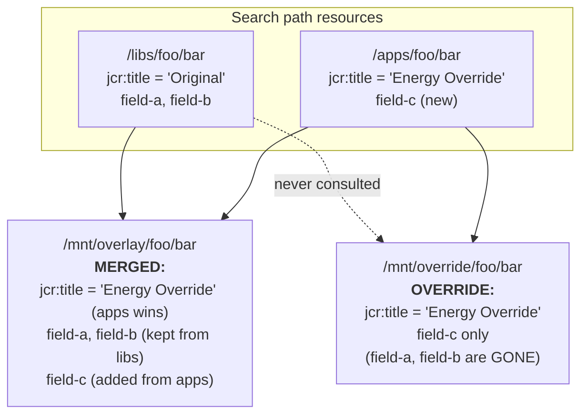
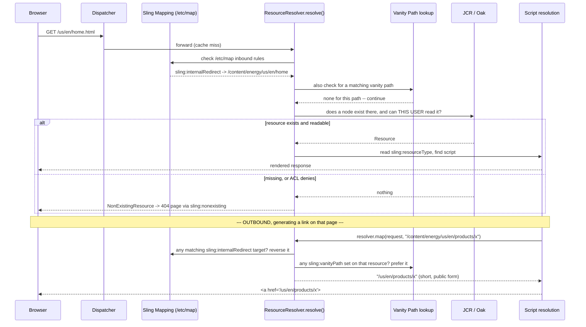
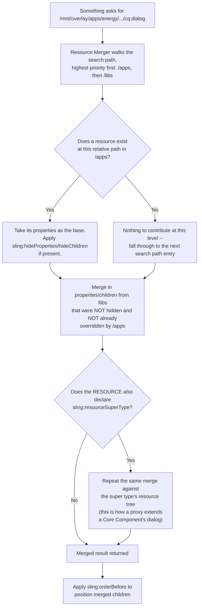
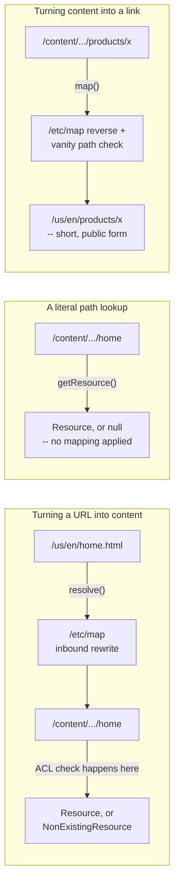

# 23 – Resource Resolution and the Sling Resource Merger

> **Target:** 3–4 years experienced AEM Developer
> **Companies:** Valtech, Publicis Sapient, Deloitte Digital, Cognizant, Accenture, TCS, Capgemini, Infosys, IBM, LTIMindtree
> **Project domain:** a global energy technology company's marketing site.

---

## Before we start — why this topic separates the developers from the support engineers

File 01 gave you the headline version of resource resolution: URL → Resource → Resource Type → Script, and a one-line mention that `/apps` beats `/libs`. That was enough to survive the architecture round.

This file is what happens when the interviewer doesn't stop there.

Every mid-to-senior AEM interview eventually asks some version of *"how do you add one field to a component's dialog without copying the whole thing?"* or *"why did our short URLs suddenly start rendering `/content` in every link?"* Both questions live entirely inside the machinery this file covers: the `ResourceResolver` object itself, the exact difference between `resolve()` and `getResource()`, how overlay, inheritance and override are three genuinely different mechanisms and not three names for the same trick, how the Sling Resource Merger actually stitches two resource trees together, and how `/etc/map` and `resourceResolver.map()` work together — not separately — to give you clean URLs.

Here is why this matters for you specifically. Coming from support, you have almost certainly *used* the symptoms of this machinery without knowing the mechanism: a ticket where a page 404'd anonymously but worked for a logged-in author, a ticket where "the field doesn't save," a ticket where "links are broken after the URL shortening went live." Every one of those is this file. Learning the mechanism turns four separate memorised incidents into one understood system — and that is exactly the kind of answer that makes an interviewer sit up.

---

## 1. Introduction

### 1.1 What resource resolution actually is, and why it deserves its own file

In file 01 you learned that Sling turns a URL into a resource, and a resource into a script. The object that does all of that work — every single step — is one Java object: the **`ResourceResolver`**.

Almost everything you write in AEM eventually touches this object, directly or through something built on top of it. A Sling Model's `@ValueMapValue` reads from it. A servlet's `request.getResourceResolver()` is it. A scheduled job that needs to read content has to obtain one. HTL's `data-sly-resource` asks it for a resource to include. If you don't understand what this object is and whose permissions it carries, half of AEM's stranger behaviours — the field that "doesn't save," the page that 404s for one user and not another, the servlet that silently stops working — will look like bugs in the platform rather than what they actually are: this object behaving exactly as designed.

### 1.2 The one sentence to memorise before anything else

> **A `ResourceResolver` is a session into the repository, and it always carries the permissions of whichever user it was opened for.**

That is the entire idea, and everything in this file is a consequence of it. File 13 covers users, groups and ACLs in depth — this file is where those permissions actually get *enforced*, at the moment a path is turned into a resource.

If the resolver belongs to an anonymous visitor, every `getResource()` call it makes is filtered by what anonymous can read. If it belongs to a service user with narrow grants, it is filtered by that. If it belongs to an admin, almost nothing is filtered — which is exactly why file 13 tells you never to reach for `getAdministrativeResourceResolver()` out of convenience.

### 1.3 When you reach for this API directly

Most of the time you don't — Sling Models and HTL hide the `ResourceResolver` behind `@ValueMapValue` and `data-sly-resource`. You reach for it directly when:

- You are writing a **servlet** and need to read a resource other than the one the request resolved to.
- You need a **service user** resolver to read content the current visitor cannot see (file 13, and again in section 2.4 here).
- You are generating a **link** in Java and need the short, public-facing form of an internal path — `map()`.
- You are debugging *why* a path didn't resolve the way you expected.

### 1.4 A real project example to adapt

> "On our energy site, most of our resource resolution is invisible — Sling Models and HTL do it for us. Where we touch the `ResourceResolver` directly is in three places: our Load More servlet, which reads sibling product pages under the current listing; a scheduled job that reads pricing data through a service user because the page tree it walks is partially access-controlled; and a link-building utility that calls `map()` so PDFs generated for download always contain public, shortened URLs rather than internal `/content` paths. Getting the third one wrong — forgetting the outbound half of URL mapping — is exactly the incident I'd bring up if asked for a project story here."

That paragraph does three things: shows you understand where the API is actually used, name-drops a service-user story (file 13's territory), and pre-loads the URL-shortening story from section 7.

---

## 2. Core Concepts

### 2.1 The `ResourceResolver` API — the methods you're actually asked about

Let's go through the API surface method by method, because interviewers frequently hand you two of these side by side and ask you to explain the difference.

**`getResource(String path)`** — the plain, honest lookup. Give it a path, it gives you back a `Resource` if one exists there, or **`null`** if it doesn't. No mapping is applied. No 404 page is generated. It is the JCR equivalent of asking "is anyone home at this exact address?"

There is an overload, `getResource(Resource base, String relativePath)`, which resolves relative to a resource you already have — useful when walking a tree without rebuilding absolute paths by hand.

**`resolve(...)`** — covered in full in 2.2, because this is the one that trips people up.

**`map(...)`** — the outbound counterpart. Give it an internal repository path (and optionally the current request), and it gives you back the externally usable URL, applying whatever `/etc/map` rules or vanity paths apply. Section 2.10 onward covers this in depth.

**`adaptTo(Class<T> type)`** — not specific to `ResourceResolver`, but used constantly through it. Most commonly you'll see `resolver.adaptTo(Session.class)` to drop down to the raw JCR API when you need something the Sling Resource API doesn't expose, like a `Session`-level move or a workspace-level operation.

**`listChildren(Resource resource)`** — returns an `Iterator<Resource>` of the resource's direct children. This is what a Sling Model uses under the hood when you inject `List<Resource> children` — but knowing you can call it directly matters when you're walking a tree in a servlet or a service.

**`findResources(String query, String language)`** — runs a query (JCR-SQL2 or XPath) through the resolver and returns matching resources as an iterator. This is the lower-level cousin of QueryBuilder from file 01 — QueryBuilder is friendlier for building dynamic predicates, `findResources` is what you reach for when you already have a query string and don't want QueryBuilder's ceremony. The same indexing rules from file 01 apply: an unindexed query traverses and can hang the instance.

**`getSearchPath()`** — returns the configured search path as a `String[]`, by default `{"/apps/", "/libs/"}`. This is the array Sling walks, in order, whenever it needs to turn a *relative* resource type into an absolute script path. Knowing this method exists is what lets you answer "how would you check the search path on this instance without reading OSGi config by hand?" — you'd call this, or check it from a script console.

**`getUserID()`** — returns the ID of the user this resolver is authenticated as. The fastest way to prove, in a debugging session, that you are looking at the resolver you think you are.

**`close()`** — releases the underlying session. Section 2.4 covers the rule that decides everything about this method: close what you opened, never close what you were handed.

### 2.2 `resolve()` versus `getResource()` — the distinction almost everyone gets wrong

This is the single most commonly mis-answered question in this whole file, so slow down here.

Both methods take a path and give you back a `Resource`. That surface similarity is exactly why people assume they're interchangeable. They are not, and the difference matters in production.

**`getResource(path)`** does a direct, literal lookup. No URL mapping. No selector or extension stripping. No search-path fallback for a relative resource type on the node itself. If nothing exists at that exact path, you get **`null`**.

**`resolve(request, path)`** — usually called as `request.getResourceResolver().resolve(request)` inside Sling's own request-handling code, or as `resolver.resolve(path)` in your own code — is the *full* pipeline. It:

1. Applies `/etc/map` inbound rewriting, so a public-facing path gets translated to its internal repository path first.
2. Strips selectors, extension and suffix from the incoming path before attempting to find the underlying resource.
3. If, after all of that, nothing exists — it does **not** return `null`. It returns a special object called a **`NonExistingResource`**.

**Say that last part out loud, because it's the part that gets tested:**

> `getResource()` on a missing path gives you `null`. `resolve()` on a missing path never gives you `null` — it gives you a `NonExistingResource`, which is a real, non-null `Resource` object whose resource type is set to a fixed marker value.

**Why does Sling bother with this instead of just returning `null` in both cases?**

Because `resolve()` is what runs at the very top of the request-processing pipeline — before Sling even knows whether this is going to be a 404. If `resolve()` returned `null`, every single piece of downstream code that expects a `Resource` object would need a null check just to handle "the page doesn't exist," and Sling's own script-resolution machinery (URL → Resource → Resource Type → Script from file 01) would break, because it needs a resource type to look up a script — even the 404 page is rendered *through* the same resourceType-to-script pipeline as everything else.

By giving you a `NonExistingResource` with resource type `sling:nonexisting`, Sling lets the *same* machinery that finds `page.html` for a real page also find a custom 404 script — placed at `/apps/sling/nonexisting` — for a resource that doesn't exist. One pipeline handles both cases.

**The practical consequence for your own code:**

```java
// getResource -- direct, literal, can be null
Resource r1 = resolver.getResource("/content/energy/us/en/products/does-not-exist");
if (r1 == null) {
    // this branch is reachable
}

// resolve -- full pipeline, NEVER null, but can be a NonExistingResource
Resource r2 = resolver.resolve(request, "/content/energy/us/en/products/does-not-exist");
if (r2 == null) {
    // THIS BRANCH IS DEAD CODE. resolve() never returns null.
}
if (ResourceUtil.isNonExistingResource(r2)) {
    // this is the check you actually need
}
```

**The interview answer:**

> "`getResource()` is a direct lookup — you give it a path, and you get either the resource or `null`. It doesn't apply any URL mapping. `resolve()` is the full pipeline Sling uses to turn an incoming request path into a resource: it applies `/etc/map` inbound rewriting first, strips selectors and extension, and — this is the part people miss — it never returns `null`. If nothing matches, it gives you back a `NonExistingResource`, which is a real object with a fixed resource type, `sling:nonexisting`. Sling does that so the same URL-to-script pipeline that renders every other page can also render a custom 404 page, just by placing a script at that resource type. So if I write `if (resolver.resolve(path) == null)`, that branch is dead code — I need to check `ResourceUtil.isNonExistingResource()` instead."

### 2.3 `NonExistingResource` and `SyntheticResource`

Two "fake" resource types come up in interviews together, and it's worth being precise about what each is for.

**`NonExistingResource`** — already covered above. It exists specifically to represent "nothing is here" as a real `Resource` object, with resource type `sling:nonexisting`, so that 404 handling can go through the normal script-resolution pipeline instead of needing a special case.

```
/apps/sling/nonexisting/sling.html    ← your custom 404 page, matched by resource type
```

**`SyntheticResource`** — a `Resource` object that is not backed by an actual repository node at all. You can construct one yourself with `new SyntheticResource(resolver, path, resourceType)` whenever you need to hand something through the Resource API that has no real content behind it — a computed row in an aggregated listing, a fixture in a unit test, or a placeholder Sling itself needs internally when a path exists conceptually (an intermediate segment on the way to a real resource) but has no corresponding node.

**The one-line distinction:** a `NonExistingResource` specifically means *"resolution failed, here's a stand-in so the pipeline keeps working."* A `SyntheticResource` more broadly means *"here's a Resource with no repository node behind it,"* and you can create those yourself for your own purposes, whereas you would never construct a `NonExistingResource` by hand — Sling gives you one.

### 2.4 Closing rules — the one habit that prevents a production incident

This continues directly from files 07 and 13, and it is worth restating here because this file is where the rule actually lives.

**The rule, in one sentence:** *close a resolver only if you opened it yourself.*

`request.getResourceResolver()` in a servlet, or the resolver backing a Sling Model's injected fields, belongs to Sling. Sling opened it when the request came in, and Sling will close it when the request finishes. If you call `.close()` on it yourself, you don't get an error immediately — you get everything *after* that call in the same request failing, because the JCR session backing it is now gone.

A resolver you obtain from `resourceResolverFactory.getServiceResourceResolver(...)` (file 13's service-user pattern) is different: **you** opened it, so **you** must close it — always in try-with-resources, never in a `finally` block you might forget to write correctly.

```java
// You opened this one. You close it. Always try-with-resources.
try (ResourceResolver serviceResolver =
        resolverFactory.getServiceResourceResolver(authInfo)) {

    Resource priced = serviceResolver.getResource("/content/energy/pricing/2026");
    // ... use it while the resolver is open ...

}   // closed automatically, even if an exception was thrown above
```

### 2.5 What a leaked resolver actually looks like in production

This is worth walking through slowly, because "session leak" is an abstract phrase until you've seen what it does.

Every `ResourceResolver` you open from a factory holds open a real JCR `Session` underneath it. A `Session` is not free — it holds memory, and in a clustered Oak setup it can hold onto resources that the garbage collector cannot reclaim, because something still technically has a reference to it: your unclosed resolver.

If a piece of code — say, a scheduled job or a servlet that runs on every request — opens a service-user resolver and forgets to close it, here is the timeline you actually see:

1. **Day one:** nothing looks wrong. The instance has plenty of headroom.
2. **Over days or weeks:** heap usage on that instance creeps upward in a way that doesn't correlate with traffic. It goes up and never comes back down after a GC cycle, because live references are pinning those sessions.
3. **Eventually:** the instance starts throwing `OutOfMemoryError`, or session-related warnings appear in the logs about too many open sessions, and a restart "fixes" it — until the leak accumulates again.

**Why this is hard to diagnose the first time you see it:** the symptom (an instance slowly dying) looks nothing like the cause (one missing `.close()` in one servlet). Nobody's first instinct is "check for unclosed resolvers" when heap usage is climbing — they look at traffic, at cache sizes, at the DAM. The diagnostic order that actually gets you there fast is in section 11.

### 2.6 The search path and how a resource type becomes a script — recap and one layer deeper

File 01 gave you the eight-step script resolution order ending in "`/apps` before `/libs`." Here is the one thing worth adding on top of that, because it's what interviewers probe for when they think you've only memorised the list.

**The search path is configuration, not a hardcoded constant.** It comes from the Sling Resource Resolver Factory's OSGi configuration — the same place service-user mappings live (file 13) — and while `/apps` then `/libs` is the standard order almost every project keeps, it is technically a list you *could* reorder or extend. You will essentially never see a project that changes it, but knowing it's configuration rather than a law of physics is the difference between reciting a fact and understanding a mechanism.

**`sling:resourceType` versus `sling:resourceSuperType` — the one-sentence distinction that matters here:**

- `sling:resourceType` says **what this resource is**. It's the starting point of script resolution.
- `sling:resourceSuperType` says **what to fall back to** if a script isn't found at the resource type's own path. It's how one component can inherit another's rendering and dialog without being a copy of it.

This second one is the mechanism behind proxy components (file 02) and it is also, as you'll see in section 2.9, one of the two ways the Resource Merger stitches content together — not just the `/apps`-over-`/libs` search path, but *also* the `resourceSuperType` chain.

### 2.7 Overlay, Inheritance, and Override — the comparison interviewers actually ask for

These three words get used loosely in everyday project conversation, and that looseness is exactly what an interviewer is testing when they ask you to tell them apart. Treat this as three genuinely different mechanisms that happen to solve related problems.

**Overlay.** You place a resource at the **same relative path** under `/apps` as one that exists under `/libs`. Because the search path checks `/apps` first, your version is found first and effectively hides Adobe's. Nothing about the original at `/libs` changes — it's still there, just never reached, because `/apps` won the race.

This is a **path-based, global** mechanism. It has no concept of "just this one component" — if two completely unrelated things happen to resolve through the same relative path, overlaying it affects both. That's what makes it powerful and also the riskiest of the three.

**Inheritance.** A resource declares `sling:resourceSuperType`, pointing at a different resource type entirely — usually a Core Component, or a shared base component within your own project. If a script or dialog isn't found at your resource's own path, resolution falls through to the resource type named in `resourceSuperType`, and keeps falling through the chain until something answers or the chain ends.

This is a **scoped, deliberate** relationship — you are explicitly opting one component into another's behaviour. It has nothing to do with `/apps` versus `/libs`; you can inherit from a component that lives entirely under `/apps`, as proxy components do (file 02).

**Override.** Complete replacement, with no fallback and nothing inherited. You aren't extending or shadowing something — you're saying "ignore whatever else exists at any lower-priority location; use exactly and only what I've provided here." Section 2.9 covers the concrete mechanism the Resource Merger gives you for this: the `/mnt/override` mount, as distinct from the merging behaviour of `/mnt/overlay`.

**The comparison, side by side:**

| | Overlay | Inheritance | Override |
|---|---|---|---|
| Mechanism | Same relative path, `/apps` before `/libs` | `sling:resourceSuperType` chain | Complete replacement, no merge |
| Scope | **Global** — anything resolving to that path | **Scoped** — only components that opt in | Scoped to the resource declaring it |
| What survives from the original | Nothing reachable, but the original still exists at `/libs` | Whatever you don't explicitly redefine | Nothing — that's the point |
| Risk profile | **Higher** — you can't tell everything that resolves through that path | Lower — you know exactly what opted in | Depends entirely on what you left out |
| Typical use | Customising the AEM authoring UI itself (a console, a classic dialog) | Extending a Core Component or a proxy | Replacing an entire dialog or script wholesale, deliberately |
| Upgrade safety | You silently stop receiving Adobe's fixes to that exact path | You keep receiving fixes to everything you didn't override | You keep nothing from upstream at all |

**Why overlay is riskier, stated plainly:** when you overlay `/libs/foo/bar` with `/apps/foo/bar`, you have frozen your copy in time. The next time Adobe patches or improves `/libs/foo/bar`, you don't get it — your `/apps` copy still wins the search path, and it's now stale relative to the product. This is exactly the same risk file 01 warned about for editing `/libs` directly, except overlay doesn't corrupt the original — it just silently shadows improvements to it. Nobody notices until a security patch to that exact path ships and doesn't take effect on your instance.

**Why inheritance is safer, stated plainly:** because you only redefine the specific pieces you touch — one new dialog field, one changed HTL block — everything else keeps flowing through to the real component. When Adobe ships a Core Component update, your proxy still inherits all of it automatically; you only "own" the small delta you actually wrote.

**The interview answer:**

> "They solve related problems but they're mechanically different. Overlay is path-based — same relative location under `/apps` as under `/libs`, and the search path means yours wins. It's global, which is also its risk: you can't always tell everything that resolves through that path, and you silently stop receiving Adobe's improvements to it. Inheritance is `sling:resourceSuperType` — a deliberate, scoped relationship where a component opts into extending another one, and it's how proxy components and Core Component customisation work; you keep receiving upstream improvements to everything you didn't specifically redefine. Override is the least common of the three — a complete replacement with no fallback at all, which the Resource Merger gives you explicitly through `/mnt/override` as distinct from the merging behaviour of `/mnt/overlay`. I default to inheritance, reach for overlay only to customise the authoring UI itself, and use override rarely and deliberately."

### 2.8 The Sling Resource Merger — the problem it actually solves

Here is the scenario that makes the Resource Merger necessary, told the way it actually happens on a project.

You are three weeks into the energy site build. A stakeholder asks for one extra field on the page properties dialog — a "Regulatory Region" dropdown, because pages need to be tagged for compliance reasons that have nothing to do with anything Adobe anticipated. The out-of-the-box page properties dialog has a dozen tabs and does dozens of things correctly already — SEO metadata, social sharing, page thumbnails, cloud configuration references. You need exactly one more field.

**The wrong way to do this** — and the way almost every AEM developer tries first — is to copy the entire OOTB dialog node from `/libs` down to `/apps`, then add your one field to the copy. It works. It also means:

- You now own a full duplicate of Adobe's dialog structure, frozen at whatever version you copied it from.
- Every future Adobe fix, every new field Adobe adds to page properties in a later service pack or Cloud Service release, never reaches you — your copy doesn't know it exists.
- Six months later, nobody remembers this copy was made for one field, and a code reviewer has no way to tell "this diverged from Adobe's version deliberately" from "this diverged from Adobe's version because someone forgot to update it."

**The Resource Merger exists specifically to avoid this.** Instead of copying the whole dialog, you create a resource under `/apps` at the relevant path that contains **only** the new field, and the Resource Merger combines — merges — your small addition with Adobe's full dialog at read time, every time it's rendered. You never own more than the delta you actually wanted.

**Why this is worth stating as the "why" before the "how":** an interviewer who asks about the Resource Merger is really asking "do you understand the cost of copying product code, and do you know the alternative?" Leading with the cost of copying, the way this section just did, answers the *reason* the mechanism exists before you even describe the mechanism itself.

### 2.9 The two mount points — `/mnt/overlay` and `/mnt/override`

This is the part of the Resource Merger that most candidates who "know the name" cannot actually explain, and it's where you can visibly separate yourself from someone who has only heard the term.

The Resource Merger produces its combined view of the world at two special, virtual mount points. Neither of these is something you write content into directly — you keep writing your actual content under `/apps`, at the same relative path as the thing you're extending, and the Resource Merger computes the merged (or overridden) view on the fly whenever something reads through one of these paths.

**`/mnt/overlay/<path>`** — the **merging** view. For every resource in the search path (by default `/apps` and `/libs`, in priority order), the Resource Merger combines them into one logical resource:

- Properties present in the higher-priority location (`/apps`) win over the same property name from the lower-priority one (`/libs`).
- Properties that exist **only** at the lower-priority location are still present in the merged result — nothing is lost by default.
- Child resources are combined the same way, recursively — your one new child node under `/apps` appears alongside all of Adobe's existing children from `/libs`.

This is the mount point behind almost everything people mean when they casually say "the Resource Merger" — it's how AEM computes the effective page properties dialog, and how it computes the effective dialog for a component when a proxy adds a field on top of a Core Component it inherits from.

**`/mnt/override/<path>`** — the **overriding** view. Instead of combining everything found in the search path, this mount point picks up **only** the single highest-priority resource that exists, and uses it exactly as-is — no merging with anything lower in the search path at all. If `/apps/foo/bar` exists, that is the entire answer; `/libs/foo/bar` is never consulted, not even for properties `/apps/foo/bar` doesn't define.

**The plain-English distinction, worth having ready:**

> "`/mnt/overlay` combines what it finds across the search path — your addition plus everything from `/libs` you didn't touch. `/mnt/override` picks only the highest-priority one it finds and stops there, with nothing merged in from underneath. Overlay is for extending; override is for replacing outright."

**Why you rarely reach for `/mnt/override` deliberately:** almost every real customisation is additive — one more field, one more tab, one hidden property. Genuine full replacement is rare enough that most projects go their entire lifetime without a developer needing to invoke override semantics on purpose. It exists for the cases where merging genuinely isn't what you want — for example, a dialog so different from the original that trying to "hide" your way to the result would be more code than just replacing it.



### 2.10 The properties that control the merge

Four properties, placed on the resource you create under `/apps`, give you fine control over the merged result. All four live in the `sling:` namespace, and all four only make sense in the context of the `/mnt/overlay` merging behaviour — they're how you selectively remove or reposition pieces of the lower-priority resource rather than accepting everything from it by default.

**`sling:hideResource`** (Boolean) — placed on a node to say "this entire resource, at this path, should not appear in the merged result, even though something exists here at a lower priority." This is a full hide — the merged view behaves as if nothing exists at this path at all.

**`sling:hideProperties`** — a String or String array naming specific property names to remove from the merged result, even though they exist on the lower-priority resource. Use `"*"` to hide every inherited property at that node, keeping only what you define yourself.

**`sling:hideChildren`** — the same idea, but for child resources rather than properties. Name specific child node names to exclude, or `"*"` to exclude everything inherited and keep only children you've explicitly added.

**`sling:orderBefore`** — a String naming a sibling node. Positions your added or merged child before that named sibling in the merged child ordering. Without this, a newly added field or tab tends to land at the end, which is rarely where you want it — a "Regulatory Region" field added to page properties should sit near the other compliance fields, not trail after everything else.

**A concrete example, put together:**

Say Adobe's dialog under `/libs` has a "SEO" tab containing fields `metaTitle`, `metaDescription`, and `robotsTag`. You want to: keep `metaTitle` and `metaDescription`, remove `robotsTag` because your project handles that a different way, and add a new field `regulatoryRegion`, positioned right after `metaDescription`.

```xml
<!-- /apps/energy/.../seo (nt:unstructured) -->
<jcr:root xmlns:jcr="http://www.jcp.org/jcr/1.0"
    jcr:primaryType="nt:unstructured"
    sling:hideChildren="robotsTag">
    <!--
      This node itself is NOT hidden -- it merges with the /libs "seo"
      tab. hideChildren removes just robotsTag from the merged children.
    -->
    <regulatoryRegion
        jcr:primaryType="nt:unstructured"
        sling:orderBefore="robotsTag"
        sling:resourceType="granite/ui/components/coral/foundation/form/select"
        fieldLabel="Regulatory Region"
        name="./regulatoryRegion">
        <items jcr:primaryType="nt:unstructured">
            <eu jcr:primaryType="nt:unstructured" value="eu" text="European Union"/>
            <na jcr:primaryType="nt:unstructured" value="na" text="North America"/>
            <apac jcr:primaryType="nt:unstructured" value="apac" text="Asia-Pacific"/>
        </items>
    </regulatoryRegion>
</jcr:root>
```

**Notice `sling:orderBefore="robotsTag"` even though `robotsTag` is about to be hidden.** That's deliberate and worth explaining if asked: ordering is resolved against the full merged child list *before* hiding is applied, so naming the sibling you're about to hide is still a valid, stable way to say "put me exactly where that field used to be." (If that makes you uneasy about ordering drifting when the hidden sibling itself moves in a future Adobe update, that instinct is correct — it's one of the few genuine downsides of this approach, and it's why some teams anchor `orderBefore` against a field they know Adobe treats as stable, like the tab's first item, rather than one that might be reordered upstream.)

### 2.11 The classic use cases, tied to files 02 and 22

**Extending page properties.** Exactly the scenario in 2.8 — add a field or a whole new tab to Adobe's out-of-the-box page properties dialog. The dialog itself lives under `/libs` (the exact path has shifted slightly across AEM versions — historically the classic Foundation page dialog sat at `/libs/foundation/components/page/dialog`; the mechanism is identical regardless of the exact path in your version). You place a resource at the same relative path under `/apps`, containing only your addition, and the `/mnt/overlay` merge does the rest.

**One nuance worth stating precisely, because it's a genuine gotcha:** on a project built with **editable templates** — which is the standard on AEM as a Cloud Service and almost every modern project, including our energy site — each template defines its *own* page properties structure under `/conf/<project>/settings/wcm/templates/<template>/`, which is content you already own outright. In that world you often don't need the Resource Merger for page properties at all; you edit your own `/conf` structure directly. The Resource Merger's page-properties use case is most relevant for **static/classic templates**, or for extending shared authoring dialogs and consoles that genuinely still live in `/libs`. Knowing this distinction — and saying so unprompted — is a strong signal that you've actually built on editable templates rather than only read about the classic pattern.

**Extending a Core Component's dialog (file 02's territory).** This is the more common real case on a modern project, and it works through **inheritance**, not the `/apps`-over-`/libs` overlay path. Recall from file 02: your project creates a **proxy component** — `/apps/energy/components/teaser` with `sling:resourceSuperType` pointing at the Core Component, e.g. `core/wcm/components/teaser/v2/teaser`. Core Components install under `/apps` themselves (they ship as a regular content package your project depends on, not as true product code under `/libs`), so there's no same-path overlay opportunity here at all — your proxy is at a completely different absolute path.

What makes the field addition work is that AEM's dialog-computation logic doesn't just merge same-path `/apps`-versus-`/libs` resources — it **also walks the `sling:resourceSuperType` chain** when computing the effective dialog for a resource type, merging your proxy's own (partial) `_cq_dialog` with whatever it inherits from the Core Component it points at, using the exact same `sling:hideResource` / `sling:hideProperties` / `sling:orderBefore` vocabulary. This is why file 02 could already tell you "create a dialog containing only the new field, plus `sling:orderBefore`" without needing to talk about mount points at all — the mount points are the deeper mechanism underneath that same-looking recipe.

**Why this beats copying, restated once more because it's the whole point:** in both cases, you keep receiving Adobe's improvements to the thing you extended. A Core Component security fix, a new field Adobe adds in a later version, a page-properties enhancement in the next AEMaaCS release — all of it reaches you automatically, because you never stopped consuming the original. You only own the small, explainable delta.

### 2.12 The problem `/etc/map` solves

Back in file 01, section 3.3 gave you the short version: Sling Mapping under `/etc/map` gets rid of `/content/energy/us/en` in your public URLs. Here is the full mechanism, because "how do we get clean URLs" turns into a much longer conversation the moment someone asks *both* directions.

**The setup.** Your content genuinely lives at `/content/energy/us/en/home`. Nobody wants that in a browser's address bar, in a marketing email, or in a partner's inbound link. You want `https://www.energy-corp.com/us/en/home` instead.

**Inbound.** A visitor requests `/us/en/home.html`. Before Sling can resolve that to a resource, something has to translate it to the real repository path, `/content/energy/us/en/home`. That translation is a `sling:Mapping` node under `/etc/map`, using two properties:

- **`sling:match`** — describes the incoming request to match: typically the scheme, host, port, and path prefix, roughly in the shape `host[.port][/path-prefix]`.
- **`sling:internalRedirect`** — the real repository path to resolve to instead, once matched. This is a transparent, internal rewrite — the visitor's browser never sees it and the address bar doesn't change.

```
/etc/map
  /http
    map-us-en (sling:Mapping)
      sling:match             = "www.energy-corp.com.80/us/en"
      sling:internalRedirect  = "/content/energy/us/en"
```

**Outbound.** This is the half people forget, and it's the whole subject of section 7's first story. When your own code or your HTL templates generate a link — a "related product" link, a breadcrumb, a canonical URL tag — the value you have in hand is the internal path, `/content/energy/us/en/products/hvdc-converter`. If you write that straight into an `<a href>`, visitors get a working link that exposes the internal repository structure, defeating the entire point of setting up mapping in the first place.

**`resourceResolver.map(request, path)`** is the method that does the reverse translation — it looks at the same set of mapping rules and, for a given internal path, produces the shortened, public form. Call it (or let AEM's built-in **link rewriter transformer**, which post-processes rendered HTML and rewrites `href`/`src` attributes automatically, do it for you) whenever you write a path-derived link.

**There's also a distinct property, `sling:redirect`,** which behaves differently from `sling:internalRedirect`. Where `internalRedirect` is a silent, internal rewrite, `sling:redirect` (Boolean, or sometimes paired with a target) causes Sling to send back an actual HTTP redirect response — the browser's address bar changes and the client makes a second request. You'd reach for this for something like retiring an old domain and sending every request on it to the new one, not for everyday clean-URL rewriting.

**The complete answer, worth having word-for-word ready — this expands directly on file 01's version:**

> "Sling Mapping under `/etc/map` handles it, and the mistake most people make is only implementing one direction. Inbound, a `sling:Mapping` node's `sling:match` and `sling:internalRedirect` properties silently rewrite the short public URL to the real content path before Sling resolves it — the browser never sees this happen. Outbound, when my own code or HTL generates a link from an internal path, I have to call `resourceResolver.map()`, or rely on AEM's link rewriter transformer to do it across the rendered HTML — otherwise every generated link still points at `/content/energy/us/en/...` even though the page you're standing on has a clean URL. Get only the inbound half right and you get exactly the bug you'd expect: a beautiful short URL in the address bar, and every single link on that page pointing at an internal repository path. We also layer Apache rewrite rules in front of the dispatcher for some of this, and on Cloud Service, Adobe gives you an equivalent CDN-level rewrite mechanism through the config pipeline instead of hand-editing Apache config."

### 2.13 `map()` and the link rewriter — the mechanics of the outbound half

**`resourceResolver.map()`** has two common overloads:

- `map(String resourcePath)` — maps using no request context, useful outside a request (a scheduled job building an email, for instance).
- `map(HttpServletRequest request, String resourcePath)` — maps with the current request's scheme and host taken into account, which matters when the same content is reachable through more than one public hostname (a country-specific domain versus a shared global one, for example).

Both consult the same `/etc/map` configuration, and both will also consider a **vanity path** (2.15) on the target resource if one is set — `map()` doesn't only know about `/etc/map` rules, it's the single entry point for "give me the best public URL for this internal path," and it picks whichever mechanism produces a usable result.

**The link rewriter transformer** is the alternative to calling `map()` by hand everywhere. It's a Sling rewriter pipeline component that post-processes the *entire rendered HTML output* of a page, finding `href` and `src` attributes that look like internal repository paths and substituting the mapped, external form — so you get outbound mapping applied consistently across a page even where a developer forgot to call `map()` explicitly in one component's HTL. Most projects rely on this as the safety net, and call `map()` directly only in code paths that don't produce ordinary rendered HTML — an email template, a PDF export, a JSON API response.

### 2.14 Interaction with the dispatcher and Apache rewrite rules

URL mapping inside AEM and rewrite rules inside your dispatcher's Apache configuration are two separate layers that have to agree with each other, and this is a genuinely common source of "it works in the CMS but not on the live site" bugs.

Sling's mapping under `/etc/map` decides how AEM itself resolves and generates URLs. Apache's `mod_rewrite` rules, sitting in front of the dispatcher, decide what the *browser* is allowed to type or receive before the request even reaches AEM. If a marketing team wants `https://www.energy-corp.com/products/` (no country code at all) to transparently serve `/content/energy/us/en/products`, you typically need **both**: an Apache rewrite rule that accepts the friendly incoming path and forwards it appropriately, and a Sling mapping so that AEM's own internal `map()`/`resolve()` calls understand the same relationship for any content generated dynamically. Set up only the Apache side and internal links generated by AEM (breadcrumbs, canonical tags, sitemap entries) will still show the old form; set up only the Sling side and a request from a browser that never goes through the expected Apache rule won't be recognised at all.

### 2.15 On AEM as a Cloud Service — CDN-level rewrite rules

On AEMaaCS, you don't own an Apache VM in front of your publish tier the way you did on 6.5 (file 01, section 3.5) — the dispatcher runs as a container alongside each publish pod, and Adobe manages the CDN in front of everything. For the class of rewrite that used to live in a hand-edited Apache config, Adobe instead gives you a declarative rewrite configuration deployed through the Cloud Manager pipeline, applied at the CDN edge before a request ever reaches your dispatcher or publish tier. The underlying *reason* you'd want this hasn't changed — friendly incoming paths, redirecting an old domain, stripping or adding path segments — only where the rule lives and how it's deployed has moved, consistent with the general "everything through the pipeline, nothing hand-edited on a box" shift file 01 covers in the 6.5-versus-Cloud-Service comparison.

### 2.16 Vanity URLs — a different mechanism entirely, and how it differs from mapping

It's tempting to lump vanity URLs in with `/etc/map`, because both produce short, friendly public URLs. They are genuinely different mechanisms, solving a different shaped problem.

**`sling:vanityPath`** is a property (String, or a String array for more than one) placed directly on a page's `jcr:content` node. Whatever value you put there becomes an additional, alternate path that resolves straight to that page — set by a content author, per page, without touching `/etc/map`, without a developer, and without a deployment.

```
/content/energy/us/en/campaigns/summer-grid-modernization/jcr:content
    sling:vanityPath = "/grid2026"
```

Now `https://www.energy-corp.com/grid2026` resolves directly to that campaign page.

**How it differs from `/etc/map` mapping, in the ways that matter:**

| | `/etc/map` mapping | `sling:vanityPath` |
| --- | --- | --- |
| Who configures it | A developer, in `/etc/map` config | **An author**, as a page property |
| Scope | A prefix pattern applying to a whole subtree | **One specific page** |
| Deployment needed | Yes — content package or config change | **No** — saved like any content edit |
| Typical use | Stripping a whole locale/site prefix, globally | A short campaign or landing-page URL |
| How it's discovered at startup | Static config, read once | Built by **scanning the repository** for the property, requiring an index |

**A property that pairs with it: `sling:redirect`** (Boolean) on the same node. Left unset, the vanity path resolves internally — the visitor keeps seeing the short URL in the address bar, with no visible redirect. Set to `true`, requesting the vanity path instead causes an actual HTTP redirect to the page's real, canonical URL — useful when you want the vanity path to work as a shareable shortcut, but you want analytics and bookmarks to settle on the canonical URL rather than the shortcut.

**A production detail worth knowing:** because vanity paths are discovered by scanning the whole repository for the `sling:vanityPath` property, this needs a proper Oak index behind it (the same "every query needs an index" rule from file 01) — on a repository with a very large number of pages and no dedicated index for it, vanity path resolution can become measurably slow, and a missing or broken index here is a genuine, if less obvious, production scenario (see section 13).

---

## 3. Internal Working

### 3.1 The full resolution sequence, both directions

This extends file 01's request-flow diagram by zooming into exactly the step where mapping and resolution happen, and by showing the outbound side that the file 01 diagram didn't cover at all.



**The two things worth narrating out loud from this diagram, because they're the parts a memorised list skips:**

**One** — the permission check happens at the same step as the mapping and the existence check. `resolve()` isn't "find the node, then separately check if the user can see it" — the resource genuinely does not resolve at all for a user without read access. That's why an anonymous visitor and a logged-in author can hit the identical URL and get a 404 versus a real page: same resolution logic, different resolver, different outcome.

**Two** — outbound mapping is not automatic just because inbound mapping exists. It is a distinct call (`map()`), consulted separately, every time a link is generated. Nothing forces a developer to make that call; forgetting it is section 7's first story.

### 3.2 The Resource Merger's actual merge algorithm



**The detail worth calling out unprompted:** the merge doesn't stop after combining `/apps` and `/libs` at the same path — for a resource that also declares `sling:resourceSuperType`, the merger keeps going, walking that inheritance chain too. This is exactly why a proxy component's tiny `_cq_dialog`, containing only one new field, ends up producing a complete, working dialog: two separate merge mechanisms — same-path search order, and resourceSuperType inheritance — are both feeding into the one result AEM actually renders.

### 3.3 Comparing `getResource()`, `resolve()`, and `map()` as one flow



---

## 4. Important Interview Questions

### 4.1 Basic — screening round

**Q1. What is a `ResourceResolver`?**

The object Sling uses to turn a path into a resource, and to reverse-map a resource back into a public URL. It is opened for a specific user and every read through it respects that user's permissions.

*Cross:* Where does it come from in a servlet? · Who "owns" the one on `request.getResourceResolver()`? · What backs it internally? (a JCR `Session`)

**Q2. `getResource()` versus `resolve()` — what's the difference?**

`getResource()` is a literal path lookup that returns `null` if nothing exists. `resolve()` runs the full pipeline — applies `/etc/map` inbound rewriting, and never returns `null`; a missing resource comes back as a `NonExistingResource`.

*Cross:* Why doesn't `resolve()` return null? · What resource type does a `NonExistingResource` have? (`sling:nonexisting`) · What's that used for?

**Q3. What is `map()` for?**

The outbound counterpart to mapping — converts an internal repository path into the short, public-facing URL, using `/etc/map` rules and any vanity path set on the target.

*Cross:* What happens if you never call it? · What's the alternative to calling it everywhere by hand? (the link rewriter transformer) · Does it need a request?

**Q4. What is `adaptTo()` used for on a `ResourceResolver`?**

Converting it to a different type it can be adapted to — most commonly `Session.class`, to drop to the raw JCR API for something the Resource API doesn't expose.

*Cross:* What does `adaptTo()` return on failure? (**null**) · Name another common adaptation.

**Q5. What is the search path?**

The ordered list of root paths — `/apps` then `/libs` by default — that Sling walks to turn a relative resource type into an absolute script location. Retrievable via `getSearchPath()`.

*Cross:* Is it hardcoded? (no — OSGi config) · What happens if two entries both have a match? (higher priority, listed first, wins)

**Q6. What is an overlay?**

Placing a resource at the same relative path under `/apps` as one under `/libs`, so the search path finds yours first and effectively hides Adobe's version.

*Cross:* Does the original at `/libs` still exist? (yes, just unreached) · What's the main risk? (silently missing future Adobe fixes to that path)

**Q7. What is `sling:resourceSuperType` for?**

A fallback pointer — if a script or dialog isn't found at a resource's own type, resolution (and the Resource Merger) falls through to the type named here.

*Cross:* How is this different from an overlay? · What uses this in file 02? (proxy components)

**Q8. What is the Sling Resource Merger?**

A mechanism that combines what exists across the search path (and across a `resourceSuperType` chain) into one logical resource, so you can add or remove a small piece without copying the whole thing.

*Cross:* Name the two mount points · What's the classic use case? · What properties control it?

**Q9. Name the two Resource Merger mount points and the difference between them.**

`/mnt/overlay` merges everything it finds across the search path. `/mnt/override` picks only the single highest-priority resource and uses it as-is, with nothing merged in underneath.

*Cross:* Which one do you use for adding a dialog field? (overlay, via the merge) · When would you use override? (rare — a full, deliberate replacement)

**Q10. What is `sling:vanityPath`?**

A property on a page's `jcr:content` node giving it an alternate, short public URL, configured per-page by an author, without touching `/etc/map`.

*Cross:* How is it different from `/etc/map`? · What does `sling:redirect` do alongside it? · What does it need behind the scenes to perform well? (an Oak index)

### 4.2 Intermediate — the main technical round

**Q11. Walk me through what happens when `resolve()` can't find anything.**

It returns a `NonExistingResource`, never `null`. That object's resource type is the fixed value `sling:nonexisting`, which lets the same URL-to-script pipeline used for real pages also render a custom 404, by placing a script at `/apps/sling/nonexisting`.

*Cross:* Why not just return null? · How would you build a custom 404 page using this? · What's the difference from a `SyntheticResource`?

**Q12. What is a `SyntheticResource` and when would you construct one yourself?**

A `Resource` object not backed by a real repository node. You'd construct one to hand a computed or aggregated item through code that expects a `Resource`, or in a unit test fixture.

*Cross:* Who else creates these? (Sling itself, internally, in some cases) · Would you ever adapt one to a `Node`? (no — there's no node behind it)

**Q13. Overlay versus inheritance versus override — explain all three.**

→ Use section 2.7's table. Lead with: overlay is path-based and global; inheritance is `resourceSuperType`-based and scoped; override is complete replacement with no fallback.

*Cross:* Which is riskiest on upgrade, and why? · Which does a proxy component use? · Which mount point gives you override semantics?

**Q14. How do you add one field to Adobe's page properties dialog without copying it?**

The Sling Resource Merger — create a resource at the same relative path under `/apps` containing only the new field (and `sling:orderBefore` to position it), and it merges with the `/libs` version at `/mnt/overlay`.

*Cross:* What if you also want to remove a field? (`sling:hideProperties`) · What if editable templates are in use? (page properties often live in your own `/conf` structure already — no merge needed there)

**Q15. How does extending a Core Component's dialog actually work under the hood?**

Through inheritance, not overlay — your proxy component declares `sling:resourceSuperType` pointing at the Core Component. Because Core Components install under `/apps` themselves, there's no same-path overlay opportunity; instead, AEM's dialog computation walks the `resourceSuperType` chain and merges your proxy's partial dialog with the inherited one.

*Cross:* Why can't you overlay a Core Component? (it's already in `/apps`, not `/libs`) · What does file 02 call this component? (a proxy)

**Q16. Explain both directions of URL mapping under `/etc/map`.**

Inbound: `sling:match` plus `sling:internalRedirect` silently rewrite a short public path to the real content path before resolution. Outbound: `resourceResolver.map()`, or the link rewriter transformer, converts an internal path back to its short form when generating links.

*Cross:* What breaks if you only do inbound? · What's the difference between `sling:internalRedirect` and `sling:redirect`? · How does the dispatcher factor in?

**Q17. `sling:internalRedirect` versus `sling:redirect` — what's the difference?**

`internalRedirect` is a silent, internal rewrite — the address bar never changes. `redirect` causes an actual HTTP redirect response, so the browser makes a second request and the address bar updates.

*Cross:* When would you use an actual redirect at this layer? · What HTTP status is typically involved?

**Q18. How is a vanity path different from a mapping rule in `/etc/map`?**

A vanity path is a per-page property an author sets directly, no deployment needed, and it applies to exactly one page. A mapping rule is developer-configured, deployed, and applies to a path prefix across a whole subtree.

*Cross:* Does `map()` know about vanity paths too? (yes) · What if two pages claim the same vanity path? (`sling:vanityOrder` breaks the tie) · Why can this get slow on a huge repository? (it's found via a repository-wide scan/query, needing an index)

**Q19. Why do resource-type servlets get permissions "for free" but path-bound servlets don't (tie to file 07)?**

Because a resource-type servlet's URL corresponds to a real content path, so Sling resolves it via `resolve()`, applying the current user's ACLs during resolution. A path-bound servlet's URL has no resource behind it at all, so `resolve()`/`getResource()` never runs against it and there's nothing for permissions to be checked against.

*Cross:* Which method actually performs that ACL check? (`resolve()`, during the search) · What must a path-bound servlet do instead? (authorise itself)

**Q20. What must you always do with a resolver you open from a service user, and why?**

Close it yourself, in try-with-resources — because you opened it, Sling doesn't know about it, and it holds a real JCR session that won't be released otherwise.

*Cross:* What if you close `request.getResourceResolver()` instead? (breaks the rest of that request — Sling owns it) · What does a leaked one look like in production? (section 2.5)

### 4.3 Advanced

**Q21. Design the Resource Merger XML to add a field and remove another one from an inherited dialog.**

→ Section 2.10's worked example: a node that merges (not hides) at the parent level, `sling:hideChildren` naming the field to remove, a new child node with `sling:orderBefore` naming where the removed field used to sit, so the visual position is preserved.

*Cross:* What if you wanted to hide the entire tab, not just one field? (`sling:hideResource` on the tab node) · What's the risk of anchoring `orderBefore` on a field you're also hiding?

**Q22. You forgot outbound mapping. What exactly breaks, and why doesn't the inbound half catch it?**

The address bar shows the clean short URL because inbound mapping and dispatcher rewriting worked. But every link generated on the page — breadcrumbs, related content, canonical tags — was built from the internal `/content/...` path with no `map()` call, so every one of those links is broken or ugly. Inbound and outbound are two separate, independently-configured mechanisms; nothing about setting up one implies the other exists.

*Cross:* How would you find every place this needs fixing? (search for hardcoded path usage in HTL/Java, or centralise link-building in one utility) · What's the safety-net alternative to calling `map()` everywhere? (the link rewriter transformer)

**Q23. A session-leak incident: heap climbs slowly with no traffic correlation. Walk through the investigation.**

Given the symptom doesn't look like the cause, the order matters: confirm it's actually JCR sessions and not something else (heap dump, or session-count metrics if exposed); then look for code paths that call `getServiceResourceResolver()` — schedulers and background jobs are the most common offenders because they run repeatedly, unattended, with nobody watching each individual run; check that every one of those paths uses try-with-resources rather than a manual `close()` that could be skipped by an early return or an exception; a code review specifically hunting for `getServiceResourceResolver` calls not inside a `try (...)` block is usually the fastest way to find it.

*Cross:* Why does this take days or weeks to notice, not minutes? · Why is a scheduled job a more likely culprit than a servlet? (it runs unattended, on every cycle, with no per-request visibility) · What's the fix pattern? (try-with-resources, always)

**Q24. `/mnt/overlay` versus `/mnt/override` — when would you actually reach for override?**

Rare, but genuinely useful when the result you want is so different from the original that expressing it as hides-and-additions would be more code and more fragile than a full, deliberate replacement — a dialog redesigned enough that trying to selectively hide half of Adobe's fields just to add different ones stops making sense.

*Cross:* What's the downside of choosing override? (you keep nothing from upstream, including future fixes) · Is override still "the Resource Merger," or a different mechanism? (same service, different mount point/strategy)

**Q25. Why does resolving `.infinity.json` on a resource with no explicit resource type still work (tie to file 01)?**

Because `resolve()` always produces something — if `sling:resourceType` is missing, resolution falls back to the node's primary type, and if no specific script or servlet matches at all, `DefaultGetServlet` (file 07) handles the request as the final fallback, rendering the node and its descendants as JSON. This is exactly why blocking `.infinity.json` at the dispatcher matters — the resolution pipeline will happily produce an answer even when nothing was specifically built to handle that request.

*Cross:* What's the security fix? (block it at the dispatcher) · Is this a resolution bug or working as designed? (working as designed — the danger is what's reachable, not the mechanism)

**Q26. Two components both declare `sling:resourceSuperType` pointing at the same Core Component, and both add a field via the Resource Merger with the same name. What happens?**

They don't interfere with each other at all, because the merge is computed per resource type — each proxy's own `_cq_dialog` merges independently with the shared Core Component dialog it inherits from. There's no shared, mutable merged state; "the merged dialog for proxy A" and "the merged dialog for proxy B" are two separate computations that happen to reference the same lower-priority source.

*Cross:* Does editing the Core Component's own dialog affect both proxies? (yes — they both inherit from it) · Does editing proxy A's dialog affect proxy B? (no — proxy B doesn't reference proxy A at all)

---

## 5. Cross Questions — how this topic gets drilled

**Thread A — from "how do you get clean URLs"**
`/etc/map`? → What's in a mapping node? → `sling:match` and `sling:internalRedirect` — what do they each do? → That's only inbound — what about outbound? → What generates the outbound form? → What if a developer forgets to call `map()`? → What's the safety net? (the link rewriter transformer) → How does the dispatcher factor in? → What changes on AEMaaCS? → How is a vanity path different from all of this?

**Thread B — from "add a field to a dialog without copying it"**
Resource Merger — what problem does it solve? → Name the mount points → What's the difference between them? → Which properties control the merge? → Walk me through adding a field and hiding another → Is this the same mechanism for a Core Component dialog? → Why not, if it's the same "Resource Merger"? → (the answer: overlay-style merge vs resourceSuperType-chain merge — same service, two paths in)

**Thread C — from "`resolve()` vs `getResource()`"**
What's the difference? → Why would `resolve()` never return null? → What's a `NonExistingResource`? → What's its resource type? → What can you build with that? → What's a `SyntheticResource`, and how is it different? → Would you ever construct one yourself?

**Thread D — from "my ResourceResolver is leaking sessions"**
What does a leaked resolver actually cause? → Why does it take so long to notice? → Which resolvers must you close, and which must you never close? → Give an example of each in real code → What's the safe pattern? → Why is a scheduled job a more likely source than a servlet?

---

## 6. Best Interview Answers

### 6.1 "Explain overlay, inheritance, and override" — about 90 seconds

> "These get used loosely in everyday conversation, but they're three different mechanisms.
>
> Overlay is path-based — you place a resource at the same relative path under `/apps` as one under `/libs`, and because the search path checks `/apps` first, yours wins. It's global in scope, which is also the risk: you can't always enumerate everything that resolves through that exact path, and you silently stop receiving Adobe's improvements to it going forward.
>
> Inheritance is `sling:resourceSuperType` — a resource explicitly points at another resource type as a fallback. It's scoped and deliberate: only components that opt in are affected, and everything you don't specifically redefine keeps flowing through from the thing you're extending. This is how proxy components work, and it's how you extend a Core Component's dialog, because Core Components already live under `/apps` themselves — there's no `/libs` copy to overlay in the first place.
>
> Override is the least common — a complete replacement, no fallback, nothing merged in. The Sling Resource Merger gives you this explicitly through a separate mount point, `/mnt/override`, distinct from the merging behaviour at `/mnt/overlay`.
>
> In practice I default to inheritance for component customisation, reach for overlay only when I'm genuinely customising the authoring UI itself, and use override rarely and on purpose, because it means giving up every future improvement to whatever I replaced."

### 6.2 "How does the Sling Resource Merger actually work?" — about 2 minutes

> "The problem it solves comes first. Say I need one extra field on Adobe's page properties dialog, or one extra field on a Core Component's dialog. The naive approach is to copy the whole dialog down to `/apps` and add my field to the copy — but now I own a frozen duplicate, and every future fix or new field Adobe ships to that dialog never reaches me, because my copy has no relationship to the original anymore.
>
> The Resource Merger avoids that. Instead of copying, I place a small resource under `/apps`, at the same relative path as the original, containing only my addition. The merger combines the two at read time, every time — properties and children from my resource win where they overlap, and everything from the original that I didn't touch is still present. Four properties give me fine control: `sling:hideResource` removes an entire inherited resource, `sling:hideProperties` and `sling:hideChildren` remove specific inherited pieces — `*` for everything — and `sling:orderBefore` positions a merged child.
>
> There are actually two separate ways this merge gets triggered. One is the same-path search — `/apps` merging with `/libs` — exposed at a virtual mount point, `/mnt/overlay`. The other is the `sling:resourceSuperType` chain — when a proxy component points at a Core Component, AEM's dialog computation walks that chain and merges the two the same way. Same underlying service, two different paths into it.
>
> There's also a second mount point, `/mnt/override`, which does the opposite of merging — it picks only the single highest-priority resource in the search path and uses it exactly as-is, nothing combined in from below. I reach for that far less often, only when the result is different enough from the original that trying to hide my way there would be messier than a clean, deliberate replacement."

### 6.3 "What's the URL-shortening bug you'd expect to find in a code review?" — about 75 seconds

> "The classic one is implementing only the inbound half of mapping. Someone sets up `/etc/map` correctly — a `sling:Mapping` node with `sling:match` and `sling:internalRedirect` — and tests it by typing the short URL into a browser. It resolves, the page renders, everyone signs off.
>
> What that test doesn't catch is every link the page itself generates. Breadcrumbs, related-content links, canonical tags, anything built from an internal `/content/...` path — none of that goes through inbound mapping at all, because inbound mapping only runs on the request coming *in*. Generating a link back out requires a separate call, `resourceResolver.map()`, or relying on AEM's link rewriter transformer to rewrite the rendered HTML afterward. Skip that, and you get a genuinely strange-looking bug: a perfectly clean URL in the address bar, sitting on a page where every single link points at an internal repository path.
>
> In review, I'd specifically look for anywhere a component builds an `href` from a resource path directly, and check that it's either going through a shared link-building utility that calls `map()`, or that the project is relying on the link rewriter transformer and hasn't accidentally excluded the markup in question from that pipeline."

---

## 7. Real Project Examples

### Story 1 — The URL-shortening rollout where nobody thought about outbound

**What happened.** The marketing team wanted `/content/energy/us/en/...` gone from every public URL, replaced by clean `/us/en/...` paths. The developer set up `/etc/map` correctly, tested it by typing several short URLs into a browser, watched them resolve to the right pages, and shipped it.

Within a day, someone noticed that while the address bar looked perfect on every page, **every link on every page** — the mega-menu, related products, the footer, breadcrumbs — pointed straight at `/content/energy/us/en/...`. Clicking any of them still worked, technically, because the underlying resource still existed at that path, but every internal link on the entire site now visibly exposed the repository structure, and any link a visitor copied out of the page and shared was ugly and occasionally broken by downstream systems that assumed short-form paths.

**The cause.** Inbound mapping was implemented and tested. Outbound mapping — `resourceResolver.map()`, or the link rewriter transformer — was never wired up at all. Nothing about setting up the inbound rule implies the outbound one exists; they're separate, independently configured mechanisms, and the developer's test (typing a short URL and watching it resolve) only exercised the inbound half.

**The fix.** We centralised link-building into one small utility used across all HTL templates and Java code that constructs a path-derived link, and that utility always calls `map()` before returning a URL. For content we didn't control as tightly — user-generated rich text fields with embedded links, for instance — we also turned on the link rewriter transformer as a safety net across the whole site, so even links that bypassed our utility got rewritten in the final rendered HTML.

**What we changed afterwards.** Any story or ticket involving `/etc/map` now explicitly lists both directions as separate checklist items in the test plan, specifically because "typing the short URL into a browser and watching it load" only proves inbound works.

**Why this works in an interview:** it demonstrates the exact half-understanding interviewers are probing for when they ask about URL mapping, names the specific fix, and turns it into a process change rather than just a one-off patch.

### Story 2 — Extending page properties with the Resource Merger instead of copying Adobe's dialog

**What happened.** Compliance needed every page tagged with a "Regulatory Region" so downstream reporting could filter content by jurisdiction — a requirement with nothing to do with anything Adobe's out-of-the-box page properties dialog anticipated.

**The instinct to resist.** The fastest-looking path was copying the entire OOTB dialog structure down to `/apps` and adding one field to the copy. It would have worked immediately, and it's exactly the trap file 01 warns about with editing `/libs` directly — except subtler, because you're not corrupting Adobe's original, you're just silently freezing your own copy of it.

**What we did instead.** Because the project uses editable templates, most of our page properties structure already lived in our own `/conf` space, so for the templates where the field genuinely needed to live in a *shared, project-wide* dialog rather than per-template content, we used the Resource Merger properly: a resource under `/apps`, at the same relative path as the shared dialog element we were extending, containing only the new field and a `sling:orderBefore` to position it near the other compliance-related fields rather than at the end.

**The hard part.** Getting `sling:orderBefore` to land the field in the right visual position took a couple of iterations, because ordering is resolved against the fully merged child list, and the sibling name we initially anchored against turned out to be one Adobe itself had reordered between two service pack versions on a lower environment — a small, concrete illustration of exactly the fragility this file flags about anchoring order against a field you don't control.

**Result.** One project-owned node, roughly a dozen lines of XML, versus what would have been a multi-hundred-line duplicated dialog. Six months later, an unrelated Cloud Service release added a genuinely useful new SEO field to the shared dialog area we'd extended, and we got it automatically — precisely the outcome copying the dialog would have permanently forfeited.

### Story 3 — The session leak from an unclosed service resolver

**What happened.** A nightly scheduled job (file 10's territory, resolved with this file's mechanism) needed to read pricing data that lived under an access-controlled branch of the content tree, so it correctly used a service user via `getServiceResourceResolver()` rather than reaching for anything wider. Over about three weeks, one of the author instances began showing slowly climbing heap usage that never fully recovered after a GC cycle, with no corresponding change in authoring traffic or content volume.

**Why it took so long to notice.** The job ran once a night and completed successfully every single time — there was no error, no failed job, nothing in the job's own logs to suggest a problem. The symptom (a slow, unrelated-looking heap climb) gave no obvious pointer back to the cause (one job, running fine, once a day).

**The investigation.** A heap dump on the affected instance showed an unusually large number of live JCR session objects, far more than the authoring load could explain. Cross-referencing the count against how long the instance had been up lined up almost exactly with one extra retained session per night — the same cadence as the scheduled job.

**The cause.** The job's resolver was obtained with `getServiceResourceResolver()` and used inside an early-return code path added months later by someone extending the job's logic — a validation check that, on certain data shapes, returned out of the method before reaching the `resolver.close()` call at the bottom. Because the original code hadn't used try-with-resources, an early return silently skipped the cleanup with no exception and no log line to flag it.

**The fix.** Rewrapped the resolver acquisition in try-with-resources, so cleanup happens on every code path — normal completion, early return, or an exception — without depending on every future edit to remember a `close()` call at the bottom of the method.

**What we changed afterwards.** A lightweight review rule: any `getServiceResourceResolver()` call not immediately followed by a `try (...)` is flagged, full stop, regardless of how confident the surrounding code looks about reaching its own cleanup.

**Why this works in an interview:** it demonstrates the exact reasoning chain from files 07/13 applied here — the symptom doesn't resemble the cause, the fix is structural (try-with-resources) rather than a one-line patch, and the follow-up process prevents the same shape of bug from a different future edit.

---

## 8. Coding/Configuration Examples

### 8.1 `resolve()` vs `getResource()` side by side, with the null-safety consequence

```java
package com.energy.core.servlets;

import org.apache.sling.api.SlingHttpServletRequest;
import org.apache.sling.api.resource.Resource;
import org.apache.sling.api.resource.ResourceResolver;
import org.apache.sling.api.resource.ResourceUtil;

public class ResolutionExamples {

    /**
     * getResource(): a literal, direct lookup.
     * NO url mapping is applied. Returns null if nothing exists here --
     * this null check is real and reachable.
     */
    public boolean pageExistsAt(ResourceResolver resolver, String path) {
        Resource resource = resolver.getResource(path);
        return resource != null;
    }

    /**
     * resolve(): the FULL pipeline -- applies /etc/map inbound rewriting,
     * strips selectors/extension, and NEVER returns null.
     *
     * A missing resource comes back as a NonExistingResource: a real,
     * non-null object with resource type "sling:nonexisting".
     */
    public boolean pageActuallyResolves(SlingHttpServletRequest request, String path) {
        Resource resource = request.getResourceResolver().resolve(request, path);

        // WRONG -- this branch is dead code, resolve() never returns null:
        // if (resource == null) { return false; }

        // RIGHT -- this is the actual "does it exist" check for resolve():
        return !ResourceUtil.isNonExistingResource(resource);
    }
}
```

### 8.2 A service-user resolver, opened and closed correctly

```java
package com.energy.core.services.impl;

import org.apache.sling.api.resource.LoginException;
import org.apache.sling.api.resource.Resource;
import org.apache.sling.api.resource.ResourceResolver;
import org.apache.sling.api.resource.ResourceResolverFactory;
import org.osgi.service.component.annotations.Component;
import org.osgi.service.component.annotations.Reference;
import org.slf4j.Logger;
import org.slf4j.LoggerFactory;

import java.util.Collections;
import java.util.Map;

@Component(service = PricingReaderService.class)
public class PricingReaderServiceImpl implements PricingReaderService {

    private static final Logger LOG = LoggerFactory.getLogger(PricingReaderServiceImpl.class);
    private static final String SUBSERVICE = "pricing-reader";

    @Reference
    private ResourceResolverFactory resolverFactory;

    @Override
    public String readCurrentRegionPricing(String region) {

        Map<String, Object> params =
                Collections.singletonMap(ResourceResolverFactory.SUBSERVICE, SUBSERVICE);

        // I opened this resolver, so I close it. Always try-with-resources --
        // an early return or an exception below still triggers close().
        try (ResourceResolver resolver = resolverFactory.getServiceResourceResolver(params)) {

            Resource pricing = resolver.getResource("/content/energy/pricing/" + region);
            if (pricing == null) {
                LOG.warn("No pricing data found for region {}", region);
                return null;
            }
            return pricing.getValueMap().get("currentRate", String.class);

        } catch (LoginException e) {
            // The service user mapping itself failed -- almost always a
            // Repoinit / ServiceUserMapper configuration problem (file 13).
            LOG.error("Could not obtain the pricing-reader service resolver", e);
            return null;
        }
    }
}
```

### 8.3 A link-building utility that always calls `map()` — the fix from Story 1

```java
package com.energy.core.utils;

import org.apache.sling.api.SlingHttpServletRequest;
import org.apache.sling.api.resource.ResourceResolver;

/**
 * Every path-derived link in the project should go through here, so that
 * outbound URL mapping is never something an individual component has to
 * remember to do. This is the fix for a rollout where inbound mapping
 * was set up correctly but outbound mapping was simply forgotten --
 * clean URL in the address bar, /content paths in every link.
 */
public final class LinkBuilder {

    private LinkBuilder() { }

    public static String toPublicUrl(SlingHttpServletRequest request, String internalPath) {
        if (internalPath == null) {
            return null;
        }
        ResourceResolver resolver = request.getResourceResolver();

        // map() also checks for a vanity path on the target resource and
        // prefers it over a plain /etc/map rewrite when one is set.
        return resolver.map(request, internalPath);
    }
}
```

```html
<!-- In HTL, always go through the model rather than printing the raw path -->
<a data-sly-test="${relatedProduct.publicUrl}" href="${relatedProduct.publicUrl}">
    ${relatedProduct.title}
</a>
```

### 8.4 `/etc/map` — the inbound mapping node

```xml
<!-- /etc/map/http/map-us-en/.content.xml -->
<jcr:root xmlns:jcr="http://www.jcp.org/jcr/1.0" xmlns:sling="http://sling.apache.org/jcr/sling/1.0"
    jcr:primaryType="sling:Mapping"
    sling:match="www.energy-corp.com.80/us/en"
    sling:internalRedirect="/content/energy/us/en"/>
```

```xml
<!-- A domain-level redirect, using sling:redirect instead of internalRedirect --
     this one causes a REAL HTTP redirect, not a silent internal rewrite. -->
<jcr:root xmlns:jcr="http://www.jcp.org/jcr/1.0" xmlns:sling="http://sling.apache.org/jcr/sling/1.0"
    jcr:primaryType="sling:Mapping"
    sling:match="www.old-energy-domain.com.80"
    sling:redirect="https://www.energy-corp.com"/>
```

### 8.5 A vanity URL on a campaign page

```xml
<!-- /content/energy/us/en/campaigns/summer-grid-modernization/jcr:content -->
<jcr:root xmlns:jcr="http://www.jcp.org/jcr/1.0" xmlns:cq="http://www.day.com/jcr/cq/1.0"
    xmlns:sling="http://sling.apache.org/jcr/sling/1.0"
    jcr:primaryType="cq:PageContent"
    jcr:title="Summer Grid Modernization Campaign"
    sling:vanityPath="/grid2026"
    sling:vanityOrder="{Long}100"/>
    <!--
      No /etc/map entry needed for this -- an author sets this property
      directly, and it takes effect without a deployment. Add sling:redirect
      = {Boolean}true here to make requesting the vanity path issue a real
      HTTP redirect to the canonical URL instead of resolving silently.
    -->
```

### 8.6 The Resource Merger — extending page properties (full worked example)

```xml
<!--
  /apps/energy/wcm-overlays/.../seo/.content.xml
  (placed at the SAME RELATIVE PATH under /apps as the "seo" tab node
  under /libs -- this is what makes /mnt/overlay merge the two)

  GOAL: keep metaTitle and metaDescription from Adobe's dialog, remove
  robotsTag, and add regulatoryRegion positioned where robotsTag used
  to sit.
-->
<jcr:root xmlns:jcr="http://www.jcp.org/jcr/1.0" xmlns:sling="http://sling.apache.org/jcr/sling/1.0"
    jcr:primaryType="nt:unstructured"
    sling:hideChildren="robotsTag">

    <items jcr:primaryType="nt:unstructured">
        <regulatoryRegion
            jcr:primaryType="nt:unstructured"
            sling:orderBefore="robotsTag"
            sling:resourceType="granite/ui/components/coral/foundation/form/select"
            fieldLabel="Regulatory Region"
            fieldDescription="Used by compliance reporting to filter content by jurisdiction."
            name="./regulatoryRegion">
            <items jcr:primaryType="nt:unstructured">
                <eu jcr:primaryType="nt:unstructured" value="eu" text="European Union"/>
                <na jcr:primaryType="nt:unstructured" value="na" text="North America"/>
                <apac jcr:primaryType="nt:unstructured" value="apac" text="Asia-Pacific"/>
            </items>
        </regulatoryRegion>
    </items>
</jcr:root>
```

### 8.7 The Resource Merger — extending a Core Component's dialog via a proxy (ties to file 02)

```xml
<!--
  /apps/energy/components/teaser/.content.xml  (the PROXY component)

  This is a DIFFERENT mechanism from 8.6 -- there is no /libs copy of
  this exact path to merge with, because the proxy's path is entirely
  our own. The merge happens across sling:resourceSuperType instead.
-->
<jcr:root xmlns:jcr="http://www.jcp.org/jcr/1.0" xmlns:sling="http://sling.apache.org/jcr/sling/1.0"
    jcr:primaryType="cq:Component"
    jcr:title="Energy Teaser"
    sling:resourceSuperType="core/wcm/components/teaser/v2/teaser"/>
```

```xml
<!--
  /apps/energy/components/teaser/_cq_dialog/.content.xml

  This dialog contains ONLY the new field. AEM's dialog computation
  walks the resourceSuperType chain and merges this with the FULL
  Core Component Teaser dialog -- same hide/order vocabulary as 8.6,
  different trigger (inheritance, not same-path overlay).
-->
<jcr:root xmlns:jcr="http://www.jcp.org/jcr/1.0" xmlns:sling="http://sling.apache.org/jcr/sling/1.0"
    jcr:primaryType="nt:unstructured"
    jcr:title="Teaser">
    <content jcr:primaryType="nt:unstructured" sling:resourceType="granite/ui/components/coral/foundation/container">
        <items jcr:primaryType="nt:unstructured">
            <tabs jcr:primaryType="nt:unstructured" sling:resourceType="granite/ui/components/coral/foundation/tabs">
                <items jcr:primaryType="nt:unstructured">
                    <energySpecific jcr:primaryType="nt:unstructured" jcr:title="Energy Sector"
                        sling:resourceType="granite/ui/components/coral/foundation/container">
                        <items jcr:primaryType="nt:unstructured">
                            <productLine
                                jcr:primaryType="nt:unstructured"
                                sling:resourceType="granite/ui/components/coral/foundation/form/select"
                                fieldLabel="Product Line"
                                name="./productLine">
                                <items jcr:primaryType="nt:unstructured">
                                    <transformers jcr:primaryType="nt:unstructured" value="transformers" text="Transformers"/>
                                    <hvdc jcr:primaryType="nt:unstructured" value="hvdc" text="HVDC Systems"/>
                                    <grid jcr:primaryType="nt:unstructured" value="grid" text="Grid Automation"/>
                                </items>
                            </productLine>
                        </items>
                    </energySpecific>
                </items>
            </tabs>
        </items>
    </content>
</jcr:root>
```

**Notice the shape difference between 8.6 and 8.7.** In 8.6, the resource I wrote is a small delta node sitting inside Adobe's existing dialog structure — it merges at a granular level because the path lines up exactly. In 8.7, my dialog adds a whole new **tab**, because the proxy pattern typically presents new, project-specific fields as their own clearly separated section rather than trying to slot individual fields into Adobe's existing tabs — both are valid uses of the same underlying merge machinery, chosen based on how naturally the addition fits the original structure.

### 8.8 Reading the merged view directly, for debugging

```java
// Handy in a script console or a debugging service: read the MERGED view
// directly, rather than /apps or /libs individually, to see exactly what
// AEM itself will actually use.
Resource merged = resolver.getResource(
        "/mnt/overlay/energy/wcm-overlays/apps/wcm/core/content/components/page/dialog/content/items/tabs/items/seo");

if (merged != null) {
    merged.getValueMap().forEach((key, value) ->
            System.out.println(key + " = " + value));
}
```

---

## 9. Common Mistakes

| The mistake | What actually happens | The fix |
|---|---|---|
| Treating `resolve()` and `getResource()` as interchangeable | Null checks written for `resolve()` are dead code; a `NonExistingResource` slips through as if it were real | Use `ResourceUtil.isNonExistingResource()` after `resolve()`, and reserve the null check for `getResource()` |
| Copying an entire OOTB dialog to add one field | You freeze your copy and stop receiving Adobe's future fixes to it | Sling Resource Merger — add only the delta |
| Overlaying a Core Component | It doesn't work — Core Components already live under `/apps`, there's no `/libs` copy at that path to shadow | Use a proxy component with `sling:resourceSuperType` (inheritance, not overlay) |
| Implementing only inbound `/etc/map` | Clean URL in the address bar, `/content/...` in every generated link | Also call `resourceResolver.map()`, or enable the link rewriter transformer |
| Confusing `sling:internalRedirect` with `sling:redirect` | Expecting a silent rewrite but getting a visible HTTP redirect, or vice versa | Know which one you actually need before writing the mapping node |
| Anchoring `sling:orderBefore` against a field you're also hiding, or one Adobe might reorder | Field position drifts on the next Adobe update, with no error | Anchor against a stable, well-known sibling where possible, and re-verify after upgrades |
| Closing `request.getResourceResolver()` in a servlet or model | The rest of that request breaks | Only close a resolver you opened yourself |
| Opening a service-user resolver without try-with-resources | An early return or exception skips `.close()`, leaking a JCR session | Always try-with-resources, no exceptions |
| Assuming vanity paths and `/etc/map` are the same mechanism | Confusing an author-editable per-page shortcut with a developer-configured prefix rule | Know the table in section 2.16 |
| Not indexing for `sling:vanityPath` at scale | Vanity path resolution slows down as content grows | Ensure a proper Oak index backs the vanity path lookup |
| Setting up Apache/CDN rewrite rules without a matching Sling mapping (or vice versa) | Browser-typed URLs work but AEM's own generated links don't, or the reverse | Configure both layers to agree, and test both directions |
| Assuming the Resource Merger only works via `/apps`-over-`/libs` | Missing that dialog inheritance through `sling:resourceSuperType` is merged the same way | Understand both trigger paths into the same merge service |

---

## 10. Best Practices

**On resolution.** Use `getResource()` for a direct, literal check where `null` genuinely means "not there." Use `resolve()` (or code paths built on it, like a servlet's `request.getResource()`) when you're processing something that came in as a URL, and always check `isNonExistingResource()` rather than a null check afterward.

**On extension.** Default to inheritance (`sling:resourceSuperType`) for extending a component's behaviour. Reach for overlay only to customise the AEM authoring UI itself — a console, a shared classic dialog — where there genuinely is no `resourceSuperType` relationship to lean on. Treat override as a last resort, chosen deliberately, not as a shortcut when a merge would have done the job.

**On the Resource Merger.** Write the smallest delta that expresses your intent — one field, one hidden property, one reordering — never a wholesale copy. Comment *why* a field is hidden or an order anchor was chosen, because six months later nobody remembers which Adobe field the new one was meant to replace.

**On URL mapping.** Treat inbound and outbound as two separate checklist items on every mapping-related story, never one. Centralise link-building through a single utility (or the link rewriter transformer) so outbound mapping isn't something every component author has to remember individually.

**On vanity URLs.** Use them for genuinely per-page, author-driven shortcuts — campaigns, landing pages. Use `/etc/map` for structural, prefix-level rewriting a developer owns. Don't use one to solve the other's problem.

**On resolvers.** Close what you opened, in try-with-resources, every time, with no exceptions for "this code path always returns cleanly." Never close what a framework handed you.

---

## 11. Debugging Tips

A resolution or mapping problem almost always has a fast, specific tool behind it — the trick is picking the right one first rather than guessing at OSGi config.

| Tool / console | Answers |
|---|---|
| `/system/console/servletresolver` (from file 07) | What actually resolves for a given URL, including the resource-type chain considered |
| A script console (Groovy console, or CRXDE Lite's JS console) calling `resolve()`/`getResource()` directly | Confirms exactly what a path resolves to, for a specific user's resolver, without guessing |
| Reading `/mnt/overlay/<path>` directly | Shows the actual merged result the Resource Merger produces — the fastest way to confirm a dialog extension took effect |
| `/etc/map` in CRXDE Lite | Confirms the exact `sling:match` / `sling:internalRedirect` values in force |
| Heap dump + session count | The way to confirm a suspected resolver/session leak is real before hunting for the code |
| `dispatcher.log` | Confirms whether a rewritten or mapped request even reached AEM, versus being rejected earlier |
| Browser network tab, on both a short URL and a generated link | Separates an inbound-mapping problem from an outbound-mapping problem immediately — one shows in the address bar, the other in the page's own links |

**The order that actually finds a resolution bug fast:**

1. **Confirm what resolves.** Use the servlet resolver console or a script console call to `resolve()`/`getResource()` directly — don't guess from reading config.
2. **Check whose resolver you're looking at.** `getUserID()` on the resolver in question tells you immediately whether an ACL-shaped bug is actually a permissions difference between two users.
3. **For a merge problem, read the merged view directly** at `/mnt/overlay/<path>` rather than inspecting `/apps` and `/libs` separately and trying to merge them in your head.
4. **For a mapping problem, test both directions independently** — a short URL typed into the browser tests inbound only; viewing page source for `/content/...` links tests outbound only.
5. **For a suspected leak, get a heap dump before touching any code** — confirming the session count is actually elevated saves you from "fixing" the wrong service.

---

## 12. Performance Notes

**`findResources()` and raw queries need an index, exactly like QueryBuilder (file 01).** An unindexed query through the resolver traverses the repository the same way an unindexed QueryBuilder query does — the API you called it through doesn't change Oak's underlying cost.

**Vanity path resolution is built by scanning the repository for `sling:vanityPath`.** On a large site, make sure this is backed by a proper Oak index; without one, the initial build (and any rebuild) of the internal vanity path table gets measurably slower as content grows.

**The search path is checked on every resource-type-to-script lookup, per request.** This is cheap individually, but it's why an unnecessarily long or oddly-ordered search path (something almost no project should ever configure) would add up across a high-traffic instance.

**Every unclosed service-user resolver is a retained JCR session.** This isn't a "slow" problem in the traditional sense — it's a slow-growing memory problem that eventually becomes an availability problem. Treat resolver lifecycle as a correctness issue, not a nice-to-have.

**Outbound `map()` calls are cheap individually but add up in a loop.** Building a large listing where every single row calls `map()` separately is fine at normal listing sizes; if you're generating links for genuinely large batches (a sitemap generator, for instance), be aware you're doing real work per link and profile it like anything else in a hot loop.

---

## 13. Real Production Scenarios

**1. Address bar shows a clean URL, but every link on the page points at `/content/...`.** Outbound mapping was never implemented — inbound-only `/etc/map` setup. (Story 1.)

**2. A page 404s for an anonymous visitor but renders fine for a logged-in author.** Not a bug — `resolve()` applies the current resolver's permissions during resolution; the two users are hitting genuinely different outcomes of the same mechanism.

**3. A custom 404 page never appears; visitors see a generic Sling error instead.** No script exists at the `sling:nonexisting` resource type under `/apps/sling/nonexisting`.

**4. `resolve()` result treated as possibly null, and the null-check branch never runs.** The developer copied a `getResource()` null-check pattern onto `resolve()`, which never returns null.

**5. A dialog field addition doesn't appear at all.** The overlay resource wasn't placed at the exact same relative path as the original — even a small path mismatch means no merge happens.

**6. A dialog field appears in the wrong position after an Adobe upgrade.** `sling:orderBefore` was anchored against a sibling Adobe itself reordered in the new version.

**7. Hiding a field with `sling:hideProperties` doesn't remove it.** The hide property was placed at the wrong node in the tree — hide properties apply relative to the specific node they're declared on, not globally across the whole dialog.

**8. Adding a proxy's own dialog tab makes the whole dialog stop opening.** Malformed XML in the proxy's `_cq_dialog`, most commonly a resource type typo — check the browser console first, exactly as file 02 already teaches for dialog issues generally.

**9. Instance heap climbs slowly with no traffic correlation, eventually OOMs.** An unclosed service-user resolver, most often in a scheduled job. (Story 3.)

**10. A vanity URL stops resolving after a large content import.** The vanity path index either wasn't rebuilt or isn't properly configured for the new volume of pages.

**11. Two pages both claim the same vanity path and one silently wins.** `sling:vanityOrder` wasn't set, or was set identically on both.

**12. Requesting the vanity path shows a visible redirect when the team wanted it silent, or vice versa.** `sling:redirect` was set opposite to what was intended.

**13. Friendly URLs work when typed directly, but AEM's own sitemap/canonical tags still show the old form.** Apache/CDN rewrite rules were set up, but the matching Sling mapping was not — the two layers weren't kept in agreement.

**14. `/content.infinity.json` returns the full repository as JSON.** `resolve()` did exactly what it's designed to do — fell through to `DefaultGetServlet` because nothing more specific matched — and the dispatcher wasn't blocking it (file 01, file 07).

**15. A Core Component field addition works on one proxy but a second, near-identical proxy shows nothing extra.** The second proxy's `sling:resourceSuperType` points at a different version of the Core Component than intended, or is missing entirely, so there's no chain for the merge to walk.

**16. A `/mnt/override` customisation loses a field nobody remembered was important.** Override picks up only the highest-priority resource — anything present only in the lower-priority original is gone, by design, and that's easy to forget when override is chosen instead of overlay.

**17. Migrating from a static/classic template to editable templates, page properties additions "disappear."** The old Resource Merger overlay targeted the classic dialog path; editable templates compute page properties from the template's own `/conf` structure instead, so the overlay is now merging with something nothing actually reads.

---

## 14. Follow-up Questions

- How many places in your project overlay something under `/libs`, and could you list them from memory?
- Which of your components use `sling:resourceSuperType`, and which are proxies specifically for dialog extension versus HTL override?
- Do you have a single, centralised place that calls `resourceResolver.map()`, or is it scattered?
- Have you ever had to debug a resolver you thought was closed but wasn't?
- Do you rely on the link rewriter transformer, explicit `map()` calls, or both?
- How would you find every unclosed service-user resolver in a codebase today?
- **What would you change about how your project uses these mechanisms?**

For the last: *"We have two places that still overlay a classic dialog path left over from before we migrated to editable templates, and neither has been re-verified against the current AEM version. I'd audit both — they're exactly the kind of overlay that silently stops mattering, or silently breaks, and nobody notices either way until something goes looking."*

---

## 15. Comparison Tables

**`getResource()` vs `resolve()`**

| | `getResource()` | `resolve()` |
|---|---|---|
| Applies `/etc/map` | No | **Yes** |
| Strips selectors/extension first | No | **Yes** |
| Result when nothing matches | **`null`** | **`NonExistingResource`** — never null |
| Applies the caller's ACLs | Yes (implicitly, via the resolver) | Yes |
| Typical use | Direct, known-path lookups | Turning an incoming request path into a resource |

**Overlay vs Inheritance vs Override**

| | Overlay | Inheritance | Override |
|---|---|---|---|
| Trigger | Same relative path, `/apps` before `/libs` | `sling:resourceSuperType` | Highest-priority resource only |
| Scope | Global | Scoped, opt-in | Scoped to the declaring resource |
| Mount point (Resource Merger) | `/mnt/overlay` | `/mnt/overlay` (chain-walked) | `/mnt/override` |
| Keeps future upstream fixes | **No** | **Yes**, for everything not redefined | **No** |

**`/mnt/overlay` vs `/mnt/override`**

| | `/mnt/overlay` | `/mnt/override` |
|---|---|---|
| Behaviour | Merges everything found across the search path | Picks only the single highest-priority resource |
| Lower-priority content | Preserved unless explicitly hidden | **Never consulted at all** |
| Typical use | Adding/removing a field, a tab, a property | A deliberate, full replacement |

**`sling:internalRedirect` vs `sling:redirect`**

| | `sling:internalRedirect` | `sling:redirect` |
|---|---|---|
| Visible to the browser | **No** — silent rewrite | **Yes** — actual HTTP redirect |
| Address bar changes | No | Yes |
| Typical use | Everyday clean-URL mapping | Domain retirement, deliberate redirects |

**`/etc/map` vs `sling:vanityPath`**

| | `/etc/map` | `sling:vanityPath` |
|---|---|---|
| Configured by | Developer | **Author** |
| Scope | A path prefix, a whole subtree | **One page** |
| Needs a deployment | Yes | **No** |
| Performance dependency | Static config | **Repository scan — needs an index** |

**Resolvers — who owns closing them**

| Resolver source | Who closes it |
|---|---|
| `request.getResourceResolver()` | **Sling** — never close it yourself |
| `resolverFactory.getServiceResourceResolver(...)` | **You** — always try-with-resources |
| `getAdministrativeResourceResolver()` | Deprecated, blocked on Cloud Service — don't use it |

---

## 16. Memory Tricks

**`resolve()` vs `getResource()`:** *"`resolve` never says null — it says nothing's home but leaves a note (`NonExistingResource`). `getResource` just says null."*

**Overlay vs inheritance:** *"Overlay is a path trick. Inheritance is a relationship."*

**The two mount points:** *"Overlay combines. Override replaces."*

**The four merge properties:** *"Hide a resource, hide properties, hide children, order before."* — say it as one breath; the order is alphabetical-ish and sticks.

**Closing resolvers:** *"Close what you opened. Never close what Sling gave you."* (same hook as files 07 and 13 — deliberately repeated across the repository because it's the rule people break most)

**Mapping directions:** *"In comes through `/etc/map`. Out goes through `map()`."*

**`internalRedirect` vs `redirect`:** *"Internal is invisible. Redirect is visible."*

**Vanity vs mapping:** *"Vanity is one author, one page. Mapping is one developer, one prefix."*

---

## 17. Revision Notes

- A `ResourceResolver` is a **session carrying a specific user's permissions** — everything it returns is filtered by that.
- **`getResource()`**: literal lookup, no mapping, **null** if missing. **`resolve()`**: full pipeline, applies `/etc/map` inbound rewriting, **never null** — returns a **`NonExistingResource`** (resource type `sling:nonexisting`) instead, which is what lets a custom 404 page go through the normal script-resolution pipeline.
- **`SyntheticResource`** — a `Resource` with no repository node behind it, constructible yourself, distinct from the framework-produced `NonExistingResource`.
- **Close what you opened, never close what you were handed.** `request.getResourceResolver()` is Sling's. A `getServiceResourceResolver()` resolver is yours — try-with-resources, always, or you leak a JCR session (slow heap climb, eventual OOM, notoriously hard to trace back to the cause).
- **Overlay** = same relative path, `/apps` before `/libs`, global, riskiest on upgrade. **Inheritance** = `sling:resourceSuperType`, scoped, safest — how proxy components and Core Component dialog extension work. **Override** = complete replacement, no fallback — `/mnt/override`.
- **Sling Resource Merger** solves "extend without copying." Two mount points: **`/mnt/overlay`** merges across the search path (and across a `resourceSuperType` chain); **`/mnt/override`** takes only the highest-priority resource, nothing merged in.
- **Four control properties:** `sling:hideResource`, `sling:hideProperties`, `sling:hideChildren`, `sling:orderBefore`.
- **Page properties via overlay** vs **Core Component dialog via inheritance** are two different triggers into the same merge service — Core Components already live in `/apps`, so there's no `/libs` copy to overlay.
- **`/etc/map`**: `sling:match` + `sling:internalRedirect` for inbound (silent). `sling:redirect` for an actual HTTP redirect. **Outbound needs `resourceResolver.map()`** or the link rewriter transformer — forgetting this is the classic "clean URL, broken links" bug.
- **Vanity paths** (`sling:vanityPath`) are per-page, author-set, no deployment — different mechanism from `/etc/map`, needs an Oak index to resolve fast at scale.
- **AEMaaCS**: Apache rewrite rules move to a CDN-level config pipeline; the underlying need doesn't change.

---

## 18. Cheat Sheet

**Resolution**
```java
resolver.getResource(path)              // null if missing, no mapping
resolver.resolve(request, path)         // NEVER null -- NonExistingResource instead
ResourceUtil.isNonExistingResource(r)   // the real "does it exist" check for resolve()
resolver.map(request, internalPath)     // outbound: internal path -> public URL
resolver.getSearchPath()                // {"/apps/", "/libs/"} by default
resolver.getUserID()                    // whose permissions this resolver carries
```

**Resolver lifecycle**
```java
request.getResourceResolver();          // Sling's -- do NOT close

try (ResourceResolver r =
        resolverFactory.getServiceResourceResolver(params)) {
    // yours -- always try-with-resources
}
```

**Overlay / Inheritance / Override**
```
Overlay:      /apps/<same-path-as-libs>/...           (search path wins)
Inheritance:  sling:resourceSuperType = "..."          (fallback chain)
Override:     /mnt/override/<path>                    (highest priority only, no merge)
```

**Resource Merger control properties**
```
sling:hideResource    = {Boolean}true      hide this whole resource
sling:hideProperties  = "propA","*"        hide named (or all) inherited properties
sling:hideChildren    = "childA","*"       hide named (or all) inherited children
sling:orderBefore     = "siblingName"      position among merged children
```

**Mount points**
```
/mnt/overlay/<path>     merged view (apps + libs, or a resourceSuperType chain)
/mnt/override/<path>    highest-priority resource ONLY, nothing merged in
```

**`/etc/map`**
```xml
sling:Mapping
  sling:match             = "host[.port][/path]"
  sling:internalRedirect  = "/content/..."     -- silent, internal
  sling:redirect          = "https://..."      -- visible HTTP redirect
```

**Vanity path**
```
sling:vanityPath   = "/short-url"     on jcr:content
sling:vanityOrder  = {Long}100        tie-breaker if duplicated
sling:redirect     = {Boolean}true    force a visible redirect instead of silent resolution
```

---

## 19. Frequently Forgotten Things

1. **`resolve()` never returns null** — check `isNonExistingResource()` instead.
2. **`getResource()` DOES return null** — the two are not interchangeable null-safety-wise.
3. **A `NonExistingResource`'s resource type is `sling:nonexisting`** — that's how a custom 404 script is found.
4. **Core Components live under `/apps`, not `/libs`** — you cannot overlay them; you extend them via `sling:resourceSuperType`.
5. **Outbound mapping is a separate call** (`map()`) — setting up `/etc/map` inbound rules implies nothing about outbound.
6. **`sling:internalRedirect` is silent; `sling:redirect` is a visible HTTP redirect** — they are not the same property with two names.
7. **Vanity paths are per-page and author-set** — not a replacement for, or the same mechanism as, `/etc/map`.
8. **Vanity path resolution needs an Oak index** to stay fast as content grows.
9. **Never close `request.getResourceResolver()`** — it belongs to Sling.
10. **Always close a service-user resolver yourself**, in try-with-resources, with no exceptions for "this always returns cleanly."
11. **The Resource Merger has TWO trigger paths into the same merge**: same-path `/apps`-over-`/libs`, and the `sling:resourceSuperType` chain.
12. **`/mnt/overlay` merges; `/mnt/override` replaces** — they are not two names for the same mount.
13. **`sling:hideChildren="*"` and `sling:hideProperties="*"`** hide everything inherited, not just a named subset.
14. **`sling:orderBefore` is resolved against the full merged child list**, including a sibling you're simultaneously hiding.
15. **On editable templates, page properties often live in your own `/conf`** — the classic overlay-a-shared-dialog pattern may not even apply.
16. **An unclosed resolver doesn't error immediately** — it shows up days or weeks later as an unrelated-looking memory problem.

---

## 20. Final Interview Summary

**1. What it is.** The `ResourceResolver` is a permission-carrying session that turns paths into resources and back into public URLs.

**2. The core distinction.** `getResource()` is literal and can be null. `resolve()` is the full pipeline and never is — it returns a `NonExistingResource` instead.

**3. Overlay.** Same relative path, `/apps` before `/libs`. Global. Riskiest on upgrade.

**4. Inheritance.** `sling:resourceSuperType`. Scoped, deliberate, safest — how proxies and Core Component customisation work.

**5. Override.** Complete replacement, no fallback — `/mnt/override`, used rarely and on purpose.

**6. The Resource Merger's purpose.** Extend without copying, so you keep receiving upstream improvements.

**7. Its control vocabulary.** `sling:hideResource`, `sling:hideProperties`, `sling:hideChildren`, `sling:orderBefore`.

**8. URL mapping needs both directions.** `/etc/map`'s `sling:internalRedirect` for inbound; `resourceResolver.map()` or the link rewriter for outbound. Forgetting outbound is the classic bug.

**9. Vanity paths are a different, author-driven mechanism**, not a substitute for `/etc/map`.

**10. Resolver lifecycle is a correctness issue.** Close what you opened; never close what you were handed — the alternative is a session leak that looks nothing like its cause.

---

## 21. Mock Interview

**How to use this:** cover the answers, 25-minute timer, speak every answer out loud.

### The interviewer asks:

1. What is a `ResourceResolver`, and whose permissions does it carry?
2. **`getResource()` versus `resolve()` — what's the real difference?**
3. Why does `resolve()` never return null? What does it return instead?
4. What is a `NonExistingResource`, and what's it used for?
5. What is a `SyntheticResource`, and how is it different?
6. **Explain overlay, inheritance, and override as three separate mechanisms.**
7. Why can't you overlay a Core Component?
8. **What is the Sling Resource Merger, and what problem does it solve?**
9. Name the two mount points and the difference between them.
10. What are the four control properties, and what does each do?
11. Walk me through adding one field to Adobe's page properties dialog.
12. How does extending a Core Component's dialog actually work under the hood?
13. **Explain both directions of `/etc/map`.**
14. What's the difference between `sling:internalRedirect` and `sling:redirect`?
15. How is a vanity path different from a mapping rule?
16. What must you always do with a resolver you open yourself, and why?
17. What does a leaked resolver actually look like in production?
18. How does the dispatcher/CDN layer interact with Sling mapping?
19. Design the fix for "clean URL in the address bar, `/content` in every link."
20. **What would you change about how your project uses these mechanisms?**

### Model answers

**1.** A `ResourceResolver` is the object Sling uses to turn a path into a resource and a resource back into a public URL — effectively a session into the repository. It's always opened for a specific user, and every read or resolution through it is filtered by that user's permissions. That's why the same URL can behave completely differently for an anonymous visitor versus a logged-in author.

**2.** `getResource()` is a literal, direct lookup — no URL mapping applied, and it returns `null` if nothing exists at that exact path. `resolve()` is the full pipeline Sling itself uses to turn an incoming request into a resource — it applies `/etc/map` inbound rewriting and strips selectors and extension first. The part people miss is that `resolve()` never returns null.

**3.** Because it needs to keep working even when nothing matches, so the same URL-to-script pipeline used for a real page can also be used to render a custom 404. Instead of null, it returns a `NonExistingResource` — a real, non-null object with a fixed resource type, `sling:nonexisting`.

**4.** A stand-in `Resource` object Sling produces when resolution fails, carrying resource type `sling:nonexisting`. Because it's a real resource with a real resource type, you can put a script at `/apps/sling/nonexisting` and have Sling's normal script-resolution machinery render it as your custom 404 page, rather than needing a special case outside the normal pipeline.

**5.** A `Resource` object that isn't backed by any actual repository node at all. You'd construct one yourself — `new SyntheticResource(...)` — to hand a computed item, or a test fixture, through code that expects the Resource API. The difference from `NonExistingResource` is intent: `NonExistingResource` specifically means "resolution failed," while a `SyntheticResource` is a general-purpose "here's a Resource with nothing behind it," and you build those on purpose for your own reasons.

**6.** Overlay is path-based — same relative path under `/apps` as under `/libs`, and the search path means yours is found first. It's global, which is also the risk, because you can silently stop receiving Adobe's future fixes to that exact path. Inheritance is `sling:resourceSuperType` — a scoped, deliberate relationship where one resource type explicitly falls back to another; you keep receiving upstream improvements to everything you didn't specifically redefine. Override is complete replacement with no fallback at all, exposed through the Resource Merger's `/mnt/override` mount, as distinct from the merging behaviour at `/mnt/overlay`. I default to inheritance, use overlay only for the authoring UI itself, and treat override as rare and deliberate.

**7.** Because Core Components already install under `/apps`, not `/libs` — they ship as a content package your project depends on, not as true product code. There's no lower-priority `/libs` copy at that path for an `/apps` overlay to shadow. Customising them goes through inheritance instead — a proxy component pointing at the Core Component with `sling:resourceSuperType`.

**8.** It's the mechanism that lets you combine what's found across the search path — or across a `resourceSuperType` chain — into one logical resource, instead of copying an entire dialog or script to add one small piece. The problem it solves is real: copying Adobe's dialog to add one field means you freeze that copy in time and stop receiving any future improvement Adobe makes to it. The Resource Merger lets you write only the delta and keep inheriting everything else.

**9.** `/mnt/overlay` merges — it combines everything found across the search path, with higher-priority properties winning but lower-priority ones still present unless explicitly hidden. `/mnt/override` picks up only the single highest-priority resource and uses it exactly as-is, with nothing from lower priority locations merged in at all. Overlay is for extending; override is for replacing.

**10.** `sling:hideResource` (Boolean) hides an entire inherited resource at that path. `sling:hideProperties` names specific properties to remove from the merged result, or `*` for all of them. `sling:hideChildren` does the same for child resources. `sling:orderBefore` names a sibling to position a merged or added child before, in the final merged ordering.

**11.** You don't copy the dialog. You place a resource under `/apps` at the same relative path as the tab or section you're extending, containing only the new field, with `sling:orderBefore` naming where it should sit. The Resource Merger combines that with everything under `/libs` at read time, exposed at `/mnt/overlay`. One caveat worth mentioning: on a project using editable templates, page properties often already live in your own `/conf` structure per template, so this overlay pattern is more relevant for shared or classic-template dialogs than for a typical modern build.

**12.** Not through overlay — through inheritance. A proxy component under `/apps` declares `sling:resourceSuperType` pointing at the Core Component. AEM's dialog computation walks that chain, not just the same-path search order, and merges the proxy's own partial `_cq_dialog` with whatever it inherits from the Core Component — using the identical hide and order vocabulary as the overlay case, just triggered by inheritance rather than a matching path.

**13.** Inbound: a `sling:Mapping` node under `/etc/map`, with `sling:match` describing the incoming host and path, and `sling:internalRedirect` giving the real repository path to resolve to instead — silent, the address bar never changes. Outbound: when code or HTL generates a link from an internal path, `resourceResolver.map()`, or the link rewriter transformer post-processing the rendered HTML, converts it back to the short public form. Both directions have to be implemented independently — nothing about setting up inbound implies outbound exists.

**14.** `sling:internalRedirect` is a silent, internal rewrite — the visitor's browser never sees it happen and the address bar doesn't change. `sling:redirect` causes an actual HTTP redirect response, so the browser makes a second request and the address bar updates to the new location. You'd use the second one for something like retiring an old domain, not for everyday clean-URL rewriting.

**15.** A vanity path is a property, `sling:vanityPath`, set by an author directly on one page's `jcr:content` node — no deployment, no developer, applies to exactly that page. A mapping rule under `/etc/map` is developer-configured, deployed, and applies to a whole path prefix across a subtree. They solve related-looking problems at completely different scopes and by completely different people.

**16.** Close it yourself, in try-with-resources, because you're the one who opened it — Sling has no knowledge of it and won't clean it up. It holds a real JCR session underneath, and leaving that open means the session, and whatever it's pinning in memory, never gets released.

**17.** Not an immediate error — a slow, unrelated-looking symptom. Heap usage on the instance climbs gradually and doesn't fully recover after garbage collection, with no clear correlation to traffic. It usually takes a heap dump, showing an abnormal number of live JCR sessions, to even suspect this is the cause, because nothing in the application's own logs points back to it directly.

**18.** They're two separate layers that need to agree. Sling mapping controls how AEM itself resolves incoming requests and generates outbound links. Apache rewrite rules (or, on Cloud Service, CDN-level rewrite config through the pipeline) control what the browser is allowed to request before it ever reaches AEM. Set up only one side and you get a mismatch — either a friendly URL the browser can use but AEM's own generated links don't understand, or the reverse.

**19.** Register outbound mapping as its own explicit requirement, not an assumption that comes free with inbound. Concretely: centralise link-building into one utility that always calls `resourceResolver.map()` before returning a URL, and enable the link rewriter transformer as a safety net for content — like rich text — that isn't built through that utility. Test both directions separately: type the short URL into a browser to prove inbound works, then view the page source to confirm every generated link is also in short form.

**20.** *(Genuine answer, adapt to your own project.)* "We still have a couple of classic-style dialog overlays left over from before we moved to editable templates, and I don't think anyone has re-verified them against the current AEM version — that's exactly the kind of thing that silently stops mattering, or silently breaks, without triggering any alert either way. I'd also push for a standing code-review rule around `getServiceResourceResolver()` and try-with-resources, because right now that's caught by review discipline rather than anything automated, and the session-leak story in this file happened precisely because one code path slipped through review once."

---

## Next file

**`24-Headless-AEM-GraphQL-and-SPA-Editor.md`** — Content Fragment-driven headless delivery through the GraphQL API, persisted queries, and how the SPA Editor keeps in-context authoring working when the front end is a React or Angular application rather than server-rendered HTL.

---

*File 23 of the AEM Interview Preparation repository. Teaching style, energy-sector project domain.*
