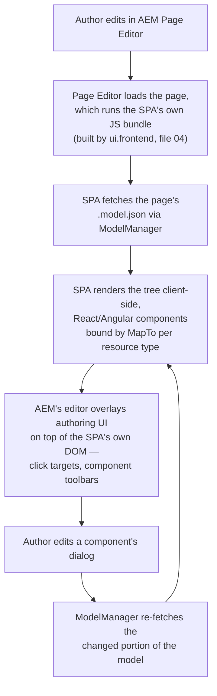
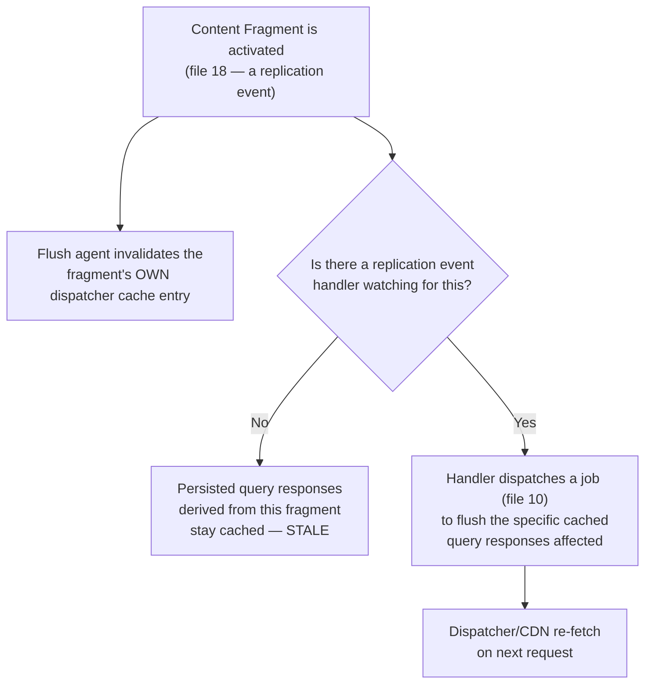
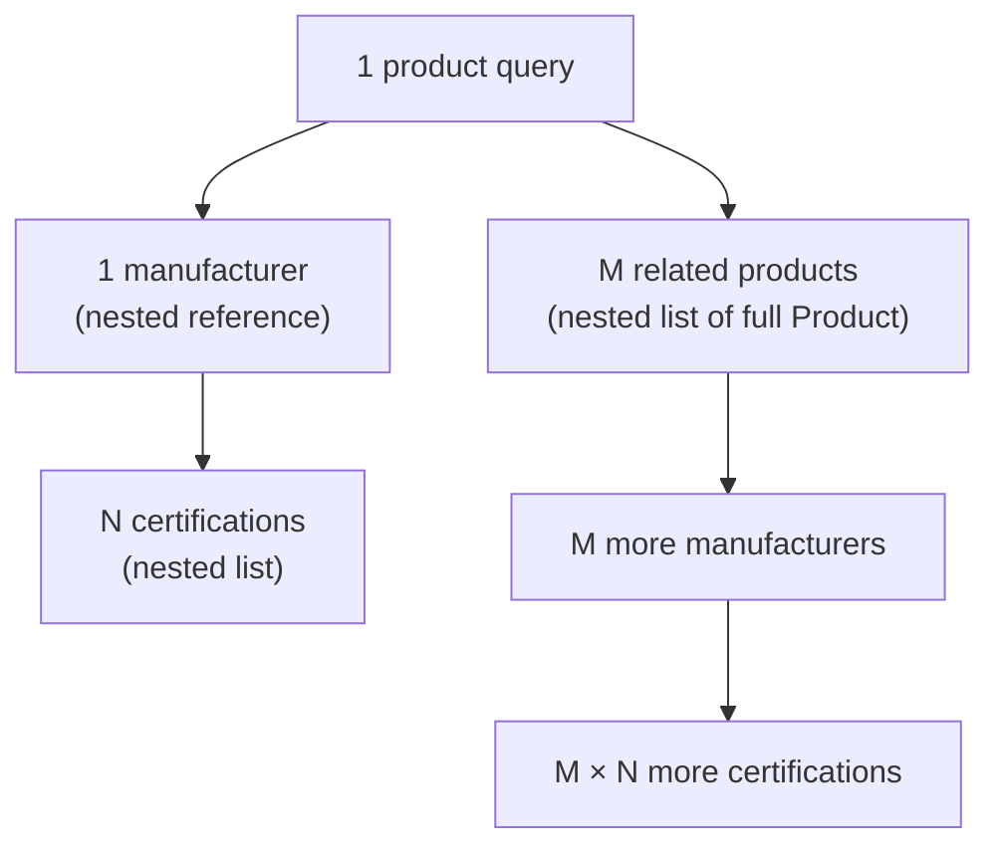

# 24 – Headless AEM: GraphQL and the SPA Editor

> **Target:** 3–4 years experienced AEM Developer
> **Where this sits:** beyond the original 27-point syllabus (files 01–18) — the deeper headless story that comes up directly once an interviewer sees Content Fragments or the Model Exporter on your CV and wants to know if you can reason about the *architecture*, not just the API.
> **Project domain:** a global energy technology company's marketing site.

---

## Before we start — one question, asked at the wrong level

File 15 asked "how do you read a Content Fragment" and answered it with the `ContentFragment` API. File 17 asked "how do you export a Sling Model" and answered it with `@Exporter`. Both files, near the end, converged on the same question:

> **Does the consumer mirror our page, or does it have its own structure?**

That question is usually asked one delivery mechanism at a time — "Model Exporter or GraphQL?" — as if it's a technology choice. It isn't. It's an architecture question, and it has to be asked **once, at the top, for the whole site**, before any component gets built. Get it right there and the technology choices in files 15 and 17 fall out almost automatically. Get it wrong there and no amount of clever GraphQL modelling saves you.

**And the honest answer, most of the time, for a site like ours, is not "headless."** It's **hybrid** — most of the site stays a normal AEM-rendered website, and headless delivery exists only for the specific consumers that genuinely need it. Pure headless is the answer people reach for because it sounds more modern, and it is very often the wrong amount of architecture for the problem in front of them.

This file is about making that call correctly, and then executing the two hardest pieces once you've made it: **GraphQL as a technology** (going well past what file 15 needed for the basics), and the **SPA Editor** (which files 15 and 17 only touched via `ComponentExporter`).

---

## 1. Introduction

### 1.1 What "headless" actually means

**A CMS is "headless" when it manages content but has no opinion about how that content is rendered.** AEM in its traditional mode is the opposite of that: a page is a resource tree, HTL renders it, and the HTML that comes out is the product. There is no meaningful sense in which you could take that content and hand it to a completely different rendering technology — the content and its presentation are the same repository nodes, produced by the same components.

**Headless delivery breaks that coupling.** The content is exposed as data — JSON, mostly — with no rendering attached, and something else (a mobile app, a partner system, a separate front-end framework) decides how to show it.

That's a spectrum, not a switch, and knowing where you sit on it is the actual skill:

| | **Traditional** | **Hybrid** | **Full headless** |
|---|---|---|---|
| Who renders HTML | AEM (HTL + components) | AEM, for most of the site | Nobody, in AEM — a separate front end does |
| What AEM delivers | Rendered pages | Rendered pages **and** JSON, to different consumers | Only JSON/data |
| Authoring | In-context, on the page (file 03) | In-context for most content; structured fields for headless content (file 15) | Structured fields only — no page to look at |
| SEO | Free, from server-rendered HTML | Free, for the rendered part | Your problem to solve again |
| Where most marketing sites belong | — | **Here** | Rarely, and usually for a reason unrelated to marketing pages |

**The row that matters for an interview:** a site can be all three at once, for different parts of itself. Our 20 country marketing sites are traditional. The mobile app consuming product specifications is headless. The whole thing, taken together, is hybrid. That's not an inconsistency — it's the correct application of "use the right tool for the consumer," applied per consumer rather than per site.

### 1.2 Why pure headless is over-chosen

**The pitch for full headless is real, and worth stating fairly**, because a good answer doesn't strawman it: one API serving web, app, and partners alike; a front-end team free to use whatever framework they like; a clean separation between content and presentation that in theory ages well.

**The part the pitch leaves out is everything AEM already gives you for free when you render pages traditionally.** Editable templates and policies (file 03) give authors layout flexibility without a developer. MSM (file 12) handles twenty country sites inheriting and diverging from a common structure. The dispatcher caches rendered HTML at the edge with no extra engineering. Search engines get real HTML to crawl. None of that comes with full headless — you'd be rebuilding a content-management UI, a templating system, a caching layer and an SEO story, in whatever front-end framework you chose, because AEM's authoring and rendering machinery is exactly the part you switched off.

**So the honest test is:** does the thing you're building actually need its own structure, its own release cycle, its own rendering technology — or are you choosing headless because it's the fashionable word, and a normal AEM page would do the job with a fraction of the engineering? Section 7's first story is what happens when a team answers that question the second way.

### 1.3 The decision framework

The one-line version, inherited from file 17 and elevated to the whole architecture:

> **Does the consumer mirror our page, or does it have its own structure?**

Which expands into four practical questions, and asking them in this order gets you to the right mechanism fastest:

1. **Does this need to render as an actual web page** — crawlable, cacheable, editable in context? If yes, that's traditional AEM rendering, headless or not.
2. **Does the consumer's data model look like our page** — the same components, in the same nesting, just consumed by a different renderer (a React app that's *supposed* to look like the AEM page)? That's the **SPA Editor / Model Exporter** territory (file 17).
3. **Does the consumer have its own information architecture entirely** — a native app screen, a partner's data feed, something with no concept of "page" at all? That's **Content Fragments and GraphQL** (file 15).
4. **Is the requirement one specific, oddly-shaped piece of JSON or HTML that doesn't fit either of the above** — an aggregation, a computed value, a request-driven filter? That's a **custom servlet** (file 07).

**Section 2 goes through all four, plus a fifth thing that isn't really a fourth option so much as a constant companion: how images and binaries get delivered underneath whichever of the above you pick.**

---

## 2. Core Concepts

### 2.1 The four delivery mechanisms, side by side

Before going deep on any one of them, it's worth having the whole map in view, because the interview question "why not just use GraphQL for everything" is really asking whether you understand this map.

| Mechanism | Shape of the JSON | Right for | Covered in depth |
|---|---|---|---|
| **Content Fragments + GraphQL** | Content-shaped — your content model, no page structure | Native apps, partners, anything with its own structure | File 15, and section 2.3 below |
| **Sling Model Exporter** | Page-shaped — your component tree, nesting, layout | The **SPA Editor**, or any consumer deliberately mirroring the page | File 17, and section 2.4 below |
| **Custom servlet** | Whatever you write | Aggregation, request-driven filtering, rendered HTML, a bespoke shape | File 07, and section 2.5 below |
| **Traditional HTML (no JSON at all)** | N/A — it's a rendered page | The default for anything that's genuinely a web page | Files 02, 03, 08 |

**The trap to avoid stating badly:** these aren't ranked from best to worst. They're not even mutually exclusive on the same site — our site uses three of the four, for three different consumers, at the same time. The skill being tested is picking correctly *per consumer*, not picking a favourite.

### 2.2 GraphQL in AEM — the schema you didn't write

File 15 established that Content Fragment Models generate a GraphQL schema automatically. Here's what that actually produces, because "it generates a schema" is the kind of sentence that sounds fine until someone asks you what's *in* it.

**For a Content Fragment Model — say, `product`, with fields `productName`, `voltageRange`, `coolingType`, a `manufacturer` fragment reference and a `relatedProducts` fragment reference list — the schema generates, roughly:**

- **A GraphQL type** for the model itself (`Product`), with one field per model field. Text fields become `String`, numbers become `Int` or `Float`, dates become a date scalar, and — this is the part worth remembering from file 15 — a multi-line text field becomes an object with **both** `html` and `plaintext`, so the consumer picks the rendering it wants without AEM guessing.
- **A "by path" query**, conventionally shaped like `productByPath(_path: String!)`, which fetches exactly one fragment given its repository path and returns an `item` wrapping the `Product` type.
- **A "list" query**, conventionally shaped like `productList(filter: ProductFilter, sort: String, offset: Int, limit: Int)`, which fetches many fragments of that model, with **generated filter arguments** per field — so you can ask for every product where `coolingType` equals a given value, without writing any query logic yourself.
- **Fragment reference fields become nested object types.** `manufacturer` isn't a path string in the GraphQL schema — it's a full `Manufacturer` object, queryable in the same request. That convenience is also section 2.2.3's warning.

**You write none of this.** Create the model, enable GraphQL for the configuration (section 2.2.4), and the schema exists. That's the entire pitch of Content Fragment Models being headless-native, and it's also why the model-design discipline from file 15 section 3.3 matters even more here — the GraphQL schema is generated *from* the model, so a badly designed model produces a badly designed API, automatically, without anyone deciding that on purpose.

#### 2.2.1 Nested queries, and what "for free" actually costs

Because a fragment reference becomes a nested object, a single GraphQL query can walk an arbitrary depth of your content graph in one request:

```graphql
query getProductDeep($path: String!) {
  productByPath(_path: $path) {
    item {
      productName
      manufacturer {
        manufacturerName
        certifications {
          certificationName
          issuingBody
        }
      }
      relatedProducts {
        productName
        manufacturer {
          manufacturerName
        }
      }
    }
  }
}
```

**Read that query slowly and count the reads it triggers.** One product. One manufacturer, plus however many certifications that manufacturer has. Then, for **every** related product, another manufacturer lookup. If `relatedProducts` has ten entries, that's ten more fragment reads just for the second-to-last field in the query, and if any of *those* manufacturers had their own nested references, it keeps going.

**That's the fan-out risk**, and it is the single most important thing to be able to talk about when GraphQL comes up, because it's the failure mode that doesn't show up in a demo with three test fragments and absolutely shows up in production with a real content graph. Section 7's second story is exactly this, in numbers.

**The fix is modelling, not query-writing.** A field like `relatedProducts` should very often **not** be a fragment reference that resolves to the full nested object — it should be a lighter reference (a path, a name, a thumbnail) that the consumer only expands when it actually needs the full related product, on demand, in a second query. Section 8.1 shows both the expensive shape and the fixed one.

#### 2.2.2 Variables

**Ad-hoc queries** take variables the normal GraphQL way — a `variables` JSON object alongside the query in the POST body:

```json
{
  "query": "query getProduct($path: String!) { productByPath(_path: $path) { item { productName } } }",
  "variables": { "path": "/content/dam/energy/fragments/products/tx-4000" }
}
```

**Persisted queries** take variables differently, and this is the detail that makes the caching story in section 2.2.3 work at all: the variables are appended to the URL as **matrix parameters**, semicolon-separated, so the whole request — query *and* its inputs — is a single cacheable path:

```
GET /graphql/execute.json/energy/getProductByPath;path=/content/dam/energy/fragments/products/tx-4000
```

Multiple variables just chain with more semicolons:

```
GET /graphql/execute.json/energy/getProductList;coolingType=oil-immersed;limit=20
```

**Why this matters more than it looks like it should:** a query parameter (`?path=...`) is *not* guaranteed to be treated as part of the cache key the same way a path segment is, across every layer of a caching stack (file 01's "a dot is cached, a question mark isn't" principle, arriving again). Matrix parameters are still part of the **path**, so the dispatcher and CDN cache `;path=tx-4000` and `;path=tx-5000` as two entirely separate files, correctly, with no special configuration.

#### 2.2.3 Persisted queries — the production answer, in depth

File 15 covered *why* persisted queries matter (caching, and constraining callers). Here's the rest of the mechanism.

**Creating one.** A persisted query starts life as an ordinary GraphQL query you've tested — usually in GraphiQL (section 2.2.5) against a development or author instance. Once it's correct, it gets **saved server-side** under the configuration it belongs to, with a name you choose. From that point on, calling it by name and passing variables in the path is equivalent to POSTing the full query text — except now it's a GET.

**Where they're stored.** Persisted queries live under:

```
/conf/<project>/settings/graphql/persistentQueries/<queryName>
```

**The same `/conf` tree as templates, policies and Content Fragment Models** (files 03 and 15) — which is worth noticing, because it means persisted queries are configuration that ships and versions the same way everything else under `/conf` does, not something bolted on separately.

**The URL format, stated precisely:**

```
/graphql/execute.json/<configurationName>/<queryName>;var1=value1;var2=value2
```

- `<configurationName>` is the Sites configuration the query was created under — the same configuration that has GraphQL enabled in the first place (section 2.2.4).
- `<queryName>` is whatever the query was saved as.
- Everything after the semicolons is variables, in the path, as covered above.

**Caching, precisely.** Because that whole thing is one GET on one stable path, it behaves exactly like any other cacheable AEM URL from file 01: the **dispatcher caches the response as a file** on disk, keyed by the full path including the matrix parameters, and the **CDN caches it at the edge** in front of the dispatcher. A mobile app that queries the same handful of persisted queries on every launch, for a catalogue that changes rarely, ends up serving almost all of that traffic from the CDN — publish barely sees it.

**The second benefit, restated because it's the one people forget to mention:** persisted queries are a **security boundary**, not just a performance one. An ad-hoc endpoint accepts *any* query a caller cares to construct — including one that walks ten levels of fragment references and brings a publish instance to its knees, or one that pulls fields nobody intended to expose externally. A persisted-queries-only publish tier means the only queries that can ever run are the ones your team wrote, reviewed, and saved. That's the same "constrain, don't validate" principle from file 11's dialog discipline, applied to an API surface instead of a form field.

#### 2.2.4 The endpoint isn't on by default

**GraphQL for Content Fragments has to be switched on, per Sites configuration**, in the Configuration Browser (Tools → General → Configuration Browser). Enabling it is what makes that configuration's name usable as the `<configurationName>` segment in both the ad-hoc endpoint and the persisted-query URL.

**That's a deliberate default, not an oversight**, and the reasoning matters for the security conversation in section 2.2.6: a site that never intends to deliver headlessly shouldn't have a GraphQL surface sitting there to be discovered and probed. Enable it only for the configurations that actually back a headless consumer.

#### 2.2.5 GraphiQL — for development, never for production

**GraphiQL is an interactive query IDE** — write a query, run it against a real instance, see the schema, see the response, iterate. It's how you'd actually build and validate a persisted query before saving it.

**It belongs on development and author instances, and nowhere near a public publish tier.** It is, by design, a tool for constructing arbitrary ad-hoc queries against your schema — which is precisely the capability section 2.2.6 says publish should not expose. Treat "is GraphiQL reachable from here" as a security check with the same seriousness as "is CRXDE reachable from here."

#### 2.2.6 Securing GraphQL on publish

Pulling the last few sections together into the actual publish-tier checklist, because this is where the interview question "how would you secure this" gets answered concretely rather than in the abstract:

1. **Enable GraphQL only on configurations that need it.** Section 2.2.4 — it's opt-in per configuration, so opt in narrowly.
2. **Dispatcher rules block the ad-hoc endpoint on publish.** The ad-hoc query path accepts a POST with an arbitrary query body — that's a caller running whatever they like against your schema, and it should not be reachable from the public internet at all. Deny it in the dispatcher filter, the same way `/bin/receive` is denied in file 18.
3. **Only the persisted-query path is allowed**, and only as a **GET** — `/graphql/execute.json/*`. That's the one you actually let the internet call.
4. **GraphiQL and any development tooling package are not installed on publish** at all — not just blocked at the dispatcher, genuinely not present.
5. **Anonymous still needs read on the underlying fragment paths**, same as file 15 — securing the query surface doesn't remove the DAM permission requirement underneath it.

**The interview-ready version of this list is short:** *"Ad-hoc off, persisted-only, GraphiQL nowhere near publish, and the usual DAM read permissions underneath."*

#### 2.2.7 Invalidating cached query responses

**This is a derived-cache problem, and file 18 already gave the general shape of it: publishing content invalidates the page that content is on, and nothing else automatically.** A persisted query's cached response is exactly the kind of "nothing else" that gets forgotten.

When a Content Fragment referenced by a persisted query gets activated, that fragment's **own** dispatcher-cached representation (if it has one) gets flushed by the ordinary flush-agent mechanism (file 18). But the **query response** — which is a *different* cached artifact, derived from the fragment's content but living at a different path — does not automatically know it depends on that fragment. Nobody wired that dependency for you.

**The fix is the same one file 18 already reached for a cached listing built from a page tree**: a replication event handler that reacts to `ReplicationAction.EVENT_TOPIC`, works out which persisted queries could plausibly be affected by the fragment that just published, and issues a targeted flush for those cached responses — doing almost nothing on the event thread itself and dispatching a Sling Job to do the actual work (file 10's discipline, applying here too).

**Skip this and the failure mode is quiet and bad:** the fragment updates, the app's next launch still serves the cached response from an hour — or a day — ago, and nobody gets an error, because nothing is wrong from the dispatcher's point of view. It's serving exactly what it was told to cache.

### 2.3 The Sling Model Exporter, one layer up — page-shaped delivery

File 17 covered `@Exporter`, `ComponentExporter`, and the component-level JSON shape in full, and there's no point repeating it here. What that file didn't need yet, because it was reasoning about one component, is what happens when the **whole page** gets exported — which is exactly what the SPA Editor needs.

#### 2.3.1 The page-level page model

Requesting `.model.json` on a **page** resource, rather than a component, returns the whole authored tree — and it carries two structural keys that file 17 only mentioned in passing:

```json
{
  ":type": "energy/components/page",
  ":path": "/content/energy/global/en/products",
  ":hierarchyType": "page",
  ":items": {
    "root": {
      ":type": "wcm/foundation/components/responsivegrid",
      ":items": { "cta": { ":type": "energy/components/cta", "text": "Read more", "url": "/global/en/news" } },
      ":itemsOrder": ["cta"]
    }
  },
  ":itemsOrder": ["root"],
  ":children": {
    "products/tx-4000": {
      ":type": "energy/components/page",
      ":hierarchyType": "page",
      ":title": "TX-4000 Transformer"
    }
  }
}
```

**`:items` and `:itemsOrder`** are exactly what file 17 already explained for a container component — the page's own component tree.

**`:hierarchyType`** tells the consumer this node represents a **page**, as distinct from a component. That distinction matters because a page-level model mixes two kinds of thing in one JSON document: the page's own authored content, and pointers to *other pages* underneath it — and a consumer needs to be able to tell which is which without guessing from context.

**`:children`** is the site's page hierarchy, lazily represented — child pages, keyed by their relative path, generally with a **shallow** representation (title, type) rather than their full content. **Why shallow, and not the whole subtree in one response:** exporting every descendant page's entire component tree in a single request would mean a request for the site root returning, effectively, the whole site as one JSON blob. `:children` gives the SPA's router enough to know a child page exists and what it's called, and the SPA fetches that child's **own** `.model.json` only when the user actually navigates there.

**That's the same fan-out discipline as section 2.2.1, arriving from a different mechanism.** Whether it's a GraphQL fragment reference or a page's `:children`, the pattern that keeps a JSON API workable is the same one: **shallow by default, expand on demand.**

### 2.4 The SPA Editor, in depth

#### 2.4.1 The problem it solves

Say the front-end team already has a React (or Angular) component library, or the page genuinely needs the interactivity a single-page application gives you — instant navigation with no full-page reload, complex client-side state, a multi-step tool that recalculates as the visitor changes inputs. Building that as HTL components (file 08) fights the technology: HTL renders server-side, once, and any interactivity after that is bolted-on JavaScript reaching back into a server-rendered DOM.

**The alternative — building it as a plain SPA with no AEM involvement at rendering time — solves the technical problem and creates an authoring problem.** A plain SPA has no concept of "drag this component here" or "click this text to edit it." Authors would be editing structured fields with no live page in front of them, which is a real step backward from what AEM's Page Editor normally gives them (file 03).

**The SPA Editor is the answer to both halves at once**: the front end genuinely is a React or Angular application, running its own client-side rendering and routing — and an author working in AEM's Page Editor can still click on a piece of it, get the normal component dialog, and see the change reflected live, the same way they would on an HTL-rendered page.

#### 2.4.2 The architecture



**The mechanism in one sentence:** the SPA is the thing that's actually rendering the page — AEM doesn't render HTL for these pages at all — and it renders from the **same page model JSON** that file 17's exporter machinery produces, with a JavaScript layer on the AEM side making that JSON tree editable in place.

**Two pieces make this work, and they map exactly onto file 17's exporter interfaces plus a JS counterpart:**

- **`ComponentExporter` / `ContainerExporter`** (Java, file 17) produce the `:type`, `:items`, `:itemsOrder` tree — the data the SPA needs to know what to render and in what order.
- **`ModelManager`** (JavaScript) is what the SPA uses to actually fetch, cache and react to changes in that tree.

#### 2.4.3 `ModelManager` and the page model lifecycle

`ModelManager` is a singleton from the AEM SPA Editor JS SDK (`@adobe/aem-spa-page-model-manager`) that owns the page model on the client side. Its job, stated as three responsibilities:

- **Fetch.** `ModelManager.initialize(path)` requests the root page's `.model.json` and populates an in-memory model. Deeper parts of the tree — the `:children` from section 2.3.1 — get fetched lazily, the same shallow-by-default pattern.
- **Cache.** Once fetched, the model lives in memory for the SPA's own components to read via `ModelManager.getData(path)`, rather than every component independently requesting the same JSON.
- **React to change.** When an author edits something in Page Editor, AEM tells the running SPA that part of the model changed, and `ModelManager` re-fetches just that part and emits an event. Components listening for that path re-render with the new data — which is what makes the edit feel live, rather than requiring a manual page refresh.

**The interview-sized version:** *"`ModelManager` is the SPA's single source of truth for the page model. It fetches `.model.json`, caches it, and re-fetches and notifies the SPA when AEM says a piece of the page changed underneath it."*

#### 2.4.4 `MapTo` — binding a resource type to a component

File 17 already showed the shape of this from the JavaScript side:

```javascript
MapTo('energy/components/cta')(CtaComponent);
```

**What this actually does:** it registers, in a global mapping the SPA Editor SDK maintains, that any node in the page model whose `:type` equals `energy/components/cta` should be rendered by `CtaComponent`. When the tree walker hits that node, it looks up the mapping and renders the matched component with that node's fields as props.

**That mapping is the entire contract between AEM and the SPA.** AEM knows nothing about React internals; the SPA knows nothing about how the component was authored in a dialog. The resource type string is the only thing both sides agree on — which is exactly the same resource-type-as-contract idea that underlies HTL's `data-sly-resource` and Sling's request resolution (file 01, file 02), just crossing a language boundary this time instead of staying inside Java.

#### 2.4.5 `EditableComponent` — making a React component authorable

A plain `MapTo`'d component renders the content. It does **not**, on its own, know how to behave inside AEM's Page Editor — how to show an empty-component placeholder when there's nothing authored yet, how to expose the right DOM attributes for the editor's click targets and drag handles, how to signal its boundaries to the overlay.

**`EditableComponent`** (from `@adobe/aem-react-editable-components`, or the Angular equivalent) is a wrapper that adds exactly that. Wrap the plain component with it, and:

- It renders an **empty placeholder** when the component has no authored content and the page is in edit mode — the SPA's version of file 05's `isReady()` guard, except the "nothing to render" case has to be visibly clickable rather than invisible, because an author needs to be able to click on it to add content.
- It attaches the data attributes AEM's editor overlay reads to know **where this component's DOM boundaries are** — which is how the overlay draws a toolbar around the right region and knows what a click on that region means.
- It participates in the re-render cycle described in 2.4.3, so an edit to this specific component updates only this component's rendered output.

**Why this is a real cost, not a formality:** every component that needs to be authorable in the SPA Editor needs **both** halves — the Java Sling Model implementing `ComponentExporter` (file 17), **and** a React/Angular component wrapped in `EditableComponent` and bound with `MapTo`. That's two implementations of the same component, in two languages, kept in sync by hand. Section 7's third story is what that cost looks like when you multiply it across an entire site.

#### 2.4.6 Remote SPA versus the integrated SPA Editor

There are two genuinely different deployment shapes here, and conflating them is a common mistake.

**The integrated pattern** — what's described above — packages the SPA's build output as a clientlib inside AEM's `ui.apps`, served from the same origin, loaded by the page component the normal way. Page Editor loads that same origin, so the SPA and the editor overlay share a browser context with no cross-origin friction, and full in-context editing works the way it's described in section 2.4.2.

**A remote SPA** is hosted and deployed **independently** — its own domain, its own build and release pipeline, its own CDN — fetching `.model.json` from AEM over the network (typically CORS) rather than being served by AEM at all. That buys the front-end team genuine deployment independence: they can ship on their own schedule, on their own infrastructure, without an AEM release in the loop.

**What it costs is authoring fidelity.** A remote SPA isn't running inside the same page AEM's editor is decorating, so the tight, real-time overlay-and-click experience of the integrated pattern needs real integration work to approximate at all, and some of it may not be achievable to the same standard. **The honest trade to state:** deployment independence versus in-context editing quality — and a team should make that trade deliberately, having actually looked at both, rather than defaulting to whichever one a tutorial happened to show them.

#### 2.4.7 The honest trade-offs — when the SPA Editor is *not* worth it

This is the part of the topic that separates someone who's read the docs from someone who's shipped it.

**The SPA Editor adds real, ongoing complexity:**

- **Two technology stacks for one component.** Every authorable component needs a Java Sling Model (for the exporter) **and** a React/Angular component (for the SPA) — file 17's exporter work, doubled, forever, for every new component the site adds.
- **Server-side rendering doesn't come for free.** A plain client-side-rendered SPA sends the browser a near-empty HTML shell and lets JavaScript build the page — which is a real problem for a marketing site whose value proposition includes organic search traffic. Getting server-rendered (or pre-rendered) HTML back requires its own infrastructure — commonly a Node SSR service — layered on top of AEM and the dispatcher, which is more moving parts, not fewer.
- **Routing has two owners.** The SPA has its own client-side router; AEM has its own page hierarchy. Reconciling the two — especially across a multi-country, multi-language structure (file 12) — is integration work that a traditional site simply doesn't have.
- **Debugging spans two runtimes.** A rendering bug might be in the Java model, the JSON it exported, or the React component consuming it — and diagnosing which means moving between two toolchains instead of one.

**So the honest test to apply, out loud, in an interview:**

> "Does this page genuinely need to *be* a single-page application — real client-side state, instant navigation, a live-recalculating tool — or would a normal AEM page, HTL and a bit of client-side JavaScript, do the job? Most marketing pages are the second kind. The SPA Editor is worth its cost for the minority that are genuinely the first."

**Section 7's third story is a team reaching exactly that conclusion**, after prototyping rather than guessing.

#### 2.4.8 The `ui.frontend` relationship

File 04 already introduced `ui.frontend` as the module where modern front-end code lives — a webpack/npm project, built independently, with its output copied into a clientlib under `ui.apps` by `aem-clientlib-generator`.

**For a SPA Editor project, `ui.frontend` is where the entire React or Angular application lives**, not just some CSS and progressive-enhancement JavaScript. The build output is the whole SPA bundle — `ModelManager` initialisation, every `MapTo`'d and `EditableComponent`-wrapped component, the works — packaged as a clientlib and loaded by a (very thin) page component whose only real job is to render the container the SPA mounts into.

**The consequence worth stating:** the front-end team's day-to-day workflow doesn't change much from file 04's description — they work in `ui.frontend` with normal npm tooling, without needing a running AEM instance for most of their work — but what they're building inside that module is categorically bigger than a CSS/JS bundle. It's an application, and it needs the AEM SPA Editor SDK wired into it from day one, not bolted on afterward.

### 2.5 Custom servlets as a delivery mechanism

File 07 already covers servlets in full; this is specifically about when a servlet is the **right headless delivery choice**, as opposed to GraphQL or the exporter.

**The test, restated for this context:** does the JSON (or HTML fragment) you need correspond to *one fragment's content* (→ GraphQL) or *one component's content, page-shaped* (→ Model Exporter) — or does it require **logic that neither of those naturally expresses**?

**A concrete example from our site: a "compare transformers" endpoint.** The comparison table needs to pull two or three product fragments, apply unit conversions so a European and a North American spec sheet compare on the same scale, apply a business rule about which fields are even comparable between two different product families, and return a shape built for that one screen. That's not "give me a fragment's fields" (GraphQL already does that) and it's not "give me a component's authored content" (Model Exporter already does that) — it's a computation over several pieces of content, and a servlet is exactly the tool for a computation.

**The caching property carries over from file 07 unchanged:** a servlet responding to a path-and-selector request (`compare.json` with a suffix, say) is just as dispatcher-cacheable as anything else path-based; a servlet reading query parameters isn't. The mechanism choice doesn't change the caching rules — it just changes who's writing the logic.

### 2.6 Assets — the delivery leg nobody's schema covers

**Every one of the mechanisms above delivers text and structured data. None of them is how you'd want to deliver a 4MB product photograph.**

A Content Fragment's "content reference" field (file 15) typically points at a DAM asset — an image, most often. GraphQL returns that reference as a **path**, not as image bytes; embedding binary data in a GraphQL response would be a bad use of the format and a bad use of the cache. The consumer takes that path and requests the actual image separately, directly against the DAM — as a plain rendition URL, or through AEM's dynamic media/asset-delivery capability if the project has it configured, which can serve resized, format-negotiated renditions on the fly from parameters in the URL rather than requiring a fixed rendition to be pre-generated for every size a consumer might want.

**The point worth making explicitly:** a "headless delivery" architecture is never *only* GraphQL. It's structured content via GraphQL, page structure via the exporter where relevant, and **binary assets delivered separately, by path, cached like any other asset.** Missing that third leg is how a team ends up with a beautifully modelled product API that returns an image path the mobile app then can't actually resolve because nobody thought about asset permissions on publish (file 15's DAM-permission point, again, from a new direction).

### 2.7 Hybrid, in practice

Pulling sections 2.1 through 2.6 together into what our site actually does:

- **The 20 country marketing sites** render traditionally — Core Components, editable templates, MSM. No GraphQL, no SPA Editor, on any of those pages.
- **The mobile app** consumes product specifications through Content Fragments and GraphQL persisted queries (file 15), because it has its own screens and its own information architecture that has nothing to do with how a web page is laid out.
- **A partner dealer portal** consumes the same GraphQL layer, for the same reason — it's a different consumer with its own structure, and it's cheap to add once the schema and persisted queries exist for the app.
- **One interactive configurator tool** — and only that one page type — runs as an SPA Editor instance, because it's the one place on the site with genuine client-side, stateful, recalculating behaviour that a normal HTL component would fight rather than deliver naturally (section 7's third story).
- **A comparison endpoint** is a custom servlet, because comparing normalised specs across product families is a computation, not a content fetch.

**That's five different answers to "how do we deliver this," on one site, and every one of them is correct** — because each answer was chosen per consumer, against the decision framework in section 1.3, rather than picked once for the whole program and applied uniformly. That's the argument this whole file is making, restated as an inventory.

---

## 3. Internal Working

### 3.1 A GraphQL persisted query, end to end

```mermaid
sequenceDiagram
    participant App as Mobile app
    participant CDN as CDN edge
    participant Disp as Dispatcher
    participant Pub as Publish
    participant CFM as Content Fragment

    App->>CDN: GET /graphql/execute.json/energy/getProduct;path=tx-4000
    alt Cached at the edge
        CDN-->>App: Cached JSON response
    else Not cached
        CDN->>Disp: forward request
        alt Cached at dispatcher
            Disp-->>CDN: Cached JSON file
        else Not cached
            Disp->>Pub: forward request
            Pub->>CFM: resolve fragment(s), run generated resolvers
            CFM-->>Pub: fragment data
            Pub-->>Disp: JSON response
            Disp-->>Disp: cache as a file
        end
        Disp-->>CDN: response
        CDN-->>CDN: cache at the edge
    end
    CDN-->>App: JSON response
```

**The point this diagram is making:** almost every request in a healthy setup terminates at the CDN or the dispatcher, and publish only ever sees traffic the **first** time a given persisted query with a given set of variables is requested after content changes. That's the entire performance case for persisted queries, drawn as a picture instead of stated as a sentence.

### 3.2 What invalidates what



**The branch that gets missed in production is the left one.** Nothing in AEM wires a fragment's activation to a persisted query's cached response automatically — that relationship has to be built, the same way file 18 already said for any derived, cached output. A team that ships persisted queries without also shipping this handler ships a system that looks fine in testing (nobody's waiting long enough for staleness to matter) and serves outdated specifications quietly in production.

### 3.3 The fan-out mechanism, drawn



**Reading the diagram as a cost model:** one query, one variable (`path`), and a resolution cost that grows with **M times N**, not with 1. That's the shape every fan-out problem takes — a query that reads like a single request and resolves like a nested loop. Section 8.1 shows the fix, which is always the same fix: stop nesting the expensive field, and let the consumer ask for it explicitly, separately, only when it needs it.

### 3.4 How a `.model.json` request becomes an editable SPA page


**This is the same URL→resource→resource-type→model chain file 17 drew for one component (its section 3.2)**, run once for the whole page and then handed to a JavaScript runtime instead of stopping at the server. Nothing about the underlying Sling resolution changes — what changes is who consumes the JSON at the far end.

---

## 4. Important Interview Questions

### 4.1 Basic

**Q1. What does "headless" mean, and is AEM headless?**
Headless means the CMS manages content with no opinion on how it's rendered — content and presentation are decoupled. AEM isn't headless by default (a page is rendered server-side by HTL), but it can deliver headlessly for specific consumers via Content Fragments and GraphQL, or via the Model Exporter for a page-shaped consumer.

*Cross:* What's the alternative to headless? (**traditional** rendering) · What's in between? (**hybrid**) · Which is our site? (**hybrid**)

**Q2. What's the difference between full headless and hybrid?**
Full headless means nothing renders as an AEM page at all — every consumer, including the website, fetches JSON and renders itself. Hybrid means most of the site renders traditionally and headless delivery exists only for the specific consumers that need it.

*Cross:* Which is more common in practice? (**hybrid**) · Why would a team pick full headless anyway? (a genuinely page-less product, or a fashion for the label) · What does full headless cost you? (SEO, caching, in-context editing — all rebuilt elsewhere)

**Q3. What are the ways to get content out of AEM as JSON?**
Content Fragments via GraphQL, the Sling Model Exporter, and a custom servlet — plus, for images and binaries specifically, direct asset/DAM delivery underneath any of the above.

*Cross:* What decides which one? (does the consumer mirror the page or have its own structure) · Which is "true" headless? (**Content Fragments**) · Which is page-shaped? (**the exporter**)

**Q4. What does a Content Fragment Model generate in GraphQL?**
A type per model, a "by path" query to fetch one fragment, and a "list" query with generated filter arguments to fetch many. Fragment reference fields become nested object types, queryable in the same request.

*Cross:* Do you write the schema? (**no** — it's generated) · What does a multi-line text field become? (an object with `html` and `plaintext`) · What's the risk of nested fragment references? (**fan-out**)

**Q5. Ad-hoc versus persisted GraphQL query — what's the difference?**
Ad-hoc is a POST to the endpoint with the query text in the body — not cacheable, and it lets the caller run any query. Persisted is a query saved server-side under a name, called with a **GET** on a stable path — cacheable, and it limits callers to approved queries.

*Cross:* Which is for production? (**persisted**) · What's the URL shape? · Where do variables go in a persisted query? (**matrix parameters in the path**)

**Q6. What's the persisted query URL format?**
`/graphql/execute.json/<configurationName>/<queryName>`, with variables appended as semicolon-separated matrix parameters, e.g. `;path=/content/dam/...`.

*Cross:* Where are persisted queries stored? (`/conf/<project>/settings/graphql/persistentQueries`) · Why matrix parameters and not `?query=`? (**still path-based, so still cacheable**) · Multiple variables? (chain more semicolons)

**Q7. Is the GraphQL endpoint enabled by default?**
No — it's enabled per Sites configuration in the Configuration Browser, and only configurations that need headless delivery should turn it on.

*Cross:* What does enabling it give you? (a `<configurationName>` usable in query URLs) · Should publish have the ad-hoc endpoint open? (**no**) · What about GraphiQL on publish? (**never**)

**Q8. What is GraphiQL?**
An interactive GraphQL IDE for writing and testing queries against a real schema, used during development — never installed on or exposed from a production publish instance.

*Cross:* Why not on publish? (it lets anyone construct arbitrary queries) · What replaces it in production? (persisted queries only)

**Q9. What is the Sling Model Exporter used for in headless delivery, one level up from file 17?**
It's what produces the page model JSON the **SPA Editor** consumes — a whole page's component tree, not just one component, including the page hierarchy via `:children`.

*Cross:* What's `:hierarchyType` for? (distinguishes a page node from a component node) · What's `:children`? (child pages, shallow, fetched lazily) · Why shallow? (**avoid exporting the whole site in one request**)

**Q10. What is the SPA Editor?**
A way to author a React or Angular single-page application inside AEM's Page Editor. The SPA fetches the page model as JSON and renders it client-side; AEM's editor overlays authoring UI — click targets, toolbars — on top of the SPA's own rendered DOM.

*Cross:* What fetches the model? (`ModelManager`) · What binds a resource type to a component? (`MapTo`) · What makes a component editable? (`EditableComponent`)

### 4.2 Intermediate

**Q11. Walk me through what happens when a GraphQL query has a deeply nested fragment reference.**
Each nested reference is resolved as part of the same request — a fragment reference field returns the full referenced object, not just a path. If that referenced object itself has references, and especially if any level is a **list** of references, the number of underlying resolutions multiplies rather than adds, which is the fan-out risk.

*Cross:* How would you detect it? (response time and payload size for one query, then GraphiQL against a realistic sample) · How would you fix it? (**shallow references, expand on demand**) · Is this a query problem or a modelling problem? (**modelling, mostly**)

**Q12. How do persisted query responses get invalidated?**
They don't, automatically. Publishing a fragment invalidates that fragment's own cached representation, but a query response derived from it is a separate cached artifact with no built-in dependency link. You need a replication event handler that recognises the affected queries and flushes them, dispatching the actual work as a job.

*Cross:* What's the risk of skipping this? (**stale content served silently, no error anywhere**) · Why a job and not inline work? (the event handler runs on the event thread — file 10) · Is this a new problem, or a familiar one? (the same derived-cache problem as file 18's listing example, one level further out)

**Q13. Why would you choose a custom servlet over GraphQL for headless delivery?**
When the JSON needed isn't "one fragment's fields" or "one component's content" but a computation over several pieces of content — an aggregation, a comparison with business rules applied, a request-driven filter. Neither GraphQL nor the exporter naturally expresses logic like that; a servlet is built for exactly that.

*Cross:* Give an example → the comparison-table endpoint · Is it still cacheable? (yes, if it's path-based rather than query-parameter-based — file 07's rule, unchanged) · Would you model this as a Content Fragment instead? (no — it's a computation, not stored content)

**Q14. Why does a native mobile app usually get Content Fragments and GraphQL rather than `.model.json`?**
Because `.model.json` is shaped like the page — component names, container nesting, layout decisions — and a native app has its own information architecture with no relationship to how a web page happens to be laid out. Tying the app to the page's structure means a routine web layout refactor breaks the app.

*Cross:* When would `.model.json` be right for an app? (only if the "app" genuinely is meant to mirror the page — which is really the SPA Editor case, not a separate native app) · What's the coupling risk called? (**your web layout becomes their API**)

**Q15. What is `ModelManager` and what does it do?**
The client-side singleton from the SPA Editor JS SDK that fetches a page's `.model.json`, caches it in memory, and re-fetches and notifies the SPA's components when AEM signals that part of the model changed during authoring.

*Cross:* What triggers a re-fetch? (an edit made in Page Editor) · Does it fetch the whole site up front? (**no** — child pages are lazy, via `:children`) · What consumes what it fetches? (`MapTo`'d components)

**Q16. What does `MapTo` actually bind?**
A resource type string to a JavaScript component. When the page model's tree walker encounters a node whose `:type` matches, it renders that node with the mapped component, passing the node's fields as props.

*Cross:* What produces `:type`? (`ComponentExporter.getExportedType()`, file 17) · What's the contract between AEM and the SPA? (**the resource type string, nothing else**) · What happens if there's no mapping for a type? (that node typically doesn't render, or falls back to a default)

**Q17. What does `EditableComponent` add that a plain mapped component doesn't have?**
Authoring behaviour: an empty-component placeholder when there's no content and the page is in edit mode, the DOM attributes AEM's overlay needs to draw click targets and toolbars around the component, and participation in the model-change re-render cycle.

*Cross:* What happens to a component without it? (it renders content but can't be edited in Page Editor) · Does every component need it? (only ones that must be author-editable in the SPA)

**Q18. What's the difference between an integrated SPA Editor setup and a remote SPA?**
Integrated: the SPA is built and packaged as a clientlib inside AEM, served from the same origin as the editor, giving full in-context editing with no cross-origin friction. Remote: the SPA is hosted and deployed independently, fetching `.model.json` over the network — real deployment independence, at the cost of needing real integration work to approach the same editing fidelity.

*Cross:* Which is more common for a marketing site? (**integrated**, when SPA Editor is used at all) · What's the trade being made? (deployment independence versus authoring fidelity) · Would `ui.frontend` differ between the two? (the build target does, but the module's purpose doesn't)

**Q19. What does the `ui.frontend` module contain for a SPA Editor project, versus a traditional one?**
In both cases it's a webpack/npm module whose output is packaged into a clientlib. For a traditional project that output is CSS and progressive-enhancement JavaScript. For a SPA Editor project it's the entire application — `ModelManager` wiring, every mapped and editable component — because the SPA, not HTL, is what renders the page.

*Cross:* Does that change the front-end team's workflow? (not fundamentally — still npm tooling, mostly instance-free) · Does it change the size of what ships? (considerably — a whole app versus a bundle)

**Q20. When would you *not* recommend the SPA Editor, even if the front-end team wants it?**
When the page doesn't actually need SPA behaviour — no genuine client-side state, no instant navigation requirement, no live-recalculating interaction. For an ordinary content page, the SPA Editor doubles component implementation effort (Java model plus JS component), adds an SSR problem you didn't have before, and adds routing reconciliation with AEM's page hierarchy — costs a normal marketing page has no reason to pay.

*Cross:* What would justify it? (a genuinely stateful, interactive tool — a configurator) · How would you make that case to a front-end team that already likes React? (prototype one page type, measure the actual cost, decide from numbers) → section 7, story 3

### 4.3 Advanced

**Q21. Design the headless architecture for our marketing site, the mobile app, and one interactive configurator tool.**

> "Three different consumers, three different mechanisms, chosen against the same question each time: does this consumer mirror our page, or does it have its own structure?
>
> The **20 country marketing sites** stay traditional — Core Components, editable templates, MSM. They're pages, they need to be crawlable, and authors need in-context editing. There's no reason to route any of that through JSON at all.
>
> The **mobile app** has its own screens with no relationship to our page layout, so it gets **Content Fragments and GraphQL persisted queries**. Product specifications get modelled with typed fields, delivered through persisted queries for caching and to constrain what the app can request, with a replication event handler to invalidate cached responses when fragments change.
>
> The **configurator** is the one page that genuinely behaves like an application — a multi-step tool with live recalculation as the visitor changes inputs. That's the one place I'd reach for the **SPA Editor**, and only there — built as a contained SPA Editor instance for that page type, with `ui.frontend` producing the React app, `ComponentExporter`-backed Java models on the AEM side, and `EditableComponent`-wrapped React components matching them one for one.
>
> What I'd explicitly avoid is generalising any one of those three decisions to the whole site. The failure mode I've seen is a team picking one 'headless strategy' for everything, which either forces the marketing pages through a JSON pipeline they don't need, or tries to give the app our page structure, which it shouldn't have to know about."

*Cross:* What if the app later needs the same interactive tool as the configurator? (a separate concern — the tool's *logic* could be shared as a library; its *authoring* stays specific to where it's edited) · How would you version the GraphQL schema as models evolve? (persisted query names, effectively — add new ones, don't repurpose old ones) · What if the configurator needs data from Content Fragments too? (nothing stops an SPA Editor page's components from also calling the GraphQL API for reference data — the two mechanisms aren't mutually exclusive within one page)

**Q22. Diagnose and fix a GraphQL fan-out problem.**

> "First, confirm it's actually fan-out and not something else — response time and payload size for the specific query, on a realistic content sample, not the three test fragments from a demo. Then GraphiQL against that same sample to see the actual response shape and size.
>
> Once it's confirmed, the fix is almost always **in the model, not the query**. The field that's expensive is usually a list of fragment references that resolves to full nested objects — `relatedProducts` returning complete `Product` objects including *their* manufacturers and certifications, say. I'd change that field to resolve **shallow** — a path, a name, maybe a thumbnail reference — and have the consumer issue a **second**, separate query for the full related product only when the user actually opens it.
>
> I'd also put a **limit** on any list-shaped reference field at the model or component level, the same bounding discipline as anywhere else that builds a collection — so a fragment that unexpectedly accumulates fifty related products doesn't get worse over time even after the shape is fixed.
>
> The broader lesson is that GraphQL resolves a nested query **eagerly, in one request** — unlike reading fragments one at a time in Java, where the cost is spread across separate reads that each show up separately in a profiler. A GraphQL schema makes an expensive model shape *look* like one cheap request, right up until someone runs it against real data."

*Cross:* Would you catch this in review, or only in production? (**in review, if you know to look for lists of fragment references at more than one level** — which is why the pattern is worth memorising) · How would you test for it before shipping? (a query against a realistically sized sample, not a handful of test fragments) · Is this AEM-specific? (no — it's the general GraphQL N+1 problem, arriving via Content Fragment Models specifically)

**Q23. What are the security considerations across GraphQL and the SPA Editor?**

> "For GraphQL, the ad-hoc endpoint accepting arbitrary queries is the main one — it lets a caller construct something expensive or over-broad, so publish should only expose persisted queries as GETs, with the ad-hoc path and GraphiQL blocked at the dispatcher and not installed at all in production. Underneath that, the ordinary DAM read permissions from file 15 still apply — securing the query surface doesn't grant read access it wouldn't otherwise have.
>
> For the SPA Editor, the model exporter's own rule from file 17 carries over unchanged: every public getter on an exported model is serialised by default, so an exported page model is as public as the page it describes, and anything not meant to be part of the contract needs `@JsonIgnore` deliberately.
>
> And for a remote SPA specifically, CORS configuration is doing real security work — it decides which origins can fetch the page model at all, and getting that wrong either blocks the legitimate SPA or opens the model to origins that shouldn't have it."

*Cross:* What's the shared principle across all of these? (**default to closed, open up deliberately** — the same principle as file 11's constrain-don't-validate) · Would you treat GraphiQL differently on author than on publish? (yes — a development tool on a non-public instance is a different risk profile entirely) · What about rate limiting? (worth raising as a CDN/dispatcher-level concern for persisted queries under heavy app-launch load)

**Q24. When is full headless actually the right call, and how would you recognise it?**

> "When there genuinely is no 'page' for the primary consumer to render — a native app is the clean example, and a voice assistant or a kiosk display would be others. If the thing consuming the content has no browser, no URL bar, no concept of navigating between pages, then the entire value proposition of AEM's page rendering — SEO, in-context editing on a page, dispatcher HTML caching — doesn't apply to that consumer at all, and there's nothing being given up by delivering to it headlessly.
>
> What I'd push back on is treating that as a reason to make the **whole site** headless. The marketing pages still have a browser-based visitor who benefits from all of that page-rendering machinery. The right scope for 'go headless' is the consumer that needs it, not the platform."

*Cross:* What's the tell that a team is over-scoping it? (someone says "headless" describing an architecture decision for the whole program rather than for one consumer) · Would you ever recommend a full headless *rebuild* of an existing traditional site? (only if the actual consumers had genuinely changed — new channels replacing the browser-based one, not just alongside it) · How does this connect to file 14's cloud migration reasoning? (the same discipline — evaluate the actual requirement, don't adopt a label because it's current)

**Q25. What are the performance considerations across all of this?**

> "Caching is doing almost all of the heavy lifting, and it works the same way in every mechanism if you set it up right: a persisted GraphQL query is a GET on a stable path, `.model.json` is a selector-and-extension URL, a well-built servlet is path-based — all three are dispatcher- and CDN-cacheable, and all three fail to be cacheable the moment someone reaches for query parameters or a POST instead.
>
> The place performance actually goes wrong is fan-out — GraphQL nested references, or a container exporter recursing through a deep component tree — because both resolve **eagerly**, in one request, so an expensive shape costs you on every cache miss, and the first request after any content change is always a cache miss.
>
> And invalidation is a performance concern as much as a correctness one: a cache that never gets flushed is fast and wrong; a cache that gets flushed too broadly — invalidating everything on every publish, say — is correct and slow, because it forces recomputation of things nothing actually changed for. Getting the invalidation granularity right, the way file 18's statfile-level discussion did for pages, matters just as much here."

*Cross:* How would you measure fan-out cost concretely? (response time and payload size against a realistic content sample, not a demo dataset) · What's the SPA Editor's specific performance concern? (client-side rendering with no SSR means a slow first paint, independent of anything AEM does) · Would you cache differently for the app versus the marketing site? (the mechanism is the same — dispatcher and CDN — but the invalidation triggers and TTLs would reasonably differ per consumer)

**Q26. Compare the four delivery mechanisms as if I don't know AEM at all — what's each one *for*, in one sentence?**

> "Content Fragments and GraphQL: content with no idea it will ever be on a page, for a consumer with its own structure. The Sling Model Exporter: your page, as JSON, for a consumer deliberately mirroring it — the SPA Editor. A custom servlet: whatever computation or aggregation doesn't fit either of those. And traditional rendering: the default, for anything that's genuinely a web page a person visits in a browser."

*Cross:* Which one did you use most on your project? (traditional, by page count — the other three exist for specific consumers) · Which is hardest to get wrong? (traditional — it's the one AEM was built around) · Which is easiest to over-engineer with? (the SPA Editor, reached for before the requirement actually needs it)

---

## 5. Cross Questions — how this topic gets drilled

**Thread A — from "what is headless"**
What's the spectrum? → What's hybrid? → Why not full headless by default? → What does full headless cost you that traditional gives for free? → Which is our site?

**Thread B — from "GraphQL schema"**
What generates it? → What query types come out of a model? → What happens with a fragment reference field? → **What's the risk?** → How do you fix it? → Is that a query problem or a modelling problem?

**Thread C — from "persisted queries"**
Why persisted over ad-hoc? → What's the URL format? → Where do variables go? → Why does that matter for caching? → Where are they stored? → How do you secure the endpoint? → How do you invalidate a cached response?

**Thread D — from "the SPA Editor"**
What problem does it solve? → How does the SPA get the page? → What's `ModelManager`? → What's `MapTo`? → What's `EditableComponent`? → Integrated or remote? → What does that cost, per component? → **Would you use it here?**

**Thread E — from "which mechanism"**
Does the consumer mirror the page or have its own structure? → So which of the four? → What if it's a computation, not a fetch? → What about the images? → Could one site use more than one?

---

## 6. Best Interview Answers

### 6.1 "What's your headless architecture?" — about 100 seconds

> "It's hybrid, and that's a deliberate choice rather than a compromise.
>
> The twenty country marketing sites render traditionally — Core Components, editable templates, MSM — because they're pages, they need to be crawlable, and authors need in-context editing. There's no consumer there that benefits from JSON.
>
> The mobile app has its own screens with no relationship to our page structure, so it consumes **Content Fragments through GraphQL persisted queries** — structured product data, cached at the dispatcher and CDN because a persisted query is a GET on a stable path, with a replication event handler flushing the cached responses when the underlying fragments change.
>
> There's one page — an interactive configurator — that genuinely behaves like an application, with live recalculation as the visitor changes inputs, and that's the one place we use the **SPA Editor**. Everywhere else, that would have doubled our component implementation cost for no benefit — every SPA-Editor component needs a Java Sling Model and a React component kept in sync — so we scoped it to the one page type that actually needed it.
>
> The test I applied throughout was the same one each time: does this consumer mirror our page, or does it have its own structure? The marketing sites answered 'mirror the page, and it *is* the page.' The app answered 'its own structure entirely.' The configurator answered 'its own structure, but interactive enough to justify the SPA cost.' Three different answers, three different mechanisms, on purpose."

### 6.2 "Explain the GraphQL fan-out risk" — about 70 seconds

> "A Content Fragment Model's fragment reference fields become full nested objects in the generated GraphQL schema, not just paths. So a query that asks for a product's manufacturer, and that manufacturer's certifications, resolves all of that in one request — which is convenient right up until a field like `relatedProducts` is a **list** of full nested products, each with its own manufacturer and certifications. Then the resolution cost multiplies rather than adds — ten related products each pulling their own nested data is genuinely ten times the work, not one query's worth.
>
> The fix is in the model, not the query: fields like that should resolve **shallow** — a path or a name, not the full object — and the consumer fetches the full related item separately, only when it's actually needed. It's the same shallow-by-default, expand-on-demand pattern that the page model's `:children` uses for page hierarchy, and it shows up because GraphQL resolves a nested shape eagerly, in one request, in a way that a component reading fragments one field at a time in Java simply doesn't."

### 6.3 "When would you not use the SPA Editor?" — about 60 seconds

> "Whenever the page doesn't actually need to *be* a single-page application. The SPA Editor is worth its cost — and it's a real cost — when there's genuine client-side state, instant navigation, or live recalculation that HTL would fight rather than deliver naturally.
>
> For an ordinary content page it isn't worth it, because every component now needs two implementations kept in sync — a Java Sling Model for the exporter, and a React or Angular component wrapped for editing — and you've also taken on a server-side-rendering problem you didn't have before, since a plain client-rendered SPA sends the browser a near-empty shell, which is a real issue for a marketing site whose traffic depends on search engines.
>
> On our site that meant scoping the SPA Editor to exactly one interactive tool, and keeping the other few thousand pages as traditional AEM rendering. I'd want to see a concrete requirement for genuine app-like interactivity before reaching for it — not just a front-end team's preference for React."

---

## 7. Real Project Examples

### Story 1 — Choosing hybrid over pure headless for the marketing site

**The requirement.** The site relaunch for our 20 country marketing sites was pitched, early on, as "headless" — leadership had heard the term at a conference and wanted a decoupled front end (a separate React/Next.js application) talking to AEM only through GraphQL, positioned internally as the more modern architecture.

**What made it hard.** The content wasn't structured product specs — it was flexible marketing layout: hero banners, testimonial carousels, per-market personalisation, and occasionally a campaign page a local marketing team assembled themselves from existing components with no developer involved. Genuine headless delivery of *that* would have meant rebuilding, in the new front end, the equivalent of editable templates, policies, and MSM — effectively a content-management UI competing with the one AEM already provides for free.

**The approach.** We piloted it honestly rather than arguing against it in the abstract — built a small set of marketing pages through `.model.json` and a Next.js front end, and let the marketing team actually author with it for a sprint.

**The hard part.** The pilot revealed the cost concretely: authors lost drag-and-drop, in-context editing entirely. They were writing content into forms with no live preview of the actual page, and adoption stalled within days — the local marketing teams who'd previously assembled their own campaign pages in an afternoon now needed a developer for the same task. That was the number that mattered, not an architectural argument: authoring throughput dropped, for a site whose entire value depended on marketing teams moving fast.

**The mistake, stated honestly.** We'd agreed to prototype the *whole* front end this way, "to future-proof it," before establishing that any concrete non-page consumer actually needed it. The mobile app and partner feed genuinely did — the marketing pages didn't, and we found that out the expensive way instead of asking the decision-framework question first.

**The result.** We reverted the marketing pages to traditional AEM rendering — Core Components, editable templates, MSM — and kept GraphQL for the two consumers that actually had their own structure: the mobile app and a partner dealer feed. Twenty sites stayed fast, dispatcher-cached, SEO-friendly and editable in context; the app and the partner got a genuinely well-suited API. No CMS got rebuilt from scratch by accident.

**The lesson to state:** *"'Headless' is a property of a consumer, not a virtue of a whole platform. We paid for that lesson with a stalled pilot before we started asking the question per consumer instead of once for the whole program."*

### Story 2 — The GraphQL fan-out that slowed the mobile app

**The requirement.** The mobile app's product screen needed a transformer's full "configuration" — its manufacturer, that manufacturer's certifications, and a list of related products for a "customers also viewed" section.

**What made it hard.** `relatedProducts` had been modelled as a fragment reference **list**, resolving to full `Product` objects — which meant each related product carried its *own* manufacturer and certifications too. A product with a modest number of related items pulled a genuinely large, deeply nested graph in what looked, from the query text, like one simple request.

**The investigation order.** First, response time and payload size for the query against realistic content — not the handful of test fragments the schema had been validated against. Then GraphiQL against a product known to have many related items, to see the actual response shape. Then mapping the blown-up response back to the query fields to find which one was doing the damage — which turned out to be `relatedProducts`, specifically because it was a list of full objects rather than a list of references.

**The approach.** We changed `relatedProducts` to resolve shallow — path, name, and a thumbnail reference only — and had the app issue a **second**, separate persisted query for a related product's full detail only when the user actually tapped into it. We also added a hard limit on how many related products a single fragment could carry, at the model level, so the shape couldn't silently regress even after the fix.

**The result.** Response size and latency for the main product query dropped substantially, because one page load now made one cheap query instead of one that eagerly resolved a combinatorial nested graph — and the "customers also viewed" detail only cost anything for the specific products a user actually opened.

**The mistake learned from.** `relatedProducts` had been modelled as a full fragment reference because it was the easiest field type to reach for, without anyone asking what the consumer actually needed at that point in the tree. In Java, reading fragments one field at a time, that same mistake would have shown up gradually, spread across separate reads. In GraphQL, it showed up all at once, because GraphQL resolves a nested shape eagerly in a single request — which is exactly why fan-out is a GraphQL-specific danger even though the underlying modelling mistake isn't GraphQL-specific at all.

### Story 3 — Evaluating the SPA Editor, and deciding against it for most of the site

**The requirement.** The front-end team pitched replacing the marketing site's component layer with a React SPA on the SPA Editor, largely to reuse a component library already built for a different, adjacent web property, and to give the interactive transformer-sizing configurator genuinely app-like behaviour.

**What made it hard.** The pitch was reasonable on its own terms — the component library existed, and the configurator genuinely did need client-side state and live recalculation. The question was whether that justified converting the whole site, not just that one tool.

**The approach.** We prototyped the SPA Editor on the configurator page type only, and measured rather than argued. Three findings came out of it:

- **Every existing component needed a second implementation.** A React counterpart, wrapped in `EditableComponent` and bound with `MapTo`, for every Java Sling Model that already existed — roughly doubling the ongoing cost of building or changing a component, for as long as the site had both stacks.
- **There was no server-side rendering, and adding it meant new infrastructure.** The prototype's initial paint was client-side only, which was a real risk for a site whose organic search traffic across 20 markets was the whole point of the marketing program — and fixing it meant standing up an SSR service that didn't previously exist.
- **Routing and MSM didn't reconcile for free.** The SPA's own client-side router and AEM's page hierarchy across 20 country sites needed integration work nobody had scoped, on top of everything else.

**The hard part.** Pushing back on a pitch from a team that had already built the library and clearly wanted to use it, without the conversation turning into "you're against modern front-end tooling." Doing it with the prototype's numbers — the doubled component cost, the missing SSR, the routing friction — rather than an opinion made the conversation about the requirement instead of about taste.

**The result.** The configurator shipped as a contained SPA Editor instance for that one page type — genuinely justified by its interactivity — while the other few thousand pages across 20 markets stayed traditional Core Components and HTL, keeping SEO performance and the existing authoring workflow intact for everything that didn't need to change.

**The lesson to state:** *"The SPA Editor answer to 'should we use this' is almost never yes or no for a whole site — it's yes for the specific pages that are genuinely applications, and no for everything else, and the only way to know which is which reliably is to prototype the expensive case and measure it, not estimate it."*

---

## 8. Coding Examples

### 8.1 A fan-out query, and the fixed version

**The expensive shape — a list of fragment references resolving to full nested objects:**

```graphql
# EXPENSIVE: relatedProducts resolves as a list of FULL Product objects,
# each of which pulls its OWN manufacturer and certifications. Cost
# grows with the number of related products TIMES their own nesting —
# not with the single "path" variable this query appears to take.
query getProductDeepExpensive($path: String!) {
  productByPath(_path: $path) {
    item {
      productName
      manufacturer {
        manufacturerName
        certifications { certificationName issuingBody }
      }
      relatedProducts {                 # a LIST of full Product objects
        productName
        manufacturer {                  # ...each with its OWN manufacturer
          manufacturerName
          certifications { certificationName issuingBody }
        }
      }
    }
  }
}
```

**The fixed shape — shallow references, expanded on demand:**

```graphql
# FIXED: relatedProducts now returns just enough to LINK to the related
# product -- path, name, a thumbnail. The app fetches the full related
# product only if the user actually opens it, via a SECOND query below.
query getProductShallow($path: String!) {
  productByPath(_path: $path) {
    item {
      productName
      manufacturer {
        manufacturerName
        certifications { certificationName issuingBody }
      }
      relatedProducts {
        _path                # just enough to fetch the full item later
        productName
        thumbnail { _path }
      }
    }
  }
}

# Called separately, ONLY when the user opens a related product.
# Same shape as the first query -- reused, not duplicated.
query getProductByPath($path: String!) {
  productByPath(_path: $path) {
    item { productName manufacturer { manufacturerName } }
  }
}
```

**Why the fix is in the model as much as the query.** Even with the shallow query above, if `relatedProducts` in the **Content Fragment Model** is defined in a way that always eagerly resolves the full object with no shallow option, the query text alone can't fix it. The lasting fix is designing the field, at the model level, as a lightweight link — a content reference or a bounded list — rather than an unlimited fragment reference to the full type, so the *cheap* shape is the only shape available, not just the one this particular query happened to ask for.

### 8.2 Saving and calling a persisted query

**What gets saved server-side**, under `/conf/energy/settings/graphql/persistentQueries/getProductShallow` (conceptually — this is done through the GraphQL configuration tooling, not hand-authored):

```graphql
query getProductShallow($path: String!) {
  productByPath(_path: $path) {
    item {
      productName
      voltageRange
      manufacturer { manufacturerName }
      relatedProducts { _path productName }
    }
  }
}
```

**Calling it, as a GET, with the variable in the path:**

```
GET /graphql/execute.json/energy/getProductShallow;path=/content/dam/energy/fragments/products/tx-4000
```

**Calling it with more than one variable:**

```
GET /graphql/execute.json/energy/getProductList;coolingType=oil-immersed;limit=20;offset=0
```

**The comment worth keeping next to any of this in real code or documentation:** everything after the query name is part of the **path**, not a query string, which is precisely why the dispatcher and CDN can cache each distinct combination of variables as its own file, with zero special cache-key configuration.

### 8.3 Dispatcher rules securing the GraphQL surface on publish

```
# Allow ONLY the persisted-query GET path -- this is the entire public
# GraphQL surface on publish. Variables arrive as matrix parameters in
# the same path, so this one rule covers every persisted query and
# every combination of variables, and every one of them is cacheable.
/0100 { /type "allow" /method "GET" /url "/graphql/execute.json/*" }

# Deny the AD-HOC endpoint outright. It accepts a POST with an
# arbitrary query body -- letting the internet run any query against
# the schema is exactly what persisted queries exist to prevent.
/0110 { /type "deny" /url "/content/_cq_graphql/*" }

# GraphiQL and any GraphQL development tooling should not even be
# INSTALLED on a publish instance -- this rule is a backstop, not the
# actual control.
/0120 { /type "deny" /url "*/graphiql*" }
```

### 8.4 A replication event handler invalidating cached query responses

```java
package com.energy.core.listeners;

import com.day.cq.replication.ReplicationAction;
import org.apache.sling.event.jobs.JobManager;
import org.osgi.service.component.annotations.Component;
import org.osgi.service.component.annotations.Reference;
import org.osgi.service.event.Event;
import org.osgi.service.event.EventHandler;
import org.osgi.service.event.EventConstants;

// Same shape as file 18's derived-cache invalidation pattern and file
// 10's job-dispatch discipline -- do almost nothing on the event
// thread itself, because a bulk publish can fire hundreds of these.
@Component(
        service = EventHandler.class,
        property = { EventConstants.EVENT_TOPIC + "=" + ReplicationAction.EVENT_TOPIC }
)
public class GraphQlCacheInvalidationListener implements EventHandler {

    private static final String FRAGMENT_ROOT = "/content/dam/energy/fragments/products";

    @Reference
    private JobManager jobManager;

    @Override
    public void handleEvent(Event event) {
        String path = (String) event.getProperty("path");

        // Cheap relevance check ONLY. The real work -- working out
        // which persisted query responses this fragment could affect,
        // and flushing them -- happens in a job, not here.
        if (path != null && path.startsWith(FRAGMENT_ROOT)) {
            jobManager.addJob("energy/jobs/graphql-cache-flush",
                    java.util.Collections.singletonMap("fragmentPath", (Object) path));
        }
    }
}
```

**The job itself** (elsewhere, per file 10's pattern) would resolve which persisted queries reference that fragment path — directly, or via a `productByPath`/`productList` result that could include it — and issue a dispatcher flush for those specific cached response paths, rather than flushing everything.

### 8.5 A page-level SPA Editor page model

```
GET /content/energy/global/en/products.model.json
```

```json
{
  ":type": "energy/components/page",
  ":path": "/content/energy/global/en/products",
  ":hierarchyType": "page",
  ":items": {
    "root": {
      ":type": "wcm/foundation/components/responsivegrid",
      ":items": {
        "configurator": {
          ":type": "energy/components/configurator",
          "productFamily": "transformers"
        }
      },
      ":itemsOrder": ["configurator"]
    }
  },
  ":itemsOrder": ["root"],
  ":children": {
    "products/tx-4000": {
      ":type": "energy/components/page",
      ":hierarchyType": "page",
      ":title": "TX-4000 Transformer"
    },
    "products/tx-5000": {
      ":type": "energy/components/page",
      ":hierarchyType": "page",
      ":title": "TX-5000 Transformer"
    }
  }
}
```

**Note what `:children` does NOT contain** — the child pages' own `:items`. That's deliberate: the SPA's router knows two child pages exist and what they're called, and fetches either one's **own** `.model.json` only when a visitor actually navigates there.

### 8.6 The SPA side — `ModelManager`, `MapTo`, `EditableComponent`

```javascript
// index.js -- the SPA's entry point, built by ui.frontend (file 04)
// and packaged as a clientlib the thin page component loads.

import { ModelManager } from '@adobe/aem-spa-page-model-manager';
import { withMappable } from '@adobe/aem-react-editable-components';
import './components/Configurator';   // registers itself via MapTo, below

// Fetches the root page's .model.json, and everything downstream --
// EditableComponent wrappers, MapTo lookups -- reads from what this
// call populates. Nothing renders before this resolves.
ModelManager.initialize({ path: window.location.pathname })
    .then((rootModel) => {
        renderApp(rootModel);   // hand off to React's render, omitted here
    });
```

```javascript
// components/Configurator.js -- one authorable component

import React from 'react';
import { MapTo, EditableComponent } from '@adobe/aem-react-editable-components';

const RESOURCE_TYPE = 'energy/components/configurator';

// The PLAIN component -- knows how to render the tool. Knows NOTHING
// about AEM's editor, click targets, or empty-state placeholders.
const ConfiguratorPlain = ({ productFamily }) => (
    <div className="cmp-configurator">
        {/* the actual interactive, stateful tool -- omitted here */}
        <span>Configuring: {productFamily}</span>
    </div>
);

// EditableComponent adds: an empty-placeholder when there's no
// authored content in edit mode, the DOM attributes AEM's overlay
// reads to draw a toolbar around this component, and participation in
// ModelManager's re-render cycle when an author edits this node.
class Configurator extends EditableComponent {
    render() {
        return <ConfiguratorPlain {...this.props} />;
    }
}

// The ONLY thing AEM and the SPA agree on: this resource type maps to
// this component. AEM knows nothing about React; this file knows
// nothing about how the dialog that authored `productFamily` works.
MapTo(RESOURCE_TYPE)(Configurator);
```

**The comment worth keeping visible in a real codebase:** every component that reaches this level of AEM integration exists in **two** places — this file, and a Java Sling Model implementing `ComponentExporter` for the same resource type (file 17, section 8.1). Neither one is optional, and neither one knows the other exists beyond the shared resource type string.

### 8.7 A custom servlet for a computed comparison

```java
package com.energy.core.servlets;

import com.adobe.cq.dam.cfm.ContentFragment;
import org.apache.sling.api.SlingHttpServletRequest;
import org.apache.sling.api.SlingHttpServletResponse;
import org.apache.sling.api.resource.Resource;
import org.apache.sling.api.servlets.SlingSafeMethodsServlet;
import org.apache.sling.servlets.annotations.SlingServletPaths;
import org.osgi.service.component.annotations.Component;

import javax.servlet.Servlet;
import java.io.IOException;

// This is NOT "one fragment's fields" (GraphQL already does that) and
// NOT "one component's content" (the exporter already does that). It's
// a COMPUTATION over several fragments with business rules applied --
// unit conversion, comparability rules -- which is exactly what a
// servlet is for (file 07).
@Component(service = Servlet.class)
@SlingServletPaths("/bin/energy/compare")
public class CompareTransformersServlet extends SlingSafeMethodsServlet {

    private static final int MAX_COMPARE = 4;   // bounded, as everywhere

    @Override
    protected void doGet(SlingHttpServletRequest request,
                          SlingHttpServletResponse response) throws IOException {

        // Suffix carries the paths to compare -- path-based, so this
        // request is STILL dispatcher-cacheable, unlike a servlet
        // reading query parameters (file 07's rule, unchanged here).
        String[] paths = request.getRequestPathInfo().getSuffix() != null
                ? request.getRequestPathInfo().getSuffix().split(",")
                : new String[0];

        if (paths.length == 0 || paths.length > MAX_COMPARE) {
            response.setStatus(SlingHttpServletResponse.SC_BAD_REQUEST);
            return;
        }

        response.setContentType("application/json");
        // Resolve each fragment, apply unit conversion and the
        // comparability business rule, and write a shape built for
        // this ONE screen -- not the generic fragment shape GraphQL
        // would give you, and not the page shape the exporter would.
        for (String path : paths) {
            Resource fragmentResource = request.getResourceResolver().getResource(path);
            ContentFragment fragment = fragmentResource != null
                    ? fragmentResource.adaptTo(ContentFragment.class)
                    : null;
            if (fragment != null) {
                // ... normalise and write this fragment's comparable fields ...
            }
        }
    }
}
```

---

## 9. Common Mistakes

| The mistake | What happens | The fix |
|---|---|---|
| Choosing full headless for the whole site by default | Rebuilding a CMS, templating and caching layer that AEM already gave you free | Decide **per consumer** — section 1.3 |
| Modelling a fragment reference list as full nested objects | **GraphQL fan-out** — response time and payload explode on real data | Shallow references; expand on demand |
| Testing GraphQL queries only against a handful of demo fragments | Fan-out isn't caught until production, with real content volume | Test against a realistically sized sample |
| Using ad-hoc GraphQL in production | Not cacheable, and callers can run any query | Persisted queries only, on publish |
| Leaving GraphiQL reachable from publish | Anyone can construct arbitrary queries | Not installed at all on publish |
| No replication event handler for persisted query caches | Fragments update; **cached responses stay stale silently** | A handler that flushes the specific affected queries |
| Using `.model.json` for a native app | Couples the app to the web page's layout | Content Fragments + GraphQL instead |
| Adopting the SPA Editor site-wide | Doubles every component's implementation cost, forever | Scope it to pages that genuinely need SPA behaviour |
| No SSR plan for a public SPA Editor page | Poor first paint; SEO risk on organic-traffic pages | Budget SSR/pre-rendering infrastructure up front |
| Treating query parameters as cacheable in a persisted query | Not actually cached the same way | Matrix parameters, in the path |
| Forgetting `resourceType` on an exported model feeding the SPA | Falls through to the DefaultGetServlet (file 17) | Set `resourceType` |
| Embedding image bytes in a headless content model | Bad fit for the format, breaks caching | Deliver images by path, separately (section 2.6) |
| No limit on a fragment reference list | An unbounded list keeps getting worse over time | A ceiling at the model or component level |
| Building a React counterpart with no matching `ComponentExporter` | The SPA has nothing to map to for that resource type | Implement both sides together, deliberately |

---

## 10. Best Practices

**On the architecture decision.** Ask "does this consumer mirror our page, or have its own structure?" per consumer, not once for the whole program. Treat hybrid as the default answer, not a compromise on the way to "real" headless.

**On GraphQL.** Enable it only on configurations that need it. Design fragment reference fields to resolve shallow by default; make "expand the full related item" an explicit, separate query rather than an automatic nested one. Persisted queries only on publish, with the ad-hoc endpoint and GraphiQL blocked or absent.

**On invalidation.** Plan the replication-event-handler-to-cache-flush relationship at the same time you design the persisted query, not after the first stale-content bug report.

**On the SPA Editor.** Prototype the specific page type before committing to it site-wide. Budget the doubled component cost and the SSR question explicitly, as real line items, not assumptions.

**On testing GraphQL.** Validate query shapes against realistically sized content, not a handful of demo fragments — fan-out is invisible at demo scale by construction.

**On images.** Deliver them by path, separately from the structured content query, and check anonymous read on publish the same way file 15 already taught for the text content.

---

## 11. Debugging Tips

**"A GraphQL query is slow or the response is huge."** Check the query for list-shaped fragment reference fields, and check whether any of them nest further reference fields. That's fan-out, and it's a modelling fix, not a query-tuning one.

**"The app shows stale product data."** Almost always a missing or incomplete cache-invalidation relationship between fragment activation and the persisted query's cached response — file 18's derived-cache problem, one layer further out.

**"A GraphQL request that should be blocked on publish isn't."** Check the dispatcher rules for the ad-hoc endpoint path specifically — allowing `/graphql/execute.json/*` too broadly, or forgetting the explicit deny on `/content/_cq_graphql/*`, both look fine until someone actually tries a POST.

**"The SPA renders nothing for a component."** Check for a `MapTo` registration matching that resource type, and separately check that the Java model actually implements `ComponentExporter` with `resourceType` set (file 17's failure mode, arriving here as a blank spot in the SPA instead of raw JSON).

**"An author can't edit a component in the SPA."** The component is probably mapped but not wrapped in `EditableComponent` — it renders content but has none of the authoring affordances.

| Tool | Answers |
|---|---|
| GraphiQL (dev/author only) | Does the query resolve, and what does the response actually look like |
| Response size/time on a realistic sample | Is there fan-out |
| `/conf/<project>/settings/graphql/persistentQueries` | Which queries are saved, and their exact text |
| Dispatcher rules for `/graphql/execute.json` and `/content/_cq_graphql` | Is the publish surface correctly scoped |
| Browser devtools network tab, on the SPA | Is `.model.json` being fetched, and what it contains |
| `error.log` | Replication event handler and job failures |

---

## 12. Performance Notes

**Caching is the whole performance story, across every mechanism.** A persisted GraphQL query, `.model.json`, and a well-built servlet are all cacheable exactly because they're path-based GETs — the moment any of them takes a query parameter or a POST, that stops being true.

**Fan-out is the failure mode that only shows up at real content scale.** Nested fragment references and deep container exports both resolve eagerly, in one request, so a shape that looks cheap in a demo can be genuinely expensive against production content. Test against realistic data, not demo fragments.

**Invalidation granularity cuts both ways.** No invalidation means stale content served forever; invalidating everything on every publish means every cache miss recomputes work nothing actually changed for. Aim for targeted invalidation of the specific queries or pages actually affected.

**The SPA Editor's specific performance cost is client-side rendering.** Without server-side rendering or pre-rendering, the first meaningful paint depends entirely on the browser executing JavaScript — a cost a server-rendered HTL page simply doesn't have.

---

## 13. Real Production Scenarios

**1. Mobile app product screen is slow.** A fragment reference list resolves to full nested objects — fan-out.

**2. App shows stale specifications after a content update.** No replication event handler flushing the persisted query's cached response.

**3. A GraphQL POST from an unexpected origin appears in access logs on publish.** The ad-hoc endpoint wasn't blocked at the dispatcher.

**4. GraphiQL is reachable on a publish-facing URL.** It shouldn't be installed there at all.

**5. A persisted query works for one product and returns nothing for another.** Check the variable value in the matrix parameter, and whether that fragment is actually activated (file 15's publish trap, again).

**6. `.model.json` on the SPA's page returns the wrong shape.** Missing `resourceType` on the model backing it — file 17's failure mode.

**7. The SPA renders a blank region for one component.** No `MapTo` registered for that resource type, or the Java model doesn't implement `ComponentExporter`.

**8. An author can see a component in Page Editor but can't click into it.** It's mapped but not wrapped in `EditableComponent`.

**9. A native app team asks why their app "looks coupled" to the website's layout.** They were consuming `.model.json` instead of Content Fragments.

**10. A configurator page's first paint is slow and Lighthouse flags it.** No server-side rendering for the SPA Editor page.

**11. A country site's navigation breaks after an SPA Editor rollout on one page type.** SPA client-side routing and AEM's page hierarchy weren't reconciled for that path.

**12. A new field added to a fragment doesn't show up in GraphQL.** The schema needs the model change to actually be saved and the configuration's schema regenerated/refreshed — check that the model edit was published, same DAM-activation discipline as file 15.

**13. A persisted query response contains a field nobody asked to expose.** The Content Fragment Model itself exposes more than the consumer needs; trim the model or the query's requested fields — not something to solve by editing the response after the fact.

**14. Publish load spikes proportional to app launches.** Someone shipped an ad-hoc query change without converting it to persisted — file 15's original story, recurring.

**15. Two teams both building the same comparison feature — one as a GraphQL query, one as a servlet.** A decision-framework gap: nobody agreed in advance which mechanism owned "computed, cross-fragment logic."

**16. An SPA Editor prototype looks great in a demo and struggles in review.** The demo never exercised SSR, real content volume, or MSM routing — exactly the three risks story 3 in section 7 surfaced by actually measuring them.

---

## 14. Follow-up Questions

- Is your site headless, hybrid, or traditional?
- Which consumers get GraphQL, and why those specifically?
- Persisted or ad-hoc — and how do you enforce that on publish?
- Have you hit a GraphQL fan-out problem? How did you find it?
- Do you use the SPA Editor? For which pages, and why those?
- How do you keep a Java model and its React counterpart in sync?
- How do you invalidate cached headless responses when content changes?
- **When would you tell a team not to go headless?**

That last one is the one worth having a sharp answer for, because it tests judgment rather than API knowledge: *"When the consumer is a browser-based visitor to what is, functionally, a web page. That consumer benefits from everything traditional AEM rendering already gives for free — SEO, dispatcher caching, in-context editing — and going headless there means rebuilding all of it somewhere else for no gain."*

---

## 15. Comparison Tables

**The four delivery mechanisms, head to head** — the table the brief for this file asks for directly:

| | **Content Fragments + GraphQL** | **Sling Model Exporter** | **Custom servlet** | **Traditional HTML** |
|---|---|---|---|---|
| Shape | Content-shaped | Page-shaped | Whatever you write | Rendered markup, no JSON |
| Coupled to | Nothing — fragments stand alone | Your component tree | Your design | Your components and templates |
| Best for | Native apps, partners | The **SPA Editor** | Aggregation, computed shapes | The default for real web pages |
| Setup cost | Model design + query/persisted-query setup | One annotation per model | A full servlet | None beyond a normal component |
| Cacheable | Yes — persisted queries are GETs | Yes — selector-and-extension | Yes, if path-based | Yes — the whole point of the dispatcher |
| Query flexibility | Consumer selects fields | None — fixed by the model | Whatever the servlet supports | None — it's rendered, not queried |
| Authoring impact | Structured fields, no live page view | Normal Page Editor, plus SPA if used | None — it reads existing content | Full in-context editing |
| Maintenance cost | Model discipline; watch for fan-out | Keep `@JsonProperty`/`@JsonIgnore` deliberate | Bespoke code to maintain | Lowest — AEM's own machinery |

**Full headless vs hybrid vs traditional**

| | Traditional | Hybrid | Full headless |
|---|---|---|---|
| Who renders the page | AEM | AEM, for most consumers | Nobody, in AEM |
| SEO | Free | Free, for the rendered part | Rebuilt elsewhere |
| In-context editing | Full | Full, for traditional pages | None — structured fields only |
| Typical fit | Marketing pages | **Most real sites** | A consumer with no "page" at all |

**SPA Editor vs remote SPA**

| | Integrated SPA Editor | Remote SPA |
|---|---|---|
| Hosted | Inside AEM, as a clientlib | Independently, its own domain |
| Fetches the model | Same origin | Cross-origin (CORS) |
| In-context editing fidelity | Full | Requires real integration work to approach |
| Deployment independence | Tied to AEM releases | Fully independent |
| `ui.frontend`'s role | Builds the whole app for AEM's clientlib | Builds the whole app for its own pipeline |

**Ad-hoc vs persisted GraphQL** *(full detail in file 15; restated for completeness)*

| | Ad-hoc | Persisted |
|---|---|---|
| Method | POST | **GET** |
| Cacheable | No | **Yes** |
| Callers can run | Any query | **Only approved queries** |
| Belongs on publish | **No** | **Yes** |

---

## 16. Memory Tricks

**The one question:** *"Does the consumer mirror our page, or have its own structure?"*

**The default:** *"Hybrid, not headless. Pick per consumer, not once for the site."*

**Fan-out:** *"A nested reference list is a nested loop wearing a query."*

**The fix for fan-out:** *"Shallow by default, expand on demand — same trick as `:children`."*

**Persisted queries:** *"A GET on a stable path is cacheable. A POST to an endpoint is not."*

**GraphQL security:** *"Ad-hoc off, persisted-only, GraphiQL nowhere near publish."*

**The exporter, one level up:** *"`.model.json` on a page is the whole tree, plus `:children` for what's next door."*

**SPA Editor cost:** *"Every editable component is two components — Java and JS — forever."*

**SPA Editor's honest test:** *"Does this page need to BE an app, or would HTL do the job?"*

---

## 17. Revision Notes

- **Headless is a spectrum** — traditional, **hybrid**, full headless — and hybrid is the common right answer: pick the mechanism **per consumer**, against "does it mirror our page, or have its own structure?"
- **Four delivery mechanisms:** Content Fragments + GraphQL (content-shaped, file 15), the **Sling Model Exporter** (page-shaped, file 17), a **custom servlet** (bespoke logic, file 07), and traditional rendering (the default).
- **GraphQL schema is generated** from Content Fragment Models — a type per model, a **by-path** query, a **list** query with generated filters, and fragment reference fields becoming **nested object types**.
- **Fan-out** is the risk: a list of fragment references resolving to full nested objects multiplies resolution cost. **Fix it in the model** — shallow references, expand on demand — not in the query.
- **Persisted queries**: saved under `/conf/<project>/settings/graphql/persistentQueries`, called as `GET /graphql/execute.json/<config>/<queryName>;var=value` — variables as **matrix parameters in the path**, so the whole request is cacheable.
- **GraphQL is off by default**, enabled **per configuration**. Secure publish with **persisted-only, ad-hoc blocked, GraphiQL absent**.
- **Cached query responses don't auto-invalidate** — wire a **replication event handler** (file 18) to flush them on fragment publish.
- **SPA Editor**: the SPA fetches the page model via **`ModelManager`**, resolves each node's `:type` through **`MapTo`**, and **`EditableComponent`** adds authoring affordances a plain mapped component doesn't have.
- **Page-level model** adds **`:hierarchyType`** (page vs component) and **`:children`** (shallow child pages, fetched lazily) to file 17's `:type`/`:items`/`:itemsOrder`.
- **Integrated vs remote SPA**: same-origin, full editing fidelity, versus independent deployment with real integration work needed to approach that fidelity.
- **The honest trade-off**: every SPA-Editor component is **two implementations** (Java + JS) kept in sync, plus an **SSR question** a traditional page never had. Worth it only when the page genuinely needs SPA behaviour.
- **`ui.frontend`** (file 04) builds the **whole SPA**, not just CSS/JS, when the SPA Editor is in play.

---

## 18. Cheat Sheet

**The decision framework**
```
Does the consumer mirror our page, or have its own structure?

  → mirrors the page, wants a real web page      → traditional rendering
  → mirrors the page, wants app-like interaction  → SPA Editor + Model Exporter
  → has its own structure entirely                → Content Fragments + GraphQL
  → needs a computation/aggregation, not a fetch   → custom servlet
```

**Persisted query URL**
```
/graphql/execute.json/<configurationName>/<queryName>;var1=value1;var2=value2
                                                       ↑ matrix params = still path-based = cacheable

Stored:  /conf/<project>/settings/graphql/persistentQueries/<queryName>
```

**Dispatcher — GraphQL on publish**
```
allow   GET  /graphql/execute.json/*        ← the ONLY public GraphQL surface
deny         /content/_cq_graphql/*         ← ad-hoc endpoint, blocked
deny         */graphiql*                    ← dev tooling, not even installed
```

**Fan-out smell**
```
fragment reference field                → 1 extra read, fine
LIST of fragment references             → N extra reads, watch it
LIST of fragment references, each with
  their OWN fragment references         → N × M reads — FAN-OUT
```

**Fix:** make the list field shallow (path/name/thumbnail); fetch the full item in a second, separate query, only on demand.

**Page model, SPA Editor**
```
:type            which component/page this is        (ComponentExporter)
:items           child components, keyed by name      (ContainerExporter)
:itemsOrder      their order — JSON keys aren't ordered
:hierarchyType   "page" vs a component node
:children        child PAGES, SHALLOW, fetched lazily
```

**SPA Editor JS**
```javascript
ModelManager.initialize({ path })     // fetch + cache the page model
MapTo('energy/components/x')(Comp)    // bind resource type -> component
class X extends EditableComponent {}  // adds authoring affordances
```

**The trade to say out loud**
```
Integrated SPA Editor:  same origin, full editing, tied to AEM releases
Remote SPA:              own domain, own pipeline, editing needs real work
```

---

## 19. Frequently Forgotten Things

1. **Hybrid is the default answer**, not a stepping stone to "real" headless.
2. **Ask the mechanism question per consumer**, not once for the whole site.
3. **Fragment reference LISTS are where fan-out lives** — not single references.
4. **Fan-out is a modelling problem**, and the fix belongs in the model, not the query.
5. **Persisted query variables are matrix parameters in the path**, not `?query=` parameters.
6. **Persisted queries live under `/conf`**, same tree as templates and CFMs.
7. **GraphQL is off until you enable it per configuration.**
8. **Cached query responses need an explicit invalidation handler** — nothing wires it automatically.
9. **GraphiQL doesn't belong anywhere near publish.**
10. **`:hierarchyType` and `:children` exist at the page level**, beyond file 17's component-level `:type`/`:items`.
11. **`:children` is shallow** — fetched fully only on navigation, not all at once.
12. **Every SPA-Editor component is two implementations**, Java and JS, kept in sync by hand.
13. **The SPA Editor doesn't include SSR** — that's separate infrastructure you have to add.
14. **`.model.json` on a native app couples it to your page layout** — the file 17 lesson, restated for apps specifically.
15. **Images are never inside the GraphQL response** — delivered separately, by path.
16. **Remote SPA trades editing fidelity for deployment independence** — know which one you're choosing and why.

---

## 20. Final Interview Summary

**1. The one question.** Does the consumer mirror our page, or have its own structure — asked per consumer, not once for the site.

**2. The default.** Hybrid, not full headless — most sites keep traditional rendering and add headless delivery only where a consumer genuinely needs it.

**3. The four mechanisms.** Content Fragments + GraphQL, the Sling Model Exporter, a custom servlet, and traditional rendering — each answering a different shape of question.

**4. GraphQL's schema.** Generated from Content Fragment Models — no schema code, but fragment references become nested types, which is where the next point comes from.

**5. The fan-out risk.** Nested fragment reference lists resolve eagerly and multiply cost. Fix it in the model — shallow references, expand on demand.

**6. Persisted queries.** GET on a stable path, variables as matrix parameters, cacheable at the dispatcher and CDN, and the production-only answer.

**7. Securing GraphQL.** Persisted-only on publish; ad-hoc and GraphiQL blocked or absent.

**8. Invalidation.** Cached query responses don't auto-invalidate on fragment publish — wire a replication event handler.

**9. The SPA Editor.** `ModelManager` fetches the page model, `MapTo` binds resource types to components, `EditableComponent` adds authoring affordances — and every component costs two implementations to maintain.

**10. The honest trade.** The SPA Editor is worth it only when a page genuinely needs to be an application — not by default, and not because a front-end team prefers the stack.

---

## 21. Mock Interview

**How to use this:** cover the answers, 20-minute timer, speak every answer out loud.

### The interviewer asks:

1. **What does headless mean, and is AEM headless by default?**
2. What's the difference between full headless and hybrid, and which is more common?
3. What are the four ways to deliver content out of AEM as data?
4. **What does a Content Fragment Model generate in GraphQL?**
5. What's the difference between an ad-hoc and a persisted GraphQL query?
6. What's the persisted query URL format, and where do variables go?
7. Is the GraphQL endpoint on by default? How do you secure it on publish?
8. **What is the GraphQL fan-out problem, and how do you fix it?**
9. How do cached GraphQL responses get invalidated?
10. What is the SPA Editor, and what problem does it solve?
11. What is `ModelManager`?
12. What does `MapTo` bind, and to what?
13. What does `EditableComponent` add over a plain mapped component?
14. **What's the difference between an integrated SPA Editor and a remote SPA?**
15. What does `ui.frontend` contain for a SPA Editor project?
16. **When would you not recommend the SPA Editor?**
17. Would you give a native mobile app access to `.model.json`? Why or why not?
18. When would you choose a custom servlet over GraphQL or the exporter?
19. How are images delivered in a headless architecture?
20. Design the delivery architecture for our marketing site, mobile app, and one interactive tool.

### Model answers

**1.** Headless means the CMS manages content with no opinion on how it's rendered — content and presentation are decoupled, so a consumer other than "the page AEM renders" can consume the same content. AEM is not headless by default: a page is a resource tree rendered server-side by HTL, and content and presentation are the same repository structure. What AEM *can* do is deliver headlessly for specific consumers, through Content Fragments and GraphQL, or page-shaped through the Model Exporter — while everything else on the site keeps rendering traditionally.

**2.** Full headless means nothing renders as an AEM page at all — every consumer, including what would otherwise be the website, fetches JSON or similar and renders itself. Hybrid means most of the site renders traditionally, and headless delivery exists only for the specific consumers — an app, a partner, a genuinely stateful tool — that actually need it. Hybrid is far more common, because most sites still have a browser-based visitor for whom traditional rendering's SEO, caching, and in-context editing are all real value that full headless would throw away for no gain to that visitor.

**3.** Content Fragments delivered through GraphQL, for a consumer with its own structure. The Sling Model Exporter, for a consumer that deliberately mirrors our page — mainly the SPA Editor. A custom servlet, for logic that's a computation or aggregation rather than a straightforward content fetch. And traditional server-rendered HTML, which is the default for anything that's genuinely a web page a person visits in a browser.

**4.** A type per Content Fragment Model, with one field per model field — multi-line text becoming an object with both `html` and `plaintext` so the consumer picks the rendering it needs. A "by path" query to fetch one fragment given its path. A "list" query, with generated filter arguments per field, to fetch many. And fragment reference fields become full nested object types in the schema, queryable in the same request — which is convenient, and it's also exactly where the fan-out risk comes from.

**5.** An ad-hoc query is a POST to the GraphQL endpoint with the query text in the body — it lets the caller construct and run any query, and because it's a POST it isn't cacheable, so every request reaches publish. A persisted query is saved server-side under a name and called with a GET on a stable path — cacheable at the dispatcher and CDN, and it limits callers to queries you've written and approved, which is a security property as much as a performance one. Persisted is the production answer; ad-hoc is for development.

**6.** `/graphql/execute.json/<configurationName>/<queryName>`, with variables appended as semicolon-separated matrix parameters — `;path=/content/dam/...`, chaining more with more semicolons for multiple variables. The reason they're matrix parameters and not a `?query=` string is caching: matrix parameters are still part of the path, so the dispatcher and CDN cache each distinct combination of variables as its own file, with no special cache-key configuration needed. Persisted queries themselves are stored under `/conf/<project>/settings/graphql/persistentQueries`.

**7.** No — GraphQL has to be enabled per Sites configuration in the Configuration Browser, and that's deliberate: a site that never delivers headlessly shouldn't have a GraphQL surface sitting there to be discovered. Securing it on publish means allowing only the persisted-query GET path, denying the ad-hoc endpoint outright since it accepts arbitrary queries, and not installing GraphiQL or any development tooling on the publish tier at all — plus the ordinary DAM read permissions underneath still apply, same as file 15.

**8.** Fan-out is what happens when a fragment reference field is a **list**, and each item in that list resolves to a full nested object that itself has further references — the resolution cost multiplies rather than adds, so ten related products each pulling their own manufacturer and certifications is genuinely ten times the work behind what looks, in the query text, like one simple request. It's caught by testing against realistically sized content rather than a handful of demo fragments, and it's fixed **in the model**, not the query — make the expensive field resolve shallow, a path or name rather than the full object, and have the consumer fetch the full related item in a second, separate query only when it's actually needed.

**9.** They don't invalidate automatically. Publishing a fragment invalidates that fragment's own cached representation through the ordinary flush-agent mechanism, but a persisted query's cached response is a separate artifact derived from that fragment with no automatic dependency link. The fix is a replication event handler that reacts to the fragment's activation, works out which persisted query responses it could affect, and flushes those specifically — doing almost nothing on the event thread itself and dispatching the actual work as a job, the same discipline as file 10.

**10.** It's a way to author a React or Angular single-page application inside AEM's Page Editor. It solves two problems at once: the front end genuinely gets to be a real SPA — client-side rendering, its own routing, real interactivity — while an author working in Page Editor can still click into a piece of it, get the normal component dialog, and see the edit reflected live, the same experience they'd have on an HTL-rendered page. Without it, a plain SPA with no AEM integration would force authors to edit structured fields with no live page in front of them.

**11.** The client-side singleton from the SPA Editor JS SDK that owns the page model. It fetches a page's `.model.json` on initialization, caches it in memory so the SPA's components read from one source rather than each fetching independently, and when an author edits something in Page Editor, it re-fetches just the affected part of the model and notifies the components that depend on it, so the edit appears live without a manual page refresh.

**12.** It binds a resource type string to a JavaScript component. When the page model's tree walker encounters a node whose `:type` matches a registered mapping, it renders that node using the mapped component, passing the node's own fields as props. The resource type string is the entire contract between AEM and the SPA — AEM knows nothing about the React internals, and the component knows nothing about how its content was authored in a dialog.

**13.** A plain mapped component renders content but has no idea it's running inside an editor — no empty-state placeholder when there's nothing authored yet, no DOM attributes for the editor's click targets and toolbars, no participation in the model-change re-render cycle. `EditableComponent` wraps the plain component and adds all three, which is what actually makes it authorable rather than merely renderable.

**14.** An integrated SPA Editor packages the SPA's build output as a clientlib inside AEM, served from the same origin as Page Editor — full in-context editing, no cross-origin friction, because the SPA and the editor overlay share a browser context. A remote SPA is hosted and deployed independently, on its own domain and its own pipeline, fetching `.model.json` over the network, typically with CORS — genuine deployment independence, at the cost of needing real integration work to approach the same editing fidelity the integrated pattern gets for free. It's a deliberate trade between deployment independence and authoring quality, and a team should make it knowingly rather than by default.

**15.** In both a traditional and a SPA Editor project, `ui.frontend` is a webpack/npm module whose build output gets copied into a clientlib in `ui.apps`. For a traditional project that output is CSS and progressive-enhancement JavaScript. For a SPA Editor project it's the **entire application** — `ModelManager` initialization, every `MapTo`-registered and `EditableComponent`-wrapped component — because the SPA, not HTL, is what actually renders the page. The front-end team's day-to-day workflow doesn't change much, but what they're shipping through it is categorically bigger.

**16.** When the page doesn't actually need to behave like an application — no genuine client-side state, no instant navigation requirement, no live-recalculating interaction that HTL would fight rather than deliver. The SPA Editor's cost is real and ongoing: every authorable component needs a Java Sling Model and a JavaScript counterpart kept in sync, and a client-rendered SPA has no server-side rendering out of the box, which is a genuine risk for a page whose traffic depends on search engines. For an ordinary content page, a normal AEM component does the job with none of that cost.

**17.** Generally no. `.model.json` is page-shaped — it carries our component names, container nesting, and layout decisions in its structure — and a native app has its own information architecture with no relationship to how we happen to lay out a web page. Giving the app that JSON means a routine layout refactor, which is a normal web change with no functional impact, would break the app. Content Fragments and GraphQL give the app structured content with no page structure baked in at all, which is the right contract for a consumer with its own screens.

**18.** When the JSON I need isn't "one fragment's fields" and isn't "one component's content, page-shaped" — it's a computation over several pieces of content, or logic driven by a request parameter. Our comparison-table endpoint is the example: it pulls several product fragments, applies unit conversion and a business rule about what's even comparable, and returns a shape built for one screen. Neither GraphQL nor the exporter naturally expresses that logic; a servlet is built for exactly that, and it's still cacheable as long as it's path-based rather than reading query parameters.

**19.** Separately from the structured content, always. A Content Fragment's content-reference field points at a DAM asset by path; GraphQL returns that path, not image bytes, because embedding binary data in a JSON response would be a poor fit for the format and for caching. The consumer requests the image directly against the DAM as a plain rendition URL, or through dynamic asset delivery if the project has it, which can serve resized and format-negotiated renditions on the fly. And the same DAM permission and activation rules from file 15 apply to those image paths on publish.

**20.** The marketing sites stay traditional — Core Components, editable templates, MSM — because they're real web pages that need SEO and in-context editing, and there's no consumer there with its own structure. The mobile app gets Content Fragments through GraphQL persisted queries, because it has its own screens with no relationship to our page layout, with a replication event handler invalidating cached query responses when the underlying fragments change. The one interactive tool that genuinely needs client-side state and live recalculation gets the SPA Editor, scoped to just that page type — `ui.frontend` building the React app, matching Java `ComponentExporter` models and `EditableComponent`-wrapped React components for each authorable piece. Three different answers because I asked the same question three times, once per consumer, rather than picking one architecture for the whole program.

---

## Next topic

**`25-Maven-Packages-and-Project-Structure`** — how an AEM project is actually laid out as Maven modules (`core`, `ui.apps`, `ui.content`, `ui.config`, `ui.frontend`, `all`), what each one is responsible for, how the build assembles and deploys them, and the dependency mistakes that show up when a project's structure doesn't match what these files have assumed throughout.

---

*Topic 24 of the AEM Interview Preparation repository. Teaching style, energy-sector project domain.*
