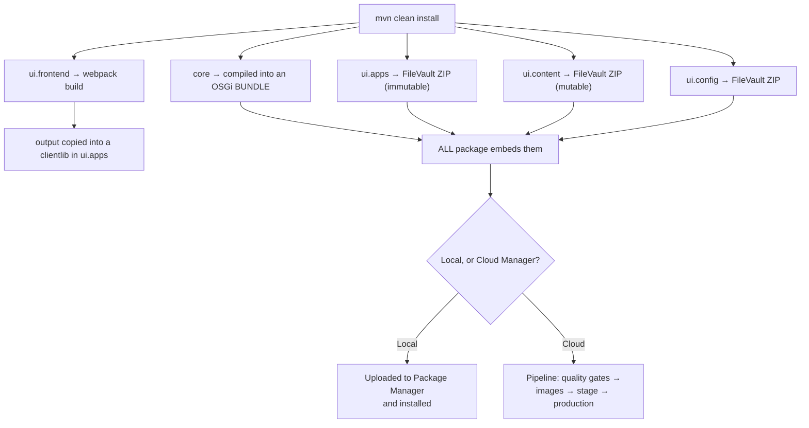
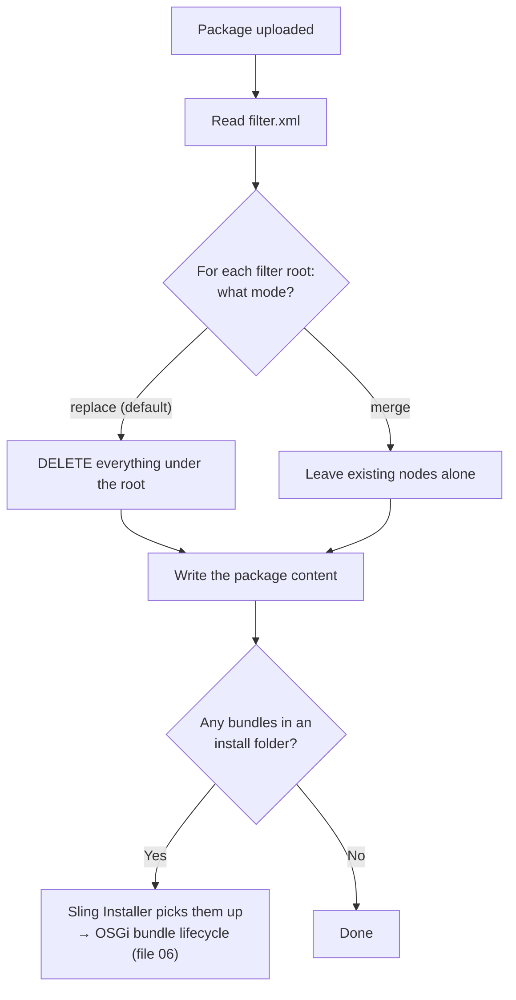

# 25 – Maven, Packages and the AEM Project Structure

> **Target:** 3–4 years experienced AEM Developer
> **Covers from your additional list:** Maven · Package Manager · Deployment process · project structure
> **Project domain:** a global energy technology company's marketing site.

---

## Before we start — the question underneath this topic

This topic has been referenced from almost every earlier file without ever being explained. `ui.apps`, `ui.content`, `ui.config`, `all`, `filter.xml`, `mode="merge"` — they've appeared in files 01, 03, 04, 06, 13 and 14 as things you should know, and this is where they get explained.

But the interview question is rarely "list the Maven modules." It's:

> **"How does your code actually get from your laptop onto a production AEM instance?"**

That's a question about the whole chain — modules, packages, filters, build, deploy. And the part that separates a good answer is understanding **why the modules are split the way they are**, because it isn't arbitrary. It follows directly from the immutable/mutable distinction in file 01:

> **`/apps` is code. `/content` and `/conf` are data. They have different lifecycles, so they ship in different packages.**

Get that, and the module structure stops being a list to memorise and becomes something you can derive.

---

## 1. Introduction

### 1.1 What a package actually is

Before Maven, the simpler concept:

> **An AEM package is a ZIP file containing repository content, plus a `filter.xml` that declares exactly which paths are included.**

That's it. It's built by a tool called **FileVault** (often abbreviated **vlt**), which serialises repository nodes into files on disk and back again.

**Two things follow from that definition, and both matter:**

**The `filter.xml` is what defines the package**, not the folder structure. You can have files sitting in your project that aren't in any filter, and they simply won't be deployed. That surprises people — "it's in my project, why isn't it on the server?"

**Installing a package writes to the repository.** It's a content operation. Which means it can overwrite things, and by default it does — section 2.4.

### 1.2 Why the project is split into modules

Here's the reasoning, and it's the answer to "why so many modules?"

**Your project contains fundamentally different kinds of thing:**

| Kind of thing | Example | Lifecycle |
|---|---|---|
| **Java code** | A Sling Model, an OSGi service | Compiled, becomes a bundle |
| **Immutable content** | Components, clientlibs, template types | Deployed, never changed at runtime |
| **Mutable content** | Pages, editable templates, policies | Changed by authors at runtime |
| **Configuration** | OSGi configs | Deployed, per run mode |
| **Front-end source** | SCSS, TypeScript | Compiled by webpack |
| **Dispatcher config** | Filter and cache rules | Deployed to the web tier |

**Those have genuinely different lifecycles**, and mixing them causes real problems. The worst one: if pages and components ship in the same package, redeploying your components would overwrite author content.

**So the modules exist to keep them apart.** Once you see it that way, the structure is obvious rather than arbitrary.

### 1.3 A real project example to adapt

> "We use the standard AEM archetype structure — `core` for the Java bundle, `ui.apps` for components and clientlibs, `ui.content` for our templates and sample content, `ui.config` for OSGi configs, `ui.frontend` as a webpack build, `dispatcher` for the web tier, and `all` as the aggregate that Cloud Manager actually deploys.
>
> The split that matters most is `ui.apps` versus `ui.content`. `ui.apps` is immutable — on Cloud Service it's baked into the container image and read-only at runtime. `ui.content` is mutable content, and every one of its filters uses `mode="merge"` so a deployment doesn't wipe the templates and policies our content leads have adjusted.
>
> Day to day I mostly deploy just the module I've changed — `-pl core` for a Java change is much faster than rebuilding everything — and only build the full `all` package when I need to verify the whole thing."

That covers the structure, the reason for the key split, and the practical workflow — three follow-ups pre-empted.

---

## 2. Core Concepts

### 2.1 The modules, and what each is for

The AEM Project Archetype generates this structure. Learn what each module *is for* rather than just its name.

```
my-project/
├── core/            Java code → an OSGi bundle
├── ui.apps/         Components, clientlibs, template types  (IMMUTABLE)
├── ui.content/      Pages, templates, policies              (MUTABLE)
├── ui.config/       OSGi configurations
├── ui.frontend/     SCSS / TypeScript, built by webpack
├── ui.tests/        UI / end-to-end tests
├── it.tests/        Integration tests
├── dispatcher/      Dispatcher configuration
├── all/             The AGGREGATE package that gets deployed
└── pom.xml          The parent POM
```

**Going through them properly:**

**`core`** — all your Java. Sling Models, OSGi services, servlets, filters, workflow process steps, job consumers. It compiles into an **OSGi bundle**, which is a JAR with the manifest headers from file 06.

**`ui.apps`** — everything under `/apps`. Components, their dialogs and HTL, clientlibs, template *types*. This is **immutable content** — on Cloud Service it's baked into the container image and read-only at runtime (file 14).

**`ui.content`** — everything under `/content` and `/conf`. Editable templates, policies, sample or initial content, Content Fragment Models. This is **mutable content**, which authors change at runtime.

**`ui.config`** — OSGi configurations, organised into run-mode folders (file 06). Technically these live under `/apps`, but the archetype separates them because configuration changes for different reasons than code does.

**`ui.frontend`** — an npm and webpack project (file 04). The front-end team works here with SCSS and TypeScript, and the build output is copied into a clientlib in `ui.apps`.

**`dispatcher`** — the dispatcher configuration (file 19). On Cloud Service this is deployed by the **web-tier pipeline**, which is much faster than a full-stack one.

**`it.tests` and `ui.tests`** — integration and UI tests, run by the Cloud Manager pipeline (file 14).

**`all`** — and this one needs explaining, because its purpose isn't obvious.

### 2.2 Why the `all` package exists

**The `all` module contains no content of its own.** It's an **aggregate** — a package whose only job is to embed the other packages.

**Why that's necessary:** Cloud Manager deploys **exactly one package**. It doesn't take a list. So something has to bundle `core`, `ui.apps`, `ui.content` and `ui.config` into a single deployable artefact, and that's `all`.

**And it does one more thing that matters:** it declares the **order** things install in, and it separates the mutable and immutable parts so the Cloud Service build validation can check them.

**The interview answer:**

> "The `all` package is an aggregate — it contains nothing itself, it just embeds the other packages. It exists because Cloud Manager deploys exactly one package rather than taking a list, so something has to bundle the bundle, the apps content, the mutable content and the configs into one artefact. It also declares the install order, and keeps the mutable and immutable parts distinguishable so the Cloud Service build validation can check that we haven't mixed them."

### 2.3 `filter.xml` — what actually defines a package

**This is the most important file in the packaging story, and the most commonly misunderstood.**

```xml
<?xml version="1.0" encoding="UTF-8"?>
<workspaceFilter version="1.0">
    <filter root="/apps/energy"/>
    <filter root="/apps/energy-vendor-packages"/>
</workspaceFilter>
```

**The filter declares which repository paths this package covers.** Not which files are in your project folder — which **paths** the package claims.

**Two consequences that catch people out:**

**A file in your project that isn't under a filter root won't be deployed.** It builds fine, it's in the JAR, and it never reaches the repository. "It works locally but not on the server" is often exactly this — locally you'd copied it manually at some point.

**A filter root claims that entire path** — which brings us to the next section, and the single most dangerous property in AEM packaging.

### 2.4 `mode="merge"` — the property that stops you destroying content

**By default, installing a package REPLACES everything under its filter root.**

Read that again, because the consequence is severe. If `ui.content` has:

```xml
<filter root="/content/energy"/>
```

then every deployment **deletes everything under `/content/energy`** and replaces it with whatever is in the package. Every page an author has created since the last release, gone.

**`mode="merge"` changes that:**

```xml
<filter root="/content/energy" mode="merge"/>
```

**With `merge`, existing content is left alone** and only nodes present in the package are added or updated.

**The filter modes:**

| Mode | Behaviour |
|---|---|
| **`replace`** (default) | **Delete everything under the root**, then install the package content |
| **`merge`** | Add and update; leave existing nodes alone |
| **`update`** | Update existing nodes, don't remove |

**The rule to state:**

> **Anything under `/content` or `/conf` must use `mode="merge"`.** Those are paths authors change. Anything under `/apps` can use the default `replace`, because that's your code and a clean replace is what you want.

**This is a genuinely good thing to raise unprompted**, because getting it wrong destroys production content and it's a mistake people only make once.

### 2.5 Filter rules — include and exclude

Filters can be more precise than a root path:

```xml
<filter root="/apps/energy">
    <exclude pattern="/apps/energy/install(/.*)?"/>
</filter>

<filter root="/content/dam/energy" mode="merge">
    <include pattern="/content/dam/energy/logos(/.*)?"/>
</filter>
```

**`exclude`** removes paths from a filter that would otherwise be covered. **`include`** narrows a filter to only matching paths.

**A practical use:** excluding an `install` folder so a nested package isn't accidentally shipped, or including only a specific asset folder rather than the whole DAM.

### 2.6 The Maven build

**Maven is the build tool.** The parent `pom.xml` declares the modules and the shared configuration; each module has its own POM.

**The commands you'll actually use** — and knowing the targeted ones is a small signal that you develop day to day rather than only building everything:

```bash
# Build and deploy EVERYTHING to a local author on 4502
mvn clean install -PautoInstallSinglePackage

# Same, but to a local publish on 4503
mvn clean install -PautoInstallSinglePackagePublish

# Deploy ONLY the Java bundle — much faster while iterating on backend code
mvn clean install -PautoInstallBundle -pl core

# Deploy ONLY ui.apps — faster while iterating on components and HTL
mvn clean install -PautoInstallPackage -pl ui.apps

# Just build, don't deploy
mvn clean install
```

**The `-pl` flag means "project list"** — build only that module. That's the difference between a fifteen-second deploy and a two-minute one, and during active development it matters a lot.

**The profiles** (`-P`) are defined in the POM and control what happens after the build — `autoInstallSinglePackage` uploads and installs the `all` package; `autoInstallBundle` uploads just the bundle.

### 2.7 Dependency scopes — the one that breaks bundles

**This is the Maven detail most likely to come up**, because getting it wrong produces a confusing OSGi failure.

AEM's APIs come from a dependency — the **`uber-jar`** on 6.5, or the **`aem-sdk-api`** on Cloud Service. And the scope you give it matters:

```xml
<dependency>
    <groupId>com.adobe.aem</groupId>
    <artifactId>aem-sdk-api</artifactId>
    <version>${aem.sdk.api}</version>
    <scope>provided</scope>   <!-- ← THIS -->
</dependency>
```

**`provided` means "this will be available at runtime; don't package it."**

**If you use `compile` instead** — the default — Maven embeds a copy of the AEM API into your bundle. Now there are two copies of the same packages in the OSGi container at potentially different versions, and your bundle's imports can't be satisfied.

**The symptom is the file 06 problem:** the bundle sits in **INSTALLED** state, never activates, and your code silently never runs.

**So the chain to be able to state:** wrong Maven scope → duplicate packages → unsatisfied `Import-Package` → bundle stuck in INSTALLED → your code never runs, with no error. That's a genuinely good answer because it connects a build-tool detail to a runtime symptom.

**The scopes worth knowing:**

| Scope | Meaning | Use for |
|---|---|---|
| **`provided`** | Available at runtime, **not packaged** | **AEM APIs, OSGi APIs, Servlet API** |
| `compile` (default) | Packaged into your bundle | Third-party libraries AEM doesn't have |
| `test` | Only on the test classpath | JUnit, Mockito, AEM Mocks |

### 2.8 Embedding third-party libraries

If your code needs a library AEM doesn't provide, you have to get it into the OSGi container.

**Two approaches:**

**Embed it in your bundle** — the library is packaged inside your JAR and its packages are private to you. Simple, and the right answer for a small utility library.

**Deploy it as its own bundle** — if the library is already an OSGi bundle, or several of your bundles need it. Cleaner, but more moving parts.

**The thing to watch:** embedding a library that AEM *already* provides at a different version causes exactly the duplicate-package problem from 2.7. Before embedding anything, it's worth checking whether AEM already exports it — `/system/console/depfinder` tells you which bundle exports a given package (file 06).

### 2.9 Package Manager

**Package Manager** at `/crx/packmgr` is the UI for uploading, installing, building and downloading packages.

**What it's genuinely useful for:**

**Building a content package** to move content between environments — export from one, install on another.

**Inspecting a package** — what filters does it have, what's actually inside it.

**Downloading** what's currently installed.

**And the important caveat:** **you can't use it to deploy on Cloud Service production.** Deployment is Cloud Manager pipelines only (file 14). Package Manager still exists on development environments, but the deployment path is closed deliberately — that's the discipline benefit from file 14, and it means production can't drift from Git.

**On 6.5 you *can* deploy via Package Manager**, and plenty of teams did. It's also exactly how production drifts from source control, which is the argument against it.

### 2.10 Content packages for moving content

A practical use worth knowing, and it comes up as a scenario question.

**Moving content from production to a lower environment** for debugging:

1. Build a package on production with a filter covering just the paths you need
2. Download it
3. Install it on the lower environment

**Three things to be careful about:**

**Filter precisely.** A filter of `/content` on a large site produces an enormous package.

**Exclude what you shouldn't copy** — `/home` (users and their data), anything containing credentials, and personal data. This is a genuine data-protection concern, not just tidiness.

**Watch for `mode="replace"`** — installing a content package on the target will replace what's there unless you set merge.

**On Cloud Service** there's a Content Copy feature in Cloud Manager for exactly this, which is safer than hand-built packages.

### 2.11 The mutable/immutable split on Cloud Service

**This is where the module structure becomes mandatory rather than good practice** (file 14).

On Cloud Service, the build **validates** that packages don't mix mutable and immutable content. If `ui.apps` contains anything under `/content`, or `ui.content` contains anything under `/apps`, **the build fails**.

**Which is why the split exists as a hard rule:**

| Package | Contains | Paths |
|---|---|---|
| **`ui.apps`** | **Immutable** — code | `/apps` |
| **`ui.content`** | **Mutable** — data | `/content`, `/conf` |
| **`ui.config`** | OSGi configs | `/apps/<project>/osgiconfig` |

**A common migration finding** is a project where components and sample content shipped together in one package, which worked fine on 6.5 and fails validation on Cloud Service. That's what the **Repository Modernizer** tool restructures (file 14).

---

## 3. Internal Working

### 3.1 From your laptop to the repository



**Two things worth drawing out:**

**`ui.frontend` builds first**, and its output lands in `ui.apps` before that package is assembled. That's why editing the generated `css.txt` by hand gets overwritten (file 04) — the build regenerates it every time.

**The bundle is embedded in the package.** Your Java doesn't deploy separately; it's inside `ui.apps` (or `all`) in an `install` folder, and the Sling Installer picks it up.

### 3.2 How a package installs



**The left branch is the dangerous one**, and it's why `mode="merge"` matters so much on content paths. A default-mode filter on `/content/energy` deletes every page authors created since the last release, and the package installs successfully — no error, because it did exactly what it was told.

### 3.3 The Sling Installer

Worth knowing because it explains how a bundle inside a content package becomes a running bundle.

**The Sling Installer watches `/apps/**/install` and `/libs/**/install`.** When a JAR or a `.cfg.json` appears there, it picks it up — installing bundles and applying configurations.

**Which is why:** your compiled bundle ends up in an `install` folder inside the package, and OSGi configurations end up in `config.<runmode>` folders. The installer handles both, and everything from file 06's bundle lifecycle takes over from there.

---

## 4. Important Interview Questions

### 4.1 Basic

**Q1. What is an AEM package?**
A ZIP built by FileVault containing repository content, plus a `filter.xml` declaring which paths it covers. Installing it writes to the repository.

*Cross:* What defines what's in it? (**the filter, not the folder structure**) · What's FileVault? · Can a package contain a bundle? (yes — in an `install` folder)

**Q2. Describe the AEM Maven project structure.**
`core` for Java, `ui.apps` for immutable content, `ui.content` for mutable content, `ui.config` for OSGi configs, `ui.frontend` for the webpack build, `dispatcher` for the web tier, `it.tests` and `ui.tests` for tests, and `all` as the aggregate that's actually deployed.

*Cross:* Why so many? (**different kinds of thing with different lifecycles**) · What's in `all`? (nothing of its own — it embeds the others) · Why does `all` exist?

**Q3. Why does the `all` package exist?**
Cloud Manager deploys exactly one package rather than taking a list, so something has to bundle everything into one artefact. It also declares install order and keeps the mutable and immutable parts distinguishable for build validation.

*Cross:* Does it contain content? (**no — it's an aggregate**) · What order do things install in? · What happens on a local build?

**Q4. What's the difference between `ui.apps` and `ui.content`?**
`ui.apps` is **immutable** — code under `/apps`, read-only at runtime on Cloud Service. `ui.content` is **mutable** — pages, templates and policies under `/content` and `/conf` that authors change.

*Cross:* What happens if you mix them? (**the Cloud Service build fails validation**) · Which needs `mode="merge"`? (**`ui.content`**) · Why does the distinction exist?

**Q5. What is `filter.xml` and why does it matter?**
It declares which repository paths the package covers. It's what actually defines the package — a file in your project that isn't under a filter root simply won't be deployed.

*Cross:* What's the symptom of a missing filter? ("works locally, not on the server") · What are include and exclude patterns for? · What's the default mode?

**Q6. What does `mode="merge"` do?**
By default, installing a package **replaces everything** under its filter root. With `merge`, existing content is left alone and only package nodes are added or updated.

*Cross:* **What happens without it on `/content`?** (**every page authors created since the last release is deleted**) · Which paths need it? (`/content`, `/conf`) · Which don't? (`/apps` — a clean replace is what you want for code)

**Q7. What Maven commands do you use?**
`mvn clean install -PautoInstallSinglePackage` for everything to a local author, and `-PautoInstallBundle -pl core` for just the Java bundle, which is much faster while iterating.

*Cross:* What does `-pl` do? (project list — build one module) · What's a profile? · How do you deploy to publish? (`-PautoInstallSinglePackagePublish`)

**Q8. What scope should the AEM API dependency have?**
**`provided`.** It's available at runtime and must not be packaged into your bundle.

*Cross:* **What breaks with `compile`?** (a duplicate copy of the API → unsatisfied imports → **bundle stuck in INSTALLED**) · What's the dependency called? (`uber-jar` on 6.5, `aem-sdk-api` on Cloud Service) · What scope for JUnit? (`test`)

**Q9. What is Package Manager and what can't you do with it?**
The UI at `/crx/packmgr` for uploading, building, installing and downloading packages. **You can't deploy to Cloud Service production with it** — that's Cloud Manager pipelines only.

*Cross:* Why is that restriction good? (**production can't drift from Git**) · Is it available at all on Cloud Service? (on development environments) · What is it useful for? (moving content, inspecting packages)

**Q10. How do you move content between environments?**
Build a content package with a precise filter, download it, install it on the target. Be careful to exclude `/home` and anything containing personal data, and set `mode="merge"` so you don't replace what's there.

*Cross:* What's the Cloud Service equivalent? (**Content Copy in Cloud Manager**) · What goes wrong with a `/content` filter? (an enormous package) · What's the data-protection concern?

### 4.2 Intermediate

**Q11. Your bundle is stuck in INSTALLED after a deployment. What's the Maven cause?**
Very often a dependency with `compile` scope instead of `provided` — so a duplicate copy of an API AEM already exports is embedded in your bundle, and the imports can't be satisfied. `/system/console/bundles` shows which import is unsatisfied.

*Cross:* What else causes it? (a version range mismatch after an upgrade, or a third-party library that was never embedded) · How do you find who exports a package? (`/system/console/depfinder`) · Why is it silent? (**the component never activates, so nothing throws**)

**Q12. A file is in your project but isn't on the server. Why?**
It isn't under any filter root, so it was never in the package. It builds fine and simply doesn't deploy.

*Cross:* How would you confirm? (inspect the built package, or check `filter.xml`) · Why does it work locally? (**someone copied it manually at some point**) · How do you avoid it? (review the filter when adding a path)

**Q13. Why can't `ui.apps` contain `/content`?**
Because they have different lifecycles — code is immutable, content is mutable — and on Cloud Service the build **validates** the separation and fails if they're mixed. It's enforced rather than advisory.

*Cross:* What was the 6.5 situation? (it worked, which is why migrations find this) · What tool restructures it? (**Repository Modernizer**) · Where does sample content go? (`ui.content`)

**Q14. How does your compiled Java get into AEM?**
The bundle is embedded in a content package, in an `install` folder. The **Sling Installer** watches those folders, picks up the JAR, and hands it to OSGi — from there the bundle lifecycle from file 06 takes over.

*Cross:* Where do OSGi configs go? (`config.<runmode>` folders, also picked up by the installer) · Does the bundle deploy separately? (no — it's inside the package) · What's the run-mode folder naming?

**Q15. How do you embed a third-party library?**
Either embed it in your bundle, so its packages are private to you, or deploy it as its own bundle if it's already OSGi-ready or several bundles need it.

*Cross:* **What's the risk?** (embedding something AEM already provides at a different version → duplicate packages → unsatisfied imports) · How do you check? (`/system/console/depfinder`) · Which would you prefer for a small utility? (embed it)

**Q16. What are the include and exclude patterns in a filter for?**
To narrow or carve out paths within a filter root — excluding an `install` folder, or including only a specific asset folder rather than the whole DAM.

*Cross:* Give a real use · Does an exclude affect the merge mode? · What's the risk of a broad filter? (a huge package, or replacing more than you intended)

**Q17. What's the practical difference between deploying `all` and deploying one module?**
`all` rebuilds and redeploys everything, which is slower but complete. `-pl core` deploys only the Java bundle, which during active backend development is the difference between a fifteen-second cycle and a two-minute one.

*Cross:* When would you use each? (targeted while iterating, `all` to verify) · What's the risk of always deploying one module? (**your local state diverges from a clean install**) · How often would you do a clean full build?

**Q18. How does `ui.frontend` fit in?**
It's an npm and webpack project where the front-end code actually lives. The build compiles it and copies the output into a clientlib in `ui.apps` — which is why `css.txt` and `js.txt` are generated there, and editing them by hand gets overwritten (file 04).

*Cross:* Why separate it? (the front-end team gets modern tooling and doesn't need a running AEM instance) · What's `aem-clientlib-generator`? · Which pipeline deploys it on Cloud Service? (there's a front-end pipeline — file 14)

### 4.3 Advanced

**Q19. Walk me through how a change gets from your laptop to production.**

> "Locally, `mvn clean install` builds each module — `core` compiles to an OSGi bundle, `ui.frontend` runs webpack and its output lands in a clientlib inside `ui.apps`, and the content modules are serialised into FileVault packages. The `all` module embeds them all into one artefact.
>
> While developing I mostly deploy targeted — `-PautoInstallBundle -pl core` for a Java change, because rebuilding everything for a one-line change is a waste of a minute. I'd do a full `all` build before pushing, to make sure nothing works only because of state left over from a previous partial deploy.
>
> Then it's committed and pushed to the **Cloud Manager Git repository**, and a pipeline runs (file 14): build, code quality gates with SonarQube and OakPAL, security testing, container images, deploy to stage, functional and UI tests, and finally a rolling deployment to production with no publish downtime.
>
> **There's no route around that.** Package Manager can't deploy to Cloud Service production, deliberately — which is slower for an emergency but means production can't drift from what's in Git. On 6.5 you could deploy a package by hand at 2am, and that's exactly how you end up with a running system nobody can reproduce."

*Cross:* How long does the pipeline take? · What blocks it? · What would you do in an emergency? (feature flags and the config pipeline — file 14)

**Q20. Design the package structure for a multi-brand site.**

> "The split by *kind of thing* stays the same — code, immutable content, mutable content, config. The question is whether brands need separate packages within that.
>
> If the brands share a codebase, which is the whole point of running them on one AEM (file 12), then `core` and `ui.apps` stay shared — one set of components. What differs per brand is under `/conf` and `/content`, which is `ui.content`.
>
> I'd consider splitting `ui.content` per brand, so `ui.content.brandA` and `ui.content.brandB`, if brands are deployed on different schedules or owned by different teams. That lets you ship one brand's template change without touching another's.
>
> **What I'd avoid is splitting `ui.apps` per brand**, because that's how you end up with three copies of a component that drift apart — which is the exact problem MSM and shared codebases exist to prevent.
>
> And every content filter uses `mode="merge"`, per brand, without exception."

*Cross:* What if one brand needs a component the others don't? (a component in the shared `ui.apps`, allowed only by that brand's policy — file 03) · How do you handle brand-specific config? (run modes don't cover brands — that's context-aware config, file 03) · When would you use separate AEM instances?

**Q21. What are the risks in your deployment process, and how do you mitigate them?**

> "The one that has actually destroyed content is **a content filter without `mode="merge"`**. It installs successfully and silently deletes everything authors created under that root since the last release. Mitigation is a rule that every `/content` and `/conf` filter has merge, checked in review — and it's worth checking explicitly, because the failure is a successful-looking deployment.
>
> Second is **package structure violations** — mixing mutable and immutable content. On Cloud Service the build catches it, which is a benefit of the constraint.
>
> Third is **Maven scope**, where `compile` instead of `provided` on an AEM API gives you a bundle stuck in INSTALLED and code that silently never runs.
>
> Fourth is **partial deploys masking problems** — if I've only ever deployed `-pl core`, my local instance may work because of leftover state from an earlier full deploy. So a clean full build before pushing.
>
> And fifth, more process than technical: **anything created by hand doesn't exist on the next environment**. A user created in the UI, a config set in the Felix console, a node added in CRXDE — none of it is in Git, so it exists on one environment and nowhere else. That's the file 13 lesson, and the fix is that everything goes through code."

*Cross:* How would you catch the merge problem before production? (a lower environment with real author content) · What's your rollback? (another pipeline run — which is also slow) · Have you seen content lost this way?

---

## 5. Cross Questions — how this topic gets drilled

**Thread A — from "describe the project structure"**
Why so many modules? → What's in each? → Why does `all` exist? → What's the difference between `ui.apps` and `ui.content`? → What happens if you mix them? → Which needs `mode="merge"`?

**Thread B — from "what's `filter.xml`"**
What does it define? → What if a file isn't under a filter? → What's the default mode? → **What does that do to `/content`?** → What's `merge`? → Which paths need it?

**Thread C — from "your bundle is stuck in INSTALLED"**
What does that mean? → What's the Maven cause? → What scope should AEM APIs have? → What does `compile` do? → How do you find who exports a package? → Why is the failure silent?

**Thread D — from "how do you deploy"**
Locally? → To production? → Can you use Package Manager? → **Why not?** → What if it's an emergency? → What does the pipeline do?

---

## 6. Best Interview Answers

### 6.1 "Describe the AEM project structure" — about 90 seconds

> "The archetype generates a multi-module Maven project, and the reason for the split is that the project contains genuinely different kinds of thing with different lifecycles.
>
> **`core`** is all the Java — Sling Models, OSGi services, servlets — and it compiles into an OSGi bundle. **`ui.apps`** is everything under `/apps`: components, dialogs, HTL, clientlibs, template types. That's **immutable content** — on Cloud Service it's baked into the container image and read-only at runtime. **`ui.content`** is everything under `/content` and `/conf`: editable templates, policies, sample content. That's **mutable** — authors change it. **`ui.config`** holds OSGi configurations in run-mode folders. **`ui.frontend`** is a webpack project where the front-end code lives, and its output gets copied into a clientlib in `ui.apps`. Then `dispatcher` for the web tier, `it.tests` and `ui.tests`, and **`all`**.
>
> `all` is worth explaining because its purpose isn't obvious — it contains nothing of its own. It's an **aggregate** that embeds the other packages, and it exists because Cloud Manager deploys exactly one package rather than taking a list.
>
> The split that matters most is `ui.apps` versus `ui.content`, because on Cloud Service the build actually **validates** it — mix mutable and immutable content in one package and the build fails. That's enforced rather than advisory, and it's a common migration finding, because on 6.5 shipping components and sample content together worked fine."

### 6.2 "What does `mode="merge"` do, and why does it matter?" — about 60 seconds

> "By default, installing a package **replaces everything** under its filter root. So if `ui.content` has a filter on `/content/energy` without a mode, then every deployment deletes everything under that path and replaces it with what's in the package — every page authors have created since the last release, gone.
>
> `mode="merge"` changes that: existing nodes are left alone, and only nodes in the package are added or updated.
>
> The rule I'd apply is that anything under `/content` or `/conf` needs merge, without exception, because those are paths authors change. Anything under `/apps` can use the default replace, because that's our code and a clean replace is exactly what we want.
>
> What makes it dangerous is that the failure looks like success. The package installs cleanly, there's no error, and the deployment reports as fine — because it did exactly what it was told. You find out when someone asks where their pages went. So it's worth checking explicitly in review rather than assuming."

---

## 7. Real Project Examples

### Story 1 — The deployment that deleted a week of content

**What happened.** A release went out on a Friday afternoon. On Monday, the content team reported that roughly a week of new product pages had vanished from the author instance.

**The cause.** A new filter had been added to `ui.content` to ship some sample content, and it covered `/content/energy` — **without `mode="merge"`**. So the deployment did exactly what a default-mode filter does: deleted everything under that root and replaced it with the handful of sample pages in the package.

**Why nobody caught it.** The deployment succeeded. There was no error, no warning, nothing in any log suggesting a problem — because nothing had gone wrong from the package's point of view. It performed a correct replace.

**And it hadn't shown up in testing** because the lower environments had almost no author-created content. A replace of nearly-empty content looks identical to a successful install.

**The recovery.** Restoring from a backup, and losing some work that had happened after the backup.

**What we changed.** A review rule that every `/content` and `/conf` filter has `mode="merge"`, checked explicitly rather than assumed. And we made sure at least one lower environment carries realistic author-created content, so a destructive filter has something to destroy where it's safe.

**The lesson to state:** *"A successful deployment that quietly deleted content is worse than a failed one, because nothing tells you. `mode="merge"` on content paths is the single most important line in a filter file."*

### Story 2 — The bundle that never activated

**What happened.** A new integration was deployed. The build passed, the package installed, and the feature did nothing. No errors anywhere.

**The investigation.** `/system/console/bundles` showed the bundle in **INSTALLED** state rather than ACTIVE, with an unsatisfied import highlighted.

**The cause.** A developer had added a dependency for an HTTP client library and given it the default `compile` scope. AEM already provided that library at a different version, so the bundle contained a duplicate copy of those packages, and the version ranges couldn't be satisfied.

**The chain worth being able to explain:** wrong Maven scope → duplicate packages in the container → unsatisfied `Import-Package` → bundle stuck in INSTALLED → the component never activates → code silently never runs, with no exception anywhere.

**The fix.** Removing the dependency, since AEM already provided it. `/system/console/depfinder` confirmed which bundle exported those packages.

**What we changed.** Before adding any dependency, check whether AEM already provides it. And AEM APIs always get `provided` scope — that one's a review checklist item now.

**The lesson:** *"A Maven scope is a build-tool detail with a runtime consequence, and the runtime consequence is completely silent. It's worth knowing the whole chain, because 'my feature doesn't work and there are no errors' points straight at it."*

### Story 3 — The file that was in the project and not on the server

**What happened.** A component worked perfectly locally and rendered unstyled on stage. The clientlib was in the project, the category was right, and `allowProxy` was set correctly (file 04).

**The cause.** The clientlib folder was under a path that no filter in `ui.apps` covered. So it built fine, it just wasn't in the package.

**Why it worked locally.** The developer had copied it into their local instance manually while first setting it up, weeks earlier, and forgotten. From then on their local instance had it and no build ever needed to deliver it.

**How we found it.** Downloading the built package and looking inside — which is the check worth knowing: **inspect the artefact, not the project folder.** The project folder tells you what you wrote; the package tells you what will actually deploy.

**The lesson to state:** *"'Works locally' can mean 'my local instance has something the build never put there.' When something is missing on a server, I check the built package before I check the code."*

---

## 8. Configuration Examples

### 8.1 `ui.apps` filter — immutable content

`ui.apps/src/main/content/META-INF/vault/filter.xml`

```xml
<?xml version="1.0" encoding="UTF-8"?>
<workspaceFilter version="1.0">

    <!-- IMMUTABLE content: our code.
         No mode attribute, so the default 'replace' applies -- and
         that is exactly what we want here. A clean replace means the
         deployed state matches the build exactly, with no leftovers
         from a previous release.

         NOTE: nothing under /content or /conf may appear in this
         package. On Cloud Service the build VALIDATES that and fails
         if mutable and immutable content are mixed. -->
    <filter root="/apps/energy"/>

    <!-- Third-party packages embedded in the build -->
    <filter root="/apps/energy-vendor-packages"/>

    <!-- Oak index definitions are immutable -->
    <filter root="/oak:index/energy-products-custom-1"/>

</workspaceFilter>
```

### 8.2 `ui.content` filter — mutable content

`ui.content/src/main/content/META-INF/vault/filter.xml`

```xml
<?xml version="1.0" encoding="UTF-8"?>
<workspaceFilter version="1.0">

    <!-- MUTABLE content: things AUTHORS change.
         mode="merge" IS NOT OPTIONAL HERE.
         Without it, every deployment DELETES everything under this
         root and replaces it with what is in the package -- which
         means every page authored since the last release.
         The package installs SUCCESSFULLY while doing it, so there
         is no error and nothing in any log. -->
    <filter root="/content/energy" mode="merge"/>

    <!-- Editable templates, policies, Content Fragment Models.
         Template authors adjust these at runtime (file 03), so the
         same rule applies. -->
    <filter root="/conf/energy" mode="merge"/>

    <!-- Only the brand asset folder, not the whole DAM -->
    <filter root="/content/dam/energy" mode="merge">
        <include pattern="/content/dam/energy/brand(/.*)?"/>
    </filter>

    <!-- Experience Fragments are pages under their own root (file 16) -->
    <filter root="/content/experience-fragments/energy" mode="merge"/>

</workspaceFilter>
```

**The `mode="merge"` comment is the thing to be able to explain**, and it's story 1.

### 8.3 The AEM API dependency

`core/pom.xml`

```xml
<dependencies>

    <!-- The AEM API.
         SCOPE MUST BE 'provided'. It is available at runtime and must
         NOT be packaged into our bundle.

         With the default 'compile' scope, Maven embeds a copy of the
         AEM API into our JAR. There are then two copies of the same
         packages in the OSGi container at potentially different
         versions, our Import-Package cannot be satisfied, and the
         bundle sits in INSTALLED state and never activates -- with
         no exception anywhere (file 06). -->
    <dependency>
        <groupId>com.adobe.aem</groupId>
        <artifactId>aem-sdk-api</artifactId>
        <scope>provided</scope>
    </dependency>

    <!-- Test-only: never packaged -->
    <dependency>
        <groupId>org.junit.jupiter</groupId>
        <artifactId>junit-jupiter</artifactId>
        <scope>test</scope>
    </dependency>
    <dependency>
        <groupId>io.wcm</groupId>
        <artifactId>io.wcm.testing.aem-mock.junit5</artifactId>
        <scope>test</scope>
    </dependency>
    <dependency>
        <groupId>org.mockito</groupId>
        <artifactId>mockito-core</artifactId>
        <scope>test</scope>
    </dependency>

</dependencies>
```

### 8.4 The commands worth memorising

```bash
# ---------- FULL BUILD AND DEPLOY ----------

# Everything → local AUTHOR on 4502
mvn clean install -PautoInstallSinglePackage

# Everything → local PUBLISH on 4503
mvn clean install -PautoInstallSinglePackagePublish


# ---------- TARGETED (what you actually use all day) ----------

# Only the Java bundle. Seconds rather than minutes.
mvn clean install -PautoInstallBundle -pl core

# Only ui.apps -- components, HTL, clientlibs
mvn clean install -PautoInstallPackage -pl ui.apps

# Only ui.content -- templates, policies
mvn clean install -PautoInstallPackage -pl ui.content


# ---------- BUILD WITHOUT DEPLOYING ----------
mvn clean install

# Skip tests (for a quick local check only -- never in CI)
mvn clean install -DskipTests


# ---------- CREATE A NEW PROJECT ----------
mvn -B org.apache.maven.plugins:maven-archetype-plugin:3.2.1:generate \
  -D archetypeGroupId=com.adobe.aem \
  -D archetypeArtifactId=aem-project-archetype \
  -D archetypeVersion=48 \
  -D appTitle="Energy Sites" \
  -D appId="energy" \
  -D groupId="com.energy" \
  -D aemVersion="cloud"
```

**`-pl` is the flag worth knowing** — it means "project list", building only that module. During active development that's the difference between a fifteen-second cycle and a two-minute one, and knowing it is a small signal that you develop day to day.

### 8.5 A content package filter for moving content between environments

```xml
<?xml version="1.0" encoding="UTF-8"?>
<workspaceFilter version="1.0">

    <!-- Precise. A filter of /content on a large site produces an
         enormous package that may not even install. -->
    <filter root="/content/energy/de/de/products" mode="merge"/>

    <!-- Only the assets these pages actually reference -->
    <filter root="/content/dam/energy/products/transformers" mode="merge"/>

    <!-- Content Fragments are ASSETS in the DAM (file 15), so they
         need their own filter -- they are NOT included by publishing
         or packaging the pages that reference them. -->
    <filter root="/content/dam/energy/fragments/products" mode="merge"/>

    <!-- DELIBERATELY NOT INCLUDED:
           /home            users, groups, and personal data
           /conf            unless the config genuinely needs moving
           anything with credentials

         This is a data-protection concern, not just tidiness. -->

</workspaceFilter>
```

**The Content Fragment filter is the detail worth pointing at** — it's the same trap as file 15 and file 18. Fragments are separate assets, so packaging the pages that reference them doesn't include them, exactly as publishing the pages doesn't publish them.

---

## 9. Common Mistakes

| The mistake | What actually happens | The fix |
|---|---|---|
| **No `mode="merge"` on a content filter** | **Deployment silently DELETES author content** and reports success | `mode="merge"` on every `/content` and `/conf` filter |
| `compile` scope on an AEM API | Duplicate packages → **bundle stuck in INSTALLED**, code silently never runs | `provided` |
| A file not under any filter root | Builds fine, never deploys — "works locally" | Check the filter when adding a path |
| Mixing `/apps` and `/content` in one package | **Cloud Service build validation fails** | Split into `ui.apps` and `ui.content` |
| Embedding a library AEM already provides | Same duplicate-package problem | Check `/system/console/depfinder` first |
| A `/content` filter that's too broad | An enormous package that may not install | Filter precisely |
| Including `/home` in a content package | **Copies users and personal data between environments** | Exclude it, always |
| Only ever deploying one module | Local state diverges from a clean install | Full build before pushing |
| Editing generated `css.txt` / `js.txt` | Overwritten by the next `ui.frontend` build | Change the webpack config (file 04) |
| Deploying via Package Manager on 6.5 production | **Production drifts from Git** | Pipeline, even where it's technically possible |
| Assuming packaging pages includes their fragments | Fragments are separate assets | Their own filter |
| Forgetting Oak index definitions in the filter | Indexes never deploy; queries traverse | Include the index path |
| `-DskipTests` in CI | Tests stop protecting you | Local quick checks only |

---

## 10. Best Practices

**On filters.** `mode="merge"` on every `/content` and `/conf` filter, without exception, checked in review rather than assumed. Filter precisely. Never include `/home`.

**On modules.** Keep the mutable/immutable split clean — it's enforced on Cloud Service anyway, and it's right on 6.5 too. Don't split `ui.apps` per brand; share the code and differentiate through policies and configuration.

**On dependencies.** `provided` for AEM APIs, `test` for test libraries, `compile` only for third-party libraries AEM genuinely doesn't have. Check `depfinder` before embedding anything.

**On the build.** Deploy targeted while iterating, full build before pushing. Never skip tests in CI.

**On deployment.** Pipeline only, even where a manual route technically exists. Anything created by hand doesn't exist on the next environment — that's the file 13 and 14 lesson, and packaging is where it bites.

---

## 11. Debugging Tips

**"It works locally but not on the server."** This is the signature packaging problem, and the check is: **inspect the built package, not the project folder.** Download the artefact from Package Manager, open it, and see whether the file is actually there. The project folder tells you what you wrote; the package tells you what deploys.

**"My bundle isn't active."** `/system/console/bundles` — INSTALLED means an unsatisfied import, which very often traces back to a Maven scope. `/system/console/depfinder` tells you which bundle exports a given package.

**"Content disappeared after a deployment."** A filter without `mode="merge"`. Check the filter file for the affected path, and check whether the deployment reported success — it will have.

**"The configuration isn't applying."** Check the run-mode folder name and the file name against the component PID (file 06), and confirm the file is actually under a filter root.

| Tool | Answers |
|---|---|
| `/crx/packmgr` | What's installed; download and inspect a package |
| Package Manager → the package's filters | What paths does it actually claim |
| `/system/console/bundles` | Is the bundle ACTIVE, and which import is unsatisfied |
| `/system/console/depfinder` | Which bundle exports this package |
| `/system/console/configMgr` | What configuration values are actually in effect |
| The built artefact in `all/target/` | What the build actually produced |

---

## 12. Performance Notes

**Build time is developer time.** Targeted deploys with `-pl` are the single biggest saving during active development.

**Package size matters for install time.** A content package covering a large subtree takes real time to install and can time out. Filter precisely.

**A large content package on production** is an operation, not a background task — it writes a lot of nodes and competes with authoring.

**The Cloud Manager pipeline duration** is dominated by the quality gates and stage tests, not the build. Which is why the faster pipeline types exist (file 14) — a dispatcher rule change doesn't need the full cycle.

---

## 13. Real Production Scenarios

**1. Author content deleted after a deployment.** A content filter without `mode="merge"`. The deployment reported success.

**2. Bundle stuck in INSTALLED.** A Maven scope problem — `compile` where `provided` was needed.

**3. A file is in the project and not on the server.** Not under any filter root.

**4. Works locally only.** The local instance has something copied by hand that the build never delivered.

**5. Cloud Service build fails on package structure.** Mutable and immutable content mixed.

**6. Configuration deployed but never applied.** Wrong run-mode folder, wrong PID filename, or not under a filter.

**7. Clientlib missing after deployment.** Not covered by a filter root.

**8. Content package won't install — too large.** Filter too broad.

**9. Users appeared on a lower environment.** `/home` included in a content package.

**10. Generated `js.txt` change keeps reverting.** `ui.frontend` regenerates it on every build.

**11. Content Fragments missing after a content copy.** They're separate assets and need their own filter.

**12. Search broken after a content migration.** Oak index definitions weren't in the package, so they never deployed.

**13. Production has something not in Git.** Deployed by hand via Package Manager on 6.5.

**14. A dependency upgrade broke the bundle.** Version ranges no longer satisfied after an AEM upgrade.

**15. Local instance behaves differently from a colleague's.** Both have accumulated different manual state from partial deploys.

---

## 14. Follow-up Questions

- What does your project structure look like?
- How do you deploy locally?
- How does a change reach production?
- Have you ever lost content in a deployment?
- What scope do you use for the AEM API, and why?
- How do you move content between environments?
- Do you split packages per brand or per feature?
- **What would you change about your build or deployment process?**

For the last: *"Our lower environments have almost no realistic author content, so a destructive filter has nothing to destroy there and reaches production before anyone notices. I'd want one environment carrying a real content copy specifically so that class of mistake fails somewhere safe."*

---

## 15. Comparison Tables

**The modules**

| Module | Contains | Mutable? | Notes |
|---|---|---|---|
| `core` | Java | — | Compiles to an OSGi bundle |
| **`ui.apps`** | `/apps` — components, clientlibs | **Immutable** | Read-only at runtime on cloud |
| **`ui.content`** | `/content`, `/conf` | **Mutable** | **Needs `mode="merge"`** |
| `ui.config` | OSGi configs | — | Run-mode folders |
| `ui.frontend` | SCSS, TS | — | Webpack; output → `ui.apps` |
| `dispatcher` | Web tier config | — | Web-tier pipeline |
| `it.tests` / `ui.tests` | Tests | — | Run by the pipeline |
| **`all`** | **Nothing** | — | **Aggregate — embeds the rest** |

**Filter modes**

| Mode | Behaviour | Use for |
|---|---|---|
| **`replace`** (default) | **Deletes everything under the root first** | `/apps` — your code |
| **`merge`** | Adds and updates; leaves existing alone | **`/content`, `/conf`** |
| `update` | Updates existing, doesn't remove | Rare |

**Maven scopes**

| Scope | Packaged? | Use for |
|---|---|---|
| **`provided`** | **No** | **AEM APIs, OSGi APIs** |
| `compile` (default) | **Yes** | Libraries AEM doesn't have |
| `test` | No | JUnit, Mockito, AEM Mocks |

**Deployment routes**

| Route | 6.5 | Cloud Service |
|---|---|---|
| Maven profile (local) | Yes | Yes (local SDK) |
| Package Manager | Yes — **and that's how drift happens** | **Dev environments only** |
| Cloud Manager pipeline | — | **The only route to production** |
| RDE | — | Seconds, dev iteration (file 14) |

---

## 16. Memory Tricks

**The split:** *"Code is immutable, content is mutable — different packages."*

**The dangerous default:** *"Replace is the default, and replace means delete."*

**The rule:** *"Merge on content, always."*

**Maven scope:** *"Provided means AEM already has it."*

**The scope consequence:** *"Compile scope, stuck bundle."*

**`all`:** *"The aggregate contains nothing — it just carries the others."*

**Filters:** *"The filter defines the package, not the folder."*

**Debugging:** *"Inspect the artefact, not the project."*

**Fast iteration:** *"`-pl core` while you work; full build before you push."*

---

## 17. Revision Notes

- An **AEM package** is a FileVault ZIP of repository content plus a **`filter.xml`** declaring which paths it covers. **The filter defines the package**, not the folder structure — a file not under a filter root builds fine and never deploys.
- **Modules:** `core` (Java → OSGi bundle) · **`ui.apps`** (`/apps` — **immutable**) · **`ui.content`** (`/content`, `/conf` — **mutable**) · `ui.config` (OSGi configs, run-mode folders) · `ui.frontend` (webpack → clientlib in `ui.apps`) · `dispatcher` · `it.tests`/`ui.tests` · **`all`**.
- **`all` contains nothing of its own** — it's an **aggregate** embedding the others, because Cloud Manager deploys **exactly one package**.
- **`mode="merge"` is mandatory on `/content` and `/conf`.** The default is **replace**, which **DELETES everything under the root** and installs successfully while doing it — no error, nothing in any log.
- `/apps` filters can use the default replace, because a clean replace of code is what you want.
- **Maven scope:** **`provided`** for AEM APIs (`uber-jar` on 6.5, `aem-sdk-api` on cloud). **`compile` embeds a duplicate → unsatisfied `Import-Package` → bundle stuck in INSTALLED → code silently never runs** (file 06). `test` for test libraries.
- Before embedding a third-party library, check **`/system/console/depfinder`** for whether AEM already exports it.
- **Commands:** `-PautoInstallSinglePackage` (everything → 4502) · `-PautoInstallSinglePackagePublish` (→ 4503) · **`-PautoInstallBundle -pl core`** (just the Java, seconds not minutes) · `-PautoInstallPackage -pl ui.apps`.
- **Cloud Service validates the mutable/immutable split** — mixing them **fails the build**. Repository Modernizer restructures legacy projects (file 14).
- The **Sling Installer** watches `/apps/**/install` — that's how a bundle inside a content package becomes a running bundle.
- **Package Manager cannot deploy to Cloud Service production.** Deliberate — production can't drift from Git.
- **Moving content:** filter precisely, `mode="merge"`, **exclude `/home`** and anything personal. **Content Fragments need their own filter** — packaging pages doesn't include them.
- **Debug "works locally":** inspect the **built package**, not the project folder.

---

## 18. Cheat Sheet

**Structure**
```
core/          Java → OSGi bundle
ui.apps/       /apps          IMMUTABLE   (default replace is fine)
ui.content/    /content /conf MUTABLE     (mode="merge" REQUIRED)
ui.config/     OSGi configs, config.<runmode>/
ui.frontend/   webpack → clientlib in ui.apps
dispatcher/    web tier
it.tests/ ui.tests/
all/           AGGREGATE — embeds the rest, deployed as ONE package
```

**filter.xml**
```xml
<!-- code: replace is fine -->
<filter root="/apps/energy"/>

<!-- content: MERGE OR YOU DELETE AUTHOR CONTENT -->
<filter root="/content/energy" mode="merge"/>
<filter root="/conf/energy" mode="merge"/>

<!-- narrowing -->
<filter root="/content/dam/energy" mode="merge">
    <include pattern="/content/dam/energy/brand(/.*)?"/>
</filter>
<filter root="/apps/energy">
    <exclude pattern="/apps/energy/install(/.*)?"/>
</filter>

modes: replace (DEFAULT — deletes first) | merge | update
```

**Maven scopes**
```xml
<scope>provided</scope>   AEM APIs — NOT packaged
<scope>compile</scope>    default — PACKAGED (duplicate risk)
<scope>test</scope>       JUnit, Mockito, AEM Mocks
```

**Commands**
```bash
mvn clean install -PautoInstallSinglePackage          # all → 4502
mvn clean install -PautoInstallSinglePackagePublish   # all → 4503
mvn clean install -PautoInstallBundle -pl core        # JAVA ONLY, fast
mvn clean install -PautoInstallPackage -pl ui.apps    # ui.apps only
mvn clean install                                     # build, don't deploy
```

**Debug**
```
Works locally, not on the server  → inspect the BUILT PACKAGE
Bundle INSTALLED                  → Maven scope; /system/console/bundles
Who exports this package?         → /system/console/depfinder
Content vanished                  → a filter without mode="merge"
Config not applied                → run-mode folder, PID filename, filter
```

---

## 19. Frequently Forgotten Things

1. **The default filter mode is `replace`, and replace means DELETE first.**
2. **`mode="merge"` on every `/content` and `/conf` filter.**
3. **That failure looks like a successful deployment** — no error anywhere.
4. **The filter defines the package**, not your folder structure.
5. **`provided` scope for AEM APIs** — `compile` gives you a bundle stuck in INSTALLED.
6. **That failure is silent too** — the component never activates, so nothing throws.
7. **`all` contains nothing** — it's an aggregate.
8. **Cloud Manager deploys exactly one package**, which is why `all` exists.
9. **Cloud Service validates the mutable/immutable split** and fails the build.
10. **`-pl` builds one module** — seconds instead of minutes.
11. **`ui.frontend` regenerates `css.txt` and `js.txt`** — hand edits are overwritten.
12. **The Sling Installer watches `install` folders** — that's how the bundle gets in.
13. **Package Manager can't deploy to Cloud Service production.**
14. **Content Fragments need their own filter** — packaging pages doesn't include them.
15. **Never include `/home`** in a content package.
16. **Oak index definitions need to be in a filter**, or searches break after migration.

---

## 20. Final Interview Summary

**1. A package.** A FileVault ZIP plus a `filter.xml` that defines what it covers.

**2. The modules.** `core`, `ui.apps`, `ui.content`, `ui.config`, `ui.frontend`, `dispatcher`, tests, `all`.

**3. Why the split.** Different kinds of thing with different lifecycles — code versus data.

**4. `all`.** An aggregate, because Cloud Manager deploys exactly one package.

**5. `mode="merge"`.** Mandatory on content paths. The default deletes, and it looks like success.

**6. Maven scope.** `provided` for AEM APIs, or the bundle sticks in INSTALLED and your code silently never runs.

**7. The Sling Installer.** Watches `install` folders — that's how a bundle inside a package becomes a running bundle.

**8. Cloud Service enforcement.** The mutable/immutable split is validated, not advised.

**9. Deployment.** Targeted while iterating, full build before pushing, pipeline to production.

**10. The debugging move.** Inspect the built artefact, not the project folder.

---

## 21. Mock Interview

**How to use this:** cover the answers, 20-minute timer, speak every answer out loud.

### The interviewer asks:

1. **Describe the AEM Maven project structure.**
2. Why are there so many modules?
3. Why does the `all` package exist?
4. What's the difference between `ui.apps` and `ui.content`?
5. What is `filter.xml`?
6. **What does `mode="merge"` do, and what happens without it?**
7. Which paths need merge and which don't?
8. What is an AEM package?
9. **What scope should the AEM API dependency have, and what breaks otherwise?**
10. How does your compiled Java actually get into AEM?
11. What Maven commands do you use day to day?
12. A file is in your project but not on the server. Why?
13. How do you move content between environments?
14. Can you deploy with Package Manager on Cloud Service?
15. **Walk me through how a change gets from your laptop to production.**

### Model answers

**1.** *(The 6.1 answer — the modules, what each is for, the lifecycle reasoning, and the `all` aggregate.)*

**2.** Because the project contains genuinely different kinds of thing with different lifecycles — Java that compiles to a bundle, immutable content that's deployed and never changed at runtime, mutable content that authors change, configuration that varies per environment, and front-end source that's compiled by a completely different toolchain. Mixing them causes real problems, and the worst one is that if pages and components shipped together, redeploying components would overwrite author content.

**3.** Because **Cloud Manager deploys exactly one package** — it doesn't take a list. So something has to bundle the OSGi bundle, the apps content, the mutable content and the configs into a single artefact, and that's `all`. It contains nothing of its own; it's purely an aggregate that embeds the others. It also declares install order, and keeps the mutable and immutable parts distinguishable so the Cloud Service build validation can check them.

**4.** `ui.apps` is everything under `/apps` — components, dialogs, HTL, clientlibs, template types. That's **immutable content**: on Cloud Service it's baked into the container image and read-only at runtime. `ui.content` is `/content` and `/conf` — editable templates, policies, sample content. That's **mutable**: authors change it. The distinction matters practically because `ui.content` needs `mode="merge"` on its filters and `ui.apps` doesn't, and because on Cloud Service mixing them **fails the build**.

**5.** The file that declares which repository paths the package covers. And the important point is that it's what actually **defines** the package — not the folder structure in your project. A file sitting in your project that isn't under any filter root builds perfectly happily and never deploys, which is the classic "works locally but not on the server."

**6.** *(The 6.2 answer — the default replaces, which means deleting everything under the root; merge leaves existing content alone; the rule about which paths; and the point that the failure looks like a successful deployment.)*

**7.** Merge on everything under `/content` and `/conf`, without exception, because those are paths authors change — pages, editable templates, policies. `/apps` doesn't need it, and arguably shouldn't have it: that's our code, and a clean replace means the deployed state matches the build exactly with no leftovers from a previous release.

**8.** A ZIP file built by FileVault containing serialised repository content, plus a `filter.xml` declaring which paths it covers. Installing it writes to the repository, which is why it can overwrite things. It can also contain an OSGi bundle in an `install` folder, which is how compiled Java gets deployed.

**9.** **`provided`** — the AEM API is available at runtime and must not be packaged into your bundle. With the default `compile` scope, Maven embeds a copy of the API into your JAR, so there are two copies of the same packages in the OSGi container at potentially different versions, your `Import-Package` can't be satisfied, and the bundle sits in **INSTALLED** state and never activates. And the failure is completely silent — the component never activates so nothing throws, and you get a feature that just does nothing. We had exactly that with an HTTP client library someone added at default scope that AEM already provided at a different version.

**10.** The compiled bundle is embedded inside a content package, in an `install` folder. The **Sling Installer** watches `/apps/**/install` and `/libs/**/install`, picks up the JAR, and hands it to OSGi — and from there the bundle lifecycle takes over: installed, resolved, active. The same mechanism picks up `.cfg.json` files from `config.<runmode>` folders, which is how OSGi configuration gets applied.

**11.** `mvn clean install -PautoInstallSinglePackage` for everything to a local author on 4502. But day to day I mostly deploy targeted — `-PautoInstallBundle -pl core` for a Java change, because rebuilding everything for a one-line change wastes a couple of minutes each time, and `-pl ui.apps` when I'm working on components or HTL. The `-pl` flag means "project list" and builds only that module. I do a full `all` build before pushing though, to make sure nothing works only because of leftover state from partial deploys.

**12.** Because it isn't under any filter root, so it was never in the package. It builds fine and simply doesn't deploy. And it typically "works locally" because someone copied it into their local instance by hand at some point — often weeks earlier — and forgot. The check I'd do is download the **built package** and look inside it. The project folder tells you what you wrote; the package tells you what will actually deploy, and those aren't the same thing.

**13.** Build a content package with a precise filter, download it, install it on the target with `mode="merge"`. Three cautions. Filter precisely, because a `/content` filter on a large site produces a package that may not even install. **Never include `/home`**, because that copies users and personal data between environments, which is a data-protection concern rather than just untidiness. And remember that **Content Fragments need their own filter** — they're assets in the DAM, so packaging the pages that reference them doesn't include them, exactly as publishing those pages doesn't publish them. On Cloud Service there's a Content Copy feature in Cloud Manager, which is safer than hand-built packages.

**14.** Not to production — deployment there is Cloud Manager pipelines only. Package Manager still exists on development environments, but the production route is closed deliberately. And that's a benefit rather than an inconvenience: on 6.5 you *can* deploy a package by hand, and that's precisely how production ends up containing something nobody can reproduce from Git. The cost is that there's no emergency route, which you mitigate with feature flags and the faster config and web-tier pipelines.

**15.** *(The Q19 answer — local build with each module's output, targeted deploys while iterating, a full build before pushing, then the Cloud Manager pipeline: build, quality gates, security testing, images, stage, tests, rolling production deployment. Plus the point that there's deliberately no route around it, and why that's a benefit.)*

---

## Next file

**`26-Cloud-Manager-Pipelines-and-CI-CD.md`** — Cloud Manager in depth, the pipeline types and quality gates, Git strategy and branching, environments, and what "CI/CD" actually looks like on an AEM project.

---

*File 25 of the AEM Interview Preparation repository. Teaching style, energy-sector project domain.*
