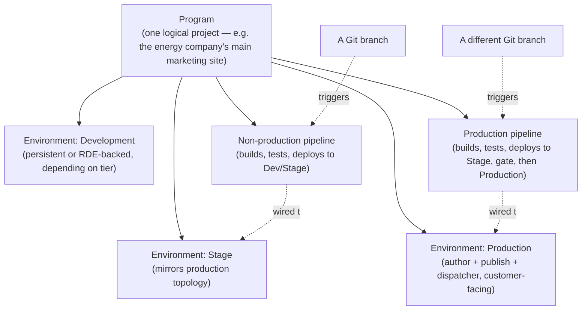

# 26 – Cloud Manager, Pipelines and CI/CD

> **Target:** 3–4 years experienced AEM Developer
> **Covers from your additional list:** Cloud Manager in depth · pipeline types and quality gates · Git branching strategy · environments · what CI/CD actually looks like on an AEM project.
> **Project domain:** a global energy technology company's marketing site.

---

## Before we start — why this is a different kind of CI/CD

If you've worked with Jenkins, GitHub Actions, GitLab CI, or Azure DevOps on other projects, you already have a mental model of CI/CD: a YAML file sits in the repository, it defines stages, and you own that file completely — you can add a step, change an order, point it at a different test suite, whenever you like.

**Cloud Manager doesn't work that way, and the first thing worth being honest about in an interview is that this is a deliberate difference, not a missing feature.** The pipeline stages, the quality gates, and the environments are configured through Cloud Manager itself — the UI and its API — not through a pipeline file living in your Git history. You bring the code; Adobe brings the pipeline. That trade shows up everywhere in this file: less flexibility than a hand-rolled Jenkins pipeline, but a guarantee that every AEM as a Cloud Service customer is releasing through the same disciplined, tested path, and that nobody can quietly disable the code quality gate the week before a deadline.

**Why this is worth knowing cold for a 3-4 year interview.** File 14 already covered *that* Cloud Manager pipelines are the only route to production and *why* that's both a benefit and a constraint. This file is the follow-up an interviewer asks next: *"okay, walk me through what's actually in that pipeline"* and *"how do you organise your branches so that works?"* Those two questions are where a candidate who has only read about Cloud Service gets caught, because the honest answer needs the mechanics, not just the marketing line about "faster releases."

**One more framing point before we start, because it will save you in a follow-up.** A branching strategy for Cloud Manager is not something Adobe hands you — it's something your team designs, because Cloud Manager's actual rule is much smaller than people assume: **a pipeline is wired to one Git branch.** Everything else — how many branches you keep, what a release looks like, how a fix gets from a feature branch to production — is a decision your project makes on top of that one rule. Say that distinction out loud in an interview and you sound like someone who has actually set one of these up, rather than someone reciting a diagram.

---

## 1. Introduction

### 1.1 What Cloud Manager actually is

Cloud Manager is Adobe's **control plane** for AEM as a Cloud Service. It is not a separate product you install — it's the console (and API) that sits in front of four things:

- **A Git repository** — either the one Cloud Manager provisions for you, or an integration with your own GitHub/GitLab/Bitbucket repository on higher tiers.
- **Pipelines** — the build-test-deploy sequences that turn a commit into a running environment.
- **Environments** — the actual AEM instances (author, publish, dispatcher) that a pipeline deploys to.
- **Monitoring and logs** — dashboards, downloadable logs, and alerting for the environments it manages.

If you remember one sentence for an interview: **Cloud Manager is the only door into a Cloud Service environment**, and everything in this file is really just an explanation of what's behind that door.

### 1.2 The four-level hierarchy

Cloud Manager organises everything under a **Program**. Understanding this hierarchy is what turns "I've used Cloud Manager" into an answer that survives a follow-up question:



A **Program** is a single project — in our energy-sector example, "the corporate marketing site" would be one program, and a separate microsite or headless project might be a second program with its own environments and pipelines. Each program has its own environments and its own pipelines, and a pipeline is always wired to exactly one Git branch and one target environment.

### 1.3 Why "no pipeline file in the repo" is the right way to think about it

Your `pom.xml`, your `core` module, your `ui.apps` filters — all of that lives in Git, exactly as file 25 described. What does **not** live in Git is the definition of the pipeline stages themselves. You configure:

- which branch feeds which pipeline,
- whether a pipeline is "non-production" or "production" type,
- optional custom steps (a webhook call to an external system, for instance),
- and quality gate thresholds, on plans where that's configurable,

all through the Cloud Manager UI or its REST API — never through a file a developer edits and merges like a `Jenkinsfile`. That is a genuine constraint on flexibility, and it's also the reason a Cloud Service pipeline can't be quietly weakened by a rushed pull request the way a self-hosted Jenkinsfile sometimes can.

### 1.4 A real project example, end to end

**Requirement.** A component team needed to ship a new "Compare Products" panel across the corporate site to twenty country sites.

**What made it a genuine CI/CD story, not just a code story.** The panel touched `core` (a new Sling Model), `ui.apps` (the component and its dialog), and `ui.frontend` (new clientlib JS/CSS). Three modules, one change, one pipeline run.

**The approach.** Developers worked on feature branches, opened pull requests into a shared `develop` branch that fed the **non-production pipeline**, which deployed automatically to the Stage environment on every merge. QA validated on Stage. When a release was ready, `develop` was merged into `main`, which fed the **production pipeline** — full-stack build, both quality gates, deploy to Stage again for a final check, a manual approval gate, then a rolling deployment to Production.

**The hard part.** The first attempt at the production pipeline failed at the code quality gate — not because of a bug, but because the SonarQube rule set flagged a security hotspot in a new HTTP call that hadn't been reviewed. The pipeline doesn't ask "is this actually a problem" — it enforces the rule, and a human has to either fix the code or mark the hotspot reviewed in SonarQube before the gate passes.

**What we learned.** The team started running the same SonarQube ruleset locally (via a Maven plugin, matched to the same rules Cloud Manager applies) before opening a pull request, rather than discovering findings only when the pipeline ran — which is a theme that comes back properly in file 28.

**Result.** The panel shipped through the pipeline as designed, with zero manual deployment steps and a complete audit trail of exactly which commit produced the production build — something a pre-Cloud-Service, hand-deployed release never had.

---

## 2. Core Concepts

### 2.1 Programs and environments

Every Cloud Service customer has at least one **Program**. Inside it, the environments available depend on the customer's tier:

- **Production** — always present. The environment customers actually see.
- **Stage** — always present on a production program. Same topology as production (author, publish, dispatcher), used to validate a release before it goes live.
- **Development** — present on higher tiers as a persistent environment; on smaller tiers, day-to-day development iteration happens through **RDE** instead (file 14), and a persistent Dev environment may not exist at all.

**The point worth making explicitly:** Stage is not a "nice to have" testing environment — it's a structural part of every production pipeline. A production deployment cannot skip it. Every production release is deployed to Stage first, inside the same pipeline run, before the approval gate.

### 2.2 The Git repository

Cloud Manager provisions a Git repository for the program (or integrates with an existing GitHub/GitLab/Bitbucket repository on Enterprise tier). Locally, this is just another remote:

```bash
git remote add cloudmanager https://git.cloudmanager.adobe.com/<org>/<program>.git
git push cloudmanager main
```

Pushing to a branch does nothing by itself — a push only triggers a pipeline if that branch is currently wired to one in the Cloud Manager UI. This is the detail that trips people coming from GitHub Actions: there, *any* push can trigger a workflow because the trigger rules live in the pushed code itself (`.github/workflows/*.yml`). Here, the trigger rule lives in Cloud Manager's configuration, entirely outside the commit.

### 2.3 Pipeline types

Four pipeline types matter for a developer to know by name and purpose, because "which pipeline handles X" is a very common follow-up:

| Pipeline type | What it builds and deploys | Why it exists |
|---|---|---|
| **Full-stack** | `core`, `ui.apps`, `ui.content`, `ui.config`, dispatcher config — the whole `all` package | The default pipeline for an application change |
| **Front-end** | Just the `ui.frontend` module (the npm/webpack build) | Front-end developers iterate on CSS/JS without waiting for a Java build |
| **Web-tier (dispatcher)** | Only the `dispatcher` module | A cache rule or filter change doesn't need a full application rebuild |
| **Config** | Only OSGi configuration (`ui.config` / `config.<runmode>` sources) | A configuration change is common and should be fast |

**The concept underneath all four:** a full-stack rebuild for a one-line dispatcher filter change is wasteful and slow, so Cloud Manager gives you narrower pipelines for narrower changes. Knowing this list by name, and being able to say *why* a dispatcher rule change should go through the web-tier pipeline rather than full-stack, is the kind of practical detail that separates "I've read about Cloud Manager" from "I've shipped through one."

### 2.4 Non-production vs. production pipelines

Independent of *what* a pipeline builds, every pipeline is also either:

- **Non-production** — builds, runs the quality gates, deploys to Development and/or Stage. Never touches Production. Used continuously, often on every merge to a shared branch.
- **Production** — everything a non-production pipeline does, **plus** a deployment to Production after an approval gate.

The practical reason both exist: you want the fast feedback of the quality gates on every merge, without a Production deployment happening every single time. A team typically runs the non-production pipeline constantly against an integration branch, and only promotes to the production pipeline — usually by merging into a release/main branch — when a release is actually intended.

### 2.5 Quality gates, in the order they run

A full-stack production pipeline runs through gates in roughly this order:

1. **Build** — Maven builds every module, exactly as a local `mvn clean install` would, inside an Adobe-managed container pinned to a specific AEM Cloud SDK version.
2. **Code Quality** — SonarQube analysis (Adobe's own rule set for AEM projects) plus **OakPAL** validation of the content packages. Detail on exactly which SonarQube rules matter is file 28's job; the thing to know here is that this gate can **block the pipeline** on critical findings, and that it enforces standards on **new or changed code**, not a retroactive rewrite of the whole codebase.
3. **Security** — scanning for known vulnerabilities in dependencies and common code-level security issues.
4. **Deploy to Stage** — the build artefact is deployed to the Stage environment.
5. **Functional / UI tests** — automated tests run against the real Stage environment (this is where `it.tests` and `ui.tests` from file 27 actually execute, as opposed to the unit tests, which already ran during the Build step).
6. **Approval gate** *(production pipelines only)* — a human with the right Cloud Manager permission clicks Approve before the pipeline proceeds.
7. **Deploy to Production** — a rolling deployment, replacing pods gradually rather than an all-at-once cutover, so the site doesn't go down during a release.

**Why the order matters for an interview answer:** notice that code quality and security run *before* anything is deployed anywhere. A build that fails those gates never reaches Stage, let alone Production — which is the mechanism behind file 14's claim that "production can't drift from source control." It's not just that deployment only happens through Git; it's that a deployment that doesn't meet the bar never becomes a deployment at all.

### 2.6 The approval gate

On a production pipeline, after Stage validation succeeds, the pipeline pauses and waits for a manual approval — someone with the appropriate role in Cloud Manager has to explicitly approve the step before the rollout to Production continues. This exists for the obvious reason: an automated pipeline that's technically green (tests pass, quality gates pass) is not the same thing as "we, as a team, have decided this is going live right now." The gate is where a release manager, a product owner, or a lead developer makes that call — often timed around a change window, a marketing announcement, or simply "not on a Friday afternoon."

### 2.7 Rollback, honestly

This is worth being precise about rather than confident-sounding, because it's an area where an overconfident answer falls apart under a follow-up. There is no "undo button" that reverts a live Production environment to its exact previous state the way `git reset` reverts a repository. What actually happens:

- The standard route is to **re-run the pipeline against the previous known-good commit** — either by re-triggering a prior successful pipeline execution, or by pushing a revert commit and letting a fresh pipeline run through the same gates.
- Because there's no emergency hotfix path (file 14), a rollback is itself a deployment, and it goes through the same Stage validation and approval gate as any other production change — which takes the time it takes.
- This is exactly why file 14's mitigations — feature flags and the fast config pipeline — matter in practice: a flag can be flipped off in seconds without a full pipeline run, whereas an actual code rollback cannot.

If asked "how do you roll back a bad release," the honest, defensible answer is: *"the real rollback is redeploying the last known-good commit through the pipeline, which is why we try to ship behind feature flags for anything risky — flipping a flag is faster than any deployment, including a rollback."*

### 2.8 Custom pipeline steps

Non-production and production pipelines support adding a small number of **custom steps** — most commonly a step that calls an external webhook, for example to notify a Slack or Teams channel when a deployment reaches a particular stage, or to trigger an external test suite that isn't part of the standard `it.tests`/`ui.tests` set. This is intentionally limited compared to a fully scriptable Jenkins pipeline — you're extending specific, defined extension points, not writing arbitrary pipeline logic — which is consistent with the whole "Adobe owns the pipeline shape" theme of this file.

### 2.9 Automation: the Cloud Manager API and the `aio` CLI

Everything visible in the Cloud Manager UI — triggering a pipeline execution, checking its status, approving a gate — is also available through Adobe's **Cloud Manager API**, and the `aio` CLI (already introduced in file 14 for RDE) has a Cloud Manager plugin that wraps it. In practice this is used to integrate pipeline triggers into other tooling — for example, kicking off a pipeline from an external ticketing system, or posting pipeline status into a dashboard.

**A caution worth stating plainly, the same way file 21 was careful about Oak internals:** I wouldn't try to recite exact `aio` command flags from memory in an interview. What's worth knowing solidly is the *capability* — that pipeline execution, monitoring, and even approving the gate can be driven from the command line and not just the web UI — because that's the fact that answers "can this be automated," which is the actual question being tested.

---

## 3. Internal Working

### 3.1 What happens the moment you push

When you push to a branch that's wired to a pipeline, Cloud Manager's webhook on that branch fires, and a new **pipeline execution** starts. Nothing runs on your machine or on the target environment yet — the first thing that happens is Adobe spinning up a build container, pinned to a specific AEM Cloud SDK version matched to your program, and checking out your commit inside it.

**Why the pinned SDK version matters practically:** this is the same `aem-sdk-api` version discipline from file 25. If your `pom.xml` depends on a newer or older SDK version than the one the pipeline's build container uses, you can see a build succeed locally and fail — or worse, succeed but behave subtly differently — in the pipeline. Keeping the local SDK dependency version aligned with what Cloud Manager uses is a small piece of hygiene that prevents a confusing class of "works on my machine" bug that has nothing to do with your code.

### 3.2 The build step, mechanically

Inside that container, the build step runs essentially the same Maven build you'd run locally — `mvn clean install` across the reactor — producing the same module artefacts described in file 25 (the `core` JAR, the `ui.apps`/`ui.content`/`ui.config` packages, and the `all` aggregate). Unit tests (file 27's territory) run here, as part of the normal Maven build lifecycle, before the artefact is considered built at all. A unit test failure fails the Build step outright — the pipeline never even reaches the quality gates.

### 3.3 What OakPAL is actually checking

**OakPAL** (Oak Package Acceptance Layer) inspects the *built content packages* — not your source folders — against structural rules before anything is deployed anywhere. Concretely, it can catch things like:

- a package attempting to write outside the paths its own `filter.xml` declares,
- mutable content ending up inside what's meant to be an immutable `ui.apps` package,
- disallowed or unexpected node types showing up in package content.

The important framing: this is a **structural, package-level check**, independent of whether your Java code even compiles cleanly or your SonarQube score is good. A package can pass every code quality rule and still fail OakPAL because of what it would actually do to the repository on install — which is exactly the class of problem file 25's "deployment that deleted a week of content" story represents. OakPAL is Adobe's answer to catching that *before* a package ever reaches a real environment, rather than after.

### 3.4 The deploy step and why it's rolling, not all-at-once

A Cloud Service publish tier is multiple pods behind a load balancer (file 14). Deploying a new build doesn't take the whole tier down and bring it back up — pods are replaced gradually, so traffic keeps being served by the pods still running the previous version while new pods with the new version come up and pass health checks. This is why a Cloud Service deployment doesn't need a maintenance window the way a single-instance 6.5 publish restart historically did, and it's also why a deployment briefly runs **two versions of your code side by side** — worth remembering if you're ever debugging something that looks inconsistent for a few minutes right after a release.

### 3.5 Where dispatcher and config changes skip the Java build entirely

Because the web-tier and config pipelines are separate pipeline types (section 2.3), a dispatcher-only or configuration-only change never goes through the `core` module's compile-and-test cycle at all — the pipeline only touches the `dispatcher` module or the OSGi config sources respectively. This is the mechanical reason those pipelines are faster: there's simply less to build, not just a shorter queue.

---

## 4. Important Interview Questions

### 4.1 Basic

**Q1. What is Cloud Manager?**
Adobe's control plane for AEM as a Cloud Service — it owns the Git repository, the pipelines, the environments, and the logs. It's the only route into a Cloud Service environment.

*Cross:* Is it a separate product you install? (**no — it's a managed console/API**) · What are the four things it manages? · Can you deploy without it? (no)

**Q2. What's the difference between a non-production and a production pipeline?**
Both build and run the quality gates and deploy to Stage. Only a production pipeline continues past that, through an approval gate, to a rolling Production deployment.

*Cross:* Which runs more often day to day? (**non-production, on every merge**) · What's the approval gate for? · Can a non-production pipeline touch Production? (never)

**Q3. Name the pipeline types and what each builds.**
Full-stack (everything), front-end (`ui.frontend` only), web-tier (dispatcher only), config (OSGi configuration only).

*Cross:* Why have narrower pipelines at all? (**a small change shouldn't need a full rebuild**) · Which would you use for a cache rule change? (web-tier) · For a new component? (full-stack)

**Q4. What is a Program, in Cloud Manager terms?**
A single logical project — its own environments and its own pipelines. A company can have multiple programs for separate projects.

*Cross:* What environments does a production program have? (**Production, Stage, and often Development**) · Is RDE part of a program? (yes, tied to it for iteration) · Can one program's pipeline deploy to another program's environment? (no)

**Q5. Where is a Cloud Manager pipeline defined — in a file in the repo?**
No — that's the key difference from Jenkins/GitHub Actions. The pipeline's stages and gates are configured through the Cloud Manager UI/API, not a file that lives in Git history.

*Cross:* What does live in Git? (**the code and content itself**) · What can you still customise? (custom webhook steps, which branch feeds which pipeline) · Why is that a deliberate design, not a limitation?

**Q6. What triggers a pipeline execution?**
A push to a Git branch that's currently wired to that pipeline in Cloud Manager's configuration.

*Cross:* What happens if you push to an unwired branch? (**nothing — no pipeline runs**) · Can one branch feed two pipelines? · Is the trigger rule stored in the repo? (no)

### 4.2 Intermediate

**Q7. Walk through the quality gates in order for a full-stack production pipeline.**
Build (Maven, including unit tests) → Code Quality (SonarQube + OakPAL) → Security → Deploy to Stage → Functional/UI tests → Approval gate → Deploy to Production.

*Cross:* **Which gates run before anything is deployed anywhere?** (Build, Code Quality, Security) · What does OakPAL check that SonarQube doesn't? (package structure, not code style) · Can a build with passing unit tests still fail the pipeline? (**yes — at Code Quality, Security, or the functional tests on Stage**)

**Q8. What does OakPAL actually validate?**
The built content packages against structural rules — that they don't write outside their declared filter, that mutable content isn't in an immutable package, that node types are sane — before deployment, independent of code quality.

*Cross:* Is this the same as the SonarQube gate? (**no — different tool, different concern**) · What kind of file-25-style incident does this catch early? (an unfiltered or badly-scoped package) · Does it run against source or against the built artefact? (**the built artefact**)

**Q9. Why is Stage a mandatory part of a production pipeline, not an optional environment?**
Because every production pipeline deploys to Stage and runs functional/UI tests there before the approval gate — Production is never the first place a build actually runs.

*Cross:* Can you skip Stage for an urgent fix? (**no — there's no such shortcut, which is the point**) · What kind of bug does this catch that unit tests can't? (integration-level, real-instance behaviour) · Does Stage mirror Production's topology? (yes)

**Q10. How does a deployment to Production actually happen — is there downtime?**
It's a rolling deployment — pods are replaced gradually behind the load balancer, so old and new versions briefly run side by side while traffic keeps being served.

*Cross:* **What's a subtle consequence of that?** (a few minutes where you could hit either version) · Why doesn't this need a maintenance window? · What happens if a new pod fails its health check? (it isn't promoted, limiting the blast radius)

**Q11. What is the approval gate, and who uses it?**
A manual pause on a production pipeline, after Stage validation succeeds, where someone with the right Cloud Manager role has to explicitly approve before the pipeline proceeds to Production.

*Cross:* Why not just auto-deploy if all tests pass? (**a green pipeline isn't the same as "we've decided to ship now"**) · Can it be automated away? (yes, via the API, but that removes the human checkpoint intentionally) · Is it present on non-production pipelines? (no)

**Q12. Your dispatcher rule change is going through the full-stack pipeline and it's slow. What would you do?**
Use the web-tier pipeline instead — it only builds and deploys the `dispatcher` module, skipping the Java build entirely, which is the faster, purpose-built path for exactly this kind of change.

*Cross:* What has to be true for that to work? (**the change really is dispatcher-only**) · What if it also touches a servlet? (needs full-stack) · Is web-tier a separate pipeline you configure, or automatic detection? (**a separate pipeline you choose to use**)

### 4.3 Advanced

**Q13. How would you roll back a bad production release?**
Honestly: there's no instant undo. The real rollback is redeploying the last known-good commit through the pipeline — either re-running a prior successful execution or pushing a revert and letting a fresh pipeline run — which goes through the same Stage validation and approval gate as any other change.

*Cross:* **Why does that make feature flags important?** (flipping a flag is instant; a rollback is a full deployment) · Is there a faster path for a config-only mistake? (the config pipeline) · What would you do in the minutes before a rollback finishes? (contain via content changes or a flag, per file 14)

**Q14. Design a branching strategy for a team of eight developers shipping to this pipeline setup.**
*(The 6.1-style answer below — a shared integration branch feeding the non-production pipeline continuously, and a release branch feeding the production pipeline only when a release is intended, with feature branches merging via PR into the integration branch.)*

*Cross:* Why not push every feature branch straight to a wired branch? (**you'd trigger a pipeline run — and potentially a Stage deployment — per feature branch**) · How do hotfixes work given there's no hotfix path? (there's no separate hotfix branch type — a fix goes through the same pipeline, just prioritised) · What would you do differently for a small two-person team? (fewer branches — trunk-based, main feeding both pipelines at different times, is defensible at that scale)

**Q15. A build passes locally but fails in the Cloud Manager pipeline. What would you check first?**
Whether the local `aem-sdk-api` dependency version matches what the pipeline's build container uses — a version mismatch is one of the most common causes of "works locally, fails in the pipeline" that has nothing to do with the actual code change.

*Cross:* What's a second thing to check? (a dependency scope issue that a local `autoInstall` masks but a clean pipeline build doesn't) · Where would you find the pipeline's build logs? (Cloud Manager, downloadable per step) · Is the build container the same as your local dev environment? (**pinned to the same SDK version, but it is a clean container — no leftover local state**)

**Q16. Explain the whole path from a developer's laptop to a live production page, in one answer.**
*(The Q19-style walkthrough — feature branch, PR into the integration branch, non-production pipeline builds and deploys to Stage, QA validates, merge to the release branch, production pipeline runs Build → Code Quality → Security → Deploy to Stage → tests → approval gate → rolling deploy to Production — plus the point that every one of those steps is enforced by the platform, not by team discipline alone.)*

*Cross:* Where could this fail silently versus loudly? (**OakPAL and SonarQube fail loudly and block; a missing filter root, per file 25, fails silently by simply not deploying**) · What's the one step a developer can't shortcut even under deadline pressure? (the approval gate and Stage validation — there's no bypass) · What would you add to make this safer for a risky change? (a feature flag, so the deployment and the exposure are decoupled)

---

## 5. Cross Questions — how this topic gets drilled

Interviewers use this topic to check whether you actually shipped through a Cloud Service pipeline or only read the marketing page. The follow-up chain usually goes:

**"You said Cloud Manager handles deployment."** → *What's the difference between the non-production and production pipeline?* → *What runs before Stage?* → *What's OakPAL checking that SonarQube isn't?* → *If the code quality gate fails, has anything been deployed yet?* (**no**) → *How would you roll back if it had?*

A second common chain starts from branching: **"How do you organise your branches?"** → *Which branch feeds which pipeline?* → *Where is that mapping configured — in the repo?* (**no — in Cloud Manager**) → *What happens if two developers merge conflicting changes into the branch that feeds the production pipeline?* → *Is there a hotfix branch?* (**there isn't a special path — everything goes through the same pipeline**)

A third chain tests whether you understand the platform's constraint rather than just its features: **"What if you need an emergency fix in ten minutes?"** → *Is there a way around the pipeline?* (**no**) → *So what do you actually do?* (**feature flags, the fast config pipeline if it's expressible as configuration, or you accept the pipeline's duration**) → *Why doesn't Adobe just add an emergency bypass?* (**because that bypass is exactly what let production drift from source control on 6.5**)

---

## 6. Best Interview Answers

**"Explain how CI/CD works on an AEM as a Cloud Service project."** — *about 90 seconds*

> "Cloud Manager is the control plane — it owns the Git repository, the pipelines, and the environments, and it's the only route into a Cloud Service environment. A pipeline is wired to one Git branch and one target: a non-production pipeline builds, runs the quality gates, and deploys to Stage; a production pipeline does all of that and then, after a manual approval gate, does a rolling deployment to Production.
>
> The quality gates run before anything is deployed anywhere — a Maven build with unit tests, then a code quality gate that's SonarQube plus OakPAL checking the actual content packages structurally, then a security scan. Only after all of that passes does the build reach Stage, where functional and UI tests run against a real instance. Production is never the first place a build runs.
>
> The thing I'd emphasise is that none of this pipeline shape lives in a file in the repository the way a Jenkinsfile would. You configure it through Cloud Manager itself. That's less flexible than a hand-rolled pipeline, but it means every Cloud Service customer ships through the same disciplined path, and it's the mechanism behind the bigger claim that production can't drift from source control — because a build that doesn't meet the bar never becomes a deployment in the first place."

**"How would you design a branching strategy for this?"** — *about 75 seconds*

> "The one hard rule Cloud Manager gives you is that a pipeline is wired to exactly one branch — everything else is a team decision built on top of that. What's worked well for me is a shared integration branch that feeds the non-production pipeline continuously, so every merged pull request gets built, quality-gated, and deployed to Stage automatically, and QA is always looking at something current. Feature branches merge into that branch via pull request, not by pushing straight to a wired branch, because pushing to a wired branch triggers a pipeline run and a Stage deployment every time.
>
> A separate release branch feeds the production pipeline, and only gets updated — usually by merging the integration branch into it — when a release is actually intended, so Stage deployments and production deployments aren't tangled together.
>
> The part I'd be upfront about is that there's no separate hotfix branch type, because there's no hotfix path at all on Cloud Service — an urgent fix goes through the exact same pipeline as everything else, just prioritised. That's why the mitigation for genuine emergencies is feature flags and the fast config pipeline, not a branching trick."

---

## 7. Real Project Examples

### Story 1 — The pipeline that sat "waiting for approval" for three days

**What happened.** A production pipeline run completed Stage validation cleanly — every gate green — and then just sat there. The release didn't reach Production for three days.

**The cause.** Nobody had actually clicked Approve. The person who normally did it was on leave, and nobody else on the team had the Cloud Manager permission to approve a production gate.

**Why it wasn't a bug.** This is the approval gate working exactly as designed — it's a deliberate human checkpoint, not a step that's supposed to auto-clear. A "stuck" pipeline that's actually just waiting for a person is a completely different problem from a failing pipeline, and the team's first instinct — checking pipeline logs for an error — wasted an hour before someone thought to check who could approve.

**What we changed.** At least two people on the team, not one, hold the approval permission for production pipelines, specifically so a single person's absence can't stall a release.

**The lesson to state:** *"A pipeline sitting at 'waiting for approval' isn't broken — it's doing exactly what it's supposed to do. The failure mode to design against is having only one person who can clear that gate."*

### Story 2 — The dispatcher change that took forty minutes it didn't need to

**What happened.** A developer needed to add a single cache rule for a new URL pattern. They committed it alongside their in-progress component work and pushed to the branch feeding the full-stack pipeline.

**The cost.** The full pipeline ran — Java compile, unit tests, SonarQube, OakPAL, security scan, Stage deployment, functional tests — about forty minutes, to ship one dispatcher rule.

**What should have happened.** The dispatcher change had no dependency on the in-progress component work. Split into its own commit, pushed through the **web-tier pipeline**, it would have skipped the Java build entirely and been live in a few minutes.

**Why it's worth knowing this as a developer, not just an ops concern.** Choosing the right pipeline for a change is a decision the developer makes by how they structure and push commits — it's not something Cloud Manager decides for you automatically. Bundling an unrelated dispatcher fix into a feature branch is a completely ordinary thing to do out of habit, and it quietly costs the fast path every time.

**The lesson:** *"The web-tier and config pipelines only help if the change actually goes through them on its own. A dispatcher-only fix bundled into a feature branch pays the full-stack pipeline's cost for no reason."*

### Story 3 — The SDK version mismatch that only failed in the pipeline

**What happened.** A component that built and ran correctly on every developer's machine failed at the Build step in Cloud Manager, with a compilation error nobody could reproduce locally.

**The cause.** A developer had bumped the local `aem-sdk-api` version in `pom.xml` to pick up a newer API they wanted to use, without realising the Cloud Manager pipeline's build container was still pinned to an older SDK release for this program. Locally, everyone had the newer SDK cached and it compiled fine; the pipeline's clean container didn't have it and, more importantly, the program's actual Cloud Service release train hadn't moved to that SDK version yet.

**Why it wasn't caught earlier.** `mvn clean install` locally uses whatever's in each developer's local Maven repository, which had already resolved the new version successfully — there was nothing to warn anyone that the pipeline environment was different.

**What we changed.** The SDK version in `pom.xml` is now treated the same way a production dependency version would be — changed deliberately, called out in the pull request description, and checked against what the program's Cloud Manager environments are actually running, not just what compiles.

**The lesson to state:** *"'It compiles for me' and 'it compiles in a clean container pinned to the program's actual SDK version' are two different claims, and the gap between them is exactly where this kind of failure lives."*

---

## 8. Configuration Examples

### 8.1 Adding the Cloud Manager remote and pushing

```bash
# One-time setup: add Cloud Manager's Git repository as a remote
git remote add cloudmanager https://git.cloudmanager.adobe.com/<org>/<program>.git

# Pushing only triggers a pipeline if this branch is wired to one
# in the Cloud Manager UI — the push itself does nothing on its own.
git push cloudmanager release/2026-q1
```

### 8.2 Keeping the SDK version deliberate, not accidental

```xml
<!-- pom.xml — the version that connects your local build to what
     the Cloud Manager pipeline actually builds against.
     Bump this on purpose, and check it against the program's
     current release train — not just against "does it compile." -->
<dependency>
  <groupId>com.adobe.aem</groupId>
  <artifactId>aem-sdk-api</artifactId>
  <version>2026.1.XXXXX.XXXXXXX</version>
  <scope>provided</scope>
</dependency>
```

### 8.3 Recognising a pipeline-shaped problem versus a code-shaped one

```text
Symptom: "Build passed locally, failed at Cloud Manager's Build step"
  → Check the SDK version pin first (section 3.1 / story 3)
  → Then check for a dependency scope issue masked by a local autoInstall

Symptom: "Pipeline green through Stage, nothing happening after that"
  → Check whether it's a production pipeline waiting on the approval gate
  → This is not a failure — check who has approval permission (story 1)

Symptom: "A simple dispatcher change took 40 minutes"
  → It went through the full-stack pipeline instead of the web-tier pipeline
  → Isolate dispatcher-only changes into their own commit next time (story 2)
```

### 8.4 A defensible branching layout

```text
main                → feeds the PRODUCTION pipeline
                      (updated only when a release is intended)

develop             → feeds the NON-PRODUCTION pipeline
                      (every merge deploys to Stage automatically)

feature/compare-products
feature/faq-accordion
                    → merge into develop via pull request
                      (never pushed directly to a wired branch)
```

---

## 9. Common Mistakes

| Mistake | Why it happens | The actual cost |
|---|---|---|
| Assuming the pipeline is defined in a repo file | Habit from Jenkins/GitHub Actions | Looking for a `.yml` that doesn't exist instead of checking Cloud Manager's configuration |
| Pushing feature branches straight to a wired branch | Convenience | Triggers a pipeline run — and a Stage deployment — per feature branch |
| Bundling a dispatcher-only fix into a full-stack change | Habit, or not knowing web-tier pipelines exist | A 40-minute pipeline for a change that needed 3 |
| Treating a "waiting for approval" pipeline as broken | Not knowing the approval gate is a deliberate pause | Wasted debugging time looking for a nonexistent failure |
| Bumping the SDK version without checking the pipeline's pinned version | Local build succeeds, so it looks safe | Pipeline-only build failures with no obvious local cause |
| Believing there's an emergency deployment bypass | Experience from non-Cloud-Service AEM, or other platforms | Designing incident response around a shortcut that doesn't exist |
| Only one person holding approval permission | Nobody thought about it until someone was away | A ready release stalls for days |
| Assuming a green pipeline means "safe to ship anything" | Conflating gate-passing with judgment | Shipping something technically correct but badly timed, which the approval gate exists to prevent |
| Not aligning local and pipeline SonarQube rules | Discovering findings only when the pipeline runs | Repeated pipeline failures late in the process instead of early local feedback |
| Confusing OakPAL failures with SonarQube failures | Both show up as "code quality gate failed" | Debugging code style when the actual problem is a package structure violation |

---

## 10. Best Practices

- **Match pipeline type to change type.** Dispatcher-only → web-tier. Config-only → config pipeline. Everything else → full-stack. This is a developer decision made by how commits are structured and pushed, not something automatic.
- **Keep the SDK version deliberate.** Treat `aem-sdk-api` version bumps like any other dependency change — call them out, and check them against what the program's Cloud Manager environments actually run.
- **Never push a feature branch straight to a wired branch.** Merge via pull request into the branch that feeds a pipeline, so a Stage deployment happens once per merged change, not once per push.
- **Hold approval permission with more than one person.** A release shouldn't stall because one person is unavailable.
- **Ship anything risky behind a feature flag.** It decouples "the code is deployed" from "the feature is live," which matters because a rollback is a full pipeline run and a flag flip isn't.
- **Run the same quality checks locally before opening a pull request**, where the tooling allows it — catching a SonarQube or OakPAL finding on your own machine is minutes; catching it in the pipeline is a full run's worth of time, repeated until it's fixed.
- **Treat Stage as production-equivalent, not as an afterthought environment.** Every production release goes through it — a bug that only appears on Stage-scale, real-instance behaviour is exactly the class of bug unit tests can't catch.
- **Design the branching model for the team's actual size**, not for a diagram you copied from documentation. Two developers rarely need the same branch topology as twenty.

---

## 11. Debugging Tips

| Symptom | Where to look | What it usually means |
|---|---|---|
| Build succeeds locally, fails in the pipeline | Cloud Manager's Build step logs | SDK version mismatch, or a scope issue masked by local `autoInstall` state |
| Pipeline blocked at "Code Quality" | The SonarQube report attached to the execution | A blocking rule was actually violated — check new/changed code specifically |
| Pipeline blocked at "Code Quality" but the code looks fine | The OakPAL section of the same report | A package structure issue, not a code style issue — check `filter.xml` and package contents |
| Pipeline sits at "waiting" indefinitely | Whether it's a production pipeline past Stage | It's the approval gate, not a failure — check who has permission to approve |
| A change reaches Stage but never Production | The approval step's status | Nobody has approved it yet |
| Dispatcher change takes far longer than expected | Which pipeline it was pushed through | It went through full-stack instead of web-tier |
| A component behaves inconsistently for a few minutes right after a release | Timing against the deployment window | The rolling deployment briefly runs old and new pod versions side by side — expected, and should resolve once fully rolled out |

---

## 12. Performance Notes

Pipeline duration is a real cost, not just an inconvenience, because it determines how fast a team can respond to anything — a bug fix, a rollback, or a genuine incident. The practical levers a developer controls:

- **Use the narrowest pipeline that's true to the change.** A dispatcher or config-only change through the full-stack pipeline pays for a Java build and full quality gate suite it doesn't need.
- **Keep the Build step fast by keeping the module boundaries clean** (file 25) — a bloated `core` module with unnecessary dependencies slows every single pipeline run, not just the occasional one.
- **Fix quality gate findings locally before pushing**, rather than using the pipeline itself as your linter — every round trip through Code Quality costs a full pipeline execution's time.
- **Don't bundle unrelated changes into one commit or one pull request.** A component change and a dispatcher fix bundled together forces the whole thing through the slower, full-stack path even though only part of it needed to be there.

---

## 13. Real Production Scenarios

1. **A production pipeline fails at Security with a flagged dependency.** Identify which dependency, check whether a patched version exists, upgrade it, and re-run — don't attempt to suppress the finding without understanding it first.
2. **Someone asks why last Tuesday's hotfix took four hours instead of being "instant."** Explain that there's no hotfix path — the fix went through the same Build → Quality → Security → Stage → Approval → Production pipeline as any other change, and that's by design.
3. **A release needs to go out at a specific time for a marketing launch.** Use the approval gate deliberately — let the pipeline run and pass all the way to the gate ahead of time, then approve at the exact moment the release should go live, rather than timing the whole pipeline run itself.
4. **Two developers' feature branches both modify the same dispatcher file.** Resolve the merge conflict before either reaches the branch that feeds the web-tier pipeline — the pipeline doesn't resolve conflicts, Git does.
5. **A build fails only in the pipeline, never locally.** Check the SDK version pin first, then check for scope issues a local `autoInstall` deployment can mask.
6. **A pipeline has been "running" for an unusually long time.** Check the current step in the Cloud Manager UI — it may be legitimately in a long-running functional test suite on Stage, not stuck.
7. **A team wants to skip Stage validation "just this once" for an urgent fix.** There's no such option — the honest answer to the urgency is a feature flag or the config pipeline if the fix is expressible as configuration.
8. **An approval is needed but the one person with permission is unreachable.** This is the argument for provisioning at least two approvers ahead of time, not something to solve reactively.
9. **A dispatcher-only fix is time-critical.** Push it in isolation through the web-tier pipeline rather than bundling it with in-progress feature work on the full-stack branch.
10. **After a release, a handful of requests briefly show old behaviour.** This matches the rolling deployment window, where old and new pod versions run side by side briefly — check whether it resolved once the rollout completed before treating it as a bug.
11. **A quality gate blocks a release over a finding the team believes is a false positive.** Mark it reviewed/resolved in the tool itself (SonarQube), with a documented reason — don't try to bypass the gate, because there isn't a bypass.
12. **A new developer asks where the "CI/CD YAML file" is.** Explain that Cloud Manager pipelines are configured through the Cloud Manager UI/API, not a file in the repository — a genuinely different model from Jenkins or GitHub Actions.
13. **A release needs to be rolled back after a bad Production deployment.** Redeploy the last known-good commit through the pipeline — through Stage and the approval gate again, because that's the only route, not a special fast rollback command.
14. **The front-end team wants faster iteration on CSS without waiting on backend builds.** Point them at the front-end pipeline, which builds only `ui.frontend`.
15. **A program has both a marketing site and a separate headless project.** These should likely be separate Programs in Cloud Manager, each with its own environments and pipelines, rather than forced into one.
16. **A pull request into the release branch is merged by mistake before QA sign-off on Stage.** This is exactly why a shared integration branch feeding the non-production pipeline should sit between feature work and the release branch — it gives QA a stable, current target that isn't the production pipeline's trigger.
17. **An external system needs to trigger a pipeline automatically after a content review workflow completes.** Use the Cloud Manager API (or the `aio` CLI's Cloud Manager plugin) rather than looking for a repo-based trigger mechanism.
18. **A team wants Slack notified the moment a production deployment finishes.** A custom pipeline step calling an external webhook is the supported extension point for exactly this.

---

## 14. Follow-up Questions

- If Cloud Manager owns the pipeline shape, what exactly do you still control as a developer? (which branch you push to, how you structure commits, custom webhook steps, quality gate findings you have to fix)
- Why does a rolling deployment matter more on Cloud Service than it did on a single 6.5 publish instance? (no single point of downtime, but a brief window of mixed versions to be aware of)
- What's the actual difference between the Code Quality gate and the Security gate? (code standards and package structure vs. known vulnerabilities in dependencies and code)
- Why is Stage mandatory rather than optional, even for an urgent fix? (Production is never the first place a build runs — no exceptions)
- What would you do differently for a two-person team versus a twenty-person team's branching strategy? (less branch structure needed at small scale — the risk a heavier strategy manages doesn't exist yet)

---

## 15. Comparison Tables

Four different distinctions get confused with each other under interview pressure, so it's worth having each one straight before you're asked to compare them live.

| | **Non-production pipeline** | **Production pipeline** |
|---|---|---|
| Deploys to | Development / Stage | Development / Stage, then Production |
| Approval gate | No | Yes |
| Typical frequency | Every merge | Only on an intended release |
| Purpose | Continuous validation | Actual release |

| | **Full-stack** | **Front-end** | **Web-tier** | **Config** |
|---|---|---|---|---|
| Builds | Everything | `ui.frontend` only | `dispatcher` only | OSGi config only |
| Use case | Application changes | CSS/JS iteration | Cache/filter rule changes | Configuration-only changes |
| Speed | Slowest | Fast | Fast | Fastest |

| | **Code Quality gate** | **Security gate** |
|---|---|---|
| Tooling | SonarQube + OakPAL | Vulnerability/dependency scanning |
| Checks | Code standards on new code, package structure | Known vulnerabilities, common security issues |
| Runs on | Source and built packages | Dependencies and code |

| | **On 6.5 (self-managed)** | **On Cloud Service (Cloud Manager)** |
|---|---|---|
| Pipeline definition | Wherever the team built it (Jenkinsfile, etc.) | Configured in Cloud Manager, not a repo file |
| Emergency hotfix | Possible, by hand | No bypass — same pipeline, every time |
| Rollback | Redeploy old package/bundle manually | Redeploy last known-good commit through the pipeline |
| Quality gates | Whatever the team chose to enforce | Enforced platform-wide, can't be quietly skipped |

---

## 16. Memory Tricks

- **"A pipeline is wired to a branch, not written in one."** The trigger mapping lives in Cloud Manager's configuration, not in a file you'd find with `git log`.
- **Order of the gates: Build → Quality → Security → Stage → Tests → Approval → Production.** Say it as one breath and you'll never lose the sequence under pressure.
- **"OakPAL checks the package, SonarQube checks the code."** Two different failures that both show up under the same "Code Quality" label.
- **"A rollback is a deployment, not an undo."** It goes through Stage and the approval gate exactly like any other release — that's why flags matter more than rollback speed.
- **Full-stack, front-end, web-tier, config — narrowest that's true to the change.** Picking the wrong one is the single most common "why did this take so long" story.

---

## 17. Revision Notes

Cloud Manager is the control plane for Cloud Service: Git repository, pipelines, environments, logs — the only route to production. A Program contains environments (Development, Stage, Production) and pipelines, and a pipeline is wired to exactly one branch, a mapping configured in Cloud Manager itself rather than in a file in the repository. Four pipeline types exist by what they build — full-stack, front-end, web-tier, config — and independently every pipeline is either non-production (builds, gates, deploys to Stage, never Production) or production (all of that, plus an approval gate and a rolling deployment to Production). The quality gate order is Build, Code Quality (SonarQube plus OakPAL package validation), Security, Deploy to Stage, functional/UI tests, then — for production pipelines only — a manual approval gate before the rolling Production deployment. There's no emergency hotfix path; a rollback means redeploying the last known-good commit through the same pipeline, which is why feature flags matter more here than on a platform with a faster rollback option. Branching strategy is a team decision built on top of Cloud Manager's one rule (one branch feeds one pipeline), typically a shared integration branch feeding the non-production pipeline continuously and a release branch feeding the production pipeline only when a release is intended.

---

## 18. Cheat Sheet

```text
HIERARCHY
  Program → Environments (Dev / Stage / Production)
          → Pipelines (wired to one branch each)

PIPELINE TYPES (by what they build)
  full-stack   — everything
  front-end    — ui.frontend only
  web-tier     — dispatcher only
  config       — OSGi config only

PIPELINE KINDS (by where they deploy)
  non-production — up to Stage, no approval gate
  production      — Stage, then approval gate, then rolling Production deploy

GATE ORDER (production pipeline)
  Build → Code Quality (SonarQube + OakPAL) → Security
        → Deploy to Stage → Functional/UI tests
        → Approval gate → Deploy to Production

ROLLBACK
  = redeploy last known-good commit through the SAME pipeline
  (Stage + approval gate again — not a shortcut)

NO EMERGENCY BYPASS
  mitigate with: feature flags, config pipeline, or wait

REMOTE SETUP
  git remote add cloudmanager <url>
  git push cloudmanager <branch-wired-to-a-pipeline>
```

---

## 19. Frequently Forgotten Things

1. The pipeline definition lives in Cloud Manager's configuration, **not** in a file in the Git repository.
2. A push only triggers something if the branch is currently wired to a pipeline — otherwise it does nothing.
3. Stage is mandatory on every production pipeline run — Production is never the first deployment target.
4. OakPAL checks package **structure**; SonarQube checks code **standards**. Both show up under "Code Quality," but they're different tools catching different problems.
5. The approval gate is a deliberate pause, not a failure state — a pipeline "stuck" there just needs a human to click Approve.
6. There is no emergency hotfix path on Cloud Service, full stop — not even for the pipeline that's supposedly "just config."
7. A rollback is a full pipeline run through Stage and approval again — it is not instant.
8. Web-tier and config pipelines only help if the change is pushed through them **in isolation** — bundling them with unrelated work forces the full-stack path.
9. A rolling deployment briefly serves both the old and new version of your code — expected, not a bug.
10. The Cloud Manager Git repository (or integration) is separate from the pipeline configuration itself — having the code in Git doesn't mean anything is wired to build it yet.
11. `aem-sdk-api` version drift between your local `pom.xml` and the pipeline's pinned SDK version is a common, easy-to-miss cause of pipeline-only build failures.
12. Custom pipeline steps are limited, defined extension points (like a webhook call) — not a fully scriptable pipeline the way a Jenkinsfile is.

---

## 20. Final Interview Summary

If you remember nothing else from this file: **Cloud Manager is the only route to production, a pipeline is wired to one branch and configured in Cloud Manager itself rather than in a repo file, and every production release passes through Build, Code Quality, Security and Stage validation before a manual approval gate ever lets it near Production.** There's no emergency bypass — a rollback is just another deployment through the same gates — which is precisely why feature flags and the narrower web-tier/config pipelines matter as much as they do in practice. Branching strategy is something your team designs on top of that one rule, not something Adobe hands you, and being able to describe a specific, defensible layout — not just recite pipeline stage names — is what actually convinces an interviewer you've shipped through one of these.

---

## 21. Mock Interview

**Q1. What is Cloud Manager, in one sentence?**
> "It's Adobe's control plane for AEM as a Cloud Service — it owns the Git repository, the pipelines, and the environments, and it's the only way anything reaches a Cloud Service environment."

**Q2. Where is a Cloud Manager pipeline actually defined?**
> "Not in a file in the repository, which is the first thing that surprises people coming from Jenkins or GitHub Actions. The pipeline's stages, gates, and which branch triggers it are all configured through Cloud Manager itself — the UI or its API. You bring the code and the content; Adobe owns the shape of the pipeline that builds and deploys it."

**Q3. Walk me through the pipeline types.**
> "By what they build, there are four: full-stack, which is everything — Java, content, config, dispatcher; front-end, which is just the `ui.frontend` module for fast CSS and JS iteration; web-tier, which is dispatcher-only; and config, which is OSGi configuration only. Independently of that, every pipeline is either non-production — builds, runs the gates, deploys up to Stage — or production, which does all of that and then, after a manual approval gate, does a rolling deployment to Production."

**Q4. What's the order of the quality gates, and why does the order matter?**
> "Build first — Maven, including unit tests. Then Code Quality, which is SonarQube plus OakPAL checking the actual built content packages structurally. Then a security scan. Only after all three pass does the build get deployed to Stage, where functional and UI tests run against a real instance. For a production pipeline, a manual approval gate comes next, and only then the rolling deployment to Production.
>
> The order matters because everything before Stage runs without touching a real environment at all. A build that fails Code Quality or Security never gets deployed anywhere — which is the actual mechanism behind the claim that production can't drift from source control. It's not just that deployment requires Git; it's that a deployment that doesn't meet the bar never becomes a deployment."

**Q5. What's the difference between what SonarQube checks and what OakPAL checks?**
> "SonarQube is looking at code — bugs, vulnerabilities, code smells, and coverage on new or changed code. OakPAL is looking at the built content packages structurally — does this package try to write outside what its filter declares, does mutable content show up somewhere it shouldn't, are the node types sane. A package can be perfectly clean code and still fail OakPAL because of what it would actually do to the repository on install, which is exactly the class of problem — like an unfiltered `/content` write deleting a week of pages — that file 25 covers from the Maven side."

**Q6. How would you roll back a bad production release?**
> "Honestly — there's no instant undo button. The real rollback is redeploying the last known-good commit through the same pipeline, which means it goes through Stage validation and the approval gate again, just like any other release. That's exactly why feature flags matter as much as they do here: flipping a flag is instant, and a rollback isn't. If something's shipped behind a flag, the fastest 'rollback' is turning the flag off, not redeploying at all."

**Q7. Design a branching strategy for an eight-person team on this setup.**
> "The one rule Cloud Manager actually gives you is that a pipeline is wired to one branch — the rest is a decision the team makes. I'd use a shared integration branch feeding the non-production pipeline continuously, so every merged pull request gets built, quality-gated, and deployed to Stage automatically — QA always has something current to look at. Feature branches merge into that via pull request, never pushed straight to a wired branch, because that would trigger a pipeline run and a Stage deployment per push. A separate release branch feeds the production pipeline, updated only when a release is actually intended.
>
> And I'd be upfront that there's no hotfix branch, because there's no hotfix path on Cloud Service at all — an urgent fix goes through exactly the same pipeline, just prioritised, which is why anything genuinely risky should ship behind a feature flag rather than relying on being able to fast-track a fix later."

**Q8. Your dispatcher change is taking forty minutes through the pipeline. What's wrong?**
> "It's almost certainly going through the full-stack pipeline instead of the web-tier pipeline — probably because it got bundled into a commit or branch that also had unrelated component work. The fix is process, not configuration: isolate a dispatcher-only change into its own commit and push it through the web-tier pipeline, which skips the Java build entirely and would turn that forty minutes into a few."

**Q9. A production pipeline has been sitting at the same step for two days. Is it broken?**
> "First thing I'd check is whether it's actually stuck at the approval gate rather than failing — that's a very different problem. If it's a production pipeline that's already passed Stage validation, 'sitting there' might just mean nobody with approval permission has clicked Approve yet, which isn't a bug, it's the gate doing its job. I'd only start treating it as a genuine failure once I'd ruled that out."

**Q10. Why doesn't Adobe just add an emergency deployment bypass for genuine incidents?**
> "Because that bypass is exactly the thing that let production drift from source control on 6.5 — someone fixing something urgently outside the normal path, at 2am, creates a difference between what's running and what's in Git that nobody discovers until the next real deployment overwrites it. The trade Cloud Service makes is giving that up entirely, and mitigating the cost with feature flags and the fast config pipeline instead of a back door. I'd say that's a reasonable trade, but I wouldn't pretend it doesn't cost anything in a genuine emergency — it does, and you plan for that in advance rather than discovering it during an incident."

---

## Next file

**`28-Code-Quality-SonarQube-and-Best-Practices.md`** — how the Cloud Manager quality gate actually scores a pull request, the SonarQube and OakPAL rules that matter most in practice, and the coding standards and review habits that keep a codebase from accumulating the kind of debt this file's pipeline discipline can't catch on its own.

---

*File 26 of the AEM Interview Preparation repository. Teaching style, energy-sector project domain.*
