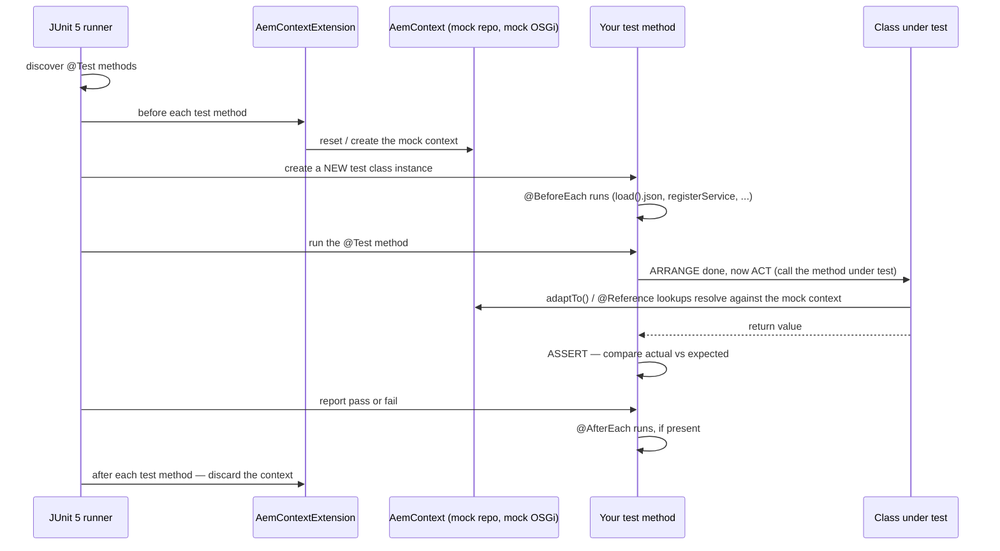

# 27 – Unit Testing: JUnit, Mockito and AEM Mocks

> **Target:** 3–4 years experienced AEM Developer
> **Not one single syllabus point — the practical skill behind several of them.** Files 05, 06, 07, 09 and 10 each closed with a chunk of test code, because "how do you unit test a Sling Model / a service / a servlet / a process step / a job consumer" is genuinely one of the most common follow-ups in an AEM interview. This file is where all of that gets built up properly, from the Java fundamentals underneath it.
> **Project domain:** a global energy technology company's marketing site.

---

## Before we start — why this file exists, and why it's slow on purpose

You've already seen test code five times in this repository. Every one of those files assumed you could read `@Test`, `assertEquals`, `Mockito.mock()` and `AemContext` without a detour. That was a fair assumption for the AEM-specific parts, but if your Java is still a work in progress, those five test classes were probably the parts you skimmed.

This file is the detour. It builds JUnit and Mockito up from the actual question — *what is a unit test, and what is it doing for you* — before it gets anywhere near AEM. Once that foundation is solid, `AemContext` stops looking like a wall of unfamiliar method calls and starts looking like what it is: a small, fast, fake AEM instance that you can create and throw away thousands of times a day.

**Why this matters more than it looks like it should, for your specific situation.** You are moving from support to development. Support work is reactive — you find out something is broken because a ticket says so. Development work has a chance to be proactive — you find out something would have broken *before* it ships, because a test told you. Being fluent in this file is one of the fastest ways to make that shift visible to an interviewer, because it is a skill you can demonstrate in five minutes of live coding, which very few other AEM topics allow.

**And a second reason it matters for this specific job market.** At Indian service companies working AEM Developer roles, Cloud Manager's quality gate genuinely blocks a pipeline on failing tests and on insufficient coverage of new code (file 14). "I can write a Sling Model" is now table stakes. "I can write a Sling Model *and* the test that proves it handles a half-filled dialog" is what a 3-4 year developer is expected to produce without being asked twice.

So: slow down here if you need to. Every later section assumes the vocabulary in sections 1 and 2 is solid.

---

## 1. Introduction

### 1.1 What a unit test actually is

Strip away the tooling and a unit test is a small, boring idea:

> **A unit test is a piece of code that runs a small piece of your other code, and automatically checks whether the result is what you expect.**

That's it. No repository, no browser, no AEM instance. You call a method with a known input, and you assert that what came back is what should have come back. If it isn't, the test fails loudly, right now, on your machine, instead of quietly, three weeks from now, in production.

**A support-desk analogy, since that's where you're coming from.** Think about the last time a recurring incident got a permanent fix instead of a workaround. Usually what happened is someone wrote down the exact steps that reproduced it, so that after the fix shipped, anyone could run those same steps and confirm it stayed fixed. A unit test is that reproduction case, except it runs itself, every time, in milliseconds, without a human remembering to check.

**A "unit" is deliberately small.** One method, one class, one decision — not a whole page render, not a whole workflow. The moment a test needs a running AEM instance, a real repository, or a browser, it has stopped being a *unit* test and become an *integration* test or a *UI* test, which are different tools with different jobs (section 2.13 and file 14 come back to this).

### 1.2 What a unit test is actually for — two jobs, not one

**Job one — a regression net.** Once a test exists and passes, it keeps passing automatically, forever, every time anyone runs the build. If someone touches the code six months from now and breaks the behaviour the test describes, the test fails immediately, in their own build, before it reaches a reviewer or a QA pass. That is the job most people already know about.

**Job two, and the one that surprises people — a design pressure.** Code that is hard to unit test is very often *badly structured*, and the difficulty of writing the test is the first symptom of that, arriving before anything else notices. This is not a coincidence and it is worth being able to say in an interview.

Recall file 05's opening example — the old way of reading two properties needed a live `Node`, which needed a live JCR session, which meant you could not test it without a running repository. The Sling Model version needed neither. **The same change that made the code shorter and safer also made it trivially testable**, and that is not two separate improvements — testability was a symptom of the better design, not an added feature bolted onto it.

> "A unit test isn't just insurance against regressions, though it is that. It's also a forcing function — if a class is hard to test, that's usually telling you it's reaching for too many things at once: a live repository, a request, a static singleton. The Sling Model story from file 05 is exactly this: moving off the raw JCR API made the code both shorter and testable, in the same change, because they were the same problem."

### 1.3 The shape every test has: Arrange, Act, Assert

Nearly every unit test — in any language, on any framework — follows the same three-part shape, usually abbreviated **AAA**:

```java
@Test
void discountAppliesAboveThreshold() {

    // ARRANGE — set up the world the test needs
    ShoppingCart cart = new ShoppingCart();
    cart.addItem("TX-4000", 250.00);

    // ACT — do the one thing being tested
    double total = cart.getTotalWithDiscount();

    // ASSERT — check the result is what it should be
    assertEquals(225.00, total, 0.01);
}
```

**Arrange** builds the inputs and any collaborators the code under test needs. **Act** calls the one method being tested — ideally exactly one line. **Assert** checks the outcome.

**Why keeping these separate matters, beyond tidiness.** A test with the act and the assert tangled together is hard to read six months later, and a test that arranges too much is usually testing more than one thing at once — which means when it fails, you don't immediately know which part broke. Keeping the shape visible is what makes a failing test a fast diagnosis instead of a second investigation.

Every test example in this file, and in files 05, 06, 07, 09 and 10, follows this shape whether or not the comments say so. Once you can see it, test code stops looking like a wall of unfamiliar syntax and starts looking like three short, ordinary paragraphs.

### 1.4 A real project example to adapt

> "On our project every Sling Model, every OSGi service, and every servlet has a corresponding JUnit 5 test using AEM Mocks — that's `io.wcm.testing.aem-mock`. We don't chase a coverage percentage; the Cloud Manager quality gate checks coverage on new code, but the tests we actually value are the ones covering the cases authors and users create by accident — a half-filled dialog, a missing payload, a service that's down. We keep a shared library of JSON content fixtures under `src/test/resources`, exported from CRXDE, so writing a new model test is mostly about picking or extending a fixture rather than building content by hand in code."

That covers the tooling, the philosophy on coverage, and the fixture workflow — three likely follow-ups, pre-empted.

---

## 2. Core Concepts

### 2.1 JUnit 5 — the annotations that structure a test class

JUnit is the framework that discovers your test methods, runs them, and reports which passed and which failed. Version 5 — often called **JUnit Jupiter** — is what current AEM projects use, and its annotations live in `org.junit.jupiter.api`.

**`@Test`** marks a method as a test. JUnit finds every `@Test`-annotated method in a class and runs each one as its own independent test.

```java
import org.junit.jupiter.api.Test;
import static org.junit.jupiter.api.Assertions.assertEquals;

class DiscountCalculatorTest {

    @Test
    void appliesTenPercentAboveThreshold() {
        assertEquals(225.00, DiscountCalculator.apply(250.00), 0.01);
    }
}
```

**`@BeforeEach`** runs before *every single* `@Test` method in the class. This is where you rebuild anything the tests need fresh, so one test's leftovers can never leak into the next.

**`@AfterEach`** runs after every test — used far less often, mostly to release something a test opened by hand (a temp file, a manually created resolver).

```java
import org.junit.jupiter.api.BeforeEach;

class DiscountCalculatorTest {

    private ShoppingCart cart;

    @BeforeEach
    void setUp() {
        // A FRESH cart before every test. If tests shared one instance,
        // a test that added an item would leak into the next test's
        // "empty cart" assumption -- a classic flaky-test cause.
        cart = new ShoppingCart();
    }

    @Test
    void emptyCartHasZeroTotal() {
        assertEquals(0.0, cart.getTotal());
    }
}
```

**Why `@BeforeEach` rather than doing setup once for the whole class:** JUnit 5 creates a **new instance of the test class for every test method** by default. That is deliberate — it is what guarantees tests cannot see each other's state. `@BeforeEach` fits that model: fresh object, fresh setup, every time.

**`@DisplayName`** gives a test a human-readable name for test reports, independent of the method name:

```java
@Test
@DisplayName("returns an empty list when the author added no FAQ rows")
void returnsEmptyListWhenAuthorAddedNoRows() { ... }
```

This is cosmetic but genuinely useful once a test suite has hundreds of methods and a build report needs to be skimmed at speed.

**`@Nested`** groups related tests inside an inner class, which is a way of expressing "these five tests all concern this one scenario" without fifty flat, similarly-named methods:

```java
class FaqModelTest {

    @Nested
    class WhenNoRowsExist {
        @Test
        void listIsEmpty() { ... }

        @Test
        void isReadyReturnsFalse() { ... }
    }

    @Nested
    class WhenOneRowIsIncomplete {
        @Test
        void incompleteRowIsFiltered() { ... }
    }
}
```

`@BeforeEach` methods in an outer class still run before every `@Test` in a nested class — nesting groups tests for readability, it doesn't change the lifecycle.

**`@ParameterizedTest`** runs the same test body multiple times with different inputs, which avoids five nearly-identical test methods that differ only in one number:

```java
import org.junit.jupiter.params.ParameterizedTest;
import org.junit.jupiter.params.provider.CsvSource;

@ParameterizedTest
@CsvSource({
        "0, false",     // zero: not eligible
        "99, false",    // just under
        "100, true",    // exactly at threshold
        "250, true"     // well over
})
void discountEligibility(double amount, boolean expectedEligible) {
    assertEquals(expectedEligible, DiscountCalculator.isEligible(amount));
}
```

`@ValueSource(strings = {...})` or `@ValueSource(ints = {...})` covers the simpler case of one parameter; `@MethodSource` points at a method that supplies more complex objects when a CSV row isn't expressive enough. **The value of a parameterized test is that boundary conditions — zero, one below a threshold, exactly at a threshold — get tested explicitly and visibly, rather than being implied by a single happy-path number.**

### 2.2 Assertions — how a test actually decides pass or fail

All of the standard assertions live in `org.junit.jupiter.api.Assertions`, and are almost always static-imported so call sites read cleanly:

```java
import static org.junit.jupiter.api.Assertions.*;
```

| Assertion | Checks | Typical use |
|---|---|---|
| `assertEquals(expected, actual)` | Two values are equal | The overwhelming majority of assertions |
| `assertTrue(condition)` / `assertFalse(condition)` | A boolean | `isReady()`, `isValid()` flags |
| `assertNull(value)` / `assertNotNull(value)` | Presence or absence | Confirming `adaptTo` succeeded or failed |
| `assertThrows(Type.class, () -> {...})` | An exception is thrown, and of the right type | A method that must reject bad input |
| `assertAll(() -> ..., () -> ...)` | Several assertions, **and reports every failure**, not just the first | Checking several fields of one object |
| `assertSame(a, b)` / `assertNotSame(a, b)` | Reference identity (`==`), not equality | Rare — confirming the exact same object, e.g. caching |

**`assertEquals` on a `double` needs a delta**, because floating-point comparisons are not exact:

```java
assertEquals(225.00, total, 0.01);   // equal within 0.01
```

**`assertThrows` is how you test that bad input is correctly rejected**, which matters a great deal for the servlet and workflow sections later in this file:

```java
@Test
void throwsWhenPayloadTypeIsWrong() {
    WorkflowException ex = assertThrows(WorkflowException.class,
            () -> process.execute(uuidPayloadWorkItem, session, metadata));

    assertTrue(ex.getMessage().contains("JCR_PATH"));
}
```

The lambda inside `assertThrows` is the **act** step; the assertion itself is JUnit checking that the act step threw, and threw the right type. If it throws a different type, or doesn't throw at all, the assertion fails.

**`assertAll` deserves its own mention**, because the instinct without it is to write several separate `@Test` methods, or several assertions in one test where only the first failure is ever reported (a stack trace stops execution at the first failed assertion). `assertAll` runs every one of its lambdas and reports **every** failure in one go:

```java
@Test
void modelExposesAllExpectedFields() {
    CtaModel cta = adapt("/content/cta-full");

    assertAll(
        () -> assertEquals("Request a quote", cta.getLinkText()),
        () -> assertEquals("/content/energy/contact.html", cta.getLinkUrl()),
        () -> assertTrue(cta.isReady())
    );
}
```

If two of those three fail, the test report shows both — which saves a "fix one, rerun, find the next one" cycle.

### 2.3 JUnit 4 versus JUnit 5 — because older AEM projects use JUnit 4

Not every AEM codebase you will touch has been modernised. Older 6.x-era projects, and some archetypes generated a few years back, still use **JUnit 4**. Recognising it — and being able to say what changed — is a real interview question, not a formality.

**The package changed entirely.** JUnit 4 lives in `org.junit`; JUnit 5 lives in `org.junit.jupiter.api`. Seeing `import org.junit.Test;` versus `import org.junit.jupiter.api.Test;` is the fastest way to tell which one you're looking at.

| | JUnit 4 | JUnit 5 |
|---|---|---|
| Test annotation | `@Test` (`org.junit.Test`) | `@Test` (`org.junit.jupiter.api.Test`) |
| Before each test | `@Before` | `@BeforeEach` |
| After each test | `@After` | `@AfterEach`|
| Before the whole class | `@BeforeClass` (must be `static`) | `@BeforeAll` (`static`, unless `@TestInstance(PER_CLASS)`) |
| Running with an extension (e.g. Mockito) | `@RunWith(MockitoJUnitRunner.class)` | `@ExtendWith(MockitoExtension.class)` |
| Expecting an exception | `@Test(expected = MyException.class)` | `assertThrows(MyException.class, () -> {...})` |
| Assertions class | `org.junit.Assert` | `org.junit.jupiter.api.Assertions` |
| Parameterized tests | A separate, clunkier `@RunWith(Parameterized.class)` | `@ParameterizedTest` — much more ergonomic |
| Nested/grouped tests | Not supported | `@Nested` |

**The one worth walking through, because it's a genuine improvement, not just a rename:** JUnit 4's `@Test(expected = ...)` fails the whole test if the exception is thrown on the *wrong line* — you can't assert anything about the exception itself, and you can't check what happened *before* the throwing line still ran correctly. `assertThrows` isolates exactly the one call expected to throw, gives you the exception object back to inspect (its message, its cause), and lets you assert on state before and after it separately.

```java
// JUnit 4 -- the whole method must throw somewhere. No inspection.
@Test(expected = WorkflowException.class)
public void throwsOnWrongPayloadType() throws WorkflowException {
    process.execute(uuidWorkItem, session, metadata);
}

// JUnit 5 -- isolates the one call, and you get the exception to inspect
@Test
void throwsOnWrongPayloadType() {
    WorkflowException ex = assertThrows(WorkflowException.class,
            () -> process.execute(uuidWorkItem, session, metadata));
    assertTrue(ex.getMessage().contains("JCR_PATH"));
}
```

**The interview answer:**

> "JUnit 4 is `org.junit`, `@Before`/`@After`, and `@RunWith` for extensions like Mockito. JUnit 5 — Jupiter — is `org.junit.jupiter.api`, `@BeforeEach`/`@AfterEach`, and `@ExtendWith`. The change I'd actually highlight rather than just list is exception testing: JUnit 4's `@Test(expected = ...)` just says 'this method throws somewhere,' with no way to inspect the exception or check state around it. JUnit 5's `assertThrows` isolates exactly the call that should throw and gives you the exception back to make assertions on. If I open an older AEM project and see `org.junit.Test` and `@RunWith`, that tells me it's JUnit 4 before I've read a single test body."

### 2.4 Why you mock at all — isolating the thing under test

Here is the problem mocking solves, stated plainly before any Mockito syntax.

Say you're testing an OSGi service that calls another service:

```java
public class OrderService {

    private final ProductDataService productDataService;

    public double calculateShippingCost(String productId) {
        Specification spec = productDataService.getSpecification(productId);
        return spec.getWeight() * 2.5;
    }
}
```

To test `calculateShippingCost`, you need a `ProductDataService`. But the real one calls an external API over HTTP. If your test uses the real one:

- The test needs network access, and fails if the API is briefly down — for a reason that has **nothing to do with your shipping calculation.**
- The test is slow — an HTTP round trip instead of a method call.
- The test is testing **two things at once**: your calculation, and the API integration. If it fails, you don't immediately know which.

**A mock is a fake stand-in for a collaborator, which you control completely.** Instead of a real `ProductDataService` making a real HTTP call, you hand `OrderService` a fake one that you've told, in advance, exactly what to return.

```java
ProductDataService fakeService = Mockito.mock(ProductDataService.class);
Mockito.when(fakeService.getSpecification("TX-4000"))
       .thenReturn(new Specification(120.0));   // told what to return

OrderService orderService = new OrderService(fakeService);
double cost = orderService.calculateShippingCost("TX-4000");

assertEquals(300.0, cost, 0.01);
```

Now the test is fast, has no network dependency, and tests **exactly one thing**: the shipping calculation. If it fails, the bug is in `calculateShippingCost`, full stop — the mock cannot be the cause, because it did precisely what it was told to do.

> "The point of mocking is isolation. When I'm testing one class, I don't want a failure somewhere in one of its collaborators to also fail this test — that makes debugging slower and the test suite less trustworthy, because a failure could mean 'my code is broken' or 'something three services away is having a bad day,' and you can't tell which from the test report alone. A mock removes that ambiguity: it does exactly what I told it to do, so if the test fails, the bug is in the class under test."

### 2.5 Mockito basics — the vocabulary

**`Mockito.mock(SomeClass.class)`** creates a fake instance of that type. Every method on it, by default, does nothing and returns a default value (`null`, `0`, `false`, or an empty collection) until you tell it otherwise.

**`when(...).thenReturn(...)`** — tell a mock what to return when a specific method is called with specific arguments:

```java
when(productDataService.getSpecification("TX-4000"))
        .thenReturn(new Specification(120.0));
```

**`verify(...)`** — after the act step, confirm a method on the mock was actually called, and how many times:

```java
verify(analyticsService).trackLookup("TX-4000");           // called exactly once
verify(analyticsService, times(2)).trackLookup("TX-4000"); // called exactly twice
verify(analyticsService, never()).trackLookup("TX-9999");  // never called with this argument
```

This is the tool for testing **side effects** — things a method does that don't show up in its return value. `assertEquals` checks what came back; `verify` checks what happened along the way.

**`doThrow(...).when(mock).method(...)`** — make a mock throw an exception instead of returning normally, which is how you test failure handling without needing a real failure to occur:

```java
doThrow(new SocketTimeoutException()).when(productDataService).syncProduct(anyString());
```

Note the order is reversed from `when(...).thenReturn(...)` — this is a Mockito quirk worth knowing rather than fighting: `doThrow` is used for `void` methods, because you cannot call `when(voidMethod())` — there is no return value to hang the stub off. The `do...().when(mock)....` form works for any method, void or not, and is the one to reach for whenever a stub needs to throw.

**`any()`, `anyString()`, `eq(...)`** — argument matchers, used when the exact argument doesn't matter, or when mixing a matcher with a literal value:

```java
when(productDataService.getSpecification(anyString()))
        .thenReturn(new Specification(100.0));   // any product ID returns this

// mixing a matcher with a literal argument requires EVERY argument to be a matcher
verify(auditLog).record(eq("lookup"), anyString(), any(Calendar.class));
```

**The rule to remember:** if you use one matcher (`any()`, `anyString()`, `eq()`) in a call, **every** argument in that call must be a matcher — you cannot mix a raw literal with a matcher in the same call. This causes a genuinely confusing `InvalidUseOfMatchersException` the first few times it happens.

**`ArgumentCaptor`** — for when you need to inspect *what* was passed to a mock, not just confirm it was called:

```java
ArgumentCaptor<Specification> captor = ArgumentCaptor.forClass(Specification.class);
verify(cache).put(eq("TX-4000"), captor.capture());

Specification captured = captor.getValue();
assertEquals(120.0, captured.getWeight(), 0.01);
```

This matters when a method builds an object internally and hands it to a collaborator — `verify` alone can confirm the call happened, but only the captor lets you assert on the *contents* of what was actually built and passed.

### 2.6 `@Mock`, `@InjectMocks`, and `MockitoExtension`

Writing `Mockito.mock(X.class)` for every collaborator, in every test, gets repetitive. Mockito's annotations remove the ceremony:

```java
import org.junit.jupiter.api.extension.ExtendWith;
import org.mockito.InjectMocks;
import org.mockito.Mock;
import org.mockito.junit.jupiter.MockitoExtension;

@ExtendWith(MockitoExtension.class)
class OrderServiceTest {

    @Mock
    private ProductDataService productDataService;   // Mockito creates this

    @InjectMocks
    private OrderService orderService;                // and wires it in here

    @Test
    void calculatesShippingFromWeight() {
        when(productDataService.getSpecification("TX-4000"))
                .thenReturn(new Specification(120.0));

        assertEquals(300.0, orderService.calculateShippingCost("TX-4000"), 0.01);
    }
}
```

**`@ExtendWith(MockitoExtension.class)`** is what makes the `@Mock` and `@InjectMocks` annotations actually do anything — without it, they're just unread labels, exactly like an unread `@ValueMapValue` on a class Sling never scans (file 05, section 1.3). The extension is what reads them and does the wiring, before each test runs.

**`@Mock`** creates a mock of the annotated type — equivalent to calling `Mockito.mock(ProductDataService.class)` yourself, but without the boilerplate, and re-created fresh before every test automatically.

**`@InjectMocks`** creates a real instance of the class under test, and tries to inject the `@Mock`-annotated fields into its constructor, setters, or fields — whichever it can find. It is convenient, but has a real limitation worth knowing: **it works by best-effort reflection, and it fails silently if it can't figure out how to wire something.** For a class with one obvious constructor taking exactly the mocked types, it works well. For anything more elaborate, constructing the object yourself in `@BeforeEach` is more reliable and, honestly, clearer to read.

> "I use `@Mock` and `@InjectMocks` for straightforward cases — a class with one constructor and a couple of collaborators. For anything with multiple constructors, optional dependencies, or fields that need more than mocks, I construct the object explicitly in `@BeforeEach` instead, because `@InjectMocks` failing to wire something doesn't give you an error — it just leaves that field null, and you find out from a confusing NullPointerException three lines into your test rather than at setup."

### 2.7 When *not* to mock

Mocking is powerful, and that makes it easy to reach for by default. Two situations where it actively hurts:

**One — don't mock what you don't own, when a real, fast, in-memory alternative exists.** Mocking `ResourceResolver`, `ValueMap`, or a whole `Resource` tree by hand — stubbing `getResource()`, `getValueMap()`, `getChild()` one call at a time — produces a test that is both enormous and lies about what it's testing, because you've effectively re-implemented a fake JCR by hand, one `when()` at a time, and every one of those stubs is an assumption you could get subtly wrong. **This is exactly the gap AEM Mocks fills** (section 2.9) — it provides a real, if lightweight, resource tree, so you assert against actual content instead of a hand-stubbed approximation of it.

**Two — over-mocking makes a test meaningless.** If a test mocks so much that the only code path actually being exercised is a single `if` statement, ask whether the test is verifying real behaviour or just verifying that Mockito was configured the way you configured it. A test that mocks every single collaborator's every single method, and then asserts that a mocked method was called, is close to asserting that Mockito works — which it does; that isn't the risk you're trying to cover.

> "Two things I actively avoid. First, hand-mocking things like `Resource` or `ValueMap` node by node — it's a lot of brittle setup and it's really just a worse, hand-built version of what AEM Mocks already gives you for free. Second, mocking so many collaborators that the test only exercises a couple of lines of real logic — at that point I'd rather ask whether the class under test has taken on too many dependencies, because that's usually the actual problem the awkward test is pointing at."

### 2.8 What AEM Mocks actually is

Everything so far — JUnit, Mockito — is plain Java, useful for any project. **AEM Mocks**, the library `io.wcm.testing.aem-mock`, is the AEM-specific piece: it gives you a lightweight, in-memory stand-in for a running Sling and AEM instance, so code that would normally need a real repository, a real request, and real OSGi container can be tested without any of them.

**What it provides, concretely:**

- An in-memory content repository you can load test content into.
- A working `adaptTo` mechanism, so `resource.adaptTo(MyModel.class)` genuinely runs the Sling Models framework, injectors and all.
- A mock request and response, close enough to the real Sling API that servlet code runs against them unmodified.
- A tiny OSGi-like container, so you can register your own services and activate real `@Component` classes with real configuration, exactly as file 06 exercises.
- Mock `Page` and `PageManager` objects, so `@ScriptVariable private Page currentPage;` resolves to something real.

**The one thing it deliberately does not give you** is a full AEM instance — no author UI, no real JCR indexing, no dispatcher, no actual HTTP layer. That is the entire point: it is fast — a whole test class runs in well under a second — precisely because it isn't the real thing. Trading that realism away is what makes it possible to run thousands of these tests on every commit.

### 2.9 `AemContext` and `AemContextExtension`

**`AemContext`** is the object that holds this fake AEM world for one test. You typically create one as a field:

```java
@ExtendWith(AemContextExtension.class)
class FaqModelTest {

    private final AemContext context = new AemContext();

    // ...
}
```

**`@ExtendWith(AemContextExtension.class)`** does for `AemContext` what `MockitoExtension` does for `@Mock` — it hooks into the JUnit 5 lifecycle so the context is properly reset between tests. Combined with JUnit 5 creating a fresh test class instance per test method (section 2.1), this means `context` is genuinely new for every single test — no leftover content or registered services can leak from one test into the next.

**`AemContext` can be constructed with a specific resource resolver type** if a test needs a closer-to-real repository — for instance, genuine JCR query behaviour that a plain in-memory map can't reproduce. Most Sling Model, service, and servlet tests never need this; the default lightweight resolver is enough, because you're testing your own logic, not Oak's indexing.

### 2.10 `context.load().json(...)` — loading test content, and how to get the fixture

**`context.load().json(...)`** reads a JSON file from your test resources and creates the equivalent content tree inside the mock repository, at the path you specify:

```java
context.load().json("/faq/content.json", "/content/faq");
```

That one line replaces manually building a `Resource` tree node by node — which is exactly the hand-mocking this file warned against in section 2.7.

**Where does the JSON fixture come from?** The practical, everyday technique is to export it from real content, rather than writing it by hand:

1. Author the content you want to test — a component instance, filled in the way you want to test (empty, partial, fully filled).
2. In CRXDE Lite, or simply in a browser, request that node's path with a `.json` (or `.infinity.json` for the full subtree, unlimited depth) suffix — for example `/content/energy/global/en/products/jcr:content/root/faq.infinity.json`.
3. Save the response body as a file under `src/test/resources`.
4. Trim it down to what the test actually needs — a fixture with forty irrelevant properties is harder to read than one with exactly the five the test cares about, and every property in there is one more thing a future reader has to figure out the relevance of.

```json
{
  "jcr:primaryType": "nt:unstructured",
  "sling:resourceType": "energy/components/faq",
  "heading": "Frequently asked questions",
  "faqs": {
    "jcr:primaryType": "nt:unstructured",
    "item0": {
      "jcr:primaryType": "nt:unstructured",
      "question": "What is a transformer in electricity?",
      "answer": "<p>It changes the voltage level...</p>"
    },
    "item1": {
      "jcr:primaryType": "nt:unstructured",
      "question": "What do electrical transformers do?",
      "answer": "<p>They transfer energy between circuits...</p>"
    }
  }
}
```

**Keep a small library of fixtures**, one per meaningful scenario — `content.json` for the full case, `content-empty.json` for nothing configured, `content-partial.json` for a half-filled row — rather than one enormous fixture with every case buried inside it. Section 8 and file 05 both lean on exactly this pattern.

### 2.11 `context.addModelsForClasses(...)` — and the nested-model trap

**`context.addModelsForClasses(...)`** registers your `@Model`-annotated classes with the mock Sling Models framework, so `resource.adaptTo(MyModel.class)` actually works inside the test — mirroring the real `Sling-Model-Packages` scanning from file 05.

```java
context.addModelsForClasses(FaqModel.class, FaqItemModel.class);
```

**The trap, already flagged in file 05 and worth repeating here because it is exactly the kind of thing that costs twenty confused minutes:** if `FaqModel` uses `@ChildResource` to inject a `List<FaqItemModel>`, then **`FaqItemModel` must also be registered**, or every entry in that list comes back `null` (or the list itself comes back empty, depending on how the injection is written) — with no error telling you why. The parent model adapts fine; only the nested adaptation silently fails, because as far as the mock Sling Models framework is concerned, `FaqItemModel` was never a class it knows how to build. Registering only the model you're directly calling `adaptTo` on, and forgetting every nested one it depends on, is one of the most common AEM Mocks mistakes there is.

### 2.12 `context.registerService(...)` and `context.registerInjectActivateService(...)`

Two different tools for two different jobs, and mixing them up is a common source of confusing test failures.

**`context.registerService(SomeInterface.class, instance)`** puts an object straight into the mock service registry, with no lifecycle involved. Use this to supply a mock collaborator that some other component or model needs:

```java
context.registerService(ProductDataService.class, Mockito.mock(ProductDataService.class));
```

The object you hand it can be anything — usually a Mockito mock, sometimes a small hand-written stand-in.

**`context.registerInjectActivateService(new RealImpl(), configMap)`**, covered fully in file 06, does something different and more elaborate: it takes a **real** `@Component`-annotated class, injects its `@Reference` fields from whatever is already registered in the context, applies the configuration map as if it came from an `@ObjectClassDefinition`, and calls `@Activate` — genuinely running your component's real activation code:

```java
ProductDataService service = context.registerInjectActivateService(
        new ProductDataServiceImpl(), config);
```

**The rule for choosing between them:** if you want a fake stand-in for a *dependency* your code needs, use `registerService`. If the thing you are actually **testing** is an OSGi component itself — you want its real `@Activate`, its real `@Reference` injection, its real business logic running — use `registerInjectActivateService`. Confusing the two is why "I called `registerService` on the class I'm trying to test and nothing worked" is a real recurring mistake — `registerService` never calls `@Activate`, so none of the component's setup ever ran.

### 2.13 Request, response, and page objects for servlet and model tests

For anything that needs a request context — servlets (file 07) and request-adaptable Sling Models (file 05) — `AemContext` exposes the pieces:

```java
context.currentResource("/content/energy/global/en/products/tx-4000");
context.requestPathInfo().setSelectorString("specs");
context.requestPathInfo().setExtension("json");

servlet.doGet(context.request(), context.response());

assertEquals(200, context.response().getStatus());
```

**`context.request()`** and **`context.response()`** are the mock `SlingHttpServletRequest` and `SlingHttpServletResponse` — real enough that a servlet's `doGet`/`doPost` can be called on them directly and behave as it would in production.

**`context.currentResource(path)`** sets what the request is "visiting" — the equivalent of a browser hitting that URL.

**`context.requestPathInfo()`** gives you a mutable view to set selectors, extension and suffix — exactly the request-shape details a servlet often branches on.

**`context.currentPage(path)`** sets the current page, for anything needing `@ScriptVariable private Page currentPage;` or a request-adaptable model that reads page context.

**These pieces compose.** A test for a request-adaptable Sling Model sets `currentResource` and `currentPage`, then adapts the *request* (not the resource) to the model class. A servlet test sets `currentResource`, `requestPathInfo`, and calls the servlet method directly. Same underlying context, assembled differently for what's under test.

---

## 3. Internal Working

### 3.1 What actually happens when a test runs — the full sequence



**Four points worth drawing out of that:**

**A fresh test instance, and a fresh context, for every single test method.** That is what makes tests independent — nothing you did in one test's `@BeforeEach` or test body can be seen by another test, ever, by construction rather than by discipline.

**`@BeforeEach` runs inside the *new* instance, every time**, which is why it's the right place for setup rather than a constructor or a static field — a static field would be shared across every test in the class, silently reintroducing the shared-state problem `@BeforeEach` exists to prevent.

**Everything your code does through `adaptTo`, `@Reference`, or the resource resolver resolves against the mock context**, not against a real repository or a real OSGi container — which is the entire mechanism that makes this fast.

**The assert step is where the test actually earns its keep.** Everything before it is setup; a test with elaborate arrange and act steps but a trivial or missing assert has not actually tested anything.

### 3.2 How Mockito actually creates a "fake" object

Worth a mental model, because "how does `mock()` even work" is a real, if less common, interview question, and understanding it explains a real limitation.

**`Mockito.mock(SomeClass.class)` generates a new class at runtime** — a subclass (for a class) or an implementation (for an interface) that overrides every method to do nothing by default, and consult Mockito's internal bookkeeping for stubbed behaviour (`when/thenReturn`) or a return value to record (`verify`) whenever a method is actually called. This is done through bytecode generation, historically via a library called ByteBuddy (and CGLIB before that).

**The practical consequence:** Mockito needs to be able to generate a subclass of the type you're mocking. Interfaces are trivial. Concrete classes generally work too, with current Mockito's "inline mock maker," including `final` classes and methods — which used to be a real limitation in older Mockito versions and occasionally still trips people up on an older project pinned to an old Mockito release. **A `static` method cannot be mocked this way at all** — there is no instance to subclass — which is exactly why file 06's advice to depend on interfaces rather than concrete implementations pays off doubly: it is not just good OSGi hygiene, it is also what makes a collaborator trivially mockable.

### 3.3 What breaks if you get the fundamentals wrong

This section is the "why it matters" for everything above, made explicit.

**Sharing state between tests (a static field, or resetting nothing in `@BeforeEach`) produces flaky tests** — ones that pass or fail depending on what ran before them, and in which order. These are worse than a test that simply always fails, because they erode trust in the whole suite: a developer who sees an intermittent failure starts re-running the build instead of investigating, and eventually starts ignoring red builds altogether.

**Testing implementation details instead of behaviour** (asserting exactly how many times a private helper was called, rather than what the public method returned) produces tests that break every time you refactor, even when behaviour is unchanged — which teaches the team that tests are an obstacle rather than a safety net, and that lesson is very hard to unlearn once it takes hold.

**Over-mocking**, covered in section 2.7, produces tests that pass even when the real integration between two classes is broken, because neither ever spoke to a real version of the other.

**Chasing a coverage percentage** (section 4, advanced questions, and story 1) produces exactly the trap this file spends real time on: tests that execute a line without checking anything meaningful about it, which move the coverage number without moving the actual safety net at all.

---

## 4. Important Interview Questions

### 4.1 Basic

**Q1. What is a unit test, and what is it for?**
A small, fast, automated check that a piece of code behaves as expected, run without external dependencies like a database or a network. It's a regression net — it fails immediately if behaviour changes unexpectedly — and it's a design pressure, because hard-to-test code is usually badly structured.

*Cross:* What makes a test a "unit" test specifically? · What's the alternative when you need a real dependency? (integration test) · Give an example where testability revealed a design problem.

**Q2. What is the Arrange/Act/Assert shape?**
→ Section 1.3. Set up the inputs, call the one thing under test, check the result. Keeping the three separate makes a failing test fast to diagnose.

*Cross:* What if a test has multiple "acts"? (it's probably testing more than one thing) · Where does mock setup belong? (arrange)

**Q3. What's the difference between `@BeforeEach` and `@Test`?**
`@Test` marks a method to be run and evaluated as a test. `@BeforeEach` runs before every `@Test` in the class, used to rebuild anything the tests need fresh so state can't leak between tests.

*Cross:* What about `@AfterEach`? · Why does JUnit 5 create a new instance per test method? · What was the JUnit 4 equivalent? (`@Before`)

**Q4. What's the difference between `assertEquals` and `assertSame`?**
`assertEquals` checks that two values are equal (using `.equals()`); `assertSame` checks that two references point to the exact same object (`==`).

*Cross:* When would `assertSame` actually matter? (confirming caching returned the identical instance) · What does `assertEquals` need for a `double`? (a delta)

**Q5. What's a mock, and why use one?**
A fake stand-in for a real collaborator, whose behaviour you control completely, so the class under test can be tested in isolation without a real dependency like a network call.

*Cross:* What does "isolation" actually buy you? · What's the risk of not mocking? (slow, flaky, or unreachable dependencies) · What's the risk of over-mocking?

**Q6. What does `Mockito.mock()` actually create?**
A dynamically generated fake implementation of the type, where every method does nothing and returns a default value until you configure it with `when(...).thenReturn(...)`.

*Cross:* How does that generation actually work? (bytecode, section 3.2) · Can you mock a `static` method that way? (no) · Can you mock a `final` class? (yes, with current Mockito)

**Q7. What is `AemContext`?**
A lightweight, in-memory stand-in for a running AEM/Sling instance, used with `AemContextExtension`, that provides a mock content repository, a working `adaptTo` mechanism, mock request/response objects, and a small OSGi-like container.

*Cross:* What does it deliberately not provide? (a real repository, a real HTTP layer) · Why does that matter for speed? · What resets between tests?

**Q8. What does `context.load().json(...)` do?**
Loads a JSON fixture file into the mock repository at a given path, creating the content tree the test needs, without building `Resource` objects by hand.

*Cross:* Where do the fixtures come from? (exported from real content) · What suffix do you request to export one? (`.json` / `.infinity.json`) · Why keep several small fixtures rather than one big one?

**Q9. What's the biggest change between JUnit 4 and JUnit 5?**
→ Section 2.3. Package changed from `org.junit` to `org.junit.jupiter.api`; `@Before`/`@After` became `@BeforeEach`/`@AfterEach`; `@RunWith` became `@ExtendWith`; and exception testing moved from `@Test(expected=...)` to `assertThrows`, which lets you inspect the exception and isolate exactly which call throws.

*Cross:* How do you spot which version a codebase uses? (the import) · What's the JUnit 4 equivalent of `@ExtendWith(MockitoExtension.class)`? (`@RunWith(MockitoJUnitRunner.class)`) · Is `@Nested` available in JUnit 4? (no)

**Q10. What's the difference between `@Mock` and `@InjectMocks`?**
`@Mock` creates a fake instance of a collaborator type. `@InjectMocks` creates a real instance of the class under test and tries to inject the `@Mock` fields into it automatically.

*Cross:* What makes those annotations actually work? (`@ExtendWith(MockitoExtension.class)`) · What's the risk with `@InjectMocks`? (silent wiring failure) · When would you construct the object manually instead?

### 4.2 Intermediate

**Q11. Why can't you unit test HTL, dialog XML, or client-side dialog validation JS the same way?**
Because none of them are Java — HTL is a template rendered by the HTL engine, dialog XML is declarative configuration, and validation scripts run in the author's browser. A unit test framework runs Java methods against Java objects; there's no equivalent "unit" to isolate and call. These are genuinely better suited to integration or UI-level testing (section 2.13-equivalent gap, and file 08/11).

*Cross:* So how do you gain confidence in an HTL template? (a Sling Model unit test covers the logic; an integration/UI test covers the render) · Is that a real gap, or is it fine? (a real, acknowledged gap — see the coverage discussion) · What would you tell an interviewer who pushes on this?

**Q12. What's the `@ChildResource` nested-model registration trap in tests?**
→ Section 2.11. If a parent model injects a `List` of a nested model type via `@ChildResource`, that nested model class must *also* be passed to `context.addModelsForClasses(...)`, or the adaptation of each child silently fails.

*Cross:* What does the failure actually look like? (empty or null list, no exception) · How would you diagnose it if you didn't know this? · Where else does this file's "register everything you depend on" theme show up? (registering a mock service before activating a component that references it)

**Q13. `registerService` versus `registerInjectActivateService` — when do you use each?**
→ Section 2.12. `registerService` supplies a fake dependency with no lifecycle. `registerInjectActivateService` runs a real `@Component`'s actual `@Activate` and reference injection — use it on the thing you're testing, not on a dependency you're faking.

*Cross:* What happens if you call `registerService` on the class under test by mistake? (its `@Activate` never runs, config is never applied) · What does `registerInjectActivateService` need as its second argument? (a configuration map)

**Q14. How do you unit test a servlet's failure paths?**
Set up the mock request with bad, missing, or malformed input via `context.requestPathInfo()` or request parameters, call `doGet`/`doPost` directly, and assert on the response status code and body — a 400 for bad input, a 404 for a missing resource, rather than only testing the happy path.

*Cross:* What's the most valuable servlet test, and why? (the one that proves bad input is rejected safely, not the one that proves valid input works) · How do you assert on the JSON body? · What's `HttpConstants` for? → file 07

**Q15. How do you unit test a workflow process step?**
Mock `WorkItem`, `WorkflowSession` and `MetaDataMap` with Mockito (there's no AEM-Mocks-specific workflow support), stub `workflowSession.adaptTo(ResourceResolver.class)` — often backed by an `AemContext` resolver so real content assertions work — call `execute(...)` directly, and assert either on the resulting content or on the exception thrown for bad input.

*Cross:* What are the two payload failure cases worth testing? (missing/deleted payload, wrong payload type) · Why throw rather than swallow in the step itself? (file 09 — a swallowed exception marks the workflow complete as though it succeeded) · How do you assert a `WorkflowException` was thrown with the right message?

**Q16. How do you unit test a job consumer's FAILED-versus-CANCEL decisions?**
Mock the `Job` object to return good, missing, and malformed properties in turn, mock the collaborator to throw a transient exception (network timeout) in one test and a permanent one (illegal argument) in another, call `process(job)`, and assert the returned `JobResult` matches the intent — `FAILED` for the transient case, `CANCEL` for the permanent one and for the "nothing to do" case.

*Cross:* Why does that distinction matter enough to test explicitly? (retrying a permanent failure wastes the retry budget forever; not retrying a transient one loses real work) → file 10 · How do you also test idempotency? (Q24)

**Q17. What's `ArgumentCaptor` for, and how is it different from `verify`?**
`verify` confirms a method was called, optionally how many times. `ArgumentCaptor` additionally captures *what* was passed in, so you can assert on the contents of an object built and passed internally by the code under test — something `verify` alone can't inspect.

*Cross:* Give a concrete case where you'd need it · How do you get the captured value out? (`captor.getValue()`) · What if the method was called multiple times? (`captor.getAllValues()`)

**Q18. When do you use `verify()` versus a plain assertion?**
A plain assertion checks a *returned value*. `verify()` checks a *side effect* — that a collaborator was called, which matters when the method under test doesn't return anything useful (a `void` method) but is still expected to have an effect.

*Cross:* Can you overuse `verify`? (yes — verifying implementation details rather than behaviour makes tests brittle) · What should you verify sparingly? (internal call counts that aren't really part of the contract)

**Q19. Why avoid hand-mocking things like `Resource` and `ValueMap`?**
→ Section 2.7. It produces large, brittle test setup that's really a hand-built, easy-to-get-subtly-wrong approximation of a real resource tree — exactly the gap AEM Mocks fills with a real (if lightweight) mock repository.

*Cross:* What's the AEM Mocks alternative? (`context.load().json(...)`) · Is there ever a case for hand-mocking a `Resource`? (a single, very narrow interaction, maybe — but it's the exception)

**Q20. Why is chasing a coverage percentage a bad idea?**
Because coverage measures whether a line *executed* during a test run, not whether anything meaningful was checked about it. A test that adapts a model and asserts a getter returns its field moves the coverage number without adding any real protection — it would still pass if the getter were subtly wrong in a way the test never checks for.

*Cross:* What does Cloud Manager's gate actually check? (coverage on new code) · What's a healthier target? (the cases authors and users create — file 05's whole recurring theme) · Give an example of a coverage-chasing test versus a real one.

### 4.3 Advanced

**Q21. Cloud Manager's quality gate includes coverage on new code. How do you satisfy that without writing bad tests?**

> "The honest answer is that coverage on new code is a floor, not a target — it's there to stop code shipping with *zero* tests, not to certify that the tests are good. I write the tests I'd write anyway — the empty case, the partial case, the failure path — and in practice that clears the gate on its own, because those cases naturally exercise most of a class's real branches. Where it doesn't, I look at what's actually uncovered before adding anything: often it's an error-handling branch that genuinely deserves a test regardless of the gate, which is the better outcome anyway. What I actively avoid is writing a test purely to move the number — asserting that a getter returns its own field, or asserting a value equals itself — because that's coverage without protection, and it can create a false sense of safety that's worse than an honestly lower number."

*Cross:* What's a coverage-chasing test look like concretely? · Where does the file 08/11 gap (HTL, dialog validation) fit into this conversation? · Would you ever push back on a coverage requirement? (yes, on where the number applies, not on testing in general)

**Q22. What's genuinely untestable in AEM, in the unit-test sense, and how do you talk about that honestly?**

> "HTL templates, dialog `.content.xml` and dialog validation JavaScript. None of them are Java, so there's no unit to isolate and call — HTL is rendered by the HTL engine, dialog XML is declarative configuration read by the dialog framework, and validation scripts run in a browser. I don't pretend there's a slick unit-testing story for those. What I do instead is push as much logic as possible *out* of them and into a Sling Model or a service that genuinely is unit-testable — file 05's whole argument for models over scriptlets — so the untestable surface left over is as thin as possible: mostly markup and wiring. What's left gets covered by integration or UI-level tests instead, which are a different tool for a different layer, not a unit test in different clothing."

*Cross:* Does that mean HTL bugs slip through? (some do — that's the honest cost) · How would you increase confidence in an HTL template beyond code review? (a UI test asserting the rendered DOM) · Is this a AEM-specific problem? (no — any templating layer has this gap)

**Q23. What are `it.tests` and `ui.tests`, and how are they different from what this file covers?**

The AEM Maven archetype includes two extra modules beyond `core`: **`it.tests`** for integration tests that run against a real, deployed AEM instance — hitting real servlets over HTTP, checking real replication, exercising things that genuinely need a live repository and OSGi container — and **`ui.tests`** for browser-level UI tests, typically using Selenium, that drive a real page in a real browser. Both are slower and more expensive than the unit tests this file covers, and both run later in the Cloud Manager pipeline, on stage, after the code quality gate — not on every local build.

*Cross:* Why not just write more integration tests instead of unit tests? (slower feedback, harder to isolate a failure, more fragile to unrelated changes) · Where do they run in the pipeline? → file 14 · Would you write an integration test for a Sling Model? (rarely — a unit test with AEM Mocks is usually enough and much faster)

**Q24. How do you design a test that proves a job consumer is idempotent, not just that it works once?**

Call `process(job)` twice with the *same* job object, and assert both calls return the intended result — and where the underlying operation has a way to reveal duplication (a counter, a call count via `verify(..., times(2))`), confirm the *effect* is what idempotency promises: running twice looks the same as running once from the outside, even though the collaborator really was called twice. The test is documenting a contract — "this operation is safe to repeat" — not just exercising a code path.

*Cross:* What's a non-idempotent operation that would fail this test? (a counter increment, an email send) → file 10 · How would the test look different for a genuinely non-idempotent action needing a guard? (assert the guard prevents the second effect, e.g. `verify(..., times(1))` after two calls)

**Q25. How do you test an OSGi service's disabled path and its upstream-failure path?**

For the disabled path: `registerInjectActivateService` with a configuration map where the `enabled` flag is `false`, and assert the service returns its documented "safe" result (an empty list, `false` from `isAvailable()`) without attempting the real call at all. For the upstream-failure path: register the service enabled, but make its own dependency (an HTTP client, or a further mocked collaborator) throw, and assert the service **catches it and degrades**, per its documented contract, rather than letting the exception propagate to whatever called it.

*Cross:* Why are these two tests more valuable than the happy path? (they're the ones that actually protect production, per story 3) · What does file 06's `ProductDataService` interface promise for this case? (never throw — return an empty result) · How would you assert "doesn't throw"? (call it inside `assertDoesNotThrow`, or simply call it and let a real exception fail the test with a stack trace)

**Q26. How would you structure a growing library of JSON test fixtures so it doesn't become unmanageable?**

One small, purpose-named file per scenario rather than one large file reused everywhere — `content-empty.json`, `content-partial.json`, `content-two-instances.json` — mirroring the AAA idea at the fixture level: each file's name states exactly the scenario it arranges. Keep them close to the test class that owns them, under a matching subfolder in `src/test/resources`, and trim each one down to only the properties the relevant test actually reads, so a fixture doubles as documentation of what the test cares about rather than a raw content dump.

*Cross:* What happens if fixtures get shared across unrelated tests? (a change for one test's needs silently breaks another) · How do you keep a fixture from drifting out of sync with the real content structure? (re-export periodically, or when the component's dialog changes)

---

## 5. Cross Questions — how this topic gets drilled

**Thread A — from "how do you unit test a Sling Model" (the question every one of files 05-10 sets up)**
What's `AemContext`? → What does `load().json` do? → Where do fixtures come from? → What's `addModelsForClasses` for? → What's the nested-model trap? → How do you mock an injected service? → What do you actually assert — and why not just that a getter returns its field?

**Thread B — from "what is a mock"**
Why mock at all? → What's the risk of not mocking? → What's `Mockito.mock()` actually doing? → `when/thenReturn` versus `doThrow/when`? → What's `verify` for? → When do you avoid mocking? → What's over-mocking, and why is it bad?

**Thread C — from "JUnit 4 vs 5"**
What changed? → Why does `@BeforeEach` exist instead of a constructor? → Why did exception testing change? → What's `@ExtendWith` replacing? → How do you tell which version an old codebase uses? → Would you migrate it?

**Thread D — from "coverage on new code"**
What does Cloud Manager's gate check? → Why is chasing the number risky? → What's a test that moves coverage without adding safety? → What should you test instead? → What's genuinely untestable, and how do you say that honestly? → Where do integration and UI tests fit in?

**Thread E — from "testing failure paths"**
Which failure paths matter most, across every AEM layer? → Model: empty/partial content → Servlet: bad/malformed input → Service: disabled, upstream down → Workflow step: missing/wrong-type payload → Job consumer: FAILED vs CANCEL, and idempotency → What's the common thread? (the cases authors and users actually create, not the happy path)

---

## 6. Best Interview Answers

### 6.1 "What is a unit test, and why do you write them?" — about 60 seconds

> "A unit test is a small, automated check — call a method with a known input, assert the result is what it should be — that runs without a real database, network, or running server. It does two jobs. It's a regression net: once it passes, it keeps passing on every future build, and it fails immediately, on the developer's own machine, if someone breaks the behaviour it describes. And it's a design pressure — code that's hard to test is usually reaching for too many things at once, a live repository or a static singleton, and the difficulty of writing the test is often the first symptom of that, not a separate complaint.
>
> On our project that plays out very literally. Moving from raw JCR API code to Sling Models, in file 05's example, made the code both shorter and testable in the same change, because untestability and boilerplate came from exactly the same cause — needing a live repository to read two properties."

### 6.2 "Explain mocking to me, as if I don't know Mockito." — about 75 seconds

> "Say I'm testing a class that calls another service — one that makes a real HTTP call to an external API. If my test uses the real service, three things go wrong: the test needs network access and can fail because the API happened to be down, which has nothing to do with the code I'm actually testing; it's slow, because every test run does a real HTTP round trip; and it's testing two things at once, so when it fails I don't know whether my logic is wrong or the API integration is.
>
> A mock is a fake stand-in for that collaborator that I control completely. I create it with `Mockito.mock()`, and I tell it exactly what to return for a given call with `when(...).thenReturn(...)`. Now the test is fast, has no external dependency, and tests exactly one thing — because the mock does precisely what I told it to, it can never be the reason the test fails.
>
> The two things I watch for are hand-mocking something I don't need to — AEM Mocks already gives me a real resource tree, so I'd rather load JSON content than stub `getResource()` calls by hand — and over-mocking, where I've faked so many collaborators that the test barely exercises any real logic at all."

### 6.3 "How do you unit test a Sling Model?" — about 75 seconds

> "AEM Mocks, with JUnit 5. I create an `AemContext` with `@ExtendWith(AemContextExtension.class)`, load a JSON fixture with `context.load().json(...)` — usually exported straight from real content in CRXDE — register the model class or classes with `addModelsForClasses`, adapt a resource from the loaded content, and assert.
>
> Two things I always check for. If the model uses `@ChildResource` to pull in a nested model — a multifield row, say — that nested model class has to be registered too, or the adaptation of each child silently fails with no error. And if the model injects an OSGi service, I register a mock for it with `context.registerService` before adapting, or the injection just comes back null.
>
> But the more important part is what I actually test, not the mechanics. Not that a getter returns its own field — that proves nothing, it would still pass if the getter were subtly wrong. I test the cases authors actually create: no rows added to a multifield, a row where only the question was filled in and not the answer, two instances of the same component on one page. Those are the paths that break in production, and they're the ones a coverage-chasing test tends to skip entirely."

### 6.4 "Cloud Manager's gate checks coverage on new code. Doesn't that push you toward writing more tests just to hit the number?" — about 60 seconds

> "It's a real risk, and I've seen it happen — tests that adapt a model and assert a getter returns exactly the value that was set, which moves the coverage percentage without adding any protection, because the test would still pass even if the getter quietly did the wrong thing.
>
> My approach is to write the tests I'd write regardless of the gate — the empty case, the partial case, the disabled path, the failure path — and in practice that clears the threshold on its own, because those cases naturally walk most of a class's real branches. If there's still a gap after that, I look at exactly what's uncovered before adding anything, and it's usually an error-handling branch that deserves a real test on its own merits anyway.
>
> What I won't do is write a test purely to move the number. A coverage percentage measures whether a line executed, not whether anything meaningful was checked — and a team that starts treating the number as the goal ends up with a test suite that looks safe and isn't."

---

## 7. Real Project Examples

### Story 1 — Raising coverage the wrong way, then the right way

**What happened.** A sprint retro flagged that the `core` bundle's test coverage was below the Cloud Manager gate's threshold on new code, and the fix needed to land before the next release window. Under time pressure, the fastest way to move the number looked obvious: pick every untested class, and write one test per public method asserting the getter returns whatever was set.

```java
// THE WRONG WAY. Passes. Proves almost nothing.
@Test
void getLinkTextReturnsLinkText() {
    CtaModel cta = adapt("/content/cta-full");
    assertEquals("Request a quote", cta.getLinkText());
}
```

**Why it was wrong, and how that became visible.** Coverage went up, the gate passed, and two sprints later a genuine bug shipped anyway: a `@PostConstruct` normalisation step (very close to file 05's FAQ example) was supposed to filter out a multifield row with a blank answer, and a regression broke the filter so blank rows started rendering. Every one of the new tests still passed, because every one of them supplied a fully-filled fixture and asserted the field it had just set came back unchanged — none of them ever exercised the partial-row case at all.

**The fix — rewritten around scenarios, not fields.**

```java
// THE RIGHT WAY. Tests the case an author will actually create.
@Test
void skipsRowsWhereTheAnswerIsBlank() {
    FaqModel model = adapt("/content/faq-partial");   // author left one answer empty
    assertEquals(1, model.getFaqs().size());          // the blank row is filtered out
}

@Test
void returnsEmptyListWhenAuthorAddedNoRows() {
    FaqModel model = adapt("/content/faq-empty");
    assertTrue(model.getFaqs().isEmpty());
    assertFalse(model.isReady());
}
```

**Result.** Coverage on the affected package actually went *down* slightly compared to the field-echoing version, because the rewritten suite had fewer, more purposeful tests — and it caught the exact class of bug the earlier version had walked straight past, the next time someone touched that filtering logic.

**Why this story works in an interview:** it's an honest account of getting it wrong first, which is more convincing than a story where the right answer was obvious from the start, and it makes the coverage-versus-protection distinction concrete rather than theoretical.

### Story 2 — The bug an edge-case test would have caught

**What happened.** A category listing page occasionally rendered one fewer card than it should, only on pages with exactly the maximum configured number of items. It reproduced intermittently in QA and not at all in casual manual testing, which made it easy to deprioritise as "probably a caching thing."

**The investigation.** The model's `@PostConstruct` built the card list with a loop bounded by a policy-driven limit (the same shape as file 05's `CategoryListingModel`):

```java
int limit = resolveLimit();
while (children.hasNext() && result.size() < limit) {
    Page child = children.next();
    // ...
    if (card != null && card.isValid()) {
        result.add(card);
    }
}
```

The bug was in how `limit` was computed elsewhere in a related utility — off by one in a boundary case, but only when the author's page had *exactly* the policy default number of children, no more and no fewer. Every existing test used a fixture with either far fewer children than the limit, or far more — nobody had a fixture sitting exactly at the boundary.

**The fix.** One line, once found. The instructive part was what came after.

**What we added.** A parameterized test walking the boundary explicitly:

```java
@ParameterizedTest
@CsvSource({
        "5, 5",     // exactly at the limit
        "4, 4",     // one under
        "6, 5"      // one over -- capped
})
void respectsTheItemLimitAtTheBoundary(int childCount, int expectedCardCount) {
    // fixture built with exactly `childCount` children
    CategoryListingModel model = adaptWithChildren(childCount);
    assertEquals(expectedCardCount, model.getCards().size());
}
```

**Why this works in an interview:** it demonstrates that "test the edge case" isn't an abstract slogan — a boundary condition is a specific, nameable value (exactly at the limit) that a fixture built from "some content" or "a lot of content" will almost always miss by accident, and a parameterized test is the tool that makes testing that boundary explicit rather than incidental.

### Story 3 — The OSGi service failure-path test that mattered in production

**What happened.** The product data integration (file 06's `ProductDataServiceImpl`) had, from the start, a unit test for its disabled path and a unit test asserting `getSpecifications` never throws for an unknown product. At the time those felt like slightly academic tests — the happy path was what got exercised in every manual QA pass, because the upstream API was reliably up in every lower environment.

```java
@Test
void neverThrowsWhenUpstreamFails() {
    // simulate the upstream being unreachable
    doThrow(new SocketTimeoutException())
            .when(httpClientWrapper).execute(any());

    List<Specification> result = service.getSpecifications("TX-4000");

    assertNotNull(result);
    assertTrue(result.isEmpty());   // degrades, doesn't propagate
}
```

**Where it mattered.** Months later, the internal product API had a genuine multi-hour outage during business hours. Every product detail page across the site kept rendering — without specifications, with the component simply omitting that section — instead of every one of those pages throwing a 500. The behaviour that saved the incident from becoming a site-wide outage was exactly the behaviour that one "academic" test had been asserting the entire time.

**What made the difference concrete, in the retro.** Another team's integration, built without an equivalent test, had a service that let the exception propagate out of `getSpecifications`, and their pages did 500 during the same outage window. The only structural difference between the two services was that one had a test forcing the failure path to be considered at all, and the other's failure path had simply never been exercised by anyone, in code or in QA, until production did it for them.

**The lesson to state:** *"The value of that test wasn't obvious until the day the upstream was actually down. That's the general shape of a good failure-path test — it feels like effort spent on something that 'obviously' works, right up until the day it's the only thing standing between an outage and a slightly degraded page."*

---

## 8. Coding Examples

### 8.1 JUnit 5 fundamentals, in one file

```java
package com.energy.core.util;

import org.junit.jupiter.api.*;
import org.junit.jupiter.params.ParameterizedTest;
import org.junit.jupiter.params.provider.CsvSource;

import static org.junit.jupiter.api.Assertions.*;

@DisplayName("DiscountCalculator")
class DiscountCalculatorTest {

    private ShoppingCart cart;

    // Runs before EVERY @Test -- a fresh cart, so no test can see
    // another test's leftover items.
    @BeforeEach
    void setUp() {
        cart = new ShoppingCart();
    }

    @Test
    @DisplayName("an empty cart totals to zero")
    void emptyCartTotalsToZero() {
        assertEquals(0.0, cart.getTotal(), 0.01);
    }

    @Nested
    @DisplayName("when the cart is above the discount threshold")
    class AboveThreshold {

        @BeforeEach
        void addQualifyingItem() {
            cart.addItem("TX-4000", 250.00);
        }

        @Test
        void tenPercentIsApplied() {
            assertEquals(225.00, cart.getTotalWithDiscount(), 0.01);
        }
    }

    @ParameterizedTest
    @CsvSource({
            "0, false",
            "99.99, false",
            "100.00, true",
            "250.00, true"
    })
    @DisplayName("eligibility at and around the threshold")
    void discountEligibility(double amount, boolean expectedEligible) {
        assertEquals(expectedEligible, DiscountCalculator.isEligible(amount));
    }

    @Test
    void rejectsANegativeAmount() {
        // assertThrows isolates exactly this call, and hands back
        // the exception so we can inspect it -- not just "it threw something".
        IllegalArgumentException ex = assertThrows(
                IllegalArgumentException.class,
                () -> DiscountCalculator.apply(-10.0));

        assertTrue(ex.getMessage().contains("negative"));
    }

    @Test
    void reportsEveryFailedCheckAtOnce() {
        cart.addItem("TX-4000", 250.00);

        // assertAll runs every lambda and reports ALL failures together,
        // rather than stopping at the first one.
        assertAll(
                () -> assertEquals(1, cart.getItemCount()),
                () -> assertTrue(cart.getTotal() > 0),
                () -> assertFalse(cart.isEmpty())
        );
    }
}
```

### 8.2 JUnit 4 versus JUnit 5, side by side

```java
// ---------- JUnit 4 (older AEM projects) ----------
package com.energy.core.util;

import org.junit.Before;
import org.junit.Test;
import org.junit.runner.RunWith;
import org.mockito.Mock;
import org.mockito.junit.MockitoJUnitRunner;

import static org.junit.Assert.assertEquals;

@RunWith(MockitoJUnitRunner.class)          // JUnit 4's way of enabling Mockito
public class DiscountCalculatorTestJUnit4 {

    private ShoppingCart cart;

    @Before                                  // NOT @BeforeEach
    public void setUp() {
        cart = new ShoppingCart();
    }

    @Test
    public void emptyCartTotalsToZero() {
        assertEquals(0.0, cart.getTotal(), 0.01);
    }

    @Test(expected = IllegalArgumentException.class)   // no exception INSPECTION
    public void rejectsANegativeAmount() {
        DiscountCalculator.apply(-10.0);
        // if this line is reached, the whole method failing to
        // throw is the only signal -- you can't check the MESSAGE
    }
}
```

```java
// ---------- JUnit 5 (current) ----------
package com.energy.core.util;

import org.junit.jupiter.api.BeforeEach;
import org.junit.jupiter.api.Test;
import org.junit.jupiter.api.extension.ExtendWith;
import org.mockito.junit.jupiter.MockitoExtension;

import static org.junit.jupiter.api.Assertions.*;

@ExtendWith(MockitoExtension.class)          // the JUnit 5 replacement for @RunWith
class DiscountCalculatorTestJUnit5 {

    private ShoppingCart cart;

    @BeforeEach                              // NOT @Before
    void setUp() {
        cart = new ShoppingCart();
    }

    @Test
    void emptyCartTotalsToZero() {
        assertEquals(0.0, cart.getTotal(), 0.01);
    }

    @Test
    void rejectsANegativeAmount() {
        // assertThrows: isolates the ONE call, gives back the exception
        IllegalArgumentException ex = assertThrows(
                IllegalArgumentException.class,
                () -> DiscountCalculator.apply(-10.0));

        assertTrue(ex.getMessage().contains("negative"));   // real inspection
    }
}
```

**The line-by-line diffs to point at:** the import package, `@Before` to `@BeforeEach`, `@RunWith` to `@ExtendWith`, and `@Test(expected=...)` to `assertThrows` with real exception inspection.

### 8.3 Mockito fundamentals, in one file

```java
package com.energy.core.services.impl;

import com.energy.core.services.ProductDataService;
import org.junit.jupiter.api.BeforeEach;
import org.junit.jupiter.api.Test;
import org.junit.jupiter.api.extension.ExtendWith;
import org.mockito.ArgumentCaptor;
import org.mockito.junit.jupiter.MockitoExtension;

import java.net.SocketTimeoutException;

import static org.junit.jupiter.api.Assertions.*;
import static org.mockito.ArgumentMatchers.anyString;
import static org.mockito.Mockito.*;

@ExtendWith(MockitoExtension.class)
class OrderServiceTest {

    private ProductDataService productDataService;
    private CacheService cacheService;
    private OrderService orderService;

    @BeforeEach
    void setUp() {
        // Plain Mockito.mock() -- no annotation ceremony needed for this shape.
        productDataService = mock(ProductDataService.class);
        cacheService = mock(CacheService.class);
        orderService = new OrderService(productDataService, cacheService);
    }

    @Test
    void calculatesShippingFromWeight() {
        // ARRANGE -- tell the mock what to return
        when(productDataService.getSpecification("TX-4000"))
                .thenReturn(new Specification(120.0));

        // ACT
        double cost = orderService.calculateShippingCost("TX-4000");

        // ASSERT -- the return value
        assertEquals(300.0, cost, 0.01);
    }

    @Test
    void anyProductIdReturnsTheStubbedDefault() {
        // anyString() -- the exact ID doesn't matter for this test
        when(productDataService.getSpecification(anyString()))
                .thenReturn(new Specification(100.0));

        assertEquals(250.0, orderService.calculateShippingCost("ANYTHING-AT-ALL"), 0.01);
    }

    @Test
    void degradesGracefullyWhenUpstreamTimesOut() {
        // doThrow(...).when(mock).method(...) -- the form for anything
        // that must throw, including void methods.
        doThrow(new SocketTimeoutException())
                .when(productDataService).refreshCache();

        // ACT -- must NOT propagate the exception
        assertDoesNotThrow(() -> orderService.warmCache());
    }

    @Test
    void cachesTheResultAfterALookup() {
        when(productDataService.getSpecification("TX-4000"))
                .thenReturn(new Specification(120.0));

        orderService.calculateShippingCost("TX-4000");

        // verify -- a SIDE EFFECT, not a return value: was the cache
        // actually written to?
        verify(cacheService).put(eq("TX-4000"), any(Specification.class));
    }

    @Test
    void cachesExactlyTheSpecificationThatWasLookedUp() {
        Specification spec = new Specification(120.0);
        when(productDataService.getSpecification("TX-4000")).thenReturn(spec);

        orderService.calculateShippingCost("TX-4000");

        // ArgumentCaptor -- inspect WHAT was passed, not just THAT it was
        ArgumentCaptor<Specification> captor = ArgumentCaptor.forClass(Specification.class);
        verify(cacheService).put(eq("TX-4000"), captor.capture());

        assertEquals(120.0, captor.getValue().getWeight(), 0.01);
    }
}
```

### 8.4 A Sling Model test — building directly on file 05's `FaqModel`

This is the same `FaqModel`/`FaqItemModel` pair from file 05, section 8.2 — reused here rather than re-explained, because the point of this section is the *testing* discipline, not the model itself.

```java
package com.energy.core.models;

import com.energy.core.services.ProductDataService;
import io.wcm.testing.mock.aem.junit5.AemContext;
import io.wcm.testing.mock.aem.junit5.AemContextExtension;
import org.apache.sling.api.resource.Resource;
import org.junit.jupiter.api.BeforeEach;
import org.junit.jupiter.api.DisplayName;
import org.junit.jupiter.api.Nested;
import org.junit.jupiter.api.Test;
import org.junit.jupiter.api.extension.ExtendWith;
import org.mockito.Mockito;

import static org.junit.jupiter.api.Assertions.*;

@ExtendWith(AemContextExtension.class)
class FaqModelTest {

    private final AemContext context = new AemContext();

    @BeforeEach
    void setUp() {
        context.load().json("/faq/content.json", "/content");

        // BOTH models -- the nested-model trap from section 2.11.
        // Forgetting FaqItemModel here makes every row silently
        // fail to adapt, with the parent model still adapting fine.
        context.addModelsForClasses(FaqModel.class, FaqItemModel.class);

        // Any @OSGiService the model needs gets a mock stand-in.
        context.registerService(ProductDataService.class,
                Mockito.mock(ProductDataService.class));
    }

    @Nested
    @DisplayName("the EMPTY case -- author added no rows")
    class WhenEmpty {

        @Test
        void listComesBackEmptyNotNull() {
            FaqModel model = adapt("/content/faq-empty");
            assertNotNull(model, "the model itself must still adapt");
            assertTrue(model.getFaqs().isEmpty(), "must be empty, never null");
        }

        @Test
        void isReadyReflectsTheEmptyList() {
            assertFalse(adapt("/content/faq-empty").isReady());
        }
    }

    @Nested
    @DisplayName("the PARTIAL case -- one row is half-filled")
    class WhenPartial {

        @Test
        void theIncompleteRowIsFilteredOut() {
            // faq-partial.json has TWO rows in the repository, but
            // one has a blank answer -- this is the case an author
            // will actually create, not a hypothetical.
            FaqModel model = adapt("/content/faq-partial");
            assertEquals(1, model.getFaqs().size());
        }
    }

    @Nested
    @DisplayName("TWO instances on one page")
    class WhenTwoInstancesOnOnePage {

        @Test
        void idsDoNotCollide() {
            // A counter-based id would produce "faq-0" for BOTH --
            // this fixture has two accordions on one page, exactly
            // to catch that class of bug.
            String first = adapt("/content/page/faq-one").getFaqs().get(0).getId();
            String second = adapt("/content/page/faq-two").getFaqs().get(0).getId();
            assertNotEquals(first, second, "duplicate ids break aria-controls");
        }
    }

    private FaqModel adapt(String path) {
        Resource resource = context.resourceResolver().getResource(path);
        assertNotNull(resource, "test content missing at " + path);
        FaqModel model = resource.adaptTo(FaqModel.class);
        assertNotNull(model, "model failed to adapt at " + path);
        return model;
    }
}
```

**What this test class is deliberately *not* doing:** there is no test asserting `getHeading()` returns the heading string that was set in the fixture. That would pass, and would prove nothing beyond "Sling's `@ValueMapValue` injector works," which is Sling's job to have tested, not this project's.

### 8.5 An OSGi service test — the disabled path and the upstream-failure path

Building on file 06's `ProductDataServiceImpl`.

```java
package com.energy.core.services.impl;

import com.energy.core.services.ProductDataService;
import io.wcm.testing.mock.aem.junit5.AemContext;
import io.wcm.testing.mock.aem.junit5.AemContextExtension;
import org.junit.jupiter.api.BeforeEach;
import org.junit.jupiter.api.Test;
import org.junit.jupiter.api.extension.ExtendWith;

import java.util.HashMap;
import java.util.Map;

import static org.junit.jupiter.api.Assertions.*;

@ExtendWith(AemContextExtension.class)
class ProductDataServiceImplTest {

    private final AemContext context = new AemContext();

    private Map<String, Object> baseConfig() {
        Map<String, Object> config = new HashMap<>();
        config.put("apiEndpoint", "https://test.local/v1");
        config.put("connectTimeout", 1000);
        config.put("socketTimeout", 1000);
        config.put("enabled", true);
        return config;
    }

    @Test
    @org.junit.jupiter.api.DisplayName("DISABLED path: no call is even attempted")
    void disabledServiceReturnsEmptyWithoutCallingUpstream() {
        Map<String, Object> config = baseConfig();
        config.put("enabled", false);

        ProductDataService service = context.registerInjectActivateService(
                new ProductDataServiceImpl(), config);

        assertTrue(service.getSpecifications("TX-4000").isEmpty());
        assertFalse(service.isAvailable());
        // This test is deliberately not asserting anything about HTTP --
        // the whole point of the enabled flag is that nothing is attempted.
    }

    @Test
    @org.junit.jupiter.api.DisplayName("never throws for an unknown or unreachable product")
    void neverThrowsRegardlessOfUpstreamOutcome() {
        ProductDataService service = context.registerInjectActivateService(
                new ProductDataServiceImpl(), baseConfig());

        // The contract (file 06, section 8.1's Javadoc) promises an EMPTY
        // result, never an exception, for an unknown product or a failing
        // upstream. Calling with a product ID guaranteed not to exist
        // against a real endpoint exercises exactly that promise.
        assertDoesNotThrow(() -> {
            var result = service.getSpecifications("DOES-NOT-EXIST");
            assertNotNull(result);
        });
    }
}
```

**Why this is the pair of tests that actually matter**, per story 3: the happy path — a real product ID, a real response — is what manual QA already exercises on every release. Nobody manually flips the `enabled` flag to `false` or manually takes the upstream API down before every deploy. These two tests are the only thing standing between "the contract says it degrades" and "the contract says it degrades, and something actually checks."

### 8.6 A servlet test — bad input and malformed input

Building on file 07's `ProductSpecsServlet`.

```java
package com.energy.core.servlets;

import com.energy.core.services.ProductDataService;
import io.wcm.testing.mock.aem.junit5.AemContext;
import io.wcm.testing.mock.aem.junit5.AemContextExtension;
import org.junit.jupiter.api.BeforeEach;
import org.junit.jupiter.api.Test;
import org.junit.jupiter.api.extension.ExtendWith;
import org.mockito.Mockito;

import static org.junit.jupiter.api.Assertions.assertEquals;
import static org.junit.jupiter.api.Assertions.assertTrue;

@ExtendWith(AemContextExtension.class)
class ProductSpecsServletTest {

    private final AemContext context = new AemContext();
    private ProductSpecsServlet servlet;

    @BeforeEach
    void setUp() {
        context.load().json("/servlets/content.json", "/content");
        context.registerService(ProductDataService.class,
                Mockito.mock(ProductDataService.class));
        servlet = context.registerInjectActivateService(new ProductSpecsServlet());
        context.currentResource("/content/product");
    }

    @Test
    void missingSuffixReturnsBadRequest() {
        // No suffix at all -- the servlet requires a product id there.
        servlet.doGet(context.request(), context.response());
        assertEquals(400, context.response().getStatus());
    }

    @Test
    void pathTraversalInTheSuffixIsRejected() {
        // A MALFORMED / hostile suffix -- exactly the input a fuzzer
        // or a careless integration would send, not something a normal
        // author-driven flow would produce, but the servlet is public.
        context.requestPathInfo().setSuffix("/../../etc/passwd");

        servlet.doGet(context.request(), context.response());

        assertEquals(400, context.response().getStatus());
    }

    @Test
    void validSuffixReturnsJson() {
        context.requestPathInfo().setSuffix("/TX-4000");

        servlet.doGet(context.request(), context.response());

        assertEquals(200, context.response().getStatus());
        assertTrue(context.response().getContentType().contains("application/json"));
    }
}
```

**Two of these three tests exist to prove bad input is rejected safely.** That ratio is deliberate: a public-facing servlet's most valuable tests are the ones proving it fails closed on input nobody designed it for, not the one proving it works when fed exactly what it expects.

### 8.7 A workflow process step test — missing payload and wrong payload type

Building on file 09's `MarkReviewedProcess`. There's no AEM-Mocks-specific workflow support, so this mixes plain Mockito for the workflow API objects with an `AemContext` resolver so assertions can check real content.

```java
package com.energy.core.workflows;

import com.adobe.granite.workflow.WorkflowException;
import com.adobe.granite.workflow.WorkflowSession;
import com.adobe.granite.workflow.exec.WorkItem;
import com.adobe.granite.workflow.exec.Workflow;
import com.adobe.granite.workflow.exec.WorkflowData;
import com.adobe.granite.workflow.metadata.MetaDataMap;
import io.wcm.testing.mock.aem.junit5.AemContext;
import io.wcm.testing.mock.aem.junit5.AemContextExtension;
import org.apache.sling.api.resource.ResourceResolver;
import org.junit.jupiter.api.BeforeEach;
import org.junit.jupiter.api.Test;
import org.junit.jupiter.api.extension.ExtendWith;
import org.mockito.Mockito;

import static org.junit.jupiter.api.Assertions.*;
import static org.mockito.Mockito.when;

@ExtendWith(AemContextExtension.class)
class MarkReviewedProcessTest {

    private final AemContext context = new AemContext();

    private MarkReviewedProcess process;
    private WorkItem workItem;
    private WorkflowSession workflowSession;
    private MetaDataMap metaDataMap;
    private WorkflowData workflowData;

    @BeforeEach
    void setUp() {
        context.load().json("/workflows/content.json", "/content");

        process = new MarkReviewedProcess();

        // The workflow API objects have no AEM-Mocks equivalent --
        // they're mocked directly with Mockito.
        workItem = Mockito.mock(WorkItem.class);
        workflowSession = Mockito.mock(WorkflowSession.class);
        metaDataMap = Mockito.mock(MetaDataMap.class);
        workflowData = Mockito.mock(WorkflowData.class);
        Workflow workflow = Mockito.mock(Workflow.class);

        when(workItem.getWorkflowData()).thenReturn(workflowData);
        when(workItem.getWorkflow()).thenReturn(workflow);
        when(workflow.getWorkflowData()).thenReturn(workflowData);

        // The step gets its ResourceResolver from the workflow session --
        // route that straight through to the real (mock-repository-backed)
        // resolver, so content assertions after execute() are genuine.
        ResourceResolver resolver = context.resourceResolver();
        when(workflowSession.adaptTo(ResourceResolver.class)).thenReturn(resolver);
    }

    @Test
    void throwsWhenPayloadTypeIsNotAPath() {
        when(workflowData.getPayloadType()).thenReturn("JCR_UUID");
        when(workflowData.getPayload()).thenReturn("some-uuid-not-a-path");

        WorkflowException ex = assertThrows(WorkflowException.class,
                () -> process.execute(workItem, workflowSession, metaDataMap));

        assertTrue(ex.getMessage().contains("JCR_PATH"));
    }

    @Test
    void throwsWhenThePayloadNoLongerExists() {
        // A long-paused workflow whose payload was deleted while it waited
        // on a human step -- file 09's exact scenario.
        when(workflowData.getPayloadType()).thenReturn("JCR_PATH");
        when(workflowData.getPayload()).thenReturn("/content/does-not-exist");

        WorkflowException ex = assertThrows(WorkflowException.class,
                () -> process.execute(workItem, workflowSession, metaDataMap));

        assertTrue(ex.getMessage().contains("no longer exists"));
    }

    @Test
    void marksARealPayloadAsReviewed() {
        when(workflowData.getPayloadType()).thenReturn("JCR_PATH");
        when(workflowData.getPayload()).thenReturn("/content/product");
        when(metaDataMap.get("PROCESS_ARGS", String.class)).thenReturn("technical");

        assertDoesNotThrow(() -> process.execute(workItem, workflowSession, metaDataMap));

        // Assert on REAL content, via the same resolver the step used.
        String status = context.resourceResolver()
                .getResource("/content/product/jcr:content")
                .getValueMap()
                .get("reviewStatus", String.class);

        assertEquals("technical-approved", status);
    }
}
```

**The two failure-path tests are the valuable ones.** The happy-path test at the end is worth having too, but it's the wrong-type and missing-payload cases that catch the mistakes a code change is actually likely to introduce — someone forgetting the type check, or removing the null guard on the resolved resource, six months from now.

### 8.8 A job consumer test — FAILED versus CANCEL, and idempotency

File 10 already carries a complete version of this test against `ProductSyncJobConsumer` (its section 8.5) — reproduced here in slightly condensed form as the reference example for this file's specific angle: the *mechanics* of `doThrow`, `verify`, and `times` that make the FAILED/CANCEL distinction and the idempotency check actually work.

```java
package com.energy.core.jobs;

import com.energy.core.services.ProductDataService;
import io.wcm.testing.mock.aem.junit5.AemContext;
import io.wcm.testing.mock.aem.junit5.AemContextExtension;
import org.apache.sling.event.jobs.Job;
import org.apache.sling.event.jobs.consumer.JobConsumer;
import org.junit.jupiter.api.BeforeEach;
import org.junit.jupiter.api.Test;
import org.junit.jupiter.api.extension.ExtendWith;
import org.mockito.Mockito;

import java.net.SocketTimeoutException;

import static org.junit.jupiter.api.Assertions.assertEquals;
import static org.mockito.ArgumentMatchers.anyString;
import static org.mockito.Mockito.*;

@ExtendWith(AemContextExtension.class)
class ProductSyncJobConsumerTest {

    private final AemContext context = new AemContext();
    private ProductDataService productDataService;
    private ProductSyncJobConsumer consumer;

    @BeforeEach
    void setUp() {
        productDataService = Mockito.mock(ProductDataService.class);
        context.registerService(ProductDataService.class, productDataService);
        consumer = context.registerInjectActivateService(new ProductSyncJobConsumer());
    }

    @Test
    void cancelsWhenThereIsNothingToDo() {
        // A permanently empty batch: retrying changes nothing. CANCEL.
        assertEquals(JobConsumer.JobResult.CANCEL, consumer.process(jobWith(null)));
    }

    @Test
    void retriesOnATransientTimeout() throws Exception {
        // doThrow(...).when(mock).voidMethod(...) -- the form for a
        // VOID method, because there's no return value to hang a
        // when(...).thenThrow(...) stub off.
        doThrow(new SocketTimeoutException())
                .when(productDataService).syncProduct(anyString());

        assertEquals(JobConsumer.JobResult.FAILED,
                consumer.process(jobWith(new String[]{"TX-4000"})));
    }

    @Test
    void doesNotRetryOnPermanentlyInvalidData() throws Exception {
        doThrow(new IllegalArgumentException("bad id"))
                .when(productDataService).syncProduct(anyString());

        assertEquals(JobConsumer.JobResult.CANCEL,
                consumer.process(jobWith(new String[]{"???"})));
    }

    @Test
    void isSafeToRunTwice() throws Exception {
        // Sling Jobs are AT-LEAST-ONCE: a node can do the work and crash
        // before recording completion, and this WILL run again on restart.
        // The test documents the contract, not just a code path.
        Job job = jobWith(new String[]{"TX-4000"});

        assertEquals(JobConsumer.JobResult.OK, consumer.process(job));
        assertEquals(JobConsumer.JobResult.OK, consumer.process(job));

        // verify(..., times(2)) -- confirming the SIDE EFFECT happened
        // exactly twice, because the underlying service call is itself
        // idempotent. If it weren't, this is where a guard would need
        // its own assertion: verify(..., times(1)) after two process()
        // calls, proving the second call was a safe no-op.
        verify(productDataService, times(2)).syncProduct("TX-4000");
    }

    private Job jobWith(String[] productIds) {
        Job job = Mockito.mock(Job.class);
        when(job.getProperty("productIds", String[].class)).thenReturn(productIds);
        when(job.getProperty("batchNumber", Integer.class)).thenReturn(1);
        return job;
    }
}
```

### 8.9 Exporting a JSON fixture — the CRXDE workflow

Not code, but a sequence worth having memorised since it's the first step of nearly every AEM Mocks test:

```
1. Author the content you need in a real (dev/local) AEM instance --
   fill in a component exactly the way the scenario needs (empty,
   partial, two instances on one page).

2. Find the component instance's path, e.g.:
   /content/energy/global/en/products/jcr:content/root/faq

3. Request it with a JSON suffix in a browser or curl:
   .../faq.infinity.json          (the whole subtree, unlimited depth)
   .../faq.json                   (just this node, one level)

4. Save the response body as a .json file under:
   core/src/test/resources/faq/content.json

5. Trim it: remove properties the test doesn't care about, rename
   the root path if needed, and give the file a name describing
   the SCENARIO -- content-empty.json, content-partial.json --
   not a generic content.json reused for every case.
```

**Why `.infinity.json` and not a hand-typed structure:** it captures the *real* shape a component actually produces in the repository, including any properties added by the dialog's hidden fields or by AEM itself (`jcr:primaryType`, `sling:resourceType`) — details that are easy to get subtly wrong typing a fixture from memory, and that are exactly the kind of thing section 2.7 warns against re-implementing by hand.

---

## 9. Common Mistakes

| The mistake | What actually happens | The fix |
|---|---|---|
| Asserting a getter returns the field it was just given | Passes, proves nothing — would still pass if the getter were subtly wrong | Test the scenario (empty, partial, boundary), not the field |
| Chasing a coverage percentage | Tests that execute a line without checking anything meaningful | Write the empty/partial/failure-path tests you'd write anyway |
| Forgetting to register a `@ChildResource` nested model | The list of nested models comes back null/empty, no error | `addModelsForClasses(Parent.class, Child.class)` — both |
| Using `registerService` on the class under test | Its `@Activate` never runs; configuration is never applied | `registerInjectActivateService` for the thing being tested |
| Mixing a raw literal with a Mockito matcher in one call | `InvalidUseOfMatchersException` | If one argument uses a matcher, every argument in that call must |
| Using `when(...).thenThrow(...)` on a `void` method | Doesn't compile — no return value to hang the stub on | `doThrow(...).when(mock).method(...)` |
| Sharing mutable state across tests (a static field) | Flaky tests that pass or fail depending on run order | Fresh state in `@BeforeEach`; a new `AemContext`/instance per test |
| Testing only the happy path | The bug that ships is always in a path nobody tested | Prioritise empty, partial, disabled, and malformed-input cases |
| Hand-mocking `Resource`/`ValueMap` node by node | Large, brittle setup that's really a fake repository you built yourself | `context.load().json(...)` |
| Over-mocking every collaborator | The test barely exercises any real logic | Mock only what's genuinely external or slow; reconsider the class's dependencies if it needs this many mocks |
| Using JUnit 4's `@Test(expected=...)` when inspection is needed | Can't check the exception's message or state around the throwing line | `assertThrows` in JUnit 5 |
| `@InjectMocks` silently failing to wire a field | NullPointerException deep inside the test, not at setup | Construct the object explicitly in `@BeforeEach` for anything non-trivial |
| Treating an integration or UI test as a substitute for unit tests | Slow feedback; a failure doesn't point at a specific unit | Unit test the logic; reserve integration/UI tests for what genuinely needs a live instance |
| Believing HTL/dialog XML/validation JS have a unit-testing story | There's no "unit" to isolate — none of it is Java | Push logic into a testable model/service; accept the remaining gap honestly |
| Not testing idempotency on a job consumer | A retried job silently duplicates a side effect in production | Call `process()` twice in one test and assert the effect, not just the return value |

---

## 10. Best Practices

**On what to test.** The empty case, the partial case, two instances on one page, the disabled path, the upstream-failure path, bad and malformed input, a missing or wrong-type payload, and the FAILED-versus-CANCEL decision on a job consumer. Never a getter proving it returns its own field.

**On JUnit.** Prefer JUnit 5 for anything new. `@BeforeEach` for fresh state, `@ParameterizedTest` for boundary values instead of five near-identical methods, `assertThrows` when a failure path needs its exception inspected, `assertAll` when several related things should all be checked and reported together.

**On mocking.** Mock genuinely external or slow collaborators — an HTTP-backed service, a real repository connection you don't want to spin up. Don't hand-mock what AEM Mocks already gives you for free. Don't mock so much that the test stops exercising real logic.

**On AEM Mocks.** One small JSON fixture per scenario, named for the scenario. Register every model class a test's `adaptTo` chain touches, including nested ones. Use `registerService` for a fake dependency, `registerInjectActivateService` for the real component under test.

**On coverage.** Treat the Cloud Manager gate as a floor, not a design goal. If a scenario-driven test suite doesn't clear it, look at what's genuinely uncovered before adding anything — it's usually a real gap worth closing on its own merits.

**On honesty.** Say plainly what isn't unit-testable — HTL, dialog XML, client-side validation JS — rather than implying a coverage story that doesn't exist. Push logic out of those layers and into a testable model or service instead of trying to test around the gap.

**On speed.** Keep unit tests fast — AEM Mocks exists precisely so a whole suite runs in seconds. Reserve integration and UI tests, which are slower by design, for what genuinely needs a live instance or a real browser.

---

## 11. Debugging Tips

**A model's `@ChildResource` list comes back empty in a test, but the fixture clearly has the rows.** Check `addModelsForClasses` — the nested model type almost certainly isn't registered alongside the parent. This is the single most common AEM Mocks test failure and the first thing to check.

**An injected `@OSGiService` or `@Reference` field is `null` inside a test.** Either `registerService` (for a plain `@OSGiService`/`@Reference` dependency) was never called for that interface, or `registerInjectActivateService` was used on a dependency instead of `registerService` — the two are not interchangeable (section 2.12).

**`InvalidUseOfMatchersException` on a `verify` or `when` call.** One argument used a matcher (`any()`, `anyString()`, `eq()`) and another didn't. Make every argument in that call a matcher, using `eq()` to wrap the literal ones.

**A stubbed method never seems to return what was configured.** Check whether the method is `void` — `when(...).thenReturn(...)` doesn't compile for a void method, and a leftover `when(mock.voidMethod())` line (which does compile, oddly, because Java resolves it as a call) silently does nothing useful. Use `doThrow`/`doAnswer`/`doNothing` for void methods.

**A test passes alone but fails when run with the rest of the suite.** Shared mutable state — a static field, a singleton not reset between tests, or (in older JUnit 4 code) a `@BeforeClass` doing setup meant to be per-test. Confirm the test class doesn't rely on anything created outside `@BeforeEach`.

**`@InjectMocks` produced an object with a null field that should have been mocked.** `@InjectMocks` wires by best-effort reflection and fails silently when it can't figure out how. Construct the object explicitly in `@BeforeEach`, passing the mocks to its constructor yourself.

**A servlet or model test behaves differently locally than in CI.** Check for anything reading real system state — the machine's timezone or locale affecting a `Calendar`/date assertion is the classic case. Pin the values a test needs explicitly rather than relying on the environment.

| Symptom | Likely cause | Where to look |
|---|---|---|
| `@ChildResource` list empty despite fixture content | Nested model not registered | `addModelsForClasses(Parent.class, Child.class)` |
| Injected service is null | `registerService` not called, or called for the wrong type | Section 2.12 |
| `InvalidUseOfMatchersException` | Mixed literal and matcher in one call | Wrap literals in `eq(...)` |
| Stub silently does nothing | Used `when/thenReturn` on a `void` method | `doThrow`/`doAnswer`/`doNothing` |
| Flaky, order-dependent tests | Shared static/mutable state | Move setup into `@BeforeEach` |
| `@InjectMocks` field is null | Reflection couldn't figure out the wiring | Construct manually |

---

## 12. Performance Notes

**AEM Mocks is fast because it isn't real AEM.** A whole test class with a dozen tests, each loading a fixture and adapting a model, typically runs in well under a second. That speed is the entire reason unit tests can run on every commit, whereas an integration test against a real instance cannot.

**A fresh `AemContext` per test is cheap.** Because it's an in-memory structure, not a real repository connection, creating one thousands of times a day costs nothing meaningful. Don't share a context across tests to "save time" — the isolation it buys is worth far more than the negligible cost of recreating it.

**Over-mocking slows down test *writing*, not test *running*.** A test with fifteen stubbed collaborators takes longer to set up and longer to read than the runtime cost ever justifies. If a class needs that many mocks to test, the real performance problem is the class's design, not the test.

**Prefer many small, focused fixtures over one large shared one.** A shared fixture used by ten unrelated tests means a change for test eleven's needs risks silently altering what tests one through ten are actually exercising — which shows up as an unrelated test failing for a reason nobody expects, and costs far more time to untangle than writing a second small fixture would have.

**Don't reach for an integration test where a unit test with AEM Mocks would do.** Integration tests need a real, running, deployed AEM instance — minutes, not milliseconds — and a failure there is much harder to pin down to a specific cause. Reserve them for what genuinely can't be faked: real replication, a real dispatcher, a real multi-instance interaction (file 14).

---

## 13. Real Production Scenarios

**1. A refactor of a "well-covered" class shipped a bug anyway.** The coverage was real, but every test asserted a getter returned its own field. Rewrite around scenarios (story 1).

**2. A `@ChildResource` list test keeps failing with an empty list.** The nested model class isn't in `addModelsForClasses`. Add it.

**3. A boundary-value bug reached production despite tests existing.** Every fixture was either well under or well over the limit; nobody built one sitting exactly at it (story 2). Add a parameterized boundary test.

**4. An outage in an external API didn't take the site down.** Because the service's failure-path test had, months earlier, forced the "never throw, degrade instead" contract to actually be exercised (story 3).

**5. A sibling team's integration, without an equivalent test, did go down during the same outage.** The only structural difference was that test's existence — the same lesson from the other side.

**6. A job consumer duplicated a side effect after a node restart.** No idempotency test existed; the consumer wasn't actually designed to be safe run twice. Add the "run it twice, assert the effect" test, then fix the guard it reveals is missing.

**7. A workflow instance completed successfully despite doing nothing.** The process step swallowed an exception instead of throwing (file 09's exact warning). A test asserting `assertThrows` on the bad-payload case would have caught a regression that removed the throw.

**8. A servlet accepted a path-traversal-shaped suffix without complaint.** No test exercised malformed input, only valid input. Add the malformed-input test; fix the missing validation it reveals.

**9. A Cloud Manager pipeline blocked on the coverage gate, and the fix made things worse.** Coverage-chasing tests were added under time pressure (story 1's exact shape). Rewrite around scenarios instead — usually clears the gate anyway.

**10. A code reviewer rejected a PR for testing a private helper's call count instead of the public method's behaviour.** A legitimate review comment — implementation-detail tests break on every refactor even when behaviour is unchanged.

**11. A test suite became slow enough that developers started skipping it locally.** Usually traced to a few tests accidentally exercising a real resource resolver type (`JCR_OAK`) where the lightweight default would do, or genuinely reaching out to a real service instead of a mock.

**12. Two developers' tests for the same class silently interfered with each other in CI.** A shared, mutable fixture file, or a static field neither test author knew the other was relying on. Isolate fixtures and state per test class.

**13. A `@Mock`/`@InjectMocks` test passed locally in an IDE and failed from Maven.** Usually a missing `mockito-junit-jupiter` dependency or `@ExtendWith(MockitoExtension.class)` present on the class but a mismatched Mockito version — check the reported Mockito version against what the class annotations expect.

**14. An interviewer asked for a unit test covering an HTL template, and the candidate improvised one that didn't really test anything.** The honest answer — section 4.3, Q22 — scores better than a fabricated testing story for something that has no unit to isolate.

**15. A "disabled" OSGi service path had never actually been tested**, and a configuration mistake in production left the flag off for two days before anyone noticed the missing data, because nothing broke loudly. A test for that path wouldn't have prevented the misconfiguration, but a health check (file 06) — motivated by the same "what does disabled actually look like" question a test forces you to answer — would have surfaced it immediately.

---

## 14. Follow-up Questions

- What fraction of your `core` bundle has unit tests, roughly?
- Have you ever found a real bug specifically because of a test, rather than in QA or production?
- Do you write the test before or after the code?
- How do you feel about the Cloud Manager coverage gate — helpful, or a box-ticking exercise?
- Have you written an integration test in `it.tests`? What was it for?
- What's the worst "coverage theatre" test you've seen or written?
- How do you decide a class has too many mocked dependencies?
- **If you had to cut your test suite in half, which tests would you keep?**

For the last: *"The failure-path and edge-case ones, without much hesitation — the empty content case, the disabled service, the malformed input. Those are the tests that have actually caught something in this project's history. The tests I'd cut first are the ones that just confirm a getter returns its field, because those have never once told us anything we didn't already know."*

---

## 15. Comparison Tables

**JUnit 4 vs JUnit 5**

| | JUnit 4 | JUnit 5 |
|---|---|---|
| Package | `org.junit` | `org.junit.jupiter.api` |
| Per-test setup | `@Before` | `@BeforeEach` |
| Per-test teardown | `@After` | `@AfterEach` |
| Enabling Mockito | `@RunWith(MockitoJUnitRunner.class)` | `@ExtendWith(MockitoExtension.class)` |
| Exception testing | `@Test(expected = X.class)` | `assertThrows(X.class, () -> {...})` |
| Grouped/nested tests | Not supported | `@Nested` |
| Parameterized tests | Separate, clunkier runner | `@ParameterizedTest` |

**Mock vs Stub vs Spy — the vocabulary, since interviewers sometimes probe the distinction**

| | What it is | Mockito equivalent |
|---|---|---|
| Stub | A fake that returns canned answers, no verification | A `mock()` used only with `when/thenReturn` |
| Mock | A fake whose interactions are verified | The same `mock()`, used with `verify(...)` |
| Spy | A real object, with some methods selectively overridden | `Mockito.spy(realInstance)` |

In everyday Mockito usage the same `mock()` object often plays both "stub" and "mock" roles in one test — the terms describe how it's *used*, not two different Mockito APIs.

**Unit vs Integration vs UI test**

| | Unit test | Integration test (`it.tests`) | UI test (`ui.tests`) |
|---|---|---|---|
| Needs a real AEM instance | No | Yes | Yes, plus a browser |
| Speed | Milliseconds | Seconds to minutes | Slowest |
| Isolates | One class | Several real components together | The whole rendered page |
| Tool | JUnit + Mockito + AEM Mocks | JUnit against a deployed instance | Selenium or similar |
| Where it runs | Every local build | Cloud Manager pipeline, stage | Cloud Manager pipeline, stage |

**`registerService` vs `registerInjectActivateService`**

| | `registerService` | `registerInjectActivateService` |
|---|---|---|
| Runs `@Activate` | No | Yes |
| Injects `@Reference` fields | No | Yes |
| Applies configuration | No | Yes, via the config map argument |
| Use for | A fake dependency | The real component under test |

**`JobResult.FAILED` vs `JobResult.CANCEL`** (from file 10, restated here because testing this decision is this file's concern)

| | `FAILED` | `CANCEL` |
|---|---|---|
| Meaning | Transient — retry may succeed | Permanent — retrying changes nothing |
| Test with | A mocked timeout/network exception | Missing/malformed job properties, or an illegal-argument-style exception |

---

## 16. Memory Tricks

**What a unit test is:** *"Arrange, Act, Assert — three short paragraphs, in order."*

**Why hard-to-test code is a smell:** *"Testability isn't a bonus feature, it's a symptom."*

**JUnit 4 to 5:** *"Before became BeforeEach, RunWith became ExtendWith, expected became assertThrows."*

**Why mock:** *"A mock does exactly what you told it to. If the test fails, the bug is yours."*

**`when/thenReturn` vs `doThrow/when`:** *"Return needs a return value. Throw doesn't — so throw goes first."*

**The `@ChildResource` test trap:** *"Register the parent AND the child, or the child silently never adapts."*

**`registerService` vs `registerInjectActivateService`:** *"Service for a fake dependency, InjectActivate for the real thing under test."*

**Coverage:** *"Coverage proves a line ran. It doesn't prove anything was checked."*

**What to actually test:** *"Not the getter. The empty case, the partial case, the failure path."*

**The honest gap:** *"If it isn't Java, it isn't a unit."*

---

## 17. Revision Notes

- A unit test is a small, automated, fast check with no external dependency, doing two jobs: a **regression net**, and a **design pressure** — hard-to-test code is usually badly structured.
- The universal shape: **Arrange, Act, Assert.**
- JUnit 5: `@Test`, `@BeforeEach`/`@AfterEach` (fresh state per test, since JUnit 5 makes a **new test class instance per method**), `@DisplayName`, `@Nested`, `@ParameterizedTest` for boundary values.
- Assertions: `assertEquals` (with a delta for doubles), `assertTrue`/`assertFalse`, `assertNull`/`assertNotNull`, **`assertThrows`** (isolates the throwing call, returns the exception to inspect), `assertAll` (reports every failure, not just the first).
- **JUnit 4 → 5:** package changed, `@Before`→`@BeforeEach`, `@RunWith`→`@ExtendWith`, and `@Test(expected=...)`→`assertThrows` — the real improvement, not just a rename.
- **Mocking exists for isolation** — a class under test shouldn't fail because a real, slow, or unreliable collaborator misbehaved for reasons unrelated to the code being tested.
- `Mockito.mock()`, `when(...).thenReturn(...)`, `verify(...)` (side effects, not return values), `doThrow(...).when(mock).method(...)` (the form for `void` methods), `any()`/`eq()` (mix rules: all-or-nothing per call), `ArgumentCaptor` (inspect *what* was passed, not just *that* it was).
- `@Mock` + `@InjectMocks` + `@ExtendWith(MockitoExtension.class)` remove boilerplate for simple cases; `@InjectMocks` fails silently on anything elaborate — construct manually then.
- **Don't mock what you don't own** when AEM Mocks already gives you a real resource tree; **don't over-mock** to the point the test barely exercises real logic.
- **AEM Mocks** = a fast, in-memory stand-in for AEM/Sling: `AemContext` + `AemContextExtension`, `context.load().json(...)` (fixtures exported via `.infinity.json` from real content), `addModelsForClasses` (**register nested models too**), `registerService` (fake a dependency) vs `registerInjectActivateService` (run the real component under test), `context.request()/response()/currentResource()/requestPathInfo()/currentPage()`.
- **What to test, everywhere:** the empty case, the partial case, two instances on a page (models — file 05), the disabled path and upstream-failure path (services — file 06), bad/malformed input (servlets — file 07), missing/wrong-type payload (workflow steps — file 09), FAILED vs CANCEL and idempotency (job consumers — file 10).
- **Never test that a getter returns its own field.** That is this file's single loudest recurring point.
- **Coverage on new code is a Cloud Manager gate — treat it as a floor, not a target.** Chasing the number produces tests that move it without adding protection.
- **HTL, dialog XML, and client-side validation JS are not unit-testable** — there's no Java unit to isolate. Push logic into a testable model/service; be honest about the remaining gap.
- **`it.tests`/`ui.tests`** are integration/UI tests against a real instance — slower, run later in the pipeline, for what genuinely can't be faked.

---

## 18. Cheat Sheet

**JUnit 5 lifecycle**
```java
@BeforeEach void setUp() { }      // fresh state before EVERY test
@AfterEach  void tearDown() { }   // release anything opened by hand
@Test       void name() { }
@DisplayName("readable name")
@Nested class Grouping { }
@ParameterizedTest
@CsvSource({"1,true", "0,false"})
void name(int in, boolean out) { }
```

**Assertions**
```java
assertEquals(expected, actual);
assertEquals(expected, actual, 0.01);          // double needs a delta
assertTrue(condition);  assertFalse(condition);
assertNull(value);      assertNotNull(value);
assertThrows(MyException.class, () -> { ... }); // returns the exception
assertAll(() -> ..., () -> ...);                // reports EVERY failure
assertDoesNotThrow(() -> { ... });
```

**JUnit 4 → 5**
```
org.junit           → org.junit.jupiter.api
@Before             → @BeforeEach
@After              → @AfterEach
@RunWith(...)       → @ExtendWith(...)
@Test(expected=X)   → assertThrows(X.class, () -> ...)
```

**Mockito**
```java
Mockito.mock(MyType.class);
when(mock.method(arg)).thenReturn(value);
doThrow(new Exception()).when(mock).voidMethod(arg);   // for VOID methods
verify(mock).method(arg);
verify(mock, times(2)).method(arg);
verify(mock, never()).method(arg);
any(); anyString(); eq(value);          // all-or-nothing per call
ArgumentCaptor<T> c = ArgumentCaptor.forClass(T.class);
verify(mock).method(c.capture());
c.getValue();
```

**Mockito annotations**
```java
@ExtendWith(MockitoExtension.class)
@Mock private MyDependency dependency;
@InjectMocks private MyClass underTest;   // best-effort; construct manually if elaborate
```

**AEM Mocks setup**
```java
@ExtendWith(AemContextExtension.class)
class MyTest {
    private final AemContext context = new AemContext();

    @BeforeEach
    void setUp() {
        context.load().json("/fixture/content.json", "/content");
        context.addModelsForClasses(Parent.class, Child.class);   // BOTH
        context.registerService(MyService.class, Mockito.mock(MyService.class));
    }
}
```

**AEM Mocks for a component/servlet under test**
```java
MyServiceImpl svc = context.registerInjectActivateService(new MyServiceImpl(), configMap);

context.currentResource("/content/product");
context.requestPathInfo().setSuffix("/TX-4000");
servlet.doGet(context.request(), context.response());
assertEquals(200, context.response().getStatus());
```

**Exporting a fixture**
```
<path>.infinity.json   → save the response → src/test/resources/<name>/content.json
```

**What to test, per layer**
```
Model:          empty · partial · two instances on one page
Service:        disabled · upstream failure
Servlet:        bad input · malformed input
Workflow step:  missing payload · wrong payload type
Job consumer:   FAILED vs CANCEL · run twice (idempotency)
```

---

## 19. Frequently Forgotten Things

1. **A unit test is a design pressure, not just a safety net** — hard-to-test code is usually badly structured.
2. **JUnit 5 creates a new test class instance per test method** — that's *why* `@BeforeEach` is safe and a constructor or static field isn't.
3. **`assertThrows` returns the exception** — use it to check the message, not just that something was thrown.
4. **`doThrow(...).when(mock).method(...)` is for `void` methods** — `when(...).thenThrow(...)` doesn't compile for those.
5. **Mixing a literal and a matcher in one Mockito call throws `InvalidUseOfMatchersException`** — wrap literals in `eq(...)`.
6. **`@ChildResource` nested models must be registered too** — the parent adapts fine; only the children silently fail.
7. **`registerService` never runs `@Activate`** — use `registerInjectActivateService` for the component you're actually testing.
8. **`@InjectMocks` fails silently** when it can't wire something — construct the object yourself for anything non-trivial.
9. **A getter returning its own field is not a meaningful test** — this is the single most repeated point in this file.
10. **Cloud Manager's coverage gate is a floor, not a design goal.**
11. **HTL, dialog XML, and validation JS have no unit to isolate** — there is no honest unit-testing story for them.
12. **`it.tests` and `ui.tests` are slower, later-pipeline tools** — not a substitute for fast local unit tests.
13. **Idempotency needs its own test** — calling `process()` once proves it works, not that it's safe to repeat.
14. **The failure path is usually the valuable test**, not the happy path — story 3's whole point.
15. **A fixture should be named for its scenario**, not reused generically across unrelated tests.
16. **`@ExtendWith` is what makes `@Mock`/`@InjectMocks`/`@Test`-adjacent annotations actually run** — an unread annotation does nothing, same lesson as file 05's unscanned `@Model`.

---

## 20. Final Interview Summary

**1. What a unit test is.** A small, fast, automated check with no external dependency — a regression net, and a design pressure, since hard-to-test code is usually badly structured.

**2. The shape.** Arrange, Act, Assert — kept separate so a failing test is a fast diagnosis.

**3. JUnit 5 basics.** `@Test`, `@BeforeEach`/`@AfterEach` (fresh state per test method, by design), `@ParameterizedTest` for boundaries, `assertThrows` for exception inspection, `assertAll` for reporting every failure at once.

**4. JUnit 4 vs 5.** Package and annotation renames, but the real change is exception testing — `assertThrows` isolates the call and returns the exception, `@Test(expected=...)` doesn't.

**5. Why mock.** Isolation — a mock does exactly what it's told, so a test failure can only mean the code under test is wrong, never the collaborator.

**6. Mockito mechanics.** `when/thenReturn` for return values, `doThrow/when` for void methods, `verify` for side effects, `ArgumentCaptor` for inspecting what was actually passed.

**7. AEM Mocks.** A fast, in-memory AEM/Sling stand-in — `AemContext`, `load().json` fixtures exported from real content, `addModelsForClasses` (register nested models too), `registerService` versus `registerInjectActivateService`.

**8. What to actually test.** The empty case, the partial case, the disabled path, the failure path, bad input, missing or wrong-type payloads, FAILED-versus-CANCEL, idempotency — never that a getter returns its own field.

**9. Coverage, honestly.** Cloud Manager's gate on new code is a floor, not a target; chasing it produces tests that move the number without adding protection. HTL, dialog XML, and validation JS have no honest unit-testing story — push logic out of them instead.

**10. Where other test types fit.** `it.tests` and `ui.tests` exist for what genuinely needs a real instance or a real browser — slower, later in the Cloud Manager pipeline, not a substitute for fast local unit tests.

---

## 21. Mock Interview

**How to use this:** cover the answers, 25-minute timer, speak every answer out loud.

### The interviewer asks:

1. What is a unit test, and what two things is it actually for?
2. What's the Arrange/Act/Assert shape?
3. **What's the difference between `@Before` and `@BeforeEach`?**
4. Why does JUnit 5 create a new test class instance per test method?
5. **What's the real difference between JUnit 4 and JUnit 5's exception testing?**
6. **Why do you mock a collaborator instead of using the real one?**
7. What's the difference between `when(...).thenReturn(...)` and `doThrow(...).when(...)`?
8. What's `ArgumentCaptor` for?
9. When would you *avoid* mocking something?
10. **What is `AemContext`, and what does it deliberately not give you?**
11. How do you get a JSON content fixture for a test?
12. **What's the trap with `@ChildResource` and nested models in a test?**
13. What's the difference between `registerService` and `registerInjectActivateService`?
14. How do you unit test a servlet's failure paths?
15. How do you unit test a workflow process step, given there's no AEM-Mocks support for the workflow API?
16. **How do you test a job consumer's FAILED versus CANCEL decisions, and its idempotency?**
17. **Why is chasing a coverage percentage risky?**
18. What's genuinely untestable in AEM, and how do you talk about that honestly?
19. What's the difference between a unit test, an integration test, and a UI test?
20. Walk me through testing a Sling Model end to end.

### Model answers

**1.** A small, fast, automated check — call a method with a known input, assert the result — with no external dependency like a database or network. It's a regression net, failing immediately on a future build if behaviour changes, and it's a design pressure, because code that's hard to test is usually reaching for too many things at once, and the difficulty of testing it is often the first sign of that.

**2.** Arrange sets up the inputs and collaborators, Act calls the one thing being tested, Assert checks the result. Keeping them separate — ideally one line for Act — means a failing test tells you immediately what broke, rather than requiring a second investigation.

**3.** `@Before` is JUnit 4, `@BeforeEach` is JUnit 5 — same job, running before every test method to set up fresh state. The renaming reflects JUnit 5's broader package move from `org.junit` to `org.junit.jupiter.api`.

**4.** So that no test can see another test's leftover state. If setup happened in a constructor or a static field shared across the whole class, one test's side effects could silently leak into another, producing a test that only fails depending on run order — which is a genuinely hard class of bug to track down.

**5.** JUnit 4's `@Test(expected = X.class)` only tells you the method threw *something* of that type, somewhere — you can't inspect the exception's message, and you can't isolate exactly which call was supposed to throw versus which calls should have succeeded first. JUnit 5's `assertThrows` wraps exactly the one call expected to throw, in a lambda, and hands the exception back so you can assert on its message or cause. It's a real improvement, not a rename.

**6.** Isolation. If a test uses a real collaborator that makes a network call, three things go wrong: it can fail for reasons that have nothing to do with the code under test, it's slow, and if it fails you don't know whether the bug is in your logic or in the collaborator. A mock does exactly what I tell it to, so a failure can only mean the code under test is wrong.

**7.** `when(mock.method(arg)).thenReturn(value)` stubs a method that returns something. It doesn't compile for a `void` method, because there's no return value to hang the stub off — for those, `doThrow(exception).when(mock).voidMethod(arg)` is the form, and it also works for non-void methods, so it's the one to reach for whenever a stub needs to throw.

**8.** It captures what was actually passed into a mocked method call, not just that the call happened. `verify` alone confirms a call occurred; `ArgumentCaptor` additionally lets you assert on the contents of an object the code under test built internally and passed to a collaborator — useful when that object's construction is itself part of what you're checking.

**9.** Two cases. When AEM Mocks already gives me a real, if lightweight, resource tree — hand-mocking `Resource` or `ValueMap` node by node is more code, more brittle, and really just a worse version of what `context.load().json` gives me for free. And when a class needs so many mocks that the test barely exercises any real logic — at that point I'd rather ask whether the class has taken on too many dependencies.

**10.** A lightweight, in-memory stand-in for a running AEM/Sling instance — a mock content repository, a working `adaptTo` mechanism, mock request/response objects, and a small OSGi-like container, all usable through `AemContext` with `AemContextExtension`. It deliberately doesn't give you a real repository, a real HTTP layer, or an author UI — that's exactly what makes it fast enough to run on every commit.

**11.** Author the content in a real instance the way the scenario needs it, then request that node's path with a `.json` or `.infinity.json` suffix in a browser, and save the response as a file under `src/test/resources`. I trim it down afterwards to just the properties the test cares about, and name the file for the scenario rather than reusing one generic fixture everywhere.

**12.** If a parent model injects a `List` of a nested model type via `@ChildResource` — a multifield row, say — the nested model class has to be passed to `addModelsForClasses` as well as the parent, or the adaptation of every child silently fails, with no error. The parent model still adapts fine, which is what makes it a confusing failure the first time you hit it rather than an obvious one.

**13.** `registerService` puts a fake object straight into the mock service registry, with no lifecycle — I use it to supply a mock dependency. `registerInjectActivateService` takes a real `@Component` class, injects its actual `@Reference` fields from what's already registered, applies a configuration map, and calls its real `@Activate` — I use that on the class I'm actually testing.

**14.** Set up the mock request with bad or malformed input — a missing suffix, a path-traversal-shaped one, an out-of-range parameter — call `doGet` or `doPost` on it directly, and assert on the response status and body. The tests that matter most are the ones proving the servlet rejects bad input safely, since manual QA almost always only exercises valid input.

**15.** There's no AEM-Mocks-specific support for `WorkItem`, `WorkflowSession`, or `MetaDataMap`, so I mock those directly with Mockito, and stub `workflowSession.adaptTo(ResourceResolver.class)` to return a real resolver from an `AemContext` — that way content assertions after `execute()` runs are against genuine mock repository content, not another mock. Then I call `execute` directly and assert either the resulting content, or that a `WorkflowException` was thrown for a missing or wrong-type payload.

**16.** I mock the `Job` to return good, missing, and malformed properties across different tests, and mock the consumer's collaborator to throw a transient exception in one test and a permanent one in another, then assert the returned `JobResult` matches the intended decision — `FAILED` for transient, `CANCEL` for permanent or for nothing-to-do. For idempotency, I call `process()` twice with the same job object in one test and assert the effect is still correct — using `verify(..., times(2))` if the underlying call is naturally idempotent, or `times(1)` after two calls if a guard is supposed to prevent a duplicate effect.

**17.** Because coverage measures whether a line executed during a test, not whether anything meaningful was checked about the result. A test asserting a getter returns exactly the value it was just given moves the coverage number without adding any real protection — it would still pass if the getter were subtly wrong. I write the empty-case, failure-path, and boundary tests I'd write regardless of any gate, and that usually satisfies the threshold on its own, because those cases naturally walk most of a class's real branches.

**18.** HTL templates, dialog `.content.xml`, and client-side dialog validation JavaScript — none of them are Java, so there's no unit to isolate and call with a unit-testing framework. I'm upfront about that rather than implying a coverage story that doesn't exist. What I actually do is push as much logic as possible out of those layers and into a Sling Model or service that genuinely is testable, so what's left behind is mostly markup and wiring, and cover the remaining gap with integration or UI-level tests instead, which are a different tool for a different layer.

**19.** A unit test runs a small piece of code with no real dependencies, in milliseconds, and isolates a single class. An integration test — `it.tests` in the AEM archetype — runs against a real, deployed AEM instance, exercising real components together, and is slower. A UI test — `ui.tests` — drives a real browser against a real page, and is slower still. They run at different points: unit tests on every local build, integration and UI tests later in the Cloud Manager pipeline, on stage.

**20.** `AemContext` with `AemContextExtension`, a JSON fixture loaded with `context.load().json(...)` exported from real content, `addModelsForClasses` for the model and any nested models it depends on, and `context.registerService` for any injected OSGi service. Then I adapt a resource from the loaded content and assert. But the important part isn't the mechanics — it's testing the empty case, a partially filled multifield row, and two instances of the component on one page, rather than asserting that a getter returns whatever property was set. Those are the cases that actually break in production, and they're the ones a coverage-driven test tends to skip.

---

## Next topic

**`28-Code-Quality-SonarQube-and-Best-Practices`** — how the Cloud Manager quality gate actually scores a pull request, the SonarQube and OakPAL rules that matter most in practice, and the coding standards and review habits that keep a codebase from accumulating the kind of debt this file's testing discipline can't catch on its own.

---

*Topic 27 of the AEM Interview Preparation repository. Teaching style, energy-sector project domain.*
