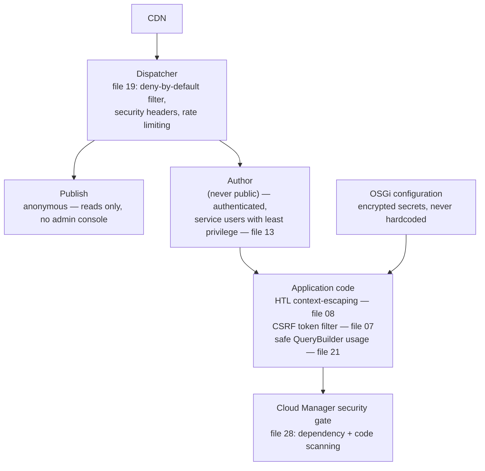

# 29 – Security Best Practices for AEM Developers

> **Target:** 3–4 years experienced AEM Developer
> **Covers from your additional list:** security best practices — pulling together and extending the security threads already touched in files 07, 08, 13, 19 and 28 into one coherent picture.
> **Project domain:** a global energy technology company's marketing site.

---

## Before we start — why this file is mostly cross-references, on purpose

If you've read through this repository in order, you've already met most of AEM's security surface without it being labelled "security": HTL's automatic contextual escaping (file 08), the CSRF token filter (file 07), the deny-by-default dispatcher filter (file 19), service users and least privilege (file 13), and the security gate in the Cloud Manager pipeline (file 28). That's not an accident, and it's actually the right way to think about security in an interview: **it isn't one topic bolted on at the end, it's a property that shows up in every layer**, and an interviewer who asks "how do you think about security in AEM" is really asking whether you can name the specific mechanism at each layer rather than give a generic answer about "following best practices."

This file's job is to pull those threads into one place, add the pieces that don't have a natural home elsewhere (the CSRF token lifecycle in depth, encrypted OSGi properties, SSRF, dependency vulnerabilities), and give you the single coherent narrative an interviewer is actually listening for.

---

## 1. Introduction

### 1.1 The AEM security surface, as one picture



Every one of those boxes is a place where a specific, nameable mechanism does a specific job. That's the structure this file follows.

### 1.2 A real project example

**Requirement.** A "Request a Quote" form on the energy company's site needed to call an internal pricing API and email the result to the sales team.

**What made it a security-relevant story.** The first draft built the outbound API URL by concatenating a product code the visitor selected from a dropdown directly into the request URL, and rendered the confirmation message using the visitor's freely-typed name field without going through the model's escaping path.

**What actually went wrong, and how it surfaced.** Nothing went wrong in production — the Cloud Manager security gate flagged the string-built URL as a hotspot (file 28), and a code reviewer caught the raw name field being rendered with `context='unsafe'` copied from another component without the justification that made it safe there (an XSS hole, file 08's exact warning about the "mirror-image bug").

**The fix.** The product code was validated against a fixed list before use, and the confirmation message went back through the default HTML-escaping context.

**The lesson.** Neither issue was exotic — they were the two most common AEM security mistakes, caught by the two most ordinary mechanisms: a quality gate and a human reviewer who actually read the diff rather than trusting that "it looks like the pattern next to it."

---

## 2. Core Concepts

### 2.1 Cross-Site Scripting (XSS) — the recap, and what to add

File 08 already covers the mechanism in depth: HTL escapes by context automatically, and `context='unsafe'` is the one place a developer can reintroduce the hole. The one thing worth adding here: **XSS risk isn't limited to HTL.** A servlet writing a raw JSON or HTML response with `response.getWriter().write(...)` gets none of HTL's automatic protection — if that servlet ever echoes back a request parameter, it needs the same escaping discipline applied by hand (or via a library, never by manual string surgery).

### 2.2 Cross-Site Request Forgery (CSRF) — the mechanism in full

File 07 established that AEM ships a CSRF token filter and that a public POST endpoint needs it. Here's the mechanism itself:

- A page load includes a CSRF token, obtainable from `/libs/granite/csrf/token.json`, tied to the visitor's session.
- A state-changing request (POST, PUT, DELETE) is expected to include that token, typically as a header (`CSRF-Token`) or a hidden form field.
- AEM's **Referrer Filter** and **CSRF filter** validate the token before the request reaches application code — for excluded paths, they don't, so a public form endpoint that opts out of the filter (often because it's meant to be called from outside the page, e.g. an API) takes on the responsibility of validating the token itself, or must accept the CSRF risk consciously rather than by accident.

**Why this matters:** a forged cross-site POST works precisely because a browser automatically attaches a visitor's session cookie to any request to a site they're logged into, regardless of which site initiated it. The token defeats this because an attacker's page has no way to read it — same-origin policy blocks that — so a forged request can't include a valid token even though it can include valid cookies.

### 2.3 Injection — recap and the AEM-specific case

Standard injection concerns (SQL injection) mostly don't apply directly to a JCR-backed repository, but the **equivalent risk exists in JCR-SQL2/XPath and QueryBuilder predicate construction** (file 21) — building a query by concatenating unvalidated input lets an attacker manipulate the query's meaning, not just its intended parameter. File 28 already showed this as a Sonar-flagged security hotspot; the fix is the same principle SQL injection defenses use: never build a query from untrusted string concatenation, validate or parametrise instead.

### 2.4 Access control and least privilege — recap

File 13's whole subject is this: service users scoped to exactly what they need, ACLs following deny-wins-at-same-level and closest-ACL-wins, and the specific anti-pattern file 28 flagged independently — `getAdministrativeResourceResolver()` as a shortcut that bypasses this entire model. The security angle worth adding: **a service user with `jcr:all` "to be safe" is a bigger blast radius than the code that uses it ever needed**, and every credential or session an application holds is a thing that can eventually be misused, intentionally or by a bug — so granting only what's used isn't caution for its own sake, it's bounding the damage a future mistake can do.

### 2.5 Server-Side Request Forgery (SSRF)

**The risk that doesn't have a natural home in an earlier file.** Any AEM service or servlet that makes an outbound HTTP call based on user-influenced input (a URL, a hostname, even a path fragment used to build one) can potentially be tricked into requesting an internal resource the attacker couldn't otherwise reach directly — an internal admin endpoint, a cloud metadata service, or another service on the private network.

**The defence:** validate that any user-influenced part of an outbound request matches an allow-list of expected values or hosts, rather than trusting it to only ever contain what the UI intended to send. This is the same discipline as the injection defence — untrusted input shapes *what* gets requested only within bounds you've explicitly permitted, never arbitrarily.

### 2.6 Sensitive configuration — never hardcoded, and never plaintext where avoidable

File 28 already flagged a hardcoded, credential-shaped string as both a code smell and a security hotspot. The fuller picture: OSGi configuration properties that hold genuinely sensitive values (an API key, a shared secret) should use AEM's built-in property encryption — a value saved through the OSGi configuration UI in the form `{ENC}...` is encrypted at rest using the instance's key, rather than sitting in plaintext in a `.cfg.json` file that ends up in a content package (and therefore in Git, per file 25). Committing a plaintext secret into a Git-tracked configuration file is one of the more common real-world AEM security incidents, precisely because it's easy to do without noticing — the file looks like ordinary configuration.

### 2.7 Security headers — recap from the dispatcher layer

File 19 already covers the mechanics of setting headers like `X-Frame-Options`, `Referrer-Policy`, and a `Content-Security-Policy` at the dispatcher/web-server layer. The concept worth stating plainly here: **these headers are a browser-enforced second line of defence**, not a replacement for fixing an actual XSS hole — `X-Frame-Options: SAMEORIGIN` prevents a page from being framed by another site (defeating clickjacking) regardless of what the page's own code does, and a `Content-Security-Policy` can block inline scripts from executing even if one somehow got injected. Defense in depth: the application layer should still be correct, and the headers reduce the damage on the day it isn't.

### 2.8 Dependency vulnerabilities — recap from file 28

The Cloud Manager security gate scans for known vulnerabilities in dependencies, which is the platform-level answer to the practical problem that a third-party library used inside a bundle can carry a vulnerability nobody on the project wrote. The developer-level habit that supports this: don't add a dependency casually (file 25's Maven scope discipline extends here too) — an unused or outdated library is attack surface that provides no value.

### 2.9 Authentication and session handling on Cloud Service

Author instances are never public (file 14) — the entire authentication surface for a marketing site's editorial team is internal. Publish is anonymous by default for a marketing site, which is precisely why file 13's "works on author, blank on publish" pattern exists: publish has no session to be attacked in the way author does, because there's no login for a typical visitor at all. Where authentication does matter on the publish side — a gated content area, a headless API consumed by an authenticated mobile app — token-based authentication (OAuth-style bearer tokens) is the standard pattern, kept entirely separate from the author instance's own authentication.

---

## 3. Internal Working

### 3.1 How the CSRF token is actually validated

The token issued from `/libs/granite/csrf/token.json` is tied to the requester's session server-side. When a subsequent state-changing request arrives, AEM's CSRF filter checks the submitted token against what it expects for that session before the request is dispatched to the target servlet at all — the servlet's own code never runs if the token check fails, so a correctly configured endpoint gets this protection without writing any token-checking code itself.

### 3.2 Why HTL's context escaping can't be bypassed accidentally, but can be bypassed deliberately

HTL infers escaping context (HTML, URI, JavaScript) from where an expression sits in the markup, by default. `context='unsafe'` is the single explicit override that disables this — which is exactly why file 08 treats it as a flag to justify in a code comment every time it's used: it's not that the mechanism is weak, it's that it has one deliberate door out, and every use of that door needs to independently prove the content was already safe (typically because a serialiser, not hand-built string concatenation, produced it).

### 3.3 How the dispatcher filter's deny-by-default posture actually stops an attack class

File 19 already covers `/filter`'s deny-by-default mechanics for legitimate traffic shaping. The security framing: an attacker probing for exposed admin endpoints (`/crx/de`, `/system/console`) on a public-facing publish tier is stopped at the dispatcher, before the request ever reaches AEM's own authentication check — one fewer thing that has to be perfectly configured on the AEM side for that endpoint to be inaccessible.

---

## 4. Important Interview Questions

### 4.1 Basic

**Q1. How does AEM prevent XSS?**
HTL escapes output automatically based on context — HTML in element content, URI in an `href`, JavaScript inside a script block — so escaping is the default rather than something a developer must remember.

*Cross:* What disables it? (**`context='unsafe'`**) · When is that acceptable? (only when a serialiser, not hand-built concatenation, produced the string) · Does this protect servlet responses too? (no — only HTL templates get it automatically)

**Q2. What is CSRF, and how does AEM protect against it?**
An attacker's page tricks a visitor's browser into sending a forged state-changing request to a site they're authenticated to. AEM's CSRF filter requires a token, obtained from `/libs/granite/csrf/token.json`, that an attacker's page can't read due to same-origin policy.

*Cross:* Why doesn't a stolen session cookie defeat this? (**the cookie is sent automatically by the browser; the token isn't, and can't be read cross-origin**) · What kind of request needs the token? (state-changing — POST/PUT/DELETE) · What happens for excluded paths? (the endpoint must handle the risk itself)

**Q3. What's the risk of `getAdministrativeResourceResolver()`?**
It bypasses the service-user permission model entirely, giving code full repository access regardless of what it actually needs — the opposite of least privilege.

*Cross:* What's the alternative? (**a named service user scoped to exactly what's needed — file 13**) · Is it flagged by tooling? (yes — Sonar, file 28) · Does it work identically on Cloud Service? (no — deprecated/unavailable in some contexts)

**Q4. Should a secret value ever be committed to Git in a `.cfg.json` file?**
Not in plaintext — AEM's OSGi configuration supports encrypted properties (`{ENC}...`), which should be used for anything genuinely sensitive.

*Cross:* What happens if a plaintext secret is committed anyway? (**it's in Git history permanently, even if later removed**) · Where does the encryption key live? (tied to the instance) · Is this specific to Cloud Service? (no — applies on 6.5 too)

### 4.2 Intermediate

**Q5. A service makes an outbound HTTP call to a URL partly built from user input. What's the risk, and the fix?**
SSRF — the input could be crafted to point the request at an internal resource the attacker couldn't otherwise reach. Validate the user-influenced part against an allow-list of expected hosts/paths rather than trusting it directly.

*Cross:* How is this similar to query injection? (**untrusted input shapes something dangerous unless bounded**) · Would a firewall alone fix this? (not fully — the request originates from inside the trusted network) · Give an AEM-specific example. (a service fetching a "preview" of an author-supplied external URL)

**Q6. Why is a dispatcher-level security header considered "defense in depth" rather than the main fix?**
Because it's a browser-enforced second line — it limits the damage of a flaw the application layer already has, but doesn't fix that flaw. An `X-Frame-Options` header stops clickjacking regardless of the page's own code, but a genuine XSS hole in that code is still a hole.

*Cross:* Name a header that mitigates XSS specifically. (**Content-Security-Policy, restricting script sources**) · Should you rely on it instead of fixing the actual escaping bug? (**never**) · Where are these headers set? (the dispatcher/web server layer — file 19)

**Q7. How would a QueryBuilder-based search be vulnerable to injection, and how do you prevent it?**
If a predicate value is built by concatenating unvalidated user input into a raw JCR-SQL2/XPath string rather than using the predicate map API safely, an attacker can manipulate the query's meaning. Prevent it by using the predicate map API as intended and validating/bounding any input that reaches a query at all.

*Cross:* Does the predicate map API fully prevent this by itself? (**mostly, if used as intended rather than concatenated into a raw statement**) · What did file 28 call this kind of finding? (a security hotspot) · What's the AEM-specific angle versus classic SQL injection? (no traditional SQL, but the same class of risk in JCR-SQL2/XPath)

**Q8. Why is publish typically anonymous, and why isn't that itself a security problem?**
A marketing site is meant to be publicly readable — anonymous access to read content isn't a vulnerability, it's the intended behaviour. The security boundary is that publish should have no write access, no admin console exposure, and no path to author, all enforced at the dispatcher and ACL layers.

*Cross:* What would make anonymous access on publish actually dangerous? (**write access, or an exposed admin path**) · Does file 13's ACL model still matter on an anonymous-read site? (yes — for any gated or member-only content) · Where is admin console access blocked for anonymous visitors? (the dispatcher filter, file 19)

### 4.3 Advanced

**Q9. Walk through the full defense-in-depth picture for a public form submission on this site.**
*(The Q19-style walkthrough — dispatcher filter allows the specific endpoint, CSRF token validated before the servlet runs, input validated and size-limited in the servlet, output rendered back through HTL's default escaping, any outbound call from the servlet validated against an allow-list, and the whole codebase scanned by the Cloud Manager security gate before it ever reached this environment.)*

*Cross:* Which single layer, if missing, would be most dangerous? (**arguably output escaping, since it's the last line before a visitor's browser executes something**) · Which layer catches a mistake before it ever reaches a real environment? (the Cloud Manager gate) · Which layer is a browser-enforced backstop rather than an application fix? (security headers)

**Q10. Your team wants to skip the CSRF filter for a specific endpoint because "the token handling is inconvenient." How do you respond?**
Ask what the endpoint actually does — if it's genuinely state-changing and reachable by an authenticated session, excluding it removes real protection, not just inconvenience, and the team needs to either handle the token correctly or have a specific, justified reason (like the endpoint being called by a non-browser client that can't carry a token) rather than convenience alone.

*Cross:* What's a legitimate reason to exclude an endpoint? (a server-to-server API call authenticated a different way) · Is that the same situation as a form submitted from a browser? (**no — very different risk profile**) · What would you document if you did exclude it? (the actual authentication mechanism replacing the token, and why it's sufficient)

---

## 5. Cross Questions — how this topic gets drilled

The standard chain starts broad and narrows fast: **"How do you think about security in AEM?"** → *Give me a specific mechanism, not a general answer.* → *(HTL's contextual escaping)* → *What's the one way to turn that off?* (`context='unsafe'`) → *When is that actually safe?* (only when a serialiser produced the string) → *Give me an example where it wasn't safe.* (the mirror-image bug from file 08 — a plain-text field given `unsafe` by habit)

A second chain tests whether CSRF and session hijacking are understood as different problems: **"Why doesn't a stolen cookie defeat the CSRF token?"** → *because the browser attaches cookies automatically to any request, but the token can't be read cross-origin* → *So what does the CSRF token actually prove?* (**that the request originated from a page that could read the token — i.e., the real site**) → *Does HTTPS alone solve CSRF?* (no — it protects against network interception, a different threat)

A third, more senior chain goes after the "gate equals safety" trap directly: **"If the Cloud Manager security gate passes, is the application secure?"** → *What kinds of risk doesn't a static/dependency scan catch?* (SSRF requiring business-logic context, access-control misconfiguration, a service user with too much privilege that's technically valid but overly broad) → *So what closes that gap?* → *(human review, and least-privilege discipline as a design habit, not a scan result)*

---

## 6. Best Interview Answers

**"How do you think about security across an AEM project?"** — *about 100 seconds*

> "I think about it as a stack of specific mechanisms rather than one general practice. At the dispatcher, a deny-by-default filter and security headers stop a class of attack before it ever reaches AEM. At the application layer, HTL escapes output by context automatically, so XSS is something you have to actively opt out of with `context='unsafe'` rather than something you have to remember to prevent — and every use of `unsafe` needs its own justification, not a copy-pasted one. State-changing requests go through AEM's CSRF token filter, which works because an attacker's page can read a visitor's cookies automatically but can't read the token due to same-origin policy. Access is scoped through service users with exactly the permissions they need, never an admin-session shortcut. And configuration secrets are encrypted, never plaintext, because a `.cfg.json` file ends up in Git.
>
> The part I'd emphasise is that none of these layers is optional insurance for the others — an XSS hole is still a real hole even with good security headers, and a security header is what limits the blast radius on the day the application layer isn't perfect. And on Cloud Service, the pipeline's security gate catches known-vulnerable dependencies and a class of code-level findings before any of this ever reaches a real environment — which is a backstop, not a substitute for writing it correctly in the first place."

---

## 7. Real Project Examples

### Story 1 — The plaintext API key that lived in Git for eight months

**What happened.** An integration with an external pricing service was configured with the API key as a plain OSGi configuration property, committed as part of `ui.config` like any other setting.

**Why nobody noticed.** It worked. It looked exactly like every other configuration value in the file, and nothing in the day-to-day development process flagged it as different.

**How it surfaced.** A security review ahead of a client audit specifically grepped configuration files for credential-shaped values, and found it — still valid, still in Git history even after someone eventually "fixed" it by changing the live value (the old key remained readable in history).

**The fix.** Rotated the key, reconfigured it as an encrypted (`{ENC}...`) property, and added a pre-commit check scanning for credential-shaped strings in configuration files.

**The lesson to state:** *"A secret in a Git-tracked config file isn't fixed by changing the value later — the old one is still in history. The fix has to be encryption at the point of configuration, plus catching it before the first commit, not after."*

### Story 2 — The `context='unsafe'` copied by reflex

**This is the same incident file 08 tells from the HTL angle — worth being able to connect the two framings.** A developer, having previously hit a rendering problem that `context='unsafe'` happened to fix, applied the same fix to an unrelated field on a different component without understanding why it had worked the first time. The second field accepted arbitrary visitor-typed text with no rich-text restriction, and `unsafe` there was a genuine, exploitable XSS hole.

**The lesson to state:** *"A fix that isn't understood gets copied to the next problem that looks similar, whether or not the underlying reason still applies. `context='unsafe'` is only ever safe because of what produced the string — not because it worked somewhere else."*

### Story 3 — The internal service used as a reflection point

**What happened.** A "fetch external preview" feature let an editor supply a URL that a backend service would fetch and summarise for a content recommendation panel.

**The cause.** The service made the outbound request directly from whatever URL was supplied, with no validation of the host — a textbook SSRF opportunity. It was caught in a security review, not in production, when a reviewer asked "what happens if this URL points at an internal address instead of a public one?"

**The fix.** The service validated that the target resolved to a public, non-internal address before making the request, and rejected anything else.

**The lesson to state:** *"Any code that makes an outbound request based on input a person controls needs to ask 'what if this points somewhere I didn't intend' — the same question query-building and access control already ask, applied to a different kind of request."*

---

## 8. Coding Examples

### 8.1 CSRF token attached to a fetch request

```javascript
// Fetch the token, then attach it as a header on the state-changing request.
// A forged request from another origin cannot read this token — same-origin
// policy blocks it — even though the browser would still attach cookies.
fetch('/libs/granite/csrf/token.json')
  .then((res) => res.json())
  .then(({ token }) => fetch('/bin/energy/quote-request', {
    method: 'POST',
    headers: { 'CSRF-Token': token, 'Content-Type': 'application/json' },
    body: JSON.stringify(formData)
  }));
```

### 8.2 Validating an outbound URL against an allow-list (SSRF defence)

```java
// Rejects anything that isn't a known-safe destination, rather than
// trusting a caller-supplied URL to only ever point where intended.
private boolean isAllowedHost(String url) {
    try {
        URI uri = new URI(url);
        return ALLOWED_HOSTS.contains(uri.getHost());
    } catch (URISyntaxException e) {
        return false; // malformed input is rejected, not tolerated
    }
}
```

### 8.3 Encrypted OSGi configuration property

```json
{
  "pricing.api.key": "{ENC}AbCdEf1234567890EncryptedValueHere=="
}
```

```text
The plaintext value is entered once through the OSGi configuration UI —
AEM encrypts it using the instance's key and stores the {ENC}... form.
The plaintext never appears in the exported .cfg.json that ends up in Git.
```

---

## 9. Common Mistakes

| Mistake | Why it happens | The actual cost |
|---|---|---|
| Committing a plaintext secret to a config file | Looks like any other configuration value | Permanently in Git history, even after rotation |
| Copying `context='unsafe'` from another component | The pattern "worked" elsewhere | A genuine XSS hole on a field with no restriction |
| Excluding a form endpoint from the CSRF filter for convenience | Token handling feels like friction | Removes real protection against forged requests |
| Building a query from concatenated user input | Feels like the fastest way to filter results | Query injection, and a flagged Sonar hotspot |
| Using `getAdministrativeResourceResolver()` under deadline pressure | Faster than configuring a service user | Bypasses least privilege, flagged by tooling, inconsistent on Cloud Service |
| Trusting a caller-supplied URL for an outbound request | No obvious "attacker" in an internal tool | SSRF against internal infrastructure |
| Treating a passed security scan as proof of safety | Conflates automated coverage with actual review | Business-logic and access-control gaps a scanner can't see ship anyway |
| Granting a service user broad privilege "to be safe" | Avoids revisiting permissions later | A larger blast radius than the code ever needed |

---

## 10. Best Practices

- **Never override HTL's default escaping without a specific, stated reason** — and only when a serialiser, not manual concatenation, produced the string.
- **Never exclude a state-changing endpoint from CSRF protection for convenience** — only for a genuinely different authentication mechanism, documented as such.
- **Validate and bound any input that reaches a query or an outbound request** — never build either by raw string concatenation from user input.
- **Use a scoped service user, never an admin-session shortcut**, and grant only what the code actually uses.
- **Encrypt sensitive OSGi configuration values**, and never assume "I'll rotate it later" undoes a plaintext commit.
- **Treat security headers as a backstop, not a fix** — they reduce blast radius; they don't replace correct application code.
- **Don't add a dependency casually** — every library is attack surface, whether or not it's ever exploited.
- **Ask "what if this input points somewhere I didn't intend" for any code that builds a query, a URL, or a file path from user-influenced data.**

---

## 11. Debugging Tips

| Symptom | Where to look | What it usually means |
|---|---|---|
| A form submission fails with a 403/token error | Whether the CSRF token was fetched and attached correctly | Token missing, expired, or the endpoint excluded incorrectly |
| Unexpected script execution or malformed rendering of user content | Every `context='unsafe'` usage touching that content path | An escaping override applied somewhere it shouldn't be |
| A Sonar security hotspot on a query or URL-building line | Where the value being concatenated actually comes from | Untrusted input reaching a query or outbound request unvalidated |
| A configuration file has a suspicious-looking plaintext value | Whether it should be an `{ENC}...` encrypted property | A secret committed in plaintext |
| A service is being used to reach an unexpected internal address | Whether it validates the target of any outbound request | An SSRF gap |

---

## 12. Performance Notes

Security checks add negligible runtime cost relative to the cost of an incident: CSRF token validation and HTL's context-aware escaping are effectively free per-request operations; input validation on a form endpoint is a handful of checks, not a bottleneck. Where security work does have a cost is developer time — validating an allow-list, encrypting a config value, writing the code review that catches a copied `unsafe` usage — and that cost is what a Cloud Manager security gate and disciplined code review are there to make routine rather than heroic.

---

## 13. Real Production Scenarios

1. A form endpoint returns a 403 after a CSRF token refactor — check whether the token is actually being fetched fresh per session rather than cached indefinitely.
2. A new component's rich-text field renders raw markup as visible tags instead of formatted text — likely missing `context='html'`, not a security bug, but worth double-checking the RTE's allowed plugins before adding it (file 08's policy point).
3. A security review flags an OSGi config file with a plaintext-looking value — rotate the credential and reconfigure it as encrypted, don't just delete the line.
4. An internal tool that fetches a URL a user supplies is flagged in a penetration test for SSRF — add host validation before the fetch, not just a comment saying "internal use only."
5. A developer asks to exclude a new public API endpoint from the CSRF filter because "it's called by JavaScript, not a form" — clarify that JavaScript-initiated requests from the browser carry the same forgery risk as a form submission; the token still applies.
6. A QueryBuilder-based search endpoint is flagged by Sonar for a security hotspot — check whether any predicate value comes from unvalidated user input built into a raw string.
7. A service user for a new integration is provisioned with `jcr:all` "to avoid permission issues during development" — scope it down before it ships, not after.
8. A dependency flagged by the Cloud Manager security gate has no available patched version — evaluate whether the vulnerable code path is actually reachable in this project's usage, and document the decision rather than silently ignoring the finding.
9. An author reports that a public-facing form shows a generic error with no detail — this is correct behaviour (never leak stack traces or internal detail to a public response), even though it's frustrating to debug from the outside.
10. A code review catches `context='unsafe'` on a new field with no comment explaining why it's safe — request the justification before approving, per file 08's own standard.
11. A team wants to skip a security header because "it breaks an embedded widget from a partner site" — solve it with a scoped exception (an explicit allowed frame-ancestor) rather than removing the header project-wide.
12. An incident review finds a bundle exhausted resource-resolver capacity — trace it to a missing `try-with-resources` (file 20's leak, file 28's Sonar finding) rather than assuming it was a traffic spike.

---

## 14. Follow-up Questions

- Why is "the pipeline's security gate passed" not the same claim as "this feature is secure"? (business-logic and access-control risks a scanner can't evaluate)
- What's the practical difference between defending against XSS and defending against CSRF? (one is about what a page renders; the other is about what request a browser is tricked into sending)
- Why does least privilege matter even for code that "would never actually misuse" a broad permission? (bounds the damage of a future bug or a future change to that code, not just today's intent)
- What's the actual mechanism that makes `context='unsafe'` sometimes safe and sometimes not? (whether a serialiser or hand-built concatenation produced the string)

---

## 15. Comparison Tables

| | **XSS** | **CSRF** | **SSRF** |
|---|---|---|---|
| What's exploited | Unescaped output rendered by a victim's browser | A browser automatically attaching cookies to a forged request | A server making a request an attacker steers |
| Primary AEM defence | HTL context-aware escaping | CSRF token filter | Input validation / allow-listing on outbound calls |
| Where it "lives" | Application/template layer | Request-handling layer | Service/backend layer |

| | **Security header (dispatcher)** | **Application-layer fix** |
|---|---|---|
| Enforced by | The visitor's browser | The application's own code |
| Fixes the root cause? | No — reduces blast radius | Yes |
| Example | `X-Frame-Options`, CSP | Correct HTL escaping, validated queries |

| | **Admin-session shortcut** | **Scoped service user** |
|---|---|---|
| Privilege granted | Everything | Exactly what's used |
| Flagged by tooling | Yes (file 28) | No |
| Consistent on Cloud Service | Not reliably | Yes |

---

## 16. Memory Tricks

- **"Escaping is the default; `unsafe` is the one deliberate door out — and it needs a reason every time."**
- **"A cookie is sent automatically; a token can't be read cross-origin."** The whole CSRF defence in one sentence.
- **"Headers are a backstop, not a fix."** They limit damage; they don't replace correct code.
- **"Any input that shapes a query, a URL, or a path needs an allow-list, not trust."** Covers injection, SSRF, and path traversal in one habit.
- **"A secret in Git isn't fixed by changing it later — the old one is still in history."**

---

## 17. Revision Notes

Security in AEM isn't one topic — it's a property of every layer already covered elsewhere in this repository: HTL's automatic contextual escaping defeats XSS by default (file 08), with `context='unsafe'` as the one deliberate, always-justify-it override; AEM's CSRF token filter defeats forged requests because a token, unlike a cookie, can't be read cross-origin (file 07); service users and least privilege bound the damage any one piece of code can do (file 13); the dispatcher's deny-by-default filter and security headers add a browser- and network-enforced backstop (file 19); and the Cloud Manager security gate catches known-vulnerable dependencies and flagged code patterns before any of it reaches a real environment (file 28). What this file adds on top: SSRF as the class of risk in any outbound request shaped by user input, encrypted OSGi configuration for genuinely sensitive values (never plaintext in a Git-tracked file), and the central discipline underneath all of it — any point where untrusted input shapes a query, a URL, a rendered value, or a granted permission needs validation or bounding, never blind trust.

---

## 18. Cheat Sheet

```text
XSS      → HTL escapes by context automatically; unsafe = justify every time
CSRF     → token from /libs/granite/csrf/token.json; can't be read cross-origin
Injection→ never build a query/URL from raw concatenated user input
SSRF     → validate/allow-list any outbound request shaped by user input
Access   → scoped service users, least privilege, never admin-session shortcuts
Secrets  → {ENC}... encrypted OSGi properties, never plaintext in Git
Headers  → X-Frame-Options / CSP / Referrer-Policy — backstop, not a fix
Pipeline → Cloud Manager security gate catches known-vulnerable dependencies
```

---

## 19. Frequently Forgotten Things

1. `context='unsafe'` is safe only because of *what produced the string* — never because it worked somewhere else.
2. A stolen cookie doesn't defeat CSRF protection; the token is the thing an attacker's page can't read.
3. A secret committed to Git is still in history even after the live value is rotated.
4. Security headers reduce blast radius; they never fix the underlying application bug.
5. `getAdministrativeResourceResolver()` is a flagged anti-pattern, not a convenient shortcut.
6. SSRF is a real risk in any AEM service making an outbound call shaped by user input, not just a generic-web-app concern.
7. A passed Cloud Manager security gate doesn't mean the feature is secure — it means known patterns and known-vulnerable dependencies were checked, not business logic or access-control design.
8. Anonymous read access on a public marketing site's publish tier is expected behaviour, not a vulnerability by itself — the boundary is write access and admin exposure.

---

## 20. Final Interview Summary

Security in AEM is best explained as a stack of specific, nameable mechanisms rather than a general principle: HTL's contextual escaping against XSS, the CSRF token against forged requests, service-user least privilege against overbroad access, dispatcher-level headers and filtering as a browser-enforced backstop, and the Cloud Manager quality/security gates catching known patterns and vulnerable dependencies before anything reaches a real environment. The thread running through all of it is the same question asked at every layer: does untrusted input get to shape something dangerous — a rendered value, a query, an outbound request, a granted permission — without being validated or bounded first? An interviewer testing this topic is listening for that specificity, not a recitation of OWASP category names.

---

## 21. Mock Interview

**Q1. How does AEM defend against XSS by default?**
> "HTL escapes every expression automatically, choosing the escaping based on where the value sits in the markup — HTML in element content, URI in a link, JavaScript inside a script block. That flips the usual problem: instead of remembering to escape everything, you have to actively opt out with `context='unsafe'` to create a hole, and every use of that needs its own justification — it's safe when a serialiser produced the string, and it's a real vulnerability when someone concatenated it by hand."

**Q2. Explain how CSRF protection actually works, mechanically.**
> "A page load can fetch a token from `/libs/granite/csrf/token.json`, tied to the visitor's session. A state-changing request is expected to include that token, and AEM's filter checks it before the request ever reaches application code. The reason this defeats CSRF specifically is that a browser automatically attaches a visitor's cookies to any request regardless of which site triggered it — that's what makes forgery possible in the first place — but same-origin policy means an attacker's page can't read the token, so a forged request can carry valid cookies and still fail the token check."

**Q3. What's the risk in building a QueryBuilder query from a raw request parameter?**
> "The same class of risk as SQL injection, applied to JCR-SQL2 or XPath — if you concatenate unvalidated input into the query string instead of using the predicate map API as intended, an attacker can manipulate what the query actually does, not just the value it searches for. It's exactly the kind of thing the Cloud Manager security gate flags as a hotspot, and the fix is the same principle as classic injection defences: never build a query from raw concatenated input."

**Q4. Why shouldn't a service user just be granted `jcr:all` to avoid permission headaches?**
> "Because the point of least privilege isn't distrust of the code that's there today — it's bounding the damage of a future bug or a future change to that code. A service user scoped to exactly what it uses limits what a mistake, or a compromise, can actually do. `jcr:all` 'to be safe' is actually the opposite of safe — it's the largest blast radius available, granted for convenience rather than need."

**Q5. If the Cloud Manager security gate passes, is the application secure?**
> "It means known-vulnerable dependencies and a set of flagged code patterns were checked — not that the application is secure end to end. It won't catch an SSRF-shaped business-logic gap, or a service user with more privilege than it needs but no invalid syntax, or an access-control decision that's technically correct code but wrong for the actual requirement. That's exactly why security still needs to be a habit in code review and design, not just a gate result — the gate is a floor, the same way file 28 makes that point about code quality generally."

---

## Next file

**Java fundamentals for AEM developers** — the core Java language features (collections, generics, exceptions, concurrency basics, streams) that show up throughout AEM development and testing, built up from first principles for a developer whose Java is still a work in progress.

---

*File 29 of the AEM Interview Preparation repository. Teaching style, energy-sector project domain.*
