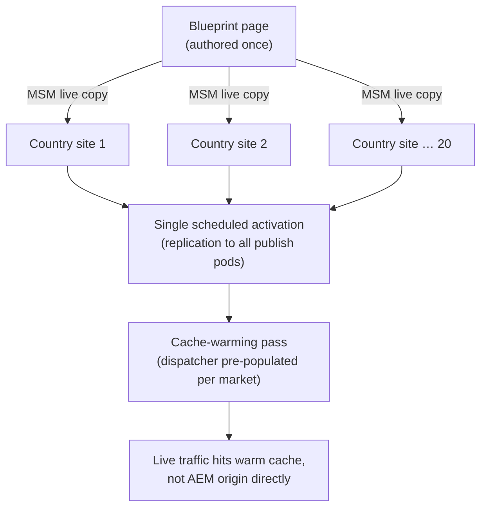
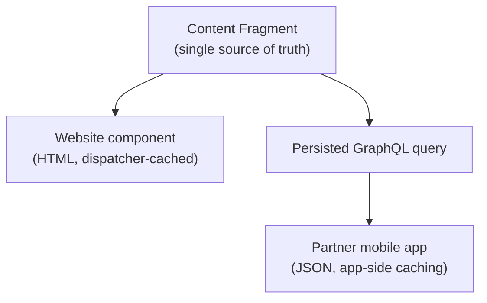

# 31 – System Design Basics for AEM Developers

> **Target:** 3–4 years experienced AEM Developer
> **Covers from your additional list:** system design basics — how to structure an open-ended "design a system" answer using the AEM building blocks this repository has already covered in depth.
> **Project domain:** a global energy technology company's marketing site.

---

## Before we start — why this isn't a generic system design file

At 3-4 years, an AEM-specific system design question is rarely "design Twitter." It's much more likely to be **"how would you architect a multi-country corporate site that needs to launch a campaign simultaneously in twenty markets without falling over"** or **"how would you let a mobile app and a website share the same content."** Those questions have a very specific right shape of answer, and the good news is you already have every building block — this file's job is to teach the *shape*, not introduce new AEM facts.

**The single biggest mistake at this level** is answering an AEM system design question with generic distributed-systems vocabulary (load balancers, sharding, message queues) borrowed from a general system design course, without ever mentioning Dispatcher, MSM, or the author/publish split — the exact things that make an AEM answer sound like it came from someone who's actually built one of these. This file is about grounding the generic system design *framework* in the specific AEM vocabulary you've already earned across files 01, 12, 14, 18, 19, 21, and 24.

---

## 1. Introduction

### 1.1 The framework, in one shape

Every system design answer, AEM or otherwise, follows roughly the same shape, and naming the steps out loud is itself a signal that you know how to structure an open-ended answer rather than free-associate:

1. **Clarify the requirements** — functional (what does it do) and non-functional (how fast, how available, how many markets, how much traffic).
2. **Sketch the high-level architecture** — the boxes and arrows, at the level file 01's diagrams operate at.
3. **Drill into the parts that matter most for this specific question** — don't go deep everywhere; go deep where the interesting trade-offs are.
4. **Name the trade-offs explicitly** — every real design choice costs something; saying so is more convincing than pretending there's a free lunch.
5. **Mention how you'd validate it** — what would tell you the design was wrong, and how you'd find out before it's expensive to fix.

### 1.2 The AEM-specific building blocks you already have

| Building block | File | What it solves in a system design answer |
|---|---|---|
| Author / Publish / Dispatcher / CDN | 01 | The base topology every AEM answer starts from |
| MSM (blueprint / live copy) | 12 | Multi-site, multi-market content reuse and rollout |
| Dispatcher caching, CDN layering | 19 | Read scalability and global latency |
| AEM as a Cloud Service (autoscaling, pods) | 14 | Elastic scale under variable traffic |
| Content Fragments / Experience Fragments | 15, 16 | Content reuse across channels and pages |
| Headless delivery (GraphQL, SPA Editor) | 24 | Sharing content with non-AEM-rendered channels (mobile apps, other frontends) |
| QueryBuilder / indexing limits | 21 | Where AEM's own search stops being the right tool |
| Replication / Sling Content Distribution | 18 | How content actually reaches every publish instance |
| Cloud Manager pipelines | 26 | How a design actually gets built and shipped safely |

**The exercise this file trains:** given a prompt, pick the right subset of this table and explain *why* each piece is there, rather than reciting the whole list regardless of the question.

### 1.3 A worked example, briefly, to set the pattern

**Prompt:** "How would you support a global product launch that needs the same campaign live in twenty country sites at 9am UTC simultaneously?"

**The answer's shape, not yet the full depth (that comes in section 7):** one blueprint page built once, live-copied to all twenty country sites via MSM with market-specific overrides where regulation requires them; content authored and reviewed ahead of time on lower environments; a single rollout triggering activation across all copies close to the launch moment; the dispatcher and CDN caching the pages aggressively once live, with a scheduled cache-warming step immediately after activation so the first real visitor in each market isn't the one paying the cold-cache cost. Every piece of that sentence is something files 12, 18, and 19 already taught — this file is about assembling them into one coherent narrative under a single prompt.

---

## 2. Core Concepts

### 2.1 Functional vs. non-functional requirements — and why AEM interviewers listen for the second kind

A functional requirement says *what* the system does ("editors can create a campaign page"). A non-functional requirement says *how well* it needs to do it — latency, availability, number of markets, traffic pattern, editorial team size. **The non-functional requirements are what actually drive the interesting AEM decisions.** "Twenty country sites" pushes you toward MSM. "A launch moment with a traffic spike" pushes you toward dispatcher/CDN cache warming and Cloud Service autoscaling. "A single article needs to appear on the website and inside a mobile app" pushes you toward headless delivery. Asking clarifying questions about these *before* sketching a diagram is itself part of a strong answer — it shows you're designing for the actual constraint, not a generic template.

### 2.2 Read-heavy vs. write-heavy, and why AEM's architecture assumes the former

A marketing site is overwhelmingly **read-heavy** — many visitors reading, a small editorial team writing — which is exactly why AEM's default architecture separates a write-optimised author instance from a read-optimised, cacheable, horizontally-scaled publish tier (file 01), and why the dispatcher/CDN caching layer (file 19) is where most of the actual scaling work happens. A system design answer that reaches for a database-scaling solution to a marketing-site traffic problem is solving the wrong layer — the fix for "the site is slow under load" is almost always caching further up the chain, not scaling the repository itself.

### 2.3 Content reuse — the AEM-specific version of "don't repeat yourself"

At the system design level, content reuse isn't a code pattern, it's an architectural decision about **where a single piece of truth lives and how it reaches every place that needs it**:

- **MSM (file 12)** — reuse a page's *structure and content* across sites, with live copies inheriting from a blueprint and picking up updates automatically unless explicitly overridden.
- **Content Fragments (file 15)** — reuse a piece of *structured content* (a product spec, a press release) across multiple pages and, via headless delivery, multiple channels entirely.
- **Experience Fragments (file 16)** — reuse a *fully composed piece of experience* (a promotional banner, a footer) across many pages without re-authoring it each time.

**The system design skill:** recognising which kind of reuse a requirement actually needs. "The same page structure in twenty languages" is MSM. "The same product spec on the product page, in a comparison table, and in the mobile app" is a Content Fragment. Picking the wrong one produces a design that technically works but fights the platform.

### 2.4 Where headless delivery changes the shape of the answer

The moment a requirement includes **any non-AEM-rendered consumer** — a native mobile app, a partner's website, a kiosk — the answer needs file 24's headless delivery model: Content Fragments as the unit of reusable structured content, GraphQL (persisted queries preferred for production traffic) as the delivery mechanism, and a clear line between content **authored** in AEM and content **rendered** somewhere else entirely. The system design mistake to avoid here is assuming the website's existing page-rendering pipeline can just be "exposed as an API" — it can't, cleanly; headless delivery is a genuinely different content model, not a different template engine on the same pages.

### 2.5 Scaling for a traffic spike — the AEM-specific answer, not the generic one

A generic system design course teaches horizontal scaling and load balancers as the answer to a traffic spike. In AEM terms, that maps to a specific, nameable set of mechanisms: the **dispatcher's cache absorbing nearly all read traffic before it reaches a publish instance at all** (file 19), the **CDN absorbing traffic before it reaches the dispatcher**, and, on AEM as a Cloud Service, the **publish tier autoscaling** (file 14) to add capacity for whatever traffic the caching layers don't absorb. The honest, senior-sounding point to make: **the best traffic-spike design is one where the origin (AEM itself) barely notices, because caching absorbed almost everything** — autoscaling the origin is the fallback for what caching couldn't catch, not the primary defence.

### 2.6 Consistency and staleness — the trade-off AEM already makes for you

Replication (file 18) and Lucene's asynchronous indexing (file 21) both mean AEM is **eventually consistent** by design in more than one place: a publish instance doesn't have brand-new content the instant an author activates it (replication takes a moment, and the dispatcher's own cache adds more delay until invalidated), and a query might not reflect content indexed moments ago. A system design answer that promises instantaneous global consistency for an AEM-based system is promising something the platform doesn't provide — the honest, correct answer names the actual staleness window and explains why it's acceptable for a marketing site's requirements (a few seconds to a few minutes of propagation delay is rarely the difference that matters for editorial content, but genuinely matters to call out for something like a stock ticker or a pricing display).

### 2.7 Search at scale — knowing when AEM's own tools stop being the right answer

File 21 already made the point that Oak's QueryBuilder is built for scoped, editorial-style lookups, not open-ended full-text search at real traffic volume with faceting and relevance tuning. A system design answer for "add search to the site" needs to recognise this fork explicitly: a scoped, low-volume lookup (find pages tagged with a category, for an admin tool) is fine through QueryBuilder; a public-facing, high-traffic, relevance-tuned search experience is a case for indexing content into a dedicated search service (commonly Elasticsearch or a similar engine) fed by AEM's content, rather than querying the repository directly on every visitor search. Saying this distinction out loud is a strong signal — it shows you know AEM's limits, not just its features.

---

## 3. Internal Working

### 3.1 How a multi-market launch actually propagates, end to end

Tracing the worked example from section 1.3 through the actual mechanisms: content is authored on the blueprint, live-copied to each country site (file 12), reviewed and approved on each market's live copy, then activated. Activation triggers **Sling Content Distribution / replication** (file 18) pushing the content to every publish pod. Each pod's dispatcher cache is empty for that specific page until the first request — or until a deliberate cache-warming step requests it proactively right after activation, which is the practical fix for "the very first real visitor pays the slow, uncached cost."

### 3.2 How autoscaling actually interacts with the caching layers

On AEM as a Cloud Service, the publish tier can add pods under load (file 14) — but this only helps for the traffic that actually reaches a publish pod, which, with effective dispatcher and CDN caching, should be a small fraction of total visitor traffic. A design that relies on autoscaling *instead of* caching is scaling the expensive layer to cover for a cheap layer that isn't doing its job.

### 3.3 Why a headless and a traditional-rendered channel can share content but not a rendering pipeline

A Content Fragment's structured data is channel-agnostic by design (file 15) — it's the same underlying content whether it's rendered into an HTML page via a component or serialised as JSON via GraphQL (file 24). What's genuinely different between the two channels is everything **downstream** of that content: page composition, component-level presentation logic, caching strategy (dispatcher caching for HTML, persisted-query caching for GraphQL) — which is why "just expose the existing pages as an API" undersells how much actual design work headless delivery requires.

---

## 4. Important Interview Questions

### 4.1 Basic

**Q1. How would you start answering an open-ended AEM system design question?**
Clarify functional and non-functional requirements first — especially traffic pattern, number of markets, and whether any non-AEM channel needs the same content — before sketching architecture.

*Cross:* Why not just start drawing boxes? (**you might design for the wrong constraint**) · What's a non-functional requirement specific to AEM system design? (traffic spike timing, number of language/market sites, editorial team size) · What if the interviewer doesn't give you those details upfront? (ask — it's expected, not a sign of weakness)

**Q2. A marketing site needs to handle a traffic spike for a product launch. What's the AEM-specific approach?**
Rely primarily on dispatcher and CDN caching to absorb the traffic before it reaches AEM at all, with Cloud Service autoscaling as the fallback for whatever isn't cached, plus a cache-warming step right after activation.

*Cross:* Why not just autoscale? (**it scales the expensive layer instead of fixing why traffic reaches it at all**) · What's cache warming? (proactively requesting pages after activation so the first real visitor isn't the one paying the cold-cache cost) · Does this apply on 6.5 too? (dispatcher caching yes; autoscaling is Cloud Service-specific)

**Q3. How would you support the same page structure across twenty country sites?**
MSM — a blueprint page live-copied to each country site, with market-specific overrides where needed and updates propagating automatically unless explicitly cancelled.

*Cross:* What if one market needs materially different content, not just a translation? (**break live copy inheritance for that component or property — file 12**) · Does this scale to twenty markets practically? (yes — it's the exact scenario MSM is designed for) · What's the alternative, and why is it worse? (twenty independently authored sites — no shared updates, quadratic maintenance cost)

**Q4. A requirement says the same product content needs to appear on the website and inside a native mobile app. What's the design?**
Model the content as Content Fragments, delivered to the website via components and to the mobile app via GraphQL (persisted queries for production), rather than trying to expose the website's own rendered pages as an API.

*Cross:* Why not just have the app call the website's HTML pages and parse them? (**fragile, and couples the app to presentation, not content**) · What's a persisted query and why prefer it for the app? (a named, pre-validated query, safer and more cacheable than ad-hoc — file 24) · Does the website still get its own rendering pipeline? (yes — headless is additive, not a replacement)

### 4.2 Intermediate

**Q5. Design a search feature for the site. What would make you choose QueryBuilder versus a dedicated search service?**
Scoped, low-traffic, structural lookups (an admin tool searching by tag) fit QueryBuilder fine. A public-facing, high-volume, relevance-tuned search experience is better served by a dedicated search engine fed by AEM's content, because QueryBuilder isn't built for that kind of workload.

*Cross:* What's the actual mechanism that makes QueryBuilder unsuitable at that scale? (**traversal risk without a matching index, and Lucene's asynchronous indexing lag — file 21**) · How would content get from AEM into the external search index? (an event listener or scheduled job pushing updates, or the search platform's own connector) · Would you build this on day one? (only if the requirement genuinely needs it — don't over-engineer a small site's search)

**Q6. How would you explain the staleness/consistency trade-off in an AEM-based design to a non-technical stakeholder?**
Content isn't visible everywhere the instant it's activated — replication and cache invalidation take a short window, typically seconds, occasionally longer under load — which is a reasonable trade for a marketing site, but worth calling out explicitly for anything time-sensitive, like a live pricing display.

*Cross:* What specifically causes the delay? (**replication propagation and dispatcher cache invalidation — files 18 and 19**) · Would this be acceptable for a stock ticker? (no — that needs a different, near-real-time delivery mechanism entirely, not standard page caching) · How would you reduce the window if it mattered? (shorter cache TTLs, proactive invalidation, or bypass caching for that specific data point)

**Q7. A stakeholder wants true real-time content updates with zero staleness. How do you respond?**
Push back on the requirement's cost, honestly: near-zero staleness generally means giving up most of the caching that makes the site scale cheaply, which is a real trade-off, not a free upgrade — and ask whether the actual requirement is "very fast" (seconds, achievable) or truly "instantaneous" (expensive, usually unnecessary for marketing content).

*Cross:* Is there a middle ground? (**short cache TTLs plus proactive invalidation on publish, rather than removing caching entirely**) · What's an actual case where true real-time matters? (a live event countdown, or genuinely live pricing) · How would you design for that specific case without redesigning the whole site's caching? (isolate it — fetch that one data point client-side, uncached, rather than uncaching the whole page)

### 4.3 Advanced

**Q8. Design the full architecture for a global product launch across twenty country sites, including the failure modes you'd plan for.**
*(The section 1.3/7 worked example, extended with failure modes: what if replication to one market's publish pods fails silently — monitor replication queue health, file 18; what if the launch page wasn't cache-warmed and the first minute is slow — accept it or warm proactively; what if a market-specific legal requirement means that market's page can't go live at the same instant — MSM's inheritance-cancellation lets that one page diverge without breaking the other nineteen.)*

*Cross:* What single point of failure would you be most worried about? (**a shared component or blueprint change breaking all twenty sites simultaneously — test on lower environments first**) · How would you validate the design before launch day? (a rehearsal on a staging environment with realistic traffic simulation) · What would you monitor in real time during the launch? (replication queue depth, dispatcher cache hit ratio, publish tier autoscaling activity)

**Q9. A design decision to add a dedicated search service alongside AEM has been made. What are the new failure modes and trade-offs it introduces?**
A second system to keep in sync with AEM's content, a new potential source of staleness (the search index lags AEM's actual content until the sync mechanism runs), and a new operational dependency — the site's search now depends on that service's availability too, not just AEM's.

*Cross:* How would you keep the two in sync? (an event listener on publish, or a scheduled reindex, chosen based on how fresh search results need to be) · What happens if the search service is down? (**degrade gracefully — a "search temporarily unavailable" state, not a broken page**) · Is this trade-off worth it? (yes, once traffic and search-quality requirements genuinely exceed what QueryBuilder was built for — not before)

---

## 5. Cross Questions — how this topic gets drilled

The standard chain checks whether you actually structure an answer rather than free-associate: **"Design a multi-country launch"** → *what would you ask before drawing anything?* → *(traffic pattern, number of markets, any market-specific legal constraints, launch timing)* → *now sketch it* → *where's the highest risk in that design?* → *how would you reduce it?*

A second chain tests whether "caching" is understood as the actual scaling mechanism, not a footnote: **"How does this design handle ten times the expected traffic?"** → *what absorbs that traffic first?* (dispatcher/CDN cache) → *what if it's not cacheable — genuinely personalised content?* → *(then you're closer to needing origin scaling, and the design changes materially)* → *does AEM autoscale help here?* (only for what reaches the origin at all)

A third, senior-leaning chain goes after honest trade-off framing directly: **"Your design promises real-time updates everywhere. Is that actually true?"** → *what's the actual staleness window?* → *why does it exist?* (replication + cache invalidation delay) → *is that acceptable, and for what kind of content would it not be?*

---

## 6. Best Interview Answers

**"How would you approach an AEM system design question you haven't seen before?"** — *about 75 seconds*

> "The same shape regardless of the specific prompt. First, clarify the non-functional requirements, because those are what actually drive the interesting decisions in AEM specifically — how many markets, what the traffic pattern looks like, whether any non-AEM channel needs the same content. Then I'd sketch the high-level architecture using AEM's actual building blocks — author, publish, dispatcher, CDN as the base, and then whichever of MSM, Content Fragments, headless delivery, or a dedicated search service the requirements actually call for, rather than reciting all of them regardless of the question.
>
> Then I'd go deep only where the interesting trade-off actually is — for a multi-market launch, that's usually replication timing and cache warming; for a headless requirement, it's the content model, not the rendering. And I'd be explicit about the trade-offs rather than presenting the design as free — AEM is eventually consistent by design, and a design that promises instant global consistency is promising something the platform doesn't actually do."

---

## 7. Real Project Examples

### Design walkthrough 1 — The twenty-market simultaneous launch (worked in full)

**Requirement.** A new transformer product line needed its launch page live in all twenty country sites at the same moment, timed to a global press announcement.

**Architecture.** One blueprint page authored and reviewed on the corporate site, live-copied to all twenty country sites via MSM, each market translating and adjusting only what genuinely needed to differ (a compliance disclaimer required in two specific markets, handled with a targeted inheritance cancellation — file 12 — rather than breaking the whole page out of the live copy relationship).

**The hard part.** Getting all twenty markets to activate within the same short window, given that content review sign-off happened on different schedules across time zones.

**The approach.** A single scheduled activation job, configured once the last market's approval landed, replicating all twenty pages together rather than depending on twenty separate manual activations — removing the human-timing risk entirely.

**What we still had to plan for.** The first real visitor in each market would otherwise hit a cold dispatcher cache right at the highest-traffic moment of the launch. A cache-warming step, requesting each launched page immediately after activation and before the press announcement went out, meant the cache was already populated by the time real traffic arrived.

**The lesson to state:** *"The interesting part of this design wasn't the multi-site content model — MSM handles that directly. It was making sure the very first wave of real traffic, at the exact moment everyone's paying attention, didn't hit an empty cache."*

### Design walkthrough 2 — Sharing product content between the website and a partner's app

**Requirement.** A partner's mobile app needed to display the same product specifications the corporate website showed, kept in sync without manual double-entry.

**Architecture.** Product specifications modelled as Content Fragments (file 15), authored once, consumed two ways: rendered into the website's product pages through ordinary components, and delivered to the partner's app via a persisted GraphQL query (file 24) scoped to exactly the fields the app needed.

**The hard part.** The partner's app team initially assumed they could just scrape the rendered HTML pages, which would have coupled their app to the website's presentation and broken on every redesign.

**The resolution.** Framing the conversation around content versus presentation explicitly — the Content Fragment is the shared truth; the website's components and the app's own UI are two independent presentations of it, which is exactly the separation headless delivery is for.

**The lesson to state:** *"The technical fix here was straightforward once the actual disagreement was named — the partner team wasn't wrong to want shared content, they were reaching for the wrong sharing mechanism. A system design conversation is often as much about naming the right abstraction as about drawing the diagram."*

---

## 8. Design Sketches

### 8.1 Multi-market launch, at a glance



### 8.2 Content shared across a rendered website and a headless app



### 8.3 When to introduce a dedicated search service

```text
Low-volume, scoped lookup (admin tool, tag filter)
  → QueryBuilder is fine (file 21)

High-volume, public-facing, relevance-tuned search
  → Index content into a dedicated search service
  → Keep it in sync via an event listener or scheduled job
  → Degrade gracefully if that service is unavailable
```

---

## 9. Common Mistakes

| Mistake | Why it happens | The actual cost |
|---|---|---|
| Answering with generic system design vocabulary and no AEM specifics | Borrowed from a general system design course | Sounds like you haven't actually built one of these |
| Reaching for autoscaling before mentioning caching | Autoscaling feels like the "modern" answer | Solves the expensive layer instead of the cheap one that should absorb most traffic |
| Treating twenty independently authored sites as equivalent to MSM | Not recognising the reuse pattern the requirement needs | Quadratic maintenance cost with no shared update path |
| Proposing "expose the website as an API" for a headless requirement | Underestimating how different content and presentation are | Couples a new channel to old presentation, breaks on redesign |
| Promising zero-staleness real-time updates without qualification | Sounds impressive, isn't examined for cost | Contradicts how replication and caching actually work, and reads as not understanding the platform |
| Jumping straight to a dedicated search service for a small site | Over-engineering without checking actual scale/requirements | Unnecessary operational complexity for a problem QueryBuilder would have solved |
| Not asking clarifying questions before sketching an architecture | Wanting to look decisive | Designing confidently for the wrong constraint |

---

## 10. Best Practices

- **Ask about non-functional requirements before sketching anything** — traffic pattern, market count, channel count are what actually shape an AEM answer.
- **Reach for caching before autoscaling** when the question is about handling more traffic — autoscaling is the fallback for what caching can't absorb, not the primary defence.
- **Match the reuse mechanism to the actual kind of reuse needed** — MSM for site structure, Content Fragments for structured content, Experience Fragments for composed experience blocks.
- **Name the staleness window explicitly** rather than promising instant consistency — and call out the specific cases (pricing, live events) where that window would actually matter.
- **Introduce a dedicated search service only once QueryBuilder's actual limits (file 21) are the genuine constraint** — not by default.
- **Plan for the first-traffic-after-launch problem explicitly** — cache warming is a small addition that prevents the worst version of a "successful but briefly slow" launch.
- **State trade-offs out loud, even unprompted** — a design presented as free of cost reads as less credible than one with named, deliberate compromises.

---

## 11. Debugging Tips

Because this is a design topic rather than a running system, the "debugging" is really about stress-testing a design verbally in an interview:

| If you catch yourself saying... | Ask yourself... |
|---|---|
| "This scales infinitely" | What's the actual bottleneck, and what does it cost to move it? |
| "Updates are instant everywhere" | What's the real replication/cache-invalidation window, and does it matter for this content? |
| "We'd just expose the pages as an API" | Is this actually a content model problem, not a routing problem? |
| "We'd add a search service" | Does the actual traffic/relevance requirement justify it yet? |
| "We'd autoscale for the spike" | What's absorbing traffic *before* it reaches AEM at all? |

---

## 12. Performance Notes

The performance story in an AEM system design answer is almost always about **which layer absorbs traffic**, not about micro-optimising any single layer. Dispatcher and CDN caching absorbing the overwhelming majority of read traffic is the single biggest lever available, and it costs nothing at request time once warm — which is why it's worth naming first, before autoscaling or any code-level optimisation, in almost any AEM system design answer involving scale.

---

## 13. Real Production Scenarios

1. A stakeholder asks for "real-time" content updates across all channels — clarify whether "real-time" means seconds (achievable with short cache TTLs and proactive invalidation) or truly instantaneous (expensive, and usually not the actual requirement).
2. A new market needs to be added to an existing multi-site structure six months after launch — extend the MSM live-copy structure from the existing blueprint rather than authoring the new market independently.
3. A partner integration wants raw page HTML instead of structured content — redirect the conversation toward Content Fragments and a GraphQL API, which will survive a redesign that scraped HTML would not.
4. Traffic during a scheduled campaign is ten times higher than normal — verify dispatcher cache hit ratio first; if it's already high, autoscaling the publish tier is the right next lever; if it's low, investigate why content isn't caching before scaling anything.
5. A public search feature's response times degrade badly during a traffic spike — check whether it's still running through QueryBuilder against live content instead of a dedicated search index.
6. Legal requires one specific market's page to include a disclaimer no other market needs — use a targeted MSM inheritance cancellation on that one component, not a full break from the live copy.
7. A design review flags that a proposed dedicated search service has no fallback if it's unavailable — require a graceful-degradation path (a "search unavailable" state) before approving the design.
8. A launch's first few minutes are noticeably slower than the rest of the day — check whether a cache-warming step ran after activation, before real traffic arrived.
9. Two teams debate whether new structured content should be a Content Fragment or ordinary page content — the deciding question is whether it needs to be reused across multiple pages or channels; if yes, Content Fragment.
10. A design promises "zero downtime globally" without addressing what happens if replication to one region's publish pods fails — add explicit monitoring and a defined fallback (serve stale-but-cached content) for that failure mode.

---

## 14. Follow-up Questions

- Why is caching almost always the first lever in an AEM scaling answer, rather than the last? (it's the cheapest layer to absorb traffic at, and it's specific to how AEM's read-heavy architecture is built)
- What's the actual difference between MSM and Content Fragments as reuse mechanisms, in one sentence each? (MSM reuses page structure across sites; Content Fragments reuse structured content across pages and channels)
- Why would a "just add a search service" answer sometimes be the wrong call? (over-engineering a requirement QueryBuilder already satisfies)
- What does "eventually consistent" actually mean in an AEM-specific context, concretely? (replication propagation delay plus dispatcher cache invalidation delay — not a generic distributed-systems abstraction)

---

## 15. Comparison Tables

| | **MSM** | **Content Fragments** | **Experience Fragments** |
|---|---|---|---|
| Reuses | Page structure and content across sites | Structured content across pages/channels | Composed experience blocks across pages |
| Typical trigger | Multi-country/multi-language sites | The same fact/spec needed in several places | The same banner/footer needed on many pages |

| | **Dispatcher/CDN caching** | **Publish tier autoscaling** |
|---|---|---|
| Cost | Near-zero at request time once warm | Real infrastructure cost per added pod |
| Primary or fallback? | **Primary** — absorbs most traffic | Fallback for what caching didn't absorb |

| | **QueryBuilder** | **Dedicated search service** |
|---|---|---|
| Fits | Scoped, low-volume, structural lookups | High-volume, relevance-tuned, public search |
| Consistency | Near-real-time (with async indexing lag) | Depends on sync mechanism — usually a similar or larger lag |

| | **Traditional page rendering** | **Headless delivery** |
|---|---|---|
| Consumer | AEM's own components/HTL | Any client — app, partner site, kiosk |
| Shared unit | The whole page | The Content Fragment / structured content itself |

---

## 16. Memory Tricks

- **"Clarify non-functional requirements before drawing a single box."**
- **"Caching first, autoscaling second."** The order matters as much as the fact.
- **"MSM reuses structure; Content Fragments reuse facts; Experience Fragments reuse composed blocks."**
- **"Eventually consistent, on purpose — name the window, don't pretend it's zero."**
- **"Content and presentation are different things — headless delivery is that sentence turned into an architecture."**

---

## 17. Revision Notes

An AEM system design answer follows the same general shape as any system design answer — clarify requirements, sketch architecture, drill into the interesting trade-offs, state them explicitly — but grounded in AEM's actual building blocks rather than generic distributed-systems vocabulary: author/publish/dispatcher/CDN as the base topology, MSM for multi-site structural reuse, Content Fragments and Experience Fragments for content and experience reuse respectively, headless delivery via GraphQL for non-AEM-rendered channels, dispatcher and CDN caching as the primary scaling lever with Cloud Service autoscaling as the fallback for whatever isn't cached, and an honest acknowledgement that AEM is eventually consistent by design — replication and cache invalidation both introduce a real, nameable delay. QueryBuilder is the right tool for scoped, low-volume lookups and the wrong one for public, high-traffic, relevance-tuned search, where a dedicated search service becomes the right call. The skill being tested isn't AEM trivia — it's whether you can match a requirement to the right building block and say plainly what it costs.

---

## 18. Cheat Sheet

```text
FRAMEWORK
  1. Clarify requirements (functional + non-functional)
  2. Sketch high-level architecture (AEM's real building blocks)
  3. Drill into the interesting trade-off, not everywhere equally
  4. State trade-offs explicitly — nothing is free
  5. Say how you'd validate the design

BUILDING BLOCKS → WHEN TO REACH FOR THEM
  MSM                  → multi-site / multi-market structural reuse
  Content Fragments    → structured content reused across pages/channels
  Experience Fragments → composed experience blocks reused across pages
  Headless (GraphQL)   → any non-AEM-rendered consumer (app, partner, kiosk)
  Dispatcher/CDN cache → PRIMARY traffic-scaling lever
  Cloud Service autoscale → FALLBACK for what caching didn't absorb
  Dedicated search service → only once QueryBuilder's real limits are hit

CONSISTENCY
  AEM is eventually consistent — name the window, don't hide it
  (replication propagation + dispatcher cache invalidation)
```

---

## 19. Frequently Forgotten Things

1. Clarify non-functional requirements before sketching architecture — they're what actually drive AEM-specific decisions.
2. Caching, not autoscaling, is the primary answer to a traffic-spike question in AEM.
3. MSM, Content Fragments, and Experience Fragments solve three different kinds of reuse — picking the wrong one produces a design that fights the platform.
4. Headless delivery is a different content model, not "the same pages exposed as an API."
5. AEM is eventually consistent by design — a design promising instant global consistency is promising something the platform doesn't provide.
6. A dedicated search service is a deliberate escalation past QueryBuilder's real limits, not a default choice.
7. Cache warming after a scheduled activation prevents the worst version of "successful but briefly slow" launches.
8. Stating trade-offs out loud is part of a strong answer, not an admission of weakness.

---

## 20. Final Interview Summary

A strong AEM system design answer follows the same disciplined shape as any system design answer — requirements first, architecture second, depth where the trade-offs actually are — but every box in the diagram should be something this repository already gave you a name for: author/publish/dispatcher/CDN, MSM, Content Fragments, Experience Fragments, headless delivery, dispatcher/CDN caching as the primary scaling lever, Cloud Service autoscaling as the fallback, and an honest, specific account of where and why the platform is eventually consistent. The interviewer isn't testing whether you've memorised a generic system design framework — they're testing whether you can apply it using the actual vocabulary of a platform you claim to have worked on, and whether you can say plainly what each design choice costs.

---

## 21. Mock Interview

**Q1. Walk me through how you'd design support for a simultaneous product launch across twenty country sites.**
> "First I'd clarify a few things — is the content genuinely identical with light localisation, or does any market have materially different requirements, and what's the actual traffic expectation at launch. Assuming it's mostly shared content with translation and the odd compliance difference, I'd build one blueprint page and live-copy it to all twenty country sites through MSM, so updates propagate automatically and any market-specific requirement — a compliance disclaimer, say — gets a targeted inheritance cancellation rather than breaking the whole page out of the shared structure.
>
> For the launch itself, I'd trigger a single scheduled activation across all twenty markets together, rather than relying on twenty separate manual activations that could land at different times. And I'd add a cache-warming step right after activation — requesting each page proactively — so the dispatcher cache is already populated before real traffic arrives, because otherwise the first wave of visitors at the highest-attention moment of the launch pays the cold-cache cost."

**Q2. How does your design handle ten times the expected traffic during the launch?**
> "The dispatcher and CDN caching layer should absorb almost all of it, since these are cacheable, non-personalised marketing pages — that's the primary lever, and it costs essentially nothing at request time once warm. If the Cloud Service publish tier still sees more load than expected, it autoscales to add capacity, but I'd treat that as the fallback for whatever the caching layer didn't catch, not the primary defence — if I found myself relying mainly on autoscaling, I'd go back and ask why the content wasn't caching effectively in the first place."

**Q3. A partner wants the same product content in their app. How would you design that?**
> "I'd model the product content as Content Fragments rather than ordinary page content, specifically because it needs to be reused outside the page it's authored on. The website renders it through normal components; the partner's app consumes it through a persisted GraphQL query scoped to exactly the fields it needs. The distinction I'd be explicit about is that the Content Fragment is the shared source of truth, and the website's rendering and the app's UI are two separate presentations of it — I wouldn't want the app depending on the website's actual HTML, because that couples it to presentation details that will change on the next redesign."

**Q4. Your design promises content updates are visible everywhere instantly. Is that actually true?**
> "No, and I wouldn't claim it is. AEM is eventually consistent in two specific places — replication takes a short window to propagate an activation to every publish pod, and the dispatcher's cache needs to be invalidated or expire before it reflects new content. For a marketing site, that window is usually seconds and is a perfectly reasonable trade for the caching that makes the site scale cheaply. I would call it out explicitly rather than let a stakeholder assume 'instant' means literally zero delay, and I'd flag separately that anything genuinely time-sensitive — live pricing, a countdown — would need a different, deliberately less-cached approach for that specific piece of content."

**Q5. When would you introduce a dedicated search service instead of using AEM's own QueryBuilder?**
> "Once the search requirement is genuinely public-facing, high-traffic, and needs relevance tuning or faceting — QueryBuilder is built for scoped, editorial-style lookups, not that workload, and pushing it there risks the traversal and indexing-lag issues that come up when you ask more of Oak's query layer than it's designed for. At that point I'd index the relevant content into a dedicated search engine, kept in sync through an event listener or scheduled job depending on how fresh results need to be, and make sure the site degrades gracefully — a 'search temporarily unavailable' state, not a broken page — if that service is ever down. I wouldn't reach for this on a small site by default; it's a deliberate escalation once the actual numbers justify it."

---

## Next topic

**`README`** — the repository index, study order, and 30/60/90-day preparation plan, written last so it reflects the complete, final set of files.

---

*Topic 31 of the AEM Interview Preparation repository. Teaching style, energy-sector project domain.*
