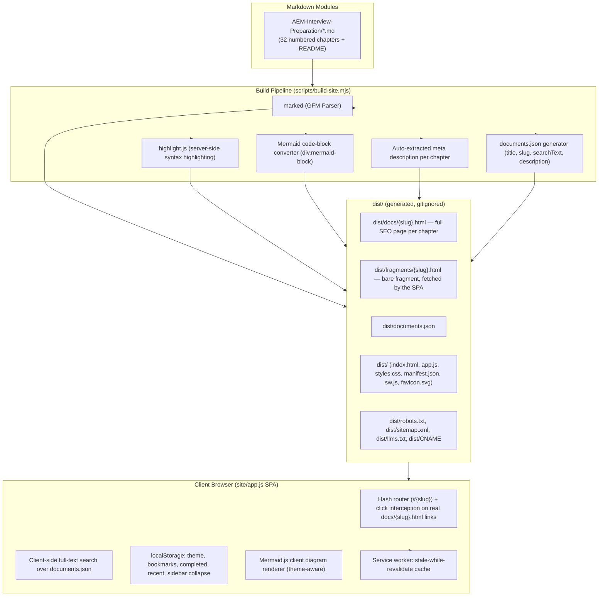

# Project Context & Architecture Specification

> **Project**: AEM Interview Preparation Platform ("AEM Notes")
> **Repository**: [asapaman/aeminterview](https://github.com/asapaman/aeminterview)
> **Target Host Domain**: [docs.kumaraman.in](https://docs.kumaraman.in)
> **Deployment Targets**: GitHub Pages (via GitHub Actions, custom domain through `CNAME`) **and** Vercel (`vercel.json`) — both build from the same `dist/` output, so either can serve the site.
> **Primary Use Case**: A public, indexable, interactive study platform and field guide for AEM developer technical interview prep, installable as a PWA.

---

## 🧭 Executive Summary

This repository is a **zero-dependency-at-runtime static study web application** built on top of a single Markdown curriculum — 32 numbered chapters (the 27-point core syllabus, a supplementary set, and a master cheat sheet) plus a `README.md`, 34 chapters in total. A Node build script compiles every `.md` file into **two outputs per chapter**: a full, standalone, SEO-indexable HTML page (real `<title>`, meta description, canonical URL, Open Graph/Twitter tags, JSON-LD) under `dist/docs/`, and a bare content fragment under `dist/fragments/` that the interactive SPA fetches for its own in-app rendering. A small vanilla-JS SPA in `site/` serves the same content with full-text search, a flat chapter sidebar, reading-progress tracking, bookmarks, completion tracking, dark/light themes, Mermaid diagram rendering, and offline support via a service worker.

---

## 🏗️ System Architecture & Workflow



---

## 💻 Tech Stack & Dependencies

| Layer | Technology / Library | Purpose |
| :--- | :--- | :--- |
| **Language Runtime** | Node.js (ESM, `.mjs`) | Build script and local dev server — no framework, no bundler |
| **Parser & Markdown** | [`marked`](https://www.npmjs.com/package/marked) v16.4.2 | GFM Markdown → HTML at build time |
| **Syntax Highlighting** | [`highlight.js`](https://www.npmjs.com/package/highlight.js) v11.12.0 | Server-side highlighting baked into the HTML at build time (no client-side highlighter shipped) |
| **Diagramming** | [Mermaid.js](https://mermaid.js.org/) v11.17.2 (CDN, `jsdelivr`, pinned + SRI) | Diagram rendering, both in the SPA and on standalone chapter pages |
| **Frontend Core** | Vanilla HTML5 / ES6 / CSS3 | Single `app.js`, single `styles.css`, no framework, no build step for the client |
| **Typography** | Google Fonts (`Manrope`, `DM Mono`) | Preconnected + preloaded, on both the SPA shell and standalone pages |
| **PWA** | `manifest.json` + `sw.js` (hand-written service worker) | Installable app shell, offline access to previously visited chapters |
| **SEO / GEO** | Per-chapter meta description, canonical URLs, Open Graph/Twitter cards, JSON-LD (`TechArticle`/`WebSite`), `sitemap.xml`, `llms.txt` | Chapters are indexable as real, unique, citable pages — not just app states behind a hash |
| **Deployment** | GitHub Actions → GitHub Pages (`deploy-docs.yml`), and Vercel (`vercel.json`) | Two independent, parallel deploy paths from the same `dist/` build |

There are **no runtime frontend dependencies** shipped by npm — `marked` and `highlight.js` are build-time only. Mermaid and Google Fonts are loaded client-side from a CDN, pinned to an exact version with a Subresource Integrity hash for Mermaid.

---

## 📁 Repository Structure

```
.
├── AEM-Interview-Preparation/     # 32 numbered chapters (00–31, two files share "01") + README.md
│   ├── 00-Master-Cheatsheet.md                    # every core file's Cheat Sheet, in one place
│   ├── 01-AEM-Architecture.md                     # dense v1 draft, kept for comparison
│   ├── 01-AEM-Architecture-v2-teaching-style.md   # chosen teaching-style version
│   ├── 02 … 31                                    # core syllabus (02–18), supplementary (19–26),
│   │                                               #   testing/quality/security/Java/system design (27–31)
│   └── README.md                                  # repo index + 30/60/90-day study plan
├── scripts/
│   ├── build-site.mjs             # compiles AEM-Interview-Preparation/ into dist/ (SEO pages, fragments,
│   │                               #   documents.json, sitemap.xml, llms.txt, robots.txt)
│   └── serve-site.mjs             # zero-dependency local HTTP server, auto-increments port on conflict
├── site/                          # SPA source, copied verbatim into dist/ at build time
│   ├── index.html                 # app shell — meta description, canonical, OG/Twitter, WebSite JSON-LD
│   ├── app.js                     # router, search, sidebar, study tools, PWA registration
│   ├── styles.css                 # design tokens, light/dark themes, standalone-page styles, print rules
│   ├── theme-init.js              # no-flash theme bootstrap (external file, so CSP needs no 'unsafe-inline')
│   ├── mermaid-init.js            # Mermaid init for standalone chapter pages (same CSP reason)
│   ├── manifest.json              # PWA manifest ("AEM Notes", standalone display)
│   ├── sw.js                      # service worker (stale-while-revalidate + offline fallback)
│   └── favicon.svg                # brand mark, also used as PWA icon
├── .github/workflows/deploy-docs.yml   # CI: build → upload-pages-artifact → deploy to GitHub Pages
├── vercel.json                    # alternate deploy target: security headers + CSP + X-Robots-Tag: index, follow
├── package.json                   # scripts: build / start / dev
└── dist/                          # generated output, gitignored — never edit directly
    ├── docs/{slug}.html           # full standalone SEO page per chapter (crawlable, linkable, shareable)
    ├── fragments/{slug}.html      # bare rendered-markdown fragment per chapter (SPA fetches these)
    ├── documents.json, sitemap.xml, llms.txt, robots.txt, CNAME
```

**Note:** `AEM-Interview-Preparation/` is the only source-of-truth content directory. Everything under `dist/` is regenerated on every `npm run build` and is excluded from git (`.gitignore`: `node_modules/`, `dist/`). **`dist/docs/` and `dist/fragments/` are not interchangeable** — the former is a full HTML document meant to be indexed and opened directly; the latter is an unstyled fragment meant only to be fetched by `app.js` and dropped into `#article`. Pointing the SPA's fetch at `docs/` (or a crawler at `fragments/`) is the specific mistake to avoid if this pipeline is ever touched again.

---

## ⚙️ Key Application Features

### 1. Build Pipeline (`scripts/build-site.mjs`)
- Reads every `.md` file in `AEM-Interview-Preparation/`, sorted numerically (`localeCompare` with `numeric: true`) so `00`, `01`, `02`, … order correctly.
- Title is extracted from the first `# Heading` in each file; a meta description is auto-extracted as the first substantial rendered `<p>` that isn't the metadata blockquote (Target/Syllabus/Project domain line), truncated to ~157 characters with proper HTML-entity decoding (not blanked to spaces).
- Each document record (`{ file, slug, title, number, searchText, description }`) is written to `dist/documents.json`; `searchText` is the **entire lower-cased source file**, which is what makes full-text search work but is also why `documents.json` is large (megabytes, not kilobytes) — a known tradeoff, not a bug.
- Custom `marked` renderer: fenced ` ```mermaid ` blocks become `<div class="mermaid mermaid-block">`; every other fenced code block is run through `highlight.js` (falls back to `plaintext` if the language isn't registered) and wrapped in `<div class="code-wrapper" data-lang="...">` for the copy-button UI.
- For each chapter, writes **two files**: `dist/docs/{slug}.html` (a complete standalone document — title, description, canonical, OG/Twitter, `TechArticle` JSON-LD, the site's own stylesheet and fonts, a header linking back to the interactive app, prev/next pager, and the site footer) and `dist/fragments/{slug}.html` (just the rendered markdown body, no wrapper document at all).
- Wipes and rewrites `dist/` on every run, copies `site/` into `dist/` verbatim, then writes `dist/CNAME` (`docs.kumaraman.in`), `dist/robots.txt` (`Allow: /` plus a `Sitemap:` directive — the site is intentionally indexable), `dist/sitemap.xml` (homepage + every chapter page), and `dist/llms.txt` (a plain-markdown index of every chapter with its title, URL, and description, for LLM/AI-crawler discovery — the GEO-friendly counterpart to a sitemap).

### 2. Local Dev Server (`scripts/serve-site.mjs`)
- Dependency-free `node:http` static file server over `dist/`.
- Blocks path traversal by resolving the requested path and checking it's `dist/` itself or a true descendant (`dist/` + separator) — a bare `startsWith(root)` check would also match a sibling directory whose name happens to start with `dist`.
- Falls back to `dist/index.html` for unknown paths (SPA-style), and to a plain 404 if even that can't be read.
- Default port `4173`, auto-increments on `EADDRINUSE` so multiple runs don't collide.

### 3. Client SPA (`site/app.js`)
- **Hash router**: `#{slug}` (no `doc-` prefix) drives `loadDocument`, wired to both the initial load and a `hashchange` listener so link clicks, the pager, and browser back/forward all navigate correctly; empty hash shows the `#welcome` screen.
- **Real, crawlable internal links with SPA interception**: every chapter link (sidebar, pager, home panel) has a genuine `href="docs/{slug}.html"` pointing at the real standalone page — so a crawler, a middle-click, or a no-JS visitor gets a real page — plus `data-nav-slug`, which a single delegated `click` listener intercepts on an ordinary left-click to route instantly through the hash-based SPA instead of a full navigation.
- **Flat sidebar navigation**: every chapter is a single `<a>` in `#document-nav`, numbered and title-cleaned, with an `active` class on the current chapter — no grouping or accordion, just a plain scrollable list.
- **Collapsible sidebar**: a toggle collapses the whole sidebar to an icon rail on desktop (`aem-notes-sidebar-collapsed` in `localStorage`), independent of anything content-related.
- **Sidebar progress panel**: shows `% (completed/total)` across all chapters using the same `aem-notes-completed` list as the per-chapter "Mark complete" button.
- **Full-text search**: filters `state.documents` by title or `searchText` on every keystroke; `Esc` clears the query, `/` focuses the search box from anywhere.
- **Study tools per chapter**: bookmark (`aem-notes-saved`), mark complete (`aem-notes-completed`), reading-progress bar (scroll-position based), "recent" history of the last 3 chapters opened (`aem-notes-recent`) surfaced on the home screen as "Continue where you left off".
- **Table of Contents**: built from `h2`/`h3` in the rendered article, scroll-synced to highlight the current section.
- **Loading state**: `loadDocument` shows a `.loading-note` placeholder and dims the reader chrome (action buttons, TOC, pager) while the chapter's fragment is being fetched, rather than revealing empty chrome first — plus a stale-response guard (`if (currentDoc !== doc) return`) so rapid navigation between chapters can't let an old fetch overwrite a newer one.
- **Copy-to-clipboard** on every code block, and Mermaid diagram rendering (theme-aware — re-initializes on dark/light toggle).
- **Scroll-to-top and scroll-to-bottom floating buttons**, both recalculated on scroll, resize, and immediately after a chapter loads.
- **Keyboard shortcuts**: `/` focus search, `D` toggle theme, `←`/`→` previous/next chapter, `Esc` clear search.
- **PWA registration**: on `load`, registers `sw.js` if `serviceWorker` is supported (silently no-ops on failure, e.g. in browsers/contexts that block it).
- **`app.js` and the Mermaid `<script>` are both `defer`red** — loading Mermaid (a multi-MB CDN script) without `defer` would block `app.js` from executing at all until it finished, which was a real, noticeable first-load lag before this was fixed.

### 4. Offline Support (`site/sw.js`)
- Cache name `aem-notes-v2`; precaches the app shell (`index.html`, `styles.css`, `app.js`, `theme-init.js`, `documents.json`, `manifest.json`, `favicon.svg`) on install.
- Runtime strategy is **stale-while-revalidate**: serve from cache immediately if present while refetching in the background to update the cache; if nothing is cached, fetch from network and cache the response.
- Old cache versions are purged on `activate` (anything not matching `CACHE_NAME`).
- Offline HTML navigation falls back to the cached `index.html`.

### 5. SEO / GEO (Generative Engine Optimization)
- **Every chapter is a real, unique, indexable URL** (`docs.kumaraman.in/docs/{slug}.html`), not just a hash fragment on one page — hash fragments alone are invisible to crawlers, so without this, only the homepage could ever be indexed regardless of `robots.txt`.
- Each standalone page carries its own `<title>`, auto-extracted meta description, canonical URL, Open Graph + Twitter Card tags, and a `TechArticle` JSON-LD block (author, description, `isPartOf` the site).
- `sitemap.xml` lists the homepage plus every chapter page; `robots.txt` allows all crawling and points at the sitemap.
- `llms.txt` (at the site root) is a plain-markdown index of every chapter — title, URL, description — specifically for LLM/AI-answer-engine discovery, the GEO-specific counterpart to a traditional sitemap.
- `X-Robots-Tag: index, follow` is set explicitly on Vercel (previously `noindex`), and the SPA shell's `<meta name="robots">` matches.

---

## 🛠️ Development & Deployment Workflow

### Prerequisites
- Node.js (v18+; CI uses Node 22)

### Commands
```bash
npm install        # installs marked + highlight.js (build-time only)
npm run build       # -> dist/
npm start           # build, then serve dist/ locally (default port 4173, auto-increments)
npm run dev          # alias for npm start
```

### Production Deployment (two independent paths, same build)
1. **GitHub Pages** (`.github/workflows/deploy-docs.yml`): on every push to `main`, `npm ci && npm run build`, then `actions/upload-pages-artifact` + `actions/deploy-pages`. The `dist/CNAME` file written by the build script is what points GitHub Pages at `docs.kumaraman.in`. GitHub Pages cannot set custom response headers, which is exactly why the CSP and robots directives are duplicated as `<meta>` tags in every page (SPA shell and standalone chapter pages alike) rather than relying on headers alone.
2. **Vercel** (`vercel.json`): `buildCommand: npm run build`, `outputDirectory: dist`, plus header rules for `X-Robots-Tag: index, follow`, `X-Frame-Options: DENY`, `X-Content-Type-Options: nosniff`, `Referrer-Policy`, and a `Content-Security-Policy` (mirroring the meta-tag CSP, plus `frame-ancestors 'none'`, which only a real header can enforce).

Both targets consume the identical `dist/` output, so there is no drift between them by construction — whichever DNS/CDN is actually live for `docs.kumaraman.in` at a given time is the one serving traffic.

---

## 🔒 Governance & Content Guidelines
- **Curriculum integrity**: content under `AEM-Interview-Preparation/` follows a locked writing style and structure — see [[project_aem_interview_repo]] memory for the full template, the energy-sector project domain used in every example, and the standing rule that the real client name is never used.
- **Zero framework dependency**: `site/` must stay vanilla (`fetch`, `localStorage`, native Service Worker API) — no client-side framework or bundler.
- **`dist/` is generated, never hand-edited** — it's gitignored precisely so edits always go through `AEM-Interview-Preparation/` or `site/`, then a rebuild.
- **Public and indexable by design**: as of the SEO/GEO pass, the site is meant to be found — `robots.txt`, the Vercel header, and every page's meta tags all say `index, follow`. If this is ever meant to go private again, all three need to change together (meta tags, `robots.txt` generation in `build-site.mjs`, and the Vercel header), not just one of them.
- **No inline `<script>` tags anywhere** — the CSP's `script-src` intentionally has no `'unsafe-inline'`. Any small bootstrap script (theme init, Mermaid init) must be its own external file (`theme-init.js`, `mermaid-init.js`) rather than inlined, or it will be silently blocked.
- **Single curriculum**: a Java curriculum and a category-grouped sidebar existed briefly in an uncommitted working state but were removed — the sidebar is intentionally a flat list over one content directory. Don't reintroduce multi-category navigation without an explicit request.
