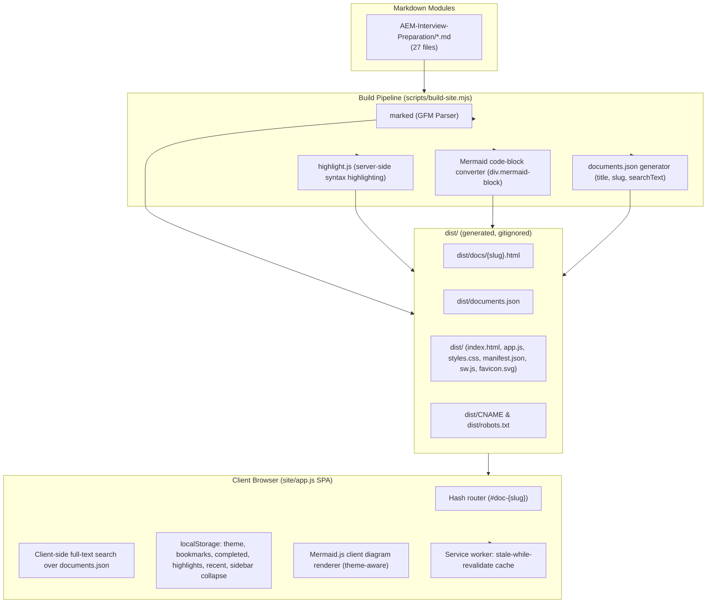

# Project Context & Architecture Specification

> **Project**: AEM Interview Preparation Platform ("AEM Notes")
> **Repository**: [asapaman/aeminterview](https://github.com/asapaman/aeminterview)
> **Target Host Domain**: [docs.kumaraman.in](https://docs.kumaraman.in)
> **Deployment Targets**: GitHub Pages (via GitHub Actions, custom domain through `CNAME`) **and** Vercel (`vercel.json`) — both build from the same `dist/` output, so either can serve the site.
> **Primary Use Case**: Interactive study platform and field guide for AEM developer technical interview prep, installable as a PWA.

---

## 🧭 Executive Summary

This repository is a **zero-dependency-at-runtime static study web application** built on top of a single Markdown curriculum — the 27-file AEM developer interview prep set. A Node build script compiles every `.md` file into pre-rendered HTML fragments plus a single search index, and a small vanilla-JS SPA in `site/` serves them with full-text search, a flat chapter sidebar, reading-progress tracking, bookmarks, completion tracking, text highlighting, dark/light themes, Mermaid diagram rendering, and offline support via a service worker.

---

## 🏗️ System Architecture & Workflow



---

## 💻 Tech Stack & Dependencies

| Layer | Technology / Library | Purpose |
| :--- | :--- | :--- |
| **Language Runtime** | Node.js (ESM, `.mjs`) | Build script and local dev server — no framework, no bundler |
| **Parser & Markdown** | [`marked`](https://www.npmjs.com/package/marked) v16.2.1 | GFM Markdown → HTML at build time |
| **Syntax Highlighting** | [`highlight.js`](https://www.npmjs.com/package/highlight.js) v11.11.1 | Server-side highlighting baked into the HTML at build time (no client-side highlighter shipped) |
| **Diagramming** | [Mermaid.js](https://mermaid.js.org/) v11 (CDN, `jsdelivr`) | Client-side diagram rendering, re-initialized on theme switch |
| **Frontend Core** | Vanilla HTML5 / ES6 / CSS3 | Single `app.js`, single `styles.css`, no framework, no build step for the client |
| **Typography** | Google Fonts (`Manrope`, `DM Mono`) | Preconnected + preloaded in `index.html` |
| **PWA** | `manifest.json` + `sw.js` (hand-written service worker) | Installable app shell, offline access to previously visited chapters |
| **Deployment** | GitHub Actions → GitHub Pages (`deploy-docs.yml`), and Vercel (`vercel.json`) | Two independent, parallel deploy paths from the same `dist/` build |

There are **no runtime frontend dependencies** — `marked` and `highlight.js` are build-time only (`devDependencies`-equivalent, listed under `dependencies` but never shipped to the browser).

---

## 📁 Repository Structure

```
.
├── AEM-Interview-Preparation/     # 27 AEM curriculum files (01-27, two files share "01")
│   ├── 01-AEM-Architecture.md                 # dense v1 draft, kept for comparison
│   ├── 01-AEM-Architecture-v2-teaching-style.md  # chosen teaching-style version
│   ├── 02 … 25, 27                            # one file per topic, no file 26 yet
├── scripts/
│   ├── build-site.mjs             # compiles AEM-Interview-Preparation/ into dist/ HTML + documents.json
│   └── serve-site.mjs             # zero-dependency local HTTP server, auto-increments port on conflict
├── site/                          # SPA source, copied verbatim into dist/ at build time
│   ├── index.html                 # app shell
│   ├── app.js                     # router, search, sidebar, study tools, PWA registration
│   ├── styles.css                 # design tokens, light/dark themes, print rules (~1200+ lines)
│   ├── manifest.json              # PWA manifest ("AEM Notes", standalone display)
│   ├── sw.js                      # service worker (stale-while-revalidate + offline fallback)
│   └── favicon.svg                # brand mark, also used as PWA icon
├── .github/workflows/deploy-docs.yml   # CI: build → upload-pages-artifact → deploy to GitHub Pages
├── vercel.json                    # alternate deploy target: same npm run build, dist/ output
├── package.json                   # scripts: build / start / dev
└── dist/                          # generated output, gitignored — never edit directly
```

**Note:** `AEM-Interview-Preparation/` is the only source-of-truth content directory. Everything under `dist/` is regenerated on every `npm run build` and is excluded from git (`.gitignore`: `node_modules/`, `dist/`).

---

## ⚙️ Key Application Features

### 1. Build Pipeline (`scripts/build-site.mjs`)
- Reads every `.md` file in `AEM-Interview-Preparation/`, sorted numerically (`localeCompare` with `numeric: true`) so `01`, `02`, … order correctly.
- Title is extracted from the first `# Heading` in each file, stripped of markdown emphasis characters.
- Each document record (`{ file, slug, title, number, searchText }`) is written to `dist/documents.json`; `searchText` is the **entire lower-cased source file**, which is what makes full-text search work but is also why `documents.json` is large (megabytes, not kilobytes) — this is a known tradeoff, not a bug.
- Custom `marked` renderer: fenced ` ```mermaid ` blocks become `<div class="mermaid mermaid-block">`; every other fenced code block is run through `highlight.js` (falls back to `plaintext` if the language isn't registered) and wrapped in `<div class="code-wrapper" data-lang="...">` for the copy-button UI.
- Wipes and rewrites `dist/` on every run (`rm` then `mkdir`), copies `site/` into `dist/` verbatim (this is how `manifest.json`, `sw.js`, `favicon.svg`, `app.js`, `styles.css`, `index.html` end up in the deploy output), then writes `dist/CNAME` (`docs.kumaraman.in`) and `dist/robots.txt` (`Disallow: /` — the whole site is intentionally deindexed, it's a personal study tool, not a public SEO target).

### 2. Local Dev Server (`scripts/serve-site.mjs`)
- Dependency-free `node:http` static file server over `dist/`.
- Blocks path traversal by resolving the requested path and checking it still starts with `dist/`.
- Falls back to `dist/index.html` for unknown paths (SPA-style), and to a plain 404 if even that can't be read.
- Default port `4173`, auto-increments on `EADDRINUSE` so multiple runs don't collide.

### 3. Client SPA (`site/app.js`)
- **Hash router**: `#doc-{slug}` drives `loadDocument`, wired to both the initial load and a `hashchange` listener so link clicks, the pager, and browser back/forward all navigate correctly; empty hash shows the `#welcome` screen.
- **Flat sidebar navigation**: every chapter is a single `<a>` in `#document-nav`, numbered and title-cleaned, with an `active` class on the current chapter — no grouping or accordion, just a plain scrollable list.
- **Collapsible sidebar**: a toggle collapses the whole sidebar to an icon rail on desktop (`aem-notes-sidebar-collapsed` in `localStorage`), independent of anything content-related.
- **Sidebar progress panel**: shows `% (completed/total)` across all chapters using the same `aem-notes-completed` list as the per-chapter "Mark complete" button.
- **Full-text search**: filters `state.documents` by title or `searchText` on every keystroke; `Esc` clears the query, `/` focuses the search box from anywhere.
- **Study tools per chapter**: bookmark (`aem-notes-saved`), mark complete (`aem-notes-completed`), reading-progress bar (scroll-position based), "recent" history of the last 3 chapters opened (`aem-notes-recent`) surfaced on the home screen as "Continue where you left off".
- **Table of Contents**: built from `h2`/`h3` in the rendered article, scroll-synced to highlight the current section.
- **Copy-to-clipboard** on every code block, and Mermaid diagram rendering (theme-aware — re-initializes on dark/light toggle).
- **Keyboard shortcuts**: `/` focus search, `D` toggle theme, `←`/`→` previous/next chapter, `Esc` clear search.
- **PWA registration**: on `load`, registers `sw.js` if `serviceWorker` is supported (silently no-ops on failure, e.g. in browsers/contexts that block it).

### 4. Offline Support (`site/sw.js`)
- Cache name `aem-notes-v1`; precaches the app shell (`index.html`, `styles.css`, `app.js`, `documents.json`, `manifest.json`, `favicon.svg`) on install.
- Runtime strategy is **stale-while-revalidate**: serve from cache immediately if present while refetching in the background to update the cache; if nothing is cached, fetch from network and cache the response.
- Old cache versions are purged on `activate` (anything not matching `CACHE_NAME`).
- Offline HTML navigation falls back to the cached `index.html`.
- **Note:** because `documents.json` is precached at install time, users who install the PWA before new chapters are added won't see them until the service worker's background refetch updates that specific cache entry (it isn't a hard version-gated cache-bust — bumping `CACHE_NAME` on content-shape changes is the safety valve if this ever causes stale content complaints).

---

## 🛠️ Development & Deployment Workflow

### Prerequisites
- Node.js (v18+; CI uses Node 22)

### Commands
```bash
npm install        # installs marked + highlight.js (build-time only)
npm run build       # -> dist/
npm start           # build, then serve dist/ locally (default port 4173, auto-increments)
npm run dev          # alias for npm start
```

### Production Deployment (two independent paths, same build)
1. **GitHub Pages** (`.github/workflows/deploy-docs.yml`): on every push to `main`, `npm ci && npm run build`, then `actions/upload-pages-artifact` + `actions/deploy-pages`. The `dist/CNAME` file written by the build script is what points GitHub Pages at `docs.kumaraman.in`.
2. **Vercel** (`vercel.json`): `buildCommand: npm run build`, `outputDirectory: dist`, plus a header rule sending `X-Robots-Tag: noindex, nofollow, noarchive, nosnippet` on every route — belt-and-suspenders with `robots.txt` to keep this out of search results.

Both targets consume the identical `dist/` output, so there is no drift between them by construction — whichever DNS/CDN is actually live for `docs.kumaraman.in` at a given time is the one serving traffic.

---

## 🔒 Governance & Content Guidelines
- **Curriculum integrity**: content under `AEM-Interview-Preparation/` follows a locked writing style and structure — see [[project_aem_interview_repo]] memory for the full template, the energy-sector project domain used in every example, and the standing rule that the real client name is never used.
- **Zero framework dependency**: `site/` must stay vanilla (`fetch`, `localStorage`, `TreeWalker`/`Selection` for highlighting, native Service Worker API) — no client-side framework or bundler.
- **`dist/` is generated, never hand-edited** — it's gitignored precisely so edits always go through `AEM-Interview-Preparation/` or `site/`, then a rebuild.
- **De-indexed by design**: both `robots.txt` and the Vercel header actively tell search engines and crawlers to stay out — this is a personal/shared study tool, not a public SEO property. Don't remove that without deciding it's actually meant to go public.
- **Single curriculum**: a Java curriculum and a category-grouped sidebar existed briefly in an uncommitted working state but were removed — the sidebar is intentionally a flat list over one content directory. Don't reintroduce multi-category navigation without an explicit request.
